>  本文适合Java入门和复习回顾，高级篇请参考导航：
>
> **导航：**
>
> [【Java笔记+踩坑汇总】Java基础+JavaWeb+SSM+SpringBoot+SpringCloud+瑞吉外卖/黑马旅游/谷粒商城/学成在线+设计模式+面试题汇总+性能调优/架构设计+源码](https://blog.csdn.net/qq_40991313/article/details/126646289?csdn_share_tail={"type"%3A"blog"%2C"rType"%3A"article"%2C"rId"%3A"126646289"%2C"source"%3A"qq_40991313"})
>
> **本文最新版本：**
>
> [【Java基础+进阶】Java修仙之路，十万字吐血整理全网最完整Java学习笔记（基础篇2024版）](https://blog.csdn.net/qq_40991313/article/details/134564921)

[TOC]


# 一、JDK下载和hello world

先下载jdk8或11，这个版本最稳定，下面是jdk8的下载链接：[Java Downloads | Oracle](https://www.oracle.com/java/technologies/downloads/#java8-windows)

进入后选择windows64版本exe下载，安装后记得配置环境变量：

此电脑右键-属性-高级系统设置-环境变量： 


```
public class hello{
    public static void main(String[] args){
        System.out.println("fe");
    }
}
```


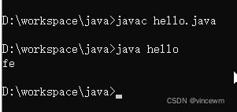

# 二、IDEA

##  2.1 下载安装配置

### **2.1.1 下载地址**

[Other Versions - IntelliJ IDEA](https://www.jetbrains.com/idea/download/other.html)

**建议安装专业版**， 右侧有数据库栏，写sql语句代码补全方便：

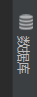

> **注意：所有设置都必须要关闭项目后，再进行设置，这样才是全局设置。**

### **2.1.2 配置**

> **先关闭项目再点击设置**

**编码** 


maven，后面javaweb里用到 

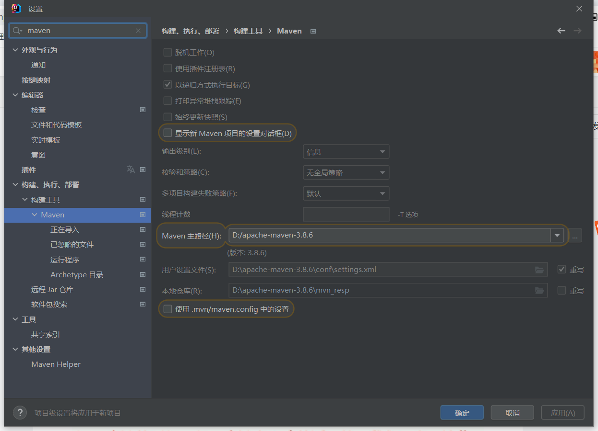 **maven配置依赖和插件后自动刷新**

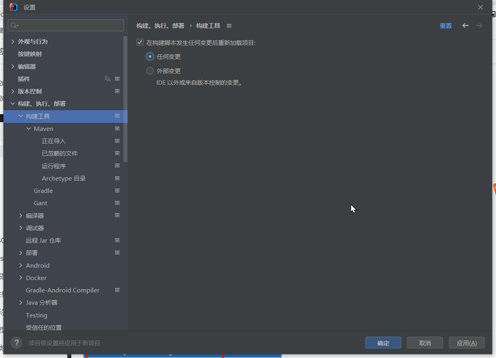


### **2.1.3 安装插件**

- **Chinese(Simplified) Language Pack/中文语言包：**汉化idea
- **Maven helper：**右键Maven模块，会出现打包，编译等选择。
- **MybatisX：**mapper.xml,mapper.java出现小鸟图标，接口定义方法，自动在xml中生成statement语句。
- **Alibaba Java Coding Guidelines：**阿里规约

### 2.1.4 操作

**查看本地历史记录：**

idea是会自动保存各文件历史记录的，右键文件-查看本地历史记录即可：


### **2.1.5 helloword** 

 先创建项目（file-new-project-empty project-起名-finish，SDK开发工具包选JDK11，语言级别也选11）、模块（项目右键-new-module-java-next-起名，SDK开发工具包选JDK11，语言级别也选11）、包（模块下src右键-new-package-起名-ok）、类（包右键new-java class）。

然后psvm回车自动生成静态main方法，sout回车自动生成System.out.println()输出方法。

在当前包内IO流File类创建文件，例如"1.txt"，存的位置是在项目文件夹下，而不是包文件夹下。不确定可查看当前路径：

```java
System.out.println(System.getProperty("user.dir"));
```


 控制台中文乱码，就在设置里把文件编码页都改成utf-8。

导包：import 包名.类名;

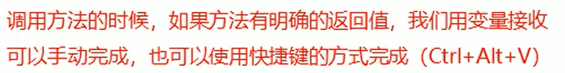


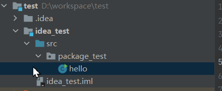

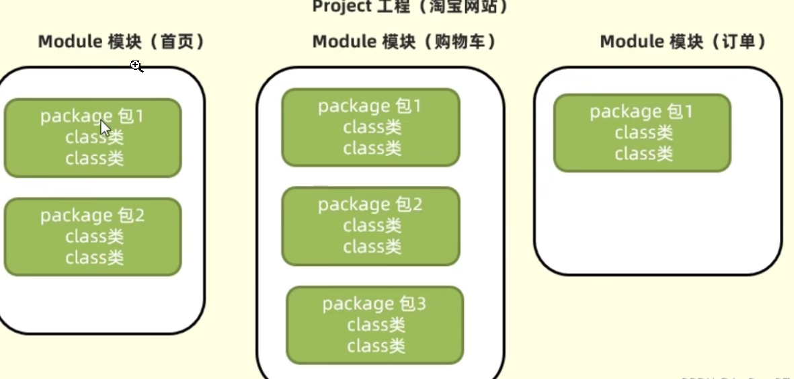


## **2.2 快捷键**

**格式化ctrl+alt+L，**main方法psvm回车，输出sout回车，内容提示ctrl+alt+space。alt+insert生成构造、setget方法。

**Ctrl+Alt+v或.var或.for补全代码：**例如写new Dog();按快捷键会自动补全声明Dog dog=new Dog();或者写new Dog().var回车会自动补全成Dog dog=new Dog();或者写lists.for回车会自动生成for(List<String> list:lists){}

**alt+enter:万能快捷键**。获取警告、报错提示自动改正

**ctrl+r：**替换所有与选中内容相同的文本，出现

**ctrl+b跟进：**或者ctrl+鼠标左键、或者鼠标左键，跟进到该类的定义页面。如果选中的是标识符，可以查找页面内所有该标识符位置。

**alt+左键：整列编辑**

**ctrl+d：复制光标行并粘贴**

**ctrl+x：删除光标行**

**Ctrl+h：查看该类继承关系：**

**ctrl+alt+m：抽取选中代码为方法**


 **Ctrl+f12：查看类中所有方法。**

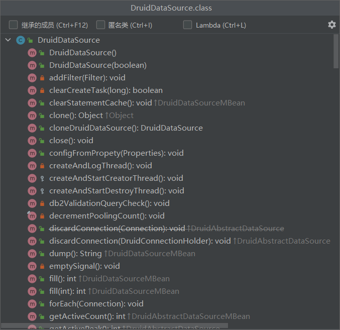


## 2.3 断点调试 

### 2.3.1 断点

普通断点：如果断点打在普通代码行上，点击“debug”会自动运行到该行暂停；

方法断点：如果断点打在方法上，点击“debug”会自动运行到该方法入口处暂停；

接口断点：如果断点打在接口方法，点击“debug”会自动运行到实现类对应方法入口处暂停；

字段断点：如果断点打在字段上，点击“debug”会自动运行到修改此字段的代码行处暂停（可以在断点处右键设置成访问时也暂停）；

### 2.3.2 调试 

打断点后代码运行到这一步会停止：下面红色方框是最常用的两个调试按钮：

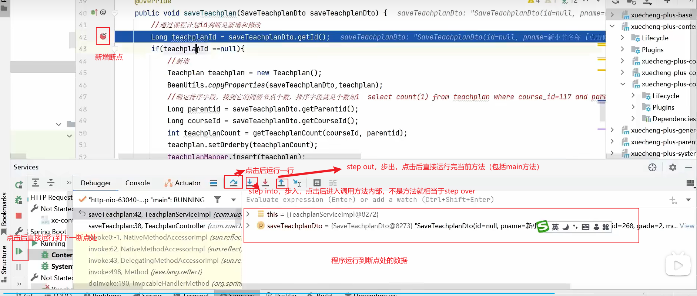


> 蓝色代码行代表此时调试运行到这一行（这一行还没运行），能看到上一行的结果。

> 调试的五个核心图标分别是：
>
> 
>
> 1. **“Step over”：步过。**往下运行一行代码并**跳过**当前方法的调用。
> 2. **“Step into”：步入。**进入方法内部并继续逐行执行。适用于自定义方法或第三方方法，但无法进入JDK方法的内部。注意如果蓝色光标行不是方法，则此按钮相当于step over。
> 3. **“Force step into”：强制步入（不常用）。**强制进入方法的内部，即使常规的"Step into"操作无法进入方法内部时也可以使用。适用于**无法通过常规方式进入的方法**。例如Symtem.out.println()等JDK方法内部。
> 4. **“Step out”：步出。**退出当前方法，即执行完当前方法后返回到调用该方法的位置。注意如果本方法是main方法，则将**直接步出这个main方法**。
> 5. **“Resume Program”：运行到光标处。**继续运行程序直到下一个断点位置或程序结束。可用于暂停状态下的程序恢复运行。

### 2.3.3 退帧 

 **退帧：**回退到此方法被调用之前。

当我们 Debug 从 A 方法进入 B 方法时，通过降帧（退帧）可以返回到调用 B 方法前，这样我们就可以再一次调用 B 方法。

通常用于当我们快执行完 B 方法后，发现某个重要流程被我们跳过了，想再看一下，则此时可以先回退到 A 方法，然后再次进入 B 方法。


### 2.3.4 强制返回

 右键并点击“force return” 后，此方法栈将直接终止，恢复到上个方法栈。

使用场景：需要结束当前断点，并且不希望接下来的程序操作数据库时，使用强制返回。

> **注意：**注意如果点击红色方格或重新调试虽然也是终止，但它其实是运行完剩余代码后再终止。
>
> - 强制返回：接下来的程序将不再继续执行。
> - 终止：接下来的程序将走完，然后再终止程序。

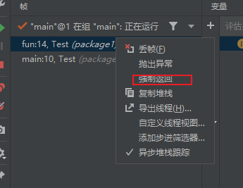

### 2.3.5 stream流调试

在stream流处打断点，debug后点击“trace current stream chain”：

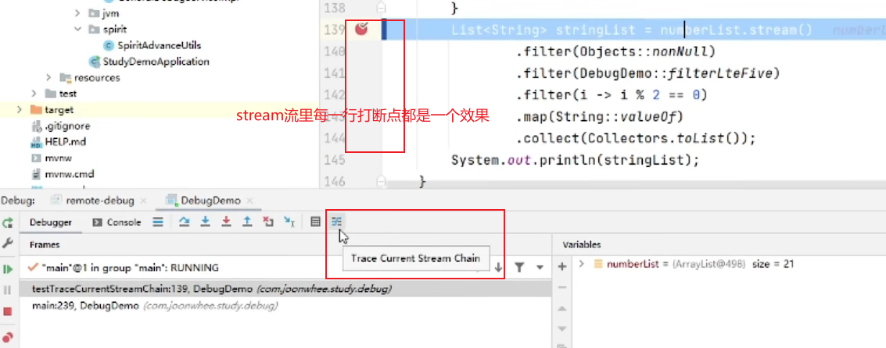


就可以看到整个流式处理的过程：

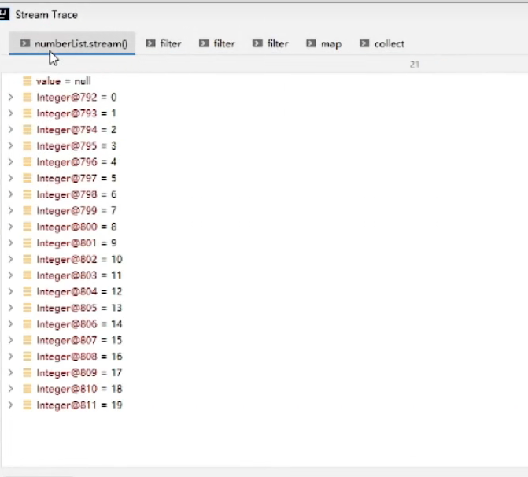


### 2.3.6 评估表达式

在if处打断点，debug后点击“evaluate expression”，可以在评估框下测试另一个分支：

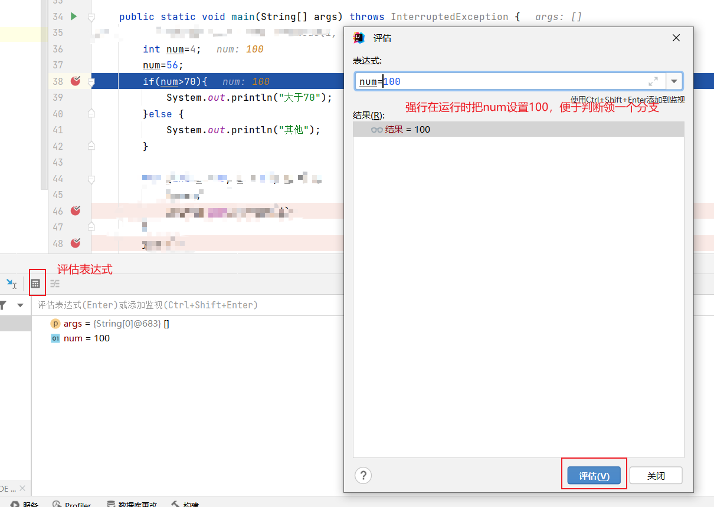


### 2.3.7 多线程调试 

多线程环境，打断点并右键设置Thread或All：

- **Thread：**暂停进入断点的线程，不影响其他线程执行。所有线程依次debug（即你如果给多个线程都加断点，第一个线程debug期间其他线程将保持断点暂停状态）
- **ALL：**暂停全部线程。只debug第一个暂停线程（即你如果给多个线程都加断点，那么只第一个断点对应的线程会正常debug，其他线程会并发运行）

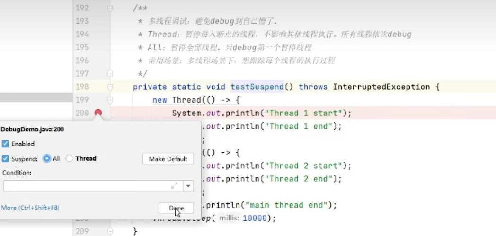


# 三、常用类

## 3.1 Random

```java
import java.util.Random;
public class hello{
	public static void main(String[] args){
		Random r=new Random();
// 生成 0 到 10（不包括10）之间的随机整数
		int num=r.nextInt(10);
		System.out.println(num);
	}
}
```


## 3.2 String

### 3.2.1 概述 

字符串不可变，创建后不可更改。

效果相当于字符数组，底层是字节数组。

```java
//构造
String s1 = "Runoob";              // String 直接创建
String s2 = new String("Runoob");   // String 对象创建
String s3 = s1;                    // 相同引用

int len = s1.length();    //长度


//访问字符
//访问要s1.charAt(0),不能s1[0];

//格式化
String s=String.format("%d",2);
System.out.println(s);


//拼接字符串、数字、字符
s1="我的名字是 ".concat("Runoob");
s2+="abc";
s2+=123;        //字符串+数字，数字会转成字符串
s2+='c';

//根据指定字符串分割
s="1,2,3";
String arr[]=s.split(",");

//字符串翻转要自己写

//数字转String
String s=String.valueOf(12);

//String转数字
int c=Integer.parseInt(s);

//String转Integer转数字
int c=Integer.valueOf(s).intValue();
```


比较

```java
//比较地址
//只要new，就在堆内存开辟空间。直接赋值字符串在常量池里。
        String str1 = "hello";        //常量池里无“hello”对象，创建“hello”对象，str1指向常量池“hello”对象。
//先检查字符串常量池中有没有"hello"，如果字符串常量池中没有，则创建一个，然后 str1 指向字符串常量池中的对象，如果有，则直接将 str1 指向"hello"；
        String str2 = "hello";    //常量池里有“hello”对象，str2直接指向常量池“hello”对象。
        String str3 = new String("hello");   //堆中new创建了一个对象。假如“hello”在常量池中不存在，Jvm还会常量池中创建这个对象“hello”。
        String str4 = new String("hello");
        System.out.println(str1==str2);//true，因为str1和str2指向的是常量池中的同一个内存地址
        System.out.println(str1==str3);//fasle，str1常量池旧地址，str3是new出的新对象，指向一个全新的地址
        System.out.println(str4==str3);//fasle，因为它们引用不同
 
//比较内容
        System.out.println(str4.equals(str3));//true，因为String类的equals方法重写过，比较的是字符串值
```


### 3.2.2 与c++中string不同

java中字符串：一个汉字长度是1，c++中字符串，一个汉字长度是2.

还有很多不同，不能弄混。

## 3.3 StringBuilder

String拼接字符串后原字符串还存在于内存中，浪费内存。

StringBuffer 类的对象能够被多次的修改，并且不产生新的未使用对象，所以涉及到字符串拼接，优先用StringBuffer 。

```java
//构造
        StringBuilder sb= new StringBuilder("abc");

//String转StringBuilder
        sb.append("d").append("e").append("f");

//StringBuilder转String
        String s=sb.toString();

//反转
        sb.reverse();
```


## 3.4 ArrayList

### 3.4.1 概述 

可以动态修改的数组，没有固定大小的限制。

```java
import java.util.ArrayList;

public class RunoobTest {
    public static void main(String[] args) {
        ArrayList<String> sites = new ArrayList<String>();
        sites.add("Google");
        sites.add("Runoob");
        sites.add("Taobao");
        sites.add("Weibo");
        System.out.println(sites);        //[Google, Runoob, Taobao, Weibo]
        System.out.println(sites.get(1));  // 访问第二个元素Runoob
        sites.set(2, "Wiki"); // 第一个参数为索引位置，第二个为要修改的值
        sites.remove(3); // 删除第四个元素
        System.out.println(sites.size());//计算大小

    }
}
```


### 3.4.2 ArrayList学生管理系统

要点：直接退出程序System.exit(0);修改学生时没查成功提示失败，成功提示成功,方法是静态。查找id时查到break；id如果是int型，之后要用(char)System.in.read()接收空格或回车.

可优化：学号不存在和学号重复，加入地址、成绩、年龄等其他信息，查询制表。

```java
//StudentManager.java
package package_test;

import java.util.Scanner;
import java.util.ArrayList;

public class StudentManager {
    public static void main(String args[]) {
        Scanner sc=new Scanner(System.in);
        ArrayList<Student> al = new ArrayList<>();
        while (true) {
            System.out.println("1增加学生，2删除学生，3修改学生，4查询学生，5退出系统");

            int choose = sc.nextInt();
            switch (choose) {
                case 1:
                    add(al);
                    break;
                case 2:
                    delete(al);
                    break;
                case 3:
                    update(al);
                    break;
                case 4:
                    search(al);
                    break;
                default:
                    System.exit(0);
            }
        }
    }

    public static void add(ArrayList<Student> al) {      //必须是静态方法，否则报错
        System.out.println("input id:");
        Scanner sc = new Scanner(System.in);
        Student child = new Student();
        String id = sc.nextLine();
        child.setId(id);
        System.out.println("input name: ");
        String name = sc.nextLine();
        child.setName(name);
        al.add(child);
    }

    public static void search(ArrayList<Student> al) {
        if (al.size() == 0) System.out.println("no information");
        Scanner sc = new Scanner(System.in);
        for (int i = 0; i < al.size(); i++) System.out.println(al.get(i).getId() + " " + al.get(i).getName());
    }

    public static void update(ArrayList<Student> al) {
        System.out.println("input id");
        Scanner sc = new Scanner(System.in);
        Student child = new Student();
        child.setId(sc.nextLine());
        System.out.println("Please enter the modified name");
        child.setName(sc.nextLine());
        int find = 0;
        for (int i = 0; i < al.size(); i++) {
            if (al.get(i).getId().equals(child.getId())) {
                find = 1;
                al.set(i, child);
                break;
            }
        }
        if (find == 0) {
            System.out.println("not found");
        } else {
            System.out.println("successful");
        }
        search(al);
    }

    public static void delete(ArrayList<Student> al) {
        System.out.println("input id");
        Scanner sc = new Scanner(System.in);
        String ipt = sc.nextLine();
        for (int i = 0; i < al.size(); i++) {
            if (al.get(i).getId().equals(ipt)) {
                System.out.println("successful");
                al.remove(i);
                return;

            }
        }
        System.out.println("not exsit");
        search(al);
    }
}
```


```java
//Student.java
package package_test;

public class Student {
    private String id;
    private String name;

    public Student(String id, String name) {
        this.name = name;
        this.id = id;
    }

    public Student() {

    }

    public String getId() {
        return id;
    }

    public void setId(String id) {
        this.id = id;
    }

    public String getName() {
        return name;
    }

    public void setName(String name) {
        this.name = name;
    }
}
```


## 3.5 Math

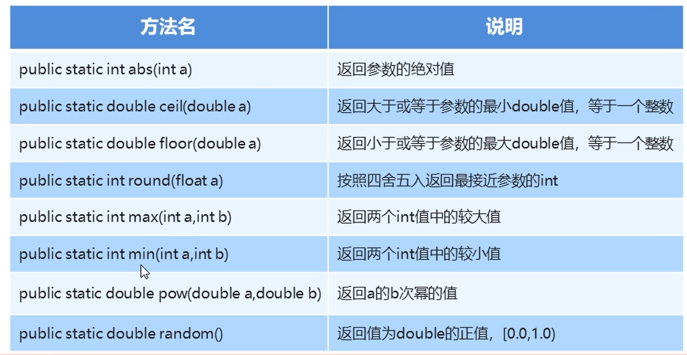


## 3.6 Object类

所有类都间接或直接继承自该类。

自动重写toString()和equlas()：在类中ctrl+insert。不重写默认比较地址。

```java
    public boolean equals(Object o) {
        if (this == o) return true;        //地址相同直接true
        if (o == null || getClass() != o.getClass()) return false;    //是否空或者不来自于同一个类

        Dog dog = (Dog) o;

        return weight == dog.weight;
    }

    @Override
    public int hashCode() {
        return weight;
    }

    @Override
    public String toString() {
        return "Dog{" +
                "weight=" + weight +
                '}';
    }
```


## 3.7 System

System类不能被实例化，要通过类名调用方法。

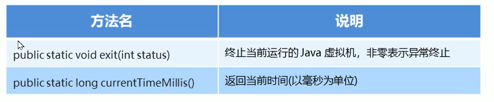

 **练习：**获取for循环十万次的运行时长。

```java
public class Test {
    public static void main(String[] args) {
        long start=System.currentTimeMillis();
        for(int i=0;i<100000;i++){}
        long end=System.currentTimeMillis();
        System.out.println("for循环十万次的运行时长:"+(end-start)+"毫秒");
    }
}
```


结果：


## 3.8 Arrays

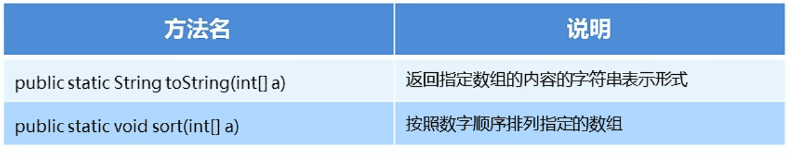


## 3.9 Integer

java.lang包下。

基本数据类型封装成对象好处是：可以有更多的方法操作改数据。

```java
//装箱：基本数据类型转为包装类
        Integer a=Integer.valueOf(32);
        Integer a2=32;

//拆箱：包装类转为基本数据类型
        int b=a.intValue();

//数字转String
String s=String.valueOf(12);

//String转数字
int c=Integer.parseInt(s);

//String转Integer转数字
int c=Integer.valueOf(s).intValue();
```


## 3.10 Date类

getTime() 获取从1970年1月1日 0时0分0秒到此刻毫秒值

setTime() 自定义设置毫秒值

after()
 判断某个日期是否在指定日期之后

before()
 判断某个日期是否在指定日期之前

a.compareTo(b)
 对两个日期进行比较
 如果a时间在b之后，则返回1
 如果a时间在b之前，则返回-1
 如果a==b，则返回0

```java
        Date date=new Date();
        date.setTime(234);
        System.out.println(date.getTime());    //输出234
```


## 3.11 SimpleDateformat

为了格式化输出日期。

```java
    public static void main(String[] args) throws ParseException {    //throws只是把异常抛出，延迟处理。用trycatch处理比较好
        //Date转String
        Date d=new Date();
        SimpleDateFormat sdf=new SimpleDateFormat("yyyy年MM月dd日 HH:mm:ss");
        String str=sdf.format(d);
        System.out.println(str);
        //String转Date
        d=sdf.parse(str);
        System.out.println(d);
    }
```


## 3.12 Scanner

```java
import java.util.Scanner;
public class hello{
	public static void main(String[] args){
		Scanner sc=new Scanner(System.in);
		int i=sc.nextInt();        //nextLine()是带空格的一行字符串
		System.out.println(i);
	}
}

next() 不能得到带有空格的字符串，nextLine()可以。
//注意：nextInt接下来nextLine，字符串会直接读取输入的数字之后的空格、回车，例如输入23回车，结果a的值是回车。
//int b=sc.nextInt();String a=sc.nextLine();
```


# 四、基本数据类型

java的八大基本数据类型分别是：

- 1、整型的byte、short、int、long；
- 2、字符型的char；
- 3、浮点型的float、double；
- 4、布尔型的boolean。 

# 五、数组

```java
//定义数组
int []a;
int b[];
int[][] x,y;//x和y都是二维数组
int[] z,t[];//z是一维数组，t是二维数组

//初始化，栈内存存储局部变量，使用后立即消失。new申请堆内存空间，使用后会在垃圾回收期空闲时回收
int d[]=new int[3];//动态初始化
int c[]={1,2,3};//或int c[]=new int[]{1,2,3};静态初始化

//直接输出数组会输出地址
System.out.println(a);    //[I@5b444398
//数组转字符串
System.out.println(Arrays.toString(c));    //[1, 2, 3]

//多数组指向相同堆内存，改动e内容后，c内容也会改变
int e[]=c;
```


# 六、方法

## 6.1 重载

### 6.1.1 概念

重载（Overload）：指**一个类中**可以有多个方法具有**相同的方法名**，但这些方法的**参数类型不同、个数不同、顺序不同**。

> **注意：**方法返回值和[访问修饰符](https://so.csdn.net/so/search?q=访问修饰符&spm=1001.2101.3001.7020)可以不同。

示例： 

```java
public class hello {
    public static void main(String args[]) {
        f();

    }

    public static void f() {

        System.out.println("3f");
    }

    public static void f(int a) {        //重载，注意返回值同，参数不同

        System.out.println(a);
    }
//    下面两个注释的方法就不是重载，会报错
//    public static int f(){    //返回值不同
//        System.out.println("hello");
//    }
//    void f(){    //修饰符不同
//        return 666;
//    }
}
```


### 6.1.2 可变参数

(int... a)是将所有int参数封装到a数组里。

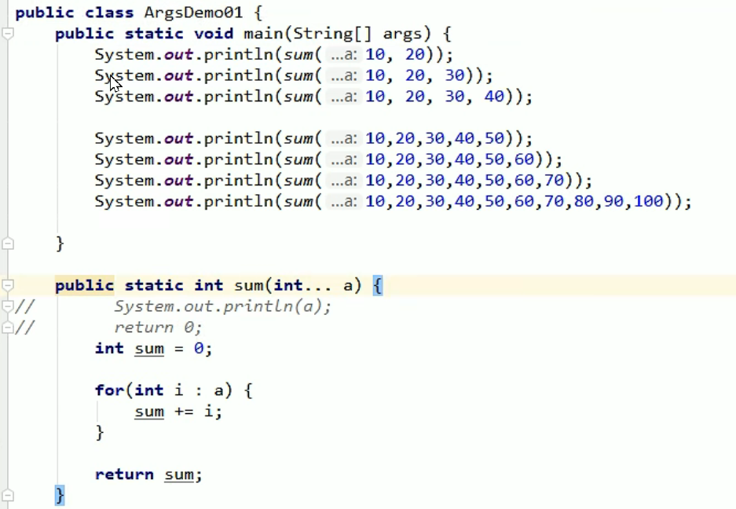

 注意可变参数要放在后面。例如(int a,int... b)正确，(int... a,int b)会报错。

## 6.2 构造方法

```java
public class Phone {

    public Phone() {
        System.out.println("hhh");//创建对象时会直接运行构造方法
    }
}
```


# 七、修饰符

## 7.1 访问权限修饰符，**public** **protected** **default** **private** 


- **public** : 对所有类可见。使用对象：类、接口、变量、方法
- **protected** : 对同包可见、对不同包子类可见。使用对象：变量、方法。 **注意：不能修饰类（外部类）**。
- **default** : 同包可见。使用对象：类、接口、变量、方法。
- **private** : 在同一类内可见。使用对象：变量、方法。 **注意：不能修饰类（外部类）**


| 修饰符      | 当前类 | 同一包内 | 子孙类(同一包) | 子孙类(不同包)                                               | 其他包 |
| ----------- | ------ | -------- | -------------- | ------------------------------------------------------------ | ------ |
| `public`    | Y      | Y        | Y              | Y                                                            | Y      |
| `protected` | Y      | Y        | Y              | Y/N（[说明](https://www.runoob.com/java/java-modifier-types.html#protected-desc)） | N      |
| `default`   | Y      | Y        | Y              | N                                                            | N      |
| `private`   | Y      | N        | N              | N                                                            | N      |

### private

 在同一类内可见，保护成员不被别的类使用。可以修饰变量、方法。 **注意：不能修饰类（外部类）**


```java
public class Phone {
    int price;//成员变量在堆内存
    private int age;

    public void setAge(int a) {
        age = a;
    }
//或者用this
//    public void setAge(int age) {
//        this.age = age;
//    }

    public int getAge() {
        return age;
    }
}


//使用
public class hello {
    public static void main(String args[]) {
        Phone p = new Phone();
        p.setAge(12);
        System.out.println(p.getAge());

    }

}
```


## 7.2 static

静态成员变量被所有对象共享，可用类名调用。局部变量不能被声明为 static 变量。

```java
public class Phone {
    static int price;//成员变量在堆内存
}


//使用
public class hello {
    public static void main(String args[]) {
        Phone.price=4;
        //fun();会报错，静态方法只能访问静态方法或变量。
    }
    public fun(){};
}
```


静态方法只能访问静态变量和方法。非静态方法都可以访问。

静态方法中不能使用 this 关键字，因为在静态方法的局部变量表中并不存在this变量。

## 7.3 abstract

- **一个类不能同时被 abstract 和 final 修饰**，抽象类的唯一目的是为了将来对该类进行***扩充\***。
- **抽象类可以包括抽象方法和非抽象方法，抽象方法只能存在于抽象类中。**
- 非抽象子类必须重写抽象父类中的**所有抽象方法**，抽象子类可以直接继承。

```java
public abstract class Animal{
    abstract void m(); //抽象方法
abstract void n(); //抽象方法
}
 
class Dog extends Animal{    //非抽象子类
     //实现父类所有抽象方法
      void m(){
          .........
      }
      void n(){
          .........
      }
}


abstract class Cat extends Animal{}//抽象子类，不需要重写父抽象类的抽象方法
```


## 7.4 final

- final 变量必须显式指定初始值，不能被重新赋值（非final成员变量都会自动有默认值）。
- final方法不能被子类重写。
- final类不能被继承。
- final引用不能变地址值，可以变地址内容。如final M m=new M();m.age=12;是正确，引用m始终指向对象M的内存地址。

# 八、关键字

## 8.1 this

①**指代当前类中的成员变量、方法**。可以用于方法的形参与成员变量同名时进行区分，

```java
public class Phone {
    private int age;

    public void setAge(int age) {
        this.age = age;
    }

    public int getAge() {
        return age;
    }
}
```


## 8.2 super

指代父类的成员变量、方法。

看懂下面代码基本就能区分this和super

```java
public class Animal { 
    public String name;   
    int age=3; 
    public void eat() {  //吃东西方法的具体实现  } 
    public void sleep() { //睡觉方法的具体实现  } 
} 
//子类 
public class Penguin  extends  Animal{ 
    int age=4;
    public void show(){
        int age=5;
         System.out.println(age);   //5,子类可以访问父类非私有成员变量
        System.out.println(this.age);//4
        System.out.println(super.age);//3
    }
}
```


# 九、面向对象

## 9.1 类和对象

### 9.1.1 概念 

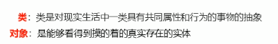

```java
//定义类
public class Phone {
    int price;//对象在堆内存，成员变量便也在堆内存，创建对象时有初始值。

    public void fun() {
        int tmp;//局部变量在栈内存，不赋值就用会报错
        System.out.println("phone");
    }
}
```


```java
//创建对象，建议先写new Phone()然后ctrl+alt+v补全声明
Phone p=new Phone();
```


局部变量必须赋初值，不然会报错。

### 9.1.2 内部类

**内部类：**在一个类中定义类。分为**成员内部类（成员位置），局部内部类（成员方法内），匿名内部类（方法内）。**

**匿名内部类**：一个**继承**了其他类**或者实现**了其他接口的子类对象。

> 内部类可以直接访问外部类私有、公有成员。外部类要访问内部类成员要创建对象。


```java
public class Outer {
    int num=10;
//定义成员内部类：在成员位置定义类
    public class Inner{        //一般private，用外部类访问内部类更安全
        public void show(){
            System.out.println("innershow"+num);    //内部类可直接访问外部类成员。
        }
    }

//外部类访问成员内部类
    public void fun(){        
        Inner in=new Inner();
        in.show();
    }

//局部内部类：在成员方法内定义类
    public void fun2(){
        class Inner2{        //成员内部类不能public和private
            void show(){
                System.out.println("成员内部类");
            }
        }
        Inner2 in=new Inner2();
        in.show();
    }

//匿名内部类：在成员方法内定义子类，实现接口或继承抽象类
    public void fun3(){
        Phone p=new Phone() {            //自己写的Phone接口
            @Override
            public void show() {
                System.out.println("实现接口的匿名内部类");
            }
        };            //注意是一个语句有分号
        p.show();
    }
}


//内部类创建对象（一般内部类私有，使用外部类访问内部类）
public class Test {
    public static void main(String[] args) {
    Outer.Inner i=new Outer().new Inner();
    i.show();
    }
}
```


## 9.2 封装

将类的某些信息隐藏在类的内部，不允许外部程序直接访问。

```java
public class Phone {
    int price;//成员变量在堆内存
    private int age;

    public void setAge(int age) {
       this.age = age;
    }

    public int getAge() {
        return age;
    }
}
```


**好处：**安全性和复用性。

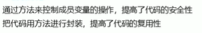

# 十、继承

- **优点：**提高代码复用性，维护性。**缺点：**高耦合性，父类改变子类也会改变。
- **特点：**子类拥有父类非 private 的属性、方法。可以拥有自己的属性和方法，即子类可以对父类进行扩展。可以用自己的方式实现父类的方法。
- **注意：** Java 不支持多继承，但支持多重继承。

> 单继承是子类只能继承一个父类。相对于实现是一个子类可以

- 子类所有构造方法会默认先运行super();

```java
public class Animal { 
    public String name;   
    int age=3; 
    public Animal(String name, int age) { 
        //初始化属性值
    } 
    public void show() {  //吃东西方法的具体实现  } 
    public void sleep() { //睡觉方法的具体实现  } 
} 
//子类 
public class Penguin  extends  Animal{ 
    int age=4;
    public Penguin(){
        super();    //不写也会默认运行
}
@Override        //注解重写，检查重写是否正确。例如修饰符（子类重写方法的访问权限要≥父类）、函数名错误。
    public void show(){    //重写父类中show(),如果去掉public会报错。想再用super.show();
        int age=5;
         System.out.println(age);   //5,子类可以访问父类非私有成员变量
        System.out.println(this.age);//4
        System.out.println(super.age);//3
    }
}
```


使用 implements 关键字可以变相的使java具有多继承的特性

```java
public interface A {
    public void eat();
    public void sleep();
}
 
public interface B {
    public void show();
}
 
public class C implements A,B {
}
```


# 十一、多态

 **接口引用指向实现类对象**

多态最常用的是接口引用指向实现类对象，这样当之后程序需要更新时候，只需要修改new后面的实现类即可，左边就不用修改了，从而降低耦合。

在Spring框架中，甚至可以通过配置或注解连实例化的new也不用了，从而更高层次的降低耦合。

**示例：**

```java
List<String> a=new ArrayList<String>();
```


这样写的话，等号右边换成*Vector 或 LinkedList* 时，就可以很少修改代码量，降低耦合。

**向上转型：**

向上转型：父类引用指向子类对象。编译看左边（调用子类特有变量、方法会报错），运行看右边（优先运行子类重写后的方法）。

```java
Animal a=new Cat();
```


**向下转型：** 

向下转型：子类引用指向父类对象。编译看右边，运行看右边。

```java
    public static void main(String[] args) {
                
      Animal a = new Cat();  // 向上转型  
      a.eat();               // 调用的是 Cat 的 eat
      Cat c = (Cat)a;        // 向下转型  
      c.work();        // 调用的是 Cat 的 work
  } 
```


# 十二、接口

抽象类是对事物的抽象，如动物类，小狗类，接口是对行为的抽象，如吃饭类、睡觉类。

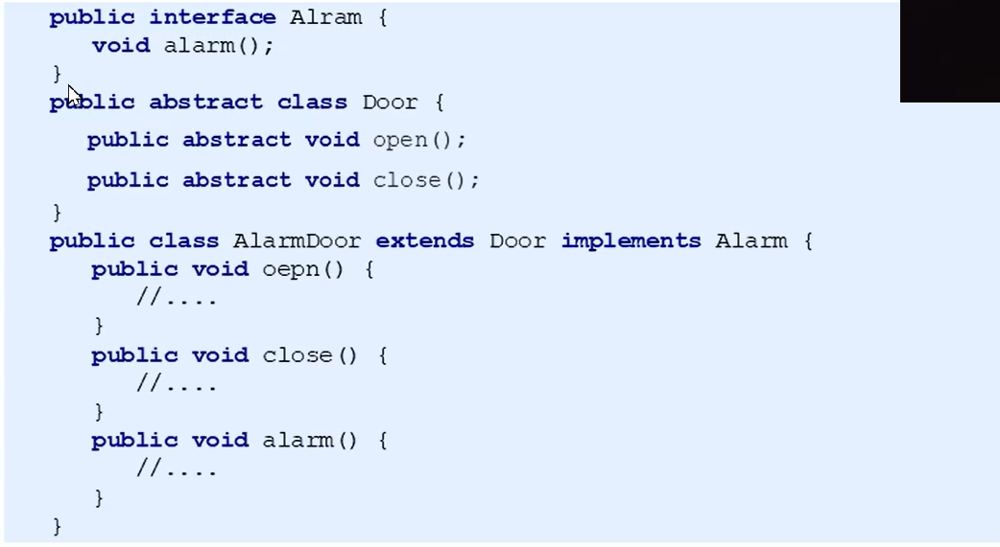


除非实现接口的类是抽象类，否则该类要定义接口中的所有方法。

- 接口没有构造方法。
- 接口中的方法会被隐式的指定为 **public abstract方法，不能定义静态方法**。
-  接口中的变量会被隐式的指定为 **public static final** 变量，不能定义私有成员。因为是final所以也要显式赋初值。
- 接口和接口多继承，接口和类多实现。

```java
public interface Phone {
     public static final int price=4;    //修饰符可省略
     public abstract void show();        //修饰符可省略
}


public class PhoneImpl implements Phone{
    public void show(){        //必须是public，否则报错
        System.out.println("hello");
    }
}
```


# 十三、异常

## 13.1 Throwable

Throwable是所有异常的父类。

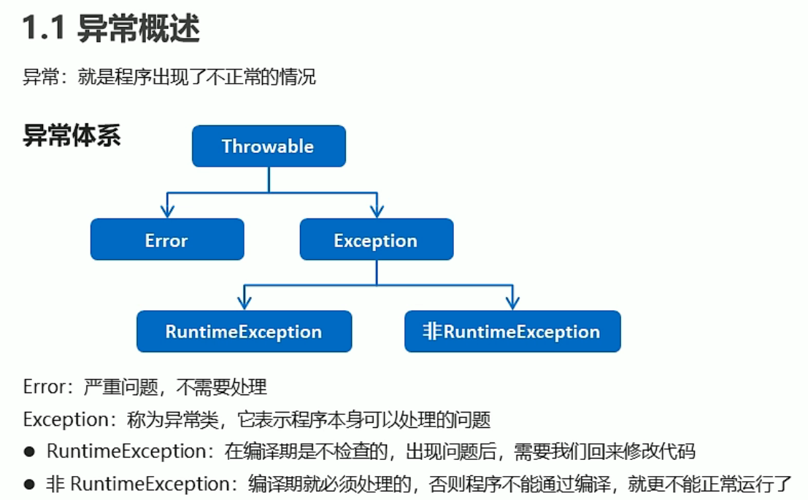


**导图：** 

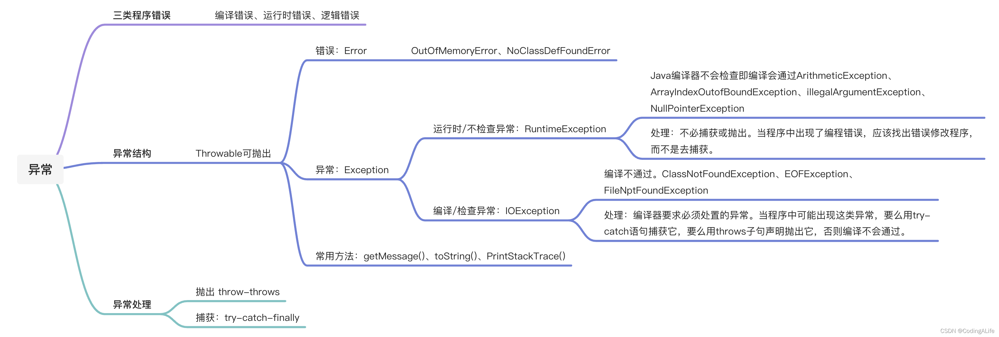

> **异常继承体系 ：**
>
> 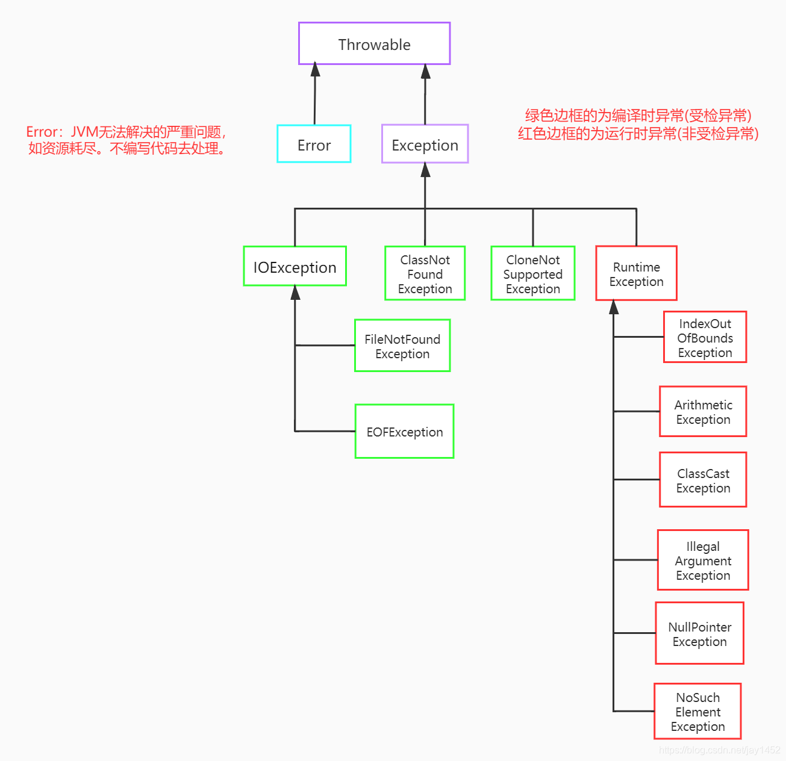

RuntimeException是运行时异常，例如ArrayIndexOutOfBoundsException，编译不出错，运行出错，要try-catch处理。

非RuntimeException是编译时异常，throws可以抛出异常，使编译通过，运行时还会出错，要try-catch处理。


下面的列表是 Throwable 类的主要方法:

| **序号** | **方法及说明**                                               |
| -------- | ------------------------------------------------------------ |
| 1        | **public String getMessage()**  		返回关于发生的异常的详细信息。这个消息在Throwable 类的构造函数中初始化了。 |
| 2        | **public String toString()**  		返回此 Throwable 的简短描述。 |
| 3        | **public void printStackTrace()**  		将此 Throwable 及其回溯打印到标准错误流。。 |

程序运行出错，JVM会将异常的名称、原因、位置输出到控制台，并让程序停止运行。

## 13.2 捕获异常

throws只是抛出异常，并没有对异常进行实际处理，要用try-catch处理异常。

使用 try 和 catch 关键字可以捕获异常。try/catch 代码块放在异常可能发生的地方。

try/catch代码块中的代码称为保护代码，使用 try/catch 的语法如下：

```java
try
{
   // 程序代码
}catch(ExceptionName e1)
{
   //Catch 块
}
```


```java
        int[] arr = {1, 2, 3};

        try {
            System.out.println(arr[10]);
        } catch (Exception e) {        //ArrayIndexOutOfBoundsException 
            e.printStackTrace();
        }
        System.out.println("有异常处理后程序不会中断，此处也能输出");       
```


## 13.3 自定义异常

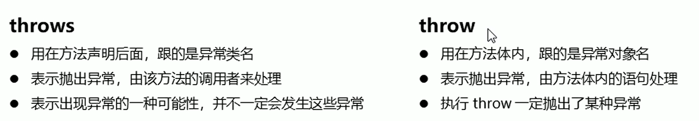

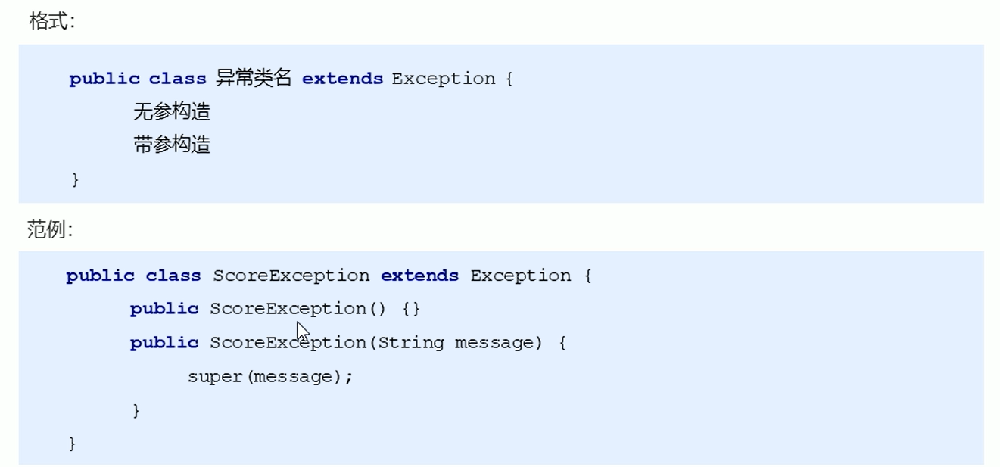

- 如果希望写一个检查性异常类，则需要继承 Exception 类。
- 如果你想写一个运行时异常类，那么需要继承 RuntimeException 类。

```java
public class Student {
    public void checkScore(int score) throws ScoreException{    //要加throws，声明此方法会抛出异常
        if(score>100||score<0)throw new ScoreException("wrong Score");
        else System.out.println("分属正常");
    }
}


public class Demo {
    public static void main(String[] args) {
        Student s=new Student();
        try{
            s.checkScore(111);
        }catch (ScoreException e){
            e.printStackTrace();
        }
        System.out.println("这里也能输出");
    }
}

public class ScoreException extends Exception {     //自定义异常类

    public ScoreException() {
    }

    public ScoreException(String wrong_score) {
        super(wrong_score);    //带参构造，异常时控制台输出指定字符串
    }
}
```


# 十四、集合

## 14.1 集合体系

ArrayList底层是数组，查询快(get,contain)增删(add,remove)慢，LinkedList底层是链表，查询慢，增删快。


**元素不可重复的集合：**HashXxx用hashCode()判断元素是否重复,TreeXxx用比较器。

Collection是add()和remove()，Map是put(),get().

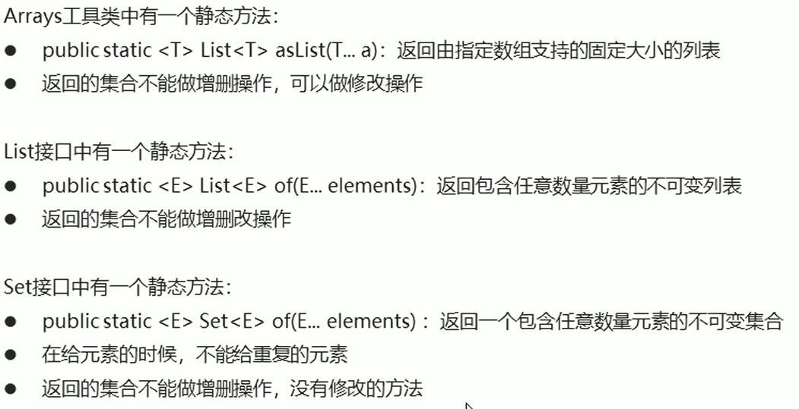

## 14.2 HashMap和HashSet区别

HashXxx用hashCode()判断元素是否重复. 

| ***HashMap\***                              | ***HashSet\***                                             |
| ------------------------------------------- | ---------------------------------------------------------- |
| HashMap实现了Map接口                        | HashSet实现了Set接口                                       |
| HashMap储存键值对                           | HashSet仅仅存储对象                                        |
| 使用put()方法将元素放入map中                | 使用add()方法将元素放入set中                               |
| HashMap中使用键对象来计算hashcode值         | HashSet使用成员对象来计算hashcode值。                      |
| HashMap比较快，因为是使用唯一的键来获取对象 | HashSet较HashMap来说比较慢，contains()时间复杂度也不是O(1) |

## 14.3 HashSet和TreeSet的区别

相同点：单例集合，数据不可重复
   
   不同点1：底层使用的储存数据结构不同：


    1，Hashset底层使用的是HashMap哈希表结构储存
     2，而Treeset底层用的是TreeMap树结构储存。
   


   不同点2：储存的数据保存唯一方式不用。


     1，Hashset是通过复写hashCode()方法和equals()方法来保证的。
     2，而Treeset是通过Compareable接口的compareto方法来保证的。
   
   不同点3：

​    hashset无序  Treeset有序

## 14.4 ArrayList

可以动态修改的数组，没有固定大小的限制。

```java
import java.util.ArrayList;

public class RunoobTest {
    public static void main(String[] args) {
        List<String> sites = new ArrayList<String>();
        sites.add("Google");        //增
        sites.add("Runoob");
        sites.add("Taobao");
        sites.add("Weibo");
        sites.add("Ai");
        System.out.println(sites);        //[Google, Runoob, Taobao, Weibo]

        Collections.sort(sites);        //字母顺序排序
        Collections.sort(sites, new Comparator<String>() {        //比较器长度排序
            @Override
            public int compare(String o1, String o2) {
                return o1.length()-o2.length();
            }
        });

        System.out.println(sites.get(1));  // 查，访问第二个元素Runoob
        System.out.println(sites.contains("Google"));   //查，是否包含
        sites.set(2, "Wiki"); // 改，第一个参数为索引位置，第二个为要修改的值
        sites.remove(3); // 删除第四个元素
        System.out.println(sites.size());//计算大小

        //迭代器
        Iterator<String> it=sites.iterator();
        while(it.hasNext()) System.out.println(it.next());
    }
}
```


List是接口，ArrayList是它的实现类
 以下两种方法都可以，但是不提倡第二种：

```java
List list=new ArrayList();
ArrayList list=new ArrayList();
```


 **List list=new ArrayList();好处**
 在设计模式中有对依赖倒置原则。程序要尽量依赖于抽象，不依赖于具体。 从Java语法上，这种方式是使用接口引用指向具体实现。
 比如，你若希望用LinkedList的实现来替代ArrayList的话，只需改动一行即可，其他的所有的都不需要改动：

```java
List list=new LinkedList()；
```


 这也是一种很好的设计模式.一个接口有多种实现,当你想换一种实现方式时,你需要做的改动很小.

**面向接口编程**
 提高程序宽展性,以后修改维护好些
 声明一个接口的变量（接口的引用）可以指向一个实现类（实现该接口的类）的实例， 但是该接口的变量不能使用实现类中有，接口中没有的方法（实现类中没有重写的方法，自添加的方法）。。


并发修改异常：

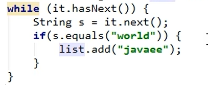

 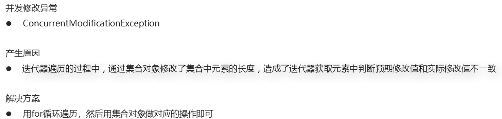

## 14.5 ListIterator

列表迭代器允许沿任一方向遍历列表

- - | Modifier and Type | Method and Description                                       |
    | ----------------- | ------------------------------------------------------------ |
    | `void`            | `add(E e)` 				将指定的元素插入列表（可选操作）。 |
    | `boolean`         | `hasNext()` 				返回 `true`如果遍历正向列表，列表迭代器有多个元素。 |
    | `boolean`         | `hasPrevious()` 				返回 `true`如果遍历反向列表，列表迭代器有多个元素。 |
    | `E`               | `next()` 				返回列表中的下一个元素，并且前进光标位置。 |
    | `int`             | `nextIndex()` 				返回随后调用 [`next()`](../../java/util/ListIterator.html#next--)返回的元素的索引。 |
    | `E`               | `previous()` 				返回列表中的上一个元素，并向后移动光标位置。 |
    | `int`             | `previousIndex()` 				返回由后续调用 [`previous()`](../../java/util/ListIterator.html#previous--)返回的元素的索引。 |
    | `void`            | `remove()` 				从列表中删除由 [`next()`](../../java/util/ListIterator.html#next--)或 [`previous()`](../../java/util/ListIterator.html#previous--)返回的最后一个元素（可选操作）。 |
    | `void`            | `set(E e)` 				用 [指定的](../../java/util/ListIterator.html#next--)元素替换由 [`next()`](../../java/util/ListIterator.html#next--)或 [`previous()`](../../java/util/ListIterator.html#previous--)返回的最后一个元素（可选操作）。 |

```java
        ListIterator<String> it=sites.listIterator();
        while(it.hasNext()) System.out.println(it.next());
```


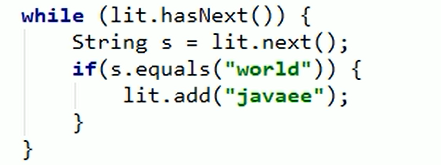


这样就不会出现并发修改异常。

## 14.6 增强版for

内部原理是一个iterator迭代器。

 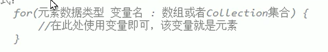

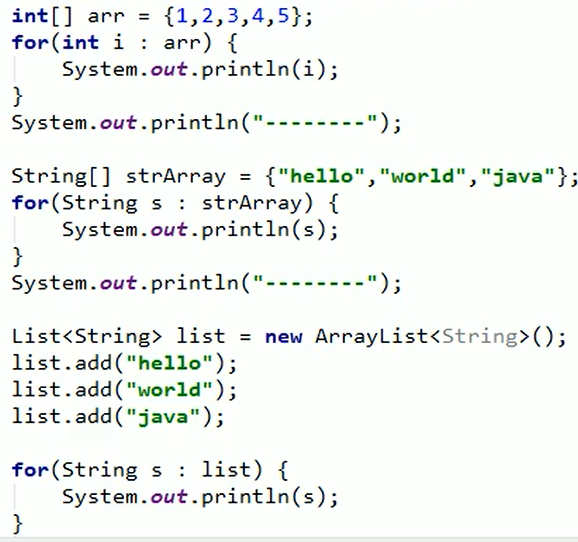


## 14.7 LinkedList

| 方法                                  | 描述                     |
| ------------------------------------- | ------------------------ |
| public void add(int index, E element) | 向指定位置插入元素。     |
| public void addFirst(E e)             | 元素添加到头部。         |
| public void addLast(E e)              | 元素添加到尾部。         |
| public void clear()                   | 清空链表。               |
| public E remove(int index)            | 删除指定位置的元素。     |
| public E removeFirst()                | 删除并返回第一个元素。   |
| public E removeLast()                 | 删除并返回最后一个元素。 |
| public boolean contains(Object o)     | 判断是否含有某一元素。   |
| public E getFirst()                   | 返回第一个元素。         |
| public E getLast()                    | 返回最后一个元素。       |

```java
    public static void main(String[] args) {
        LinkedList<String> link=new LinkedList<String>();
        link.addLast("hello");
        link.addLast("world");
        for(String s:link) System.out.println(s);
        System.out.println(link);
    }
```


## 14.8 Hashset

**不包含重复元素，无序。**

允许有null值，不是线程安全的。

**无重原理：**通过hashCode值来判断重复元素的。

int hashCode():返回哈希值。同一对象哈希值相同，不同对象的哈希值默认不同，方法重写后可以相同。

哈希表是元素为链表的数组，默认容量16，负载因子0.75，处理冲突方法是链地址法。

```java
import java.util.HashSet;
import java.util.LinkedList;

public class Test2 {
    public static void main(String[] args) {
        HashSet<String > h=new HashSet<String>();
        h.add("nihao");
        String s1=new String("nihao");
        h.add(s1);
        System.out.println(s1=="nihao");        //false
        for(String s:h) System.out.println(s);     //不含重复元素 
    }
}
```


如果Hashset里的元素是对象，若想将成员变量相同视为对象相同，要重写hashCode()：

```java
import java.util.HashSet;

public class Test {
    public static void main(String[] args) {    //输出23
        Dog dog1=new Dog(23);
        Dog dog2=new Dog(23);
        HashSet<Dog> h=new HashSet<Dog>();
        h.add(dog1);h.add(dog2);
        for(Dog dog:h) System.out.println(dog.weight);   
    }
}
```


```java
package package1;

public class Dog extends Animal{
     int weight=4;
     public Dog(){
//         System.out.println("doggouzaao");
     }
     public Dog(int weight){
         this.weight=weight;
     }
    @Override
    public void show() {
        name="dogname";
        System.out.println("dog");
    }

    @Override
    public boolean equals(Object o) {    //alt+insert生成equals()和hashCode()方法。这里其实只需要重写hashCode方法就能保证自动去重，equals方法用于元素间的比较
        if (this == o) return true;
        if (o == null || getClass() != o.getClass()) return false;

        Dog dog = (Dog) o;

        return weight == dog.weight;
    }

    @Override
    public int hashCode() {
        return weight;
    }

    @Override
    public String toString() {
        return "Dog{" +
                "weight=" + weight +
                '}';
    }
}
```


## 14.9 LinkedHashSet

存取有序，不重复。

“LinkedHashSet的底层数据结构是由hash表和双向链表实现,双向链表维护了访问的次序。”

## 14.10 TreeSet

**有序，去重复。**

TreeSet():自然顺序排序

TreeSet(Comperable c):比较器排序。

如果TreeSet内元素是**基本数据类型**，它会自动去重有序。

如果TreeSet内元素是**对象**，要实现去重有序，有两种方法。**方法一，自然排序，**类要实现Comparable<>接口，并重写compareTo（Student s）方法；**方法二，比较器排序，**带比较器构造TreeSet，否则报错。

**方法一：自然排序**

**实现**Comparable<>**重写**compareTo（）方法

```java
import java.util.TreeSet;

public class Test {
    public static void main(String[] args) {
        Dog dog1=new Dog(23);
        Dog dog2=new Dog(45);
        TreeSet<Dog> h=new TreeSet<Dog>();
        h.add(dog1);h.add(dog2);
        for(Dog dog:h) System.out.println(dog.weight);
    }
}
```


```java
package package1;

public class Dog extends Animal implements Comparable<Dog>{        //要实现Comperable<>并重写compareTo()方法
     int weight=4;
     public Dog(){
     }
     public Dog(int weight){
         this.weight=weight;
     }
    @Override
    public int compareTo(Dog dog){    //实参是上一只狗，本狗与上狗做比较
         return 1;        //按存取顺序排序，本狗比上只狗大
         //return -1;存储逆序排序
         //return 0;视为相等，重复删除。
            //return this.weight-dog.weight;按年龄从小到大排序，后狗-前狗。
    }
}
```


**方法二：比较器排序**

**无需重写，带参构造，参数为比较器Comparator<>。**

```java
        TreeSet<Dog> h=new TreeSet<Dog>(new Comparator<Dog>() {
            public int compare(Dog a,Dog b){
                if(a.weight!=b.weight) return a.weight-b.weight;
                else return a.name.compareTo(b.name);
            }
        });
```


## 14.11 泛型

### 14.11.1 概念

泛型本质是将具体的类型参数化，提供了编译时类型安全检测机制。

定义格式：<类型>、<类型1，类型2...>


泛型是编译时类型安全检测，示例：

```java
import java.util.ArrayList;

public class Test2 {
    public static void main(String[] args) {
        Collection a=new ArrayList();
        Collection<String> b=new ArrayList<String>();    //泛型
        a.add("he");
        a.add(3);
        b.add("he");
//        b.add(3);   直接写时这里会报错，因为通过泛型指定了类型为String
        for(Object o:a) System.out.println(o);
        for(Object o:b) System.out.println(o);
    }
}
```


### 14.11.2 泛型类

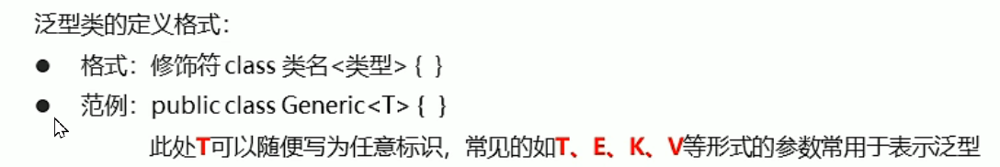

泛型类将类型参数化、模板化，**创建对象时再指定具体类型**。

示例：

```java
package package2;

public class Generic<T> {
    private T t;

    public T getT() {
        return t;
    }

    public void setT(T t) {
        this.t = t;
    }
}
```


```java
package package2;

//创建对象时再指定具体类型
public class Test2 {
    public static void main(String[] args) {
        Generic<Integer> g=new Generic<Integer>();    //创建对象时指定具体类型为Integer
        g.setT(32);
        System.out.println(g.getT());

        Generic<String> g2=new Generic<String>();    //创建对象时指定具体类型为String
        g2.setT("hello");

//        g2.setT(34);指定了String，运行时安全检测报错
        System.out.println(g2.getT());
    }
}
```


### 14.11.3 泛型方法

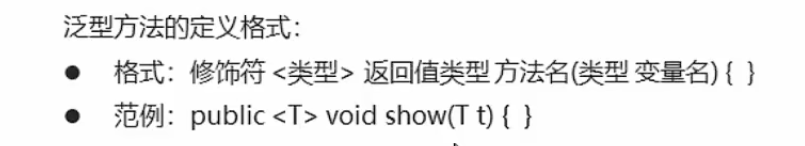

示例： 

```java
package package2;
public class Generic {
    public <T>void show(T t){
        System.out.println(t);
    }
}
```


### 14.11.4 泛型接口

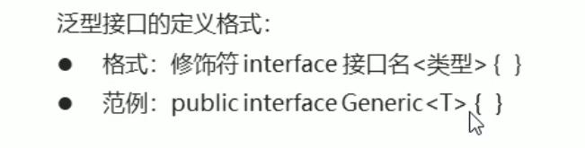

## 14.12 类型通配符


**类型通配符:<?>**


 例如List<?>:表示元素类型未知的List,它的元素可以匹配任何类型。这种带通配符的List仅表示它是各种类型的父类,并不能把元素添加到其中

```java
List<?> l0=new ArrayList<Number>();    
```


 **类型通配符的上限:List<? extends 指定类型>**
 例:List<? extends Number> :它表示的类型是Number的子类型

```java
List<? extends Object> l1=new ArrayList<Number>();    //通配object的子类
```


 **类型通配符的下限:List<? super 指定类型>**
 例:List<? super Number>:它表示的类型是Number的父类

```java
List<? super Integer> l2=new ArrayList<Number>();    //通配Integer的父类
```


## 14.13 可变参数

(int... a)是将所有int参数封装到a数组里。


 注意可变参数要放在后面。例如(int a,int... b)正确，(int... a,int b)会报错。


## 14.14 HashMap

Interface Map<K,V>    k是键，V是值。

- - | `void`                | `clear()` 				从这张地图中删除所有的映射。       |
    | --------------------- | ------------------------------------------------------------ |
    | `boolean`             | `isEmpty()` 				如果此地图不包含键值映射，则返回 true 。 |
    | `V`                   | `put(K key, V value)` 				将指定的值与此映射中的指定键相关联。 |
    | `V`                   | `get(Object key)` 				获取指定 key 对应对 value  |
    | `V`                   | `getOrDefault(Object key)` 				获取指定 key 对应对 value，如果找不到 key ，则返回设置的默认值 |
    | `V`                   | `remove(Object key)` 				从该地图中删除指定键的映射（如果存在）。 |
    | `boolean`             | `containsKey(Object key)` 				如果此映射包含指定键的映射，则返回 true 。 |
    | `boolean`             | `containsValue(Object value)` 				如果此地图将一个或多个键映射到指定值，则返回 true 。 |
    | `Set<K>`              | `keySet()` 				返回此地图中包含的键的[`Set`](../../java/util/Set.html)集合。 |
    | `Collection<V>`       | `values()` 				返回此地图中包含的值的[`Collection`](../../java/util/Collection.html)集合。 |
    | `Set<Map.Entry<K,V>>` | `entrySet()` 				返回此地图中包含的映射的[`Set`](../../java/util/Set.html)集合。 |

遍历方法1：keySet()获取键的Set集合，遍历Set集合，通过get（）获取值。

方法2：entrySet（）获取键值对Map.Entry<K,V>的Set集合，遍历Set集合，通过getKey()和getValue()获取键值。

```java
import java.util.*;

public class Test2 {
    public static void main(String[] args) {
        //声明
        Map<String, String> map = new HashMap<>();
        //添加
        map.put("aaa","bbb");map.put("cc","dd");map.put("e","f");
        //获取,如果"aaa"对应value不为null则返回value；如果为null，则返回null。
        System.out.println(map.get("aaa"));
        //获取,如果"aaa"对应value不为null则返回value；如果为null，则返回"default"字符串。
        System.out.println(map.getOrDefault("aaa", "default"));
        //获取所有keys
        Set<String> strings = map.keySet();
        //获取所有values
        Collection<String> values = map.values();
        //遍历map
        Set<Map.Entry<String,String>> set=map.entrySet();
        for(Map.Entry<String,String> i:set){
            System.out.println(i.getKey()+i.getValue());
        }
    }

}
```


如果HashMap键是对象，并且要求对象内成员变量值相等视为同一对象，则重写hashCode().

## 14.15 Collections类

- - | Modifier and Type                                            | Method and Description                                       |
    | ------------------------------------------------------------ | ------------------------------------------------------------ |
    | `static <T extends Comparable<? super T>> 				void` | `sort(List<T> list)` 				根据其元素的[natural ordering](../../java/lang/Comparable.html)对指定的列表进行排序。 |
    | `static void`                                                | `reverse(List<?> list)` 				反转指定列表中元素的顺序。 |
    | `static void`                                                | `shuffle(List<?> list)` 				使用默认的随机源随机排列指定的列表。 |

# 十五、i/o流


## 15.1 继承关系、路径斜杠

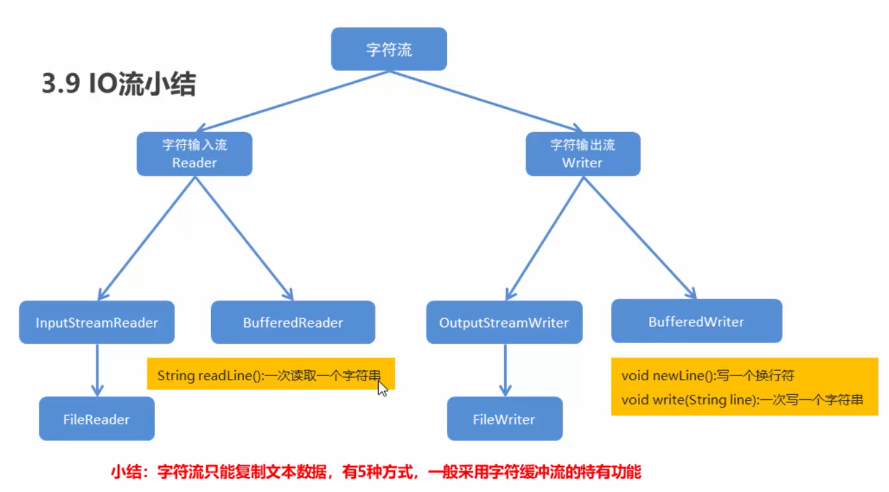

路径斜杠可以是//,/,\\,不能是\，因为它是转义符。

## 15.2 io流分类

**按数据流向：**

**输入流：**读数据。

**输出流：**写数据。

**按数据类型：**

**字节流：**它处理单元为**1个字节**（byte），操作字节和字节数组，存储的是**二进制文件**。

应用范围：如果是音频文件、图片、歌曲，就用字节流好点（1byte = 8位）。

**字符流：**它处理的单元为**2个字节**的Unicode字符，分别操作字符、字符数组或字符串，字符流是由Java虚拟机将字节转化为2个字节的Unicode字符为单位的字符而成的。

应用范围：如果是关系到中文（文本）的，用字符流好点（1Unicode = 2字节 = 16位）；

## 15.3 File类

File封装的不是真正的文件，只是路径。

**创建文件示例：** 

```java
import java.io.File;
import java.io.IOException;

public class Demo {
    public static void main(String[] args) throws IOException {
        File f=new File("D:\\1\\2.txt");
      //只创建已存在文件夹“D://1”下的2.txt。若“D://1”不存在，报错IOException: 系统找不到指定的路径。
        System.out.println(f.createNewFile());  //true，当目标位置已存在同名文件则创建失败输出false
    }
}
```


> **注意：**在当前包内IO流，使用File类创建文件
>
> ```java
> new File("1.txt");
> ```
>
> 
>
> 默认存的位置是在项目文件夹下，而不是包文件夹下。
>
> **关于路径斜杠和反斜杠：**
>
> 正斜杠“/”和“//”都可以，反斜杠必须“\\”，因为“\”会ASCII转义，“\\”在字符串里才是“\”。
>
> ```java
>         File file = new File("D://1//1.txt");
>         File file1 = new File("D:/1/2.txt");
>         File file2 = new File("D:\\1\\3.txt");
> //        File file3 = new File("D:\1\4.txt");  //这样会报错，单个反斜杠会进行转义
>         System.out.println(file.createNewFile());   //true
>         System.out.println(file1.createNewFile());   //true
>         System.out.println(file2.createNewFile());   //true
> //        System.out.println(file3.createNewFile());   //false 
> ```
>
> 
>
> **查看当前路径：**
>
> ```java
> System.out.println(System.getProperty("user.dir"));    //D:\workspace\java\test
> ```
>
> 

**创建删除文件和文件夹的api：**

| `boolean` | `createNewFile()` 		当且仅当具有该名称的文件尚不存在时，原子地创建一个由该抽象路径名命名的新的空文件。 |
| --------- | ------------------------------------------------------------ |
| `boolean` | `mkdir()` 		创建由此抽象路径名命名的目录。             |
| `boolean` | `mkdirs()` 		创建由此抽象路径名命名的目录，包括任何必需但不存在的父目录。 |
| `boolean` | `delete()` 		删除由此抽象路径名表示的文件或目录。      |
| `File[]`  | `listFiles()` 		返回一个抽象路径名数组，表示由该抽象路径名表示的目录中的文件。 |

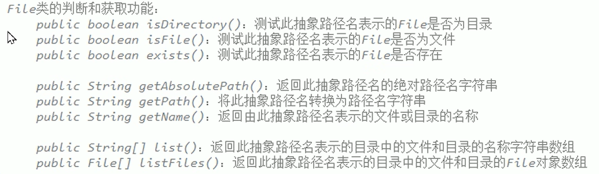


**举例：**

```java
        File f=new File("1\\2\\3");
        System.out.println(f.mkdirs());
        File f1=new File("1\\2\\3\\4.txt");
        System.out.println(f1.createNewFile());

        File[] f2=f.listFiles();        //listFiles()是路径下的所有文件组成的数组，若f文件会报错
        for(File file:f2){
            if(file.isFile()) System.out.println(file.getName()+","+file.getPath());
        }
//删除
//删除目录时要确保目录下没文件。

        f1.delete();f.delete();
```


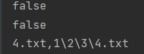

 返回false是因为文件夹和文件已存在。


## 15.4 字节输出流OutputStream

**概念：** 

Java中的 InputStream 和 OutputStream 都是 io 包中面向字节操作的顶级抽象类，关于java同步 io字节流的操作都是基于这两个的。

**子类：**

- 网络数据传输：SocketInputStream 和 SocketOutputStream
- 文件操作：**FileInputStream 和 FileOutputStream**
- 字节数据操作：DataInputStream 和 DataOutputStream


**OutputStream类是所有输出字节流的超类：**


**常用api：** 

- - | `void`          | `close()` 				关闭此输出流并释放与此流相关联的任何系统资源。 |
    | --------------- | ------------------------------------------------------------ |
    | `void`          | `flush()` 				刷新此输出流并强制任何缓冲的输出字节被写出。 |
    | `void`          | `write(byte[] b)` 				将 `b.length`字节从指定的字节数组写入此输出流。 |
    | `void`          | `write(byte[] b, int off, int len)` 				从指定的字节数组写入 `len`个字节，从偏移 `off`开始输出到此输出流。 |
    | `abstract void` | `write(int b)` 				将指定的字节写入此输出流。    |

**示例，OutputStream封装到BufferedWriter：**

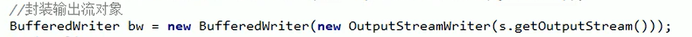

字节输出流OutputStream转字符输出流OutputStreamWriter转缓冲字符输出流BufferedWriter。s是Socket对象。

## 15.5 字节输入流InputStream

**概念：** 

Java中的 InputStream 和 OutputStream 都是 io 包中面向字节操作的顶级抽象类，关于java同步 io字节流的操作都是基于这两个的。

**子类：**

- 网络数据传输：SocketInputStream 和 SocketOutputStream
- 文件操作：**FileInputStream 和 FileOutputStream**
- 字节数据操作：DataInputStream 和 DataOutputStream


**InputStream是所有输入字节流类的超类：**

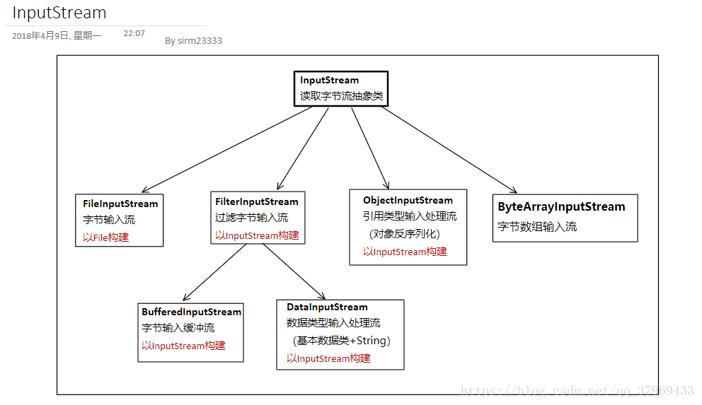


**常用api：** 

- - | `abstract int` | `read()` 				从输入流读取数据的下一个字节。      |
    | -------------- | ------------------------------------------------------------ |
    | `int`          | `read(byte[] b)` 				从输入流读取一些字节数，并将它们存储到缓冲区 `b，返回值为长度` 。 |
    | `int`          | `read(byte[] b, int off, int len)` 				从输入流读取最多 `len`字节的数据到一个字节数组。 |

**字节输入流InputStream封装到字符缓冲输入流BufferedWriter：**

这里s是Socket对象：

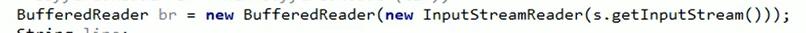


## 15.6 文件输出流FileOutputStream

是OutputStream子类。

输出流是写数据，把数据输出到文件里。

- - | `FileOutputStream(File file)` 					创建文件输出流以写入由指定的 `File`对象表示的文件。 |
    | ------------------------------------------------------------ |
    | `FileOutputStream(String name)` 				创建文件输出流以指定的名称写入文件 |
    | `FileOutputStream(String name, boolean append)` 				创建文件输出流以指定的名称写入文件。 |

默认彻底覆盖写入，append为true是追加写入。

- - | `void` | `write(byte[] b)` 				将 `b.length`个字节从指定的字节数组写入此文件输出流。 |
    | ------ | ------------------------------------------------------------ |
    | `void` | `write(byte[] b, int off, int len)` 				将 `len`字节从位于偏移量 `off`的指定字节数组写入此文件输出流。 |
    | `void` | `write(int b)` 				将指定的字节写入此文件输出流。 |

**示例，将“abcde” 写入1.txt文件中：**


```java
        FileOutputStream fos=new FileOutputStream("1.txt");
        byte b[]="abcde".getBytes();
        fos.write(b);
        fos.close();
```


完整版： 

```java
import java.io.File;
import java.io.FileOutputStream;
import java.io.IOException;

public class Demo {
    public static void main(String[] args)  {
        FileOutputStream fos=null;
        try {
             fos=new FileOutputStream("z://1.txt");
            byte b[]="efe".getBytes();
            fos.write(b);
            fos.close();
        }catch (IOException e){
            e.printStackTrace();
        }finally {
            System.out.println("finally");
            if(fos!=null){        //防止空指针异常
                try {
                    fos.close();
                } catch (IOException e) {
                    e.printStackTrace();
                }
            }
        }
    }
}
```


注意写数据时换行符，windows系统下是\r\n，linux的换行是\n，mac换行\r.

## 15.7 文件输入流 FileInputStream

### 15.7.1 概述 

是InputStream子类。

- - `FileInputStream(String name)` 					通过打开与实际文件的连接来创建一个 `FileInputStream` ，该文件由文件系统中的路径名 `name`命名。 				

- - | `int` | `read()` 				从该输入流读取一个字节的数据，如果读到文件末尾EOF，返回值是-1。 |
    | ----- | ------------------------------------------------------------ |
    | `int` | `read(byte[] b)` 				从该输入流读取最多 `b.length`个字节的数据为字节数组。 |
    | `int` | **`read(byte[] b, int off, int len)`** 				从该输入流读取最多 `len`字节的数据为字节数组，off是偏移量，为0是从字节数组起始处开始读。 |

返回的int是读取字节的个数。


```java
        FileInputStream fis=new FileInputStream("1.txt");
        byte b[]=new byte[1024];    //一般是1024整数倍
        int len=-1;
        while ((len= fis.read())!=-1) System.out.println(new String(b,0,len));
        fis.close();
```


### 15.7.2 练习，通过文件输入输出流复制图片

**常规方法：** 

```java
        FileInputStream fis=new FileInputStream("D://1.png");
        FileOutputStream fos=new FileOutputStream("D://1//1.png");
        byte []b=new byte[1024];
        int len=fis.read(b);
        while(len!=-1){
            System.out.println(len);
            fos.write(b,0,len);len=fis.read(b);
        }
```


> **扩展，Maven简单方法：**
>
> 学maven后再用这个方法。
>
>  使用IOUtils.copy(fis,os)进行流的复制（推荐）
>
> (1)pom.xml添加依赖
>
> ```XML
> <dependency>
>     <groupId>commons-io</groupId>
>     <artifactId>commons-io</artifactId>
>     <version>2.6</version>
> </dependency>
> ```
>
> 
>
> (2)调用工具类方法实现复制
>
> ```java
> //fis:输入流
> //os:输出流
> IOUtils.copy(fis,os);
> ```
>
> 


## 15.8 字节缓冲流

**特点：** 

字节缓冲流仅**提供缓冲区**，真正读写数据还要靠基本字节流对象操作。

字节缓冲流实现复制文件比基本字节流**快很多**。

### 15.8.1 字节缓冲输出流BufferedOutputStream

该类实现缓冲输出流。 通过设置这样的输出流，应用程序可以向底层输出流写入字节，而不必为写入的每个字节导致底层系统的调用。

- - | Constructor and Description                                  |
    | ------------------------------------------------------------ |
    | `BufferedOutputStream(OutputStream out)` 				创建一个新的缓冲输出流，以将数据写入指定的底层输出流。 |
    | `BufferedOutputStream(OutputStream out, int size)` 				创建一个新的缓冲输出流，以便以指定的缓冲区大小将数据写入指定的底层输出流。 |


### 15.8.2 字节缓冲输入流BufferedInputStream

当创建`BufferedInputStream`时，将创建一个内部缓冲区数组。 当从流中读取或跳过字节时，内部缓冲区将根据需要从所包含的输入流中重新填充，一次有多个字节。

## 15.9 字符流

### 15.9.1 概要和继承关系

**为什么要用字符流？**

GBK编码，一个汉字占用2个字节。

utf-8编码，一个汉字占用3个字节。

汉字存储时，无论使用哪种编码，第一个字节都是负数。

*所以**字节流***在读中文的时候有可能会读到半个中文,造成**乱码**

**解决办法：**

1.使用字符流（底层是字节流，字符流=字节流+编码表）

2.*字节流*直接操作字符,写出中文必须将字符串换成字节数组

```java
package com.heima.stream;

import java.io.FileInputStream;
import java.io.FileNotFoundException;
import java.io.FileOutputStream;
import java.io.IOException;

public class Demo10_Chinese {

	public static void main(String[] args) throws IOException {
		//demo1();
		FileOutputStream fos = new FileOutputStream("zzz.txt");
		fos.write("我读书少,你不要骗我".getBytes());
		fos.write("\r\n".getBytes());
		fos.close();
	}

	public static void demo1() throws FileNotFoundException, IOException {
		FileInputStream fis = new FileInputStream("yyy.txt");
		byte[] arr = new byte[4];
		int len;
		while((len = fis.read(arr)) != -1) {
			System.out.println(new String(arr,0,len));
		}
		fis.close();
	}
}
```


**继承关系：**

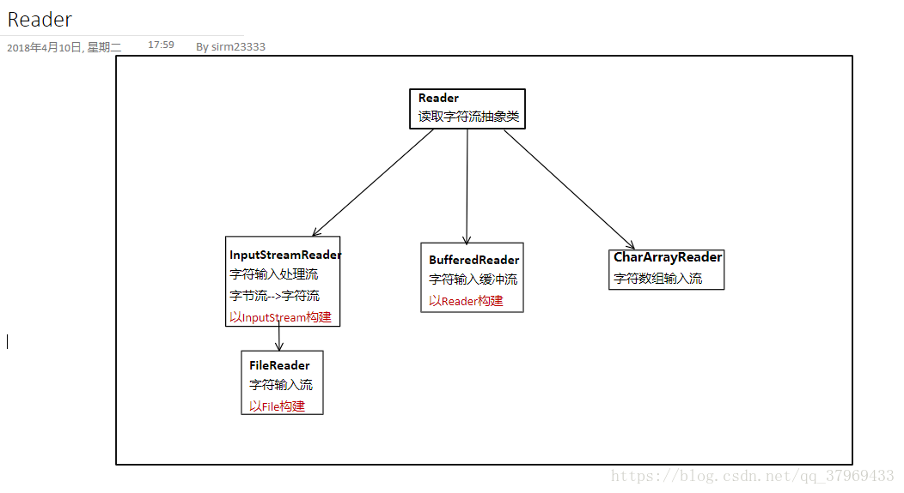

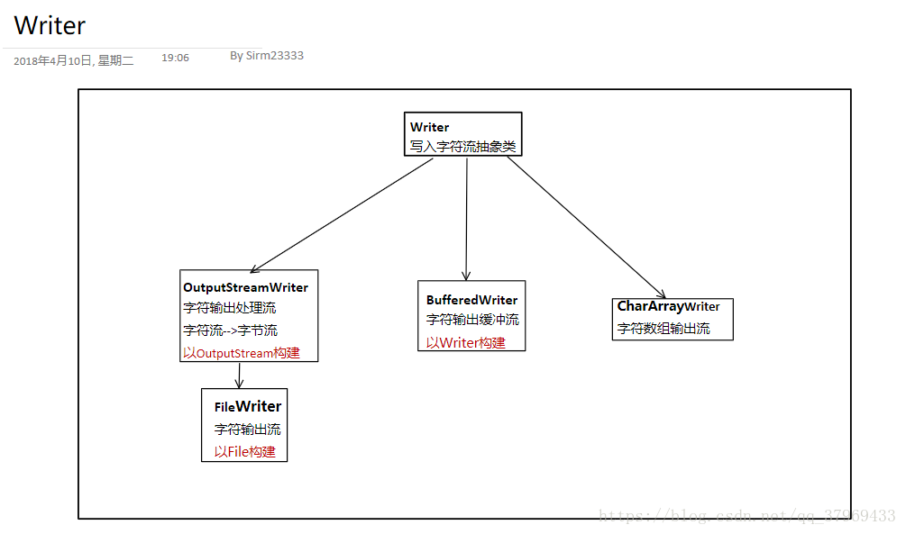

### 15.9.2 字符输出流OutputStreamWriter

只用于字符转字节，写入字节文件。

OutputStreamWriter:将字符编码为字节，再写入字节文件。

- - | `void` | `write(char[] cbuf, int off, int len)` 				写入字符数组的一部分。 |
    | ------ | ------------------------------------------------------------ |
    | `void` | `write(int c)` 				写一个字符                    |
    | `void` | `write(String str, int off, int len)` 				写一个字符串的一部分。 |
    | `void` | `flush()` 				刷新流。                           |
    | `void` | `close()` 				关闭流，先刷新。                   |

刷新后还能继续写数据，关闭后不能再写数据。


### 15.9.3 字符输入流InputStreamReader

只用于从字节文件解码出字符。

InputStreamReader:读取字节文件，并将字节解码为字符。构造函数传字节输入流FileInputStream或输入流InputStream.

- - | Modifier and Type | Method and Description                                       |
    | ----------------- | ------------------------------------------------------------ |
    | `void`            | `close()` 				关闭流并释放与之相关联的任何系统资源。 |
    | `String`          | `getEncoding()` 				返回此流使用的字符编码的名称。 |
    | `int`             | `read()` 				读一个字符，返回值是字符            |
    | `int`             | `read(char[] cbuf, int offset, int length)` 				将字符读入数组的一部分，返回值是字符串长度。 |
    | `boolean`         | `ready()` 				告诉这个流是否准备好被读取。       |


### 15.9.4 字符串的编码解码

**编码：**通过OutputStreamWriter将字符**编码为字节**，再写入字节文件。

**解码：**通过InputStreamReader读取字节文件，并将字节**解码为字符**

**编码解码方法：** 

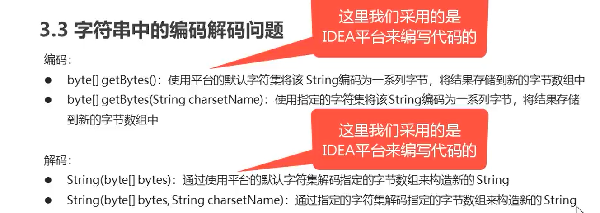


### 15.9.5 字符流的编码解码

编码：字符文件转字节文件

解码：字节文件转字符文件

先写再读：

```java
        OutputStreamWriter osw=new OutputStreamWriter(new FileOutputStream("1.txt"),"utf-8");
        osw.write("你好hello");
        osw.close();   //close很重要
        InputStreamReader isr=new InputStreamReader(new FileInputStream("1.txt"),"utf-8");
        int ch;
        while ((ch=isr.read())!=-1){
            System.out.println((char) ch);
        }
//        char []c=new char[1024];int len;
//        while ((len=isr.read(c))!=-1){
//            System.out.println(new String(c,0,len));
//        }
        isr.close();
```


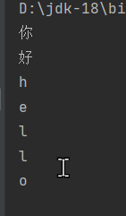


### 15.9.6 FileWriter和FileReader

字符输入输出流的子类，简化他们。涉及到编码解码问题，还是要使用字符输入输出流。

- - | `FileWriter(String fileName)` 					构造一个给定文件名的FileWriter对象。 |
    | ------------------------------------------------------------ |
    | `FileReader(String fileName)` 				创建一个新的 FileReader ，给定要读取的文件的名称。 |


### 15.9.7 字符缓冲流BufferedWriter和BufferedReader

**BufferedWriter**

- 将文本写入字符输出流，缓冲字符，以提供单个字符，数组和字符串的高效写入。 

  可以指定缓冲区大小，或者可以接受默认大小。 默认值足够大，可用于大多数用途。

- 提供了一个newLine（）方法，它使用平台自己的系统属性line.separator定义的行分隔符概念。

- 每次写完bw.flush();可以将缓冲字符写入文本，虽然close()也能刷新后关闭，但加上flush更保险。

- - `BufferedWriter(Writer out)` 				创建使用默认大小的输出缓冲区的缓冲字符输出流。 				


**BufferedReader**

从字符输入流读取文本，缓冲字符，以提供字符，数组和行的高效读取。

可以指定缓冲区大小，或者可以使用默认大小。 默认值足够大，可用于大多数用途。

BufferedReader实现读取键盘录入：

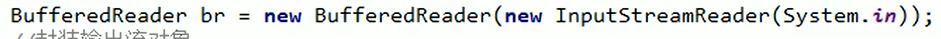


- - `BufferedReader(Reader in)` 					创建使用默认大小的输入缓冲区的缓冲字符输入流 				

- - | `String` | `readLine()` 				读一行文字（仅内容，无换行符），到文件末尾返回null。 |
    | -------- | ------------------------------------------------------------ |
    |          |                                                              |

### 15.9.8 练习，字符缓冲流文本复制

```java
//文本复制
import java.io.*;
import java.nio.charset.StandardCharsets;
import java.util.Arrays;

public class Demo {
    public static void main(String[] args) throws IOException {
        BufferedWriter bw=new BufferedWriter(new FileWriter("1//copy.txt"));
        BufferedReader br=new BufferedReader(new FileReader("1.txt"));
        char[] c=new char[1024];
        int len;
        while((len=br.read(c))!=-1){
            bw.write(c,0,len);bw.flush();
        }
        bw.close();br.close();
    }
}
```


或者

```java
        BufferedWriter bw=new BufferedWriter(new FileWriter("1//copy.txt"));
        BufferedReader br=new BufferedReader(new FileReader("1.txt"));
        String line;
        while ((line=br.readLine())!=null){
            bw.write(line);bw.newLine();bw.flush();
        }
        bw.close();br.close();
```


## 15.10 I/O流JDK7异常处理

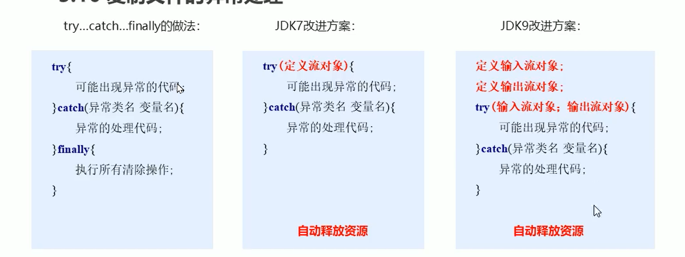


```java
//文本复制JDK7异常处理
import java.io.*;
import java.nio.charset.StandardCharsets;
import java.util.Arrays;

public class Demo {
    public static void main(String[] args){
        try(BufferedWriter bw=new BufferedWriter(new FileWriter("1\\2\\copy.txt"));
            BufferedReader br=new BufferedReader(new FileReader("1.txt"));){
            char[] c=new char[1024];
            int len;
            while((len=br.read(c))!=-1){
                bw.write(c,0,len);
            }
//            bw.close();br.close();不用close了，JDK7自动释放资源
        }catch (IOException e){
            e.printStackTrace();
        }

    }
}
```


## 15.11 特殊操作流 

### 15.11.1 标准输入输出流System.in和System.out

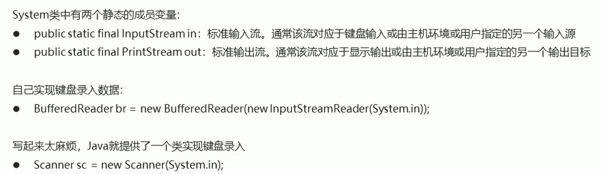

标准输出流：System.out

标准输入流：System.in

- - | `static PrintStream` | `err` 				“标准”错误输出流。           |
    | -------------------- | -------------------------------------------------- |
    | `static InputStream` | `in` 				“标准”输入流。返回输入字节流  |
    | `static PrintStream` | `out` 				“标准”输出流。返回字节打印流 |

```java
        PrintStream ps=System.out;
        ps.println("hello");
```


### 15.11.2 字节打印流PrintStream

只负责输出数据，不负责读取数据。

```java
PrintStream pw=new PrintStream("1.txt");
pw.println("hello");
pw.println(23);
pw.close();
```


### 15.11.3 字符打印流PrintWriter

```java
PrintWriter pw=new PrintWriter("1.txt",true);//自动刷新true
pw.println("hello");        //直接写一行加刷新
pw.println(23);
```


### 15.11.4 对象序列化流

ObjectOutputStream

- - `ObjectOutputStream(OutputStream out)` 					创建一个写入指定的OutputStream的ObjectOutputStream。 				

对象序列化方法：

- - | `void` | `writeObject(Object obj)` 				将指定的对象写入ObjectOutputStream。 |
    | ------ | ------------------------------------------------------------ |
    |        |                                                              |

- 只有支持java.io.Serializable接口的对象才能写入流中，将类实现Serializable接口即可，该接口是标识接口，不需要实现方法。

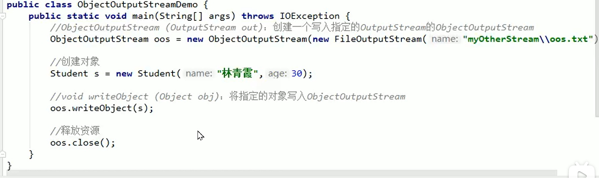


**异常java.io.InvalidClassException当序列化运行时检测到类中的以下问题之一时抛出。**

- 类的串行版本与从流中读取的类描述符的类型不匹配（序列化对象后修改了类文件）
- 该类包含未知的数据类型
- 该类没有可访问的无参数构造函数

*强烈建议*所有可序列化的类都明确声明serialVersionUID值，因为默认的serialVersionUID计算对类详细信息非常敏感，从而出现InvalidClassException。

为了保证不同Java编译器实现之间的一致的serialVersionUID值，一个可序列化的类必须声明一个显式的serialVersionUID值，尽量使用private修饰符。

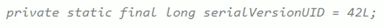

 **被transient修饰的成员变量不参与序列化。**

### 15.11.5 对象反序列化流ObjectInputStream

- - `ObjectInputStream(InputStream in)` 					创建从指定的InputStream读取的ObjectInputStream。 				

反序列化方法：

- - | `Object` | `readObject()` 				从ObjectInputStream读取一个对象。 |
    | -------- | ------------------------------------------------------------ |
    |          |                                                              |

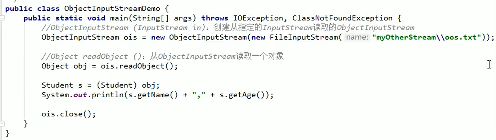

### 15.11.6 Properties和IO流结合

 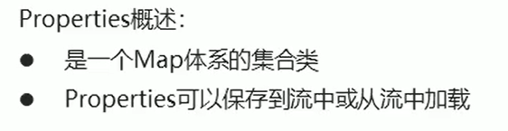

Properties类虽然是Map的子类，但它不是泛型类，put方法添加键值时，键值都是Object类型的： 


用String类型键值对要用特有方法：

| `String`      | `getProperty(String key)` 		使用此属性列表中指定的键搜索属性。 |
| ------------- | ------------------------------------------------------------ |
| `Object`      | `setProperty(String key, String value)` 		添加字符串类型键值对。 |
| `Set<String>` | `stringPropertyNames()` 		返回此属性列表中的一组键，其中键及其对应的值为字符串，包括默认属性列表中的不同键，如果尚未从主属性列表中找到相同名称的键。 |
| `void`        | `load(InputStream inStream)` 		从输入字节流读取属性列表（键和元素对）。 |
| `void`        | `load(Reader reader)` 		以简单的线性格式从输入字符流读取属性列表（关键字和元素对）。 |
| `void`        | `store(OutputStream out, String comments)` 		将此属性列表（键和元素对）写入此 `Properties`表中，以适合于使用 [`load(InputStream)`](../../java/util/Properties.html#load-java.io.InputStream-)方法加载到 `Properties`表中的格式输出流。 |
| `void`        | `store(Writer writer, String comments)` 		将此属性列表（键和元素对）写入此 `Properties`表中，以适合使用 [`load(Reader)`](../../java/util/Properties.html#load-java.io.Reader-)方法的格式输出到输出字符流。 |
|               |                                                              |

遍历：

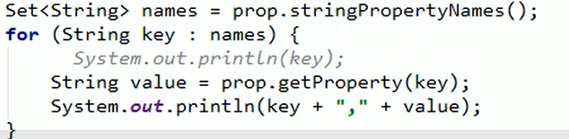

 **与IO流结合，写入配置文件并读**

```java
        Properties prop=new Properties();
        prop.setProperty("a","b");prop.setProperty("c","d");
        BufferedWriter bw=new BufferedWriter(new FileWriter("1.txt"));
        prop.store(bw,"hello");
        bw.close();


        Properties p2=new Properties();
        BufferedReader br = new BufferedReader(new FileReader("1.txt"));
        p2.load(br);
        Set<String> s=p2.stringPropertyNames();
        for(String key:s){
            System.out.println(key+p2.getProperty(key));
```


 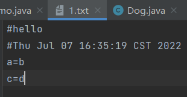


# 十六、多线程

## 16.1 概念

**进程：**一个进程包括由操作系统分配的内存空间，包含一个或多个线程。

**一个线程不能独立的存在**，它必须是进程的一部分。一个进程一直运行，直到所有的非守护线程都结束运行后才能结束。

**线程：**一条线程指的是进程中一个单一顺序的控制流，是一条执行路径。

一个进程中可以并发多个线程，每条线程并行执行不同的任务。

**单线程：**一条进程里只有一条执行路径。

**多线程：**一个进程里有多条执行路径。

**java是抢占式调度模型**

**优先级：**每一个 Java 线程都有一个优先级，优先级是一个整数，其取值范围是 1 （Thread.MIN_PRIORITY ） - 10 （Thread.MAX_PRIORITY ）。

默认情况下，每一个线程都会分配一个优先级 NORM_PRIORITY（5）。

优先级高的线程只是获取CPU时间片的几率高，并不能保证先执行。


**创建线程方法：**


- 通过实现 Runnable 接口；
- 通过继承 Thread 类本身；
- 通过 Callable 和 Future 创建线程。

## 16.2 创建线程方法1:继承Thread类

1. 创建一个新的类，该类继承 Thread 类。
2. 继承类必须重写 run() 方法。该方法是新线程的入口点。
3. 创建对象。
4. 启动线程， start() 方法，虚拟机调用该线程run方法。

**run()和start()区别：**

**run（）：**封装线程执行的代码，直接调用相当于普通方法的调用。

**start（）：**启动线程，虚拟机**调用**该线程的**run（）**方法。

示例： 

```java
public class Demo {
    public static void main(String[] args){
        MyThread a=new MyThread("a"),b=new MyThread("b");
        a.start();b.start();
    }
}

public class MyThread extends Thread{
    @Override
    public void run(){
        for(int i=0;i<100;i++) System.out.println(getName()+":"+i);
    }

    public MyThread() {
    }

    public MyThread(String name) {
        super(name);
    }
}
```


运行结果：

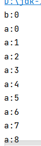


**Thead类常用方法：**

- - | `String`        | `getName()` 				返回此线程的名称。               |
    | --------------- | ------------------------------------------------------------ |
    | `void`          | `setName(String name)` 				将此线程的名称更改为等于参数 `name` 。 |
    | `static Thread` | `currentThread()` 				返回对当前正在执行的线程对象的引用。 |
    | `int`           | `getPriority()` 				返回此线程的优先级。         |
    | `void`          | `setPriority(int newPriority)` 				更改此线程的优先级。 |
    | `static void`   | `sleep(long millis)` 				使当前正在执行的线程以指定的毫秒数暂停（暂时停止执行），具体取决于系统定时器和调度程序的精度和准确性。 |
    | `void`          | `join()` 				等待这个线程死亡。                  |
    | `void`          | `setDaemon(boolean on)` 				将此线程标记为守护线程，当只剩守护线程运行时，java虚拟机将退出。 |

主线程设置名字：

```java
        Thread.currentThread().setName("主线程");
        System.out.println(Thread.currentThread().getName());
```


## 16.3 创建线程方法2:实现 Runnable 接口

> Runnable翻译：可运行的

**步骤：** 

1. 创建一个新的类，实现Runnable接口，重写run（）方法
2. 创建新类的对象a
3. 创建Thread类的对象b，**将a作为构造方法的参数1**
4. 启动线程

**这种办法更好，优点：**

（1）避免由于 Java 单继承带来的局限性

（2）逻辑和数据更好分离。通过实现 Runnable 接口的方法创建多线程更加适合**同一个资源被多段业务逻辑并行处理**的场景。在同一个资源被多个线程逻辑异步、并行处理的场景中，通过实现 Runnable 接口的方式设计多个 target 执行目标类可以更加方便、清晰地将执行逻辑和数据存储分离，更好地体现了面向对象的设计思想

**示例：**

```java
public class Demo {
    public static void main(String[] args){
        MyRunnable mr=new MyRunnable();
        Thread a=new Thread(mr,"a"),b=new Thread(mr,"b"),c=new Thread(mr);
        a.start();b.start();c.start();
    }
}

public class MyRunnable implements Runnable{
    @Override
    public void run(){
        for(int i=0;i<100;i++){
            System.out.println(Thread.currentThread().getName()+":"+i);
        }
    }
}
```


运行结果： 

 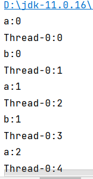


> **通过Lambda表达式实现Runnable接口来创建线程**
>
> ```java
> package train;
> 
> public class Demo {
>     public static void main(String[] args) {
>         new Thread(()->{
>             System.out.println("hello");
>         }).start();
> 
> 
>         new Thread(()->{
>             Thread.currentThread().setName("a");
>             for(int i=0;i<100;i++) System.out.println(Thread.currentThread().getName()+":"+i);
>         }).start();
> 
> 
> 
>         new Thread(()->{
>             Thread.currentThread().setName("b");
>             for(int i=0;i<100;i++) System.out.println(Thread.currentThread().getName()+":"+i);
>         }).start();
>     }
> }
> ```
>
> 

## 16.4 线程生命周期


## 16.5  线程同步

多条语句共享数据时，多线程程序会出现**数据安全问题**。

### 16.5.1 同步代码块

同步代码块简单来说就是将一段代码用一把锁给锁起来, 只有获得了这把锁的线程才访问, 并且同一时刻, 只有一个线程能持有这把锁, 这样就保证了同一时刻只有一个线程能执行被锁住的代码.

```java
    synchronized(同步对象) {
        //多条语句操作共享数据的代码 
    }
```


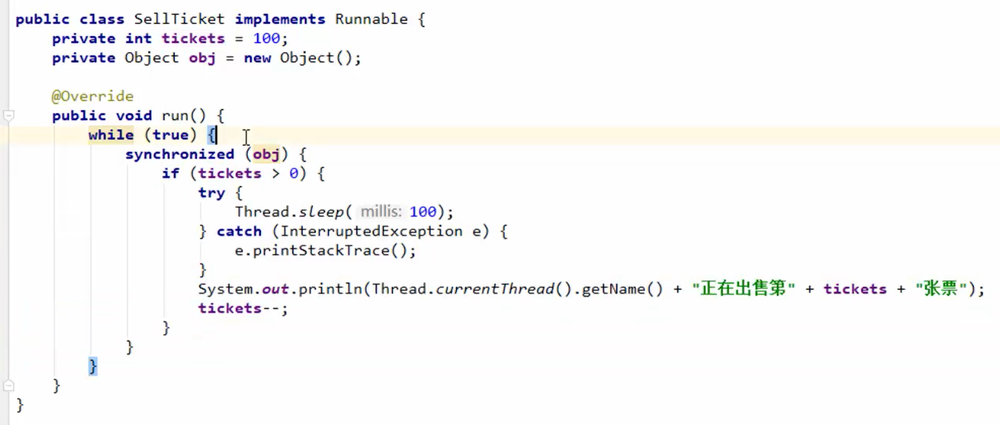

 **同步代码块的好处：**解决了多线程的数据安全问题

**弊端：**线程很多时，每个线程都会去判断锁，这是很耗费资源和时间的。

### 16.5.2 同步方法

**非静态同步方法的锁对象为this**。下面代码是相同功能的同步方法和同步代码块：


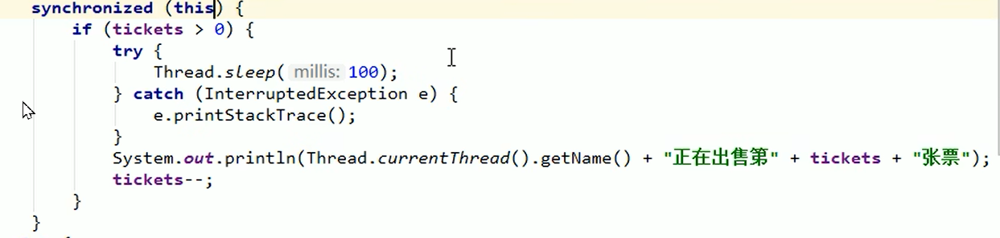

 **静态同步方法的锁对象为：类名.class。**下面代码是相同功能的同步方法和同步代码块：

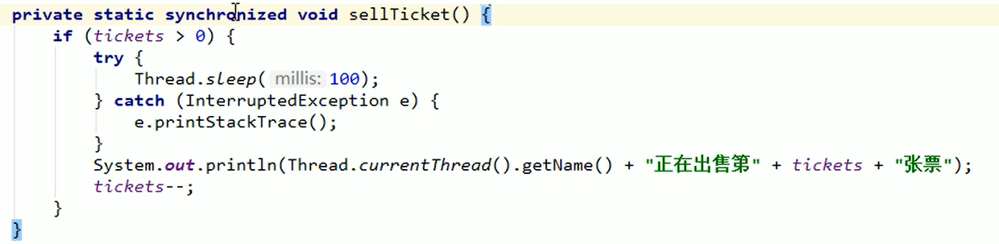

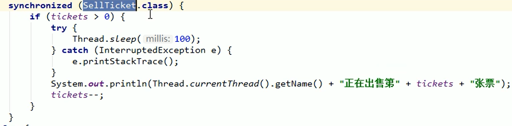

### 16.5.3 线程安全的类

StringBuffer，Vector，Hashtable

若不考虑线程安全，分别替换为StringBuilder,ArrayList,HashMap.

### 16.5.4 Lock锁

Lock提供比同步方法和代码块更广泛的锁定操作。

- - | `void` | `lock()` 				获得锁。   |
    | ------ | ----------------------------------- |
    | `void` | `unlock()` 				释放锁。 |

Lock是接口，ReentrantLock是它的实现类。

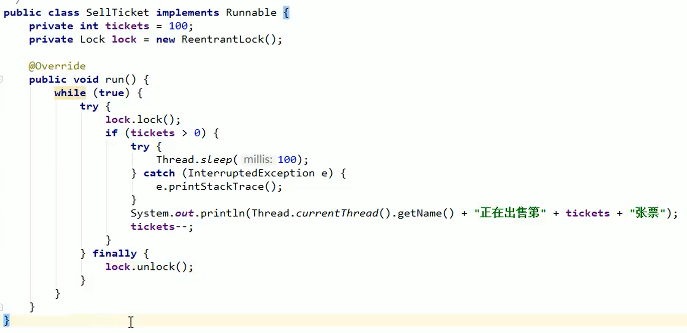

## 16.6 生产者消费者模式

一个十分经典的多线程协作模式。

 

Object类的等待和唤醒方法：

- - | `void` | `wait()` 				导致当前线程等待，直到另一个线程调用该对象的 [`notify()`](../../java/lang/Object.html#notify--)方法或 [`notifyAll()`](../../java/lang/Object.html#notifyAll--)方法。 |
    | ------ | ------------------------------------------------------------ |
    | `void` | `notify()` 				唤醒正在等待对象监视器的单个线程。 |
    | `void` | `notifyAll()` 				唤醒正在等待对象监视器的所有线程。 |

# 十七、 网络编程

## 17.1 概念 

**计算机网络：***计算机网络*是指将地理位置不同的具有独立功能的多台计算机及其外部设备，通过通信线路连接起来，在网络操作系统，网络管理软件及网络通信协议的管理和协调下，实现资源共享和信息传递的计算机系统。

**网络编程：**指编写运行在多个设备（计算机）的程序，这些设备都通过网络连接起来。

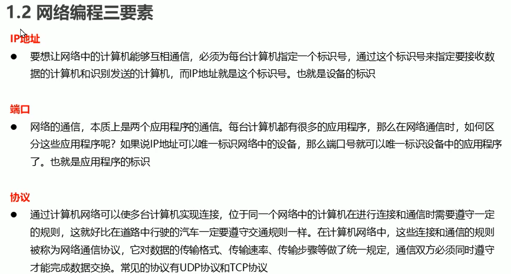

## 17.2 IP地址

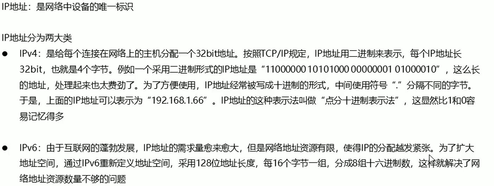

查看主机名和ip地址：控制面板--系统和安全-系统。

 **常用命令：**

ipconfig（查看计算机IP地址）

ping IP地址（测试连通性）

特殊IP地址：192.0.0.1是回送地址，可以代表本机地址，一般用来测试使用。

## 17.3 InetAddress 类

这个类表示**互联网协议(IP)地址。没有构造方法，**

- - | `static InetAddress` | `getByName(String host)` 				确定主机名称的IP地址。主机名称可以是ip地址，也可以是机器名称。 |
    | -------------------- | ------------------------------------------------------------ |
    | `String`             | `getHostAddress()` 				返回文本显示中的IP地址字符串。 |
    | `String`             | `getHostName()` 				获取此IP地址的主机名。       |

```java
        InetAddress administrator = InetAddress.getByName("diannaomingcheng");
        System.out.println(administrator.getHostAddress());
        System.out.println(administrator.getHostName());
```


## 17.4 端口

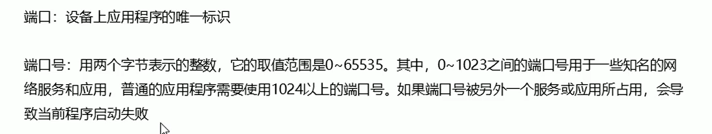


## 17.5 UDP协议接收发送数据

**概念：** 

 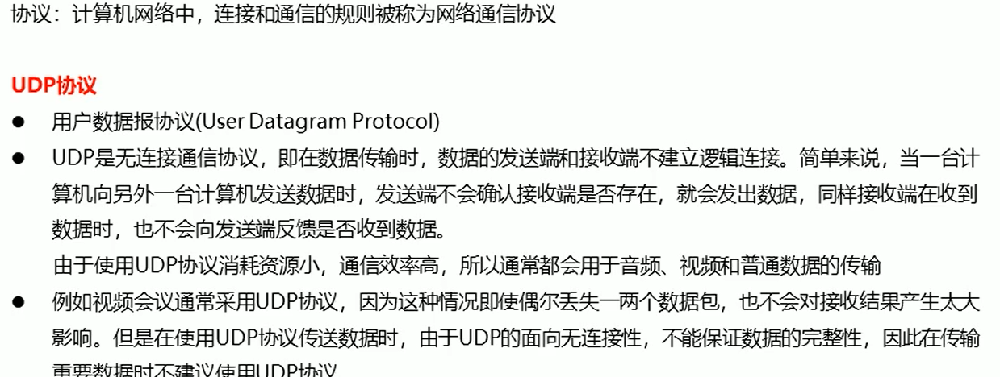

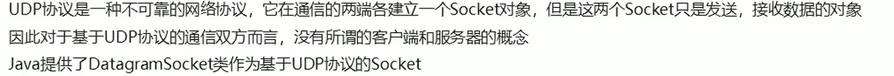

**发送数据的步骤：** 

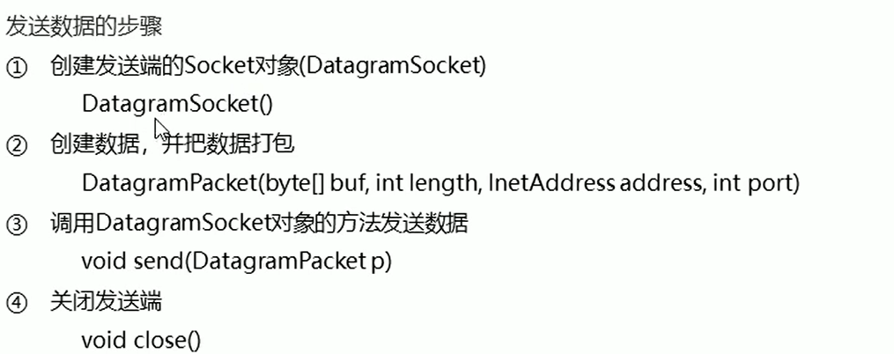

**接收数据的步骤：**

 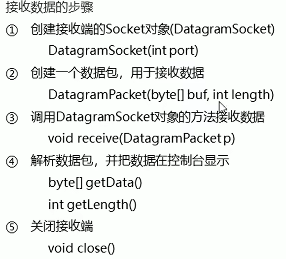


 DatagramSocket构造方法：

- - | ` `  | `DatagramSocket()` 				构造数据报套接字并将其绑定到本地主机上的任何可用端口。 |
    | ---- | ------------------------------------------------------------ |
    | ` `  | `DatagramSocket(int port)` 				构造数据报套接字并将其绑定到本地主机上的指定端口。 |

一般方法：

- - | `void` | `receive(DatagramPacket p)` 				从此套接字接收数据报包。 |
    | ------ | ------------------------------------------------------------ |
    | `void` | `send(DatagramPacket p)` 				从此套接字发送数据报包。 |
    | `void` | `close()` 				关闭此数据报套接字。               |

DatagramPacket构造方法：

- - | `DatagramPacket(byte[] buf, int length, InetAddress address, int port)` 					构造用于**发送**长度的分组的数据报包 `length`指定主机上到指定的端口号。 |
    | ------------------------------------------------------------ |
    | `DatagramPacket(byte[] buf, int length)` 				构造一个 `DatagramPacket`用于**接收**长度的数据包 `length` 。 |

一般方法：

- - | `byte[]` | `getData()` 				返回数据缓冲区。                 |
    | -------- | ------------------------------------------------------------ |
    | `int`    | `getLength()` 				返回要发送的数据的长度或接收到的数据的长度。 |

**发送接收数据代码：**

```java
package udp_package;
//发送数据
import java.io.IOException;
import java.net.DatagramPacket;
import java.net.DatagramSocket;
import java.net.InetAddress;
import java.nio.charset.StandardCharsets;

public class SendDemo {
    public static void main(String[] args) throws IOException {
        InetAddress ia = InetAddress.getByName("zhujiming");
        DatagramSocket ds=new DatagramSocket();
        byte []b="hello世界".getBytes();
        DatagramPacket dp=new DatagramPacket(b,b.length,ia,1234);
        ds.send(dp);
        ds.close();
    }
}
```


```java
package udp_package;
//接受数据
import java.io.IOException;
import java.net.DatagramPacket;
import java.net.DatagramSocket;
import java.net.SocketException;

public class ReceiveDemo {
    public static void main(String[] args) throws IOException {
        DatagramSocket ds=new DatagramSocket(1234);
        byte []b=new byte[1024];
        DatagramPacket dp=new DatagramPacket(b,1024);
        ds.receive(dp);
        System.out.println("接受到的数据："+new String(dp.getData(),0,dp.getLength()));
    }
}
```


先运行接收，再运行发送。

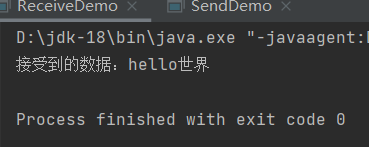

## 17.6 TCP协议

### 17.6.1 概念

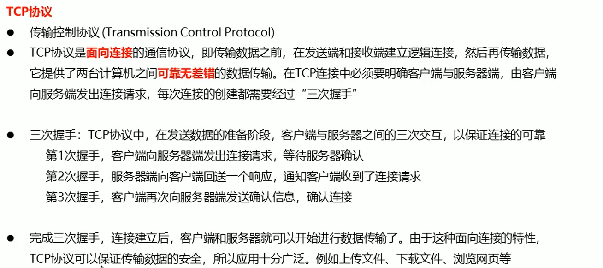

客户端发送数据，服务端接受数据。

### 17.6.2 发送数据

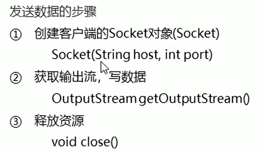

套接字是两台机器之间通讯的端点。

**客户端套接字类Socket方法：**


- - | `Socket(String host, int port)` 					创建流套接字并将其连接到指定主机上的指定端口号。 |
    | ------------------------------------------------------------ |
    | `Socket(InetAddress address, int port)` 				创建流套接字并将其连接到指定IP地址的指定端口号。 |

一般方法：

- - | `OutputStream` | `getOutputStream()` 				返回此套接字的输出流。 |
    | -------------- | ---------------------------------------------------------- |
    | `InputStream`  | `getInputStream()` 				返回此套接字的输入流。  |
    | `void`         | `shutdownOutput()` 				禁用此套接字的输出流。  |

**OutputStream类是所有输出字节流的超类：**

- - | `void`          | `close()` 				关闭此输出流并释放与此流相关联的任何系统资源。 |
    | --------------- | ------------------------------------------------------------ |
    | `void`          | `flush()` 				刷新此输出流并强制任何缓冲的输出字节被写出。 |
    | `void`          | `write(byte[] b)` 				将 `b.length`字节从指定的字节数组写入此输出流。 |
    | `void`          | `write(byte[] b, int off, int len)` 				从指定的字节数组写入 `len`个字节，从偏移 `off`开始输出到此输出流。 |
    | `abstract void` | `write(int b)` 				将指定的字节写入此输出流。    |

**OutputStream封装到BufferedWriter：**

字节输出流OutputStream转字符输出流OutputStreamWriter转缓冲字符输出流BufferedWriter。

这里s是Socket对象：


```java
package tcp_package;
//客户端发送数据

import java.io.IOException;
import java.io.OutputStream;
import java.net.InetAddress;
import java.net.Socket;
import java.net.UnknownHostException;

public class SendDemo {
    public static void main(String[] args) throws IOException {
        InetAddress ia=InetAddress.getByName("mingzi");
        Socket s=new Socket(ia,1234);
        OutputStream os=s.getOutputStream();    //这里就是IO流了，可以把字节输出流OutputStream转为缓冲字符输出流BufferedWriter，从而发送字符
        os.write("hello世界".getBytes());
        s.close();
    }
}
```


所谓*套接字*(Socket),就是对网络中不同主机上的应用进程之间进行双向通信的端点的抽象。 

### 17.6.3 接受数据

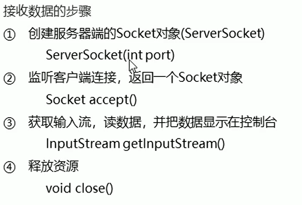

**服务器套接字类ServerSocker方法：**

- - `ServerSocket(int port)` 					创建绑定到指定端口的服务器套接字。 				

 ..

- - | `Socket` | `accept()` 				侦听要连接到此套接字并接受它。 |
    | -------- | --------------------------------------------------------- |
    |          |                                                           |

**InputStream是所有输入字节流类的超类：**


- - | `abstract int` | `read()` 				从输入流读取数据的下一个字节。      |
    | -------------- | ------------------------------------------------------------ |
    | `int`          | `read(byte[] b)` 				从输入流读取一些字节数，并将它们存储到缓冲区 `b，返回值为长度` 。 |
    | `int`          | `read(byte[] b, int off, int len)` 				从输入流读取最多 `len`字节的数据到一个字节数组。 |

**字节输入流InputStream封装到字符缓冲输入流BufferedWriter：**

这里s是Socket对象：


 这样就能每次读取一行字符串，更方便。

**代码**

```java
package tcp_package;
//服务端接受数据

import java.io.IOException;
import java.io.InputStream;
import java.net.ServerSocket;
import java.net.Socket;

public class ReceiveDemo {
    public static void main(String[] args) throws IOException {
        ServerSocket ss=new ServerSocket(1234);
        Socket s=ss.accept();
        InputStream is=s.getInputStream();
        byte[] b=new byte[1024];
        int len=is.read(b);
        System.out.println("data is:"+new String(b,0,len));
        ss.close();        //关ss就行了，因为s是从ss得到的。
    }
}
```


### 17.6.4 练习，TCP键盘录入字符通讯

```java
package tcp_package;

import java.io.*;
import java.net.Socket;

public class ClientDemo{
    public static void main(String[] args) throws IOException {
        Socket s=new Socket("xx.xx.xx.xx",1234);
        BufferedWriter bw=new BufferedWriter(new OutputStreamWriter(s.getOutputStream()));
        BufferedReader br=new BufferedReader(new InputStreamReader(System.in));
        String line;
        while ((line=br.readLine())!=null){
            if(line.equals("886")) break;
            bw.write(line);
            bw.newLine();
            bw.flush();        //缓冲流别忘了刷新，不然发不出去
        }
        s.shutdowmOutput();
//shutdowmOutput（）代表停止发送数据，此处可加BufferedReader反馈代码，接收服务端传输成功的反馈
        s.close();        //s是bw的源头，关s就关了bw
        br.close();        
    }


}
```


```java
package tcp_package;

import java.io.BufferedReader;
import java.io.IOException;
import java.io.InputStreamReader;
import java.net.ServerSocket;
import java.net.Socket;

public class ServerDemo {
    public static void main(String[] args) throws IOException {
        ServerSocket ss=new ServerSocket(1234);
        Socket s=ss.accept();
        BufferedReader br=new BufferedReader(new InputStreamReader(s.getInputStream()));
        String line;
        while((line=br.readLine())!=null){
            System.out.println(line);
        }
        ss.close();
    }
}
```


### 17.6.5 练习，服务器多线程接收文件

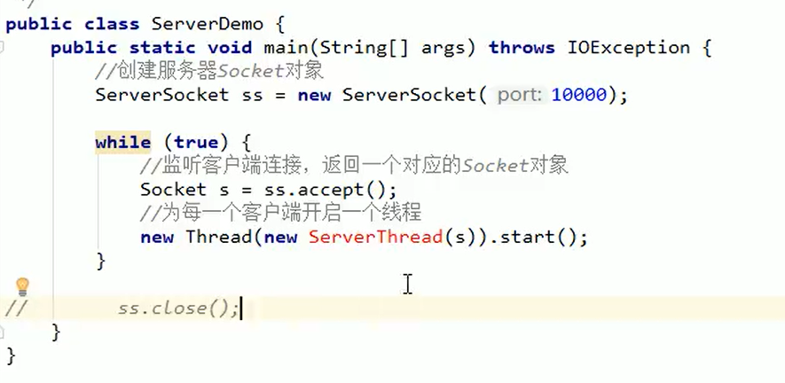

 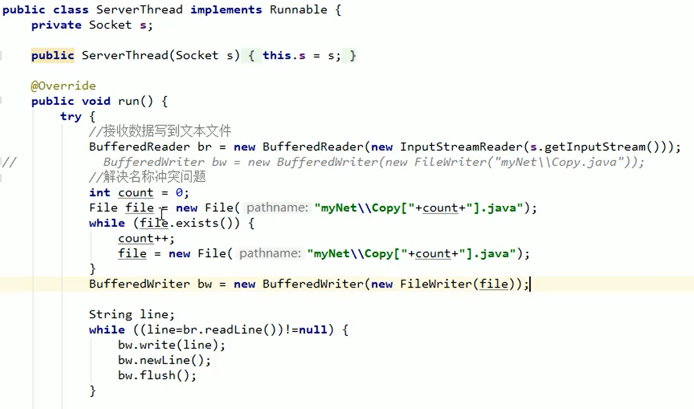

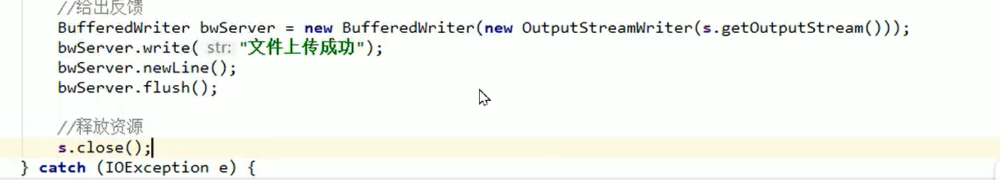

# 十八、Lambda表达式

## 18.1 概念

 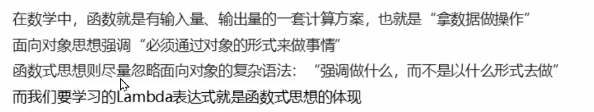

Lambda表达式是一个对象，必须有**上下文环境**，**作用是实现单方法的接口**。

上下文环境意思是能证明它是对象，例如让它处在方法或类的实参里，或者赋值给对象引用。

**注意事项：**

- 接口必须单方法。
- Lambda

 **Lambda表达式****格式：**


```
(形参)->{方法内的代码块}
```


**可省略内容：** 

- **形参类型、返回类型可以省略**。毕竟接口里也声明了类型，类型必须要么都写要么都省略。例如：

```java
public class Demo {
    public static void main(String[] args) {
        fun((a,b)->{    //Lambda形参类型、返回类型可以省略
            return a+b;
        });
    }
    public static void fun(Dog d){
        d.add(1,4);
    }
}

public interface Dog {    //单方法接口
    public int add(int a,int b);//只能有一个方法
}
```


- 如果只有一个参数，小括号可以省略。
- 如果代码句只有一条，大括号和分号可以省略。要么都省，**要么都不省略**。
- 若单语句是return，要么大括号、分号、return要么都省，**要么都不省略**。

单参数单语句省略示例： 

```java
public class Test {
    public static void main(String[] args) {
//Lambda表达式简化单方法接口实现类对象的创建过程
        fun((a,b)->{
            return a+b;
        });
//如果不用Lambda表达式，则要用下面的方式调用fun(Dog d)方法
        fun(new Dog() {
            @Override
            public int add(int a, int b) {
                return a+b;
            }
        });
    }
    public static void fun(Dog d){
        d.add(1,4);
    }
}
```


## 18.2 实现类、匿名内部类、Lambda线程代码对比

```java
        new Thread(()->{    //虚拟机根据上下文能推断出实现的接口是Runnable
            Thread.currentThread().setName("a");
            for(int i=0;i<100;i++) System.out.println(Thread.currentThread().getName()+":"+i);
        }).start();
```


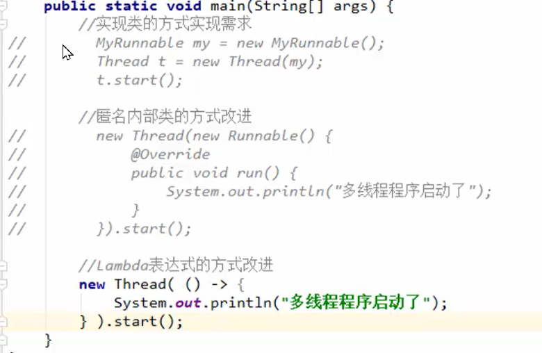

可见Lambda表达式方法最简洁，匿名内部类名和方法名都省了。 

## 18.3 Lambda和匿名内部类区别

- **接口：**Lambda只能是接口，匿名内部类可以是接口、抽象类、具体类。
- **方法：**Lambda只能单方法，匿名内部类可以多方法。
- **原理：**Lambda编译后字节码在运行时**动态生成**，匿名内部类编译后生成一个**字节码文件**。

# 十九、接口组成更新

java8后加入了默认方法、静态方法。java9后加入了私有方法。

## 19.1 接口中default默认方法

默认方法可被子类对象调用。

多态复习：接口不能初始化对象，只能接口引用指向实现类实例化对象，这时引用只能调用接口方法，实际执行的是实现类实现的对应方法。

默认方法不是抽象方法，实现类可以重写，也可以不重写。

```java
public interface Dog {
    public default void eat(){
        System.out.println("he");
    }
}
```


## 19.2 接口中静态方法

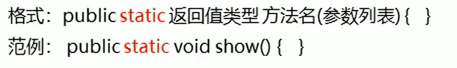

 接口中静态方法只能被接口名调用，不能被实现类对象调用。

假如类A实现了有同名静态方法的接口B、C，则A的对象分不清调用哪个接口的方法。

```java
public interface Dog {
    public static void eat(){
        System.out.println("he");
    }
}

public class Demo {
    public static void main(String[] args) {
        Dog.eat();

    }
}
```


## 19.3 接口中私有方法

起源：为了将接口中多个默认或静态方法中的共性方法抽离出来。

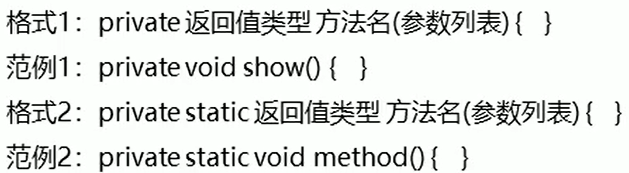

 修饰符复习：私有方法权限最低，仅同类内可见。静态方法只能访问静态变量和方法，不能用this。

```java
public interface Dog {
    public static void eat(){    //静态方法只能访问静态变量和方法
        look();
    }
    public default void sleep(){        //非静态方法可以访问静态非静态成员
        look();
    }
    private static void look(){    //私有成员仅本类内可见
        System.out.println("look");
    }
}
```


# 二十、方法引用

## 20.1 概念

方法引用和Lambda都可以根据上下文推导。

**格式：**

```
引用类::不带括号的方法名
```


## **20.2 引用类的方法**

**引用Lambda中类的方法：**

```java
public class Demo {
    public static void main(String[] args) {
        fun((s)-> System.out.println(s));    //fruit
        fun(System.out::println);    //fruit        //根据上下文推导出标准输出流类的println方法
    }
    public static void fun(Dog dog){    //Dog是个接口
        dog.eat(" fruit");
    }
}
```


 **引用Lambda中类的方法：**

```java
        fun((s)->Integer.parseInt(s));    //字符串转数字，
        fun(Integer::parseInt);        //根据上下文推导Integer类的parseInt方法
```


**引用匿名内部类中类的方法：**

```java
        fun(new Dog() {
            @Override
            public void eat(String s) {
                System.out.println(s);
            }
        });
        fun(System.out::println);
```


## 20.3 引用对象

```java
public class Demo {
    public static void main(String[] args) {
        Dog dog=new Dog();        //Dog是类        
        fun(dog::eat);        引用对象的方法，实参为对象，形参是接口
    }
    public static void fun(Cat c){        //Cat是接口
        c.look("4346");
    }
}
```


## 20.4 引用构造器


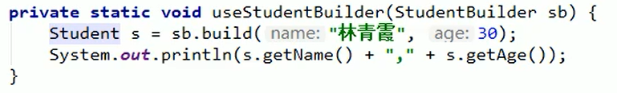

# 二十一、函数式接口

## 21.1 概念 

函数式接口：**有且仅有一个抽象方法的接口。**

Java中函数式编程体现就是Lambda表达式。

函数式接口注解：**@FunctionalInterface**

**如果方法的返回值是函数式接口，可以使用Lambda表达式作为结果返回。**

**格式**： 函数式接口对象作为一个方法的形参，实参是Lambda表达式。

事实上，**JDK自带一些函数式接口**：函数式接口Supplier中get获取有返回值的数据，Predicate中test返回boolean型数据，Consumer中accept无返回值数据操作。

| 接口      | 方法                    | 作用 | 示例              |
| --------- | ----------------------- | ---- | ----------------- |
| Supplier  | get，返回各类型的数据   | 选择 | 返回数组最大值    |
| Function  | apply，返回各类型数据   | 转换 | 数字字符串转换    |
| Predicate | test，返回boolean型数据 | 判断 | 判断数字是否大于5 |
| Consumer  | accept，无返回值        | 处理 | 翻转字符串        |
|           |                         |      |                   |


## 21.2 函数式接口Supplier接口

- ```
  @FunctionalInterface
  public interface Supplier<T>
  ```

 作用：获取到生产出的数据

Supplier译作供应商，生产的数据类型由泛型指定。


- - | `T`  | `get()` 				获得结果。 |
    | ---- | ---------------------------------- |
    |      |                                    |

```java
public class Test {
    public static void main(String[] args) {
        // 定义一个int数组
        int[] arr = {19, 50, 28, 37, 46};
        // 调用getMax方法，方法的形参是函数式接口（单方法接口），
        // 实参Lambda表达式（接口方法的逻辑，相当于创建了一个Supplier对象）
        // 返回值是Lambda表达式的返回值，sup.get()
        int maxValue = getMax(() -> {
            int max = arr[0];
            for (int i = 1; i < arr.length; i++) {
                if (arr[i] > max) {
                    max = arr[i];
                }
            }
            return max;
        });
        System.out.println(maxValue);
    }

    /**
     * 返回一个int数组中的最大值
     * @param sup 生产者，是个函数式接口，实参是Lambda表达式（接口方法的逻辑，相当于一个Supplier对象）
     * @return int 最大值
     */
    private static int getMax(Supplier<Integer> sup) {
        return sup.get();
    }
}
```


## 21.3 函数式接口Consumer

- ```
  @FunctionalInterface
  public interface Consumer<T>
  ```

作用：对数据进行操作，无返回值。

Consumer是消费型接口，消费的数据类型由泛型指定。

- - | `void`                | `accept(T t)` 				对给定的参数执行此操作。       |
    | --------------------- | ------------------------------------------------------------ |
    | `default Consumer<T>` | `andThen(Consumer<? super T> after)` 				返回一个组合的 `Consumer` ，按顺序执行该操作，然后执行 `after`操作。 |

 a.andThen(b).accept(t);相当于a.accept(t);b.accept(t);


## 21.4 函数式接口Predicate

- ```
  @FunctionalInterface
  public interface Predicate<T>
  ```

 作用：判断参数是否满足条件。

译作谓词，谓语。

- - | `boolean`              | `test(T t)` 				在给定的参数上评估这个谓词。     |
    | ---------------------- | ------------------------------------------------------------ |
    | `default Predicate<T>` | `and(Predicate<? super T> other)` 				返回一个组合的谓词，表示该谓词与另一个谓词的短路逻辑AND。与。 |
    | `default Predicate<T>` | `negate()` 				返回表示此谓词的逻辑否定的谓词。非。 |
    | `default Predicate<T>` | `or(Predicate<? super T> other)` 				返回一个组合的谓词，表示该谓词与另一个谓词的短路逻辑或。或。 |

方法的形参Predicate对象是Lambda参数。 

```java
public class Demo {
    public static void main(String[] args) {
        boolean b = fun("hello", s -> s.length() > 5, s -> s.length() <100);
    }

    private static boolean fun(String s, Predicate<String> p1, Predicate<String> p2) {
        return p1.and(p2).test(s);
    }
    private static boolean fun(String s, Predicate<String> p) {
        return p.negate().test(s);
    }
}
```


## 21.5 函数式接口Function

- ```
  @FunctionalInterface
  public interface Function<T,R>
  ```

作用：用于对参数进行处理、转换，然后返回一个新值。

- - | `R`                         | `apply(T t)` 				将此函数应用于给定的参数。      |
    | --------------------------- | ------------------------------------------------------------ |
    | `default <V> Function<T,V>` | `andThen(Function<? super R,? extends V> after)` 				返回一个组合函数，首先将该函数应用于其输入，然后将 `after`函数应用于结果。 |

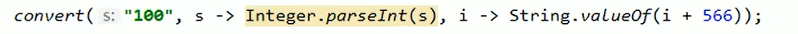

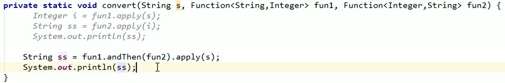

```java
public class Demo {
    public static void main(String[] args) {
        String s="小明，33";
        fun(s,s1->s1.split("，")[1],s1->Integer.parseInt(s1),i->i+70);
    }
    //先分割，再转数字，再加70
    private static void fun(String s, Function<String,String> fun1,Function<String,Integer> fun2,Function<Integer,Integer> fun3){

        int i=fun1.andThen(fun2).andThen(fun3).apply(s);//fun1的结果给fun2，fun2的结果给fun3
        System.out.println(i);
    }
}
```


# 二十二、Stream流

Stream流真正把函数式编程风格引用java中。

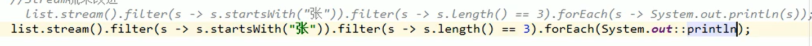

**Stream流过程：**


filter()和forEach()参数都是Lambda或方法引用。

## **22.1 Stream流生成：**


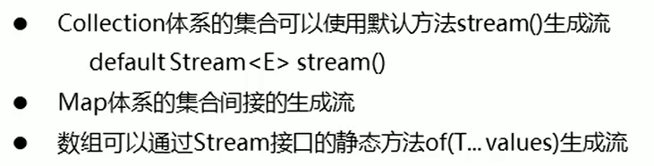

- - | `static <T> Stream<T>` | `of(T t)` 				返回包含单个元素的顺序 `Stream` 。 |
    | ---------------------- | ------------------------------------------------------------ |
    |                        |                                                              |


代码：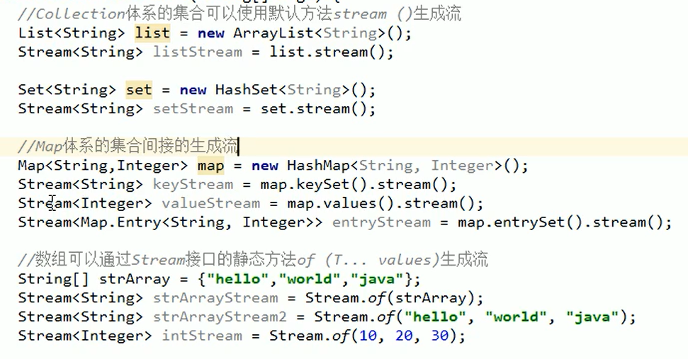

## 22.2 Stream流中间操作

### 22.2.1 概述 

- - | `Stream<T>`            | `filter(Predicate<? super T> predicate)` 				返回由与此给定谓词匹配的此流的元素组成的流。 |
    | ---------------------- | ------------------------------------------------------------ |
    | `Stream<T>`            | `limit(long maxSize)` 				返回由此流的元素组成的流，截短长度不能超过 `maxSize` 。 |
    | `Stream<T>`            | `skip(long n)` 				在丢弃流的第一个 `n`元素后，返回由该流的 `n`元素组成的流。 |
    | `static <T> Stream<T>` | `concat(Stream<? extends T> a, Stream<? extends T> b)` 				创建一个懒惰连接的流，其元素是第一个流的所有元素，后跟第二个流的所有元素。 |
    | `Stream<T>`            | `distinct()` 				返回由该流的不同元素（根据 [`Object.equals(Object)`](../../../java/lang/Object.html#equals-java.lang.Object-) ）组成的流。 |
    | `Stream<T>`            | `sorted()` 				返回由此流的元素组成的流，根据自然顺序排序。 |
    | `Stream<T>`            | `sorted(Comparator<? super T> comparator)` 				返回由该流的元素组成的流，根据提供的 `Comparator`进行排序。 |
    | `<R> Stream<R>`        | `map(Function<? super T,? extends R> mapper)` 				返回由给定函数应用于此流的元素的结果组成的流。 |
    | `IntStream`            | `mapToInt(ToIntFunction<? super T> mapper)` 				返回一个 `IntStream` ，其中包含将给定函数应用于此流的元素的结果。 |

**filter**

 filter 方法用于通过设置的条件过滤出元素。以下代码片段**使用 filter 方法过滤掉空字符串**，打印非空字符串。**filter的参数是Lambda，Lambda参数是list的每个元素，返回值是Boolean，为true时留下**

```java
        List<String>list = Arrays.asList("abc", "", "bc", "efg", "abcd","", "jkl");
        //forEach终结后，原list不变，处理后的list遍历输出
        list.stream().filter(item -> !item.isEmpty()).forEach(System.out::println);
```


 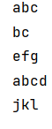


 **skip&limit**

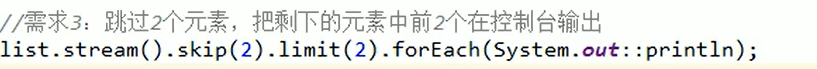

 **concat和distinct**

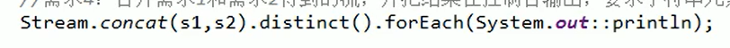

**sorted比较器**

**sorted()**

```java
list.stream().sorted(参数是Lambda，Lambda参数是list的两个元素，返回值>0是升序，返回值<0是降序)
```


先按字母序再按长度排序：

```java
        List<String> list = Arrays.asList("abc", "", "bc", "efg", "abcd","", "jkl");
        //forEach终结后，原list不变，处理后的list遍历输出
        list=list.stream().sorted((item1,item2)->{
            if(item1.compareTo(item2)!=0) return item1.compareTo(item2);
            else return item1.length()-item2.length();
        }).collect(Collectors.toList());
        System.out.println(list);
    }
```


输出：[, , abc, abcd, bc, efg, jkl]

 **map**

 中间操作**map()**用法和filter类似，**map的参数是Lambda，Lambda参数是list的每个元素，返回值是加工后的list元素。**

```java
        List<String>list = Arrays.asList("abc", "", "bc", "efg", "abcd","", "jkl");
        //collect收集后原list不变，处理后的list收集成返回值
        list=list.stream().map(item->item.toUpperCase()).collect(Collectors.toList());
        System.out.println(list);
```


 **mapToInt**

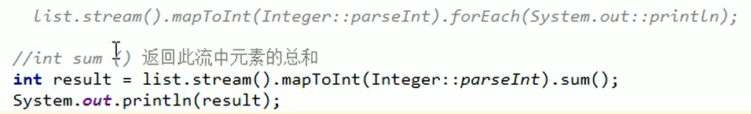

 IntStream是由Integer元素组成的流，可以取和、平均数、排序、skip、limit、conunt、forEach等。

### 22.2.2 map和filter区分

filter是满足条件的留下，是对原数组的过滤；map则是对原数组的加工，映射成一对一映射的新数组。

说人话就是改变了了长度了用filter,没改变长度,只是对某一个或者几个做改变用map

## 22.3 Stream流终结


- - | `long` | `count()` 				返回此流中的元素数                 |
    | ------ | ------------------------------------------------------------ |
    | `void` | `forEach(IntConsumer action)` 				对此流的每个元素执行操作。 |

## 22.4 Stream流收集

- - | `<R,A> R` | `collect(Collector<? super T,A,R> collector)` 				使用 [Collector](package-summary.html#MutableReduction)对此流的元素执行 [mutable reduction](package-summary.html#MutableReduction) `Collector` 。 |
    | --------- | ------------------------------------------------------------ |
    |           |                                                              |

参数**Collector**对象通过工具类**Collections**返回值得到：


 示例：

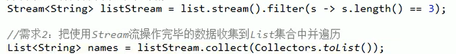

 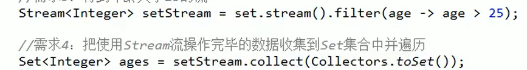


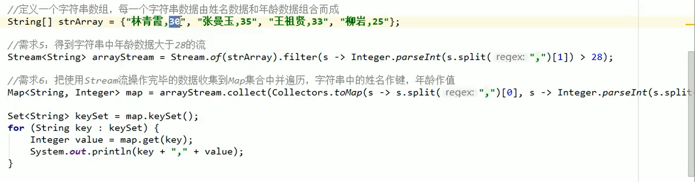

# 二十三、 反射


## 23.1 类加载和类加载器 

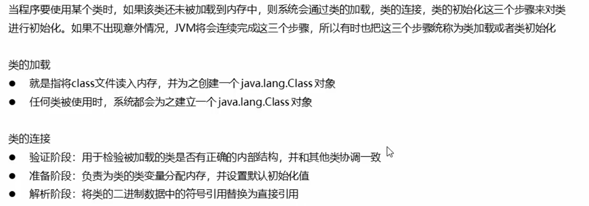

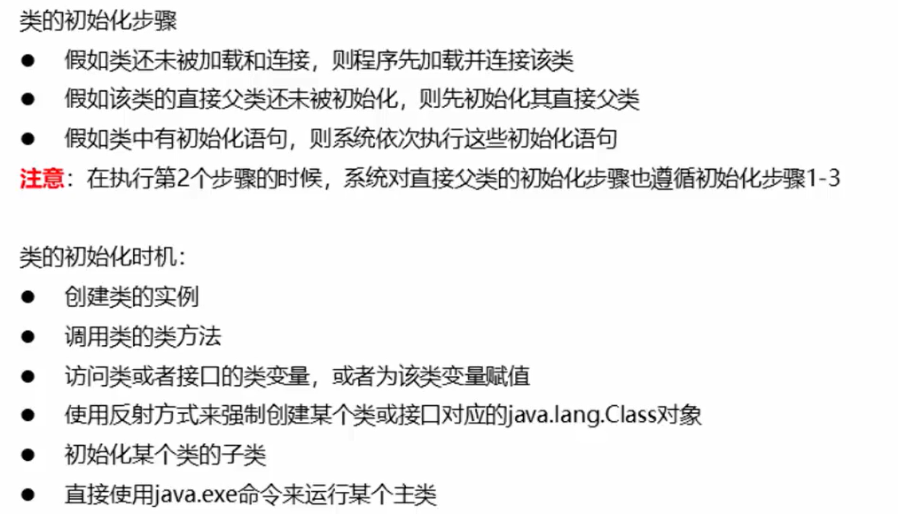

类加载器ClassLoader

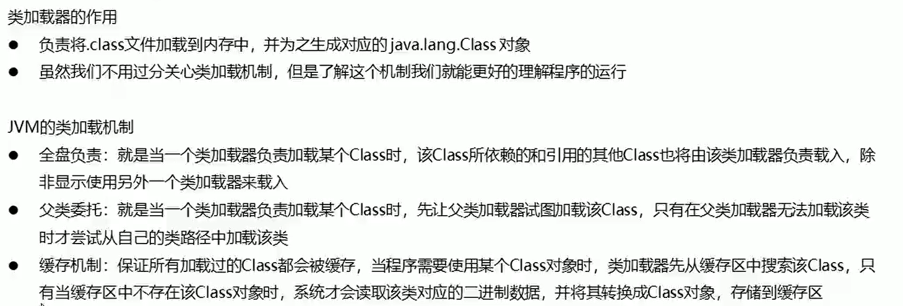


ClassLoader：负责加载类的对象。

内置类加载器：

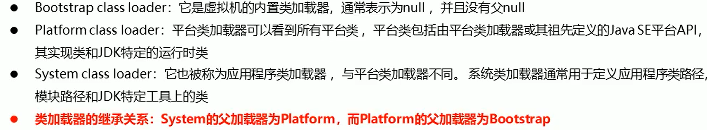

 **ClassLoader的方法：** 

- - | `static ClassLoader` | `getSystemClassLoader()` 				返回用于委派的系统类加载器。 |
    | -------------------- | ------------------------------------------------------------ |
    | `ClassLoader`        | `getParent()` 				返回父类加载器进行委派。       |

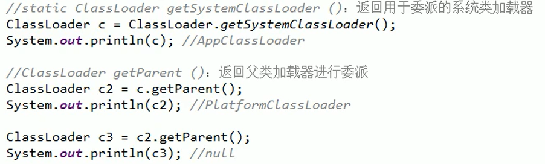

## 23.2 反射概述 

**反射**就是把Java类中的各个成分映射成一个个的Java对象。

即在运行状态中，对于任意一个类，都能够知道这个类的所以属性和方法；对于任意一个对象，都能调用它的任意一个方法和属性。这种动态获取信息及动态调用对象方法的功能叫Java的**反射机制**。 

**反射机制有什么用？**

通过java语言中的反射机制可以操作字节码文件（可以读和修改[字节码](https://so.csdn.net/so/search?q=字节码&spm=1001.2101.3001.7020)文件，即xxx.class文件）
 通过反射机制可以操作代码片段。（class文件。）


 **构造方法、成员变量、方法对象取消访问检查可以访问私有成员：**


反射可以越过泛型检查，例如在ArrayList<Integer>中添加字符串： 

 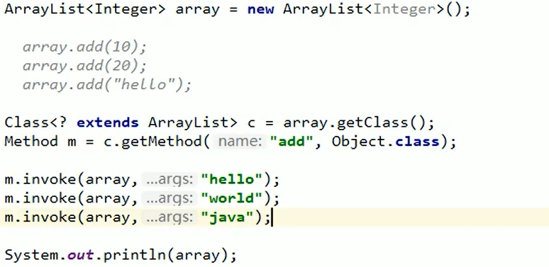

## 23.3 三种获取Class类的对象方法

Class类的对象：该类的字节码文件对象。

同一个类的字节码文件对象永远是相等的。


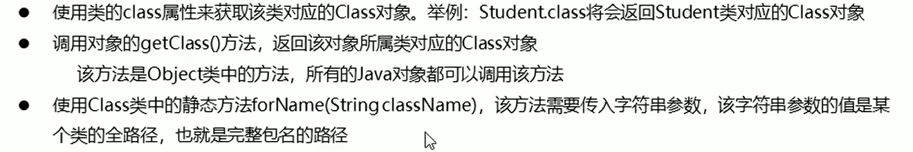

```java
    public static void main(String[] args) throws ClassNotFoundException {
        Class<Dog> c1=Dog.class;        //方法1：类的class属性
        Dog d=new Dog();
        Class<? extends Dog> c2=d.getClass();        //方法2：对象的getClass方法
        Class<?> c3= Class.forName("train.Dog");    //方法3：Class类的静态方法forName
        System.out.println(c1); //class train.Dog
        System.out.println(c1==c2&&c1==c3); //true
    }
```


Class类的引用也可以不加泛型：

```java
Class c1=Dog.class;
Class c2=d.getClass();
Class c3= Class.forName("train.Dog");
```


## 23.4 反射获取构造方法并实例化

Class类的方法：

- - | `Constructor<T>`   | `getConstructor(类<?>... parameterTypes)` 				返回单个公共构造方法对象。 |
    | ------------------ | ------------------------------------------------------------ |
    | `Constructor<T>`   | `getDeclaredConstructor(类<?>... parameterTypes)` 				返回单个构造方法对象。 |
    | `Constructor<?>[]` | `getConstructors()` 				返回所有公共构造方法对象的数组。 |
    | `Constructor<?>[]` | `getDeclaredConstructors()` 				返回所有构造方法对象的数组。 |
    | `T`                | `newInstance()` 				调用类的指定构造方法，完成构造方法的对象创建。 |

Constructor译作构造方法，构造器。


Class.newInstance() 只能够调用无参的构造函数，即默认的构造函数； 
 Constructor.newInstance() 可以根据传入的参数，调用任意构造函数。 

**构造方法、成员变量、方法对象取消访问检查可以访问私有成员：**


 **获取所有构造方法的对象：**

```java
    public static void main(String[] args) throws ClassNotFoundException {
        Class<?> c= Class.forName("train.Dog");
        Constructor<?>[] cons = c.getDeclaredConstructors();
        for(Constructor<?> con:cons){
            System.out.println(con);
        }
    }
```


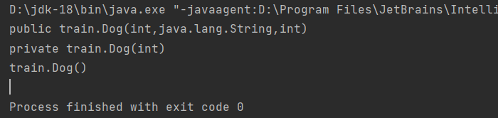

 **获取单个构造方法的对象：**

无参：

```java
        Class<?> c= Class.forName("train.Dog");
        Constructor<?> con=c.getDeclaredConstructor();    //获取单个构造方法对象
        Object obj = con.newInstance();    //构造方法对象实例化，会调用无参构造方法
        System.out.println(obj);    //重写Dog类的to_String方法可更直观。
```


带参：

```java
        Class<?> c= Class.forName("train.Dog");
        Constructor<?> con=c.getConstructor(String.class,int.class);
        Object obj = con.newInstance("wangcai",32);
        System.out.println(obj);
```


## 23.5 反射获取成员变量并赋值

Class对象获取成员变量的方法：

- - | `Field`   | `getField(String name)` 				返回一个 `Field`对象，它反映此表示的类或接口的指定公共成员字段 `类`对象。返回一个共有成员变量。 |
    | --------- | ------------------------------------------------------------ |
    | `Field[]` | `getFields()` 				返回包含一个数组 `Field`对象反射由此表示的类或接口的所有可访问的公共字段 `类`对象。 |
    | `Field`   | `getDeclaredField(String name)` 				返回一个 `Field`对象，它反映此表示的类或接口的指定已声明字段 `类`对象。 |
    | `Field[]` | `getDeclaredFields()` 				返回的数组 `Field`对象反映此表示的类或接口声明的所有字段 `类`对象。 |

Field是字段，成员变量属于字段。

Field类的方法：

- - | `void` | `set(Object obj, Object value)` 				给obj对象（构造方法对象）的成员变量赋值为value。 |
    | ------ | ------------------------------------------------------------ |
    |        |                                                              |


**获取成员变量对象并赋值：**

```java
//        1.获取构造方法对象并实例化
        Dog dog=new Dog();
        Class<? extends Dog> c = dog.getClass();
        Constructor<?> con=c.getConstructor();
        Object obj = con.newInstance();
//        2.获取成员变量对象
        Field field = c.getField("name");
//        3.通过成员变量对象的方法set，给构造方法对象赋值
        field.set(obj,"旺财");
        System.out.println(obj);    //Dog{age=0, name='旺财'}
        System.out.println(dog.name);   //null
```


## 23.6 获取成员方法对象并调用成员方法

Class对象获取成员方法的方法：

- - | `Method`   | `getMethod(String name, 类<?>... parameterTypes)` 				返回一个 `方法`对象，它反映此表示的类或接口的指定公共成员方法 `类`对象。 |
    | ---------- | ------------------------------------------------------------ |
    | `Method[]` | `getMethods()` 				返回包含一个数组 `方法`对象反射由此表示的类或接口的所有公共方法 `类`对象，**包括那些由类或接口和那些从超类和超接口继承的声明。** |
    | `Method`   | `getDeclaredMethod(String name, 类<?>... parameterTypes)` 				返回一个 `方法`对象，它反映此表示的类或接口的指定声明的方法 `类`对象。 |
    | `Method[]` | `getDeclaredMethods()` 				返回包含一个数组 `方法`对象反射的类或接口的所有声明的方法，通过此表示 `类`对象，包括公共，保护，默认（包）访问和私有方法，但不包括继承的方法。 |

Method类的方法：

- - | `Object` | `invoke(Object obj, Object... args)` 				在具有指定参数的 `方法`对象上调用此 `方法`对象表示的底层方法。 |
    | -------- | ------------------------------------------------------------ |
    |          |                                                              |

**获取成员变量对象并调用：**

```java
//        1.获取构造方法对象并实例化
        Class<?> c= Class.forName("train.Dog");
        Constructor<?> con=c.getConstructor();
        Object obj = con.newInstance();
//        2.获取成员方法对象
        Method eat = c.getMethod("eat");
//        3.通过成员方法对象的invoke方法，调用构造方法对象的成员方法
//无参无返回值方法
        eat.invoke(obj);
//带参有返回值方法
        Object sucess= eat.invoke(obj,"food");
        System.out.println((boolean)sucess);
```


## 23.7 Properties和反射结合

Properties类在特殊操作流那里有细讲。

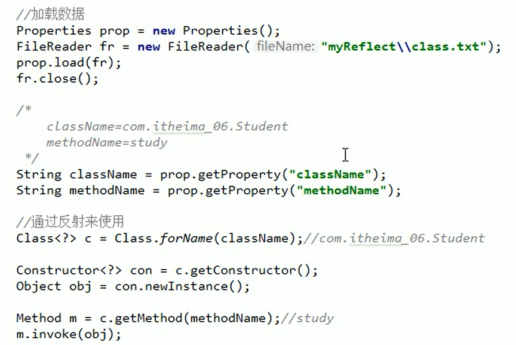


# 二十四、模块化

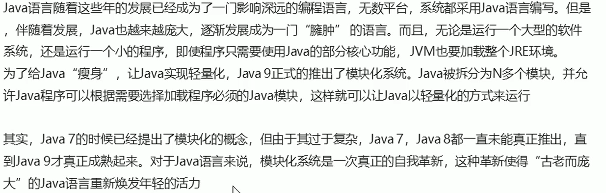

## 24.1 不同模块间访问类：

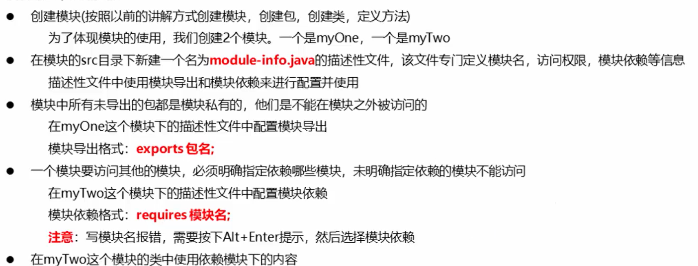

## 24.2 模块服务 

 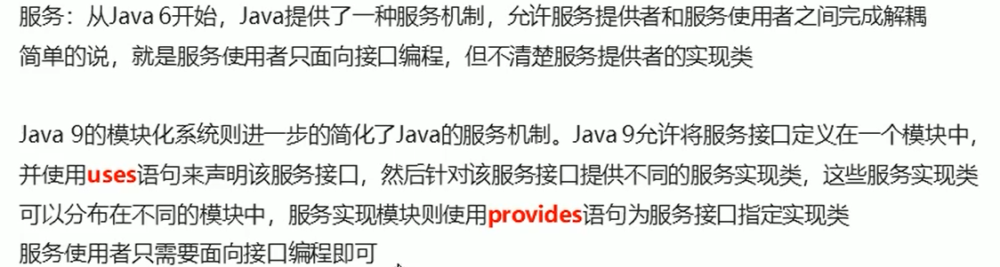

 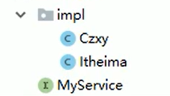


 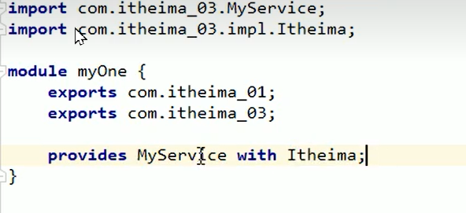

# 二十五、XML

## 25.1 概念

 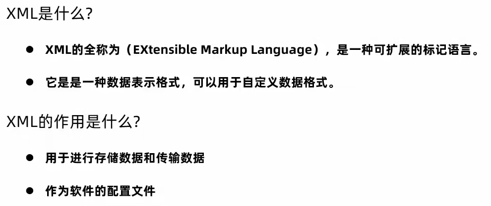


**示例：**

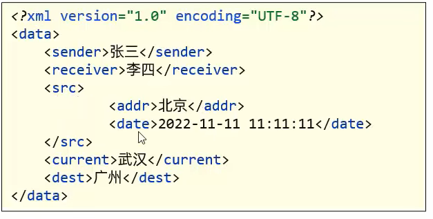


**特点和使用场景**


## 25.2 语法规则

**文档声明：**

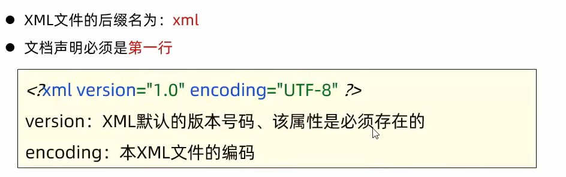

 **标签（元素）规则跟HTML类似：**

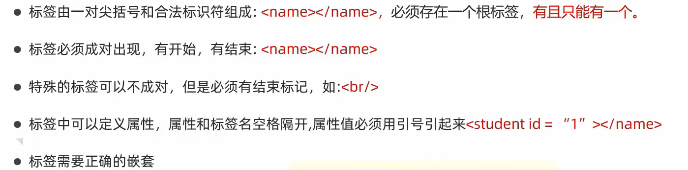

注释、特殊字符、CDATA区：

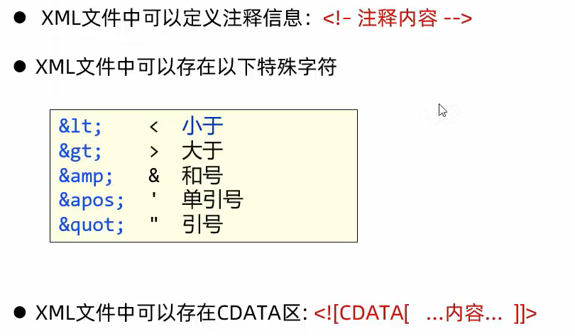

 CDATA区可以任意写文本而不用担心冲突的发生，输入CD加回车能快速打出本语句。

## 25.3 文档约束

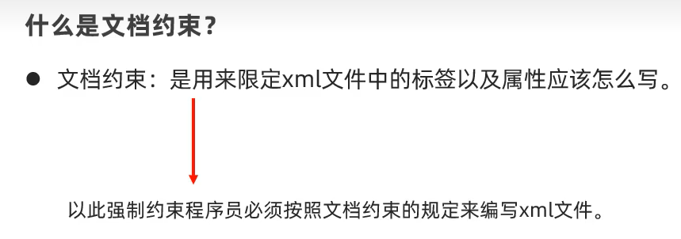

**文档约束的分类：DTD和schema**

**DTD约束步骤** 

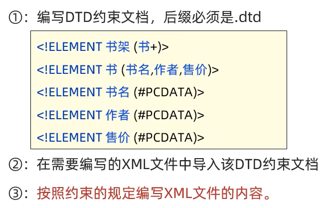

 **示例：**

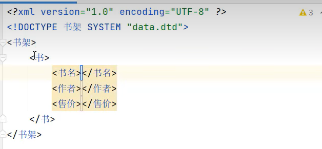

 作用和问题：


 **schema约束：**

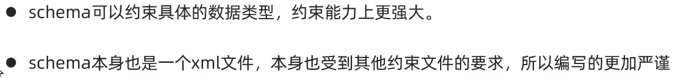