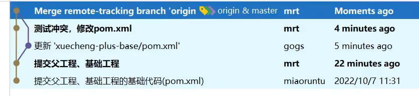
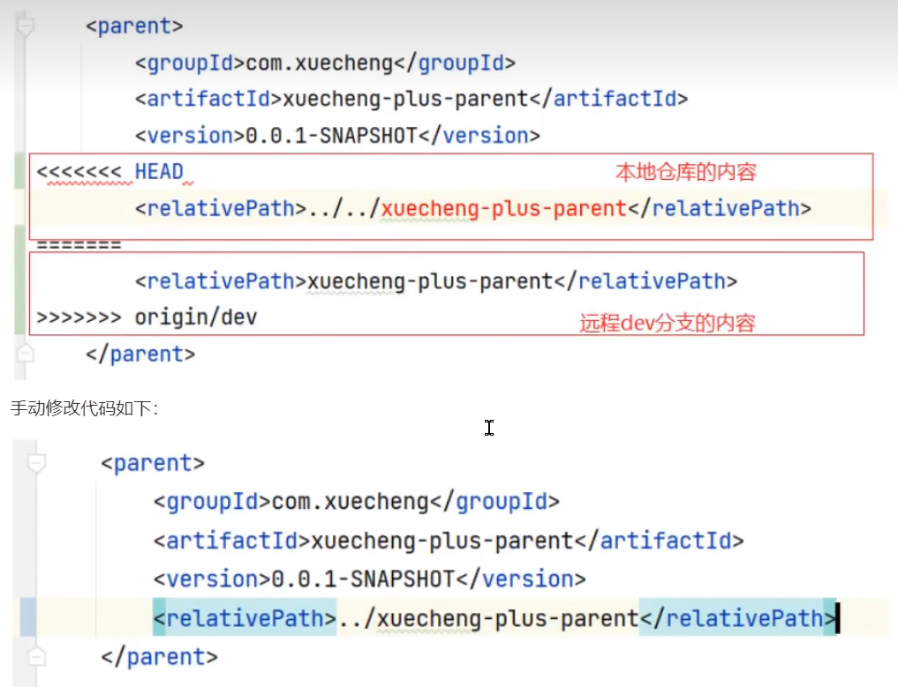
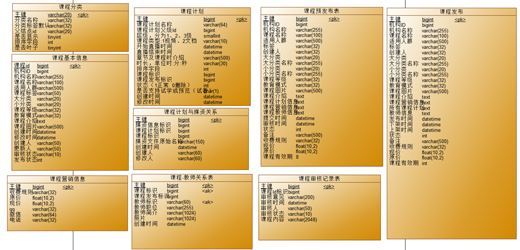
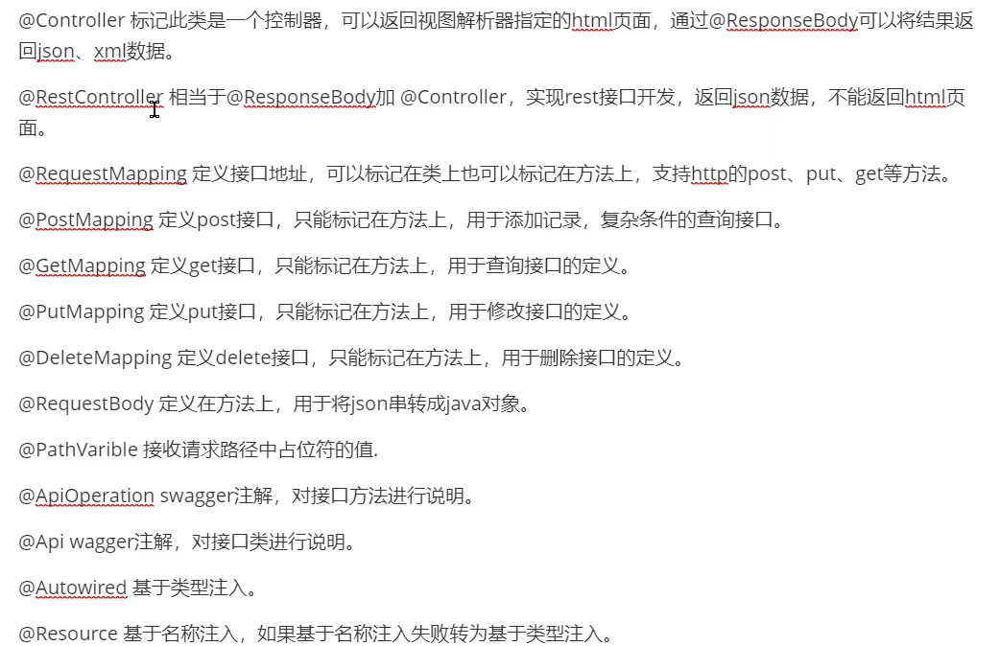
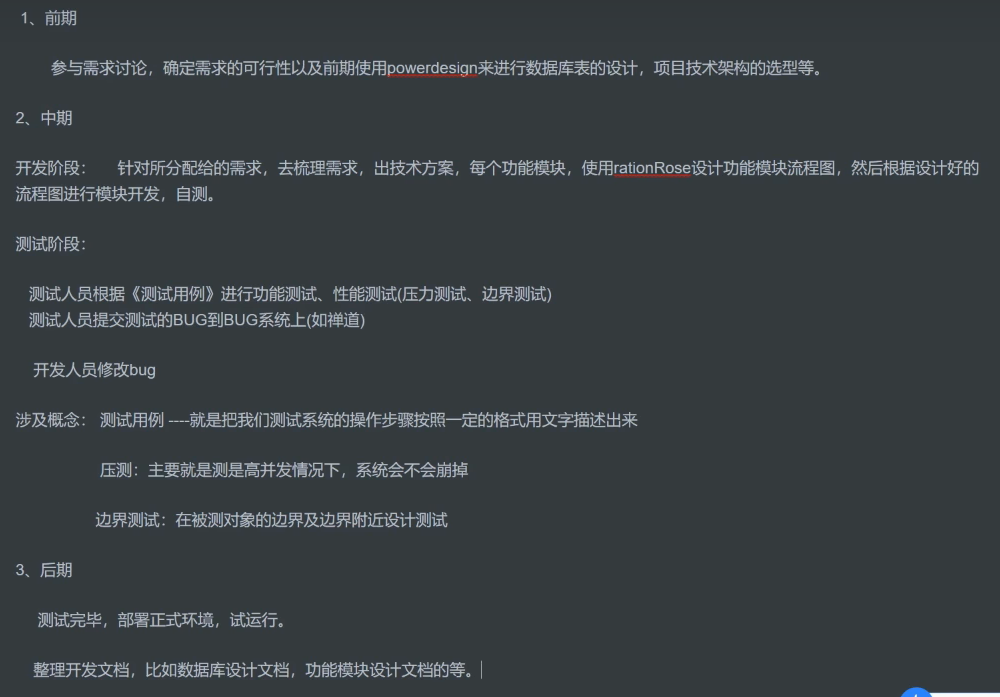
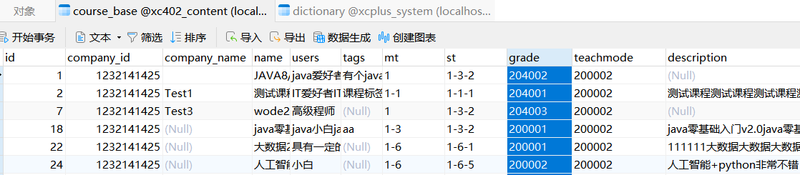

>  **导航：**
>
> [【Java笔记+踩坑汇总】Java基础+JavaWeb+SSM+SpringBoot+SpringCloud+瑞吉外卖/谷粒商城/学成在线+设计模式+面试题汇总+性能调优/架构设计+源码解析](https://blog.csdn.net/qq_40991313/article/details/126646289?spm=1001.2014.3001.5501)

[TOC]


# 介绍你的项目

1、详细说说你的项目吧

从以下几个方面进行项目介绍：

1、项目的背景，包括：是自研还是外包、什么业务、服务的客户群是谁、谁去运营等问题。 

2、项目的业务流程

3、项目的功能模块

4、项目的技术架构

5、个人工作职责

6、个人负责模块的详细说明，包括模块的设计，所用到的技术，技术的实现方案等。

一个例子：

我最近参与的项目是我们公司自研的专门针对成人职业技能教育的网络课堂系统，网站提供了成人职业技能培训的相关课程，如：软件开发培训、职业资格证书培训、成人学历教育培训等课程。项目基于B2B2C的业务模式，培训机构可以在平台入驻、发布课程，我们公司作为运营方由专门的人员对发布的课程进行审核，审核通过后课程才可以发布成功，课程包括免费和收费两种形式，对于免费课程普通用户可以直接选课学习，对于收费课程在选课后需要支付成功才可以继续学习。

> B2B2C是一种电子商务类型的网络购物商业模式，供应商-》企业-》消费者。第一个B指的是商品或服务的供应商，第二个B指的是从事电子商务的企业，C则是表示消费者。 

本项目包括用户端、机构端、运营端三个端。

核心模块包括：内容管理、媒资管理、课程搜索、订单支付、选课管理、认证授权等。

本项目采用前后端分离架构，后端采用SpringBoot、SpringCloud技术栈开发，数据库使用了MySQL，还使用的Redis、消息队列、分布式文件系统、Elasticsearch等中间件系统。

划分的微服务包括：内容管理服务、媒资管理服务、搜索服务、订单支付服务、 学习中心服务、系统管理服务、认证授权服务、网关服务、注册中心服务、配置中心服务等。

我在这个项目中负责了内容管理、媒资管理、订单支付模块的设计与开发。

内容管理模块，是对平台上的课程进行管理，课程的相关信息比较多这里在数据库设计了课程基本信息表、课程营销表、课程计划、课程师资表进行存储 ，培训机构要发布一门课程需要填写课程基本信息、课程营销信息、课程计划信息、课程师资信息，填写完毕后需要提交审核，由运营人员进行课程信息的审核，整个审核过程是程序自动审核加人工确认的方式，通常24小时审核完成。课程审核通过即可发布课程，课程的相关信息会聚合到课程发布表中，这里不仅要将课程信息写到课程发布表还要将课程信息写到索引库、分布式文件系统中，所以这里存在分布式事务的问题，项目使用本地消息表加任务调度的方式去解决这里的分布式事务，保存数据的最终一致性。

# 项目难点

断点续传、分布式锁、乐观锁、幂等性、xxl-job+消息SDK

# CDN是什么？

Content Delivery Network，即内容分发网络，本系统所有静态资源全部通过CDN加速来提高访问速度。主要是项目中有视频耗费流量，需要将这些影响用户体验的东西分发到就近的服务器，提高访问速度。

# 负载均衡是怎么做的？

将大量用户的请求通过负载均衡分发到多个服务器上，分担了服务器压力。

# git使用了什么仓库？

Gogs，内网仓库，是轻量化的Git托管平台。

# git代码冲突怎么处理？

原因：在同一分支pull或push时，或者多个分支向主分支合并时，导致本地和远程同一文件版本不同，就会冲突。

例如你在远程网页修改pom文件，然后修改本地pom文件，push时候两个版本不一致。

解决：图形界面的话，就合并，选择需要的代码。手动处理的话，修改有显示指针的目标文件，重新提交。





# 你们是在哪个分支开发？

在技术经理创建的开发分支下开发， 每个员工都是独立的开发分支，最后由技术经理将开发分支合并到主分支。

# 介绍一下Maven命令？

mvn clean 删除target目录下编译的内容
 mvn compile   编译项目源代码
 mvn test   对项目进行运行测试
 mvn package   打包
 mvn install  打包并把包上传到本地仓库

mvn deploy 打包并把包上传到远程仓库

# Maven依赖版本冲突怎么处理？什么是依赖传递？

**依赖传递：**A依赖了B和C,B和C有分别依赖了其他jar包，所以在A项目中就可以使用上面所有jar包，这就是所说的依赖传递

**依赖传递规则：**

- **同级“直接依赖”后配置优先：**当同级配置了相同资源的不同版本，**后配置的覆盖先配置的。**
- **不同级浅层优先：**当依赖中出现相同的资源时，层级越深，优先级越低，**层级越浅，优先级越高**
- **同级“间接依赖”声明顺序优先：**当资源在相同层级被依赖时，**配置顺序靠前的覆盖配置顺序靠后的**

**因为有依赖传递的存在**，就会导致jar包在依赖的过程中**出现冲突问题**。

**依赖冲突：**

这里所说的**依赖冲突**是指项目依赖的**某一个jar包**，**有多个不同的版本**，因而造成类包版本冲突。

**解决依赖冲突：** 

- 1.使用exclusions排除依赖，如依赖A时，排除A里的B依赖。
- 2.父工程使用depenecyManagement锁定版本号。

# MySQL常见的存储引擎和区别

**innoDb：**支持事务，锁粒度为行级锁，支持高并发，支持外键，适用于大量查的场景。

**MyISAM：**不支持事务，只支持表级锁，不支持外键，适用于大量增改的场景。

memory：数据存储在内存里。

MySQL的默认存储引擎是*InnoDB。*支持事务处理用的地方更多。

# MySQL建表应该注意什么？ 

注意根据情况选择存储引擎。

**时间格式**：date（只记录年月日）、datetime（记录年月日时分秒）

**字符类型**：varchar（可变长度，节省空间，但慢）、char、text（长文本）等可以选择。

金额类型：decimal


# 表是怎么设计的？

首先确认用户需求、 确认关键问题、梳理业务流程，根据业务流程使用PowerDesigner建表、直接生成sql语句，后面开发过程中发现有什么缺漏继续修改、优化表。



# 介绍三种模型类，dto、vo、po

**DTO：**数据传输对象，用于接口层向业务层之间传输数据

**PO：**持久化对象，用于业务层与持久层之间传输数据

**VO：**对象用在前端与接口层之间传输数据，常用于封装请求响应数据。


# Springboot接口开发的常用注解有哪些?



 @RequestParam定义在参数上，用于起别名；或者参数形式为数组时，接收集合类型参数。

# 项目开发流程是什么？

1、产品人员设计产品原型。

2、讨论需求，使用powerdesign设计数据库表，选型项目技术架构。

3、分模块设计接口

4、用swagger生成接口文档。

5、将接口文档给到前端人员,前后端分离开发。

6、开发完毕进行测试。

7、测试完毕发布项目,由运维人员进行部署安装。



# Mybatis的 ResultType和 ResultMap的区别?

**ResultType:**适用于数据库字段名和实体类属性名不同的情况。 

**ResultMap:**起别名，适用于数据库字段名和实体类属性名不同的情况。 

```XML
    <select id="selectAll" resultType="package1.pojo.User">
        select * from tb_user;
    </select>
```


```XML
<resultMap id="brandResultMap" type="brand">
    <!--
            id：完成主键字段的映射
                column：表的列名
                property：实体类的属性名
            result：完成一般字段的映射
                column：表的列名
                property：实体类的属性名
        -->
    <result column="brand_name" property="brandName"/>
    <result column="company_name" property="companyName"/>
</resultMap>
    <select id="selectAll" resultMap="brandResultMap">
        select *
        from tb_brand;
    </select>
```


# #{}和${}有什么区别?

**#{}**是**标记一个占位符**,可以防止sq注入。

**${}**用于在**动态sq中拼接字符串**,可能导致Sq注入。

# Mybatis分页插件的原理

首先**分页参数放到Threadlocal**中,**拦截执行的sql**,根据数据库类型添加对应的**分页语句重写sql**。

> 例如:
>
> ```sql
> select * from table where 条件
> ```
>
> 
>
> **转换为**
>
> ```sql
> select count(*) from table where 条件
> ```
>
> 
>
> **和**
>
> ```sql
> select * from table where 条件 limit
> ```
>
> 
>
> 计算出了tota总条数、 pagenum当前第几页、 page Size每页大小和当前页的数据,是否为首页,是否为尾页,总页数等。

# Threadlocal 

**TheadLocal是线程的局部变量，**具有线程隔离的效果。

Threadlocal并不是一个 Thread,而是 Thread的局部变量。

当使用 Threadlocal维护变量时, Threadlocal为每个使用该变量的线程提供独立的变量副本,所以每一个线程都可以独立地改变自己的副本,而不会影响其它线程所对应的副本。Threadlocal为每个线程提供单独一份存储空间,具有**线程隔离**的效果,只有在线程内才能获取到对应的值,线程外则不能访问。 

**TheadLocal常用方法：**


# 为什么要创建数据库字典？

降低耦合性，例如将课程的审核状态写成202001等数字，然后用数据库字典查询此数字代表的含义，这样以后想改审核状态的描述时候，就只需要从数据库字典改，不用sql语句逐条改课程表。

课程表的课程等级教学模式、审核状态、课程发布状态等字段都使用了数据库字典：



在访问前端页面时，会发请求查询所有字典表，放到内存中。

# 树形表的标记字段是什么？如何查询MySQL树形表？

只要表有一个“parent_id”字段，该表就可以组成一个树形表。

使用MySQL递归的方法，查询mysql树形表。 使用with recursive实现。

# mysql递归特点，对比Java递归的优势 

**mysql递归次数限制：**

mysql为了避免无限递归默认递归次数为1000，可以通过设置cte_max_recursion_depth参数增加递归深度，还可以通过max_execution_time限制执行时间，超过此时间也会终止递归操作。

**对比Java递归的优势：**

mysql递归相当于在存储过程中执行若干次sql语句，java程序仅与数据库建立一次链接执行递归操作。相比之下，Java递归性能就很差，每次递归都会建立一次数据库连接。

 递归查询课程多级分类

```sql
with recursive t1 as (        #t1是函数名、临时表名
select * from  course_category where  id= '1'   #初始记录，也就是根节点
union all         #把递归结果合并到t1表中
 select t2.* from course_category as t2 inner join t1 on t1.id = t2.parentid    #递归，用分类表t和临时表t1内连接查询
)

select *  from t1 order by t1.id, t1.orderby    #查t1表，相当于调用这个函数。
```


# 系统如何处理异常

我们自定义一个**统一的异常处理器**去捕获并处理异常。

使用控制器增加注解**@RestControllerAdvice**和异常处理注解**@ExceptionHandler**来实现。

**1)处理自定义异常**

程序在编写代码时根据校验结果**主动抛出**自定义异常类对象,拋岀异常时指定**详细的异常信息**,异常处理器捕获异常信息记录异常日志并响应给用户。

**2)处理未知异常**

接口执行过程中的一些**运行时异常**也会由异常理器统捕获,记录异常日志,统一响应给用户**500错误**。

在异常处理器中还可以针对某个异常类型进行单独处理。


# 请求参数的合法性校验如何做？

使用基于**JSR303的校验框架**实现, Springboot提供了JSR303的支持,它就是 spring- boot-starter-validation依赖,它包括了很多校验规则。

**实现方法：**在模型类中通过注解指定校验规则,在 controller方法上开启@Valid校验，或@Validated分组校验（要先定义分组类）。


# 什么情况下Spring事务会失效

0）分布式事务的情况：事务内存在远程调用（**跨JVM进程**）、单服务操作多个数据库、多服务单数据库

1)在方法中**捕获异常没有拋出去**

**2)非事务方法调用事务方法**。

3)事务方法内部调用事务方法

4)@Transactional标记的方法不是 public

5)抛出的异常与 rollbackfor指定的异常不匹配，默认ro‖ back For指定的异常为 Runtimeexception

6)数据库表不支持事务，比如MYSQL的 MYISAM存储引擎

7) Spring的传播行为导致事务失效，比如： PROPAGATION NEVER、 PROPAGATION NOT_ SUPPORTED

> PROPAGATION_ REQUIRED支持当前事务，如果当前没有事务，就新建一个事务。这是最常见的选择。
>
> PROPAGATION_ SUPPORTS-支持当前事务，如果当前没有事务，就以非事务方式执行，
>
> PROPAGATION_ MANDATORY-支持当前事努，如果当前没有事务，就拋出异常。
>
> PROPAGATION_ REQUIRES_ NEW新建事务，如果当前存在事务，把当前事务挂起。
>
> PROPAGATION NOT SUPPORTED-以非事努方式执行操作，如果当前存在事务，就把当前事努挂起
>
> PROPAGATION_ NEVER-以非事务方式执行，如果当前存在事务，则拋出异常。
>
> PROPAGATION NESTED-如果当前存在事务，则在嵌套事务内执行。如果当前没有事务，则与PROPAGATION_ REQUIRED类似的操作。


# 断点续传是怎么做的?

我们是基于**分块上传**的模式实现断点续传的需求，当文件上传一部分断网后前边已经上传过的不再上传。

1)前端对文件分块

2)前端使用多线程一块一块上传，上传前给服务端发一个消息校验该分块是否上传，如果已上传则不再上传

3)等所有分块上传完毕，服务端合并所有分块，校验文件的完整性。为分块全部上传到了服务器，服务器将所有分块按顺序进行合并，就是写每个分块文件内容按顺序依次写入一文件中。使用字节流去读写文件。

4)前端给服务传了一个md5值，服务端合并文件后计算合并后文件的md5是否和前端传的样，如果一样则说文件完整，如果不一样说明可能由于网络丢包导致文件不完整，这时上传失败需要重新上传


# 分块上传中断清理问题

上传一个文件进行分块上传，上传一半不传了，**之前上传到 minio的分块文件要清理吗?**怎么做的?

1、在数据库中有一张**文件表**记录 minion中存储的文件信息

2、文件开始上传时会写入文件表，**状态为上传中**，上传完成会更新**状态为上传完成**

3、当一个文件传了一半不再上传了说明该文件没有上传完成，会有**定时任务去查询文件表中的记录**，如果文件末上传完成则删除 minio中没有上传成功的文件目录


# 如何保证任务不重复执行? 

1)调度中心按**分片广播**的方式去下发任务

2)执行器收到作业**分片广播**的参数: 分片总数和分片序号，计算 任务id 除以 分片总数得到一个余数，如果余数等于分片序号这时就去执行这个任务，这里保证了**不同的执行器执行不同的任务**。

3)配置调度过期策略为“**忽略**”，避免同一个执行器多次重复执行同一个任务

4)配置任务阻塞处理策略为“**丢弃后续调度**”，注意: 丢弃也没事下一次调度就又可以执行了

5)另外还要保证任务处理的**幂等性**，执行过的任务可以打一个状态标记已完成，下次再调度执行该任务判断该任务已完成就不再执行。也可以把任务id-随机uuid存到Redis并设置30min过期时间，查id，对比值uuid判断是否重复执行。

# **订单或任务幂等性如何保证**

**1)数据库约束**，比如: 唯一索引，主键。同一个主键不可能两次都插入成功。

**2)乐观锁。**数据库表中增加一个版本字段，更新时判断是否等于某个版本。例如重复提交时判断数据库发现版本已被改变就不提交了。

**3)Redis唯一序列号**。Redis键为任务id，值为随机序列化uuid。请求前生成唯一的序列号，携带序列号去请求，执行时在redis记录该序列号表示以该序列号的请求执行过了，如果相同的序列号再次来执行说明是重复执行。

# 分布式锁的三种实现方式

**1、基于数据库唯一索引实现分布锁**

唯一索引：例如两个线程同时插入id为1的数据，将只有一个线程能插入成功，因为主键id具有唯一性。

**乐观锁**是这种方式。利用数据库主键唯一性的特点，或利用数据库唯一索引、行级锁的特点，比如：多个线程同时向数据库插入主键相同的同一条记录，谁插入成功谁就获取锁，多个线程同时去更新相同的记录，谁更新成功谁就抢到锁。

**2、基于redis实现锁**

redis提供了分布式锁的实现方案，比如：SETNX、set nx、redisson等。

拿SETNX举例说明，SETNX命令的工作过程是去set一个不存在的key，多个线程去设置同一个key只会有一个线程设置成功，设置成功的的线程拿到锁。

**3、使用zookeeper实现**

zookeeper是一个分布式协调服务，主要解决分布式程序之间的同步的问题。zookeeper的结构类似的文件目录，多线程向zookeeper创建一个子目录(节点)只会有一个创建成功，利用此特点可以实现分布式锁，谁创建该结点成功谁就获得锁。

本次我们选用数据库实现分布锁，后边的模块会选用其它方案到时再详细介绍。
 