>  **导航：**
>
> [【Java笔记+踩坑汇总】Java基础+JavaWeb+SSM+SpringBoot+SpringCloud+瑞吉外卖/谷粒商城/学成在线+设计模式+面试题汇总+性能调优/架构设计+源码解析](https://blog.csdn.net/qq_40991313/article/details/126646289?spm=1001.2014.3001.5501)

[TOC]


# **1 【检索模块】****需求分析**

## **1.1 全文检索介绍**

课程搜索是课程展示的渠道，用户通过课程搜索找到课程信息，进一步去查看课程的详细信息，进行选课、支付、学习。

本项目的课程搜索支持全文检索技术。

**什么是全文检索？**

[全文检索](https://baike.baidu.com/item/全文检索/8028630?fromModule=lemma_inlink)是指计算机索引程序通过扫描文章中的每一个词，**对每一个词建立一个索引**，指明该词在文章中出现的次数和位置，当用户查询时，检索程序就**根据事先建立的索引进行查找**，并将查找的结果反馈给用户的检索方式。这个过程类似于通过字典中的检索字表查字的过程。

全文检索可以简单理解为**通过索引搜索文章**。


全文检索的速度非常快，早期应用在搜索引擎技术中，比如：百度、google等，现在通常一些大型网站的搜索功能都是采用全文检索技术。


课程搜索也要将课程信息建立索引，在课程发布时建立课程索引，索引建立好用户可通过搜索网页去查询课程信息。

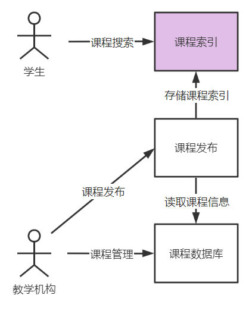

所以，课程搜索模块包括两部分：**课程索引、课程搜索**。

课程索引是将课程信息建立索引。

课程搜索是通过前端网页，通过关键字等条件去搜索课程。


## **1.2** **业务流程**

根据模块介绍的内容，课程搜索模块包括**课程索引、课程搜索**两部分。

### **1.2.1、课程发布时索引库里新增一条记录**

首先要建好ES索引库，然后在**课程发布操作执行后**通过消息处理方式索引库里新增一条记录，如下图：

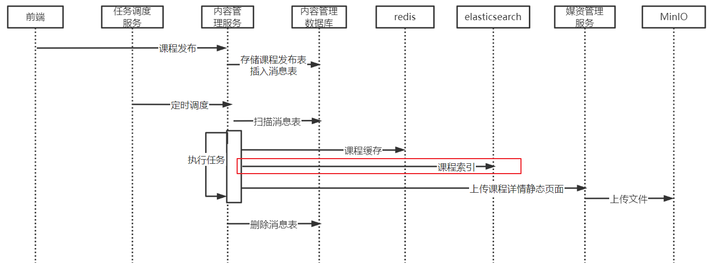

> **课程发布业务流程：**
>
> 1、向内容管理数据库的课程发布表存储课程发布信息，更新课程基本信息表中发布状态为已发布。
>
> 2、向Redis存储课程缓存信息。
>
> **3、向Elasticsearch存储课程索引信息。**
>
> 4、静态化课程预览页面并存储到文件系统minIO，实现快速浏览课程详情页面。

本项目使用**elasticsearch**作为索引及搜索服务。


### **1.2.**2、课程搜索

课程索引创建完成，用户才可以通过前端搜索课程信息。

课程搜索可以从首页进入搜索页面。

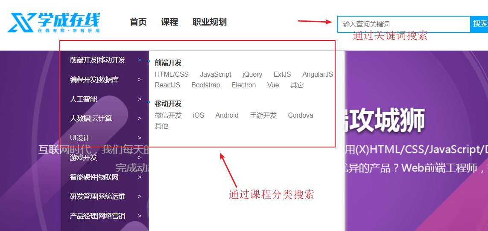

下图是搜索界面，可以通过课程分类、课程难度等级等条件进行搜索。


# **2** **准备环境**

## 2.0 ES回顾

[ElasticSearch基础1——索引和文档。Kibana,RestClient操作索引和文档+黑马旅游ES库导入_elasticsearch 文档 索引_vincewm的博客-CSDN博客](https://blog.csdn.net/qq_40991313/article/details/126807267?spm=1001.2014.3001.5501)

[elasticsearch基础2——DSL查询文档,黑马旅游项目查询功能_elasticsearch查询文档_vincewm的博客-CSDN博客](https://blog.csdn.net/qq_40991313/article/details/126819678?spm=1001.2014.3001.5501)[ElasticSearch基础3——聚合、补全、集群。黑马旅游检索高亮+自定义分词器+自动补全+前后端消息同步_vincewm的博客-CSDN博客](https://blog.csdn.net/qq_40991313/article/details/126861326?spm=1001.2014.3001.5501) 

## **2.1** **搭建ES,**kibana

**1.docker搭建ES,kibana：**

> 参考上面回顾文章第一篇。

kibana 是 ELK（Elasticsearch , Logstash, Kibana ）之一，kibana 一款开源的数据分析和可视化平台，通过可视化界面访问elasticsearch的索引库，并可以生成一个数据报表。

开发中主要使用kibana通过api对elasticsearch进行索引和搜索操作，通过浏览器访问 http://192.168.101.65:5601/app/dev_tools#/console进入kibana的开发工具界面。

**2.设置ES,kibana容器开机启动** 

修改虚拟机中的启动脚本restart.sh添加

```bash
docker stop elasticsearch
docker stop kibana

docker start elasticsearch
docker start kibana
```


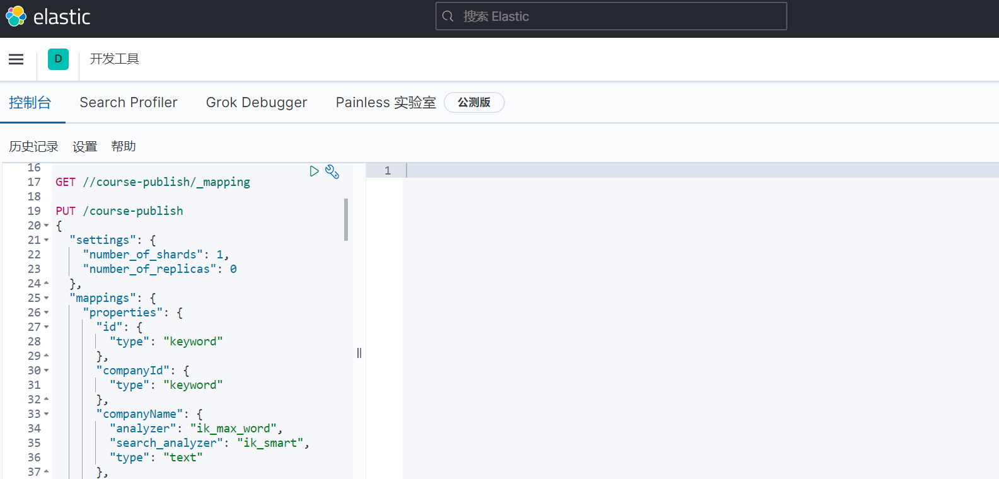


可通过命令：GET /_cat/indices?v 查看所有的索引，通过此命令判断kibana是否正常连接elasticsearch。

索引相当于MySQL中的表，Elasticsearch与MySQL之间概念的对应关系见下表：

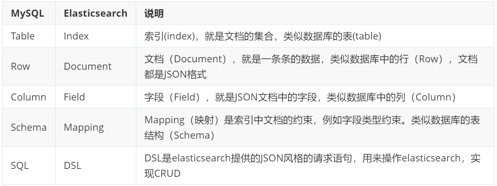

要使用elasticsearch需要建立索引，Mapping相当于表结构，Mapping创建后其字段不能删除，如果要删除需要删除整个索引，下边介绍创建索引、查询索引、删除索引的方法：

## **2.2 创建课程索引库**

**创建索引，并指定Mapping。**

PUT /course-publish

```bash
{
  "settings": {
    "number_of_shards": 1,
    "number_of_replicas": 0
  },
  "mappings": {
    "properties": {
      "id": {
        "type": "keyword"
      },
      "companyId": {
        "type": "keyword"
      },
      "companyName": {
        "analyzer": "ik_max_word",
        "search_analyzer": "ik_smart",
        "type": "text"
      },
      "name": {
        "analyzer": "ik_max_word",
        "search_analyzer": "ik_smart",
        "type": "text"
      },
      "users": {
        "index": false,
        "type": "text"
      },
      "tags": {
        "analyzer": "ik_max_word",
        "search_analyzer": "ik_smart",
        "type": "text"
      },
      "mt": {
        "type": "keyword"
      },
      "mtName": {
        "type": "keyword"
      },
      "st": {
        "type": "keyword"
      },
      "stName": {
        "type": "keyword"
      },
      "grade": {
        "type": "keyword"
      },
      "teachmode": {
        "type": "keyword"
      },
      "pic": {
        "index": false,
        "type": "text"
      },
      "description": {
        "analyzer": "ik_max_word",
        "search_analyzer": "ik_smart",
        "type": "text"
      },
      "createDate": {
        "format": "yyyy-MM-dd HH:mm:ss",
        "type": "date"
      },
      "status": {
        "type": "keyword"
      },
      "remark": {
        "index": false,
        "type": "text"
      },
      "charge": {
        "type": "keyword"
      },
      "price": {
        "type": "scaled_float",
        "scaling_factor": 100
      },
      "originalPrice": {
        "type": "scaled_float",
        "scaling_factor": 100
      },
      "validDays": {
        "type": "integer"
      }
    }
  }
}
```


> **删除索引**
>
> 如果发现创建的course-publish不正确可以删除重新创建。
>
> 删除索引后当中的文档数据也同时删除，一定要谨慎操作！
>
> 删除索引命令：DELETE /course-publish

## 2.3 测试是否创建成功

通过 GET /_cat/indices?v 查询所有的索引，查找course-publish是否创建成功。

通过GET /course-publish/_mapping 查询course-publish的索引结构。

```bash
{
  "course-publish" : {
    "mappings" : {
      "properties" : {
        "charge" : {
          "type" : "keyword"
        },
        "companyId" : {
          "type" : "keyword"
        },
        "companyName" : {
          "type" : "text",
          "analyzer" : "ik_max_word",
          "search_analyzer" : "ik_smart"
        },
        "createDate" : {
          "type" : "date",
          "format" : "yyyy-MM-dd HH:mm:ss"
        },
        "description" : {
          "type" : "text",
          "analyzer" : "ik_max_word",
          "search_analyzer" : "ik_smart"
        },
        "grade" : {
          "type" : "keyword"
        },
        "id" : {
          "type" : "keyword"
        },
        "mt" : {
          "type" : "keyword"
        },
        "mtName" : {
          "type" : "keyword"
        },
        "name" : {
          "type" : "text",
          "analyzer" : "ik_max_word",
          "search_analyzer" : "ik_smart"
        },
        "originalPrice" : {
          "type" : "scaled_float",
          "scaling_factor" : 100.0
        },
        "pic" : {
          "type" : "text",
          "index" : false
        },
        "price" : {
          "type" : "scaled_float",
          "scaling_factor" : 100.0
        },
        "remark" : {
          "type" : "text",
          "index" : false
        },
        "st" : {
          "type" : "keyword"
        },
        "stName" : {
          "type" : "keyword"
        },
        "status" : {
          "type" : "keyword"
        },
        "tags" : {
          "type" : "text",
          "analyzer" : "ik_max_word",
          "search_analyzer" : "ik_smart"
        },
        "teachmode" : {
          "type" : "keyword"
        },
        "users" : {
          "type" : "text",
          "index" : false
        },
        "validDays" : {
          "type" : "integer"
        }
      }
    }
  }
}
```


## **2.4 初始化****搜索模块**

创建搜索模块：


修改bootstrap.xml中nacos的namespace为自己的命名空间。

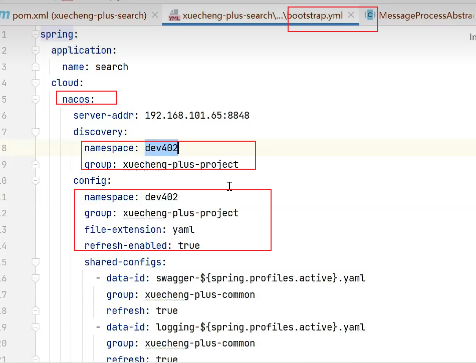

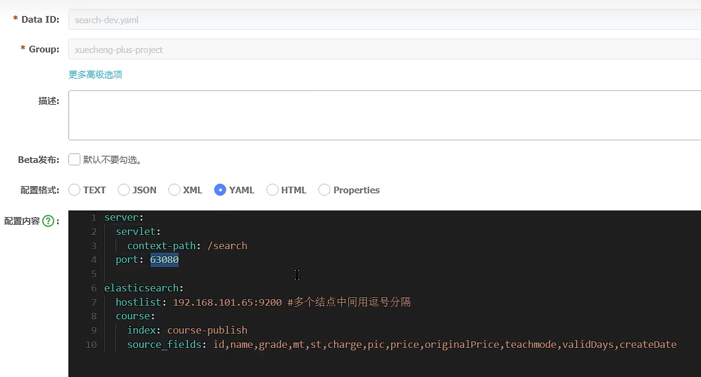


启动网关服务、搜索服务。

部署完成通过httpclient进行测试

```bash
### 添加课程索引
POST {{search_host}}/search/index/course
Content-Type: application/json

{
  "charge" : "201000",
  "companyId" : 100000,
  "companyName" : "北京黑马程序",
  "createDate" : "2022-09-25 09:36:11",
  "description" : "《Spring编程思想》是2007年6月1日机械工业出版社出版的图书，作者是埃克尔，译者是陈昊鹏。主要内容本书赢得了全球程序员的广泛赞誉，即使是最晦涩的概念，在Bruce Eckel的文字亲和力和小而直接的编程示例面前也会化解于无形。从Java的基础语法到最高级特性（深入的面向对象概念、多线程、自动项目构建、单元测试和调试等），本书都能逐步指导你轻松掌握。从本书获得的各项大奖以及来自世界各地的读者评论中，不难看出这是一本经典之作",
  "grade" : "204001",
  "id" : 102,
  "mt" : "1-3",
  "mtName" : "编程开发",
  "name" : "Spring编程思想",
  "originalPrice" : 200.0,
  "pic" : "/mediafiles/2022/09/20/1d0f0e6ed8a0c4a89bfd304b84599d9c.png",
  "price" : 100.0,
  "remark" : "没有备注",
  "st" : "1-3-2",
  "stName" : "Java语言",
  "status" : "203002",
  "tags" : "没有标签",
  "teachmode" : "200002",
  "validDays" : 222
}


### 搜索课程
GET {{search_host}}/search/course/list?pageNo=1&keywords=spring
Content-Type: application/json
```


进入前端搜索界面http://www.51xuecheng.cn/course/search.html


# **3** **索引管理**

## **3.1 文档操作回顾**

### **3.1.1** **添加文档**

索引创建好就可以向其中添加文档，此时elasticsearch会根据索引的mapping配置对有些字段进行分词。

这里我们要向course_publish中添加课程信息。

使用rest api进行测试，如下：

使用post请求，/course-publish/_doc/103 第一部分为索引名称，_doc固定，103为文档的主键id，这里为课程id。

课程内容使用json表示。

```bash
POST /course-publish/_doc/103
{
  "charge" : "201001",
  "companyId" : 100000,
  "companyName" : "北京黑马程序",
  "createDate" : "2022-09-25 09:36:11",
  "description" : "HTML/CSS",
  "grade" : "204001",
  "id" : 102,
  "mt" : "1-1",
  "mtName" : "前端开发",
  "name" : "Html参考大全",
  "originalPrice" : 200.0,
  "pic" : "/mediafiles/2022/09/20/e726b71ba99c70e8c9d2850c2a7019d7.jpg",
  "price" : 100.0,
  "remark" : "没有备注",
  "st" : "1-1-1",
  "stName" : "HTML/CSS",
  "status" : "203002",
  "tags" : "没有标签",
  "teachmode" : "200002",
  "validDays" : 222
}
```


如果要修改文档的内容可以使用上边相同的方法，如果没有则添加，如果存在则更新。


### **3.1.2** **查询文档**

添加文档成功后可以通过主键id查询该文档的信息。

语法如下：

```bash
GET /{索引库名称}/_doc/{id}
```


### **3.1.3** **更新文档**

更新文档分为全量更新和局部更新。

全量更新是指先删除再更新，语法如下：

```bash
PUT /{索引库名}/_doc/文档id
{
    "字段1": "值1",
    "字段2": "值2",
    // ... 略
}
```


局部更新语法如下：

```java
POST /{索引库名}/_update/文档id
{
    "doc": {
         "字段名": "新的值",
    }
}
```


### **3.1.4** **删除文档**

删除文档将从索引中删除文档的记录。

语法如下：

```bash
DELETE /{索引库名}/_doc/id值
```


## **3.2 课程****索引准备**

当课程发布时请求添加课程接口添加课程信息到索引，当课程下架时请求删除课程接口从索引中删除课程信息。 

### 3.2.1 课程索引模型类 

根据索引的mapping结构创建po类：

```java
package com.xuecheng.search.po;

/**
 * <p>
 * 课程索引信息
 * </p>
 *
 * @author itcast
 */
@Data
public class CourseIndex implements Serializable {

    private static final long serialVersionUID = 1L;

    /**
     * 主键
     */
    private Long id;

    /**
     * 机构ID
     */
    private Long companyId;

    /**
     * 公司名称
     */
    private String companyName;

    /**
     * 课程名称
     */
    private String name;

    /**
     * 适用人群
     */
    private String users;

    /**
     * 标签
     */
    private String tags;


    /**
     * 大分类
     */
    private String mt;

    /**
     * 大分类名称
     */
    private String mtName;

    /**
     * 小分类
     */
    private String st;

    /**
     * 小分类名称
     */
    private String stName;


    /**
     * 课程等级
     */
    private String grade;

    /**
     * 教育模式
     */
    private String teachmode;
    /**
     * 课程图片
     */
    private String pic;

    /**
     * 课程介绍
     */
    private String description;


    /**
     * 发布时间
     */
    @JSONField(format="yyyy-MM-dd HH:mm:ss")
    @JsonFormat(pattern = "yyyy-MM-dd HH:mm:ss")
    private LocalDateTime createDate;

    /**
     * 状态
     */
    private String status;

    /**
     * 备注
     */
    private String remark;

    /**
     * 收费规则，对应数据字典--203
     */
    private String charge;

    /**
     * 现价
     */
    private Float price;
    /**
     * 原价
     */
    private Float originalPrice;

    /**
     * 课程有效期天数
     */
    private Integer validDays;


}
```


### 3.2.2 controller，添加课程索引

创建索引接口如下：

```java
package com.xuecheng.search.controller;
 
/**
 * @description 课程索引接口
 * @date 2022/9/24 22:31
 */
@Api(value = "课程信息索引接口", tags = "课程信息索引接口")
@RestController
@RequestMapping("/index")
public class CourseIndexController {
 
    @Value("${elasticsearch.course.index}")
    private String courseIndexStore;
 
    @Autowired
    IndexService indexService;
 
    @ApiOperation("添加课程索引")
    @PostMapping("course")
    public Boolean add(@RequestBody CourseIndex courseIndex) {
   
        Long id = courseIndex.getId();
        if(id==null){
            XueChengPlusException.cast("课程id为空");
        }
        Boolean result = indexService.addCourseIndex(courseIndexStore, String.valueOf(id), courseIndex);
        if(!result){
            XueChengPlusException.cast("添加课程索引失败");
        }
        return result;
   
    }
}
```


## **3.3 业务实现，**添加课程索引

定义service接口，请求elasticsearch添加课程信息。

> 注意：为了适应其它文档信息，将添加文档定义为通用的添加文档接口，此接口不仅应添加课程还应添加其它信息。

```java
package com.xuecheng.search.service.impl;

/**
 * @description 课程索引管理接口实现
 */
@Slf4j
@Service
public class IndexServiceImpl implements IndexService {


 @Autowired
 RestHighLevelClient client;

 @Override
 public Boolean addCourseIndex(String indexName,String id,Object object) {
  String jsonString = JSON.toJSONString(object);
  IndexRequest indexRequest = new IndexRequest(indexName).id(id);
  //指定索引文档内容
  indexRequest.source(jsonString,XContentType.JSON);
  //索引响应对象
  IndexResponse indexResponse = null;
  try {
   indexResponse = client.index(indexRequest, RequestOptions.DEFAULT);
  } catch (IOException e) {
   log.error("添加索引出错:{}",e.getMessage());
   e.printStackTrace();
   XueChengPlusException.cast("添加索引出错");
  }
  String name = indexResponse.getResult().name();
  System.out.println(name);
  return name.equalsIgnoreCase("created") || name.equalsIgnoreCase("updated");

 }

 
}
```


## **3.4** **测试**

使用httpclient进行测试

```bash
### 添加课程索引
POST {{search_host}}/search/index/course
Content-Type: application/json

{
  "charge" : "201000",
  "companyId" : 100000,
  "companyName" : "北京黑马程序员",
  "createDate" : "2022-09-25 09:36:11",
  "description" : "《Java编程思想》是2007年6月1日机械工业出版社出版的图书，作者是埃克尔，译者是陈昊鹏。主要内容本书赢得了全球程序员的广泛赞誉，即使是最晦涩的概念，在Bruce Eckel的文字亲和力和小而直接的编程示例面前也会化解于无形。从Java的基础语法到最高级特性（深入的面向对象概念、多线程、自动项目构建、单元测试和调试等），本书都能逐步指导你轻松掌握。从本书获得的各项大奖以及来自世界各地的读者评论中，不难看出这是一本经典之作",
  "grade" : "204001",
  "id" : 102,
  "mt" : "1-3",
  "mtName" : "编程开发",
  "name" : "Java编程思想",
  "originalPrice" : 200.0,
  "pic" : "/mediafiles/2022/09/20/1d0f0e6ed8a0c4a89bfd304b84599d9c.png",
  "price" : 100.0,
  "remark" : "没有备注",
  "st" : "1-3-2",
  "stName" : "Java语言",
  "status" : "203002",
  "tags" : "没有标签",
  "teachmode" : "200002",
  "validDays" : 222
}
```


# **4 课程****搜索**

## **4.1** **需求分析**

索引信息维护完成下一步定义搜索接口搜索课程信息，首先需要搞清楚搜索功能的需求。

进入搜索界面，如下图：

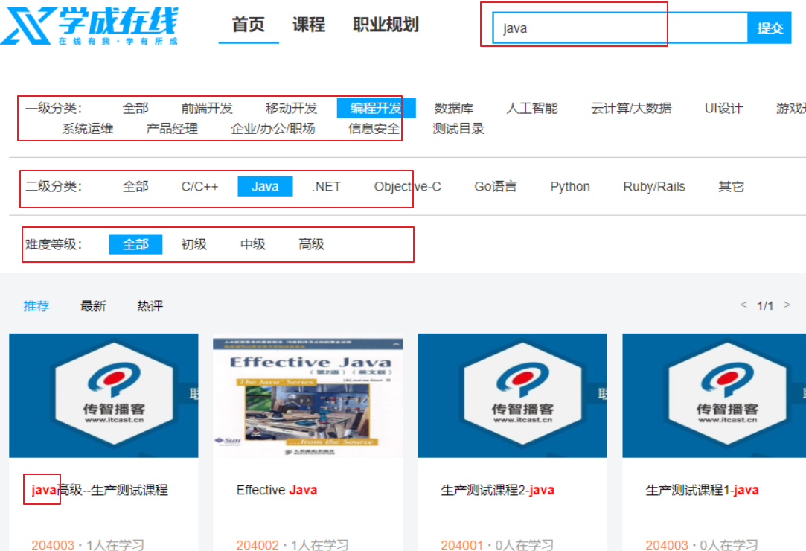


根据搜索界面可知**需求**如下：

1、根据一级分类、二级分类搜索课程信息。

2、根据关键字搜索课程信息，搜索方式为全文检索，关键字需要匹配课程的名称、 课程内容。

3、根据难度等级搜索课程。

4、搜索结点分页显示。

**技术点：**

1、整体采用布尔查询。

2、根据关键字搜索，采用MultiMatchQuery，搜索name、description字段。

3、根据分类、课程等级搜索采用过滤器实现。

4、分页查询。

5、高亮显示。


> **为什么课程分类、课程等级等查询使用过滤器方式？**
>
> 使用关键字查询需要计算相关度得分，根据课程分类、课程等级去查询不需要计算相关度得分，使用过滤器实现根据课程分类、课程等级查询的过程**不会计算相关度得分**，效率更高。


## **4.2** **接口定义**

### 4.2.1 搜索条件DTO类

```java
package com.xuecheng.search.dto;

/**
 * @description 搜索课程参数dtl
 * @author Mr.M
 * @date 2022/9/24 22:36
 * @version 1.0
 */
 @Data
 @ToString
public class SearchCourseParamDto {

  //关键字
  private String keywords;

  //大分类
  private String mt;

  //小分类
  private String st;
  //难度等级
  private String grade;


}
```


### 4.2.2 搜索结果类 

为了适应后期的扩展，定义搜索结果类，让它继承PageResult

```java
package com.xuecheng.search.dto;

@Data
@ToString
public class SearchPageResultDto<T> extends PageResult {

    //大分类列表
    List<String> mtList;
    //小分类列表
    List<String> stList;

    public SearchPageResultDto(List<T> items, long counts, long page, long pageSize) {
        super(items, counts, page, pageSize);
    }

}
```


### 4.2.3 课程搜索controller

```java
package com.xuecheng.search.controller;

/**
 * @description 课程搜索接口
 */
@Api(value = "课程搜索接口",tags = "课程搜索接口")
 @RestController
 @RequestMapping("/course")
public class CourseSearchController {

 @Autowired
 CourseSearchService courseSearchService;


 @ApiOperation("课程搜索列表")
  @GetMapping("/list")
 public SearchPageResultDto<CourseIndex> list(PageParams pageParams, SearchCourseParamDto searchCourseParamDto){

    return courseSearchService.queryCoursePubIndex(pageParams,searchCourseParamDto);
   
  }
}
```


### 4.2.4 课程搜索service完整代码

```java
   @Override
    public SearchPageResultDto<CourseIndex> queryCoursePubIndex(PageParams pageParams, SearchCourseParamDto courseSearchParam) {

        //设置索引
        SearchRequest searchRequest = new SearchRequest(courseIndexStore);

        SearchSourceBuilder searchSourceBuilder = new SearchSourceBuilder();
        BoolQueryBuilder boolQueryBuilder = QueryBuilders.boolQuery();
        //source源字段过虑
        String[] sourceFieldsArray = sourceFields.split(",");
        searchSourceBuilder.fetchSource(sourceFieldsArray, new String[]{});
        if(courseSearchParam==null){
            courseSearchParam = new SearchCourseParamDto();
        }
        //关键字
        if(StringUtils.isNotEmpty(courseSearchParam.getKeywords())){
            //匹配关键字
            MultiMatchQueryBuilder multiMatchQueryBuilder = QueryBuilders.multiMatchQuery(courseSearchParam.getKeywords(), "name", "description");
            //设置匹配占比
            multiMatchQueryBuilder.minimumShouldMatch("70%");
            //提升另个字段的Boost值
            multiMatchQueryBuilder.field("name",10);
            boolQueryBuilder.must(multiMatchQueryBuilder);
        }
        //过虑
        if(StringUtils.isNotEmpty(courseSearchParam.getMt())){
            boolQueryBuilder.filter(QueryBuilders.termQuery("mtName",courseSearchParam.getMt()));
        }
        if(StringUtils.isNotEmpty(courseSearchParam.getSt())){
            boolQueryBuilder.filter(QueryBuilders.termQuery("stName",courseSearchParam.getSt()));
        }
        if(StringUtils.isNotEmpty(courseSearchParam.getGrade())){
            boolQueryBuilder.filter(QueryBuilders.termQuery("grade",courseSearchParam.getGrade()));
        }
        //分页
        Long pageNo = pageParams.getPageNo();
        Long pageSize = pageParams.getPageSize();
        int start = (int) ((pageNo-1)*pageSize);
        searchSourceBuilder.from(start);
        searchSourceBuilder.size(Math.toIntExact(pageSize));
        //布尔查询
        searchSourceBuilder.query(boolQueryBuilder);
        //高亮设置
        HighlightBuilder highlightBuilder = new HighlightBuilder();
        highlightBuilder.preTags("<font class='eslight'>");
        highlightBuilder.postTags("</font>");
        //设置高亮字段
        highlightBuilder.fields().add(new HighlightBuilder.Field("name"));
        searchSourceBuilder.highlighter(highlightBuilder);
        //请求搜索
        searchRequest.source(searchSourceBuilder);
        //聚合设置
        buildAggregation(searchRequest);
        SearchResponse searchResponse = null;
        try {
            searchResponse = client.search(searchRequest, RequestOptions.DEFAULT);
        } catch (IOException e) {
            e.printStackTrace();
            log.error("课程搜索异常：{}",e.getMessage());
            return new SearchPageResultDto<CourseIndex>(new ArrayList(),0,0,0);
        }

        //结果集处理
        SearchHits hits = searchResponse.getHits();
        SearchHit[] searchHits = hits.getHits();
        //记录总数
        TotalHits totalHits = hits.getTotalHits();
        //数据列表
        List<CourseIndex> list = new ArrayList<>();

        for (SearchHit hit : searchHits) {

            String sourceAsString = hit.getSourceAsString();
            CourseIndex courseIndex = JSON.parseObject(sourceAsString, CourseIndex.class);

            //取出source
            Map<String, Object> sourceAsMap = hit.getSourceAsMap();

            //课程id
            Long id = courseIndex.getId();
            //取出名称
            String name = courseIndex.getName();
            //取出高亮字段内容
            Map<String, HighlightField> highlightFields = hit.getHighlightFields();
            if(highlightFields!=null){
                HighlightField nameField = highlightFields.get("name");
                if(nameField!=null){
                    Text[] fragments = nameField.getFragments();
                    StringBuffer stringBuffer = new StringBuffer();
                    for (Text str : fragments) {
                        stringBuffer.append(str.string());
                    }
                    name = stringBuffer.toString();

                }
            }
            courseIndex.setId(id);
            courseIndex.setName(name);

            list.add(courseIndex);

        }
        SearchPageResultDto<CourseIndex> pageResult = new SearchPageResultDto<>(list, totalHits.value,pageNo,pageSize);

        //获取聚合结果
        List<String> mtList= getAggregation(searchResponse.getAggregations(), "mtAgg");
        List<String> stList = getAggregation(searchResponse.getAggregations(), "stAgg");

        pageResult.setMtList(mtList);
        pageResult.setStList(stList);

        return pageResult;
    }
```


## **4.3** **基本查询实现**

### 4.3.1 service

搜索接口的内容较多，我们分几步实现，首先实现根据分页搜索，接口实现如下：

```java
package com.xuecheng.search.service.impl;
/**
 * @author Mr.M
 * @version 1.0
 * @description 课程搜索service实现类
 * @date 2022/9/24 22:48
 */
@Slf4j
@Service
public class CourseSearchServiceImpl implements CourseSearchService {

    @Value("${elasticsearch.course.index}")
    private String courseIndexStore;
    @Value("${elasticsearch.course.source_fields}")
    private String sourceFields;

    @Autowired
    RestHighLevelClient client;

    /**
     * @description 搜索课程列表
     * @param pageParams 分页参数
     * @param searchCourseParamDto 搜索条件
     * @return PageResult<CourseIndex> 课程列表
     * @author Mr.M
     * @date 2022/9/24 22:45
    */
    @Override
    public SearchPageResultDto<CourseIndex> queryCoursePubIndex(PageParams pageParams, SearchCourseParamDto courseSearchParam) {

        //设置索引
        SearchRequest searchRequest = new SearchRequest(courseIndexStore);

        SearchSourceBuilder searchSourceBuilder = new SearchSourceBuilder();
        BoolQueryBuilder boolQueryBuilder = QueryBuilders.boolQuery();
        //source源字段过虑
        String[] sourceFieldsArray = sourceFields.split(",");
        searchSourceBuilder.fetchSource(sourceFieldsArray, new String[]{});
       
        //分页
        Long pageNo = pageParams.getPageNo();
        Long pageSize = pageParams.getPageSize();
        int start = (int) ((pageNo-1)*pageSize);
        searchSourceBuilder.from(start);
        searchSourceBuilder.size(Math.toIntExact(pageSize));
       //布尔查询
        searchSourceBuilder.query(boolQueryBuilder);
       
        //请求搜索
        searchRequest.source(searchSourceBuilder);
      
        
        SearchResponse searchResponse = null;
        try {
            searchResponse = client.search(searchRequest, RequestOptions.DEFAULT);
        } catch (IOException e) {
            e.printStackTrace();
            log.error("课程搜索异常：{}",e.getMessage());
            return new SearchPageResultDto<CourseIndex>(new ArrayList(),0,0,0);
        }

        //结果集处理
        SearchHits hits = searchResponse.getHits();
        SearchHit[] searchHits = hits.getHits();
        //记录总数
        TotalHits totalHits = hits.getTotalHits();
        //数据列表
        List<CourseIndex> list = new ArrayList<>();

        for (SearchHit hit : searchHits) {

            String sourceAsString = hit.getSourceAsString();
            CourseIndex courseIndex = JSON.parseObject(sourceAsString, CourseIndex.class);
            list.add(courseIndex);

        }
        SearchPageResultDto<CourseIndex> pageResult = new SearchPageResultDto<>(list, totalHits.value,pageNo,pageSize);

       

        return pageResult;
    }


}
```


### **4.3.2** **测试**

当输入查询条件时会查询全部课程信息并支持分页查询。

1、准备测试

启动nginx、网关、搜索服务。

使用kibana通过rest api向索引库添加课程信息，或通过httpclient添加课程信息，至少添加两条信息。

2、进入搜索界面

默认查询出刚才添加的课程信息。

3、修改分页参数测试分页

打开course/ search.html页面 ，找到如下图所示位置：

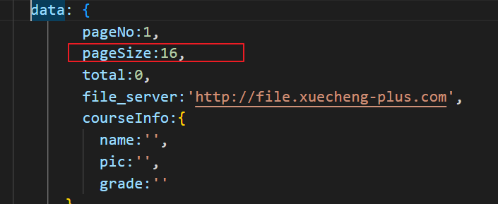

修改pageSize为1,即一页显示一条记录。

刷新搜索界面，每页显示一条记录，如下图：


## **4.4** **根据条件搜索**

下边实现根据关键、一级分类、二级分类、难度等级搜索。

```java
@Override
public SearchPageResultDto<CourseIndex> queryCoursePubIndex(PageParams pageParams, SearchCourseParamDto courseSearchParam) {

    //设置索引
    SearchRequest searchRequest = new SearchRequest(courseIndexStore);

    SearchSourceBuilder searchSourceBuilder = new SearchSourceBuilder();
    BoolQueryBuilder boolQueryBuilder = QueryBuilders.boolQuery();
    //source源字段过虑
    String[] sourceFieldsArray = sourceFields.split(",");
    searchSourceBuilder.fetchSource(sourceFieldsArray, new String[]{});
    if(courseSearchParam==null){
        courseSearchParam = new SearchCourseParamDto();
    }
    //关键字
    if(StringUtils.isNotEmpty(courseSearchParam.getKeywords())){
        //匹配关键字
        MultiMatchQueryBuilder multiMatchQueryBuilder = QueryBuilders.multiMatchQuery(courseSearchParam.getKeywords(), "name", "description");
        //设置匹配占比
        multiMatchQueryBuilder.minimumShouldMatch("70%");
        //提升另个字段的Boost值
        multiMatchQueryBuilder.field("name",10);
        boolQueryBuilder.must(multiMatchQueryBuilder);
    }
    //过虑
    if(StringUtils.isNotEmpty(courseSearchParam.getMt())){
        boolQueryBuilder.filter(QueryBuilders.termQuery("mtName",courseSearchParam.getMt()));
    }
    if(StringUtils.isNotEmpty(courseSearchParam.getSt())){
        boolQueryBuilder.filter(QueryBuilders.termQuery("stName",courseSearchParam.getSt()));
    }
    if(StringUtils.isNotEmpty(courseSearchParam.getGrade())){
        boolQueryBuilder.filter(QueryBuilders.termQuery("grade",courseSearchParam.getGrade()));
    }
    //分页
    Long pageNo = pageParams.getPageNo();
    Long pageSize = pageParams.getPageSize();
    int start = (int) ((pageNo-1)*pageSize);
    searchSourceBuilder.from(start);
    searchSourceBuilder.size(Math.toIntExact(pageSize));
    //布尔查询
    searchSourceBuilder.query(boolQueryBuilder);
   
    //请求搜索
    searchRequest.source(searchSourceBuilder);
  
    SearchResponse searchResponse = null;
    try {
        searchResponse = client.search(searchRequest, RequestOptions.DEFAULT);
    } catch (IOException e) {
        e.printStackTrace();
        log.error("课程搜索异常：{}",e.getMessage());
        return new SearchPageResultDto<CourseIndex>(new ArrayList(),0,0,0);
    }

    //结果集处理
    SearchHits hits = searchResponse.getHits();
    SearchHit[] searchHits = hits.getHits();
    //记录总数
    TotalHits totalHits = hits.getTotalHits();
    //数据列表
    List<CourseIndex> list = new ArrayList<>();

    for (SearchHit hit : searchHits) {

        String sourceAsString = hit.getSourceAsString();
        CourseIndex courseIndex = JSON.parseObject(sourceAsString, CourseIndex.class);

       
        list.add(courseIndex);

    }
    SearchPageResultDto<CourseIndex> pageResult = new SearchPageResultDto<>(list, totalHits.value,pageNo,pageSize);

   

    return pageResult;
}
```


**测试**

进入搜索界面，输入关键字进行测试。

一级分类、二级分类在下边的聚合搜索中测试。


## **4.5** **聚合搜索，动态获取两级分类**

### 4.5.1 实现 

搜索界面上显示的一级分类、二级分类来源于搜索结果，使用聚合搜索实现**获取搜索结果中的一级分类、二级分类:**

搜索方法如下：

```java
@Override
public SearchPageResultDto<CourseIndex> queryCoursePubIndex(PageParams pageParams, SearchCourseParamDto courseSearchParam) {

    //设置索引
    SearchRequest searchRequest = new SearchRequest(courseIndexStore);

    SearchSourceBuilder searchSourceBuilder = new SearchSourceBuilder();
    BoolQueryBuilder boolQueryBuilder = QueryBuilders.boolQuery();
    //source源字段过虑
    String[] sourceFieldsArray = sourceFields.split(",");
    searchSourceBuilder.fetchSource(sourceFieldsArray, new String[]{});
    if(courseSearchParam==null){
        courseSearchParam = new SearchCourseParamDto();
    }
    //关键字
    if(StringUtils.isNotEmpty(courseSearchParam.getKeywords())){
        //匹配关键字
        MultiMatchQueryBuilder multiMatchQueryBuilder = QueryBuilders.multiMatchQuery(courseSearchParam.getKeywords(), "name", "description");
        //设置匹配占比
        multiMatchQueryBuilder.minimumShouldMatch("70%");
        //提升另个字段的Boost值
        multiMatchQueryBuilder.field("name",10);
        boolQueryBuilder.must(multiMatchQueryBuilder);
    }
    //过虑
    if(StringUtils.isNotEmpty(courseSearchParam.getMt())){
        boolQueryBuilder.filter(QueryBuilders.termQuery("mtName",courseSearchParam.getMt()));
    }
    if(StringUtils.isNotEmpty(courseSearchParam.getSt())){
        boolQueryBuilder.filter(QueryBuilders.termQuery("stName",courseSearchParam.getSt()));
    }
    if(StringUtils.isNotEmpty(courseSearchParam.getGrade())){
        boolQueryBuilder.filter(QueryBuilders.termQuery("grade",courseSearchParam.getGrade()));
    }
    //分页
    Long pageNo = pageParams.getPageNo();
    Long pageSize = pageParams.getPageSize();
    int start = (int) ((pageNo-1)*pageSize);
    searchSourceBuilder.from(start);
    searchSourceBuilder.size(Math.toIntExact(pageSize));
    //布尔查询
    searchSourceBuilder.query(boolQueryBuilder);
  
  
    //请求搜索
    searchRequest.source(searchSourceBuilder);
    //聚合设置
    buildAggregation(searchRequest);
    SearchResponse searchResponse = null;
    try {
        searchResponse = client.search(searchRequest, RequestOptions.DEFAULT);
    } catch (IOException e) {
        e.printStackTrace();
        log.error("课程搜索异常：{}",e.getMessage());
        return new SearchPageResultDto<CourseIndex>(new ArrayList(),0,0,0);
    }

    //结果集处理
    SearchHits hits = searchResponse.getHits();
    SearchHit[] searchHits = hits.getHits();
    //记录总数
    TotalHits totalHits = hits.getTotalHits();
    //数据列表
    List<CourseIndex> list = new ArrayList<>();

    for (SearchHit hit : searchHits) {

        String sourceAsString = hit.getSourceAsString();
        CourseIndex courseIndex = JSON.parseObject(sourceAsString, CourseIndex.class);

       

        list.add(courseIndex);

    }
    SearchPageResultDto<CourseIndex> pageResult = new SearchPageResultDto<>(list, totalHits.value,pageNo,pageSize);

    //获取聚合结果
    List<String> mtList= getAggregation(searchResponse.getAggregations(), "mtAgg");
    List<String> stList = getAggregation(searchResponse.getAggregations(), "stAgg");

    pageResult.setMtList(mtList);
    pageResult.setStList(stList);

    return pageResult;
}
```


### **4.5.2** **聚合搜索测试**

进入搜索界面，观察搜索请求的响应内容中是否存在mtList和stList.

观察页面一级分类、二级分类是否有分类信息。

注意：当选中一个一级分类时才会显示二级分类。

## **4.6** **高亮设置**

### **4.6.1 实现** 

最后实现关键词在课程名称中高亮显示。

```java
@Override
public SearchPageResultDto<CourseIndex> queryCoursePubIndex(PageParams pageParams, SearchCourseParamDto courseSearchParam) {

    //设置索引
    SearchRequest searchRequest = new SearchRequest(courseIndexStore);

    SearchSourceBuilder searchSourceBuilder = new SearchSourceBuilder();
    BoolQueryBuilder boolQueryBuilder = QueryBuilders.boolQuery();
    //source源字段过虑
    String[] sourceFieldsArray = sourceFields.split(",");
    searchSourceBuilder.fetchSource(sourceFieldsArray, new String[]{});
    if(courseSearchParam==null){
        courseSearchParam = new SearchCourseParamDto();
    }
    //关键字
    if(StringUtils.isNotEmpty(courseSearchParam.getKeywords())){
        //匹配关键字
        MultiMatchQueryBuilder multiMatchQueryBuilder = QueryBuilders.multiMatchQuery(courseSearchParam.getKeywords(), "name", "description");
        //设置匹配占比
        multiMatchQueryBuilder.minimumShouldMatch("70%");
        //提升另个字段的Boost值
        multiMatchQueryBuilder.field("name",10);
        boolQueryBuilder.must(multiMatchQueryBuilder);
    }
    //过虑
    if(StringUtils.isNotEmpty(courseSearchParam.getMt())){
        boolQueryBuilder.filter(QueryBuilders.termQuery("mtName",courseSearchParam.getMt()));
    }
    if(StringUtils.isNotEmpty(courseSearchParam.getSt())){
        boolQueryBuilder.filter(QueryBuilders.termQuery("stName",courseSearchParam.getSt()));
    }
    if(StringUtils.isNotEmpty(courseSearchParam.getGrade())){
        boolQueryBuilder.filter(QueryBuilders.termQuery("grade",courseSearchParam.getGrade()));
    }
    //分页
    Long pageNo = pageParams.getPageNo();
    Long pageSize = pageParams.getPageSize();
    int start = (int) ((pageNo-1)*pageSize);
    searchSourceBuilder.from(start);
    searchSourceBuilder.size(Math.toIntExact(pageSize));
    //布尔查询
    searchSourceBuilder.query(boolQueryBuilder);
    //高亮设置
    HighlightBuilder highlightBuilder = new HighlightBuilder();
    highlightBuilder.preTags("<font class='eslight'>");
    highlightBuilder.postTags("</font>");
    //设置高亮字段
    highlightBuilder.fields().add(new HighlightBuilder.Field("name"));
    searchSourceBuilder.highlighter(highlightBuilder);
    //请求搜索
    searchRequest.source(searchSourceBuilder);
    //聚合设置
    buildAggregation(searchRequest);
    SearchResponse searchResponse = null;
    try {
        searchResponse = client.search(searchRequest, RequestOptions.DEFAULT);
    } catch (IOException e) {
        e.printStackTrace();
        log.error("课程搜索异常：{}",e.getMessage());
        return new SearchPageResultDto<CourseIndex>(new ArrayList(),0,0,0);
    }

    //结果集处理
    SearchHits hits = searchResponse.getHits();
    SearchHit[] searchHits = hits.getHits();
    //记录总数
    TotalHits totalHits = hits.getTotalHits();
    //数据列表
    List<CourseIndex> list = new ArrayList<>();

    for (SearchHit hit : searchHits) {

        String sourceAsString = hit.getSourceAsString();
        CourseIndex courseIndex = JSON.parseObject(sourceAsString, CourseIndex.class);

        //取出source
        Map<String, Object> sourceAsMap = hit.getSourceAsMap();

        //课程id
        Long id = courseIndex.getId();
        //取出名称
        String name = courseIndex.getName();
        //取出高亮字段内容
        Map<String, HighlightField> highlightFields = hit.getHighlightFields();
        if(highlightFields!=null){
            HighlightField nameField = highlightFields.get("name");
            if(nameField!=null){
                Text[] fragments = nameField.getFragments();
                StringBuffer stringBuffer = new StringBuffer();
                for (Text str : fragments) {
                    stringBuffer.append(str.string());
                }
                name = stringBuffer.toString();

            }
        }
        courseIndex.setId(id);
        courseIndex.setName(name);

        list.add(courseIndex);

    }
    SearchPageResultDto<CourseIndex> pageResult = new SearchPageResultDto<>(list, totalHits.value,pageNo,pageSize);

    //获取聚合结果
    List<String> mtList= getAggregation(searchResponse.getAggregations(), "mtAgg");
    List<String> stList = getAggregation(searchResponse.getAggregations(), "stAgg");

    pageResult.setMtList(mtList);
    pageResult.setStList(stList);

    return pageResult;
}
```


### **4.6.2** **高亮设置测试**

输入关键字，观察搜索结果，标题中是否对关键字信息进行高亮显示。

# **5** **课程信息和索引同步**

## **5.1** **技术方案**

### 5.1.1 **实时性要求高的场景方案选择**

> 通过向索引中添加课程信息最终实现了课程的搜索，我们发现课程信息是先保存在关系数据库中，而后再写入索引，这个过程是将关系数据中的数据同步到elasticsearch索引中的过程，可以简单成为索引同步。
>
> 通常项目中使用elasticsearch需要完成索引同步.


针对实时性非常高的场景需要满足数据的及时同步，可以同步调用，或使用Canal去实现。

1）**同步调用：**同步调用即在向MySQL写数据后**远程调用**搜索服务的接口写入索引，此方法简单但是**耦合**代码太高。

2）**canal：**可以使用一个中间的软件canal解决耦合性的问题，但存在学习与维护成本。

### 5.1.2 中间件Canal介绍 

**canal**主要用途是基于 MySQL 数据库增量日志解析，并能提供增量数据订阅和消费，实现将MySQL的数据**同步**到消息队列、Elasticsearch、其它数据库等，应用场景十分丰富。

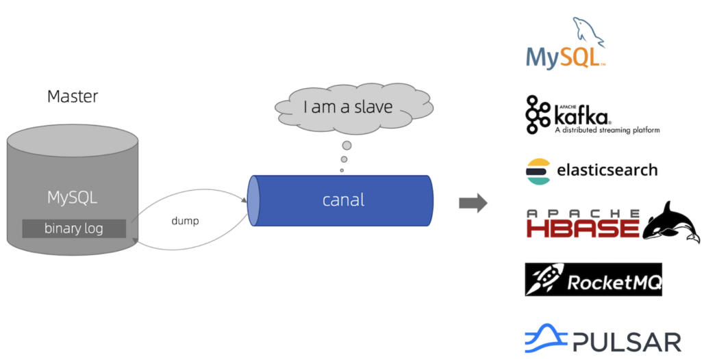

它的地址：

github地址：https://github.com/alibaba/canal

版本下载地址：https://github.com/alibaba/canal/releases

文档地址：https://github.com/alibaba/canal/wiki/Docker-QuickStart


**Canal基于mysql的binlog技术实现数据同步**，什么是binlog，它是一个文件，二进制格式，记录了对数据库更新的SQL语句，向数据库写数据的同时向binlog文件里记录对应的sql语句。当数据库服务器发生了故障就可以使用binlog文件对数据库进行恢复。

所以，使用canal是需要开启mysql的binlog写入功能，Canal工作原理如下：

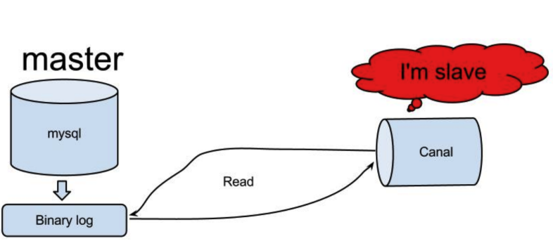

1、canal 模拟 MySQL slave 的交互协议，伪装自己为 MySQL slave ，向 MySQL master 发送dump

协议

2、MySQL master 收到 dump 请求，开始推送 binary log 给 slave (即 canal )

3、canal 解析 binary log 对象(原始为 byte 流)

详细使用Canal进行索引同步的步骤参考：Canal实现索引同步.pdf

### 5.1.3 实时性要求不高的方案（使用）

当索引同步的实时性要求不高时可用的技术比较多，比如：MQ、Logstash、任务调度等。

**MQ：**向mysql写数据的时候向mq写入消息，搜索服务监听MQ，收到消息后写入索引。使用MQ的优势是代码解耦，但是需要处理消息可靠性的问题有一定的技术成本，做到消息可靠性需要做到生产者投递成功、消息持久化以及消费者消费成功三个方面，另外还要做好消息幂等性问题。

**Logstash：** 开源实时日志分析平台 ELK包括Elasticsearch、Kibana、Logstash，Logstash负责收集、解析和转换日志信息，可以实现MySQL与Elasticsearch之间的数据同步。也可以实现解耦合并且是官方推荐，但需要增加学习与维护成本。

**任务调度（使用）：**向mysql写数据的时候记录修改记录，开启一个定时任务根据修改记录将数据同步到Elasticsearch。


根据本项目的需求，课程发布后信息同步的实时性要求不高，从提交审核到发布成功一般两个工作日完成。综合比较以上技术方案本项目的索引同步技术使用任务调度的方法。

如下图：

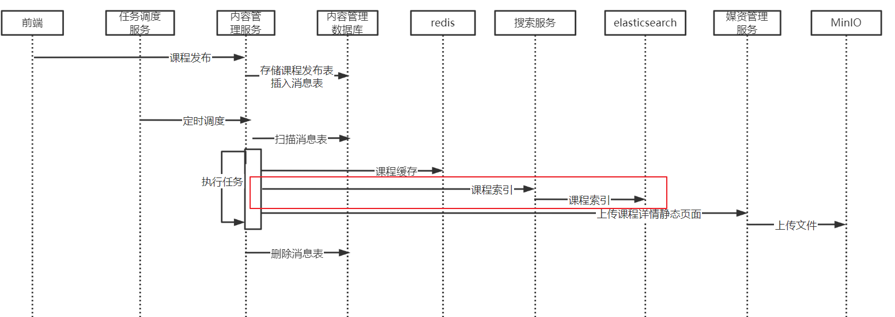

1、课程发布向消息表插入记录。

2、由任务调度程序通过消息处理SDK对消息记录进行处理。

3、向elasticsearch索引中保存课程信息。

如何向向elasticsearch索引中保存课程信息？

执行流程如下：

由内容管理服务远程调用搜索服务添加课程信息索引，搜索服务再请求elasticsearch向课程索引中添加文档。


## **5.2** **任务调度方式实现索引同步**

首先拷贝CourseIndex 模型类到内容管理model 工程的dto包下。

### 5.2.1 内容服务远程调用搜索服务，并设置熔断降级 

在内容管理服务中添加FeignClient

```java
package com.xuecheng.content.feignclient;

/**
 * @description 搜索服务远程接口
 * @author Mr.M
 * @date 2022/9/20 20:29
 * @version 1.0
 */
@FeignClient(value = "search",fallbackFactory = SearchServiceClientFallbackFactory.class)
public interface SearchServiceClient {

 @PostMapping("/search/index/course")
 public Boolean add(@RequestBody CourseIndex courseIndex);
}
```


定义SearchServiceClientFallbackFactory ：

```java
@Slf4j
@Component
public class SearchServiceClientFallbackFactory implements FallbackFactory<SearchServiceClient> {
    @Override
    public SearchServiceClient create(Throwable throwable) {

        return new SearchServiceClient() {

            @Override
            public Boolean add(CourseIndex courseIndex) {
                throwable.printStackTrace();
                log.debug("调用搜索发生熔断走降级方法,熔断异常:", throwable.getMessage());

                return false;
            }
        };
    }
}
```


### 5.2.2 课程发布的任务类补充保存索引库方法

编写课程索引任务执行方法

完善**CoursePublishTask类**中的saveCourseIndex方法

```java
//保存课程索引信息
public void saveCourseIndex(MqMessage mqMessage,long courseId){
    log.debug("保存课程索引信息,课程id:{}",courseId);

    //消息id
    Long id = mqMessage.getId();
    //消息处理的service
    MqMessageService mqMessageService = this.getMqMessageService();
    //消息幂等性处理
    int stageTwo = mqMessageService.getStageTwo(id);
    if(stageTwo > 0){
        log.debug("课程索引已处理直接返回，课程id:{}",courseId);
        return ;
    }

    Boolean result = saveCourseIndex(courseId);
    if(result){
        //保存第一阶段状态
        mqMessageService.completedStageTwo(id);
    }
}

private Boolean saveCourseIndex(Long courseId) {

    //取出课程发布信息
    CoursePublish coursePublish = coursePublishMapper.selectById(courseId);
    //拷贝至课程索引对象
    CourseIndex courseIndex = new CourseIndex();
    BeanUtils.copyProperties(coursePublish,courseIndex);
    //远程调用搜索服务api添加课程信息到索引
    Boolean add = searchServiceClient.add(courseIndex);
    if(!add){
        XueChengPlusException.cast("添加索引失败");
    }
    return add;

}
```


### **5.2.3** **测试**

测试流程如下：

1、启动elasticsearch、kibana。

2、启动网关、内容管理、搜索服务、nginx。

3、启动xxl-job调度中心。

4、在任务调度中心开始课程发布任务。

5、发布一门课程，页面提示操作成功，查看发布课程任务是否写到任务表。

6、经过任务调度将课程信息写入索引。

7、通过门户进入搜索页面，查看课程信息是否展示。