>  **导航：**
>
> [【Java笔记+踩坑汇总】Java基础+JavaWeb+SSM+SpringBoot+SpringCloud+瑞吉外卖/谷粒商城/学成在线+设计模式+面试题汇总+性能调优/架构设计+源码解析](https://blog.csdn.net/qq_40991313/article/details/126646289?spm=1001.2014.3001.5501)

[TOC]


# **1** **需求分析**


本项目要支持：账号密码认证、手机验证码认证、扫码登录等。


# **2 【认证模块】****连接用户中心数据库**

## **2.1** **连接数据库认证**

### 2.1.1 分析 

基于的认证流程在研究Spring Security过程中已经测试通过，到目前为止用户认证流程如下：

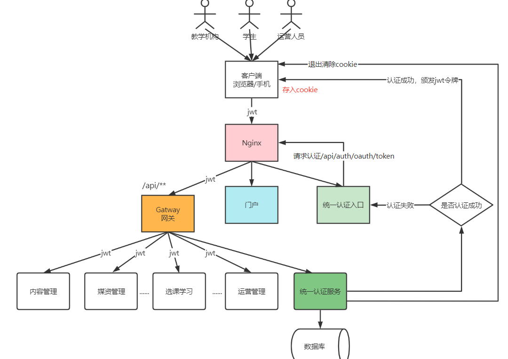

**认证服务****连接数据库认证** 

认证所需要的用户信息存储在用户中心数据库，现在需要**将认证服务连接数据库查询用户信息**。

> 在上篇文章研究Spring Security的过程中是将用户信息硬编码，如下：
>
> ```
> 认证模块安全管理配置类WebSecurityConfig
> @Bean
> public UserDetailsService userDetailsService() {
>     //这里配置用户信息,这里暂时使用这种方式将用户存储在内存中
>     InMemoryUserDetailsManager manager = new InMemoryUserDetailsManager();
>     manager.createUser(User.withUsername("zhangsan").password("123").authorities("p1").build());
>     manager.createUser(User.withUsername("lisi").password("456").authorities("p2").build());
>     return manager;
> }
> ```
>
> 


我们要认证服务中连接用户中心数据库查询用户信息。


> **UserDetailsService 接口****分析：**
>
> 认证模块安全管理配置类WebSecurityConfig的bean，UserDetailsService
>
> 前边学习Spring Security工作原理时有一张执行流程图，如下图：
>
> 
>
> 用户提交账号和密码由DaoAuthenticationProvider调用UserDetailsService的loadUserByUsername()方法获取UserDetails用户信息。
>
> 查询DaoAuthenticationProvider的源代码如下：
>
> 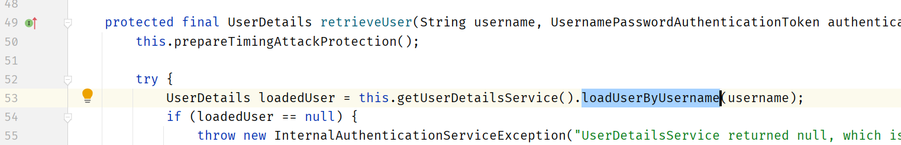
>
> UserDetailsService是一个接口，如下：
>
> ```java
> public interface UserDetailsService {
>     UserDetails loadUserByUsername(String var1) throws UsernameNotFoundException;
> }
> ```
>
> 
>
> UserDetails是用户信息接口
>
> ```java
> public interface UserDetails extends Serializable {
>     Collection<? extends GrantedAuthority> getAuthorities();
> 
>     String getPassword();
> 
>     String getUsername();
> 
>     boolean isAccountNonExpired();
> 
>     boolean isAccountNonLocked();
> 
>     boolean isCredentialsNonExpired();
> 
>     boolean isEnabled();
> }
> ```
>
> 


### 2.1.2 实现，**实现UserDetailsService接口**

**如何使用Spring Security连接数据库认证？**

我们只要**实现UserDetailsService 接口**查询数据库得到用户信息返回UserDetails 类型的用户信息即可,框架调用loadUserByUsername()方法拿到用户信息之后是如何执行的，见下图：

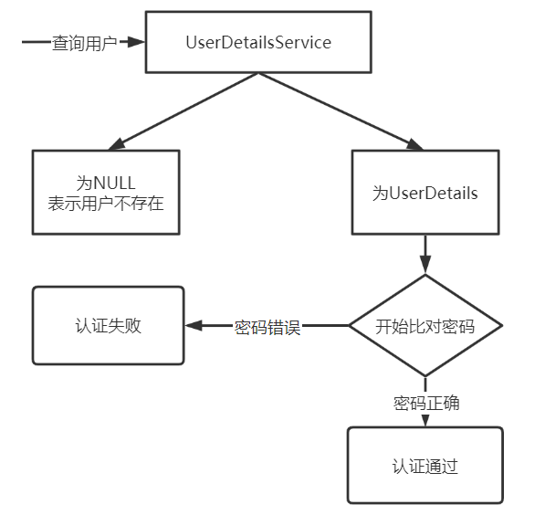

**1、首先屏蔽原来定义的UserDetailsService。**

> 认证模块安全管理配置类WebSecurityConfig

```java
    //配置用户信息服务
//    @Bean
//    public UserDetailsService userDetailsService() {
//        //这里配置用户信息,这里暂时使用这种方式将用户存储在内存中
//        InMemoryUserDetailsManager manager = new InMemoryUserDetailsManager();
//        manager.createUser(User.withUsername("zhangsan").password("123").authorities("p1").build());
//        manager.createUser(User.withUsername("lisi").password("456").authorities("p2").build());
//        return manager;
//    }
```


**2、自定义UserDetailsService**

```java
package com.xuecheng.ucenter.service.impl;

@Service
public class UserServiceImpl implements UserDetailsService {

    @Autowired
    XcUserMapper xcUserMapper;

    /**
     * @description 根据账号查询用户信息
     * @param s  账号
     * @return org.springframework.security.core.userdetails.UserDetails
     * @author Mr.M
     * @date 2022/9/28 18:30
    */
    @Override
    public UserDetails loadUserByUsername(String s) throws UsernameNotFoundException {

        XcUser user = xcUserMapper.selectOne(new LambdaQueryWrapper<XcUser>().eq(XcUser::getUsername, s));
        if(user==null){
            //返回空表示用户不存在
            return null;
        }
        //取出数据库存储的正确密码
        String password  =user.getPassword();
        //用户权限,如果不加报Cannot pass a null GrantedAuthority collection
        String[] authorities= {"test"};
        //创建UserDetails对象,权限信息待实现授权功能时再向UserDetail中加入
        UserDetails userDetails = User.withUsername(user.getUsername()).password(password).authorities(authorities).build();

        return userDetails;
    }


}
```


**3、修改安全管理配置类密码编码器为BCrypt**

数据库中的密码加过密的，用户输入的密码是明文，我们需要修改密码格式器PasswordEncoder，原来使用的是NoOpPasswordEncoder，它是通过明文方式比较密码，现在我们修改为BCryptPasswordEncoder，它是将用户输入的密码编码为BCrypt格式与数据库中的密码进行比对。

如下：

```
WebSecurityConfig
    @Bean
    public PasswordEncoder passwordEncoder() {
//        //密码为明文方式
//        return NoOpPasswordEncoder.getInstance();
        return new BCryptPasswordEncoder();
    }
```


> 测试BCrypt比对密码：
>
> 虽然每次计算的密码Hash值不一样，但是校验是通过的
>
> 我们通过测试代码测试BCryptPasswordEncoder，如下：
>
> ```java
> public static void main(String[] args) {
>     String s= "111111";
>     String password = s;
>     PasswordEncoder passwordEncoder = new BCryptPasswordEncoder();
>     for(int i=0;i<10;i++) {
>         //每个计算出的Hash值都不一样
>         String hashPass = passwordEncoder.encode(password);
>         System.out.println(hashPass);
>         //虽然每次计算的密码Hash值不一样但是校验是通过的
>         boolean f = passwordEncoder.matches(password, hashPass);
>         System.out.println(f);
>     }
> }
> ```
>
> 

**4、修改数据库中的密码为Bcrypt格式**，并且记录明文密码，稍后申请令牌时需要。

**5、将客户端的密钥更改为Bcrypt格式.** 

由于修改密码编码方式还需要将客户端的密钥更改为Bcrypt格式.


```
授权服务器配置AuthorizationServer
 @Override
  public void configure(ClientDetailsServiceConfigurer clients)
          throws Exception {
        clients.inMemory()// 使用in-memory存储
                .withClient("XcWebApp")// client_id
//                .secret("secret")//客户端密钥
                .secret(new BCryptPasswordEncoder().encode("XcWebApp"))//客户端密钥
                .resourceIds("xuecheng-plus")//资源列表
                .authorizedGrantTypes("authorization_code", "password","client_credentials","implicit","refresh_token")// 该client允许的授权类型authorization_code,password,refresh_token,implicit,client_credentials
                .scopes("all")// 允许的授权范围
                .autoApprove(false)//false跳转到授权页面
                //客户端接收授权码的重定向地址
                .redirectUris("http://www.51xuecheng.cn")
   ;
  }
```


**6、测试** 

现在重启认证服务。

下边使用httpclient进行测试：

```bash
### 密码模式
POST {{auth_host}}/oauth/token?client_id=XcWebApp&client_secret=XcWebApp&grant_type=password&username=stu1&password=111111
```


输入正确的账号和密码，申请令牌成功。

输入错误的密码，报错：

```bash
{
  "error": "invalid_grant",
  "error_description": "用户名或密码错误"
}
```


输入错误的账号，报错：

```bash
{
  "error": "unauthorized",
  "error_description": "UserDetailsService returned null, which is an interface contract violation"
}
```


## **2.3** **jwt令牌****存储用户昵称、头像等信息**

> 目前问题：
>
> 用户表中存储了用户的账号、手机号、email，昵称、qq等信息，UserDetails接口只返回了username、密码等信息：
>
> ```java
> public interface UserDetails extends Serializable {
>     Collection<? extends GrantedAuthority> getAuthorities();
> 
>     String getPassword();
> 
>     String getUsername();
> 
>     boolean isAccountNonExpired();
> 
>     boolean isAccountNonLocked();
> 
>     boolean isCredentialsNonExpired();
> 
>     boolean isEnabled();
> }
> ```
>
> 

我们需要扩展用户身份的信息，**在jwt令牌中存储用户的昵称、头像、qq等信息。**

**如何扩展Spring Security的用户身份信息呢？**

在认证阶段DaoAuthenticationProvider会调用UserDetailService查询用户的信息，这里是可以获取到齐全的用户信息的。由于JWT令牌中用户身份信息来源于UserDetails，UserDetails中仅定义了username为用户的身份信息，这里有两个思路：

方案一：可以扩展UserDetails，使之包括更多的自定义属性，

**方案二（使用）：**扩展用户名的内容 ，**用户信息对象转json字符串赋值给UserDetails的用户名**。

相比较而言，方案二比较简单还不用破坏UserDetails的结构，我们采用方案二。

修改UserServiceImpl如下：

```java
package com.xuecheng.ucenter.service.impl;


@Service
public class UserServiceImpl implements UserDetailsService {

    @Autowired
    XcUserMapper xcUserMapper;

    /**
     * @description 根据账号查询用户信息
     * @param s  账号
     * @return org.springframework.security.core.userdetails.UserDetails
     * @author Mr.M
     * @date 2022/9/28 18:30
    */
    @Override
    public UserDetails loadUserByUsername(String s) throws UsernameNotFoundException {

        XcUser user = xcUserMapper.selectOne(new LambdaQueryWrapper<XcUser>().eq(XcUser::getUsername, s));
        if(user==null){
            //返回空表示用户不存在
            return null;
        }

        //取出数据库存储的正确密码
        String password  =user.getPassword();
        //用户权限,如果不加报Cannot pass a null GrantedAuthority collection
        String[] authorities = {"p1"};
       //为了安全在令牌中不放密码
        user.setPassword(null);
        //将user对象转json
        String userString = JSON.toJSONString(user);
        //创建UserDetails对象
        UserDetails userDetails = User.withUsername(userString).password(password).authorities(authorities).build();

        return userDetails;
    }


}
```


**测试：** 

重启认证服务，重新生成令牌，生成成功。

我们可以使用check_token查询jwt的内容

```bash
###校验jwt令牌
POST {{auth_host}}/oauth/check_token?token=
```


响应示例如下，

```bash
{
  "aud": [
    "res1"
  ],
  "user_name": "{\"birthday\":\"2022-09-28T19:28:46\",\"createTime\":\"2022-09-28T08:32:03\",\"id\":\"50\",\"name\":\"学生1\",\"nickname\":\"大水牛\",\"password\":\"$2a$10$0pt7WlfTbnPDTcWtp/.2Mu5CTXvohnNQhR628qq4RoKSc0dGAdEgm\",\"sex\":\"1\",\"status\":\"1\",\"username\":\"stu1\",\"userpic\":\"http://file.51xuecheng.cn/dddf\",\"utype\":\"101001\"}",
  "scope": [
    "all"
  ],
  "active": true,
  "exp": 1664372184,
  "authorities": [
    "p1"
  ],
  "jti": "73da9f7b-bd8c-45ac-9add-46b711d11fb8",
  "client_id": "c1"
}
```


user_name存储了用户信息的json格式，在资源服务中就可以取出该json格式的内容转为用户对象去使用。

## **2.3 各服务通过工具类获取****当前登录用户信息**

下边编写一个**工具类**在各个微服务中去使用，**获取当前登录用户的对象**。

在content-api中定义此类：

```java
package com.xuecheng.content.util;

/**
 * @author Mr.M
 * @version 1.0
 * @description 获取当前用户身份工具类
 * @date 2022/10/18 18:02
 */
@Slf4j
public class SecurityUtil {

    public static XcUser getUser() {
        try {
            Object principalObj = SecurityContextHolder.getContext().getAuthentication().getPrincipal();
            if (principalObj instanceof String) {
                //取出用户身份信息
                String principal = principalObj.toString();
                //将json转成对象
                XcUser user = JSON.parseObject(principal, XcUser.class);
                return user;
            }
        } catch (Exception e) {
            log.error("获取当前登录用户身份出错:{}", e.getMessage());
            e.printStackTrace();
        }

        return null;
    }


    @Data
    public static class XcUser implements Serializable {

        private static final long serialVersionUID = 1L;

        private String id;

        private String username;

        private String password;

        private String salt;

        private String name;
        private String nickname;
        private String wxUnionid;
        private String companyId;
        /**
         * 头像
         */
        private String userpic;

        private String utype;

        private LocalDateTime birthday;

        private String sex;

        private String email;

        private String cellphone;

        private String qq;

        /**
         * 用户状态
         */
        private String status;

        private LocalDateTime createTime;

        private LocalDateTime updateTime;


    }


}
```


下边在内容管理服务中测试此工具类，以查询课程信息接口为例：

```java
@ApiOperation("根据课程id查询课程基础信息")
@GetMapping("/course/{courseId}")
public CourseBaseInfoDto getCourseBaseById(@PathVariable("courseId") Long courseId){
    //取出当前用户身份
//    Object principal = SecurityContextHolder.getContext().getAuthentication().getPrincipal();
   SecurityUtil.XcUser user = SecurityUtil.getUser();
    System.out.println(user);

    return courseBaseInfoService.getCourseBaseInfo(courseId);
}
```


重启内容管理服务：

1、启动认证服务、网关、内容管理服务

2、生成新的令牌

3、携带令牌访问内容管理服务的查询课程接口

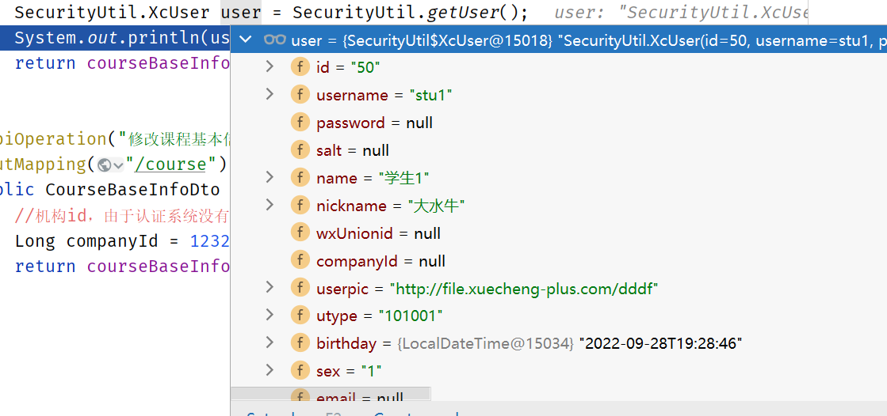


# **3 支持多种认证方式**

## **3.1** **统一认证入口**


> 目前各大网站的认证方式非常丰富：账号密码认证、手机验证码认证、扫码登录等。基于当前研究的Spring Security认证流程如何支持多样化的认证方式呢？
>
> **1、支持账号和密码认证**
>
> 采用OAuth2协议的密码模式即可实现。
>
> **2、支持手机号加验证码认证**
>
> 用户认证提交的是手机号和验证码，并不是账号和密码。
>
> **3、微信扫码认证**
>
> 基于OAuth2协议与微信交互，学成在线网站向微信服务器申请到一个令牌，然后携带令牌去微信查询用户信息，查询成功则用户在学成在线项目认证通过。


> 目前我们测试通过OAuth2的密码模式，用户认证会提交账号和密码，由DaoAuthenticationProvider调用UserDetailsService的loadUserByUsername()方法获取UserDetails用户信息。
>
> 在前边我们自定义了UserDetailsService接口实现类，通过loadUserByUsername()方法根据账号查询用户信息。

而**不同的认证方式提交的数据不一样**，比如：手机加验证码方式会提交手机号和验证码，账号密码方式会提交账号、密码、验证码。

我们可以在loadUserByUsername()方法上作文章，将用户原来提交的账号数据改为提交json数据，json数据可以扩展不同认证方式所提交的各种参数。

首先创建一个DTO类表示认证的参数：

```java
package com.xuecheng.ucenter.model.dto;


/**
 * @author Mr.M
 * @version 1.0
 * @description 认证用户请求参数
 * @date 2022/9/29 10:56
 */
@Data
public class AuthParamsDto {

    private String username; //用户名
    private String password; //域  用于扩展
    private String cellphone;//手机号
    private String checkcode;//验证码
    private String checkcodekey;//验证码key
    private String authType; // 认证的类型   password:用户名密码模式类型    sms:短信模式类型
    private Map<String, Object> payload = new HashMap<>();//附加数据，作为扩展，不同认证类型可拥有不同的附加数据。如认证类型为短信时包含smsKey : sms:3d21042d054548b08477142bbca95cfa; 所有情况下都包含clientId


}
```


此时loadUserByUsername()方法可以修改如下：

```java
package com.xuecheng.ucenter.service.impl;

/**
 * @author Mr.M
 * @version 1.0
 * @description 自定义UserDetailsService用来对接Spring Security
 * @date 2022/9/28 18:09
 */
@Slf4j
@Service
public class UserServiceImpl implements UserDetailsService {

    @Autowired
    XcUserMapper xcUserMapper;

    /**
     * @description 查询用户信息组成用户身份信息
     * @param s  AuthParamsDto类型的json数据
     * @return org.springframework.security.core.userdetails.UserDetails
     * @author Mr.M
     * @date 2022/9/28 18:30
    */
    @Override
    public UserDetails loadUserByUsername(String s) throws UsernameNotFoundException {

        AuthParamsDto authParamsDto = null;
        try {
            //将认证参数转为AuthParamsDto类型
            authParamsDto = JSON.parseObject(s, AuthParamsDto.class);
        } catch (Exception e) {
            log.info("认证请求不符合项目要求:{}",s);
            throw new RuntimeException("认证请求数据格式不对");
        }
        //账号
        String username = authParamsDto.getUsername();
        XcUser user = xcUserMapper.selectOne(new LambdaQueryWrapper<XcUser>().eq(XcUser::getUsername, username));
        if(user==null){
            //返回空表示用户不存在
            return null;
        }
        //取出数据库存储的正确密码
        String password  =user.getPassword();
        //用户权限,如果不加报Cannot pass a null GrantedAuthority collection
        String[] authorities = {"p1"};
        //将user对象转json
        String userString = JSON.toJSONString(user);
        //创建UserDetails对象
        UserDetails userDetails = User.withUsername(userString).password(password).authorities(authorities).build();

        return userDetails;
    }

}
```


原来的DaoAuthenticationProvider 会进行密码校验，现在重新定义DaoAuthenticationProviderCustom类，重写类的additionalAuthenticationChecks方法。

```java
package com.xuecheng.auth.config;

/**
 * @description 自定义DaoAuthenticationProvider
 * @author Mr.M
 * @date 2022/9/29 10:31
 * @version 1.0
 */
@Slf4j
@Component
public class DaoAuthenticationProviderCustom extends DaoAuthenticationProvider {


 @Autowired
 public void setUserDetailsService(UserDetailsService userDetailsService) {
  super.setUserDetailsService(userDetailsService);
 }


 //屏蔽密码对比
 protected void additionalAuthenticationChecks(UserDetails userDetails, UsernamePasswordAuthenticationToken authentication) throws AuthenticationException {


 }

}
```


修改WebSecurityConfig类指定daoAuthenticationProviderCustom

```java
@Autowired
DaoAuthenticationProviderCustom daoAuthenticationProviderCustom;


@Override
protected void configure(AuthenticationManagerBuilder auth) throws Exception {
    auth.authenticationProvider(daoAuthenticationProviderCustom);
}
```


此时可以重启认证服务，测试申请令牌接口，传入的账号信息改为json数据，如下：

```bash
################扩展认证请求参数后######################
###密码模式
POST {{auth_host}}/auth/oauth/token?client_id=XcWebApp&client_secret=XcWebApp&grant_type=password&username={"username":"stu1","authType":"password","passw改成自己的ord":"111111"}
```


经过测试发现loadUserByUsername()方法可以正常接收到认证请求中的json数据。

有了这些认证参数我们可以定义一个认证Service接口去进行各种方式的认证。

定义用户信息，为了扩展性让它继承XcUser

```java
@Data
public class XcUserExt extends XcUser {
}
```


定义认证Service 接口

```java
package com.xuecheng.ucenter.service;

/**
 * @description 认证service
 * @author Mr.M
 * @date 2022/9/29 12:10
 * @version 1.0
 */
public interface AuthService {

   /**
    * @description 认证方法
    * @param authParamsDto 认证参数
    * @return com.xuecheng.ucenter.model.po.XcUser 用户信息
    * @author Mr.M
    * @date 2022/9/29 12:11
   */
   XcUserExt execute(AuthParamsDto authParamsDto);

}
```


loadUserByUsername()修改如下：

```java
@Slf4j
@Service
public class UserServiceImpl implements UserDetailsService {

    @Autowired
    XcUserMapper xcUserMapper;

    @Autowired
    ApplicationContext applicationContext;


    /**
     * @description 查询用户信息组成用户身份信息
     * @param s  AuthParamsDto类型的json数据
     * @return org.springframework.security.core.userdetails.UserDetails
     * @author Mr.M
     * @date 2022/9/28 18:30
    */
    @Override
    public UserDetails loadUserByUsername(String s) throws UsernameNotFoundException {

        AuthParamsDto authParamsDto = null;
        try {
            //将认证参数转为AuthParamsDto类型
            authParamsDto = JSON.parseObject(s, AuthParamsDto.class);
        } catch (Exception e) {
            log.info("认证请求不符合项目要求:{}",s);
            throw new RuntimeException("认证请求数据格式不对");
        }
        //开始认证
        authService.execute(authParamsDto);
        .....
```


到此我们基于Spring Security认证流程修改为如下：

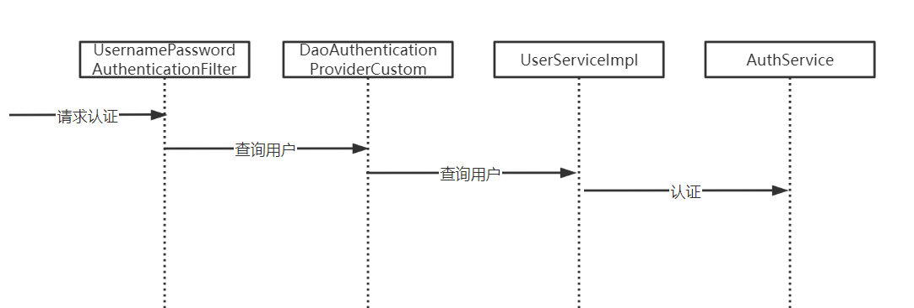


## **3.2** **实现账号密码认证**

上节定义了AuthService认证接口，下边实现该接口实现账号密码认证

```java
package com.xuecheng.ucenter.service.impl;

/**
 * @description 账号密码认证
 * @author Mr.M
 * @date 2022/9/29 12:12
 * @version 1.0
 */
 @Service("password_authservice")
public class PasswordAuthServiceImpl implements AuthService {

 @Autowired
 XcUserMapper xcUserMapper;

 @Autowired
 PasswordEncoder passwordEncoder;


 @Override
 public XcUserExt execute(AuthParamsDto authParamsDto) {

  //账号
  String username = authParamsDto.getUsername();
  XcUser user = xcUserMapper.selectOne(new LambdaQueryWrapper<XcUser>().eq(XcUser::getUsername, username));
  if(user==null){
   //返回空表示用户不存在
   throw new RuntimeException("账号不存在");
  }
  XcUserExt xcUserExt = new XcUserExt();
  BeanUtils.copyProperties(user,xcUserExt);
  //校验密码
  //取出数据库存储的正确密码
  String passwordDb  =user.getPassword();
  String passwordForm = authParamsDto.getPassword();
  boolean matches = passwordEncoder.matches(passwordForm, passwordDb);
  if(!matches){
   throw new RuntimeException("账号或密码错误");
  }
  return xcUserExt;
 }
}
```


修改UserServiceImpl类，根据认证方式使用不同的认证bean

```java
package com.xuecheng.ucenter.service.impl;

/**
 * @author Mr.M
 * @version 1.0
 * @description 自定义UserDetailsService用来对接Spring Security
 * @date 2022/9/28 18:09
 */
@Slf4j
@Service
public class UserServiceImpl implements UserDetailsService {

    @Autowired
    XcUserMapper xcUserMapper;

    @Autowired
    ApplicationContext applicationContext;

//    @Autowired
//    AuthService authService;

    /**
     * @description 查询用户信息组成用户身份信息
     * @param s  AuthParamsDto类型的json数据
     * @return org.springframework.security.core.userdetails.UserDetails
     * @author Mr.M
     * @date 2022/9/28 18:30
    */
    @Override
    public UserDetails loadUserByUsername(String s) throws UsernameNotFoundException {

        AuthParamsDto authParamsDto = null;
        try {
            //将认证参数转为AuthParamsDto类型
            authParamsDto = JSON.parseObject(s, AuthParamsDto.class);
        } catch (Exception e) {
            log.info("认证请求不符合项目要求:{}",s);
            throw new RuntimeException("认证请求数据格式不对");
        }

        //认证方法
        String authType = authParamsDto.getAuthType();
        AuthService authService =  applicationContext.getBean(authType + "_authservice",AuthService.class);
        XcUserExt user = authService.execute(authParamsDto);

        return getUserPrincipal(user);
    }


    /**
     * @description 查询用户信息
     * @param user  用户id，主键
     * @return com.xuecheng.ucenter.model.po.XcUser 用户信息
     * @author Mr.M
     * @date 2022/9/29 12:19
    */
    public UserDetails getUserPrincipal(XcUserExt user){
        //用户权限,如果不加报Cannot pass a null GrantedAuthority collection
        String[] authorities = {"p1"};
        String password = user.getPassword();
        //为了安全在令牌中不放密码
        user.setPassword(null);
        //将user对象转json
        String userString = JSON.toJSONString(user);
        //创建UserDetails对象
        UserDetails userDetails = User.withUsername(userString).password(password ).authorities(authorities).build();
        return userDetails;
    }

}
```


重启认证服务，测试申请令牌接口。

1、测试账号和密码都正确的情况是否可以申请令牌成功。

2、测试密码错误的情况。

3、测试账号不存在情况。


# **4** **验证码服务**

## **4.1** **部署验证码服务工程**

在认证时一般都需要输入验证码，验证码有什么用？

验证码可以防止恶性攻击，比如：XSS跨站脚本攻击、CSRF跨站请求伪造攻击，一些比较复杂的图形验证码可以有效的防止恶性攻击。

为了保护系统的安全在一些比较重要的操作都需要验证码。

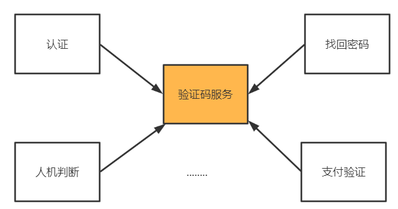

验证码的类型也有很多：图片、语音、手机短信验证码等。

本项目创建单独的验证码服务为各业务提供验证码的生成、校验等服务。

拷贝课程资料目录xuecheng-plus-checkcode验证码服务工程到自己的工程目录。

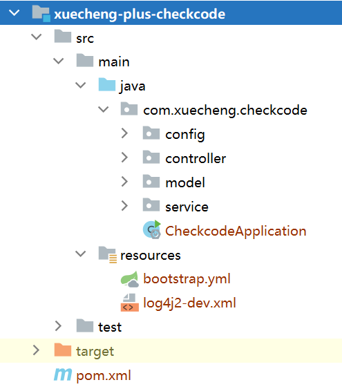

定义nacos配置文件

```bash
server:
  servlet:
    context-path: /checkcode
  port: 63075
```


注意修改bootstrap.yml中的命名空间为自己定义的命名空间。

配置redis-dev.yaml，保存redis服务启动

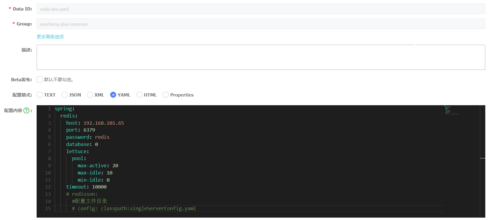

内容如下：

```bash
spring:
  redis:
    host: 192.168.101.65
    port: 6379
    password: redis
    database: 0
    lettuce:
      pool:
        max-active: 20
        max-idle: 10
        min-idle: 0
    timeout: 10000
    #redisson:
      #配置文件目录
      #config: classpath:singleServerConfig.yaml
```


## **4.2** **验证码接口测试**

验证码服务对外提供的接口有：

1、生成验证码

2、校验验证码。

如下：

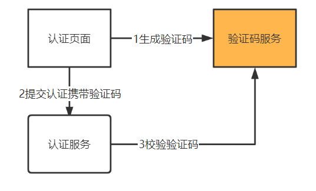

验证码服务如何生成并校验验证码？

拿图片验证码举例：

1、先生成一个指定位数的验证码，根据需要可能是数字、数字字母组合或文字。

2、根据生成的验证码生成一个图片并返回给页面

3、给生成的验证码分配一个key，将key和验证码一同存入缓存。这个key和图片一同返回给页面。

4、用户输入验证码，连同key一同提交至认证服务。

5、认证服务拿key和输入的验证码请求验证码服务去校验

6、验证码服务根据key从缓存取出正确的验证码和用户输入的验证码进行比对，如果相同则校验通过，否则不通过。

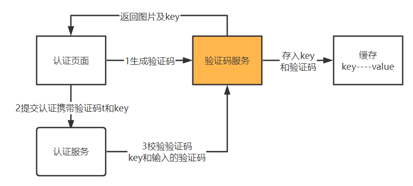

根据接口分析，验证码服务接口如下：

```java
package com.xuecheng.checkcode.controller;

/**
 * @author Mr.M
 * @version 1.0
 * @description 验证码服务接口
 * @date 2022/9/29 18:39
 */
@Api(value = "验证码服务接口")
@RestController
public class CheckCodeController {


    @ApiOperation(value="生成验证信息", notes="生成验证信息")
    @PostMapping(value = "/pic")
    public CheckCodeResultDto generatePicCheckCode(CheckCodeParamsDto checkCodeParamsDto){
       
    }

    @ApiOperation(value="校验", notes="校验")
    @ApiImplicitParams({
            @ApiImplicitParam(name = "name", value = "业务名称", required = true, dataType = "String", paramType="query"),
            @ApiImplicitParam(name = "key", value = "验证key", required = true, dataType = "String", paramType="query"),
            @ApiImplicitParam(name = "code", value = "验证码", required = true, dataType = "String", paramType="query")
    })
    @PostMapping(value = "/verify")
    public Boolean verify(String key, String code){
       
    }
}
```


1、生成验证码接口

```bash
### 申请验证码
POST {{checkcode_host}}/checkcode/pic
```


2、校验验证码接口

根据生成验证码返回的key以及日志中输出正确的验证码去测试。

```bash
### 校验验证码
POST {{checkcode_host}}/checkcode/verify?key=checkcode4506b95bddbe46cdb0d56810b747db1b&code=70dl
```


# **5** **账号密码认证**

## **5.1** **需求分析**

到目前为止账号和密码认证所需要的技术、组件都已开发完毕，下边实现账号密码认证，输出如下图：

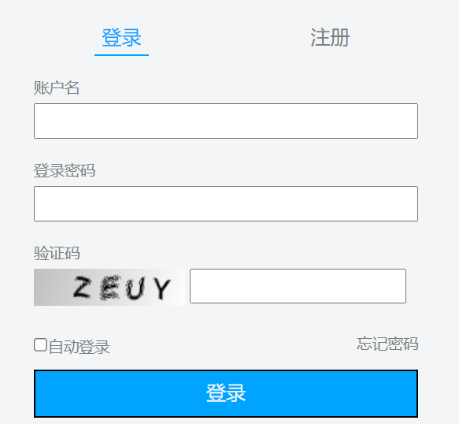

执行流程如下：

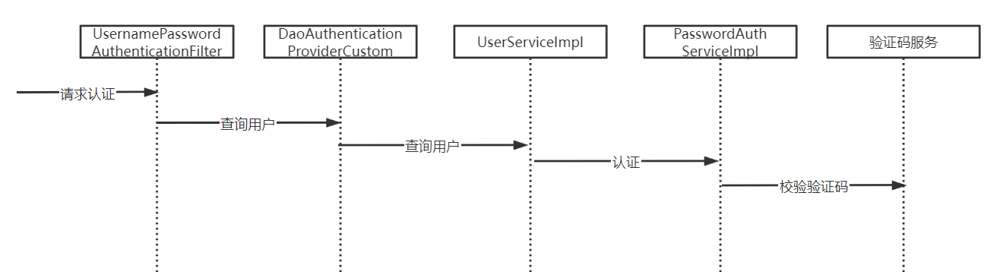

## **5.2** **账号密码认证开发**

1、在认证服务定义远程调用验证码服务的接口

```java
package com.xuecheng.ucenter.feignclient;

 @FeignClient(value = "checkcode",fallbackFactory = CheckCodeClientFactory.class)
 @RequestMapping("/checkcode")
public interface CheckCodeClient {

 @PostMapping(value = "/verify")
 public Boolean verify(@RequestParam("key") String key,@RequestParam("code") String code);

}
```


CheckCodeClientFactory:

```java
@Slf4j
@Component
public class CheckCodeClientFactory implements FallbackFactory<CheckCodeClient> {
    @Override
    public CheckCodeClient create(Throwable throwable) {
        return new CheckCodeClient() {

            @Override
            public Boolean verify(String key, String code) {
                log.debug("调用验证码服务熔断异常:{}", throwable.getMessage());
                return null;
            }
        };
    }
}
```


启动类添加：

```java
@EnableFeignClients(basePackages={"com.xuecheng.*.feignclient"})
```


配置文件引入feign-dev.yaml

```bash
- data-id: feign-${spring.profiles.active}.yaml
  group: xuecheng-plus-common
  refresh: true
```


2、完善PasswordAuthServiceImpl

```java
package com.xuecheng.ucenter.service.impl;


/**
 * @description 账号密码认证
 * @author Mr.M
 * @date 2022/9/29 12:12
 * @version 1.0
 */
 @Service("password_authservice")
public class PasswordAuthServiceImpl implements AuthService {

 @Autowired
 XcUserMapper xcUserMapper;

 @Autowired
 PasswordEncoder passwordEncoder;
 @Autowired
 CheckCodeClient checkCodeClient;

 @Override
 public XcUser execute(AuthParamsDto authParamsDto) {

  //校验验证码
  String checkcode = authParamsDto.getCheckcode();
  String checkcodekey = authParamsDto.getCheckcodekey();

  if(StringUtils.isBlank(checkcodekey) || StringUtils.isBlank(checkcode)){
   throw new RuntimeException("验证码为空");

  }
  Boolean verify = checkCodeClient.verify(checkcodekey, checkcode);
  if(!verify){
   throw new RuntimeException("验证码输入错误");
  }
  //账号
  String username = authParamsDto.getUsername();
  XcUser user = xcUserMapper.selectOne(new LambdaQueryWrapper<XcUser>().eq(XcUser::getUsername, username));
  if(user==null){
   //返回空表示用户不存在
   throw new RuntimeException("账号不存在");
  }
  //校验密码
  //取出数据库存储的正确密码
  String passwordDb  =user.getPassword();
  String passwordForm = authParamsDto.getPassword();
  boolean matches = passwordEncoder.matches(passwordForm, passwordDb);
  if(!matches){
   throw new RuntimeException("账号或密码错误");
  }
  return user;
 }
}
```


小技巧：目前账号密码方式添加了验证码校验，为了后期获取令牌方便可以重新定义一个不需要验证码校验的认证类AuthService ，AuthService 中去掉验证码的校验，方便生成令牌。


## **5.3** **账号密码认证测试**

1、使用浏览器访问 http://www.51xuecheng.cn/sign.html

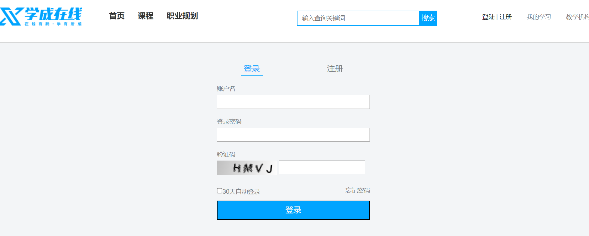

2、首先测试验证码，分别输入正确的验证码和错误的验证码进行测试

3、输入正确的账号密码和错误的账号密码进行测试

登录成功将jwt令牌存储cookie.

4、测试自动登录

勾选自动登录cookie生成时间为30天，不勾选自动登录关闭浏览器窗口后自动删除cookie。