>  **导航：**
>
> [【Java笔记+踩坑汇总】Java基础+JavaWeb+SSM+SpringBoot+SpringCloud+瑞吉外卖/谷粒商城/学成在线+设计模式+面试题汇总+性能调优/架构设计+源码解析](https://blog.csdn.net/qq_40991313/article/details/126646289?spm=1001.2014.3001.5501)

[TOC]


# **1** **模块需求分析**

## **1.1** **模块介绍**

本模块实现了学生选课、下单支付、学习的整体流程。

网站的课程有免费和收费两种，对于免费课程学生选课后可直接学习，对于收费课程学生需要下单且支付成功方可选课、学习。

选课：是将课程加入我的课程表的过程。

我的课程表：记录我在网站学习的课程，我的课程表中有免费课程和收费课程两种，对于免费课程可直接添加到我的课程表，对于收费课程需要下单、支付成功后自动加入我的课程表。

模块整体流程如下：


## **1.2** **业务流程**

### **1.2.1** **学习引导**

用户通过搜索课程、课程推荐等信息进入课程详情页面，点击“马上学习” 引导进入学习界面去学习。

流程如下：


1、进入课程详情点击马上学习

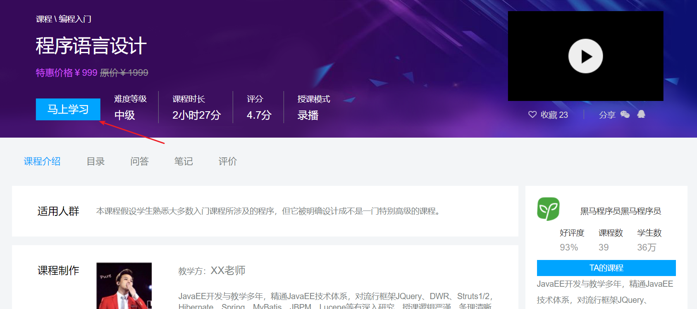

2、课程免费时引导加入我的课程表、或进入学习界面。

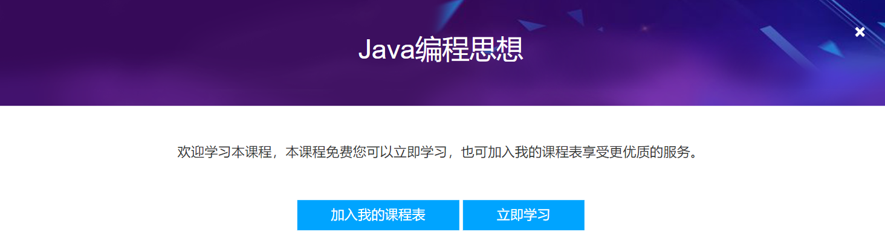

3、课程收费时引导去支付、或试学。

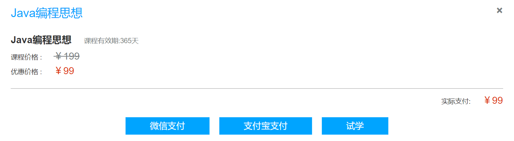


### **1.2.2** **选课流程**

选课是将课程加入我的课程表的过程。

对免费课程选课后可直接加入我的课程表，对收费课程选课后需要下单支付成功系统自动加入我的课程表。

流程如下：


### **1.2.3** **支付流程**

本项目与第三方支付平台对接完成支付操作。

流程如下：

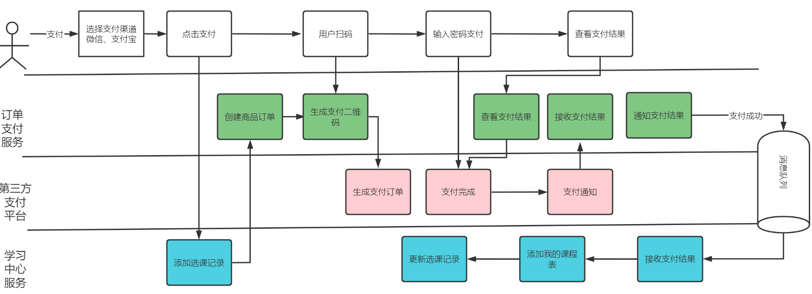


### **1.2.4** **在线学习**

选课成功用户可以在线学习，对于免费课程无需选课即可在线学习。

流程如下：

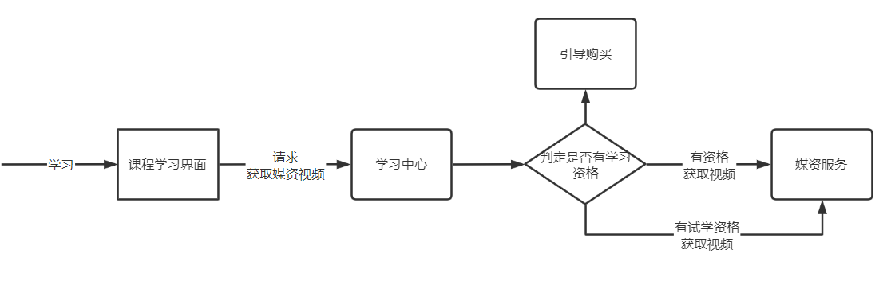

### **1.2.5** **免费课程续期**

免费课程加入我的课程表默认为1年有效期，到期用户可申请续期，流程如下：

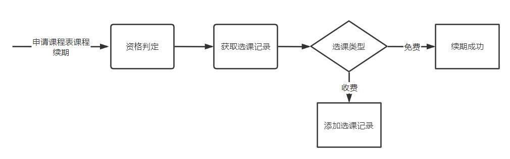

# **2** **添加选课**

## **2.1** **需求分析**

### **2.1.1** **数据模型**

选课是将课程加入我的课程表的过程，根据选课的业务流程进行详细分析，业务流程如下：

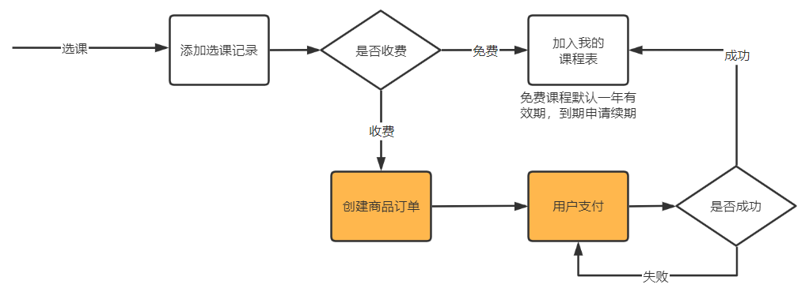

选课信息存入选课记录表，免费课程被选课除了进入选课记录表同时进入我的课程表，收费课程进入选课记录表后需要经过下单、支付成功才可以进入我的课程表。

我的课程表记录了用户学习的课程，包括免费课程、收费课程（已经支付）。

1、选课记录表

当用户将课程添加到课程表时需要先创建选课记录。

结构如下：

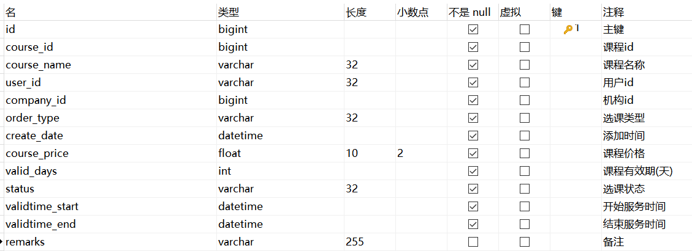

选课类型：免费课程、收费课程。

选课状态：选课成功、待支付、选课删除。

对于免费课程：课程价格为0，有效期默认365，开始服务时间为选课时间，结束服务时间为选课时间加1年后的时间，选课状态为选课成功。

对于收费课程：按课程的现价、有效期确定开始服务时间、结束服务时间，选课状态为待支付。

收费课程的选课记录需要支付成功后选课状态为成功。


2、我的课程表

我的课程表中记录了用户选课成功的课程，所以我的课程表的数据来源于选课记录表。

对于免费课程创建选课记录后同时向我的课程表添加记录。

对于收费课程创建选课记录后需要下单支付成功后自动向我的课程表添加记录。

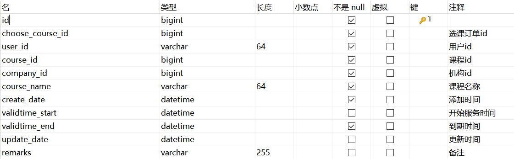

### **2.1.2** **执行流程**

在学习引导处，可以直接将免费课程加入我的课程表，如下图：


对于收费课程先创建选课记录表，支付成功后，收到支付结果由系统自动加入我的课程表。

执行流程如下：

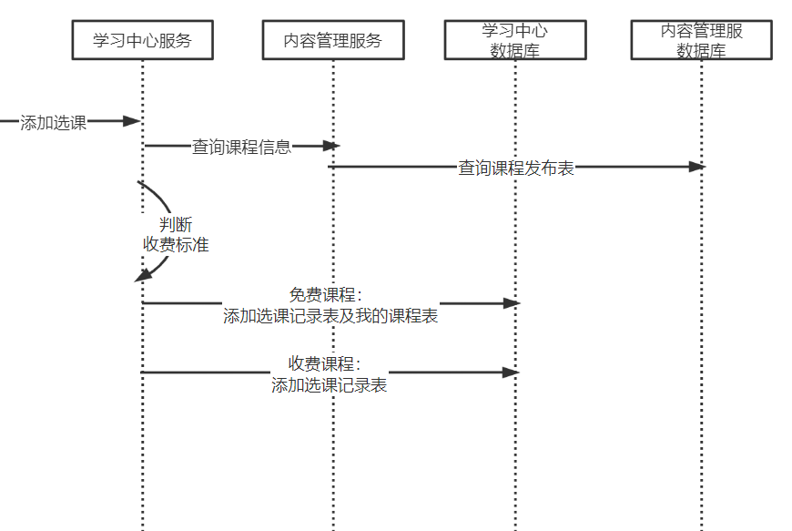

## **2.2** **接口开发**

### **2.2.1** **部署学习中心工程**

从课程资料拷贝学习中心服务工程到自己的工程目录，结构如下：

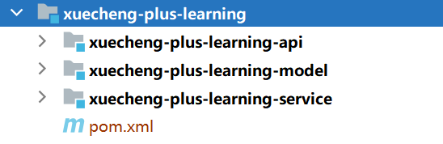

注意去修改nacos的命名空间。

创建数据库xc_learning，并导入数据


修改数据库的连接，改成自己的数据库。

nacos配置文件：learning-api-dev.yaml

```bash
server:
  servlet:
    context-path: /learning
  port: 63020
```


learning-service-dev.yaml

```bash
spring:
  datasource:
    driver-class-name: com.mysql.cj.jdbc.Driver
    url: jdbc:mysql://192.168.101.65:3306/xc1010_learning?serverTimezone=UTC&userUnicode=true&useSSL=false&
    username: root
    password: mysql
```


**2.2.2** **添加查询课程接口**

内容管理服务提供查询课程信息接口，此接口从课程发布表查询。

此接口主要提供其它微服务远程调用，所以此接口不用授权，本项目标记此类接口统一以 /r开头。

在课程发布controller类中定义课程发布信息查询接口。

```java
@ApiOperation("查询课程发布信息")
@ResponseBody
@GetMapping("/r/coursepublish/{courseId}")
public CoursePublish getCoursepublish(@PathVariable("courseId") Long courseId) {
    CoursePublish coursePublish = coursePublishService.getCoursePublish(courseId);
     return coursePublish;
}
```


Service如下：

如果课程发布状态正常则正常返回，否则返回空。

```java
public CoursePublish getCoursePublish(Long courseId){
    CoursePublish coursePublish = coursePublishMapper.selectById(courseId);
    return coursePublish ;
}
```


测试：

启动内容管理服务，使用httpclient测试

```bash
### 查询课程发布信息
GET {{content_host}}/content/r/coursepublish/2
```


由于是在网关处进行令牌校验，所以在微服务处不再校验令牌的合法性，修改内容管理content-api工程的ResouceServerConfig类，屏蔽authenticated()。

```java
 @Override
 public void configure(HttpSecurity http) throws Exception {
  http.csrf().disable()
          .authorizeRequests()
//          .antMatchers("/r/**","/course/**").authenticated()//所有/r/**的请求必须认证通过
          .anyRequest().permitAll()
  ;
 }
```


### **2.2.3** **测试查询课程信息接口**

学生中心服务远程调用内容管理服务的查询课程发布信息接口。

导入的学习中心工程已经存在ContentServiceClient 接口，通过此接口远程调用课程查询接口。

编写测试接口

```java
package com.xuecheng.learning;


/**
 * @description Feign接口测试类
 * @author Mr.M
 * @date 2022/10/24 17:15
 * @version 1.0
 */
 @SpringBootTest
public class FeignClientTest {

  @Autowired
 ContentServiceClient contentServiceClient;

  @Test
  public void testContentServiceClient(){
   CoursePublish coursepublish = contentServiceClient.getCoursepublish(18L);
   Assertions.assertNotNull(coursepublish);
  }
}
```


在进行feign远程调用时会将字符串转成LocalDateTime，在CoursePublish 类中LocalDateTime的属性上边添加如下代码：

```java
@JsonFormat(shape = JsonFormat.Shape.STRING,pattern = "yyyy-MM-dd HH:mm:ss")
```


### **2.2.5** **添加选课接口**

**2.2.5.1** **接口分析**

本接口支持免费课程选课、收费课程选课。

免费课程选课：添加选课记录、添加我的课程表。

收费课程选课：添加选课记录。

**2.2.5.2** **接口定义**

1、请求参数：课程id、当前用户id

2、响应结果：选课记录信息、学习资格

学习资格：[{"code":"702001","desc":"正常学习"},{"code":"702002","desc":"没有选课或选课后没有支付"},{"code":"702003","desc":"已过期需要申请续期或重新支付"}]

接口定义如下：

```java
package com.xuecheng.learning.api;


/**
 * @author Mr.M
 * @version 1.0
 * @description 我的课程表接口
 * @date 2022/10/2 14:52
 */
@Api(value = "我的课程表接口", tags = "我的课程表接口")
@Slf4j
@RestController
public class MyCourseTablesController {


    @ApiOperation("添加选课")
     @PostMapping("/choosecourse/{courseId}")
    public XcChooseCourseDto addChooseCourse(@PathVariable("courseId") Long courseId)  {
       
    }

}
```


Service接口定义：

```java
package com.xuecheng.learning.service;


/**
 * @description 我的课程表service接口
 * @author Mr.M
 * @date 2022/10/2 16:07
 * @version 1.0
 */
public interface MyCourseTablesService {

    /**
 * @description 添加选课
 * @param userId 用户id
 * @param courseId 课程id
 * @return com.xuecheng.learning.model.dto.XcChooseCourseDto
 * @author Mr.M
 * @date 2022/10/24 17:33
*/
 public XcChooseCourseDto addChooseCourse(String userId, Long courseId);

}
```


Service接口执行流程

```java
package com.xuecheng.learning.service.impl;

/**
 * @author Mr.M
 * @version 1.0
 * @description TODO
 * @date 2022/10/2 16:12
 */
@Slf4j
@Service
public class MyCourseTablesServiceImpl implements MyCourseTablesService {

    @Autowired
    XcChooseCourseMapper xcChooseCourseMapper;

    @Autowired
    XcCourseTablesMapper xcCourseTablesMapper;

    @Autowired
    ContentServiceClient contentServiceClient;

    @Autowired
    MyCourseTablesService myCourseTablesService;
   
    @Autowired
    MyCourseTablesServiceImpl currentProxy;

    @Transactional
    @Override
    public XcChooseCourseDto addChooseCourse(String userId,Long courseId) {
        //查询课程信息
        CoursePublish coursepublish = contentServiceClient.getCoursepublish(courseId);
        //课程收费标准
        String charge = coursepublish.getCharge();
        //选课记录
        XcChooseCourse chooseCourse = null;
        if("201000".equals(charge)){//课程免费
            //添加免费课程
            chooseCourse  = addFreeCoruse(userId, coursepublish);
            //添加到我的课程表
            XcCourseTables xcCourseTables = addCourseTabls(chooseCourse);
        }else{
            //添加收费课程
            chooseCourse  = addChargeCoruse(userId, coursepublish);
        }
        //获取学习资格
        ...
        return null;
    }


//添加免费课程,免费课程加入选课记录表、我的课程表
public XcChooseCourse addFreeCoruse(String userId, CoursePublish coursepublish) {

        return null;
}

//添加收费课程
public XcChooseCourse addChargeCoruse(String userId,CoursePublish coursepublish){

    return null;
}
//添加到我的课程表
public XcCourseTables addCourseTabls(XcChooseCourse xcChooseCourse){
   return null;
}
```


**2.2.5.3** **添加免费课程**

```java
//添加免费课程,免费课程加入选课记录表、我的课程表
public XcChooseCourse addFreeCoruse(String userId, CoursePublish coursepublish) {
    //查询选课记录表是否存在免费的且选课成功的订单
    LambdaQueryWrapper<XcChooseCourse> queryWrapper = new LambdaQueryWrapper<>();
    queryWrapper = queryWrapper.eq(XcChooseCourse::getUserId, userId)
            .eq(XcChooseCourse::getCourseId, coursepublish.getId())
            .eq(XcChooseCourse::getOrderType, "700001")//免费课程
            .eq(XcChooseCourse::getStatus, "701001");//选课成功
    List<XcChooseCourse> xcChooseCourses = xcChooseCourseMapper.selectList(queryWrapper);
    if (xcChooseCourses != null && xcChooseCourses.size()>0) {
        return xcChooseCourses.get(0);
    }
    //添加选课记录信息
    XcChooseCourse xcChooseCourse = new XcChooseCourse();
    xcChooseCourse.setCourseId(coursepublish.getId());
    xcChooseCourse.setCourseName(coursepublish.getName());
    xcChooseCourse.setCoursePrice(0f);//免费课程价格为0
    xcChooseCourse.setUserId(userId);
    xcChooseCourse.setCompanyId(coursepublish.getCompanyId());
    xcChooseCourse.setOrderType("700001");//免费课程
    xcChooseCourse.setCreateDate(LocalDateTime.now());
    xcChooseCourse.setStatus("701001");//选课成功

    xcChooseCourse.setValidDays(365);//免费课程默认365
    xcChooseCourse.setValidtimeStart(LocalDateTime.now());
    xcChooseCourse.setValidtimeEnd(LocalDateTime.now().plusDays(365));
    xcChooseCourseMapper.insert(xcChooseCourse);
   
    return xcChooseCourse;

}
```


**2.2.5.4** **添加我的课程表**

我的课程表的记录来源于选课记录，选课记录成功将课程信息添加到我的课程表。

如果我的课程表已存在课程可能已经过期，如果有新的选课记录则需要更新我的课程表中的现有信息。

```java
/**
 * @description 添加到我的课程表
 * @param xcChooseCourse 选课记录
 * @return com.xuecheng.learning.model.po.XcCourseTables
 * @author Mr.M
 * @date 2022/10/3 11:24
*/
public XcCourseTables addCourseTabls(XcChooseCourse xcChooseCourse){
    //选课记录完成且未过期可以添加课程到课程表
    String status = xcChooseCourse.getStatus();
    if (!"701001".equals(status)){
        XueChengPlusException.cast("选课未成功，无法添加到课程表");
    }
    //查询我的课程表
    XcCourseTables xcCourseTables = getXcCourseTables(xcChooseCourse.getUserId(), xcChooseCourse.getCourseId());
    if(xcCourseTables!=null){
         return xcCourseTables;
    }
    XcCourseTables xcCourseTablesNew = new XcCourseTables();
    xcCourseTablesNew.setChooseCourseId(xcChooseCourse.getId());
    xcCourseTablesNew.setUserId(xcChooseCourse.getUserId());
    xcCourseTablesNew.setCourseId(xcChooseCourse.getCourseId());
    xcCourseTablesNew.setCompanyId(xcChooseCourse.getCompanyId());
    xcCourseTablesNew.setCourseName(xcChooseCourse.getCourseName());
    xcCourseTablesNew.setCreateDate(LocalDateTime.now());
    xcCourseTablesNew.setValidtimeStart(xcChooseCourse.getValidtimeStart());
    xcCourseTablesNew.setValidtimeEnd(xcChooseCourse.getValidtimeEnd());
    xcCourseTablesNew.setCourseType(xcChooseCourse.getOrderType());
    xcCourseTablesMapper.insert(xcCourseTablesNew);

    return xcCourseTablesNew;

}

/**
 * @description 根据课程和用户查询我的课程表中某一门课程
 * @param userId
 * @param courseId
 * @return com.xuecheng.learning.model.po.XcCourseTables
 * @author Mr.M
 * @date 2022/10/2 17:07
*/
public XcCourseTables getXcCourseTables(String userId,Long courseId){
    XcCourseTables xcCourseTables = xcCourseTablesMapper.selectOne(new LambdaQueryWrapper<XcCourseTables>().eq(XcCourseTables::getUserId, userId).eq(XcCourseTables::getCourseId, courseId));
    return xcCourseTables;

}
```


**2.2.5.5** **添加收费课程**

```java
//添加收费课程
public XcChooseCourse addChargeCoruse(String userId,CoursePublish coursepublish){

    //如果存在待支付交易记录直接返回
    LambdaQueryWrapper<XcChooseCourse> queryWrapper = new LambdaQueryWrapper<>();
    queryWrapper = queryWrapper.eq(XcChooseCourse::getUserId, userId)
            .eq(XcChooseCourse::getCourseId, coursepublish.getId())
            .eq(XcChooseCourse::getOrderType, "700002")//收费订单
            .eq(XcChooseCourse::getStatus, "701002");//待支付
    List<XcChooseCourse> xcChooseCourses = xcChooseCourseMapper.selectList(queryWrapper);
    if (xcChooseCourses != null && xcChooseCourses.size()>0) {
        return xcChooseCourses.get(0);
    }

    XcChooseCourse xcChooseCourse = new XcChooseCourse();
    xcChooseCourse.setCourseId(coursepublish.getId());
    xcChooseCourse.setCourseName(coursepublish.getName());
    xcChooseCourse.setCoursePrice(coursepublish.getPrice());
    xcChooseCourse.setUserId(userId);
    xcChooseCourse.setCompanyId(coursepublish.getCompanyId());
    xcChooseCourse.setOrderType("700002");//收费课程
    xcChooseCourse.setCreateDate(LocalDateTime.now());
    xcChooseCourse.setStatus("701002");//待支付

    xcChooseCourse.setValidDays(coursepublish.getValidDays());
    xcChooseCourse.setValidtimeStart(LocalDateTime.now());
    xcChooseCourse.setValidtimeEnd(LocalDateTime.now().plusDays(coursepublish.getValidDays()));
    xcChooseCourseMapper.insert(xcChooseCourse);
    return xcChooseCourse;
}
```


**2.2.5.6** **获取学习资格**

定义获取学习资格接口

```java
public interface MyCourseTablesService {

    public XcChooseCourseDto addChooseCourse(String userId, Long courseId);
    /**
     * @description 判断学习资格
     * @param userId
     * @param courseId
     * @return XcCourseTablesDto 学习资格状态 [{"code":"702001","desc":"正常学习"},{"code":"702002","desc":"没有选课或选课后没有支付"},{"code":"702003","desc":"已过期需要申请续期或重新支付"}]
     * @author Mr.M
     * @date 2022/10/3 7:37
     */
    public XcCourseTablesDto getLearningStatus(String userId, Long courseId);
}
```


接口实现如下：

```java
/**
 * @description 判断学习资格
 * @param userId
 * @param courseId
 * @return XcCourseTablesDto 学习资格状态 [{"code":"702001","desc":"正常学习"},{"code":"702002","desc":"没有选课或选课后没有支付"},{"code":"702003","desc":"已过期需要申请续期或重新支付"}]
 * @author Mr.M
 * @date 2022/10/3 7:37
*/
public XcCourseTablesDto getLearningStatus(String userId, Long courseId){
    //查询我的课程表
    XcCourseTables xcCourseTables = getXcCourseTables(userId, courseId);
    if(xcCourseTables==null){
        XcCourseTablesDto xcCourseTablesDto = new XcCourseTablesDto();
        //没有选课或选课后没有支付
        xcCourseTablesDto.setLearnStatus("702002");
        return xcCourseTablesDto;
    }
    XcCourseTablesDto xcCourseTablesDto = new XcCourseTablesDto();
    BeanUtils.copyProperties(xcCourseTables,xcCourseTablesDto);
    //是否过期,true过期，false未过期
    boolean isExpires = xcCourseTables.getValidtimeEnd().isBefore(LocalDateTime.now());
    if(!isExpires){
        //正常学习
        xcCourseTablesDto.setLearnStatus("702001");
       return xcCourseTablesDto;

    }else{
        //已过期
        xcCourseTablesDto.setLearnStatus("702003");
        return xcCourseTablesDto;
    }

}
```


**2.2.5.7 service****接口完善**

完善Service接口

```java
@Transactional
@Override
public XcChooseCourseDto addChooseCourse(String userId, Long courseId) {
    //查询课程信息
    CoursePublish coursepublish = contentServiceClient.getCoursepublish(courseId);
    //课程收费标准
    String charge = coursepublish.getCharge();
    //选课记录
    XcChooseCourse chooseCourse = null;
    if ("201000".equals(charge)) {//课程免费
        //添加免费课程
        chooseCourse = addFreeCoruse(userId, coursepublish);
        //添加到我的课程表
        XcCourseTables xcCourseTables = addCourseTabls(chooseCourse);
    } else {
        //添加收费课程
        chooseCourse = addChargeCoruse(userId, coursepublish);
    }
    XcChooseCourseDto xcChooseCourseDto = new XcChooseCourseDto();
    BeanUtils.copyProperties(chooseCourse,xcChooseCourseDto);
    //获取学习资格
    XcCourseTablesDto xcCourseTablesDto = getLearningStatus(userId, courseId);
    xcChooseCourseDto.setLearnStatus(xcCourseTablesDto.getLearnStatus());
    return xcChooseCourseDto;
}
```


**2.2.5.8** **完善****controller**

```java
@Autowired
MyCourseTablesService courseTablesService;

@ApiOperation("添加选课")
@PostMapping("/choosecourse/{courseId}")
public XcChooseCourseDto addChooseCourse(@PathVariable("courseId") Long courseId) {
    //登录用户
    SecurityUtil.XcUser user = SecurityUtil.getUser();
    if(user == null){
        XueChengPlusException.cast("请登录后继续选课");
    }
    String userId = user.getId();
    return  courseTablesService.addChooseCourse(userId, courseId);

}

@ApiOperation("查询学习资格")
@PostMapping("/choosecourse/learnstatus/{courseId}")
public XcCourseTablesDto getLearnstatus(@PathVariable("courseId") Long courseId) {
    //登录用户
    SecurityUtil.XcUser user = SecurityUtil.getUser();
    if(user == null){
        XueChengPlusException.cast("请登录后继续选课");
    }
    String userId = user.getId();
    return  courseTablesService.getLeanringStatus(userId, courseId);

}
```


## **2.3** **接口测试**


### **2.3.1** **单元测试**

1、准备测试环境

发布两门课程，一门为免费，一门为收费。

小技巧：可以更改课程发布表已有课程的收费标准进行测试。

2、测试添加免费课程

成功：选课记录表一条记录、我的课程表一条记录。

3、测试添加收费课程

成功：选课记录表一条记录

4、重复添加选课

重复添加相同的课程，观察是否存在异常。

5、生成令牌，为方便生成令牌暂时将PasswordAuthServiceImpl类中的验证码屏蔽

6、使用httpclient测试如下：

```bash
### 添加选课
POST {{learning_host}}/learning/choosecourse/2
Authorization: Bearer eyJXxx...
```


**2.3.2** **前后端联调**

测试流程：

1、启动认证服务、网关服务、验证码服务、学习中心服务、内容管理服务。

2、发布一门免费课程、一门收费课程

3、进入课程详情界面，点击“马上学习”

4、报名成功，自动跳转到学习界面。

5、观察选课记录表、我的课程表数据是否正确。


对于免费课程在课程详情页面点击“马上学习”，通过引导界面添加选课。

1、进入课程详情点击马上学习


2、课程免费时引导加入我的课程表、或进入学习界面。

