>  **导航：** 
>
> [【Java笔记+踩坑汇总】Java基础+JavaWeb+SSM+SpringBoot+SpringCloud+瑞吉外卖/谷粒商城/学成在线+设计模式+面试题汇总+性能调优/架构设计+源码解析](https://blog.csdn.net/qq_40991313/article/details/126646289?spm=1001.2014.3001.5501)
>
> **源码/资料：**
>
> https://wwmg.lanzouk.com/ijqmm135yead

[TOC]


# 简历-技术架构

>  学习任何项目要想象自己是架构师，以架构师的思维思考问题，由面及点，有大局观。 

本项目包括了**用户端、机构端、运营端。**

**核心模块：**内容管理、媒资管理、课程搜索、订单支付、选课管理、认证授权等。

下图是项目的功能模块图：


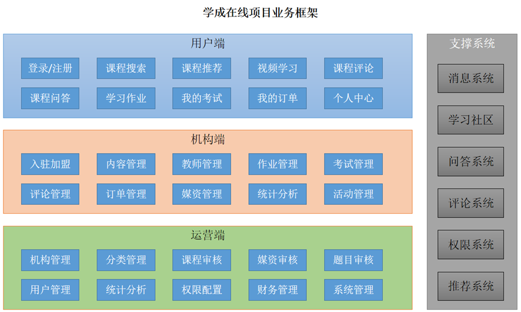

**课程发布业务流程：** 

**学生选课业务流程：**

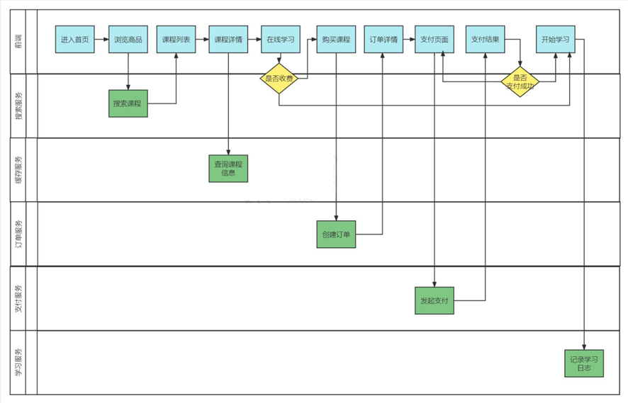


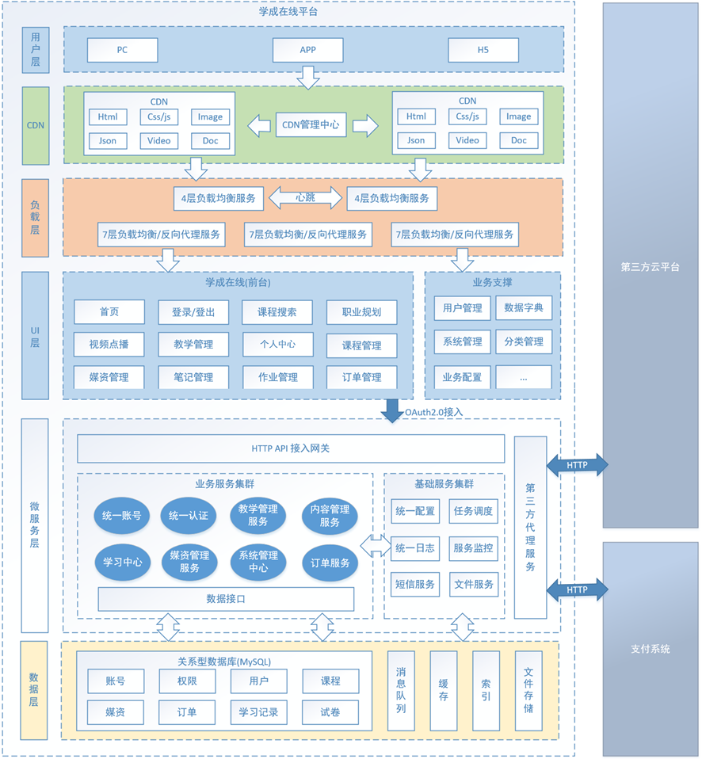

各层职责说明如下：

| 名称         | 功能描述                                                     |
| ------------ | ------------------------------------------------------------ |
| 用户层       | 用户层描述了本系统所支持的用户类型包括：pc用户、app用户、h5用户。pc用户通过浏览器访问系统、app用户通过android、ios手机访问系统，H5用户通过h5页面访问系统。 |
| **CDN**      | CDN全称Content Delivery Network，即**内容分发网络**，本系统所有静态资源全部通过CDN加速来提高访问速度。主要是项目中有视频耗费流量，需要将这些影响用户体验的东西分发到就近的服务器，提高访问速度。 |
| 负载均衡     | 系统的CDN层、UI层、服务层及数据层均设置了负载均衡服务，上图仅在UI层前边标注了负载均衡。 每一层的负载均衡会根据系统的需求来确定负载均衡器的类型，系统支持4层负载均衡+7层负载均衡结合的方式，4层负载均衡是指在网络传输层进行流程转发，根据IP和端口进行转发，7层负载均衡完成HTTP协议负载均衡及反向代理的功能，根据url进行请求转发。 |
| UI层         | UI层描述了系统向pc用户、app用户、h5用户提供的产品界面。根据系统功能模块特点确定了UI层包括如下产品界面类型： 1）面向pc用户的门户系统、学习中心系统、教学管理系统、系统管理中心。 2）面向h5用户的门户系统、学习中心系统。 3）面向app用户的门户系统、学习中心系统。 |
| **微服务层** | 微服务层将系统服务分类三类：业务服务、基础服务、第三方代理服务。 业务服务：主要为学成在线核心业务提供服务，并与数据层进行交互获得数据。 基础服务：主要管理学成在线系统运行所需的配置、日志、任务调度、短信等系统级别的服务。 第三方代理服务：系统接入第三方服务完成业务的对接，例如认证、支付、视频点播/直播、用户认证和授权。 |
| 数据层       | 数据层描述了系统的数据存储的内容类型，关系性数据库：持久化的业务数据使用MySQL。 消息队列：存储系统服务间通信的消息，本身提供消息存取服务，与微服务层的系统服务连接。 索引库：存储课程信息的索引信息，本身提供索引维护及搜索的服务，与微服务层的系统服务连接。 缓存：作为系统的缓存服务，作为微服务的缓存数据便于查询。 文件存储：提供系统静态资源文件的分布式存储服务，文件存储服务器作为CDN服务器的数据来源，CDN上的静态资源将最终在文件存储服务器上保存多份。 			本项目包括了用户端、机构端、运营端。 			核心模块包括：内容管理、媒资管理、课程搜索、订单支付、选课管理、认证授权等。 			下图是项目的功能模块图： |


# 项目预览

## 后台页面

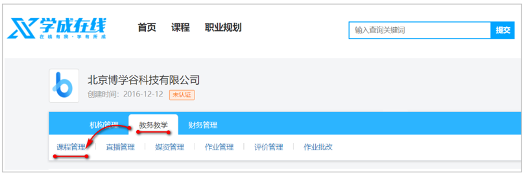


### **课程管理**


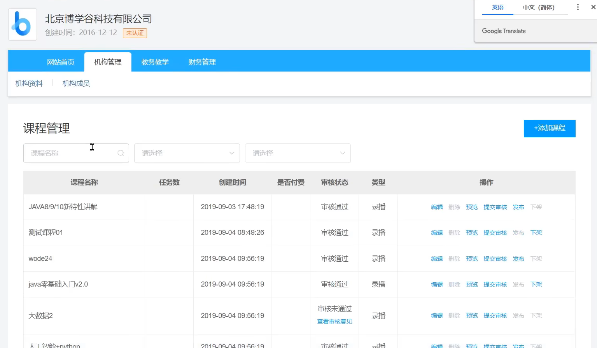


### **媒资管理页面上传视频**

1、教学机构人员进入媒资管理列表查询自己上传的媒资文件。

点击“媒资管理”

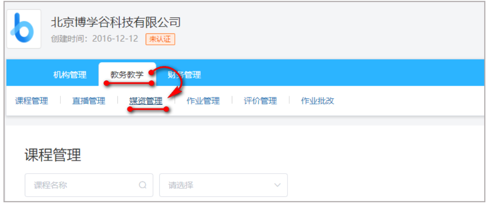

进入媒资管理列表页面查询本机构上传的媒资文件。


2、教育机构用户在"媒资管理"页面中点击 "上传视频" 按钮。


点击“上传视频”打开上传页面


3、选择要上传的文件，自动执行文件上传。


4、视频上传成功会自动处理，处理完成可以预览视频。


### 新增课程

基本信息 

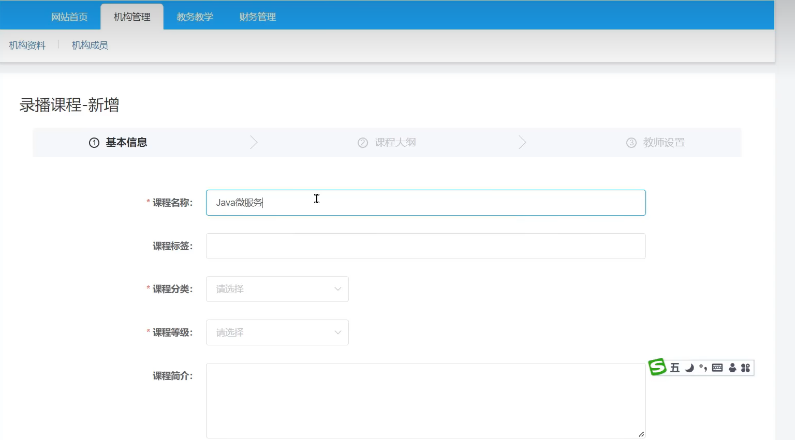课程大纲，添加视频展示已上传视频列表，可以搜索

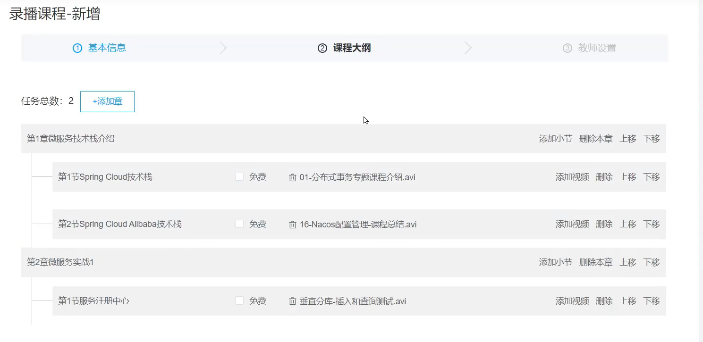

### 课程管理页提交审核

 


### 审核员审核后发布课程

 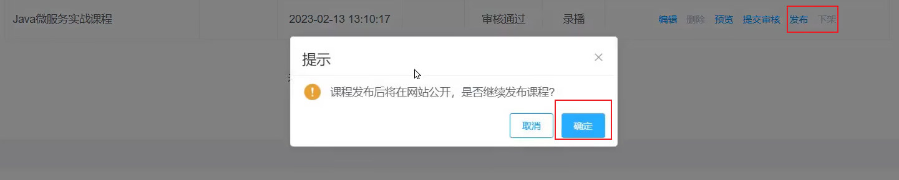


## 前台页面

### **主页** 


### **验证码登录：**

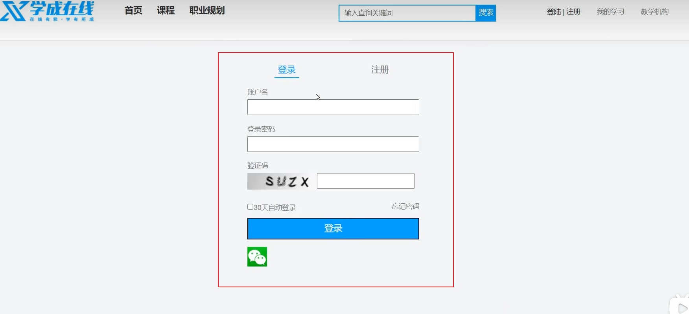进入后台的入口：


### 课程详情页

展示课程介绍、机构、教学老师、目录、问答、笔记等： 

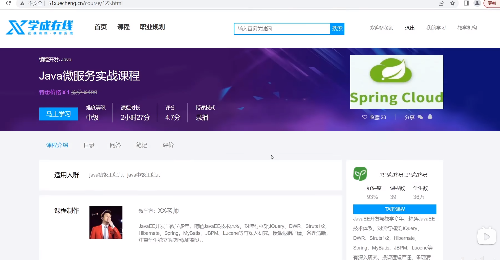


### 支付学习 


支付宝支付支持沙箱支付，方便开发，使用沙箱版支付宝扫码虚拟支付。 

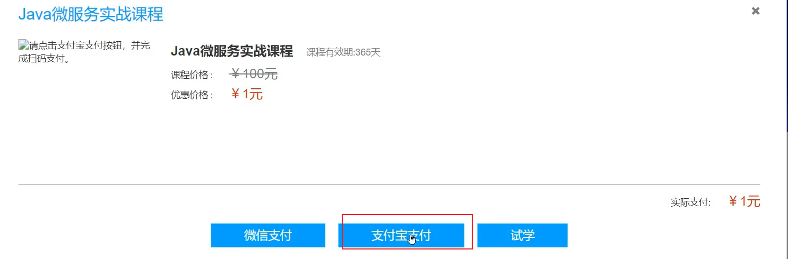


### 学习

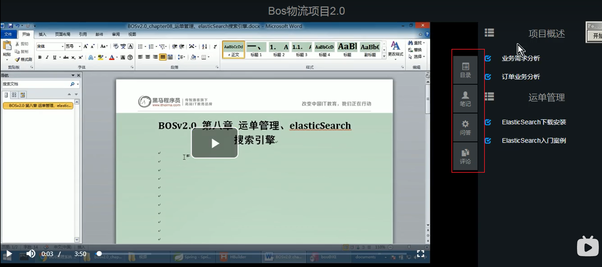


# **Gogs代码托管平台**

## 介绍 

Gogs的官网地址：[Gogs: A painless self-hosted Git service](https://gogs.io/)，本项目使用Gogs作为Git远程仓库。

git员工独立分支：git每天创建一个开发分支，练习，可以直白看见每天开发的内容，方便管理，通过签出切换分支。实际工作中不同员工各自独立的分支。

## 使用gogs进行团队协作开发


### 工作时项目开发流程

项目实战是模拟企业实际开发的场景，自己参考文档独立完成开发任务，项目实战可以有效的培养自己面对需求进行分析与开发的能力。

实战流程如下：

1、由组长将实战的初始代码提交至本组git仓库。

2、每位成员从此仓库clone项目。

3、小组共同讨论实战功能需求及接口。

4、根据自己小组的情况进行分工，每人至少写一个接口并测试通过、提交至仓库。

### 安装gog

windows启动gogs：

```
gogs.exe web
```


进入Gogs：http://localhost:10880/gogs/xuecheng-plus 

账号/密码：gogs/gogs

**第一步填写数据库信息**

输入虚拟机中的数据库地址和账号、密码，数据库名称为gogs_windows，需要提前在数据库中创建gogs_windows数据库

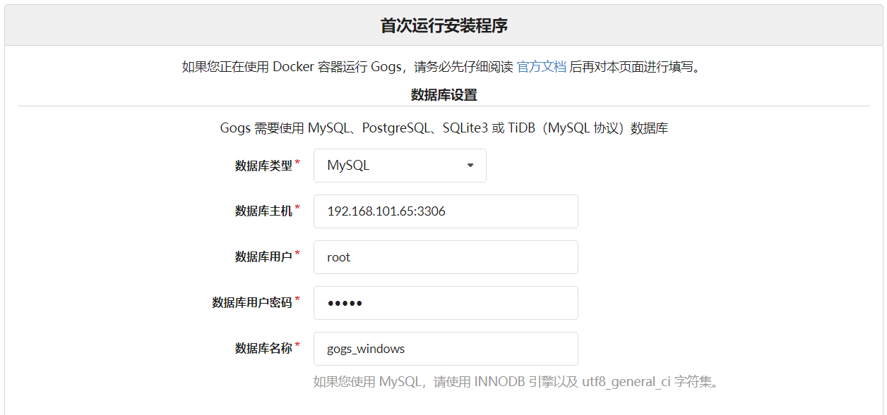

> 
>
> 数据库已经提前创建好。

**第二步应用基本设置：**

仓库目录可以设置在gogs的安装目录下

域名为虚拟域名，组长和组员在自己的hosts文件中配置该域名及对应的组长电脑的IP地址。

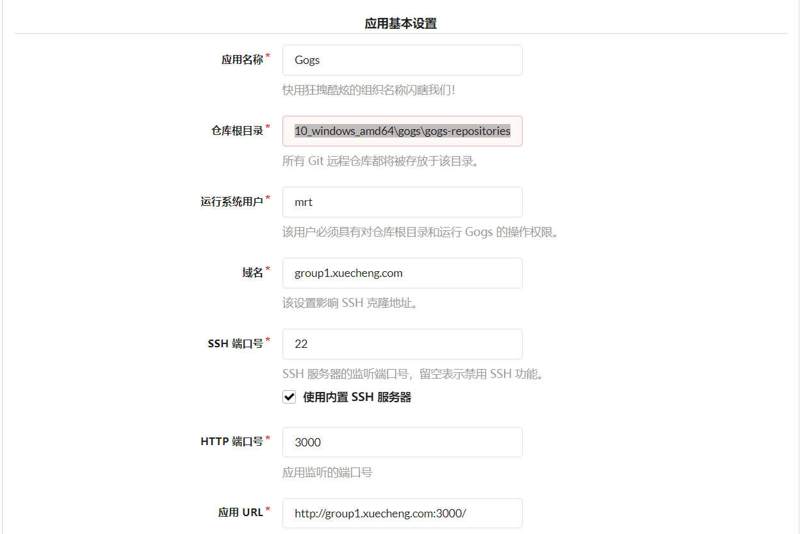

> **hosts本地关联域名和ip地址：**
>
> 配置的group1.xuecheng.com域名实际是不存在的，要本地配置：
>
> **打开hosts文件：**
>
> 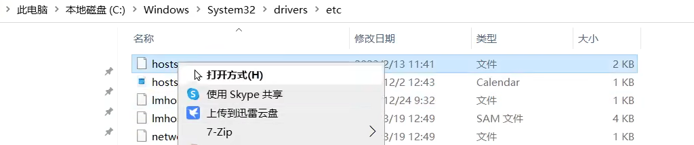
>
> 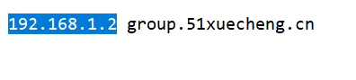
>
> 192.168.1.2是组长域名，配置后员工访问group1.xuecheng.com就会自动访问到组长域名。
>
> 
>
> 
>
> **Hosts**是一个没有扩展名的[系统文件](https://baike.baidu.com/item/系统文件/7581367?fromModule=lemma_inlink)，可以用记事本等工具打开，其作用就是**将一些常用的网址\**[域名](https://baike.baidu.com/item/域名/86062?fromModule=lemma_inlink)\**与其对应的\**[IP地址](https://baike.baidu.com/item/IP地址?fromModule=lemma_inlink)\**建立一个关联“数据库”**，当用户在浏览器中输入一个需要登录的网址时，系统会首先自动从[Hosts文件](https://baike.baidu.com/item/Hosts文件?fromModule=lemma_inlink)中寻找对应的[IP地址](https://baike.baidu.com/item/IP地址?fromModule=lemma_inlink)，一旦找到，系统会立即打开对应网页，如果没有找到，则系统会再将网址提交DNS域名解析服务器进行IP地址的解析。
>
> 需要注意的是，Hosts文件配置的[映射](https://baike.baidu.com/item/映射/20402620?fromModule=lemma_inlink)是静态的，如果网络上的计算机更改了请及时更新IP地址，否则将不能访问。

下边配置日志路径 ，日志路径可以设置在gogs的安装目录下

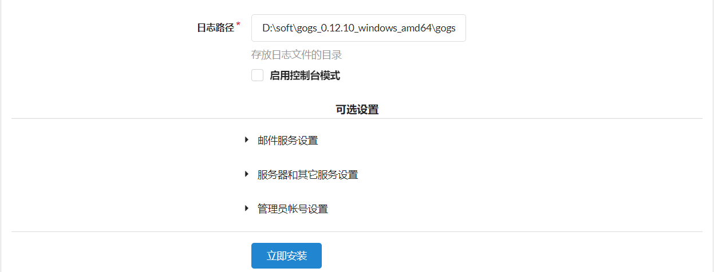


下边配置管理员账号和密码：gogs/gogs

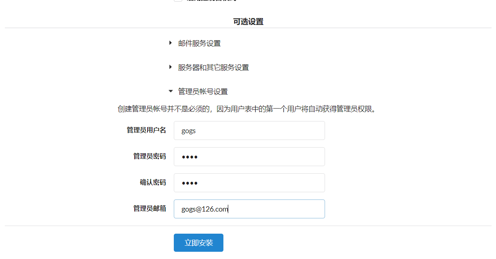

输入完毕点击立即安装

安装完毕自动跳转http://group1.xuecheng.com:3000/

> 别忘了域名group1.xuecheng.com在hosts配置过


### 创建组织 


 1、首先创建一个组织


该组织通常以项目名命名，填写组织名称。

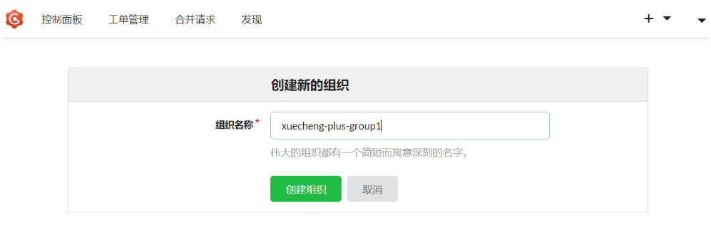


创建成功，进入管理面板修改组织信息

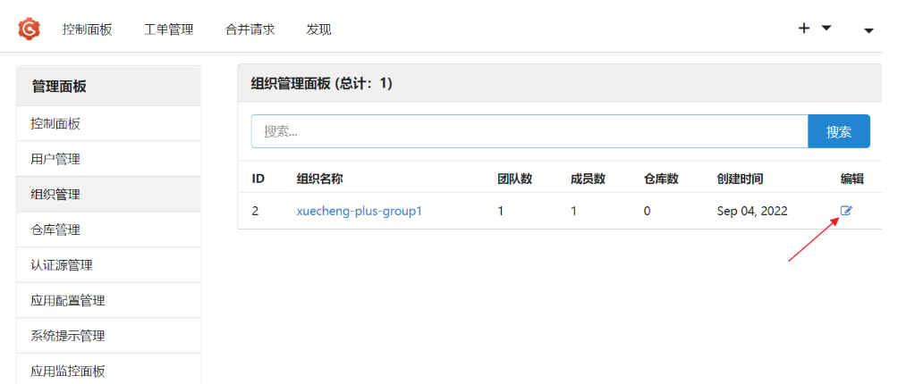

点击编辑，填写组织名称。


修改成功，进入首页点击组织名称


进入组织首页

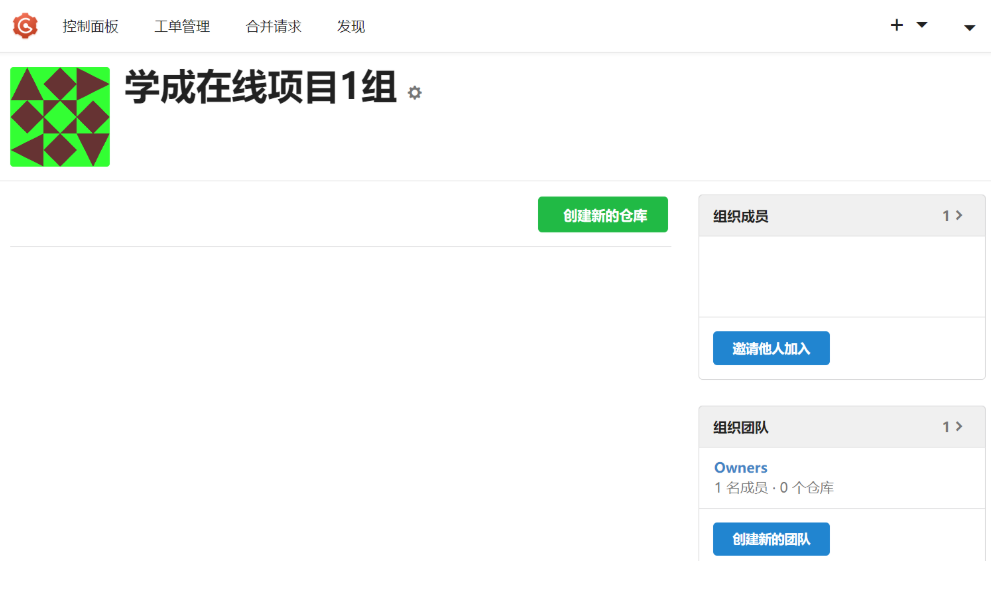

### 创建团队

下边开始创建团队


假如创建研发团队，填写团队名称


选择权限等级，注意：这里即使选择了权限等级也需要在仓库管理中去管理协作者的权限。

 团队创建成功


### 创建成员账号 

团队创建成功下边开始创建成员账号 。

首先在用户管理中添加账号分配给成员。


然后在下边的界面 中向团队添加成员


### 创建仓库 

 团队和组织创建完成，下边创建仓库，进入组织，创建仓库。

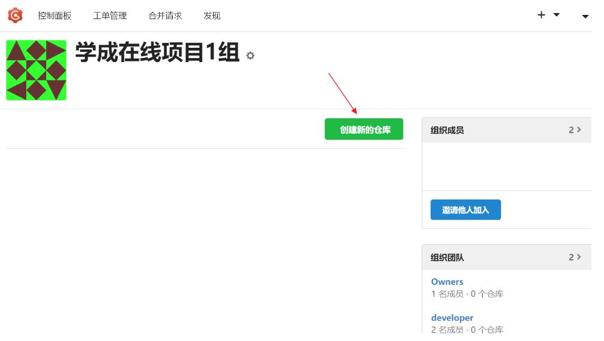


填写仓库信息

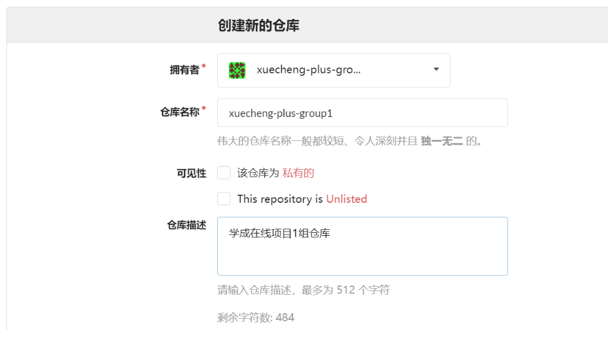

创建成功，仓库地址：http://192.168.101.65:10880/xuecheng-plus-group1/xuecheng-plus-group1.git，如下


### 配置使用仓库的人员 

下边配置使用仓库的人员

点击“仓库设置”，

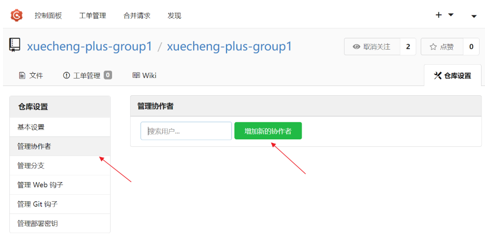

添加协作者，将团队成员的账号添加为协作者。

添加完成**注意分配权限**，如下图，通常**测试人员为读取权限，开发人员为读写权限。**


团队Leader需要将初始代码上传至Git仓库，团队成员**通过Idea克隆一份项目代码**，通过此仓库进行**协作开发**。


# 父工程 

## 创建父工程

父工程（聚合和管理依赖包版本）、基础工程（提供基础类库和工具类库）、微服务工程（内容管理、搜索服务、消息服务等）

```XML
<?xml version="1.0" encoding="UTF-8"?>
<project xmlns="http://maven.apache.org/POM/4.0.0" xmlns:xsi="http://www.w3.org/2001/XMLSchema-instance"
         xsi:schemaLocation="http://maven.apache.org/POM/4.0.0 https://maven.apache.org/xsd/maven-4.0.0.xsd">
    <modelVersion>4.0.0</modelVersion>
    <groupId>com.xuecheng</groupId>
    <artifactId>xuecheng-plus-parent</artifactId>
    <version>0.0.1-SNAPSHOT</version>
    <name>xuecheng-plus-parent</name>
    <description>xuecheng-plus-parent</description>
    <packaging>pom</packaging>

    <properties>
        <java.version>1.8</java.version>
        <project.build.sourceEncoding>UTF-8</project.build.sourceEncoding>
        <project.reporting.outputEncoding>UTF-8</project.reporting.outputEncoding>
        <spring-boot.version>2.3.7.RELEASE</spring-boot.version>
        <spring-cloud.version>Hoxton.SR9</spring-cloud.version>
        <org.mapstruct.version>1.3.1.Final</org.mapstruct.version>
        <spring-cloud-alibaba.version>2.2.6.RELEASE</spring-cloud-alibaba.version>
        <org.projectlombok.version>1.18.8</org.projectlombok.version>
        <javax.servlet-api.version>4.0.1</javax.servlet-api.version>
        <fastjson.version>1.2.83</fastjson.version>
        <druid-spring-boot-starter.version>1.2.8</druid-spring-boot-starter.version>
        <mysql-connector-java.version>8.0.30</mysql-connector-java.version>
        <mybatis-plus-boot-starter.version>3.4.1</mybatis-plus-boot-starter.version>
        <commons-lang.version>2.6</commons-lang.version>
        <minio.version>8.4.3</minio.version>
        <xxl-job-core.version>2.3.1</xxl-job-core.version>
        <swagger-annotations.version>1.5.20</swagger-annotations.version>
        <commons-lang3.version>3.10</commons-lang3.version>
        <okhttp.version>4.8.1</okhttp.version>
        <swagger-spring-boot-starter.version>1.9.0.RELEASE</swagger-spring-boot-starter.version>
        <elasticsearch.version>7.12.1</elasticsearch.version>
    </properties>


    <dependencyManagement>
        <dependencies>

            <dependency>
                <groupId>org.springframework.cloud</groupId>
                <artifactId>spring-cloud-dependencies</artifactId>
                <version>${spring-cloud.version}</version>
                <type>pom</type>
                <scope>import</scope>
            </dependency>
            <dependency>
                <groupId>org.springframework.boot</groupId>
                <artifactId>spring-boot-dependencies</artifactId>
                <version>${spring-boot.version}</version>
                <type>pom</type>
                <scope>import</scope>
            </dependency>
            <dependency>
                <groupId>com.alibaba.cloud</groupId>
                <artifactId>spring-cloud-alibaba-dependencies</artifactId>
                <version>${spring-cloud-alibaba.version}</version>
                <type>pom</type>
                <scope>import</scope>
            </dependency>
            <!-- lombok，简化类的构建-->
            <dependency>
                <groupId>org.projectlombok</groupId>
                <artifactId>lombok</artifactId>
                <version>${org.projectlombok.version}</version>
            </dependency>
            <!-- mapstruct 代码生成器，简化java bean之间的映射 -->
            <dependency>
                <groupId>org.mapstruct</groupId>
                <artifactId>mapstruct-jdk8</artifactId>
                <version>${org.mapstruct.version}</version>
            </dependency>
            <dependency>
                <groupId>org.mapstruct</groupId>
                <artifactId>mapstruct-processor</artifactId>
                <version>${org.mapstruct.version}</version>
            </dependency>
            <dependency>
                <groupId>io.swagger</groupId>
                <artifactId>swagger-annotations</artifactId>
                <version>${swagger-annotations.version}</version>
            </dependency>
            <!-- Servlet 容器管理，包括HttpServletRequest、HttpSession等类 -->
<!--servlet.jar 是servlet 3.0 版本之前的地址-->
<!--javax.servlet-api.jar 是servlet 3.0 版本之后的地址-->

            <dependency>
                <groupId>javax.servlet</groupId>
                <artifactId>javax.servlet-api</artifactId>
                <version>${javax.servlet-api.version}</version>
                <scope>provided</scope>
            </dependency>
            <!-- fastjson ，json解析工具，转换Java对象和JSON -->
            <dependency>
                <groupId>com.alibaba</groupId>
                <artifactId>fastjson</artifactId>
                <version>${fastjson.version}</version>
            </dependency>
            <!-- druid 连接池管理 -->
            <dependency>
                <groupId>com.alibaba</groupId>
                <artifactId>druid-spring-boot-starter</artifactId>
                <version>${druid-spring-boot-starter.version}</version>
            </dependency>

            <!-- mySQL数据库驱动包管理 -->
            <dependency>
                <groupId>mysql</groupId>
                <artifactId>mysql-connector-java</artifactId>
                <version>${mysql-connector-java.version}</version>
            </dependency>
            <!-- mybatis plus 集成Spring Boot启动器 -->
            <dependency>
                <groupId>com.baomidou</groupId>
                <artifactId>mybatis-plus-boot-starter</artifactId>
                <version>${mybatis-plus-boot-starter.version}</version>
            </dependency>

            <!-- mybatis plus 代码生成器 -->
            <dependency>
                <groupId>com.baomidou</groupId>
                <artifactId>mybatis-plus-generator</artifactId>
                <version>${mybatis-plus-boot-starter.version}</version>
            </dependency>

            <!-- 工具类管理，包括StringUtils类，判断字符串非空 -->
            <dependency>
                <groupId>commons-lang</groupId>
                <artifactId>commons-lang</artifactId>
                <version>${commons-lang.version}</version>
            </dependency>
            <!-- 分布式文件系统 minIO的客户端API包 -->
            <dependency>
                <groupId>io.minio</groupId>
                <artifactId>minio</artifactId>
                <version>${minio.version}</version>
            </dependency>
            <!--google推荐的一套工具类库-->
            <dependency>
                <groupId>com.google.guava</groupId>
                <artifactId>guava</artifactId>
                <version>25.0-jre</version>
            </dependency>
            <!--分布式任务调度-->
            <dependency>
                <groupId>com.xuxueli</groupId>
                <artifactId>xxl-job-core</artifactId>
                <version>${xxl-job-core.version}</version>
            </dependency>
            <!--Spring boot单元测试-->
            <dependency>
                <groupId>org.springframework.boot</groupId>
                <artifactId>spring-boot-starter-test</artifactId>
                <version>${spring-boot.version}</version>
                <scope>test</scope>
                <exclusions>
                    <exclusion>
                        <groupId>org.junit.vintage</groupId>
                        <artifactId>junit-vintage-engine</artifactId>
                    </exclusion>
                </exclusions>
            </dependency>
            <dependency>
                <groupId>com.squareup.okhttp3</groupId>
                <artifactId>okhttp</artifactId>
                <version>${okhttp.version}</version>
            </dependency>
<!--工具类，StringUtils在commons-lang3和commons-lang中的区别：相对于lang来说完全支持java5的特性，废除了一些旧的API。-->
            <dependency>
                <groupId>org.apache.commons</groupId>
                <artifactId>commons-lang3</artifactId>
                <version>${commons-lang3.version}</version>
            </dependency>
            <dependency>
                <groupId>com.spring4all</groupId>
                <artifactId>swagger-spring-boot-starter</artifactId>
                <version>${swagger-spring-boot-starter.version}</version>
            </dependency>
            <dependency>
                <groupId>org.elasticsearch.client</groupId>
                <artifactId>elasticsearch-rest-high-level-client</artifactId>
                <version>${elasticsearch.version}</version>
            </dependency>

            <dependency>
                <groupId>org.elasticsearch</groupId>
                <artifactId>elasticsearch</artifactId>
                <version>${elasticsearch.version}</version>
            </dependency>
        </dependencies>

    </dependencyManagement>

    <build>
        <finalName>${project.name}</finalName>
        <!--编译打包过虑配置-->
        <resources>
            <resource>
                <directory>src/main/resources</directory>
                <filtering>true</filtering>
                <includes>
                    <include>**/*</include>
                </includes>
            </resource>
            <resource>
                <directory>src/main/java</directory>
                <includes>
                    <include>**/*.xml</include>
                </includes>
            </resource>
        </resources>
        <plugins>
            <plugin>
                <groupId>org.apache.maven.plugins</groupId>
                <artifactId>maven-compiler-plugin</artifactId>
                <version>3.8.1</version>
                <configuration>
                    <!--指定项目源码jdk的版本-->
                    <source>1.8</source>
                    <!--指定项目编译后的jdk的版本-->
                    <target>1.8</target>
                    <!--配置注解预编译-->
                    <annotationProcessorPaths>
                        <path>
                            <groupId>org.projectlombok</groupId>
                            <artifactId>lombok</artifactId>
                            <version>${org.projectlombok.version}</version>
                        </path>
                    </annotationProcessorPaths>
                </configuration>
            </plugin>

            <!--责处理项目资源文件并拷贝到输出目录，如果有额外的资源文件目录则需要配置-->
            <plugin>
                <groupId>org.apache.maven.plugins</groupId>
                <artifactId>maven-resources-plugin</artifactId>
                <version>3.3.0</version>
                <configuration>
                    <encoding>utf-8</encoding>
                    <!--使用默认分隔符，resource中可以使用分割符定义过虑的路径-->
                    <useDefaultDelimiters>true</useDefaultDelimiters>
                </configuration>
            </plugin>
        </plugins>
    </build>

</project>
```


## 创建基础工程

```XML
<?xml version="1.0" encoding="UTF-8"?>
<project xmlns="http://maven.apache.org/POM/4.0.0" xmlns:xsi="http://www.w3.org/2001/XMLSchema-instance"
         xsi:schemaLocation="http://maven.apache.org/POM/4.0.0 https://maven.apache.org/xsd/maven-4.0.0.xsd">
    <modelVersion>4.0.0</modelVersion>
    <!--继承父工程 -->
    <parent>
        <groupId>com.xuecheng</groupId>
        <artifactId>xuecheng-plus-parent</artifactId>
        <version>0.0.1-SNAPSHOT</version>

    <!--指定父工程pom文件地址。文件夹里基础模块和父模块是同级的，所以要../ -->
        <relativePath>../xuecheng-plus-parent</relativePath>
    </parent>


    <artifactId>xuecheng-plus-base</artifactId>

<dependencies>
    <dependency>
        <groupId>org.projectlombok</groupId>
        <artifactId>lombok</artifactId>
    </dependency>
    <dependency>
        <groupId>org.apache.commons</groupId>
        <artifactId>commons-lang3</artifactId>
    </dependency>
    <!-- fast Json -->
    <dependency>
        <groupId>com.alibaba</groupId>
        <artifactId>fastjson</artifactId>
    </dependency>

    <!-- servlet Api 依赖 -->
    <dependency>
        <groupId>javax.servlet</groupId>
        <artifactId>javax.servlet-api</artifactId>
        <scope>provided</scope>
    </dependency>

    <!-- 通用组件 -->
    <dependency>
        <groupId>commons-lang</groupId>
        <artifactId>commons-lang</artifactId>
    </dependency>
    <dependency>
        <groupId>commons-codec</groupId>
        <artifactId>commons-codec</artifactId>
        <version>1.11</version>
    </dependency>
    <dependency>
        <groupId>io.swagger</groupId>
        <artifactId>swagger-annotations</artifactId>
    </dependency>
    <dependency>
        <groupId>org.springframework</groupId>
        <artifactId>spring-web</artifactId>
    </dependency>
    <dependency>
        <groupId>org.springframework.boot</groupId>
        <artifactId>spring-boot-starter-validation</artifactId>
    </dependency>
    <dependency>
        <groupId>org.springframework.boot</groupId>
        <artifactId>spring-boot-starter-log4j2</artifactId>
    </dependency>
    <!--根据扩展名取mimetype-->
    <dependency>
        <groupId>com.j256.simplemagic</groupId>
        <artifactId>simplemagic</artifactId>
        <version>1.17</version>
    </dependency>
    <dependency>
        <groupId>org.apache.commons</groupId>
        <artifactId>commons-lang3</artifactId>
    </dependency>
    <dependency>
        <groupId>com.google.zxing</groupId>
        <artifactId>core</artifactId>
        <version>3.3.3</version>
    </dependency>

    <dependency>
        <groupId>com.google.zxing</groupId>
        <artifactId>javase</artifactId>
        <version>3.3.3</version>
    </dependency>
    <dependency>
        <groupId>com.fasterxml.jackson.module</groupId>
        <artifactId>jackson-module-parameter-names</artifactId>
    </dependency>
    <dependency>
        <groupId>com.fasterxml.jackson.datatype</groupId>
        <artifactId>jackson-datatype-jdk8</artifactId>
    </dependency>
    <dependency>
        <groupId>com.fasterxml.jackson.datatype</groupId>
        <artifactId>jackson-datatype-jsr310</artifactId>
    </dependency>
</dependencies>

</project>
```


## 导入项目依赖项报错问题解决

如果一直卡在加载依赖，或者提示找不到依赖项，尝试点进设置，maven：

因为可能项目内设置的maven路径跟你本地设置的路径不同，导致依赖导入错误。

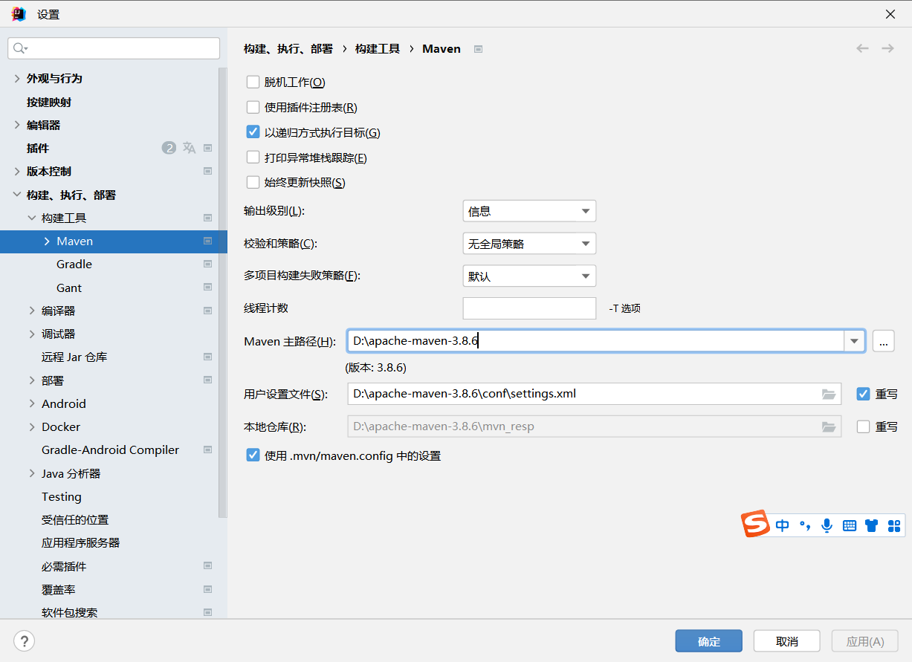