>  **导航：**
>
> [【Java笔记+踩坑汇总】Java基础+JavaWeb+SSM+SpringBoot+SpringCloud+瑞吉外卖/谷粒商城/学成在线+设计模式+面试题汇总+性能调优/架构设计+源码解析](https://blog.csdn.net/qq_40991313/article/details/126646289?spm=1001.2014.3001.5501)


[TOC]


# 1.【内容模块】需求分析

**过程：**确认用户需求、 确认关键问题、梳理业务流程、数据建模、编写需求规格说明书。

**确认用户需求：**开发人员将用户抽象的需求转换为项目具体的功能、性能方面的要求。

**确认关键问题：**发布课程要发布哪些信息，发布了不良信息怎么办，用户怎么查看课程

**梳理业务流程：**首先分析核心业务流程，包括内容模块的课程发布、全项目的选课学习流程。

**数据建模：**根据关键信息建表。

**编写需求规格说明书：**针对每一个问题编写需求用例，例如添加课程功能的参与者、前置条件（机构仅允许向自己机构添加课程）、基本流程（展示课程页面、添加课程、录入哪些信息、提交）、数据描述、后置条件（插入记录）。

# 2.【内容模块】模块工程的结构

三个工程聚合在内容模块：接口工程（controller，为前端提供接口）、业务工程Service和dao，数据模型工程（实体类、数据传输对象dto）

# 3.【课程查询功能1】通用

## **3.1 分析**数据模型

分析数据模型，查哪个数据库、查哪些信息，查询条件。


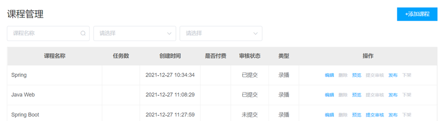


## 3.2 mybatis-plus代码生成器

使用mybatis-plus的generator工程，根据内容模块相关的数据库表生成PO类、Mapper接口、Mapper的xml文件。

地址在：[GitHub - baomidou/generator: Any Code generator](https://github.com/baomidou/generator)

修改数据库信息、生成路径，运行main方法：

```java
        //数据库账号
        private static final String DATA_SOURCE_USER_NAME  = "root";
        //数据库密码
        private static final String DATA_SOURCE_PASSWORD  = "mysql";
        //生成的表
        private static final String[] TABLE_NAMES = new String[]{
                "course_base",
                "course_market",
                "course_teacher",
                "course_category",
                "teachplan",
                "teachplan_media",
                "course_publish",
                "course_publish_pre"
        };
        // TODO 默认生成entity，需要生成DTO修改此变量
        // 一般情况下要先生成 DTO类 然后修改此参数再生成 PO 类。
        private static final Boolean IS_DTO = false;

        public static void main(String[] args) {
                ....
                //生成路径
                gc.setOutputDir(System.getProperty("user.dir") + "/xuecheng-plus-generator/src/main/java");
                
        ....
        // 数据库配置
                DataSourceConfig dsc = new DataSourceConfig();
                dsc.setDbType(DbType.MYSQL);
                dsc.setUrl("jdbc:mysql://192.168.101.65:3306/xcplus_" + SERVICE_NAME+"166"
                                + "?serverTimezone=UTC&useUnicode=true&useSSL=false&characterEncoding=utf8");
                ...
```


运行后会自动在内容模块下生成生成PO类、Mapper接口、Mapper的xml文件。

## 3.3 内容模块聚合api,model,service模块

api就是controller，model就是模型。

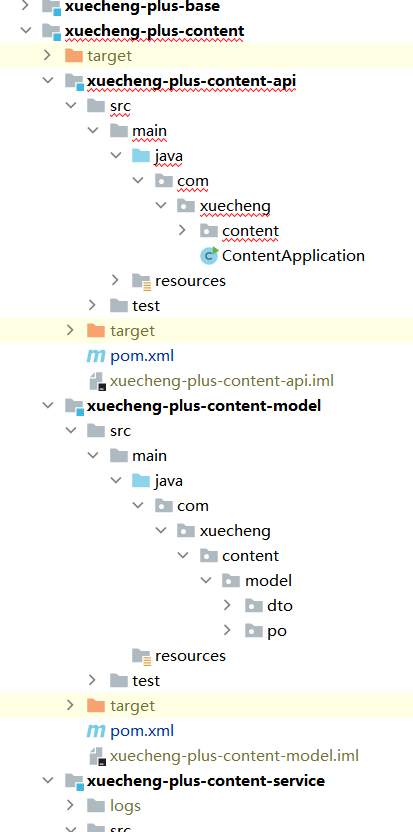


## 3.4 接口设计分析

分析请求方式、请求参数、请求类型（json）、响应类型、状态码

```bash
#请求类型
POST /content/course/list?pageNo=2&pageSize=1
Content-Type: application/json
#请求参数
{
  "auditStatus": "202002",
  "courseName": "",
  "publishStatus":""
}
#成功响应结果
{
  "items": [
    {
      "id": 26,
      "companyId": 1232141425,
      "companyName": null,
      "name": "spring cloud实战",
      "users": "所有人",
      "tags": null,
      "mt": "1-3",
      "mtName": null,
      "st": "1-3-2",
      "stName": null,
      "grade": "200003",
      "teachmode": "201001",
      "description": "本课程主要从四个章节进行讲解： 1.微服务架构入门 2.spring cloud 基础入门 3.实战Spring Boot 4.注册中心eureka。",
      "pic": "https://cdn.educba.com/academy/wp-content/uploads/2018/08/Spring-BOOT-Interview-questions.jpg",
      "createDate": "2019-09-04 09:56:19",
      "changeDate": "2021-12-26 22:10:38",
      "createPeople": null,
      "changePeople": null,
      "auditStatus": "202002",
      "auditMind": null,
      "auditNums": 0,
      "auditDate": null,
      "auditPeople": null,
      "status": 1,
      "coursePubId": null,
      "coursePubDate": null
    }
  ],
  "counts": 23,
  "page": 2,
  "pageSize": 1
}
```


## 3.5 【**基础**模块】分页查询**模型类**

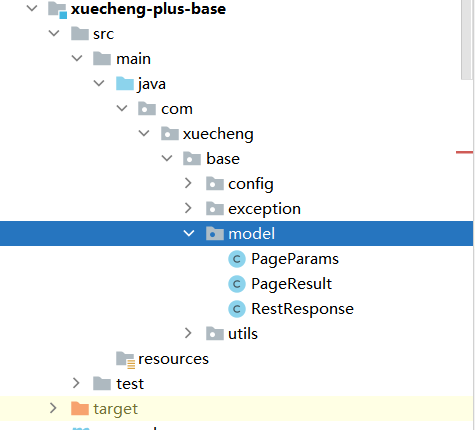

在基础模块 

```java
package com.xuecheng.base.model;

import lombok.Data;
import lombok.ToString;
import lombok.extern.java.Log;

/**
 * @description 分页查询通用参数
 * @author Mr.M
 * @date 2022/9/6 14:02
 * @version 1.0
 */
@Data
@ToString
public class PageParams {

  //当前页码
  private Long pageNo = 1L;

  //每页记录数默认值
  private Long pageSize =10L;

  public PageParams(){

  }

  public PageParams(long pageNo,long pageSize){
      this.pageNo = pageNo;
      this.pageSize = pageSize;
  }


}
```


## 3.6【**基础**模块】日期配置类

在base工程com.xuecheng.base.config包下加配置LocalDateTimeConfig 类实现转json时字符串与LocalDateTime类型的转换。

```java
@Configuration
public class LocalDateTimeConfig {

    /*
     * 序列化内容
     *   LocalDateTime -> String
     * 服务端返回给客户端内容
     * */
    @Bean
    public LocalDateTimeSerializer localDateTimeSerializer() {
        return new LocalDateTimeSerializer(DateTimeFormatter.ofPattern("yyyy-MM-dd HH:mm:ss"));
    }

    /*
     * 反序列化内容
     *   String -> LocalDateTime
     * 客户端传入服务端数据
     * */
    @Bean
    public LocalDateTimeDeserializer localDateTimeDeserializer() {
        return new LocalDateTimeDeserializer(DateTimeFormatter.ofPattern("yyyy-MM-dd HH:mm:ss"));
    }
    //long转string避免精度损失
    @Bean
    public ObjectMapper jacksonObjectMapper(Jackson2ObjectMapperBuilder builder) {
        ObjectMapper objectMapper = builder.createXmlMapper(false).build();
        //忽略value为null 时 key的输出
        objectMapper.setSerializationInclusion(JsonInclude.Include.NON_NULL);
        SimpleModule module = new SimpleModule();
        module.addSerializer(Long.class, ToStringSerializer.instance);
        module.addSerializer(Long.TYPE, ToStringSerializer.instance);
        objectMapper.registerModule(module);
        return objectMapper;
    }

    // 配置
    @Bean
    public Jackson2ObjectMapperBuilderCustomizer jackson2ObjectMapperBuilderCustomizer() {
        return builder -> {
            builder.serializerByType(LocalDateTime.class, localDateTimeSerializer());
            builder.deserializerByType(LocalDateTime.class, localDateTimeDeserializer());
        };
    }

}
```


## 3.7【内容模块】分页插件拦截器

```java
@Configuration
public class MybatisPlusConfig {
    @Bean
    public MybatisPlusInterceptor mybatisPlusInterceptor(){
        MybatisPlusInterceptor interceptor = new MybatisPlusInterceptor();
        PaginationInnerInterceptor paginationInnerInterceptor = new PaginationInnerInterceptor();
//        溢出总页数后是否进行处理(默认不处理)
        paginationInnerInterceptor.setOverflow(true);
//        单页分页条数限制(默认无限制)
        paginationInnerInterceptor.setMaxLimit(1000L);

        interceptor.addInnerInterceptor(paginationInnerInterceptor);
        return interceptor;
    }
}
```


## 3.8【内容模块】查询条件模型类 

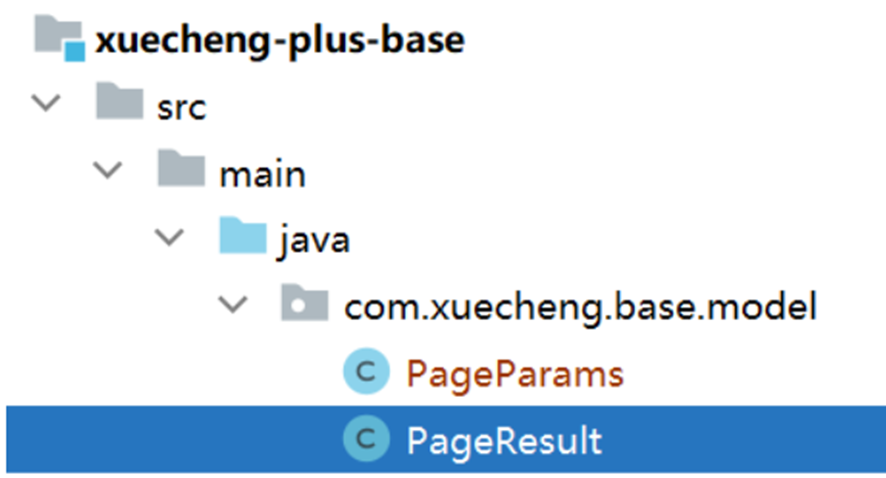


```java
package com.xuecheng.content.model.dto;

import lombok.Data;
import lombok.ToString;

/**
 * @description 课程查询参数Dto
 * @author Mr.M
 * @date 2022/9/6 14:36
 * @version 1.0
 */
 @Data
 @ToString
public class QueryCourseParamsDto {

  //审核状态
 private String auditStatus;
 //课程名称
 private String courseName;
  //发布状态
 private String publishStatus;

}
```


## 3.9【内容模块】响应模型类

```java
package com.xuecheng.base.model;

import lombok.Data;
import lombok.ToString;

import java.io.Serializable;
import java.util.List;

/**
 * @description 分页查询结果模型类
 * @author Mr.M
 * @date 2022/9/6 14:15
 * @version 1.0
 */
@Data
@ToString
public class PageResult<T> implements Serializable {

    // 数据列表
    private List<T> items;

    //总记录数
    private long counts;

    //当前页码
    private long page;

    //每页记录数
    private long pageSize;

    public PageResult(List<T> items, long counts, long page, long pageSize) {
        this.items = items;
        this.counts = counts;
        this.page = page;
        this.pageSize = pageSize;
    }


}
```


# 4.swagger

swagger：通过定义一种用来**描述API格式或API定义的语言**，来规范RESTful服务开发过程。

## 4.1 swagger生成接口文档**步骤** 

**1.导入依赖**

content.api包下 

```XML
<!-- Spring Boot 集成 swagger -->
<dependency>
    <groupId>com.spring4all</groupId>
    <artifactId>swagger-spring-boot-starter</artifactId>
</dependency>
```


**2.bootstrap.yml**配置swagger的扫描包路径及其它信息

```bash
server:
  servlet:
    context-path: /content    #应用的上下文路径，即项目路径，是构成请求url地址的一部分。
  port: 63041
swagger:
  title: "学成在线内容管理系统"
  description: "内容系统管理系统对课程相关信息进行管理"
  base-package: com.xuecheng.content
  enabled: true
  version: 1.0.0
```


**3.启动类**中添加@EnableSwagger2Doc注解

访问http://localhost:63040/content/swagger-ui.html查看接口信息

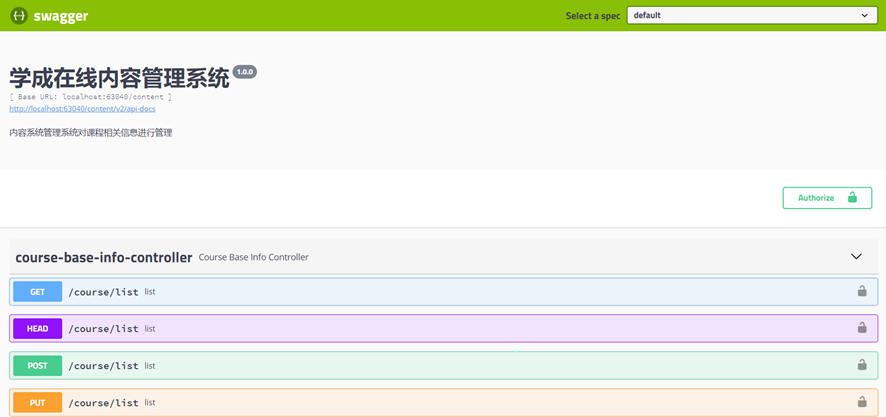

> 这个文档存在两个问题：
>
> 1、接口名称显示course-base-info-controller名称不直观
>
> 2、课程查询是post方式只显示post /course/list即可。

## 4.2 swagger常用注解

```java
 @Api：修饰整个类，描述Controller的作用
 @ApiOperation：描述一个类的一个方法，或者说一个接口
 @ApiParam：单个参数描述
 @ApiModel：用对象来接收参数
 @ApiModelProperty：用对象接收参数时，描述对象的一个字段
 @ApiResponse：HTTP响应其中1个描述
 @ApiResponses：HTTP响应整体描述
 @ApiIgnore：使用该注解忽略这个API
 @ApiError ：发生错误返回的信息
 @ApiImplicitParam：一个请求参数
 @ApiImplicitParams：多个请求参数
```


@ApiImplicitParam属性如下：

| 属性         | 取值   | 作用                                          |
| ------------ | ------ | --------------------------------------------- |
| paramType    |        | 查询参数类型                                  |
|              | path   | 以地址的形式提交数据                          |
|              | query  | 直接跟参数完成自动映射赋值                    |
|              | body   | 以流的形式提交 仅支持POST                     |
|              | header | 参数在request headers 里边提交                |
|              | form   | 以form表单的形式提交 仅支持POST               |
| dataType     |        | 参数的数据类型 只作为标志说明，并没有实际验证 |
|              | Long   |                                               |
|              | String |                                               |
| name         |        | 接收参数名                                    |
| value        |        | 接收参数的意义描述                            |
| required     |        | 参数是否必填                                  |
|              | true   | 必填                                          |
|              | false  | 非必填                                        |
| defaultValue |        | 默认值                                        |


## **4.3 设置swagger信息，@Api和@ApiOperation**

content.ap包下 

```java
 @Api(value = "课程信息编辑接口",tags = "课程信息编辑接口")
 @RestController
public class CourseBaseInfoController {

 @ApiOperation("课程查询接口")
 @PostMapping("/course/list")    //设置请求方式后，swagger页面就只显示post请求
  public PageResult<CourseBase> list(PageParams pageParams, @RequestBody(required=false) QueryCourseParamsDto queryCourseParams){

     //....

  }

}
```


再次启动服务，工程启动起来，访问http://localhost:63040/content/swagger-ui.html查看接口信息 

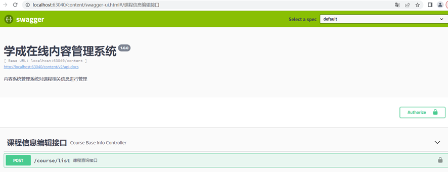


点开请求：

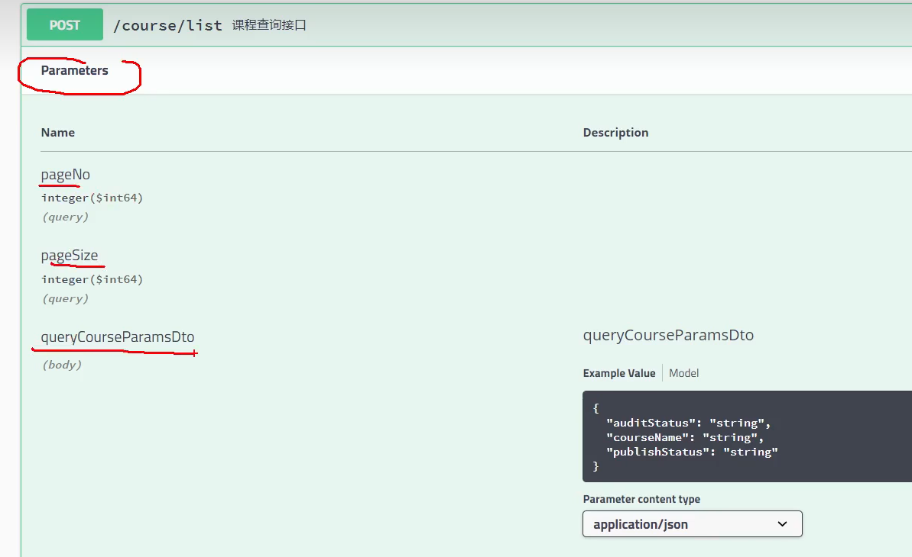


## 4.4 优化分页模型类，用@ApiModelProperty描述字段

 @ApiModelProperty

```java
@ApiModelProperty：用对象接收参数时，描述对象的一个字段
```


```java
@Data
@ToString
public class PageParams {

    //当前页码
    @ApiModelProperty("页码")
    private Long pageNo = 1L;
    //每页显示记录数
    @ApiModelProperty("每页记录数")
    private Long pageSize = 30L;

    public PageParams() {
    }

    public PageParams(Long pageNo, Long pageSize) {
        this.pageNo = pageNo;
        this.pageSize = pageSize;
    }
}
```


再次访问swagger页面，可以看到描述信息已经出来了：

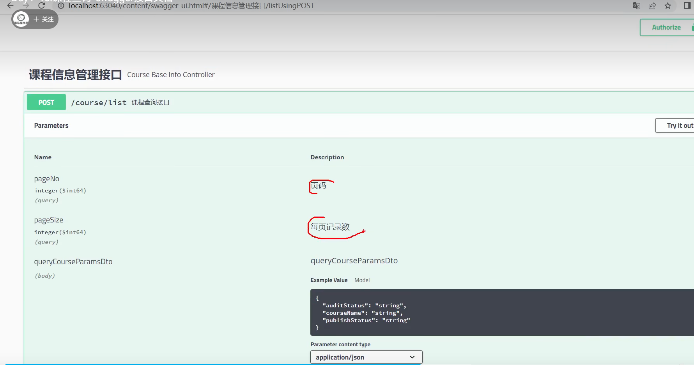


## 4.5 使用Swagger进行接口测试

content.ap包下 CourseBaseInfoController 

```java
@ApiOperation("课程查询接口")
@PostMapping("/course/list")
public PageResult<CourseBase> list(PageParams pageParams, @RequestBody(required=false) QueryCourseParamsDto queryCourseParams){

    CourseBase courseBase = new CourseBase();
    courseBase.setName("测试名称");
    courseBase.setCreateDate(LocalDateTime.now());
    List<CourseBase> courseBases = new ArrayList();
    courseBases.add(courseBase);
    PageResult pageResult = new PageResult<CourseBase>(courseBases,10,1,10);
    return pageResult;

}
```


启动项目，打开swagger。

使用Swagger进行接口测试 ：

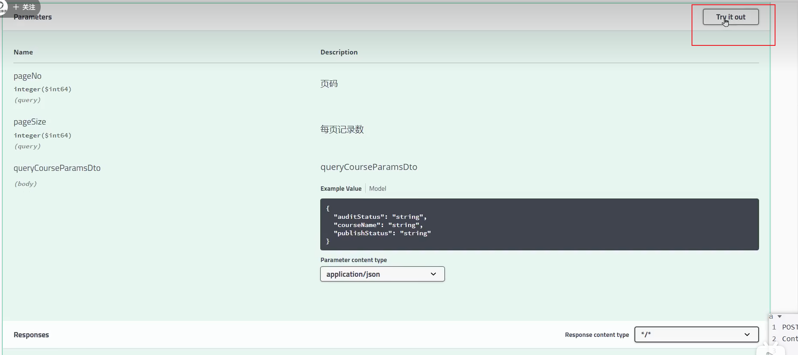

设置请求参数

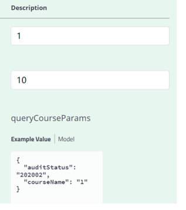

 swagger能看到响应的数据： 

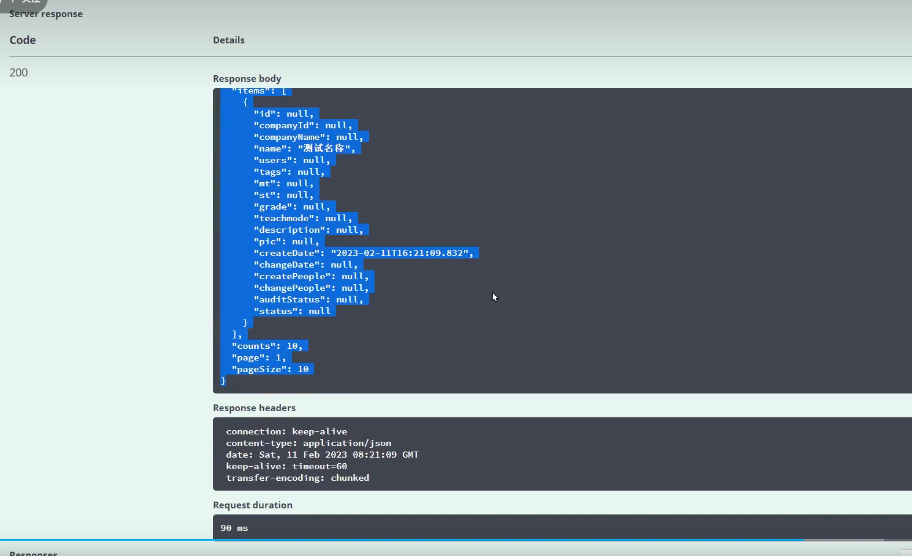

> 如果添加过日期格式配置类，序列化和反序列化时，时间格式就可以自定义。
>
> 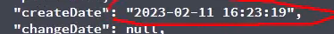

# 5.【课程查询功能2】具体

## 5.1【习惯】先写持久层，再写Service

一个专业的程序员，要先写持久层，再写Service，提高代码复用性。

## 5.2【内容-接口模块】yml配置

> 仅接口模块需要写启动类和bootstrap.yml。 

```bash
server:
  servlet:
    context-path: /content
  port: 63040
#微服务配置
spring:
  application:
    name: content-api
  datasource:
    driver-class-name: com.mysql.cj.jdbc.Driver
    url: jdbc:mysql://192.168.101.65:3306/xc402_content?serverTimezone=UTC&userUnicode=true&useSSL=false&
    username: root
    password: mysql
# 日志文件配置路径
logging:
  config: classpath:log4j2-dev.xml

swagger:
  title: "学成在线内容管理系统"
  description: "内容系统管理系统对课程相关信息进行管理"
  base-package: com.xuecheng.content
  enabled: true
  version: 1.0.0
```


## 5.3 创建审核状态数据库字典

> **为什么要创建数据库字典？**
>
> 降低耦合性，例如将课程的审核状态写成202001等数字，然后用数据库字典查询此数字代表的含义，这样以后想改审核状态的描述时候，就只需要从数据库字典改，不用sql语句逐条改课程表。

> 课程表的教学模式、审核状态、课程发布状态都将使用数据库字典：
>
> 

课程审核状态的定义： 

```java
[
    {"code":"202001","desc":"审核未通过"},
    {"code":"202002","desc":"未审核"},
    {"code":"202003","desc":"审核通过"}
]
```


创建存放“数据库字典”的数据库：

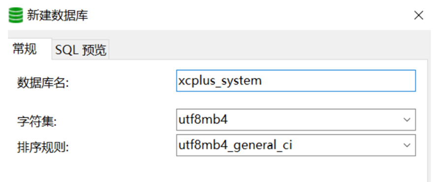

创建dictionary表：

 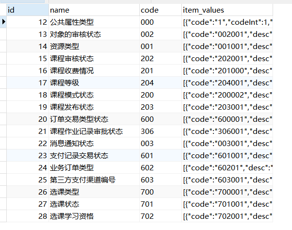

## 5.4【业务】条件查询课程列表

```java
package com.xuecheng.content.service.impl;

import ...

/**
 * @description 课程信息管理业务接口实现类
 * @author Mr.M
 * @date 2022/9/6 21:45
 * @version 1.0
 */
@Service
public class CourseBaseInfoServiceImpl  implements CourseBaseInfoService {


 @Autowired
 CourseBaseMapper courseBaseMapper;

 @Override
 public PageResult<CourseBase> queryCourseBaseList(PageParams pageParams, QueryCourseParamsDto queryCourseParamsDto) {


  //构建查询条件对象
  LambdaQueryWrapper<CourseBase> queryWrapper = new LambdaQueryWrapper<>();
  //构建查询条件，根据课程名称查询
     queryWrapper.like(StringUtils.isNotEmpty(queryCourseParamsDto.getCourseName()),CourseBase::getName,queryCourseParamsDto.getCourseName());
  //构建查询条件，根据课程审核状态查询
     queryWrapper.eq(StringUtils.isNotEmpty(queryCourseParamsDto.getAuditStatus()),CourseBase::getAuditStatus,queryCourseParamsDto.getAuditStatus());
//构建查询条件，根据课程发布状态查询
//todo:根据课程发布状态查询 

  //分页对象
  Page<CourseBase> page = new Page<>(pageParams.getPageNo(), pageParams.getPageSize());
  // 查询数据内容获得结果
  Page<CourseBase> pageResult = courseBaseMapper.selectPage(page, queryWrapper);
  // 获取数据列表
  List<CourseBase> list = pageResult.getRecords();
  // 获取数据总数
  long total = pageResult.getTotal();
  // 构建结果集
  PageResult<CourseBase> courseBasePageResult = new PageResult<>(list, total, pageParams.getPageNo(), pageParams.getPageSize());
  return courseBasePageResult;


 }


}
```


## 5.5【接口】查询课程列表

```
com.xuecheng.content.api.CourseBaseInfoController
 @ApiOperation("课程查询接口")
@PostMapping("/course/list")
 public PageResult<CourseBase> list(PageParams pageParams, @RequestBody QueryCourseParamsDto queryCourseParams){
     PageResult<CourseBase> pageResult = courseBaseInfoService.queryCourseBaseList(pageParams, queryCourseParams);
    return pageResult;
 }
```


## 5.6 swagger测试

http://localhost:63040/content/swagger-ui.html

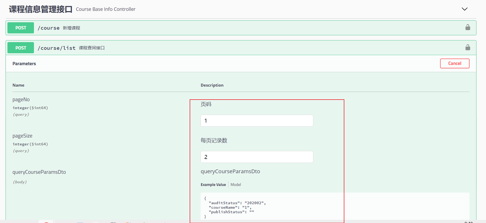

## **5.7【idea插件】Httpclient测试**

> swagger测试的缺点：刷新页面后请求数据就没了，**Httpclient就没有这个缺点。**
>
> 2022版之后都是自带的。
>
> 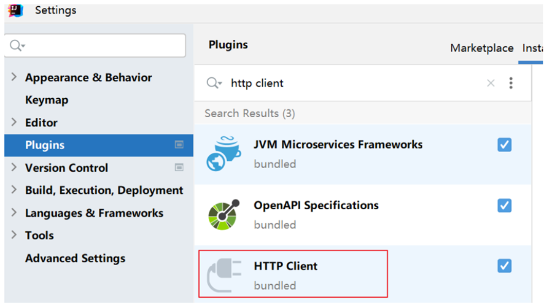

**测试步骤：**

进入controller类，找到http接口对应的方法

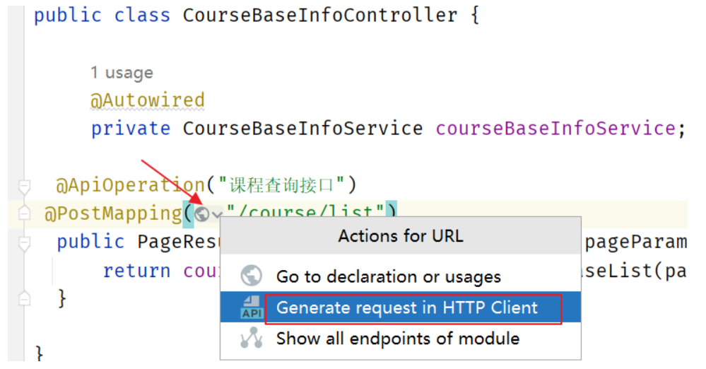

点击Generate request in HTTP Client即可生成的一个测试用例。

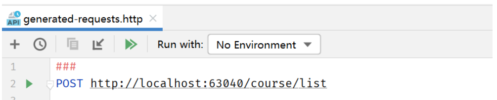

可以看到自己生成了一个.http结尾的文件

**添加请求参数进行测试、运行**

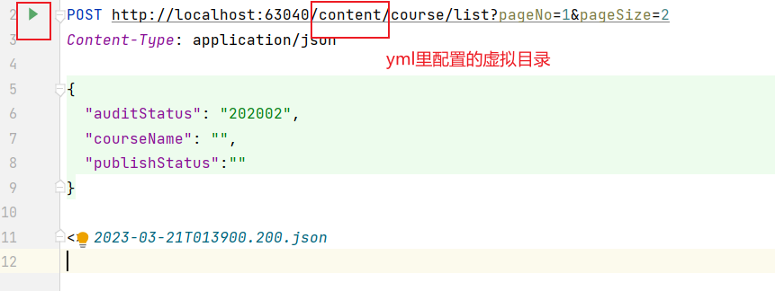

观察控制台，测试通过。

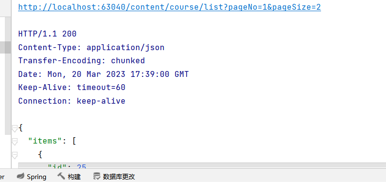

## 5.8 封装用来**Httpclient**测试的文件夹

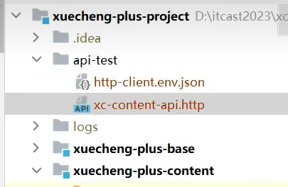

xc-content-api.http

```bash
### 查询课程信息
POST {{content_host}}/content/course/list?pageNo=1&pageSize=2
Content-Type: application/json

{
  "auditStatus": "202004",
  "courseName": "java",
  "publishStatus":""
}

### 查询课程分类
GET {{content_host}}/content/course-category/tree-nodes

### 新增课程
POST {{content_host}}/content/course
Content-Type: application/json

{
  "charge": "201001",
  "price": 10,
  "originalPrice":100,
  "qq": "22333",
  "wechat": "223344",
  "phone": "13333333",
  "validDays": 365,
  "mt": "1-1",
  "st": "1-1-1",
  "name": "",
  "pic": "fdsf",
  "teachmode": "200002",
  "users": "初级人员",
  "tags": "tagstagstags",
  "grade": "204001",
  "description": "java网络编程高级java网络编程高级java网络编程高级"
}
```


http-client.env.json

```bash
{
  "dev": {
    "access额_token": "",
    "gateway_host": "localhost:63010",
    "content_host": "localhost:63040",
    "system_host": "localhost:63110",
    "media_host": "localhost:63050",
    "search_host": "localhost:63080",
    "auth_host": "localhost:63070",
    "checkcode_host": "localhost:63075",
    "learning_host": "localhost:63020"
  }
}
```


## **5.9 使用idea**启动前端项目

> **前后端联调：**
>
> 通常由后端工程师将接口设计好并编写接口文档，将接口文档交给前端工程师，前后端的工程师就开始并行开发，前端开发人员会使用mock数据（假数据）进行开发，当前后端代码完成后开始进行接口联调，前端工程师将mock数据改为请求后端接口获取，前端代码请求后端服务测试接口是否正常，这个过程是前后端联调。 

**使用idea前后端联调：**

> **也可以用vscode运行前端项目**，这里介绍使用idea前后端联调。

1、安装nodejs

2、前端项目放到项目总目录下

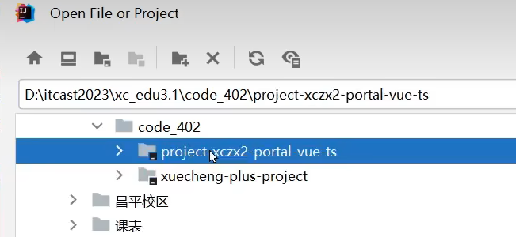

3、idea配置nodejs

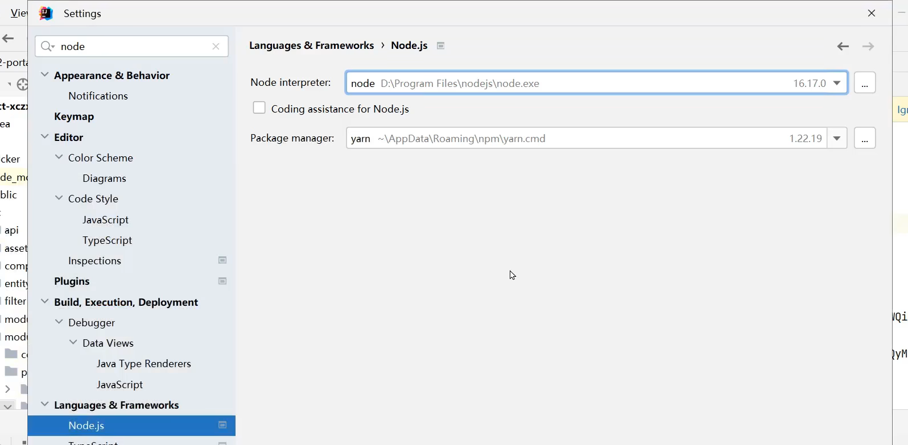

> vue-cli项目的package.json就相当于maven的pom，node-modules相当于maven的本地仓库。 

4、右键点击project-xczx2-portal-vue-ts目录下的package.json文件，

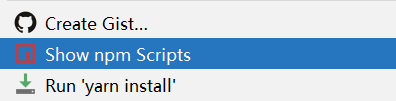

5、点击Show npm Scripts打开npm窗口

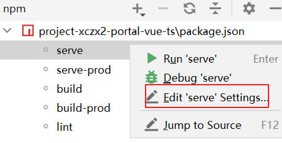

6、点击“Edit 'serve'” setting，下边对启动项目的一些参数进行配置，选择nodejs、npm。


7、右键点击Serve，点击“Run serve”启动工程。

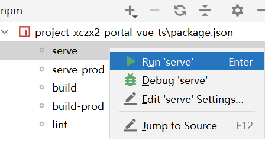

出现如下访问链接说明启动成功

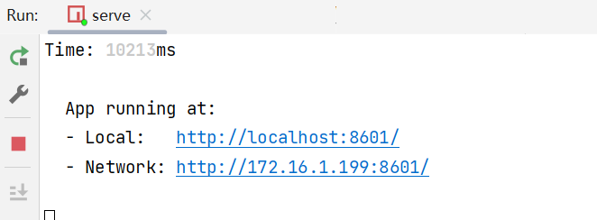

8、访问http://localhost:8601即可访问前端工程。

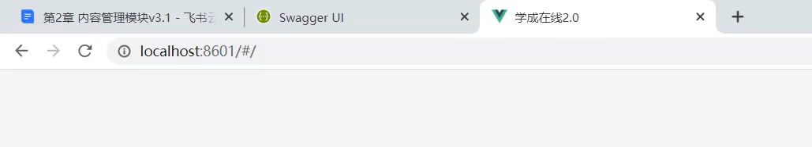


> 如果存在问题尝试配置serve：
>
> 1、cmd进入工程根目录
>
> 2、运行以下命令
>
> ```bash
> npm install -g cnpm --registry=https://registry.npm.taobao.org
> 
> cnpm i
> 
> npm run serve
> ```
>
> 

## **5.10 创建系统模块**

> 前端工程报错如下：
>
> 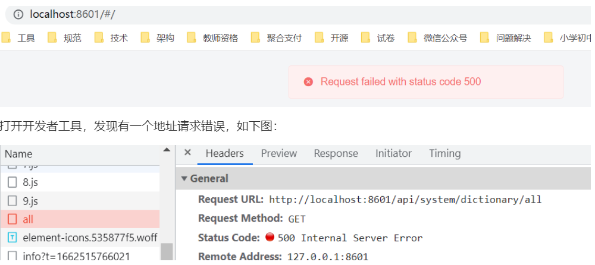
>
> [http://localhost:8601/system/dictionary/all](http://localhost:8601/api/system/dictionary/all) 指向的是系统管理服务。此链接正是在前端请求后端获取数据字典数据的接口地址。**数据字典表**中配置了项目用的字典信息，**把它放到内存中以便使用**，此接口是查询字典中的全部数据

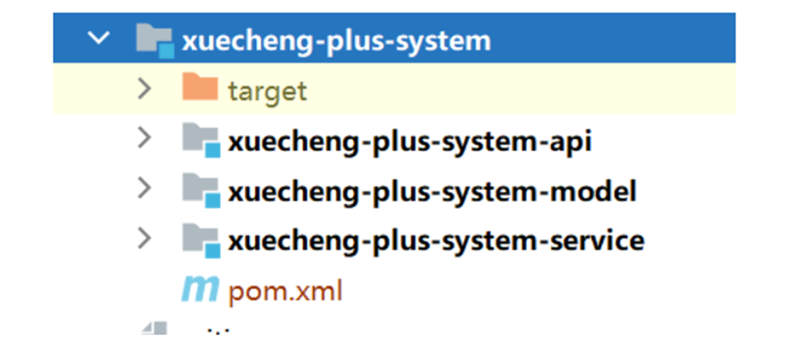

Service模块application.yml：

```bash
spring:
  application:
    name: system-service
  datasource:
    driver-class-name: com.mysql.cj.jdbc.Driver
    url: jdbc:mysql://192.168.101.65:3306/xc402_system?serverTimezone=UTC&userUnicode=true&useSSL=false&
    username: root
    password: mysql
# 日志文件配置路径
logging:
  config: classpath:log4j2-dev.xml
```


api模块bootstrap.yml

```bash
server:
  servlet:
    context-path: /system
  port: 63110
#微服务配置
spring:
  application:
    name: system-service

# 日志文件配置路径
logging:
  config: classpath:log4j2-dev.xml

# swagger 文档配置
swagger:
  title: "学成在线内容管理系统"
  description: "内容系统管理系统对课程相关信息进行业务管理数据"
  base-package: com.xuecheng.content
  enabled: true
  version: 1.0.0
```


启动系统管理服务，启动成功，在浏览器请求：http://localhost:63110/system/dictionary/all

此时请求状态码不再是500，而是跨域问题：

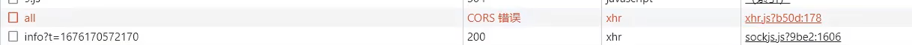

 

## 5.11 解决CORS跨域问题

CORS全称是 cross origin resource share 表示跨域资源共享。

出这个提示的原因是基于浏览器的同源策略，去判断是否跨域请求，同源策略是浏览器的一种安全机制，从一个地址请求另一个地址，如果协议、主机、端口三者全部一致则不属于跨域，否则有一个不一致就是跨域请求。


### 5.11.1 方法一（使用）：**系统模块-通过cors过滤器，**添加跨域响应头 

服务端在响应头添加 Access-Control-Allow-Origin：*

**实现：** 

在**系统模块**的api工程config包下编写GlobalCorsConfig.java，


```java
//这个包别导错了，有一个很像的。
import org.springframework.web.cors.reactive.UrlBasedCorsConfigurationSource;
@Configuration
public class CorsConfiguration{
 
    @Bean
    public CorsWebFilter corsWebFilter(){
        UrlBasedCorsConfigurationSource source = new UrlBasedCorsConfigurationSource();
 
        CorsConfiguration corsConfiguration= new CorsConfiguration();
        //1、配置跨域
        // 允许跨域的请求头
        corsConfiguration.addAllowedHeader("*");
        // 允许跨域的请求方式
        corsConfiguration.addAllowedMethod("*");
        // 允许跨域的请求来源
        corsConfiguration.addAllowedOriginPattern("*");
//注释的这句会报错。因为当allowCredentials为真时，allowedorigin不能包含特殊值"*"，因为不能在"访问-控制-起源“响应头中设置该值。
        //corsConfiguration.addAllowedOrigin("*");//这句会报错，具体看下文
        // 是否允许携带cookie跨域
        corsConfiguration.setAllowCredentials(true);
 
        // 任意url都要进行跨域配置，两个*号就是可以匹配包含0到多个/的路径
        source.registerCorsConfiguration("/**",corsConfiguration);
        return new CorsWebFilter(source);
 
    }
}
```


>  **坑点：**
>
> 报错：When allowCredentials is true, allowedOrigins cannot contain the special value "*" since that cannot be set on the "Access-Control-Allow-Origin" response header. To allow credentials to a set of origins, list them explicitly or consider using "allowedOriginPatterns" instead.
>
> 分析：当allowCredentials为真时，allowedorigin不能包含特殊值"*"，因为不能在"访问-控制-起源“响应头中设置该值。
>
> **解决：**
>
> 移除这条语句：
>
> ```java
> corsConfiguration.addAllowedOrigin("*");
> ```
>
> 
>
> 设置允许跨域的请求来源为具体的域名端口：
>
> ```java
> corsConfiguration.addAllowedOrigin("http://localhost:8001");
> ```
>
> 
>
> 或者：
>
> ```java
> corsConfiguration.addAllowedOriginPattern("*");
> ```
>
> 
>
> 备用：
>
> ```java
> package com.xuecheng.system.config;
>  @Configuration
>  public class GlobalCorsConfig {
> 
>   /**
>    * 允许跨域调用的过滤器
>    */
>   @Bean
>   public CorsFilter corsFilter() {
>    CorsConfiguration config = new CorsConfiguration();
>    //允许白名单域名进行跨域调用
>    config.addAllowedOrigin("*");
>    //允许跨越发送cookie
>    config.setAllowCredentials(true);
>    //放行全部原始头信息
>    config.addAllowedHeader("*");
>    //允许所有请求方法跨域调用
>    config.addAllowedMethod("*");
>    UrlBasedCorsConfigurationSource source = new UrlBasedCorsConfigurationSource();
>    source.registerCorsConfiguration("/**", config);
>    return new CorsFilter(source);
>   }
>  }
> ```
>
> 

### 5.11.2 方法二：实现接口WebMvcConfigurer

```java
@Configuration
public class CorsConfig implements WebMvcConfigurer {

    @Override
    public void addCorsMappings(CorsRegistry registry) {
        registry.addMapping("/**")
                .allowedOriginPatterns("*")
                .allowedMethods("GET", "HEAD", "POST", "PUT", "DELETE", "OPTIONS")
                .allowCredentials(true)
                .maxAge(3600)
                .allowedHeaders("*");
    }
}
```


### 5.11.3 方法三：JSONP

通过script标签的src属性进行跨域请求，如果服务端要响应内容则首先读取请求参数callback的值，callback是一个回调函数的名称，服务端读取callback的值后将响应内容通过调用callback函数的方式告诉请求方。如下图：

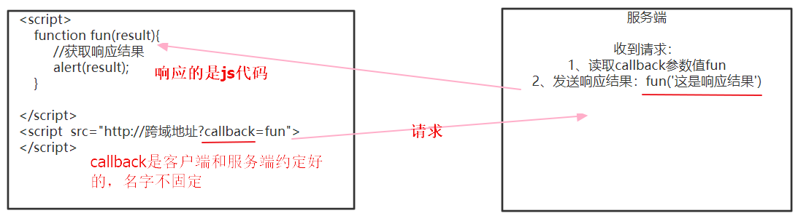


### 5.11.4 方法四：使用nginx反向代理为同一域

使用Nginx反向代理，不同地址、端口都被同一个域名反向代理了，这就是统一域了。**这种方法在开发时没法用，所以不采用。** 

由于服务端之间没有跨域，浏览器通过nginx去访问跨域地址。

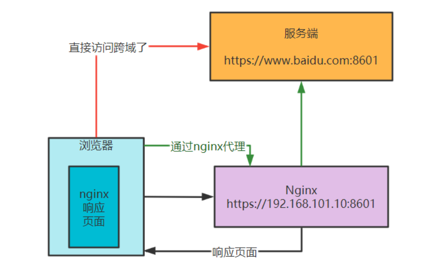

1）浏览器先访问http://192.168.101.10:8601 nginx提供的地址，进入页面

2）此页面要跨域访问http://192.168.101.11:8601 ，不能直接跨域访问http://www.baidu.com:8601 ，而是访问nginx的一个同源地址，比如：http://192.168.101.11:8601/api ，通过http://192.168.101.11:8601/api 的代理去访问http://www.baidu.com:8601。

这样就实现了跨域访问。

浏览器到http://192.168.101.11:8601/api 没有跨域

nginx到http://www.baidu.com:8601通过服务端通信，没有跨域。


## **5.12前后端联调**

体会前后端联调的流程，测试的功能为课程查询功能。

**1、修改前端配置文件**

前端默认连接的是项目的网关地址，由于现在网关工程还没有创建，这里需要更改前端工程的参数配置文件 ，修改网关地址为内容管理服务的地址。

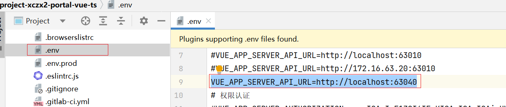

> 网关端口63010，配置网关后就改成显示第一行，注释第三行。

**2、启动前端工程，再启内容管理服务端。**

进入课程管理：http://localhost:8601/#/organization/course-list

**3、正常显示**

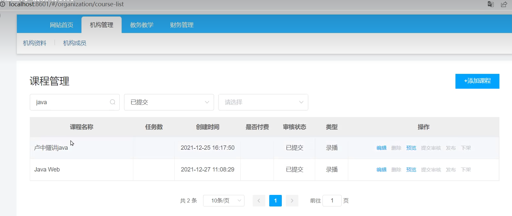


> 如果页面没正常显示，复制并格式化响应数据，进行分析。
>
> 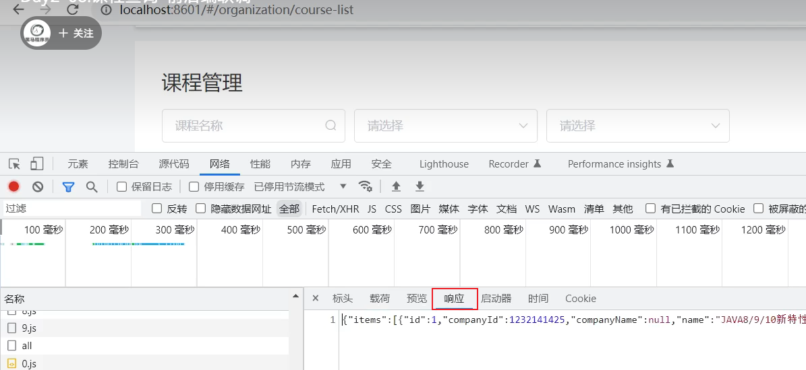