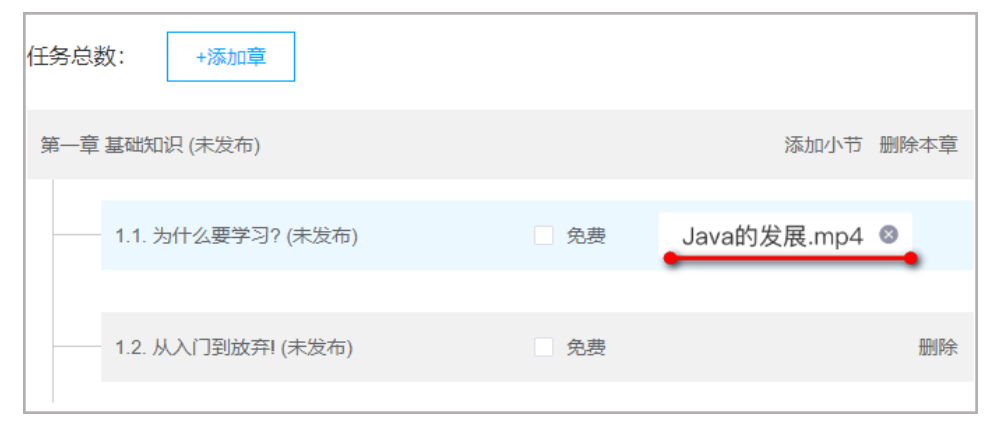
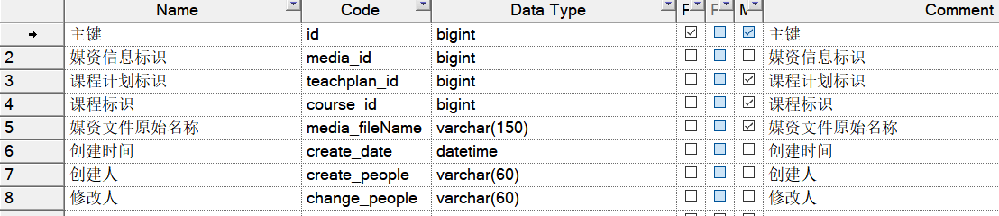
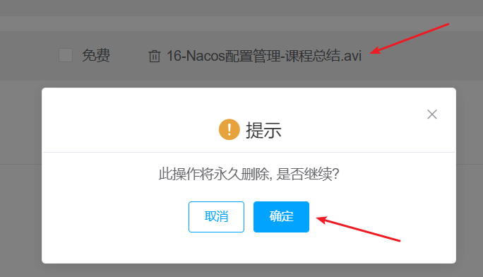

>  **导航：** 
>
> [【Java笔记+踩坑汇总】Java基础+JavaWeb+SSM+SpringBoot+SpringCloud+瑞吉外卖/谷粒商城/学成在线+设计模式+面试题汇总+性能调优/架构设计+源码解析](https://blog.csdn.net/qq_40991313/article/details/126646289?spm=1001.2014.3001.5501)


[TOC]


# **8** **绑定媒资**

## **8.1** **需求分析**

### **8.1.1** **业务流程**

首先进入课程计划界面，然后选择要绑定的视频进行绑定即可。

具体的业务流程如下：

1.教育机构用户进入课程管理页面并编辑某一个课程，在"课程大纲"标签页的某一小节后可点击”添加视频“。


2.弹出添加视频对话框，可通过视频关键字搜索已审核通过的视频媒资。


3.选择视频媒资，点击提交按钮，完成课程计划绑定媒资流程。


课程计划关联视频后如下图：



点击已经绑定的视频名称即可解除绑定。


### **8.1.2** **数据模型** 

课程计划绑定媒资文件后存储至课程计划绑定媒资表



## **8.2** **接口定义**

### **8.2.1** 抽取模型类 

根据业务流程，用户进入课程计划列表，首先确定向哪个课程计划添加视频，点击”添加视频“后用户选择视频，选择视频，点击提交，前端以json格式请求以下参数：

提交媒资文件id、文件名称、教学计划id

示例如下：

```java
{
  "mediaId": "70a98b4a2fffc89e50b101f959cc33ca",
  "fileName": "22-Hmily实现TCC事务-开发bank2的confirm方法.avi",
  "teachplanId": 257
}
```


此接口在内容管理模块提供。

请求参数模型类型：

```java
@Data
@ApiModel(value="BindTeachplanMediaDto", description="教学计划-媒资绑定提交数据")
public class BindTeachplanMediaDto {

@ApiModelProperty(value = "媒资文件id", required = true)
private String mediaId;

@ApiModelProperty(value = "媒资文件名称", required = true)
private String fileName;

 @ApiModelProperty(value = "课程计划标识", required = true)
 private Long teachplanId;


}
```


### **8.2.2 定义接口层**

在TeachplanController类中定义接口如下：

```java
@ApiOperation(value = "课程计划和媒资信息绑定")
@PostMapping("/teachplan/association/media")
public void associationMedia(@RequestBody BindTeachplanMediaDto bindTeachplanMediaDto){

}
```


## **8.3** **接口开发**

### **8.3.1 DAO****开发**

对teachplanMedia表自动生成Mapper。


### **8.3.2 Service****开发**

根据需求定义service接口

```java
/**
 * @description 教学计划绑定媒资
 * @param bindTeachplanMediaDto
 * @return com.xuecheng.content.model.po.TeachplanMedia
 * @author Mr.M
 * @date 2022/9/14 22:20
*/
public TeachplanMedia associationMedia(BindTeachplanMediaDto bindTeachplanMediaDto);
```


定义接口实现

```java
 @Transactional
 @Override
public TeachplanMedia associationMedia(BindTeachplanMediaDto bindTeachplanMediaDto) {
 //教学计划id
 Long teachplanId = bindTeachplanMediaDto.getTeachplanId();
 Teachplan teachplan = teachplanMapper.selectById(teachplanId);
 if(teachplan==null){
  XueChengPlusException.cast("教学计划不存在");
 }
 Integer grade = teachplan.getGrade();
 if(grade!=2){
  XueChengPlusException.cast("只允许第二级教学计划绑定媒资文件");
 }
 //课程id
 Long courseId = teachplan.getCourseId();

 //先删除原来该教学计划绑定的媒资
 teachplanMediaMapper.delete(new LambdaQueryWrapper<TeachplanMedia>().eq(TeachplanMedia::getTeachplanId,teachplanId));

 //再添加教学计划与媒资的绑定关系
 TeachplanMedia teachplanMedia = new TeachplanMedia();
 teachplanMedia.setCourseId(courseId);
 teachplanMedia.setTeachplanId(teachplanId);
 teachplanMedia.setMediaFilename(bindTeachplanMediaDto.getFileName());
 teachplanMedia.setMediaId(bindTeachplanMediaDto.getMediaId());
 teachplanMedia.setCreateDate(LocalDateTime.now());
 teachplanMediaMapper.insert(teachplanMedia);
 return teachplanMedia;
}
```


### **8.3.3** **接口层完善**

完善接口层调用Service层的代码

```java
@ApiOperation(value = "课程计划和媒资信息绑定")
@PostMapping("/teachplan/association/media")
void associationMedia(@RequestBody BindTeachplanMediaDto bindTeachplanMediaDto){
    teachplanService.associationMedia(bindTeachplanMediaDto);
}
```


### **8.3.4** **接口测试**

1、使用httpclient测试

```bash
### 课程计划绑定视频
POST {{media_host}}/media/teachplan/association/media
Content-Type: application/json

{
  "mediaId": "",
  "fileName": "",
  "teachplanId": ""
}
```


2、前后端联调

此功能较为简单推荐直接前后端联调

向指定课程计划添加视频


## **8.4** **解除媒资绑定**

根据接口定义实现解除绑定功能。

点击已经绑定的视频名称即可解除绑定。




请求如下，返回200状态码表示成功：

```bash
delete /teachplan/association/media/{teachPlanId}/{mediaId}
```


开发完成使用httpclient测试、前后端联调

```bash
### 课程计划接触视频绑定
DELETE {{media_host}}/media/teachplan/association/media/{teachPlanId}/{mediaId}
```

