>  **导航：**
>
> [【Java笔记+踩坑汇总】Java基础+JavaWeb+SSM+SpringBoot+SpringCloud+瑞吉外卖/谷粒商城/学成在线+设计模式+面试题汇总+性能调优/架构设计+源码解析](https://blog.csdn.net/qq_40991313/article/details/126646289?spm=1001.2014.3001.5501)

[TOC]


# **1** **模块需求分析**

## **1.1** **模块介绍**

课程信息编辑完毕即可发布课程，发布课程相当于一个确认操作，课程发布后学习者在网站可以搜索到课程，然后查看课程的详细信息，进一步选课、支付、在线学习。

下边是课程编辑与发布的整体流程：


为了课程内容没有违规信息、课程内容安排合理，在课程发布之前运营方会进行课程审核，审核通过后课程方可发布。

作为课程制作方即教学机构，在课程发布前通过课程预览功能可以看到课程发布后的效果，哪里的课程信息存在问题方便查看，及时修改。

下图是课程预览的效果图，也是课程正式发布后的课程详情界面：


教学机构确认课程内容无误，提交审核，平台运营人员对课程内容审核，审核通过后教学机构人员发布课程成功。

课程发布模块共包括三块功能：

1、课程预览

2、课程审核

3、课程发布


## **1.2** **业务流程**

### **1.2.1** **课程预览**

1.**教育机构用户**在课程管理中可对该机构内所管理的课程进行检索。

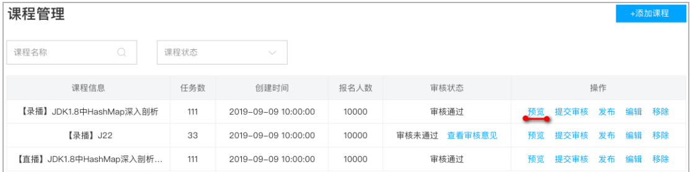

2.点击某课程数据后的预览链接，即可对该课程进行预览，可以看到发布后的详情页面效果。

下图是课程详情首页，显示了课程的基本信息。


点击课程目录，显示课程计划，通过此界面去核实课程计划的信息是否存在问题。

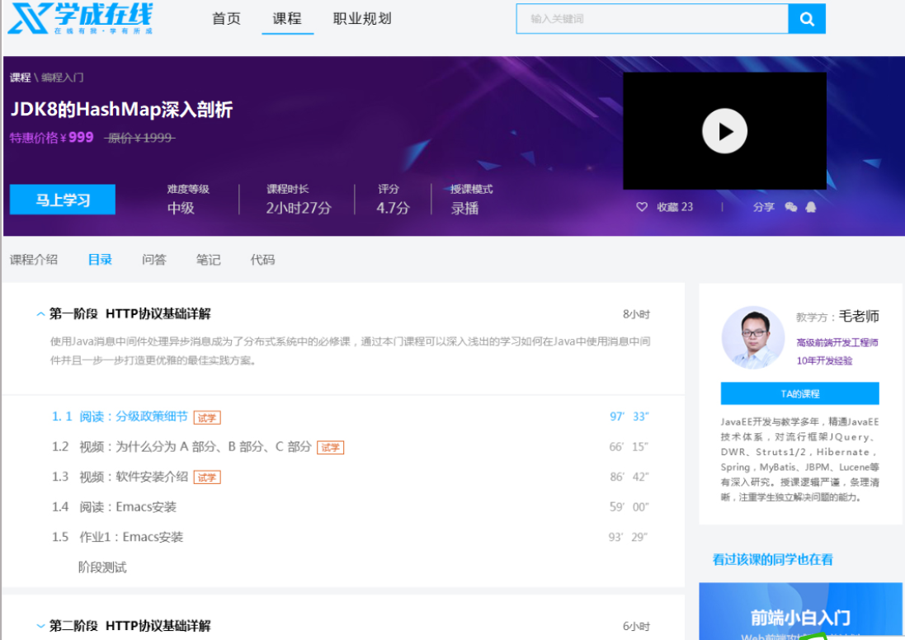

点击课程目录中的具体章节，查看视频播放是否正常

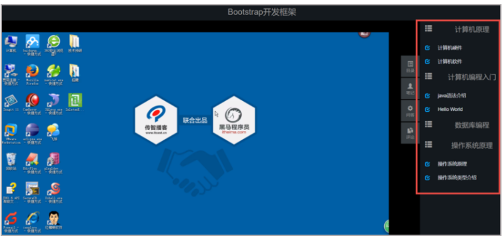

### **1.2.2** **课程审核**

教学机构提交课程审核后，平台运营人员登录运营平台进行课程审核，课程审核包括程序自动审核和人工审核，程序会审核内容的完整性，人员通过课程预览进行审核。

流程如下：


1、首先查询待审核的记录。

2、课程审核

具体审核的过程与课程预览的过程类似，运营人员查看课程信息、课程视频等内容。

如果存在问题则审核不通过，并附上审核不通过的原因供教学机构人员查看。

如果课程内容没有违规信息且课程内容全面则审核通过。

课程审核通过后教学机构发布课程成功。

### **1.2.3** **课程发布**

1.**教育机构用户**在课程管理中可对机构内课程进行检索。

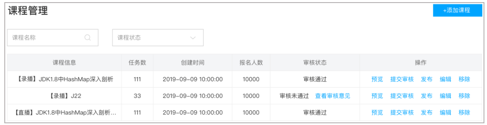

2.点击某课程数据后的 发布 链接（审核状态为通过），即可对该课程进行发布。

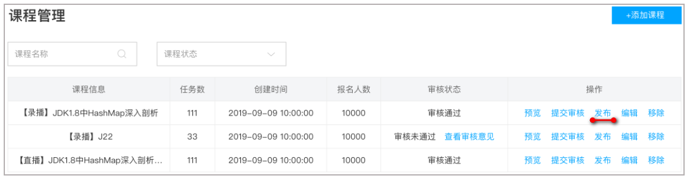

3、课程发布后可通过课程搜索查询到课程信息，并查看课程的详细信息。


4 点击课程搜索页中课程列表的某个课程，可进入课程详情页。

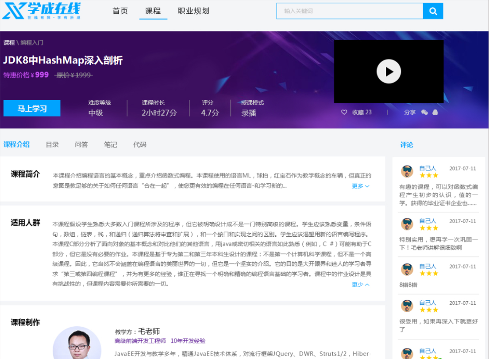

# **2** **课程预览**

## **2.1** **需求分析**

课程预览就是把课程的相关信息进行整合，在课程详情界面进行展示，通过课程预览页面查看信息是否存在问题。


下图是课程预览的数据来源：


在课程预览页面点击"视频播放图片"打开视频播放页面，通过视频播放页面查看课程计划对应的视频是否存在问题。


课程预览的效果与最终课程发布后查看到的效果是一致的，所以课程预览时会通过网站门户域名地址进行预览，下图显示了整个课程预览的流程图：

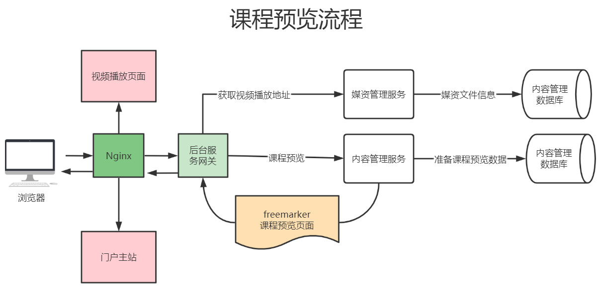

说明如下：

1、点击课程预览，通过Nginx、后台服务网关请求内容管理服务进行课程预览。

2、内容管理服务查询课程相关信息进行整合，并通过模板引擎技术在服务端渲染生成页面，返回给浏览器。

3、通过课程预览页面点击”马上学习“打开视频播放页面。

4、视频播放页面通过Nginx请求后台服务网关，查询课程信息展示课程计划目录，请求媒资服务查询课程计划绑定的视频文件地址，在线浏览播放视频。

## **2.2** **模板引擎**

### **2.2.1** **什么是模板引擎**

> springboot推荐的模板引擎是thymeleaf，老技术还用模板引擎，推荐前后端分离。 

根据前边的数据模型分析，课程预览就是把课程的相关信息进行整合，在课程预览界面进行展示，课程预览界面与课程发布的课程详情界面一致。

项目采用模板引擎技术实现课程预览界面。什么是模板引擎？

早期我们采用的jsp技术就是一种模板引擎技术，如下图：

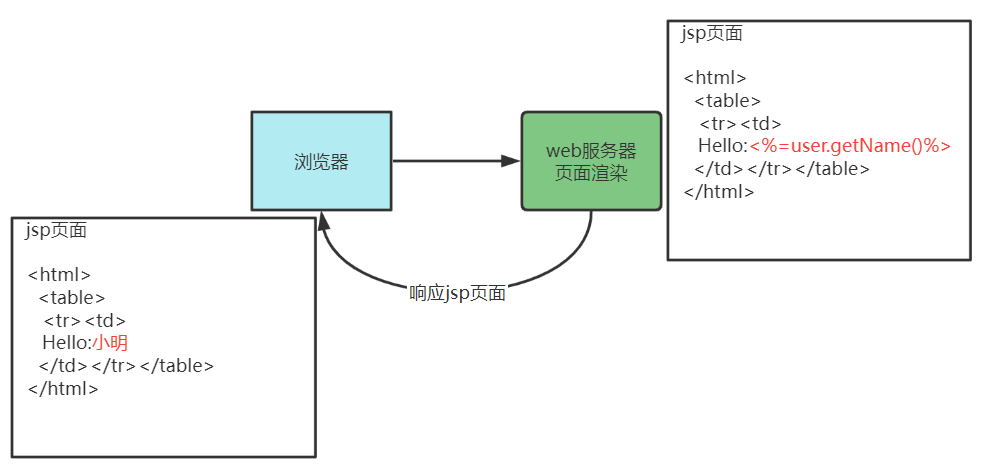

1、浏览器请求web服务器

2、服务器渲染页面，渲染的过程就是向jsp页面(模板)内填充数据(模型)。

3、服务器将渲染生成的页面返回给浏览器。

所以模板引擎就是：模板+数据=输出，Jsp页面就是模板，页面中嵌入的jsp标签就是数据，两者相结合输出html网页。


**常用的java模板引擎还有哪些？**

**Jsp**、Freemarker、**Thymeleaf** 、Velocity 等。

本项目采用**Freemarker**作为模板引擎技术。

Freemarker官方地址：http://freemarker.foofun.cn/

FreeMarker 是一款 *模板引擎*： 即一种基于模板和要改变的数据， 并用来生成输出文本(HTML网页，电子邮件，配置文件，源代码等)的通用工具。 它不是面向最终用户的，而是一个Java类库，是一款程序员可以嵌入他们所开发产品的组件。FreeMarker 是 [免费的](http://www.fsf.org/philosophy/free-sw.html)， 基于Apache许可证2.0版本发布。

### **2.2.2 Freemarker****快速入门**

下边在内容管理接口层搭建Freemarker的运行环境并进行测试。


在内容管理接口工层 添加Freemarker与SpringBoot的整合包

```XML
<!-- Spring Boot 对结果视图 Freemarker 集成 -->
<dependency>
    <groupId>org.springframework.boot</groupId>
    <artifactId>spring-boot-starter-freemarker</artifactId>
</dependency>
```


在nacos为内容管理接口层配置freemarker，公用配置组新加一个freemarker-config-dev.yaml


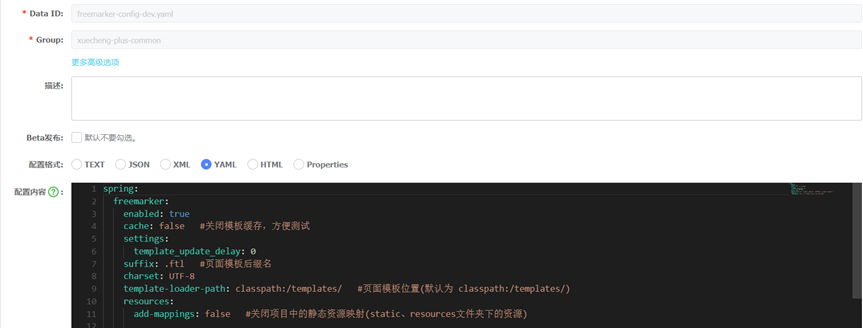


配置信息如下：

```bash
spring:
  freemarker:
    enabled: true
    cache: false   #关闭模板缓存，方便测试
    settings:
      template_update_delay: 0
    suffix: .ftl   #页面模板后缀名
    charset: UTF-8
    template-loader-path: classpath:/templates/   #页面模板位置(默认为 classpath:/templates/)
    resources:
      add-mappings: false   #关闭项目中的静态资源映射(static、resources文件夹下的资源)
```


在内容管理接口工程添加freemarker-config-dev.yaml

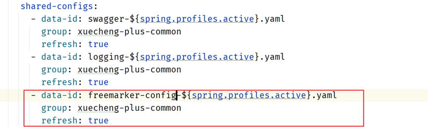


添加模板，在resources下创建templates目录，添加test.ftl模板文件

```html
<!DOCTYPE html>
<html>
<head>
    <meta charset="utf-8">
    <title>Hello World!</title>
</head>
<body>
Hello ${name}!
</body>
</html>
```


编写controller方法，准备模型数据

```java
package com.xuecheng.content.api;

/**
 * @description freemarker测试
 */
@Controller
public class FreemarkerController {

    @GetMapping("/testfreemarker")
    public ModelAndView test(){
        ModelAndView modelAndView = new ModelAndView();
        //设置模型数据
        modelAndView.addObject("name","小明");
        //设置模板名称
        modelAndView.setViewName("test");
        return modelAndView;
    }


}
```


启动内容管理接口工程，访问http://localhost:63040/content/testfreemarker

屏幕输出：Hello 小明！

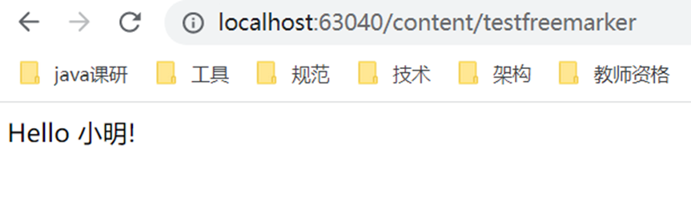

freemarker提供很多指令用于解析各种类型的数据模型，参考地址：http://freemarker.foofun.cn/ref_directives.html


## **2.3** **测试静态页面**

### **2.3.1** **部署网站门户**

在课程预览界面上要加载css、js、图片等内容，这里部署nginx来访问这些静态资源，对于SpringBoot服务的动态资源由Nginx去代理请求，如下图：

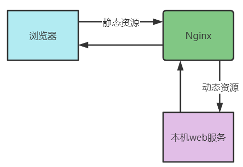

1、在本机安装 Nginx ，从课程资料目录获取nginx-1.23.1.zip并解压。

2、运行nginx-1.23.1目录下的nginx.exe。

默认端口为80，如果本机80端口被占用，则需要杀掉占用进程后再启动nginx。

如果无法杀掉80端口占用进程则需要修改nginx-1.23.1目录下conf/nginx.conf配置文件

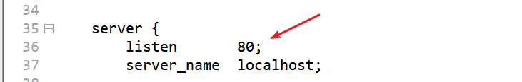

将80端口修改为空闲端口。

启动nginx，访问http://localhost 出现下边的网页表示启动成功

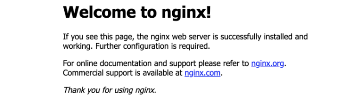


下边开始部署前端工程：

1、从课程资料目录获取xc-ui-pc-static-portal.zip 并解压。

2、修改本机hosts文件，加入127.0.0.1 www.51xuecheng.cn 51xuecheng.cn ucenter.51xuecheng.cn teacher.51xuecheng.cn file.51xuecheng.cn。

window10操作系统hosts文件在C:\Windows\System32\drivers\etc下

Centos7操作系统的hosts文件在/etc目录下。

在hosts文件加入如下配置

```java
127.0.0.1 www.51xuecheng.cn 51xuecheng.cn ucenter.51xuecheng.cn teacher.51xuecheng.cn file.51xuecheng.cn
```


3、在nginx-1.23.1目录中找到conf目录，配置目录下的nginx.conf文件。

配置内容如下，注意更改xc-ui-pc-static-portal目录的路径：

```bash
server {
        listen       80;
        server_name  www.51xuecheng.cn localhost;
        #rewrite ^(.*) https://$server_name$1 permanent;
        #charset koi8-r;
        ssi on;
        ssi_silent_errors on;
        #access_log  logs/host.access.log  main;

        location / {
            alias   D:/itcast2022/xc_edu3.0/code_1/xc-ui-pc-static-portal/;
            index  index.html index.htm;
        }
        #静态资源
        location /static/img/ { 
                alias  D:/itcast2022/xc_edu3.0/code_1/xc-ui-pc-static-portal/img/;
        }
        location /static/css/ { 
                alias   D:/itcast2022/xc_edu3.0/code_1/xc-ui-pc-static-portal/css/;
        }
        location /static/js/ { 
                alias   D:/itcast2022/xc_edu3.0/code_1/xc-ui-pc-static-portal/js/;
        }
        location /static/plugins/ { 
                alias   D:/itcast2022/xc_edu3.0/code_1/xc-ui-pc-static-portal/plugins/;
                add_header Access-Control-Allow-Origin http://ucenter.51xuecheng.cn; 
                add_header Access-Control-Allow-Credentials true; 
                add_header Access-Control-Allow-Methods GET;
        }
        location /plugins/ { 
                alias   D:/itcast2022/xc_edu3.0/code_1/xc-ui-pc-static-portal/plugins/;
        }


        #error_page  404              /404.html;

        # redirect server error pages to the static page /50x.html
        #
        error_page   500 502 503 504  /50x.html;
        location = /50x.html {
            root   html;
        }

        # proxy the PHP scripts to Apache listening on 127.0.0.1:80
        #
        #location ~ \.php$ {
        #    proxy_pass   http://127.0.0.1;
        #}

        # pass the PHP scripts to FastCGI server listening on 127.0.0.1:9000
        #
        #location ~ \.php$ {
        #    root           html;
        #    fastcgi_pass   127.0.0.1:9000;
        #    fastcgi_index  index.php;
        #    fastcgi_param  SCRIPT_FILENAME  /scripts$fastcgi_script_name;
        #    include        fastcgi_params;
        #}

        # deny access to .htaccess files, if Apache's document root
        # concurs with nginx's one
        #
        #location ~ /\.ht {
        #    deny  all;
        #}
    }
```


启动nginx:

进入任务管理器，杀死nginx的两个进程

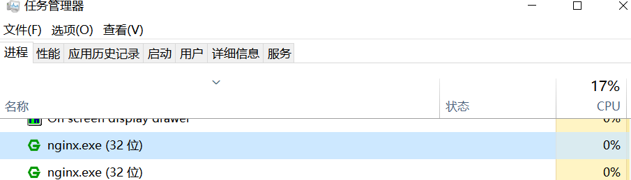

杀死后再次双击nginx.exe。

启动成功在任务管理器会出现nginx的进程。

日志文件在nginx安装目录下的logs目录：

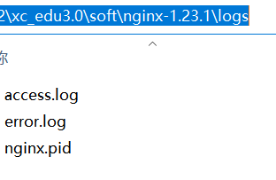

启动成功访问http://www.51xuecheng.cn 


### **2.3.2** **课程详情页面**

course_template.html是一个静态html页面，里边还没有添加freemarker标签，如果要预览该页面需要借助Nginx进行预览，因为页面需要加载一些css样式表、图片等内容。

course_template.html文件在xc-ui-pc-static-portal\course目录下

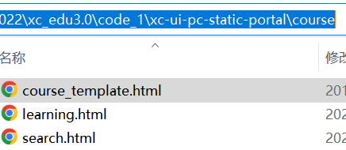

通过浏览器访问：http://www.51xuecheng.cn/course/course_template.html

效果如下：

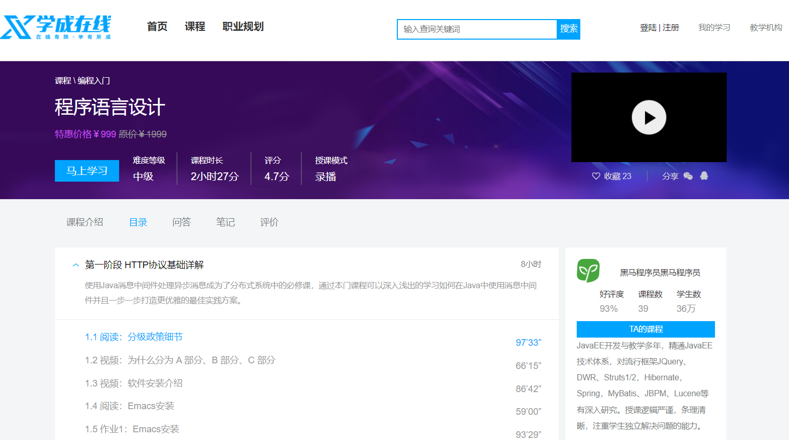

出现这个画面说明模板文件正常浏览是没有问题的。


### **2.3.3 Nginx配置****文件服务器地址（先不配网关）**


在进行课程预览时需要展示课程的图片，在线插放课程视频，课程图片、视频这些都在MinIO文件系统存储，下边统一由Nginx代理，通过文件服务域名统一访问。如下图：

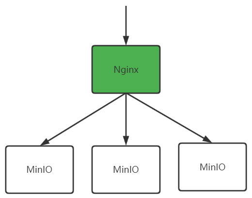

在hosts文件配置如下内容，如果已存在不要重复配置。

```bash
127.0.0.1 www.51xuecheng.cn file.51xuecheng.cn
```


在nginx.conf中配置文件服务器的代理地址

> Nginx回顾：配置文件详看下文第三小节：
>
> [Nginx基础_vincewm的博客-CSDN博客](https://blog.csdn.net/qq_40991313/article/details/126710359?ops_request_misc=%7B%22request%5Fid%22%3A%22166351159616781432941623%22%2C%22scm%22%3A%2220140713.130102334.pc%5Fblog.%22%7D&request_id=166351159616781432941623&biz_id=0&utm_medium=distribute.pc_search_result.none-task-blog-2~blog~first_rank_ecpm_v1~rank_v31_ecpm-1-126710359-null-null.nonecase&utm_term=Nginx&spm=1018.2226.3001.4450) 

```bash
   #文件服务
  upstream fileserver{
    server 192.168.101.65:9000 weight=10;
  }
   server {
        listen       80;
        server_name  file.51xuecheng.cn;
        #charset koi8-r;
        ssi on;
        ssi_silent_errors on;
        #access_log  logs/host.access.log  main;
        location /video {
            proxy_pass   http://fileserver;
        }

        location /mediafiles {
            proxy_pass   http://fileserver;
        }
   }
```


配置完毕，重新加载nginx配置文件。

通过cmd进入nginx.exe所在目录,运行如下命令

```bash
nginx.exe -s reload
```


通过http://file.51xuecheng.cn/mediafiles/图片文件地址 访问图片

在媒资数据

### **2.3.4 Nginx视频播放静态页面路由**

进入课程详情页面，点击马上学习或课程目录下的小节的名称将打开视频播放页面。

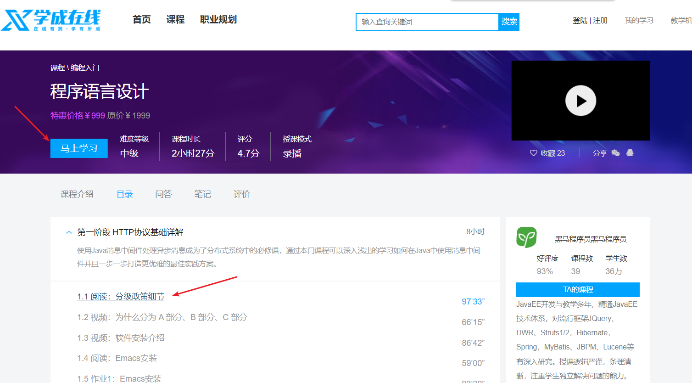

首先在nginx.conf中配置视频播放页面的地址

```bash
        location /course/preview/learning.html {
                alias D:/itcast2022/xc_edu3.0/code_1/xc-ui-pc-static-portal/course/learning.html;
        }
        location /course/search.html { 
                root   D:/itcast2022/xc_edu3.0/code_1/xc-ui-pc-static-portal;
        }
        location /course/learning.html { 
                root   D:/itcast2022/xc_edu3.0/code_1/xc-ui-pc-static-portal;
        }
```


加载nginx配置文件

点击课程详情页面上的视频播放链接，打开视频播放页面，如下图：


下边需要配置learning.html页面的视频播放路径来测试视频播放页面，找到learning.html页面中videoObject对象的定义处，配置视频的播放地址。

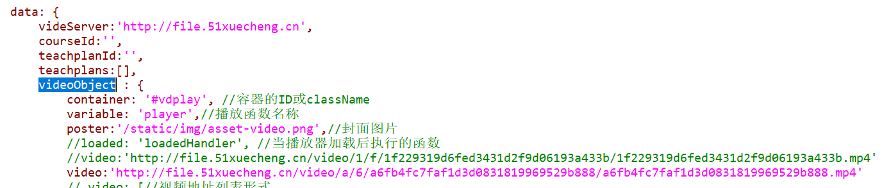

配置完成，刷新页面，观察视频是否可以正常播放。

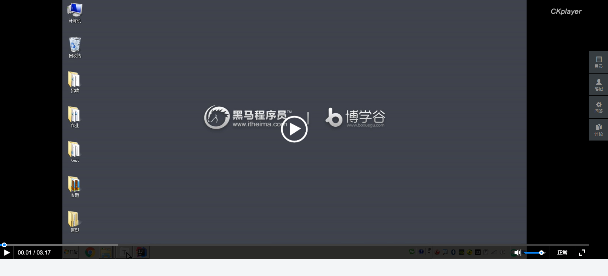

注意：此页面会去请求后台接口获取课程计划，这里暂时不处理，稍后在接口开发处进行处理。只要页面可以正常打开，可以播放视频就测试通过了。


## **2.4** **接口定义**

### **2.4.1 课程预览接口，根据课程id返回ModelAndView对象**

课程预览接口要将课程信息进行整合，在服务端渲染页面后返回浏览器。

下边对课程预览接口进行分析：

1、请求参数

传入课程id，表示要预览哪一门课程。

2、响应结果

输出课程详情页面到浏览器。


响应页面到浏览器使用freemarker模板引擎技术实现，首先从课程资料目录下获取课程预览页面course_template.html，拷贝至内容管理的接口工程的resources/templates下，并将其在本目录复制一份命名为course_template.ftl

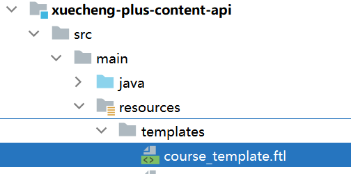


下边开始定义接口：

> **注意：**
>
> 不用@RestController，因为不要@ResponseBody，因为方法返回值不是JSON

```java
package com.xuecheng.content.api;
/**
 * @description 课程预览，发布
 */
 @Controller
public class CoursePublishController {


 @GetMapping("/coursepreview/{courseId}")
 public ModelAndView preview(@PathVariable("courseId") Long courseId){

      ModelAndView modelAndView = new ModelAndView();
//指定模型
      modelAndView.addObject("model",null);
//指定模板
      modelAndView.setViewName("course_template");//根据视图名称加“.ftl”找到模板，即course_template.ftl
   return modelAndView;
  }

}
```


> **回顾thymeleaf用法：**
>
> 
>
> ```java
> package com.xuecheng.content.api;
> /**
>  * @description 课程预览，发布，thymeleaf方法
>  */
>  @Controller
> public class CoursePublishController {
> 
> 
>  @GetMapping("/coursepreview/{courseId}")
>  public String preview(@PathVariable("courseId") Long courseId,Model model){
> 
> 
> //指定模型
>       model.addAttribute("model",null);
> //指定模板
>    return "course_template";//等同于classpath:/templates/course_template.ftl
>   }
> 
> }
> ```
>
> 

重启内容管理接口工程，访问http://localhost:63040/content/coursepreview/74

如下图：

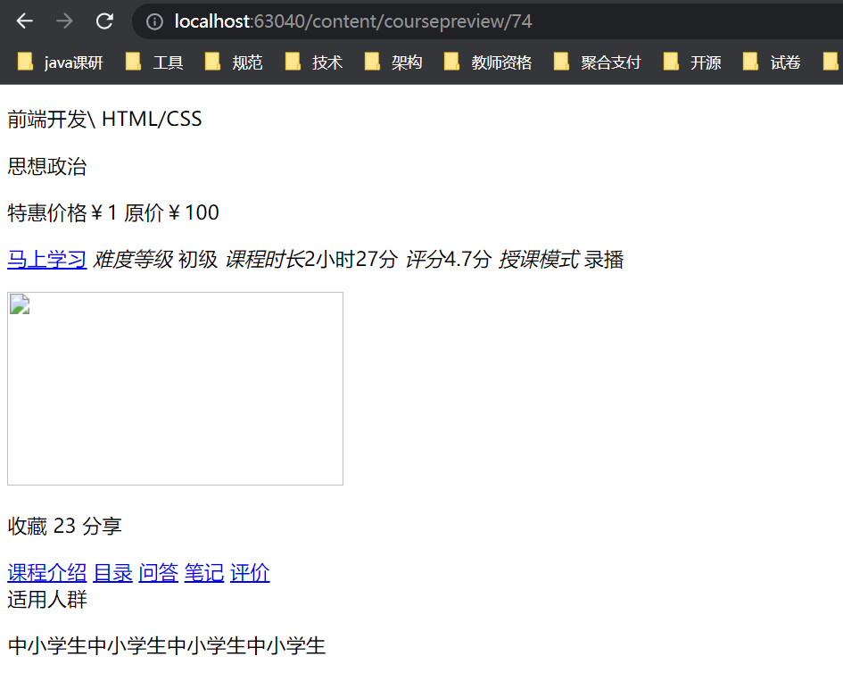

课程预览页面内容没有样式，稍后解决这个问题。

### **2.4.2 Nginx配置反向代理（配网关）**

课程预览接口虽然可以正常访问，但是页面没有样式，查看浏览器请求记录，发现图片、样式无法正常访问。

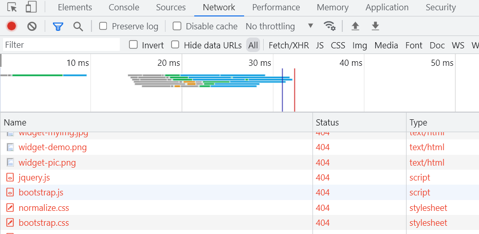

这些静态资源全在门户下，我们需要由Nginx反向代理访问课程预览接口，通过门户的URL去访问课程预览。

1、在Nginx下配置：

> Nginx回顾：配置文件详看下文第三小节：
>
> [Nginx基础_vincewm的博客-CSDN博客](https://blog.csdn.net/qq_40991313/article/details/126710359?ops_request_misc=%7B%22request%5Fid%22%3A%22166351159616781432941623%22%2C%22scm%22%3A%2220140713.130102334.pc%5Fblog.%22%7D&request_id=166351159616781432941623&biz_id=0&utm_medium=distribute.pc_search_result.none-task-blog-2~blog~first_rank_ecpm_v1~rank_v31_ecpm-1-126710359-null-null.nonecase&utm_term=Nginx&spm=1018.2226.3001.4450)

```bash
   #后台网关
  upstream gatewayserver{
    server 127.0.0.1:63010 weight=10;
  }
  server {
        listen       80;
        server_name  www.51xuecheng.cn localhost;
        ....
        #api
        location /api/ {
                proxy_pass http://gatewayserver/;
        }
        ....
```


2、重新加载Nginx配置文件：

```bash
nginx.exe -s reload
```


3、启动微服务网关

4、此时访问新地址： http://www.51xuecheng.cn/api/content/coursepreview/74

输出如下，页面样式正常。


页面虽然正常，但是里边的内容都是静态内容，稍后接口层调用service方式获取模型数据并进行页面渲染。

目前的方式是通过Nginx访问网关，由网关再将请求转发到微服务，Nginx是整个的项目最前方的代理服务器，如下图：

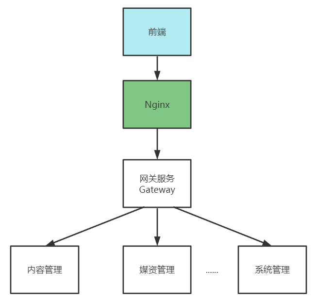


## **2.5** **接口开发**

### **2.5.1** **课程预览信息模型类抽取**


课程预览就是把课程基本信息、营销信息、课程计划、师资等课程的相关信息进行整合，在预览页面进行展示。如下图：

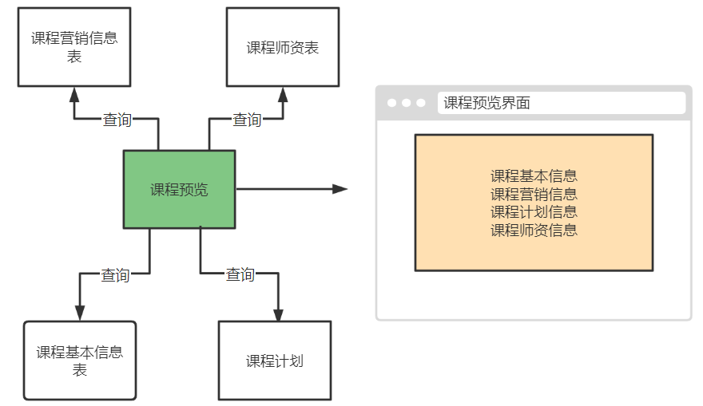

在使用freemarker渲染生成视图时需要数据模型，此数据模型包括了基本信息、营销信息、课程计划、师资等信息。

**课程预览信息模型类**

```java
package com.xuecheng.content.model.dto;

/**
 * @description 课程预览数据模型
 */
 @Data
 @ToString
public class CoursePreviewDto {

    //课程基本信息,课程营销信息
    CourseBaseInfoDto courseBase;


    //课程计划信息
    List<TeachplanDto> teachplans;
   
    //师资信息暂时不加...


}
```


CourseBaseInfoDto：包括了课程基本信息、营销信息。

```java
//课程基本信息dto
@Data
public class CourseBaseInfoDto extends CourseBase {


 /**
  * 收费规则，对应数据字典
  */
 private String charge;

 /**
  * 价格
  */
 private Float price;


 /**
  * 原价
  */
 private Float originalPrice;

 /**
  * 咨询qq
  */
 private String qq;

 /**
  * 微信
  */
 private String wechat;

 /**
  * 电话
  */
 private String phone;

 /**
  * 有效期天数
  */
 private Integer validDays;

 /**
  * 大分类名称
  */
 private String mtName;

 /**
  * 小分类名称
  */
 private String stName;

}
```


List<TeachplanDto> ：包括了课程计划列表。

TeachplanDto

```java
/**
 * @description 课程计划信息模型类
 */
@Data
@ToString
public class TeachplanDto extends Teachplan {
  //与媒资管理的信息
   private TeachplanMedia teachplanMedia;

  //小章节list
   private List<TeachplanDto> teachPlanTreeNodes;
}
```


### **2.5.2 Service，根据课程id查询模型类**

Service负责从数据库查询基本信息、营销信息、课程计划等课程相关信息，组成CoursePreviewDto 对象。

```java
package com.xuecheng.content.service.impl;

@Service
public class CoursePublishServiceImpl implements CoursePublishService {

 @Autowired
 CourseBaseInfoService courseBaseInfoService;

 @Autowired
 TeachplanService teachplanService;


 @Override
 public CoursePreviewDto getCoursePreviewInfo(Long courseId) {

  //课程基本信息、营销信息
  CourseBaseInfoDto courseBaseInfo = courseBaseInfoService.getCourseBaseInfo(courseId);

  //课程计划信息
  List<TeachplanDto> teachplanTree= teachplanService.findTeachplanTree(courseId);

  CoursePreviewDto coursePreviewDto = new CoursePreviewDto();
  coursePreviewDto.setCourseBase(courseBaseInfo);
  coursePreviewDto.setTeachplans(teachplanTree);
  return coursePreviewDto;
 }
}
```


### service，根据id查询课程基本信息、营销信息 

```
CourseBaseInfoServiceImpl
    //查询课程信息
    public CourseBaseInfoDto getCourseBaseInfo(Long courseId){

        //从课程基本信息表查询
        CourseBase courseBase = courseBaseMapper.selectById(courseId);
        if(courseBase==null){
            return null;
        }
        //从课程营销表查询
        CourseMarket courseMarket = courseMarketMapper.selectById(courseId);

        //组装在一起
        CourseBaseInfoDto courseBaseInfoDto = new CourseBaseInfoDto();
        BeanUtils.copyProperties(courseBase,courseBaseInfoDto);
        if(courseMarket!=null){
            BeanUtils.copyProperties(courseMarket,courseBaseInfoDto);
        }

        //通过courseCategoryMapper查询分类信息，将分类名称放在courseBaseInfoDto对象
        CourseCategory mtObj = courseCategoryMapper.selectById(courseBase.getMt());
        String mtName = mtObj.getName();//大分类名称
        courseBaseInfoDto.setMtName(mtName);
        CourseCategory stObj = courseCategoryMapper.selectById(courseBase.getSt());
        String stName = stObj.getName();//小分类名称
        courseBaseInfoDto.setStName(stName);

        return courseBaseInfoDto;

    }
```


### service,dao外连接，根据id查询课程计划信息

```
TeachplanService课程计划信息
    @Override
    public List<TeachplanDto> findTeachplanTree(Long courseId) {
        List<TeachplanDto> teachplanDtos = teachplanMapper.selectTreeNodes(courseId);
        return teachplanDtos;
    }
```


```html
    <select id="selectTreeNodes" parameterType="long" resultMap="treeNodeResultMap">

        select
            one.id            one_id,
            one.pname         one_pname,
            one.parentid      one_parentid,
            one.grade         one_grade,
            one.media_type    one_mediaType,
            one.start_time    one_stratTime,
            one.end_time      one_endTime,
            one.orderby       one_orderby,
            one.course_id     one_courseId,
            one.course_pub_id one_coursePubId,
            two.id            two_id,
            two.pname         two_pname,
            two.parentid      two_parentid,
            two.grade         two_grade,
            two.media_type    two_mediaType,
            two.start_time    two_stratTime,
            two.end_time      two_endTime,
            two.orderby       two_orderby,
            two.course_id     two_courseId,
            two.course_pub_id two_coursePubId,
            m1.media_fileName mediaFilename,
            m1.id             teachplanMeidaId,
            m1.media_id       mediaId
        from teachplan one
                 left join teachplan two on two.parentid = one.id
                 left join teachplan_media m1 on two.id = m1.teachplan_id
        where one.parentid = 0
          and one.course_id = #{id}
        order by one.orderby,two.orderby

    </select>
```


### **2.5.3** **接口层完善**

接口层Controller调用Service方法获取模板引擎需要的模型数据

```java
@Autowired
CoursePublishService coursePublishService;


@GetMapping("/coursepreview/{courseId}")
public ModelAndView preview(@PathVariable("courseId") Long courseId){

     //获取课程预览信息
     CoursePreviewDto coursePreviewInfo = coursePublishService.getCoursePreviewInfo(courseId);

     ModelAndView modelAndView = new ModelAndView();
     modelAndView.addObject("model",coursePreviewInfo);
     modelAndView.setViewName("course_template");
  return modelAndView;
 }
```


### **2.5.4 前后端联调**

**期待效果：点击课程管理中“预览”，跳转预览的视频详情页**

原来前端直接指向后台网关地址，现在要更改为Nginx的地址，如下：

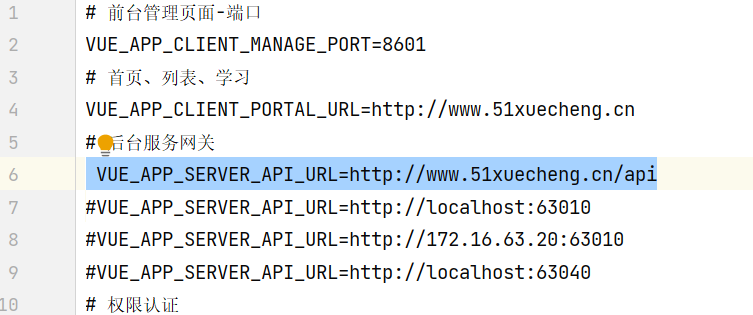

重启前端工程，进入课程列表点击"预览"按钮，正常打开课程预览页面http://www.51xuecheng.cn/api/content/coursepreview/2


### **2.5.5** **编写模板**


模型数据准备好后下一步将模型数据填充到course_template.ftl上，填充时注意不要一次填充太多，一边填充一边刷新调试。

freemarker提供很多指令用于解析各种类型的数据模型，参考地址：http://freemarker.foofun.cn/ref_directives.html

修改模板后需要编译，如下图：

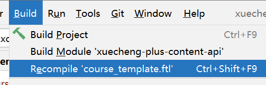


在调试模板时，可以看出哪些信息有缺少，在课程管理处进行补充，比如下图显示课程计划信息不完整，需要进入课程计划界面添加课程计划。

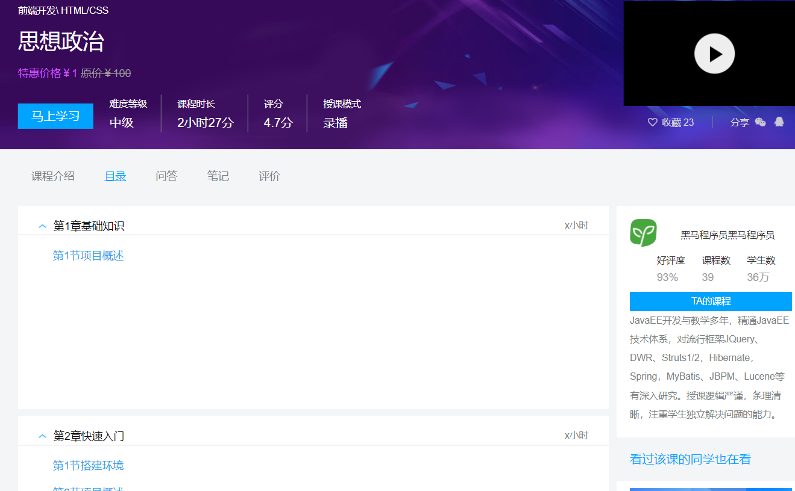

完整的course_template.ftl模板略：

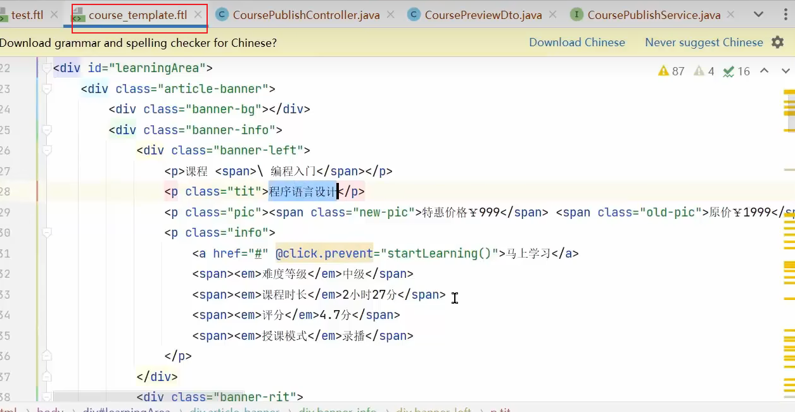


### **2.5.6** **视频播放页面，查询视频url和预览模型类**

从课程详情页面进入视频播放页面，如下图：

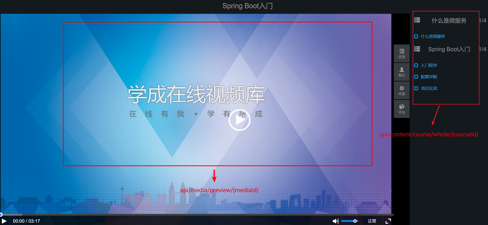

在此页面需要从后台获取课程信息、根据课程计划获取对应的视频地址，下边编写这两个接口：

**两个请求和响应：**

获取课程信息接口：/open/content/course/whole/{courseId}

```java
/open/content/course/whole/课程id

响应：同课程预览service接口返回数据
```


根据课程计划获取视频地址接口：/open/media/preview/{mediaId}

```java
/open/media/preview/课程计划id

响应：
{"code":0,"msg":"success","result":"视频的url","successful":true}
```


**1.nginx配置路由**

```bash
#openapi
location /open/content/ {
        proxy_pass http://gatewayserver/content/open/;
}
location /open/media/ {
        proxy_pass http://gatewayserver/media/open/;
}
```


配置运行nginx.exe -s reload加载nginx的配置文件

**2、根据课程id查询课程预览信息**

在内容管理接口层定义CourseOpenController类，并定义接口：获取课程信息接口：/open/content/course/whole/{courseId}

代码如下：

```java
 @Api(value = "课程公开查询接口",tags = "课程公开查询接口")
 @RestController
 @RequestMapping("/open")
public class CourseOpenController {

 @Autowired
 private CourseBaseInfoService courseBaseInfoService;

 @Autowired
 private CoursePublishService coursePublishService;


@GetMapping("/course/whole/{courseId}")
public CoursePreviewDto getPreviewInfo(@PathVariable("courseId") Long courseId) {
    //获取课程预览信息
    CoursePreviewDto coursePreviewInfo = coursePublishService.getCoursePreviewInfo(courseId);
    return coursePreviewInfo;
}

}
```


**3、【媒资模块】根据文件id获取视频url**

在媒资管理服务media-api工程定义MediaOpenController类，并定义接口/open/media/preview/

代码如下：

```java
@Api(value = "媒资文件管理接口",tags = "媒资文件管理接口")
 @RestController
 @RequestMapping("/open")
public class MediaOpenController {

  @Autowired
  MediaFileService mediaFileService;

    @ApiOperation("预览文件")
    @GetMapping("/preview/{mediaId}")
    public RestResponse<String> getPlayUrlByMediaId(@PathVariable String mediaId){

        MediaFiles mediaFiles = mediaFileService.getFileById(mediaId);
        if(mediaFiles == null || StringUtils.isEmpty(mediaFiles.getUrl())){
            XueChengPlusException.cast("视频还没有转码处理");
        }
        return RestResponse.success(mediaFiles.getUrl());

    }


}
```


**5、测试**

定义好后，启动内容管理、媒资管理、后台服务网关服务，测试视频播放页面是否可以正常获取课程计划，点击具体的课程计划是否正常可以播放视频。


# **3** **课程提交审核**

## **3.1** **需求分析**

### **3.1.1** **业务流程**

根据模块需求分析，课程发布前要先审核，审核通过方可发布。下图是课程审核及发布的流程图：

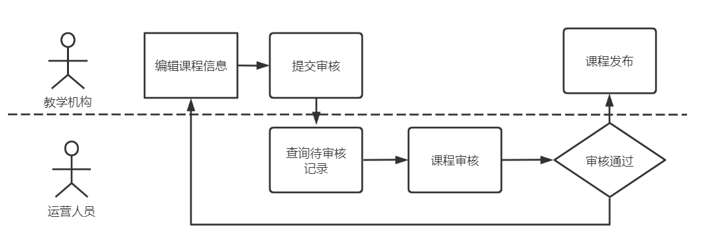

为什么课程审核通过才可以发布呢？

这样做为了**防止课程信息有违规情况**，课程信息不完善对网站用户体验也不好，课程审核不仅起到监督作用，也是帮助教学机构规范使用平台的手段。

如何控制课程审核通过才可以发布课程呢？

在课程基本表course_base表设置课程**审核状态字段**，包括：未提交、已提交(未审核)、审核通过、审核不通过。

下边是课程状态的转化关系：

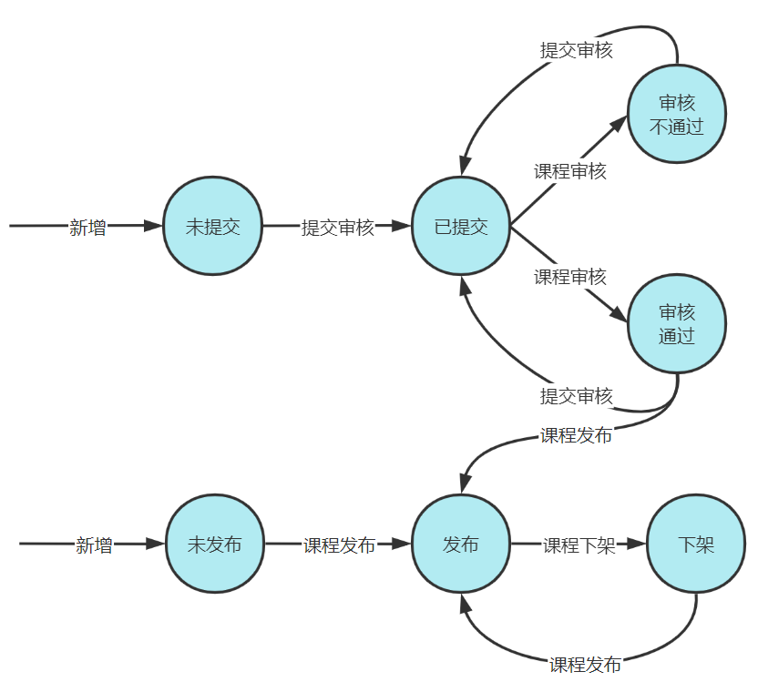

说明如下：

1、一门课程新增后它的审核状为”未提交“，发布状态为”未发布“。

2、课程信息编辑完成，教学机构人员执行”提交审核“操作。此时课程的审核状态为”已提交“。

3、当课程状态为已提交时运营平台人员对课程进行审核。

4、运营平台人员审核课程，结果有两个：审核通过、审核不通过。

5、课程审核过后不管状态是通过还是不通过，教学机构可以再次修改课程并提交审核，此时课程状态为”已提交“。此时运营平台人员再次审核课程。

6、课程审核通过，教学机构人员可以发布课程，发布成功后课程的发布状态为”已发布“。

7、课程发布后通过”下架“操作可以更改课程发布状态为”下架“

8、课程下架后通过”上架“操作可以再次发布课程，上架后课程发布状态为“发布”。


### **3.1.2 课程预发布表和审核记录表**

> **审核后允许数据修改：**
>
> 如果不允许修改是不合理的，因为提交审核后可以继续做下一个阶段的课程内容，比如添加课程计划，上传课程视频等。
>
> 如果允许修改那么课程审核时看到的课程内容从哪里来？如果也从课程基本信息表、课程营销表、课程计划表查询那么存在什么问题呢？如下图：
>
> 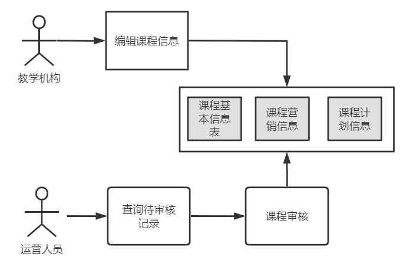
>
> 
>
> 运营人员审核课程和教学机构编辑课程操作的数据是同一份，此时会导致冲突。比如：运营人员正在审核时教学机构把数据修改了。

使用**课程预发布表**，解决审核时数据修改问题：

如下图：

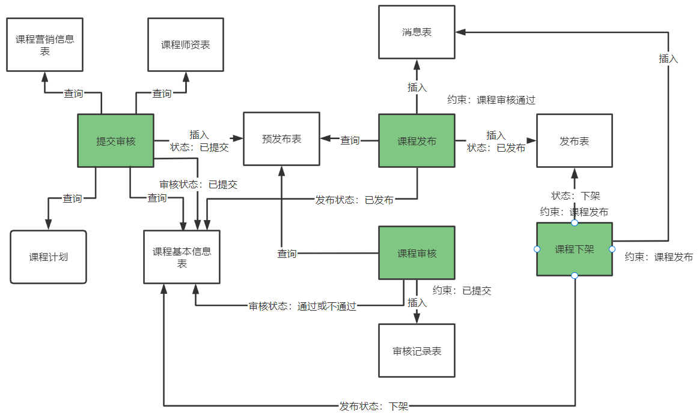

**提交课程审核**，将课程信息汇总后**写入课程预发布表**，课程预发布表记录了教学机构在某个时间点要发布的课程信息。

课程审核人员从预发布表查询信息进行审核。

课程审核的同时可以对课程进行修改，修改的内容不会写入课程预发布表。

课程审核通过执行课程发布，将课程预发布表的信息写入课程发布表。


> **审核后、修改后、允许再次提交审核：**
>
> 
>
> 这个问题在上边分析课程审核状态时已经有了答案，如下图：
>
> 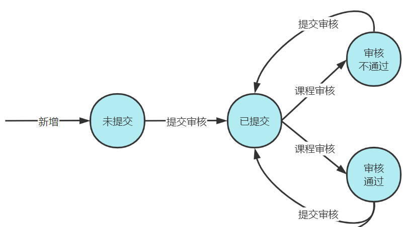
>
> 
>
> 提交审核课程后，必须等到课程审核完成后才可以再次提交课程。


课程审核功能涉及教学机构提交审核，运营人员进行课程审核。在课堂上我们**仅实现教学机构提交审核功能**，课程审核的结果通过手动修改数据库来实现。

虽然课堂上不实现课程审核功能，完整的课程审核数据表设计需要理解。

提交审核将信息写入**课程预发布表course_publish_pre**，表结构与课程发布表**相似**，主要是审核状态字段和发布上架字段不同：

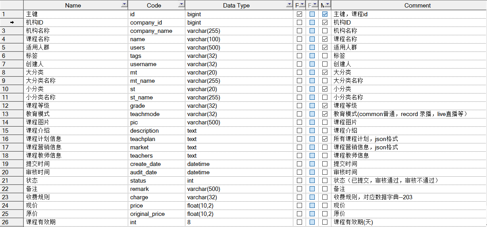

更新课程基本信息表的课程审核状态为：已经提交

课程审核后更新课程基本信息表的审核状态、课程预发布表的审核状态，并将审核结果写入课程审核记录。


> 课程发布表：
>
> 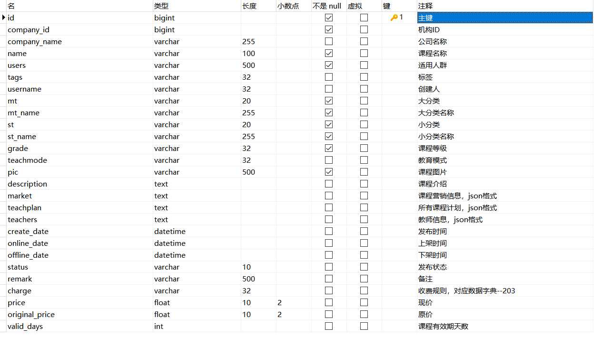


**审核记录表course_audit**结构如下：

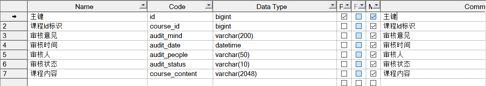


## **3.2 接口定义，根据课程id提交审核**

下边定义提交课程审核的接口，在课程发布Controller中定义接口如下：

```java
 @ResponseBody
@PostMapping ("/courseaudit/commit/{courseId}")
public void commitAudit(@PathVariable("courseId") Long courseId){

 }
```


## **3.3** **业务实现**

### **3.3.1 业务流程**

1、查询课程基本信息、课程营销信息、课程计划信息等课程相关信息，整合为课程预发布信息。

2、向课程预发布表course_publish_pre插入一条记录，如果已经存在则更新，审核状态为：已提交。

3、更新课程基本表course_base课程审核状态为：已提交。

**不允许提交审核的情况：**

1、对已提交审核的课程不允许提交审核。

2、本机构只允许提交本机构的课程。

3、没有上传图片不允许提交审核。

4、没有添加课程计划不允许提交审核。


### **3.3.2 Service****，根据机构id和课程id提交审核**

CoursePublishServiceImpl

```java
    @Transactional
    @Override
    public void commitAudit(Long companyId, Long courseId) {

        CourseBaseInfoDto courseBaseInfo = courseBaseInfoService.getCourseBaseInfo(courseId);
        if (courseBaseInfo == null) {
            XueChengPlusException.cast("课程找不到");
        }
        //审核状态
        String auditStatus = courseBaseInfo.getAuditStatus();

        //如果课程的审核状态为已提交则不允许提交
        if (auditStatus.equals("202003")) {
            XueChengPlusException.cast("课程已提交请等待审核");
        }
        //本机构只能提交本机构的课程
        //todo:本机构只能提交本机构的课程

        //课程的图片、计划信息没有填写也不允许提交
        String pic = courseBaseInfo.getPic();
        if (StringUtils.isEmpty(pic)) {
            XueChengPlusException.cast("请求上传课程图片");
        }
        //查询课程计划
        //课程计划信息
        List<TeachplanDto> teachplanTree = teachplanService.findTeachplanTree(courseId);
        if (teachplanTree == null || teachplanTree.size() == 0) {
            XueChengPlusException.cast("请编写课程计划");
        }

        //查询到课程基本信息、营销信息、计划等信息插入到课程预发布表
        CoursePublishPre coursePublishPre = new CoursePublishPre();
        BeanUtils.copyProperties(courseBaseInfo, coursePublishPre);
        //设置机构id
        coursePublishPre.setCompanyId(companyId);
        //营销信息
        CourseMarket courseMarket = courseMarketMapper.selectById(courseId);
        //转json
        String courseMarketJson = JSON.toJSONString(courseMarket);
        coursePublishPre.setMarket(courseMarketJson);
        //计划信息
        //转json
        String teachplanTreeJson = JSON.toJSONString(teachplanTree);
        coursePublishPre.setTeachplan(teachplanTreeJson);
        //状态为已提交
        coursePublishPre.setStatus("202003");
        //提交时间
        coursePublishPre.setCreateDate(LocalDateTime.now());
        //查询预发布表，如果有记录则更新，没有则插入
        CoursePublishPre coursePublishPreObj = coursePublishPreMapper.selectById(courseId);
        if (coursePublishPreObj == null) {
            //插入
            coursePublishPreMapper.insert(coursePublishPre);
        } else {
            //更新
            coursePublishPreMapper.updateById(coursePublishPre);
        }

        //更新课程基本信息表的审核状态为已提交
        CourseBase courseBase = courseBaseMapper.selectById(courseId);
        courseBase.setAuditStatus("202003");//审核状态为已提交

        courseBaseMapper.updateById(courseBase);
    }
```


## **3.4** **接口完善**

完善接口层的代码

```java
 @ResponseBody
@PostMapping ("/courseaudit/commit/{courseId}")
public void commitAudit(@PathVariable("courseId") Long courseId){
     Long companyId = 1232141425L;
     coursePublishService.commitAudit(companyId,courseId);

 }
```


## **3.5** **测试**

使用前端提前课程审核：

1、找一门信息不全的课程，测试各各约束条件。

2、正常提交后，观察数据库中课程预发布表记录的内容是否完整。

3、测试审核过后再次提交，提交后观察数据库中课程预发布表记录的内容是否正确。

审核通过需手动修改数据库：

1、修改课程预发布表的状态为审核通过202004。

2、修改课程基本表的审核状态为审核通过202004。

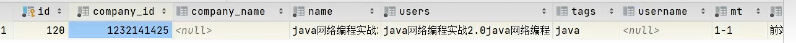