>  **导航：**
>
> [【Java笔记+踩坑汇总】Java基础+JavaWeb+SSM+SpringBoot+SpringCloud+瑞吉外卖/谷粒商城/学成在线+设计模式+面试题汇总+性能调优/架构设计+源码解析](https://blog.csdn.net/qq_40991313/article/details/126646289?spm=1001.2014.3001.5501)

[TOC]


# **1** 业务流程，入库+缓存+ES+MinIO存静态化页面

> 教学机构人员在课程审核通过后即可发布课程，课程发布后会公开展示在网站上供学生查看、选课和学习。
>
> 在网站上展示课程信息需要**解决课程信息显示的性能问题**，如果速度慢(排除网速)会影响用户的体验性。
>
> **如何去快速搜索课程？**打开课程详情页面仍然去查询数据库可行吗？
>
> 为了提高网站的速度需要将课程信息进行缓存，并且要将课程信息加入**ES索引库**方便搜索。

**课程发布业务流程：**

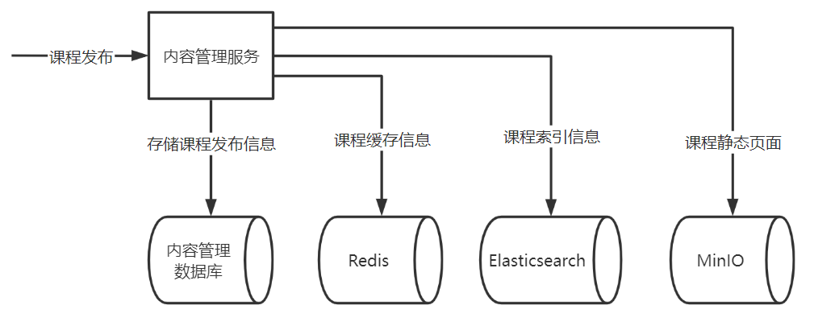

1、向内容管理数据库的课程发布表存储课程发布信息，更新课程基本信息表中发布状态为已发布。

2、向Redis存储课程缓存信息。

3、向Elasticsearch存储课程索引信息。

4、静态化课程预览页面并存储到文件系统minIO，实现快速浏览课程详情页面。

> **详细业务流程：**
>
> 1、向**课程发布表**course_publish插入一条记录,记录来源于课程预发布表，如果存在则更新，发布状态为：已发布。
>
> 2、更新**课程表**course_base的此课程发布状态为：已发布
>
> 3、删除**课程预发布表**的对应记录。
>
> 4、向**消息表**mq_message**插入一条消息**；消息类型为：course_publish，即该消息是处理课程发布任务的；“关联业务信息1”是课程id。
>
> 5、插入的这条**消息**就是一个课程发布任务，将向Redis存储课程缓存信息、向Elasticsearch存储课程索引信息、静态化课程预览页面并存储到文件系统minIO

课程发布表的数据来源于课程预发布表，它们的结构基本一样，只是课程发布表中的状态是课程发布状态，如下图：

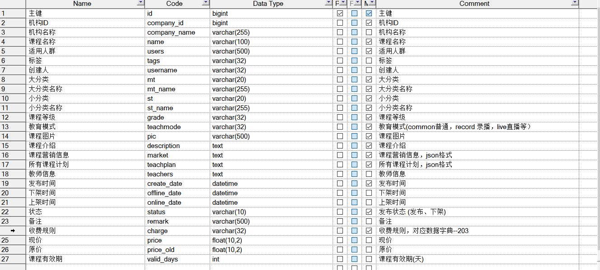

redis中的课程缓存信息是将课程发布表中的数据转为json进行存储。

elasticsearch中的课程索引信息是根据搜索需要将课程名称、课程介绍等信息进行索引存储。

MinIO中存储了课程的静态化页面文件（html网页），查看课程详情是通过文件系统去浏览课程详情页面。


# **2** **分布式事务技术方案**

## **2.1** **回顾本地事务和分布式事务**

> [SpringCloud基础6——分布式事务，Seata_seata-server.sh_vincewm的博客-CSDN博客](https://blog.csdn.net/qq_40991313/article/details/126898388?spm=1001.2014.3001.5501)

**什么是本地事务？**

**@Transactional注解**。平常我们在程序中通过**spring**去控制事务是利用**数据库本身的事务特性**来实现的，因此叫数据库事务，由于应用主要靠关系数据库来控制事务，此数据库只属于该应用，所以基于本应用自己的关系型数据库的事务又被称为本地事务。

本地事务具有ACID四大特性，数据库事务在实现时会将一次事务涉及的所有操作全部纳入到一个不可分割的执行单元，该执行单元中的所有操作 要么都成功，要么都失败，只要其中任一操作执行失败，都将导致整个事务的回滚。

**什么是分布式事务？**

*分布式事务*是指事务的参与者、支持事务的服务器、资源服务器以及事务管理器分别位于不同的分布式系统的**不同节点**之上。

**分布式事务的场景：**

**跨JVM进程：**微服务架构下，远程调用


**跨数据库：**单服务操作多个数据库：

> 注意这里说的是多个数据库，而不是同一个数据库下的多个表

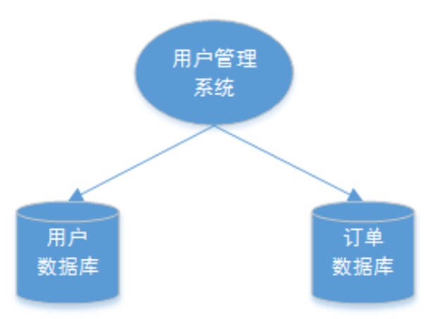


**多服务单数据库:**

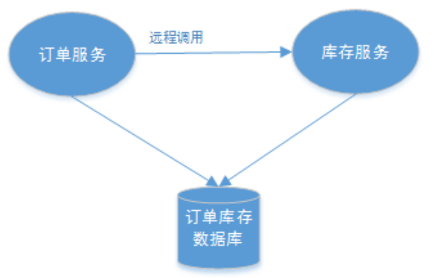


## **2.2** **什么是****CAP****理论**


CAP是 Consistency、Availability、Partition tolerance三个词语的缩写，分别表示**一致性、可用性、分区容忍性。**

- **一致性C：**数据同步
- **可用性A：**节点可正常访问
- **分区****容错P：**在集群出现分区时，整个系统也要持续对外提供服务

> 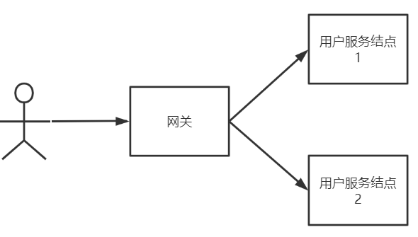
>
> 客户端经过网关访问用户服务的两个结点：
>
> **一致性**是指用户不管访问哪一个结点拿到的数据都是**最新的**，比如查询小明的信息，不能出现在数据没有改变的情况下两次查询结果不一样。
>
> **可用性**是指任何时候查询用户信息都**可以查询到结果**，但不保证查询到最新的数据。
>
> **分区容忍性**也叫分区容错性，当系统采用分布式架构时由于网络通信异常导致请求中断、消息丢失导致出现分区时，但系统依然**要对外提供服务**。
>
> 
>
> - **分区：**因为网络故障或其它原因导致分布式系统中的部分节点与其它节点失去连接，形成独立分区。
> - **容错：**在集群出现分区时，整个系统也要持续对外提供服务

CAP理论要强调的是在分布式系统中这**三点不可能全部满足，**要么保证CP、要么保证AP**。**

由于是分布式系统就要满足分区容忍性，因为服务之间难免出现网络异常，不能因为局部网络异常导致整个系统不可用。

> 满足P那么C和A不能同时满足：
>
> 比如我们添加一个用户小明的信息，该信息先添加到结点1中，再同步到结点2中，如下图：
>
> 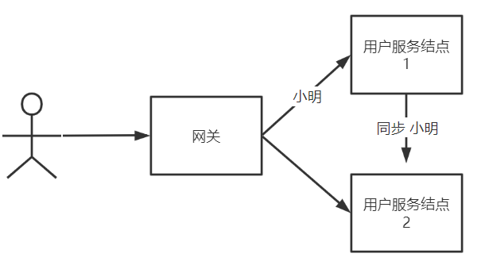
>
> 如果要满足C一致性，必须等待小明的信息同步完成系统才可用（否则会出现请求到结点2时查询不到数据，违反了一致性），在信息同步过程中系统是不可用的，所以满足C的同时无法满足A。
>
> 如果要满足A可用性，要时刻保证系统可用就不用等待信息同步完成，此时系统的一致性无法满足。
>
> 
>
> 所以在分布式系统中进行分布式事务控制，要么保证CP、要么保证AP。


## **2.3** **分布式事务控制方案**

> 分布式事务控制要在C和A中作出取舍，保证一致性就不要保证可用性，保证可用性就不要保证一致，首先你确认是要CP还是AP，具体要根据应用场景进行判断。

### 2.3.1 CP强一致性，AP强可用性

**CP的场景：**满足C舍弃A，强调**一致性**。适用于对时效性要求高的场景。

跨行**转账**：一次转账请求要等待双方银行系统都完成整个事务才算完成，只要其中一个失败另一方执行回滚操作。

开户操作：在业务系统开户同时要在运营商开户，任何一方开户失败该用户都不可使用，所以要满足CP。

**AP的场景：**满足A舍弃C，强调**可用性**。适用于对时效性要求低的场景。

订单**退款**，今日退款成功，明日账户到账，只要用户可以接受在一定时间内到账即可。

注册送积分，注册成功积分在24分到账。

支付短信通信，支付成功发短信，短信发送可以有延迟，甚至没有发送成功。

在实际应用中符合AP的场景较多，其实虽然AP舍弃C一致性，实际上最终数据还是达到了一致，也就满足了最终一致性，所以业界定义了BASE理论。


### 2.3.2 **BASE理论：****基本可用、软状态、最终一致性**

BASE 是 Basically Available(基本可用)、Soft state(软状态)和 Eventually consistent (最终一致性)三个短语的缩写。

**基本可用：**当系统无法满足全部可用时保证核心服务可用即可，比如一个外卖系统，每到中午12点左右系统并发量很高，此时要保证下单流程涉及的服务可用，其它服务暂时不可用。

**软状态：**是指可以存在中间状态，比如：打印自己的社保统计情况，该操作不会立即出现结果，而是提示你打印中，请在XXX时间后查收。虽然出现了中间状态，但最终状态是正确的。

**最终一致性：**退款操作后没有及时到账，经过一定的时间后账户到账，舍弃强一致性，满足最终一致性。


### 2.3.3 **强一致性、最终一致性的实现方法**

实现CP就是要实现**强一致性:**

使用Seata框架基于**AT模式**实现

使用Seata框架基于**TCC模式**实现。


实现AP则要保证**最终数据一致性:**

使用消息队列通知的方式去实现，通知失败自动重试，**达到最大失败次数需要人工处理**；

使用**任务调度**的方案，启动任务调度将课程信息由数据库同步到elasticsearch、MinIO、redis中。


## **2.4** **课程发布的事务控制方案——xxl-job实现最终一致性**

### 2.4.1 分析

> 思考：学习了这么多的理论，回到课程发布，执行课程发布操作后要向数据库、redis、elasticsearch、MinIO写四份数据，这个场景用哪种方案？
>
> 结论：**课程发布保证AP最终一致性，使用xxl-job任务调度**

> 满足CP？
>
> 如果要满足CP就表示课程发布操作后向数据库、redis、elasticsearch、MinIO写四份数据，只要有一份写失败其它的全部回滚。
>
> 满足AP？
>
> 课程发布操作后，先更新数据库中的课程发布状态，更新后向redis、elasticsearch、MinIO写课程信息，只要在**一定时间内最终**向redis、elasticsearch、MinIO写数据成功即可。

目前我们已经有了任务调度的技术积累，这里选用任务调度的方案去实现分布式事务控制，课程发布**满足AP****最终一致性**即可。

### 2.4.2 技术方案，消息表

下图是具体的技术方案：

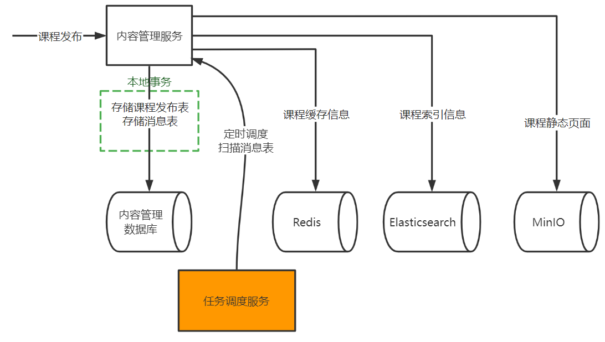

1、在内容管理服务的数据库中添加一个**消息表**，**与课程发布表在同一个数据库**。

2、点击课程发布通过本地事务向课程发布表写入课程发布信息，同时**向消息表写课程发布的消息**。通过数据库进行控制，只要课程发布表插入成功消息表也插入成功，消息表的数据就记录了某门课程发布的任务。

3、启动任务调度系统定时调度内容管理服务去**定时扫描消息表的记录**。

4、当扫描到课程发布的消息时即开始完成向redis、elasticsearch、MinIO同步数据的操作。

5、同步数据的任务完成后删除消息表记录。

**消息表：**

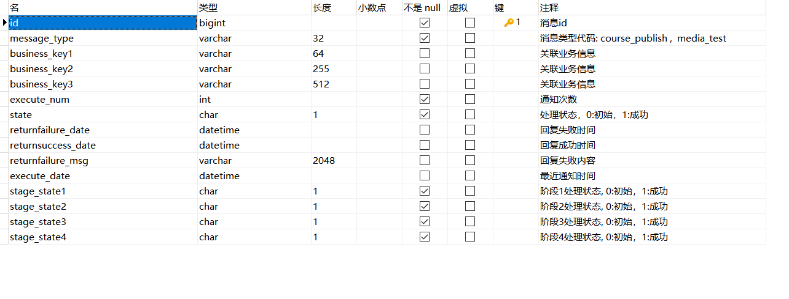


### 2.4.3 业务流程

下图是课程发布操作的流程：

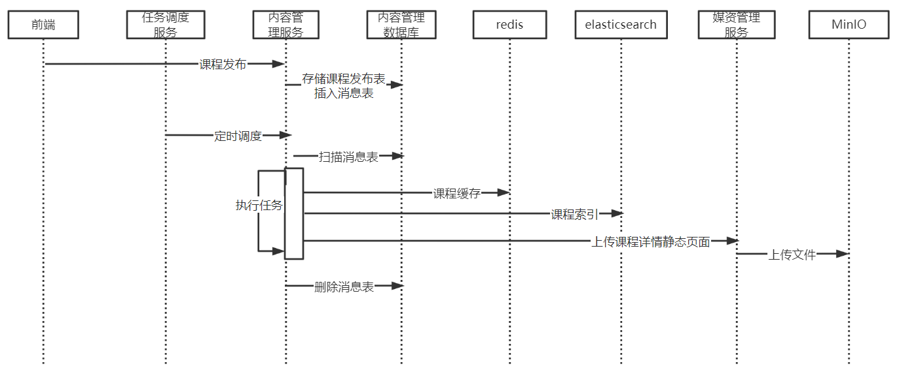

1、执行发布操作，内容管理服务存储课程发布表的同时向消息表添加一条“课程发布任务”。这里使用本地事务保证课程发布信息保存成功，同时消息表也保存成功。

2、任务调度服务定时调度内容管理服务扫描消息表，由于课程发布操作后向消息表插入一条课程发布任务，此时扫描到一条任务。

3、拿到任务开始执行任务，分别向redis、elasticsearch及文件系统存储数据。

4、任务完成后删除消息表记录。


# **3** **课程发布接口**

## **3.1** **接口定义，根据课程id发布课程**

根据课程发布的分布式事务控制方案，课程发布操作首先通过本地事务向课程发布表写入课程发布信息并向消息表插入一条消息，这里定义的课程发布接口要实现该功能。

在内容管理接口工程中定义课程发布接口。

```java
 /**
 * @description 课程预览，发布
 * @author Mr.M
 * @date 2022/9/16 14:48
 * @version 1.0
 */
@Api(value = "课程预览发布接口",tags = "课程预览发布接口")
@Controller
public class CoursePublishController {
...
 @ApiOperation("课程发布")
 @ResponseBody
 @PostMapping ("/coursepublish/{courseId}")
public void coursepublish(@PathVariable("courseId") Long courseId){

}
```


## **3.3** **接口开发**

### **3.3.1 创建消息表和消息历史表**


1、在内容管理数据库创建mq_message消息表及消息历史消息表（历史表存储已经完成的消息）。

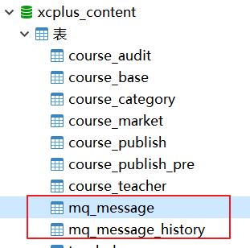

消息表结构如下：


2、生成mq_message消息表、course_publish课程发布表的po和mapper接口

稍后会开发一个通用的**消息处理组件**，这里先不生成代码。


### **3.3.2 业务流程**

1、向**课程发布表**course_publish插入一条记录,记录来源于课程预发布表，如果存在则更新，发布状态为：已发布。

2、更新**课程表**course_base的此课程发布状态为：已发布

3、删除**课程预发布表**的对应记录。

4、向**消息表**mq_message**插入一条消息**；消息类型为：course_publish，即该消息是处理课程发布任务的；“关联业务信息1”是课程id。

5、插入的这条消息就是一个课程发布任务，将向Redis存储课程缓存信息、向Elasticsearch存储课程索引信息、**静态化html课程预览页面并存储到**文件系统**minIO**

> 


**约束：**

1、课程审核通过方可发布。

2、本机构只允许发布本机构的课程。

### **3.3.3 业务实现****，根据课程id和机构id发布课程** 

```
CoursePublishServiceImpl
/**
 * @description 课程发布接口
 * @param companyId 机构id
 * @param courseId 课程id
*/ 
 @Transactional
 @Override
 public void publish(Long companyId, Long courseId) {

  //约束校验
  //查询课程预发布表
  CoursePublishPre coursePublishPre = coursePublishPreMapper.selectById(courseId);
  if(coursePublishPre == null){
     XueChengPlusException.cast("请先提交课程审核，审核通过才可以发布");
  }
  //本机构只允许提交本机构的课程
  if(!coursePublishPre.getCompanyId().equals(companyId)){
   XueChengPlusException.cast("不允许提交其它机构的课程。");
  }


  //课程审核状态
  String auditStatus = coursePublishPre.getStatus();
  //审核通过方可发布
  if(!"202004".equals(auditStatus)){
   XueChengPlusException.cast("操作失败，课程审核通过方可发布。");
  }

  //保存课程发布信息
  saveCoursePublish(courseId);

  //保存消息表
  saveCoursePublishMessage(courseId);

 //删除课程预发布表对应记录
  coursePublishPreMapper.deleteById(courseId);

 }

/**
 * @description 保存课程发布信息
 * @param courseId  课程id
*/
 private void saveCoursePublish(Long courseId){
   //整合课程发布信息
  //查询课程预发布表
  CoursePublishPre coursePublishPre = coursePublishPreMapper.selectById(courseId);
  if(coursePublishPre == null){
   XueChengPlusException.cast("课程预发布数据为空");
  }

  CoursePublish coursePublish = new CoursePublish();

  //拷贝到课程发布对象
  BeanUtils.copyProperties(coursePublishPre,coursePublish);
  coursePublish.setStatus("203002");
  CoursePublish coursePublishUpdate = coursePublishMapper.selectById(courseId);
  if(coursePublishUpdate == null){
   coursePublishMapper.insert(coursePublish);
  }else{
   coursePublishMapper.updateById(coursePublish);
  }
  //更新课程基本表的发布状态
  CourseBase courseBase = courseBaseMapper.selectById(courseId);
  courseBase.setStatus("203002");
  courseBaseMapper.updateById(courseBase);

 }

 /**
  * @description 保存消息表记录
  * @param courseId  课程id
  */
    private void saveCoursePublishMessage(Long courseId) {
//这里是直接注入service，不用远程调用，因为消息sdk是个通用的组件，不是服务
//消息类型为：course_publish，即该消息是处理课程发布任务的；“关联业务信息1”是课程id。
        MqMessage mqMessage = mqMessageService.addMessage("course_publish"
                , String.valueOf(courseId), null, null);
        if (mqMessage == null) {
            XueChengPlusException.cast(CommonError.UNKOWN_ERROR);
        }

    }


}
```


> 消息模块添加消息业务：
>
> ```java
>     @Override
>     public MqMessage addMessage(String messageType, String businessKey1, String businessKey2, String businessKey3) {
>         MqMessage mqMessage = new MqMessage();
>         mqMessage.setMessageType(messageType);
>         mqMessage.setBusinessKey1(businessKey1);
>         mqMessage.setBusinessKey2(businessKey2);
>         mqMessage.setBusinessKey3(businessKey3);
>         int insert = mqMessageMapper.insert(mqMessage);
>         if(insert>0){
>             return mqMessage;
>         }else{
>             return null;
>         }
> 
>     }
> ```
>
> 

### **3.3.3** **接口完善**


```java
 @ApiOperation("课程发布")
 @ResponseBody
 @PostMapping ("/coursepublish/{courseId}")
public void coursepublish(@PathVariable("courseId") Long courseId){
//机构id先用假数据
     Long companyId = 1232141425L;
     coursePublishService.publish(companyId,courseId);

 }
```


## **3.4** **测试**

先使用httpclient方法测试：

```bash
### 课程发布
POST {{content_host}}/content/coursepublish/2
```


先测试约束条件：

1、在未提交审核时进行课程发布测试。

2、在课程未审核通过时进行发布。

正常流程测试：

1、提交审核课程

2、手动修改课程预发布表与课程基本信息的审核状态为审核通过。

3、执行课程发布

4、观察课程发布表记录是否正常，课程预发布表记录已经删除，课程基本信息表与课程发布表的发布状态为”发布“。

使用前后端联调方式测试。

# **4 【消息模块】****消息处理****SDK**

## **4.1** **分析**

> 课程发布操作执行后需要扫描消息表的记录，与消息处理相关的操作有：
>
> 1、新增消息表
>
> 2、扫描消息表。
>
> 3、更新消息表。
>
> 4、删除消息表。
>
> 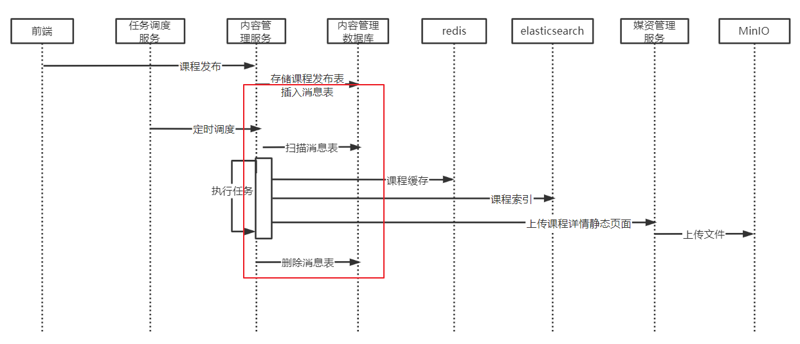

### **4.1.1 为什么要抽出消息模块？**

因为各服务使用消息表都是**同一套方案**，抽出消息模块可以提高**代码复用性**

> **分析**
>
> 在各个业务中使用消息表实现**最终事务一致性**都是同一套方案**：**
>
> 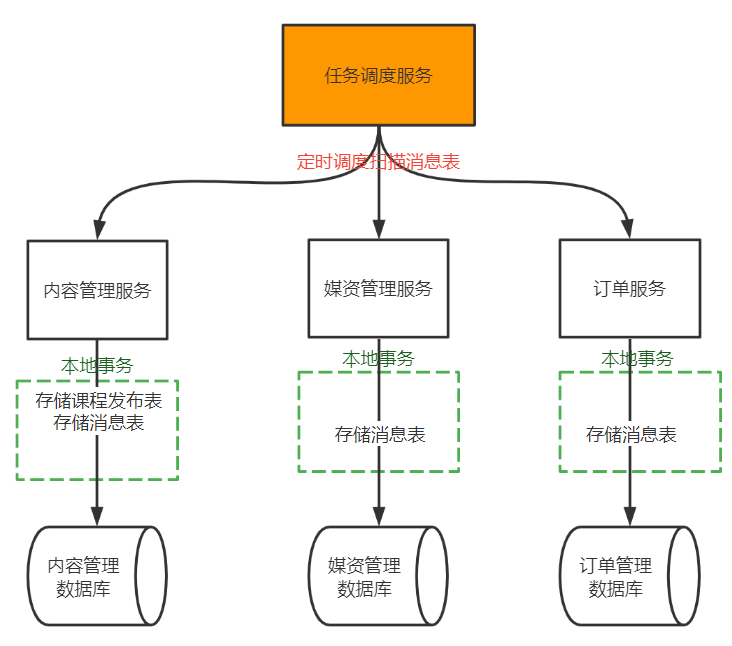
>
> 如果在每个地方都实现一套针对消息表定时扫描、处理的逻辑基本上都是重复的，软件的可复用性太低，成本太高。
>
> 
>
> 如何解决这个问题？
>
> 针对这个问题可以想到将消息处理相关的逻辑做成一个**通用的代码组件**。


### **4.1.2 为什么消息模块是通用的代码组件，而不是通用的服务？**

因为它既是一个独立的功能，又连接多个服务相关的数据库。 

> 分析：
>
> 通用的服务是完成一个通用的独立功能，并提供独立的网络接口，比如：项目中的文件系统服务，提供文件的分布式存储服务。
>
> **代码组件**也是完成一个通用的独立功能，通常会提供**API**的方式**供外部系统使用**，比如：fastjson、Apache commons工具包等。
>
> 如果将消息处理做成一个通用的服务，该服务**需要连接多个数据库**，因为它要扫描微服务数据库下的消息表，并且要提供与微服务通信的网络接口，单就针对当前需求而言开发成本有点高。
>
> 如果将消息处理做一个SDK工具包相比通用服务不仅可以解决将消息处理通用化的需求，还可以降低成本。

所以，本项目确定将对**消息表相关的处理**做成一个**SDK组件**供各微服务使用,如下图所示：

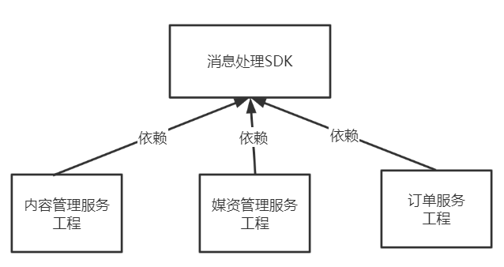

> *SDK*一般指软件开发工具包。是 Software Development Kit 的缩写。

下边对消息SDK的设计内容进行说明：

### **4.1.3 sdk不需要提供执行任务的逻辑**

不用，用“消息类型” 字段区分不同任务，用“bussiness_key”存储参数。

> 拿课程发布任务举例，执行课程发布任务是要向redis、索引库等同步数据，其它任务的执行逻辑是不同的，所以执行任务在sdk中不用实现任务逻辑，只需要提供一个抽象方法由具体的执行任务方去实现。

### **4.1.4 如何保证任务的幂等性？**

任务执行完成后**消息状态**设为“已完成”、从消息表删除存到历史消息表，如果消息的状态是完成或不存在消息表中则不用执行。

> **回顾：**在视频处理章节视频处理的幂等性方案是乐观锁，开启任务处理就是**修改任务状态为“处理中”**。
>
> https://blog.csdn.net/qq_40991313/article/details/129766117

> **回顾：任务幂等性如何保证**
>
> **1)数据库约束**，比如: 唯一索引，主键。同一个主键不可能两次都插入成功。
>
> **2)乐观锁（使用）。**数据库表中增加一个版本字段，更新时判断是否等于某个版本。例如重复提交时判断数据库发现版本已被改变就不提交了。
>
> **3)Redis唯一序列号**。Redis键为任务id，值为随机序列化uuid。请求前生成唯一的序列号，携带序列号去请求，执行时在redis记录该序列号表示以该序列号的请求执行过了，如果相同的序列号再次来执行说明是重复执行。

### **4.1.5 如何保证任务不重复执行？**

除了保证任务的幂等性外，任务调度采用分片广播，根据分片参数去获取任务，另外阻塞调度策略为丢弃任务。


> 采用和前面视频处理章节一致方案：
>
> https://blog.csdn.net/qq_40991313/article/details/129766117
>
> **注意：**这里是**信息同步类任务**，即使**任务重复执行也没有关系**，没损失，不再使用抢占任务的方式保证任务不重复执行。

### **4.1.6 如何防止阶段小任务重复执行？**

还是乐观锁思想（分布式锁数据库唯一索引）， 在消息表中设计**各阶段小任务状态字段**。

> 还有一个问题，根据消息表记录是否存在或消息表中的任务状态去保证任务的幂等性，如果一个任务有好几个小任务，比如：课程发布任务需要执行三个同步操作：存储课程到redis、存储课程到索引库，存储课程页面到文件系统。**如果其中一个小任务已经完成也不应该去重复执行**。这里该如何设计？

将小任务作为任务的不同的阶段，在消息表中设计阶段状态。

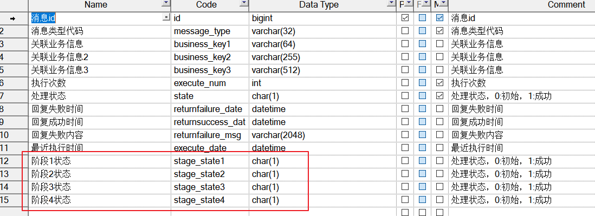

每完成一个阶段在相应的阶段状态字段打上完成标记，即使这个大任务没有完成再重新执行时，如果小阶段任务完成了也不会重复执行某个小阶段的任务。

## 4.2 消息业务实现


### **4.2.0 初始化消息sdk模块**


1、在内容管理数据库创建消息表和消息历史表

2、拷贝课程资料中的xuecheng-plus-message-sdk到工程目录，如下图：

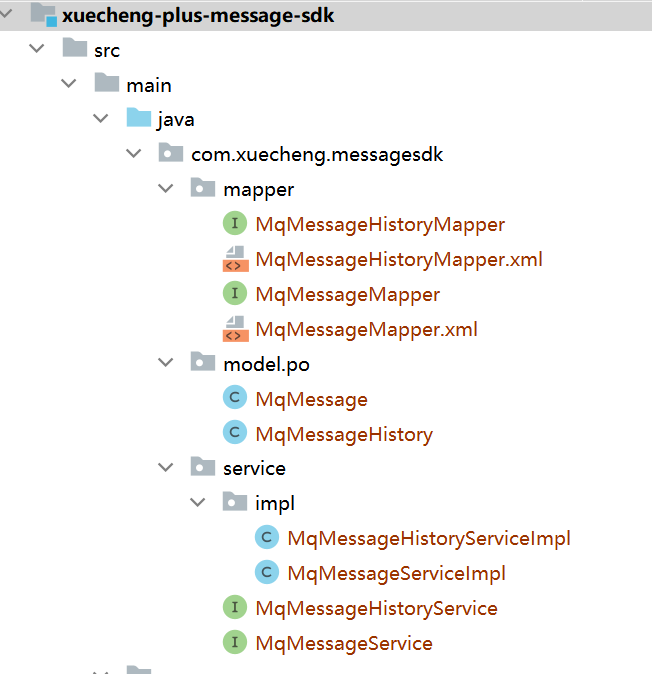


### 4.2.1 消息的扫描、完成、阶段小任务的查询和完成

综上所述，除了消息表的基本的增、删、改、查的接口外，消息SDK还具有如下接口功能：

```java
package com.xuecheng.messagesdk.service;

/**
 * <p>
 *  服务类
 * </p>
 */
public interface MqMessageService extends IService<MqMessage> {

    /**
     * @description 扫描消息表记录，采用与扫描视频处理表相同的思路
     * @param shardIndex xxl-job执行器分片序号
     * @param shardTotal 分片总数
     * @param count 扫描记录数
     * @return java.util.List 消息记录
     */
    public List<MqMessage> getMessageList(int shardIndex, int shardTotal,  String messageType,int count);

    /**
     * @description 完成任务
     * @param id 消息id
     * @return int 更新成功：1
     */
    public int completed(long id);

    /**
     * @description 完成阶段任务
     * @param id 消息id
     * @return int 更新成功：1
     */
    public int completedStageOne(long id);
    public int completedStageTwo(long id);
    public int completedStageThree(long id);
    public int completedStageFour(long id);

    /**
     * @description 查询阶段状态
     * @param id
     * @return int
    */
    public int getStageOne(long id);
    public int getStageTwo(long id);
    public int getStageThree(long id);
    public int getStageFour(long id);

}
```


> 实现类：
>
> ```java
> @Slf4j
> @Service
> public class MqMessageServiceImpl extends ServiceImpl<MqMessageMapper, MqMessage> implements MqMessageService {
> 
>     @Autowired
>     MqMessageMapper mqMessageMapper;
> 
>     @Autowired
>     MqMessageHistoryMapper mqMessageHistoryMapper;
> 
> 
>     @Override
>     public List<MqMessage> getMessageList(int shardIndex, int shardTotal, String messageType,int count) {
>         return mqMessageMapper.selectListByShardIndex(shardTotal,shardIndex,messageType,count);
>     }
> 
>     @Override
>     public MqMessage addMessage(String messageType, String businessKey1, String businessKey2, String businessKey3) {
>         MqMessage mqMessage = new MqMessage();
>         mqMessage.setMessageType(messageType);
>         mqMessage.setBusinessKey1(businessKey1);
>         mqMessage.setBusinessKey2(businessKey2);
>         mqMessage.setBusinessKey3(businessKey3);
>         int insert = mqMessageMapper.insert(mqMessage);
>         if(insert>0){
>             return mqMessage;
>         }else{
>             return null;
>         }
> 
>     }
> 
>     @Transactional
>     @Override
>     public int completed(long id) {
>         MqMessage mqMessage = new MqMessage();
>         //完成任务
>         mqMessage.setState("1");
>         int update = mqMessageMapper.update(mqMessage, new LambdaQueryWrapper<MqMessage>().eq(MqMessage::getId, id));
>         if(update>0){
> 
>             mqMessage = mqMessageMapper.selectById(id);
>             //添加到历史表
>             MqMessageHistory mqMessageHistory = new MqMessageHistory();
>             BeanUtils.copyProperties(mqMessage,mqMessageHistory);
>             mqMessageHistoryMapper.insert(mqMessageHistory);
>             //删除消息表
>             mqMessageMapper.deleteById(id);
>             return 1;
>         }
>         return 0;
> 
>     }
> 
>     @Override
>     public int completedStageOne(long id) {
>         MqMessage mqMessage = new MqMessage();
>         //完成阶段1任务
>         mqMessage.setStageState1("1");
>         return mqMessageMapper.update(mqMessage,new LambdaQueryWrapper<MqMessage>().eq(MqMessage::getId,id));
>     }
> 
>     @Override
>     public int completedStageTwo(long id) {
>         MqMessage mqMessage = new MqMessage();
>         //完成阶段2任务
>         mqMessage.setStageState2("1");
>         return mqMessageMapper.update(mqMessage,new LambdaQueryWrapper<MqMessage>().eq(MqMessage::getId,id));
>     }
> 
>     @Override
>     public int completedStageThree(long id) {
>         MqMessage mqMessage = new MqMessage();
>         //完成阶段3任务
>         mqMessage.setStageState3("1");
>         return mqMessageMapper.update(mqMessage,new LambdaQueryWrapper<MqMessage>().eq(MqMessage::getId,id));
>     }
> 
>     @Override
>     public int completedStageFour(long id) {
>         MqMessage mqMessage = new MqMessage();
>         //完成阶段4任务
>         mqMessage.setStageState4("1");
>         return mqMessageMapper.update(mqMessage,new LambdaQueryWrapper<MqMessage>().eq(MqMessage::getId,id));
>     }
> 
>     @Override
>     public int getStageOne(long id) {
>         return Integer.parseInt(mqMessageMapper.selectById(id).getStageState1());
>     }
> 
>     @Override
>     public int getStageTwo(long id) {
>         return Integer.parseInt(mqMessageMapper.selectById(id).getStageState2());
>     }
> 
>     @Override
>     public int getStageThree(long id) {
>         return Integer.parseInt(mqMessageMapper.selectById(id).getStageState3());
>     }
> 
>     @Override
>     public int getStageFour(long id) {
>         return Integer.parseInt(mqMessageMapper.selectById(id).getStageState4());
>     }
> 
> 
> }
> ```
>
> 
>
>  dao：
>
> ```java
> public interface MqMessageMapper extends BaseMapper<MqMessage> {
> 
>     @Select("SELECT t.* FROM mq_message t WHERE t.id % #{shardTotal} = #{shardindex} and t.state='0' and t.message_type=#{messageType} limit #{count}")
>     List<MqMessage> selectListByShardIndex(@Param("shardTotal") int shardTotal, @Param("shardindex") int shardindex, @Param("messageType") String messageType,@Param("count") int count);
> 
> }
> ```
>
> 

### 4.2.2 **任务处理抽象类，以便于任务类继承**

消息SDK提供**消息处理抽象类**，此抽象类供使用方去继承使用，如下：

```java
package com.xuecheng.messagesdk.service;
/**
 * @description 消息处理抽象类
 */
@Slf4j
@Data
public abstract class MessageProcessAbstract {

    @Autowired
    MqMessageService mqMessageService;


    /**
     * @param mqMessage 执行任务内容
     * @return boolean true:处理成功，false处理失败
     * @description 任务处理
     * @author Mr.M
     * @date 2022/9/21 19:47
     */
    public abstract boolean execute(MqMessage mqMessage);


    /**
     * @description 扫描消息表多线程执行任务
     * @param shardIndex 分片序号
     * @param shardTotal 分片总数
     * @param messageType  消息类型
     * @param count  一次取出任务总数
     * @param timeout 预估任务执行时间,到此时间如果任务还没有结束则强制结束 单位秒
     * @return void
     * @author Mr.M
     * @date 2022/9/21 20:35
    */
    public void process(int shardIndex, int shardTotal,  String messageType,int count,long timeout) {

        try {
            //扫描消息表获取任务清单
            List<MqMessage> messageList = mqMessageService.getMessageList(shardIndex, shardTotal,messageType, count);
            //任务个数
            int size = messageList.size();
            log.debug("取出待处理消息"+size+"条");
            if(size<=0){
                return ;
            }

            //创建线程池
            ExecutorService threadPool = Executors.newFixedThreadPool(size);
            //计数器
            CountDownLatch countDownLatch = new CountDownLatch(size);
            messageList.forEach(message -> {
                threadPool.execute(() -> {
                    log.debug("开始任务:{}",message);
                    //处理任务
                    try {
                        boolean result = execute(message);
                        if(result){
                            log.debug("任务执行成功:{})",message);
                            //更新任务状态,删除消息表记录,添加到历史表
                            int completed = mqMessageService.completed(message.getId());
                            if (completed>0){
                                log.debug("任务执行成功:{}",message);
                            }else{
                                log.debug("任务执行失败:{}",message);
                            }
                        }
                    } catch (Exception e) {
                        e.printStackTrace();
                        log.debug("任务出现异常:{},任务:{}",e.getMessage(),message);
                    }
                    //计数
                    countDownLatch.countDown();
                    log.debug("结束任务:{}",message);

                });
            });

            //等待,给一个充裕的超时时间,防止无限等待，到达超时时间还没有处理完成则结束任务
            countDownLatch.await(timeout,TimeUnit.SECONDS);
            System.out.println("结束....");
        } catch (InterruptedException e) {
           e.printStackTrace();

        }

    }

}
```


## **4.3 xxl-job集成消息SDK，调度发表课程的任务**

### **4.3.1 环境准备，导入依赖+添加“发布课程”类型的****消息表**

1、在内容管理数据库创建消息表和消息历史表（已完成）

2、拷贝课程资料中的xuecheng-plus-message-sdk到工程目录，如下图：


3、在内容管理service工程中添加sdk依赖

```XML
<dependency>
    <groupId>com.xuecheng</groupId>
    <artifactId>xuecheng-plus-message-sdk</artifactId>
    <version>0.0.1-SNAPSHOT</version>
</dependency>
```


4、回到课程发布方法，添加消息表：

```java
@Transactional
@Override
public void publish(Long companyId, Long courseId) {

。。。
 //保存消息表
 saveCoursePublishMessage(courseId);

。。。

}
 /**
  * @description 保存消息表记录
  * @param courseId  课程id
  */
private void saveCoursePublishMessage(Long courseId){
//消息类型为：course_publish，即该消息是处理课程发布任务的；“关联业务信息1”是课程id。
 MqMessage mqMessage = mqMessageService.addMessage("course_publish", String.valueOf(courseId), null, null);
 if(mqMessage==null){
  XueChengPlusException.cast(CommonError.UNKOWN_ERROR);
 }
}
```


**测试：**

发布一门课程，观察消息表是否正常添加消息。

需要手动修改课程审核状态为审核通过执行发布操作，发布后可以修改发布状态为下架重新发布测试。

### **4.3.2 【内容模块】课程发布任务类**


> **任务流程：** 
>
> 1. 任务类实现sdk中的MessageProcessAbstract类
> 2. 设置任务调度入口，调用抽象类的方法执行任务。查询任务列表、设置计数器防止无限等待，遍历开启线程执行下面重写的execute方法。
> 3. 重写execte方法： 
>    1. 获取消息相关的业务信息
>    2. 向Redis存储课程缓存信息
>    3. 向Elasticsearch存储课程索引信息
>    4. 请求分布文件系统minIO存储课程静态化页面(即html页面) 

```java
package com.xuecheng.content.service.jobhandler;

@Slf4j
@Component
public class CoursePublishTask extends MessageProcessAbstract {
    //任务调度入口
    @XxlJob("CoursePublishJobHandler")
    public void coursePublishJobHandler() throws Exception {

        // 分片参数
        int shardIndex = XxlJobHelper.getShardIndex();//执行器的序号，从0开始
        int shardTotal = XxlJobHelper.getShardTotal();//执行器总数
        //调用抽象类的方法执行任务。查询任务列表、设置计数器防止无限等待，遍历开启线程执行下面重写的execute方法
        process(shardIndex,shardTotal, "course_publish",30,60);


    }

    //课程发布任务处理
    @Override
    public boolean execute(MqMessage mqMessage) {
        //获取消息相关的业务信息
        String businessKey1 = mqMessage.getBusinessKey1();
        long courseId = Integer.parseInt(businessKey1);
        //课程静态化
        generateCourseHtml(mqMessage,courseId);
        //课程索引
        saveCourseIndex(mqMessage,courseId);
        //课程缓存
        saveCourseCache(mqMessage,courseId);
        return true;
    }


    //生成课程静态化页面并上传至文件系统
    public void generateCourseHtml(MqMessage mqMessage,long courseId){

        log.debug("开始进行课程静态化,课程id:{}",courseId);
        //消息id
        Long id = mqMessage.getId();
        //消息处理的service
        MqMessageService mqMessageService = this.getMqMessageService();
        //消息幂等性处理
        int stageOne = mqMessageService.getStageOne(id);
        if(stageOne >0){
            log.debug("课程静态化已处理直接返回，课程id:{}",courseId);
            return ;
        }
        try {
            TimeUnit.SECONDS.sleep(10);
        } catch (InterruptedException e) {
            throw new RuntimeException(e);
        }
        //保存第一阶段状态
        mqMessageService.completedStageOne(id);

    }

    //TODO:将课程信息缓存至redis
    public void saveCourseCache(MqMessage mqMessage,long courseId){
        log.debug("将课程信息缓存至redis,课程id:{}",courseId);
        try {
            TimeUnit.SECONDS.sleep(2);
        } catch (InterruptedException e) {
            throw new RuntimeException(e);
        }


    }
    //TODO:保存课程索引信息
    public void saveCourseIndex(MqMessage mqMessage,long courseId){
        log.debug("保存课程索引信息,课程id:{}",courseId);
        try {
            TimeUnit.SECONDS.sleep(2);
        } catch (InterruptedException e) {
            throw new RuntimeException(e);
        }

    }

}
```


### **4.3.3 xxl-job调度中心****开启执行器、任务，每10s执行一次**

1、首先在内容管理service工程中添加xxl-job依赖

```XML
<dependency>
    <groupId>com.xuxueli</groupId>
    <artifactId>xxl-job-core</artifactId>
</dependency>
```


2、配置执行器

在nacos中在content-service-dev.yaml中配置

```bash
xxl:
  job:
    admin:
      addresses: http://192.168.101.65:8088/xxl-job-admin
    executor:
      appname: coursepublish-job
      address:
      ip:
      port: 8999
      logpath: /data/applogs/xxl-job/jobhandler
      logretentiondays: 30
    accessToken: default_token
```


3、从媒资管理服务层工程中拷贝一个XxlJobConfig配置类到内容管理service工程中。


在xxl-job-admin控制台中添加执行器

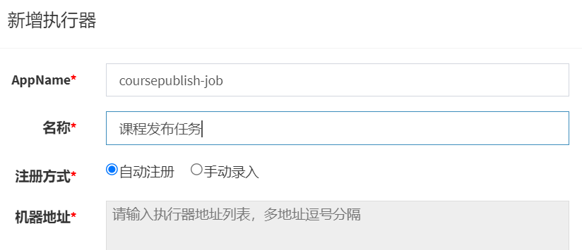


3、编写任务调度入口

```java
@Slf4j
@Component
public class CoursePublishTask extends MessageProcessAbstract {

    //任务调度入口
    @XxlJob("CoursePublishJobHandler")
    public void coursePublishJobHandler() throws Exception {
        // 分片参数
        int shardIndex = XxlJobHelper.getShardIndex();
        int shardTotal = XxlJobHelper.getShardTotal();
        log.debug("shardIndex="+shardIndex+",shardTotal="+shardTotal);
        //参数:分片序号、分片总数、消息类型、一次最多取到的任务数量、一次任务调度执行的超时时间
        process(shardIndex,shardTotal,"course_publish",30,60);
    }
    ....
```


4、在xxl-job添加任务

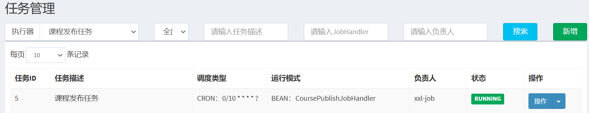

任务配置如下：


到此SDK开发、集成完成，下一步添加课程发布后页面静态化、课程缓存、课程索引等任务。

### **4.3.4** **测试**

在消息表添加课程发布的消息，消息类型为course_publish,business_key1为发布课程的ID

1、测试是否可以正常调度执行。

2、测试任务幂等性

在 saveCourseCache(mqMessage,courseId);处打断点，待执行到这里观察数据库第一阶段完成的标记预期标记为1。

结束进程，再重新启动，观察第一阶段的任务预期不再执行。

3、任务执行完成删除消息表记录，插入历史表，state状态字段为1


# **5 模板引擎实现****页面静态化（课程预览页静态化上传到MinIO）**

## **5.1** **什么是页面静态化**

**简洁版：**以前是请求响应后渲染成html页面，静态化后是新建、修改时就渲染页面并存到文件系统。


根据课程发布的操作流程，执行课程发布后要将课程详情信息页面静态化，**生成html页面上传至文件系统**。

**什么是页面静态化？**

> 课程预览功能通过模板引擎技术在页面模板中填充数据，生成html页面，这个过程是当客户端请求服务器时**服务器才开始渲染生成html页面**，最后响应给浏览器，**服务端渲染的并发能力是有限的**。

**页面静态化**则强调将生成html页面的过程提前，**提前使用模板引擎技术生成html页面**，当客户端请求时**直接请求html页面**，由于是静态页面可以使用nginx、apache等高性能的web服务器，并发性能高。

**什么时候能用页面静态化技术？**

当**数据变化不频繁**，一旦生成静态页面很长一段时间内很少变化，此时可以使用页面静态化。因为如果数据变化频繁，一旦改变就需要重新生成静态页面，导致维护静态页面的工作量很大。

根据课程发布的业务需求，虽然课程发布后仍可以修改课程信息，但需要经过课程审核，且修改频度不大，所以适合使用页面静态化。


## **5.2** freemarker课程预览页**静态化测试**

下边使用freemarker技术对页面静态化生成html页面。

**1.**在内容管理service工程中添加**freemarker依赖**

```XML
<dependency>
    <groupId>org.springframework.boot</groupId>
    <artifactId>spring-boot-starter-freemarker</artifactId>
</dependency>
```


**2.编写测试方法**

> **业务流程：**
>
> 1. Configuration对象指定模板目录和编码
> 2. 准备课程预览页数据
> 3. 模板文件静态化成html字符串，freemarker模板工具类
> 4. html字符转输入流，再转输出流写入文件
>
> freemarker模板工具类，**将模板转成html字符串：**
>
> ```java
> String FreeMarkerTemplateUtils.processTemplateIntoString(Template template, Object model);
> ```
>
> 

```java
package com.xuecheng.content;

/**
 * @description freemarker测试
 */
@SpringBootTest
public class FreemarkerTest {

    @Autowired
    CoursePublishService coursePublishService;


    //测试页面静态化
    @Test
    public void testGenerateHtmlByTemplate() throws IOException, TemplateException {
//Configuration对象指定模板目录和编码
        Configuration configuration = new Configuration(Configuration.getVersion());

        //加载模板
        //选指定模板路径,classpath下templates下
        //得到classpath路径
        String classpath = this.getClass().getResource("/").getPath();
        configuration.setDirectoryForTemplateLoading(new File(classpath + "/templates/"));
        //设置字符编码
        configuration.setDefaultEncoding("utf-8");

        //指定模板文件名称
        Template template = configuration.getTemplate("course_template.ftl");

//准备课程预览页数据
        CoursePreviewDto coursePreviewInfo = coursePublishService.getCoursePreviewInfo(2L);

        Map<String, Object> map = new HashMap<>();
        map.put("model", coursePreviewInfo);

//页面静态化，模板文件转html字符串
        //参数1：模板，参数2：数据模型
        String content = FreeMarkerTemplateUtils.processTemplateIntoString(template, map);
        System.out.println(content);
        //将静态化内容输出到文件中
        InputStream inputStream = IOUtils.toInputStream(content);
        //输出流
        FileOutputStream outputStream = new FileOutputStream("D:\\develop\\test.html");
        IOUtils.copy(inputStream, outputStream);

    }

}
```


**测试：**

执行测试方法，观察D:\\develop\\test.html 是否成功生成。

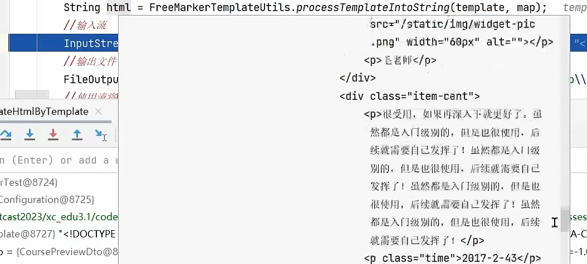


## **5.3** **上传文件测试**

### **5.3.1** **环境准备，多文件上传依赖、配置类**

> 静态化生成文件后需要上传至分布式文件系统，根据微服务的职责划分，媒资管理服务负责维护文件系统中的文件，所以**内容管理服务**对页面静态化生成html文件需要**调用媒资管理服务的上传文件接口**。如下图：
>
> 
>
> 微服务之间难免会存在远程调用，在Spring Cloud中可以使用Feign进行远程调用，
>
> Feign是一个声明式的http客户端，官方地址：[GitHub - OpenFeign/feign: Feign makes writing java http clients easier](https://github.com/OpenFeign/feign)
>
> 其作用就是帮助我们优雅的实现http请求的发送，解决上面提到的问题。

下边先准备Feign的开发环境:

1、在内容管理content-service工程添加依赖：

```XML
<dependency>
    <groupId>com.alibaba.cloud</groupId>
    <artifactId>spring-cloud-starter-alibaba-nacos-discovery</artifactId>
</dependency>
<!-- Spring Cloud 微服务远程调用 -->
<dependency>
    <groupId>org.springframework.cloud</groupId>
    <artifactId>spring-cloud-starter-openfeign</artifactId>
</dependency>
<dependency>
    <groupId>io.github.openfeign</groupId>
    <artifactId>feign-httpclient</artifactId>
</dependency>
<!--feign支持Multipart格式传参-->
<dependency>
    <groupId>io.github.openfeign.form</groupId>
    <artifactId>feign-form</artifactId>
    <version>3.8.0</version>
</dependency>
<dependency>
    <groupId>io.github.openfeign.form</groupId>
    <artifactId>feign-form-spring</artifactId>
    <version>3.8.0</version>
</dependency>
```


2、在nacos的feign-dev.yaml配置熔断

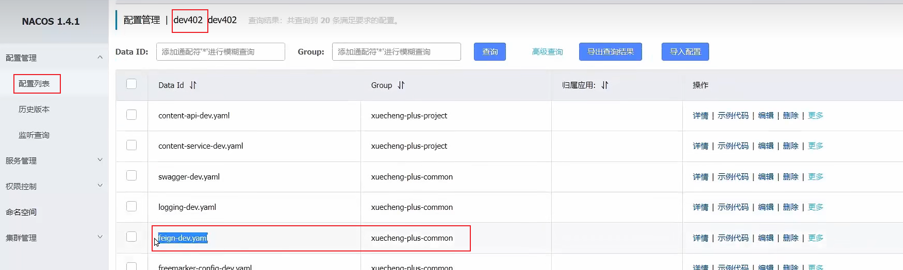


```bash
feign:
#Hystrix类似于Sentinel，用于微服务保护。隔离、熔断、降级等
  hystrix:
    enabled: true
#断路器
  circuitbreaker:
    enabled: true
hystrix:
  command:
    default:
      execution:
        isolation:
          thread:
            timeoutInMilliseconds: 30000  #熔断超时时间
ribbon:
  ConnectTimeout: 60000 #连接超时时间
  ReadTimeout: 60000 #读超时时间
  MaxAutoRetries: 0 #重试次数
  MaxAutoRetriesNextServer: 1 #切换实例的重试次数
```


3、在内容管理service工程和内容管理api工程都引入此配置文件

```bash
shared-configs:
  - data-id: feign-${spring.profiles.active}.yaml
    group: xuecheng-plus-common
    refresh: true
```


**4、多文件上传配置类**

在内容管理service工程配置feign支持Multipart，创建MultipartSupportConfig 到content-service工程下的config包下。

```java
@Configuration
public class MultipartSupportConfig {

    @Autowired
    private ObjectFactory<HttpMessageConverters> messageConverters;

    @Bean
    @Primary//注入相同类型的bean时优先使用
    @Scope("prototype")
    public Encoder feignEncoder() {
        return new SpringFormEncoder(new SpringEncoder(messageConverters));
    }

    //将file转为Multipart
    public static MultipartFile getMultipartFile(File file) {
        FileItem item = new DiskFileItemFactory().createItem("file", MediaType.MULTIPART_FORM_DATA_VALUE, true, file.getName());
        try (FileInputStream inputStream = new FileInputStream(file);
             OutputStream outputStream = item.getOutputStream();) {
            IOUtils.copy(inputStream, outputStream);

        } catch (Exception e) {
            e.printStackTrace();
        }
        return new CommonsMultipartFile(item);
    }
}
```


### **5.3.2 【媒资服务】****多文件上传接口添加参数“对象名”**

现在需要将课程的静态文件上传到minio，单独存储到course目录下，文件的objectname为"课程id.html"，原有的上传文件接口需要增加一个参数 objectname。

下边扩充媒资服务的上传文件接口

 MediaFilesController上传方法添加objectName参数：

```java
 @ApiOperation("上传图片")
 @RequestMapping(value = "/upload/coursefile",consumes = MediaType.MULTIPART_FORM_DATA_VALUE)
public UploadFileResultDto upload(@RequestPart("filedata")MultipartFile filedata,
                                  @RequestParam(value= "objectName",required=false) String objectName) throws IOException {

    //准备上传文件的信息
     UploadFileParamsDto uploadFileParamsDto = new UploadFileParamsDto();
     //原始文件名称
     uploadFileParamsDto.setFilename(filedata.getOriginalFilename());
     //文件大小
     uploadFileParamsDto.setFileSize(filedata.getSize());
     //文件类型
     uploadFileParamsDto.setFileType("001001");
     //创建一个临时文件
     File tempFile = File.createTempFile("minio", ".temp");
     filedata.transferTo(tempFile);
     Long companyId = 1232141425L;
    //文件路径
     String localFilePath = tempFile.getAbsolutePath();

//调用service上传图片
     UploadFileResultDto uploadFileResultDto = mediaFileService.uploadFile(companyId
, uploadFileParamsDto, localFilePath,objectName);

     return uploadFileResultDto;
 }

}
```


**service接口也增加参数“对象名”：**

```java
/**
 * 上传文件
 * @param companyId 机构id
 * @param uploadFileParamsDto 上传文件信息
 * @param localFilePath 文件磁盘路径
 * @param objectName 对象名
 * @return 文件信息
 */
public UploadFileResultDto uploadFile(Long companyId, UploadFileParamsDto uploadFileParamsDto, String localFilePath,String objectName);
```


修改原有uploadFile方法，**如果objectName为空则采取年月日样式**的路径方式。


```java
//存储到minio中的对象名(带目录)
if(StringUtils.isEmpty(objectName)){
    objectName =  defaultFolderPath + fileMd5 + extension;
}
//        String objectName = defaultFolderPath + fileMd5 + extension;
```


### **5.3.3** **远程调用测试**

在content-service下编写feign接口

```java
package com.xuecheng.content.feignclient;

/**
 * @description 媒资管理服务远程接口
 */
 @FeignClient(value = "media-api",configuration = MultipartSupportConfig.class)
public interface MediaServiceClient {

 @RequestMapping(value = "/media/upload/coursefile",consumes = MediaType.MULTIPART_FORM_DATA_VALUE)
 String uploadFile(@RequestPart("filedata") MultipartFile upload,@RequestParam(value = "objectName",required=false) String objectName);
}
```


在启动类添加@EnableFeignClients注解

```java
@EnableFeignClients(basePackages={"com.xuecheng.content.feignclient"})
```


编写测试方法

```java
package com.xuecheng.content;

/**
 * @description 测试使用feign远程上传文件
 */
@SpringBootTest
public class FeignUploadTest {

    @Autowired
    MediaServiceClient mediaServiceClient;

    //远程调用，上传文件
    @Test
    public void test() {
   
        MultipartFile multipartFile = MultipartSupportConfig.getMultipartFile(new File("D:\\develop\\test.html"));
        mediaServiceClient.uploadFile(multipartFile,"course","test.html");
    }

}
```


下边进行测试，启动媒资服务，执行测试方法，上传文件成功，进入minIO查看文件

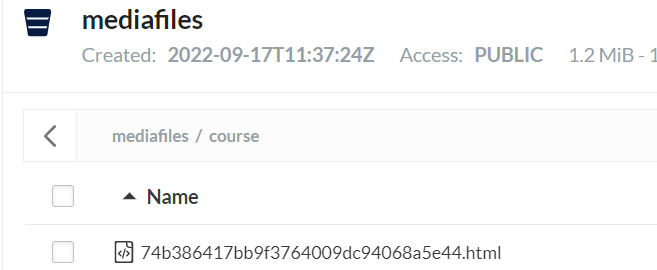

访问：http://192.168.101.65:9000/mediafiles/course/74b386417bb9f3764009dc94068a5e44.html

查看是否可以正常访问。


## **5.4** Hystrix**熔断降级处理**

### **5.4.1** **雪崩、熔断、降级**

微服务中难免存在服务之间的**远程调用**，比如：内容管理服务远程调用媒资服务的上传文件接口，当微服务**运行不正常会导致无法正常调用**微服务，此时会出现异常，如果这种异常不去处理可能导致雪崩效应。

微服务的**雪崩效应**表现在服务与服务之间调用，当其中一个服务无法提供服务可能导致其它服务也死掉，比如：服务B调用服务A，由于A服务异常导致B服务响应缓慢，最后B、C等服务都不可用，像这样由**一个服务所引起的一连串的**多个服务无法提供服务即是微服务的雪崩效应，如下图：

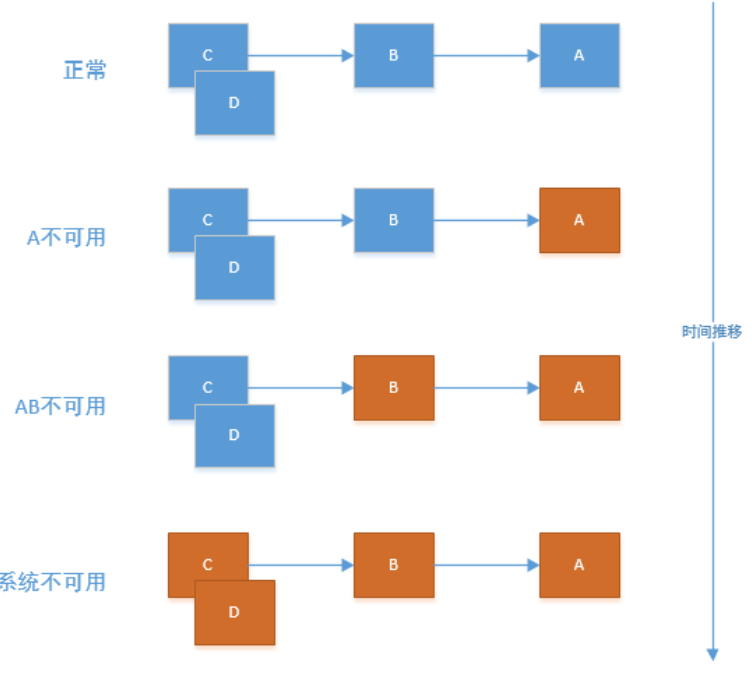

**如何解决由于微服务异常引起的雪崩效应呢？**

可以采用**熔断、降级**的方法去解决。

熔断降级的相同点都是为了解决微服务系统崩溃的问题，但它们是两个不同的技术手段，两者又存在联系。

**熔断：被调用的下游服务异常触发熔断。** 

上游调用下游，当**下游服务异常**而断开与上游服务的交互，它就相当于保险丝，下游服务异常触发了熔断，从而保证上游服务不受影响。 


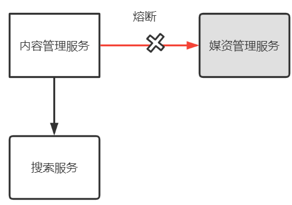


**降级：**

当下游服务异常触发**熔断后**，上游服务就不再去调用异常的微服务而是执行了**降级处理逻辑**，这个降级处理逻辑可以是本地一个单独的方法。

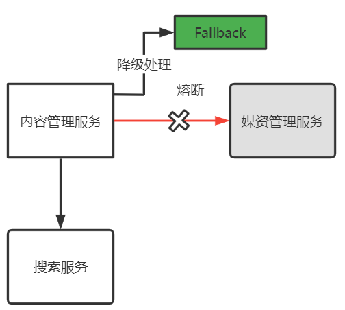

两者都是为了保护系统，熔断是当下游服务异常时一种保护系统的手段，降级是熔断后上游服务处理熔断的方法。

### **5.4.2** **熔断降级处理**

项目使用Hystrix框架实现熔断、降级处理，在feign-dev.yaml中配置。

**1、开启Feign熔断保护**

```bash
feign:
  hystrix:
    enabled: true
  circuitbreaker:
    enabled: true
```


**2、设置熔断的超时时间**，为了防止一次处理时间较长**触发熔断**这里还需要设置请求和连接的超时时间，如下：

```bash
hystrix:
  command:
    default:
      execution:
        isolation:
          thread:
            timeoutInMilliseconds: 30000  #熔断超时时间
ribbon:
  ConnectTimeout: 60000 #连接超时时间
  ReadTimeout: 60000 #读超时时间
  MaxAutoRetries: 0 #重试次数
  MaxAutoRetriesNextServer: 1 #切换实例的重试次数
```


**3、定义降级逻辑**

两种方法：

1）**方法一：fallback** 

```java
@FeignClient(value = "media-api",configuration = MultipartSupportConfig.class
,fallback = MediaServiceClientFallback.class)
@RequestMapping("/media")
public interface MediaServiceClient{
...
```


定义一个fallback类MediaServiceClientFallback，此类实现了MediaServiceClient接口。

> 第一种方法无法取出熔断所抛出的异常，第二种方法定义MediaServiceClientFallbackFactory 可以解决这个问题。 


2）**方法二：fallbackFactory** **（推荐，可以取出熔断异常）**

第二种方法在FeignClient中指定fallbackFactory ，如下：

```java
@FeignClient(value = "media-api",configuration = MultipartSupportConfig.class
,fallbackFactory = MediaServiceClientFallbackFactory.class)
```


定义MediaServiceClientFallbackFactory如下：

```java
@Slf4j
@Component
public class MediaServiceClientFallbackFactory implements FallbackFactory<MediaServiceClient> {
    @Override
    public MediaServiceClient create(Throwable throwable) {
        return new MediaServiceClient(){
            @Override
            public String uploadFile(MultipartFile upload, String objectName) {
                //降级方法
                log.debug("调用媒资管理服务上传文件时发生熔断，异常信息:{}",throwable.toString(),throwable);
                return null;
            }
        };
    }
}
```


降级处理逻辑：

返回一个null对象，上游服务请求接口得到一个null说明执行了降级处理。

测试：

停止媒资管理服务或人为制造异常观察是否执行降级逻辑。


## **5.4** **课程静态化开发**

课程页面静态化和静态页面远程上传测试通过，下一步开发课程静态化功能，最终使用消息处理SDK去调度执行。


### **5.4.1** **静态化实现**

课程静态化包括两部分工作：生成课程静态化页面，上传静态页面到文件系统。

在课程发布的service编写这两部分内容，最后通过消息去调度执行。

1、接口定义

```java
/**
 * @description 课程静态化
 * @param courseId  课程id
 * @return File 静态化文件
 * @author Mr.M
 * @date 2022/9/23 16:59
*/
public File generateCourseHtml(Long courseId);
/**
 * @description 上传课程静态化页面
 * @param file  静态化文件
 * @return void
 * @author Mr.M
 * @date 2022/9/23 16:59
*/
public void  uploadCourseHtml(Long courseId,File file);
```


2、接口实现

将之前编写的静态化测试代码以及上传静态文件测试代码拷贝过来使用

```java
@Override
    public File generateCourseHtml(Long courseId) {

        //静态化文件
        File htmlFile  = null;

        try {
            //配置freemarker
            Configuration configuration = new Configuration(Configuration.getVersion());

            //加载模板
            //选指定模板路径,classpath下templates下
            //得到classpath路径
            String classpath = this.getClass().getResource("/").getPath();
            configuration.setDirectoryForTemplateLoading(new File(classpath + "/templates/"));
            //设置字符编码
            configuration.setDefaultEncoding("utf-8");

            //指定模板文件名称
            Template template = configuration.getTemplate("course_template.ftl");

            //准备数据
            CoursePreviewDto coursePreviewInfo = this.getCoursePreviewInfo(courseId);

            Map<String, Object> map = new HashMap<>();
            map.put("model", coursePreviewInfo);

            //静态化
            //参数1：模板，参数2：数据模型
            String content = FreeMarkerTemplateUtils.processTemplateIntoString(template, map);
//            System.out.println(content);
            //将静态化内容输出到文件中
            InputStream inputStream = IOUtils.toInputStream(content);
            //创建静态化文件
            htmlFile = File.createTempFile("course",".html");
            log.debug("课程静态化，生成静态文件:{}",htmlFile.getAbsolutePath());
            //输出流
            FileOutputStream outputStream = new FileOutputStream(htmlFile);
            IOUtils.copy(inputStream, outputStream);
        } catch (Exception e) {
            log.error("课程静态化异常:{}",e.toString());
            XueChengPlusException.cast("课程静态化异常");
        }

        return htmlFile;
    }

    @Override
    public void uploadCourseHtml(Long courseId, File file) {
        MultipartFile multipartFile = MultipartSupportConfig.getMultipartFile(file);
        String course = mediaServiceClient.uploadFile(multipartFile, "course/"+courseId+".html");
        if(course==null){
            XueChengPlusException.cast("上传静态文件异常");
        }
    }
```


完善课程发布任务CoursePublishTask类的代码：

```java
//生成课程静态化页面并上传至文件系统
public void generateCourseHtml(MqMessage mqMessage,long courseId){
    log.debug("开始进行课程静态化,课程id:{}",courseId);
    //消息id
    Long id = mqMessage.getId();
    //消息处理的service
    MqMessageService mqMessageService = this.getMqMessageService();
    //消息幂等性处理
    int stageOne = mqMessageService.getStageOne(id);
    if(stageOne == 1){
        log.debug("课程静态化已处理直接返回，课程id:{}",courseId);
        return ;
    }

    //生成静态化页面
    File file = coursePublishService.generateCourseHtml(courseId);
    //上传静态化页面
    if(file!=null){
        coursePublishService.uploadCourseHtml(courseId,file);
    }
    //保存第一阶段状态
    mqMessageService.completedStageOne(id);

}
```


### **5.4.2** **测试**

1、启动网关、媒资管理服务工程。

2、在内容管理api工程的启动类上配置FeignClient

```java
@EnableFeignClients(basePackages={"com.xuecheng.content.feignclient"})
```


在bootstrap.yml引用feign-dev.yaml

```bash
- data-id: feign-${spring.profiles.active}.yaml
  group: xuecheng-plus-common
  refresh: true  #profiles默认为dev
```


启动内容管理接口工程。

在CoursePublishTask类的execute方法中打上断点。


3、发布一门课程，保存消息表存在未处理的处理。


4、启动xxl-job调度中心、启动课程发布任务，等待定时调度。

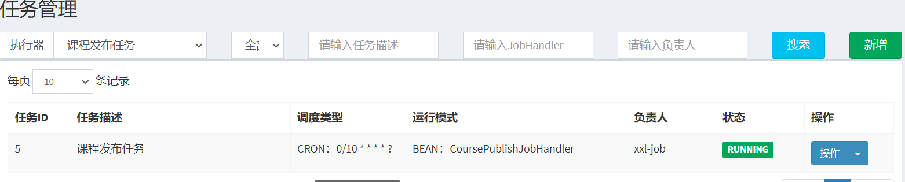


5、观察任务调度日志，观察任务是否可以正常处理。

6、处理完成进入文件系统，查询mediafiles桶内是否存在以课程id命名的html文件

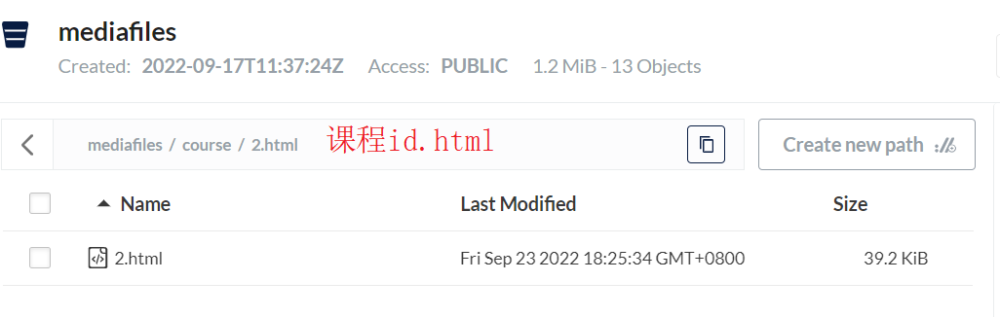

如果不存在说明课程静态化存在问题，再仔细查看执行日志，排查问题。

如果存在则说明课程静态化并上传到minio成功。

### **5.4.3** **浏览详细页面**

课程静态化成功后可以用浏览器访问html文件是否可以正常浏览，下图表示可以正常浏览。

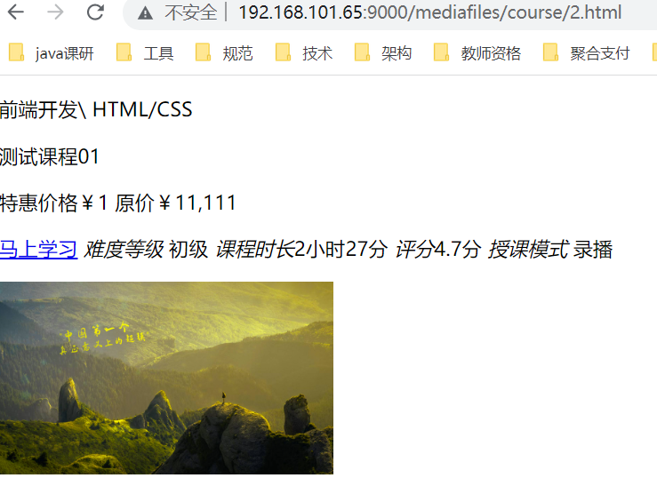

页面还没有样式，需要在nginx配置虚拟目录，在www.51xuecheng.cn下配置：

```bash
location /course/ { 
        proxy_pass http://fileserver/mediafiles/course/;
}
```


加载nginx配置文件

访问：http://www.51xuecheng.cn/course/2.html

2.html为以课程id命名的html文件。