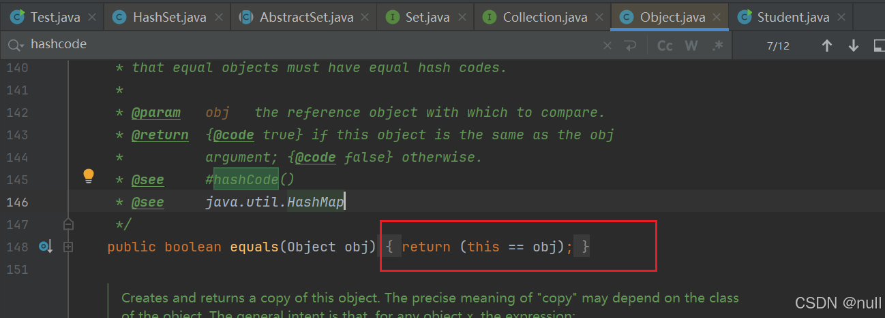

>  **导航：**
>
> [【Java笔记+踩坑汇总】Java基础+JavaWeb+SSM+SpringBoot+SpringCloud+瑞吉外卖/谷粒商城/学成在线+设计模式+面试题汇总+性能调优/架构设计+源码解析](https://blog.csdn.net/qq_40991313/article/details/126646289?spm=1001.2014.3001.5501)

[TOC]


# 一、基础

## 1.1.请你说说Java的特点和优点,为什么要选择Java？

> **得分点**
>
> 跨平台、面对对象、封装继承多态、垃圾回收机制。

跨平台、面对对象、封装继承多态、垃圾回收机制。

**JAVA语言的优点有：**

1. **吸收了c++的优点**，摒弃了c++多继承和指针的复杂使用。
2. **垃圾回收机制：**Java的垃圾回收机制是自动的，程序员不需要手动管理内存。
3. **面向对象：**将现实世界的事物抽象成程序中的对象，使得程序更加易于理解、修改和扩展。将数据（对象）和操作数据的方法（方法）组合成“类”（class）并封装起来。
4. **跨平台**，编译器将Java源代码编译成字节码文件后，JVM将字节码翻译成特定平台的机器码运行程序。Java是跨平台的，JVM不是跨平台的。
5. **内含大量的库**，简化编写工作。
6. **良好的安全性**，java语言提供了一个防止恶意代码攻击的安全机制。
7. **良好的健壮性**。Java有强类型机制、垃圾回收器、异常处理和安全检查机制。
8. **支持web开发**，如servlet，jsp等。
9. **封装：**将对象的状态和行为包装在一个类中并对外界隐藏实现的细节，可以通过访问修饰符控制成员的访问权限。封装可以降低耦合和提高复用性。
10. **继承：**继承是指一个类通过从另一个类继承其属性和方法。这使得子类具有其父类的行为和属性，同时可以扩展或修改这些行为和属性以满足特定的需求。
11. **多态：**多态是指在程序运行时，同一个方法可以根据传入的不同参数实现不同的行为。使程序更灵活、易于扩展。接口引用指向实现类对象、父类引用指向子类对象、子类引用指向父类对象。

> 1. Java是一门非常纯粹的面向对象的编程语言,它在吸收C++语言的各种优点的同时去除了C++语言中令人难以理解的多继承、指针等概念。所以Java语言在保证了强大的功能性的基础上,还**比C++语言更为简单易用。**
> 2. Java语言极好地实现了**面向对象理论**,是静态面向对象编程语言的代表,它的存在保证了程序员可以用优雅的思维方式进行复杂的编程 。
> 3. Java还拥有平台独立性,可以做到"一次编译,到处运行"。java还提供了很多**内置的类库**,通过这些类库,简化了开发人员的程序设计工作,缩短了项目的开发时间,最重要的是Java提供了**垃圾回收器**,这也将开发人员从对内存的管理中解脱出来。
> 4. 同时Java拥有良好的**安全性和健壮性**,java语言经常被用在网络环境中,为了增强程序的安全性,java语言提供了一个防止恶意代码攻击的安全机制（数组边界检测和Bytecode校验等）。
> 5. java的强类型机制、垃圾回收器、异常处理和安全检查机制使得用java语言编写的程序有很好的健壮性。
> 6. 此外,Java还提供了对Web应用开发的支持：例如Applet、Servlet和JSP可以用来开发Web应用程序；Socket、RMI可以用来开发分布式应用程序的类库。
>
> **加分回答**
>
> **Java为什么可以跨平台：** 
>
> JVM（Java虚拟机）是Java跨平台的关键。 在运行程序之前,Java源代码（.java）需要经过编译器,将源代码翻译成字节码（.class）,但字节码不能直接运行,所以必须通过JVM将字节码翻译成特定平台的机器码运行程序。但跨平台的是Java程序、而不是JVM,所以需要在不同平台下安装不同版本的JVM。


## 1.2.说说你对面向对象的理解

> **得分点**
>
> 封装,继承,多态、概念、实现方式和优缺点

面向对象的三大基本特征是：封装、继承、多态。

- **封装：**将对象的状态和行为包装在一个类中并对外界隐藏实现的细节，可以通过访问修饰符控制成员的访问权限，让外部程序通过该类提供的方法来实现对内部信息的操作和访问。**优点：**封装可以降低耦合和提高复用性。

- **继承：**继承是指一个类通过从另一个类继承其属性和方法。这使得子类具有其父类的行为和属性，同时可以扩展或修改这些行为和属性以满足特定的需求。**优点：**代码共享和扩展性。**缺点：**侵入性（修改父类会影响子类）、耦合性提高。

- 多态：

  同一行为具有多个不同的表现形式或形态。例如同一个接口，使用不同的实例而执行不同操作。使程序更灵活、易于扩展。

  实现方式：

  接口引用指向实现类对象、父类引用指向子类对象。

  优点：

  维护性和扩展性。 

  ```java
   Fruits fruit = new Apple(); //向上转型
   
   Apple apple = (Apple)fruit; //向下转型，强制类型转换
  ```

  

  

> **封装**是指将对象的状态信息隐藏在对象内部,不允许外部程序直接访问对象内部信息,让外部程序通过该类提供的方法来实现对内部信息的操作和访问。这种做法有助于规范使用者的行为,让使用者只能通过事先预定的方法访问数据,提高了代码的可维护性；
>
> **继承**是面向对象实现代码复用的重要手段,Java通过extends作为关键字实现类的继承,实现继承的类被称为子类,被继承的类称为父类（有的也被称为基类和超类）,父类和子类的关系是一种一般和特殊的关系；
>
> **多态**的实现离不开继承,在设计程序时,我们可以将参数的类型定义为父类型。在调用程序时,则可以根据实际情况,传入该父类型的某个子类型的实例,这样就实现了多态。对于**父类型**,可以有三种形式,即**普通的类、抽象类、接口**。对于子类型,则要根据它自身的特征,重写父类的某些方法,或实现抽象类/接口的某些抽象方法。
>
> **加分回答**
>
> **封装优点：**
>
>  \- 隐藏类的成员变量和实现细节,不允许外部直接访问
>
>  \- 规范使用者的行为,让使用者只能通过事先预定的方法访问数据,通过在这个方法中加入逻辑控制,限制使用者对成员变量的不合理访问
>
>  \- 可进行数据检查,从而有利于保证对象信息的完整性；
>
>  \- 便于修改,提高代码的可维护性
>
> **使用继承的优点包括：**
>
>  \- 代码共享,减少创建类的工作量,每个子类都拥有父类的方法和属性,提高了代码复用
>
>  \- 提高代码的可扩展性,很多开源框架的扩展接口都是通过继承父类来完成的
>
> **但同时继承也有很多缺点：**
>
>  \- **继承是侵入性的。**只要继承,就必须拥有父类的所有属性和方法；
>
>  \- 降低代码的灵活性,子类必须拥有父类的属性和方法。
>
>  \- 增强了**耦合性**。当父类的常量、变量和方法被修改时,需要考虑子类的修改,而且在缺乏规范的环境下,这种修改可能会导致大段的代码需要重构。
>
> **那么多态也有这些优点：**
>
>  \- 提高了代码的维护性
>
>  \- 提高了代码的扩展性
>
> java中实现多态需要三个条件：
>
> 1. 需要有继承关系的存在。
> 2. 需要有方法的重写。
> 3. 需要有父类的引用指向子类对象。


## 1.3.请你讲一下Java 8的新特性

> **得分点**
>
> Lambda表达式、方法引用、接口默认方法、stream流、Date Time新增类、ConcurrentHashMap降低锁的粒度

Java8是一个拥有丰富特性的版本,新增了很多特性,这里着重介绍几点：

- Lambda表达式：

  Lambda表达式可以被视为一个对象，必须有上下文环境，作用是实现单方法的接口。该特性可以将功能视为方法参数,或者将代码视为数据。上下文环境意思是能证明它是对象，例如让它处在方法或类的实参里，或者赋值给对象引用。 	

  - **省略情况：**形参类型、返回类型可以省略，单参数能省略小括号，单语句能省略return、分号和大括号（全省略或全不省略）

- **方法引用：**引用已存在的Lambda表达式，达到相同的效果。引用已有Java类或对象（实例）的静态方法、实例方法、对象方法（System.out::println;）、构造器方法。可以与Lambda联合使用,方法引用可以使语言的构造更紧凑简洁,减少冗余代码。

- **接口默认方法：**允许在接口中定义默认方法,默认方法必须使用default修饰。默认方法是接口中有方法体的方法，用于向已有的接口添加新的功能，而无需破坏现有的实现。实现类可以直接调用默认方法，也可以重写默认方法。

- **Stream API**：新添加的Stream API（java.util.stream）支持对元素流进行函数式操作。Stream API 集成在 Collections API 中,可以对集合进行批量操作（stream流的生成、操作、收集），例如filter()过滤、distinct()去重、map()加工、sorted()排序等操作。

- **Date Time API新增LocalDate、LocalTime、DateTimeFormatter等类：**加强对日期与时间的处理。LocalDate、LocalTime可以获取本地时间。线程安全的DateTimeFormatter代替线程不安全的SimpleDateFormat，用于将日期和字符串之间格式转换。

- **HashMap底层引入红黑树：**之前版本HashMap底层是“数组+链表”，当头插法的value链表长度大于等于8时，链表会转为红黑树，红黑树查询性能稳定O(logn)，是近似平衡二叉树，层数最高2logn。

- **ConcurrentHashMap降低锁的粒度：**JDK1.8之前采用分段锁，锁粒度是分段segment，JDK1.8采用synchronized+CAS，锁粒度是槽（头节点）

- **CompletableFuture：**是Future的实现类，JDK8引入，用于异步编排。

- **JVM方法区的实现方式由永久代改为元空间：**元空间属于本地内存，由操作系统直接管理，不再受JVM管理。同时内存空间可以自动扩容，避免内存溢出。默认情况下元空间可以无限使用本地内存，也可以通过-XX:MetaspaceSize限制内存大小。

> 方法引用：
>
> ```java
> //Lambda表达式
> Function<String, Integer> func1 = str -> Integer.parseInt(str);
> //静态方法引用
> Function<String, Integer> func2 = Integer::parseInt;
> 
> //Lambda表达式
> BiFunction<String, Integer, Boolean> func1 = (str, length) -> str.startsWith("hello", length);
> //实例方法引用
> BiFunction<String, Integer, Boolean> func2 = String::startsWith;
> 
> //Lambda表达式
> list.forEach(str -> System.out.println(str));
> //对象方法引用
> list.forEach(System.out::println);
> 
> 
> //Lambda表达式
> Supplier<Date> supplier1 = () -> new Date();
> //构造方法引用
> Supplier<Date> supplier2 = Date::new;
> ```
>
> 

## 1.4.请你说说Java基本数据类型和引用类型

> **得分点**
>
> 存储位置、基本数据类型（四小类、八大类）、占字节数、引用类型

**基本数据类型** 

基本数据类型共有八大类，这八大数据类型又可分为四小类，分别是整数类型（byte/short/int/long）、浮点类型（float、double）、字符类型（char）和布尔类型（boolean）。

**引用类型**

引用类型包括数组引用、类引用、接口引用，还有一种特殊的null类型，所谓引用数据类型就是对一个对象的引用，对象包括实例和数组两种。

**区别-存储位置：**

Java的数据类型分为基本数据类型和引用数据类型两大类。

- 基本数据类型：
  - **方法参数和局部变量：**存在JVM本地方法栈的局部变量表；
  - **final常量、静态变量：**存在JVM类常量池
- **引用数据类型：**存放在JVM堆内存里。 

> **加分回答-基本数据类型内存空间**
>
> 对于基本数据类型，你需要了解每种类型所占据的内存空间，这是面试官喜欢追问的问题：
>
> -  \- byte：1字节（8位）,数据范围是 `-2^7 ~ 2^7-1`。
> -  \- short：2字节（16位）,数据范围是 `-2^15 ~ 2^15-1`。
> -  \- int：4字节（32位）,数据范围是 `-2^31 ~ 2^31-1`。
> -  \- long：8字节（64位）,数据范围是 `-2^63 ~ 2^63-1`。c语言里long占4字节，long long占8字节。
> -  \- float：4字节（32位）,数据范围大约是 `-3.4*10^38 ~ 3.4*10^38`。
> -  \- double：8字节（64位）,数据范围大约是 `-1.8*10^308 ~ 1.8*10^308`。
> -  **- char：2字节**（16位）,数据范围是 `\u0000 ~ \uffff`，unicode编码英文和中文都占两个字节。c语言使用ASCII编码char占1字节，不能存汉字。ASCII编码是Unicode的一个子集，因此它们存在一些字符码值是相等的。
> -  \- boolean：Java规范没有明确的规定,不同的JVM有不同的实现机制。

## 1.5.介绍一下包装类的自动拆装箱与自动装箱

> **得分点**
>
> 包装类介绍、自动拆装箱与自动装箱、包装类互相比较方法、向上转型

**包装类：**包装类的主要作用是用于便于操作基本数据类型，将基本数据类型转换为对象，让基本数据类型拥有对象的特征，例如封装方法、泛型（基本数据类型不能作为泛型参数）、反射。 

自动装箱是指把一个基本类型的数据直接赋值给对应的包装类型；

自动拆箱是指把一个包装类型的对象直接赋值给对应的基本类型；

**向上转型：**布尔型外的基本数据类型在互相比较或运算时会向上转型：byte,short,char → int → long → float → double。原理是将低字节数的数据类型转换为高字节数的数据类型，可以保证数据精度不丢失。c语言转型顺序：char→short→int→long→float→double 

> Integer类常用方法：
>
> - `parseInt(String s)`: 将指定字符串 s 解析成 int 类型，如果字符串不是数字就会抛出异常。
> - `valueOf(String s)`: 将字符串 s 解析成 Integer 类型的对象，如果字符串不是数字就会抛出异常。
> - `toBinaryString(int i)`: 返回整数 i 的二进制表示的字符串。
> - `toHexString(int i)`: 返回整数 i 的十六进制表示的字符串。
> - `toString()`: 返回 Integer 对象表示的值的字符串。
> - `compareTo(Integer anotherInteger)`: 比较 Integer 对象和另一个 Integer 对象的大小，如果它们相等返回 0，如果当前对象的值小于另一个对象，则返回小于 0 的数，否则返回大于 0 的数。
> - `equals(Object obj)`: 判断 Integer 对象和另一个对象是否相等。
>
> 自动装箱、自动拆箱是JDK1.5提供的功能。
>
> 通过自动装箱、自动拆箱功能,可以大大简化基本类型变量和包装类对象之间的转换过程。比如,某个方法的参数类型为包装类型,调用时我们所持有的数据却是基本类型的值,则可以不做任何特殊的处理,直接将这个基本类型的值传入给方法。

## 1.6.什么情况下用包装类？什么情况下用基本数据类型？

包装类适用场景： 

- **实体类属性必须使用包装类：**《阿里规约》规定，所有的 POJO 类属性必须使用包装数据类型，而不是基本数据类型。因为数据库的查询结果可能是 null，因为自动拆箱，用基本数据类型接收有 NPE 风险（NullPointerException空指针异常）。
- **RPC方法的返回值和参数必须使用包装类：**《阿里规约》规定，RPC 方法的返回值和参数必须使用包装数据类型。因为相比基本数据类型，包装类的null值能展示额外的信息。例如远程调用获取商品价格，如果用包装类，null表示获取失败，0表示价格是0；而如果用基本数据类型，即使获取失败返回值也是0，你就没法知道是价格0还是获取失败了。

基本数据类型适用场景： 

- **局部变量尽量使用基本数据类型：**《阿里规约》建议，所有的局部变量使用基本数据类型。因为包装类对象是引用类型，JVM中，基本数据类型存储在方法栈中，引用数据类型存储堆内存实际对象的地址值，如果局部变量定义为引用数据类型还得根据这个地址值去找值，性能差（每次要new），而且耗费空间，毕竟它的作用域只是方法内。

> **回顾JVM：**
>
> - **类变量：**存放在方法区。
> - **成员变量：**存放在堆内存。
> - **局部变量：**存放在栈内存。
>
> [【Java面试题汇总】JVM篇（2023版）](https://blog.csdn.net/qq_40991313/article/details/130232389)

## 1.7.**包装类和基本数据类型直接如何互相比较？（浮点数等号比较精度丢失问题）**

**包装类和基本数据类型：**直接通过==比较。

```java
        Integer integer = new Integer(3000);
        double b=3000;
//true，相等
        System.out.println(b==integer);
```


**整型：** 

- **相同整型包装类必须通过equals()比较**。虽然两个通过自动装箱创建的、数值在缓存范围的相同整型包装类可以通过==比较（例如Integer a=1,b=1，则a==b），但《阿里规约》规定整型包装类必须通过equals()比较。包装类和各类型基本类型可以通过==比较。
- **不同整型包装类必须转成相同类再通过equals()比较。**
- **整型基本数据类型用==比较。**

**浮点型：**

- 浮点包装类先都转为BigDecimal，再进行运算、比较。
- 浮点基本类型直接比较，要声明误差，两浮点数差值在此范围内，认为是相等的。 

**浮点数正确比较方法：**

**基本数据类型：** 

```java
float a = 1.0f - 0.9f;
float b = 0.9f - 0.8f;
float diff = 1e-6f;

if (Math.abs(a - b) < diff) {
    System.out.println("a、b相等");
}
```


 **包装类：**

```java
//为了保证高精度
//BigDecimal推荐入参为 String 的构造方法，或使用 BigDecimal 的 valueOf 方法
//valueOf方法内部其实执行了Double 的 toString，而 Double 的 toString 按 double 的实际能表达的精度对尾数进行了截断
        BigDecimal a = new BigDecimal("1.0");
        BigDecimal b = BigDecimal.valueOf(0.9);
        BigDecimal c = new BigDecimal("0.8");

        BigDecimal x = a.subtract(b);
        BigDecimal y = b.subtract(c);

        if (x.equals(y)) {
            System.out.println("a、b相等");
        }
```


> **注意：**《阿里规约》规定，浮点数之间的等值判断，基本数据类型不能用==来比较，包装数据类型不能用equals 来判断。因为浮点数采用“尾数+阶码”的编码方式，类似于科学计数法的“有效数字+指数”的表示方式。二进制无法精确表示大部分的十进制小数，具体原理参考《码出高效》。
>
> 我们可以通过代码来验证：
>
> ```java
>         float a = 1.0f - 0.9f;
>         float b = 0.9f - 0.8f;
> //下面两行代码输出都是false
>         System.out.println(a==b);
>         System.out.println(Float.valueOf(a).equals(Float.valueOf(b)));
> ```
>
> 

> **扩展：**
>
> == 比较各类型基本数据类型时，比较的是两个数值是否相等。
>
> == 比较引用类型时，比较的是对象的内存地址是否相等。
>
> - **不同包装类必须转成相同类型再进行比较**，因为它们是不同的类对象，不具有相同的内存地址和类型。例如，使用"=="进行比较时，比较的是对象的内存地址，而不是对象的值。因此，即使两个包装类对象包含相同的值，它们也不会被认为是相等的。相反，应该使用**equals()方法**或比较它们转换成**基本数据类型的值**，而不是比较它们的引用。例如，可以使用Integer类的compareTo()方法或者使用intValue()方法获取包装类对象的值进行比较。
> - **相同包装类的两个对象可以进行比较**，但需要使用正确的比较方法。例如，用 “==” 比较两个包装类对象时，比较的是它们的引用，而不是它们的值。因此，两个相同值的包装类对象也可能返回 false。相反，应该使用**equals()方法**或比较它们转换成**基本数据类型的值**来进行比较。
> - **布尔型外的基本数据类型在互相比较或运算时会向上转型：**byte,short,char → int → long → float → double。
>
> **加分回答-不同包装类不能直接进行比较**
>
> Java是一门非常纯粹的面向对象的编程语言,其设计理念是“一切皆对象”。但**8种基本数据类型却不具备对象的特性**。Java之所以提供8种基本数据类型,主要是为了照顾程序员的传统习惯。这8种基本数据类型的确带来了一定的方便性,但在**某些时候也会受到一些制约**。比如,所有的引用类型的变量都继承于Object类,都可以当做Object类型的变量使用,但基本数据类型却不可以。如果某个方法需要Object类型的参数,但实际传入的值却是数字的话,就需要做特殊的处理了。有了包装类,这种问题就可以得以简化。
>
> 
>
> **不同包装类不能直接进行比较**,这包括：
>
> **- 不能用==进行直接比较**,因为它们是不同的数据类型；
>
> **- 不能转为字符串进行比较**,因为转为字符串后,浮点值带小数点,整数值不带,这样它们永远都不相等；
>
> **- 不能使用compareTo方法进行比较**,虽然它们都有compareTo方法,但该方法只能对相同类型进行比较。 整数、浮点类型的包装类,都继承于Number类型,而Number类型分别定义了将数字转换为byte、short、int、long、float、double的方法。所以,可以将Integer、Double先转为转换为相同的基本数据类型（如double）,然后使用==进行比较。

## 1.8.Integer a1=127;Integer a2=127;a1==a2原因

**享元模式：** 

Integer 内部有享元模式设计，【-128,127】范围内的数字会被缓存，使用自动装箱方式赋值时，Java默认通过valueOf()方法对127这个数字进行装箱操作，触发缓存机制，使a1和a2指向同一个内存地址。

- Byte、Short、Integer、Long 缓存区间【-128,127】。
- Character 包装类型缓存区间[0,127]。
- 浮点型和布尔型没用享元模式，没有缓存区间。

```java
Integer a = 127;  
Integer b = 127;  
Integer c = 128;  
Integer d = 128;  
System.out.println(a==b); //true  
System.out.println(c==d); //false  
```


## 1.9.请你说说==与equals()的区别

> **得分点**
>
> ==比较基本变量和引用变量、equals()重写前后

**标准回答**

- **==** 比较基本数据类型时，比较的是两个数值是否相等； 比较引用类型是，比较的是对象的内存地址是否相等。
- **equals()** 没有重写时，Object类默认以==来实现，即比较两个对象的内存地址是否相等； 重写以后，按照重写的逻辑进行比较。



> == 是判断对象地址是否相同,**equals本质上也是== .但是不同的类对equals做了重写**,例如在string类型和Integer类型中把equals改写成了对类容的判断. 
>
> **比较基本变量：**
>
> ==和EQUALS都是JAVA中判断两个变量是否相等的方式,如果判断的是两个基本类型的变量,并且两者都是**数值类型(不一定要求数据类型完全相同),**只要两个变量的值相等就会返回TRUE。
>
> **比较引用变量：** 
>
> 对于两个引用变量只有他们指向同一个引用时,==才会返回TRUE。==不能用于比较类型上没有父子关系的两个对象。
>
> EQUALS()方法是OBJECT类提供的一个实例方法,所以所有的引用变量都能调用EQUALS()方法来判断他是否与其他引用变量相等,但使用这个方法来**判断两个引用对象是否相等的判断标准与使用==运算符没有区别**,它同样要求两个引用变量指向同一个对象才会返回TRUE,但如果这样的话EQUALS()方法就没有了存在的意义,所以如果我们希望**自定义判断相等的标准**时,可以通过**重写EQUALS方法**来实现。重写EQUALS()方法时,相等条件是由业务要求决定的,因此EQUALS()方法的实现是由业务要求决定的。
>
> ```java
> //比较地址
> //只要new，就在堆内存开辟空间。直接赋值字符串在常量池里。
>         String str1 = "hello";        //常量池
>         String str2 = "hello";
>         String str3 = new String("hello");
>         String str4 = new String("hello");
>         System.out.println(str1==str2);//true，因为str1和str2指向的是常量池中的同一个内存地址
>         System.out.println(str1==str3);//fasle，str1常量池旧地址，str3是new出的新对象，指向一个全新的地址
>         System.out.println(str4==str3);//fasle，因为它们引用不同
>  
> //比较内容
>         System.out.println(str4.equals(str3));//true，因为String类的equals方法重写过，比较的是字符串值
> ```
>
> 


## 1.10.请你说说hashCode()和equals()的区别,为什么重写equals()就要重写hashcode()

> **得分点**
>
> 用途，约定、哈希碰撞

**用途：**

- hashCode()方法的主要用途是获取哈希码；
- equals()主要用来比较两个对象是否相等。

**为什么重写equals()就要重写hashcode()？** 

因为二者之间有两个约定，相等对象的哈希码也要相等。

所以equals()方法重写时,通常也要将hashCode()进行重写,使得这两个方法始终满足相关的约定。 例如HashSet排序机制底层就是通过计算哈希码进行排序的，如果只重写equals()将达不到根据哈希码排序的效果。

如果两个对象相等,它们必须有相同的哈希码；但如果两个对象的哈希码相同,他们却不一定相等。

> 如果两个对象相等,它们必须有相同的哈希码；但如果两个对象的哈希码相同,他们却不一定相等。
>
> 也就是说,equals()比较两个对象相等时hashCode()一定相等,hashCode()相等的两个对象equqls()不一定相等。
>
> **加分回答-equals()和“==”**
>
> Object类提供的equals()方法默认是用==来进行比较的,也就是说只有两个对象是同一个对象时,才能返回相等的结果。而实际的业务中,我们通常的需求是,若两个不同的对象它们的内容是相同的,就认为它们相等。鉴于这种情况,Object类中**equals()方法**的默认实现是没有实用价值的,所以**通常都要重写。**
>
> 由于hashCode()与equals()具有联动关系,所以equals()方法重写时,通常也要将hashCode()进行重写,使得这两个方法始终满足相关的约定。

## 1.11.请你说一下抽象类和接口的区别

> **得分点**
>
> 设计目的，相同点、实例化、抽象方法、不同点、普通方法、普通成员变量、构造器、初始化块、单继承多实现

**设计目的：** 

- **接口**作为系统与外界交互的窗口,体现了一种**规范**。它只能定义抽象方法及常量，而不允许存在初始化块、构造器、成员变量。
- **抽象类**作为系统中多个子类的共同父类,它体现的是一种**模板式设计**，它可以被当作系统实现过程中的中间产品，必须要有更进一步的完善。

**相同点：**

- **实例化：**接口和抽象类都不能被实例化,它们都位于继承树的顶端,用于被其它类实现和继承
- **抽象方法：**接口和抽象类都可以有抽象方法,实现接口或继承抽象类的普通子类都必须实现这些抽象方法

**不同点：**

- **普通方法：**接口里只能包含抽象方法和默认方法,不能为普通方法提供方法实现；抽象类则可以包含普通方法。
- **普通成员变量：**接口里只能定义静态常量（会自动加static final，final常量必须显示的指定初始值），不能定义普通成员变量；抽象类里既可以定义普通成员变量,也可以定义静态常量
- **构造器：**接口里不包含构造器；抽象类可以包含构造器,但抽象类的构造器并不是用于创建对象,而是让其子类调用这些构造器来完成属于抽象类的初始化操作
- **初始化块：**接口里不能包含初始化块,抽象类则可以包含初始化块（静态代码块和实例代码块）
- **单继承多实现：**一个类最多只能有一个父类,包括抽象类；但一个类可以直接实现多个接口,通过实现多个接口可以弥补Java单继承的不足


> 总之,接口通常是定义允许多个实现的类型的最佳途径,但当演变的容易性比灵活性和功能更加重要时,应该使用抽象类来定义类型。
>
> **加分回答-设计目的**
>
> 在二者的设计目的上,接口作为系统与外界交互的窗口,体现了一种规范。
>
> 对于接口的实现者来说,接口规定了实现者必须向外提供哪些服务；对于接口的调用者而言,接口规定了调用者可以调用哪些服务,以及如何调用这些服务。当在一个程序中使用接口时,接口是多个模块间的耦合标准；当在多个应用程序之间使用接口时,接口是多个程序之间的通信标准。
>
> 抽象类则不一样,抽象类作为系统中多个子类的共同父类,它体现的是一种模板式设计。抽象类作为多个子类的父类,它可以被当作系统实现过程中的中间产品,这个中间产品已经实现了系统的部分功能,但这个产品依然不能当作最终产品,必须要有更进一步的完善。这种完善可能有几种不同方式。


## 1.12.请你说说重载和重写的区别,构造方法能不能重写

> **得分点**
>
> 重载定义、重写定义

**标准回答**

**重载：**方法名相同且参数列表

重载要求发生在同一个类中,多个方法之间方法名相同且参数列表不同。

重载与返回类型和访问修饰符无关。方法名相同返回类型不同会直接报错。

**重写：**方法名、参数列表、返回类型与父类相同

重写发生在父类子类或接口实现类中,若子类方法想要和父类方法构成重写关系,则它的方法名、参数列表、返回类型必须与父类方法相同。

构造方法不能重写。

**重写时：**

- 返回值类可以是原返回值类的子类。例如工厂方法设计模式里，抽象工厂类的createObject()方法返回值是抽象产品类，具体工厂类的createObject()方法返回值是具体产品类
- 访问权限不能比其父类更为严格
- 抛出异常不能比父类更广泛

> 其实除了二者都发生在方法之间,要求方法名相同之外并没有太大相同点。
>
> **加分回答**
>
> 同一个类中有多个构造器,多个构造器的形参列表不同就被称为**构造器重载**,构造器重载让Java类包含了多个初始化逻辑,从而允许使用不同的构造器来初始化对象。
>
> **构造方法不能重写。**因为构造方法需要和类保持同名,而重写的要求是子类方法要和父类方法保持同名。如果允许重写构造方法的话,那么子类中将会存在与类名不同的构造方法,这与构造方法的要求是矛盾的。
>
> **父类方法和子类方法之间也有可能发生重载**,因为子类会获得父类的方法,如果子类中定义了一个与父类方法名字相同但参数列表不同的方法,就会形成子类方法和父类方法的重载。
>
> 构造方法不能重写。**重写时不能缩小返回值类、访问权限不能比其父类更为严格、抛出异常不能比父类更广泛。**
>
> ```java
> public class Animal {
>     protected Object eat() throws Exception {
>         System.out.println("Animal is eating.");
>         return new Object();
>     }
> }
> 
> public class Dog extends Animal {
>     @Override
>     public String eat() throws IOException {
>         System.out.println("Dog is eating.");
>         return "Bone";
>     }
> }
> ```
>
> 

## 1.13.请你说说Java的四种引用方式

> **得分点**
>
> JDK 1.2、强引用、软引用、弱引用、虚引用

**标准回答**

在JDK 1.2版之前,一个对象只有“被引用”或者“未被引用”两种状态, 在JDK 1.2版之后，引用扩充为分为强引用、软引用、弱引用、虚引用

**强引用：**new方式直接创建的对象。无论什么情况都不会被垃圾收集器回收。

**软引用：**SoftRererence类创建的对象。内存快溢出时会回收。

**弱引用：**WeakReference类创建的对象。下次垃圾收集器工作时被回收。

**虚引用：**PhantomReference类创建的对象。被垃圾收集器回收时能得到系统通知。Phantom译为**虚幻**、幻觉

> java中的四种引用方式分别是：
>
> 强引用，以new关键字创建的引用都是强引用，被强引用引用的对象永远都不会被回收。
>
> 软引用：以SoftRererence引用对象，被弱引用引用的对象只有在内存空间不足时会被垃圾回收。
>
> ```java
>         SoftReference<Dog> dogSoftReference = new SoftReference<>(new Dog());
>         dogSoftReference.get().eat();
> ```
>
> 
>
> 弱引用，以WeakReference引用对象，被弱引用引用的对象一定会被回收，它只能存活到下一次垃圾回收。
>
> 虚引用：以PhantomReference引用对象，一个对象被引用引用后不会有任何影响，也无法通过该引用来获取该对象，只是其再被垃圾回收时会收到一个系统通知。

> 在JDK 1.2版之前,一个对象只有“被引用”或者“未被引用”两种状态,对于描述一些“不太重要”的对象就显得无能为力。譬如我们希望能描述一类对象：当内存空间还足够时,能保留在内存之中,如果内存空间在进行垃圾收集后仍然非常紧张,那就可以抛弃这些对象。很多系统的缓存功能都符合这样的应用场景。**在JDK 1.2版之后**,Java对引用的概念进行了扩充,将引用分为分为**强引用、软引用、弱引用、虚引用**4种,这4种引用强度依次逐渐减弱。
>
> **强引用**是最传统的“引用”的定义,是指在程序代码之中**普遍存在的引用赋值**,即类似“Object obj=new Object()”这种引用关系。无论任何情况下,只要**强引用关系还存在**,垃圾收集器就**永远不会回收掉**被引用的对象。
>
> **软引用**是用来描述一些**还有用,但非必须的对象**。只被软引用关联着的对象,在系统将要发生**内存溢出异常前**,会把这些对象列进回收范围之中进行第二次**回收**,如果这次回收还没有足够的内存,才会抛出内存溢出异常。
>
> **弱引用**也是用来描述那些非必须的对象,但是它的强度比软引用更弱一些,被弱引用关联的对象只能生存到下一次垃圾收集发生为止。当垃圾收集器开始工作,**无论当前内存是否足够**,都会回收掉只被弱引用关联的对象。
>
> **虚引用**是最弱的一种引用关系。一个对象是否有虚引用的存在,完全不会对其生存时间构成影响,也无法通过虚引用来取得一个对象实例。为一个对象设置虚引用关联的**唯一目的**只是为了能在这个对象被**收集器回收时**收到一个**系统通知**。

## 1.14.说说wait()和sleep()的区别

> **得分点**
>
> 所属的类型不同、对锁的依赖不同、唤醒条件不同

**标准回答**

wait()和sleep()方法主要有如下三个区别：

**1. 所属的类型不同**

- **wait()是Object类的实例方法**,调用该方法的线程将进入WTING等待状态。
- **sleep()是Thread类的静态方法**,调用该方法的线程将进入TIMED_WTING超时等待状态。 

等待和超时等待：

- WAITING ：等待状态,线程正在等待其他线程的通知或中断。线程等待状态不占用 CPU 资源，被唤醒后进入可运行状态（等待调度或运行）。
- TIMED_WAITING：超时等待状态,在WAITING的基础上增加了超时时间,即超出时间自动返回。Thread.sleep(1000);让线程超时等待1s。

**2. 对锁的依赖不同**

- **wait()依赖于synchronized锁**,它必须通过监视器（Monitor对象）进行调用,在调用后线程会释放锁。对于没有在同步代码块的锁的对象直接使用wait()方法，会直接抛出异常。synchronized基于对象头和监视器。
- **sleep()不依赖于任何锁**,所以在调用后它也不会释放锁。

**3. 唤醒条件条件不同**

- **wait()需要notify()/notifyAll()唤醒：**调用wait()进入等待状态的线程,需要由notify()/notifyAll()唤醒,从而返回。
- **sleep()超时自动唤醒：**调用sleep()进入超时等待的线程,需要在超时时间到达后自动返回。

> **加分回答**
>
> **wait()方法也支持超时参数**,线程调用带有超时参数的wait()会进入TIMED_WTING状态,在此状态下的线程可以通过notify()/notifyAll()唤醒从而返回,若在达到超时时间后仍然未被唤醒则自动返回。
>
> 如果采用Lock进行线程同步,则不存在同步监视器,此时需要使用Condition的方法实现等待。
>
> Condition对象是通过Lock对象创建出来的,它的awt()方法会导致线程进入WTING状态,它的带超时参数的awt()方法会导致线程进入TIMED_WTING状态,当调用它的signal()/signalAll()方法时,线程会被唤醒从而返回。

## 1.15.java方法是值传递还是引用传递？

> 值传递、参数是基本类型、参数是引用类型 

java是值传递。

值传递是指在调用方法时将实际参数拷贝一份传递到方法中，这样在方法中如果对参数进行修改，将不会影响到实际参数。

**引用传参：**引用传参后可以修改引用指向地址对应实例的属性，不能修改引用指向的地址。修改实例的属性不会修改该实例的地址。

如果参数是引用类型，传参后依然是把这个引用拷贝一份，你如果在方法体中将拷贝后的引用指向其他实例，方法结束后，原引用依然指向原地址。也因为方法传参拷贝的是引用，所以如果我们在方法体中修改引用指向地址对应实例的属性，方法结束后实例属性也改变了，而引用指向的地址没变，依然是原实例的地址。

**参数类型：**

- **基本类型：**当传的参数是基本类型时，传的是**值的拷贝**，对拷贝变量的修改不影响原变量；
- **非null的引用类型：**当传的是非null的引用类型时，传的是**引用地址的拷贝**，但是拷贝的地址和真实地址指向的都是同一个真实数据，因此**可以修改原变量中的值**。
- **null的引用类型：**当传的是null的引用类型时，传的是null，**null没有具体的引用地址**，所以**不可以修改原变量中的值**。

示例：

```java
    public static void main(String[] args) {
        Dog dogNull=null,dogNew = new Dog("初始名");
        fun(dogNull);
        fun(dogNew );
//null。fun()改名失败。因为传的值是null，null没有具体的地址，所以fun()无法修改
        System.out.println(dogNull);   
//Dog{name='fun修改的名'}。fun()改名成功。因为传的是引用，引用传参后可以修改引用指向地址对应实例的属性，不能修改引用指向的地址
        fun2(dogNew );
//Dog{name='fun修改的名'}。fun2()改名失败。因为传的是引用，引用传参后可以修改引用指向地址对应实例的属性，不能修改引用指向的地址
        System.out.println(dogNew );    
    }

    private static void fun(Dog dog) {
        if(dog==null) dog=new Dog();
        dog.name="fun修改的名";
    }
    private static void fun2(Dog dog) {
        dog=new Dog();
        dog.name="fun2修改的名";
    }
```


## 1.16.说说创建对象的几种方法

- **new；**
- **反射：**先获取类的Class对象，通过newInstance()方法创建对象；
- **对象的clone()方法：** 类实现Cloneable 接口，重写 clone()方法， 编写浅拷贝或者深拷贝的逻辑。然后调用对象的clone()方法就可以克隆出对象。
- **反序列化：**反序列化对象时，JVM会创建一个单独的对象。需要让类实现Serializable接口，通过ObjectInputStream类的readObject()方法从磁盘中反序列化对象。反序列化创建对象是深拷贝。

## 1.17.说说浅拷贝和深拷贝

**浅拷贝：**拷贝后对象是新地址，基本类型变量拷贝值，引用类型变量拷贝引用。只复制某个对象的引用，而不复制对象本身，新旧对象还是共享同一块内存。

**深拷贝：**拷贝后对象是新地址，基本类型变量拷贝值，引用类型变量拷贝克隆后的值。创造一个一摸一样的对象，新对象和原对象不共享内存，修改新对象不会改变原对对象。反序列化创建对象是深拷贝。

**实现浅拷贝：**实现Cloneable 接口，重写 clone()方法， 直接返回super.clone()。

```java
public class Person implements Cloneable {    //虽然clone()是Object类的方法，但Java规定必须得实现一下这个接口
    public int age;//基本类型变量拷贝值

    public Person(int age) {
        this.age = age;
    }

    @Override
    public Person clone() {
        try {
            return (Person) super.clone();
        } catch (CloneNotSupportedException e) {
            return null;
        }
    }
    public static void main(String[] args) {
        Person p1 = new Person(18);
        Person p2 = p1.clone();    //p2将是p1浅拷贝的对象
        p2.age = 20;

        System.out.println(p1 == p2); // false。拷贝后对象是新地址
        System.out.println(p1.age); // 18。基本类型变量拷贝值
    }
}
```


**实现深拷贝：**实现Cloneable 接口，重写 clone()方法， 给super.clone()的引用类型成员变量也clone()一下，然后再返回克隆的对象。 

```java
public class Person implements Cloneable {
    public int age;//基本类型变量拷贝值
    public int[] arr = new int[] {1, 2, 3};

    public Person(int age) {
        this.age = age;
    }

    @Override
    public Person clone() {
        try {
            Person person = (Person) super.clone();
            person.arr = this.arr.clone(); // 用引用类型的 clone 方法，引用类型变量拷贝克隆后的值
            return person;
        } catch (CloneNotSupportedException e) {
            return null;
        }
    }
}
```


## 1.18.&&和&的区别

**&&：**左侧的条件不满足后，右侧的条件不再执行判断。

**&：**左侧的条件满足后，右侧的条件仍然要执行判断。

> 代码示例： 
>
> ```java
> int num=0;
> if(false&&(num=5)==4);//num==0
> if(false&(num=5)==4);//num==5
> ```
>
> 

# 二、修饰符和关键字

## 2.1.请介绍一下访问修饰符

> **得分点**
>
> private、default、protected、public，可见范围和使用对象

**标准回答**

- private : 当前类内可见。不能修饰类和接口。
- default : 同包可见。
- protected : 同包可见、对其他包下的子类可见。不能修饰类和接口。
- public : 对所有类可见。


> Java除了提供的三个访问修饰符分别代表三个访问级别之外还有一个不加修饰符的访问级别,它们访问级别控制从小到大为： private->default->protected->public
>
> 他们访问级别分别如下：
>
> **private：**类中被private修饰的成员只能在**当前类的内部**被访问。根据这点,我们可以使用它来修饰成员变量,从而**将成员变量隐藏在这个类的内部**。
>
> **default：**如果类中的成员或者一个外部类不使用任何访问修饰符来进行修饰,那么他就是default级别的,default访问控制的类成员或者外部类可以**被相同包下的其他类访问**。
>
> **protected：**如果一个类成员被protected访问修饰符修饰,那么这个成员不但可以被**同一个包**下的其他类访问,还可以**被其他包下的子类访问**。一般来讲,如果一个方法被protected修饰,那么通常是希望它的子类来重写它。
>
> **public：**这是Java中最宽松的访问级别,如果类成员被这个修饰符修饰,那么无论访问类和被访问类在不在一个包下,有没有父子关系,这个类成员都可以被访问到。
>
> **加分回答**
>
> 对于**局部变量**而言,它的作用域就是他所在的方法,**不可能被其它类所访问**,所以**不能使用访问修饰符来修饰。**
>
> 对于外部类而言,它只有两种控制级别：
>
> public和默认,**外部类**之所以**不能用protected和private修饰**,是因为**外部类没有处于任何类的内部,**所以就没有它所在类的内部,所在类的子类两个范围,protected和private没有意义。使用public声明的外部类可以被所有类引用；不使用访问修饰符创建的外部类只有同一个包内的类能引用。

## 2.2.说说static修饰符的用法

> **得分点**
>
> static可以修饰什么、static访问规则、类加载过程中类变量

**标准答案**

**static可以修饰什么？**

Java类中包含了成员变量、方法、构造器、初始化块和内部类（包括接口、枚举）5种成员。

static关键字可以修饰成员变量、方法、初始化块和内部类，**不能修饰构造器**。

**static访问规则：**

被static修饰的成员先于对象存在，所以类成员不能访问实例成员，即静态不能访问非静态，静态中也没有this关键字。this是随着对象的创建存在的。

**类加载过程中类变量** 

在类加载过程中的链接-准备阶段，JVM会给类变量赋零值，初始化阶段为类变量赋初值，执行静态代码块。

> **JVM类加载过程：**加载、链接（验证、准备、解析）、初始化 
>
> **加载：**生成Class文件，作为方法区这个类的各种数据的访问入口。
>
> **链接：**将类的二进制数据合并到JRE中。该过程分为以下3个阶段：
>
> **验证：**确保代码符合JAVA虚拟机规范和安全约束。
>  **准备：**为类变量（即static变量）分配内存并赋零值。
>  **解析：**将方法区-常量池内的符号引用（类的名字、成员名、标识符）转为直接引用（实际内存地址，不包含任何抽象信息，因此可以直接使用）。
>
> **初始化：**类变量赋初值、执行静态语句块。
>  

> static关键字修饰的成员被称为类成员。**类成员属于整个类,不属于单个对象。** static关键字有一条非常重要的规则,即**类成员不能访问实例成员**,因为类成员属于类的,类成员的作用域比实例成员的作用域更大,很容易出现类成员初始化完成时,但实例成员还没被初始化,这时如果类成员访问实力成员就会引起大量错误。
>
> static修饰的部分会和类同时被加载。**被static修饰的成员先于对象存在**,因此,当一个类加载完毕,即使没有创建对象也可以去访问被static修饰的部分。静态比对象优先存在。也就是说,静态可以访问静态,但静态不能访问非静态，而非静态可以访问静态。
>
> **静态方法中没有this关键词**,因为静态方法是和类同时被加载的,而**this是随着对象的创建存在的**。

## 2.3.请你说一下final关键字

> **得分点**
>
> final类,final方法,final变量

**标准答案**

final关键字可以用来标志其修饰的类不可被继承、方法不可被重写、变量不可变。

注意final引用类型变量不可变是它指向的地址不可变，而这个地址的对象实例或数组值是可变的，例如final修饰的HashMap，依然可以正常的put()和get()。

final修饰的成员变量必须由程序员显示的指定初始值。接口里的普通成员变量会隐式地加final static，必须赋值。 


> 当final修饰类时,该类不能被继承,例如java.lang.Math类就是一个final类,它不能被继承。
>
> final修饰的方法不能被重写,如果出于某些原因你不希望子类重写父类的某个方法,就可以用final关键字修饰这个方法。
>
> 当final用来修饰变量时,代表该变量不可被改变,一旦获得了初始值,该final变量的值就不能被重新赋值。 final既可以修饰成员变量（包括类变量和实例变量）,也可以修饰局部变量、形参。
>
> **加分回答-final修饰的成员变量必须由程序员显示的指定初始值**
>
> 对于final修饰的成员变量而言,一旦有了初始值就不能被重新赋值,如果既没有在定义成员变量时指定初始值,也没有在初始化块,构造器中为成员变量指定初始值,那么这个成员变量的值将一直是系统默认分配的0、'\u0000'、false或者是null,那么这个成员变量就失去了存在的意义。
>
> 所以Java语法规定：**final修饰的成员变量必须由程序员显示的指定初始值。** 
>
> final修饰的实例变量,要么在定义该实例变量时指定初始值,要么在普通初始化块或构造器中为该实例变量指定初始值。
>
> 但要注意的是,如果普通初始化块已经为某个实例变量指定了初始值,则不能再在构造器中为该实例变量指定初始值；**final修饰的类变量,要么在定义该变量时指定初始值,要么在静态初始化块中为该类变量指定初始值。**
>
> 实例变量不能在静态初始化块中指定初始值,因为静态初始化块是静态成员,不可以访问实例变量；类变量不能在普通初始化块中指定初始值,因为类变量在类初始化阶段已经被初始化了,普通的初始化块不能为其重新赋值。
>
> 系统不会为局部变量进行初始化,所以局部变量必须由程序员显示的初始化。因此使用final修饰局部变量时,既可以在定义时指定默认值,也可以不指定默认值。如果final修饰的局部变量在定义是没有指定默认值,则可以在后面的代码中对该final变量赋初始值,但只能一次,不能重复赋值；如果final修饰的局部变量在定义时已经指定默认值,则后面代码中不能再对该变量赋值。


## 2.4.说说this和super

> 引用谁、 this()和super()概念和不能显式共存

**this和super的区别：** 

- this 是当前对象的引用，super 是当前对象的父对象的引用。
- this()是构造方法中调用本类其他的构造方法，super()是当前对象构造方法中去调用自己父类的构造方法。
- 静态中没有this和super关键字。this指向当前实例，super指向父类实例，是随着对象的创建存在的。

**注意：**子类所有无参、带参构造方法第一行都会隐式或显式地加super()。this()和super()方法不能显式的共存，但可以隐式的共存，且都只能显式地出现在构造方法的第一行。

- 如果都不加，则系统会隐式加super()；
- 如果加super()或super(带参)，系统不会再隐式加super()；
- 如果加this()，则系统会隐式在this()前加super()；


## 2.5.说说volatile的用法及原理

> **得分点**
>
> 指令重排序、三个特性、读写内存语义、有序性实现机制

**volatile****特性：**

- **有序性：**被volatile声明的变量之前的代码一定会比它先执行，而之后的代码一定会比它慢执行。底层是在生成字节码文件时，在指令序列中插入内存屏障防止指令重排序。
- **可见性：**一旦修改变量则立即刷新到共享内存中，当其他线程要读取这个变量的时候，最终会去内存中读取，而不是从自己的工作空间中读取。tip：每个线程有自己的栈和程序计数器，共享进程的堆和方法区。
- **不完全原子性：**volatile变量不能保证完全的原子性，只能保证单次的读/写操作具有原子性（在同一时刻只能被一个线程访问和修改），对复合操作（例如volatile变量++）则不具有原子性。这也是和synchronized的区别。

**读写内存语义：**

- **写内存语义：**当写一个volatile变量时,JMM（Java内存模型）会把该线程本地内存中的共享变量的值刷新到主内存中。
- **读内存语义：**当读一个volatile变量时,JMM会把该线程本地内存置为无效,使其从主内存中读取共享变量。

**有序性实现机制：**

volatile有序性是通过内存屏障来实现的。内存屏障就是在编译器生成字节码时，会在指令序列中插入内存屏障来禁止特定类型的处理器重排序。

**机器指令：**JVM包括类加载子系统、运行时数据区、执行引擎。 执行引擎负责将字节码指令转为操作系统能识别的本地机器指令。

**指令重排序：**处理器为了提高运算速度会对指令重排序，重排序分三种类型：编译器优化重排序、处理器指令级并行重排序、内存系统重排序。 

- **编译器优化的重排序：**编译器在不改变单线程程序的语义前提下，可以重新安排语句的执行顺序。
- **指令级并行的重排序：**现在处理器采用了指令集并行技术，将多条指令重叠执行。如果不存在依赖性，处理器可以改变语句对应的机器指令的执行顺序。
- **内存系统的重排序：**由于处理器使用缓存和读写缓冲区，这使得加载和存储操作看上去可能是在乱序执行。


> volatile是轻量级的synchronized,它在多处理器开发中保证了共享变量的“可见性”。可见性的意思是当一个线程修改一个共享变量时,另外一个线程能读到这个修改的值。如果volatile使用恰当的话,它比synchronized的执行成本更低,因为它不会引起线程上下文的切换和调度。简而言之,volatile变量具有以下特性：
>
> **- 可见性：**对一个volatile变量的读,总是能看到（任意线程）对这个volatile变量最后的写入。
>
> 
>
> **- 原子性：**对单个volatile变量的读写具有原子性,对“volatile变量++”这种复合操作则不具有原子性。
>
> 当一个操作具有**原子性**时，就意味着**该操作在同一时刻只能被一个线程访问和修改**，其他线程访问时只能获得之前的结果或等待其操作完成后再访问。
>
> **内存语义：**
>
> volatile通过影响线程的内存可见性来实现上述特性,它具备如下的内存语义。其中,JMM是指Java内存模型,而本地内存只是JMM的一个抽象概念,它涵盖了缓存、写缓冲区、寄存器以及其他的硬件和编译器优化。在本文中,大家可以将其简单理解为缓存。
>
> \- 写内存语义：当写一个volatile变量时,JMM会把该线程本地内存中的共享变量的值刷新到主内存中。
>
> \- 读内存语义：当读一个volatile变量时,JMM会把该线程本地内存置为无效,使其从主内存中读取共享变量。
>
> **底层实现机制：**
>
> volatile的底层是采用内存屏障来实现的,就是在编译器生成字节码时,会在指令序列中插入内存屏障来禁止特定类型的处理器重排序。**内存屏障**就是一段与平台相关的代码,Java中的内存屏障代码都在Unsafe类中定义,共包含三个方法：LoadFence()、storeFence()、fullFence()。 **加分回答**
>
> 从内存语义的角度来说,volatile的读/写,与锁的获取/释放具有相同的内存效果。即**volatile读与锁的获取有相同的内存语义,volatile写与锁的释放有相同的内存语义**。 volatile**只能保证单个变量读写的原子性**,而锁则可以保证对整个临界区的代码执行具有原子性。所以,在功能上锁比volatile更强大,在可伸缩性和性能上volatile更优优势。