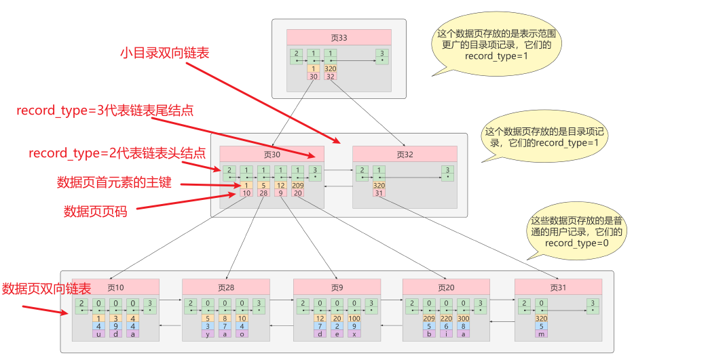
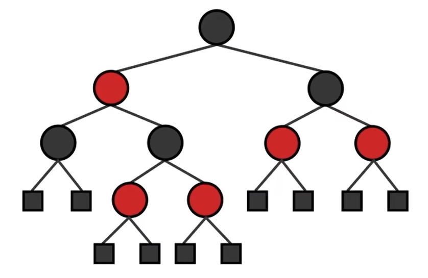
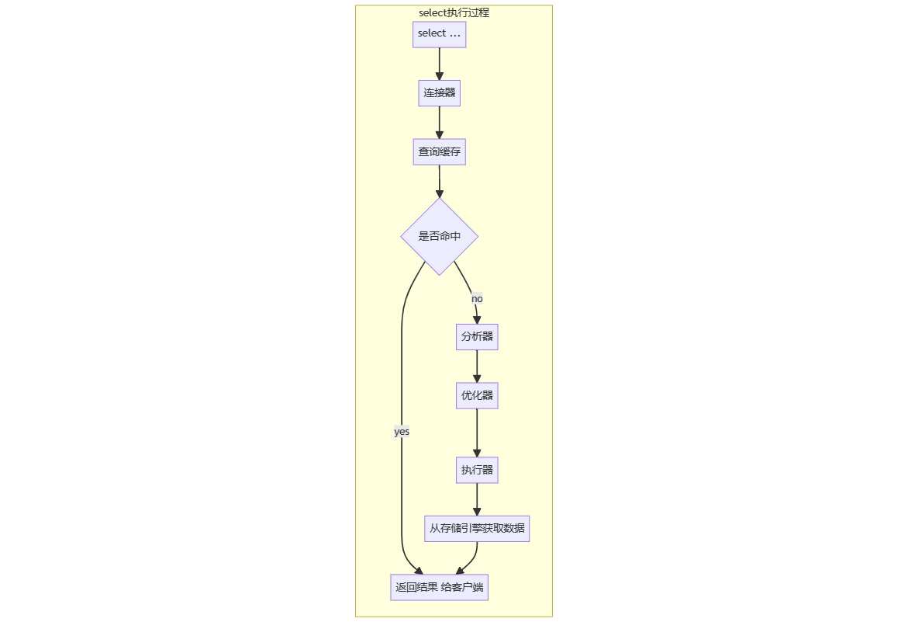
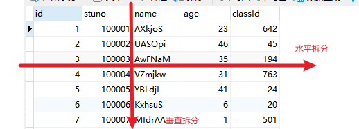

>  **导航：** 
>
> [【Java笔记+踩坑汇总】Java基础+JavaWeb+SSM+SpringBoot+SpringCloud+瑞吉外卖/谷粒商城/学成在线+设计模式+面试题汇总+性能调优/架构设计+源码解析](https://blog.csdn.net/qq_40991313/article/details/126646289?csdn_share_tail={"type"%3A"blog"%2C"rType"%3A"article"%2C"rId"%3A"126646289"%2C"source"%3A"qq_40991313"})

[TOC]


## 1、请你说说MySQL索引,以及它们的好处和坏处

> **得分点**
>
> 检索效率、磁盘资源、维护索引对性能的影响、最左前缀原则、三种索引介绍和区别

索引是一种用于**快速查询的排好序的**数据结构，索引是存储引擎实现的，不同索引的存储引擎不一定相同。

**优点：**

- 查询效率高，磁盘I/O次数低（B+树IO次数只有3~4次）；
- 每行数据索引唯一；
- 联合、分组、排序查询效率高；

**缺点：**

- 创建索引耗费时间；
- 维护索引耗费时间，每次增删改时要维护索引；
- 索引占用磁盘空间，索引文件可能比数据文件更占空间。例如innoDB的1个聚簇索引和多个非聚簇索引加起来肯定比原数据文件占的内存多。索引存在磁盘，可以分段加载数据页到内层。
- 联合索引查询时，没有遵循最左前缀原则将会导致索引不起作用，从而出现严重的性能问题。

**3层B+树存储记录量计算：**

MySQL数据库使用的索引底层是B+树，只需要3~4次IO。 InnoDB 页的大小默认16KB，数据页每个元素有数据域、指针域、record_type，目录页每个元素有主键、页码、指针域、record_type。

假设表里有8个INT型字段，INT型字段和指针都占4个字节，record_type算上4字节，每个数据页能存16000/(4*10)=400条记录，每个目录页能存16000/(4*4)=1000条记录。

根据B+树非叶节点孩子数等于记录数的特点，2层B+树能存1000*400=40,000条数据，3层B+树能存1000*1000*400=400,000,000条数据。也就是大约4亿条记录。每条记录占的空间大上100倍，也能存四百万条数据，4层B+树就能稳稳地存千万条数据了。

**innoDB索引按存储方式可以分为：**聚集索引、二级索引、联合索引（严格说是二级索引）。

**聚集索引：**索引即数据（因为记录就存在B+树叶节点），数据即索引。 

- 数据访问更快（因为索引和数据保存在同一个B+树）；
- 排序查找和范围查找很快（因为叶节点之间由双向链表链接）；
- 分段加载，节省内存；**分段加载：**将整个B+树划分成若干个段，每个段包含多个数据页。在查询过程中，只需要将当前需要查询的节点所在的段加载到内存中，而不必将整棵树都加载到内存中，从而减少内存的占用和I/O操作次数。
- 建议主键短、自增、不可更新，从而提高效率；

**非聚簇索引（辅助、二级索引）：**B+树叶节点只存查询字段的值和主键的值，通过主键值回表查聚集索引。

**联合索引：**同时为多个列建立非聚簇索引。先按c2字段排序，c2字段相同时按c3字段排序。

**聚簇索引和非聚簇索引区别**

- **叶节点：**聚簇索引叶子节点存记录，非聚簇索引叶子节点存数据位置 。非聚簇索引不会影响数据表的物理存储顺序。
- **数量限制：**一个表只能有一个聚簇索引，因为只能有一种排序存储的方式，但可以有多个非聚簇索引，也就是多个索引目录提供数据检索。
- **效率：**考虑回表的话，聚簇索引查询效率高；覆盖索引等不回表的情况下，非聚簇索引查询效率高，因为空间小，加载内存快。增删改时非聚簇索引效率高。因为聚簇索引存的完整记录，移动起来慢。像统计COUNT(*)查询优化器就是选用空间最小的二级索引树统计的。


> **标准回答**
>
> 在关系数据库中，索引是一种单独的、物理的对数据库表中一**列**或多列的值进行**排序**的一种存储结构，它是某个表中一列或若干列值的集合和相应的指向表中物理标识这些值的数据页的**逻辑指针**清单。索引的作用相当于图书的目录，可以根据目录中的页码快速找到所需的内容。
>
> 在**表中建立索引**，然后在索引中找到符合查询条件的索引值，最后通过保存在索引中的ROWID（相当于页码）快速找到表中对应的记录。
>
> 索引就像指向表行的指针，是一种允许查询操作快速确定哪些行符合WHERE子句中的条件，并检索到这些行的其他列值的**数据结构**；
>
> 索引主要有普通索引、唯一索引、主键索引、外键索引、全文索引、复合索引几种；
>
> 在大数据量的查询中，合理使用索引的优点非常明显，不仅能大幅提高匹配where条件的检索效率，还能用于排序和分组操作的加速。
>
> 当时索引如果使用不当也有比较大的坏处：比如索引必定会**增加存储资源的消耗**；同时也增大了插入、更新和删除操作的**维护成本**，因为每个增删改操作后相应列的索引都必须被更新。
>
> **加分回答-只要创建了索引，就一定会走索引吗？**
>
> 不一定。比如，在使用**组合索引**的时候，如果没有遵从**“最左前缀”的原则**进行搜索，则索引是不起作用的。
>
> **最左前缀原则：**指的是由多个列组成的**联合索引，在查询时只会对最左边使用的几个列进行索引查询**。具体来说，如果索引键包含A、B、C三个列，而查询语句仅使用了A和B列，则最左前缀的原则会指导MySQL只使用A、B两列进行索引搜索，而不会使用C列。
>
> 当使用“最左前缀”原则时，指定的**列的顺序非常重要**。如果指定的列顺序不正确，就无法利用索引进行查询，会产生全表扫描的情况，这会造成非常严重的性能问题。
>
> 举例，假设在id、name、age字段上已经成功建立了一个名为MultiIdx的组合索引。索引行中按id、name、age的顺序存放，索引可以搜索id、（id，name）、（id，name，age）字段组合。如果列不构成索引最左面的前缀，那么MySQL不能使用局部索引，如（age）或者（name，age）组合则不能使用该索引查询。
>
> 


## 2、请你说说MySQL的索引是什么结构,为什么不用哈希表

> **得分点**
>
> B+树、自适应的哈希、内存耗费

MySQL中的索引是B+树结构，可以分段加载节点数据，省内存，查询效率也高。

**分段加载：**将整个B+树划分成若干个段，每个段包含多个数据页。在查询过程中，只需要将当前需要查询的节点所在的段加载到内存中，而不必将整棵树都加载到内存中，从而减少内存的占用和I/O操作次数。 

**自适应的哈希：**InnoDB底层索引是B+树，但他支持自适应的哈希索引。对于经常被访问的数据，MySQL会把经常被访问数据的数据页地址存到哈希表里，这样下次再查到这个热点数据就会直接从哈希表找，提高查询效率；

**不用哈希表的原因：**

- 哈希表耗费内存，要求把所有数据载入内存，而数据库存储量很大，放不到内存。 
- 哈希表只适合等值匹配，不支持范围查询、排序查询；

> **标准回答**
>
> MySQL中的索引**B+树**实现的；
>
> 哈希表的查询效率的确最高，时间复杂度O(1)，但是它要求将所有数据载入内存，而数据库存储的数据量级可能会非常大，全部载入内存基本上是不可能实现的；
>
> B+树可以**分段加载**需要的节点数据，可以在内存资源有限的前提下，极大提高**查询效率**。
>
> **分段加载：**将整个B+树划分成若干个段，每个段包含多个数据页。在查询过程中，只需要将当前需要查询的节点所在的段加载到内存中，而不必将整棵树都加载到内存中，从而减少内存的占用和I/O操作次数。


## 3、请你说说数据库索引的底层数据结构

> **得分点**
>
> 介绍并比较优缺点、二叉树、红黑树、哈希表、B树、B+树

数据库（不单指MySQL）索引可选的底层数据机构包括：

**- 二叉树：**某些场景下会退化成链表，查询慢；

**- 红黑树：**红黑树是二叉树，索引树层数会很高，查询次数和IO不如B+树；

**- Hash表：**增删改查时间复杂度O（1），但①太占空间，②难以排序、范围查询，③无法对单独一个字段索引，④重复值多时处理冲突耗费性能和IO；

**- B-Tree：**多路平衡查找树，非叶节点也存数据，左小右大，一般层数比B+树深，查询速度和IO次数也就不如B+树；可以分段加载节点数据。

**- B+Tree：**多路平衡查找树，非叶节点存目录，叶节点存记录。查询效率更高（比B树矮胖，层数很难超过4层），IO次数也少（很难超过3次），更稳定，范围查询效率高（因为叶节点之间由双向链表链接）。可以分段加载节点数据。

> **标准答案**
>
> 数据库（不单指MySQL）索引可选的底层数据机构包括：
>
> **- 二叉树**
>
> **- 红黑树**
>
> **- Hash表**
>
> **- B-Tree**
>
> 但**mysql索引的底层**用的并**不是二叉树和红黑树**。因为二叉树和红黑树在某些场景下都会暴露出一些缺陷。
>
> 首先，**二叉树**在某些场景下会**退化成链表**，而链表的查找需要从头部开始遍历，而这就失去了加索引的意义。
>
> 不使用红黑树的原因是：**红黑树**作为底层数据结构在面对在些表数据动辄数百万数千万的场景时，会导致**索引树的层数很高**。索引从根节点开始查找，而如果我们需要查找的数据在底层的叶子节点上，那么树的高度是多少，就要进行多少次查找，数据存在磁盘上，访问需要进行磁盘IO，这会导致效率过低；
>
> 而**B+树**由B树和索引顺序访问方法演化而来，它是为磁盘或其他直接存取辅助设备设计的一种**平衡查找树**，在B+树中，所有**记录节点**都是按键值的大小顺序存放在**同一层的叶子节点**，**各叶子节点通过指针进行链接**。
>
> B+树索引在数据库中的一个特点就是高扇出性，例如在**InnoDB**存储引擎中，**每个页**的大小为**16KB**。在数据库中，B+树的高度一般都在2～4层，这意味着查找某一键值最多只需要2到4次IO操作，这还不错。因为现在一般的磁盘每秒至少可以做100次IO操作，2～4次的IO操作意味着查询时间只需0.02～0.04秒。
>
> 
>
> **为什么B+树的高度一般不会超过4层：**
>
> 真实一个数据页可以存100条记录， 一个目录页能存1000条数据；4层B+树能存一千万条数据，我们用到的B+树都不会超过4层，每个页内部可以用二分查找更快查找。
>
> InnoDB非聚簇索引情况：
>
> InnoDB **页的大小为 16KB**，一般表的**主键**类型为 INT(占用4个字节)或 **BIGINT** (占用**8个字节**)，**指针类型**也一般为4或**8个字节**，也就是说一个页 (B+Tree 中的一个节点)中大概存储**16KB/(8B+8B)=1K个键值** (因为是估值，为方便计算，这里的K取值为 10^3。也就是说一个**深度为3**的B+Tree 索引可以维护 10^3*10^3*10^3= **1 亿条记录**(这里假定一个数据页也存储10A3条行记录数据了)
>
> 实际情况中每个节点可能不能填充满，因此在数据库中，**B+Tree 的高度一般都在** **2~4 层**。MySQL的lnnoDB 存储引擎在设计时是将根节点常驻内存的，也就是说查找某一键值的行记录时最多只需要 **2~4**  次磁盘IO操作。
>
> **数据页大小：**
>
> MyISAM 的数据页大小是固定的，是 1KB，也就是说，MyISAM 存储引擎的数据都是以 1KB 的块进行管理的。
>
> InnoDB 存储引擎的数据页大小是可调的，默认是 16KB。在 MySQL 5.7 版本之前，InnoDB 的数据页大小默认是 8KB。可以通过参数 `innodb_page_size` 来设置 InnoDB 的数据页大小，取值范围是 4KB、8KB、16KB 和 32KB。


## 4、请你讲讲B树和B+树

> **得分点**
>
> 平衡多路查找树、记录存储位置、非叶节点存储内容、叶节点关系、查询性能和IO次数

**1. 非叶节点的值数量和孩子数量：**k阶树，B+树非叶节点有k个值、k个孩子，B树非叶节点有k-1个值、k个孩子；

**2. 记录存储位置：**B+树记录全存在叶节点，B树记录存在所有节点；

**3. 非叶节点存储内容****：**B+树非叶节点存索引，B树非叶节点存记录；

**4. 叶子结点之间关系：**B+树所有叶子节点构成一个有序双向链表；B树叶节点之间没指针，只是有序；

**查询性能：**B+树查询效率更高（比B树矮胖，层数很难超过4层），IO次数也少（很难超过3次），更稳定，范围查询效率高（因为叶节点之间由双向链表链接）。

而B树查询效率不稳定（每一层都存数据，不知道何时命中），IO次数多（非叶节点存数据导致树变瘦高），范围查询效率低（只能通过遍历进行范围查询）

B树和B+树都可以分段加载节点数据。


> **标准回答**
>
> 它们都是**平衡多路查找树**，是在**二叉查找树**基础上的**改进**数据结构。在二叉查找树上查找一个数据时，最坏情况的查找次数为树的深度，当数据量很大时，查询次数可能还是很大，造成大量的磁盘IO，从而影响查询效率；
>
> 为了减少磁盘IO的次数，必须降低树的深度，因此在二叉查找树基础上将树改成了多叉加上一些限制条件，就形成了B树；
>
> B+树是B树的变种，区别主要是：对于**k阶的B树**，每个中间节点只存**k-1个值**、k个指针（是那k-1个值的范围），而**B+树存k个值**和k个指针；**B树**中**所有节点**中值的总集是**全部关键字**集合，而**B+树**中所有**叶子节点值**的总集就是**全部关键字**集合；B+树为所有**叶子节点增加了链接**，从而实现了快速的范围查找；
>
> **加分回答-B+树优点**
>
> B+树由B树和索引顺序访问方法演化而来，它是为磁盘或其他直接存取辅助设备设计的一种平衡查找树，在**B+树**中，所有**记录节点**都是按键值的大小顺序存放在同一层的**叶子节点**，**各叶子节点通过指针进行链接**。
>
> B+树索引在数据库中的一个特点就是**高扇出性**，例如在InnoDB存储引擎中，每个页的大小为16KB。在数据库中，B+树的高度一般都在**2～4层**，这意味着查找某一键值**最多只需要1到3次IO**操作（（根节点被缓存，不算IO次数））。因为现在一般的磁盘每秒至少可以做100次IO操作，2～4次的IO操作意味着查询时间只需0.02～0.04秒。


## 5、数据库为什么不用红黑树而用B+树？

> **得分点**
>
> 介绍红黑树和B+树、叉数、高度、查询性能、磁盘IO次数、范围查询、分段加载数据

因为B+树是多叉，红黑树是二叉，B+树更矮胖，查询性能更高，IO次数更少。

B+树是多路平衡查找树，非叶节点存目录，叶节点存记录。查询效率更高（比B树矮胖，层数很难超过4层），IO次数也少（很难超过3次），更稳定，范围查询效率高（因为叶节点之间由双向链表链接）。 可以分段加载节点数据。 

**m阶B+树：**

- 每个非叶节点关键字个数和孩子个数相等；
- 根结点关键字个数2到m，非跟结点关键字个数⌈m/2⌉到m；
- 所有叶子在同一层；

**红黑树：** 近似平衡二叉树**，**左右子树高差有可能大于 1，查找效率略低于平衡二叉树，但增删效率高于平衡二叉树，适合频繁插入删除。

- 结点非黑即红；
- 根结点是黑色，叶节点是黑色空节点（常省略）；
- 任何相邻节点不能同时为红色；
- 从任一结点到其每个叶子的所有路径都包含相同数目的黑色结点；
- 查询性能稳定O(logN)，高度最高2log(n+1)；

> **标准回答**
>
> 首先，**红黑树**是一种**近似平衡二叉树**（不完全平衡），结点非黑即红的树，它的树高最高不会超过 2*log(n)，因此查找的时间复杂度为 O(log(n))，无论是**增删改查**，它的**性能都十分稳定**；
>
> 但是，红黑树**本质还是二叉树**，在数据量非常大时，需要访问+判断的节点数还是会比较多，同时数据是存在磁盘上的，访问需要进行磁盘**IO**，导致**效率较低**；
>
> 而**B+树是多叉**的，可以有效减少磁盘IO次数；同时B+树增加了叶子结点间的连接，能保证范围查询时找到起点和终点后快速取出需要的数据。
>
> **加分回答-红黑树做索引底层数据结构的缺陷**
>
> 试想一下，以红黑树作为底层数据结构在面对在些表数据动辄数百万数千万的场景时，创建的索引它的树高得有多高？
>
> 索引从根节点开始查找，而如果我们需要查找的数据在底层的叶子节点上，那么树的高度是多少，就要进行多少次查找，数据存在磁盘上，访问需要进行磁盘IO，这会导致效率过低；
>
> 那么**红黑树**作为索引数据结构的弊端即是：树的**高度过高**导致查询效率变慢。
>
> 


## 6、请你说说索引怎么实现的B+树,为什么选这个数据结构？

> **得分点**
>
> B+树、查询效率、IO次数、范围排序查询、分段加载数据页

**B+树：**

B+树是多路平衡查找树，非叶节点存目录，叶节点存记录。

**为什么选B+树？**

查询效率更高（层数很难超过4层），IO次数也少（很难超过3次），更稳定，范围、排序查询效率高（因为叶节点之间由双向链表链接）。可以分段加载节点数据。 

**m阶B+树：**

- 每个非叶节点关键字个数和孩子个数相等；
- 根结点关键字个数2到m，非跟结点关键字个数⌈m/2⌉到m；
- 所有叶子在同一层；


 

> **标准回答**
>
> 索引本质上就是通过**预排序+树型结构**来加快检索的效率，而MySQL中使用InnoDB和MyISAM引擎时都使用了B+树实现索引。
>
> 它是一棵**平衡多路查找树**，是在二叉查找树基础上的改进数据结构。在二叉查找树上查找一个数据时，最坏情况的查找次数为树的深度，当数据量很大时，查询次数可能还是很大，造成大量的磁盘IO，从而影响查询效率；
>
> 为了减少磁盘IO的次数，必须降低树的深度，因此在二叉查找树基础上将树改成了多叉加上一些限制条件，就形成了B树；
>
> B+树中所有叶子节点值的总集就是全部关键字集合；B+树为所有叶子节点增加了链接，从而实现了快速的范围查找；
>
> 在B+树中，所有记录节点都是按键值的大小顺序存放在同一层的叶子节点上，由各叶子节点指针进行连接。在数据库中，B+树的高度一般都在2～4层，这也就是说查找某一键值的行记录时最多只需要2到4次IO。这很不错，因为当前一般的**机械磁盘每秒**至少可以做**100次IO**，2～4次的IO意味着查询时间只需**0.02～0.04秒**。
>
> 在数据库中，B+树索引还可以分为**聚集索引和辅助索引**，但不管是聚集索引还是辅助索引，其内部都是B+树的，即高度平衡的，叶子节点存放着所有的数据。聚集索引与辅助索引不同的是，叶子节点存放的是否是一整行的信息。


## 7、请你说说聚簇索引和非聚簇索引

> **得分点**
>
> 介绍、区别、叶节点、数量、效率、回表

**innoDB索引按存储方式可以分为：**聚集索引、二级索引、联合索引（严格说是二级索引）。

**聚集索引：**索引即数据（因为记录就存在B+树叶节点），数据即索引。 

- 数据访问更快（因为索引和数据保存在同一个B+树）；
- 排序查找和范围查找很快（因为叶节点之间由双向链表链接）；
- 分段加载，节省内存；
- 建议主键短、自增、不可更新，从而提高效率；

**非聚簇索引（辅助、二级索引）：**B+树叶节点只存查询字段的值和主键的值，通过主键值回表查聚集索引。

**联合索引：**同时为多个列建立非聚簇索引。先按c2字段排序，c2字段相同时按c3字段排序。

**聚簇索引和非聚簇索引区别**

- **叶节点：**聚簇索引叶子节点存记录，非聚簇索引叶子节点存数据位置 。非聚簇索引不会影响数据表的物理存储顺序。
- **数量：**一个表只能有一个聚簇索引，因为只能有一种排序存储的方式，但可以有多个非聚簇索引，也就是多个索引目录提供数据检索。
- **效率：**使用聚簇索引的时候，数据的查询效率高 ，但如果对数据进行插入，删除，更新等操作，效率会比非聚簇索引低。因为聚簇索引存的完整记录，移动起来慢。

> **标准回答**
>
> 两者主要区别是数据和索引是否分离。聚簇索引是将数据与索引存储到一起，找到索引也就找到了数据；而非聚簇索引是将数据和索引存储分离开，索引树的叶子节点存储了数据行的地址。
>
> 在InnoDB中，一个表有且仅有一个聚簇索引（因为原始数据只留一份，而数据和聚簇索引在一起），并且该索引是建立在主键上的，即使没有指定主键，也会特殊处理生成一个聚簇索引；其他索引都是辅助索引，使用辅助索引访问索引外的其他字段时都需要进行二次查找。
>
> 而在MyISAM中，所有索引都是非聚簇索引，叶子节点存储着数据的地址，对于主键索引和普通索引在存储上没有区别。
>
> **加分回答**
>
> 在**InnoDB**存储引擎中，可以将B+树索引分为聚簇索引和辅助索引（非聚簇索引）。无论是何种索引，**每个页**的大小都为**16KB**，且不能更改。
>
> 聚簇索引是根据主键创建的一棵B+树，聚簇索引的叶子节点存放了表中的所有记录。辅助索引是根据索引键创建的一棵B+树，与聚簇索引不同的是，其叶子节点仅存放索引键值，以及该索引键值指向的主键。也就是说，如果通过辅助索引来查找数据，那么当找到辅助索引的叶子节点后，很有可能还需要根据主键值查找聚簇索引来得到数据，这种查找方式又被称为书签查找。因为辅助索引不包含行记录的所有数据，这就意味着每页可以存放更多的键值，因此其高度一般都要小于聚簇索引。

## 8、请你说说数据库引擎有哪些,各自有什么区别

> **得分点**
>
> InnoDB、MyISAM，外键、事务、高并发、锁级别、内存要求、磁盘耗费、查询性能、增删改性能

**InnoDB：**支持外键和事务，行锁适合高并发，缓存索引和数据，内存要求高（因为要缓存索引和记录），适合存大数据量，增删改性能更优（行级锁高并发），耗费磁盘（因为有多个非聚簇索引，索引可能比记录空间还大）。数据页5.7版本之前默认8KB，5.7版本及之后默认16KB，可调整。

**MyISAM：**不支持外键和事务，表锁不适合高并发，缓存索引和数据地址，内存要求低（因为不用缓存记录），查询性能更优（因为查询时InnoDB要维护MVCC，而且多缓存了记录），节省磁盘（因为磁盘不存完整记录）。数据页只能1KB。

**Memory：** 

- **基于内存、不持久化：**数据存储在内存 ，查询速度比MyISAM快一个数量级 ，缺点是数据量太大时会内存溢出，并且数据是临时的，当mysqld守护进程崩溃的时候数据会丢失 。
- **数据类型必须固定长度：**要求存储的数据是数据长度不变的格式，比如，Blob和Text类型的数据不可用(长度不固定的)。
- **支持哈希索引：**支持哈希（HASH）索引 和 B+树索引
- **表的大小受限制：**适用于小数据量频繁访问的数据。表的大小主要取决于两个参数，分别是 max_rows 和 max_heap_table_size 。其中，max_rows可以在创建表时指定；max_heap_table_size的大小默认为16MB，可以按需要进行扩大。
- **数据文件与索引文件分开存储。**
- **适用存储经常访问的临时数据：**想用的时候能立刻用到，丢了也没太大关系。有条件的话建议使用Redis缓存。

> **标准回答**
>
> InnoDB 引擎是 MySQL 的事务安全（ACID 兼容）存储引擎，具有提交、回滚和崩溃恢复功能来保护用户数据；行级锁定读取增加了多用户并发性和性能；将用户数据存储在聚集索引中，以减少基于主键的常见查询的 I/O；还支持 FOREIGN KEY 维护数据完整性。
>
> MyISAM引擎的表占用空间较小，表级锁定限制了读/写工作负载的性能，因此它通常用于只读或以读取为主的场景。
>
> Memory引擎是将所有数据存储在 RAM 中，以便在需要快速查找非关键数据的环境中进行快速访问，以前被称为 HEAP 引擎。
>
> Archive引擎非常适合存储大量的独立的，作为历史记录的数据，因为它们不经常被读取。它 拥有高效的插入速度，但其对查询的支持相对较差。
>
> Cluster/NDB是高冗余的存储引擎，用多台数据机器联合提供服务以提高整体性能和安全性。适合数据量大，安全和性能要求高的应用。
>
> Federated引擎提供连接单独的 MySQL 服务器，从多个物理服务器创建一个逻辑数据库的能力，非常适合分布式或数据集市环境。

> **标准回答2**
>
> InnoDB是具有事务、回滚和崩溃修复能力的事务安全型引擎，它可以实现行级锁来保证高性能的大量数据中的并发操作；MyISAM是具有默认支持全文索引、压缩功能及较高查询性能的非事务性引擎。具体来说，可以在以下角度上形成对比：
>
> 事务：InnoDB支持事务；MyISAM不支持。
>
> 数据锁：InnoDB支持行级锁；MyISAM只支持表级锁。
>
> **读写性能：**InnoDB增删改性能更优（行级锁高并发）；MyISAM查询性能更优。
>
> **全文索引：**InnoDB不支持（但可通过插件等方式支持）；MyISAM默认支持。
>
> **外键：**InnoDB支持外键；MyISAM不支持。
>
> **存储结构：**InnoDB在磁盘存储为一个文件；MyISAM在磁盘上存储成三个文件（表定义、数据、索引）。
>
> **存储空间：**InnoDB需要更多的内存和存储；MyISAM支持支持三种不同的存储格式：静态表(默认)、动态表、压缩表。
>
> 移植：InnoDB在数据量小时可通过拷贝数据文件、备份binlog、mysqldump工具移植，数据量大时比较麻烦；可单独对某个表通过拷贝表文件移植。
>
> **崩溃恢复：**InnoDB有崩溃恢复机制；MyISAM没有。
>
> **默认推荐：**InnoDB是MySQL5.5之后的默认引擎。
>
> **加分回答-InnoDB中行级锁是怎么实现的？**
>
> InnoDB行级锁是通过给索引上的**索引项加锁**来实现的。只有通过索引条件检索数据，InnoDB才使用行级锁，否则，InnoDB将使用表锁。
>
> 当表中锁定其中的某几行时，不同的事务可以使用不同的索引锁定不同的行。另外，不论使用主键索引、唯一索引还是普通索引，InnoDB都会使用行锁来对数据加锁。


## 9、请你说说InnoDB的MVCC

> **得分点**
>
> 概念、三剑客、流程、读提交和可重复读MVCC原理

**MVCC：**多版本并发控制，通过管理记录的多个版本，实现了数据库事务并发时的一致性读，即当前事务读取正在被其他事务更新的行时，能读到该记录被更新之前的版本。解决了读写冲突，解决了可重复读的幻读问题。

**MVCC三剑客：**隐藏字段、Undo Log、Read View。

**隐藏字段：**innoDB聚簇索引叶节点记录有两个隐藏字段，trx_id和roll_pointer。

- **trx_id：**事务id。事务修改记录时会将事务id写在trx_id列。
- **roll_pointer：**回滚指针。指向回滚日志里该记录版本链的最近结点。用于找到回滚日志里该记录被事务修改前的版本。

**Undo Log回滚日志：**存储各记录的版本链，用于回滚和存档。记录的一个版本就是版本链的一个结点，每个结点的数据域是整个记录，指针域指向上个版本的结点。首结点是最近记录。

**Read View：**事务快照读时生成的数据系统读视图，记录并维护当前活跃事务（启动了还没提交）的id列表和最小id等属性。事务id是按创建时间递增的。

- creator_trx_id ：创建这个读视图的事务的 ID。增删改事务才有资格分配id，读事务id为0.
- trx_ids：表示在生成ReadView时当前系统中活跃的读写事务的事务id列表 。
- up_limit_id：记录活跃事务列表中最小的事务ID。最小即最早。
- low_limit_id：表示生成ReadView时系统中应该分配给下一个事务的 id 值。将是列表里最大id。

**快照读和当前读：**

- **快照读：**不加锁的简单select语句，可能读到旧版本数据。
- **当前读：**加锁的查询语句，读时加锁禁止其他线程更新，读到的一定是最新版本数据

**Read View的规则，即可见性算法：**

通过读视图，可以判断当前查询中，记录的某个版本是否可见。

判断方法是比较该版本的trx_id和读视图里的活跃事务id，如果该版本trx_id小于读视图的最小事务id，则代表那个版本是生成读视图之前的已提交版本，当前查询就可以访问那个版本。

**MVCC流程：**查询，生成读视图，用读视图的最小活跃事务id依次对比各版本的事务id，找到符合规则的版本。

**应用：** 事务隔离级别里的读提交和可重复读底层是由MVCC实现的。并且MySQL InnoDB 引擎的可重复读解决了幻读问题。其中快照读由MVCC解决，当前读通过临键锁解决。**临键锁：**本质上是记录锁+间隙锁，既锁住记录又锁住该记录左开右闭区间的数据。只在非唯一索引的索引列中存在（唯一索引列不存在临键锁）  

**读提交的MVCC原理：**事务每次读到的都是最新已提交的数据。**每次读取数据前都生成一个ReadView。**快照读生成Read View，不断对比版本链各版本的trx_id，直到发现某版本trx_id比Read View的活跃事务列表里最小trx_id还小，该版本则是快照读前最新已提交的数据。

**可重复读的MVCC原理：**只在**第一次查询时生成ReadView**，之后查询用第一次快照读时生成的ReadView，不断对比版本链各版本的trx_id，直到发现某版本trx_id比Read View的活跃事务列表里最小trx_id还小，该版本则是第一次查询前最新已提交的数据。。


> **标准回答**
>
> 全称 Multi-Version Concurrency Control ，即**多版本并发控制**，逻辑是**维持一个数据的多个版本**，使得**读写操作没有冲突**。MVCC主要是为了**提高数据库并发性能**，用更好的方式去处理读-写冲突，做到即使有**读写冲突时**，也能做到不加锁，**非阻塞并发读**。
>
> 它是一种**用来解决读-写冲突的无锁并发控制机制**。在并发读写数据库时，可以做到在读操作时不用阻塞写操作，写操作也不用阻塞读操作，提高了数据库**并发读写**的性能，还可以解决脏读、幻读、不可重复读等事务隔离问题，但不能解决更新丢失问题。
>
> **加分回答-三剑客**
>
> InnoDB默认的隔离级别是RR（REPEATABLE READ），RR解决脏读、不可重复读、幻读等问题，使用的是MVCC。MVCC全称Multi-Version Concurrency Control，即多版本的并发控制协议。它最大的优点是**读不加锁**，因此读写不冲突，并发性能好。InnoDB实现MVCC，多个版本的数据可以共存，主要基于以下技术及数据结构：
>
> 1. 隐藏列：InnoDB中每行数据都有隐藏列，隐藏列中包含了本行数据的事务id、指向undo log的指针等。
> 2. 基于undo log的版本链：每行数据的隐藏列中包含了指向undo log的指针，而每条undo log也会指向更早版本的undo log，从而形成一条版本链。
> 3. ReadView：通过隐藏列和版本链，MySQL可以将数据恢复到指定版本。但是具体要恢复到哪个版本，则需要根据ReadView来确定。所谓ReadView，是指事务（记做事务A）在某一时刻给整个事务系统（trx_sys）打快照，之后再进行读操作时，会将读取到的数据中的事务id与trx_sys快照比较，从而判断数据对该ReadView是否可见，即对事务A是否可见。


## 10、请你说说乐观锁和悲观锁

> **得分点**
>
> 定义、乐观锁三种实现方式、使用场景

MySQL数据库的锁机制主要有两种：乐观锁和悲观锁。 

**乐观锁（非阻塞同步锁）：**每次拿数据时候乐观地认为别人不会改这个数据，更新时再判断锁。因为读的时候不判断锁，所以读效率高；因为更新时才判断锁所以也不会死锁。

**实现方式：**版本号机制、时间戳机制、CAS机制。

版本号机制：表中有一个version字段， 读时取version字段，更新时如果发现版本号没变就给版本号加一并更新，如果发现版本号变了就拒绝更新。

时间戳机制：表中有一个时间戳字段，更新时对比时间戳得知是否被更改。

CAS机制：使用像compare and swap这样的原子操作来不断尝试修改记录，如果数据没有被其他线程修改则会更新成功，否则需重试。

**应用场景：** 

git等版本控制工具是悲观锁，在pull到push期间如果别人已经push过，那么我会push失败。

库存多、高并发的秒杀场景适合用乐观锁，为防止主从同步出错要强制从主机查数据。在提交订单业务的最后一步查库存余量。

**悲观锁（阻塞同步锁）：**每次拿数据时候悲观地认为别人正在改这个数据，拿数据时候就判断锁，拿到锁后阻塞其他线程。因为阻塞所以并发差（特别是长事务）、可能死锁。因为阻塞所以有排他性，精度高。

库存少、低并发、高价格、高精度的秒杀场景适合用悲观锁。订单业务刚开始查库存的时候就加锁，然后生成订单，减库存，释放锁。

> **标准回答**
>
> **乐观锁：**乐观锁总是假设最好的情况，每次去**拿数据**的时候都**认为别人不会修改**，所以不会上锁，但是在**更新的时候会判断**一下在此**期间**别人有没有去**更新**这个数据，可以使用**版本号机制和CAS**算法实现。乐观锁**适用于多读**的应用类型，这样可以提高吞吐量（单位时间内完成的任务、处理的数据量、传输的信息量等），像数据库提供的类似于write_condition机制，其实都是提供的乐观锁。
>
> ```sql
> UPDATE ... SET version=version+1 WHERE version=${version};
> ```
>
> 
>
> **悲观锁：**悲观锁总是**假设最坏的情况**，每次去拿数据的时候都**认为别人会修改**，所以每次在拿数据的时候都会上锁，这样别人想拿这个数据就会阻塞直到它拿到锁（共享资源每次只给一个线程使用，其它线程阻塞，用完后再把资源转让给其它线程）。传统的关系型数据库里边就用到了很多这种锁机制，比如**行锁，表锁等，读锁，写锁**等，都是在**做操作之前先上锁**。
>
> **加分回答-两种锁的使用场景**
>
> **乐观锁：**
>
> **GIT**，SVN，CVS等代码版本控制管理器，就是一个乐观锁使用很好的场景，例如：A、B程序员，同时从SVN服务器上下载了code.html文件，当A完成提交后，此时B再提交，那么会报版本冲突，此时需要B进行版本处理合并后，再提交到服务器。这其实就是乐观锁的实现全过程。如果此时使用的是悲观锁，那么意味者所有程序员都必须一个一个等待操作提交完，才能访问文件，这是难以接受的。
>
> **悲观锁：**
>
> 悲观锁的好处在于可以**减少并发**，但是当并发量非常大的时候，由于锁消耗资源、锁定时间过长等原因，很容易导致系统性能下降，资源消耗严重。因此一般我们可以在**并发量不是很大**，并且出现并发情况导致的异常用户和系统都很难以接受的情况下，会选择悲观锁进行。


## 11、请你说说MySQL事务的原理（ACID）

> **得分点**
>
> 原子性、一致性、隔离性、持久性

一个事务必须满足ACID原理，所以问MySQL事务的原理其实就是问MySQL如何实现ACID的。

数据库的ACID是指事务四个特性：原子性（Atomicity）、一致性（Consistency）、隔离性（Isolation）和持久性（Durability）。

**原子性：**事务的所有操作，要么全部成功，要么全部失败。由undo log（回滚日志）实现。

**一致性：**事务前后，数据库的约束没有被破坏，保持前后一致。由其他三种特性保证。

**隔离性：**操作同一资源的并发事务之间相互隔离，不会互相干扰。

- 读未提交：直接读数据库最新数据，没有原理；
- 读已提交：由MVCC解决脏读问题。
- 可重复读：快照读由MVCC解决幻读问题，当前读由临键锁解决幻读问题。
- 串行化：由共享锁和排它锁解决脏读、不可重复读、幻读问题。

**持久性：**事务的结果最终一定会持久化到数据库，宕机等故障也无法影响。由redo log（重做日志）实现。

**redo log：**每次在缓冲池更新数据前将更新的日志写入redo log buffer，事务提交时根据刷盘策略，将redo log buffer根据刷盘策略刷盘到redo log file或page cache。

故障后通过redo log file恢复数据。日志形式比如页号xxx，偏移量yyy写入了'zzz'数据。

**刷盘策略：**innodb_flush_log_at_trx_commit参数

- **0：事务提交时不刷盘。**主线程每隔1s将redo log buffer写入到page cache，由os决定什么时候写入redo log file，一般是满了时候或者定期写入。
- **1（默认）：事务提交时刷盘。**将redo log buffer刷盘到redo log file
- **2：事务提交时写入文件系统缓存。**将redo log buffer写入到page cache（文件系统缓存），由os决定持久化时间。不推荐，系统宕机后无法恢复。

> **标准回答**
>
> 事务可由一条非常简单的SQL语句组成，也可以由一组复杂的SQL语句组成。在事务中的操作，要么都执行修改，要么都不执行，这就是事务的目的，也是事务模型区别于文件系统的重要特征之一。
>
> 事务需遵循ACID四个特性：
>
> \- A（atomicity），**原子性**。原子性指整个数据库事务是不可分割的工作单位。只有使事务中所有的数据库操作都执行成功，整个事务的执行才算成功。事务中任何一个SQL语句执行失败，那么已经执行成功的SQL语句也必须撤销，数据库状态应该退回到执行事务前的状态。
>
> \- C（consistency），**一致性**。一致性指事务将数据库从一种状态转变为另一种一致的状态。在事务开始之前和事务结束以后，数据库的完整性约束没有被破坏。
>
> \- I（isolation），**隔离性**。事务的隔离性要求每个读写事务的对象与其他事务的操作对象能相互分离，即该事务提交前对其他事务都不可见，这通常使用锁来实现。
>
> \- D（durability） ，**持久性**。事务一旦提交，其结果就是永久性的，即使发生宕机等故障，数据库也能将数据恢复。持久性保证的是事务系统的高可靠性，而不是高可用性。
>
> **加分回答-事务分类**
>
> 事务可以分为以下几种类型：
>
> \- 扁平事务：是事务类型中最简单的一种，而在实际生产环境中，这可能是使用最为频繁的事务。在扁平事务中，所有操作都处于同一层次，其由BEGIN WORK开始，由COMMIT WORK或ROLLBACK WORK结束。处于之间的操作是原子的，要么都执行，要么都回滚。
>
> \- 带有保存点的扁平事务：除了支持扁平事务支持的操作外，允许在事务执行过程中回滚到同一事务中较早的一个状态，这是因为可能某些事务在执行过程中出现的错误并不会对所有的操作都无效，放弃整个事务不合乎要求，开销也太大。保存点（savepoint）用来通知系统应该记住事务当前的状态，以便以后发生错误时，事务能回到该状态。
>
> \- 链事务：可视为保存点模式的一个变种。链事务的思想是：在提交一个事务时，释放不需要的数据对象，将必要的处理上下文隐式地传给下一个要开始的事务。注意，提交事务操作和开始下一个事务操作将合并为一个原子操作。这意味着下一个事务将看到上一个事务的结果，就好像在一个事务中进行的。
>
> \- 嵌套事务：是一个层次结构框架。有一个顶层事务（top-level transaction）控制着各个层次的事务。顶层事务之下嵌套的事务被称为子事务（subtransaction），其控制每一个局部的变换。
>
> \- 分布式事务：通常是一个在分布式环境下运行的扁平事务，因此需要根据数据所在位置访问网络中的不同节点。对于分布式事务，同样需要满足ACID特性，要么都发生，要么都失效。
>
> 对于MySQL的InnoDB存储引擎来说，它支持扁平事务、带有保存点的扁平事务、链事务、分布式事务。对于嵌套事务，MySQL数据库并不是原生的，因此对于有并行事务需求的用户来说MySQL就无能为力了，但是用户可以通过带有保存点的事务来模拟串行的嵌套事务。


## 12、说说MySQL各种锁机制


**innoDB锁场景：**

- **快照读：**不加锁的读。可重复读时由MVCC解决快照读的幻读问题。

- 当前读：

  自己选择加共享锁还是排它锁。可重复读时由临键锁（记录锁+间隙锁，左开右闭）解决当前读的幻读问题。 

  - **加共享锁的当前读：**select ... lock in share mode
  - **加排它锁的当前读：**select ... for update

- **增、删、改：**加排它锁。

**意向锁：**只要表里存在行锁（例如共享锁和排它锁），MySQL就会给这个表自动加意向锁。意向锁是InnoDB自动加的，不需要用户干预。

**MyISAM锁场景：**

- **读：**加表读锁。
- **增、删、改：**加表写锁。

**间隙锁：**用于解决可重复读+当前读+范围查询时，搭配记录锁，形成临键锁，解决幻读问题。例如：

```sql
SELECT * FROM table WHERE column BETWEEN 1 AND 10 FOR UPDATE;
```


> **锁按属性分类：**
>
> - **共享锁（读锁，S）：**多个事务对于同一数据可以共享一把锁，都能访问到数据，但是只能读不能修改。
> - **排它锁（写锁，X）：**在排它锁下，只有一个线程可以读取和修改数据，其他线程不允许访问数据。
>
>  **快照读和当前读：**
>
> - **快照读：**不加锁的简单select语句，可能读到旧版本数据。
> - **当前读：**加锁的查询语句，读时加锁禁止其他线程更新，读到的一定是最新版本数据。根据锁类型加共享锁（lock in share mode）或排它锁（for update）。
>
> ```java
> //对读取的记录加共享锁(S型锁)
> select ... lock in share mode;
> 
> //对读取的记录加独占锁(X型锁)
> select ... for update;
> ```
>
> 
>
>  **锁按粒度分类：**
>
> - **全局锁：**锁整个数据库，包括读锁和写锁。缺点是性能差。使用场景是全库备份、导出。
> - **表锁：**包括表读锁和表写锁。MyISAM读时会加表读锁，写时会加表写锁。优点是开销小、加锁快、不会死锁（本身不会死锁，但多表操作没按顺序会死锁）。缺点是粒度高、并发低。适用于多读少写、经常全表更新、数据量不大的场景。
> - **行锁：**包括读锁、写锁、间隙锁。InnoDB增删改时默认加写锁，查询时默认不加锁，可以指定加行锁（select .. lock in share mode）、写锁(select .. for update)。确定是死锁风险（两个事务互相等待对方释放资源）、锁升级（锁的行多时会升级为表锁）、消耗资源（需要内存存储锁信息、需要cpu加锁解锁）、事务隔离级别没选合适会出现问题。适用于多写、频繁单行操作、短期锁、并发高、复杂事务的场景。
>
> **锁按算法分类：**
>
> - **间隙锁：**间隙锁不仅锁定某行，还锁定该行前后的“间隙”（与相邻行之间的空间），从而防止其他事务插入新数据到该行的前后间隙里，解决并发问题。可以解决可重复读时的幻读问题。
> - **记录锁：**锁定单个记录，包括共享锁和排它锁。
> - **临键锁（Next-Key）：**本质上是记录锁+间隙锁，既锁住记录又锁住该记录**左开右闭**区间的数据。只在非唯一索引的索引列中存在（唯一索引列不存在临键锁）。可重复读隔离级别的幻读问题，快照读由MVCC解决，当前读通过临键锁解决。例如表里三个记录，age字段分别是3,10,12，10这条记录的临键锁区间是(3,10],(10,12]，我们加排他锁查age=10时select ...where age=10 for upadate，其他事务将不能插入age=4的字段，因为4在(3,10]里。解决幻读问题。
>
> **锁按模式分类：**
>
> - 乐观锁
> - 悲观锁
>
> **意向锁：**意向锁本身是**表锁**，用于事务判断当前表有没有行锁。当事务有行锁时，MySQL会自动给全表加意向锁，这样其他事务判断行锁时不需要遍历，只需要直接判断表有没有加意向锁即可。只有意向读锁和读锁之间可以互相兼容。
>
> **锁按状态分类：** 
>
> - **意向共享锁：**该事务有意向对某行数据加共享锁。一个数据行在被添加共享锁之前首先需要获取当前表的意向共享锁
> - **意向排它锁：**该事务有意向对某行数据进行写操作。一个数据行在被添加排它锁之前首先需要获取当前表的意向排它锁
>
> | 锁类型    | IS(意向共享锁) | IX(意向排他锁) |
> | --------- | -------------- | -------------- |
> | S(共享锁) | 兼容           | 互斥           |
> | X(排他锁) | 互斥           | 互斥           |


## 13、请你说说MySQL的事务隔离级别

> **得分点**
>
> 隔离级别概念、三种读问题、四种隔离级别的特点、底层、解决读问题

事务隔离级别是指操作同一资源的并发事务之间的隔离度。隔离级别越高，事务之间的相互干扰就越小，安全性就越高。

**读问题：**

- **脏读：**读到了脏数据。当前事务读到另一个未提交事务刚改的数据。只有读未提交会脏读。
- **不可重复读：**前后重复读的数据不一样。前后两次读同数据，这期间数据被其他事务改了，导致前后读取的数据不同。
- **幻读：**前后读的数据是一样，但多了几行或少了几行，像幻觉一样。事务前后读的数据集合不同，导致出现“幻像”行。仅串行化能解决幻读问题。

**事务隔离级别**

- **读未提交：**事务能读到所有未提交事务的数据。压根不加锁、没隔离，性能最高。
- **读提交：**事务能读到已提交事务的数据。底层由MVCC实现，每次快照读都生成读视图 。解决脏读问题。读提交隔离级别，是没有间隙锁的，只有记录锁。
- **可重复读（默认）：**前后读的数据相同。底层由MVCC实现，仅第一次快照读生成读视图。解决脏读、不可重复读问题。MySQL InnoDB 引擎的可重复读解决了幻读问题。快照读由MVCC解决幻读问题，当前读由临键锁（临键锁next key lock=记录锁+间隙锁，左开右闭）解决幻读问题。
- **串行化：**事务一拿到锁阻塞其他事务，直到释放锁。读时共享锁，写时排它锁。阻塞导致性能最差。解决脏读、不可重复读、幻读问题。 

**MVCC：**多版本并发控制。MVCC三剑客：隐藏字段、Undo Log、Read View。

**共享锁（读锁）：**多个事务对于同一数据可以共享一把锁，都能访问到数据，但是只能读不能修改。

**排它锁（写锁）：**在排它锁下，只有一个线程可以读取和修改数据，其他线程不允许访问数据。

> **标准回答** 
>
> SQL 标准定义了四种隔离级别，这四种隔离级别分别是：
>
> \- 读未提交（READ UNCOMMITTED）
>
> \- 读提交 （READ COMMITTED）；
>
> \- 可重复读 （REPEATABLE READ）；
>
> \- 串行化 （SERIALIZABLE）。
>
> 下面是四种隔离级别在解决脏读、不可重复读、幻读问题方面的情况：
>
> | 隔离级别 | 脏读   | 不可重复读 | 幻读   |
> | -------- | ------ | ---------- | ------ |
> | 读未提交 | 存在   | 存在       | 存在   |
> | 读已提交 | 不存在 | 存在       | 存在   |
> | 可重复读 | 不存在 | 不存在     | 存在   |
> | 串行化   | 不存在 | 不存在     | 不存在 |
>
> 脏读（Dirty Read）：指一个事务读取了另一个未提交的事务所写入的数据，如果隔离级别越高，则越不容易出现脏读问题。
>
> 不可重复读（Non-Repeatable Read）：指一个事务在读取同一数据时，由于另外一个事务的修改或删除，导致两次读取的数据不同。如果隔离级别越高，则越不容易出现不可重复读问题。
>
> 幻读（Phantom Read）：指一个事务多次执行同一个查询，但每次返回的数据集合都不同，导致出现“幻像”行。如果隔离级别越高，则越不容易出现幻读问题。
>
> 
>
> **加分回答-锁**
>
> READ UNCOMMITTED**读未提交：**
>
> 它是性能最好、也最野蛮的方式，因为它压根儿就**不加锁**，所以根本谈不上什么隔离效果，可以理解为没有隔离。
>
> **REPEATABLE READ & READ COMMITTED：**
>
> 为了解决不可重复读，MySQL 采用了 **MVCC(多版本并发控制) 的方式**。
>
> 我们在数据库表中看到的**一行记录可能实际上有多个版本**，**每个版本的记录**除了有数据本身外，还要**有一个表示版本的字段**，记为 row trx_id，而这个字段就是使其产生的事务的 id，事务 ID 记为 transaction id，它在事务开始的时候向事务系统申请，按时间先后顺序递增。
>
> **SERIALIZABLE：**
>
> 读的时候加共享锁，其他事务可以并发读，但是不能写。写的时候加排它锁，其他事务不能并发写也不能并发读。


## 14、MySQL主从同步是如何实现的？

> 步骤、延时问题、原理（三个线程）、主从库数量

**主从同步实现步骤：** 

1. **主服务器**把数据更改记录到**二进制日志**（binlog，记录改不记录读，用于数据复制和数据恢复）中；
2. **从服务器**异步近似实时地把主服务器的二进制日志**复制到**自己的**中继日志**（relay log）中；
3. **从服务器重做**中继日志中的操作，把更改应用到自己的数据库上，以达到数据的最终一致性。

**主从同步的延时问题；**

- **延时问题：**是主服务器压力大导致的复制延时问题。

- 解决方案：

  - **网络带宽优化：**如果是网络延时问题，可以通过增大服务器的带宽解决。
  - **硬件调优：**如果是因为硬件配置差导致同步延时，可以通过提升服务器配置解决。

- 参数调优：

  ```bash
  [mysqld]
  # 多线程复制（MySQL 5.7及以上版本）：设置并行线程数
  slave_parallel_workers = 4  
  # 开启半同步复制（MySQL 5.5及以上版本）
  rpl_semi_sync_master_enabled = 1
  rpl_semi_sync_slave_enabled = 1
  # 同步延时时间：1秒超时。如果频繁写，则适当缩小；如果频繁读少写，则适当增大，以降低服务器压力
  rpl_semi_sync_master_timeout = 1000  
  ```

  

  

- **事务粒度缩小：**减小代码中事务的粒度，例如将大事务拆解成小事务，将其中的一些查询操作脱离出去，只在写操作的方法中加事务；

**复制原理：** 

- **主库二进制日志转储线程：**负责将二进制日志发给从库。强制从主库读取数据时（/*master*/ SELECT * FROM user），会给二进制日志**加锁** ，读完解锁。
- **从库I/O 线程：**负责连接主库，并向主库发送请求和复制二进制日志到中继日志。
- **从库SQL 线程：**负责读取并执行中继日志中的更新语句，实现主从同步。 

**主从库数量：** 

- 每个 Master 可以有多个 Slave
- 每个 Slave 只能有一个唯一的服务器ID，只有一个 Master。


> **标准答案**
>
> **复制**（replication）是MySQL数据库提供的一种高可用高性能的解决方案，一般用来建立大型的应用。总体来说，replication的工作原理分为以下3个步骤：
>
> 1.主服务器（master）把数据更改记录到二进制日志（binlog）中。
>
> 2.从服务器（slave）把主服务器的二进制日志复制到自己的中继日志（relay log）中。
>
> 3.从服务器重做中继日志中的事件，把更改应用到自己的数据库上，以达到数据的最终一致性。
>
> 复制的工作原理并不复杂，其实就是一个**完全备份加上二进制日志备份的还原**。不同的是这个二进制日志的还原操作基本上实时在进行中。这里特别需要注意的是，**复制不是完全实时地进行同步，而是异步实时**。这中间存在主从服务器之间的**执行延时**，如果主服务器的压力很大，则可能导致主从服务器延时较大。

## 15、索引失效的11个场景

- **尽量全值匹配：**查询age and classId and name时，(age,classId,name)索引比(age,classId)快。
- **考虑最左前缀：**联合索引把频繁查询的列放左。索引（a,b,c），只能查(a,b,c),(a,b),(a)。
- **主键尽量有序：**如果主键不有序，需要查找目标位置再插入，并且如果目标位置所在数据页满了就必须得分页，造成性能损耗。可以选择自增策略或MySQL8.0有序UUID策略。
- **计算、函数导致索引失效：**计算例如where num+1=2导致索引失效，where num=1+2不会导致索引失效。函数例如abs(num)取绝对值导致索引失效
- **类型转换导致索引失效：**例如name=123，而不是name='123'。又例如使用了不同字符集。
- **范围条件右边的列索引失效：**例如（a,b,c）联合索引，查询条件a,b,c，如果b使用了范围查询，那么b右边的c索引失效。建议把需要范围查询的字段放在最后。范围包括：(<) (<=) (>) (>=) 和 between。
- **没覆盖索引时，“不等于（!= 或者<>）”导致索引失效：**因为“不等于”不能精准匹配，全表扫描二级索引树再回表效率不如直接全表扫描聚簇索引树。但使用覆盖索引时，联合索引数据量小，加载到内存所需空间比聚簇索引树小，且不需要回表，索引效率优于全表扫描聚簇索引树。**覆盖索引：**一个索引包含了满足查询结果的数据就叫做覆盖索引，不需要回表等操作。
- **没覆盖索引时，左模糊查询导致索引失效：**例如LIKE '%abc'。因为字符串开头都不能精准匹配。跟上面一个道理。
- **没覆盖索引时，is not null、not like无法使用索引：**因为不能精准匹配。跟上面一个道理。
- **“OR”前后存在非索引列，导致索引失效：**MySQL里，即使or左边条件满足，右边条件依然要进行判断。
- **不同字符集导致索引失败：**建议utf8mb4，不同的字符集进行比较前需要进行 转换 会造成索引失效。

## 16、你是怎么进行MySQL调优的？

> **得分点：**观察（慢查询语句的定位和分析）、调优：
>
> 缓存、参数、清理、存储引擎选择、索引优化（失效场景、设计思路、连接查询、子查询、排序、分组、深分页、覆盖索引、前缀索引、索引下推、普通索引）、SQL优化、分库分表

**定位和分析：**

1. 查看慢查询次数 

   ```sql
   show status like 'slow_queries';
   ```

   

2. 开启慢查询日志，修改慢查询阈值（默认10s，设为1s）； 

   ```bash
   set slow_query_log='ON';    #开启慢查询日志
   set long_query_time = 1;     #设置慢查询阈值，默认是10s
   ```

   

3. 慢查询日志分析工具mysqldumpslow找到最慢的几条语句； 

   ```bash
   #命令行，按照查询时间排序，查看前五条 慢查询SQL 语句
   mysqldumpslow -s t -t 5 /var/lib/mysql/atguigu01-slow.log    
   ```

   

4. explan分析sql执行计划（访问类型、记录条数、索引长度等）；主要关注字段： 

   1. **possible_keys：**查询可能用到的索引

   2. **key：**实际使用的索引

   3. **key_len：**实际使用的索引的字节数长度。

   4. **type：**访问类型，看有没有走索引。all（全表扫描），ref（命中非唯一索引），可能回表可能不回表），const（命中主键/唯一索引，不回表）、range(范围索引)、index_merge(使用多个索引)、 system(一行记录时,快速查询)。
       	*阿里规约：SQL 性能优化的目标：至少要达到 range 级别，要求是 ref 级别，如果可以是**const最好**。*

   5. Extra：

      额外信息。看有没有走索引。 	

      1. **using index：**覆盖索引，不回表。
      2. **using filesort：**需要额外的排序。排序分为索引排序和filesort排序，索引排序一般更快，深分页等查询数据量大时filesort更快。
      3. **using index condition：**索引下推。MySQL5.6开始支持。联合索引某字段是模糊查询（非左模糊）时，该字段进行条件判断后，后面几个字段可以直接条件判断，判断过滤后再回表对不包含在联合索引内的字段条件进行判断。
      4. **using where：**没完全走索引，需要全表扫描。

5. 优先解决BUG（连接数、CPU占用率、日志、异常）：

   如果是生产环境，已经定位到慢SQL，要优先排查数据库连接数、最大连接数、CPU占用率，看连接池、CPU是不是被打满了。然后优先排查BUG，看日志里有没有抛异常，因为生产环境的查询超时更大可能是BUG引起的，还涉及不到分库分表、索引、SQL、参数、Redis的优化，这些优化在开发环境就应该已经避免了的。 

   ```bash
   #连接数
   show status like 'Threads_connected';
   #最大连接数。默认最大连接数151，Mysql5.0上限16384，MySQL5.6上限100000
   show status like 'max_connections';
   #自启动以来MySQL最大使用连接数。最好保持在最大连接数的85%
   show status like 'max_used_connections';
   #自启动以来MySQL最大使用连接数发生时的时间。
   show status like 'max_used_connections_time';
   ```

   

   

**调优：**

- **缓存优化：**mysql调整缓冲池大小等参数；引入redis。tip：InnoDB使用缓冲池缓存记录和索引

- **硬件优化：**服务器加内存条、升级SSD固态硬盘、把磁盘I/O分散在多个设备、配置多处理器。

- 调优my.cnf参数：生产环境中优先考虑

  - 关闭不必要的服务和日志；

  - 调整最大连接数：

    max_connections ，默认是150，上限是100000（MySQL5.6及以后）。max_used_connections最好保持在max_connections的85%。 	

    ```bash
    #连接数
    show status like 'Threads_connected';
    #最大连接数。默认最大连接数151，Mysql5.0上限16384，MySQL5.6上限100000
    show status like 'max_connections';
    #自启动以来MySQL最大使用连接数。最好保持在最大连接数的85%
    show status like 'max_used_connections';
    #自启动以来MySQL最大使用连接数发生时的时间。
    show status like 'max_used_connections_time';
    ```

    

  - **线程池缓存线程数：**thread_cache_size，缓存空闲线程，有连接时直接分配该线程处理连接。

  - **缓冲池大小：**innodb_buffer_pool_size 

- **定期清理垃圾：**对于不再使用的表、数据、日志、缓存等，应该及时清理，避免占用过多的MySQL资源，从而提高MySQL的性能。

- **使用合适的存储引擎：**MyISAM比较适合读取频繁，写入较少的场景（因为表级锁、B+树叶存地址），而InnoDB比较适合并发写入的场景（因为行级锁、B+树叶存记录）。

- **读写分离****：**读写分离能有效提高查询性能。主从同步用到bin log和relay log。

- **分库分表**：数据量级到达千万级以上后，垂直拆分（分库）、水平拆分（分表）、垂直+水平拆分（分库分表）。原则：非万不得已别分库分表，能用索引优化解决的慢SQL就别分库分表。

- 表设计优化：

  - **混合业务分表、冷热数据分表：**例如把一个大的任务表，分离成任务表和历史任务表，任务表里任务完成后移动到历史任务表。任务表是热数据，历史任务表是冷数据，提高查询性能。
  - **尽量不加外键：**大厂禁止三个表及以上join，即使两个表join也要评估索引优化（小表驱动大表、被驱动表优先加索引、连接字段类型必须一致）和替代方案。关联查询效率差，因为要加载大量数据到内存，并且分库分表时会很麻烦。**解决办法：**关联查询改为中间关系表。例如属性表和属性分组表，不使用连接查询，使用“属性-属性分组表”存储每条属性与“属性关系”的id。
  - **第一二三范式（属性、主键、非主键）：**每个属性不可再分、表必须有且只有一个主键、非主键列必须直接依赖于主键
  - **反范式（使用冗余字段）：**为提高查询效率，可添加不常更新的字段为冗余字段。例如“商品信息表”里，已有“分类id”字段，我们可以加上“分类名”字段（商品所属分类一般不会更改）。虽然违反了第一范式，但提高了查询效率（因为不用再关联查询分类名）。
  - **字段建议非空约束（not null）：**①可能查询出现空指针问题；②导致聚合函数不准确，因为它会忽略null③不能用“=”判断，只能用is null判断；④null和其他值运算只能是null，可能让你不小心把它当成0；⑤null值比空字符更占用空间，空值长度是0，null长度是1bit；⑥不覆盖索引情况下，is not null无法用索引
  - 数据类型优化：
    - **整数类型：**考虑好数值范围，前期可以使用int保证稳定性。非负数类型要用UNSIGNED；同样字节数，存储的数值范围更大。主键一般使用bigint,布尔类型tinint
    - **能整数就不要用文本类型：**跟文本类型数据相比，大整数往往占用更少的存储空间。
    - **避免使用TEXT、BLOB数据类：**这两个大数据类型，排序时不能使用临时内存表，只能使用磁盘临时表，效率很差，建议别用，或分表到单独扩展表里。LongBlob类型能存储4G文件；
    - **避免使用枚举类型：**排序很慢。
    - **使用TIMESTAMP存储时间：**TIMESTAMP使用4字节，DATETIME使用8个字节，同时TIMESTAMP具有自动赋值以及自动更新的特性。 缺点是只能存到2038年，MySQL5.6.4版本可以参数配置，自动修改它为BIGINT类型。
    - **DECIMAL存浮点数：**Decimal类型为精准浮点数，在计算时不会丢失精度，尤其是财务相关的金融类数据。占用空间由定义的宽度决定，每4个字节可以存储9位数字，并且小数点要占用一个字节。可用于存储比bigint更大的整型数据。

- 索引优化：

  - **考虑索引失效的11个场景；**

  - 设计思路：

    - 命名：索引的字段个数尽量别超过5个，命名格式“idx_col1_col2”
    - 在频繁查询（特别是分组、范围、排序查询）的列建立索引；
    - 频繁更新的表，不要创建过多索引
    - 唯一特性的字段，适合创建索引；
    - 很长的varchar字段，适合根据区分度和长度创建前缀索引；
    - 多个字段都要创建索引时，联合索引优于单值索引；
    - 避免创建过多索引，避免索引失效；
    - **尽量用有序的字段作为主键索引：**防止乱序时新主键前移到已满的数据页，导致插入后分裂数据页，造成性能损耗；

  - 连接查询优化：

    - **外连接时优先给被驱动表连接字段加索引：**外连接查询时，右表就是被驱动表，建议加索引。因为左表是查所有数据，右表是按条件查询，所以右表的条件字段创建索引价值更高一点。
    - **内连接时优化器自动非索引驱动索引表、小表驱动大表：**先优先选有索引的表做被驱动表。两个表都没有索引时，查询优化器会自动让小表驱动大表。被驱动表的JOIN字段创建索引会极大地提高查询效率。
    - **两表连接字段类型必须一致：**两个表JOIN字段数据类型保持绝对一致。防止自动类型转换导致索引失效。

  - 子查询优化：

    - 关联替代子查询：

      能够直接多表关联的尽量直接关联，不用子查询。(减少查询的趟数)。子查询是一个SELECT查询的结果作为另一个SELECT语句的条件。 		

      ```sql
      #取所有不为班长的同学
      SELECT a.* FROM student a WHERE a.stuno NOT IN (
          SELECT monitor FROM class b
          WHERE monitor IS NOT NULL
      );
      #优化成关联查询
      SELECT a.* FROM student a LEFT OUTER JOIN class b 
      ON a.stuno = b.monitor WHERE b.monitor IS NULL;
      ```

      

      

    - **多次查询代替子查询：**不建议使用子查询，建议将子查询SQL拆开结合程序多次查询，或使用 JOIN 来代替子查询。

    - **临时表代替子查询：**如果一个复杂SQL中，多次用到了同一个子查询，可以尝试将其抽离胡来，优化成临时表。这样可以避免重复计算、减少查询次数，从而提高查询性能。并且可维护性也有效提高，每次修改时只需要修改这一个临时表，而不需要手动一个个修改子查询语句。

  - 排序优化：

    - **优化器自动选择排序方式：**MySQL支持索引排序和FileSort排序，索引保证记录有序性，性能高，推荐使用。FileSort排序是内存中排序，数据量大时产生临时文件在磁盘里排序，效率低还占用大量CPU。并不是说FileSort一定效率低，一些情况它可能效率高。例如没覆盖索引的左模糊、“不等于”、not null等索引失效情况下，全表扫描效率比非聚簇索引树遍历再回表更高。
    - **要符合最左前缀：**where后条件和order by字段创建联合索引，顺序要需要符合最左前缀。例如索引(a,b,c)，查询where a=1 order by b,c。
    - **要么全升序要么全降序：**排序顺序必须要么全部DESC，要么全部ASC。乱序会导致索引失效。
    - **待排序数量大时，尽管索引没失效，索引效率不如filesort：**待排序数据量大约超过一万个，就不走索引走filesort了。建议用l**imit和where过滤**，减少数据量。数据量很大时，索引排序完需要回表查所有数据，性能很差，还不如FileSort在内存中排序效率高。并不是说使用limit一定会走索引排序，关键看的是数据量，数据量过大时优化器会使用FileSort排序。
    - **范围查询右边排序索引失效：**例如索引(a,b,c)，查询where a>1 order by b,c，导致b,c排序不能走索引，需要filesort。
    - **范围查询过滤量大时，优先范围字段加索引：**当【范围条件】和【group by 或者 order by】的字段出现二选一时，如果过滤的数据足够多，而需要排序的数据并不多时，优先把索引放在范围字段上。这样即使范围查询导致排序索引失效，效率依然比只索引排序字段时候高。如果只能过滤一点点，那就优先索引放到排序字段上。
    - **调优FileSort ：**无法使用 Index 排序时，需要对 FileSort 方式进行调优。例如增大sort_buffer_size（排序缓冲区大小）和 max_length_for_sort_data（排序数据最大长度）

  - 分组优化：

    - 跟排序基本一个思路。
    - 排序分组都比较耗费cpu，能不用就不用。
    - where效率高于having。where是分组前过滤，having是分组后过滤。

  - 深分页查询优化：

    需求是返回第1000000~1000010 的记录。如果直接limit 100000,10，将会先排序前十万条数据并回表，查询速度会非常慢，甚至会超时。 	

    -  主键有序的表根据主键排序，先过滤再排序：

      直接查上页最后记录之后的几个数据。 		

      ```sql
      #自增。适用于app端和web端。由于不建议用自增策略（不安全、8.0才修复的ID回溯问题），所以此方法适用性不广。
      SELECT * FROM student WHERE id > 99999 LIMIT 10;
      #雪花。x是上页最后一条记录的id。只适用于app端上下滑动分页时候必能拿到上页记录id。
      SELECT * FROM student WHERE id > #{x.id} LIMIT 10;
      ```

      

    - 主键不有序的表根据主键排序，先给主键分页，然后内连接原表：

      当前表内连接排序截取后的主键表，连接字段是主键。因为查主键是在聚簇索引树查，不用回表，排序和分页很快 		

      ```bash
      SELECT * FROM student t,(SELECT id FROM student ORDER BY id LIMIT 1000000,10) a WHERE t.id = a.id;
      ```

      

    -  主键有序的表根据非主键排序：

      得到上一页最后一条记录x（app端通过下拉翻页是肯定能获得上页最后记录的），那么目标页码的所有记录id都比x.id小（因为逆序，且排序依据其实是age,id，主键自增），目标页码的所有记录age都比x.age小或等于。 		

      ```sql
      #自增
      EXPLAIN SELECT * FROM student WHERE id<#{x.id} AND age>=#{x.age} ORDER BY age DESC LIMIT 10;
      #雪花一个思路，只是x.id通过子查询获取
      ```

      

  - **尽量覆盖索引：**一个索引包含了满足查询结果的数据。因为不需要回表，所以查询效率高。覆盖索引时“左模糊”和“不等于”不能让索引失效。

  - **字符串前缀索引：**例如(email(6))，给字符串前缀而不是整个字符串添加索引，前缀长度要根据区分度和长度进行取舍。

  - **5.6支持的索引下推：**联合索引某字段是模糊查询（非左模糊）时，该字段进行条件判断后，后面几个字段可以直接条件判断，判断过滤后再回表对不包含在联合索引内的字段条件进行判断。例如索引(name,age)，查询name like 'z%' and age and address，模糊查询导致age无序。在联合索引树查询时不止查name，还会判断后面的age，过滤后再回表判断address。而如果关闭了索引下推，联合索引里模糊查询（非左）后面几个字段不能在联合索引树里直接条件判断，必须回表后再判断。

  - **写多读少的场景，尽量用普通索引：**查询时普通索引和唯一索引效率差不多；更新时普通索引效率更高，因为有change buffer（写缓存）将更新后的数据页缓存到内存，下次访问时或后台定期会执行merge操作，将该数据页写入磁盘。change buffer在事务提交时会写入redo log，保证数据持久化。**普通索引：**不加任何限制条件，如create index idx_name on student(name)。唯一索引：UNIQUE参数限制索引唯一，如create UNIQUE index idx_name on student(name)。

- SQL优化：

  - **合理选用EXISTS 和 IN ：**遵循小表驱动大表原则，左边表小就是EXISTS，左边表大就用IN。
  - **尽量COUNT(1)或COUNT(\*)：**COUNT(1),COUNT(*)统计带null的所有记录数，COUNT(列名)统计该列非null记录数。innoDB时，COUNT(1),COUNT(*)查询优化器会优先选用有索引的、占用空间最小的二级索引树进行统计，只有找不到非聚簇索引树时采用使用聚簇索引树统计，空间占用大。当然也能COUNT(最小空间二级索引字段)，但麻烦不如交给优化器自动选择，而且会忽略该列null行。MyISAM时，就无所谓了，用哪个时间复杂度都是O(1)，表里直接存储了总行数。
  - **尽量SELECT(明确字段)：**建议明确字段，查询优化器解析“*”符号为所有列名耗费时间，并且“*”号无法使用覆盖索引。
  - **全表扫描时尽量用“LIMIT”：**当全表扫描时，并且你知道结果集记录数量时，用limit限制，这样扫描足够数量后就停止，不再扫描完全表了。如果有索引，就无需用limit了。
  - **使用limit N，少用limit M，N：**特别是大表或M比较大的时候。
  - **三表禁止join：**大厂禁止三个表及以上join，即使两个表join也要评估索引优化（小表驱动大表、被驱动表优先加索引、连接字段类型必须一致）和替代方案。关联查询效率差，因为要加载大量数据到内存，并且分库分表时会很麻烦。**解决办法：**关联查询改为中间关系表。例如属性表和属性分组表，不使用连接查询，使用“属性-属性分组表”存储每条属性与“属性关系”的id。
  - **将长事务拆为多个小事务：**尽量多使用 COMMIT，用编程式事务而不是声明式事务，降低事务粒度。提交事务可以释放的资源：回滚段上用于恢复数据的信息、锁、redo / undo log buffer 中的空间。
  - **先查再删改：**UPDATE、DELETE语句一定要有明确的WHERE条件。
  - **尽量UNION ALL而不是UNION：**UNION ALL不去重，速度更快。

> MySQL的**缓冲池**被分为多个不同的缓存池，其中包括：
>
> - 查询缓存：用来缓存查询结果。
> - InnoDB缓存池：用来缓存热点表和索引数据页。
> - MyISAM缓存池：用来缓存表数据块。
>
> 
>
> **MySQL的缓冲池使用的是LRU（最近最少使用）淘汰策略**，它会优先缓存最近使用的数据。当缓冲池的空间不足时，MySQL会将最不常用的数据从缓冲池中替换出去，以腾出空间缓存新的数据。
>
> MySQL的缓存设置包括多个参数，其中比较常见的缓存参数包括以下几个：
>
> 1. key_buffer_size：该参数用来设置MyISAM索引的缓存大小。如果应用程序中涉及到大量的索引查询，可以适当提高该值。一般来说，key_buffer_size占用总内存的1/4到1/3比较合适。
> 2. innodb_buffer_pool_size：该参数用来设置InnoDB缓冲池的大小。**InnoDB**存储引擎使用**缓冲池来缓存数据和索引文件**。如果InnoDB表的读写频次较高，建议将该值设置为物理内存的70%到80%。
> 3. sort_buffer_size：该参数用来设置排序缓冲区大小。如果查询中涉及到ORDER BY或GROUP BY操作，可以适当提高该值。一般来说，sort_buffer_size占用总内存的1/4到1/3比较合适。
> 4. read_buffer_size和read_rnd_buffer_size：这两个参数是用来设置读取缓冲区大小的，默认值为128 KB。如果应用程序中经常进行大文件的读取操作，可以适当提高这两个参数。
> 5. binlog_cache_size：该参数是用来设置二进制日志的缓存大小。如果应用程序中需要持久化一些数据，可以开启二进制日志，并适当调整该参数。
>
> 总的来说，MySQL的缓存设置需要根据应用程序的实际情况进行调整，例如根据读写频次调整InnoDB缓冲池大小，根据查询特点调整sort_buffer_size大小等。合理的缓存设置可以大大提高MySQL的性能和稳定性。
>
> **配置MySQL参数**
>
> - **max_connections**是MySQL的一个系统参数，它用来限制**同一时刻可以与MySQL服务器建立的最大连接数**。默认情况下，max_connections的值是100，可以通过设置my.cnf文件或动态修改来调整该值。如果应用程序需要处理大量的请求，可以适当提高max_connections的值。但是，需要注意的是，随着max_connections的增加，MySQL服务器需要消耗更多的内存、CPU资源以及线程资源。如果过多的连接数，不仅会降低系统的响应速度，还可能导致系统崩溃或者出现僵尸进程。
> - **innodb_flush_log_at_trx_commit**是MySQL InnoDB存储引擎的一个重要参数，用来控制**事务提交时的日志**写入行为。该参数的默认值为1，表示每次提交事务都会立即将事务日志写入磁盘。在这种模式下，可以保证事务的持久化和一致性，但同时会降低系统性能，特别是在高并发写入的场景下。

## 17、**执行一条SELECT语句后底层是怎么执行的？**

**数据库引擎的通用查询流程：**

1. **解析 SQL 语句：**数据库引擎先将 SQL 语句解析成内部的执行计划，包括了查询哪些数据表、使用哪些索引、如何连接多个数据表等信息。
2. **优化查询计划：**数据库引擎对内部的执行计划进行优化，根据查询的复杂度、数据量和系统资源等因素，选择最优的执行计划。
3. **执行查询计划：**数据库引擎根据执行计划，通过 I/O 操作读取数据表的数据，进行数据过滤、排序、分组等操作，最终返回结果集。
4. **缓存查询结果：**如果查询结果集比较大或者查询频率较高，数据库引擎会将查询结果缓存在内存中，以加速后续的查询操作。

**MySQL执行一条select语句时会经过的流程：**

1. **连接器：**主要作用是建立连接、管理连接及校验用户信息。

2. 查询缓冲：

   查询缓冲是以key-value的方式存储，key就是查询语句，value就是查询语句的查询结果集；如果命中直接返回。 

   1. **8.0版本废弃：**注意，MySQL 8.0已经删除了查询缓冲。从MySQL 5.6版本开始，官方将Query Cache设置为了默认关闭。
   2. **原因：**官方给出的原因是这个功能比较鸡肋，而且减少性能的可变性确实通常比提高峰值吞吐量更重要，尤其是在生产环境中。稳定的性能可以确保用户体验的一致性，并减少系统出现瓶颈或宕机的风险。
   3. **方案：**官方给出了所替代的解决方案建议——使用第三方工具客户端缓存ProxySQL 来代替Query Cache。

3. **分析器：**词法句法分析生成语法树。

4. **优化器：**指定执行计划，选择查询成本最小的计划。

5. **执行器：**根据执行计划，从存储引擎获取数据，并返回客户端




**ProxySQL：**

- **基本介绍：**一个MySQL中间件，一个高性能的 MySQL 代理，一个用 C++ 开发的轻量级产品。旨在提高 MySQL 服务器的性能、可伸缩性和可用性。MySQL官方推荐的Query Cache替换方案。

- **同类产品：**DBproxy、MyCAT、OneProxy

- 安装配置：

  - 安装：

    ```sql
    sudo yum install proxysql
    ```

    

    **配置：** 修改/etc/proxysql.cnf 直接配置，或者访问管理接口配置：

    ```sql
    -- 连接到管理接口
    mysql -u admin -padmin -h 127.0.0.1 -P 6032
    
    -- 添加MySQL服务器
    INSERT INTO mysql_servers (hostgroup_id, hostname, port) VALUES (0, '192.168.1.100', 3306);
    
    -- 加载配置到运行时
    LOAD MYSQL SERVERS TO RUNTIME;
    
    -- 保存配置到磁盘
    SAVE MYSQL SERVERS TO DISK;
    ```

    

    

- 功能：

  - **查询缓存**

  - **负载均衡**：支持自动摘除宕机的DB

  - 读写分离 	

    ```sql
    -- 主库
    INSERT INTO mysql_servers (hostgroup_id, hostname, port) VALUES (10, '192.168.1.101', 3306);
    
    -- 从库
    INSERT INTO mysql_servers (hostgroup_id, hostname, port) VALUES (20, '192.168.1.102', 3306);
    INSERT INTO mysql_servers (hostgroup_id, hostname, port) VALUES (20, '192.168.1.103', 3306);
    -- 将所有写操作（INSERT、UPDATE、DELETE）定向到主库
    INSERT INTO mysql_query_rules (rule_id, active, match_pattern, destination_hostgroup) VALUES (1, 1, '^INSERT', 10);
    INSERT INTO mysql_query_rules (rule_id, active, match_pattern, destination_hostgroup) VALUES (2, 1, '^UPDATE', 10);
    INSERT INTO mysql_query_rules (rule_id, active, match_pattern, destination_hostgroup) VALUES (3, 1, '^DELETE', 10);
    
    -- 将所有读操作（SELECT）定向到从库
    INSERT INTO mysql_query_rules (rule_id, active, match_pattern, destination_hostgroup) VALUES (4, 1, '^SELECT', 20);
    -- 加载并保存配置
    LOAD MYSQL SERVERS TO RUNTIME;
    SAVE MYSQL SERVERS TO DISK;
    ```

    

    

  - 实时监控

  - 连接池

  - 动态加载配置

  - 访问控制

  - ProxySQL集群

## 18、如何进行分库分表？

**概念：**

- 只分表：单表数据量大，读写出现瓶颈，这个表所在的库还可以支撑未来几年的增长。
- 只分库：整个数据库读写出现性能瓶颈，将整个库拆开。
- 分库分表：单表数据量大，所在库也出现性能瓶颈，就要既分库又分表。
- 垂直拆分：把字段分开。例如spu表的pic字段特别长，建议把这个pic字段拆到另一个表（同库或不同库）。
- 水平拆分：把记录分开。例如表数据量到达百万，我们拆成四张20万的表。



 **拆分原则：**


| 数据量增长情况                             | 数据表类型 | 优化核心思想                     |
| ------------------------------------------ | ---------- | -------------------------------- |
| 数据量为千万级，是一个相对**稳定**的数据量 | 状态表     | 能不拆就不拆读需求水平扩展       |
| 数据量为千万级，可能达到**亿级**或者更高   | 流水表     | 业务拆分，面向分布式存储设计     |
| 数据量为千万级，可能达到**亿级**或者更高   | 流水表     | 设计数据统计需求存储的分布式扩展 |
| 数据量为千万级，不应该有这么多的数据       | 配置表     | 小而简，避免大一统               |

**分库分表步骤：**

1. **MySQL调优：**数据量能稳定在千万级，近几年不会到达亿级，其实是不用着急拆的，先尝试MySQL调优，优化读写性能。
2. **目标评估：**评估拆几个库、表，举例: 当前20亿，5年后评估为100亿。分几个表? 分几个库?解答:一个合理的答案，1024个表，16个库按1024个表算，拆分完单表200万，5年后为1000万.1024个表*200w≈100亿
3. **表拆分：**
   - **业务层拆分：**混合业务拆分为独立业务、冷热分离
   - **数据层拆分：**
     - **按日期拆分：**这种使用方式比较普遍，尤其是按照日期维度的拆分，其实在程序层面的改动很小，但是扩展性方面的收益很大。
       - 日维度拆分，如test_20191021
       - 月维度拆分,如test_201910
       - 年维度拆分,如test_2019
     - **按主键范围拆分：**例如【1,200w】主键在一个表，【200w，400w】主键在一个表。优点是单表数据量可控。缺点是流量无法分摊，写操作集中在最后面的表。
     - **中间表映射：**表随意拆分，引入中间表记录查询的字段值，以及它对应的数据在哪个表里。优点是灵活。确定是引入中间表让流程变复杂。
     - **hash切分：**sharding_key%N。优点是数据分片均匀，流量分摊。缺点是扩容需要迁移数据，跨节点查询问题。
     - **按分区拆分：**hash,range等方式。不建议，因为数据其实难以实现水平扩展。
4. **sharding_key（分表字段）选择：**尽量选择查询频率最高的字段，然后根据表拆分方式选择字段。
5. **代码改造：**修改代码里的查询、更新语句，以便让其适应分库分表后的情况。
6. **数据迁移：**最简单的就是停机迁移，复杂点的就是不停机迁移，要考虑增量同步和全量同步的问题。
   1. **全量同步：**老库到新库的数据迁移，要控制好迁移效率，解决增量数据的一致性。
      1. **定时任务：**定时任务查老库写新库
      2. **中间件：**使用中间件迁移数据
   2. **增量同步：**老库迁移到新库期间，新增删改命令的落库不能出错
      1. **同步双写：**同步写新库和老库；
      2. **异步双写（推荐）：** 写老库，监听binlog异步同步到新库
      3. **中间件同步工具：**通过一定的规则将数据同步到目标库表
7. **数据一致性校验和补偿：**假设采用异步双写方案，在迁移完成后，逐条对比新老库数据，**一致则跳过，不一致则补偿：**
   1. 新库存在，老库不存在：新库删除数据
   2. 新库不存在，老库存在：新库插入数据
   3. 新库存在、老库存在：比较所有字段，不一致则将新库更新为老库数据
8. **灰度切读：**灰度发布指黑（旧版本）与白（新版本）之间，让一些用户继续用旧版本，一些用户开始用新版本，如果用户对新版本没什么意见，就逐步把所有用户迁移到新版本，实现平滑过渡发布。**原则：**
   1. 有问题及时切回老库
   2. 灰度放量先慢后快，每次放量观察一段时间
   3. 支持灵活的规则：门店维度灰度、百 (万)分比灰度
9. **停老用新：**下线老库，用新库读写。

## 19、普通索引和唯一索引的区别、应用场景

**区别：**

- **概念：**普通索引可重复，唯一索引不能重复。

- 查询性能：

  - 唯一索引查询性能略高，特别是重复记录很多的时候。
  - 因为同样查k=4，普通索引查到第一个k=4记录时还要继续查下去，直到查到不满足k=4的记录；而唯一索引查到第一个k=4记录将不再需要查下去。
  - 整体来说，二者性能差距很小，因为 InnoDB 是以页为单位读写的，所以可能对于普通索引的扫描过程来说就是在内存中进行，除非是需要跨页查询了，那还要继续读取下一页数据。

- 更新性能：

  - 普通索引更新性能更高，特别是目标页不在内存中场景。
  - 因为普通索引有change buffer（写缓存）将更新后的数据页缓存到内存，下次访问时或后台定期会执行merge操作，将该数据页写入磁盘。（change buffer在事务提交时会写入redo log，保证数据持久化）而唯一索引不支持写缓存，而且插入前要判断唯一性，这部分会影响性能。

- 应用场景：

  - **数据唯一、多读少写：**使用唯一索引，因为它查询性能高，写性能差。

  - 数据唯一、少读多写：

    使用普通索引+代码逻辑保持唯一。 	

    - **更新之后需要立刻查询**：关闭 change buffer。不然要经历“更新操作存入change buffer->加载数据页到内存（缓冲池）->更新->“change buffer删除对应更新操作”->查询”的过程，影响性能。关闭后流程是“加载数据页到内存（缓冲池）->更新->查询”。
    - **更新之后不需要立刻查询：**保持change buffer打开。

  - **数据不唯一：**使用普通索引，不能使用唯一索引。

- 语句：

  - **普通索引：**不加任何限制条件，如create index idx_name on student(name)。
  - **唯一索引：**UNIQUE参数限制索引唯一，如create UNIQUE index idx_name on student(name)。

**结论：**读多写少用唯一索引，读少写多用普通索引+代码逻辑中去维护唯一性。

> **写缓存（change buffer）：**
>
> 当需要更新一个数据页时，如果数据页在内存中就直接更新，而如果这个数据页还没有在内存中的话， 在不影响数据一致性的前提下， **InooDB会将这些更新操作缓存在change buffer中** ，这样就不需要从磁盘中读入这个数据页了。在下次查询需要访问这个数据页的时候，将数据页读入内存，然后执行change buffer中与这个页有关的更新操作。通过这种方式能提高性能，并保证这个数据逻辑的正确性。
>
> **merge ：**将change buffer中的操作应用到原数据页，得到最新结果的过程称为 merge 。除了访问这个数据页会触发merge外，系统有后台线程会定期merge。在数据库正常关闭（shutdown）的过程中，也会执行merge 操作。
>
> 如果能够将更新操作先记录在change buffer， **减少读磁盘** ，语句的执行速度会得到明显的提升。而且， 数据读入内存是需要占用 buffer pool 的，所以这种方式还能够 **避免占用内存**，提高内存利用率。
>
> **唯一索引的更新就不能使用change buffer** ，实际上也只有普通索引可以使用。
>
> **做好区分：**
>
> - 读数据用的是**缓冲池buffer pool**；
> - 重做日志有个**redo log buffer**，是将缓冲池里更新的数据写入redo log buffer，事务提交时根据刷盘策略，将redo log buffer刷盘到redo log file或page cache。

## 20、场景题

### 21.1 删除表中重复记录，只留一条

 将书名相同视为同一本书，删除重复的书，**只留id最大**的记录：

```sql
DELETE x FROM book x INNER JOIN book y ON x.name=y.name AND x.bookid<y.bookid;
```


### 22.2 查询“参观城市表”里，没有去过重复城市的人

有一张参观城市表：id,name（可重复的人名）,visit_city 写个SQL语句，找出没有去过重复城市的人：

```sql
CREATE TABLE browse_records (
  id INT,
  name VARCHAR(255),
  visit_city VARCHAR(255)
);
```


代码：

```sql
SELECT name
FROM table_name
GROUP BY name
HAVING COUNT(DISTINCT visit_city) = COUNT(visit_city);
```

