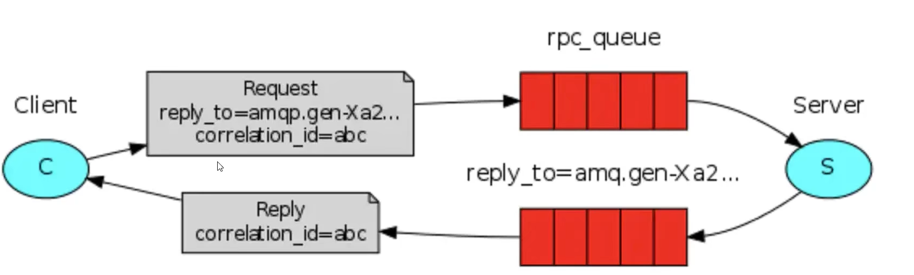
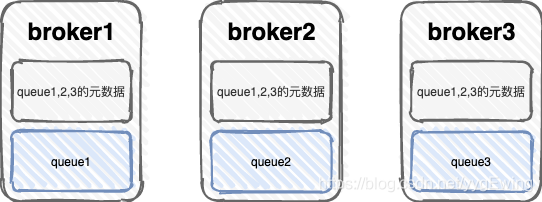
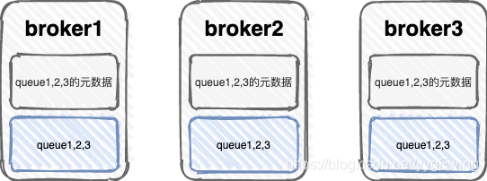
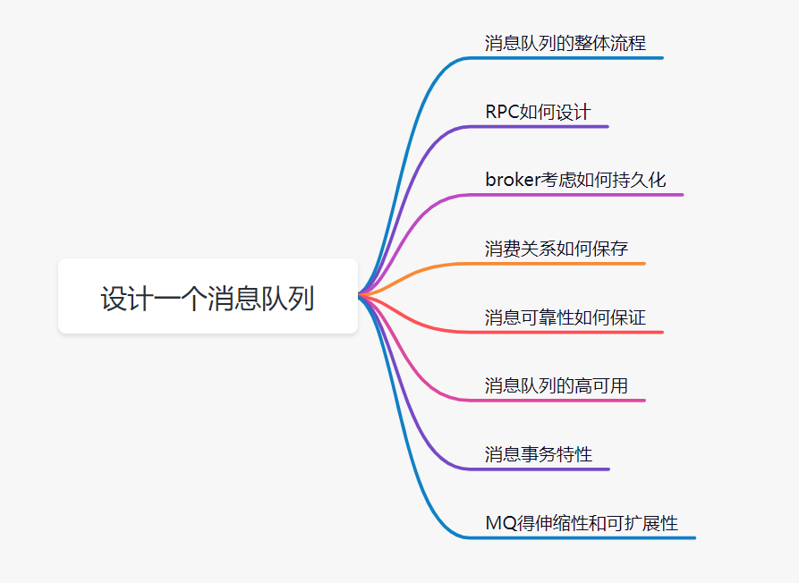

[TOC]


## 1、为什么要用消息中间件？

1. 异步
2. 解耦
3. 流量削峰：在流量高峰期，通过削峰让系统平缓地处理突增的请求。
4. 延迟队列

## 2、RabbitMQ几种类型

**broker：**broker是MQ服务器，发送者将消息发送到broker，再由broker将消息发送到队列或交换机。

**简单队列模型：**发消息和接收消息时指定队列名

```java
rabbitTemplate.convertAndSend(queueName, message);
@RabbitListener(queues = "simple.queue")
```


**工作队列模型：**队列轮询把消息路由给两个消费者，可以yml配置能者多劳。发消息和接收消息时指定队列名


**发送/订阅模型-Fanout广播模式：**

- 没有routingKey，由交换机决定将消息路由到哪个队列。交换机不能缓存消息，有丢失风险；队列可以缓存消息。
- 配置类把广播交换机、队列、绑定注册为Bean，发送时指定交换机名和routingKey（不起效果），接收时指定队列名。
- 一个队列可以有多个消费者。


**发布/订阅模型-Direct定向模式：**配置类绑定时指定队列的routingKey（不能通配符），交换机根据routingKey路由消息到指定队列。发送时指定交换机名和routingKey，接收时指定队列。


**发布/订阅模型-Topic话题模式：**

- 配置类绑定时指定队列的routingKey（可以通配符#,*），交换机根据routingKey路由消息到指定队列。
- 发送时指定交换机名和routingKey，接收时指定队列。
- 因为routingKey模糊匹配，所以执行效率低于direct模式。


**rpc远程调用模式：**同步通信，没有生产者消费者，客户端通过队列发消息到服务端，服务端消费后将结果通过另一个队列发消息给客户端。平时使用的很少，因为有很多优秀的rpc框架，例如Dubbo。




## 3、延迟队列

1. 配置类：延时队列和交换机A绑定routing-key为“key1” ，普通队列和交换机A绑定routing-key为“key2”。**延时队列**通过参数HashMap设置了消息ttl为5min、设置死信交换机为“交换机B”、设置死信路由routing-key为“key2”。
2. 生产者发送消息给“交换机A”
3. “交换机A”根据“key1”路由到延时队列
4. 延时队列会根据配置类设置的ttl、key2和死信交换机B，把TTL到期的死信，通过key2路由到死信交换机B、再路由到普通队列
5. 消费者指定普通队列名，普通队列发送消息给消费者。

这里交换机A就是普通交换机， 交换机B就是死信交换机，key2就是死信路由，普通队列就是死信队列。也可以普通交换机和死信交换机合二为一。

**普通消息成为死信的条件：**死信将被“死信路由”路由到死信交换机、再路由到普通队列，普通队列发送消息给消费者。

- **被拒收的消息：**一个消息被Consumer拒收了，并且reject方法的参数里requeue是false。也就是说不会被再次放在队列里，被其他消费者使用。（basic.reject/ basic.nack）requeue=false
- **TTL到期的消息：**消息的TTL到了，消息过期了。
- **被队列丢弃的消息：**队列的长度限制满了。排在前面的消息会被丢弃或者扔到死信路由上

## 4、如何指定消息的优先级

设置队列的 max priority 参数，将队列声明为优先级队列。这个参数应该是1到255之间的正整数，推荐设置1到10之间的数值，表示队列应该支持的最大优先级。默认是0。

## 5、如何保证消息不丢失

MQ可靠传输比不重复更加重要。

**消息丢失问题：**

- **生产者丢消息：**故障导致消息没发到broker。**解决办法：**生产者确认或回退
- **broker丢消息：**故障导致队列消息丢失、开启持久化后消息未来得及持久化就故障。**解决办法：**同时设置队列和消息持久化、RabbitMQ高可用集群。
- **消费者丢消息：**消费者刚接收到消息还没处理完就挂了。**解决办法：**手动ack

**可靠方案：**

1. 生产者确认
2. 消息、队列持久化
3. 消费者手动ack、幂等处理
4. 镜像集群
5. 内存、磁盘兜底告警：vm_memory_high_watermark.relative=0.8内存超过百分比就会报警、disk_free_limit.absolute = 5GB磁盘剩余5G就告警。到达条件后broker所有网络连接都会阻塞。这是兜底方案，防止崩溃，实际开发中应该在运维监控工具中就进行告警。例如RabbitMQ是80%告警，运维就要75%告警。
6. 监控：Prometheus和Grafana监控CPU、内存、磁盘、网络吞吐量、网络延迟等信息。


**生产者确认模式：**确认消息是否发送到broker，失败原因是什么。配置类@PostConstruct方法里，调用setConfirmCallback()方法，参数是Lambda表达式

```java
//yml要配置spring.rabbitmq.publisher-confirms=true；
//correlationData消息唯一id，ack是否成功发出去，cause失败原因
rabbitTemplate.setConfirmCallback((correlationData,ack,cause) -> {})
```


**生产者退回模式：**确认消息是否发送到队列。配置类@PostConstruct方法里，调用setReturnCallback()方法，参数是Lambda表达式

```java
//yml开启publisher-returns和mandatory，开启回退和强制return
//message消息，replyCode回复的状态码，replyText回复的文本
rabbitTemplate.setReturnCallback((message,replyCode,replyText,exchange,routingKey) -> {});
```


**消费者ack机制：**消费者方法的Channel参数、Message参数、消息实体类参数。一定要手动ack，消费成功才移除消息。

- **channel.basicAck(deliveryTag, multiple)：**肯定；broker将移除此消息。**参数deliveryTag**是消息的唯一标识ID，multiple参数为true时代表批量，即批量确认此deliveryTag编号之前的所有消息
- **channel.basicNack(deliveryTag, multiple, requeue)：**否认；deliveryTag号是消息的唯一标识，multiple是否批量，requeue指定消息入队还是丢弃。注意如果requeue是true的话，会有死循环的风险，因为手动ack会使retry重试机制不起作用，导致失败消息无限重试，所以需要借助Redis判断重试次数。如果requeue是false的话，拒绝的消息将进入死信队列（如果有的话）或丢弃。
- **channel.basicReject(deliveryTag, requeue)：**拒绝；deliveryTag号是消息的唯一标识，equeue指定消息入队还是丢弃。**不能批量。**

```java
@Service
@RabbitListener(queues = "xxx.xx.queue")
public class XxxListener {
    @RabbitHandler
    public void xxx(XXX xx, Message message, Channel channel) {
        try {
            //业务逻辑。。。
//同意、不批量确认之前的所有消息
            channel.basicAck(message.getMessageProperties().getDeliveryTag(),false);
        } catch (Exception e){
//拒绝、入队
            channel.basicReject(message.getMessageProperties().getDeliveryTag(),true);
        }
    }
}
```


**不建议自动ack：**没异常就ack，有异常就nack。默认自动ack。无法确定此消息是否被处理完成，有丢失消息风险。例如在受到消息后没来得及处理就宕机，消息就丢失了。所以一定要手动ack，消费成功才移除消息。

**手动ack：**acknowledge-mode: manual

**开启消息持久化机制：**收到消息后持久化到磁盘。步骤：

- **交换器和队列的持久化：**在声明时将 durable 参数置为 true 实现的
- **消息的持久化：**在发送消息指定deliveryMode为2实现的

**告警：**

这里我们主要说一下磁盘告警以及内存告警。因为出现下面两种情况时，RabbitMQ会停止从客户端网络socket中读数据: 1、内存使用达到配置上限；2、磁盘使用达到配置上限；

内存使用上限有3种设置方式：

```
## 设置节点可使用RAM百分比，超过这个百分比就会告警vm_memory_high_watermark.relative = 0.4## 设置节点可使用RAM的上限，单位为byte即字节vm_memory_high_watermark.absolute = 1073741824## RabbitMQ 3.6.0+，设置节点可使用RAM的绝对大小，它的优先级低于relativevm_memory_high_watermark.absolute = 2GB
```

磁盘使用上限也有3种设置方式：

```
## 设置磁盘剩余空间阈值，当可用空间低于这个值就会触发告警disk_free_limit.absolute = 51200
## with RabbitMQ 3.6.0+.disk_free_limit.absolute = 500KBdisk_free_limit.absolute = 50MBdisk_free_limit.absolute = 5GB
## 设置磁盘剩余空间为有效RAM的多少倍，比如当前可用RAM为2G，且设定这个参数为2。那么当磁盘可用空间低于2*2=4G时就会触发告警disk_free_limit.relative = 2.0
```

> ❝
>
> 由上可知：开启磁盘告警以及内存告警非常简单，需要说明的是，设置绝对值大小时，MB和M是不一样的，M即MiB表示 mebibytes (2^20 ，1,048,576 bytes)，而MB表示 megabytes (10^6 ，1,000,000 bytes)。
>
> ❞

只要满足这两种情况其中的一种情况，服务器就会临时阻塞连接，并且连接心跳也会断开。这时候我们通过rabbitmqctl或者RabbitMQ管理后台查看，所有网络连接都是**「blocking」**。如果我们是RabbitMQ集群，那么内存和磁盘告警就会影响整个集群。只要其中一个节点内存或者磁盘达到上限，整个集群的所有节点都会阻塞连接。

一些客户端包是支持连接阻塞提醒的，如果你使用的客户端包恰好也支持，建议基于此增加监控告警。此外，运维需要针对RabbitMQ集群服务器增加内存和磁盘使用率告警。假设RabbitMQ磁盘告警是只剩10%，那么运维设置的告警应该要大于10%，比如15%，从而能够提前发现隐患，提前介入处理问题，避免磁盘使用达到上限而引起线上问题，背个P0故障可不好看。


> **投递失败的消息怎么处理：**
>
> 首先投递失败存在如下两个情况
>
> 交换器无法根据自身的类型和路由键匹配到队列
>  交换器将消息路由到队列时，发现队列上并不存在任何消费者
>  解决方案：
>
> 生产者投递消息时指定 mandatory 或者 immediate 参数设为 true ，RabbitMQ 会把无法投递的消息通过 Basic.Return 命令将消息返回给生产者，此时生产者需要调用 channel.addReturnListener 来添加 ReturnListener 监昕器实现监听投递失败的消息
>
> 如果设置了上方两个参数就要添加 ReturnListener 逻辑，使生产者的逻辑变得复杂，RabbitMQ 中的备份交换机也可以处理这个问题
>
> 通过在声明交换器(调用 channel.exchangeDeclare 方法)的时候添加 alternate-exchange 参数来实现
>
> 对于备份交换器，使用时包含几种特殊情况:
>
> 如果设置的备份交换器不存在，客户端和 RabbitMQ 服务端都不会有异常出现，此时消息会丢失
>  如果备份交换器没有绑定任何队列，客户端和 RabbitMQ 服务端都不会有异常出现，此时消息会丢失
>  如果备份交换器没有任何匹配的队列，客户端和 RabbitMQ 服务端都不会有异常出现，此时消息会丢失
>  如果备份交换器和 mandatory 参数一起使用，那么 mandatory 参数无效
>  

## 5、消息100%投递成功

两种方案，高并发场景下建议第二种方案，数据库操作少，性能高。


**①落库扫描并发消费**

消息落库，定时任务扫描状态不在“消费中”、重试次数小于3次的消息，多线程消费。定时任务扫描重试次数超过3次的消息，通知开发者，查看日志；

**缺点：**落库影响性能，高并发场景下持久化一次就花费 100 - 200 毫秒，这是我们难以忍受的。

**②即时消息+延迟检查**

1. 生产者发送即时消息和延时消息；
2. 即时消息：发送无需ack的消息给消费者服务，消费成功后落库“消费记录表”；
3. 延时消息：用于检查；消息发送给延迟队列，过段时间后会路由到补偿服务。补偿服务查询“消费记录表”，如果找不到这条记录代表消费失败，就rpc让生产者重新发送即时消息和延时消息。

**缺点：**无法做到 100% 的可靠传递，在特别极端的情况，还是需要定时任务和补偿机制进行辅助的。

**优点：**减少数据库操作，在高并发场景下一般不考虑100%可靠性，而是要考虑可用性，保证系统能扛得住流量，数据库操作能减少一次算一次，数据库操作少了，性能就快了，需要补偿的消息就少了，性能就更快了。

> upstream Server 就是我们的上游服务，也就是生产者，生产者将业务数据入库成功后，生成两条消息，一条是立即发送出去给到下游服务 downstream Server的，一条是延迟消息给到 补偿服务 callback Server的。
>  正常情况下，下游服务监听到这个即时的消息，会发送一条消息给到 callback Server，注意这里不是采用第一种方案里面的返回 ack 方式，而是发送了一条消息给回去。
>  callback Server 监听到这个消息，知道了刚才有一条消息消费成功了，然后把这个持久化到数据库中，当上游服务发送的延迟消息到达 callback Server 时，callback Server 就会去数据库查询，刚才下游服务是否有处理过这个对应的消息，如果其 msg DB 里面有这个记录就说明这条消息是已经被消费了，如果不存在这个记录，那么 callback Server 就会发起一个 RPC 请求给到上游服务，告诉上游服务，你刚才这个消息没发送成功，需要重新发送一遍，上游服务就重新发送即时和延迟的两条消息出去，按照之前的流程继续走一遍。
>  虽然第二种方案也是无法做到 100% 的可靠传递，在特别极端的情况，还是需要定时任务和补偿机制进行辅助的。但是第二种方案的核心是减少数据库操作，这个点很重要！
>  在高并发场景下，我考虑的不是百分百的可靠性了，而是考虑可用性，性能能否扛得住这个流量，所以我能减少一次数据库操作就减少一次。我上游服务减少了一次数据库操作，我的服务性能相对而言就提高了一些，而且又能把异步 callback Server 补偿服务解耦出来。

## 6、柔性事务+可靠消息补偿时MQ崩了怎么办？ 

正常情况下，try{业务代码} 

可以采用定时任务，在刚落库后就将id发给定时任务，五分钟后根据订单id查数据库，如果查不到订单，

## 7、消息积压

**事前压测：**上线前做好压测，预估大致流量。 比如消息产生速率在2000条/s，压测发现消费者只能500条/s。解决方案就是部署六台消费者，能者多劳消费。生产环境资源一般要是压测数据的1.5倍，保证线上环境有备用资源应付突发情况。

**事中：**

- **加消费者和队列：**上线更多的消费者和队列，进行正常消费。
- **落库慢慢处理：**上线专门的队列消费服务，将消息先批量取出来，记录数据库，离线慢慢处理
- **临时征用机器：**临时增加10台机器部署消费者，减轻原RabbitMQ服务器压力，消费完积压的消息后再恢复原来架构。可以通过k8s动态扩容。
- **排查消费者故障：**排除故障，如果有故障先让其恢复消费速度。
- **优化消息处理过程：**看消费速度的瓶颈在哪里，如果是经常存数据库等IO密集型场景，尽量降低数据库访问次数，高并发场景下每一次访问数据库都会极大地影响性能。

## 8、重复消费，发了多个重复的消息会怎么样？什么情况下会出现发送多个重复消息？怎么解决

**重复消费情景：**消费者手动ack时，因为网络抖动等原因basicAck()失败，MQ以为没消费成功，就自动重试，导致重复消费。MQ自身无法解决重复消费问题，因为它的理念是保证消息至少被消费者成功消费一次，可靠消费和防重消费不可兼得。所以需要开发者在业务上实现幂等性。

**解决方案：**setnx、去重表的“消费次数”字段、业务幂等性

set nx存消息状态： 

- 消费前，以消息id为key查Redis；如果查到则代表已消费，basicReject()拒绝并丢弃；如果查不到则代表未消费，执行消费逻辑。
- 消费后，以消息唯一id（从Message参数获取）为key，value随意，setnx存入Redis里，再basicAck()通知broker删除消息。
    

**去重表的“消****费次数”字段：**

- 发消息时落库“去重表”，接收消息后先查数据库“消费次数”字段；
- 如果是0，即“未消费”，则消费后更新为1，即已消费；如果是1，代表已消费，则basicNack()丢弃消息。
- 缺点是落库影响性能。高并发场景下，大量消息都多落库一次，对性能影响是很大的，高并发场景应该尽可能提高可用性。

**业务幂等性：**

- 数据库唯一约束：适合新增记录的情况。重复消费都是新增相同主键的记录，将只有一次能新增成功。
- 乐观锁：发消息时带上数据库版本号字段，消费前判断此版本号和数据库查的版本号是否相等；相等则未消费，进行消费、改数据库版本号；不相等则代表已消费，basicNack()丢弃消息。
- 唯一序列号。

## 9、顺序消费

顺序消费要保证生产顺序性和消费顺序性。

**生产顺序性：**

- **单一生产者：**生产顺序性仅支持单一生产者。不同生产者分布在不同的系统，即使设置相同的消息组，不同生产者之间产生的消息也无法判定其先后顺序。
- **串行发送：**串行发送消息，不要用多线程并行发送消息。
- **不使用MQ：**对严格要求顺序性的场景，直接不使用MQ，改为rpc同步调用。

**消费顺序性：**

- **拆队列、单一消费者：**如果一个队列对应多个消费者，会轮询或者能者多劳地消费消息，不同消费者可能消费效率不同，导致消费乱序。所以要将一个队列拆成多个队列，每个队列对应一个自己的消费者。
- **提高消费效率：**提高消费效率，通过增加消费者、优化消费逻辑、多线程消费等方法解决消息积压问题。例如A消息先发到A队列，B消息后发到B队列，因为A队列有积压的消息导致B比A更早消费。
- **有限重试次数：**合理设置重试次数，一般失败重试次数别超过三次，或者压根不重试，防止早消息因为重试导致实际消费时间落后于晚消息。失败重试可以通过Redis或MySQL存次数，也可以通过yml配置retry重试次数，注意try-catch里的手动ack会使retry失效。


## 10、几种主流MQ对比

**RabbitMQ：**

- **吞吐量：**万级别；
- **时效性：**微秒级；
- **适用场景：**社区灵活、管理界面丰富、适用于中小型公司（因为吞吐量低，适用于数据量不是那么大的系统）；
- **路由规则：**基于交换机，可以配置复杂路有逻辑；
- **堆积量：**队列基于内存，消息延迟低，但无法大量堆积消息。
- **语言：**基于elang语言影响java人员的探索和改造；
- **不支持顺序消息：**消息消费失败后会重回队列，打乱顺序

**RocketMQ：**

- **吞吐量：**十万级别；
- **时效性：**毫秒级；
- **路由规则：**基于topic
- **堆积量：**基于磁盘，可以大量堆积
- **语言：**基于JAVA语言适合大公司自己改造
- **消息回溯：**支持按照时间回溯消息，精度毫秒，例如从一天前某时分秒开始重新消费消息

**Kafka：**

- **吞吐量：**十万级别；
- **时效性：**毫秒级；
- **路由规则：**基于topic
- **堆积量：**基于磁盘，可以大量堆积
- 适用于埋点上报、日志采集、大数据流计算
- 理论上支持时间或offset回溯，但是得修改代码；

## 11、RabbitMQ高可用 

RabbitMQ 两种集群模式：普通集群模式、镜像集群模式。RabbitMQ其实并不是分布式消息队列，大厂使用的分布式消息队列，更多是RocketMQ或者Kafka，可以分布式分片存储，水平扩容性能会有明显提升

**普通集群模式：**

- **所有元数据和部分队列：**普通集群模式下，每个节点存储所有元数据和部分队列。元数据包括队列名、交换机名和类型、交换机与队列的绑定关系、队列是否持久化等配置。
- **路由：**发消息到任意节点都会根据元数据传输到队列所在节点去消费。
- **优点：**多节点分担流量压力，提升了消息的吞吐力。
- **缺点：**不能保证高可用。一旦Queue 所在的节点挂了，那么这个 Queue 的消息就没办法访问了。




**镜像集群模式：**

- **所有元数据和队列：**集群下每个节点都会存储完整的元数据和队列。
- **同步：**每次发消息时都要把消息同步到所有节点。
- **优点：**实现了高可用。任意节点故障，其他节点都能继续提供服务。
- **缺点：**性能差，因为每次发消息要同步消息到所有节点。




## 12、让你写一个消息队列，该如何进行架构设计？



1. 首先是消息队列的整体流程，producer发送消息给broker，broker存储好，broker再发送给consumer消费，consumer回复消费确认等。
2. producer发送消息给broker，broker发消息给consumer消费，那就需要两次RPC了，RPC如何设计呢？可以参考开源框架Dubbo，你可以说说服务发现、序列化协议等等
3. broker考虑如何持久化呢，是放文件系统还是数据库呢，会不会消息堆积呢，消息堆积如何处理呢。
4. 消费关系如何保存呢？点对点还是广播方式呢？广播关系又是如何维护呢？zk还是config server
5. 消息可靠性如何保证呢？如果消息重复了，如何幂等处理呢？
6. 消息队列的高可用如何设计呢？可以参考Kafka的高可用保障机制。多副本 -> leader & follower -> broker 挂了重新选举 leader 即可对外服务。
7. 消息事务特性，与本地业务同个事务，本地消息落库;消息投递到服务端，本地才删除；定时任务扫描本地消息库，补偿发送。
8. MQ得伸缩性和可扩展性，如果消息积压或者资源不够时，如何支持快速扩容，提高吞吐？可以参照一下 Kafka 的设计理念，broker -> topic -> partition，每个 partition 放一个机器，就存一部分数据。如果现在资源不够了，简单啊，给 topic 增加 partition，然后做数据迁移，增加机器，不就可以存放更多数据，提供更高的吞吐量了？