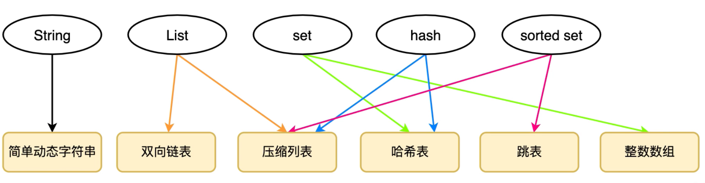
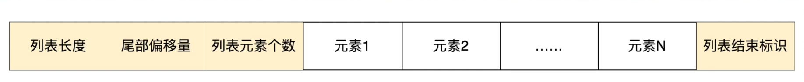
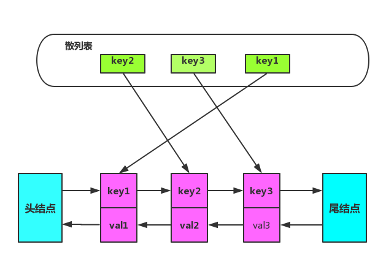

>  **导航：**
>
> [【Java笔记+踩坑汇总】Java基础+JavaWeb+SSM+SpringBoot+SpringCloud+瑞吉外卖/谷粒商城/学成在线+设计模式+面试题汇总+性能调优/架构设计+源码解析](https://blog.csdn.net/qq_40991313/article/details/126646289?csdn_share_tail={"type"%3A"blog"%2C"rType"%3A"article"%2C"rId"%3A"126646289"%2C"source"%3A"qq_40991313"})

[TOC]


## 1、说说你对Redis的了解

> **得分点**
>
> Redis概念（数据类型、读写性能）、Redis读写为什么不采用多线程？为什么单线程还读写性能这么高？Redis的瓶颈、功能、事务、数据类型、应用场景、持久化机制

**概念：**

- **数据库：**Redis是一款基于键值对的、线程安全的NoSQL数据库；
- **内存读写性能：**它在内存中读写性能非常高，每秒可以处理超过百万次的读写操作。
- **服务端线程安全，客户端线程不安全：**Redis服务端是线程安全的，永远只有主线程一个线程进行读写，不需要任何的同步机制。虽然Redis6.0增加了多线程的模型，但多线程目的只是为了处理网络的IO事件，读写指令的执行依然由主线程自己处理。Redis客户端层面线程不安全，要引入原子指令（例如INCR是给数值原子性加1）、分布式锁、lua脚本保证Redis的原子操作。

**Redis读写为什么不采用多线程？** 

- **CPU不是瓶颈：**Redis在内存中读写性能非常高，CPU不是Redis的瓶颈，无需使用多线程。
- **担心加锁影响性能：**多线程情况下，想实现线程安全必须加锁，加锁将极大地影响性能。

**为什么单线程还读写性能这么高？**

- **基于内存：**Redis是基于内存的，内存的读写速度非常快；
- **上下文切换：**单线程避免了不必要的上下文切换和竞争条件；
- **IO多路复用：**底层采用NIO（非阻塞IO），NIO采用IO多路复用技术，一个线程通过多路复用器处理多个连接。IO多路复用技术选用epoll调用模型，红黑树存所有事件，链表存就绪事件。epoll_wait函数链表，通知应用程序读写操作。

**Redis的瓶颈：**

- **内存：**因为读写在内存中进行，内存大小会影响Redis性能。可以通过加内存、读写分离优化性能。
- **网络带宽：**网络 IO是Redis最大瓶颈，也就是客户端和服务端之间的网络传输延迟。Redis6.0引入了网络IO多线程模型，提高了性能瓶颈。

**功能：**键过期、事务、lua脚本（基于C语言，性能快）、持久化机制。

**事务：**

- **实现方式：**MULTI（开启事务，将命令都放进队列里），EXEC（执行事务），DISCARD（取消事务，清空队列）。

- **不支持回滚：**在语法正确的情况下，Redis事务一定会执行成功。只有语法错误时才会导致事务失败，而语法问题应该在开发时就避免，所以为了提高性能，Redis事务不支持回滚。事务是一个原子操作，要么全部执行，要么全不执行。

- 不完全满足ACID特性：

  Redis只满足隔离性和持久性，不满足原子性和一致性。 

  - **原子性：**事务的所有操作，要么全部成功，要么全部失败。Redis不满足原子性，单个 Redis 命令的执行是原子性的，但事务失败后无法回滚。
  - **一致性：**事务前后，数据库的约束没有被破坏，保持前后一致。Redis连约束这个概念都没有。
  - **隔离性：**操作同一资源的并发事务之间相互隔离，不会互相干扰。Redis满足隔离性，因为redis server是单线程的，串行化执行事务，肯定是满足隔离性的。
  - **持久性：**事务的结果最终一定会持久化到数据库，宕机等故障也无法影响。Redis在开启aof并指定立刻持久化命令时，满足持久性。rdb模式会丢失部分数据，不满足持久性。

**数据类型：** string、hash、 list、set（集合）、zset（有序集合）

**应用场景：**缓存热点且不经常修改的数据、计数器、限时业务、分布式锁（set nx）、队列等。

**持久化机制：**

- **数据备份机制RDB（默认）：数据**每隔一段时间写进磁盘rdb文件，故障后从文件读。可以在redis.conf配置多少秒内多少key修改时自动bgsave。占CPU和内存但恢复快，不能恢复完整数据。save命令是主进程立即执行一次RDB，其他所有命令进程阻塞。bgsave是子进程fork主进程，阻塞并拷贝一份主进程的页表（虚拟内存到物理内存的映射关系），然后子进程写数据到rdb文件，主进程继续处理用户请求，
- **追加文件机制AOF：**命令**日志**按指定频率（默认立刻，在redis.conf配置为缓存一秒）写进磁盘aof文件，可以按条件（redis.conf配置，比上次重写aof文件超过多少百分比时自动重写、aof文件超过多大自动重写）自动重写aof文件中的命令（多次更新同一数据只有最近一次更新有效），故障后从文件读命令恢复数据。不占CPU和内存占IO，能恢复完整或故障1s前的数据但恢复慢。

> **标准回答**
>
> **NIO：**
>
> NIO：非阻塞I/O模型，同步非阻塞，一个线程通过多路复用器可以处理多个连接（即请求）。客户端发送的连接会通过通道注册到多路复用器上，多路复用器轮询所有就绪的通道处理IO。访问数据都是通过缓冲区操作。
>
> 三个核心组件：Buffer（缓冲区）、Channel（通道）、Selector（多路复用器）。
>
> 非阻塞：一个连接不做事，线程不会被阻塞，可以轮询处理其他连接。
>
> **IO多路复用：**一个线程处理多个IO操作。
>
> 一个线程中同时监听多个文件句柄（文件描述符，标记已打开文件的正整数），一旦有文件就绪（可读或可写）时，会通知应用程序进行读写操作。没有文件句柄就绪时就会阻塞应用程序，从而释放出CPU资源。
>
> **epoll调用：**底层的数据结构为红黑树加链表，红黑树存所有事件，链表存就绪事件，内核查红黑树将就绪事件插入链表，epoll调用通过epoll_wait函数返回内核的就绪事件列表，通知应用程序读写操作。回调效率高（O(1)），不会随着文件描述符个数增多导致性能下降，不限制文件描述符个数。缺点是只能在Linux工作。
>
> Redis是一款**基于键值对的NoSQL数据库**，与其他键值对数据库不同的是，Redis中拥有string（字符串）、hash（哈希）、 list（列表）、set（集合）、zset（有序集合）、Bitmaps（位图）、 HyperLogLog、GEO（地理信息定位）等**多种数据结构**，这给Redis带来了满足多种应用场景的能力，而且，Redis将所有数据放到**内存**中的做法让它的**读写性能**十分惊人。不仅如此，Redis的**持久化机制**保证了在发生类似断电，机械故障等情况时，内存中的数据不会丢失。此外Redis还提供了**键过期**、发布订阅、**事务**、流水线、**Lua脚本**等多个附加功能。总之，在合适的情况下使用Redis会大大增强系统的性能，减少开发人员工作量。
>
> 持久化机制：RDB、AOF 
>
> **RDB**全称Redis Database Backup file（Redis数据备份文件，backup译为备份，支援），也被叫做Redis数据快照。简单来说就是把内存中的所有**数据都记录到磁盘**中。当Redis实例故障重启后，**从磁盘读取快照文件**，恢复数据。快照文件称为RDB文件，默认是保存在当前运行目录。缺点是耗时、两次RDB间隔时间长，会丢失数据。
>
> **AOF**全称为Append Only File（追加文件）。Redis处理的每一个写命令都会记录在AOF文件，可以看做是**命令日志文件**。因为是记录命令，AOF文件会比RDB文件大的多。而且AOF会记录对同一个key的多次写操作，但只有最后一次写操作才有意义。通过执行bgrewriteaof命令，可以让AOF文件执行重写功能，用最少的命令达到相同效果。
>
> 
>
> **加分回答-适合Redis使用的场景：**
>
> \- **热点数据的缓存：**redis访问速度块、支持的数据类型丰富，很适合用来存储热点数据。
>
> \- **限时业务：**redis中可以使用expire命令设置一个键的生存时间，到时间后redis会删除它。因此，Redis在限时业务中的表现很亮眼。
>
> **- 计数器：**incrby命令可以实现**原子性的递增**，所以可以运用于高并发的秒杀活动、分布式序列号的生成。
>
> \- **排行榜：**关系型数据库在排行榜方面查询速度普遍偏慢，所以可以借助redis的SortedSet进行**热点数据的排序**。
>
> **- 分布式锁：**这个主要利用redis的setnx命令进行，在后面的如何用Redis实现一个分布式锁中会进行详解。
>
> \- 延时操作：redis自2.8.0之后版本提供Keyspace Notifications功能，允许客户订阅Pub/Sub频道，以便以某种方式接收影响Redis数据集的事件。
>
> \- 分页查询、模糊查询：edis的set集合中提供了一个zrangebylex方法，通过ZRANGEBYLEX zset - + LIMIT 0 10 可以进行分页数据查询，其中- +表示获取全部数据；rangebylex key min max 这个就可以返回字典区间的数据可以利用这个特性可以进行模糊查询功能。
>
> \- **点赞，好友等相互关系的存储：**Redis set对外提供的功能与**list**类似是一个列表的功能，特殊之处在于**set是可以自动排重**的，我们可以通过这一点实现类似共同好友等功能。
>
> **- 队列：**由于redis有**list push和list pop**这样的命令，所以能够很方便的执行队列操作。

## 2、说说Redis的单线程架构

> **得分点**
>
> 服务端线程安全，为什么不采用多线程、为什么单线程还读写性能这么高？Redis的瓶颈

**服务端线程安全，客户端线程不安全：**Redis服务端是线程安全的，永远只有主线程一个线程进行读写，不需要任何的同步机制。虽然Redis6.0增加了多线程的模型，但多线程目的只是为了处理网络的IO事件，读写指令的执行依然由主线程自己处理。Redis客户端层面线程不安全，要引入原子指令（例如INCR是给数值原子性加1）、分布式锁、lua脚本保证Redis的原子操作。 

**Redis读写为什么不采用多线程？** 

- **CPU不是瓶颈：**Redis在内存中读写性能非常高，CPU不是Redis的瓶颈，无需使用多线程。
- **担心加锁影响性能：**多线程情况下，想实现线程安全必须加锁，加锁将极大地影响性能。

**为什么单线程还读写性能这么高？**

- **基于内存：**Redis是基于内存的，内存的读写速度非常快；
- **上下文切换：**单线程避免了不必要的上下文切换和竞争条件；
- **IO多路复用：**底层采用NIO（非阻塞IO），NIO采用IO多路复用技术，一个线程通过多路复用器处理多个连接。IO多路复用技术选用epoll调用模型，红黑树存所有事件，链表存就绪事件。epoll_wait函数链表，通知应用程序读写操作。

**Redis的瓶颈：**

- **内存：**因为读写在内存中进行，内存大小会影响Redis性能。可以通过加内存、读写分离优化性能。
- **网络：**网络 IO是Redis最大瓶颈，也就是客户端和服务端之间的网络传输延迟。Redis6.0引入了网络IO多线程模型，提高了性能瓶颈。

> **标准回答**
>
> Redis的**网络IO和键值对读写是由一个线程来完成**的，但Redis的其他功能，例如持久化、异步删除、集群数据同步等操作依赖于其他线程来执行。单线程可以简化数据结构和算法的实现，并且可以避免线程切换和竞争造成的消耗。但要注意如果**某个命令执行时间过长**，会造成其他命令的**阻塞**。
>
> Redis采用了**io多路复用机制**，这带给了Redis并发处理大量客户端请求的能力。它允许**单个线程同时监听多个IO事件**，并在有事件发生时及时通知程序进行相应的处理。常见的IO多路复用技术包括：select、poll和epoll等。
>
> Redis单线程高性能的原因：
>
> 因为对服务端程序来说，线程切换和锁通常是性能杀手，而单线程**避免了线程切换和竞争所产生的消耗**。另外Redis的大部分操作是在**内存**上完成的，这是它实现高性能的一个重要原因；Redis还采用了**IO多路复用机制**，使其在网络IO操作中能并发处理大量的客户端请求，实现**高吞吐率**。
>
> **加分回答**
>
> Redis的单线程主要是指Redis的网络IO和键值对读写是由一个线程来完成的。而Redis的其他功能，如持久化、异步删除、集群数据同步等，则是依赖其他线程来执行的。所以，说Redis是单线程的只是一种习惯的说法，事实上它的底层不是单线程的。


## 3、详细的说说Redis的数据类型

> **得分点**
>
> Redis5种数据结构

**字符串(string)：**存储字符串、数字和二进制数据，最大存2M。底层数据结构是二进制安全（传输时不会被篡改、破译）、可以动态分配空间和回收内存的简单动态字符串SDS（Simple Dynamic String），

- 存字符串 时，Redis会将其视为二进制安全的字符序列。
- 存储数字时，Redis会将其转换成64位有符号整数或双精度浮点数。
- 存储二进制数据时，Redis会将其视为字节数组，并以原始形式进行存储，不会进行任何编码格式转换。 

**哈希(hash)：**value是键值对类型，可用于存对象。底层是压缩列表和哈希表。

**列表(list)：**元素有序可重复。底层是双向链表和压缩列表。**应用场景：**支持范围查询的栈（lpush+lpop）、队列（lpush+rpop）、阻塞队列（lpush+brpop）。**命令：**lpush,lpop,blpop,rpop,brpop（移除最右元素，若没元素则阻塞直到有元素去移除或超时）,lrange,llen。

**集合(set)：**元素无序不可重复，既不自然有序也不插入有序；支持多个set求交集、并集、差集。底层是哈希表和整数数组。命令：sadd,smembers,sismember,scard(获取成员数),sinner,sunion,sdiff,srem（移除）。**应用场景：**

- **统计去重后数据量：**例如网站访问量、点赞量，将每个访问者的ip放在set里，自动去重，通过scard获取访问量。
- **判断某元素是否在集合里：**例如文章浏览记录，某用户每阅读完一篇文章，就将文章id加到set里，通过sismember判断某文章是否被浏览过。
- **集合运算：**key1记录小明的所有兴趣爱好，key2记录小李的兴趣爱好，通过交集并集差集，实现用户兴趣爱好的比较、推荐。

**有序集合(zset)：**元素有序不可重复，有序依据是每个元素的设置一个分数，按分数从小到大排序，分数相等时按照元素字典序排序。可以通过zincryby命令给指定成员加分数。底层是压缩列表和跳跃表。命令：zadd,zrange,zincrby,zrem。**应用场景：**

- **排行榜：**例如积分榜、粉丝数量磅，元素是每个用户id，分数是积分、粉丝数。
- **时间轴：**例如用户所有文章按发布时间排序；元素是该用户的每篇文章，分数是文章发布时间。

list和zset支持范围查询，set不支持范围查询。 

> **标准回答1**
>
> Redis主要提供了5种数据结构：字符串(string)、哈希(hash)、列表(list)、集合(set)、有序集合(zset)。
>
> Redis还提供了Bitmap、HyperLogLog、Geo类型，但这些类型都是基于上述核心数据类型实现的。5.0版本中，Redis新增加了**Streams数据类型**，它是一个功能强大的、支持多播的、可持久化的消息队列。
>
> **string**可以存储**字符串、数字和二进制数据**，除了值可以是String以外，所有的键也可以是string，string最大可以存储大小为**2M**的数据。
>
> **list**保证数据线性有序且元素可重复，它支持lpush、blpush、rpop、brpop等操作，可以当作**简单的消息队列**使用，一个list最多可以存储**2^32-1**个元素
>
> **hash**的值本身也是一个键值对结构，最多能存储2^32-1个元素。
>
> **set**是无序不可重复的，它支持**多个set求交集、并集、差集**，适合实现共同关注之类的需求，一个set最多可以存储2^32-1个元素
>
> **zset**是有序不可重复的，它通过给**每个元素设置一个分数来作为排序的依据**，一个zset最多可以存储2^32-1个元素。
>
> **加分回答-编码**
>
> **每种类型支持多个编码**，每一种编码采取一个特殊的结构来实现 各类数据结构内部的编码及结构：
>
> string：编码分为int、raw、embstr；int底层实现为long，当数据为整数型并且可以用long类型表示时可以用long存储；embstr底层实现为占一块内存的SDS结构，当数据为长度不超过32字节的字符串时，选择以此结构连续存储元数据和值；raw底层实现为占两块内存的SDS，用于存储长度超过32字节的字符串数据，此时会在两块内存中分别存储元数据和值。
>
> list：编码分为ziplist、linkedlist和quicklist（3.2以前版本没有quicklist）。ziplist底层实现为压缩列表，当元素数量小于2且所有元素长度都小于64字节时，使用这种结构来存储；linkedlist底层实现为双端链表，当数据不符合ziplist条件时，使用这种结构存储；3.2版本之后list一般采用quicklist的快速列表结构来代替前两种。
>
> hash：编码分为ziplist、hashtable两种，其中ziplist底层实现为压缩列表，当键值对数量小于2，并且所有的键值长度都小于64字节时使用这种结构进行存储；hashtable底层实现为字典，当不符合压缩列表存储条件时，使用字典进行存储。
>
> set：编码分为inset和hashtable，intset底层实现为整数集合，当所有元素都是整数值且数量不超过2个时使用该结构存储，否则使用字典结构存储。
>
> zset：编码分为ziplist和skiplist，当元素数量小于128，并且每个元素长度都小于64字节时，使用ziplist压缩列表结构存储，否则使用skiplist的字典+跳表的结构存储。
>
> 


> **标准回答2**
>
> Redis主要提供了5种数据结构：字符串(String)、哈希(Hash)、列表(List)、集合(set)、有序集合(zset)。
>
> **String是一组字节**。在 Redis 数据库中，字符串是**二进制安全的**。这意味着它们具有已知长度，并且不受任何特殊终止字符的影响。可以在一个字符串中存储最多2 兆字节的内容。
>
> Redis 列表定义为字符串列表，按插入顺序排序。可以将元素添加到 Redis 列表的头部或尾部。列表的最大长度为 232 – 1 个元素（超过 40 亿个元素）。
>
> **哈希**是键值对的集合。在 Redis 中，哈希是**字符串字段和字符串值之间的映射**。因此，它们适合表示对象。每个哈希可以存储多达 232– 1 个字段-值对。
>
> 集合（set）是 Redis 数据库中的无序字符串集合。在 Redis 中，在redis sorted sets里面当items内容大于64的时候同时使用了和skiplist两种设计实现。这也会为了排序和查找性能做的优化。关于时间复杂度：添加和删除都需要修改skiplist，所以复杂度为O(log(n))。
>
> 但是如果仅仅是查找元素的话可以直接使用hash，其复杂度为O(1) ，其他的range操作复杂度一般为O(log(n))，当然如果是小于64的时候，因为是采用了ziplist的设计，其时间复杂度为O(n)集合中的最大成员数为 232-1 个元素（超过 40 亿个元素）。
>
> Redis 有序集合类似于 Redis 集合，也是一组非重复的字符串集合。但是，排序集的每个成员都与一个分数相关联，该分数用于获取从最小到最高分数的有序排序集。虽然成员是独特的，但可以重复分数。
>
> **加分回答**
>
> Redis还提供了Bitmap、HyperLogLog、Geo类型，但这些类型都是基于上述核心数据类型实现的。5.0版本中，Redis新增加了Streams数据类型，它是一个功能强大的、支持多播的、可持久化的消息队列。


## 4、请你说说Redis数据类型中的zset,它和set有什么区别？底层是怎么实现的？

> **得分点**
>
> 有序无序、底层存储结构、zset底层不使用红黑树的原因

**zset（有序集合） ：**元素有序不可重复，每个元素关联一个可重复的double类型的分数，Redis是通过这个分数对元素排序的。分数可重复，元素

**zset底层存储结构：**ziplist（压缩列表）或skiplist（跳跃表）。

元素数量小于128个，且每个元素长度小于64字节时使用压缩列表，其他情况使用跳跃表。

- **压缩列表：**本质是一个字节数组，数组前几个元素存列表长度、尾部偏移量、列表元素个数，数组末尾存列表结束标识。每个元素使用两个紧挨在一起的压缩列表节点来保存，第一个节点保存元素的成员，第二个节点保存元素的分值。
- **跳跃表：**单向链表按序保存元素及分值，使用哈希表dict来保存元素和分值的映射关系。链表增加了多级索引，先从最上层索引跳跃查，再渐渐往下层到链表地查询，实现了快速查找元素，时间复杂度O(logn)，这种查询算法类似于链表版二分查找，是基于有序的。

**zset底层不使用红黑树的原因：**

- **范围查找：**因为红黑树范围查找效率低，而跳跃表范围查找效率高，因为是链表结构。zset可以用zrange命令查指定下标范围内元素，例如zrange 0 -1。
- **实现难度：**跳跃表实现比红黑树简单。

> 压缩列表：
>
> 
>
> 
>
> 跳跃表zrange： 
>
> ```bash
> #将a和b两个元素插入到名称为myzset的有序集合中，并为它们分别设置了分值为10和9
> zset myzset 10.0 a 9.0 b    
> #返回所有元素，并按照它们的分值从小到大排列。结果为b和a。0表示第一个元素，-1表示最后一个元素
> zrange myzset 0 -1  
> ```
>
> 
>
> 

> **标准回答**
>
> Redis 有序集合和集合一样也是 **string 类型元素的集合**，且**不允许重复**的成员。不同的是**每个元素**都会关联一个 **double 类型的分数。**Redis 正是**通过分数**来为集合中的成员进行从小到大的**排序**。有序集合的成员是唯一的，但**分数 ( score ) 却可以重复**。集合是通过哈希表实现的，所以添加，删除，查找的复杂度都是 O(1)。集合中最大的成员数为 232 – 1 ( 4294967295 ) ， 每个集合可存储 40 多亿个成员。
>
> zset底层的**存储结构**包括ziplist或skiplist，在同时满足有序集合保存的**元素数量小于128个**和有序集合保存的所有元素的长度小于64字节的时候使用ziplist，其他时候使用skiplist。
>
> 当**ziplist**作为zset的底层存储结构时候，每个集合**元素**使用**两个紧挨在一起的压缩列表节点**来保存，第一个节点保存元素的**成员**，第二个元素保存元素的**分值**。
>
> 当**skiplist**作为zset的底层存储结构的时候，使用**skiplist按序保存元素及分值**，使用dict来保存元素和分值的映射关系。
>
> **加分回答**
>
> 实际上单独使用Hashmap或skiplist也可以实现有序集合，Redis使用两种数据结构组合的原因是如果我们单独使用Hashmap，虽然能以O(1) 的时间复杂度查找成员的分值，但是因为Hashmap是以无序的方式来保存集合元素，所以每次进行范围操作的时候都要进行排序；而如果单独使用skiplist，虽然能执行范围操作，但查找操作的复杂度却由 O(1)变为了O(logN)。因此Redis使用了两种数据结构来共同实现有序集合。


## 5、说说Redis的持久化策略

> **得分点**
>
> RDB、AOF

**数据备份机制RDB（默认）：数据**定期写进磁盘rdb文件，故障后从文件读。占CPU和内存但恢复快，不能恢复完整数据。save命令是主进程立即执行一次RDB，其他所有命令进程阻塞。bgsave是子进程fork主进程，阻塞并拷贝一份主进程的页表（虚拟内存到物理内存的映射关系），然后子进程写数据到rdb文件，主进程继续处理用户请求，

- **save <seconds> <changes>：**多少秒内多少key修改时自动bgsave。默认save 900 1 ，即900s内只要有一个key被更改就会bgsave。
- **rdbcompression ：**是否用LZF算法压缩rdb文件，默认值是yes。压缩会占用CPU，追求效率可关闭，追求空间可开启。

**追加文件机制AOF：**命令**日志**按持久化策略异步写进磁盘aof文件，故障后从文件读命令恢复数据。重写：可以按指定的重写阈值自动执行bgrewriteaof命令，异步重写aof文件中的命令日志，保证多次更新同一数据只有最近一次更新有效。不占CPU和内存占IO，能恢复完整数据。

- appendfsync ：

  持久化策略。 	

  - **always：**每次写入后都执行fsync命令，异步写aof文件，效率高。默认值。
  - **everysec（推荐）：**写入1s后fsync，虽然会丢失1s但效率高。
  - **no：**不建议，让操作系统决定什么时候fsync，不安全

- **auto-aof-rewrite-percentage <percentage>：**比上次重写aof文件超过多少百分比时自动重写

- **auto-aof-rewrite-min-size <bytes>：**aof文件超过多大自动重写

**RDB-AOF混合持久化：** Redis 4.0支持混合持久化，基于aof的bgrewriteaof命令实现。aof重写时，fork 出的子进程先将全量数据以 RDB 方式写入新的 AOF 文件，然后再将 AOF 重写缓冲区（aof_rewrite_buf_blocks）的增量命令以 AOF 方式写入到文件，写入完成后通知主进程覆盖旧的aof文件。aof文件前半段保存RDB格式的全量数据，后半段保存AOF格式的增量数据。可以快速恢复且恢复1s之前的数据。

- aof-use-rdb-preamble yes：开启混合持久化

> **标准回答** 
>
> **Redis 4.0支持混合持久化、支持懒释放（开启后，删除key在后台运行，提高效率）**
>
> Redis4.0之后，Redis有RDB持久化、AOF持久化、RDB-AOF混合持久化这三种持久化方式。
>
> **RDB持久化**是将当前进程数据以生成快照的方式保存到硬盘的过程，也是Redis默认的持久化机制。RDB会创建一个经过压缩的二进制文件，这个文件以’.rdb‘结尾，内部存储了各个数据库的键值对等信息。RDB持久化过程有手动触发和自动触发两种方式。手动触发是指通过SAVE或BGSAVE命令触发RDB持久化操作，创建“.rdb”文件；自动触发是指通过配置选项，让服务器在满足指定条件时自动执行BGSAVE命令。RDB持久化的优点是其生成的紧凑压缩的二进制文件体积小，使用该文件恢复数据的速度非常快；缺点则是BGSAVE每次运行都要执行fork操作创建子进程，这属于重量级操作，不宜频繁执行，因此，RBD没法做到实时的持久化。
>
> AOF全称为Append Only File（追加文件）。
>
> **AOF**以独立日志的方式记录了每次写入的命令，重启时再重新执行AOF文件中的命令来恢复数据。AOF持久化的优点是与RDB持久化可能丢失大量的数据相比，AOF持久化的安全性要高很多。通过使用everysec选项，用户可以将数据**丢失的时间窗口限制在1秒之内**。其缺点则是，AOF文件存储的是协议文本，它的体积要比二进制格式的”.rdb”文件大很多。AOF需要通过执行AOF文件中的命令来恢复数据库，其恢复速度比RDB慢很多。AOF在进行**重写时也需要创建子进程**，在数据库体积较大时将占用大量资源，会导致服务器的短暂阻塞。AOF解决了数据持久化的实时性，是目前Redis主流的持久化方式。
>
> **RDB-AOF混合持久化模式**是Redis4.0开始引入的，这种模式是**基于AOF持久化**构建而来的。用户可以通过配置文件中的“aof-use-rdb-preamble yes”配置项开启AOF混合持久化。Redis服务器在执行**AOF重写操作时**，会**像执行BGSAVE命令一样**，根据数据库当前的状态**生成相应的RDB数据**，并将其写入**AOF文件中**；对于重写之后执行的Redis命令，则以协议文本的方式追加到AOF文件的末尾，即RDB数据之后。
>
> 通过使用RDB-AOF混合持久化，用户可以同时获得RDB持久化和AOF持久化的优点，服务器既可以通过AOF文件包含的RDB数据来实现**快速的数据恢复操作**，又可以通过AOF文件包含的AOF数据来将**丢失数据的时间窗口限制在1s**之内
>
> 
>
> **加分回答-RDB的save和bgsave、AOF的文本协议格式和文件同步机制：**
>
> RDB手动触发分别对应save和bgsave命令：
>
> \- save 命令会一直阻塞当前Redis服务器到RBD过程完成为止，所以这种方式在操作内存比较大的实例时会造成长时间阻塞，因此线上环境不建议使用，该命令已经被废弃。
>
> \- bgsave命令会让Redis进程执行fork创建子进程，由子进程负责RBD持久化过程，完成后自动结束，因此只在fork阶段发生阻塞，一般阻塞的时间也不会很长。因此Redis内部所涉及的几乎所有RDB操作都采用了bgsave的方式。
>
> 除了执行命令手动触发之外，Redis内部还存在自动触发RDB的持久化机制，例如以下场景：
>
> 1. 使用save相关配置，如“save m n”。表示m秒内数据集存在n次修改 时，自动触发bgsave。
> 2. 如果从节点执行全量复制操作，主节点自动执行bgsave生成RDB文件并发送给从节点。
> 3. 执行debug reload命令重新加载Redis时，也会自动触发save操作。
> 4. 默认情况下执行shutdown命令时，如果没有开启AOF持久化功能则 自动执行bgsave。
>
> 
>
> AOF默认不开启，需要修改配置项来启用它：
>
> ```bash
> appendonly yes # 启用AOF 
> appendfilename “appendonly.aof“ # 设置文件名
> ```
>
> 
>
> AOF以**文本协议格式写入命令**，如： *3\r\n$3\r\nset\r\n$5\r\nhello\r\n$5\r\nworld\r\n
>
> 文本协议格式具有如下的优点：
>
> 1. 文本协议具有很好的兼容性；
> 2. 直接采用文本协议格式，可以避免二次处理的开销；
> 3. 文本协议具有可读性，方便直接修改和处理。
>
> AOF持久化的**文件同步机制：**
>
> 为了提高程序的写入性能，现代操作系统会把针对硬盘的多次写操作优化为一次写操作。
>
> 1. 当程序调用write对文件写入时，系统不会直接把书记写入硬盘，而是先将数据写入内存的缓冲区中；
> 2. 当达到特定的时间周期或缓冲区写满时，系统才会执行flush操作，将缓冲区中的数据冲洗至硬盘中；
>
> 这种优化机制虽然提高了性能，但也给程序的写入操作带来了不确定性。
>
> 1. 对于AOF这样的持久化功能来说，冲洗机制将直接影响AOF持久化的安全性；
> 2. 为了消除上述机制的不确定性，Redis向用户提供了appendfsync选项，来控制系统冲洗AOF的频率；
> 3. Linux的glibc提供了fsync函数，可以将指定文件强制从缓冲区刷到硬盘，上述选项正是基于此函数。

## 6、说说缓存穿透、击穿、雪崩的区别

> **得分点**
>
> 三种问题的发生原因以及解决方式

**缓存穿透：** 指高并发查询一个缓存库和数据库都不存在的数据，一瞬间所有请求没命中缓存，都到达数据库，导致数据库压力过大，从而崩溃。解决：

- **缓存空对象：**当一个线程查缓存库没命中、查数据库并缓存空值后，其他线程查缓存库直接就命中了，命中的值是字符串“null”。

- 布隆过滤器：

  应用启动的时候把存在的数据缓存到布隆过滤器里面。每一次请求进来的时候先访问布隆过滤器，如果不存在，则说明这个数据一定没有在数据库里面，就没必要再去访问数据库了。 

  - **底层：**布隆过滤器是一个基于哈希表的数据结构，底层是二进制数组（只能存0或1）和多个哈希函数，用来判断某个元素是否在集合里。

  - **过程：**元素通过多个哈希函数计算后得到多个key，将二进制数组这几个key对应value设为1（默认是0），标记该元素已存在于布隆过滤器。

  - **适用场景：**数据量非常大并且只判断两种状态（例如存在或不存在）的情况。

  - **优缺点：**优点是空间时间复杂度都很优秀。缺点是可能因为哈希散列后碰撞导致误判，如果判断不存在则一定不存在，判断存在则是可能存在。

  - **减少误判率：**增加二进制位数组的长度（数组中数据更加散列化）、增加Hash的次数（变相增加数字特征，特征越多越不容易误判）

  - 删除数据后同步布隆过滤器：

    因为存在哈希碰撞，所以直接改1为0可能导致误删。 	

    - **定时任务复制替换：**开发定时任务，每隔几个小时，自动创建一个新的布隆过滤器数组并加载数据库数据，替换老的，有点CopyOnWriteArrayList的味道
    - **计数器数组防止误删：**布隆过滤器增加一个等长的数组，存储计数器，主要解决冲突问题，每次删除时对应的计数器减一，如果结果为0，更新主数组的二进制值为0

  - 实现：

    通过Redisson可以创建布隆过滤器，初始化时可以设置数组长度和误判率： 	

    ```java
            RBloomFilter<String> bloomFilter = redissonClient.getBloomFilter();
            //初始化布隆过滤器：预计元素为100000000L,误差率为3%
            bloomFilter.tryInit(100000000L,0.03);
            //将号码10086插入到布隆过滤器中
            bloomFilter.add("10086");
            //判断下面号码是否在布隆过滤器中
            System.out.println(bloomFilter.contains("123456"));//false
    ```

    

    

**缓存击穿：**一个热点数据缓存失效的瞬间，大量请求都同时没命中、都同时查数据库缓存实值或空值，导致数据库压力过大。

解决：热点数据不设置过期时间，或者互斥锁（同一时刻只允许一个线程访问缓存库该数据，Redis查询性能高，即使加锁情况下也远远优于数据库）。

**缓存雪崩：**大量数据同时过期，高并发查缓存库和数据库导致崩溃。解决办法：

1. 过期时间附加随机数
2. **熔断降级：**熔断（服务异常后，阻止上游服务调用该服务）和降级（上游服务远程调用发现下游熔断后，执行后备方法）
3. **缓存预热：**不要等到请求到来再去查询数据库存入缓存，可以提前将数据存入缓存。使用缓存预热机制通常有专门的后台程序（例如定时任务）去将数据库的数据同步到缓存。

> **标准回答**
>
> **缓存穿透：**是指客户端查询了根本不存在的数据，使得这个请求直达存储层，导致其负载过大甚至造成宕机。这种情况可能是由于业务层误将缓存和库中的数据删除造成的，当然也不排除有人恶意攻击，专门访问库中不存在的数据导致缓存穿透。
>
> 我们可以通过缓存空对象的方式和布隆过滤器两种方式来解决这一问题。缓存空对象是指当存储层未命中后，仍然将**空值存入缓存层** ，当客户端再次访问数据时，缓存层直接返回空值。
>
> 还可以将数据存入**布隆过滤器**。当一个请求到来时，先对其进行布隆过滤器的查询，如果查询结果为不存在，则该请求直接返回空结果。 当布隆过滤器判断元素存在时，此时需要进行进一步的验证，即访问数据库或缓存，获取具体值并返回，同时将该值加入缓存中。
>
> ```java
> public class RedissonBloomFilter {
>  
>     public static void main(String[] args) {
>         Config config = new Config();
>         config.useSingleServer().setAddress("redis://192.168.14.104:6379");
>         config.useSingleServer().setPassword("123");
>         //构造Redisson
>         RedissonClient redisson = Redisson.create(config);
>  
>         RBloomFilter<String> bloomFilter = redisson.getBloomFilter("phoneList");
>         //初始化布隆过滤器：预计元素为100000000L,误差率为3%
>         bloomFilter.tryInit(100000000L,0.03);
>         //将号码10086插入到布隆过滤器中
>         bloomFilter.add("10086");
>  
>         //判断下面号码是否在布隆过滤器中
>         System.out.println(bloomFilter.contains("123456"));//false
>         System.out.println(bloomFilter.contains("10086"));//true
>     }
> }
> ```
>
> 
>
> **缓存击穿：**当**一份**访问量非常大的**热点数据缓存失效的瞬间**，大量的请求直达存储层，导致服务崩溃。
>
> 缓存击穿可以通过**热点数据不设置过期时间**来解决，这样就不会出现上述的问题，这是“物理”上的永不过期。或者为每个数据设置**逻辑过期时间**，当发现该数据逻辑过期时，使用单独的线程重建缓存。除了永不过期的方式，我们也可以通过加**互斥锁**的方式来解决缓存击穿，即对数据的访问加互斥锁，**当一个线程访问该数据时，其他线程只能等待**。这个线程访问过后，缓存中的数据将被重建，届时其他线程就可以直接从缓存中取值。
>
> **缓存雪崩：**是指当某一时刻缓存层无法继续提供服务，导致所有的请求直达存储层，造成数据库宕机。可能是缓存中有**大量数据同时过期**，也可能是Redis节点发生故障，导致大量请求无法得到处理。
>
> 缓存雪崩的解决方式有三种；第一种是在设置**过期时间**时，**附加一个随机数**，避免大量的key同时过期。第二种是启用**降级和熔断**措施，即发生雪崩时，若应用访问的不是核心数据，则直接返回预定义信息/空值/错误信息。或者在发生雪崩时，对于访问缓存接口的请求，客户端并不会把请求发给Redis，而是直接返回。第三种是**构建高可用的Redis服务**，也就是采用**哨兵或集群模式**，部署多个Redis实例，这样即使个别节点宕机，依然可以保持服务的整体可用。


## 7、如何利用Redis实现一个分布式锁？

> **得分点**
>
> 为什么要实现分布式锁、实现分布式锁的方式、Redlock

**分布式锁的主要作用：**

1. **保证数据的正确性：**比如秒杀的时候防止商品超卖，表单重复提交，接口幂等性。
2. **避免重复执行任务：**在分布式任务调度中，多个节点可能同时执行同一个任务，使用分布式锁可以确保同一时刻只有一个节点能够执行该任务，以避免重复执行的问题。

**设计分布式锁的主要考虑因素：**

1. **互斥：**同一时刻只能有一个线程获得锁。
2. **可重入：**当一个线程获取锁后，在解锁之前可以再次获取这个锁，无需等待，只需记录重入次数。可重入锁能避免死锁发生，因为不用线程自己等待自己释放锁。不可重入锁：JDK8的乐观读写锁StampedLock，性能比ReadWriteLock快但不可重入。
3. 高可用：当小部分节点挂掉后，仍然能够对外提供服务。
4. **高性能：**要做到高并发、低延迟。
5. **防死锁：** 如果一个线程对同一把锁,连续加了两次锁,并且该锁还是不可重入锁的时候,就会产生死锁。
6. 支持阻塞和非阻塞：Synchronized是阻塞的，ReentrantLock.tryLock()就是非阻塞的
7. 支持公平锁和非公平锁：Synchronized是非公平锁，ReentrantLock(boolean fair)可以创建公平锁

**分布式锁的实现方式：**

- **MySQL乐观锁；**
- **基于Redis：**例如setnx、Redisson。
- **基于zookeeper：**多线程向zookeeper创建一个子目录(节点)只会有一个创建成功，利用此特点可以实现分布式锁，谁创建该结点成功谁就获得锁。


**setnx实现分布式锁：** 

**加锁：**setnx，原子性判断key不存在、加锁、设置过期时间，value设为随机uuid。

- **原子性判断和加锁：**防止还没来得及加锁，多个线程同时通过判断语句，导致先后加锁。而其实一个线程加锁解锁成功后，其他线程理应过不了判断的。
- **设置过期时间：**防止死锁。防止拿到锁的线程还**没来得及释放锁**，就因为宕机、异常等因素导致锁无法释放。加过期时间能保证死锁能在指定时长后自动过期。
- **原子性设置过期时间：**防止死锁。如果不是原子性，刚加完锁，**没来得及设置过期时间**就故障，导致死锁。注意过期时间要设置久一点，保证业务执行完之后再过期。
- **value设置随机值：**保证解能判断锁时到当前锁是不是本线程持有的锁。防止解锁前本线程锁已过期，然后其他线程已拿到锁，这时原子性判断解锁时发现加锁，就解锁，而其实解的是其他线程的锁。

```bash
set key value nx ex seconds
```


**解锁：**lua脚本原子性判断和解锁，根据比较value和自己加锁时设置的随机id判断是否自己的锁。原子性判断和解锁：防止刚判断完自己锁过期了，没来得及解锁锁过期其他线程拿到锁。

**业务流程：**先加锁，如果加锁成功就查数据库数据、解锁、返回数据；如果加锁失败就重新调用本方法，再次加锁解锁，直到成功拿到数据库的数据。

**故障转移导致setnx在非单机模式下失效：**因为redis在进行主从复制时是异步完成的，比如在clientA获取锁后，主redis复制数据到从redis过程中崩溃了，导致没有复制到从redis中，然后从redis选举出一个升级为主redis,造成新的主redis没有clientA 设置的锁，这是clientB尝试获取锁，并且能够成功获取锁，导致互斥失效。集群模式在key取余后存的实际还是主从，所以也有这个问题。

**Redisson实现分布式锁：** 

Redisson基于Redis协议，可以实现可重入锁、公平锁、读写锁、信号量、闭锁（计数器），支持看门狗自动续期。

**使用步骤：**

1. 导入依赖
2. 配置类注册Redisson客户端
3. 注入客户端通过getLock(),getReadWriteLock()等方法获取锁。Redisson的读写锁实现了JUC.locks.ReadWriteLock接口，读读不互斥，读写互斥，写写互斥
4. 加锁：如果没指定过期时间，默认过期时间30s，剩10s时（过期时间的1/3）看门狗自动续期到30s。如果指定了过期时间，则不自动续期。建议指定一个充裕的过期时间，既保证过期前能执行完业务，又防止自动续期导致死锁。
5. 解锁。

**try和lock顺序：**加锁代码要放到try外面。如果放在try里面的话，加锁失败抛异常或者加锁前的代码抛异常后，执行finally里的解锁代码，而其实加锁都没成功，最终解锁就也不合适了。

```java
lock(); // 加锁
try{
    // do something
}finally{
    unlock(); // 解锁
}

//不推荐
try{
int a=3/0;//这里抛异常会直接进入finally
lock(); // 加锁
    // do something
}finally{
    unlock(); // 解锁
}
```


**wait 指令：**

Redisson内部曾经实现了Redlock，解决主从模式下互斥锁失效的问题，后面被弃用，使用wait指令（将主从复制过程由异步改为同步）保证锁的一致性。wait 指令是 **Redis3.0** 版本以后才出现的。

> **3.12.5版本弃用的Redlock：**
>
> Redisson内部曾经实现了Redlock，解决主从模式下互斥锁失效的问题。
>
> master刚加完锁还没来得及主从复制就超时或故障，没有锁信息的salve被选为新master，于是另一个线程此时就能加锁成功，此时就有两个线程拿到了锁，互斥锁的互斥特性失效。
>
> **Redlock原理：**
>
> redlock 是把所有节点当做是独立的节点，不存在主从复制、集群（集群在key散列后其实也是主从模式），每个节点都存一个锁。首先获取当前毫秒为单位的时间戳。然后从所有节点使用相同的 key 和随机值获取锁，客户端会用当前时间减去开始获取锁时间就得到获取各节点锁时长。**只有当大多数的 Redis 节点都取到锁，并且锁获取时长小于锁失效时间（即正常获取到锁）时，锁才算获取成功，否则就是加锁失败，解锁全部节点。** 
>
> **Redlock详细过程：**对集群的每个节点进行加锁，如果大多数（N/2+1）加锁成功了，则认为获取锁成功。
>
> 1. 获取当前时间戳
> 2. client尝试按照顺序使用相同的key,value获取所有redis服务的锁，在获取锁的过程中的获取时间比锁过期时间短很多，这是为了不要过长时间等待已经关闭的redis服务。并且试着获取下一个redis实例。比如：TTL为5s,设置获取锁最多用1s，所以如果一秒内无法获取锁，就放弃获取这个锁，从而尝试获取下个锁
> 3. client通过获取所有能获取的锁后的时间减去第一步的时间，这个时间差要小于TTL时间并且至少有3个redis实例成功获取锁，才算真正的获取锁成功
> 4. 如果成功获取锁，则锁的真正有效时间是 TTL减去第三步的时间差 的时间；比如：TTL 是5s,获取所有锁用了2s,则真正锁有效时间为3s(其实应该再减去时钟漂移);
> 5. 如果客户端由于某些原因获取锁失败，便会开始解锁所有redis实例；因为可能已经获取了小于3个锁，必须释放，否则影响其他client获取锁
>
> Redisson RedLock 是基于联锁 MultiLock 实现的，但是使用过程中需要自己判断 key 落在哪个节点上，对使用者不是很友好。
>
> **Redisson RedLock 已经被弃用，直接使用普通的加锁即可**，会**基于 wait 机制**将锁同步到从节点，但是也并不能保证一致性。仅仅是最大限度的保证一致性。
>
> **wait 指令：**
>
> Redis 的复制是异步进行的，wait 指令可以让异步复制变身同步复制，确保系统的强一致性 (不严格)。wait 指令是 Redis3.0 版本以后才出现的。

> **标准回答**
>
> 在分布式的环境下，会发生多个server并发修改同一个资源的情况，这种情况下，由于多个server是多个不同的JRE环境，而Java自带的锁局限于当前JRE，所以Java自带的锁机制在这个场景下是无效的，那么就需要我们自己来实现一个分布式锁。
>
> 采用Redis实现分布式锁，我们可以在Redis中存一份代表锁的数据，数据格式通常使用字符串即可。
>
> 首先加锁的逻辑可以通过**`setnx key value`**来实现，但如果客户端忘记解锁，那么这种情况就很有可能造成死锁，但如果直接给锁**增加过期时间**即新增`expire key seconds`又会发生其他问题，即这两个命令并不是原子性的，那么如果第二步失败，依然无法避免死锁问题。考虑到如上问题，我们最终可以通过`set...nx...`命令，将**加锁、过期命令编排到一起**，把他们变成**原子操作**，这样就可以避免死锁。写法为`set key value nx ex seconds` 。
>
> 解锁就是将代表锁的那份数据删除，但不能用简单的`del key`，因为会出现一些问题。比如此时有进程A，如果进程A在任务没有执行完毕时，锁被到期释放了。这种情况下进程A在任务完成后依然会尝试释放锁，因为它的代码逻辑规定它在任务结束后释放锁，但是它的锁早已经被释放过了，那这种情况它释放的就可能是其他线程的锁。为解决这种情况，我们可以在**加锁时为key赋一个随机值，来充当进程的标识**，进程要记住这个标识。当进程解锁的时候进行判断，**是自己持有的锁才能释放**，否则不能释放。另外判断，释放这两步需要保持**原子性**，否则如果第二步失败，就会造成死锁。而获取和删除命令不是原子的，这就需要采用**Lua脚本**，通过Lua脚本将两个命令编排在一起，而整个Lua脚本的执行是原子的。综上所述，优化后的实现分布式锁命令如下：
>
> ```bash
> # 加锁 
> set key random-value nx ex seconds 
> # 解锁 
> if redis.call(“get“，KEYS【1】) == ARGV【1】 then return redis.call(“del“，KEYS【1】) else return 0 end
> ```
>
> 
>
> ```java
> 	//分布式锁
>     public Object fun() {
>         // 1、分布式锁。去redis占坑，同时设置过期时间
>  
>         //每个线程设置随机的UUID，也可以成为token
>         String uuid = UUID.randomUUID().toString();
>  
>         //只有键key不存在的时候才会设置key的值。保证分布式情况下一个锁能进线程
>         Boolean lock = redisTemplate.opsForValue().setIfAbsent("lock", uuid, 300, TimeUnit.SECONDS);
>         if (lock) {
>             // 加锁成功....执行业务【内部会判断一次redis是否有值】
>             System.out.println("获取分布式锁成功....");
>             Object ans= null;
>             try {
>                 ans= getDataFromDb();
>             } finally {
>                 // 2、查询UUID是否是自己，是自己的lock就删除
>                 // 查询+删除 必须是原子操作：lua脚本解锁
>                 String luaScript = "if redis.call('get',KEYS[1]) == ARGV[1]\n" +
>                         "then\n" +
>                         "    return redis.call('del',KEYS[1])\n" +
>                         "else\n" +
>                         "    return 0\n" +
>                         "end";
>                 // 删除锁
>                 Long lock1 = redisTemplate.execute(
>                         new DefaultRedisScript<Long>(luaScript, Long.class),
>                         Arrays.asList("lock"), uuid);    //把key和value传给lua脚本
>             }
>             return ans;
>         } else {
>             System.out.println("获取分布式锁失败....等待重试...");
>             // 加锁失败....重试
>             // 休眠100ms重试
>             try {
>                 Thread.sleep(200);
>             } catch (InterruptedException e) {
>                 e.printStackTrace();
>             }
>             return fun();// 自旋的方式
>         }
>     }
> ```
>
> 
>
> 
>
> **加分回答**
>
> 上述的分布式锁实现方式是建立在**单节点**之上的，它可能存在一些问题，比如有一种情况，进程A在主节点加锁成功，但主节点宕机了，那么从节点就会晋升为主节点。那如果此时另一个进程B在新的主节点上加锁成功而原主节点重启了，成为了从节点，系统中就会出现两把锁，这违背了锁的唯一性原则。
>
> 总之，就是在单个主节点的架构上实现分布式锁，是无法保证高可用的。若要保证**分布式锁的高可用**，则可以采用多个节点的实现方案。这种方案有很多，而Redis的官方给出的建议是采用RedLock算法的实现方案。该算法基于多个Redis节点，它的基本逻辑如下：
>
> \- 这些节点相互独立，不存在主从复制或者集群协调机制；
>
> \- 加锁：以相同的KEY向N个实例加锁，只要超过一半节点成功，则认定加锁成功；
>
> \- 解锁：向所有的实例发送DEL命令，进行解锁；
>
> 我们可以自己实现该算法，也可以直接使用**Redisson**框架。


## 8、Redis如何与数据库保持双写一致性

> **得分点**
>
> 四种同步策略及其可能出现的问题，几种删除方案

**四种同步策略：**

- 先更新缓存再更新数据库：第二步失败缓存库是脏数据
- **先更新数据库再更新缓存：**第二步失败缓存库是旧数据
- 先删除缓存再更新数据库：第二步失败缓存库是空数据
- **先更新数据库、再删除缓存（推荐）：**第二步失败缓存库是旧数据

**同步删除方案：** 适用于不强制要求数据一致性的情景

- **流程：**先更新数据库、再删除缓存。
- 问题：
  - 并发时脏数据：在查询数据库到写缓存期间其他线程执行了一次更新删除，导致缓存的数据是旧数据
  - 缓存删除失败：删除失败导致缓存库还是旧数据

**同步删除+可靠消息：** 适用于不强制要求数据一致性的情景

- **流程：**先更新数据库、再删除缓存，如果删除失败就发可靠MQ不断重试删除缓存，直到删除成功或重试5次。
- **问题：**MQ多次重试失败，导致长期脏数据。

**延时双删方案：**

- **流程：**先删除缓存再更新数据库，大约在数据库从库更新后再删一次。
- **问题：**时间无法控制，不能保证在数据库从库更新后删除缓存。如果在从库更新前删除，用户再在更新前查从库又把脏数据写在缓存里了。

**异步监听+可靠消息删除（主流）：**

- 流程：
  - 更新数据库后不做操作；
  - Canal等组件监听binlog发现有更新时就发可靠MQ删除缓存；
- **问题：**binlog抓取组件故障，导致长期脏数据。

**多重保障方案：**同步删除+ 异步监听+可靠消息删除，缓存时设置过期时间，查询时强制主库查；适合于强制要求数据一致性的情况

1. **同步删除：**先更新数据库、再删除缓存；之后本链路禁止再查该数据，防止没来得及删缓存就又查到旧缓存数据。
2. **Canal监听：**Canal等组件监听binlog发现有更新时就发可靠MQ删除缓存；第二重保证删缓存成功；
3. **延迟消息校验一致性：**Canal等组件监听binlog，发延迟MQ，N秒后校验缓存一致性；
4. **缓存过期时间：**每次缓存时设置过期时间；第三重保证删缓存成功；
5. **强制Redis主库查：**以后查缓存时强制从缓存主库查；因为主从同步有延迟，同时不用担心主库压力大，因为分片集群机制。

> **标准回答**
>
> 保证缓存和数据库的双写一致性，共有**四种同步策略**，即先更新缓存再更新数据库、先更新数据库再更新缓存、先删除缓存再更新数据库、先更新数据库再删除缓存。
>
> **更新缓存**的优点是每次数据变化时都能**及时地更新缓存**，这样不容易出现查询未命中的情况，但这种操作的**消耗很大**，如果数据需要经过复杂的计算再写入缓存的话，频繁的更新缓存会影响到服务器的性能。如果是写入数据比较频繁的场景，可能会导致频繁的更新缓存却没有业务来读取该数据。
>
> **删除缓存**的优点是操作简单，无论更新的操作复杂与否，都是直接删除缓存中的数据。这种做法的缺点则是，当删除了缓存之后，下一次容易出现未命中的情况，那么这时就需要再次读取数据库。查询
>
> 那么对比而言，**删除缓存无疑是更好的选择**。
>
> 那么我们再来看一下先操作数据库和后操作数据库的区别:
>
> **先删除缓存再操作数据库**的话，如果第二步骤失败可能导致缓存和数据库得到相同的**旧数据**。先操作数据库但删除缓存失败的话则会导致缓存和数据库得到的结果不一致。
>
> 出现上述问题的时候，我们一般采用**重试机制解决**，而为了避免重试机制影响主要业务的执行，一般建议重试机制采用**异步**的方式执行。当我们采用重试机制之后由于存在并发，先删除缓存依然可能存在缓存中存储了旧的数据，而数据库中存储了新的数据，二者数据不一致的情况。
>
> 所以我们得到结论：**先更新数据库、再删除缓存是影响更小的方案**。如果第二步出现失败的情况，则可以采用重试机制解决问题。


## 9、说说Redis的主从同步机制

> **得分点**
>
> psync，全量复制、部分复制

**主从同步：**从节点可以连接主节点同步数据。同步过程中，主从节点通过心跳、断开重连等机制确保同步的高可靠性和稳定性。

主从节点实现了数据备份和读写分离。

**全量同步：**

1. slave节点请求增量同步
2. master节点对比主从库的replid，发现不一致，拒绝增量同步
3. master执行bgsave子进程生成RDB文件，然后发给slave
4. slave清空本地数据，接收RDB文件写入磁盘，再载入内存；
5. master将RDB期间的命令记录在repl_backlog，并持续将log中的命令发送给slave
6. slave执行接收到的命令，增量同步，保持与master之间的同步

**replid：**复制ID，全称Replication Id。每一个master都有唯一的replid，全量复制后slave继承master的复制ID。以后同步两者replid相同，是同一数据集，做增量同步。

**bgsave：**子进程fork主进程，阻塞并拷贝一份主进程的页表（虚拟内存到物理内存的映射关系），然后子进程写数据到rdb文件，主进程继续处理用户请求。

**repl_backlog：**即Replication Backlog，译为复制积压日志，用来记录全量同步后的所有写命令。底层是一个循环链表，每个库用一个offset（偏移量）指针，指向这个库最新命令的节点。哨兵模式选主时是优先看节点配置的优先值、优先值一样时比较repl_backlog里offset选数据最新的节点、offset一致再选用id小的节点作为新master。

**增量同步：**

1. slave节点请求增量同步
2. master节点对比主从库的replid，发现一致，同意增量同步；
3. master对比主从库offset，只更两者存在差异的部分数据，然后调整两者的offset位置。 

> **详细参考：**[SpringCloud基础7——Redis分布式缓存，RDB,AOF持久化+主从+哨兵+分片集群_springcloud整合redis缓存_vincewm的博客-CSDN博客](https://blog.csdn.net/qq_40991313/article/details/126912298?spm=1001.2014.3001.5501) 

> **标准回答**
>
> Redis主从同步是指**任意数量的从节点**（slave node）都可以从**主节点**上（master node）**同步数据**。而除了多个 slave 可以连接到同一个 master 之外，**slave 还可以接受其他 slave 的连接**，这就形成一个树形结构，使得Redis可执行单层树复制。
>
> 在同步过程中，主节点和从节点还会保持**心跳、断开重连**等机制，以确保同步的高可靠性和稳定性。Redis主从同步机制可以实现**数据的备份和读写分离**，提高Redis系统的可用性和性能。 
>
> 从2.8版本开始，当启动一个 slave node 的时候，它会发送一个 `PSYNC` 命令给 master node，PSYNC译为部分同步。
>
> 如果slave node 是第一次连接到 master node，那么会触发一次**全量复制**。此时 **master** 会启动一个后台线程，开始**生成一份 `RDB` 快照文件**，同时还会将从客户端 client 新收到的所有**写命令缓存在内存中**。
>
> `RDB` 文件生成完毕后， master 会将这个 `RDB` 发送给 slave，slave 会先写入本地磁盘，然后再从本地磁盘加载到内存中，接着 master 会将内存中**缓存的写命令发送到 slave**，slave 也会同步这些数据。
>
> slave node 如果跟 master node 有网络故障，断开了连接，会**自动重连**，连接之后 master node 仅会复制给 slave 部分缺少的数据，即**部分复制**。


## 10、如何实现Redis高可用（主从哨兵集群）

> **得分点**
>
> 主从模式、哨兵模式、集群模式

**三种高可用方案：** 主从、哨兵或集群。

主从模式的缺点是无法自动故障转移，master故障后需要人工介入切换主节点。主从和哨兵缺点是写操作无法负载均衡、存储能力受到单机的限制（只能主库写）。分片集群解决了海量数据存储问题和高并发写的问题。

**哨兵（sentinel）：**哨兵节点是不存储数据的Redis节点，多个哨兵节点组成哨兵系统。哨兵的作用如下：

- **监控：**Sentinel基于心跳机制每隔1秒向集群的每个实例发送ping命令，监控实例状态；如果一个实例被单个哨兵ping不通，被认为主观下线；如果一个实例被大多数哨兵ping不通，被认为客观下线；

- **自动故障恢复：**如果master客观下线，Sentinel会优先根据slave-priority值（越小优先级越高）、offset值（越大说明数据越新）、id值（前面数值相同时id越小优先级越高）选一个slave提升为master，将旧master标记为slave。当故障实例恢复后也以新的master为主

- **通知：**当集群发生故障转移时，Sentinel会将最新信息推送给Redis的客户端。

- **缺点：**写操作无法负载均衡，只能一个master写数据，存储能力受到单机的限制。脑裂。

- 脑裂：

  选主后旧主恢复，导致两个master同时工作。

  解决方案：

  master配置两个参数，使旧master恢复后无法写数据。例如要求master从库数量最少3个，且主从同步的时长不能超过10s。不满足就拒绝mater写入数据。 

  - min-slaves-to-write 3：master的最少slave数量。默认是0。
  - min-slaves-max-lag 10：主从同步的最大延迟时长。默认是10。

**分片集群：**

- 集群中有多个master，每个master通过映射的插槽保存对应的数据。每个master都可以有多个slave节点
- **故障恢复：**master之间通过ping/pong消息（消息内容是心跳包）监测彼此健康状态；如果有master故障，哨兵集群会选salve升级为master。**ping/pong消息：**
  - 每秒随机选取5个节点，找出最久没有通信的节点发送ping消息，如果目标节点畅通则会回发pong消息；
  - 每100毫秒都会扫描本地节点列表，如果发现节点最近一次接受pong消息的时间大于cluster-node-timeout/2 则立刻发送ping消息；
- 客户端请求可以访问集群任意节点，最终都会被转发到正确节点

**散列插槽：**Redis会把所有master映射到0~16383共16384个插槽（hash slot）上，每个master负责一部分插槽。

读写时，key做哈希运算并取余后确定插槽位置，该位置负责的master实现读写。

> **标准回答**
>
> 主要有哨兵和集群两种方式可以实现Redis高可用。
>
> **哨兵：** 哨兵模式是Redis的高可用的解决方案，它由一个或多个Sentinel实例组成**Sentinel系统**，可以**监视**任意多个主服务器以及这些主服务器属下的所有从服务器。当哨兵节点发现**有节点不可达时**，会对该节点做**下线标识**。如果是主节点下线，它还会和其他Sentinel节点进行“协商”，当大多数Sentinel节点都认为**主节点不可达**时，它们会**选举**出一个**Sentinel节点**来完成**自动故障转移**的工作，同时会将这个变化实时通知给Redis应用方。
>
> 哨兵节点包含如下的特征：
>
> 1. 哨兵节点会**定期监控数据节点**，其他哨兵节点是否可达；
> 2. 哨兵节点会将**故障转移**的结果通知给应用方；
> 3. **哨兵节点**可以将从节点**晋升**为主节点，并维护后续正确的主从关系；
> 4. 哨兵模式下，客户端连接的是哨兵节点集合，从中获取主节点信息；
> 5. 节点的故障判断是由多个哨兵节点共同完成的，可有效地防止误判；
> 6. **哨兵节点集合**是由多个哨兵节点组成的，即使个别哨兵节点不可用，整个集合依然是健壮的；
> 7. **哨兵节点也是独立的Redis节点**，是特殊的Redis节点，它们**不存储数据，只支持部分命令**。
>
> **集群：** Redis集群采用**虚拟槽分区**来实现**数据分片**，它把所有的键根据CRC16算法和哈希取余映射到`0-16383`整数槽内，计算公式为`slot=CRC16(key)%16383`，每一个master负责维护一部分槽以及槽所映射的键值数据。虚拟槽分区具有如下特点：
>
> 1. 解耦数据和节点之间的关系，简化了节点扩容和收缩的难度；
> 2. 节点自身维护槽的映射关系，不需要客户端或者代理服务维护槽分区元数据；
> 3. 支持节点、槽、键之间的映射查询，用于数据路由，在线伸缩等场景。


## 11、说说Redis的缓存淘汰策略

> **得分点**
>
> 惰性删除、定期删除，maxmemory-policy

**缓存淘汰策略包括：** 过期策略、内存淘汰策略

**过期淘汰策略：** Redis可以在redis.conf配置以下几种过期策略

- **定时删除策略：**在设置key的过期时间时设置定时器,当key过期时通过定时器删除key。优点是及时删除，缺点是定时器占用CPU。
- **惰性删除策略（默认）：**访问时检查过期，若过期则删除。优点是不耗费CPU，缺点是不访问不删除导致内存空间的无效占用。Redis默认策略是惰性+定期删除策略。
- **定期删除策略（默认）：** 贪心算法把已过期key比例大致控制在25%以内。将指定了过期时间的key放在一个字典里，每10秒扫描一次，取随机20个key，删除过期key，若过期比例超过25%，则重复扫描。折中方案。

**超出指定最大内存淘汰策略**：通过 maxmemory-policy 参数，配置Redis超过指定的最大内存（maxmemory参数）时的淘汰策略。

- noeviction（默认）不淘汰直接返回错误；
- 参数前缀是volatile和allkeys，表示淘汰范围是有寿命key还是所有key；
- 参数后缀是ttl,lru,lfu,random，表示根据存活时间、最近最少使用、随机。

**lru：**最近最少使用。底层是双向链表（因为经常要移动元素），链表首部是最常使用元素，尾部是最少使用元素，每次刚访问的数据会移动到链表首部，刚添加的数据也会添加到链表首部。超出maxmemory会淘汰链表尾部元素，它最长时间没有被使用。

**lfu：**经常最少使用，随机采样淘汰最旧key。Redis会记录每个数据的最近一次访问的时间戳。内存超限后随机采样N个key（通过maxmemory_samples配置，默认是5），然后淘汰掉最旧的key，若淘汰后内存依然超出限制，则继续采样淘汰。

> **lru为什么双向链表？**
>
> 使用双向链表主要是因为经常要移动元素，每次新访问元素移动到链表首部，该元素原位置的前后驱结点需要重连，用单链表无法实现。
>
> 
>
> 
>
> 

> **标准回答**
>
> Redis有如下两种过期策略：
>
> **惰性删除：**客户端访问一个key的时候，Redis会先检查它的过期时间，如果发现过期就立刻删除这个key。
>
> **定期删除：**Redis会将设置了**过期时间的key**放到一个独立的**字典**中，并对该字典进行**每秒10次的过期扫描**， 过期扫描不会遍历字典中所有的key，而是采用了一种简单的**贪心策略**。该策略的删除逻辑如下：
>
> 1. 从过期字典中随机选择20个key；
> 2. 删除这20个key中已过期的key；
> 3. 如果已过期key的比例超过25%，则重复步骤1。
>
> 
>
> **超出最大内存淘汰策略：**
>
> 当写入数据将导致**超出最大内存**maxmemory限制时，Redis会采用maxmemory-policy所指定的策略进行数据淘汰，该策略一共包含8种选项：noeviction、volatile-lru、volatile-lfu、volatile-ttl、volatile-random、allkeys-lru、allkeys-lfu、allkeys-random
>
> 其中除了**noeviction直接返回错误**之外，筛选键的方式分为volatile和allkeys两种，**volatile前缀**代表从设置了**过期时间的键中淘汰**数据，**allkeys前缀**代表从**所有的键中淘汰**数据**。**关于**后缀**，**ttl**（time to live）代表选择**存活时间最小**的键，**random**代表**随机选择键**，需要我们额外关注的是lru和lfu后缀，它们分别代表采用**最近最少使用lru**（Least Recently Used）算法和**访问次数最低lfu（Least Frequently Used）**算法来淘汰数据。因为allkeys是筛选所有的键，所以不存在ttl，余下三个后缀二者都有，lfu算法是再Redis4版本才提出来的。
>
> **加分回答**
>
> **LRU**（Least Recently Used）是按照**最近最少使用**原则来筛选数据，即最不常用的数据会被筛选出来
>
> \- 标准LRU：把所有的数据组成一个链表，表头和表尾分别表示MRU和LRU端，即最常使用端和最少使用端。刚被访问的数据会被移动到MRU端，而新增的数据也是刚被访问的数据，也会被移动到MRU端。当链表的空间被占满时，它会删除LRU端的数据。
>
> \- 近似LRU：Redis会记录每个数据的最近一次访问的时间戳（LRU）。Redis执行写入操作时，若发现内存超出maxmemory，就会执行一次近似LRU淘汰算法。近似LRU会随机采样N个key，然后淘汰掉最旧的key，若淘汰后内存依然超出限制，则继续采样淘汰。可以通过maxmemory_samples配置项，设置近似LRU每次采样的数据个数，该配置项的默认值为5。
>
> LRU算法的不足之处在于，若一个key很少被访问，只是刚刚偶尔被访问了一次，则它就被认为是热点数据，短时间内不会被淘汰。
>
> LFU算法正式用于解决上述问题，**LFU（Least Frequently Used）**是Redis4新增的淘汰策略，它根据key的最近访问频率进行淘汰。LFU在LRU的基础上，为每个数据增加了一个**计数器**，来统计这个数据的访问次数。当使用LFU策略淘汰数据时，首先会根据数据的访问次数进行筛选，把**访问次数最低的数据淘汰出内存**。如果两个数据的访问次数相同，LFU再比较这两个数据的访问时间，把访问时间更早的数据淘汰出内存。

## 12、Redis事务是否满足ACID？

**Redis的事务：**

- **实现方式：**MULTI（开启事务，将命令都放进队列里），EXEC（执行事务），DISCARD（取消事务，清空队列）。

- **不支持回滚：**在语法正确的情况下，Redis事务一定会执行成功。只有语法错误时才会导致事务失败，而语法问题应该在开发时就避免，所以为了提高性能，Redis事务不支持回滚。事务是一个原子操作，要么全部执行，要么全不执行。

- 不完全满足ACID特性：

  Redis只满足隔离性和持久性，不满足原子性和一致性。 

  - **原子性：**事务的所有操作，要么全部成功，要么全部失败。Redis不满足原子性，单个 Redis 命令的执行是原子性的，但事务失败后无法回滚。
  - **一致性：**事务前后，数据库的约束没有被破坏，保持前后一致。Redis连约束这个概念都没有。
  - **隔离性：**操作同一资源的并发事务之间相互隔离，不会互相干扰。Redis满足隔离性，因为redis server是单线程的，串行化执行事务，肯定是满足隔离性的。
  - **持久性：**事务的结果最终一定会持久化到数据库，宕机等故障也无法影响。Redis在开启aof并指定立刻持久化命令时，满足持久性。rdb模式会丢失部分数据，不满足持久性。

## 13、如何排查Redis中的慢查询？

 **慢查询原因：**

- 大key导致淘汰耗时长：

  Redis实例里存了大key（string类型值大于10kb、其他类型元素个数超过5000个）。大key在申请内存和释放内存时，都比较耗时。 	

  - **解决办法：**传输类瘦身（去除冗余字段、@JsonProperty缩短字段名）、Redis 4.0开启懒释放机制(lazyfree-lazy-user-del)使删除key在后台进行。

- 内存上限导致写时数据淘汰：

  Redis实例设置了内存上限maxmemory，并且内容已满，导致每次写数据时都要淘汰数据，从而影响查询性能。 

  - **解决办法：**加大maxmemory和服务器内存。

- 开启内存大页导致CopyOnWrite耗时：

  操作系统常规分配的内存页是2KB，开启内存大页后就支持分配2M的内存页。Redis在bgsave时如果有更改请求，主进程不会立刻改数据（防止子线程写rdb时混乱），而会采用CopyOnWrite(写时复制)技术拷贝一份待更改数据到内存大页（如果开启了的话）里，再进行更改。拷贝过程会耗费内存和性能。 

  - **解决办法：**关闭了内存大页，将只拷贝到2KB的常规内存页。

- 内存不足导致swap：

  内存不足时，操作系统会通过swap机制将内存中部分数据swap到磁盘上进行读写，磁盘读写性能远不如内存。 

  - **解决办法：**加大服务器内存。

- 网络带宽过载：

  Redis的瓶颈是内存大小和网络带宽，网络过载直接导致Redis读写性能差。 

  - **解决办法：**提高网络带宽、排除不必要的网络IO。

- 集中过期：

  定期删除策略占用内存和性能导致查询变慢。Redis采用惰性+定期的过期淘汰策略，如果大量key过期，Redis会不断重复用贪心算法打捞删除key，直到过期比例低于25%。 

  - **解决办法：**过期时间加随机值、Redis 4.0开启lazy-free机制。

**慢查询解决步骤：**

1. **慢查询报警：**监控工具（如普罗米修斯+Grafana）监控到慢查询报警；
2. **检查慢查询日志：**慢查询阈值：slowlog-log-slower-than，默认10ms。慢查询日志存储记录的最大数量：slowlog-max-len；
3. **排查大key：**bigkeys命令查看各类型最大的key
4. **排查服务器、配置原因：**检查服务器内存量和带宽负载、Redis最大内存、大key、操作系统是否开启了内存大页