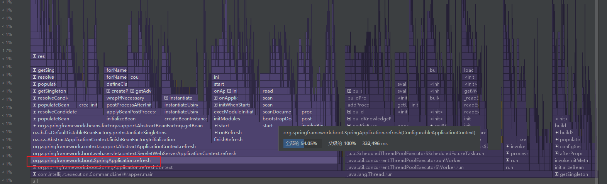
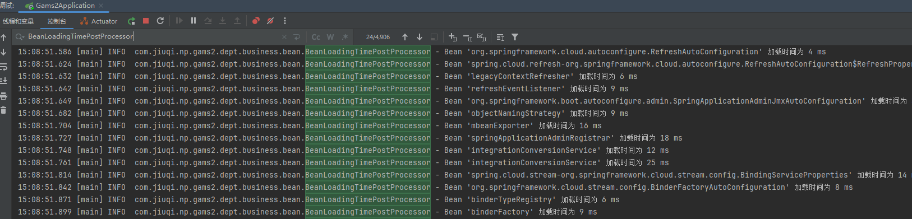
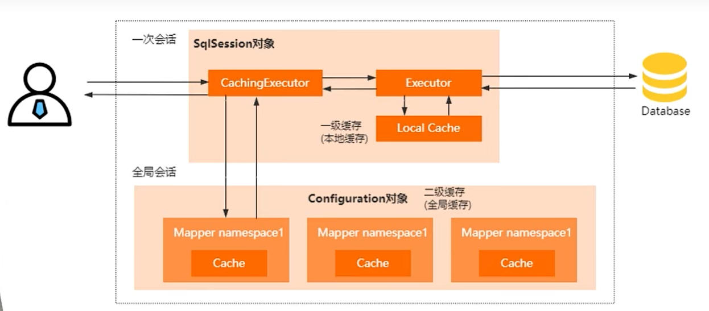

> **导航：** 
>
> [【Java笔记+踩坑汇总】Java基础+JavaWeb+SSM+SpringBoot+SpringCloud+瑞吉外卖/谷粒商城/学成在线+设计模式+面试题汇总+性能调优/架构设计+源码解析](https://blog.csdn.net/qq_40991313/article/details/126646289?csdn_share_tail={"type"%3A"blog"%2C"rType"%3A"article"%2C"rId"%3A"126646289"%2C"source"%3A"qq_40991313"})

[TOC]


# 一、Spring

[【Java常见面试题】Spring篇](https://blog.csdn.net/qq_40991313/article/details/131207135)

# 二、SpringBoot 

## 2.1 说说你对Spring Boot的理解,以及它和Spring的区别？

> **得分点**
>
> Spring Boot与Spring 的关系 、Spring Boot的主要功能 、Spring Boot的优点

**标准回答**

**与Spring 的关系：**Spring Boot是Spring的脚手架框架。

**优点：**快速构建项目、对主流框架的无配置集成、项目可独立运行，无需外部依赖Servlet容器、提供运行时的应用监控

**主要功能：**自动配置、起步依赖（一组关联度较高的依赖集合，并自动配置）、监控项目（Spring Boot Admin，监控性能、环境等信息，需要导入服务端和客户端的依赖和配置）

> 其实从本质上来说，**Spring Boot就是Spring**，它帮你完成了一些Spring Bean配置。Spring Boot使用**“习惯优于配置”的理念**让你的项目快速地运行起来，使用Spring Boot能很快的创建一个能独立运行、准生产级别、基于Spring框架的项目。
>
> 但Spring Boot本身不提供Spring的核心功能，而是作为**Spring的脚手架框架**，达到**快速构建项目，预设第三方配置，开箱即用**的目的。Spring Boot有很多优点，具体如下：
>
> \- 可以快速构建项目
>
> \- 可以对主流开发框架的无配置集成
>
> \- 项目可独立运行，无需外部依赖Servlet容器
>
> \- 提供运行时的应用监控
>
> \- 可以极大地提高开发、部署效率
>
> \- 可以与云计算天然集成
>
> **加分回答**
>
> Spring Boot 的核心功能：
>
> 1. 自动配置
>
> 针对很多Spring应用程序常见的应用功能，Spring Boot能自动提供相关配置。
>
> 2. 起步依赖
>
> Spring Boot通过起步依赖为项目的依赖管理提供帮助。起步依赖其实就是**特殊的Maven依赖**和Gradle依赖，利用了**传递依赖解析**，把**常用库聚合在一起**，组成了几个为特定功能而定制的依赖。
>
> 3. 端点监控 Spring Boot 可以对正在运行的项目提供监控。


## 2.2 说说Soring Boot的起步依赖

> **得分点**
>
> starter配置，约定大于配置

**标准回答**

**起步依赖：**一组关联度较高的依赖集合，用于快速搭建应用程序环境。 

**作用：**简化依赖jar包的导入、提供自动配置功能。

一些starter依赖的版本信息是由 spring-boot-starter-parent（版本仲裁中心） 统一控制，例如spring-boot-starter不用指定版本。

**约定大于配置：**

- **自动装配：**springboot会使用一些约定俗成的配置作为默认配置。例如自动扫描启动类所在包的bean、自动加载类路径下的配置类、自动装配starter依赖（例如redis默认端口6379，RabbitMQ客户端是5672服务端15672）。
- **自动扫描引导类所在包下的Bean：**Spring Boot在启动时会自动扫描@SpringBootApplication注解所在的包及其子包，并自动注册所有标注了@Bean注解的Bean实例。不需要再配置@ComponentScan("xx.xx");
- **自动加载类路径下的配置文件：**Spring Boot默认支持application.properties或application.yml格式的配置文件，并且只要这些文件放置到了classpath下，就会被自动识别并加载进来。

> Spring Boot的起步依赖是一种特殊的依赖关系，它可以**简化项目中依赖jar包的导入过程**，并提供了许多自动配置的功能。
>
> 所谓"起步依赖"，指的是一组预先定义好的、常用的、**关联度较高的依赖集合**，通过引入这些起步依赖，就能方便地快速搭建一个特定类型的**应用程序环境**。
>
> 这个依赖集合**包含了许多与Web开发有关的jar包**（如Spring MVC、Tomcat等），并且还会自动进行一些**默认的配置**（如设置视图解析器、注册消息转换器等），从而使得我们无需手动集成这些jar包和进行这些配置操作，就能够快速地启动一个基础的Web应用程序。
>
> Spring Boot提供了多种起步依赖，覆盖了不同的应用程序场景，开发人员可以根据实际需要来选择引入不同的依赖集合。同时，Spring Boot也支持自定义起步依赖，开发人员可以基于现有的依赖集合进行扩展，从而快速搭建出适合自己特定应用场景的开发环境。
>
> 
>
> Spring Boot 将日常企业应用研发中的各种场景都抽取出来，做成一个个的 starter（启动器），starter 中整合了该场景下各种可能用到的依赖，用户只需要在 Maven 中**引入 starter 依赖**，**SpringBoot 就能自动扫描到要加载的信息并启动相应的默认配置。**starter 提供了大量的自动配置，让用户摆脱了处理各种依赖和配置的困扰。所有这些 starter 都遵循着**约定成俗的默认配置**，并允许用户调整这些配置，即遵循**“约定大于配置”**的原则。
>
> 
>
> **约定大于配置**
>
> Spring Boot的核心设计理念就是"约定大于配置"（Convention Over Configuration），即通过一些默认的配置和约定来减少开发人员在项目中进行复杂的配置操作，从而提高开发效率。
>
> 
>
> 具体来讲，Spring Boot在很多地方都使用了约定大于配置的思想：
>
> 1. 启动类的位置。Spring Boot在启动时会自动扫描@SpringBootApplication注解所在的包及其子包，并自动注册所有标注了@Bean注解的Bean实例。
> 2. 默认配置文件。Spring Boot默认支持application.properties或application.yml格式的配置文件，并且只要这些文件放置到了classpath下，就会被自动识别并加载进来。
> 3. 自动装配。Spring Boot提供了自动配置功能，只需要引入相应的starter依赖，就可以由Spring Boot自动装配相关的依赖项、创建必要的Bean实例等。
> 4. 命名规范。Spring Boot通过一些常见的命名规范，如目录布局规范、类/接口命名规范，使得程序的结构更加清晰，易于维护。
>
> 总之，Spring Boot通过对常见应用场景的默认设置和约定，将大量的配置工作隐藏起来，提高了开发人员的生产力和开发效率。同时，如果需要进行定制化的配置，Spring Boot也提供了丰富的扩展机制和自定义配置选项。
>
> 那么我们看构建的项目的pom.xml文件中的starter配置。
>
> ```XML
> <dependency>
>     <groupid>org.springframework.boot</groupid>
>     <artifactid>spring-boot-starter-web</artifactid>
> </dependency>
> ```
>
> 
>
> 以 spring-boot-starter-web 为例，它能够为提供 Web 开发场景所需要的几乎所有依赖，因此在使用 Spring Boot 开发 Web 项目时，只需要引入该 Starter 即可，而不需要额外导入 Web 服务器和其他的 Web 依赖。

> **加分回答**
>
> 有时在引入starter时，我们并不需要指明版本（version），这是因为starter版本信息是由 spring-boot-starter-parent（版本仲裁中心） 统一控制的。


## 2.3 说说Spring Boot的启动流程

> **得分点**
>
> 调用run方法，run方法执行流程

**标准回答**

Spring Boot的启动流程：

1. **创建Spring应用程序上下文：**启动时自动创建ApplicationContext，使用`Application.class`引导应用程序并创建Spring应用程序上下文。SpringApplication.run(Application.class, args);
2. **加载引导类所在包下所有Bean：**扫描引导类所在包和子包下的Bean，基于类加载机制加载所有组件（如Spring Cloud）和第三方库（如Mybatis）
3. **自动配置：**@EnableAutoConfiguration查找classpath:/META-INF/spring.factories文件中的相关配置信息，找到第三方jar包里的配置类，实现自动配置
4. **执行Task任务、初始化：**引导类@EnableScheduling和任务方法@Scheduled(cron ="xx")实现定时任务任务，执行ApplicationContextInitialize接口实现类的initialize()方法进行初始化
5. **使用Tomcat或者Jetty服务器启动服务。**

> Spring Boot的启动流程
>
> 1. 创建Spring应用程序上下文（ApplicationContext）：Spring Boot使用内嵌的Tomcat或者Jetty服务器，所以启动时会自动创建一个applicationContext。首先使用`Application.class`引导应用程序并创建Spring应用程序上下文。
> 2. 加载Spring组件和第三方库：Spring Boot自动加载了大量常见依赖项，并对它们进行了管理。当应用程序启动时，Spring Boot会通过基于条件的类加载机制（根据classpath路径、JVM系统属性和环境变量判断是否加载某个类）加载所有需要的组件和第三方库。
> 3. 执行auto-configuration：Spring Boot通过查找classpath中的META-INF/spring.factories文件中的相关配置信息来实现自动配置，自动配置的类本质上是实现了Spring的`Condition`接口，该接口判断某些条件是否满足从而执行自动配置脚本，在初始化时检查条件后，将所判断的Bean注入到Spring容器中。
> 4. 进行scheduled task、initializers等相关操作：通过在SpringBootConfig类中加入@EnableScheduling来开启scheduled task，在应用程序上下文加载时，我们还可以添加一些ApplicationContextInitialize类来进行必要的初始化操作。
> 5. 启动服务：最后，Spring Boot使用内嵌的Tomcat或者Jetty服务器来启动正在运行的应用程序。


> 当Spring Boot项目创建完成后会默认生成一个**Application的入口类**，这个类中的main方法可以启动Spring Boot项目，在**main方法**中，通过SpringApplication的静态方法，即**run方法**进行**SpringApplication的实例化**操作，然后再针对实例化对象调用另外一个run方法来完成整个项目的初始化和启动。SpringApplication调用的run方法重点做了以下操作：
>
> \- 获取监听器参数配置
>
> \- 打印Banner信息
>
> \- 创建并初始化容器
>
> \- 监听器发送通知
>
> **加分回答**
>
> SpringApplication实例化过程中相对重要的配置：
>
> \- 项目启动类 SpringbootDemoApplication.class 设置为属性存储起来 this.primarySources = new LinkedHashSet<>(Arrays.asList(primarySources))；
>
> \- 设置应用类型是 SERVLET 应用还是 REACTIVE 应用
>
> ```java
> this.webApplicationType = WebApplicationType.deduceFromClasspath()；
> ```
>
> 
>
> \- 设置初始化器(Initializer)，最后会调用这些初始化器
>
> \- 所谓的初始化器就是 org.springframework.context.ApplicationContextInitializer 的实现类，在 Spring 上下文被刷新之前进行初始化的操作
>
> ```java
> setInitializers((Collection) getSpringFactoriesInstances(ApplicationContextInitializer.class))；
> ```
>
> 
>
> \- 设置监听器(Listener)
>
> ```java
> setListeners((Collection) getSpringFactoriesInstances(ApplicationListener.class))；
> ```
>
> 
>
> \- 初始化 mnApplicationClass 属性：用于推断并设置项目 mn()方法启动的主程序启动类 this.mnApplicationClass = deduceMnApplicationClass()；


## 2.4 说说SpringBoot的自动装配

> **得分点**
>
> 自动装配概念，自动装配流程

**标准回答**

**自动装配：**springboot会自动把第三方组件jar包里的 Bean 装载到IOC 器里面， 并配置初始化参数。

**@EnableAutoConfiguration：**在引导类注解@SpringBootApplication里，作用是开启自动配置。包括@AutoConfigurationPackage、@Import（AutoConfigurationImportSelector.class）两个注解。

- **@AutoConfigurationPackage：**扫描引导类所在包和子包下的所有Bean，加载到Spring容器。里面有注解@Import(AutoConfigurationPackages.Registrar)
- **@Import（AutoConfigurationImportSelector.class）：导入所有自动配置类。**AutoConfigurationImportSelector类实现了ImportSelector接口，它的loadSpringFactories()方法会找出META-INF/spring.factories文件里所有key为"EnableAutoConfiguration"的自动配置类，以列表的形式返回。

**自动配置过程：**

@EnableAutoConfiguration的@Import()注解导入了AutoConfigurationImportSelector类，这个类实现了ImportSelector接口，它内部会调用loadSpringFactories()方法，加载spring.factories中注册的所有AutoConfiguration类到Spring容器。

> 使用Spring Boot时，我们需要引入对应的Starters，Spring Boot启动时便会**自动加载相关依赖**，配置相应的**初始化参数**，以最快捷、简单的形式对第三方软件进行集成，这便是Spring Boot的自动配置功能。
>
> 整个自动装配的过程是：Spring Boot通过**@EnableAutoConfiguration**注解**开启自动配置**，加载spring.factories中注册的各种**AutoConfiguration类**，当某个AutoConfiguration类满足其注解**@Conditional**指定的生效条件（Starters提供的依赖、配置或Spring容器中是否存在某个Bean等）时，实例化该AutoConfiguration类中定义的**Bean**（组件等），并注入Spring容器，就可以完成依赖框架的自动配置。
>
> **加分回答**
>
> @EnableAutoConfiguration 作用
>
> 从classpath中搜索所有META-INF/spring.factories配置文件然后，将其中org.springframework.boot.autoconfigure.EnableAutoConfiguration key对应的配置项加载到spring容器 只有spring.boot.enableautoconfiguration为true（默认为true）的时候，才启用自动配置 @EnableAutoConfiguration还可以根据class来排除（exclude），或是根据class name（excludeName）来排除
>
> 其内部实现的关键点有
>
> 1. ImportSelector 该接口的方法的返回值都会被纳入到spring容器管理中
> 2. SpringFactoriesLoader 该类可以从classpath中搜索所有META-INF/spring.factories配置文件，并读取配置


## 2.5 说说Spring Boot、SSM常用的注解

> **得分点**
>
> Spring Boot常用注解的作用

**标准回答**

启动、配置相关注解： 

- @SpringBootApplication 里的@EnableAutoConfiguration开启自动配置
- @Import是自动配置的核心实现者
- @Conditional指定AutoConfiguration类里bean实例化的生效条件；
- @Configuration标注当前类是配置类
- @ComponentScan 组件扫描和自动装配

Controller 相关注解：

- @Controller标注类为控制器，处理http请求。
- @RequestMapping将请求路径映射到方法；
- @RestController相当于@ResponseBody+@Controller；
- @ResponseBody将方法返回的对象相映成JSON格式；
- @RequestBody接收请求体JSON数据，并转为对象或对象数组。
- @PathVariable获取请求路径中的数据；
- @RequestParam根据value获取同名请求参数的值、获取集合类型参数；
- @ControllerAdvice 统一处理异常；
- @RestControllerAdvice注解Rest风格统一处理异常；
- @ExceptionHandler 声明捕获异常类型；

Spring相关：

- @Component注解为Bean；
- @Scope设置Bean的作用域；
- @Autowired 自动注入
- @Transactional事务注解

导入配置文件：

- @PropertySource导入properties文件；
- @ImportResource导入xml配置文件；
- @Import：
  - **导入普通类：**将该类作为配置类加载到容器；
  - **导入实现了ImportSelector接口的类：**重写selectImports方法，返回String[]数组，数组里的每个全限定名对应的类都会注入到spring容器。
  - **导入实现了ImportBeanDefinitionRegister接口的类：**重写registerBeanDefinitions()方法，手动往beanDefinitionMap中注册 beanDefinition。

> 关于Spring Boot常用注解：
>
> **@SpringBootApplication注解：**
>
> 在Spring Boot入口类中,唯一的一个注解就是@SpringBootApplication。它是Spring Boot项目的核心注解,用于**开启自动配置**,准确说是通过该注解内组合的**@EnableAutoConfiguration**开启了自动配置。
>
> **@EnableAutoConfiguration注解：**
>
> @EnableAutoConfiguration的主要功能是启动Spring应用程序上下文时进行**自动配置**,它会尝试猜测并配置项目可能需要的Bean。自动配置通常是基于项目classpath中引入的类和已定义的Bean来实现的。在此过程中,**被自动配置的组件**来自项目自身和项目依赖的**jar包**中。
>
> **@Import注解：**
>
> @EnableAutoConfiguration的关键功能是通过@Import注解导入的ImportSelector来完成的。从源代码得知@Import(AutoConfigurationImportSelector.class)是@EnableAutoConfiguration注解的组成部分,也是**自动配置功能的核心实现者**。
>
> **@Conditional注解：**
>
> @Conditional注解是由Spring 4.0版本引入的新特性,可**根据是否满足指定的条件来决定是否进行Bean的实例化及装配**,比如,设定当类路径下包含某个jar包的时候才会对注解的类进行实例化操作。总之,就是根据一些特定条件来控制Bean实例化的行为。

## 2.6 SpringBoot启动速度优化

**概述：**

- **发现问题：**项目启动慢，需要四分钟；
- **分析问题：**使用IDEA自带的火焰图，发现Spring容器的refresh()方法占用了54%的时长。refresh()方法主要负责Bean的创建和初始化。
- **定位问题：**实现BeanPostProcessor接口，自定义Bean的前后置处理器，统计所有Bean的加载时间，发现有个依赖的第三方Dubbo服务在项目启动过程中，饿汉式地注册了所有订阅的服务。
- **解决问题：** 这些订阅的服务有些项目里用不到，所以我本地将这个配置类覆盖（基于双亲委派模型），只注入项目中用到的Service。

**火焰图原理：**

1. **采样分析：**在应用程序运行期间定期采样（例如每毫秒一次）调用栈，记录当前执行的函数。
2. **整理数据：**将采样数据整理成调用栈的汇总信息，计算每个函数出现在调用栈中的次数。每个函数出现的次数表示其占用的 CPU 时间比例。
3. **生成火焰图：**将整理好的数据以层级结构展示，每个矩形表示一个函数。矩形的宽度表示函数占用的 CPU 时间比例。矩形的纵向排列表示调用关系，上层矩形是下层矩形的调用者。

> **详细：** 
>
> **发现问题：**项目启动慢，需要四分钟；
>
> **分析问题：**使用IDEA自带的火焰图，发现Spring容器的refresh()方法占用了54%的时长。refresh()方法主要负责Bean的创建和初始化。
>
> 
>
> **定位问题：**实现BeanPostProcessor接口，自定义Bean的前后置处理器，统计所有Bean的加载时间，发现有个依赖的第三方Dubbo服务在项目启动过程中，饿汉式地注册了所有订阅的服务。
>
> ```java
> /**
>  * @Author: vince
>  * @CreateTime: 2024/05/14
>  * @Description: 计算Bean加载时间处理器
>  * @Version: 1.0
>  */
> @Component
> public class BeanLoadingTimePostProcessor implements BeanPostProcessor {
>     private static final Logger logger = LoggerFactory.getLogger(BeanLoadingTimePostProcessor.class);
> 
>     private Map<String, Long> startTimeMap = new ConcurrentHashMap<>();
> 
>     @Override
>     public Object postProcessBeforeInitialization(@NotNull Object bean, @NotNull String beanName) {
>         // 记录 Bean 初始化开始时间
>         startTimeMap.put(beanName, System.currentTimeMillis());
>         return bean;
>     }
> 
>     @Override
>     public Object postProcessAfterInitialization(@NotNull Object bean, @NotNull String beanName) {
>         // 记录 Bean 初始化结束时间
>         Long startTime = startTimeMap.get(beanName);
>         if (startTime != null) {
>             Long endTime = System.currentTimeMillis();
>             long loadTime = endTime - startTime;
>             // 打印 Bean 加载时间
>             logger.info("Bean '" + beanName + "' 加载时间为 " + loadTime + " ms");
>         }
>         return bean;
>     }
> }
> ```
>
> 
>
> 控制台打印出所有Bean的加载时间：
>
> 
>
> **解决问题：** 这些订阅的服务有些项目里用不到，所以我本地将这个配置类覆盖（基于双亲委派模型），只注入项目中用到的Service。

# 三、SpringMVC 

## 3.1 说说你对MVC的理解

> **得分点**
>
> mvc概念，model、view、controller模块功能

**MVC：** MVC（Model-View-Controller）是一种web项目的设计模式，把软件分为模型（数据）、视图（用户界面）、控制器（处理模型和视图间请求和响应）三层，让前端和业务逻辑代码和数据分开。 

**SpringMVC：**SpringMVC是在Servlet 基础上构建并且使用 MVC 模式设计的一个 Web 框架，也只使用在Web中。

1. **拆分Controller：**控制器Controller拆分成前端控制器DispatcherServlet 和后端控制器 Controller；
2. **拆分Model：**把模型Model拆分成业务层 Service 和数据访问层 Repository
3. 支持JSP、Freemark等视图；

**三层架构：**

- **表现层(UI)：**与用户交互的界面。可以用于接收用户输入的数据和显示处理后用户需要的数据。
- **业务逻辑层(BLL)：**是表现层和数据访问层的桥梁，实现业务逻辑处理。
- **数据访问层(DAL)：**关联着数据库。实现对数据的增删改查


**三层架构和MVC的区别：**

**从功能上看：**

- 三层架构是一个分层式的软件体系架构设计，适用于所有的项目。
- MVC模式是为了让前端和业务逻辑代码和数据分开，只使用在web项目中。

**从目的上看：**

- 三层架构侧重点是实现项目整体的解耦。
- MVC设计模式侧重点是web项目中前端页面和业务逻辑的解耦。

**从层次上看：**软件要先确定好框架，再进行设计模式。

- 三层架构是框架层面上的。
- MVC设计模式是设计模式层面上的。

> **标准回答**
>
> MVC是一种设计模式，在这种模式下软件被分为三层，即Model（模型）、View（视图）、Controller（控制器）。Model代表的是数据，View代表的是用户界面，Controller代表的是数据的处理逻辑，Controller是Model和View这两层的桥梁。将软件分层的好处是，可以将对象之间的**耦合度降低**，便于代码的维护。
>
> **Model：**指从现实世界中**抽象出来的对象模型**，是应用逻辑的反应；它封装了数据和对数据的操作，是实际进行数据处理的地方（模型层与数据库才有交互）。在MVC的三个部件中，模型拥有最多的处理任务。被模型返回的数据是中立的，模型与数据格式无关，这样一个模型能为多个视图提供数据，由于应用于模型的代码只需写一次就可以被多个视图重用，所以减少了代码的重复性。
>
> **View：**负责进行**模型的展示**，一般就是我们见到的用户界面。
>
> **Controller：**控制器负责视图和模型之间的**交互**，控制对用户输入的响应、响应方式和流程；它主要负责两方面的动作，一是把用户的**请求分发**到相应的模型，二是把模型的改变及时地反映到视图上。
>
> **加分回答-表现层、业务层、数据访问层、SpringMvc**
>
> 为了解耦以及提升代码的可维护性，服务端开发一般会对代码进行分层，服务端代码一般会分为三层：表现层、业务层、数据访问层。在浏览器访问服务器时，请求会先到达表现层
>
> 最典型的MVC就是jsp+servlet+javabean模式。
>
> 以JavaBean作为模型，既可以作为数据模型来封装业务数据，又可以作为业务逻辑模型来包含应用的业务操作。
>
> JSP作为视图层，负责提供页面为用户展示数据，提供相应的表单（Form）来用于用户的请求，并在适当的时候（点击按钮）向控制器发出请求来请求模型进行更新。
>
> Serlvet作为控制器，用来接收用户提交的请求，然后获取请求中的数据，将之转换为业务模型需要的数据模型，然后调用业务模型相应的业务方法进行更新，同时根据业务执行结果来选择要返回的视图。
>
> 当然，这种方式现在已经不那么流行了，**SpringMVC框架**已经成为了**MVC模式的最主流实现**。
>
> SpringMVC框架是基于Java**实现了MVC框架模式**的请求驱动类型的轻量级框架。前端控制器是DispatcherServlet接口实现类，映射处理器是HandlerMapping接口实现类，视图解析器是ViewResolver接口实现类，页面控制器是Controller接口实现类


## 3.2 为什么service层要写接口？

**依赖倒转原则：**高层模块不应该直接依赖于低层模块，两者都应该依赖于抽象。即详细应该依赖于抽象。在调用链上，调用者属于高层，被调用者属于低层。

因为controller需要调用service，所以controller是高层模块，service是低层模块。

所以controller层不能直接依赖于service层，他们都应该依赖于抽象，即service接口。

## 3.3 介绍一下Spring MVC的执行流程

> **得分点**
>
> 浏览器、DispatcherServlet、Controller、ViewResolver 

SpringMvc所有组件不能直接互相发送信息，都要经过前端控制器 DispatcherServlet统一转发。

Spring MVC的执行流程：

1. **浏览器发请求**到DispatcherServlet，DispatcherServlet分发给后端控制器**Controller**；
2. **Controller** 里面处理完业务逻辑之后，把**ModelAndView对象**分发给DispatcherServlet，DispatcherServlet分发给**视图解析器** ViewResolver 。
3. **视图解析器**把ModelAndView对象解析成**视图**View，发给DispatcherServlet，DispatcherServlet将模型填充到视图，分发给**浏览器**。


> **标准回答**
>
> SpringMVC 的执行流程如下。
>
> 1. 用户点击某个请求路径，发起一个 HTTP request 请求，该请求会被提交到前端控制器(DispatcherServlet)；
> 2. 由 DispatcherServlet 请求一个或多个处理器映射器(HandlerMapping)，并返回一个执行链(HandlerExecutionChn)。
> 3. DispatcherServlet 将执行链返回的 Handler 信息发送给处理器适配器(HandlerAdapter)；
> 4. HandlerAdapter 根据 Handler 信息找到并执行相应的 **Handler(常称为 Controller)；**
> 5. Handler 执行完毕后会返回给 HandlerAdapter 一个 **ModelAndView 对象**(Spring MVC的底层对象，**包括 Model 数据模型和 View 视图信息**)；
> 6. HandlerAdapter 接收到 ModelAndView 对象后，将其返回给 DispatcherServlet ；
> 7. DispatcherServlet 接收到 ModelAndView 对象后，会请求**视图解析器**(ViewResolver)对视图进行**解析**；
> 8. ViewResolver 根据 View 信息匹配到相应的视图结果，并返回给 DispatcherServlet；
> 9. DispatcherServlet 接收到具体的 View 视图后，进行视图渲染，将 Model 中的模型数据填充到 View 视图中的 request 域，生成最终的 View(视图)；
> 10. 视图负责将结果显示到浏览器(客户端)。
>
> **加分回答**
>
> Spring MVC 涉及到的**组件**有 DispatcherServlet（前端控制器）、HandlerMapping（处理器映射器）、HandlerAdapter（处理器适配器）、Handler（处理器）、ViewResolver（视图解析器）和 View（视图）。
>
> 下面对各个组件的功能说明如下：
>
> **DispatcherServlet**
>
> DispatcherServlet 是**前端控制器**，从图 1 可以看出，Spring MVC 的**所有请求**都要经过 DispatcherServlet 来**统一分发**。DispatcherServlet 相当于一个转发器或**中央处理器**，控制整个流程的执行，对各个组件进行统一调度，以降低组件之间的耦合性，有利于组件之间的拓展。
>
> **HandlerMapping**
>
> HandlerMapping 是**处理器映射器**，其作用是根据请求的 URL 路径，通过注解或者 XML 配置，**寻找匹配的处理器**（Handler）**信息**。
>
> **HandlerAdapter**
>
> HandlerAdapter 是**处理器适配器**，其作用是根据映射器找到的处理器（Handler）信息，按照特定规则**执行**相关的**处理器**（Handler）。
>
> **Handler（Controller）**
>
> Handler 是**处理器**，和 Java Servlet 扮演的角色一致。其作用是**执行**相关的**请求处理逻辑**，并**返回**相应的数据和视图信息，将其封装至 **ModelAndView 对象**中。
>
> **View Resolver**
>
> View Resolver 是**视图解析器**，其作用是进行解析操作，通过 **ModelAndView 对象**中的 View 信息将逻辑视图名**解析成**真正的视图 **View**（如通过一个 JSP 路径返回一个真正的 JSP 页面）。
>
> **View**
>
> View 是**视图**，其本身是一个接口，实现类支持不同的 View 类型（JSP、FreeMarker、Excel 等）。
>
> 以上组件中，需要**开发人员**进行开发的是**处理器**（Handler，常称Controller）和**视图**（View）。通俗的说，要开发处理该请求的具体代码逻辑，以及最终展示给用户的界面。

## 3.4 说说RestFull风格

**Rest：**一种接口设计风格，隐藏资源的访问行为。示例http://localhost/v1/user/1。

**RESTful：**遵循REST风格访问资源。

- **URI命名：**模块名用复数、名词，命名时对应数据库表名。增删改查行为隐藏，用请求方式区分。
- **请求方式：**增删改查分别用POST,DELETE,PUT,GET。
- **版本号：**将API的版本号放入URL中。示例http://localhost/v1/user/1。
- **搜索条件：**搜索条件的请求参数放在请求头，例如http://localhost/v1/user?page=2&pageSize=100


# 四、Mybatis 

## 4.1 介绍一下MyBatis的缓存机制

> **得分点**
>
> 一、二级缓存概念

**两级缓存都不是线程安全的**，推荐分布式场景下使用Redis等分布式缓存。 默认情况下只开启一级缓存。

**一级缓存：**

- **缓存级别：**SqlSession级别（单个会话）的缓存，仅支持单个会话内缓存。SqlSession将查询结果缓存在内存中，再次相同查询时MyBatis 会从缓存中获取数据。
- **生命周期：**生命周期和SqlSession一致。
- **失效模式：**增删改或SqlSession改变时，一级缓存会失效。
- **底层：**一个简单的没有容量限制的HashMap。每次查询时SqlSession对象里的Executor先从Local Cache里查，查不到再查数据库写到缓存里和缓存。

**二级缓存：**

- 缓存级别：

  SqlSessionFactory级别（跨会话）、mapper级别、namespace级别的缓存，要手动开启。会缓存当前映射配置文件下的所有SqlSession查到的数据，可以指定缓存容量，多个SqlSession之间缓存可以共享。 	

  ```bash
  #yml开启二级缓存
  mybatis:
    configuration:
      cache-enabled: true
  ```

  

- 配置：

  - **刷新间隔：**默认是0，即增删改后立即刷新缓存。

  - **淘汰策略：**LRU（默认）、FIFO、SOFT（软，内存快慢时回收）、WEAK（弱，下次垃圾回收时回收）。

  - **大小：**默认1M

  - 是否只读：

    默认false。 	

    - **只读：**给所有调用者返回同一个缓存实例。只要一个调用者改了实例，其他调用者访问的实例也更改了。性能高但不安全。
    - **关闭只读：**给每个调用者返回缓存实例的拷贝。本调用者修改自己的拷贝不会影响到其他调用者。性能差但安全，所以默认。

  - ```XML
    <!-- 配置本mapper所在namespace的二级缓存，下面都是默认值 -->
    <cache eviction="LRU" flushInterval="0" size="1024" readOnly="false"/>
    ```

    

- **粒度：**粒度更加的细，能够到 namespace 级别。也就是说缓存映射语句文件中所有查询语句。namespace在映射配置文件<mapper namespace="package1.mapper.UserMapper">，用来找到对应的mapper接口。

- **可控性：**可以通过Cache接口实现自定义缓存。实现方法是新建@Component注解的实现类，重写get(),put(),putIfAbsent(),evict(),clear(),getName()等方法。 

- **底层：**先通过SqlSession里的CachingExecutor查全局的二级缓存，如果查不到再查一级缓存。




> **标准回答**
>
> **SqlSession** 负责管理持久层的一次**数据库操作会话**。在使用 MyBatis 进行数据库操作时，每个线程都应该拥有自己的 SqlSession 实例。SqlSession 对象不是线程安全的。 
>
> ```java
> List<User> users = sqlSession.selectList("namespace.selectAll");
> ```
>
> 
>
> **一级缓存也称为本地缓存**，它**默认启用且不能关闭**。一级缓存存在于SqlSession的生命周期中，即它是**SqlSession级别的缓存**。在同一个 SqlSession 中查询时，MyBatis 会把执行的方法和参数通过算法生成缓存的键值，将键值和查询结果存入一个Map对象中。如果同一个SqlSession 中执行的方法和参数完全一致，那么通过算法会生成相同的键值，当Map缓存对象中己经存在该键值时，则会返回缓存中的对象。
>
> SqlSessionFactory是用于创建 SqlSession 对象的工厂。
>
> ```java
>    SqlSession sqlSession = sqlSessionFactory.openSession();
> ```
>
> 
>
> **二级缓存**存在于SqlSessionFactory 的生命周期中，即它是**SqlSessionFactory级别的缓存**。若想使用二级缓存，需要在如下两处进行配置：
>
> -在MyBatis 的**全局配置settings** 中有一个**参数cacheEnabled**，这个参数是二级缓存的全局开关，默认值是true ，初始状态为启用状态。
>
> \- MyBatis 的二级缓存是**和命名空间绑定的**，即二级缓存需要**配置在Mapper.xml 映射文件**中。
>
> **配置二级缓存：**
>
> mybatis-config.xml
>
> ```XML
> <setting name="cacheEnabled" value="true"/>
> ```
>
> 
>
> Mapper.xml
>
> ```XML
> <cache eviction="LRU" flushInterval="60000" size="512" readOnly="true"/>
> ```
>
> 
>
> 其中，eviction 属性用来指定缓存淘汰策略，flushInterval 属性表示缓存刷新时间间隔，size 属性表示缓存的大小，readOnly 属性表示缓存是否只读等等。 
>
> **二级缓存具有如下效果：**
>
> \- 映射语句文件中的**所有SELECT 语句将会被缓存**。
>
> \- 映射语句文件中的所有INSERT 、UPDATE 、DELETE 语句会**刷新缓存**。
>
> \- 缓存会使用Least Recently Used ( LRU ，**最近最少使用的**）算法来**收回**。
>
> \- 根据时间表（如no Flush Interval ，没有刷新间隔），缓存不会以任何时间顺序来刷新。
>
> \- 缓存会存储集合或对象（无论查询方法返回什么类型的值）的1024 个引用。
>
> \- 缓存会被视为read/write（可读／可写）的，意味着对象检索不是共享的，而且可以安全地被调用者修改，而不干扰其他调用者或线程所做的潜在修改。
>
> **加分回答**-**Mybatis 一级缓存失效的四种情况：**
>
> \- **sqlsession变了 缓存失效**
>
> \- sqlsession不变，查询条件不同，一级缓存失效
>
> **-** sqlsession不变，中间发生了**增删改操作，一级缓存失败**
>
> \- sqlsession不变，手动清除缓存，一级缓存失败
>
> **两级缓存不是线程安全的**
>
> MyBatis的二级缓存相对于一级缓存来说，实现了SqlSession之间缓存数据的共享，同时粒度更加的细，能够到namespace级别，通过Cache接口实现类不同的组合，对Cache的可控性也更强。
>
> MyBatis在多表查询时，极大可能会出现脏数据，这导致安全使用二级缓存的条件比较苛刻。 由于默认的MyBatis Cache实现都是基于本地的，这导致在分布式环境下，一定会出现读取到脏数据的情况，且开发成本较高，所以开发环境中一般都会直接使用Redis，Memcached等分布式缓存.


## 4.2 在MyBatis中$和#有什么区别

> **得分点**
>
> 使用传参方式MyBatis创建SQL的不同，安全和效率问题

使用**$**设置参数时，MyBatis会创建**普通的SQL语句**，然后在执行SQL 语句时将**参数拼入SQL**；

使用**#**设置参数时，MyBatis会创建**预编译的SQL语句**，然后在执行SQL时MyBatis会为预编译SQL中的**占位符赋值**。

**优缺点：** 

**预编译**的SQL语句执行**效率高**，并且可以**防止注入攻击**，效率和安全性都大大优于前者。

但在解决一些特殊问题，如在一些根据不同的条件产生不同的动态列中，我们要传递SQL的列名，根据某些列进行排序，或者传递列名给SQL就只能使用$了。

## 4.3 resultType和resultMap区别

resultType和resultMap都用于设置mybatis增删改查后返回的数据类型，两者只能使用一个。 

resultType：指定实体类的全限定名或首字母小写的类名，MyBatis 会自动将查询的结果映射成对应实体类。适用于数据库字段名和实体类属性名一致的情况。

resultMap： 给列起别名并查询所有。适用于数据库字段名和实体类属性名不同的情况。mybatis默认会进行驼峰转换。

> ```XML
> <?xml version="1.0" encoding="UTF-8" ?>
> <!DOCTYPE mapper PUBLIC "-//mybatis.org//DTD Mapper 3.0//EN" "http://mybatis.org/dtd/mybatis-3-mapper.dtd">
> <!--        映射配置文件 UserMapper.xml-->
> <!--namespace名称空间，该命名空间和对应mapper接口的全限定名一致-->
> <mapper namespace="package1.mapper.UserMapper">
>     <select id="selectAll" resultType="package1.pojo.User">
>         select * from tb_user;
>     </select>
> </mapper>
> ```
>
> 
>
> ```XML
> <?xml version="1.0" encoding="UTF-8" ?>
> <!DOCTYPE mapper
>         PUBLIC "-//mybatis.org//DTD Mapper 3.0//EN"
>         "http://mybatis.org/dtd/mybatis-3-mapper.dtd">
>  
> <mapper namespace="com.itheima.mapper.BrandMapper">
>     <!--给列名起别名，让列名和成员变量一致，实现赋值-->
> <resultMap id="brandResultMap" type="brand">
>     <!--
>             id：完成主键字段的映射
>                 column：表的列名
>                 property：实体类的属性名
>             result：完成一般字段的映射
>                 column：表的列名
>                 property：实体类的属性名
>         -->
>     <result column="brand_name" property="brandName"/>
>     <result column="company_name" property="companyName"/>
> </resultMap>
>     <select id="selectAll" resultMap="brandResultMap">
>         select *
>         from tb_brand;
>     </select>
> </mapper>
> ```
>
> 

# 五、JavaWeb

## 5.1 cookie和session的区别是什么？

- **存储位置不同：**cookie存放于客户端；session存放于服务端。
- **存储容量不同：**单个cookie保存的数据<=**4KB**，一个站点最多保存**20个**cookie；而session并没有上限。
- **存储方式不同：**cookie只能保存ASCII字符串，并需要通过编码当时存储为Unicode字符或者二进制数据；session中能够存储任何类型的数据，例如字符串、整数、集合等。
- **隐私策略不同：**cookie对客户端是可见的，别有用心的人可以分析存放在本地的cookie并进行cookie欺骗，所以它是不安全的；session存储在服务器上，对客户端是透明的，不存在敏感信息泄露的风险。
- **生命周期不同：**可以通过设置cookie的属性，达到cookie长期有效的效果；session依赖于名为JSESSIONID的cookie，而该cookie的默认过期时间为-1，只需关闭窗口该session就会失效，因此session不能长期有效。
- **服务器压力不同：**cookie保存在客户端，不占用服务器资源；session保管在服务器上，**每个用户都会产生一个session**，如果并发量大的话，则会消耗大量的服务器内存。
- **浏览器支持不同：**cookie是需要浏览器支持的，如果客户端禁用了cookie，则会话跟踪就会失效；运用session就需要使用URL重写的方式，所有用到session的URL都要进行重写，否则session会话跟踪也会失效。
- **跨域支持不同：**cookie支持跨域访问，session不支持跨域访问。

## 5.2 cookie和session各自适合的场景是什么？

**session：**对于敏感数据，应存放在session里，因为cookie不安全。

**cookie：**对于普通数据，优先考虑存放在cookie里，这样会减少对服务器资源的占用。

## 5.3 请介绍session的工作原理

1. 客户端首次访问服务器，服务器创建具有唯一标识SESSIONID的session对象；
2. 响应阶段，服务器创建一个携带SESSIONID的cookie，并响应给客户端；
3. 客户端获取响应到的cookie，再次访问服务器时携带SESSIONID，获取对应session对象里的信息。

## 5.4 get请求与post请求有什么区别？

- **书签标记：**GET产生的URL地址可以被Bookmark（书签标记），而POST不可以。
- **参数历史记录保留：**GET请求参数会被完整保留在浏览器历史记录里，而POST中的参数不会被保留。
- **浏览器主动缓存：**GET请求会被浏览器主动cache，而POST不会，除非手动设置。
- **编码格式：**GET请求只能进行url编码，而POST支持多种编码方式。
- **参数长度限制：**GET请求在URL中传送的参数是有长度限制的，而POST没有。
- **参数类型限制：**对参数的数据类型，GET只接受ASCII字符，而POST没有限制。
- **安全性：**GET比POST更不安全，因为参数直接暴露在URL上，所以不能用来传递敏感信息。
- **请求参数位置：**GET参数通过URL传递，URL在请求行里；POST在请求体里。
- **幂等性：**post不幂等，而GET，PUT，DELETE都是幂等的。因为post是保存新记录，post几次就创建几次，而get只读不会影响数据，put是修改，多次修改都是修改成固定的值，delete是删除，多次删除只是删除已经被删除的数据。

## 5.5 get请求的参数能放到请求体吗？

GET请求是可以将参数放到BODY里面的，**官方并没有明确禁止**，但给出的建议是这样**不符合规范**，无法保证所有的实现都支持。这就意味着，如果你试图这样做，可能出现各种未知的问题，所以应该当避免。

## 5.6 页面报400错误是什么意思？

**参考答案**

400状态码标识请求的语义有误，当前**请求无法被服务器理解**。除非进行修改，否则客户端不应该重复提交这个请求。通常情况下，是本次请求中**包含有错误的参数**，此时应该排查前端传递的参数。

## 5.8 Maven生命周期

- **clean：**清理上次构建生成的jar包
- **validate：**校验工程信息是否正确
- **comple：**编译工程
- **test：**使用JUnit等单元测试工具测试工程(标注的test的程序)
- **package：**打包工程成jar包
- **verify：**验证jar包是否符合规范
- **install：**安装jar包到本地仓库
- **deploy：**推送jar包到远程仓库

## 5.9 socket的过程 

Socket是网络通信中使用的一种机制，它可以实现两个不同的**进程之间的通信**。

**Socket的通信过程：**

1. **服务器绑定端口号：**服务器端启动，绑定一个端口号，等待客户端的连接请求。
2. **客户端指定端口号发请求：**客户端启动，向服务器端发送连接请求，并指定服务器的IP地址和端口号。
3. **服务器创建Socket对象：**服务器端接收到客户端的连接请求后，为该连接创建一个新的Socket对象，同时服务器端继续等待其他客户端的连接请求。
4. **客户端创建Socket对象：**客户端接收到服务器端的响应后，为该连接创建一个新的Socket对象，然后通过该Socket对象与服务器端进行通信。
5. **通信：**服务器端和客户端通过各自的Socket对象进行通信，直到通信结束。
6. **关闭Socket对象：**通信结束后，客户端和服务器端分别关闭自己的Socket对象，释放网络资源。

在通信过程中，Socket对象扮演着重要的角色，它通过网络传输数据并完成通信。在Java中，可以使用Java Socket API实现Socket通信。