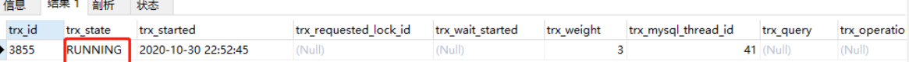

>  **导航：**
>
> [【Java笔记+踩坑汇总】Java基础+JavaWeb+SSM+SpringBoot+SpringCloud+瑞吉外卖/谷粒商城/学成在线+设计模式+面试题汇总+性能调优/架构设计+源码解析](https://blog.csdn.net/qq_40991313/article/details/126646289?csdn_share_tail={"type"%3A"blog"%2C"rType"%3A"article"%2C"rId"%3A"126646289"%2C"source"%3A"qq_40991313"})

[TOC]


## 1、简单介绍Spring

> **得分点：**
>
> IOC、Bean、DI、AOP、事务

**为什么使用Spring？**

- **轻量级、简化开发：**Spring是一个轻量级的应用框架，基本版本只有2M。Spring目的是为了简化企业级应用的开发。
- **核心功能：**IOC/DI/AOP/事务：开发者只需要关注业务需求，而不需要关心bean的管理。Spring通过IOC和DI有效降低了耦合性，通过aop有效降低了代码的侵入性；事务可定制性高，支持多个隔离级别、传播策略。
- **SpringMVC：**是Spring的一个子模块，提供了功能更强大、更灵活的web框架支持，它的工作原理主要是通过 DispatcherServlet （调度控制器）进行派发和处理请求。
- **容易集成：**可以轻松集成Mybatis等第三方框架，只需要导入依赖和简单的配置即可。例如整合Mybatis只需要导入mybatis-spring包，注册DataSource、SqlSessionFactoryBean、MapperScannerConfigurer为Bean即可。
- **开放源码，社区灵活：**Spring 有一个庞大的社区，提供了丰富的文档、示例代码、扩展库等。像springboot、SpringCloud、SpringSecurity等框架都是基于Spring实现的

Spring是一个用来简化web开发、微服务、分布式开发的框架，并且可以进行事务处理和整合其他框架。

**IOC控制反转思想：**创建对象的控制权由内部（即new实例化）反转到外部（即IOC容器）。

**Bean：**IOC容器中存放的一个个对象

**DI依赖注入：**绑定IOC容器中bean与bean之间的依赖关系。例如将dao层对象注入到service层对象。

**AOP面向切面编程：**在不改原有代码的前提下对代码进行增强。抽取共性代码（即通知），植入到待增强的方法（即切入点）。通知和切入点的关系即切面，增强的方法是创建原始对象增强后的代理对象。

**事务：**保证数据层或业务层一系列的数据库操作同成功同失败

> **标准回答**
>
> Spring框架包含众多模块，如Core、Testing、Data Access、Web Servlet等，其中**Core**是整个Spring框架的**核心模块**。
>
> Core模块提供了IoC容器、AOP功能、数据绑定、类型转换等一系列的基础功能，而这些功能以及其他模块的功能都是建立在IoC和AOP之上的，所以**IoC和AOP是Spring框架的核心**。
>
> **IoC** **控制反转**
>
> 创建对象的控制权由内部（new实例化）反转到外部（即IOC容器），此思想称为控制反转。使用对象时，由主动new产生对象转换为由外部提供对象。
>
> IoC（Inversion of Control）是控制反转的意思，这是一种面向对象编程的设计思想。在不采用这种思想的情况下，我们需要自己维护对象与对象之间的依赖关系，很容易造成对象之间的耦合度过高，在一个大型的项目中这十分的不利于代码的维护。IoC则可以解决这种问题，它可以帮我们**维护对象与对象之间的依赖关系**，降低对象之间的耦合度。
>
> **DI依赖注入**
>
> 说到IoC就不得不说DI（Dependency Injection），DI是依赖注入的意思，它是IoC实现的实现方式，就是说**IoC是通过DI来实现的**。由于IoC这个词汇比较抽象而DI却更直观，所以很多时候我们就用DI来代替它，在很多时候我们简单地将IoC和DI划等号，这是一种习惯。而实现依赖注入的关键是**IoC容器**，它的本质就是一个工厂。
>
> **AOP** **面向切面编程**
>
> AOP（Aspect Oriented Programing）是面向切面编程思想，这种思想是对OOP的补充，它可以在OOP的基础上进一步**提高编程的效率**。简单来说，它可以统一解决一批组件的共性需求（如权限检查、记录日志、事务管理等）。在AOP思想下，我们可以将解决**共性需求的代码独立出来**，然后通过**配置**的方式，声明这些代码在什么地方、什么时机调用。当满足调用条件时，AOP会将该业务代码**植入**到我们指定的位置，从而统一解决了问题，又不需要修改这一批组件的代码。
>
> **参考：**
>
> [Spring基础1——Spring（配置开发版）,IOC和DI_vincewm的博客-CSDN博客](https://blog.csdn.net/qq_40991313/article/details/126283925)
>
> [Spring基础3——AOP，事务管理_spring aop事务管理_vincewm的博客-CSDN博客](https://blog.csdn.net/qq_40991313/article/details/126339270)


## 2、说说你对IOC的理解

> **得分点**
>
> 控制反转与依赖注入含义

**标准回答**

**IOC控制反转思想：**创建对象的控制权由内部（即new实例化）反转到外部（即IOC容器）。

**Bean：**IOC容器中存放的一个个对象

**DI依赖注入：**绑定IOC容器中bean与bean之间的依赖关系。例如将dao层对象注入到service层对象。


> IoC是控制反转的意思，是一种面向对象编程的设计思想。在不采用这种思想的情况下，我们需要自己维护对象与对象之间的依赖关系，很容易造成对象之间的耦合度过高，在一个大型的项目中这十分的不利于代码的维护。IoC则可以解决这种问题，它可以帮我们维护对象与对象之间的依赖关系，并且降低对象之间的耦合度。
>
> 说到IoC就不得不说DI，DI是依赖注入的意思，它是IoC实现的实现方式。由于IoC这个词汇比较抽象而DI比较直观，所以很多时候我们就用DI来代替它，在很多时候我们简单地将IoC和DI划等号，这是一种习惯。实现依赖注入的关键是IoC容器，它的本质就是一个工厂。
>
> **加分回答**
>
> IoC是Java EE企业应用开发中的就偶组件之间复杂关系的利器。
>
> 在以Spring为代表的轻量级Java EE开发风行之前，实际开发中是使用更多的是EJB为代表的开发模式。在EJB开发模式中，开发人员需要编写EJB组件，这种组件需要满足EJB规范才能在EJB容器中运行，从而完成获取事务，生命周期管理等基本服务，Spring提供的服务和EJB并没有什么区别，只是在具体怎样获取服务的方式上两者的设计有很大不同：Spring IoC提供了一个基本的JavaBean容器，通过IoC模式管理依赖关系，并通过依赖注入和AOP切面增强了为JavaBean这样的POJO对象服务于事务管理、生命周期管理等基本功能；而对于EJB，一个简单的EJB组件需要编写远程／本地接口、Home接口和Bean的实体类，而且EJB运行不能脱离EJB容器，查找其他EJB组件也需要通过诸如JNDI的方式，这就造成了对EJB容器和技术规范的依赖。也就是说Spring把EJB组件还原成了POJO对象或者JavaBean对象，以此降低了用用开发对于传统J2EE技术规范的依赖。
>
> 在应用开发中开发人员设计组件时往往需要引用和调用其他组件的服务，这种依赖关系如果固化在组件设计中，会造成依赖关系的僵化和维护难度的增加，这个时候使用IoC把资源获取的方向反转，让IoC容器主动管理这些依赖关系，将这些依赖关系注入到组件中，这就会让这些依赖关系的适配和管理更加灵活。


## 3、说说你对AOP的理解

> **得分点**
>
> AOP概念、AOP作用、AOP的实现方式

**标准回答**

**AOP面向切面编程：**抽取共性代码（即通知），植入到待增强的方法（即切入点）。

**作用：**在不改原有代码的前提下对代码进行增强。

**核心概念：**

- **连接点：**Bean中的每个方法都可以成为连接点；
- **切入点：**Bean中待增强的方法；
- **通知：**共性方法、增强的内容；
- **通知类：**通知所在的Bean；
- **切面：**通知和切入点的关系。

**AOP底层实现方式：** 

- JDK动态代理：

  运行时创建接口的代理实例，基于反射机制。目标对象有实现接口时采用这种代理。 	

  - 原始和代理对象实现代理接口，简单工厂类通过Proxy.newProxyInstance()返回增强后的代理对象**。**利用Java反射机制在运行时动态地在内存中生成代理对象。Spring AOP采用了JDK动态代理的方式，在运行时动态的创建代理对象来实现增强。

- CGLib代码生成库动态代理：

  运行时创建子类代理的实例，基于ASM框架和字节码文件。目标对象没有实现任何接口时采用这种代理。 

  - 简单工厂类实现MethodInterceptor接口重写intercept()方法增强，通过Enhancer工具类返回实例。在内存中构建一个子类对象从而实现对目标对象功能扩展。底层是通过使用ASM框架转换字节码并生成新的类。ASM可以直接生成字节码，也可以通过访问现有字节码来修改它。

**通知类型：**前置、后置、环绕（@Around("pt()")和ProceedingJoinPoint参数）、异常后、返回后通知

**应用场景：**日志和事务。

> AOP是一种编程思想，是通过预编译方式和运行期动态代理的方式实现**不修改源代码**的情况下**给程序动态统一添加功能**的技术。面向对象编程将程序抽象成各个层次的对象，而面向切面编程是将程序抽象成各个切面。
>
> 所谓切面，相当于应用对象间的横切点，我们可以将其单独抽象为单独的模块。AOP技术利用一种称为“横切”的技术，剖解开封装对象的内部，将影响多个类的公共行为封装到一个可重用的模块中，并将其命名为切面。所谓的**切面**，简单来说就是**与业务无关，却为业务模块所共同调用的逻辑**，将其封装起来便于减少系统的重复代码，降低模块的耦合度，有利用未来的可操作性和可维护性。
>
> 利用AOP可以对业务逻辑各个部分进行隔离，从而使业务逻辑各部分之间的耦合度降低，提高程序的可重用性，同时提高开发效率。
>
> **AOP**可以有多种**实现方式**，而Spring AOP支持如下两种实现方式。
>
> **- JDK动态代理：**这是Java提供的动态代理技术，可以在**运行时创建接口的代理实例**。Spring AOP**默认**采用这种方式，在接口的代理实例中织入代码。
>
> **- CGLib**(Code Generation Library)**动态代理：**采用底层的字节码技术，在运行时**创建子类代理的实例**。当目标对象**不存在接口时**，Spring AOP就会采用这种方式，在子类实例中织入代码。
>
> **加分回答-应用场景**
>
> 在应用场景方面，Spring AOP为IoC的使用提供了更多的便利，一方面，应用可以直接使用AOP的功能，设计应用的横切关注点，把跨越应用程序多个模块的功能抽象出来，并通过简单的AOP的使用，灵活地编制到模块中，比如可以**通过AOP实现应用程序中的日志功能**。另一方面，在Spring内部，例如**事务处理**之类的一些支持模块**也是通过Spring AOP来实现**的。
>
> AOP不能增强的类：
>
> 1. Spring AOP**只能对IoC容器中的Bean进行增强**，对于不受容器管理的对象不能增强。
> 2. 由于CGLib采用动态创建子类的方式生成代理对象，所以不能对final修饰的类进行代理。

## 4、说说Bean的生命周期

> **得分点**
>
> Bean生命周期的四大部分以及详细步骤

生命周期四大部分 ：Bean 定义、Bean 的初始化、Bean的生存期、Bean 的销毁。

**Spring生命周期：**

- **扫描Bean：**Spring启动后，ApplicationContext扫描@ComponentScan注解配置的扫描路径下的所有.class文件，类加载器根据类名加载获取类的Class对象，通过判断@Component等注解找出Bean；

- **存到beanDefinitionMap：**调用getBean()方法，给每个Bean创建BeanDefinition对象存放Class对象、作用域等信息，并放进beanDefinitionMap，映射关系是"Bean名"--->“对应的BeanDefinition”。

- 遍历beanDefinitionMap，创建所有Bean，每个Bean的创建过程如下：

- 推断构造方法：

  - 根据BeanDefinition得到Class对象。
  - 如果BeanDefinition绑定了一个Supplier，那就调用Supplier的get方法得到一个对象并直接返回。
  - 如果BeanDefinition中存在factoryMethodName，那么就调用该工厂方法得到一个bean对象并返回。
  - 如果BeanDefinition已经自动构造过了，那就调用autowireConstructor()自动构造一个对象。
  - 如果有一个构造方法，则使用该构造方法实例化对象；
  - 如果有多个构造方法，有且仅有一个构造方法注解了@Autowired，则选用该构造方法实例化对象。
  - 如果有多个构造方法，并且都没有注解@Autowired，选用无参构造方法实例化对象。如果都带参，且有0个或多个构造方法注解了@Autowired”，则报错“Bean初始化异常”。

- **实例化：**基于反射获取推断出的构造器对象，通过这个Constructor对象的newInstance(xx) 方法实例化类，得到原始对象；

- **存入三级缓存：**基于原始对象生成Lambda表达式，并放入三级缓存singletonFactories。以后如果执行这个Lambda表达式，生成的将是代理对象。

- 属性填充：

  推断和实例化、存入三级缓存、属性填充（单例池找、判断循环依赖、二级缓存找、三级缓存找到，生成提前代理对象）、执行三级缓存、存入单例池 

  - **按名称注入；**基于反射获取Bean的所有属性，将有@Autowired等注解的属性开启私有成员访问限制，通过getBean()方法（解决了单例循环依赖）给该属性填充它的Bean对象。
  - **按类型注入；**

- **处理Aware回调：**如果Bean实例实现了BeanNameAware接口（通过instanceof判断），调用Bean重写的setBeanName()方法，给Bean实例的beanName变量赋值。

- **执行所有BeanPostProcessor的初始化前方法：**遍历所有BeanPostProcessor实现类所在的列表，执行每个BeanPostProcessor对象里的postProcessBeforeInitialization()方法。本方法可以通过JDK的Proxy.newProxyInstance()实现动态代理返回目标对象的代理对象。

- **初始化：**如果Bean实例实现了InitializingBean接口（通过instanceof判断），调用Bean重写的afterPropertiesSet()方法，处理初始化逻辑。afterPropertiesSet译为“在属性填充之后”

- **执行所有BeanPostProcessor的初始化后方法：**遍历所有BeanPostProcessor实现类所在的列表，执行每个BeanPostProcessor对象里的postProcessAfterInitialization()方法。本方法可以通过JDK的Proxy.newProxyInstance()实现动态代理返回目标对象的代理对象。

- **存入单例池：**如果是单例，就将最终的代理对象存入单例池（一级缓存，singletonObjects）。

- **生存期：**Bean已就绪，可以被使用，所有Bean将一直驻留在应用上下文中，直到应用上下文被销毁。

- **销毁：**如果bean实现了DisposableBean接口，Spring将调用它的destory()接口方法，同样，如果有方法注解了@PreDestroy，该方法也会被调用。

> **详细参考：**
>
> [Spring框架中Bean是如何加载的？从底层源码入手，详细解读Bean的创建流程-CSDN博客](https://blog.csdn.net/qq_40991313/article/details/137231482)

> Bean 生命周期大致分为 Bean 定义、Bean 的初始化、Bean的生存期和 Bean 的销毁4个部分。
>
> 1. **创建Bean：**Spring启动，查找并加载需要被Spring管理的bean，进行Bean的实例化
> 2. **属性填充：**Bean实例化后对将Bean的引用和值注入到Bean的属性中
> 3. **BeanNameAware：**如果Bean实现了BeanNameAware接口的话，Spring将Bean名传递给setBeanName()方法
> 4. **@PostConstruct：**如果自定义初始化方法，并在该方法前增加@PostConstruct注解，Spring将执行这个方法
> 5. **BeanFactoryAware：**如果Bean实现了BeanFactoryAware接口的话，Spring将调用setBeanFactory()方法，将BeanFactory容器实例传入
> 6. **ApplicationContextAware：**如果Bean实现了ApplicationContextAware接口的话，Spring将调用Bean的setApplicationContext()方法，将bean所在应用上下文引用传入进来。
> 7. **BeanPostProcessor：**如果Bean实现了BeanPostProcessor接口，Spring就将调用他们的postProcessBeforeInitialization()方法。
> 8. **InitializingBean：**如果Bean 实现了InitializingBean接口，Spring将调用他们的afterPropertiesSet()方法。类似的，如果bean使用init-method声明了初始化方法，该方法也会被调用
> 9. **BeanPostProcessor：**如果Bean 实现了BeanPostProcessor接口，Spring就将调用他们的postProcessAfterInitialization()方法。 
> 10. **生存期：**Bean已就绪，可以被使用，所有Bean将一直驻留在应用上下文中，直到应用上下文被销毁。
> 11. **@PreDestroy：**如果有方法注解了@PreDestroy；Spring容器将在自身销毁前，调用这个方法。
> 12. **销毁：**如果bean实现了DisposableBean接口，Spring将调用它的destory()接口方法，同样，如果bean使用了destory-method 声明销毁方法，该方法也会被调用。

## 5、说说循环依赖和三级缓存

>  循环依赖、三级缓存解决循环依赖底层原理、三级缓存介绍

 **循环依赖：** 

```java
AService{注入BService}
BService{注入AService}
```


**三级缓存解决循环依赖底层原理：** 

 **AService创建过程：**

- **推断和实例化：**推断构造方法，实例化AService原始对象；

- **存入三级缓存：**生成Lambda表达式，并放入三级缓存。对应方法是addSingletonFactory()。Lambda表达式参数包括原始对象，以后如果执行这个Lambda表达式，将执行aop并生成AService代理对象；singletonFactories.put('AService',()-> getEarlyBeanReference(beanName，mbd，AService普通对象)

- 属性填充BService：

  去一级缓存、二级缓存找BService；如果没找到，则创建BService对象。populateBean()->doGetBean()会优先调用getSingleton(String beanName)尝试从缓存中获取Bean，如果获取到就返回，如果没获取到就调用getSingleton(String beanName, ObjectFactory<?> singletonFactory)，第二个参数传Lambda表达式，调用createBean()创建BService。这里没获取到就调用了后者。

  BService创建流程：

  - **推断和实例化：**推断构造方法和实例化BService原始对象；

  - **存入三级缓存：**基于原始对象生成BService的Lambda表达式，并放入三级缓存。以后如果根据Bean名从三级缓存Map中取出这个Lambda表达式（实际是ObjectFactory类型），调用它的get()方法，将执行aop并生成AService的代理对象。

  - 属性填充AService：

    populateBean()：基于反射给AService属性填充AService代理对象；还是populateBean()->doGetBean()方法，这次调用了前者getSingleton(String beanName)，直接从缓存中获取到了AService。

    核心方法：

    - **单例池找：**先去一级缓存（单例池）找AService，若找到，则代表AService已经历完整生命周期，没有发生循环依赖。一级缓存中存的是完整生命周期的Bean。
    - **判断循环依赖：**若没找到，就代表AService还未经过完整生命周期，要判断循环依赖。判断方法是在creattingSet<>中寻找AService，若找到则说明AService正在创建中，发生了循环依赖。
    - **二级缓存找：**从二级缓存中找AService。二级缓存是earlySingletonObjects，存的就是未经历完整生命周期、提前aop的Bean。
    - **三级缓存找到，生成提前代理对象、存二级缓存：**若没找到，就执行三级缓存AService的Lambda表达式，生成AService提前代理对象，将其从三级缓存删除、存入二级缓存并返回；

  - **执行三级缓存：**执行三级缓存BService的Lambda表达式，得到BService代理对象；

  - **存入单例池**：BService代理对象放入一级缓存；

- **AOP包裹初始化：**执行BeanPostProcessor的postProcessBeforeInitialization()方法；执行**初始化方法：**Bean重写InitializingBean接口的afterPropertiesSet()；执行BeanPostProcessor的postProcessAfterInitialization()方法

- **存入单例池**：AService代理对象放入一级缓存；

**三级缓存：**

- **singletonObjects（单例池）：**缓存的是已经经历了完整生命周期的bean对象。
- **earlySingletonObjects：**缓存未经过完整生命周期的bean，也就是提前代理对象。用于循环依赖时，直接从二级缓存找提前代理对象。
- **singletonFactories：**缓存的是一个Lambda表达式，参数包括原始对象，执行结果是提前代理对象。在Bean实例化后立刻存Lambda表达式到三级缓存里。发生循环依赖且二级缓存找不到提前代理对象时，会获取并执行Lambda表达式，将生成的提前代理对象先存入二级缓存再填充属性。

**singletonFactories存Lambda表达式示例：**

```java
singletonFactories.put('AService',()-> getEarlyBeanReference(beanName，mbd，AService普通对象);
```


>  **详细参考：**
>
> [Spring是如何解决循环依赖的？从底层源码入手，详细解读Spring的生命周期和三级缓存](https://blog.csdn.net/qq_40991313/article/details/136734914)

> **三级缓存：**
>
> - **singletonObjects：**缓存的是已经经历了完整生命周期的bean对象。
> - **earlySingletonObjects：**缓存未经过完整生命周期的bean，如果某个bean出现了循环依赖，就会提前把这个暂时未经过完整生命周期的bean放入earlySingletonObjects中，这个bean如果要经过AOP，那么就会把代理对象放入earlySingletonObjects中，否则就是把原始对象放入earlySingletonObjects，但是不管怎么样，代理对象所代理的原始对象也是没有经过完整生命周期的，所以放入earlySingletonObjects我们就可以统一认为是未经过完整生命周期的bean。
> - **singletonFactories：**缓存的是一个ObjectFactory，也就是一个Lambda表达式。在每个Bean的生成过程中，经过实例化得到一个原始对象后，都会提前基于原始对象暴露一个Lambda表达式，并保存到三级缓存中，这个Lambda表达式可能用到，也可能用不到，**如果当前Bean没有出现循环依赖，那么这个Lambda表达式没用**，当前bean按照自己的生命周期正常执行，执行完后直接把当前bean放入singletonObjects中，如果当前bean在依赖注入时发现出现了循环依赖（当前正在创建的bean被其他bean依赖了），则从三级缓存中拿到Lambda表达式，并执行Lambda表达式得到一个对象，并把得到的对象**放入二级缓存**(如果当前Bean需要AOP，那么**执行lambda表达式，得到就是对应的代理对象**，如果无需AOP，则直接得到一个原始对象)。
>
> **Spring解决循环依赖的核心代码：**一二级缓存找不到会去执行三级缓存的lambda表达式，并放入二级缓存：
>
> ```java
> protected Object getSingleton(String beanName, boolean allowEarlyReference) {
> 	// Quick check for existing instance without full singleton lock
> 	// 单例池存在Bean
> 	Object singletonObject = this.singletonObjects.get(beanName);
> 	// 单例池不存在，并且正在创建，去二级缓存中找
> 	if (singletonObject == null && isSingletonCurrentlyInCreation(beanName)) {
> 		singletonObject = this.earlySingletonObjects.get(beanName);
> 		// 二级缓存中不存在并且第二个参数为true（默认为true，放入二级缓存）
> 		if (singletonObject == null && allowEarlyReference) {
> 			synchronized (this.singletonObjects) {
> 				// Consistent creation of early reference within full singleton lock
> 				singletonObject = this.singletonObjects.get(beanName);
> 				if (singletonObject == null) {
> 					singletonObject = this.earlySingletonObjects.get(beanName);
> 					if (singletonObject == null) {
> 						// 从三级缓存中得到当前Bean对应的信息
> 						ObjectFactory<?> singletonFactory = this.singletonFactories.get(beanName);
> 						// 存在这些信息的时候
> 						if (singletonFactory != null) {
> 							// 执行三级缓存的lambda表达式，并且赋值给外部的结果
> 							singletonObject = singletonFactory.getObject();
> 							// 将执行结果放入二级缓存
> 							this.earlySingletonObjects.put(beanName, singletonObject);
> 							// 删除当前数据在三级缓存总的存储值
> 							this.singletonFactories.remove(beanName);
> 						}
> 					}
> 				}
> 			}
> 		}
> 	}
> 	// 返回从单例池，或者早期单例池，或者刚执行完lambda表达式的结果
> 	return singletonObject;
> }
> ```
>
> 

## 6、说说Bean的几种注册方式

- @Configuration和@Bean
- @Component和@Component
- @Import：
  - **导入普通类：**将该类作为配置类加载到容器
  - **导入实现了ImportSelector接口的类：**重写selectImports方法，返回String[]数组，数组里的每个全限定名对应的类都会注入到spring容器。
  - 导入实现了ImportBeanDefinitionRegister接口的类：重写registerBeanDefinitions()方法，手动往beanDefinitionMap中注册 beanDefinition。
- **实现FactoryBean接口：**重写getObject()方法，返回的对象注册为Bean。
- 实现BeanDefinitionRegistryPostProcessor接口：手动向容器中注册BeanDefinition

## 7、说说Bean的作用域,以及默认的作用域

> **得分点**
>
> singleton、prototype、request、session、globalSession、自定义作用域

**标准回答**

**五种作用域：** 

在Bean上注解@Scope，设置作用域为singleton（默认）、prototype、request、session、globalSession。

- **singleton单例（默认） ：**在Spring容器中仅存在一个实例，即Bean以单例的形式存在。
- **prototype原型：**每次从Spring容器中获取Bean时，都会执行new操作，返回一个新的实例。
- **request请求：**每次HTTP请求都会创建一个新的Bean。
- **session ：**同一个HTTP Session共享一个Bean，不同的HTTP Session使用不同的Bean。同一个HTTP Session是指同一个客户端与同一个服务器之间建立的连接，包括同一浏览器重启后依然是同一个客户端。
- **globalSession：**同一个全局的Session共享一个Bean。全局Session存储与请求无关的全局公共数据，在应用程序重启后失效，可以通过持久化磁盘失效重启后数据恢复。

**自定义作用域：**

1. 创建MyScope，实现Scope接口，并重写get()和remove()方法；
2. Bean上注解@Scope("MyScope")

> 在默认情况下，Bean在Spring容器中是单例的，但我们可以通过**@Scope注解**来修改Bean的作用域。这个注解有五个不同的取值，代表了Bean的五种不同类型作用域
>
> **singleton单例（默认） ：**在Spring容器中仅存在一个实例，即Bean以单例的形式存在。
>
> **prototype原型：**每次调用getBean()时，都会执行**new**操作，返回一个新的实例。
>
> request ：每次HTTP请求都会创建一个新的Bean。
>
> session ：同一个HTTP Session共享一个Bean，不同的HTTP Session使用不同的Bean。
>
> globalSession：同一个全局的Session共享一个Bean，一般用于Portlet环境。
>
> **加分回答-自定义作用域：**
>
> 使用Spring的注解方式自定义Bean作用域很简单，您可以通过实现org.springframework.beans.factory.config.Scope接口并结合Spring框架中提供的@Scope注解来实现。
>
> 具体步骤如下：
>
> 1. 实现Scope接口，并重写get()和remove()方法。
> 2. 在实现类上添加@Scope注解，并指定其值为自定义Scope的名称。
>
> get()方法用于从当前作用域中获取给定名称的对象实例。如果找不到该对象，则应返回null。 remove()方法用于从当前作用域中删除指定名称的对象实例。 如果找不到该对象，则无动作。
>
> 举个例子：假设您需要实现一个MyScope的自定义作用域，可以按照以下步骤：
>
> 定义MyScope类，该类实现Scope接口，如下所示：
>
> ```java
> public class MyScope implements Scope {
> 
>     private final Map<String, Object> scopedObjects = new HashMap<>();
> 
>     @Override
>     public Object get(String name, ObjectFactory<?> objectFactory) {
>         if (!scopedObjects.containsKey(name)) {
>             scopedObjects.put(name, objectFactory.getObject());
>         }
>         return scopedObjects.get(name);
>     }
> 
>     @Override
>     public Object remove(String name) {
>         return scopedObjects.remove(name);
>     }
> 
>     // 其他方法省略
> }
> ```
>
> 

## 8、说说BeanFactory和FactoryBean的区别

> **得分点**
>
> BeanFactory定义、FactoryBean定义

- **BeanFactory接口：**一切IOC容器的根接口。它有一些方法可以判断容器里Bean是否存在、是否单例等。
- **FactoryBean接口：**用于自定义注册Bean的逻辑的工厂接口。主要用于自定义注册Bean的逻辑，并且将其集成到 Spring 的 IoC 容器中。实现这个接口并重写getObject()方法，可以将返回的对象注册为Bean。

> **BeanFactory详细参考下文的2.2.2：**
>
> [Spring框架中Bean是如何加载的？从底层源码入手，详细解读Bean的创建流程-CSDN博客](https://blog.csdn.net/qq_40991313/article/details/137231482)
>
> **BeanFactory核心方法：**
>
> - 获取 Bean：
>   - **getBean(String name)**: 根据 Bean 的名称获取 Bean 实例。
> - **判断 Bean 是否存在：**
>   - **containsBean(String name)**: 判断是否存在指定名称的 Bean。
> - **获取 Bean 的类型、别名、是否单例信息：**
>   - **isSingleton(String name)**: 判断指定名称的 Bean 是否为单例。
>   - **isPrototype(String name)**: 判断指定名称的 Bean 是否为原型。
>   - **getType(String name)**: 获取指定名称的 Bean 的类型。 
>
> **FactoryBean所有三个方法：**
>
> - **getObject()**: 返回由此工厂创建的对象实例，Spring 将使用这个方法返回的实例注册到容器中。
> - **getObjectType()**: 返回此工厂创建的对象的类型，这样 Spring 容器就可以在需要时自动识别出实际的类型。
> - **isSingleton()**: 返回由此工厂创建的对象是否是单例的。如果是单例的，Spring 容器将会缓存对象实例；否则，每次请求都会创建一个新的实例。

> 它们在拼写上非常相似，一个是Factory，也就是IoC容器或对象工厂，一个是Bean。
>
> **BeanFactory:**
>
> 在Spring中，所有的Bean都是由**BeanFactory（也就是IoC容器）**来进行管理的。
>
> **FactoryBean：**
>
> 但对FactoryBean而言，这个Bean不是简单的Bean，而是一个能产生或者修饰对象生成的工厂Bean，它的实现与设计模式中的工厂模式和修饰器模式类似。用户使用容器时，可以使用转义符“＆”来得到FactoryBean本身，用来区分获取FactoryBean产生的对象和获取FactoryBean本身。举例来说，如果alphaObject是一个FactoryBean，那么使用＆alphaObject得到 的是FactoryBean，而不是alphaObject这个FactoryBean产生出来的对象。其中，alphaObject是定义Bean的时候所指定的名字。
>
> ```java
> public class MyFactoryBean implements FactoryBean<MyBean> {
> //创建并返回了MyBean的实例
>     @Override
>     public MyBean getObject() throws Exception {
>         // 创建MyBean对象
>         return new MyBean();
>     }
> 
>     @Override
>     public Class<?> getObjectType() {
> //返回的是MyBean的Class类型
>         return MyBean.class;
>     }
> //指示了MyBean是否为单例模式
>     @Override
>     public boolean isSingleton() {
>         return true;
>     }
> }
> ```
>
> 
>
> **加分回-BeanFactory定义方法：**
>
> \- getBean(String name)：
>
> Spring容器中获取对应Bean对象的方法，如存在，则返回该对象
>
> \- contnsBean(String name)：Spring容器中是否存在该对象
>
> \- isSingleton(String name)：通过beanName是否为单例对象
>
> \- isPrototype(String name)：判断bean对象是否为多例对象
>
> \- isTypeMatch(String name， ResolvableType typeToMatch)：判断name值获取出来的bean与typeToMath是否匹配
>
> \- getType(String name)：获取Bean的Class类型
>
> \- getAliases(String name)：获取name所对应的所有的别名
>
> FactoryBean方法：
>
> \- T getObject()：返回实例
>
> \- Class getObjectType()；：返回该装饰对象的Bean的类型
>
> \- default boolean isSingleton()：Bean是否为单例


## 9、说说@Autowired和@Resource注解的区别

> **得分点**
>
> 注解来源、注入方式、@Resource装配顺序

两个注解的作用都是依赖注入。 

**@Autowired：**

- **注解来源：**Spring提供的注解。耦合度比@Resource高，因为是Spring注解，依赖于Spring的IOC容器，换IOC框架后就无法识别这个注解了。
- **注入方式：**默认按类型注入。如果IOC容器中存在多个同类型不同名的Bean实例，应用启动时会报错，提示只能注入单例Bean。可以搭配@Qualifier("Bean名")注解，实现按名称注入。可以在指定Bean上注解@Primary，优先的方式按名称注入。
- **required属性：**required属性默认是true，强制要求Bean实例的注入，应用启动后如果IOC容器里面不存在对应类型的Bean会报错。

**@Resource：**

- **注解来源：**JDK提供的注解。是Java标准。耦合度比@Autowired低，一定要使用属性注入的话，建议用@Resource，耦合度更低。使用@Autowired属性注入时IDEA会警告“不建议属性注入，建议使用构造器注入”，而使用@Resource就不会警告了。
- **注入方式：**默认按名称注入。也就是说如果name和type属性都没有指定，它会先根据变量名匹配，再根据类型匹配。都没匹配到会报错。
- **name属性：**指定Bean名称，按名称注入。
- **type属性：**指定Bean类型，按类型注入。

**三种注入方法：**

- **构造器注入**：最推荐，耦合度最低，但是写起来麻烦、性能差；

- **Setter注入**：Setter注入时，不能将对象设为final。

- Field注入

  ：不建议使用，虽然代码简洁但是耦合性高，不能将对象设为final，类不能被反射。一定要使用属性注入的话，建议用@Resource，耦合度更低。 

  - **违背单一职责原则：**因为基于属性注入的方式, 违背单一职责原则。现在的业务一般都会使用很多依赖, 但拥有太多的依赖通常意味着承担更多的责任,而这显然违背了单一职责原则。并且类和依赖容器强耦合，不能在容器外使用。 
  - **可能导致Spring初始化失败：**Spring容器初始化的时候, 属性在被注入前就引用而导致空指针异常，进而导致容器初始化失败。

> **@Qualifier注解** 
>
> ```java
>     @Autowired
>     @Qualifier("bookDao1")
>     private BookDao bookDao;
> ```
>
> 
>
> **属性注入：**
>
> ```java
> @RestController
> public class AppointmentNumberConfigurationController {
> 
>     @Autowired
>     private AppointmentNumberConfigurationService numberConfigurationService;
> }
> ```
>
> 
>
> **Setter注入**：
>
> ```java
> @RestController
> public class UserController {
> 
> 
>     private UserService userService;
> 
>     @Autowired
>     public void setUserService(UserService userService) {
>         this.userService= userService;
> }
> ```
>
> 
>
> **Field注入**：
>
> ```java
> @RestController
> public class UserController {
> 
>     final UserService userService;
>     
>     public UserController(UserService userService) {
>         this.userService= userService;
>     }
> }
> ```
>
> 

## 10、说说Spring的两种事务模型

> **得分点**
>
> 两种事务编程模型、@Transactional原理、为什么不推荐使用@Transactional、隔离级别、传播机制、声明式事务失效的场景

**两种事务模型：**

- **编程式事务：**注入TransactionTemplate对象，execute方法里编写事务。也可以自己try-catch发可靠消息等方法柔性事务补偿。
- **声明式事务：**方法或类注解@Transactional。原理是AOP+异常捕获+数据库事务，生成代理对象，在业务方法执行前后自动开启和提交/回滚事务，底层依赖于数据库的事务，如果数据库存储引擎不支持事务，那么Spring的事务也不能实现。@Transactional的属性可以设置事务的超时时间、隔离级别、传播机制、回滚异常、不会滚异常。

> Spring为事务管理提供了一致的模板，在高层次上建立了统一的事物抽象。
>
> Spring支持两种事务编程模型：
>
> **1. 编程式事务**
>
> Spring提供了TransactionTemplate模板，利用该模板我们可以通过编程的方式实现事务管理，而无需关注资源获取、复用、释放、事务同步及异常处理等操作。相对于声明式事务来说，这种方式相对麻烦一些，但是好在更为灵活，我们可以将事务管理的范围控制的更为精确。
>
> ```java
> @Service
> public class MyService {
>     @Autowired
>     private TransactionTemplate transactionTemplate;
> 
>     public void doSomething() {
>         transactionTemplate.execute(new TransactionCallback<Void>() {
>             public Void doInTransaction(TransactionStatus status) {
>                 try {
>                     // 业务逻辑代码
>                     return null;
>                 } catch (Exception ex) {
> //其实不需要try catch手动回滚，如果代码块里出现异常，TransactionTemplate会自动回滚
>                     status.setRollbackOnly();
>                     throw ex;
>                 }
>             }
>         });
>     }
> }
> ```
>
> 
>
> **2. 声明式事务**
>
> Spring事务管理的亮点在于声明式事务管理，它允许我们通过声明的方式，在IoC配置中指定事务的边界和事务属性，Spring会自动在指定的事务边界上应用事务属性。相对于编程式事务来说，这种方式十分的方便，只需要在需要做事务管理的方法上，增加**@Transactional注解**，以声明事务特征即可。
>
> 声明式事务管理是Spring事务管理的亮点，它允许我们通过声明的方式，在IoC配置中指定事务的边界和事务属性，Spring会自动在指定的事务边界上应用事务属性。相对于编程式事务来说，这种方式十分的方便，只需要在需要做事务管理的方法上，增加@Transactional注解，以声明事务特征即可。
>
> 当我们在业务方法上添加@Transactional注解时，Spring会根据该注解生成一个代理对象，并将该代理对象包装成一个事务增强器，在业务方法执行前后自动开启和提交/回滚事务。
>
> 事务的打开、回滚和提交是由**事务管理器**来完成的，我们使用不同的数据库访问框架，就要使用与之对应的事务管理器。在Spring Boot中，当你添加了数据库访问框架的起步依赖时，它就会进行自动配置，即自动实例化正确的事务管理器。
>
> 对于声明式事务，是使用**@Transactional**进行标注的。这个注解可以标注在类或者方法上。
>
> \- 当它**标注在类上**时，代表这个类所有公共（public）非静态的方法都将启用事务功能。
>
> \- 当它**标注在方法上**时，代表这个方法将启用事务功能。
>
> 在@Transactional注解上，我们可以使用**isolation属性声明事务的隔离级别**，使用**propagation属性声明事务的传播机制**。
>
> 


## 11、说说声明式事务失效的11个场景

**声明式事务底层：**数据库事务+AOP+异常捕获。只要违反了其中之一，就会导致事务失效。

**数据库事务失效，导致声明式事务失效：** 

- **分布式场景：**Spring本地事务必须是同一服务、同一数据库的回滚和提交，有一个不满足都会事务失效。

- 多线程：

  事务方法里创建线程访问数据库，两个线程不在同一个连接，导致事务失效。同一个事务，其实是指同一个数据库连接，只有拥有同一个数据库连接才能同时提交和回滚。如果在不同的线程，拿到的数据库连接肯定是不一样的，所以是不同的事务。 

  - **需求：**多线程导入Excel到数据库，要求要么全部导入成功，要么全部导入失败。
  - **解决办法：**在创建多线程之前，先通过SqlSession获取数据库连接Connection，设置非自动提交connection.setAutoCommit(false)，然后多线程里如果没异常就提交connection.commit()，有异常就回滚connection.rollback()，有没有异常可以通过AtomicBoolean判断。保证每个线程下的数据库操作都在一个连接下，提交时可以一起提交，有异常就一起回滚。

- **不支持事务的存储引擎：**例如MyISAM不支持事务。

**aop失效，导致声明式事务失效：** 

- **访问权限不是public：**事务方法必须是public。在AbstractFallbackTransactionAttributeSource类的computeTransactionAttribute方法中有个判断，如果目标方法不是public，则TransactionAttribute返回null，即不支持事务。

- **final方法：**final方法不可被重写，代理类不能重写该方法，而添加事务功能。

- 同类内非事务方法直接调用事务方法：

  因为事务基于动态代理对象，这个非事务方法不会生成代理对象，this调用事务方法也不会生成代理对象，所以事务失效。非事务方法调用事务方法必须用代理对象调用，也就是

  注入自己再调用

  事务方法。 

  - 另外，事务方法直接this调用非事务方法，事务生效。相当于直接把被调用方法的代码移动到调用方法里，不管两个方法谁抛异常，都会回滚。
  - 事务方法注入自己后再调用事务方法，将根据事务传播行为生效。被调用的事务默认传播行为是REQUIRED，也就是加入当前事务，所以效果跟this调用是一样的。

- **传播行为不允许开启事务：**只有REQUIRED，REQUIRES_NEW，NESTED支持新开事务。

- **未被Spring管理：**所属类不是Bean，没有@Service、@Component等注解等情况。

- **忘记开启事务：**例如忘记@Transactional。

**异常被捕获，导致声明式事务失效：** 

- **异常被其他东西捕获：**事务是基于aop+捕获异常，如果你自己用try-catch等捕获了异常，事务将无法回滚。

## **12、如何解决多线程事务失效问题？**

使用JDBC操作数据库，通过同一个连接保证多线程事务： 

1. 获取Connection对象
2. Connection对象关闭自动提交； 
3. 多线程里都是通过这个Connection对象操作数据库；有异常就回滚，没异常就提交；
4. 关闭数据库连接；


```java
public class TransactionDemo {

    private static final String DB_URL = "jdbc:mysql://localhost:3306/mydatabase";
    private static final String DB_USER = "username";
    private static final String DB_PASSWORD = "password";

    public static void main(String[] args) {
        Connection connection = null;
        ExecutorService executor = Executors.newFixedThreadPool(2);

        try {
            // 创建数据库连接
            connection = DriverManager.getConnection(DB_URL, DB_USER, DB_PASSWORD);

            // 关闭自动提交
            connection.setAutoCommit(false);

            // 创建并启动多个线程执行事务操作
            Callable<Void> task1 = new TransactionTask(connection, "Thread 1");
            Callable<Void> task2 = new TransactionTask(connection, "Thread 2");

            Future<Void> future1 = executor.submit(task1);
            Future<Void> future2 = executor.submit(task2);

            // 主线程等待两个任务完成
            // 即使线程1抛出异常，主线程也不会直接进入catch，而是等待线程2执行结束后再进catch
            future1.get();
            future2.get();

            // 提交事务
            connection.commit();
            System.out.println("事务提交成功！");
        } catch (SQLException | InterruptedException | ExecutionException e) {
            e.printStackTrace();
            // 发生异常，回滚事务
            try {
                if (connection != null) {
                    connection.rollback();
                    System.out.println("事务回滚成功！");
                }
            } catch (SQLException ex) {
                ex.printStackTrace();
            }
        } finally {
            // 关闭数据库连接
            try {
                if (connection != null) {
                    connection.close();
                }
            } catch (SQLException e) {
                e.printStackTrace();
            }
            executor.shutdown();
        }
    }
}

/**
 * @Author: vince
 * @CreateTime: 2024/07/01
 * @Description: 事务任务
 * @Version: 1.0
 */
class TransactionTask implements Callable<Void> {
    private final Connection connection;
    private final String threadName;

    public TransactionTask(Connection connection, String threadName) {
        this.connection = connection;
        this.threadName = threadName;
    }

    @Override
    public Void call() throws Exception {
        System.out.println(threadName + "开始执行事务操作...");
        // 1.线程1执行的操作
        if("Thread 1".equals(threadName)) {
            throw new RuntimeException("线程1立刻抛出异常");
        }
        // 2.线程2执行的操作

        String sql = "INSERT INTO stu VALUES (..),(..)...";
        //1. 获取执行sql的对象 Statement
        Statement stmt = connection.createStatement();
        //2.2. 执行sql
        stmt.executeUpdate(sql);
        //2.3. 阻塞5s，用于后面验证主线程捕获到线程1异常后，是否还会等待线程2执行结束
        Thread.sleep(5000);
        return null;
    }
}
```


> **注意：**
>
> 必须用Callable的方式创建线程，因为它可以有返回值，从而可以让主线程捕获到子线程的异常。如果用下面代码，主线程将捕获不到线程1抛出的异常：
>
> ```java
> public class TransactionDemo {
>  
>     private static final String DB_URL = "jdbc:mysql://localhost:3306/mydatabase";
>     private static final String DB_USER = "username";
>     private static final String DB_PASSWORD = "password";
>  
>     public static void main(String[] args) {
>         Connection connection = null;
>  
>         try {
>             // 创建数据库连接
>             connection = DriverManager.getConnection(DB_URL, DB_USER, DB_PASSWORD);
>  
>             // 关闭自动提交
>             connection.setAutoCommit(false);
>  
>             // 创建并启动多个线程执行事务操作
>             Thread thread1 = new TransactionThread(connection, "Thread 1");
>             Thread thread2 = new TransactionThread(connection, "Thread 2");
>             thread1.start();
>             thread2.start();
>  
>             // 等待线程执行完毕
>             thread1.join();
>             thread2.join();
>  
>             // 提交事务
>             connection.commit();
>             System.out.println("事务提交成功！");
>         } catch (SQLException | InterruptedException e) {
>             e.printStackTrace();
>             // 发生异常，回滚事务
>             try {
>                 if (connection != null) {
>                     connection.rollback();
>                     System.out.println("事务回滚成功！");
>                 }
>             } catch (SQLException ex) {
>                 ex.printStackTrace();
>             }
>         } finally {
>             // 关闭数据库连接
>             try {
>                 if (connection != null) {
>                     connection.close();
>                 }
>             } catch (SQLException e) {
>                 e.printStackTrace();
>             }
>         }
>     }
> }
> ```
>
> 
>
> ```java
> class TransactionThread extends Thread {
>  
>     private Connection connection;
>     private String threadName;
>  
>     public TransactionThread(Connection connection, String threadName) {
>         this.connection = connection;
>         this.threadName = threadName;
>     }
>  
>     @Override
>     public void run() {
>         try {
>             // 1.在每个线程中执行事务操作
>             System.out.println(threadName + "开始执行事务操作...");
>  
>             // 2.connection执行事务相关的操作
>  
>         String sql = "INSERT INTO stu VALUES (..),(..)...";
>         //2.1. 获取执行sql的对象 Statement
>         Statement stmt = conn.createStatement();
>         //2.2. 执行sql
>         int count = stmt.executeUpdate(sql);//受影响的行数
>         //2.3. 处理结果。可以通过count数量判断异常，为方便测试，下面模拟异常。
>         System.out.println(count);
>  
>             // 3.模拟发生异常
>             if (threadName.equals("Thread 2")) {
>                 throw new RuntimeException("模拟发生异常");
>             }
>  
>             System.out.println(threadName + "事务操作执行完毕！");
>         } catch (RuntimeException e) {
>             e.printStackTrace();
>             // 4.发生异常，抛出异常以回滚事务
>             throw e;
>         }
>     }
> }
> ```
>
> 

## 13、**为什么不推荐使用声明式事务？**

**不推荐使用@Transactional的原因：**

- **事务失效问题：**声明式事务有12种失效场景，稍有不注意就会踩坑；
- **捕获异常导致事务失效：**声明式事务基于aop，当有多个代理对象时，只要有一个代理对象捕获了异常回滚了，其他代理对象就捕获不到异常，导致无法回滚。
- **事务粒度问题：**把方法声明为事务，而事务里有很多读操作是不需要事务的，放在事务里会令事务变长，占用数据库连接时间变长无法释放，一旦请求量变大就会把数据库拖垮。
- **安全性和简单性：**虽然Spring官方推荐使用声明式事务，主要是从简单性方面考虑的，从安全性方面考虑建议用编程式事务。

## 14、 说说Spring事务的隔离级别

多个事务同时操作同一个数据库时，一个事务读取到其他事务已经提交但未持久化到数据库中的数据所带来的影响。 

- **读未提交：**隔离级别最低，事务可以读取到其他未提交事务的数据；
- **读已提交：**保证其他事务提交后才能读取数据。解决脏读。
- **可重复读（默认）：**保证在一个事务内多次查询相同数据时，结果是一致的。解决脏读、不可重复读
- **串行化：**隔离级别最高，在整个事务过程中将所有操作串行化执行。解决脏读、不可重复读和幻读，但性能差

**脏读：**读到了脏数据。当前事务读到另一个未提交事务刚改的数据。

**不可重复读：**前后重复读的数据不一样。前后两次读同数据，这期间数据被其他事务改了，导致前后读取的数据不同。

**幻读：**前后读的数据是一样，但多了几行或少了几行，像幻觉一样。事务前后读的数据集合不同，导致出现“幻像”行。仅串行化能解决幻读问题。

> **Spring的事务隔离级别**
>
> Spring的事务隔离级别（Transaction Isolation Level）是指当多个事务同时操作同一个数据库时，一个事务读取到其他事务已经提交但未持久化到数据库中的数据所带来的影响。Spring提供了五种标准的事务隔离级别：
>
> TRANSACTION_READ_UNCOMMITTED（读取未提交内容）：隔离级别最低，事务可以读取到其他未提交事务的数据，可能出现脏读、不可重复读和幻读等问题。
>
> TRANSACTION_READ_COMMITTED（读取已提交内容）：保证其他事务提交后才能读取数据，解决了脏读问题，但依然存在不可重复读和幻读问题。
>
> TRANSACTION_REPEATABLE_READ（可重复读）：保证在一个事务内多次查询相同数据时，结果是一致的。解决了脏读、不可重复读问题，但仍会出现幻读问题。
>
> TRANSACTION_SERIALIZABLE（序列化）：隔离级别最高，在整个事务过程中将所有操作串行化执行，解决了以上所有问题，但对性能有较大影响。
>
> TRANSACTION_DEFAULT（与数据库默认设置保持一致）：使用数据库的默认隔离级别，该级别完全取决于数据库的实现。
>
> 选择相应的隔离级别需要考虑多方面的因素，包括应用程序的访问模式、数据的重要性、并发度等。默认情况下，Spring使用数据库默认的隔离级别设置。在编程或声明式事务管理时，可以通过@Transactional注解或相关配置来指定所需的事务隔离级别。

## 15、 说说Spring事务的传播行为

**事务的传播行为：**多个事务方法互相调用时，事务如何在这些方法之间传播。

- REQUIRED（默认）：当前有事务就加入事务，没事务就新开事务。
- REQUIRES_NEW：强制新开事务，不管当前有没有事务。
- MANDATORY：强制加入当前事务，没有事务则报错。mandatory译为强制的、义务的。
- SUPPORTS：当前有事务就加入事务，没有则非事务执行。
- NOT_SUPPORTED：强制非事务方式执行，若有事务则挂起。
- NEVER：强制非事务方式执行，若有事务则报错。
- NESTED：当前有事务就嵌套事务，失败不会影响外层事务。

> **事务的传播行为**
>
> 事务的传播行为（Transaction Propagation Behavior）是指在多个事务处理过程中，各个事务之间获取资源、释放资源和执行操作的相关规则。Spring提供了七种标准的事务传播行为：
>
> 1. PROPAGATION_REQUIRED：默认传播行为，如果当前没有事务，则开启一个新的事务；如果已存在事务，就加入到该事务中。
> 2. PROPAGATION_SUPPORTS：支持当前事务。如果当前有事务，则使用该事务；没有则非事务执行。
> 3. PROPAGATION_MANDATORY：强制必须存在当前事务中，否则抛出异常。
> 4. PROPAGATION_REQUIRES_NEW：不管当前是否存在事务，都会新开一个事务执行当前方法，并挂起其他已存在的事务。
> 5. PROPAGATION_NOT_SUPPORTED：当前方法直接以非事务方式执行，如果当前存在事务，则先将事务挂起，待当前函数执行完毕后恢复已经挂起的事务。
> 6. PROPAGATION_NEVER：当前方法必须以非事务方式执行，如果当前有事务，则抛出异常。
> 7. PROPAGATION_NESTED：如果当前事务存在，则开启一个嵌套事务并执行每一个任务，如果嵌套事务成功，则与当前事务共同提交；嵌套事务失败时，仅回滚嵌套事务，而当前事务则继续运行。
>
> 以上所有传播行为，只要组成操作链时出现异常，并且该异常没有得到多层级捕获和处理，则整个过程会触发回滚操作。
>
> 选择哪种传播行为需要结合具体业务场景进行全面考虑，遵循最小化的管理原则，在保证数据正确性的前提下，尽可能地减少锁表、死锁、超时等因事务而带来的额外开销。默认情况下，Spring使用PROPAGATION_REQUIRED作为应用程序中所有有@Transactional注解的方法的传播行为设置。
>
> 

## 16、事务执行过程中数据库宕机了会怎么样？

**数据库维持在事务前的状态：**如果在事务执行过程中数据库宕机了，此时数据库的数据会与事务前保持一致，并且不被锁定可以被其他事务访问，这条数据库连接会被清除（JDBC连接和Druid连接池都是这样），数据库事务会被清除。

> **测试步骤：**
>
> 0.查看数据库原始数据、连接数、事务数
>
> 1.测试类准备并执行一个阻塞6000s的事务方法；
>
> ```java
>     @Test
>     @Transactional(rollbackFor = Exception.class)
>     public void testUpdate(){
>         update();
>  
>         try {
>             //模拟长事务，方便我们测试系统宕机
>             Thread.sleep(6000000);
>         } catch (InterruptedException e) {
>             e.printStackTrace();
>         }
>     }
> ```
>
> 
>
> 2.查看数据库连接，可以发现这条连接正在被占用：
>
> ```bash
> show FULL PROCESSLIST;
> ```
>
> 
>
> 
>
> 
>
> 3.查看数据库的事务，发现这条事务正在被执行：
>
> ```bash
> SELECT * FROM information_schema.INNODB_TRX;
> ```
>
> 
>
> 
>
> 4.kill掉业务系统的进程
>
> ```bash
> taskkill /f /pid 13964
> ```
>
> 
>
> 5.再次查看连接、事务、数据，发现连接已关闭，事务已结束，数据未更改。

## 17、事务回滚失败了会怎么样？

**分析：**事务回滚失败，相当于事务执行过程中宕机，数据库会维持在事务前的状态，也不会出现脏数据之类的问题。

**解决办法：**主要看业务场景。

- **用户手动重试，再次提交业务：**牺牲用户体验，但降低业务复杂度。
- **可靠MQ补偿回滚（建议）：**用try-catch捕获异常，如果捕获到异常，就发可靠MQ（confirm+手动ack），消费者处理整个补偿逻辑进行回滚。虽然在捕获异常到发可靠MQ期间还是有宕机的风险，但发MQ到broker是很快的（RabbitMQ毫秒级、rocketMQ微妙级），并且有消息持久化、队列持久化。
- **事务回滚表：**将回滚业务逻辑的每一步都写成事务回滚表中，定时任务不断扫描状态并回滚。例如“提交表单回滚表”，字段是“表单ID”、“数据库删除表单”、“Redis删除表单”、“ES删除表单”、“其他回滚逻辑例如解冻运单”，任务每执行完一项，修改一下那一项的字段状态为“已回滚”。优点能保证事务的绝对回滚成功，缺点是代价太大，因为高并发系统每一次访问数据库都会极大地影响性能，毕竟数据库单机最大连接数默认只有150.