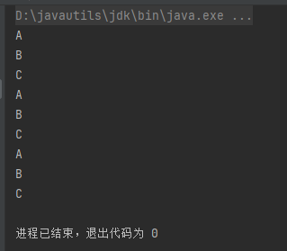

> **导航：**   
>
> [【Java笔记+踩坑汇总】Java基础+JavaWeb+SSM+SpringBoot+SpringCloud+瑞吉外卖/谷粒商城/学成在线+设计模式+面试题汇总+性能调优/架构设计+源码解析](https://blog.csdn.net/qq_40991313/article/details/126646289?spm=1001.2014.3001.5501)

[TOC]


## 0、请你说说线程和进程的区别

> **得分点**
>
> 基本单位、地址空间和内存空间、共享资源、上下文切换速度、并发、独立执行、是否健壮

一个程序运行后至少包括一个进程，一个进程至少有一个线程。

**进程：**是操作系统分配资源的基本单位，有独立的地址空间（内存空间的一部分，用于存储进程中的代码、数据和堆栈等信息）和内存空间，进程之间不能共享资源，上下文切换慢，并发低，能独立执行（有程序入口、执行序列、出口），更健壮（因为进程崩溃后不会影响其他进程）。

**线程：**是操作系统调度的基本单位，没有独立的地址空间和内存空间（只有自己的堆栈和局部变量，只能共享所在进程的内存空间），线程之间可以共享进程内的资源，上下文切换快，并发高，不能独立执行（应用程序控制多线程执行，进程通过管理线程优先级间接控制线程执行），不健壮（因为一个线程崩溃会导致整个进程崩溃）。

运行时数据区包括本地方法栈、虚拟机栈、方法区、堆、程序计数器。每个线程都有独自的本地方法栈、虚拟机栈、程序计数器。各线程共享进程的方法区和堆。

> **标准回答**
>
> 进程和线程的主要差别在于它们是不同的操作系统**资源管理方式**。
>
> - **地址空间：**进程有独立的地址空间，线程有自己的堆栈和局部变量，但线程之间没有单独的地址空间；
> - **开销：**进程和线程切换时，需要切换进程和线程的上下文，进程的上下文切换时间开销远远大于线程上下文切换时间，耗费资源较大，效率要差一些；**上下文切换：**指的是内核（操作系统的核心）在CPU上对进程或者线程进行切换。
> - **并发性：**进程的并发性较低，线程的并发性较高；
> - **是否能独立执行：**每个独立的进程有一个程序运行的入口、顺序执行序列和程序的出口。线程不能够独立执行，必须依存在应用程序中，由应用程序提供多个线程执行控制；
> - **内存空间：**系统在运行的时候会为每个进程分配不同的内存空间；而对线程而言，除了 CPU 外，系统不会为线程分配内存（线程所使用的资源来自其所属进程的资源），线程组之间只能共享资源；
> - **健壮性：**一个进程崩溃后，在保护模式下不会对其他进程产生影响，但是一个线程崩溃整个进程都死掉。所以多进程要比多线程健壮。
>
> 进程的地址空间和内存空间有以下几点区别：
>
> - 定义范围：进程的**地址空间**是指操作系统为每个进程单独分配的**虚拟地址范围**，包括**代码段、数据段、堆栈**等；而**内存空间**则是**实际物理内存**中的地址空间。
> - 访问权限：进程的地址空间涉及到虚拟地址的映射和访问，操作系统通过虚拟内存管理机制为进程提供了一定的隔离性和保护能力；而内存空间则直接映射到物理内存，访问权限依据进程所在的用户权限来确定。
> - 分配方式：进程的**地址空间**是在进程创建时由操作系统动态分配的，可以**动态扩展**；而内存空间则是在操作系统启动时由硬件识别并分配的，在运行时无法扩展（但可动态调整）。
> - 命名规则：进程的地址空间往往命名为“虚拟地址空间”，强调了其虚拟性质；而内存空间，则通常命名为“物理内存”，强调了其实际物理属性。
>
> 总之，进程的地址空间和内存空间都是对内存进行了不同的抽象描述，各自所代表的含义和操作方式略有不同。


## 1、请你说说多线程

> **得分点** 
>
> 线程、线程进程关系、多线程优缺点、死锁

**线程：**是操作系统调度的基本单位，没有独立的地址空间和内存空间（只有自己的堆栈和局部变量，只能共享所在进程的内存空间），线程之间可以共享进程内的资源，上下文切换快，并发高，不能独立执行（程序控制多线程执行，进程通过管理线程优先级间接控制线程执行），不健壮（因为一个线程崩溃会导致整个进程崩溃）。

**关系：**一个程序运行后至少包括一个进程，一个进程至少有一个线程。

**多线程的好处：**当一个线程进入阻塞或者等待状态时，其他的线程可以获取CPU的执行权，提高了CPU的利用率。

**多线程的缺点：**

- **死锁：**多个进程或线程相互等待对方释放所持有的资源，从而无法继续执行的情况。若无外力作用，它们都将无法推进下去。死锁用占用CPU、内存等系统资源，导致资源浪费，死锁会导致程序无法正常退出，导致系统性能差。
- **上下文频繁切换：**频繁的上下文切换可能会造成资源的浪费；
- **串行：**如果因为资源的限制，多线程串行执行，可能速度会比单线程更慢。

> **详细：**
>
> 所以,在一个进程里可以创建多个线程,这些**线程都拥有各自的计数器、堆栈、局部变量**,并且能够共享进程内的资源。由于共享资源**,处理器**便可以在这些**线程之间快速切换**,从而让使用者感觉这些线程在同时执行。
>
> 总的来说,操作系统可以同时执行多个任务,每个任务就是一个进程。进程可以同时执行多个任务,每个任务就是一个线程。一个**程序**运行之后**至少有一个进程**,而一个进程可以包含多个线程,但至少要包含一个线程。
>
> 使用多线程会给开发人员带来显著的好处,而使用多线程的原因主要有以下几点：
>
> - 1. 更多的CPU核心 现代计算机处理器性能的提升方式,已经从追求更高的主频向追求更多的核心发展,所以处理器的核心数量会越来越多,充分地利用处理器的核心则会显著地提高程序的性能。而程序使用多线程技术,就可以将计算逻辑分配到多个处理器核心上,显著减少程序的处理时间,从而随着更多处理器核心的加入而变得更有效率。
> - 2. 更快的响应时间 我们经常要针对复杂的业务编写出复杂的代码,如果使用多线程技术,就可以将数据一致性不强的操作派发给其他线程处理（也可以是消息队列）,如上传图片、发送邮件、生成订单等。这样响应用户请求的线程就能够尽快地完成处理,大大地缩短了响应时间,从而提升了用户体验。
> - 3. 更好的编程模型 Java为多线程编程提供了良好且一致的编程模型,使开发人员能够更加专注于问题的解决,开发者只需为此问题建立合适的业务模型,而无需绞尽脑汁地考虑如何实现多线程。一旦开发人员建立好了业务模型,稍作修改就可以将其方便地映射到Java提供的多线程编程模型上。


## 2、说说CAS的ABA问题

> CAS、乐观锁、自旋、优缺点、ABA问题及解决、AtomicStampedReference类常用方法

**CAS：**不断对变量进行原子性比较和交换，从而解决单个变量的线程安全问题。。比较内存中值和预期值，如果相等则交换，如果不相等就代表被其他线程改了则重试。

**乐观锁：**CAS属于乐观锁，乐观地认为并发不高，所以让线程不断去重试交换。

**自旋：**CAS本身是不自旋的，线程失败后不再重试。一般使用时，会通过while让CAS自旋，线程失败后不断自旋重试。

**优点：**不使用锁，所以性能高。CAS在不使用锁的情况下通过原子性操作变量，实现多线程时的变量同步。

**缺点：**高并发时不断重试导致CPU开销过大。

**应用场景：**AQS、并发容器、原子类、synchronized的偏向锁和轻量级锁

**ABA问题：**CAS机制本身无法检测变量的值是否被修改过，只关心当前值和预期值。

例如，线程A刚读取完内存中变量值就阻塞，阻塞期间其他线程将变量更新后又恢复，这时线程A恢复，发现变量还是和预期值相等（其实变量已经不是原来那个变量了，它还以为是），就进行交换。

**解决ABA问题：**单靠CAS不能解决ABA问题，要用带版本号的原子引用才能解决。JDK5引入AtomicStampedReference类，解决ABA问题。

**AtomicStampedReference类常用方法：**Stamped译为盖上邮戳的，AtomicStampedReference译为被标记的原子引用、带版本号的原子引用。

- **getReference()：**获取当前引用的值。
- **getStamp()：**返回版本号。
- **compareAndSet(期待引用的值, 新引用的值, 期待版本, 新版本)：**如果当前引用的值等于期待引用的值并且当前版本号等于期待版本号，则将当前引用的值修改为新引用的值并将版本号修改为新版本号。成功返回true，失败返回false。
- weakCompareAndSet()：弱一致替换，不一定具有原子性。


## 3、说说你对AQS（**抽象队列同步器**）的理解

> **得分点**
>
> 概念、应用场景、同步队列、同步状态、原理、基于模板方法

**标准回答**

**AQS（AbstractQueuedSynchronizer抽象队列同步器）：**

AQS是一个抽象类，在JUC.locks包下，它通过内部的状态变量和同步队列来实现线程的同步（允许多个线程协作共享访问共享资源）。

**应用场景：**很多锁和同步器都是基于AQS实现的。ReentrantLock，ThreadPoolExecutor，CountDownLatch等都是基于AQS实现。

- ReentrantLock：

  可重入锁，同一个线程在持有锁的情况下，可以重复地获取该锁，无需等待，只需记录重入次数。能防止死锁，因为不用线程自己等待自己释放锁。是Lock接口的实现类。可以通过构造参数true或false指定公平锁或非公平锁，可以通过newCondition()方法创建多个Condition对象分组唤醒等待线程。 	

  - **公平锁：**按加锁顺序获取锁。线程竞争锁时判断AQS队列里有没有等待线程，有就加入队尾。
  - **非公平锁（默认）：**可能某个线程会不断获取锁，牺牲公平的情况下提高了效率。不管AQS队列里有没有等待线程，都会先尝试获取锁；如果抢占不到，再加入队尾。如果线程刚好在上个线程释放时拿到锁，就不用像公平锁那样还要阻塞等待、放队尾、唤醒，这些操作涉及到对内核的切换，对性能有影响。
  - **Condition对象：**用于线程间通信，通过await()和signal(),signalAll()让线程等待或唤醒。通常用lock锁创建Condition对象，即lock.newCondition();

- **CountDownLatch：**计数器，它允许一个或多个线程等待其他线程完成操作后再执行。countDown()方法让计数器减一，await()方法阻塞当前线程直到计数器减为0。

- **ThreadPoolExecutor。**

**state变量和等待队列：**

- **state变量：**在AQS中，volatile修饰的int类型的state变量表示锁的状态，通过CAS原子操作这个状态变量来保证线程安全。初始是0，代表没拿到锁，1代表拿到锁。
- **同步队列：**在AQS中，FIFO（先入先出）队列用来管理等待锁的线程，队列每个节点记录等待锁的线程的地址、状态、等待锁的条件。先入先出确保同步器的公平性，也就是先等待的线程先获得锁。队列底层是双向链表。

**为什么底层是双向链表而不是单向？**

- **尾插前要判断前置节点的状态：**避免链表中存在异常线程导致无法唤醒后续线程。如果单向链表的话则要重头遍历，影响性能。
- **中断等待锁线程：**Lock锁基于AQS，它的lockInterruptibly()方法用于中断等待锁的线程，也就是说等待队列中的线程是允许被中断的。acquireSharedInterruptibly()方法的try块里，自旋获取锁，如果线程被中断，将会抛出中断异常InterruptedException，finally{}里会向前遍历删除所有状态为CANCELLED的线程（即中断线程）。因为双线链表可以向前遍历，所以选用双向链表。
- **公平锁时需要判断前置节点是否头结点：**公平锁时，每次尾插前要判断前置节点是否为头结点，如果是则直接竞争，如果不是则不竞争并插入链表尾部。这一操作主要减少公平锁时不必要的竞争。

**实现线程同步的原理：**线程通过CAS原子性修改state变量，修改成功则获得锁，失败则插入队尾等待。 

**基于模板方法：**AQS是基于模板方法模式进行设计的。锁的实现类需要继承AQS并重写抽象的行为方法。

AQS的模板方法将“**管理同步状态的逻辑**”提炼出来形成标准流程，这些方法主要包括：独占式获取同步状态、独占式释放同步状态、共享式获取同步状态、共享式释放同步状态。

**模板方法：**抽象类有一个模板方法和其他行为方法，模板方法按流程调用各行为方法（抽象或非抽象）；具体子类重写抽象的行为方法。 

> **模板方法：AQS是基于模板方法模式进行设计的**,所以锁的实现需要继承AQS并重写它指定的方法。
>
> AQS内部定义了一个FIFO的队列来实现线程的同步,同时还定义了**同步状态来记录锁的信息**。
>
> AQS的模板方法,将管理同步状态的逻辑提炼出来形成标准流程,这些方法主要包括：独占式获取同步状态、独占式释放同步状态、共享式获取同步状态、共享式释放同步状态。
>
> 以独占式获取同步状态为例,它的大致流程是：
>
> 1. 尝试以独占方式获取同步状态。
> 2. 如果状态获取失败,则将当前线程加入同步队列。
> 3. 自旋处理同步状态,如果当前线程位于队头,则唤醒它并让它出队,否则使其进入阻塞状态。 其中,有些步骤无法在父类确定,则提炼成空方法留待子类实现。例如,第一步的尝试操作,对于公平锁和非公平锁来说就不一样,所以子类在实现时需要按照场景各自实现这个方法。
>
> **同步队列：**AQS的同步队列,是一个双向链表,AQS则持有链表的头尾节点。对于尾节点的设置,是存在多线程竞争的,所以采用CAS的方式进行修改。对于头节点设置,则一定是拿到了同步状态的线程才能处理,所以修改头节点不需要采用CAS的方式。
>
> **同步状态：**AQS的同步状态，是一个int类型的整数，它在表示状态的同时还能表示数量。通常情况下，状态为0时表示无锁，状态大于0时表示锁的重入次数。另外，在读写锁的场景中，这个状态标志既要记录读锁又要记录写锁。于是，锁的实现者就将状态表示拆成高低两部分，高位存读锁、低位存写锁。 加分回答 同步状态需要在并发环境下修改，所以需要保证其线程安全。由于AQS本身就是锁的实现工具，所以不适合用锁来保证其线程安全，因为如果你用一个锁来定义另一个锁的话，那干脆直接用synchronized算了。实际上，同步状态是被volatile修饰的，该关键字可以保证状态变量的内存可见性，从而解决了线程安全问题。 加分回答 同步状态需要在并发环境下修改，所以需要保证其线程安全。由于AQS本身就是锁的实现工具，所以不适合用锁来保证其线程安全，因为如果你用一个锁来定义另一个锁的话，那干脆直接用synchronized算了。实际上，同步状态是被volatile修饰的，该关键字可以保证状态变量的内存可见性，从而解决了线程安全问题。


## 4、Java哪些地方使用了CAS

> **得分点**
>
> 原子类、AQS、并发容器、synchronized的偏向锁和轻量级锁

**标准回答**

Java提供的API中使用CAS的地方有很多,比较典型的使用场景有原子类、AQS、并发容器。

原子类各原子操作的方法，AQS修改state变量时是CAS原子性修改，ConcurrentHashmap初始化数组和头结点、扩容、插入链表头结点时是CAS操作。

**原子类：**

JUC包下的原子类，它的内部提供了诸多原子操作（一旦开始不可中断）的方法。如get()、set()、incrementAndGet()、weakCompareAndSet()，这些方法是CAS原子指令来实现的。CAS解决单个变量的线程安全问题。

以AtomicInteger为例，某线程调用该对象的incrementAndGet()方式自增时采用CAS尝试修改它的值，若此时没有其他线程操作该值便修改成功否则反复执行CAS操作直到修改成功。

**AQS（抽象队列同步器）：**

AQS是实现锁或者其他同步器（用于协调线程之间对共享资源的访问）的核心框架，通过内部的状态变量和队列来实现线程的同步。

AQS实现线程同步的原理：线程通过CAS原子性修改state变量，修改成功则获得锁，失败则插入队尾等待。 

**ConcurrentHashmap等并发容器**，以ConcurrentHashmap为例：

JDK1.8采用synchronized+CAS实现线程安全

实现机制：

1. 初始化数组、初始化头节点时，ConcurrentHashMap并没有加锁，而是CAS的方式进行原子替换。数组并发扩容搬运数据时候是用CAS操作的。
2. 插入数据时，如果该数据是链表头结点则直接CAS，如果不是头结点则对头结点加synchronized锁。
3. 在扩容的过程中，依然支持查找操作。

get方法：以CAS的方式获取指定槽的头节点,避免其他线程同时对头节点做出修改。 

**synchronized偏向锁和轻量级锁**

- **偏向锁：**当有一个线程访问同步代码块时升级为偏向锁。一段同步代码块一直被一个线程所访问，那么该线程id会CAS写入对象头，下次再访问同步代码块时对象头检查到该线程id，就不用加锁解锁了，降低获取锁的代价。
- **轻量级锁（自旋锁）：**有锁竞争时升级为轻量级锁。其他线程会通过自旋的形式尝试通过CAS将对象头中Mark Word替换为指向线程栈帧里锁记录的指针，从而获得锁；同时线程锁记录里存放Mark Word信息。竞争的线程不会阻塞但会一直自旋，消耗CPU性能，但速度快。

> **加分回答-原子操作指令**
>
> CAS的实现离不开操作系统原子指令的支持,Java中对原子指令封装的方法集中在Unsafe类中,包括：原子替换引用类型、原子替换int型整数、原子替换long型整数。这些方法都有四个参数：var1、var2、var4、var5,其中var1代表要操作的对象,var2代表要替换的成员变量,var4代表期望的值,var5代表更新的值。 public final native boolean compareAndSwapObject( Object var1, long var2, Object var4, Object var5); public final native boolean compareAndSwapInt( Object var1, long var2, int var4, int var5); public final native boolean compareAndSwapLong( Object var1, long var2, long var4, long var6);


## 5、说说怎么保证线程安全

> **得分点**
>
> 对比线程同步和线程安全、原子类、volatile、锁、线程安全的集合

**标准回答**

**对比线程安全和线程同步：**

**对比线程安全和线程同步：线程同步是实现线程安全的一种手段**

- **线程安全：**程序在多线程环境下可以持续进行正确的处理，不会产生数据竞争（例如死锁）和不一致的问题。解决方案：原子类、volatile、锁、线程安全的集合
- **线程同步：**确保多个线程正确、有序地访问共享资源。解决方案：锁

**线程安全解决方案：**按照资源占用情况由轻到重排列，通过原子类、volatile、锁，保证线程安全。 

原子类和volatile只能保证单个共享变量的线程安全，锁则可以保证临界区内的多个共享变量线程安全。

**原子类：**

原子类是具有原子操作特征（化学中原子是最小单位、不可分割）的类，原子是指一个操作是不可中断的。即使是在多个线程一起执行的时候，一个操作一旦开始，就不会被其他线程干扰。

在java.util.concurrent.atomic包下，有一系列“Atomic”开头的类，统称为原子类。例如AtomicInteger替代int ，底层采用CAS原子指令实现，内部的存储值使用volatile修饰，因此多线程之间是修改可见的。

以AtomicInteger为例，某线程调用该对象的incrementAndGet()方式自增时采用CAS尝试修改它的值，若此时没有其他线程操作该值便修改成功否则反复执行CAS操作直到修改成功。

**volatile：**

volatile关键字是**轻量级的同步机制**。

- 有序性：被volatile声明的变量之前的代码一定会比它先执行，而之后的代码一定会比它慢执行。
- 可见性：一旦修改变量则立即刷新到共享内存中，当其他线程要读取这个变量的时候，最终会去内存中读取，而不是从自己的工作空间中读取。
- **原子性：**对单个volatile变量的读写具有原子性（在同一时刻只能被一个线程访问和修改），对“volatile变量++”这种复合操作则不具有原子性。这也是和synchronized的区别。

写内存语义：当写一个volatile变量时,JMM（Java内存模型）会把该线程本地内存中的共享变量的值刷新到主内存中。
 读内存语义：当读一个volatile变量时,JMM会把该线程本地内存置为无效,使其从主内存中读取共享变量。
 底层实现机制：volatile的底层是采用内存屏障来实现的,就是在编译器生成字节码时,会在指令序列中插入内存屏障来禁止特定类型的处理器重排序。

**锁：**

加锁的方式有两种,分别是synchronized关键字和Lock接口（在JUC包下）。

**synchronized锁**是互斥锁，可以作用于实例方法、静态方法、代码块，能够保证同一个时刻只有一个线程执行该段代码，保证线程安全。 在执行完或者出现异常时自动释放锁。synchronized锁基于对象头和Monitor对象，在1.6之后引入轻量级锁、偏向锁等优化。 

**lock锁**接口可以通过lock、unlock方法锁住一段代码，Lock实现类都是基于AQS实现的。Lock可以让等待锁的线程响应中断，而synchronized却不行，使用synchronized时，等待的线程会一直等待下去，不能够响应中断。

**线程安全的集合：**

1. **Collections工具类：**Collections工具类的synchronizedXxx()方法**，**将ArrayList等集合类包装成线程安全的集合类。
2. **古老api：**java.util包下性能差的古老api，如Vector、Hashtable
3. **降低锁粒度的并发容器：**JUC包下Concurrent开头的、以降低锁粒度来提高并发性能的容器，如ConcurrentHashMap。
4. **复制技术实现的并发容器：**JUC包下以CopyOnWrite开头的、采用写时复制技术实现的并发容器，如CopyOnWriteArrayList。 

> **线程安全：**在拥有**共享数据**的多条线程并行执行的程序中，线程安全的代码会通过同步机制保证各个线程都可以正常且正确的执行，不会出现数据污染等意外情况。 
>
> Java保证线程安全的方式有很多,其中较为常用的有三种,按照资源占用情况由轻到重排列,这三种保证线程安全的方式分别是原子类、volatile、锁。
>
> JDK从1.5开始提供了java.util.concurrent.atomic包,这个包中的原子操作类提供了一种用法简单、性能高效、线程安全地更新一个变量的方式。
>
> 在atomic包里一共提供了17个类,按功能可以归纳为4种类型的原子更新方式,分别是原子更新基本类型、原子更新引用类型、原子更新属性、原子更新数组。无论原子更新哪种类型,都要遵循“比较和替换”规则,即比较要更新的值是否等于期望值,如果是则更新,如果不是则失败。 volatile是轻量级的synchronized,它在多处理器开发中保证了共享变量的“可见性”,从而可以保证单个变量读写时的线程安全。可见性问题是由处理器核心的缓存导致的,每个核心均有各自的缓存,而这些缓存均要与内存进行同步。volatile具有如下的内存语义：当写一个volatile变量时,该线程本地内存中的共享变量的值会被立刻刷新到主内存；当读一个volatile变量时,该线程本地内存会被置为无效,迫使线程直接从主内存中读取共享变量。 原子类和volatile只能保证单个共享变量的线程安全,锁则可以保证临界区内的多个共享变量的线程安全,Java中加锁的方式有两种,分别是synchronized关键字和Lock接口。synchronized是比较早期的API,在设计之初没有考虑到超时机制、非阻塞形式,以及多个条件变量。若想通过升级的方式让它支持这些相对复杂的功能,则需要大改它的语法结构,不利于兼容旧代码。因此,JDK的开发团队在1.5新增了Lock接口,并通过Lock支持了上述的功能,即：支持响应中断、支持超时机制、支持以非阻塞的方式获取锁、支持多个条件变量（阻塞队列）。
>
> 
>
> **加分回答**
>
> 实现线程安全的方式有很多,除了上述三种方式之外,还有如下几种方式：
>
> - 1. 无状态设计 线程安全问题是由多线程并发修改共享变量引起的,如果在并发环境中没有设计共享变量,则自然就不会出现线程安全问题了。这种代码实现可以称作“无状态实现”,所谓状态就是指共享变量。
> - 2. 不可变设计 如果在并发环境中不得不设计共享变量,则应该优先考虑共享变量是否为只读的,如果是只读场景就可以将共享变量设计为不可变的,这样自然也不会出现线程安全问题了。具体来说,就是在变量前加final修饰符,使其不可被修改,如果变量是引用类型,则将其设计为不可变类型（参考String类）。
> - 3. 并发工具 java.util.concurrent包提供了几个有用的并发工具类,一样可以保证线程安全： - Semaphore：就是信号量,可以控制同时访问特定资源的线程数量。 - CountDownLatch：允许一个或多个线程等待其他线程完成操作。 - CyclicBarrier：让一组线程到达一个屏障时被阻塞,直到最后一个线程到达屏障时,屏障才会打开,所有被屏障拦截的线程才会继续运行。
> - 4. 本地存储 我们也可以考虑使用ThreadLocal存储变量,ThreadLocal可以很方便地为每一个线程单独存一份数据,也就是将需要并发访问的资源复制成多份。这样一来,就可以避免多线程访问共享变量了,它们访问的是自己独占的资源,它从根本上隔离了多个线程之间的数据共享。 


## 5、说说你了解的线程同步方式

> **得分点**
>
> synchronized、Lock、线程安全和线程同步

**线程同步：**即当有一个线程在对内存进行操作时，其他线程都不可以对这个内存地址进行操作，直到该线程完成操作， 其他线程才能对该内存地址进行操作，而其他线程又处于等待状态。

Java主要通过加锁的方式实现线程同步,而锁有两类,分别是synchronized关键字和Lock接口（在JUC包下）。

**synchronized锁**是互斥锁，可以作用于实例方法、静态方法、代码块，能够保证同一个时刻只有一个线程执行该段代码，保证线程安全。 在执行完或者出现异常时自动释放锁。synchronized锁基于对象头和Monitor对象，在1.6之后引入轻量级锁、偏向锁等优化。 

**lock锁**接口可以通过lock、unlock方法锁住一段代码，Lock实现类都是基于AQS实现的。**Lock可以让等待锁的线程响应中断，而synchronized却不行**，使用synchronized时，等待的线程会一直等待下去，不能够响应中断。

**对比线程安全和线程同步：**

**对比线程安全和线程同步：线程同步是实现线程安全的一种手段**

- **线程安全：**程序在多线程环境下可以持续进行正确的处理，不会产生数据竞争（例如死锁）和不一致的问题。解决方案：原子类、volatile、锁、线程安全的集合
- **线程同步：**确保多个线程正确、有序地访问共享资源。解决方案：锁

> synchronized可以加在三个不同的位置,对应三种不同的使用方式,这三种方式的区别是锁对象不同：
>
> 1. 加在普通方法上,则锁是当前的实例（this）。
> 2. 加在静态方法上,则锁是当前类的Class对象。
> 3. 加在代码块上,则需要在关键字后面的小括号里,显式指定一个对象作为锁对象。
>
> 不同的锁对象,意味着不同的锁粒度,所以我们不应该无脑地将它加在方法前了事,尽管通常这可以解决问题。而是应该根据要锁定的范围,准确的选择锁对象,从而准确地确定锁的粒度,降低锁带来的性能开销。
>
> synchronized是比较早期的API,在设计之初没有考虑到超时机制、非阻塞形式,以及多个条件变量。若想通过升级的方式让synchronized支持这些相对复杂的功能,则需要大改它的语法结构,不利于兼容旧代码。因此,JDK的开发团队在1.5引入了Lock接口,并通过Lock支持了上述的功能。
>
> Lock支持的功能包括：支持响应中断、支持超时机制、支持以非阻塞的方式获取锁、支持多个条件变量（阻塞队列）。
>
> **加分回答**
>
> **synchronized**采用**“CAS+Mark Word”**实现,为了性能的考虑,并通过锁升级机制降低锁的开销。在并发环境中,synchronized会随着多线程竞争的加剧,按照如下步骤逐步升级：无锁、偏向锁、轻量级锁、重量级锁。
>
> **Lock**则采用**“CAS+volatile”**实现,其实现的核心是AQS。AQS是线程同步器,是一个线程同步的基础框架,它基于模板方法模式。在具体的Lock实例中,锁的实现是通过继承AQS来实现的,并且可以根据锁的使用场景,派生出公平锁、不公平锁、读锁、写锁等具体的实现。 

## 6、说说synchronized的用法及原理

> **得分点**
>
> 介绍、作用于三个位置、对象头、Monitor对象、锁升级

**标准回答** 

**synchronized锁：** 

synchronized锁是互斥锁，可以作用于实例方法、静态方法、代码块，能够保证同一个时刻只有一个线程执行该段代码，保证线程安全。 在执行完或者出现异常时自动释放锁。synchronized锁基于对象头、CAS、Monitor对象，在1.6之后引入轻量级锁、偏向锁等优化。  

**作用于三个位置：**

 1.作用在静态方法上,则锁是当前类的Class对象。

2. 作用在普通方法上,则锁是当前的实例（this）。
3. 作用在代码块上,则需要在关键字后面的小括号里,显式指定锁对象，例如this、Xxx.class。

**对象头存储锁信息：** synchronized的底层是采用对象头的Mark Word来存储锁信息的。Hotspot 虚拟机中每个对象都有一个对象头(Object Header)，包含Mark Word（标记字段） 和 Class Pointer（类型指针）。

- Mark Word（标记字段）：

  存储哈希码、GC分代年龄、锁信息、GC标记（标志位，标记可达对象或垃圾对象）等。

  锁信息包括：

  - **锁标志位：**64位的二进制数，通过末尾能判断锁状态。01未锁定、01可偏向、00轻量级锁、10重量级锁、11垃圾回收标记
  - **偏向锁线程ID、时间戳等；**
  - **轻量级锁的指针：**指向锁记录的指针
  - **重量级锁的指针：**指向Monitor锁的指针

- **类型指针：**指向它的类元数据的指针，用于找到对象所在的类。 

不考虑共享资源是类变量等特殊情况的话，有共享资源的多个线程通常都属于同一个对象。 

**Monitor对象：**每个 Java 对象都可以关联一个 Monitor 对象，也称为监视器锁或Monitor锁。Monitor锁用于控制线程对共享资源的访问，开发人员不能直接访问Monitor对象。当一个线程获取了Monitor的锁后，其他试图获取该锁的线程就会被阻塞，直到当前线程释放锁为止。

当一个线程执行synchronized方法或代码块并升级成重量级锁时，当前对象会关联一个Monitor对象，线程必须先获得该对象的Monitor锁才能执行。Monitor有Owner、EntryList、WaitSet三个字段，分别表示Monitor的持有者线程(获得锁的线程)、阻塞队列、和等待队列。

**线程通信：**synchronize通过Monitor对象，利用Object的wait，notify，notifyAll等方法来实现线程通信。

**锁升级：**JDK6之前synchronized只有无锁和重量级锁两个状态，JDK6引入偏向锁、轻量级锁两个状态，锁可以根据竞争程度从无锁状态慢慢升级到重量级锁。当竞争小的时候，只需以较小的代价加锁，直到竞争加剧，才使用重量级锁，从而减小了加锁带来的开销。

- **锁升级顺序：**无锁状态、偏向锁状态、轻量级锁状态、重量级锁状态。
- **无锁：**没有线程访问同步代码块时。没有对资源进行锁定，所有的线程都能访问并不断修改同一个资源，但同时只有一个线程能修改成功，失败线程会不断重试。
- **偏向锁：**当有一个线程访问同步代码块时升级为偏向锁。一段同步代码块一直被一个线程所访问，那么该线程id会CAS写入对象头，下次再访问同步代码块时对象头检查到该线程id，就不用加锁解锁了，降低获取锁的代价。
- **轻量级锁（自旋锁）：**有锁竞争时升级为轻量级锁。其他线程会通过自旋的形式尝试通过CAS将对象头中Mark Word替换为指向线程栈帧里锁记录的指针，从而获得锁；同时线程锁记录里存放Mark Word信息。竞争的线程不会阻塞但会一直自旋，消耗CPU性能，但速度快。
- **重量级锁：**锁膨胀（自旋失败10次）时升级为重量级锁。Mark Word中存储的是指向Monitor锁的指针，对象Mark Word信息也会保存在Monitor锁里，当一个线程获取了Monitor锁后，竞争线程会被阻塞，不再自旋，不消耗CPU，速度慢。


> synchronized可以作用在三个不同的位置,对应三种不同的使用方式,这三种方式的区别是锁对象不同。不同的锁对象,意味着不同的锁粒度,所以我们不应该无脑地将它加在方法前了事,尽管通常这可以解决问题。而是应该根据要锁定的范围,准确的选择锁对象,从而**准确地确定锁的粒度,降低锁带来的性能开销。**
>
> **对象头**
>
> synchronized的底层是采用**Java对象头来存储锁信息**的,并且还支持**锁升级**。
>
> Java对象头包含三部分,分别是**Mark Word、Class Metadata Address、Array length**。其中,Mark Word用来存储对象的hashCode及锁信息,Class Metadata Address用来存储对象类型的指针,而Array length则用来存储数组对象的长度。如果对象不是数组类型,则没有Array length信息。
>
> synchronized的**锁信息包括锁的标志和锁的状态**,这些信息都存放在对象头的Mark Word这一部分。
>
> Java 6为了**减少**获取锁和释放锁带来的**性能消耗**,引入了**偏向锁和轻量级锁**。
>
> 所以,在Java 6中,**锁一共被分为4种状态**,级别由低到高依次是：**无锁状态、偏向锁状态、轻量级锁状态、重量级锁状态。**随着线程竞争情况的升级,锁的状态会从无锁状态逐步升级到重量级锁状态。**锁可以升级却不能降级**,这种只能升不能降的策略,是为了提高效率。
>
> synchronized的早期设计并不包含锁升级机制,所以性能较差,那个时候只有无锁和有锁之分。是为了提升性能才引入了偏向锁和轻量级锁,所以需要重点关注这两种状态的原理,以及它们的区别。
>
> 
>
> **偏向锁：**
>
> 偏向锁,顾名思义就是**锁偏向于某一个线程**。
>
> 当一个线程访问同步块并获取锁时,会在对象头和栈帧中的锁记录里存储锁偏向的线程ID,以后该线程再进入和退出同步块时就不需要做加锁和解锁操作了,只需要简单地测试一下Mark Word里是否存储着自己的线程ID即可。
>
> **轻量级锁**,就是加锁时JVM先在当前线程栈帧中创建用于存储锁记录的空间,并将Mark Word复制到锁记录中,官方称之为Displaced Mark Word。然后线程尝试以CAS方式将Mark Word替换为指向锁记录的指针,如果成功则当前线程获得锁,如果失败则表示其他线程竞争锁,此时当前线程就会通过自旋来尝试获取锁。
>
> **加分回答-锁升级的过程**
>
> 下面,我们再从实际场景出发,来具体说说锁升级的过程： 
>
> 1. 开始,没有任何线程访问同步块,此时同步块处于无锁状态。
> 2. 然后,线程1首先访问同步块,它以CAS（比较和交换）的方式修改Mark Word,尝试加**偏向锁**。由于此时没有竞争,所以偏向锁加锁成功,此时Mark Word里存储的是线程1的ID。
> 3. 然后,线程2开始访问同步块,它以CAS的方式修改Mark Word,尝试加偏向锁。由于此时存在竞争,所以偏向锁加锁失败,于是线程2会发起撤销偏向锁的流程（清空线程1的ID）,于是同步块从偏向线程1的状态恢复到了可以公平竞争的状态。
> 4. 然后,线程1和线程2共同竞争,它们同时以CAS方式修改Mark Word,尝试加轻量级锁。由于存在竞争,只有一个线程会成功,假设线程1成功了。但线程2不会轻易放弃,它认为线程1很快就能执行完毕,执行权很快会落到自己头上,于是线程2继续自旋加锁。
> 5. 最后,如果线程1很快执行完,则线程2就会加轻量级锁成功,锁不会晋升到重量级状态。也可能是线程1执行时间较长,那么线程2自旋一定次数后就放弃自旋,并发起锁膨胀的流程。届时,锁被线程2修改为重量级锁,之后线程2进入阻塞状态。而线程1重复加锁或者解锁时,CAS操作都会失败,此时它就会释放锁并唤醒等待的线程。
>
> 总之,在锁升级的机制下,锁不会一步到位变为重量级锁,而是根据竞争的情况逐步升级的。**当竞争小的时候,只需以较小的代价加锁,直到竞争加剧,才使用重量级锁,从而减小了加锁带来的开销。**


## 7、synchronized和Lock有什么区别

> **得分点**
>
> 接口和关键字、死锁问题、让等待锁的线程响应中断、得知是否成功获取锁、性能对比、分布式锁

**标准回答**

Lock和synchronized有以下几点不同：

- **接口和关键字。**Lock是一个接口，而synchronized是Java中的关键字，synchronized是内置的语言实现；
- **死锁问题。**synchronized在发生异常时，会自动释放线程占有的锁，因此不会导致死锁现象发生；而Lock在发生异常时，如果没有主动通过unLock()去释放锁，则很可能造成死锁现象，因此使用Lock时需要在finally块中释放锁；
- **让等待锁的线程响应中断。**Lock可以可以通过lockInterruptibly()获取锁的方法让等待锁的线程响应中断。而synchronized却不行，使用synchronized时，等待的线程会一直等待下去，不能够响应中断；
- **得知是否成功获取锁。**通过Lock可以通过tryLock()知道有没有成功获取锁，而synchronized却无法办到。
- **性能对比。**两者性能差不多。JDK6之前synchronized没有锁升级，线程竞争非常激烈时Lock的性能要远远优于synchronized；而JDK6引入锁升级后，线程竞争激烈时候两者性能也相差无几。

**lock锁中断线程：**若有线程已拿到锁，其他线程使用lock()获取锁时会阻塞，使用lockInterruptibly()获取锁时会直接中断抛出InterruptedException异常

**lock锁编码习惯：**加锁代码要放到try外面。如果放在try里面的话，加锁失败抛异常或者加锁前的代码抛异常后，执行finally里的解锁代码，而其实加锁都没成功，最终解锁就也不合适了。

```java
lock.lock(); // 加锁
try{
    // do something
}finally{
    lock.unlock(); // 解锁
}

//不推荐
try{
int a=3/0;//这里抛异常会直接进入finally
lock.lock(); // 加锁
    // do something
}finally{
    lock.unlock(); // 解锁
}
```


**分布式锁：**SETNX、Redisson。Redisson基于Redis协议，可以实现可重入锁、公平锁、读写锁、信号量、闭锁（计数器），支持看门狗自动续期。

> synchronized和Lock都是锁,都是线程同步的手段,它们的区别主要体现在如下三个方面：
>
> **1. 使用方式的区别** synchronized关键字可以作用在静态方法、实例方法和代码块上,它是一种隐式锁,即我们无需显式地获取和释放锁,所以使用起来十分的方便。在这种同步方式下,我们需要依赖Monitor（同步监视器）来实现线程通信。若关键字作用在静态方法上,则Monitor就是当前类的Class对象；若关键字作用在实例方法上,则Monitor就是当前实例（this）；若关键字作用在代码块上,则需要在关键字后面的小括号里显式指定一个对象作为Monitor。 Lock接口是显式锁,即我们需要调用其内部定义的方法显式地加锁和解锁,相对于synchronized来说这显得有些繁琐,但是却提供了更大的灵活性。在这种同步方式下,我们需要依赖Condition对象来实现线程通信,该对象是由Lock对象创建出来的,依赖于Lock。每个Condition代表一个等待队列,而一个Lock可以创建多个Condition对象。相对而言,每个Monitor也代表一个等待队列,但synchronized只能有一个Monitor。所以,在实现线程通信方面,Lock接口具备更大的灵活性。
>
> **2. 功能特性的区别** synchronized是早期的API,Lock则是在JDK 1.5时引入的。在设计上,Lock弥补了synchronized的不足,它新增了一些特性,均是synchronized不具备的,这些特性包括： - 可中断地获取锁：线程在获取锁的过程中可以被中断。 - 非阻塞地获取锁：该方法在调用后立刻返回,若能取到锁则返回true,否则返回false。 - 可超时地获取锁：若线程在到达超时时间后仍未获得锁,并且线程也没有被中断,则返回false。
>
> **3. 实现机制的区别** synchronized的底层是采用Java对象头来存储锁信息的,对象头包含三部分,分别是Mark Word、Class Metadata Address、Array length。其中,Mark Word用来存储对象的hashCode及锁信息,Class Metadata Address用来存储对象类型的指针,而Array length则用来存储数组对象的长度。 AQS是队列同步器,是用来构建锁的基础框架,Lock实现类都是基于AQS实现的。AQS是基于模板方法模式进行设计的,所以锁的实现需要继承AQS并重写它指定的方法。AQS内部定义了一个FIFO的队列来实现线程的同步,同时还定义了同步状态来记录锁的信息。
>
> **加分回答-锁升级效率**
>
> **早期的synchronized性能较差,不如Lock**。后来synchronized在实现上引入了锁升级机制,性能上已经不输给Lock了。所以,synchronized和Lock的区别主要不在性能上,因为**二者性能相差无几**。
>
> **Java 6**为了减少获取锁和释放锁带来的性能消耗,**引入了偏向锁和轻量级锁。**所以,从Java 6开始,锁一共被分为4种状态,级别由低到高依次是：无锁、偏向锁、轻量级锁、重量级锁。随着线程竞争情况的升级,锁的状态会从无锁状态逐步升级到重量级锁状态。锁可以升级却不能降级,这种只能升不能降的策略,是为了提高效率。
>
> synchronized的早期设计并不包含锁升级机制,那个时候只有无锁和有锁之分。是为了提升性能才引入了偏向锁和轻量级锁,所以需要重点关注这两种状态的原理,以及它们的区别。 偏向锁,顾名思义就是锁偏向于某一个线程。当一个线程访问同步块并获取锁时,会在对象头和栈帧中的锁记录里存储锁偏向的线程ID,以后该线程再进入和退出同步块时就不需要做加锁和解锁操作了,只需要简单地测试一下Mark Word里是否存储着自己的线程ID即可。 轻量级锁,就是加锁时JVM先在当前线程栈帧中创建用于存储锁记录的空间,并将Mark Word复制到锁记录中,官方称之为Displaced Mark Word。然后线程尝试以CAS方式将Mark Word替换为指向锁记录的指针,如果成功则当前线程获得锁,如果失败则表示其他线程竞争锁,此时当前线程就会通过自旋来尝试获取锁。

## 8、说说Java中常用的锁及原理

> **得分点**
>
> 对象头、Monitor、AQS

**标准回答**

**常用的锁：**synchronized关键字和lock锁接口。

**synchronized锁原理：** 

synchronized锁基于对象头Mark Word的和Monitor对象。

- **Mark Word（标记字段）：**存储哈希码、GC标记、锁信息等；
- **Monitor（监视器）对象：**Monitor锁用于控制线程对共享资源的访问，开发人员不能直接访问Monitor对象。当一个线程获取了Monitor的锁后，其他试图获取该锁的线程就会被阻塞，直到当前线程释放锁为止。当一个线程执行synchronized方法或代码块并升级成重量级锁时，当前对象会关联一个Monitor对象，线程必须先获得该对象的Monitor锁才能执行。

**lock锁原理** 

lock锁实现类是基于AQS（抽象队列同步器）实现的。

**AQS：**

AQS是实现锁或者其他同步器（用于协调线程之间对共享资源的访问）的核心框架，通过内部的状态变量和队列来实现线程的同步。 

- **同步状态：**在AQS中，volatile类型的state变量表示锁的状态，通过CAS原子操作这个状态变量来保证线程安全。
- **同步队列：**在AQS中，FIFO（先入先出）队列用来管理等待锁的线程，队列每个节点记录等待线程的状态以及等待锁的条件。先入先出确保同步器的公平性，也就是先等待的线程先获得锁。

**实现线程同步的原理：**线程通过CAS原子性修改state变量，修改成功则获得锁，失败则插入队尾等待。 

> Java中加锁有两种方式,分别是synchronized关键字和Lock接口,而Lock接口的经典实现是ReentrantLock。另外还有ReadWriteLock接口,它的内部设计了两把锁分别用于读写,这两把锁都是Lock类型,它的经典实现是ReentrantReadWriteLock。其中,synchronized的实现依赖于对象头,Lock接口的实现则依赖于AQS。
>
> **synchronized**
>
> **synchronized的底层**是采用**Java对象头**来存储锁信息的,对象头包含三部分,分别是Mark Word、Class Metadata Address、Array length。其中,Mark Word用来存储对象的hashCode及锁信息,Class Metadata Address用来存储对象类型的指针,而Array length则用来存储数组对象的长度。
>
> **Lock**
>
> AQS是队列同步器,是用来构建锁的基础框架,Lock实现类都是基于AQS实现的。AQS是基于模板方法模式进行设计的,所以锁的实现需要继承AQS并重写它指定的方法。AQS内部定义了一个FIFO的队列来实现线程的同步,同时还定义了同步状态来记录锁的信息。
>
> **加分回答**
>
> ReentrantLock通过内部类Sync定义了锁,它还定义了Sync的两个子类FrSync和NonfrSync,这两个子类分别代表公平锁和非公平锁。Sync继承自AQS,它不仅仅使用AQS的同步状态记录锁的信息,还利用同步状态记录了重入次数。同步状态是一个整数,当它为0时代表无锁,当它为N时则代表线程持有锁并重入了N次。 ReentrantReadWriteLock支持重入的方式与ReentrantLock一致,它也定义了内部类Sync,并定义出两个子类FrSync和NonfrSync来实现公平锁和非公平锁。此外,ReentrantReadWriteLock内部包含读和写两把锁,这两把锁都是由Sync来实现的。区别在于读锁支持共享,即多个线程可以同时加读锁成功,而写锁是互斥的,即只能有一个线程加锁成功。

## 9、说说volatile的用法及原理

> **得分点**
>
> 指令重排序、三个特性、读写内存语义、有序性实现机制

**volatile****特性：**

- **有序性：**被volatile声明的变量之前的代码一定会比它先执行，而之后的代码一定会比它慢执行。底层是在生成字节码文件时，在指令序列中插入内存屏障防止指令重排序。
- **可见性：**一旦修改变量则立即刷新到共享内存中，当其他线程要读取这个变量的时候，最终会去内存中读取，而不是从自己的工作空间中读取。每个线程自己的工作空间用于存放堆栈（存方法的参数和返回地址）和局部变量。
- **原子性：**volatile变量不能保证完全的原子性，只能保证单次的读/写操作具有原子性（在同一时刻只能被一个线程访问和修改），自增减、复合操作（+=,/=等）则不具有原子性。这也是和synchronized的区别。

**读写内存语义：**

- **写内存语义：**当写一个volatile变量时,JMM（Java内存模型）会把该线程本地内存中的共享变量的值刷新到主内存中。
- **读内存语义：**当读一个volatile变量时,JMM会把该线程本地内存置为无效,使其从主内存中读取共享变量。

**有序性实现机制：**

volatile有序性是通过内存屏障来实现的。内存屏障就是在编译器生成字节码时，会在指令序列中插入内存屏障来禁止特定类型的处理器重排序。

**机器指令：**JVM包括类加载子系统、运行时数据区、执行引擎。 执行引擎负责将字节码指令转为操作系统能识别的本地机器指令。

**指令重排序：**处理器为了提高运算速度会对指令重排序，重排序分三种类型：编译器优化重排序、处理器指令级并行重排序、内存系统重排序。 

- **编译器优化的重排序：**编译器在不改变单线程程序的语义前提下，可以重新安排语句的执行顺序。
- **指令级并行的重排序：**现在处理器采用了指令集并行技术，将多条指令重叠执行。如果不存在依赖性，处理器可以改变语句对应的机器指令的执行顺序。
- **内存系统的重排序：**由于处理器使用缓存和读写缓冲区，这使得加载和存储操作看上去可能是在乱序执行。

> volatile是轻量级的synchronized,它在多处理器开发中保证了共享变量的“可见性”。可见性的意思是当一个线程修改一个共享变量时,另外一个线程能读到这个修改的值。如果volatile使用恰当的话,它比synchronized的执行成本更低,因为它不会引起线程上下文的切换和调度。简而言之,volatile变量具有以下特性：
>
> **- 可见性：**对一个volatile变量的读,总是能看到（任意线程）对这个volatile变量最后的写入。
>
> 
>
> **- 原子性：**对单个volatile变量的读写具有原子性,对“volatile变量++”这种复合操作则不具有原子性。
>
> 当一个操作具有**原子性**时，就意味着**该操作在同一时刻只能被一个线程访问和修改**，其他线程访问时只能获得之前的结果或等待其操作完成后再访问。
>
> **内存语义：**
>
> volatile通过影响线程的内存可见性来实现上述特性,它具备如下的内存语义。其中,JMM是指Java内存模型,而本地内存只是JMM的一个抽象概念,它涵盖了缓存、写缓冲区、寄存器以及其他的硬件和编译器优化。在本文中,大家可以将其简单理解为缓存。
>
> \- 写内存语义：当写一个volatile变量时,JMM会把该线程本地内存中的共享变量的值刷新到主内存中。
>
> \- 读内存语义：当读一个volatile变量时,JMM会把该线程本地内存置为无效,使其从主内存中读取共享变量。
>
> **底层实现机制：**
>
> volatile的底层是采用内存屏障来实现的,就是在编译器生成字节码时,会在指令序列中插入内存屏障来禁止特定类型的处理器重排序。**内存屏障**就是一段与平台相关的代码,Java中的内存屏障代码都在Unsafe类中定义,共包含三个方法：LoadFence()、storeFence()、fullFence()。 **加分回答**
>
> 从内存语义的角度来说,volatile的读/写,与锁的获取/释放具有相同的内存效果。即**volatile读与锁的获取有相同的内存语义,volatile写与锁的释放有相同的内存语义**。 volatile**只能保证单个变量读写的原子性**,而锁则可以保证对整个临界区的代码执行具有原子性。所以,在功能上锁比volatile更强大,在可伸缩性和性能上volatile更优优势。


## 10、说说线程的六个状态

> **得分点**
>
> 六个状态、线程运行过程

**标准回答**

Java线程在运行的生命周期中,在任意给定的时刻,只能处于下列6种状态之一：

- **NEW ：初始状态**,线程被创建,但是还没有调用start方法。
- **RUNNABLE：可运行状态**,等待调度或运行。线程正在JVM中执行,但是有可能在等待操作系统的调度。
- **BLOCKED ：阻塞状态**,线程正在等待获取监视器锁。
- **WAITING ：等待状态**,线程正在等待其他线程的通知或中断。线程等待状态不占用 CPU 资源，被唤醒后进入可运行状态（等待调度或运行）。
- **TIMED_WAITING：超时等待状态**,在WAITING的基础上增加了超时时间,即超出时间自动返回。Thread.sleep(1000);让线程超时等待1s。
- **TERMINATED：终止状态**,线程已经执行完毕。

**等待状态：**Object类的wait()方法让线程进入等待状态，notify()唤醒该对象上的随机一个线程，notifyAll()唤醒该对象上的所有线程。这3个方法必须处于synchronized代码块或方法中，否则会抛出IllegalMonitorStateException异常。因为调用这三个方法之前必须拿要到当前锁对象的监视器（Monitor对象），synchronized基于对象头和Monitor对象。

也可以通过Condition类的 await/signal/signalAll方法实现线程的等待和唤醒，从而实现线程的通信，令线程之间协作处理任务。这两个方法依赖于Lock对象。

**线程运行过程：**线程在创建之后默认为NEW初始状态,在调用start方法之后进入RUNNABLE可运行状态,可运行状态不代表线程正在运行,它有可能正在等待操作系统的调度。WAITING 等待状态的线程需要其他线程的通知才能返回到可运行状态,而TIMED_WAITING超时等待状态相当于在等待状态的基础上增加了超时限制,除了他线程的唤醒,在超时时间到达时也会返回运行状态。此外,线程在执行同步方法时,在没有获取到锁的情况下,会进入到BLOCKED 阻塞状态。线程在执行完run方法之后,会进入到TERMINATED终止状态。

> **加分回答**
>
> Java将操作系统中的**就绪和运行**两个状态**合并为可运行状态**（RUNNABLE）。线程阻塞于synchronized的监视器锁时会进入阻塞状态,而线程阻塞于Lock锁时进入的却是等待状态,这是因为Lock接口实现类对于阻塞的实现均使用了LockSupport类中的相关方法。


## 11、说说你对ThreadLocal的理解

> **得分点**
>
> 作用、内存泄漏问题、实现机制、比较ThreadLocal和同步机制（以空间换时间）

**标准回答**

**作用：**ThreadLocal<T>，即线程变量，可以通过泛型指定实际类型为String等。它将需要并发访问的资源复制多份，让每个线程拥有一份资源。由于**每个线程都拥有自己的资源副本**，从而也就没有必要对该变量进行同步了。

在编写多线程代码时，可以把不安全的变量封装进ThreadLocal，并用private static修饰。

**内存泄漏问题：**内存泄漏指程序未能释放不再使用的内存。使用线程池的时候，ThreadLocal 需要在使用完线程中的线程变量**手动 remove()**，否则会内存泄漏。因为线程执行完后没有销毁而是被线程池回收，导致**ThreadLocal中的对象不能被自动垃圾回收。** 

**实现机制：**

- JDK1.8里，每个Thread都维护了一个Map类型的ThreadLocalMap，存储多个entry对象。每个entry对象就是一个键值对，Map的entrySet()可以把Map转为Set<Map.Entry<T,O>>，通过迭代器进行遍历。
- entry对象的key是一个ThreadLocal，value是这个ThreadLocal的变量值。

**加分回答-比较ThreadLocal和同步机制**

- **同步机制**是为了同步多个线程对**相同资源**的并发访问,是多个线程之间进行通信的有效方式。当有一个线程在对内存进行操作时，其他线程都不可以对这个内存地址进行操作。
- 而**ThreadLocal**是为了**隔离**多个线程的数据共享,从根本上避免多个线程之间对共享资源（变量）的竞争,也就不需要对多个线程进行同步了。是一种以空间换时间的方案，不用加锁和阻塞，所以性能会好很多，而每个线程都复制一份线程变量会耗费空间，同时忘记remove()的话会有内存泄漏的风险。

一般情况下,如果多个线程之间需要共享资源,以达到线程之间的通信功能,就使用同步机制。如果仅仅需要隔离多个线程之间的共享冲突,则可以使用ThreadLocal。**ThreadLocal不能替代同步机制**,两者面向的问题领域不同。 


> **使用ThreadLocal线程隔离示例：**
>
> 两个线程分表获取了自己线程存放的变量，他们之间变量的获取并不会错乱：
>
> ```java
> public class ThreadLocaDemo {
>  
>     private static ThreadLocal<String> localVar = new ThreadLocal<String>();
>  
>     static void print(String str) {
>         //打印当前线程中本地内存中本地变量的值
>         System.out.println(str + " :" + localVar.get());
>         //清除本地内存中的本地变量
>         localVar.remove();
>     }
>     public static void main(String[] args) throws InterruptedException {
>  
>         new Thread(new Runnable() {
>             public void run() {
>                 ThreadLocaDemo.localVar.set("local_A");
>                 print("A");
>                 //打印本地变量
>                 System.out.println("after remove : " + localVar.get());
>                
>             }
>         },"A").start();
>  
>         Thread.sleep(1000);
>  
>         new Thread(new Runnable() {
>             public void run() {
>                 ThreadLocaDemo.localVar.set("local_B");
>                 print("B");
>                 System.out.println("after remove : " + localVar.get());
>               
>             }
>         },"B").start();
>     }
> }
>  
> A :local_A
> after remove : null
> B :local_B
> after remove : null
>  
> ```
>
> 


## 12、说说你了解的线程通信方式

> **得分点**
>
> 介绍、volatile 、Object类的 wait/notify 方法、Condition类的 await/signal 方法、通过Thread类的join()方法

**标准回答**

**线程通信：**用于多个线程之间协作工作，共同完成某个任务**。**多个线程在并发执行的时候，他们在CPU中是随机切换执行的，这个时候我们想多个线程一起来完成一件任务，这个时候我们就需要线程之间的通信了，多个线程一起来完成一个任务。

**线程通信方式：** 

- **通过 volatile 关键字：**多个线程同时监听一个volatile变量，当这个变量发生变化的时候 ，线程能够感知并执行相应的业务。利用了volatile可见性，即一旦修改变量则立即刷新到共享内存中。
- **通过Object类的 wait/notify/notifyAll 方法：**当我们使用synchronized同步时就会使用Monitor来实现线程通信，这里的Monitor其实就是锁对象，其利用Object类的wait，notify，notifyAll等方法来实现线程通信。Monitor是Java虚拟机实现锁的一种底层机制，用于控制线程对共享资源的访问。（Object类的wait()方法让线程进入等待状态，notify()唤醒该对象上的随机一个线程，notifyAll()唤醒该对象上的所有线程。这3个方法必须处于synchronized代码块或方法中，否则会抛出IllegalMonitorStateException异常。因为调用这三个方法之前必须拿要到当前锁对象的监视器（Monitor对象），synchronized基于对象头和Monitor对象。）
- **通过Condition类的 await/signal 方法：**而使用Lock进行同步时就是使用Condition对象来实现线程通信，Condition对象通过Lock的lock.newCondition()方法创建，使用其await，sign或signAll方法实现线程通信。 Condition 是一个与锁 Lock 相关联的条件对象，可以让等待线程在某个条件被满足时被唤醒，从而达到线程协作的目的。
- **通过Semaphore的acquire/release方法：** Semaphore是一个计数信号量，用于控制同时访问某个资源的线程数量。线程可以通过acquire()方法获取许可，release()方法释放许可。
- **通过Thread类的join()方法：**join() 方法是等待该线程执行完成。A线程调用B线程的join()方法，A线程将被阻塞，直到B线程执行完。

**应用场景：**

- 线程交替打印：

  在多线程交替打印A/B、或者交替打印1到100时，需要在锁中使用线程通信。如果不使用lock.notify()和lock.wait()，可能导致当前线程释放锁后立刻又拿回锁（因为多线程是CPU随机切换的），从而达不到交替打印的效果 	

  ```java
          //第一个线程，例如打印A
          new Thread(
                  () -> {
                      while (true) {
                          synchronized (lock) {
                              // 1.临界值校验：到临界值唤醒其他线程，防止其他线程永远等待；
                              // 2.打印判断：如果需要打印，则打印、操作原子类。 如果用的当前行值原子类，则加1；如果用的总行数原子类，则减1
                              // 4.线程通信：唤醒、等待。
                              // 如果删除下面两行代码，可能导致当前线程释放锁后立刻又拿到锁了，从而达不到交替打印的效果
                              lock.notifyAll();
                              try-catch{lock.wait();}
  
                          }
                      }
  
                  }
          ).start();
          //另一个线程，例如打印B...
  ```

  

  

> 在Java中,常用的线程通信方式有两种,分别是利用Monitor实现线程通信、利用Condition实现线程通信。
>
> 线程同步是线程通信的前提,所以究竟采用哪种方式实现通信,取决于线程同步的方式。
>
> **Monitor**
>
> 如果是采用**synchronized**关键字进行同步,则需要依赖**Monitor**（同步监视器）
>
> 实现线程通信,Monitor就是锁对象。在synchronized同步模式下,锁对象可以是任意的类型,所以通信方法自然就被定义在Object类中了,这些方法包括：wt()、notify()、notifyAll()。
>
> 一个线程通过Monitor调用wt()时,它就会释放锁并在此等待。当其他线程通过Monitor调用notify()时,则会唤醒在此等待的一个线程。当其他线程通过Monitor调用notifyAll()时,则会唤醒在此等待的所有线程。
>
> **Lock**
>
> JDK 1.5新增了Lock接口及其实现类,提供了更为灵活的同步方式。
>
> 如果是采用**Lock**对象进行同步,则需要依赖**Condition**实现线程通信,Condition对象是由Lock对象创建出来的,它依赖于Lock对象。
>
> Condition对象中定义的通信方法,与Object类中的通信方法类似,它包括awt()、signal()、signalAll()。通过名字就能看出它们的含义了,当通过Condition调用awt()时当前线程释放锁并等待,当通过Condition调用signal()时唤醒一个等待的线程,当通过Condition调用signalAll()时则唤醒所有等待的线程。
>
> **加分回答**
>
> 线程同步是基于同步队列实现的,而线程通信是基于等待队列实现的。当调用等待方法时,即将当前线程加入等待队列。当调用通知方法时,即将等待队列中的一个或多个线程转移回同步队列。因为synchronized只有一个Monitor,所以它就只有一个等待队列。而Lock对象可以创建出多个Condition,所以它拥有多个等待队列。多个等待队列带来了极大的灵活性,所以基于Condition的通信方式更为推荐。 比如,在实现生产消费模型时,生产者要通知消费者、消费者要通知生产者。相反,不应该出现生产者通知生产者、消费者通知消费者这样的情况。如果使用synchronized实现这个模型,由于它只有一个等待队列,所以只能把生产者和消费者加入同一个队列,这就会导致生产者通知生产者、消费者通知消费者的情况出现。采用Lock实现这个模型时,由于它有多个等待队列,可以有效地将这两个角色区分开,就能避免出现这样的问题。


## 13、写段代码，多线程交替打印A/B/C，每个打印3次

**核心逻辑：**创建线程，循环加锁，执行以下逻辑：

1. **临界值判断：**到达临界值后唤醒其他线程并结束锁；
2. **打印判断：**如果需要打印，则打印、操作原子类（只有打印后才操作原子类，否则就是不满足条件，需要下一步的唤醒等待后，进入下一轮的循环）；
3. **线程通信：**唤醒、等待。

> **坑点：**
>
> - **临界值判断不能放到while里：**防止最后一个线程无法唤醒其他线程，从而导致死锁（其他线程没人唤醒了）。
> - **必须用线程通信：**防止当前线程释放锁后立刻又拿回锁（因为多线程是CPU随机切换的），从而达不到交替打印的效果

**具体代码（Object类的wait()和notifyAll()方案、不抽取方法）：** 

```java
/**
 * @Author: vince
 * @CreateTime: 2024/05/13
 * @Description: 多线交替打印A/B/C
 * @Version: 1.0
 */
public class Test2 {
    /**
     * 当前行值
     */
    private static AtomicInteger index = new AtomicInteger(0);
    /**
     * 总打印行数
     */
    private static final int count = 9;

    public static void main(String[] args) {
        Object lock = new Object();
        // 下面创建三个线程可以抽取成一个方法，这里方便理解所以拆开
        new Thread(() -> {
            // tip：这里条件没必要index.get()<count，因为where不在锁里。
            // 如果临界值判断加到这里，会导致最后一个线程无法唤醒其他线程，从而导致死锁（其他线程没人唤醒了）。
            while (true) {
                synchronized (lock) {
                    // 1.临界值判断：到达临界值后唤醒其他线程并结束锁；
                    if(index.get()>=count){
                        lock.notifyAll();
                        break;
                    }
                    // 2.打印判断：如果需要打印，则打印、操作原子类
                    if (index.get() % 3 == 0) {
                        System.out.println("A");
                        // 只有打印后才操作原子类，否则就是不满足条件，需要下一步的唤醒等待后，进入下一轮的循环
                        index.getAndIncrement();

                    }
                    // 3.线程通信：唤醒、等待
                    // 3.1 唤醒其他线程：不管能不能整除，结束后都唤醒其他线程
                    // notifyAll()唤醒该对象上的所有线程
                    lock.notifyAll();
                    // 3.2 当前线程等待：Object类的wait()方法让线程进入等待状态，直到其他线程调用notify()或notifyAll()方法唤醒
                    try {
                        lock.wait();
                    } catch (InterruptedException e) {
                        throw new RuntimeException(e);
                    }
                }
            }
        }, "线程1打印A").start();
        new Thread(() -> {
            while (true) {
                synchronized (lock) {
                    if(index.get()>=count){
                        lock.notifyAll();
                        break;
                    }
                    if (index.get() % 3 == 1) {
                        System.out.println("B");
                        index.getAndIncrement();
                    }
                    lock.notifyAll();
                    try {
                        lock.wait();
                    } catch (InterruptedException e) {
                        throw new RuntimeException(e);
                    }
                }
            }
        }, "线程2打印B").start();
        new Thread(() -> {
            while (true) {
                synchronized (lock) {
                    if(index.get()>=count){
                        lock.notifyAll();
                        break;
                    }
                    if (index.get() % 3 == 2) {
                        System.out.println("C");
                        index.getAndIncrement();
                    }
                    lock.notifyAll();
                    try {
                        lock.wait();
                    } catch (InterruptedException e) {
                        throw new RuntimeException(e);
                    }
                }
            }
        }, "线程3打印C").start();
    }
}
```


 **结果：**



> **具体代码（创建和启动线程抽取方法）：**
>
> ```java
> import java.util.concurrent.atomic.AtomicInteger;
> 
> /**
>  * @Author: vince
>  * @CreateTime: 2024/05/13
>  * @Description: 多线交替打印A/B/C
>  * @Version: 1.0
>  */
> public class Test2 {
>     /**
>      * 当前行值
>      */
>     private static AtomicInteger index = new AtomicInteger(0);
>     /**
>      * 总打印行数
>      */
>     private static final int count = 9;
> 
>     public static void main(String[] args) {
>         Object lock = new Object();
> 
>         createAndStartThread("线程1打印A", lock, 0, "A");
>         createAndStartThread("线程2打印B", lock, 1, "B");
>         createAndStartThread("线程3打印C", lock, 2, "C");
>     }
> 
>     private static void createAndStartThread(String threadName, Object lock, int remainder, String output) {
>         new Thread(() -> {
>             while (true) {
>                 synchronized (lock) {
>                     if (index.get() >= count) {
>                         lock.notifyAll();
>                         break;
>                     }
>                     if (index.get() % 3 == remainder) {
>                         System.out.println(output);
>                         index.getAndIncrement();
>                     }
>                     lock.notifyAll();
>                     try {
>                         lock.wait();
>                     } catch (InterruptedException e) {
>                         throw new RuntimeException(e);
>                     }
>                 }
>             }
>         }, threadName).start();
>     }
> }
> ```
>
> 

> **其他线程通信方式：**
>
> - Object类的wait()和notifyAll()（采用）
> - **Conditon的await，sign或signAll方法：**创建三个Conditon对象A/B/C，A.await()就是让A线程等待；
> - **Semaphore的acquire和release方法：**使用三个Semaphore对象，分别初始化为1、0、0，表示A、B、C三个线程的初始许可数。每个线程在打印字母之前，需要调用对应的Semaphore对象的acquire方法，获取许可。每个线程在打印字母之后，需要调用下一个Semaphore对象的release方法，释放许可。

## 14、说说线程的创建方式

> **得分点**
>
> Thread、Runnable、Callable

**标准回答**

创建线程有4种方式：

- **继承Thread类：**继承Thread类，重写run()方法；然后创建线程对象调用start()方法开启线程。start()方法里包括了run()方法，用于开启线程。注意如果直接调用run()方法的话，将是普通方法调用，无法起到开启线程的效果

- **实现Runnable接口：**实现Runnable接口并重写run()方法，将实现类作为构造参数创建Thread对象。推荐，因为Java是单继承，线程类实现接口的同时，还可以继承其他类实现其他接口。

- **实现Callable：**实现Callable<T>接口，重写带返回值的call()方法；将实现类对象作为构造参数创建FutureTask<T>对象；将FutureTask对象作为构造参数创建Thread对象。所以此方法可以获取线程执行完后的返回值，而前两种方式不能。

- ExecutorService的submit或execute方法：

  execute和submit都是ExecutorService接口的方法，用于线程池提交任务。所有线程池都直接或间接实现ExecutorService接口。 

  - **execute：**参数只能是Runnable，没有返回值
  - **submit：**参数可以是Runnable、Callable，返回值是FutureTask 

> 创建线程有三种方式,分别是继承Thread类、实现Runnable接口、实现Callable接口。
>
> 1. 通过**继承Thread类**来创建线程的步骤如下
>
> - \- 定义Thread类的子类,并重写该类的run()方法,该方法将作为线程执行体。
> - \- 创建Thread子类的实例,即创建了线程对象。
> - \- 调用线程对象的start()方法来启动该线程。
> - 通过**实现Runnable接口**来创建线程的步骤如下
>
> - \- 定义Runnable接口的实现类,并实现该接口的run()方法,该方法将作为线程执行体。
> - \- 创建Runnable实现类的实例,并将其作为参数来创建Thread对象,Thread对象为线程对象。
> - \- 调用线程对象的start()方法来启动该线程。
> - 通过**实现Callable接口**来创建线程的步骤如下
>
> - \- 定义Callable接口的实现类,并实现call()方法,该方法将作为线程执行体。
> - \- 创建Callable实现类的实例,并以该实例作为参数,创建FutureTask对象。
> - \- 使用FutureTask对象作为参数,创建Thread对象,然后启动线程。
> - **- 调用FutureTask对象的get()方法,获得子线程执行结束后的返回值。**
>
> ```java
> class MyCallable implements Callable {
>     @Override
>     public Object call() throws Exception {
>         return null;
>     }
> }
> ```
>
> 
>
> ```java
> 	FutureTask task = new FutureTask(new MyCallable());
>     new Thread(task).start();
> ```
>
> 
>
> 归纳起来,创建线程的方式实际只有两种：继承父类和实现接口。
>
> 而使用Runnable接口和**Callable接口**的方式,区别在于前者不能获得线程执行结束的返回值,后者**可以获得线程执行结束的返回值。**
>
> 而继承父类和实现接口这两种方式的**优缺点**是：
>
> - \- 采用**接口的方式创建线程**,优点是线程类还**可以继承于其他类**,并且多个线程可以共享一个线程体,**适合多个线程处理同一份资源的情况**。缺点是编程稍微麻烦一点点。
> - \- 采用继承的方式创建线程,优点是编程稍微简单一点点。缺点是因为线程类已经继承了Thread类,所以就**不能继承其他的父类了**。
>
> 所以,通常情况下,更推荐采用接口的方式来创建线程。如果需要返回值,就使用Callable接口,否则使用Runnable接口即可。


## 15、说说你对线程池的理解

> **得分点**
>
> 线程池作用、生命周期、两种创建线程池的方式

**线程池作用：** 

- **管理线程数量：**它可以管理线程的数量,可以避免无节制的创建线程,导致超出系统负荷直至崩溃。
- **让线程复用：**它还可以让线程复用,可以大大地减少创建和销毁线程所带来的开销。

**生命周期：**

通常线程池的生命周期包含5个状态，对应状态值分别是：-1、0、1、2、3，这些状态只能由小到大迁移，不可逆。

1. **RUNNING：运行。**线程池处于正常状态，可以接受新的任务，同时会按照预设的策略来处理已有任务的执行。
2. **SHUTDOWN：关闭。**线程池处于关闭状态，不再接受新的任务，但是会**继续执行**已有任务直到执行完成。执行线程池对象的shutdown()时进入该状态。
3. **STOP：停止。**线程池处于关闭状态，不再接受新的任务，同时会**中断**正在执行的任务，**清空**线程队列。执行shutdownNow()时进入该状态。
4. **TIDYING：整理。**所有任务已经执行完毕，线程池进入该状态会开始进行一些结尾工作，比如及时清理线程池的一些资源。
5. **TERMINATED：终止。**线程池已经完全停止，所有的状态都已经结束了，线程池处于最终的状态。

**两种创建线程池的方式：**下文。 

> 线程池的5个状态：running、shutdown、stop、tiding、terminated。
>
> 线程的六个状态 ：new runnable blocked waiting timed_waiting terminated
>
> 线程池可以有效地管理线程。
>
> **加分回答-生命周期包含5个状态**
>
> 线程池的生命周期包含5个状态：RUNNING、SHUTDOWN、STOP、TIDING、TERMINATED。这5种状态的状态值分别是：-1、0、1、2、3。在线程池的生命周期中,它的状态只能由小到大迁移,是不可逆的。
>
> 1. RUNNING：表示线程池正在运行。
> 2. SHUTDOWN：执行shutdown()时进入该状态,此时**队列不会清空**,线程池会等待任务执行完毕。
> 3. STOP：执行shutdownNow()时进入该状态,此时现线程池**会清空队列**,不再等待任务的执行。
> 4. **TIDING**：当**线程池及队列为空时进入该状态**,此时线程池会**执行钩子函数**,目前该函数是一个空的实现。
> 5. TERMINATED：钩子函数执行完毕后,线程进入该状态,表示线程池已经死亡。


## 16、说说两种创建线程池的方法

>  Executors工具类、ThreadPoolExecutor七个参数、执行任务流程、execute和submit区别

**执行器工具类****Executors创建线程池：** 底层都是return new ThreadPoolExecutor(...)。一般不使用这种方式，参数配置死了不可控。

- newCachedThreadPool：缓存线程池（无限大）。
  - **核心线程数是0，最大线程数无限大：**最大线程数Integer.MAX_VALUE。线程数量可以无限扩大，所有线程都是非核心线程。
  - **空闲线程存活时间60s：**keepAliveTime为60S，空闲线程超过60s会被杀死。
  - **同步队列：**因为最大线程数无限大，所以也用不到阻塞队列，所以设为没有存储空间的SynchronousQueue同步队列。这意味着只要有请求到来，就必须要找到一条工作线程处理他，如果当前没有空闲的线程，那么就会再创建一条新的线程。
- newFixedThreadPool：固定大小的线程池。
  - **核心线程数：**所有线程都是核心线程（通过构造参数指定），最大线程数=核心线程数。
  - **存活时间0s：**因为所有线程都是核心线程，所以用不到存活时间，线程都会一直存活。keepAliveTime为0S。
  - **链表阻塞队列：**超出的线程会在LinkedBlockingQueue队列中等待。
- **newScheduledThreadPool：定时任务线程池。**创建一个定长线程池， 支持定时及周期性任务执行。可指定核心线程数，最大线程数。
- **newSingleThreadExecutor：单线程化的线程池。**核心线程数与最大线程数都只有一个，不回收。后台从LinkedBlockingQueue队列中获取任务。创建一个单线程化的线程池， 它只会用唯一的工作线程来执行任务， 保证所有任务按照指定顺序(FIFO, LIFO, 优先级)执行。 

```java
ExecutorService executorService = Executors.newFixedThreadPool(10);

//源码
FixedThredPool: new ThreadExcutor(n, n, 0L, ms, new LinkedBlockingQueue<Runable>()
SingleThreadExecutor: new ThreadExcutor(1, 1, 0L, ms, new LinkedBlockingQueue<Runable>())
CachedTheadPool: new ThreadExcutor(0, max_valuem, 60L, s, new SynchronousQueue<Runnable>());
ScheduledThreadPoolExcutor: ScheduledThreadPool, SingleThreadScheduledExecutor.
```


一般要搭配计数器CountDownLatch，await(时间)让主线程等待，直到任务线程都执行完（计数器减为零），或者到达超时时间，防止无线等待。

**线程池执行器ThreadPoolExecutor创建自定义线程池：**

```java
        ThreadPoolExecutor threadPoolExecutor= new ThreadPoolExecutor( 
    			 5,    //核心线程数
                 200,    //最大线程数量，控制资源并发
                 10,    //存活时间
                TimeUnit.SECONDS,    //时间单位
                new LinkedBlockingDeque<>(  100000),    //任务队列，大小100000个
        Executors.defaultThreadFactory(),    //线程的创建工厂
        new ThreadPoolExecutor.AbortPolicy());    //拒绝策略

        CompletableFuture<Integer> future1 = CompletableFuture.supplyAsync(() -> {    //开启异步编排，有返回值
            return 1;
        }, threadPoolExecutor).thenApplyAsync(res -> {    //串行化，接收参数并有返回值
            return res+1;
        }, threadPoolExecutor);
        Integer integer = future.get();    //获取返回值
```


 **七个参数：**

- **corePoolSize：核心线程数**。创建以后，会一直存活到线程池销毁，空闲时也不销毁。

- **maximumPoolSize：最大线程数量**。阻塞队列满了

- **keepAliveTime： 存活时间**。释放空闲时间超过“存活时间”的线程，仅留核心线程数量的线程。

- **TimeUnitunit：时间单位**

- workQueue： 任务队列。

  如果线程数超过核心数量，就把剩余的任务放到队列里。只要有线程空闲，就会去队列取出新的任务执行。new LinkedBlockingDeque()队列大小默认是Integer的最大值，内存不够，所以建议指定队列大小。 

  - SynchronousQueue是一个同步队列，这个阻塞队列没有存储空间，这意味着只要有请求到来，就必须要找到一条工作线程处理他，如果当前没有空闲的线程，那么就会再创建一条新的线程。

  - **LinkedBlockingQueue**是一个无界队列，可以缓存无限多的任务。由于其无界特性，因此需要合理地处理好任务的生产速率和线程池中线程的数量，以避免内存溢出等异常问题。无限缓存，拒绝策略就能随意了。

  - **ArrayBlockingQueue**是一个有界（容量固定）队列，只能缓存固定数量的任务。通过固定队列容量，可以避免任务过多导致线程阻塞，保证线程池资源的可控性和稳定性。**推荐**，有界队列能增加系统的稳定性和预警能力。可以根据需要设大一点，比如几千，新任务丢弃后未来重新入队。

  - PriorityBlockingQueue是一个优先级队列，能够对任务按照优先级进行排序，当任务数量超过队列容量时，会根据元素的Comparable或Comparator排序规则进行丢弃或抛异常。 	

    ```java
    new PriorityBlockingQueue<>((o1, o2) -> o1.length() - o2.length());
    ```

    

    

- **threadFactory：线程的创建工厂**。可以使用默认的线程工厂Executors.defaultThreadFactory()，也可以自定义线程工厂（实现ThreadFactory接口）

- RejectedExecutionHandler handler：拒绝策略。

  如果任务队列和最大线程数量满了，按照指定的拒绝策略执行任务。 

  - Rejected：丢弃最老的
  - Caller：调用者同步调用，直接调用run方法，不创建线程了
  - **Abort （默认）：直接丢弃新任务**
  - Discard：丢弃新任务，并且抛出异常
  - 实现拒绝执行处理器接口（RejectedExecutionHandler），自定义拒绝策略。

>  JDK为我们提供了一个名为Executors的线程池的创建工具,该工具创建出来的就是带有无界队列（不限制等待队列中的任务个数）的线程池,所以一般在工作中我们是不建议使用这个类来创建线程池的。 第4步中的拒绝策略主要有4个：让调用者自己执行任务、直接抛出异常、丢弃任务不做任何处理、删除队列中最老的任务并把当前任务加入队列。这4个拒绝策略分别对应着RejectedExecutionHandler接口的4个实现类,我们也可以基于这个接口实现自己的**拒绝策略**。
>
> 在Java中,线程池的实际类型为**ThreadPoolExecutor**,它提供了线程池的常规用法。该类还有一个子类,名为ScheduledThreadPoolExecutor,它对定时任务提供了支持。在子类中,我们可以周期性地重复执行某个任务,也可以延迟若干时间再执行某个任务。
>
> **两种创建线程池的方法：**
>
> ```java
>         ExecutorService executorService = Executors.newFixedThreadPool(10);
>         executorService.execute(new Runnable() {
>             @Override
>             public void run() {
>                 System.out.println("当前线程"+Thread.currentThread());
>             }
>         });
> ```
>
> 
>
> ```java
> ThreadPoolExecutor executor = new ThreadPoolExecutor( 
>     			 5,    //核心线程数
>                  200,    //最大线程数量，控制资源并发
>                  10,    //存活时间
>                 TimeUnit.SECONDS,    //时间单位
>                 new LinkedBlockingDeque<>(  100000),    //任务队列，大小100000个
>         Executors.defaultThreadFactory(),    //线程的创建工厂
>         new ThreadPoolExecutor.AbortPolicy());    //拒绝策略
>         // 任务1
>         executor.execute(() -> {
>             try {
>                 Thread.sleep(3 * 1000);
>                 System.out.println("--helloWorld_001--" + Thread.currentThread().getName());
>             } catch (InterruptedException e) {
>                 e.printStackTrace();
>             }
>         });
> ```
>
> 

## **17**、**execute和submit有什么区别？**

execute和submit都是ExecutorService接口的方法，用于线程池提交任务。所有线程池都直接或间接实现ExecutorService接口。

- **execute：**参数只能是Runnable，没有返回值
- **submit：**参数可以是Runnable、Callable，返回值是FutureTask 

> **代码示例：**
>
> **execute：**
>
> ```java
> import java.util.concurrent.ExecutorService;
> import java.util.concurrent.Executors;
> 
> public class ThreadPoolExample {
> 
>     public static void main(String[] args) {
>         // 创建一个具有固定线程数的线程池
>         ExecutorService executorService = Executors.newFixedThreadPool(5);
> 
>         // 提交任务给线程池执行
>         for (int i = 0; i < 10; i++) {
>             final int taskId = i;
>             executorService.execute(() -> {
>                 System.out.println("Task ID : " + taskId + " 执行中...");
> 
>                 // 模拟任务执行耗时
>                 try {
>                     Thread.sleep(1000);
>                 } catch (InterruptedException e) {
>                     e.printStackTrace();
>                 }
> 
>                 System.out.println("Task ID : " + taskId + " 完成");
>             });
>         }
> 
>         // 关闭线程池
>         executorService.shutdown();
>     }
> }
> ```
>
> 
>
> **submit：**
>
> ```java
> public class ThreadPoolExample {
> 
>     public static void main(String[] args) {
>         // 创建一个具有固定线程数的线程池
>         ExecutorService executorService = Executors.newFixedThreadPool(5);
> 
>         // 提交任务给线程池执行
>         for (int i = 0; i < 10; i++) {
>             int taskId = i;
>             Future<String> future = executorService.submit(() -> {
>                 System.out.println("Task ID : " + taskId + " 执行中...");
> 
>                 // 模拟任务执行耗时
>                 try {
>                     Thread.sleep(1000);
>                 } catch (InterruptedException e) {
>                     e.printStackTrace();
>                 }
> 
>                 return "Task ID : " + taskId + " 完成";
>             });
> 
>             // 获取任务的执行结果
>             try {
>                 String result = future.get();
>                 System.out.println(result);
>             } catch (Exception e) {
>                 e.printStackTrace();
>             }
>         }
> 
>         // 关闭线程池
>         executorService.shutdown();
>     }
> }
> ```
>
> 

## 18、说说**ThreadPoolExecutor**的七个参数

**线程池执行器ThreadPoolExecutor创建自定义线程池：**

```java
        ThreadPoolExecutor threadPoolExecutor= new ThreadPoolExecutor( 
    			 5,    //核心线程数
                 200,    //最大线程数量，控制资源并发
                 10,    //存活时间
                TimeUnit.SECONDS,    //时间单位
                new LinkedBlockingDeque<>(  100000),    //任务队列，大小100000个
        Executors.defaultThreadFactory(),    //线程的创建工厂
        new ThreadPoolExecutor.AbortPolicy());    //拒绝策略

        CompletableFuture<Integer> future1 = CompletableFuture.supplyAsync(() -> {    //开启异步编排，有返回值
            return 1;
        }, threadPoolExecutor).thenApplyAsync(res -> {    //串行化，接收参数并有返回值
            return res+1;
        }, threadPoolExecutor);
        Integer integer = future.get();    //获取返回值
```


 **七个参数：**

- **corePoolSize：核心线程数**。创建以后，会一直存活到线程池销毁，空闲时也不销毁。

- **maximumPoolSize：最大线程数量**。阻塞队列满了

- **keepAliveTime： 存活时间**。释放空闲时间超过“存活时间”的线程，仅留核心线程数量的线程。

- **TimeUnitunit：时间单位**

- workQueue： 任务队列。

  如果线程数超过核心数量，就把剩余的任务放到队列里。只要有线程空闲，就会去队列取出新的任务执行。new LinkedBlockingDeque()队列大小默认是Integer的最大值，内存不够，所以建议指定队列大小。 

  - SynchronousQueue是一个同步队列，这个阻塞队列没有存储空间，这意味着只要有请求到来，就必须要找到一条工作线程处理他，如果当前没有空闲的线程，那么就会再创建一条新的线程。

  - **LinkedBlockingQueue**是一个无界队列，可以缓存无限多的任务。由于其无界特性，因此需要合理地处理好任务的生产速率和线程池中线程的数量，以避免内存溢出等异常问题。无限缓存，拒绝策略就能随意了。

  - **ArrayBlockingQueue**是一个有界（容量固定）队列，只能缓存固定数量的任务。通过固定队列容量，可以避免任务过多导致线程阻塞，保证线程池资源的可控性和稳定性。**推荐**，有界队列能增加系统的稳定性和预警能力。可以根据需要设大一点，比如几千，新任务丢弃后未来重新入队。

  - PriorityBlockingQueue是一个优先级队列，能够对任务按照优先级进行排序，当任务数量超过队列容量时，会根据元素的Comparable或Comparator排序规则进行丢弃或抛异常。 	

    ```java
    new PriorityBlockingQueue<>((o1, o2) -> o1.length() - o2.length());
    ```

    

    

- **threadFactory：线程的创建工厂**。可以使用默认的线程工厂Executors.defaultThreadFactory()，也可以自定义线程工厂（实现ThreadFactory接口）

- RejectedExecutionHandler handler：拒绝策略。

  如果任务队列和最大线程数量满了，按照指定的拒绝策略执行任务。 

  - Rejected：丢弃最老的
  - Caller：调用者同步调用，直接调用run方法，不创建线程了
  - **Abort （默认）：直接丢弃新任务**
  - Discard：丢弃新任务，并且抛出异常
  - 实现拒绝执行处理器接口（RejectedExecutionHandler），自定义拒绝策略。

## 19、说说线程池的原理

**任务加入时判断的顺序：**核心线程数 、阻塞队列、最大线程数、拒绝策略。

**线程池执原理：** 

1. 新加入任务，判断corePoolSize是否到最大值；如果没到最大值就创建核心线程执行新任务，如果到最大值就判断是否有空闲的核心线程；
2. 如果有空闲的核心线程，则空闲核心线程执行新任务，如果没空闲的核心线程，则尝试加入FIFO阻塞队列；
3. 若加入成功，则等待空闲核心线程将队头任务取出并执行，若加入失败（例如队列满了），则判断maximumPoolSize是否到最大值；
4. 如果没到最大值就创建非核心线程执行新任务，如果到了最大值就执行丢弃策略，默认丢弃新任务；
5. 线程数大于corePoolSize时，空闲线程将在keepAliveTime后回收，直到线程数等于核心线程数。这些核心线程也不会被回收。

实际上线程本身没有核心和非核心的概念，都是靠比较corePoolSize和当前线程数判断一个线程是不是能看作核心线程。

可能某个线程之前被看作是核心线程，等它空闲了，线程池又有corePoolSize个线程在执行任务，这个线程到keepAliveTime后还是会被回收。

> 原理：
>
> 1. 判断线程数是否达到corePoolSize,若没有则新建线程执行该任务,否则进入下一步。
> 2. 判断等待队列是否已满,若没有则将任务放入等待队列,否则进入下一步。
> 3. 判断线程数是否达到maxinumPoolSize,如果没有则新建线程执行任务,否则进入下一步。
> 4. 采用初始化线程池时指定的拒绝策略,拒绝执行该任务。
> 5. 新建的线程处理完当前任务后,不会立刻关闭,而是继续处理等待队列中的任务。
>
> 如果线程的空闲时间达到了keepAliveTime,则线程池会销毁一部分线程,将线程数量收缩至corePoolSize。 第2步中的队列可以有界也可以无界。若指定了无界的队列,则线程池永远无法进入第3步,相当于废弃了maxinumPoolSize参数。这种用法是十分危险的,如果任务在队列中产生大量的堆积,就很容易造成内存溢出。

## **20**、**如何使用线程池和CompletableFuture做异步编排？**

1. 创建参数类并注册为Bean，参数具体的值通过@ConfigurationProperties由yml引入；
2. 创建配置类，将ThreadPoolExecutor注册为Bean，参数为上面的参数类；
3. 需要异步编排的类里注入ThreadPoolExecutor，调用CompletableFuture类的静态方法。创建CompletableFuture对象、串行化、任务组合都要完成或只需一个完成、感知处理异常。

**CompletableFuture类的静态方法：**

- **runAsync()：**创建CompletableFuture对象，**不带返回值**；参数是Lambda表达式和线程池对象
- **supplyAsync()：**创建CompletableFuture对象，**带返回值**；参数是Lambda表达式和线程池对象
- **thenRunAsync()：**串行化，不接受上一个任务的返回结果,自己执行完没有返回结果
- **thenAcceptAsync()：**串行化，**接受**上一个任务的返回结果,自己执行完没有返回结果
- **thenApplytAsync()：**串行化，接受上一任务的返回结果，并且自己的返回结果也被下一个任务所感知
- runAfterBothAsync()：两任务组合 - 都要完成，不获取之前任务结果，处理本任务
- thenAcceptBothAsync()：两任务组合 - 都要完成，获取之前任务结果，处理本任务没返回值
- thenCombineAsync()：两任务组合 - 都要完成，获取之前任务结果，处理本任务有返回值
- **allOf()：**等待所有任务完成
- **anyOf()：**只要有一个任务完成
- whenCompleteAsync()：感知异常
- exceptionally()：处理异常

## **21**、**如何监控线程池？**

- **taskCount：**线程池需要执行的任务数量，包括已经执行完的、未执行的和正在执行的。

- **completedTaskCount：**线程池在运行过程中已完成的任务数量，completedTaskCount <= taskCount。

- **largestPoolSize：**线程池曾经创建过的最大线程数量，通过这个数据可以知道线程池是否满过。如等于线程池的最大大小，则表示线程池曾经满了。

- **getPoolSize:** 线程池的线程数量。如果线程池不销毁的话，池里的线程不会自动销毁，所以线程池的线程数量只增不减。

- **getActiveCount：**获取活动的线程数。

- beforeExecute()：

  通过继承线程池并重写线程池的 beforeExecute，afterExecute 和 terminated 方法，我们可以在任务执行前，执行后和线程池关闭前干一些事情。如监控任务的平均执行时间，最大执行时间和最小执行时间等。这几个方法在线程池里是空方法，如beforeExecute()： 

  ```java
  protected void beforeExecute(Thread t, Runnable r) { }
  ```

  

> **代码示例：**
>
> ```java
> public class ThreadPoolExample {
> 
>     public static void main(String[] args) throws InterruptedException {
>         // 创建一个具有固定线程数为5的线程池
>         ThreadPoolExecutor executor = new ThreadPoolExecutor(5, 5, 0, TimeUnit.MILLISECONDS,
>                 new LinkedBlockingQueue<>());
> 
>         // 提交任务给线程池执行
>         for (int i = 0; i < 10; i++) {
>             final int taskId = i;
>             executor.execute(() -> {
>                 System.out.println("执行任务: " + taskId);
> 
>                 try {
>                     Thread.sleep(100);
>                 } catch (InterruptedException e) {
>                     e.printStackTrace();
>                 }
>             });
>         }
> 
>         // 等待一段时间，以便让任务执行
>         Thread.sleep(2000);
> 
>         // 获取线程池信息
>         int taskCount = executor.getTaskCount();
>         int completedTaskCount = executor.getCompletedTaskCount();
>         int largestPoolSize = executor.getLargestPoolSize();
>         int poolSize = executor.getPoolSize();
>         int activeCount = executor.getActiveCount();
> 
>         System.out.println("任务数量：" + taskCount);
>         System.out.println("已完成任务数量：" + completedTaskCount);
>         System.out.println("曾经的最大线程数量：" + largestPoolSize);
>         System.out.println("当前线程池大小：" + poolSize);
>         System.out.println("活动的线程数：" + activeCount);
> 
>         // 关闭线程池
>         executor.shutdown();
>     }
> }
> ```
>
> 

## 22、说说Future、FutureTask、CompletableFuture

- Future：

  是JUC包下的一个接口，可取消任务、获取任务结果。 	

  - cancel()：取消任务
  - isCancelled()：任务是否取消成功
  - isDone()：任务是否执行完成
  - get()：获取执行结果，获取的时候产生阻塞，直到任务执行完成。可以指定超时时间防止无限阻塞。

- **FutureTask：**可取消任务、获取任务结果。FutureTask是Runnable、Future接口的实现类，所以它既能当做一个Runnable直接被Thread执行，也能作为Future用来得到Callable的计算结果。

- CompletableFuture：

  是Future的实现类，JDK8引入，用于异步编排 

  - runAsync()：不带返回值，创建CompletableFuture对象
  - **supplyAsync()：**带返回值，创建CompletableFuture对象，
  - thenRunAsync()：不接受上个任务结果，无返回值
  - thenAcceptAsync()：接受上个任务结果，无返回值
  - **thenApplytAsync()：**接受上个任务结果，有返回值
  - runAfterBothAsync()：两任务组合 - 都要完成，不获取之前任务结果，处理本任务
  - thenAcceptBothAsync()：两任务组合 - 都要完成，获取之前任务结果，处理本任务没返回值
  - thenCombineAsync()：两任务组合 - 都要完成，获取之前任务结果，处理本任务有返回值
  - **allOf()：**收集，等待所有任务完成
  - **anyOf()：**只要有一个任务完成
  - whenCompleteAsync()：感知异常
  - exceptionally()：处理异常


## 23、如何为线程池设置合适的线程数

下面的参数只是一个预估值，适合初步设置，具体的线程数需要经过压测确定，压榨（更好的利用）CPU的性能。

**CPU核心数为N；**

**核心线程数：**

- CPU密集型：N+1。数量与CPU核数相近是为了不浪费CPU，并防止频繁的上下文切换，加1是为了有线程被阻塞后还能不浪费CPU的算力。
- **I/O密集型：**2N，或N/(1-阻塞系数)。I/O密集型任务CPU使用率并不是很高，可以让CPU在等待I/O操作的时去处理别的任务，充分利用CPU，所以数量就比CPU核心数高一倍。有些公司会考虑阻塞系数，阻塞系数是任务线程被阻塞的比例，一般是0.8~0.9。
- **实际开发中更适合的公式：**N*((线程等待时间+线程计算时间)/线程计算时间)

**最大线程数：**设成核心线程数的2-4倍。数量主要由CPU和IO的密集性、处理的数据量等因素决定。

**需要增加线程的情况：**jstack打印线程快照，如果发现线程池中大部分线程都等待获取任务、则说明线程够用。如果大部分线程都处于运行状态，可以继续适当调高线程数量。

**jstack：**打印指定进程此刻的线程快照。定位线程长时间停顿的原因，例如死锁、等待资源、阻塞。如果有死锁会打印线程的互相占用资源情况。线程快照：该进程内每条线程正在执行的方法堆栈的集合。


## 24、你知道哪些线程安全的集合？

> **得分点**
>
> Collections工具类、java.util.concurrent (JUC)

**标准回答**

**线程安全的集合包括：**

1. **Collections工具类：**Collections工具类的synchronizedXxx()方法**，**将ArrayList等集合类包装成线程安全的集合类。例如List<String> synchronizedList = Collections.synchronizedList(list);
2. **古老api：**java.util包下性能差的古老api，如Vector、Hashtable，它们在JDK1就出现了，不推荐使用，因为线程安全的方案不成熟，性能差。
3. **降低锁粒度的并发容器：**JUC包下Concurrent开头的、以降低锁粒度来提高并发性能的容器，如ConcurrentHashMap。适用于读写操作都很频繁的场景。
4. **复制技术实现的并发容器：**JUC包下以CopyOnWrite开头的、采用写时写入时复制技术实现的并发容器，如CopyOnWriteArrayList。写操作时，先将当前数组进行一次复制，对复制后的数组进行操作，操作完成后再将原来的数组引用指向复制后的数组。避免了并发修改同一数组的线程安全问题。适用于读操作比写操作频繁且数据量不大的场景。适用于读操作远多于写操作的场景。

> **线程安全的集合：Collections工具类和concurrent包的集合类。**
>
> **Collections工具类：**该工具类提供的synchronizedXxx()方法,可以将这些集合类包装成线程安全的集合类。 
>
> **concurrent包的集合类：**在java5之后可以使用concurrent包提供的大量的支持并发访问的集合类，例如ConcurrentHashMap/CopyOnWriteArrayList等。concurrent译为同时发生的，并存的，**并发的**。
>
> 性能差的古老api：Vector、Hashtable。
>
> java.util包下的集合类中,大部分都是非线程安全的,但也有少数的线程安全的集合类,例如Vector、Hashtable,它们都是非常古老的API。虽然它们是线程安全的,但是性能很差,已经不推荐使用了。对于这个包下非线程安全的集合,可以利用Collections工具类,该工具类提供的synchronizedXxx()方法,可以将这些集合类包装成线程安全的集合类。
>
> 从JDK 1.5开始,并发包下新增了大量高效的并发的容器,这些容器按照实现机制可以分为三类。
>
> 第一类是以降低锁粒度来提高并发性能的容器,它们的类名以Concurrent开头,如ConcurrentHashMap。
>
> 第二类是采用写时复制技术实现的并发容器,它们的类名以CopyOnWrite开头,如CopyOnWriteArrayList。
>
> 第三类是采用**Lock实现的阻塞队列,**内部创建两个Condition分别用于生产者和消费者的等待,这些类都实现了BlockingQueue接口,如ArrayBlockingQueue。
>
> **加分回答**
>
> Collections还提供了如下三类方法来返回一个不可变的集合,这三类方法的参数是原有的集合对象,返回值是该集合的“只读”版本。通过Collections提供的三类方法,可以生成“只读”的Collection或Map。
>
> emptyXxx()：返回一个空的不可变的集合对象
>
> singletonXxx()：返回一个只包含指定对象的不可变的集合对象 unmodifiableXxx()：返回指定集合对象的不可变视图 

## 25、HashMap是线程安全的吗？如果不是该如何解决？

> **得分点**
>
> 数据覆盖、modCount非原子性自增问题、扩容时死循环问题、解决办法：Hashtable、Collections、ConcurrentHashMap

**JDK7扩容时死循环问题**

单线程扩容流程：JDK7中，HashMap链地址法处理冲突时采用头插法，在扩容时依然头插法，所以链表里结点顺序会反过来。

假如有T1、T2两个线程同时对某链表扩容，他们都标记头结点和第二个结点，此时T2阻塞，T1执行完扩容后链表结点顺序反过来，此时T2恢复运行再进行翻转就会产生环形链表，即B.next=A; A.next=B，从而死循环。


**JDK8 尾插法：**JDK8中，HashMap采用尾插法，扩容时链表节点位置不会翻转，解决了扩容死循环问题，但是性能差了一点，因为要遍历链表再查到尾部。 

**JDK8 put时数据覆盖问题：**

HashMap非线程安全，如果两个并发线程插入的数据hash取余后相等，就可能出现数据覆盖。

线程A刚找到链表null位置准备插入时就阻塞了，然后线程B找到这个null位置插入成功。借着线程A恢复，因为已经判过null，所以直接覆盖插入这个位置，把线程B插入的数据覆盖了。

```java
    final V putVal(int hash, K key, V value, boolean onlyIfAbsent,
                   boolean evict) {
        Node<K,V>[] tab; Node<K,V> p; int n, i;
        if ((tab = table) == null || (n = tab.length) == 0)
            n = (tab = resize()).length;
        if ((p = tab[i = (n - 1) & hash]) == null)     // 如果没有 hash 碰撞，则直接插入
            tab[i] = newNode(hash, key, value, null);
    }
```


**modCount非原子性自增问题：**put会执行modCount++操作（modCount是HashMap的成员变量，用于记录HashMap被修改次数），这步操作分为读取、增加、保存，不是一个原子性操作，也会出现线程安全问题。 

 **解决办法：**

1. 使用Hashtable（古老api不推荐）
2. 使用Collections工具类，将HashMap包装成线程安全的HashMap
3. 使用更安全的ConcurrentHashMap（推荐），ConcurrentHashMap通过对槽（链表头结点）加锁，以较小的性能来保证线程安全。
4. 使用synchronized或Lock加锁HashMap之后，再进行操作，相当于多线程排队执行（比较麻烦，也不建议使用）。

> HashMap是非线程安全的,在多线程环境下,多个线程同时触发HashMap的改变时,有可能会发生冲突。所以,在多线程环境下不建议使用HashMap。
>
> **想要使用线程安全的HashMap,一共有三种办法：**使用Hashtable、使用Collections将HashMap包装成线程安全的HashMap、使用ConcurrentHashMap,其中第三种方式最为高效,是我们最推荐的方式。
>
> **Hashtable**
>
> HashMap和Hashtable都是典型的Map实现,而Hashtable是线程安全的。虽然这算是一个可选方案,但却是不推荐的方案。因为Hashtable是一个**古老的API**,从Java 1.0开始就出现了,它的同步方案还不成熟、性能不好,甚至官方都给出了不推荐使用的建议。
>
> **Collections**
>
> Collections类中提供了**synchronizedMap()方法**,可以**将我们传入的Map包装成线程同步的Map。**除此以外,Collections还提供了如下三类方法来返回一个不可变的集合,这三类方法的参数是原有的集合对象,返回值是该集合的“只读”版本。通过Collections提供的三类方法,可以生成“只读”Map。 emptyMap()：返回一个空的不可变的Map对象。 singletonMap()：返回一个只包含指定键值对的不可变的Map对象。 unmodifiableMap() ：返回指定Map对象的不可变视图。
>
> **红黑树：** 近似平衡二叉树，左右子树高差有可能大于 1，查找效率略低于平衡二叉树，但增删效率高于平衡二叉树，适合频繁插入删除。
>
> - 结点非黑即红；
> - 根结点是黑色，叶节点是黑色空节点（常省略）；
> - 任何相邻节点不能同时为红色；
> - 从任一结点到其每个叶子的所有路径都包含相同数目的黑色结点；
> - 查询性能稳定O(logN)，高度最高2log(n+1)；
>
> **ConcurrentHashMap**
>
> ConcurrentHashMap是线程安全且高效的HashMap,并且在JDK 8中进行了升级,使其在JDK 7的基础上进一步降低了锁的粒度,从而提高了并发的能力。 在JDK 7中ConcurrentHashMap的底层数据结构为“数组+链表”,但是为了降低锁的粒度,JDK7将一个Map拆分为若干子Map,每一个子Map称为一个段。多个段之间是相互独立的,而每个段都包含若干个槽,段中数据发生碰撞时采用链表结构解决。在并发插入数据时,ConcurrentHashMap锁定的是段,而不是整个Map。因为锁的粒度是段,所以这种模式也叫“分段锁”。另外,段在容器初始化的时候就被确定下来了,之后不能更改。而每个段是可以独立扩容的,各个段之间互不影响,所以并不存在并发扩容的问题。 在JDK8中ConcurrentHashMap的底层数据结构为“数组+链表+红黑树”,但是为了进一步降低锁的粒度,JDK8取消了段的设定,而是直接在Map的槽内存储链表或红黑树。并发插入时它锁定的是头节点,相比于段头节点的个数是可以随着扩容而增加的,所以粒度更小。引入红黑树,则是为了在冲突剧烈时,提高查找槽内元素的效率。


## 26、请你说说JUC

> **得分点**
>
> 原子类、锁、线程池、并发容器、同步工具

**标准回答**

JUC是java.util.concurrent的缩写，是JDK 1.5提供的并发包，包内主要提供了支持并发操作的各种工具。

**1.原子类：**在JUC.Atomic包下，提供了诸多原子操作的方法，遵循CAS（比较和替换）原则。可以用于解决**单个变量**的线程安全问题。

**2.Lock接口及其实现类：**在JUC.locks包下。lock锁需要unLock()释放锁，有死锁风险、可以通过lockInterruptibly()获取锁的方法让等待锁的线程响应中断、可以通过tryLock()知道有没有成功获取锁、JDK6之前性能比synchronized好，JDK6引入锁升级两者性能差不多。lock锁主要用于解决**多个变量**的线程安全问题。

**3.线程池：**ThreadPoolExcutor和Excutors两个类都在JUC包下。可以更方便的管理线程，同时避免重复开线程和杀线程带来的消耗，效率高。

**4.并发容器：**例如ConcurrentHashMap，支持多线程操作的并发集合，效率更快。例如CopyOnWriteArrayList。

> JUC是**java.util.concurrent**的缩写,这个包是JDK 1.5提供的并发包,包内主要提供了支持并发操作的各种工具。这些工具大致分为如下5类：原子类、锁、线程池、并发容器、同步工具。
>
>  **1. 原子类** 从JDK 1.5开始,并发包下提供了atomic子包,这个包中的原子操作类提供了一种用法简单、性能高效、线程安全地更新一个变量的方式。在atomic包里一共提供了17个类,属于4种类型的原子更新方式,分别是原子更新基本类型、原子更新引用类型、原子更新属性、原子更新数组。
>
> 对于原子类,它的内部提供了诸多**原子操作**的方法。如原子替换整数值、增加指定的值、加1,这些**方法的底层**便是采用操作系统提供的**CAS原子指令来实现的**。可以用于**解决单个变量的线程安全问题**。
>
> 以AtomicInteger为例，某线程调用该对象的incrementAndGet()方式自增时采用CAS尝试修改它的值，若此时没有其他线程操作该值便修改成功否则反复执行CAS操作直到修改成功。
>
>  **2. 锁** 从JDK 1.5开始,并发包中新增了Lock接口以及相关实现类用来实现锁功能,它提供了与synchronized关键字类似的同步功能,只是在使用时需要显式地获取和释放锁。虽然它缺少了隐式获取释放锁的便捷性,但是却拥有了多种synchronized关键字所不具备的同步特性,包括：可中断地获取锁、非阻塞地获取锁、可超时地获取锁。
>
>  **3. 线程池** 从JDK 1.5开始,并发包下新增了内置的线程池。其中,ThreadPoolExecutor类代表常规的线程池,而它的子类ScheduledThreadPoolExecutor对定时任务提供了支持,在子类中我们可以周期性地重复执行某个任务,也可以延迟若干时间再执行某个任务。此外,Executors是一个用于创建线程池的工具类,由于该类创建出来的是带有无界队列的线程池,所以在使用时要慎重。
>
>  **4. 并发容器** 从JDK 1.5开始,并发包下新增了大量高效的并发的容器,这些容器按照实现机制可以分为三类。第一类是以降低锁粒度来提高并发性能的容器,它们的类名以Concurrent开头,如ConcurrentHashMap。第二类是采用写时复制技术实现的并发容器,它们的类名以CopyOnWrite开头,如CopyOnWriteArrayList。第三类是采用Lock实现的阻塞队列,内部创建两个Condition分别用于生产者和消费者的等待,这些类都实现了BlockingQueue接口,如ArrayBlockingQueue。
>
>  **5. 同步工具** 从JDK 1.5开始,并发包下新增了几个有用的并发工具类,一样可以保证线程安全。其中,Semaphore类代表信号量,可以控制同时访问特定资源的线程数量；CountDownLatch类则允许一个或多个线程等待其他线程完成操作；CyclicBarrier可以让一组线程到达一个屏障时被阻塞,直到最后一个线程到达屏障时,屏障才会打开,所有被屏障拦截的线程才会继续运行。


## 27、请你说说ConcurrentHashMap

> **得分点**
>
> 数组+链表+红黑树、锁的粒度、实现机制、多线程并发动态扩容、(数组长度 >>> 3) / CPU核心数、CAS

**标准答案** 

ConcurrentHashMap是在JUC（*Java.util.concurrent*）*并发包*下的一个类,它相当于是一个线程安全的HashMap。 

**数组+链表+红黑树：**ConcurrentHashMap的底层数据结构与HashMap一样,也是采用“数组+链表+红黑树”

**锁的粒度：**

JDK1.8之前采用分段锁，锁粒度是分段segment，JDK1.8采用synchronized+CAS，锁粒度是槽（头节点）

插入和扩容时采用锁定槽（头节点）的方式降低了锁粒度,以较低的性能代价实现了线程安全。

**实现机制：**

1. 初始化数组、数组并发扩容、初始化头节点时，ConcurrentHashMap并没有加锁，而是CAS的方式进行原子替换。
2. 插入数据时，如果该数据是链表头结点则直接CAS，如果不是头结点则对头结点加synchronized锁。
3. 在扩容的过程中，依然支持查找操作。

**插入元素的过程：**
 1.put 时首先通过hash找到对应链表过后,查看是否是第一个 Node，如果是,直接用 CAS原则插入,无需加锁。

2.如果不是链表第一个 Node,则直接用链表第一个 Node 加锁，这里加的锁是synchronized 

**get方法：**以CAS的方式获取指定槽的头节点,避免其他线程同时对头节点做出修改。 

**多线程并发扩容：**

当一个线程在插入数据时，若发现数组正在扩容，那么它就会立即参与扩容操作，完成扩容后再插入。

每个线程迁移数量是 ：(数组长度 >>> 3) / CPU核心数。迁移数量和cpu核心数有关，充分考虑硬件处理能力，不浪费cpu算力。

> **CAS：**
>
> 不断对变量进行原子性比较和交换（比较内存中值和预期值，如果相等则交换，如果不相等就代表被其他线程改了则重试）。
>
> CAS属于乐观锁，乐观地认为并发不高，所以让线程不断去重试更新。
>
> **优点：**不使用锁，所以性能高。CAS在不使用锁的情况下通过原子性操作变量，实现多线程时的变量同步。
>
> **缺点：**高并发时不断重试导致CPU开销过大。
>
> **ABA问题：**CAS机制本身无法检测变量的值是否被修改过，只关心当前值和预期值。
>
> 例如，线程A刚读取完内存中变量值就阻塞，阻塞期间其他线程将变量更新后又恢复，这时线程A恢复，发现变量还是和预期值相等（其实变量已经不是原来那个变量了，它还以为是），就进行交换。
>
> **解决ABA问题：**单靠CAS不能解决ABA问题，要用带版本号的原子引用才能解决。JDK5引入AtomicStampedReference类，解决ABA问题。它有获取当前对象引用、获取当前版本号，cas等方法。stamped译为贴上邮票的、盖上印章的。

> 底层数据结构的逻辑可以参考HashMap的实现,下面我重点介绍它的线程安全的实现机制。
>
> 1. 初始化数组或头节点时,ConcurrentHashMap并没有加锁,而是CAS（比较并交换）的方式进行原子替换（原子操作,基于Unsafe类的原子操作API）。
>
> **CAS，**compare and swap，目的是在不使用锁的情况下实现多线程之间的**变量同步，保证变量操作的原子性。**解决多线程并行情况下使用锁造成性能损耗的一种机制。CAS属于乐观锁，乐观地认为程序中的并发情况不那么严重，所以让线程不断去重试更新。
>
> CAS操作包含三个操作数——内存位置（V）、预期原值（A）和新值(B)。**如果内存位置的值与预期原值相匹配，那么处理器会自动将该位置值更新为新值。**否则，处理器不做任何操作。无论哪种情况，它都会在CAS指令之前返回该位置的值。CAS有效地说明了“我认为位置V应该包含值A；如果包含该值，则将B放到这个位置；否则，不要更改该位置，只告诉我这个位置现在的值即可。
>
> 
>
> 2. 插入数据时会进行加锁处理,但锁定的不是整个数组,而是槽中的头节点。所以,ConcurrentHashMap中锁的粒度是槽,而不是整个数组,并发的性能很好。
> 3. 扩容时会进行加锁处理,锁定的仍然是头节点。并且,支持多个线程同时对数组扩容,提高并发能力。每个线程需先以CAS操作抢任务,争抢一段连续槽位的数据转移权。抢到任务后,该线程会锁定槽内的头节点,然后将链表或树中的数据迁移到新的数组里。
> 4. **查找数据时并不会加锁**,所以性能很好。另外,在扩容的过程中,依然可以支持查找操作。如果某个槽还未进行迁移,则直接可以从旧数组里找到数据。如果某个槽已经迁移完毕,但是整个扩容还没结束,则扩容线程会创建一个转发节点存入旧数组,届时查找线程根据转发节点的提示,从新数组中找到目标数据。
>
> **加分回答-ConcurrentHashMap多线程并发扩容**
>
> ConcurrentHashMap实现线程安全的难点在于多线程并发扩容，即**当一个线程在插入数据时，若发现数组正在扩容，那么它就会立即参与扩容操作**，完成扩容后再插入数据到新数组。
>
> 在扩容的时候，**多个线程共同分担数据迁移任务**，每个线程负责的**迁移数量是 ：(数组长度 >>> 3) / CPU核心数**。 也就是说，为线程分配的迁移任务，是充分考虑了硬件的处理能力的。多个线程依据硬件的处理能力，平均分摊一部分槽的迁移工作。另外，如果计算出来的迁移数量小于16，则强制将其改为16，这是考虑到目前服务器领域主流的CPU运行速度，每次处理的任务过少，对于CPU的算力也是一种浪费。