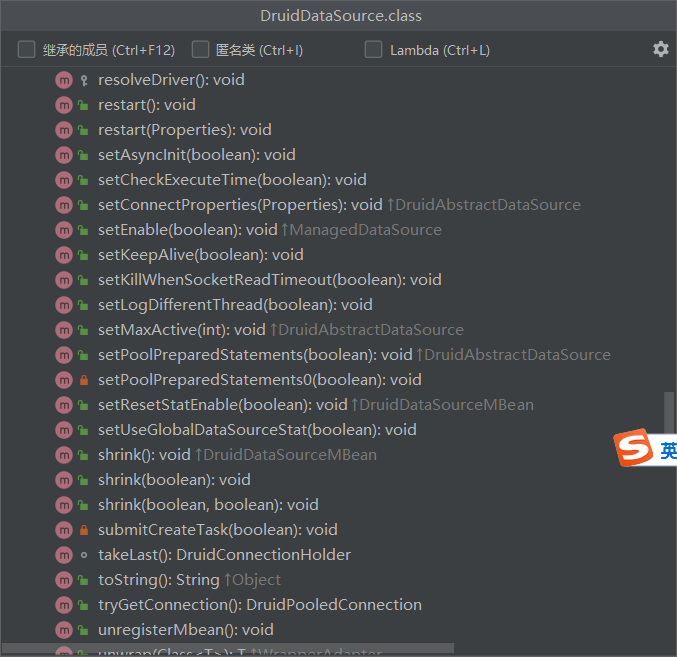
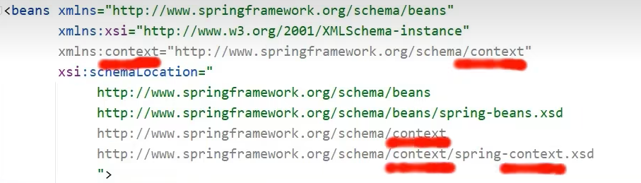
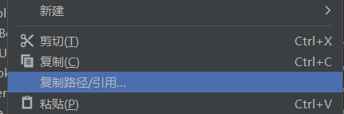
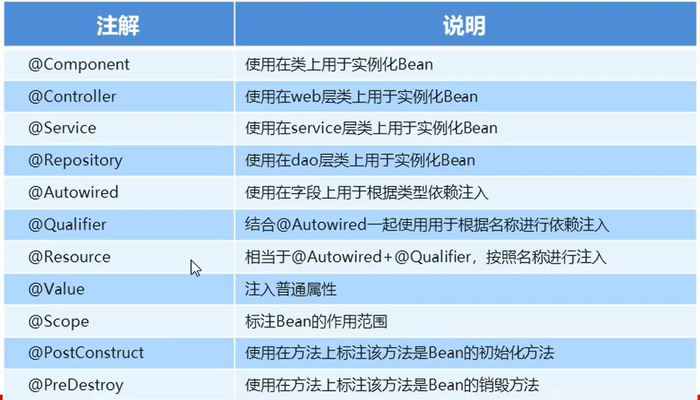
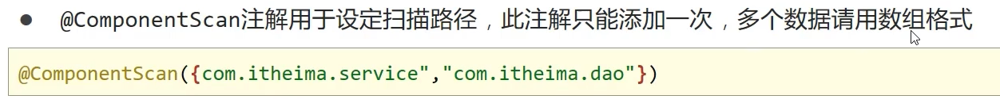
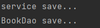
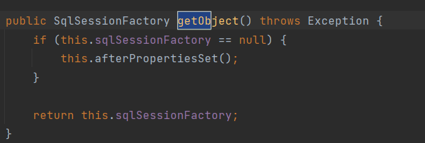

>  **导航：**
>
> [【Java笔记+踩坑汇总】Java基础+JavaWeb+SSM+SpringBoot+SpringCloud+瑞吉外卖/谷粒商城/学成在线+设计模式+面试题汇总+性能调优/架构设计+源码解析](https://blog.csdn.net/qq_40991313/article/details/126646289?csdn_share_tail={"type"%3A"blog"%2C"rType"%3A"article"%2C"rId"%3A"126646289"%2C"source"%3A"qq_40991313"})

[TOC]


# 1，IOC/DI配置管理第三方bean

> 了解即可，开发中更多用注解开发。

## 1.1 案例:数据源对象dataSource管理

**常见的数据库连接池**

我们现在使用更多的是Druid，它的性能比其他两个会好一些。

- DBCP
- C3P0
- Druid
- **Druid（德鲁伊）**
  - Druid连接池是阿里巴巴开源的数据库连接池项目
  - 功能强大，性能优秀，是Java语言最好的数据库连接池之一

### 1.1.1 环境准备

学习之前，先来准备下案例环境:

- 创建一个Maven项目

  

  

- pom.xml添加依赖Spring

  ```XML
  <dependencies>
      <dependency>
          <groupId>org.springframework</groupId>
          <artifactId>spring-context</artifactId>
          <version>5.2.10.RELEASE</version>
      </dependency>
  </dependencies>
  ```

  

- resources下添加spring的配置文件applicationContext.xml

  ```XML
  <?xml version="1.0" encoding="UTF-8"?>
  <beans xmlns="http://www.springframework.org/schema/beans"
         xmlns:xsi="http://www.w3.org/2001/XMLSchema-instance"
         xsi:schemaLocation="
              http://www.springframework.org/schema/beans
              http://www.springframework.org/schema/beans/spring-beans.xsd">
  
  </beans>
  ```

  

- 编写一个运行类App

  ```java
  public class App {
      public static void main(String[] args) {
          ApplicationContext ctx = new ClassPathXmlApplicationContext("applicationContext.xml");
      }
  }
  ```

  

### 1.1.2 思路分析

在上述环境下，我们来对数据源进行配置管理，先来分析下思路:

> 需求:使用Spring的IOC容器来管理Druid连接池对象
>
> 1.使用第三方的技术，需要在pom.xml添加依赖
>
> 2.在配置文件中将【第三方的类】制作成一个bean，让IOC容器进行管理
>
> 3.数据库连接需要基础的四要素`驱动`、`连接`、`用户名`和`密码`，【如何注入】到对应的bean中
>
> 4.从IOC容器中获取对应的bean对象，将其打印到控制台查看结果

**思考:**

- 第三方的类指的是什么?
- 如何注入数据库连接四要素?

### 1.1.3 实现Druid管理

- Druid连接池是阿里巴巴开源的数据库连接池项目

带着这两个问题，把下面的案例实现下:

**步骤1:导入`druid`的依赖**

pom.xml中添加依赖druid

```XML
<dependency>
    <groupId>com.alibaba</groupId>
    <artifactId>druid</artifactId>
    <version>1.1.16</version>
</dependency>
```


**步骤2:配置第三方bean**

在applicationContext.xml配置文件中添加`DruidDataSource`的配置，`DruidDataSource`类里使用setter方法注入数据库配置信息。


```XML
<?xml version="1.0" encoding="UTF-8"?>
<beans xmlns="http://www.springframework.org/schema/beans"
       xmlns:xsi="http://www.w3.org/2001/XMLSchema-instance"
       xsi:schemaLocation="
            http://www.springframework.org/schema/beans
            http://www.springframework.org/schema/beans/spring-beans.xsd">
    <!--管理DruidDataSource对象-->
    <bean id="dataSource" class="com.alibaba.druid.pool.DruidDataSource">
    <!--注意name是driverClassName，不是driver-->
        <property name="driverClassName" value="com.mysql.jdbc.Driver"/>
        <property name="url" value="jdbc:mysql://localhost:3306/spring_db"/>
        <property name="username" value="root"/>
        <property name="password" value="root"/>
    </bean>
</beans>
```


 Ctrl+b跟进到DruidDataSource类，按Ctrl+f12可以知道适合用setter方法注入




>  回顾一下以前Mybatis核心配置文件里配置数据库信息片段：
>
> ```XML
>     <environments default="development">
>         <environment id="development">
>             <dataSource type="POOLED">
>                 <!--数据库连接信息-->
>                 <property name="driver" value="com.mysql.jdbc.Driver"/>
>                 <property name="url" value="jdbc:mysql:///mybatis?useSSL=false"/>
>                 <property name="username" value="root"/>
>                 <property name="password" value="1234"/>
>             </dataSource>
>         </environment>
>     </environments>
> ```
>
> 

**说明:**

- **driverClassName:数据库驱动**
- url:数据库连接地址
- username:数据库连接用户名
- password:数据库连接密码
- 数据库连接的四要素要和自己使用的数据库信息一致。

**步骤3:从IOC容器中获取对应的bean对象**

```java
public class App {
    public static void main(String[] args) {
       ApplicationContext ctx = new ClassPathXmlApplicationContext("applicationContext.xml");
       DataSource dataSource = (DataSource) ctx.getBean("dataSource");
       System.out.println(dataSource);
    }
}
```


**步骤4:运行程序**

打印如下结果: 说明第三方bean对象已经被spring的IOC容器进行管理


做完案例后，我们可以将刚才思考的两个问题答案说下:

- 第三方的类指的是什么?

  ```
  DruidDataSource
  ```

  

- 如何注入数据库连接四要素?

  ```
  setter注入
  ```

  

### 1.1.4 实现C3P0管理

> 需求:使用Spring的IOC容器来管理C3P0连接池对象
>
> 实现方案和上面基本一致，重点要关注管理的是哪个bean对象`?

**步骤1:导入`C3P0`的依赖**

pom.xml中添加c3p0和mysql依赖

```XML
<dependency>
    <groupId>c3p0</groupId>
    <artifactId>c3p0</artifactId>
    <version>0.9.1.2</version>
</dependency>
<dependency>
    <groupId>mysql</groupId>
    <artifactId>mysql-connector-java</artifactId>
    <version>5.1.47</version>
</dependency>
```


**对于新的技术，不知道具体的坐标该如何查找?**

- 直接百度搜索

- 从mvn的仓库`https://mvnrepository.com/（网站打开需要科技）`中进行搜索

  

  

**步骤2:配置第三方bean**

在applicationContext.xml配置文件中配置c3p0

```XML
<bean id="dataSource" class="com.mchange.v2.c3p0.ComboPooledDataSource">
<!--注意是driverClass-->
    <property name="driverClass" value="com.mysql.jdbc.Driver"/>
<!--注意是jdbcUrl-->
    <property name="jdbcUrl" value="jdbc:mysql://localhost:3306/spring_db"/>
    <property name="user" value="root"/>
    <property name="password" value="root"/>
    <property name="maxPoolSize" value="1000"/>
</bean>
```


***\*注意:\****

- ComboPooledDataSource的属性是通过setter方式进行注入
- 想注入属性就需要在ComboPooledDataSource类或其上层类中有提供属性对应的setter方法
- C3P0的四个属性和Druid的四个属性是不一样的

**步骤3:运行程序**

程序会报错，错误如下


报的错为**ClassNotFoundException**,翻译出来是`类没有发现的异常`，具体的类为`com.mysql.jdbc.Driver`。错误的原因是缺少mysql的驱动包。

分析出错误的原因，具体的解决方案就比较简单，只需要在pom.xml把驱动包引入即可。

```XML
<dependency>
    <groupId>mysql</groupId>
    <artifactId>mysql-connector-java</artifactId>
    <version>5.1.47</version>
</dependency>
```


添加完mysql的驱动包以后，再次运行App,就可以打印出结果:


> **注意：**
>
> - 数据连接池在配置属性的时候，除了可以注入数据库连接四要素外还可以配置很多其他的属性，具体都有哪些属性用到的时候再去查，一般配置基础的四个，其他都有自己的默认值
> - Druid和C3P0在没有导入mysql驱动包的前提下，一个没报错一个报错，说明Druid在初始化的时候没有去加载驱动，而C3P0刚好相反
> - Druid程序运行虽然没有报错，但是当调用DruidDataSource的getConnection()方法获取连接的时候，也会报找不到驱动类的错误

## 1.2 加载properties文件

上节中我们已经完成两个数据源`druid`和`C3P0`的配置，但是其中包含了一些问题，我们来分析下:

- 这两个数据源中都使用到了一些固定的常量如**数据库连接四要素**，把这些值**写在Spring的配置文件中不利于后期维护**
- 需要将这些值提**取到一个外部的properties配置文**件中
- Spring框架如何从配置文件中读取属性值来配置就是接下来要解决的问题。

问题提出来后，具体该如何实现?

### 1.2.1 抽取数据库信息到properties文件，回顾sql、jsp、xml参数占位符

**实现思路**

> **需求:**
>
> 将数据库连接四要素提取到properties配置文件，spring来加载配置信息并使用这些信息来完成属性注入。
>
> 1.在resources下创建一个jdbc.properties(文件的名称可以任意)
>
> 2.将数据库连接四要素配置到配置文件中
>
> 3.在Spring的配置文件中加载properties文件
>
> 4.使用加载到的值实现属性注入
>
> 其中第3，4步骤是需要大家重点关注，具体是如何实现。

**实现步骤**

**步骤1:准备properties配置文件**

resources下创建一个jdbc.properties文件,并添加对应的属性键值对

```
jdbc.driver=com.mysql.jdbc.Driver
jdbc.url=jdbc:mysql:///spring_db?ssl=false
jdbc.username=root
jdbc.password=root
```


> **注意：别忘了加前缀“jdbc.”**


> **回顾：**
>
> 1.url里如果有**127.0.0.1:3306或localhost:3306**，那么他们都能**省略**。下面两行都可以
>
> ```
> jdbc.url=jdbc:mysql:///spring_db?ssl=false
> ```
>
> 
>
> ```
> jdbc.url=jdbc:mysql://localhost:3306/spring_db?ssl=false
> ```
>
> 
>
> 2.url后缀加**ssl=false**可以防止外面获取properties属性时候显红，虽然不影响运行，但显红看起来不舒服。

**步骤2:开启xmlns:context命名空间**

在applicationContext.xml中开`context`命名空间。这个不用记，输入context:property-placeholder标签后，**会自动导入上面的xmlns:context等信息**。

```XML
<?xml version="1.0" encoding="UTF-8"?>
<beans xmlns="http://www.springframework.org/schema/beans"
       xmlns:xsi="http://www.w3.org/2001/XMLSchema-instance"
       xmlns:context="http://www.springframework.org/schema/context"
       xsi:schemaLocation="
            http://www.springframework.org/schema/beans
            http://www.springframework.org/schema/beans/spring-beans.xsd
            http://www.springframework.org/schema/context
            http://www.springframework.org/schema/context/spring-context.xsd">

    <context:property-placeholder location="jdbc.properties"/>
</beans>
```


一共改了这5处地方：




> **说明：**
>
> 1. **xmlns** 代表 `xml namespace`， 就是 XML 标签的命名空间。
> 2. **xmlns:context** 代表使用 context 作为前缀的命名空间。比如在 XML 中，我们如果用到 这样的配置，就需要加上对应的前缀命名空间。
> 3. xmlns:context=”http://www.springframework.org/schema/context”。比如 同理。
> 4. **xmlns:xsi** 代表是指 XML **文件**遵守的 XML 规范。
> 5. **xsi:schemaLocation** 代表 XML **标签**遵守的 XML 规范。其中namespace和对应的 xsd 文件的路径，必须成对出现。比如用到的 xmlns:context 等命名空间，都需要在这里声明其 xsd 文件地址。

**步骤3:加载properties配置文件**

在配置文件中使用**`context:property-placeholder`标签的location属性**来**加载properties配置文件**。placeholder译为占位符。

```XML
<context:property-placeholder location="jdbc.properties"/>
```


**步骤4:完成属性注入**

使用`${key}`来读取properties配置文件中的内容并完成属性注入

```XML
<?xml version="1.0" encoding="UTF-8"?>
<beans xmlns="http://www.springframework.org/schema/beans"
       xmlns:xsi="http://www.w3.org/2001/XMLSchema-instance"
       xmlns:context="http://www.springframework.org/schema/context"
       xsi:schemaLocation="
            http://www.springframework.org/schema/beans
            http://www.springframework.org/schema/beans/spring-beans.xsd
            http://www.springframework.org/schema/context
            http://www.springframework.org/schema/context/spring-context.xsd">

    <context:property-placeholder location="jdbc.properties"/>
    <bean id="dataSource" class="com.alibaba.druid.pool.DruidDataSource">
        <property name="driverClassName" value="${jdbc.driver}"/>
        <property name="url" value="${jdbc.url}"/>
        <property name="username" value="${jdbc.username}"/>
        <property name="password" value="${jdbc.password}"/>
    </bean>
</beans>
```


> **回顾一下参数占位符**
>
> xml里的参数占位符${}
>
> SQL里的参数占位符#{}、${}，前者没sql注入问题
>
> jsp里EL表达式参数占位符：${}
>
> ```html
> <%@ page contentType="text/html;charset=UTF-8" language="java" isELIgnored="false" %>
> <html>
> <head>
>     <title>Title</title>
> </head>
> <body>
> <!--brands是request请求域转发来的-->
>     ${brands}
> </body>
> </html>
> ```
>
> 

至此，读取外部properties配置文件中的内容就已经完成。

### 1.2.2 读取properties配置文件里的属性（setter依赖注入基本数据类型）

**实现思路**

对于上面的案例，效果不是很明显，我们可以换个案例来演示下:

> **需求:**
>
> 从properties配置文件中读取key为name的值，并将其注入到BookDao中并在save方法中进行打印。
>
> 1.在项目中添加BookDao和BookDaoImpl类
>
> 2.为BookDaoImpl添加一个name属性并提供setter方法
>
> 3.在jdbc.properties中添加数据注入到bookDao中打印方便查询结果
>
> 4.在applicationContext.xml添加配置完成配置文件加载、属性注入(${key})

**实现步骤**

**步骤1:在项目中添对应的类**

BookDao和BookDaoImpl类，并在BookDaoImpl类中添加`name`属性与setter方法

```java
public interface BookDao {
    public void save();
}

public class BookDaoImpl implements BookDao {
    private String name;

    public void setName(String name) {
        this.name = name;
    }

    public void save() {
        System.out.println("book dao save ..." + name);
    }
}
```


**步骤2:完成配置文件的读取与注入**

在applicationContext.xml添加配置bookDao的bean对象，注入properties的键。

```XML
<?xml version="1.0" encoding="UTF-8"?>
<beans xmlns="http://www.springframework.org/schema/beans"
       xmlns:xsi="http://www.w3.org/2001/XMLSchema-instance"
       xmlns:context="http://www.springframework.org/schema/context"
       xsi:schemaLocation="
            http://www.springframework.org/schema/beans
            http://www.springframework.org/schema/beans/spring-beans.xsd
            http://www.springframework.org/schema/context
            http://www.springframework.org/schema/context/spring-context.xsd">

    <context:property-placeholder location="jdbc.properties"/>

    <bean id="bookDao" class="com.itheima.dao.impl.BookDaoImpl">
        <property name="name" value="${jdbc.driver}"/>
    </bean>
</beans>
```


**步骤3:运行程序**

在App类中，从IOC容器中获取bookDao对象，调用方法，查看值是否已经被获取到并打印控制台

```java
public class App {
    public static void main(String[] args) throws Exception{
        ApplicationContext ctx = new ClassPathXmlApplicationContext("applicationContext.xml");
        BookDao bookDao = (BookDao) ctx.getBean("bookDao");
        bookDao.save();

    }
}
```


### **1.2.3 设置系统属性模式和加载多个properties**

至此，读取properties配置文件中的内容就已经完成，但是在使用的时候，有些注意事项:

- **问题一:键值对的key为`username`引发的问题**

  1.在properties中配置键值对的时候，如果**key设置为`username`**`，不是jdbc.username`

  ```
  username=root666
  ```

  

  2.在applicationContext.xml注入该属性

  ```XML
  <?xml version="1.0" encoding="UTF-8"?>
  <beans xmlns="http://www.springframework.org/schema/beans"
         xmlns:xsi="http://www.w3.org/2001/XMLSchema-instance"
         xmlns:context="http://www.springframework.org/schema/context"
         xsi:schemaLocation="
              http://www.springframework.org/schema/beans
              http://www.springframework.org/schema/beans/spring-beans.xsd
              http://www.springframework.org/schema/context
              http://www.springframework.org/schema/context/spring-context.xsd">
  
      <context:property-placeholder location="jdbc.properties"/>
  
      <bean id="bookDao" class="com.itheima.dao.impl.BookDaoImpl">
          <property name="name" value="${username}"/>
      </bean>
  </beans>
  ```

  

  3.运行后，在**控制台打印的**却不是`root666`，而**是自己电脑的用户名**

  

  

  4.出现问题的**原因**是**`<context:property-placeholder/>`标签会加载系统的环境变量**，而且环境变量的值**优先度更高**

- **查看系统的环境变量**

  ```java
  public static void main(String[] args) throws Exception{
      Map<String, String> env = System.getenv();
      System.out.println(env);
  }
  ```

  

  大家可以自行运行，在打印出来的结果中会有一个USERNAME=XXX[自己电脑的用户名称]

  **5.解决方案，设置系统属性模式为**NEVER

  ```XML
  <?xml version="1.0" encoding="UTF-8"?>
  <beans xmlns="http://www.springframework.org/schema/beans"
         xmlns:xsi="http://www.w3.org/2001/XMLSchema-instance"
         xmlns:context="http://www.springframework.org/schema/context"
         xsi:schemaLocation="
              http://www.springframework.org/schema/beans
              http://www.springframework.org/schema/beans/spring-beans.xsd
              http://www.springframework.org/schema/context
              http://www.springframework.org/schema/context/spring-context.xsd">
  
      <context:property-placeholder location="jdbc.properties" system-properties-mode="NEVER"/>
  </beans>
  ```

  

  **system-properties-mode:设置为NEVER,表示不加载系统属性**，就可以解决上述问题。

  **解决方案二：避免使用`username`作为属性的`key`。**

- **问题二:加载多个properties配置文件**

  1.调整下配置文件的内容，在resources下添加`jdbc.properties`,`jdbc2.properties`,内容如下:

  jdbc.properties

  ```
  jdbc.driver=com.mysql.jdbc.Driver
  jdbc.url=jdbc:mysql://127.0.0.1:3306/spring_db
  jdbc.username=root
  jdbc.password=root
  ```

  

  jdbc2.properties

  ```
  username=root666
  ```

  

  2.修改applicationContext.xml

  ```XML
  <?xml version="1.0" encoding="UTF-8"?>
  <beans xmlns="http://www.springframework.org/schema/beans"
         xmlns:xsi="http://www.w3.org/2001/XMLSchema-instance"
         xmlns:context="http://www.springframework.org/schema/context"
         xsi:schemaLocation="
              http://www.springframework.org/schema/beans
              http://www.springframework.org/schema/beans/spring-beans.xsd
              http://www.springframework.org/schema/context
              http://www.springframework.org/schema/context/spring-context.xsd">
      <!--方式一：使用逗号分别配置-->
      <context:property-placeholder location="jdbc.properties,jdbc2.properties" system-properties-mode="NEVER"/>
      <!--方式二：当前路径下通配符配置-->
      <context:property-placeholder location="*.properties" system-properties-mode="NEVER"/>
      <!--方式三：根路径（仅当前工程）下通配符配置-->
      <context:property-placeholder location="classpath:*.properties" system-properties-mode="NEVER"/>
      <!--方式四：根路径（当前工程、依赖的jar包）通配符配置-->
      <context:property-placeholder location="classpath*:*.properties" system-properties-mode="NEVER"/>
  </beans>
  ```

  

  > **说明:**
  >
  > - 方式一:可以实现，如果配置文件多的话，每个都需要配置
  > - 方式二:`*.properties`代表所有以properties结尾的文件都会被加载，可以解决方式一的问题，但是不标准
  > - 方式三:标准的写法，`classpath:`代表的是从根路径下开始查找，但是只能查询当前项目的根路径
  > - **方式四:不仅可以加载当前项目还可以加载当前项目所依赖的所有项目的根路径下的properties配置文件**
  >
  > 
  >
  > **classpath和classpath\*区别：** 
  >
  > **classpath：**只会到你的class路径中查找找文件。
  >
  > **classpath\*：**不仅包含class路径，还包括jar文件中（class路径）进行查找。
  >
  > **注意：** 用classpath*:需要遍历所有的classpath，所以加载速度是很慢的；因此，在规划的时候，应该尽可能规划好资源文件所在的路径，**尽量避免使用classpath\***。

### 1.2.4 小结

本节主要讲解的是properties配置文件的加载，需要掌握的内容有:

- **如何开启`context`命名空间**

  

  

- **如何加载properties配置文件，context:property-placeholder标签**

  ```XML
  <context:property-placeholder location="" system-properties-mode="NEVER"/>
  ```

  

- 如何在applicationContext.**xml引入properties配置文件中的值**

  ```
  ${key}
  ```

  

# 2，核心容器

前面已经完成bean与依赖注入的相关知识学习，接下来我们主要学习的是IOC容器中的**核心容器**。

这里所说的核心容器，大家可以把它简单的理解为**`ApplicationContext`**

> **学习计划：** 
>
> - 如何创建容器?
> - 创建好容器后，如何从容器中获取bean对象?
> - 容器类的层次结构是什么?
> - BeanFactory是什么?

## 2.1 环境准备

先来准备下案例环境:跟之前都一样，导入Spring依赖、创建dao接口和实现类，applicationContext.xml里配置dao的bean。

- 创建一个Maven项目

- pom.xml添加Spring的依赖

  ```XML
  <dependencies>
      <dependency>
          <groupId>org.springframework</groupId>
          <artifactId>spring-context</artifactId>
          <version>5.2.10.RELEASE</version>
      </dependency>
  </dependencies>
  ```

  

- resources下添加applicationContext.xml

  ```XML
  <?xml version="1.0" encoding="UTF-8"?>
  <beans xmlns="http://www.springframework.org/schema/beans"
         xmlns:xsi="http://www.w3.org/2001/XMLSchema-instance"
         xsi:schemaLocation="
              http://www.springframework.org/schema/beans http://www.springframework.org/schema/beans/spring-beans.xsd">
      <bean id="bookDao" class="com.itheima.dao.impl.BookDaoImpl"/>
  </beans>
  ```

  

- 添加BookDao和BookDaoImpl类

  ```java
  public interface BookDao {
      public void save();
  }
  public class BookDaoImpl implements BookDao {
      public void save() {
          System.out.println("book dao save ..." );
      }
  }
  ```

  

- 创建运行类App

  ```java
  public class App {
      public static void main(String[] args) {
          ApplicationContext ctx = new ClassPathXmlApplicationContext("applicationContext.xml");
          BookDao bookDao = (BookDao) ctx.getBean("bookDao");
          bookDao.save();
      }
  }
  ```

  

最终创建好的项目结构如下:


## 2.2 容器

### 2.2.1 容器的两种创建方式（主要用过去方法）

**方式一（主要方式）：** 

入门案例中创建`ApplicationContext`的方式为:

```java
ApplicationContext ctx = new ClassPathXmlApplicationContext("applicationContext.xml");
```


这种方式翻译为:**类路径下的XML配置文件**

**方式二（了解）：** 

除了上面这种方式，Spring还提供了**另外一种创建方式（耦合度较高,不推荐使用）:**

```java
ApplicationContext ctx = new FileSystemXmlApplicationContext("D:\\workspace\\spring\\spring_10_container\\src\\main\\resources\\applicationContext.xml");
```


这种方式翻译为:**文件系统下的XML配置文件**

这种方式是从项目路径下开始查找`applicationContext.xml`配置文件的，路径只需要右键xml配置文件拷贝路径再粘贴即可。




**说明:**大家练习的时候，写自己的具体路径。

这种方式虽能实现，但是当项目的位置发生变化后,代码也需要跟着改,**耦合度较高,不推荐使用**。

### 2.2.2 Bean的三种获取方式

**方式一（主要方式）**，根据id获取，就是目前案例中获取的方式:

```java
BookDao bookDao = (BookDao) ctx.getBean("bookDao");
```


这种方式存在的问题是每次获取的时候都需要进行类型转换，有没有更简单的方式呢?

**方式二（了解）：**

```java
BookDao bookDao = ctx.getBean("bookDao"，BookDao.class);
```


优点：**解决类型强转问题**

缺点：参数又多加了一个，相对来说没有简化多少。

**方式三（看情况用）:**

```java
BookDao bookDao = ctx.getBean(BookDao.class);
```


这种方式就**类似**我们之前所学习依赖注入中的**按类型注入**。必须要**确保IOC容器中该类型对应的bean对象只能有一个**。

### 2.2.3 容器类BeanFactory继承实现关系

(1)在IDEA中双击`shift`,输入BeanFactory


(2)点击进入BeanFactory类，ctrl+h,就能查看到如下结构的层次关系


从图中可以看出，容器类也是从无到有根据需要一层层叠加上来的，大家重点理解下这种设计思想。

继承关系：ClassPathXmlApplicationContext实现ApplicationContext，ApplicationContext继承BeanFactory

### 2.2.4 BeanFactory创建容器（了解）

这是最早期的创建容器方案，现在基本不用。

使用BeanFactory来创建IOC容器的具体实现方式为:

```java
public class AppForBeanFactory {
    public static void main(String[] args) {
        Resource resources = new ClassPathResource("applicationContext.xml");
        BeanFactory bf = new XmlBeanFactory(resources);
        BookDao bookDao = bf.getBean(BookDao.class);
        bookDao.save();
    }
}
```


 **`BeanFactory`和`ApplicationContext`的区别**

为了更好的看出`BeanFactory`和`ApplicationContext`之间的区别，在BookDaoImpl添加如下构造函数:

```java
public class BookDaoImpl implements BookDao {
    public BookDaoImpl() {
        System.out.println("constructor");
    }
    public void save() {
        System.out.println("book dao save ..." );
    }
}
```


如果不去获取bean对象，打印会发现：

- **BeanFactory是延迟加载**，只有**在获取bean对象的时候才会去创建**

- **ApplicationContext**是**立即加载**，容器加载的时候就会**创建bean对象**

- ApplicationContext要想成为延迟加载，只需要按照如下方式配置lazy-init

  ```XML
  <?xml version="1.0" encoding="UTF-8"?>
  <beans xmlns="http://www.springframework.org/schema/beans"
         xmlns:xsi="http://www.w3.org/2001/XMLSchema-instance"
         xsi:schemaLocation="
              http://www.springframework.org/schema/beans http://www.springframework.org/schema/beans/spring-beans.xsd">
      <bean id="bookDao" class="com.itheima.dao.impl.BookDaoImpl"  lazy-init="true"/>
  </beans>
  ```

  

### **2.2.5 小结**

这一节中所讲的知识点包括:

- **容器创建的两种方式**

  - ClassPathXmlApplicationContext[掌握]
  - FileSystemXmlApplicationContext[知道即可]

- **获取Bean的三种方式**

  - getBean("名称"):需要类型转换
  - getBean("名称",类型.class):多了一个参数
  - getBean(类型.class):容器中不能有多个该类的bean对象

  上述三种方式，各有各的优缺点，用哪个都可以。

- 容器类层次结构

  - 只需要知晓容器的最上级的父接口为 BeanFactory即可

- BeanFactory

  - 使用BeanFactory创建的容器是延迟加载
  - 使用ApplicationContext创建的容器是立即加载
  - 具体BeanFactory如何创建只需要了解即可。

## 2.3 核心容器总结


### 2.3.1 IOC容器的类和接口

- **BeanFactory是IOC容器的顶层接口**，初始化BeanFactory对象时，加载的bean**延迟加载**

- **ApplicationContext**接口是Spring容器的**核心接口**，初始化时bean**立即加载**

- ApplicationContext接口提供基础的bean操作相关方法，通过其他接口扩展其功能

- ApplicationContext接口

  常用初始化类

  - ***\*ClassPathXmlApplicationContext(常用)\****
  - FileSystemXmlApplicationContext

### 2.3.2 bean的属性


其实整个配置中最常用的就两个属性**id**和**class**。

把**scope、init-method、destroy-method**框起来的原因是，后面注解在讲解的时候还会用到，所以大家对这三个属性关注下。

### 2.3.3 两种依赖注入方法


# 3，IOC/DI注解开发

Spring的IOC/DI对应的配置开发就已经讲解完成，但是使用起来相对来说还是比较复杂的，复杂的地方在**配置文件**。

前面咱们聊Spring的时候说过，Spring可以简化代码的开发，到现在并没有体会到。

所以Spring到底是如何简化代码开发的呢?

要想真正简化开发，就需要用到Spring的注解开发，Spring对注解支持的版本历程:

- 2.0版开始支持注解
- 2.5版注解功能趋于完善
- 3.0版支持纯注解开发

关于注解开发，我们会讲解两块内容**`注解开发定义bean`和`纯注解开发`。**

注解开发定义bean用的是2.5版提供的注解，纯注解开发用的是3.0版提供的注解。

## 3.-1 注解关键字汇总

> 先剧透一下，**配置类样子：**
>
> ```java
> @Configuration    //声明配置类
> @ComponentScan("package1")    //组件扫描路径
> @EnableAspectJAutoProxy        //开启aop
> @EnableTransactionManagement    //开启业务管理
> @PropertySource("classpath:jdbc.properties")        //properties配置文件路径
> @Import({JdbcConfig.class,MybatisConfig.class})    //导入第三方配置文件
> public class SpringConfig {
> }
> ```
>
> 




**IOC相关注解** 

**@Configuration**

| 名称 | @Configuration              |
| ---- | --------------------------- |
| 类型 | 类注解                      |
| 位置 | 类定义上方                  |
| 作用 | 设置该类为spring配置类      |
| 属性 | value（默认）：定义bean的id |

**@ComponentScan**

| 名称 | @ComponentScan                                           |
| ---- | -------------------------------------------------------- |
| 类型 | 类注解                                                   |
| 位置 | 类定义上方                                               |
| 作用 | 设置spring配置类扫描路径，用于加载使用注解格式定义的bean |
| 属性 | value（默认）：扫描路径，此路径可以逐层向下扫描          |


**DI相关注解**

**知识点1：@Autowired**

| 名称 | @Autowired                                                   |
| ---- | ------------------------------------------------------------ |
| 类型 | 属性注解 或 方法注解（了解） 或 方法形参注解（了解）         |
| 位置 | 属性定义上方 或 标准set方法上方 或 类set方法上方 或 方法形参前面 |
| 作用 | 为引用类型属性设置值                                         |
| 属性 | required：true/false，定义该属性是否允许为null               |

**知识点2：@Qualifier**

| 名称 | @Qualifier                                       |
| ---- | ------------------------------------------------ |
| 类型 | 属性注解 或 方法注解（了解）                     |
| 位置 | 属性定义上方 或 标准set方法上方 或 类set方法上方 |
| 作用 | 为引用类型属性指定注入的beanId                   |
| 属性 | value（默认）：设置注入的beanId                  |

**知识点3：@Value**

| 名称 | @Value                                           |
| ---- | ------------------------------------------------ |
| 类型 | 属性注解 或 方法注解（了解）                     |
| 位置 | 属性定义上方 或 标准set方法上方 或 类set方法上方 |
| 作用 | 为 基本数据类型 或 字符串类型 属性设置值         |
| 属性 | value（默认）：要注入的属性值                    |

**知识点4：@PropertySource**

| 名称 | @PropertySource                                              |
| ---- | ------------------------------------------------------------ |
| 类型 | 类注解                                                       |
| 位置 | 类定义上方                                                   |
| 作用 | 加载properties文件中的属性值                                 |
| 属性 | value（默认）：设置加载的properties文件对应的文件名或文件名组成的数组 |


**第三方管理相关注解：** 

**知识点1：@Bean**

| 名称 | @Bean                                  |
| ---- | -------------------------------------- |
| 类型 | 方法注解                               |
| 位置 | 方法定义上方                           |
| 作用 | 设置该方法的返回值作为spring管理的bean |
| 属性 | value（默认）：定义bean的id            |

**知识点2：@Import**

| 名称 | @Import                                                      |
| ---- | ------------------------------------------------------------ |
| 类型 | 类注解                                                       |
| 位置 | 类定义上方                                                   |
| 作用 | 导入配置类                                                   |
| 属性 | value（默认）：定义导入的配置类类名，  		当配置类有多个时使用数组格式一次性导入多个配置类 |


**aop相关注解：**


**知识点1：@EnableAspectJAutoProxy**

| 名称 | @EnableAspectJAutoProxy |
| ---- | ----------------------- |
| 类型 | 配置类注解              |
| 位置 | 配置类定义上方          |
| 作用 | 开启注解格式AOP功能     |

**知识点2：@Aspect**

| 名称 | @Aspect               |
| ---- | --------------------- |
| 类型 | 类注解                |
| 位置 | 切面类定义上方        |
| 作用 | 设置当前类为AOP切面类 |

**知识点3：@Pointcut**

| 名称 | @Pointcut                   |
| ---- | --------------------------- |
| 类型 | 方法注解                    |
| 位置 | 切入点方法定义上方          |
| 作用 | 设置切入点方法              |
| 属性 | value（默认）：切入点表达式 |

**aop环绕通知相关注解：** 

**知识点4：@Before**

| 名称 | @Before                                                      |
| ---- | ------------------------------------------------------------ |
| 类型 | 方法注解                                                     |
| 位置 | 通知方法定义上方                                             |
| 作用 | 设置当前通知方法与切入点之间的绑定关系，当前通知方法在原始切入点方法前运行 |

**知识点5：@After**

| 名称 | @After                                                       |
| ---- | ------------------------------------------------------------ |
| 类型 | 方法注解                                                     |
| 位置 | 通知方法定义上方                                             |
| 作用 | 设置当前通知方法与切入点之间的绑定关系，当前通知方法在原始切入点方法后运行 |

**知识点6：@AfterReturning**

| 名称 | @AfterReturning                                              |
| ---- | ------------------------------------------------------------ |
| 类型 | 方法注解                                                     |
| 位置 | 通知方法定义上方                                             |
| 作用 | 设置当前通知方法与切入点之间绑定关系，当前通知方法在原始切入点方法正常执行完毕后执行 |

**知识点7：@AfterThrowing**

| 名称 | @AfterThrowing                                               |
| ---- | ------------------------------------------------------------ |
| 类型 | 方法注解                                                     |
| 位置 | 通知方法定义上方                                             |
| 作用 | 设置当前通知方法与切入点之间绑定关系，当前通知方法在原始切入点方法运行抛出异常后执行 |

**知识点8：@Around**

| 名称 | @Around                                                      |
| ---- | ------------------------------------------------------------ |
| 类型 | 方法注解                                                     |
| 位置 | 通知方法定义上方                                             |
| 作用 | 设置当前通知方法与切入点之间的绑定关系，当前通知方法在原始切入点方法前后运行 |


**业务相关注解：**

**知识点1：@EnableTransactionManagement**

| 名称 | @EnableTransactionManagement           |
| ---- | -------------------------------------- |
| 类型 | 配置类注解                             |
| 位置 | 配置类定义上方                         |
| 作用 | 设置当前Spring环境中开启注解式事务支持 |

**知识点2：@Transactional**

| 名称 | @Transactional                                               |
| ---- | ------------------------------------------------------------ |
| 类型 | 接口注解 类注解 方法注解                                     |
| 位置 | 业务层接口上方 业务层实现类上方 业务方法上方                 |
| 作用 | 为当前业务层方法添加事务（如果设置在类或接口上方则类或接口中所有方法均添加事务） |

## 3.0 环境准备

在学习注解开发之前，先来准备下案例环境:跟之前一样，导入Spring依赖、写dao、service的接口和实现类、创建applicationContext.xml配置文件、创建运行类测试。

- 创建一个Maven项目

- pom.xml添加Spring的依赖

  ```XML
  <dependencies>
      <dependency>
          <groupId>org.springframework</groupId>
          <artifactId>spring-context</artifactId>
          <version>5.2.10.RELEASE</version>
      </dependency>
  </dependencies>
  ```

  

- resources下添加applicationContext.xml

  ```XML
  <?xml version="1.0" encoding="UTF-8"?>
  <beans xmlns="http://www.springframework.org/schema/beans"
         xmlns:xsi="http://www.w3.org/2001/XMLSchema-instance"
         xsi:schemaLocation="
              http://www.springframework.org/schema/beans http://www.springframework.org/schema/beans/spring-beans.xsd">
      <bean id="bookDao" class="com.itheima.dao.impl.BookDaoImpl"/>
  </beans>
  ```

  

- 添加BookDao、BookDaoImpl、BookService、BookServiceImpl类

  ```java
  public interface BookDao {
      public void save();
  }
  public class BookDaoImpl implements BookDao {
      public void save() {
          System.out.println("book dao save ..." );
      }
  }
  public interface BookService {
      public void save();
  }
  
  public class BookServiceImpl implements BookService {
      public void save() {
          System.out.println("book service save ...");
      }
  }
  ```

  

- 创建运行类App

  ```java
  public class App {
      public static void main(String[] args) {
          ApplicationContext ctx = new ClassPathXmlApplicationContext("applicationContext.xml");
          BookDao bookDao = (BookDao) ctx.getBean("bookDao");
          bookDao.save();
      }
  }
  ```

  

最终创建好的项目结构如下:


## 3.1 注解开发案例（xml里扫描组件）

### 3.1.1 代码实现

**类注解@Component：声明此类是一个Bean，实现bean的注入。**

```java
@Component("bean的id")    
//@Component    //仅一个实现类的话可以不加id，getBean通过字节码文件，按类型获取
```


> **扩展：**
>
> **三个衍生注解`@Controller`、`@Service`、`@Repository`**
>
> 通过查看源码会发现这三个注解**和@Component注解的作用是完全一样的**:
>
> 
>
> 
>
> 
>
> **样子不一样是为了区分三层：**
>
> - 业务层使用**@Service**
> - 数据层使用**@Repository**，译为仓库，数据库
> - 表现层使用**@Controller**，译为控制器
> - 其他使用（包括工具类、下一章spring基础3讲到的aop层的**切面类@Aspect**、ssm整合的项目拦截器类）**@Component**
>
> 例如学springmvc时候，Spring配置类的**@ComponentScan里可以添加excludeFilters**属性**排除掉注解**@Controller的bean，把他们交给springmvc配置类扫描和管理。

**步骤1:删除原XML配置里的bean**

将配置文件中的`<bean>`标签删除掉

```XML
<bean id="bookDao" class="com.itheima.dao.impl.BookDaoImpl"/>
```


**步骤2:Dao上添加注解`@Component`**

在BookDaoImpl类上添加`@Component`注解

```java
@Component    //只有一个实现类的话可以不加id，getBean时候通过bookDaoimpl.class和bookDao.class都是可以的
//@Component("bookDao")    //多个实现类的话必须起id
public class BookDaoImpl implements BookDao {
    public void save() {
        System.out.println("book dao save ..." );
    }
}
```


> **注意:@Component注解一般添加在接口上，因为接口是无法创建对象的。接口里只有dao接口可以注解。**
>
> XML与注解配置的对应关系:
>
> 
>
> 

**步骤3:配置Spring的注解包扫描@Component**

为了让Spring框架能够扫描到写在类上的注解，需要在配置文件上进行包扫描。

> 上面xmlns命名空间等配置**不用记**，**输入context:component-scan标签，beans标签配置信息会自动导入**。

```XML
<?xml version="1.0" encoding="UTF-8"?>
<beans xmlns="http://www.springframework.org/schema/beans"
       xmlns:xsi="http://www.w3.org/2001/XMLSchema-instance"
       xsi:schemaLocation="
            http://www.springframework.org/schema/beans http://www.springframework.org/schema/beans/spring-beans.xsd">
    <context:component-scan base-package="com.itheima"/>
</beans>
```


> **说明:**
>
> **component-scan组件扫描**
>
> - **component:**组件,Spring将管理的**bean视作自己的一个组件**
> - **scan**:扫描
>
> base-package指定Spring框架扫描的包路径，它会**扫描**指定包**及其子包**中的所有类上的**注解**。
>
> - 包路径越多[如:com.itheima.dao.impl]，扫描的范围越小速度越快
> - 包路径越少[如:com.itheima],扫描的范围越大速度越慢
> - 一般扫描到项目的组织名称即Maven的groupId下[如:com.itheima]即可。

**步骤4：通过id获取bean，运行程序**

```java
public class App {
    public static void main(String[] args) {
        ApplicationContext ctx = new ClassPathXmlApplicationContext("applicationContext.xml");
        BookDao bookDao = (BookDao) ctx.getBean("bookDao");
        bookDao.save();
    }
}
```


运行`App`类查看打印结果


### 3.1.2 @Component内可省略id

**注解方式@Component内可省略id，默认值是首字母小写的类名**

**步骤1:Service上添加注解**

在BookServiceImpl类上也添加`@Component`交给Spring框架管理

```java
@Component    //@Component(value="bookService")或@Component("bookService")
//默认注解id是首字母小写的接口名，即bookService
public class BookServiceImpl implements BookService {
    private BookDao bookDao;

    public void setBookDao(BookDao bookDao) {
        this.bookDao = bookDao;
    }

    public void save() {
        System.out.println("book service save ...");
        bookDao.save();
    }
}
```


**步骤2:字节码文件获取bean，运行程序**

在App类中，从IOC容器中通过**字节码文件获取或默认ID**对应的bean对象，打印

> **注意：**字节码文件都不加引号。

```java
public class App {
    public static void main(String[] args) {
        ApplicationContext ctx = new ClassPathXmlApplicationContext("applicationContext.xml");
        BookService bookService = ctx.getBean(BookService.class);
        //BookService bookService = ctx.getBean("bookServiceImpl");
        System.out.println(bookService);
    }
}
```


打印观察结果，两个bean对象都已经打印到控制台


>  **说明:**
>
> - BookServiceImpl类没有起名称，所以在App中是按照类型来获取bean对象
>
> - **@Component注解如果不起名称**，会有一个**默认值就是`当前类名首字母小写`**，所以也可以按照名称获取，如
>
>   ```java
>   BookService bookService = (BookService)ctx.getBean("bookServiceImpl");
>   System.out.println(bookService);
>   ```
>
>   

### **3.1.3 知识点**@Component/@Controller/@Service/@Repository

| 名称 | @Component/@Controller/@Service/@Repository |
| ---- | ------------------------------------------- |
| 类型 | 类注解                                      |
| 位置 | 类定义上方                                  |
| 作用 | 设置该类为spring管理的bean                  |
| 属性 | value（默认）：定义bean的id                 |


## 3.2 纯注解开发**`@Configuration和@ComponentScan`**

上面已经可以使用注解来配置bean,但是依然有用到配置文件，在配置文件中对包进行了扫描，Spring在3.0版已经支持纯注解开发

- Spring3.0开启了**纯注解开发**模式，使用**Java类替代配置文件**，开启了Spring快速开发赛道

**具体如何实现?**

**删除applicationContext.xml配置文件，使用注解类替代，@Configuration声明注解类，@Component()扫描组件位置。**

### 3.2.1 思路分析

实现思路为:

- 将配置文件**applicationContext.xml删除掉**，使用类来替换。

### 3.2.2 代码实现

**步骤1:创建配置类**

创建config软件包，在其内创建一个配置类`SpringConfig`

```java
public class SpringConfig {
}
```


**步骤2:标识该类为配置类`@Configuration`**

在配置类上添加**`@Configuration`**注解，将其标识为一个配置类,替换`applicationContext.xml`

```java
//@Configuration其实和@Component作用一样，可以互相替换，只是样子不同，为了更直观的看出它是配置类
@Configuration
public class SpringConfig {
}
```


> **@Configuration其实和@Component作用一样，可以互相替换，只是样子不同，为了更直观的看出它是配置类。**
>
> **@Configuration 和 @Component 的区别：**
>
> @Configuration 中所有带 @Bean 注解的方法都会被动态代理（cglib），因此调用该方法返回的都是同一个实例。
>
> 而 @Conponent 修饰的类不会被代理，每实例化一次就会创建一个新的对象。

**步骤3:用注解替换包扫描配置`@ComponentScan`**

在配置类上添加包扫描注解**`@ComponentScan`**替换`<context:component-scan base-package=""/>`

> **如果扫描多个文件，有两种方法，推荐第二种。**
>
> **方法一：用数组模式：**
>
> 这种配置相比直接扫描com.itheima不是多此一举，因为可能会存在某些bean不能乱扫描的情况。
>
> **方法二：**
>
> 在整合SpringMvc时候，就必须设置bean的加载控制，排除加载表现层的bean，这样注解形式的@Controller的bean就会被排除掉，交给SpringMvcConfig配置类的容器管理：
>
> ```java
> @Configuration
> @ComponentScan(value="com.itheima",
>     excludeFilters=@ComponentScan.Filter(
>         type = FilterType.ANNOTATION,
>         classes = Controller.class
>     )
> )
> public class SpringConfig {
> }
> ```
>
> 

```java
//有了@ComponentScan，@Configuration就可以省略
//@Configuration
@ComponentScan("com.itheima")
public class SpringConfig {
}
```


**步骤4:创建运行类并执行**

```java
new ClassPathXmlApplicationContext("applicationContext.xml")
```


改成

```java
new AnnotationConfigApplicationContext(SpringConfig.class);
```


> **翻译：**
>
> Annotation译为注解，**AnnotationConfigApplicationContext**译为**注解配置的应用上下文**
>
>  ClassPathXmlApplicationContext译为**类路径的xml应用上下文。**
>
> **注意：**
>
> 一般字节码.class文件都是不带引号的。

```java
public class AppForAnnotation {

    public static void main(String[] args) {
        //注意字节码文件不加引号
        ApplicationContext ctx = new AnnotationConfigApplicationContext(SpringConfig.class);
        BookDao bookDao = (BookDao) ctx.getBean("bookDao");
        System.out.println(bookDao);
        BookService bookService = ctx.getBean(BookService.class);
        System.out.println(bookService);
    }
}
```


运行AppForAnnotation,可以看到两个对象依然被获取成功


> **步骤回顾：** 
>
> - **Java类替换Spring核心配置文件**
>
>   
>
>   
>
> - **@Configuration**注解用于设定当前类为配置类
>
> - **@ComponentScan**注解用于设定扫描路径，此注解只能添加一次，多个数据请用数组格式
>
>   ```java
>   @ComponentScan({com.itheima.service","com.itheima.dao"})
>   ```
>
>   
>
> - 读取Spring核心配置文件初始化容器对象切换为读取Java配置类初始化容器对象
>
>   ```java
>   //加载配置文件初始化容器
>   ApplicationContext ctx = new ClassPathXmlApplicationContext("applicationContext.xml");
>   //加载配置类初始化容器
>   ApplicationContext ctx = new AnnotationConfigApplicationContext(SpringConfig.class);
>   ```
>
>   

**3.2.3 知识点@Configuration和@ComponentScan** 

**知识点1：@Configuration**

| 名称 | @Configuration              |
| ---- | --------------------------- |
| 类型 | 类注解                      |
| 位置 | 类定义上方                  |
| 作用 | 设置该类为spring配置类      |
| 属性 | value（默认）：定义bean的id |

**知识点2：@ComponentScan**

| 名称 | @ComponentScan                                           |
| ---- | -------------------------------------------------------- |
| 类型 | 类注解                                                   |
| 位置 | 类定义上方                                               |
| 作用 | 设置spring配置类扫描路径，用于加载使用注解格式定义的bean |
| 属性 | value（默认）：扫描路径，此路径可以逐层向下扫描          |


> **小结:**
>
> 
>
> - 记住@Component、@Controller、@Service、@Repository这四个注解
> - applicationContext.xml中**`<context:component-san/>`**的作用是指定**扫描包路径**，注解为**@ComponentScan**
> - **@Configuration**标识该类为配置类，使用类替换applicationContext.xml文件
> - ClassPathXmlApplicationContext是加载XML配置文件
> - AnnotationConfigApplicationContext是加载配置类


## 3.3 注解开发bean作用范围与生命周期管理

使用注解已经完成了bean的管理，接下来按照前面所学习的内容，将通过配置实现的内容都换成对应的注解实现，包含两部分内容:`bean作用范围`和`bean生命周期`。

### 3.3.1 环境准备

老规矩，学习之前先来准备环境:**跟以前基本一样，xml配置改成注解配置**

- 创建一个Maven项目

- pom.xml添加Spring的依赖

  ```XML
  <dependencies>
      <dependency>
          <groupId>org.springframework</groupId>
          <artifactId>spring-context</artifactId>
          <version>5.2.10.RELEASE</version>
      </dependency>
  </dependencies>
  ```

  

- 添加一个配置类`SpringConfig`

  ```java
  @Configuration
  @ComponentScan("com.itheima")
  public class SpringConfig {
  }
  ```

  

- 添加BookDao、BookDaoImpl类

  ```java
  public interface BookDao {
      public void save();
  }
  @Repository
  public class BookDaoImpl implements BookDao {
      public void save() {
          System.out.println("book dao save ..." );
      }
  }
  ```

  

- 创建运行类App

  ```java
  public class App {
      public static void main(String[] args) {
          AnnotationConfigApplicationContext ctx = new AnnotationConfigApplicationContext(SpringConfig.class);
          BookDao bookDao1 = ctx.getBean(BookDao.class);
          BookDao bookDao2 = ctx.getBean(BookDao.class);
          System.out.println(bookDao1);
          System.out.println(bookDao2);
      }
  }
  ```

  

最终创建好的项目结构如下:


### 3.3.2 Bean的作用范围，**@Scope**

(1)先运行App类,在控制台打印两个一摸一样的地址。

说明两个bean属于同一个对象，**默认情况下bean是单例**


(2)要想将BookDaoImpl**变成非单例**，只需要在其类上**添加`@scope`注解原型prototype**

```java
@Repository
//@Scope设置bean的作用范围
@Scope("prototype")
public class BookDaoImpl implements BookDao {

    public void save() {
        System.out.println("book dao save ...");
    }
}
```


再次执行App类，打印结果:


**知识点1：@Scope**

| 名称 | @Scope                                                       |
| ---- | ------------------------------------------------------------ |
| 类型 | 类注解                                                       |
| 位置 | 类定义上方                                                   |
| 作用 | 设置该类创建对象的作用范围  		可用于设置创建出的bean是否为单例对象 |
| 属性 | value（默认）：定义bean作用范围，  		**默认值singleton（单例），可选值prototype（原型模式，非单例）** |

### 3.3.3 Bean的生命周期，**@PostConstruct和**@PreDestroy

(1)在BookDaoImpl中添加两个方法，`init`和`destroy`,方法名可以任意

```java
@Repository
public class BookDaoImpl implements BookDao {
    public void save() {
        System.out.println("book dao save ...");
    }
    public void init() {
        System.out.println("init ...");
    }
    public void destroy() {
        System.out.println("destroy ...");
    }
}
```


(2)如何对方法进行标识，哪个是初始化方法，哪个是销毁方法?

只需要在对应的**方法**上添加**`@PostConstruct`和`@PreDestroy`**注解即可。**`PostConstruct译为构造方法后，PreDestroy译为销毁前。`**

```java
@Repository
public class BookDaoImpl implements BookDao {
    public void save() {
        System.out.println("book dao save ...");
    }
    @PostConstruct //在构造方法之后执行，替换 init-method
    public void init() {
        System.out.println("init ...");
    }
    @PreDestroy //在销毁方法之前执行,替换 destroy-method
    public void destroy() {
        System.out.println("destroy ...");
    }
}
```


(3)要想看到两个方法执行，需要注意的是`destroy`只有在容器关闭的时候，才会执行，所以需要修改App的类

```java
public class App {
    public static void main(String[] args) {
        AnnotationConfigApplicationContext ctx = new AnnotationConfigApplicationContext(SpringConfig.class);
        BookDao bookDao1 = ctx.getBean(BookDao.class);
        BookDao bookDao2 = ctx.getBean(BookDao.class);
        System.out.println(bookDao1);
        System.out.println(bookDao2);
        ctx.close(); //关闭容器
    }
}
```


(4)运行App,类查看打印结果，证明init和destroy方法都被执行了。


> **注意:**@PostConstruct和@PreDestroy注解如果找不到，需要导入下面的jar包
>
> ```XML
> <dependency>
>   <groupId>javax.annotation</groupId>
>   <artifactId>javax.annotation-api</artifactId>
>   <version>1.3.2</version>
> </dependency>
> ```
>
> 
>
> 找不到的原因是，从**JDK9以后jdk中的javax.annotation包被移除了**，这两个注解刚好就在这个包中。

### 3.3.4 bean标签属性对应的注解总结，知识点**@PostConstruct和**@PreDestroy

 **小结**


**知识点1：@PostConstruct**

| 名称 | @PostConstruct         |
| ---- | ---------------------- |
| 类型 | 方法注解               |
| 位置 | 方法上                 |
| 作用 | 设置该方法为初始化方法 |
| 属性 | 无                     |

**知识点2：@PreDestroy**

| 名称 | @PreDestroy          |
| ---- | -------------------- |
| 类型 | 方法注解             |
| 位置 | 方法上               |
| 作用 | 设置该方法为销毁方法 |
| 属性 | 无                   |


## 3.4 注解开发依赖注入**`@Autowired`**

Spring为了使用注解简化开发，并没有提供`构造函数注入`、`setter注入`对应的注解，**只提供了自动装配的注解**实现。

### 3.4.1 环境准备

在学习之前，把案例环境介绍下:导入spring依赖、创建配置类、dao、service接口和实现类、运行类。

- 创建一个Maven项目

- pom.xml添加Spring的依赖

  ```XML
  <dependencies>
      <dependency>
          <groupId>org.springframework</groupId>
          <artifactId>spring-context</artifactId>
          <version>5.2.10.RELEASE</version>
      </dependency>
  </dependencies>
  ```

  

- 添加一个配置类`SpringConfig`

  ```java
  @Configuration
  @ComponentScan("com.itheima")
  public class SpringConfig {
  }
  ```

  

- 添加BookDao、BookDaoImpl、BookService、BookServiceImpl类

  ```java
  public interface BookDao {
      public void save();
  }
  @Repository
  public class BookDaoImpl implements BookDao {
      public void save() {
          System.out.println("book dao save ..." );
      }
  }
  public interface BookService {
      public void save();
  }
  @Service
  public class BookServiceImpl implements BookService {
      private BookDao bookDao;
      public void setBookDao(BookDao bookDao) {
          this.bookDao = bookDao;
      }
      public void save() {
          System.out.println("book service save ...");
          bookDao.save();
      }
  }
  ```

  

- 创建运行类App

  ```java
  public class App {
      public static void main(String[] args) {
          AnnotationConfigApplicationContext ctx = new AnnotationConfigApplicationContext(SpringConfig.class);
          BookService bookService = ctx.getBean(BookService.class);
          bookService.save();
      }
  }
  ```

  

最终创建好的项目结构如下:


环境准备好后，运行后会发现有问题


**出现问题的原因是没有注入**。在BookServiceImpl类中添加了BookDao的属性，并提供了setter方法，但是目前是没有提供配置注入BookDao的，所以**bookDao对象为Null**,调用其save方法就会报`控指针异常`。

### 3.4.2 按照类型注入（默认）


**`@Autowired`默认按照类型自动注入**

在BookServiceImpl类的**bookDao属性上添加`@Autowired`注解，删掉setter方法**，即可完成按照类型自动注入：

```java
@Service
public class BookServiceImpl implements BookService {
    @Autowired
    private BookDao bookDao;
//        setter方法可以删除
//      public void setBookDao(BookDao bookDao) {
//        this.bookDao = bookDao;
//    }
    public void save() {
        System.out.println("book service save ...");
        bookDao.save();
    }
}
```


> 回顾**xml按类型自动配置注入**
>
> ```java
> <bean id="bookService" class="com.itheima.service.impl.BookServiceImpl" autowire="byType"/>
> ```
>
> 
>
> xml自动注入的类必须有setter方法，优先级低于构造方法、setter注入。
>
> **而注解自动注入的类不用setter方法。**

> **注意:**
>
> - @Autowired可以写在属性上，也可也写在setter方法上，建议**`写在属性上并将setter方法删除掉`**
> - 为什么setter方法可以删除呢?
>   - **自动装配基于反射设计创建对象**并通过暴力反射为私有属性进行设值
>   - 普通反射只能获取public修饰的内容
>   - **暴力反射**除了获取public修饰的内容还**可以获取private修改的内容**
>   - 所以此处无需提供setter方法


**BookDao接口如果有多个未注解id的实现类直接运行会报错。**比如添加BookDaoImpl2

```java
@Repository
public class BookDaoImpl2 implements BookDao {
    public void save() {
        System.out.println("book dao save ...2");
    }
}
```


```java
public class App {
    public static void main(String[] args) {
        AnnotationConfigApplicationContext ctx = new AnnotationConfigApplicationContext(SpringConfig.class);
        BookService bookService = ctx.getBean(BookService.class);
        bookService.save();
    }
}
```


这个时候再次运行App，就会**报错**


此时，按照类型注入就无法区分到底注入哪个对象，**解决方案:`按照名称注入`**


**在类型不唯一时，自动注入将改为按照名称注入，此时名称必须和service里的引用名一样：** 

两个Dao类之间有一个id和service里创建的引用名一样，就可以注入成功：service会调用id名和引用

```java
@Repository("bookDao")
public class BookDaoImpl implements BookDao {
    public void save() {
        System.out.println("book dao save ..." );
    }
}
@Repository("bookDao2")
public class BookDaoImpl2 implements BookDao {
    public void save() {
        System.out.println("book dao save ...2" );
    }
}
@Service
public class BookServiceImpl implements BookService {

    @Autowired
    private BookDao bookDao;


    @Override
    public void save() {

        System.out.println("service save...");
        bookDao.save();
    }
}
```


```java
public class App {
    public static void main(String[] args) {
        AnnotationConfigApplicationContext ctx = new AnnotationConfigApplicationContext(SpringConfig.class);
        BookService bookService = ctx.getBean(BookService.class);
        bookService.save();
    }
}
```




**当只有一个dao实现类时，即使id和service里创建的引用不一样，也可以成功注入，此时是按类型注入。**

> **思考:**
>
> - @Autowired是按照类型注入的，给BookDao的两个实现起了名称，它还是有两个bean对象，为什么不报错?
>
> - **@Autowired默认按照类型自动装配，如果IOC容器中同类的Bean找到多个，就按照变量名和Bean的名称匹配。**因为变量名叫`bookDao`而容器中也有一个`booDao`，所以可以成功注入。
>
> - 分析下面这种情况是否能完成注入呢?
>
>   
>
>   
>
> - 不行，因为按照类型会找到多个bean对象，此时会按照`bookDao`名称去找，因为IOC容器只有名称叫`bookDao1`和`bookDao2`,所以找不到，会报`NoUniqueBeanDefinitionException`


### 3.4.3 按照名称注入@Qualifier

当根据类型在容器中找到多个bean,注入参数的属性名又和容器中bean的名称不一致，这个时候就需要使用到`@Qualifier`来指定注入哪个名称的bean对象。

```java
@Service
public class BookServiceImpl implements BookService {
    @Autowired
    @Qualifier("bookDao1")
    private BookDao bookDao;

    public void save() {
        System.out.println("book service save ...");
        bookDao.save();
    }
}
```


> **注意：**
>
> - 如果不用@Qualifier，按类型找到多个bean时，会注入id名与service里引用名一样的dao。@Qualifier可以实现指定注入bean的id。
> - **@Qualifier不能独立使用，必须和@Autowired一起使用**

@Qualifier注解后的值就是需要注入的bean的名称。


### 3.4.4 简单数据类型注入**`@Value`**

简单类型注入的是基本数据类型或者字符串类型，下面在`BookDaoImpl`类中添加一个`name`属性，用其进行简单类型注入

```java
@Repository("bookDao")
public class BookDaoImpl implements BookDao {
    private String name;
    public void save() {
        System.out.println("book dao save ..." + name);
    }
}
```


数据类型换了，对应的注解也要跟着换，这次使用**`@Value`注解**，将值写入注解的参数中就行了

```java
@Repository("bookDao")
public class BookDaoImpl implements BookDao {
    @Value("itheima")
    private String name;
    public void save() {
        System.out.println("book dao save ..." + name);
    }
}
```


注意**数据格式要匹配**，如将"abc"注入给int值，这样程序就会报错。

> **思考：**
>
> @Value**跟直接赋值似乎是一个效果**，还没有直接赋值简单，所以这个注解存在的意义是什么?
>
> **答：**@Value一般用于读取properties配置文件，可以动态更改简单数据类型的值，而直接赋值是写死的。


### 3.4.5 注解读取properties配置文件`@PropertySource`

**只需要在配置类配置`@PropertySource，其他所有类`都可以`@Value("{xxx}")`从properties配置文件中读取内容进行使用。**


**步骤1：resource下准备properties文件**

jdbc.properties

```bash
name=itheima888
```


**步骤2: 配置类注解`@PropertySource`加载properties配置文件**

在配置类上添加`@PropertySource`注解

```java
@Configuration
@ComponentScan("com.itheima")
@PropertySource("jdbc.properties")
//@PropertySource("classpath:jdbc.properties")
public class SpringConfig {
}
```


**步骤3：使用@Value读取配置文件中的内容**

```java
@Repository("bookDao")
public class BookDaoImpl implements BookDao {
    @Value("${name}")
    private String name;
    public void save() {
        System.out.println("book dao save ..." + name);
    }
}
```


**步骤4:运行程序**

运行App类，查看运行结果，说明配置文件中的内容已经被加载到


> **注意:**
>
> - 如果读取的properties配置文件有多个，**可以像@ComponentScan以数组形式注解**
>
>   ```java
>   @PropertySource({"jdbc.properties","xxx.properties"})
>   ```
>
>   
>
> - `@PropertySource`注解属性中**不支持使用通配符`\*`**,运行会报错。
>
>   ```java
>   @PropertySource({"*.properties"})
>   ```
>
>   
>
> - `@PropertySource`注解属性中可以把**`classpath:`**加上,代表从当前项目的根路径找文件
>
> - ```java
>   @PropertySource({"classpath:jdbc.properties"})
>   ```
>
>   
>
> -  **回顾xml**读取properties配置文件，**支持使用通配符`\*`**：
>
> ```XML
>     <!--方式四：最推荐，根路径（当前工程、依赖的jar包）通配符配置-->
>     <context:property-placeholder location="classpath*:*.properties" system-properties-mode="NEVER"/>
> ```
>
> 
>
> **问题：**
>
> 注解设置系统属性方法暂存疑，就尽量别在properties里直接出现username，写成jdbc.username之类的样子。
>
> 下面是xml方法：
>
> ```XML
> <context:property-placeholder location="jdbc.properties" system-properties-mode="NEVER"/>
> ```
>
> 

### 3.4.6 知识点 **@Autowired,@Qualifier,@Value,@PropertySource**

**知识点1：@Autowired**

| 名称 | @Autowired                                                   |
| ---- | ------------------------------------------------------------ |
| 类型 | 属性注解 或 方法注解（了解） 或 方法形参注解（了解）         |
| 位置 | 属性定义上方 或 标准set方法上方 或 类set方法上方 或 方法形参前面 |
| 作用 | 为引用类型属性设置值                                         |
| 属性 | required：true/false，定义该属性是否允许为null               |

**知识点2：@Qualifier**

| 名称 | @Qualifier                                       |
| ---- | ------------------------------------------------ |
| 类型 | 属性注解 或 方法注解（了解）                     |
| 位置 | 属性定义上方 或 标准set方法上方 或 类set方法上方 |
| 作用 | 为引用类型属性指定注入的beanId                   |
| 属性 | value（默认）：设置注入的beanId                  |

**知识点3：@Value**

| 名称 | @Value                                           |
| ---- | ------------------------------------------------ |
| 类型 | 属性注解 或 方法注解（了解）                     |
| 位置 | 属性定义上方 或 标准set方法上方 或 类set方法上方 |
| 作用 | 为 基本数据类型 或 字符串类型 属性设置值         |
| 属性 | value（默认）：要注入的属性值                    |

**知识点4：@PropertySource**

| 名称 | @PropertySource                                              |
| ---- | ------------------------------------------------------------ |
| 类型 | 类注解                                                       |
| 位置 | 类定义上方                                                   |
| 作用 | 加载properties文件中的属性值                                 |
| 属性 | value（默认）：设置加载的properties文件对应的文件名或文件名组成的数组 |


 


# 4，IOC/DI注解开发管理第三方bean，Druid

前面定义bean的时候都是在自己开发的类上面写个注解就完成了，但如果是第三方的类，这些类都是在jar包中，我们没有办法在类上面添加注解，这个时候该怎么办?

遇到上述问题，我们就需要有一种更加灵活的方式来定义bean,这种方式不能在原始代码上面书写注解，一样能定义bean,这就用到了一个全新的注解**@Bean**。

这个注解该如何使用呢?

咱们把之前使用配置方式管理的数据源使用注解再来一遍，通过这个案例来学习下@Bean的使用。

## 4.1 环境准备

学习@Bean注解之前先来准备环境:导入spring依赖、创建配置类、dao接口、实现类

- 创建一个Maven项目

- pom.xml添加Spring的依赖

  ```XML
  <dependencies>
      <dependency>
          <groupId>org.springframework</groupId>
          <artifactId>spring-context</artifactId>
          <version>5.2.10.RELEASE</version>
      </dependency>
  </dependencies>
  ```

  

- 添加一个配置类`SpringConfig`

  ```java
  @Configuration
  public class SpringConfig {
  }
  ```

  

- 添加BookDao、BookDaoImpl类

  ```java
  public interface BookDao {
      public void save();
  }
  @Repository
  public class BookDaoImpl implements BookDao {
      public void save() {
          System.out.println("book dao save ..." );
      }
  }
  ```

  

- 创建运行类App

  ```java
  public class App {
      public static void main(String[] args) {
          AnnotationConfigApplicationContext ctx = new AnnotationConfigApplicationContext(SpringConfig.class);
      }
  }
  ```

  

最终创建好的项目结构如下:


## 4.2 不使用外部配置类管理第三方bean

在上述环境中完成对`Druid`数据源的管理，具体的实现步骤为:

**步骤1:导入druid的jar包**

```XML
<dependency>
    <groupId>com.alibaba</groupId>
    <artifactId>druid</artifactId>
    <version>1.1.16</version>
</dependency>
```


**步骤2:在配置类中添加一个方法，设置数据库属性**

方法名设成返回的bean名，方法的返回值就是要创建的Bean对象类型

```java
@Configuration
public class SpringConfig {
    public DataSource dataSource(){
        DruidDataSource ds = new DruidDataSource();
        ds.setDriverClassName("com.mysql.jdbc.Driver");
        ds.setUrl("jdbc:mysql://localhost:3306/spring_db");
        ds.setUsername("root");
        ds.setPassword("root");
        return ds;
    }
}
```


**步骤3:在方法上添加`@Bean`注解**

**@Bean注解的作用：将方法的返回值制作为Spring管理的一个bean对象**

```java
@Configuration
public class SpringConfig {
    @Bean
    public DataSource dataSource(){
        DruidDataSource ds = new DruidDataSource();
        ds.setDriverClassName("com.mysql.jdbc.Driver");
        ds.setUrl("jdbc:mysql://localhost:3306/spring_db");
        ds.setUsername("root");
        ds.setPassword("root");
        return ds;
    }
}
```


> **注意:不能使用`DataSource ds = new DruidDataSource()`**
>
> 因为DataSource接口中没有对应的setter方法来设置属性。不过能想到多态降低耦合是一个好习惯。


**步骤4:从IOC容器中获取对象并打印**

```java
public class App {
    public static void main(String[] args) {
        AnnotationConfigApplicationContext ctx = new AnnotationConfigApplicationContext(SpringConfig.class);
        DataSource dataSource = ctx.getBean(DataSource.class);
        System.out.println(dataSource);
    }
}
```


至此使用@Bean来管理第三方bean的案例就已经完成。

如果有多个bean要被Spring管理，直接在配置类中多些几个方法，方法上添加@Bean注解即可。

## 4.3 创建并引用外部配置类管理第三方bean

**如果把所有的第三方bean都配置到Spring的配置类`SpringConfig`中**，虽然可以，但是**不利于代码阅读和分类管理**。

所有我们将**第三方bean放到另外一个配置类**里，`SpringConfig`对这个配置类进行导入@Import


对于数据源的bean,我们新建一个`JdbcConfig`配置类，并把数据源配置到该类下。

```java
@Configuration
public class JdbcConfig {
    @Bean
    public DataSource dataSource(){
        DruidDataSource ds = new DruidDataSource();
        ds.setDriverClassName("com.mysql.jdbc.Driver");
        ds.setUrl("jdbc:mysql://localhost:3306/spring_db");
        ds.setUsername("root");
        ds.setPassword("root");
        return ds;
    }
}
```


现在的问题是，这个配置类如何能被Spring配置类加载到，并创建DataSource对象在IOC容器中?

针对这个问题，**有两个解决方案:使用包扫描引入（不推荐）、使用`@Import精准`引入（推荐，直接能看出导入了哪些配置类，）。**

### 4.3.1 方法一：使用包扫描引入，@ComponentScan

**步骤1:在Spring的配置类上添加包扫描**

```java
@Configuration
@ComponentScan("com.itheima.config")
public class SpringConfig {

}
```


**步骤2:在JdbcConfig上添加配置注解**

JdbcConfig类要放入到`com.itheima.config`包下，需要被Spring的配置类扫描到即可

```java
@Configuration    //SpringConfig使用了@ComponentScan，这里必须加@Configuration注解
public class JdbcConfig {
    @Bean
    public DataSource dataSource(){
        DruidDataSource ds = new DruidDataSource();
        ds.setDriverClassName("com.mysql.jdbc.Driver");
        ds.setUrl("jdbc:mysql://localhost:3306/spring_db");
        ds.setUsername("root");
        ds.setPassword("root");
        return ds;
    }
}
```


**步骤3:运行程序**

依然能获取到bean对象并打印控制台。

这种方式虽然能够扫描到，但是不能很快的知晓都引入了哪些配置类，所有这种方式不推荐使用。

### 4.3.2 方法二：使用`@Import精准`引入（不推荐）

方案一实现起来有点小复杂，Spring早就想到了这一点，于是又给我们提供了第二种方案。

**这种方案可以不用加`@Configuration`注解，但是必须在Spring配置类上使用`@Import`注解手动引入需要加载的配置类。**但加上也没什么问题，建议加上，能更直观的看出它是配置类。

**步骤1:去除JdbcConfig类上的注解**

```java
//@Configuration        //SpringConfig用了@import精准扫描，这里@Configuration可以不加
public class JdbcConfig {
    @Bean
    public DataSource dataSource(){
        DruidDataSource ds = new DruidDataSource();
        ds.setDriverClassName("com.mysql.jdbc.Driver");
        ds.setUrl("jdbc:mysql://localhost:3306/spring_db");
        ds.setUsername("root");
        ds.setPassword("root");
        return ds;
    }
}
```


**步骤2:在Spring配置类中引入字节码文件**

```java
@Configuration
//@ComponentScan("com.itheima.config")
@Import({JdbcConfig.class})
public class SpringConfig {

}
```


> **注意:**
>
> - 扫描注解可以移除
>
> - @Import参数需要的是一个数组，可以引入多个配置类。
>
> - @Import注解在配置类中只能写一次，下面的方式是**不允许的**
>
>   ```java
>   @Configuration
>   //@ComponentScan("com.itheima.config")
>   @Import(JdbcConfig.class)
>   @Import(Xxx.class)
>   public class SpringConfig {
>   
>   }
>   ```
>
>   

**步骤3:运行程序**

依然能获取到bean对象并打印控制台

### 4.3.3 知识点 **@Bean和@Import**

**知识点1：@Bean**

| 名称 | @Bean                                  |
| ---- | -------------------------------------- |
| 类型 | 方法注解                               |
| 位置 | 方法定义上方                           |
| 作用 | 设置该方法的返回值作为spring管理的bean |
| 属性 | value（默认）：定义bean的id            |

**知识点2：@Import**

| 名称 | @Import                                                      |
| ---- | ------------------------------------------------------------ |
| 类型 | 类注解                                                       |
| 位置 | 类定义上方                                                   |
| 作用 | 导入配置类                                                   |
| 属性 | value（默认）：定义导入的配置类类名，  		当配置类有多个时使用数组格式一次性导入多个配置类 |


## 4.4 为外部配置类注入资源

在使用@Bean创建bean对象的时候，如果方法在创建的过程中需要其他资源该怎么办?

这些资源会有两大类，分别是**`简单数据类型` 和`引用数据类型`**。

### 4.4.1 注入简单数据类型@Value

**需求分析**

对于下面代码关于数据库的四要素不应该写死在代码中，应该是从properties配置文件中读取。

**待优化代码：**

```java
public class JdbcConfig {
    @Bean
    public DataSource dataSource(){
        DruidDataSource ds = new DruidDataSource();
        ds.setDriverClassName("com.mysql.jdbc.Driver");
        ds.setUrl("jdbc:mysql://localhost:3306/spring_db");
        ds.setUsername("root");
        ds.setPassword("root");
        return ds;
    }
}
```


**代码实现**

**步骤1:类中提供四个属性**

```java
public class JdbcConfig {
    private String driver;
    private String url;
    private String userName;
    private String password;
    @Bean
    public DataSource dataSource(){
        DruidDataSource ds = new DruidDataSource();
        ds.setDriverClassName("com.mysql.jdbc.Driver");
        ds.setUrl("jdbc:mysql://localhost:3306/spring_db");
        ds.setUsername("root");
        ds.setPassword("root");
        return ds;
    }
}
```


**步骤2:使用`@Value`注解引入值**

```java
public class JdbcConfig {
    @Value("com.mysql.jdbc.Driver")
    private String driver;
    @Value("jdbc:mysql://localhost:3306/spring_db")
    private String url;
    @Value("root")
    private String userName;
    @Value("password")
    private String password;
    @Bean
    public DataSource dataSource(){
        DruidDataSource ds = new DruidDataSource();
        ds.setDriverClassName(driver);
        ds.setUrl(url);
        ds.setUsername(userName);
        ds.setPassword(password);
        return ds;
    }
}
```


> **扩展**
>
> 现在的数据库连接四要素还是写在代码中，需要做的是将这些内容**提取到jdbc.properties配置文件**，大家思考下该如何实现?

> 1.resources目录下添加jdbc.properties
>
> 2.配置文件中提供四个键值对分别是数据库的四要素
>
> 3.使用**@PropertySource加载jdbc.properties配置文件**
>
> 4.修改**@Value注解属性**的值，将其修改为**`${key}`**，key就是键值对中的键的值


 

### 4.4.2 注入引用数据类型

结论：以bean为形参传入方法中即可。

> **需求分析**
>
> **假设在构建DataSource对象的时候，需要用到BookDao对象**，该如何把BookDao对象注入进方法内让其使用呢?
>
> ```java
> public class JdbcConfig {
>     @Bean
>     public DataSource dataSource(){
>         DruidDataSource ds = new DruidDataSource();
>         ds.setDriverClassName("com.mysql.jdbc.Driver");
>         ds.setUrl("jdbc:mysql://localhost:3306/spring_db");
>         ds.setUsername("root");
>         ds.setPassword("root");
>         return ds;
>     }
> }
> ```
>
> 


**步骤1:在SpringConfig中扫描BookDao**

扫描的目的是让Spring能管理到BookDao,也就是说要让IOC容器中有一个bookDao对象

```java
@Configuration
@ComponentScan("com.itheima.dao")
@Import({JdbcConfig.class})
public class SpringConfig {
}
```


**步骤2:在JdbcConfig类的方法上添加参数**

```java
//@Configuration
public class JdbcConfig {
    @Bean
    public DataSource dataSource(BookDao bookDao){    //假如要用到bookDao，这样直接以形参的格式就可以自动注入
        System.out.println(bookDao);
        DruidDataSource ds = new DruidDataSource();
        ds.setDriverClassName(driver);
        ds.setUrl(url);
        ds.setUsername(userName);
        ds.setPassword(password);
        return ds;
    }
}
```


> 引用类型注入只需要为bean定义方法设置形参即可，不用注解@AutoWired之类的，**容器会根据类型自动装配对象**。

**步骤3:运行程序**


# 5，xml配置和注解开发对比

前面我们已经完成了XML配置和注解的开发实现，至于两者之间的差异，咱们放在一块去对比回顾下:


 注解开发最常用：@Service,@ComponentScan,@Autowired,@Bean

# 6，Spring整合

课程学习到这里，已经对Spring有一个简单的认识了，**Spring有一个容器，叫做IoC容器，里面保存bean**。在进行企业级开发的时候，其实除了将自己写的类让Spring管理之外，还有一部分重要的工作就是使用第三方的技术。

下面结合IoC和DI，整合2个常用技术，进一步加深对Spring的使用理解。

## 6.1 Spring整合Mybatis

### 6.1.1 环境准备（回顾Mybatis）

在准备环境的过程中，我们也来回顾下Mybatis开发的相关内容:

**步骤1:准备数据库表**

Mybatis是来操作数据库表，所以先创建一个数据库及表

```java
create database spring_db character set utf8;
use spring_db;
create table tbl_account(
    id int primary key auto_increment,
    name varchar(35),
    money double
);
```


**步骤2:创建项目导入jar包**

项目的pom.xml添加依赖spring、druid、Mybatis、mysql

```XML
<dependencies>
    <dependency>
        <groupId>org.springframework</groupId>
        <artifactId>spring-context</artifactId>
        <version>5.2.10.RELEASE</version>
    </dependency>
    <dependency>
        <groupId>com.alibaba</groupId>
        <artifactId>druid</artifactId>
        <version>1.1.16</version>
    </dependency>
    <dependency>
        <groupId>org.mybatis</groupId>
        <artifactId>mybatis</artifactId>
        <version>3.5.6</version>
    </dependency>
    <dependency>
        <groupId>mysql</groupId>
        <artifactId>mysql-connector-java</artifactId>
        <version>5.1.47</version>
    </dependency>
</dependencies>
```


**步骤3:根据表创建模型类**

```java
public class Account implements Serializable {

    private Integer id;
    private String name;
    private Double money;
    //setter...getter...toString...方法略    
}
```


**步骤4:创建Dao接口**

```java
public interface AccountDao {

    @Insert("insert into tbl_account(name,money)values(#{name},#{money})")
    void save(Account account);

    @Delete("delete from tbl_account where id = #{id} ")
    void delete(Integer id);

    @Update("update tbl_account set name = #{name} , money = #{money} where id = #{id} ")
    void update(Account account);

    @Select("select * from tbl_account")
    List<Account> findAll();

    @Select("select * from tbl_account where id = #{id} ")
    Account findById(Integer id);
}
```


**步骤5:创建Service接口和实现类**

```java
public interface AccountService {

    void save(Account account);

    void delete(Integer id);

    void update(Account account);

    List<Account> findAll();

    Account findById(Integer id);

}

@Service
public class AccountServiceImpl implements AccountService {

    @Autowired
    private AccountDao accountDao;

    public void save(Account account) {
        accountDao.save(account);
    }

    public void update(Account account){
        accountDao.update(account);
    }

    public void delete(Integer id) {
        accountDao.delete(id);
    }

    public Account findById(Integer id) {
        return accountDao.findById(id);
    }

    public List<Account> findAll() {
        return accountDao.findAll();
    }
}
```


**步骤6:添加jdbc.properties文件**

resources目录下添加，用于配置数据库连接四要素

```
jdbc.driver=com.mysql.jdbc.Driver
jdbc.url=jdbc:mysql://localhost:3306/spring_db?useSSL=false
jdbc.username=root
jdbc.password=root
```


useSSL:关闭MySQL的SSL连接

**步骤7:添加Mybatis核心配置文件**

```XML
<?xml version="1.0" encoding="UTF-8"?>
<!DOCTYPE configuration
        PUBLIC "-//mybatis.org//DTD Config 3.0//EN"
        "http://mybatis.org/dtd/mybatis-3-config.dtd">
<configuration>
    <!--读取外部properties配置文件-->
    <properties resource="jdbc.properties"></properties>
    <!--别名扫描的包路径-->
    <typeAliases>
        <package name="com.itheima.domain"/>
    </typeAliases>
    <!--数据源-->
    <environments default="mysql">
        <environment id="mysql">
            <transactionManager type="JDBC"></transactionManager>
            <dataSource type="POOLED">
                <property name="driver" value="${jdbc.driver}"></property>
                <property name="url" value="${jdbc.url}"></property>
                <property name="username" value="${jdbc.username}"></property>
                <property name="password" value="${jdbc.password}"></property>
            </dataSource>
        </environment>
    </environments>
    <!--映射文件扫描包路径-->
    <mappers>
        <package name="com.itheima.dao"></package>
    </mappers>
</configuration>
```


**步骤8:编写应用程序**

```java
public class App {
    public static void main(String[] args) throws IOException {
        // 1. 创建SqlSessionFactoryBuilder对象
        SqlSessionFactoryBuilder sqlSessionFactoryBuilder = new SqlSessionFactoryBuilder();
        // 2. 加载SqlMapConfig.xml配置文件
        InputStream inputStream = Resources.getResourceAsStream("SqlMapConfig.xml.bak");
        // 3. 创建SqlSessionFactory对象
        SqlSessionFactory sqlSessionFactory = sqlSessionFactoryBuilder.build(inputStream);
        // 4. 获取SqlSession
        SqlSession sqlSession = sqlSessionFactory.openSession();
        // 5. 执行SqlSession对象执行查询，获取结果User
        AccountDao accountDao = sqlSession.getMapper(AccountDao.class);

        Account ac = accountDao.findById(1);
        System.out.println(ac);

        // 6. 释放资源
        sqlSession.close();
    }
}
```


**步骤9:运行程序**


### 6.1.2 整合思路分析

Mybatis的基础环境我们已经准备好了，接下来就得分析下在上述的内容中，哪些对象可以交给Spring来管理?

- Mybatis程序核心对象分析

  

  

  从图中可以获取到，真正需要交给Spring管理的是**SqlSessionFactory**

- 整合Mybatis，就是将Mybatis用到的内容交给Spring管理，**分析下配置文件**

  

  

  

> **回顾：**
>
> **类型别名typeAliases：**给指定包下所有类起别名，这样在sql映射文件中resultType里就可以直接写类名，不用写前面的包路径。
>
> **mappers映射器标签：**扫描包下的mapper类，让程序知道去哪里找sql映射文件。
>
> 
>
> **整合spring分析:**
>
> - 第一行读取外部properties配置文件，Spring有提供具体的解决方案**`@PropertySource`**,需要交给Spring
> - 第二行起别名**包扫描**，为SqlSessionFactory服务的，**需要交给Spring**
> - 第三行主要用于做连接池，Spring之前我们已经整合了Druid连接池，这块也需要交给Spring
> - 前面三行一起都是为了创建SqlSession对象用的，那么用Spring管理SqlSession对象吗?回忆下SqlSession是由SqlSessionFactory创建出来的，所以**只需要将SqlSessionFactory交给Spring管理即可。**
> - 第四行是**Mapper接口和映射文件**[如果使用注解就没有该映射文件]，这个是在获取到SqlSession以后执行具体操作的时候用，所以它和SqlSessionFactory创建的时机都不在同一个时间，可能需要**单独管理**。

### 6.1.2 代码实现


> **总结**
>
> 1.MybatisConfig里两个类**SqlSessionFactoryBean,MapperScannerConfigurer替换mybatis-config.xml**
>
> 2.基于上面配置文件，service直接通过DI调用dao方法。不需要引用工具类sqlSessionFactoryUtil，不用mapper。

**项目结构：**


 **整合的核心是两件事：**

**第一件事是:**Spring要管理MyBatis中的**SqlSessionFactory**，SqlSessionFactory需要typeAliases,environments

**第二件事是:**Spring要管理**Mapper接口的扫描**

具体该如何实现，具体的步骤为:

**步骤1:项目中导入整合需要的spring-jdbc、mybatis-spring依赖**

> **前面已导入spring-context,mybatis包，现在是另两个整合包，**spring自带的整合jdbc的包，和第三方Mybatis整合spring的包。

```XML
<dependency>
    <!--Spring操作数据库需要该jar包-->
    <groupId>org.springframework</groupId>
    <artifactId>spring-jdbc</artifactId>
    <version>5.2.10.RELEASE</version>
</dependency>
<dependency>
    <!--
        Spring与Mybatis整合的jar包
        这个jar包mybatis在前面，是Mybatis提供的
    -->
    <groupId>org.mybatis</groupId>
    <artifactId>mybatis-spring</artifactId>
    <version>1.3.0</version>
</dependency>
```


**步骤2:创建Spring的主配置类**

```java
//配置类注解
@Configuration
//包扫描，根据定义的扫描路径,把符合扫描规则的类作为Bean装配到IOC容器中
@ComponentScan("com.itheima")
public class SpringConfig {
}
```


**步骤3:创建数据源的配置类**

在配置类中完成数据源的创建

```java
public class JdbcConfig {
    @Value("${jdbc.driver}")
    private String driver;
    @Value("${jdbc.url}")
    private String url;
    @Value("${jdbc.username}")
    private String userName;
    @Value("${jdbc.password}")
    private String password;

    @Bean
    public DataSource dataSource(){
        DruidDataSource ds = new DruidDataSource();
        ds.setDriverClassName(driver);
        ds.setUrl(url);
        ds.setUsername(userName);
        ds.setPassword(password);
        return ds;
    }
}
```


**步骤4:主配置类中读properties并引入数据源配置类**

```java
@Configuration
@ComponentScan("com.itheima")
@PropertySource("classpath:jdbc.properties")
@Import(JdbcConfig.class)
public class SpringConfig {
}
```


**步骤5:创建Mybatis配置类并配置SqlSessionFactory**

```java
public class MybatisConfig {
    //定义bean，SqlSessionFactoryBean，用于快速创建SqlSessionFactory对象
    @Bean
    //SqlSessionFactoryBean内部实现FactoryBean接口的getObject方法返回SqlSessionFactory，所以这里返回SqlSessionFactoryBean即可
    //为外部配置类注入引用数据类型DataSource，IOC里是有DataSource对象的，有扫描第三方配置类JdbcConfg
    public SqlSessionFactoryBean sqlSessionFactory(DataSource dataSource){
        //SqlSessionFactoryBean是FactoryBean的子类，用于封装sqlSessionFactory的环境信息，Mybatis核心配置中的typeAliases,environments
        //FactoryBean是一种创建bean的方法
        SqlSessionFactoryBean ssfb = new SqlSessionFactoryBean();
        //设置模型类的别名扫描
        ssfb.setTypeAliasesPackage("com.itheima.domain");
        //设置数据源，这里数据源对象是bean
        ssfb.setDataSource(dataSource);
        //应该还有一步设置事务处理，暂且不设置，前面导入的spring-jdbc包是可以事务处理的
        return ssfb;
    }
    //定义bean，返回映射扫描配置器对象MapperScannerConfigurer，设置映射在哪个包下。
    @Bean
    public MapperScannerConfigurer mapperScannerConfigurer(){
        MapperScannerConfigurer msc = new MapperScannerConfigurer();
        msc.setBasePackage("com.itheima.dao");
        return msc;
    }
}
```


> **说明:**
>
> - **SqlSessionFactoryBean封装**SqlSessionFactory需要的**环境信息**
>
>   
>
>   
>
>   - **SqlSessionFactoryBean**是**FactoryBean的一个子类**，该类将**SqlSessionFactory的创建**进行了封装，简化对象的创建，我们只需要将其需要的**typeAliases,environments**设置即可。
>
>   - 因为SqlSessionFactoryBean内部实现的getObject方法返回值是SqlSessionFactory，所以最终返回值是SqlSessionFactory
>
>   - 回顾FactoryBean<>接口创建bean的方法：
>
>     ```java
>     public class UserDaoFactoryBean implements FactoryBean<UserDao> {
>         //代替原始实例工厂中创建对象的方法
>         public UserDao getObject() throws Exception {
>             //返回dao实现类的实例
>             return new UserDaoImpl();
>         }
>         //返回所创建类的Class对象
>         public Class<?> getObjectType() {
>             //返回dao接口的字节码
>             return UserDao.class;
>         }
>     }
>     ```
>
>     
>
>     
>
>   - **SqlSessionFactoryBean**方法中有一个参数为dataSource,当前Spring容器中已经创建了Druid数据源，类型刚好是DataSource类型，此时在初`始化SqlSessionFactoryBean这个对象的时候，发现需要使用DataSource对象，而容器中刚好有这么一个对象，就自动加载了DruidDataSource对象。
>
>   
>
> - 使用**映射扫描配置器MapperScannerConfigurer**加载Dao接口，创建代理对象保存到IOC容器中
>
>   
>
>   
>
>   - 这个MapperScannerConfigurer对象也是MyBatis提供的专用于整合的jar包中的类，用来处理原始配置文件中的mappers相关配置，**加载数据层的Mapper接口类**
>   - MapperScannerConfigurer有一个核心属性**basePackage**，就是用来设置所扫描的包路径


**步骤6:主配置类中引入Mybatis配置类**

```java
@Configuration
@ComponentScan("com.itheima")
@PropertySource("classpath:jdbc.properties")
@Import({JdbcConfig.class,MybatisConfig.class})
public class SpringConfig {
}
```


**步骤7：配置MybatisConfig后service就可以直接调用dao的方法**

因为SqlSessionFactory和MapperScannerConfigurer已经在bean里了。

```java
@Service
public class AccountServiceImpl implements AccountService {

    @Autowired
    private AccountDao accountDao;

    public void save(Account account) {
        accountDao.save(account);
    }

    public void update(Account account){
        accountDao.update(account);
    }

    public void delete(Integer id) {
        accountDao.delete(id);
    }

    public Account findById(Integer id) {
        return accountDao.findById(id);
    }

    public List<Account> findAll() {
        return accountDao.findAll();
    }
}
```


**步骤8:编写运行类**

在运行类中，从IOC容器中获取Service对象，调用方法获取结果

```java
public class App2 {
    public static void main(String[] args) {
        ApplicationContext ctx = new AnnotationConfigApplicationContext(SpringConfig.class);

        AccountService accountService = ctx.getBean(AccountService.class);

        Account ac = accountService.findById(1);
        System.out.println(ac);
    }
}
```


**步骤9:运行程序**


支持Spring与Mybatis的整合就已经完成了，其中主要用到的两个类分别是:

- **SqlSessionFactoryBean**
- **MapperScannerConfigurer**


## 6.3 Spring整合Junit

**整合Junit与整合Druid和MyBatis差异比较大**，为什么呢？Junit是一个搞**单元测试**用的工具，它不是我们程序的主体，也不会参加最终程序的运行，从作用上来说就和之前的东西不一样，它不是做功能的，看做是一个辅助工具就可以了。

### 6.3.1 环境准备

直接使用Spring与Mybatis整合的环境。当然也可以重新创建一个，因为内容是一模一样。

**项目结构**:


### 6.3.2 整合Junit步骤

在上述环境的基础上，我们来对Junit进行整合。

**步骤1:引入依赖Junit和spring-test**

pom.xml

```XML
<dependency>
    <groupId>junit</groupId>
    <artifactId>junit</artifactId>
    <version>4.12</version>
    <scope>test</scope>
</dependency>

<dependency>
    <groupId>org.springframework</groupId>
    <artifactId>spring-test</artifactId>
    <version>5.2.10.RELEASE</version>
</dependency>
```


**步骤2:编写测试类**

在test\java下创建一个AccountServiceTest

```java
//设置类运行器
@RunWith(SpringJUnit4ClassRunner.class)
//设置Spring环境对应的配置类
@ContextConfiguration(classes = {SpringConfig.class}) //加载配置类
//@ContextConfiguration(locations={"classpath:applicationContext.xml"})//加载配置文件
public class AccountServiceTest {
    //自动装配注入要测试的bean
    @Autowired
    private AccountService accountService;
    @Test
    public void testFindById(){
        System.out.println(accountService.findById(1));

    }
    @Test
    public void testFindAll(){
        System.out.println(accountService.findAll());
    }
}
```


> **注意:**
>
> - 单元测试，**如果测试的是注解配置类**，则使用**`@ContextConfiguration(classes = 配置类.class)`**
> - 单元测试，**如果测试的是配置文件**，则使用**`@ContextConfiguration(locations={配置文件名,...})`**
> - Junit运行后是基于Spring环境运行的，所以Spring提供了一个**专用的类运行器**，这个务必要设置，这个类运行器就在Spring的测试专用包中提供的，导入的坐标就是这个东西`SpringJUnit4ClassRunner`
> - 上面两个配置都是**固定格式**，当需要测试哪个bean时，使用自动装配加载对应的对象，下面的工作就和以前做Junit单元测试完全一样了

### 知识点1：@RunWith

| 名称 | @RunWith                          |
| ---- | --------------------------------- |
| 类型 | 测试类注解                        |
| 位置 | 测试类定义上方                    |
| 作用 | 设置JUnit运行器                   |
| 属性 | value（默认）：运行所使用的运行期 |

### 知识点2：@ContextConfiguration

| 名称 | @ContextConfiguration                                        |
| ---- | ------------------------------------------------------------ |
| 类型 | 测试类注解                                                   |
| 位置 | 测试类定义上方                                               |
| 作用 | 设置JUnit加载的Spring核心配置                                |
| 属性 | classes：核心配置类，可以使用数组的格式设定加载多个配置类  		locations:配置文件，可以使用数组的格式设定加载多个配置文件名称 |