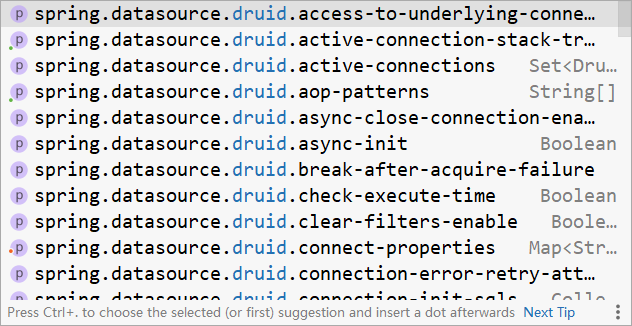
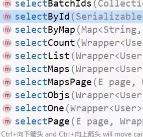
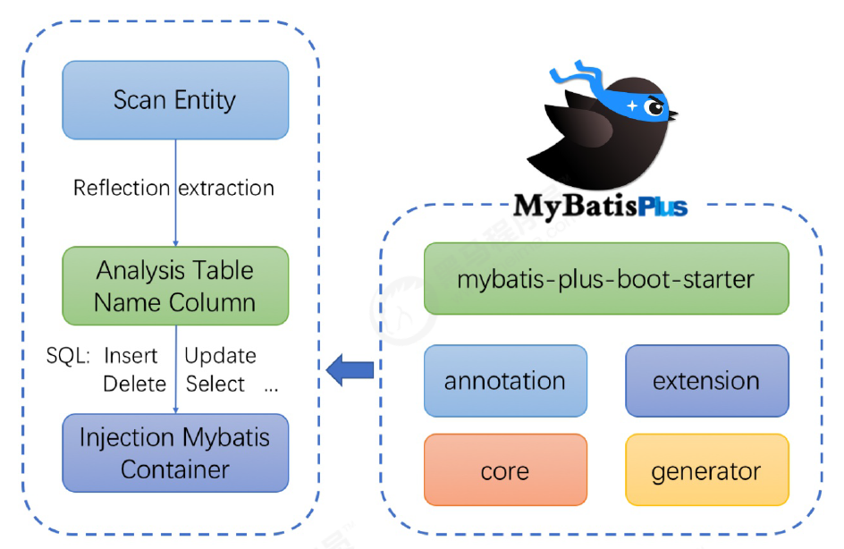
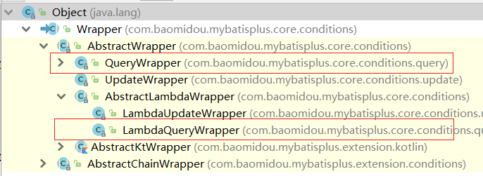
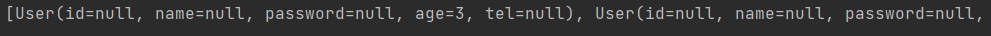
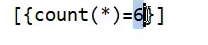

>   **导航：**
>
> [【Java笔记+踩坑汇总】Java基础+JavaWeb+SSM+SpringBoot+SpringCloud+瑞吉外卖/谷粒商城/学成在线+设计模式+面试题汇总+性能调优/架构设计+源码解析](https://blog.csdn.net/qq_40991313/article/details/126646289?csdn_share_tail={"type"%3A"blog"%2C"rType"%3A"article"%2C"rId"%3A"126646289"%2C"source"%3A"qq_40991313"})

[TOC]


# 1，MyBatisPlus简介

MyBatisPlus主要是对MyBatis的简化，所有我们先体会下它简化在哪，然后再学习它是什么，以及它帮我们都做哪些事。

- MybatisPlus(简称MP)是**基于MyBatis框架基础上开发的增强型工具**，旨在**简化开发**、提供效率。
- 开发方式
  - 基于MyBatis使用MyBatisPlus
  - 基于Spring使用MyBatisPlus
  - **基于SpringBoot使用MyBatisPlus**

SpringBoot刚刚我们学习完成，它能快速构建Spring开发环境用以整合其他技术，使用起来是非常简单，对于MP的学习，我们也**基于SpringBoot来构建学习**。


## **1.1 回顾SpringBoot整合Mybatis**

- 创建SpringBoot工程

  

  

- 勾选配置使用的技术，能够实现自动添加起步依赖包

  

  

- 设置dataSource相关属性(JDBC参数)

  

  

- 定义数据层接口映射配置

  

  


## **1.2 快速入门，实体类注解总结**

**关键步骤：导入mybatis-plus-boot-starter依赖，dao继承BaseMapper<实体类名>**


**步骤1:创建数据库及表**

> **注意：**
>
> id类型不是int，而是**bigint(20)** ，因为MybatisPlus默认使用的雪花算法**自增id很长**，例如1561681377489510402L
>
> 表明为user，是为了和实体类名统一，如果表明tb_user，实体类名User，则实体类必须加@TableName("tb_user")，或者配置文件里统一给实体类名加前缀"tb_"

```sql
create database if not exists mybatisplus_db character set utf8;
use mybatisplus_db;
CREATE TABLE user (
    id bigint(20) primary key auto_increment,
    name varchar(32) not null,
    password  varchar(32) not null,
    age int(3) not null ,
    tel varchar(32) not null
);
insert into user values(1,'Tom','tom',3,'18866668888');
insert into user values(2,'Jerry','jerry',4,'16688886666');
insert into user values(3,'Jock','123456',41,'18812345678');
insert into user values(4,'传智播客','itcast',15,'4006184000');
```


**步骤2:创建SpringBoot工程** 


> 也可以创建Maven工程， 手动导入相关依赖

**步骤3:勾选配置使用技术，只使用mysql**，不用添加Mybatis，因为后面导入MybatisPlus依赖，会根据依赖传递自动导入Mybatis、Mybatis整合spring的依赖。


> **说明:**
>
> - 由于MP并未被收录到idea的系统内置配置，无法直接选择加入，需要手动在pom.xml中配置添加

**步骤4:pom.xml添加MybatisPlus和druid依赖**

```XML
<dependency>
    <groupId>com.baomidou</groupId>
    <artifactId>mybatis-plus-boot-starter</artifactId>
    <version>3.4.1</version>
</dependency>
<dependency>
    <groupId>com.alibaba</groupId>
    <artifactId>druid</artifactId>
    <version>1.1.16</version>
</dependency>
```


> **说明:**
>
> - druid数据源可以加也可以不加，SpringBoot有内置的数据源，可以配置成使用Druid数据源
>
> - 从MP的依赖关系可以看出，通过依赖传递已经**将MyBatis与MyBatis整合Spring的jar包导入，我们不需要额外在添加MyBatis的相关jar包**
>
>   
>
>   

**步骤5:添加MP的相关配置信息**

resources默认生成的是properties配置文件，可以将其**替换成yml文件**，并在文件中配置**数据库连接的相关信息**:`application.yml`

```bash
spring:
  datasource:
    type: com.alibaba.druid.pool.DruidDataSource
    driver-class-name: com.mysql.cj.jdbc.Driver
    #serverTimezone是用来设置时区，UTC是标准时区，和咱们的时间差8小时，所以可以将其修改为Asia/Shanghai
    url: jdbc:mysql://localhost:3306/mybatisplus_db?serverTimezone=UTC 
    username: root
    password: root
```


> **注意：**
>
> **如果需要导入druid专有属性，就必须换依赖和配置方法了：**
>
> pom.xml
>
> 导入了druid-spring-boot-starter依赖，就**不用再导入druid依赖了**，它里面包含了druid依赖
>
> ```XML
>     <dependency>
>         <groupId>com.alibaba</groupId>
>         <artifactId>druid-spring-boot-starter</artifactId>
>         <version>1.2.6</version>
>     </dependency>
> ```
>
> 
>
> **application.yml**
>
> ```bash
> spring:
>   datasource:
>     druid:
>       driver-class-name: com.mysql.cj.jdbc.Driver
>       url: jdbc:mysql://localhost:3306/ssm_db?serverTimezone=UTC
>       username: root
>       password: root
> ```
>
> 
>
> 
>
> 与druid相关的配置超过200条以上，这就告诉你，如果想做druid相关的配置，使用这种格式就可以了。  

**步骤6:根据数据库表创建实体类**

```java
public class User {   
    private Long id;    //注意id类型是Long
    private String name;
    private String password;
    private Integer age;
    private String tel;
    //setter...getter...toString方法略，别忘了自己生成
}
```


> **剧透一下mp在实体类的注解：**
>
> ```java
> //注解了lombok的@Data会自动生成getter,setter,toString方法
> @Data
> //一般数据库表名tbl_user，这里注解@TableName("tbl_user")，就可以对应上表名，毕竟mp的语句里没有指定表名，都是在数据库中搜索和首字母小的的实体类名对应的表的。
> @TableName("user")
> public class User {
>     //设置主键自增策略为auto，mp默认自增策略是ASSIGN_ID，分布式、雪花算法。自增策略也可以在yml中全局配置。
>     @TableId(type = IdType.AUTO)
>     private Long id;
>     private String name;
>     //value属性起别名，select设置该字段是否参与查询，针对于一些密码等隐私数据不希望被查出来
>     @TableField(value = "password",select = false)
>     private String password;
>     private Integer age;
> 
>     private String tel;
>     //exist属性设置是否在数据库中存在该字段
>     @TableField(exist = false)
>     private String online;
>     //乐观锁注解版本，需要搭配乐观拦截器
>     @Version
>     private Integer version;
>     //逻辑删除，本质是更新，数据库内该字段默认是0，通过标记为1来判定删除。
>     @TableLogic
>     private Integer delete;
> }
> ```
>
> 

**步骤7:创建Dao接口，继承 基础mapper：BaseMapper<User>**

```java
@Mapper
public interface UserDao extends BaseMapper<User>{
}
```


继承之后dao类多出了很多方法：




**步骤8:编写引导类**

```java
@SpringBootApplication
//@MapperScan("com.itheima.dao")
public class Mybatisplus01QuickstartApplication {
    public static void main(String[] args) {
        SpringApplication.run(Mybatisplus01QuickstartApplication.class, args);
    }

}
```


> **说明:Dao接口要想被容器扫描到**，有两种解决方案:
>
> - **方案一:**在Dao接口上添加**`@Mapper`注解**，并且确保Dao处在引导类所在包或其子包中
>   - 该方案的缺点是需要在**每一Dao接口中添加注解**
> - **方案二:**在**引导类**上添加**`@MapperScan`**注解，其属性为所要扫描的Dao所在包
>   - 该方案的好处是**只需要写一次**，则指定包下的所有Dao接口都能被扫描到，`@Mapper`就可以不写。

**步骤9:编写测试类**

```java
@SpringBootTest
class MpDemoApplicationTests {

	@Autowired
	private UserDao userDao;
	@Test
	public void testGetAll() {
		List<User> userList = userDao.selectList(null);
		System.out.println(userList);
	}
}
```


> **说明:**
>
> userDao注入的时候下面有红线提示的原因是什么?
>
> - UserDao是一个接口，不能实例化对象
> - 只有在服务器启动IOC容器初始化后，由框架创建DAO接口的代理对象来注入
> - 现在服务器并未启动，所以代理对象也未创建，IDEA查找不到对应的对象注入，所以提示报红
> - 一旦服务启动，就能注入其代理对象，所以该错误提示不影响正常运行。

**查看运行结果:**


跟之前整合MyBatis相比，你会发现**我们不需要在DAO接口中编写方法和SQL语句了，只需要继承`BaseMapper`接口即可。**整体来说简化很多。

## 1.3 MybatisPlus特性

MyBatisPlus（简称MP）是基于MyBatis框架基础上开发的增强型工具，旨在**简化开发、提高效率**

通过刚才的案例，相信大家能够体会**简化开发和提高效率**这两个方面的优点。

**MyBatisPlus的官网为:**

```
https://mp.baomidou.com/
```


官方文档中有一张很多小伙伴比较熟悉的图片:


从这张图中我们可以看出MP旨在成为MyBatis的最好搭档，而不是替换MyBatis,所以可以理解为MP是MyBatis的一套增强工具，它是在MyBatis的基础上进行开发的，我们虽然使用MP但是底层依然是MyBatis的东西，也就是说我们也可以在MP中写MyBatis的内容。

对于MP的学习，大家可以参考着官方文档来进行学习，里面都有详细的代码案例。

**MP的特性:**

- **无侵入：只做增强不做改变**，不会对现有工程产生影响
- **强大的 CRUD 操作：**内置通用 Mapper，少量配置即可实现单表CRUD 操作
- 支持 Lambda：编写查询条件无需担心字段写错
- **支持主键五种自动生成策略**
- **内置分页插件、代码生成器、全局拦截插件、sql注入剥离器**（支持sql注入剥离，防止SQL注入攻击）
- ……

**架构：**



mybatis-plus-boot-starter是核心依赖，需要导入，是对springboot的整合。 

# 2，标准数据层开发

在这一节中我们重点学习的是数据层标准的CRUD(增删改查)的实现与分页功能。代码比较多，我们一个个来学习。

## 2.1 标准CRUD使用

对于标准的CRUD功能都有哪些以及MP都提供了哪些方法可以使用呢?

我们先来看张图:


对于这张图的方法，我们挨个来演示下:

首先说下，案例中的环境就是咱们入门案例的内容，第一个先来完成`新增`功能

## 2.2 新增

> 首先确保在上面1.2快速入门那里导入了mybatis-plus-boot-starter依赖，配置了yml数据源，dao接口继承了**BaseMapper<User>**。 

在进行新增之前，我们可以分析下新增的方法:

```java
int insert (T t)
```


- T:泛型，新增用来保存新增数据
- int:返回值，新增成功后返回1，没有新增成功返回的是0

在测试类中进行新增操作:

```java
@SpringBootTest
class Mybatisplus01QuickstartApplicationTests {

    @Autowired
    private UserDao userDao;

    @Test
    void testSave() {
        User user = new User();
        user.setName("黑马程序员");
        user.setPassword("itheima");
        user.setAge(12);
        user.setTel("4006184000");
        userDao.insert(user);
    }
}
```


执行测试后，数据库表中就会添加一条数据。


**修改id主键自增策略：** 

这里**主键ID是雪花算法ASSIGN_ID策略生成的，想改成自增在实体类id上注解**

```java
@TableId(type = IdType.AUTO)
```


**或者配置类yml全局配置id策略ASSIGN_ID：**

```bash
mybatis-plus:
  global-config:
    db-config:
    	id-type: assign_id
```


> AUTO策略：数据库默认自增策略
>  NONE: 不设置id生成策略
>  INPUT:用户手工输入id，如果id为null会报错
>  ASSIGN_ID:雪花算法生成id(可兼容数值型与字符串型)，mp默认id策略
>  ASSIGN_UUID:以UUID生成算法作为id生成策略
>  其他的几个策略均已过时，都将被ASSIGN_ID和ASSIGN_UUID代替掉。

## 2.3 删除

在进行删除之前，我们可以分析下删除的方法:

```java
// 根据 ID 删除
int deleteById(Serializable id);
// 根据多个ID 批量删除
int deleteBatchIds(@Param(Constants.COLLECTION) Collection<? extends Serializable> idList);
// 根据 columnMap 批量删除
int deleteByMap(@Param(Constants.COLUMN_MAP) Map<String, Object> columnMap);

//不常用
// 根据 entity 条件，删除记录
//int delete(@Param(Constants.WRAPPER) Wrapper<T> wrapper);
```


- **Serializable：**参数类型

  - **思考:**参数类型为什么是一个序列化类?

    

    

    从这张图可以看出，

    - **String和Number是Serializable的子类，**
    - Number又是Float,Double,Integer等类的父类，
    - **能作为主键的数据类型都已经是Serializable的子类**，
    - MP使用**Serializable**作为参数类型，就**类似java中Object接收任何数据类型**一样。

- **int:**返回值类型，数据删除成功返回1，未删除数据返回0。

**根据id删除:**

```java
 @SpringBootTest
class Mybatisplus01QuickstartApplicationTests {

    @Autowired
    private UserDao userDao;

    @Test
    void testDelete() {
        //Long类型后面都有L字母，不加会溢出、报错，即使值为1也要加，即1L
        userDao.deleteById(1401856123725713409L);
    }
}
```


 **根据map删除：**

```java
Map<String, Object> columnMap = new HashMap<>();
columnMap.put("age",20);
columnMap.put("name","张三");
//将columnMap中的元素设置为删除的条件，多个之间为and关系
int result = userDao.deleteByMap(columnMap);
System.out.println("result = " + result);
```


## 2.4 修改

mybatisplus的修改很细节， 传进只set了几属性User对象，对于id的几个属性就会更改，其他属性不用判断空字符串和null，直接不修改。

**根据id修改:**

```java
// 根据 ID 选择修改
boolean updateById(T t);
// 根据ID 批量更新
boolean updateBatchById(Collection<T> entityList);
// 根据 whereWrapper 条件，更新记录
boolean update(T updateEntity, Wrapper<T> whereWrapper);
```


- **T:**泛型，**需要修改的数据内容**，注意因为是根据ID进行修改，所以传入的对象中需要有ID属性值
- **int:**返回值，修改成功后返回1，未修改数据返回0

在测试类中进行新增操作:

```java
@SpringBootTest
class Mybatisplus01QuickstartApplicationTests {

    @Autowired
    private UserDao userDao;

    @Test
    void testUpdate() {
        User user = new User();
        user.setId(1L);
        user.setName("Tom888");
        user.setPassword("tom888");
        userDao.updateById(user);
    }
}
```


**说明:**修改的时候，只修改实体对象中有值的字段。

**根据条件更改：**

```java
User user = new User();
user.setAge(22); //更新的字段
//更新的条件
QueryWrapper<User> wrapper = new QueryWrapper<>();
wrapper.eq("id", 6);
//执行更新操作
int result = this.userMapper.update(user, wrapper);
System.out.println("result = " + result);
```


## 2.5 根据ID查询

在进行根据ID查询之前，我们可以分析下根据ID查询的方法:

```java
// 根据 ID 查询
T getById(Serializable id);
// 根据 Wrapper，查询一条记录。结果集，如果是多个会抛出异常，随机取一条加上限制条件 wrapper.last("LIMIT 1")
T getOne(Wrapper<T> queryWrapper);
// 根据 Wrapper，查询一条记录
T getOne(Wrapper<T> queryWrapper, boolean throwEx);
// 根据 Wrapper，查询一条记录
Map<String, Object> getMap(Wrapper<T> queryWrapper);
```


- **Serializable：**参数类型,主键ID的值
- **T:**根据ID查询只会返回一条数据

**查询操作:**

```java
@SpringBootTest
class Mybatisplus01QuickstartApplicationTests {

    @Autowired
    private UserDao userDao;
    
    @Test
    void testGetById() {
        User user = userDao.selectById(2L);
        System.out.println(user);
    }
}
```


## 2.6 查询所有

在进行查询所有之前，我们可以分析下查询所有的方法:

```java
List<T> selectList(Wrapper<T> queryWrapper)
```


- **Wrapper：**用来构建条件查询的条件，目前我们没有可直接传为Null
- **List:**因为查询的是所有，所以返回的数据是一个集合

在测试类中进行新增操作:

```java
@SpringBootTest
class Mybatisplus01QuickstartApplicationTests {

    @Autowired
    private UserDao userDao;
    
    @Test
    void testGetAll() {
        List<User> userList = userDao.selectList(null);
        System.out.println(userList);
    }
}
```


我们所调用的方法都是来自于DAO接口继承的BaseMapper类中。里面的方法有很多，我们后面会慢慢去学习里面的内容。

## 2.7 Lombok简化实体类开发


**概念**

- Lombok，一个Java类库，提供了一组注解，简化POJO实体类开发。

**使用步骤**


**步骤1:添加lombok依赖**

```XML
<dependency>
    <groupId>org.projectlombok</groupId>
    <artifactId>lombok</artifactId>
    <!--<version>1.18.12</version>-->
</dependency>
```


> **注意：**版本可以不用写，因为**SpringBoot中已经管理了lombok的版本**。

**步骤2:旧版本IDEA要安装Lombok的插件**

**新版本IDEA已经内置了该插件，如果删除setter和getter方法程序有报红，则需要安装插件**


如果在IDEA中找不到lombok插件，可以访问如下网站

```XML
https://plugins.jetbrains.com/plugin/6317-lombok/versions
```


根据自己IDEA的版本下载对应的lombok插件，下载成功后，在IDEA中采用离线安装的方式进行安装。


**步骤3:模型类上添加注解**

Lombok常见的注解有:

- @Setter:为模型类的属性提供setter方法
- @Getter:为模型类的属性提供getter方法
- @ToString:为模型类的属性提供toString方法
- @EqualsAndHashCode:为模型类的属性提供equals和hashcode方法
- **@Data:是个组合注解，包含**Setter、Getter、ToString、EqualsAndHashCode
- **@NoArgsConstructor:提供一个无参构造函数**
- **@AllArgsConstructor:提供一个包含所有参数的构造函数**

Lombok的注解还有很多，上面标红的三个是比较常用的，其他的大家后期用到了，再去补充学习。

```java
@Data
@AllArgsConstructor
@NoArgsConstructor
public class User {
    private Long id;
    private String name;
    private String password;
    private Integer age;
    private String tel;
}
```


**说明:**

Lombok只是简化模型类的编写，我们之前的方法也能用，比如有人会问:我如果只想要有name和password的构造函数，该如何编写?

```java
@Data
@AllArgsConstructor
@NoArgsConstructor
public class User {
    private Long id;
    private String name;
    private String password;
    private Integer age;
    private String tel;

    public User(String name, String password) {
        this.name = name;
        this.password = password;
    }
}
```


这种方式是被允许的。

## 2.8 分页功能

基础的增删改查就已经学习完了，刚才我们在分析基础开发的时候，有一个分页功能还没有实现，在MP中如何实现分页功能，就是咱们接下来要学习的内容。

**分页查询使用的方法是:**

```java
IPage<T> selectPage(IPage<T> page, Wrapper<T> queryWrapper)
```


- **IPage<T>:**用来**构建分页查询条件**
- **Wrapper：**译为包装器，封装器。用来构建**条件查询的条件**，目前我们没有可直接传为Null

IPage是一个接口，我们需要找到它的实现类来构建它，具体的实现类，可以进入到IPage类中按ctrl+h,会找到其有一个实现类为`Page`。

**步骤1:调用方法传入参数获取返回值**

```java
@SpringBootTest
class Mybatisplus01QuickstartApplicationTests {

    @Autowired
    private UserDao userDao;
    
    //分页查询
    @Test
    void testSelectPage(){
        //1 创建IPage分页对象,设置分页参数,1为当前页码，3为每页显示的记录数
        IPage<User> page=new Page<>(1,3);
        //2 执行分页查询
        userDao.selectPage(page,null);
        //3 获取分页结果，不配置拦截器就只能获取到current和size的数据，pages,total都是0，records是全部数据
        System.out.println("当前页码值："+page.getCurrent());
        System.out.println("每页显示数："+page.getSize());
        System.out.println("一共多少页："+page.getPages());
        System.out.println("一共多少条数据："+page.getTotal());
        System.out.println("数据："+page.getRecords());
    }
}
```


> **也可以这样，参数多时更简单快速。categoryId为0时查询所有：**
>
> ```java
>     @Override
>     public PageUtils queryPage(Map<String, Object> params, Long categoryId) {
>         String key = (String) params.get("key");
>         LambdaQueryWrapper<AttrGroupEntity> wrapper = new LambdaQueryWrapper<>();
>         //先根据检索查
>         if(StringUtils.isNotEmpty(key)){
> //wrapper.eq(AttrGroupEntity::getAttrGroupId,key).or().like(AttrGroupEntity::getAttrGroupName,key);//也可以
>             wrapper.and(
>                     obj->obj.eq(AttrGroupEntity::getAttrGroupId,key).or().like(AttrGroupEntity::getAttrGroupName,key)
>             );
>         }
>         if(categoryId!=0) {
>             wrapper.eq(AttrGroupEntity::getCatelogId,categoryId);
>         }
>         IPage<AttrGroupEntity> page = this.page(
>                 new Query<AttrGroupEntity>().getPage(params),
>                 wrapper
>         );
>  
>         return new PageUtils(page);
>  
>     }
> ```
>
> 

**步骤2:在config包下创建分页拦截器类**

**分页拦截器类代码是通用的，可以直接复制粘贴。**

配置拦截器MP，并将其配置成Spring管理的bean对象即可。需要用到MybatisPlusInterceptor 对象的addInnerInterceptor方法。

```java
//注解为配置类@Configuration，也可以在引导类@Import({MybatisPlusConfig.class})
@Configuration
public class MybatisPlusConfig {
    //被Spring容器管理    
    @Bean
    public MybatisPlusInterceptor mybatisPlusInterceptor(){
        //1 创建mp拦截器对象MybatisPlusInterceptor
        MybatisPlusInterceptor mpInterceptor=new MybatisPlusInterceptor();
        //2 添加内置拦截器，参数为分页内置拦截器对象PaginationInnerInterceptor
        mpInterceptor.addInnerInterceptor(new PaginationInnerInterceptor());
        return mpInterceptor;
    }
}
```


> **说明:**上面的代码记不住咋办呢?
>
> 这些内容在MP的官方文档中有详细的说明，我们可以查看官方文档类配置
>
> 
>
> 

**步骤3:运行测试程序**


**查看MybatisPlus标准日志：** 

如果想查看MP执行的SQL语句，可以修改application.yml配置文件，

```bash
mybatis-plus:
  configuration:
    log-impl: org.apache.ibatis.logging.stdout.StdOutImpl #打印SQL日志到控制台
```


打开日志后，就可以在控制台打印出对应的SQL语句，**开启日志功能性能就会受到影响，调试完后记得关闭。**


## 2.9 业务层继承IService、ServiceImpl

```java
public interface EmployeeService extends IService<Employee> {
}
 
 
 
@Service
public class EmployeeServiceImpl extends ServiceImpl<EmployeeDao, Employee> implements EmployeeService {
}
```


> **这里业务接口继承了IService<T>，业务实现类继承了ServiceImpl<M extends BaseMapper<T>, T>。**
>
> **这样service就继承了Mybatis-plus的各业务层方法、变量。**
>
> ServiceImpl<M extends BaseMapper<T>, T>类各方法（未过期）的作用
>
> getBaseMapper()
>  getEntityClass()
>  saveBatch()
>  saveOrUpdate()
>  saveOrUpdateBatch()
>  updateBatchById()
>  getOne()
>  getMap()
>  getObj()
>
> 
>  ServiceImpl类各属性的作用
>
> log：打印日志
>  baseMapper：实现了许多的SQL操作
>  entityClass：实体类
>  mapperClass：映射类


# 3，DQL编程控制

增删改查四个操作中，**查询是非常重要的也是非常复杂的操作**，这块需要我们重点学习下.

## 3.1 条件查询

### 3.1.1 条件查询的Wrapper包装器类

- MyBatisPlus将书写复杂的SQL查询条件进行了封装，使用编程的形式完成查询条件的组合。

这个我们在前面都有见过，比如**查询所有和分页查询的时候**，都有看到过一个**`Wrapper`类**，这个类就是用来**构建查询条件**的，如下图所示:


**包装器Wrapper<T>是接口**，实际开发中主要使用它的两个实现类：**QueryWrapper和LambdaQueryWrapper**



 两种方式各有优劣：

**QueryWrapper存在属性名写错的危险，但是支持聚合、分组查询；**

**LambdaQueryWrapper没有属性名写错的危险，但不支持聚合、分组查询；**


### 3.1.1.5 基本比较操作


**eq：等于 =**

**alleq：全部\**[eq](https://www.baomidou.com/pages/10c804/#eq)\**(或个别\**[isNull](https://www.baomidou.com/pages/10c804/#isnull)\**)**

例子：`allEq({id:1,name:"老王",age:null})`--->`id = 1 and name = '老王' and age is null` 

**ne：不等于 <>**

**gt：大于 >**

**ge：大于等于 >=**

**lt：小于 <**

**le：小于等于 <=**

**between：BETWEEN 值1 AND 值2**

**notBetween：NOT BETWEEN 值1 AND 值2**

**in：字段 IN (value.get(0), value.get(1), ...)** 

**notIn：字段 NOT IN (v0, v1, ...)**


### 3.1.2 环境准备

在构建条件查询之前，我们先来准备下环境

- 创建一个SpringBoot项目，只用选择mysql

- pom.xml中添加对应的依赖mybatis-plus-boot-starter,druid,lombok

  ```XML
  <?xml version="1.0" encoding="UTF-8"?>
  <project xmlns="http://maven.apache.org/POM/4.0.0" xmlns:xsi="http://www.w3.org/2001/XMLSchema-instance"
           xsi:schemaLocation="http://maven.apache.org/POM/4.0.0 https://maven.apache.org/xsd/maven-4.0.0.xsd">
      <modelVersion>4.0.0</modelVersion>
      <parent>
          <groupId>org.springframework.boot</groupId>
          <artifactId>spring-boot-starter-parent</artifactId>
          <version>2.5.0</version>
      </parent>
      <groupId>com.itheima</groupId>
      <artifactId>mybatisplus_02_dql</artifactId>
      <version>0.0.1-SNAPSHOT</version>
      <properties>
          <java.version>1.8</java.version>
      </properties>
      <dependencies>
  
          <dependency>
              <groupId>com.baomidou</groupId>
              <artifactId>mybatis-plus-boot-starter</artifactId>
              <version>3.4.1</version>
          </dependency>
  
          <dependency>
              <groupId>org.springframework.boot</groupId>
              <artifactId>spring-boot-starter</artifactId>
          </dependency>
  
          <dependency>
              <groupId>com.alibaba</groupId>
              <artifactId>druid</artifactId>
              <version>1.1.16</version>
          </dependency>
  
          <dependency>
              <groupId>mysql</groupId>
              <artifactId>mysql-connector-java</artifactId>
              <scope>runtime</scope>
          </dependency>
  
          <dependency>
              <groupId>org.springframework.boot</groupId>
              <artifactId>spring-boot-starter-test</artifactId>
              <scope>test</scope>
          </dependency>
  
          <dependency>
              <groupId>org.projectlombok</groupId>
              <artifactId>lombok</artifactId>
          </dependency>
  
      </dependencies>
  
      <build>
          <plugins>
              <plugin>
                  <groupId>org.springframework.boot</groupId>
                  <artifactId>spring-boot-maven-plugin</artifactId>
              </plugin>
          </plugins>
      </build>
  
  </project>
  ```

  

- **编写UserDao接口**

  ```java
  @Mapper
  public interface UserDao extends BaseMapper<User> {
  }
  ```

  

- 编写模型类

  ```java
  @Data
  public class User {
      private Long id;
      private String name;
      private String password;
      private Integer age;
      private String tel;
  }
  ```

  

- 编写引导类

  ```java
  @SpringBootApplication
  public class Mybatisplus02DqlApplication {
  
      public static void main(String[] args) {
          SpringApplication.run(Mybatisplus02DqlApplication.class, args);
      }
  
  }
  ```

  

- **编写配置文件**

  ```bash
  #dataSource
  spring:
    datasource:
      type: com.alibaba.druid.pool.DruidDataSource
      driver-class-name: com.mysql.cj.jdbc.Driver
      url: jdbc:mysql://localhost:3306/mybatisplus_db?serverTimezone=UTC
      username: root
      password: root
  #mp日志
  mybatis-plus:
    configuration:
      log-impl: org.apache.ibatis.logging.stdout.StdOutImpl
  ```

  

- 编写测试类

  ```java
  @SpringBootTest
  class Mybatisplus02DqlApplicationTests {
  
      @Autowired
      private UserDao userDao;
      
      @Test
      void testGetAll(){
          List<User> userList = userDao.selectList(null);
          System.out.println(userList);
      }
  }
  ```

  

  最终创建的项目结构为:

  

  

### 3.1.2.5 排除控制台日志打印、banner、log

- **配置取消初始化spring日志打印:**

  - 取消初始化spring日志打印，resources目录下添加logback.xml，名称固定，内容如下:

    ```XML
    <?xml version="1.0" encoding="UTF-8"?>
    <configuration>
    </configuration>
    ```

    

    **说明:**logback.xml的配置内容，不是我们学习的重点，如果有兴趣可以自行百度查询。

  - **取消MybatisPlus启动banner图标，并开启StdOutImpl日志**

    

    

    application.yml添加如下内容:

    ```bash
    #mybatis-plus日志控制台输出
    mybatis-plus:
      configuration:
        log-impl: org.apache.ibatis.logging.stdout.StdOutImpl
      global-config:
        banner: off  关闭mybatisplus启动图标
    ```

    

  - **取消SpringBoot的log打印**

    

    

    application.yml添加如下内容:

    ```bash
    spring:
      main:
        banner-mode: off  #关闭SpringBoot启动图标(banner)
    ```

    

解决控制台打印日志过多的相关操作可以不用去做，一般会被用来方便我们查看程序运行的结果。

### 3.1.3 构建条件查询

在进行查询的时候，我们的**入口是在包装器Wrapper这个接口**上，因为它是一个接口，所以我们需要去找它对应的**实现类**，关于实现类也有很多，主要用**QueryWrapper和LambdaQueryWrapper（主要用这个类）：**


- **方法一（不建议）：查询包装器QueryWrapper**

```java
@SpringBootTest
class Mybatisplus02DqlApplicationTests {

    @Autowired
    private UserDao userDao;
    
    @Test
    void testGetAll(){
        //创建QueryWrapper对象
        QueryWrapper qw = new QueryWrapper();
        //lt代表小于，大于是gt
        qw.lt("age",18);
        List<User> userList = userDao.selectList(qw);
        System.out.println(userList);
    }
}
```


- **lt:** 小于(<) ,最终的sql语句为

  ```sql
  SELECT id,name,password,age,tel FROM user WHERE (age < ?)
  ```

  

第一种方式介绍完后，有个小问题就是在写条件的时候，容易出错，比如age写错，就会导致查询不成功

- **方法二（不建议）：****QueryWrapper的基础上使用lambda**

这种方法可以**防止数据库属性名写错**。 

```java
@SpringBootTest
class Mybatisplus02DqlApplicationTests {

    @Autowired
    private UserDao userDao;
    
    @Test
    void testGetAll(){
        //使用Lambda，QueryWrapper<User>必须加泛型
        QueryWrapper<User> qw = new QueryWrapper<User>();
        qw.lambda().lt(User::getAge, 10);//添加条件，使用Lambda不容易写错属性名
        List<User> userList = userDao.selectList(qw);
        System.out.println(userList);
    }
}
```


- User::getAget,为lambda表达式中的，类名::方法名，最终的sql语句为:

```java
SELECT id,name,password,age,tel FROM user WHERE (age < ?)
```


**注意:**构建LambdaQueryWrapper的时候泛型不能省。

此时我们再次编写条件的时候，就不会存在写错名称的情况，但是qw后面多了一层lambda()调用

- **方法三（推荐）：****LambdaQueryWrapper**

```java
@SpringBootTest
class Mybatisplus02DqlApplicationTests {

    @Autowired
    private UserDao userDao;
    
    @Test
    void testGetAll(){
        LambdaQueryWrapper<User> lqw = new LambdaQueryWrapper<User>();
        lqw.lt(User::getAge, 10);
        List<User> userList = userDao.selectList(lqw);
        System.out.println(userList);
    }
}
```


这种方式就解决了上一种方式所存在的问题。

### 3.1.4 多条件构建，链式编程

学完了三种构建查询对象的方式，每一种都有自己的特点，所以用哪一种都行，刚才都是一个条件，那如果有多个条件该如何构建呢?

> **需求:**查询数据库表中，年龄在10岁到30岁之间的用户信息

```java
@SpringBootTest
class Mybatisplus02DqlApplicationTests {

    @Autowired
    private UserDao userDao;
    
    @Test
    void testGetAll(){
        LambdaQueryWrapper<User> lqw = new LambdaQueryWrapper<User>();
        lqw.lt(User::getAge, 30);
        lqw.gt(User::getAge, 10);
        List<User> userList = userDao.selectList(lqw);
        System.out.println(userList);
    }
}
```


- **gt：**大于(>),最终的SQL语句为

  ```java
  SELECT id,name,password,age,tel FROM user WHERE (age < ? AND age > ?)
  ```

  

- 构建多条件的时候，可以支持**链式编程**

  ```java
  LambdaQueryWrapper<User> lqw = new LambdaQueryWrapper<User>();
  lqw.lt(User::getAge, 30).gt(User::getAge, 10);
  List<User> userList = userDao.selectList(lqw);
  System.out.println(userList);
  ```

  

**多条件查询默认是and，or要用.or() ：**

**练习:**查询数据库表中，年龄小于10**或**年龄大于30的数据

**答案：**

```java
@SpringBootTest
class Mybatisplus02DqlApplicationTests {

    @Autowired
    private UserDao userDao;
    
    @Test
    void testGetAll(){
        LambdaQueryWrapper<User> lqw = new LambdaQueryWrapper<User>();
        lqw.lt(User::getAge, 10).or().gt(User::getAge, 30);
        List<User> userList = userDao.selectList(lqw);
        System.out.println(userList);
    }
}
```


- or()就相当于我们sql语句中的`or`关键字,**不加默认是`and`**，最终的sql语句为:

  ```java
  SELECT id,name,password,age,tel FROM user WHERE (age < ? OR age > ?)
  ```

  

### 3.1.5 条件查询null值处理

**针对问题：区间条件查询，例如某宝筛选价格范围，用户只填最高价，最低价为null不算在查询条件里。** 

**解决办法：新建实体类继承原实体类，多出属性范围，使用lqw.lt(null!=uq.getAge2(),User::getAge, uq.getAge2());进行判定。**

先来看一张图，


- 我们在做条件查询的时候，一般会有很多条件可以供用户进行选择查询。
- 这些条件用户可以选择使用也可以选择不使用，比如我要查询价格在8000以上的手机
- 在输入条件的时候，价格有一个区间范围，按照需求只需要在第一个价格输入框中输入8000
- 后台在做价格查询的时候，一般会让 price>值1 and price <值2
- 因为前端没有输入值2，所以如果不处理的话，就会出现 price>8000 and price < null问题
- 这个时候查询的结果就会出问题，具体该如何解决?


> **需求:**查询数据库表中，根据输入年龄范围来查询符合条件的记录
>
> 用户在输入值的时候，
>
> 如果只输入第一个框，说明要查询大于该年龄的用户
>
> 如果只输入第二个框，说明要查询小于该年龄的用户
>
> 如果两个框都输入了，说明要查询年龄在两个范围之间的用户

**后台如果想接收前端的两个数据，该如何接收?**

我们可以使用两个简单数据类型，也可以使用一个模型类，但是User类中目前只有一个age属性,如:

```java
@Data
public class User {
    private Long id;
    private String name;
    private String password;
    private Integer age;
    private String tel;
}
```


**使用一个age属性，如何去接收页面上的两个值呢?**这个时候我们有两个解决方案

**方案一（不建议）:添加属性age2**,这种做法可以但是会影响到原模型类的属性内容

```java
@Data
public class User {
    private Long id;
    private String name;
    private String password;
    private Integer age;
    private String tel;
    private Integer age2;
}
```


**方案二（推荐）:在domain.query下新建一个模型类,让其继承User类**，并在其中添加age2属性，UserQuery在拥有User属性后同时添加了age2属性。

```java
@Data
public class User {
    private Long id;
    private String name;
    private String password;
    private Integer age;
    private String tel;
}

@Data
public class UserQuery extends User {
    private Integer age2;
}
```


**区间条件查询代码实现：**

**方法一： （麻烦，不建议）**

```java
@SpringBootTest
class Mybatisplus02DqlApplicationTests {

    @Autowired
    private UserDao userDao;
    
    @Test
    void testGetAll(){
        //模拟页面传递过来的查询数据
        UserQuery uq = new UserQuery();
        uq.setAge(10);
        uq.setAge2(30);
        LambdaQueryWrapper<User> lqw = new LambdaQueryWrapper<User>();
        if(null != uq.getAge2()){
            lqw.lt(User::getAge, uq.getAge2());
        }
        if( null != uq.getAge()) {
            lqw.gt(User::getAge, uq.getAge());
        }
        List<User> userList = userDao.selectList(lqw);
        System.out.println(userList);
    }
}
```


上面的写法可以完成条件为非空的判断。

**存在问题：**如果条件多的话，每个条件都需要判断，代码量就比较大，所以使用方法二：

**方法二（推荐）：MP给我们提供了简化方式实现区间条件查询**：

```java
@SpringBootTest
class Mybatisplus02DqlApplicationTests {

    @Autowired
    private UserDao userDao;
    
    @Test
    void testGetAll(){
        //模拟页面传递过来的查询数据
        UserQuery uq = new UserQuery();
        uq.setAge(10);
        uq.setAge2(30);
        LambdaQueryWrapper<User> lqw = new LambdaQueryWrapper<User>();
        //第一个参数为判断条件
        lqw.lt(null!=uq.getAge2(),User::getAge, uq.getAge2());
        lqw.gt(null!=uq.getAge(),User::getAge, uq.getAge());
        List<User> userList = userDao.selectList(lqw);
        System.out.println(userList);
    }
}
```


- lt()方法

  

  

  condition为boolean类型，返回true，则添加条件，返回false则不添加条件

## 3.2 查询投影

### 3.2.1 查询指定字段

目前我们在查询数据的时候，什么都没有做默认就是查询表中所有字段的内容。

**查询投影：**不查询所有字段，**只查询出指定字段的数据**。

**查询指定字段lqw.select()**

**方法一（推荐）：使用Lambda**

```java
@SpringBootTest
class Mybatisplus02DqlApplicationTests {

    @Autowired
    private UserDao userDao;
    
    @Test
    void testGetAll(){
        LambdaQueryWrapper<User> lqw = new LambdaQueryWrapper<User>();
        lqw.select(User::getId,User::getName,User::getAge);
        List<User> userList = userDao.selectList(lqw);
        System.out.println(userList);
    }
}
```


- select(...)方法用来设置查询的字段列，可以设置多个，最终的sql语句为:

  ```java
  SELECT id,name,age FROM user
  ```

  

**方法二（不建议）：不用lambda**

```java
@SpringBootTest
class Mybatisplus02DqlApplicationTests {

    @Autowired
    private UserDao userDao;
    
    @Test
    void testGetAll(){
        QueryWrapper<User> lqw = new QueryWrapper<User>();
        lqw.select("id","name","age","tel");
        List<User> userList = userDao.selectList(lqw);
        System.out.println(userList);
    }
}
```


- 最终的sql语句为:SELECT id,name,age,tel FROM user




### 3.2.2 聚合查询

**聚合查询不能用Lambda，只能用QueryWrapper。**

**方法qw.select("count(\*) as count");和userDao.selectMaps(qw)**

> **需求:**聚合函数查询，完成count、max、min、avg、sum的使用
>
> count:总记录数
>
> max:最大值
>
> min:最小值
>
> avg:平均值
>
> sum:求和

```java
@SpringBootTest
class Mybatisplus02DqlApplicationTests {

    @Autowired
    private UserDao userDao;
    
    @Test
    void testGetAll(){
        QueryWrapper<User> lqw = new QueryWrapper<User>();
        //lqw.select("count(*) as count");
        //SELECT count(*) as count FROM user
        //lqw.select("max(age) as maxAge");
        //SELECT max(age) as maxAge FROM user
        //lqw.select("min(age) as minAge");
        //SELECT min(age) as minAge FROM user
        //lqw.select("sum(age) as sumAge");
        //SELECT sum(age) as sumAge FROM user
        lqw.select("avg(age) as avgAge");
        //SELECT avg(age) as avgAge FROM user
        List<Map<String, Object>> userList = userDao.selectMaps(lqw);
        System.out.println(userList);
    }
}
```


为了在做结果封装的时候能够更简单，我们将上面的聚合函数都**起了个名称，方面后期来获取这些数据**



键是聚合函数起的别名，值是查询的数量。

### 3.2.3 分组查询

> 需求:分组查询，完成 group by的查询使用

**分组查询一定是要配合聚合函数的：**

```java
@SpringBootTest
class Mybatisplus02DqlApplicationTests {

    @Autowired
    private UserDao userDao;
    
    @Test
    void testGetAll(){
        QueryWrapper<User> lqw = new QueryWrapper<User>();
        lqw.select("count(*) as count,tel");
        lqw.groupBy("tel");
        List<Map<String, Object>> list = userDao.selectMaps(lqw);
        System.out.println(list);
    }
}
```


- groupBy为分组，最终的sql语句为

  ```
  SELECT count(*) as count,tel FROM user GROUP BY tel
  ```

  

> **注意:**
>
> - 聚合与分组查询，无法使用lambda表达式来完成
> - MP只是对MyBatis的增强，**如果MP实现不了，我们可以直接在DAO接口中使用MyBatis的方式实现**

## 3.3 查询条件

前面我们只使用了lt()和gt(),除了这两个方法外，MP还封装了很多条件对应的方法，这一节我们重点把MP提供的查询条件方法进行学习下。

MP的查询条件有很多:

- 范围匹配（> 、 = 、between）
- 模糊匹配（like）
- 空判定（null）
- 包含性匹配（in）
- 分组（group）
- 排序（order）
- ……

### 3.3.1 等值查询

> 需求:根据用户名和密码查询用户信息

```java
@SpringBootTest
class Mybatisplus02DqlApplicationTests {

    @Autowired
    private UserDao userDao;
    
    @Test
    void testGetAll(){
        LambdaQueryWrapper<User> lqw = new LambdaQueryWrapper<User>();
        lqw.eq(User::getName, "Jerry").eq(User::getPassword, "jerry");
        User loginUser = userDao.selectOne(lqw);
        System.out.println(loginUser);
    }
}
```


- **eq()： equal的缩小，相当于 `=`**,对应的sql语句为

  ```sql
  SELECT id,name,password,age,tel FROM user WHERE (name = ? AND password = ?)
  ```

  

- **selectList：**查询结果为多个或者单个

- **selectOne:**查询结果为单个

### 3.3.2 范围查询

> 需求:对年龄进行范围查询，使用lt()、le()、gt()、ge()、between()进行范围查询

```java
@SpringBootTest
class Mybatisplus02DqlApplicationTests {

    @Autowired
    private UserDao userDao;
    
    @Test
    void testGetAll(){
        LambdaQueryWrapper<User> lqw = new LambdaQueryWrapper<User>();
        lqw.between(User::getAge, 10, 30);
        //SELECT id,name,password,age,tel FROM user WHERE (age BETWEEN ? AND ?)
        List<User> userList = userDao.selectList(lqw);
        System.out.println(userList);
    }
}
```


- gt():大于(>)
- ge():大于等于(>=)
- lt():小于(<)
- lte():小于等于(<=)
- between():between ? and ?

### 3.3.3 模糊查询

> 需求:查询表中name属性的值以`J`开头的用户信息,使用like进行模糊查询

```java
@SpringBootTest
class Mybatisplus02DqlApplicationTests {

    @Autowired
    private UserDao userDao;
    
    @Test
    void testGetAll(){
        LambdaQueryWrapper<User> lqw = new LambdaQueryWrapper<User>();
        lqw.likeLeft(User::getName, "J");
        //SELECT id,name,password,age,tel FROM user WHERE (name LIKE ?)
        List<User> userList = userDao.selectList(lqw);
        System.out.println(userList);
    }
}
```


> - **like():前后加百分号**,如 %J%
> - **likeLeft():左边加百分号**,如 %J
> - likeRight():后面加百分号,如 J%

### 3.3.4 排序查询

> **需求:**查询所有数据，然后按照id降序

```java
@SpringBootTest
class Mybatisplus02DqlApplicationTests {

    @Autowired
    private UserDao userDao;
    
    @Test
    void testGetAll(){
        LambdaQueryWrapper<User> lwq = new LambdaQueryWrapper<>();
        /**
         * condition ：条件，返回boolean，
         		当condition为true，进行排序，如果为false，则不排序
         * isAsc:是否为升序，true为升序，false为降序
         * columns：需要操作的列
         */
        lwq.orderBy(true,false, User::getId);

        userDao.selectList(lw
    }
}
```


除了上面演示的这种实现方式，还有很多其他的排序方法可以被调用，如图:


- **orderBy排序**
  - condition:条件，true则添加排序，false则不添加排序
  - isAsc:是否为升序，true升序，false降序
  - columns:排序字段，可以有多个
- **orderByAsc/Desc(单个column):**按照指定字段进行升序/降序
- **orderByAsc/Desc(多个column):**按照多个字段进行升序/降序
- **orderByAsc/Desc**
  - condition:条件，true添加排序，false不添加排序
  - 多个columns：按照多个字段进行排序

除了上面介绍的这几种查询条件构建方法以外还会有很多其他的方法，比如isNull,isNotNull,in,notIn等等方法可供选择，具体参考官方文档的条件构造器来学习使用，具体的网址为:

```
https://mp.baomidou.com/guide/wrapper.html#abstractwrapper
```

## 3.4 映射匹配兼容性，属性起别名、可见性、权限、表明和实体类名不匹配

前面我们已经能从表中查询出数据，并将数据封装到模型类中，这整个过程涉及到一张表和一个模型类:


之所以数据能够成功的从表中获取并封装到模型对象中，原因是表的字段列名和模型类的属性名一样。

那么问题就来了:

**问题1:表字段与编码属性设计不同步**

**解决：`@TableField字段注解`里的value属性起别名**

当表的列名和模型类的属性名发生不一致，就会导致数据封装不到模型对象，这个时候就需要其中一方做出修改，那如果前提是两边都不能改又该如何解决?

MP给我们提供了一个注解`@TableField`,使用该注解可以实现模型类属性名和表的列名之间的映射关系


**问题2:编码中添加了数据库中未定义的属性**

**解决：`@TableField`注解里的exist属性设置其是否在数据库存在**

当模型类中多了一个数据库表不存在的字段，就会导致生成的sql语句中在select的时候查询了数据库不存在的字段，程序运行就会报错，错误信息为:

**Unknown column '多出来的字段名称' in 'field list'**

具体的解决方案用到的还是`@TableField`注解，它有一个属性叫`exist`，设置该字段是否在数据库表中存在，如果设置为false则不存在，生成sql语句查询的时候，就不会再查询该字段了。


**问题3：采用默认查询开放了更多的字段查看权限**

**解决：`@TableField`注解里的select属性，设置属性是否参与查询**

查询表中所有的列的数据，就可能把一些敏感数据查询到返回给前端，这个时候我们就需要限制哪些字段默认不要进行查询。解决方案是`@TableField`注解的一个属性叫`select`，该属性设置默认是否需要查询该字段的值，true(默认值)表示默认查询该字段，false表示默认不查询该字段。

```java
@Data
@TableName("user")
public class User {

    private Long id;
    private String name;
    @TableField(value = "password",select = false)
    private String password;
    private Integer age;
    private String tel;
    @TableField(exist = false)
    private String online;
    

}
```


**问题4:表名与编码开发设计不同步**

该问题主要是表的名称和模型类的名称不一致，导致查询失败，因为mybatisplus的语句中没有表名，不像sql能select * form xxx，只能根据实体类名和表明匹配。这个时候通常会报如下错误信息:

**Table 'databaseName.tableNaem' doesn't exist**,翻译过来就是数据库中的表不存在。


**解决方案一：**是使用MP提供的另外一个**注解`@TableName`来设置表与模型类之间的对应关系。**


解决方法二：配置统一给实体类名加前缀：

```java
mybatis-plus:
  global-config:
    db-config:
    	table-prefix: tbl_
```


### 知识点@TableField@TableName

**知识点1: @TableField**

| 名称     | @TableField                                                  |
| -------- | ------------------------------------------------------------ |
| 类型     | **属性注解**                                                 |
| 位置     | 模型类属性定义上方                                           |
| 作用     | 设置当前属性对应的数据库表中的字段关系                       |
| 相关属性 | value(默认)：设置数据库表字段名称  		exist:设置属性在数据库表字段中是否存在，默认为true，此属性不能与value合并使用  		select:设置属性是否参与查询，此属性与select()映射配置不冲突 |


**知识点2：@TableName**

| 名称     | @TableName                    |
| -------- | ----------------------------- |
| 类型     | **类注解**                    |
| 位置     | 模型类定义上方                |
| 作用     | 设置当前类对应于数据库表关系  |
| 相关属性 | value(默认)：设置数据库表名称 |

### 报错演示和解决


**步骤1:修改数据库表user为tbl_user**

直接查询会报错，原因是MP默认情况下会使用模型类的类名首字母小写当表名使用。


**步骤2:模型类添加@TableName注解**

```java
@Data
@TableName("tbl_user")
public class User {
    private Long id;
    private String name;
    private String password;
    private Integer age;
    private String tel;
}
```


**步骤3:将字段password修改成pwd**

直接查询会报错，原因是MP默认情况下会使用模型类的属性名当做表的列名使用


**步骤4：使用@TableField映射关系**

```java
@Data
@TableName("tbl_user")
public class User {
    private Long id;
    private String name;
    @TableField(value="pwd")
    private String password;
    private Integer age;
    private String tel;
}
```


**步骤5:添加一个数据库表不存在的字段**

```java
@Data
@TableName("tbl_user")
public class User {
    private Long id;
    private String name;
    @TableField(value="pwd")
    private String password;
    private Integer age;
    private String tel;
    private Integer online;
}
```


直接查询会报错，原因是MP默认情况下会查询模型类的所有属性对应的数据库表的列，而online不存在


**步骤6：使用@TableField排除字段**

```java
@Data
@TableName("tbl_user")
public class User {
    private Long id;
    private String name;
    @TableField(value="pwd")
    private String password;
    private Integer age;
    private String tel;
    @TableField(exist=false)
    private Integer online;
}
```


**步骤7:查询时将pwd隐藏**

```java
@Data
@TableName("tbl_user")
public class User {
    private Long id;
    private String name;
    @TableField(value="pwd",select=false)
    private String password;
    private Integer age;
    private String tel;
    @TableField(exist=false)
    private Integer online;
}
```


# 4，DML编程控制


## 4.1 id生成策略控制

前面我们在新增的时候留了一个问题，就是新增成功后，**主键ID是一个很长串的内容**，我们更想要的是按照数据库表字段进行自增长。

**ID该如何选择:**

- **不同的表应用不同的id生成策略**
  - 日志：自增（1,2,3,4，……）
  - 购物订单：特殊规则（FQ23948AK3843）
  - 外卖单：关联地区日期等信息（10 04 20200314 34 91）
  - 关系表：可省略id
  - ……

不同的业务采用的ID生成方式应该是不一样的，那么在MP中都提供了哪些主键生成策略，以及我们该如何进行选择?

在这里我们又需要用到MP的一个注解叫**`@TableId`**

### 4.1.0 知识点@TableId

| 名称     | @TableId                                                     |
| -------- | ------------------------------------------------------------ |
| 类型     | **属性注解**                                                 |
| 位置     | 模型类中用于表示主键的属性定义上方                           |
| 作用     | 设置当前类中主键属性的生成策略                               |
| 相关属性 | **value(默认)：设置数据库表主键名称  		type:设置主键属性的生成策略，值查照IdType的枚举值** |

### **4.1.1 环境构建**

在构建条件查询之前，我们先来准备下环境

- 创建一个SpringBoot项目

- pom.xml中添加对应的依赖

  ```XML
  <?xml version="1.0" encoding="UTF-8"?>
  <project xmlns="http://maven.apache.org/POM/4.0.0" xmlns:xsi="http://www.w3.org/2001/XMLSchema-instance"
           xsi:schemaLocation="http://maven.apache.org/POM/4.0.0 https://maven.apache.org/xsd/maven-4.0.0.xsd">
      <modelVersion>4.0.0</modelVersion>
      <parent>
          <groupId>org.springframework.boot</groupId>
          <artifactId>spring-boot-starter-parent</artifactId>
          <version>2.5.0</version>
          <relativePath/> <!-- lookup parent from repository -->
      </parent>
      <groupId>com.itheima</groupId>
      <artifactId>mybatisplus_03_dml</artifactId>
      <version>0.0.1-SNAPSHOT</version>
      <properties>
          <java.version>1.8</java.version>
      </properties>
      <dependencies>
  
          <dependency>
              <groupId>com.baomidou</groupId>
              <artifactId>mybatis-plus-boot-starter</artifactId>
              <version>3.4.1</version>
          </dependency>
  
          <dependency>
              <groupId>org.springframework.boot</groupId>
              <artifactId>spring-boot-starter</artifactId>
          </dependency>
  
          <dependency>
              <groupId>com.alibaba</groupId>
              <artifactId>druid</artifactId>
              <version>1.1.16</version>
          </dependency>
  
          <dependency>
              <groupId>mysql</groupId>
              <artifactId>mysql-connector-java</artifactId>
              <scope>runtime</scope>
          </dependency>
  
          <dependency>
              <groupId>org.springframework.boot</groupId>
              <artifactId>spring-boot-starter-test</artifactId>
              <scope>test</scope>
          </dependency>
  
          <dependency>
              <groupId>org.projectlombok</groupId>
              <artifactId>lombok</artifactId>
              <version>1.18.12</version>
          </dependency>
  
      </dependencies>
  
      <build>
          <plugins>
              <plugin>
                  <groupId>org.springframework.boot</groupId>
                  <artifactId>spring-boot-maven-plugin</artifactId>
              </plugin>
          </plugins>
      </build>
  
  </project>
  ```

  

- 编写UserDao接口

  ```java
  @Mapper
  public interface UserDao extends BaseMapper<User> {
  }
  ```

  

- 编写模型类

  ```java
  @Data
  @TableName("tbl_user")
  public class User {
      private Long id;
      private String name;
      @TableField(value="pwd",select=false)
      private String password;
      private Integer age;
      private String tel;
      @TableField(exist=false)
      private Integer online;
  }
  ```

  

- 编写引导类

  ```java
  @SpringBootApplication
  public class Mybatisplus03DqlApplication {
  
      public static void main(String[] args) {
          SpringApplication.run(Mybatisplus03DqlApplication.class, args);
      }
  
  }
  ```

  

- 编写配置文件

  ```bash
  spring:
    datasource:
      type: com.alibaba.druid.pool.DruidDataSource
      driver-class-name: com.mysql.cj.jdbc.Driver
      url: jdbc:mysql://localhost:3306/mybatisplus_db?serverTimezone=UTC
      username: root
      password: root
   #mp日志
  mybatis-plus:
    configuration:
      log-impl: org.apache.ibatis.logging.stdout.StdOutImpl
  ```

  

- 编写测试类

  ```java
  @SpringBootTest
  class Mybatisplus02DqlApplicationTests {
  
      @Autowired
      private UserDao userDao;
      
      @Test
      void testGetAll(){
          List<User> userList = userDao.selectList(null);
          System.out.println(userList);
      }
  }
  ```

  

- 测试

  ```java
  @SpringBootTest
  class Mybatisplus03DqlApplicationTests {
  
      @Autowired
      private UserDao userDao;
  	
      @Test
      void testSave(){
          User user = new User();
          user.setName("黑马程序员");
          user.setPassword("itheima");
          user.setAge(12);
          user.setTel("4006184000");
          userDao.insert(user);
      }
      @Test
      void testDelete(){
          userDao.deleteById(1401856123925713409L)
      }
      @Test
      void testUpdate(){
          User user = new User();
          user.setId(3L);
          user.setName("Jock666");
          user.setVersion(1);
          userDao.updateById(user);
      }
  }
  ```

  

- 最终创建的项目结构为:

  

  

### 4.1.2 五种id策略代码实现

**概述：** 

- **AUTO策略：数据库默认自增策略**
- **NONE: 不设置id生成策略**
- **INPUT:用户手工输入id**，如果id为null会报错
- **ASSIGN_ID:雪花算法生成id(可兼容数值型与字符串型)**，mp默认id策略
- **ASSIGN_UUID:以UUID生成算法作为id生成策略**
- **其他的几个策略均已过时，都将被ASSIGN_ID和ASSIGN_UUID代替掉。**

> **注意：**
>
> **除了INPUT策略，其他策略即使指定id为null会自动生成，不为null会用指定的id。**
>
> **拓展:**
>
> **分布式ID是什么?**
>
> - 当数据量足够大的时候，一台数据库服务器存储不下，这个时候就需要**多台数据库服务器进行存储**
> - 比如订单表就有可能被存储在不同的服务器上
> - **如果用数据库表的自增主键，因为在两台服务器上所以会出现冲突**
> - 这个时候就需要一个**全局唯一ID,这个ID就是分布式ID。**


**代码实现：** 

**AUTO策略：数据库默认自增策略**

**步骤1:给实体类id属性，设置生成策略为AUTO**

```java
@Data
@TableName("tbl_user")
public class User {
    @TableId(type = IdType.AUTO)
    private Long id;
    private String name;
    @TableField(value="pwd",select=false)
    private String password;
    private Integer age;
    private String tel;
    @TableField(exist=false)
    private Integer online;
}
```


**步骤2:删除测试数据并修改自增值**

- 删除测试数据

  

  

- 因为之前生成主键ID的值比较长，会把MySQL的自动增长的值变的很大，所以需要将其调整为目前最新的id值。


**步骤3:运行新增方法**

会发现，新增成功，并且主键id也是从5开始


经过这三步的演示，会发现`AUTO`的作用是**使用数据库ID自增**，在使用该策略的时候一定要确保对应的数据库表设置了ID主键自增，否则无效。

接下来，我们可以进入源码查看下ID的生成策略有哪些?

打开源码后，你会发现并没有看到中文注释，这就需要我们点击右上角的`Download Sources`,会自动帮你把这个类的java文件下载下来，我们就能看到具体的注释内容。因为这个技术是国人制作的，所以他代码中的注释还是比较容易看懂的。


当把源码下载完后，就可以看到如下内容:


**INPUT策略**

**步骤1:设置生成策略为INPUT**

```java
@Data
@TableName("tbl_user")
public class User {
    @TableId(type = IdType.INPUT)
    private Long id;
    private String name;
    @TableField(value="pwd",select=false)
    private String password;
    private Integer age;
    private String tel;
    @TableField(exist=false)
    private Integer online;
}
```


> **注意:**这种ID生成策略，需要将表的自增策略删除掉
>
> 
>
> 

**步骤2:添加数据手动设置ID**

```java
@SpringBootTest
class Mybatisplus03DqlApplicationTests {

    @Autowired
    private UserDao userDao;
	
    @Test
    void testSave(){
        User user = new User();
        //设置主键ID的值
        user.setId(666L);
        user.setName("黑马程序员");
        user.setPassword("itheima");
        user.setAge(12);
        user.setTel("4006184000");
        userDao.insert(user);
    }
}
```


**步骤3:运行新增方法**

如果没有设置主键ID的值，则会报错，错误提示就是主键ID没有给值:


如果设置了主键ID,则数据添加成功，如下:


**ASSIGN_ID策略**

**步骤1:设置生成策略为ASSIGN_ID**

```java
@Data
@TableName("tbl_user")
public class User {
    @TableId(type = IdType.ASSIGN_ID)
    private Long id;
    private String name;
    @TableField(value="pwd",select=false)
    private String password;
    private Integer age;
    private String tel;
    @TableField(exist=false)
    private Integer online;
}
```


**步骤2:添加数据不设置ID**

```java
@SpringBootTest
class Mybatisplus03DqlApplicationTests {

    @Autowired
    private UserDao userDao;
	
    @Test
    void testSave(){
        User user = new User();
        user.setName("黑马程序员");
        user.setPassword("itheima");
        user.setAge(12);
        user.setTel("4006184000");
        userDao.insert(user);
    }
}
```


> **注意:**这种生成策略，不需要手动设置ID，如果手动设置ID，则会使用自己设置的值。

**步骤3:运行新增方法**


生成的ID就是一个Long类型的数据。


**ASSIGN_UUID策略**

**步骤1:设置生成策略为ASSIGN_UUID**

使用uuid需要注意的是，主键的类型不能是Long，而应该改成String类型

```java
@Data
@TableName("tbl_user")
public class User {
    @TableId(type = IdType.ASSIGN_UUID)
    private String id;
    private String name;
    @TableField(value="pwd",select=false)
    private String password;
    private Integer age;
    private String tel;
    @TableField(exist=false)
    private Integer online;
}
```


**步骤2:修改表的主键类型**


主键类型设置为varchar，长度要大于32，因为UUID生成的主键为32位，如果长度小的话就会导致插入失败。

**步骤3:添加数据不设置ID**

```java
@SpringBootTest
class Mybatisplus03DqlApplicationTests {

    @Autowired
    private UserDao userDao;
	
    @Test
    void testSave(){
        User user = new User();
        user.setName("黑马程序员");
        user.setPassword("itheima");
        user.setAge(12);
        user.setTel("4006184000");
        userDao.insert(user);
    }
}
```


**步骤4:运行新增方法**


接下来我们来聊一聊雪花算法:

雪花算法(SnowFlake),是Twitter官方给出的算法实现 是用Scala写的。其生成的结果是一个64bit大小整数，它的结构如下图:


- 1bit,不用,因为二进制中最高位是符号位，1表示负数，**0表示正数**。生成的id一般都是用整数，所以**最高位固定为0**。
- 41bit-**时间戳**，用来记录时间戳，毫秒级
- 10bit-**工作机器id**，用来记录工作机器id,其中高位5bit是数据中心ID其取值范围0-31，低位5bit是工作节点ID其取值范围0-31，两个组合起来最多可以容纳1024个节点
- **序列号**占用12bit，每个节点每毫秒0开始不断累加，最多可以累加到4095，一共可以产生4096个ID

### 4.1.3 ID生成策略对比

介绍了这些主键ID的生成策略，我们以后该用哪个呢?

- **NONE: 不设置id生成策略**，MP不自动生成，**约等于INPUT**,所以这两种方式都**需要用户手动设置**，但是手动设置第一个问题是容易出现相同的ID造成主键冲突，为了保证主键不冲突就需要做很多判定，实现起来比较复杂
- **AUTO:**数据库ID自增,这种策略适合在数据库服务器只有1台的情况下使用,不可作为分布式ID使用
- **ASSIGN_UUID:**可以在**分布式的情况下使用**，而且能够**保证唯一**，但是生成的主键是**32位的字符串，长度过长占用空间而且还不能排序，查询性能也慢**
- **ASSIGN_ID:**可以在**分布式**的情况下使用，生成的是**Long类型的数字**，可以**排序性能也高**，但是**生成的策略和服务器时间有关，如果修改了系统时间就有可能导致出现重复主键**
- 综上所述，每一种主键策略都有自己的优缺点，根据自己项目业务的实际情况来选择使用才是最明智的选择。

### 4.1.4 配置方法设置id策略和实体类前缀tbl_

**模型类主键策略设置**

对于主键ID的策略已经介绍完，但是如果要在项目中的每一个模型类上都需要使用相同的生成策略，如:


我们只需要在配置文件中添加如下内容，就能让所有的模型类都可以使用该主键ID策略

```
mybatis-plus:
  global-config:
    db-config:
    	id-type: assign_id
```


配置完成后，每个模型类的主键ID策略都将成为assign_id.


**配置方法设置数据库表与模型类的映射关系**

**MP会默认将模型类的类名名首字母小写作为表名使用**，假如数据库表的名称都以`tbl_`开头，那么我们就需要将所有的模型类上添加**`@TableName`**，如:


配置起来还是比较繁琐，简化方式为在配置文件中配置如下内容:

```
mybatis-plus:
  global-config:
    db-config:
    	table-prefix: tbl_
```


设置表的前缀内容，这样MP就会拿 `tbl_`加上模型类的首字母小写，就刚好组装成数据库的表名。

## 4.2 批量操作

先来看下问题:


**批量操作：**也就是前面有一个复选框，用户一次可以勾选多个也可以进行全选，然后删一次就可以将购物车清空，这个就需要用到`批量删除`的操作了。

**批量删除：** 

**批量删除的API方法**

```java
int deleteBatchIds(@Param(Constants.COLLECTION) Collection<? extends Serializable> idList);
```


翻译方法的字面意思为:删除（根据ID 批量删除）,参数是一个集合，可以存放多个id值。

**代码演示：** 

> 需求:根据传入的id集合将数据库表中的数据删除掉。

```java
@SpringBootTest
class Mybatisplus03DqlApplicationTests {

    @Autowired
    private UserDao userDao;
	
    @Test
    void testDelete(){
        //删除指定多条数据
        List<Long> list = new ArrayList<>();
        list.add(1402551342481838081L);
        list.add(1402553134049501186L);
        list.add(1402553619611430913L);
        userDao.deleteBatchIds(list);
    }
}
```


执行成功后，数据库表中的数据就会按照指定的id进行删除。


**批量查询：** 

除了按照id集合进行批量删除，也可以按照id集合进行批量查询，还是先来看下API

```java
List<T> selectBatchIds(@Param(Constants.COLLECTION) Collection<? extends Serializable> idList);
```


方法名称翻译为:查询（根据ID 批量查询），参数是一个集合，可以存放多个id值。

> 需求：根据传入的ID集合查询用户信息

```java
@SpringBootTest
class Mybatisplus03DqlApplicationTests {

    @Autowired
    private UserDao userDao;
	
    @Test
    void testGetByIds(){
        //查询指定多条数据
        List<Long> list = new ArrayList<>();
        list.add(1L);
        list.add(3L);
        list.add(4L);
        userDao.selectBatchIds(list);
    }
}
```


查询结果就会按照指定传入的id值进行查询


## 4.3 逻辑删除，@TableLogic

### 4.3.1 概述 

**逻辑删除底层其实是更新操作。** 

**分析问题:**


- 这是一个员工和其所签的合同表，关系是**一个员工可以签多个合同**，是一个**一(员工)对多(合同)**的表，**逻辑删除就是删除一个员工，只是更改数据此员工的状态，不物理删除。**

- 员工ID为1的张业绩，总共签了三个合同，如果此时他离职了，我们需要将员工表中的数据进行删除，会执行delete操作

- 如果表在设计的时候有主外键关系，那么同时也得将合同表中的前三条数据也删除掉

  

  

- 后期要统计所签合同的总金额，就会发现对不上，原因是已经将员工1签的合同信息删除掉了

- 如果只删除员工不删除合同表数据，那么合同的员工编号对应的员工信息不存在，那么就会出现垃圾数据，就会出现无主合同，根本不知道有张业绩这个人的存在

- 所以经过分析，我们不应该将表中的数据删除掉，而是需要进行保留，但是又得把离职的人和在职的人进行区分，这样就解决了上述问题，如:

  

  

- **区分的方式，就是在员工表中添加一列数据`deleted`，如果为0说明在职员工，如果离职则将其改完1，（0和1所代表的含义是可以自定义的）**

所以对于删除操作业务问题来说有:

- **物理删除:**业务数据从数据库中丢弃，执行的是delete操作
- **逻辑删除**:**为数据设置是否可用状态字段**，**删除时设置状态字段为不可用状态，数据保留在数据库中，执行的是update操作**


**代码实现逻辑删除：**

**步骤1:修改数据库表添加`deleted`列**

字段名可以任意，内容也可以自定义，比如`0`代表正常，`1`代表删除，可以在添加列的同时设置其默认值为`0`正常。


**步骤2:实体类添加属性**

(1)添加与数据库表的列对应的一个属性名，名称可以任意，如果和数据表列名对不上，可以使用@TableField进行关系映射，如果一致，则会自动对应。

**(2)实体类设置逻辑删除成员：**

**方法一：单个实体类注解`@TableLogic`**

标识新增的字段为逻辑删除字段，使用**注解`@TableLogic，value属性是默认值，delval是删除后修改的值`**

```java
@Data
//@TableName("tbl_user") 可以不写是因为配置了全局配置
public class User {
    @TableId(type = IdType.ASSIGN_UUID)
    private String id;
    private String name;
    @TableField(value="pwd",select=false)
    private String password;
    private Integer age;
    private String tel;
    @TableField(exist=false)
    private Integer online;
    @TableLogic(value="0",delval="1")
    //value属性是默认值，delval是删除后修改的值
    private Integer deleted;
}
```


 **方法二：yml全局配置**

```bash
mybatis-plus:
  global-config:
    db-config:
       #逻辑删除字段名
      logic-delete-field: deleted
       #逻辑删除字面值：未删除为0
      logic-not-delete-value: 0
       #逻辑删除字面值：删除为1
      logic-delete-value: 1
```


**步骤3:运行删除方法**

```java
@SpringBootTest
class Mybatisplus03DqlApplicationTests {

    @Autowired
    private UserDao userDao;
	
    @Test
    void testDelete(){
       userDao.deleteById(1L);
    }
}
```


从测试结果来看，逻辑删除最后走的是update操作，会将指定的字段修改成删除状态对应的值。

> **思考**
>
> **逻辑删除后查询操作：**
>
> - **执行查询操作默认给sql语句后面加where deleted=0**
>
>   ```java
>   @SpringBootTest
>   class Mybatisplus03DqlApplicationTests {
>   
>       @Autowired
>       private UserDao userDao;
>   	
>       @Test
>       void testFind(){
>          System.out.println(userDao.selectList(null));
>       }
>   }
>   ```
>
>   
>
>   运行测试，会发现打印出来的sql语句中会多一个查询条件，如:
>
>   
>
>   
>
>   可想而知，MP的逻辑删除会将所有的查询都添加一个未被删除的条件，也就是已经被删除的数据是不应该被查询出来的。
>
> - **使用Mybatis依然能查出已经被逻辑删除的数据：**
>
>   ```java
>   @Mapper
>   public interface UserDao extends BaseMapper<User> {
>       //查询所有数据包含已经被删除的数据
>       @Select("select * from tbl_user")
>       public List<User> selectAll();
>   }
>   ```
>
>   

**逻辑删除的本质:** 

**逻辑删除的本质其实是修改操作。如果加了逻辑删除字段，查询数据时也会自动带上逻辑删除字段。**

执行的SQL语句为:

```sql
UPDATE tbl_user SET deleted=1 where id = ? AND deleted=0
```


执行数据结果为:


### 知识点1：@TableLogic

| 名称     | @TableLogic                                    |
| -------- | ---------------------------------------------- |
| 类型     | **属性注解**                                   |
| 位置     | 模型类中用于表示删除字段的属性定义上方         |
| 作用     | 标识该字段为进行逻辑删除的字段                 |
| 相关属性 | value：逻辑未删除值  		delval:逻辑删除值 |

## 4.4 乐观锁

### 4.4.1 乐观锁和悲观锁概念


 


**乐观锁通过版本号控制事务的并发。**


第一步，给数据加版本号

第二步，**保存数据时判断版本号是否取出时的版本，如果是则说明数据没有改动，直接保存并且版本号加1，否则回退。**


**悲观锁：**就是锁定你想要使用的资源，其他请求想要使用这个资源就必须排队，等这个资源释放了才能继续。

在讲解乐观锁之前，我们还是先来分析下问题:


**乐观锁使用案例：**

业务并发现象带来的问题:**秒杀**

- 假如有100个商品或者票在出售，为了能保证每个商品或者票只能被一个人购买，如何保证不会出现超买或者重复卖
- 对于这一类问题，其实有很多的解决方案可以使用
- 第一个最先想到的就是锁，锁在一台服务器中是可以解决的，但是如果在多台服务器下锁就没有办法控制，比如12306有两台服务器在进行卖票，在两台服务器上都添加锁的话，那也有可能会导致在同一时刻有两个线程在进行卖票，还是会出现并发问题
- 我们接下来介绍的这种方式是针对于小型企业的解决方案，因为数据库本身的性能就是个瓶颈，如果对其并发量超过2000以上的就需要考虑其他的解决方案了。

简单来说，**乐观锁主要解决的问题是当要更新一条记录的时候，希望这条记录没有被别人更新。**
 


### 4.4.2 实现思路

乐观锁的实现方式:

> - 数据库表中**添加version列**，比如默认值给1
> - 第一个线程要修改数据之前，取出记录时，获取当前数据库中的version=1
> - 第二个线程要修改数据之前，取出记录时，获取当前数据库中的version=1
> - 第一个线程执行更新时，set version = newVersion where version = oldVersion
>   - newVersion = version+1 [2]
>   - oldVersion = version [1]
> - 第二个线程执行更新时，set version = newVersion where version = oldVersion
>   - newVersion = version+1 [2]
>   - oldVersion = version [1]
> - 假如这两个线程都来更新数据，第一个和第二个线程都可能先执行
>   - **假如第一个线程先执行更新，乐观锁发现version依然为1，就把version改为2，**
>   - **第二个线程再更新**的时候，set version = 2 where version = 1,此时**乐观锁发现数据库表version已经为2，所以第二个线程会修改失败**
>   - 假如第二个线程先执行更新，会把version改为2，
>   - 第一个线程再更新的时候，set version = 2 where version = 1,此时数据库表的数据version已经为2，所以第一个线程会修改失败
>   - **不管谁先执行都会确保只能有一个线程更新数据，这就是MP提供的乐观锁的实现原理分析。**

上面所说的步骤具体该如何实现呢?

### 4.4.3 代码实现

分析完步骤后，具体的实现步骤如下:

**步骤1:数据库表添加列，默认值1**

列名可以任意，比如使用`version`,给列设置默认值为`1`


**步骤2:在模型类中添加对应的属性，@Version**

根据添加的字段列名，在模型类中添加对应的属性值version，并注解@Version

```java
@Data
//@TableName("tbl_user") 可以不写是因为配置了全局配置
public class User {
    @TableId(type = IdType.ASSIGN_UUID)
    private String id;
    private String name;
    @TableField(value="pwd",select=false)
    private String password;
    private Integer age;
    private String tel;
    @TableField(exist=false)
    private Integer online;
    private Integer deleted;
    @Version
    private Integer version;
}
```


**步骤3:添加乐观锁的拦截器**

```java
@Configuration
public class MpConfig {
    @Bean
    public MybatisPlusInterceptor mpInterceptor() {
        //1.定义Mp拦截器
        MybatisPlusInterceptor mpInterceptor = new MybatisPlusInterceptor();
        //2.添加乐观锁拦截器
        mpInterceptor.addInnerInterceptor(new OptimisticLockerInnerInterceptor());
         //分页拦截器 
        //mpInterceptor.addInnerInterceptor(new PaginationInnerInterceptor());   
        return mpInterceptor;
    }
}
```


**步骤4：先查询version再更新操作** 

**要想实现乐观锁，首先第一步应该是拿到表中的version，然后拿version当条件在将version加1更新回到数据库表中**，所以我们在修改的时候，需要对其进行查询

```java
@SpringBootTest
class Mybatisplus03DqlApplicationTests {

    @Autowired
    private UserDao userDao;
	
    @Test
    void testUpdate(){
        //1.先通过要修改的数据id将当前数据查询出来
        User user = userDao.selectById(3L);
        //2.将要修改的属性逐一设置进去
        user.setName("Jock888");
        userDao.updateById(user);
    }
}
```


> **注意：必须先查询再修改，修改后系统自动给version属性加1。手动加和不查不加都是步行的。**如果手动加version，提交后系统还会加一次1.


**模拟加锁情况：**

看看能不能实现多个人修改同一个数据的时候，只能有一个人修改成功。

```java
@SpringBootTest
class Mybatisplus03DqlApplicationTests {

    @Autowired
    private UserDao userDao;
	
    @Test
    void testUpdate(){
       //1.先通过要修改的数据id将当前数据查询出来
        User user = userDao.selectById(3L);     //version=3
        User user2 = userDao.selectById(3L);    //version=3
        user2.setName("Jock aaa");
        userDao.updateById(user2);              //version=>4
        user.setName("Jock bbb");
        userDao.updateById(user);               //verion=3?条件还成立吗？
    }
}
```


运行程序，分析结果：


乐观锁就已经实现完成了，如果对于上面的这些步骤记不住咋办呢?

**参考官方文档来实现:**

```
https://mp.baomidou.com/guide/interceptor-optimistic-locker.html#optimisticlockerinnerinterceptor
```


# 5，快速开发

## 5.1 代码生成器原理分析

造句:


我们可以往空白内容进行填词造句，比如:


在比如:


观察我们之前写的代码，会发现其中也会有很多重复内容，比如:


那我们就想，如果我想**做一个Book模块的开发，是不是只需要将红色部分的内容全部更换成`Book`即可**，如：


所以我们会发现，做任何模块的开发，对于这段代码，基本上都是对红色部分的调整，所以我们把去掉红色内容的东西称之为**模板**，红色部分称之为**参数**，以后只需要传入不同的参数，就可以根据模板创建出不同模块的dao代码。

除了Dao可以抽取模块，其实我们常见的类都可以进行抽取，只要他们有公共部分即可。再来看下模型类的模板：


- ① 可以根据数据库表的表名来填充
- ② 可以根据用户的配置来生成ID生成策略
- ③到⑨可以根据数据库表字段名称来填充

所以只要我们知道是对哪张表进行代码生成，这些内容我们都可以进行填充。

分析完后，我们会发现，要想完成代码自动生成，我们需要有以下内容:

- 模板: MyBatisPlus提供，可以自己提供，但是麻烦，不建议
- 数据库相关配置:读取数据库获取表和字段信息
- 开发者自定义配置:手工配置，比如ID生成策略

## 5.2 代码生成器实现

**步骤1:创建一个Maven项目**

**步骤2:导入对应的jar包**mybatis-plus,druid,lombok,代码生成器mybatis-plus-generator和模板引擎velocity-engine-core依赖。

```XML
<?xml version="1.0" encoding="UTF-8"?>
<project xmlns="http://maven.apache.org/POM/4.0.0" xmlns:xsi="http://www.w3.org/2001/XMLSchema-instance"
         xsi:schemaLocation="http://maven.apache.org/POM/4.0.0 https://maven.apache.org/xsd/maven-4.0.0.xsd">
    <modelVersion>4.0.0</modelVersion>
    <parent>
        <groupId>org.springframework.boot</groupId>
        <artifactId>spring-boot-starter-parent</artifactId>
        <version>2.5.1</version>
    </parent>
    <groupId>com.itheima</groupId>
    <artifactId>mybatisplus_04_generator</artifactId>
    <version>0.0.1-SNAPSHOT</version>
    <properties>
        <java.version>1.8</java.version>
    </properties>
    <dependencies>
        <!--spring webmvc-->
        <dependency>
            <groupId>org.springframework.boot</groupId>
            <artifactId>spring-boot-starter-web</artifactId>
        </dependency>

        <!--mybatisplus-->
        <dependency>
            <groupId>com.baomidou</groupId>
            <artifactId>mybatis-plus-boot-starter</artifactId>
            <version>3.4.1</version>
        </dependency>

        <!--druid-->
        <dependency>
            <groupId>com.alibaba</groupId>
            <artifactId>druid</artifactId>
            <version>1.1.16</version>
        </dependency>

        <!--mysql-->
        <dependency>
            <groupId>mysql</groupId>
            <artifactId>mysql-connector-java</artifactId>
            <scope>runtime</scope>
        </dependency>

        <!--test-->
        <dependency>
            <groupId>org.springframework.boot</groupId>
            <artifactId>spring-boot-starter-test</artifactId>
            <scope>test</scope>
        </dependency>

        <!--lombok-->
        <dependency>
            <groupId>org.projectlombok</groupId>
            <artifactId>lombok</artifactId>
            <version>1.18.12</version>
        </dependency>

        <!--代码生成器-->
        <dependency>
            <groupId>com.baomidou</groupId>
            <artifactId>mybatis-plus-generator</artifactId>
            <version>3.4.1</version>
        </dependency>

        <!--velocity模板引擎-->
        <dependency>
            <groupId>org.apache.velocity</groupId>
            <artifactId>velocity-engine-core</artifactId>
            <version>2.3</version>
        </dependency>

    </dependencies>

    <build>
        <plugins>
            <plugin>
                <groupId>org.springframework.boot</groupId>
                <artifactId>spring-boot-maven-plugin</artifactId>
            </plugin>
        </plugins>
    </build>

</project>
```


**步骤3:编写引导类**

```java
@SpringBootApplication
public class Mybatisplus04GeneratorApplication {

    public static void main(String[] args) {
        SpringApplication.run(Mybatisplus04GeneratorApplication.class, args);
    }

}
```


**步骤4:在引导类包下，创建代码生成类CodeGenerator** 

```java
public class CodeGenerator {
    public static void main(String[] args) {
        //1.获取代码生成器的对象
        AutoGenerator autoGenerator = new AutoGenerator();

        //创建DataSourceConfig 对象设置数据库相关配置
        DataSourceConfig dataSource = new DataSourceConfig();
        dataSource.setDriverName("com.mysql.cj.jdbc.Driver");
        dataSource.setUrl("jdbc:mysql://localhost:3306/mybatisplus_db?serverTimezone=UTC");
        dataSource.setUsername("root");
        dataSource.setPassword("root");
        autoGenerator.setDataSource(dataSource);

        //设置全局配置
        GlobalConfig globalConfig = new GlobalConfig();
        globalConfig.setOutputDir(System.getProperty("user.dir")+"/mybatisplus_04_generator/src/main/java");    //设置代码生成位置
        globalConfig.setOpen(false);    //设置生成完毕后是否打开生成代码所在的目录
        globalConfig.setAuthor("黑马程序员");    //设置作者
        globalConfig.setFileOverride(true);     //设置是否覆盖原始生成的文件
        globalConfig.setMapperName("%sDao");    //设置数据层接口名，%s为占位符，指代模块名称
        globalConfig.setIdType(IdType.ASSIGN_ID);   //设置Id生成策略
        autoGenerator.setGlobalConfig(globalConfig);

        //设置包名相关配置
        PackageConfig packageInfo = new PackageConfig();
        packageInfo.setParent("com.aaa");   //设置生成的包名，与代码所在位置不冲突，二者叠加组成完整路径
        packageInfo.setEntity("domain");    //设置实体类包名
        packageInfo.setMapper("dao");   //设置数据层包名
        autoGenerator.setPackageInfo(packageInfo);

        //策略设置
        StrategyConfig strategyConfig = new StrategyConfig();
        strategyConfig.setInclude("tbl_user");  //设置当前参与生成的表名，参数为可变参数
        strategyConfig.setTablePrefix("tbl_");  //设置数据库表的前缀名称，模块名 = 数据库表名 - 前缀名  例如： User = tbl_user - tbl_
        strategyConfig.setRestControllerStyle(true);    //设置是否启用Rest风格
        strategyConfig.setVersionFieldName("version");  //设置乐观锁字段名
        strategyConfig.setLogicDeleteFieldName("deleted");  //设置逻辑删除字段名
        strategyConfig.setEntityLombokModel(true);  //设置是否启用lombok
        autoGenerator.setStrategy(strategyConfig);
        //2.执行代码生成器
        autoGenerator.execute();
    }
}
```


对于代码生成器中的代码内容，我们可以直接从官方文档中获取代码进行修改，

```java
https://mp.baomidou.com/guide/generator.html
```


**步骤5:运行生成器类的main方法**

运行成功后，会在当前项目中生成很多代码，代码包含`controller`,`service`，`mapper`和`entity`


至此代码生成器就已经完成工作，我们能快速根据数据库表来创建对应的类，简化我们的代码开发。

## 5.3 MP中Service的CRUD

### 5.3.0 快速入门 ，IService<User>和ServiceImpl<UserDao, User>

> **回顾**我们之前业务层代码的编写，编写接口和对应的实现类:
>
> ```java
> public interface UserService{
> 	
> }
> 
> @Service
> public class UserServiceImpl implements UserService{
> 
> }
> ```
>
> 
>
> 接口和实现类有了以后，需要在接口和实现类中声明方法
>
> ```java
> public interface UserService{
> 	public List<User> findAll();
> }
> 
> @Service
> public class UserServiceImpl implements UserService{
>     @Autowired
>     private UserDao userDao;
>     
> 	public List<User> findAll(){
>         return userDao.selectList(null);
>     }
> }
> ```
>
> 

MP看到上面的代码以后就说这些方法也是比较固定和通用的，那我来帮你抽取下，所以MP提供了一个Service接口和实现类，分别是:**`IService`和`ServiceImpl`**,后者是对前者的一个具体实现。

以后我们自己写的Service就可以进行如下修改:

```java
public interface UserService extends IService<User>{
	
}

@Service
public class UserServiceImpl extends ServiceImpl<UserDao, User> implements UserService{

}
```


修改以后的好处是，MP已经帮我们把业务层的一些基础的增删改查都已经实现了，可以直接进行使用。

编写测试类进行测试:

```java
@SpringBootTest
class Mybatisplus04GeneratorApplicationTests {

    private IUserService userService;

    @Test
    void testFindAll() {
        List<User> list = userService.list();
        System.out.println(list);
    }

}
```


> **注意:**mybatisplus_04_generator项目中对于MyBatis的环境是没有进行配置，如果想要运行，需要提取将配置文件中的内容进行完善后在运行。
>
> 思考:在MP封装的Service层都有哪些方法可以用?
>
> 查看官方文档:`https://mp.baomidou.com/guide/crud-interface.html`,这些提供的方法大家可以参考官方文档进行学习使用，方法的名称可能有些变化，但是方法对应的参数和返回值基本类似。

### 5.3.1 保存，Save,SaveOrUpdate

**Save**

```java
// 插入一条记录（选择字段，策略插入）
boolean save(T entity);
// 插入（批量）
boolean saveBatch(Collection<T> entityList);
// 插入（批量）
boolean saveBatch(Collection<T> entityList, int batchSize);
```


> 参数说明
>
> | 类型          | 参数名     | 描述         |
> | ------------- | ---------- | ------------ |
> | T             | entity     | 实体对象     |
> | Collection<T> | entityList | 实体对象集合 |
> | int           | batchSize  | 插入批次数量 |


**SaveOrUpdate**

```java
// TableId 注解存在更新记录，否插入一条记录
boolean saveOrUpdate(T entity);
// 根据updateWrapper尝试更新，否继续执行saveOrUpdate(T)方法
boolean saveOrUpdate(T entity, Wrapper<T> updateWrapper);
// 批量修改插入
boolean saveOrUpdateBatch(Collection<T> entityList);
// 批量修改插入
boolean saveOrUpdateBatch(Collection<T> entityList, int batchSize);
```


> 参数说明
>
> | 类型          | 参数名        | 描述                             |
> | ------------- | ------------- | -------------------------------- |
> | T             | entity        | 实体对象                         |
> | Wrapper<T>    | updateWrapper | 实体对象封装操作类 UpdateWrapper |
> | Collection<T> | entityList    | 实体对象集合                     |
> | int           | batchSize     | 插入批次数量                     |

### 5.3.2 移除Remove

```java
// 根据 entity 条件，删除记录
boolean remove(Wrapper<T> queryWrapper);
// 根据 ID 删除
boolean removeById(Serializable id);
// 根据 columnMap 条件，删除记录
boolean removeByMap(Map<String, Object> columnMap);
// 删除（根据ID 批量删除）
boolean removeByIds(Collection<? extends Serializable> idList);
```


> 参数说明
>
> | 类型                               | 参数名       | 描述                    |
> | ---------------------------------- | ------------ | ----------------------- |
> | Wrapper<T>                         | queryWrapper | 实体包装类 QueryWrapper |
> | Serializable                       | id           | 主键 ID                 |
> | Map<String, Object>                | columnMap    | 表字段 map 对象         |
> | Collection<? extends Serializable> | idList       | 主键 ID 列表            |

### 5.3.3 更改Update

```java
// 根据 UpdateWrapper 条件，更新记录 需要设置sqlset
boolean update(Wrapper<T> updateWrapper);
// 根据 whereWrapper 条件，更新记录
boolean update(T updateEntity, Wrapper<T> whereWrapper);
// 根据 ID 选择修改
boolean updateById(T entity);
// 根据ID 批量更新
boolean updateBatchById(Collection<T> entityList);
// 根据ID 批量更新
boolean updateBatchById(Collection<T> entityList, int batchSize);
```


> 参数说明
>
> | 类型          | 参数名        | 描述                             |
> | ------------- | ------------- | -------------------------------- |
> | Wrapper<T>    | updateWrapper | 实体对象封装操作类 UpdateWrapper |
> | T             | entity        | 实体对象                         |
> | Collection<T> | entityList    | 实体对象集合                     |
> | int           | batchSize     | 更新批次数量                     |

### 5.3.4 查询，Get,List,Page,Count,Chain

**Get** 

```java
// 根据 ID 查询
T getById(Serializable id);
// 根据 Wrapper，查询一条记录。结果集，如果是多个会抛出异常，随机取一条加上限制条件 wrapper.last("LIMIT 1")
T getOne(Wrapper<T> queryWrapper);
// 根据 Wrapper，查询一条记录
T getOne(Wrapper<T> queryWrapper, boolean throwEx);
// 根据 Wrapper，查询一条记录
Map<String, Object> getMap(Wrapper<T> queryWrapper);
// 根据 Wrapper，查询一条记录
<V> V getObj(Wrapper<T> queryWrapper, Function<? super Object, V> mapper);
```


> 参数说明
>
> | 类型                        | 参数名       | 描述                            |
> | --------------------------- | ------------ | ------------------------------- |
> | Serializable                | id           | 主键 ID                         |
> | Wrapper<T>                  | queryWrapper | 实体对象封装操作类 QueryWrapper |
> | boolean                     | throwEx      | 有多个 result 是否抛出异常      |
> | T                           | entity       | 实体对象                        |
> | Function<? super Object, V> | mapper       | 转换函数                        |

**List**

```java
// 查询所有
List<T> list();
// 查询列表
List<T> list(Wrapper<T> queryWrapper);
// 查询（根据ID 批量查询）
Collection<T> listByIds(Collection<? extends Serializable> idList);
// 查询（根据 columnMap 条件）
Collection<T> listByMap(Map<String, Object> columnMap);
// 查询所有列表
List<Map<String, Object>> listMaps();
// 查询列表
List<Map<String, Object>> listMaps(Wrapper<T> queryWrapper);
// 查询全部记录
List<Object> listObjs();
// 查询全部记录
<V> List<V> listObjs(Function<? super Object, V> mapper);
// 根据 Wrapper 条件，查询全部记录
List<Object> listObjs(Wrapper<T> queryWrapper);
// 根据 Wrapper 条件，查询全部记录
<V> List<V> listObjs(Wrapper<T> queryWrapper, Function<? super Object, V> mapper);
```


> 参数说明
>
> | 类型                               | 参数名       | 描述                            |
> | ---------------------------------- | ------------ | ------------------------------- |
> | Wrapper<T>                         | queryWrapper | 实体对象封装操作类 QueryWrapper |
> | Collection<? extends Serializable> | idList       | 主键 ID 列表                    |
> | Map<String, Object>                | columnMap    | 表字段 map 对象                 |
> | Function<? super Object, V>        | mapper       | 转换函数                        |

**Page**

```java
// 无条件分页查询
IPage<T> page(IPage<T> page);
// 条件分页查询
IPage<T> page(IPage<T> page, Wrapper<T> queryWrapper);
// 无条件分页查询
IPage<Map<String, Object>> pageMaps(IPage<T> page);
// 条件分页查询
IPage<Map<String, Object>> pageMaps(IPage<T> page, Wrapper<T> queryWrapper);
```


> 参数说明
>
> | 类型       | 参数名       | 描述                            |
> | ---------- | ------------ | ------------------------------- |
> | IPage<T>   | page         | 翻页对象                        |
> | Wrapper<T> | queryWrapper | 实体对象封装操作类 QueryWrapper |


**Count**

```java
// 查询总记录数
int count();
// 根据 Wrapper 条件，查询总记录数
int count(Wrapper<T> queryWrapper);
```


> 参数说明
>
> | 类型       | 参数名       | 描述                            |
> | ---------- | ------------ | ------------------------------- |
> | Wrapper<T> | queryWrapper | 实体对象封装操作类 QueryWrapper |

**Chain**

```java
// 链式查询 普通
QueryChainWrapper<T> query();
// 链式查询 lambda 式。注意：不支持 Kotlin
LambdaQueryChainWrapper<T> lambdaQuery();

// 示例：
query().eq("column", value).one();
lambdaQuery().eq(Entity::getId, value).list();
```


```java
// 链式更改 普通
UpdateChainWrapper<T> update();
// 链式更改 lambda 式。注意：不支持 Kotlin
LambdaUpdateChainWrapper<T> lambdaUpdate();

// 示例：
update().eq("column", value).remove();
lambdaUpdate().eq(Entity::getId, value).update(entity);
```


# 6，**ActiveRecord**简介

## 6.1 概念

**什么是ActiveRecord？**
 **ActiveRecord属于ORM（对象关系映射）层**，由Rails最早提出，遵循标准的**ORM模型：表映射到记录，记录映射到对象，字段映射到对象属性。**配合遵循的命名和配置惯例，能够很大程度的快速实现模型的操作，而且简洁易懂。


 **ActiveRecord的主要思想是：**

- **每一个数据库表对应创建一个类，类的每一个对象实例对应于数据库中表的一行记录；通常表的每个字段在类中都有相应的Field；**
- ActiveRecord同时负责把自己**持久化**，在ActiveRecord中封装了对数据库的访问，即CURD;；
- ActiveRecord是一种领域模型(Domain Model)，封装了部分业务逻辑；

## 6.2 增删改查

在MP中，开启AR非常简单，只需要将**实体对象继承Model<实体类>**即可。

```java
class User extends Model<User>{
    // fields...
}
```


> **注意：**
>
> - **之后增删改查就可以不用自动注入dao接口，直接实体类对象就能调用mp的各种方法。**
> - **但dao还不能删除，因为ar底层还是dao。**

 **查询：**

```java
    @Test
    void test() {
        User user = new User();
        System.out.println(user.selectById(2L));    //或者给user设置id后user.selectById()
    }
```


```java
User user = new User();
QueryWrapper<User> userQueryWrapper = new QueryWrapper<>();
userQueryWrapper.le("age","20");
List<User> users = user.selectList(userQueryWrapper);
for (User user1 : users) {
System.out.println(user1);
}
```


**新增：**

```java
User user = new User();
user.setName("刘备");
user.setAge(30);
user.setPassword("123456");
user.setUserName("liubei");
user.setEmail("liubei@itcast.cn");
boolean insert = user.insert();
System.out.println(insert);
```


**删除：**

```java
User user = new User();
user.setId(7L);
boolean delete = user.deleteById();
System.out.println(delete);
```


**修改：**

```java
User user = new User();
user.setId(8L);
user.setAge(35);
boolean update = user.updateById();
System.out.println(update);
```

