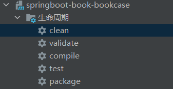
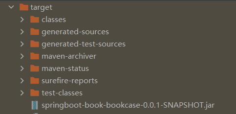
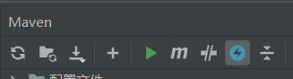
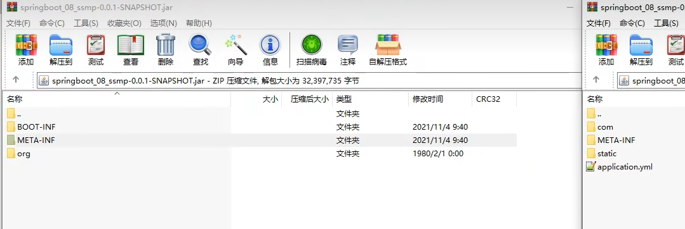

>   **导航：**
>
> [【Java笔记+踩坑汇总】Java基础+JavaWeb+SSM+SpringBoot+SpringCloud+瑞吉外卖/谷粒商城/学成在线+设计模式+面试题汇总+性能调优/架构设计+源码解析](https://blog.csdn.net/qq_40991313/article/details/126646289?csdn_share_tail={"type"%3A"blog"%2C"rType"%3A"article"%2C"rId"%3A"126646289"%2C"source"%3A"qq_40991313"})

[TOC]


# 1.SpringBoot程序的打包与运行回顾

以后制作的程序是运行在专用的**服务器上**的，简单说就是将你做的**程序放在一台独立运行的电脑上**，这台电脑要比你开发使用的计算机更专业，并且安全等级各个方面要远超过你现在的电脑。


**程序如何放置在服务器**

将我们的程序先组织成一个文件，然后将这个文件传输到这台服务器上。这里面就存在两个过程，一个是打包的过程，另一个是运行的过程。

> **温馨提示**
>
> 企业项目上线为了保障环境适配性会采用下面流程发布项目，这里不讨论此过程。
>
> 1. 开发部门使用Git、SVN等版本控制工具上传工程到版本服务器
> 2. 服务器使用版本控制工具下载工程
> 3. 服务器上使用Maven工具在当前真机环境下重新构建项目
> 4. 启动服务

继续说我们的打包和运行过程。所谓**打包指将程序通过打包和运行转换成一个可执行的文件**，所谓运行指不依赖开发环境执行打包产生的文件。上述两个操作都有对应的命令可以快速执行。

## **1-1 程序打包**

首先确保pom.xml导入了打包插件：没导入的话后面运行会报没有主清单属性。

```XML
            <plugin>
                <groupId>org.springframework.boot</groupId>
                <artifactId>spring-boot-maven-plugin</artifactId>
            </plugin>
```


**打包前先clean是好习惯。**

SpringBoot程序是基于Maven创建的，在Maven中提供有打包的指令，叫做package。本操作可以在Idea环境下执行。



或者使用命令行打包： 

```java
mvn package
```


打包后target目录下会产生一个与工程名类似的jar文件，其名称是由模块名+版本号+.jar组成的。



> 程序没问题的话可以点击跳过测试，快速打包：
>
> 

## **1-2 程序运行**

程序包打好以后，就可以直接执行了。在程序包所在路径下，执行指令。

```java
java -jar 工程包名.jar
```


> **tips:**
>
> - 打开jar所在目录，在地址栏输入cmd可直接进入当前路径下命令行。
> - **jar名不用记**，输入前几个字母按tab键就补全了，这也是linux的补全快捷键。

执行程序打包指令后，程序正常运行，与在Idea下执行程序没有区别。

**特别关注**：如果你的计算机中没有安装java的jdk环境，是无法正确执行上述操作的，因为程序执行使用的是java指令。

**特别关注**：在使用向导创建SpringBoot工程时，pom.xml文件中会有如下配置，这一段配置千万不能删除，否则打包后无法正常执行程序。

```XML
<build>
    <plugins>
        <plugin>
            <groupId>org.springframework.boot</groupId>
            <artifactId>spring-boot-maven-plugin</artifactId>
        </plugin>
    </plugins>
</build>
```


**总结**

1. SpringBoot工程可以基于java环境下独立运行jar文件启动服务
2. SpringBoot工程执行mvn命令package进行打包
3. 执行jar命令：java –jar 工程名.jar


## 1-3 SpringBoot程序打包失败处理

有些小伙伴打包以后执行会出现一些问题，导致程序无法正常执行，例如下面的现象


要想搞清楚这个问题就要说说.jar文件的工作机制了，知道了这个东西就知道如何避免此类问题的发生了。

搞java开发平时会接触很多jar包，比如mysql的驱动jar包，而上面我们打包程序后得到的也是一个jar文件。这个时候如果你使用上面的java -jar指令去执行mysql的驱动jar包就会出现上述不可执行的现象，而我们的SpringBoot项目为什么能执行呢？其实是因为打包方式不一样。

在SpringBoot工程的pom.xml中有下面这组配置，这组配置决定了打包出来的程序包是否可以执行。

```XML
<build>
    <plugins>
        <plugin>
            <groupId>org.springframework.boot</groupId>
            <artifactId>spring-boot-maven-plugin</artifactId>
        </plugin>
    </plugins>
</build>
```


我们分别开启这段配置和注释掉这段配置分别执行两次打包，然后观察两次打包后的程序包的差别，共有3处比较明显的特征

- 打包后文件的大小不同
- 打包后所包含的内容不同
- 打包程序中个别文件内容不同

先看第一个现象，文件大小不同。带有配置时打包生成的程序包大小如下：


不难看出，带有配置的程序包体积比不带配置的大了30倍，那这里面都有什么呢？能差这么多？下面看看里面的内容有什么区别。




我们发现内容也完全不一样，仅有一个目录是一样的，叫做**META-INF**。打开容量大的程序包中的**BOOT-INF目录下的classes目录**，我们发现其中的内容居然和容量小的程序包中的内容完全一样。


原来大的程序包中除了包含小的程序包中的内容，还有别的东西。都有什么呢？回到BOOT-INF目录下，打开**lib目录，里面显示了很多个jar文件。**


仔细翻阅不难发现，这些jar文件都是我们制作这个工程时导入的坐标对应的文件。大概可以想明白了，SpringBoot程序为了让自己打包生成的程序可以独立运行，不仅将项目中自己开发的内容进行了打包，还把当前工程运行需要使用的jar包全部打包进来了。为什么这样做呢？就是为了可以独立运行。不依赖程序包外部的任何资源可以独立运行当前程序。这也是为什么大的程序包容量是小的程序包容量的30倍的主要原因。

再看看大程序包还有什么不同之处，在最外层目录包含一个**org目录，里面包含了运行程序所需要的工具包**。

进入此目录，目录名是org\springframework\boot\loader，在里面可以找到一个**JarLauncher.class**的文件，先记得这个文件。再看这套目录名，明显是一个Spring的目录名，为什么要把Spring框架的东西打包到这个程序包中呢？不清楚。

回到两个程序包的最外层目录，查看名称相同的文件夹META-INF下都有一个叫做MANIFEST.MF的文件，但是大小不同，打开文件，比较内容区别

- 小容量文件的MANIFEST.MF

  ```java
  Manifest-Version: 1.0
  Implementation-Title: springboot_08_ssmp
  Implementation-Version: 0.0.1-SNAPSHOT
  Build-Jdk-Spec: 1.8
  Created-By: Maven Jar Plugin 3.2.0
  ```

  

- 大容量文件的MANIFEST.MF

  ```java
  Manifest-Version: 1.0
  Spring-Boot-Classpath-Index: BOOT-INF/classpath.idx
  Implementation-Title: springboot_08_ssmp
  Implementation-Version: 0.0.1-SNAPSHOT
  Spring-Boot-Layers-Index: BOOT-INF/layers.idx
  Start-Class: com.itheima.SSMPApplication
  Spring-Boot-Classes: BOOT-INF/classes/
  Spring-Boot-Lib: BOOT-INF/lib/
  Build-Jdk-Spec: 1.8
  Spring-Boot-Version: 2.5.4
  Created-By: Maven Jar Plugin 3.2.0
  Main-Class: org.springframework.boot.loader.JarLauncher
  ```

  

大文件中明显比小文件中多了几行信息，其中最后一行信息是Main-Class: org.springframework.boot.loader.**JarLauncher**。这句话什么意思呢？如果使用java -jar执行此程序包，将执行Main-Class属性配置的类，这个类恰巧就是前面看到的那个文件。原来SpringBoot打包程序中出现Spring框架的东西是为这里服务的。而这个org.springframework.boot.loader.**JarLauncher**类内部要查找Start-Class属性中配置的类，并执行对应的类。这个属性在当前配置中也存在，对应的就是我们的引导类类名。

现在这组设定的作用就搞清楚了

1. SpringBoot程序添加配置后会打出一个特殊的包，包含Spring框架部分功能，原始工程内容，原始工程依赖的jar包
2. 首先读取MANIFEST.MF文件中的Main-Class属性，用来标记执行java -jar命令后运行的类
3. JarLauncher类执行时会找到Start-Class属性，也就是启动类类名
4. 运行启动类时会运行当前工程的内容
5. 运行当前工程时会使用依赖的jar包，从lib目录中查找

看来SpringBoot打出来了包为了能够独立运行，简直是煞费苦心，将所有需要使用的资源全部都添加到了这个包里。这就是为什么这个jar包能独立运行的原因。

再来看之前的报错信息：


由于打包时没有使用那段配置，结果打包后形成了一个普通的jar包，在MANIFEST.MF文件中也就没有了Main-Class对应的属性了，所以运行时提示找不到主清单属性，这就是报错的原因。

上述内容搞清楚对我们编程意义并不大，但是对各位小伙伴理清楚SpringBoot工程独立运行的机制是有帮助的。其实整体过程主要是带着大家分析，如果以后遇到了类似的问题，多给自己提问，多问一个为什么，兴趣自己就可以独立解决问题了。

**总结**

1. spring-boot-maven-plugin插件用于将当前程序打包成一个可以独立运行的程序包


## 1-4 启动时端口占用解决

先查看占用端口的进程号 

```
netstat -ano | findstr "8080"
```


然后杀死进程号，例如进程号是12724：

```
taskkill -PID 12724 -F
```


> 备用命令：
>
> ```java
>  查询端口
> netstat -ano
>  查询指定端口
> netstat -ano |findstr "端口号"
>  根据进程PID查询进程名称
> tasklist |findstr "进程PID号"
>  根据PID杀死任务
> taskkill /F /PID "进程PID号"
>  根据进程名称杀死任务
> taskkill -f -t -im "进程名称"
> ```
>
> 


## 1-5 SpringBoot项目快速启动（Linux版）

**1.清理和打包**

**2.VMware使用**

下载VMware：

```XML
https://download3.vmware.com/software/wkst/file/VMware-workstation-full-15.5.0-14665864.exe
```


centos7：

```XML
https://www.centos.org/download/
```


finalshell进入centos7： 

**查看防火墙状态（很重要，出现错误第一时间查看防火墙）：**

```bash
systemctl status firewalld.service
```


**关闭防火墙**

```bash
systemctl stop firewalld.service
```


**卸载openjdk**

```bash
yum remove *openjdk*
```


**在root下安装jdk**

```bash
cd /root
```


 [Java Downloads | Oracle](https://www.oracle.com/java/technologies/downloads/#java11)

解压到指定目录： 

```bash
tar -xvf jdk-11.0.16.1_linux-x64_bin.tar.gz -C /usr/lib/jvm
```


环境变量：

```bash
vi /etc/profile
```


加到末尾 

```bash
export JAVA_HOME=/usr/lib/jvm/jdk-11.0.16.1
 export PATH=$JAVA_HOME/bin:$PATH
 export CLASSPATH=.:$JAVA_HOME/lib/dt.jar:$JAVA_HOME/lib/tools.jar
```


重启后验证安装jdk成功：

```bash
java -version
java
javac
```


**安装mysql：**

[linux安装mysql_vincewm的博客-CSDN博客](https://blog.csdn.net/qq_40991313/article/details/126514654?csdn_share_tail={"type"%3A"blog"%2C"rType"%3A"article"%2C"rId"%3A"126514654"%2C"source"%3A"qq_40991313"})

**启动工程：**

进入文件夹 

```bash
cd /
cd usr
cd local
mkdir app
cd app
```


测试数据库：

```
mysql -uroot -p
```


navicat新建连接，将旧的表转储sql文件-结构和数据，然后在新连接创建数据库，运行sql文件里的语句，生成表和数据：


 如果连接不上，先看防火墙，然后设置MySQL数据库可以用任意ip连接访问：

```sql
use mysql; 
select user,host from user;
update user set host='%' where host='localhost'；
```


在/usr/local/app文件夹下上传jar包，注意必须是root账号登录，否则会上传秒失败。 

**运行jar包：**

```bash
cd /usr/local/app
java -jar 工程包名.jar
```


注意yml配置文件

```
url: jdbc:mysql://localhost/ssm_db?serverTimezone=UTC
```

 **报错access denied for user root@localhost**

```bash
vim /etc/my.cnf

#在打开文档中找到[mysqld]并在下面添加一行skip-grant-tables并保存退出
[mysqld]
skip-grant-tables

#重启服务使配置文件更改生效
systemctl restart mysqld;
# 直接输入mysql进入数据库，输入以下几行命令，123456可以替换成你想要的密码,前面的东西别删
# 前面的authentication_string字段根据mysql版本不一致可能有出入有的版本好像是passsword，建议desc user；看一下数据表里是什么字段
mysql
```


**后台启动并指定日志：**

```bash
nohup java -jar 包名.jar > server.log 2>&1 &
```


 查找这个进程process select：

```bash
ps -ef | grep "java -jar"
```


 杀死进程：

```bash
kill -9 进程号
```


# 2.配置高级


## 2-1.临时属性设置

目前我们的程序包打好了，可以发布了。但是程序包打好以后，里面的配置都已经是固定的了，比如配置了服务器的端口是8080。如果我要启动项目，发现当前我的服务器上已经有应用启动起来并且占用了8080端口，这个时候就尴尬了。难道要重新把打包好的程序修改一下吗？比如我要把打包好的程序启动端口改成80。


SpringBoot提供了灵活的配置方式，如果你发现你的项目中有个别属性需要重新配置，可以使用临时属性的方式快速修改某些配置。方法也特别简单，在启动的时候添加上对应参数就可以了。

**设置临时端口：**

格式是property的格式

```java
java –jar springboot.jar –-server.port=80
```


> 上面的命令是启动SpringBoot程序包的命令，在命令输入完毕后，空一格，然后输入两个-号。下面按照属性名=属性值的形式添加对应参数就可以了。记得，这里的格式不是yaml中的书写格式，当属性存在多级名称时，中间使用点分隔，和properties文件中的属性格式完全相同。

如果你发现要修改的属性不止一个，可以按照上述格式继续写，属性与属性之间使用空格分隔。

```java
java –jar springboot.jar –-server.port=80 --logging.level.root=debug
```


### **属性加载优先级**

我们现在只需要知道优先级 临时属性>配置文件>系统环境属性 。在发现配置引起的错误，就检查优先级高的覆盖问题。

**扩展：**

现在我们的程序配置受两个地方控制了，第一配置文件，第二临时属性。并且我们发现临时属性的加载优先级要高于配置文件的。那是否还有其他的配置方式呢？其实是有的，而且还不少，打开官方文档中对应的内容，就可以查看配置读取的优先顺序。地址奉上：[https://docs.spring.io/spring-boot/docs/current/reference/html/spring-boot-features.html#boot-features-external-config](https://docs.spring.io/spring-boot/docs/current/reference/html/spring-boot-features.html)


我们可以看到，居然有14种配置的位置，而我们现在使用的是这里面的2个。第3条Config data说的就是使用配置文件，第11条Command line arguments说的就是使用命令行临时参数。而这14种配置的顺序就是SpringBoot加载配置的顺序，言外之意，命令行临时属性比配置文件的加载优先级高，所以这个列表上面的优先级低，下面的优先级高。其实这个东西不用背的，你就记得一点，你最终要什么效果，你自己是知道的，不管这个顺序是怎么个高低排序，开发时一定要配置成你要的顺序为准。这个顺序只是在你想不明白问题的时候帮助你分析罢了。

比如你现在加载了一个user.name属性。结果你发现出来的结果和你想的不一样，那肯定是别的优先级比你高的属性覆盖你的配置属性了，那你就可以看着这个顺序挨个排查。哪个位置有可能覆盖了你的属性。

我在课程评论区看到小伙伴学习基础篇的时候问这个问题了，就是这个原因造成的。在yaml中配置了user.name属性值，然后读取出来的时候居然不是自己的配置值，因为在系统属性中有一个属性叫做user.name，两个相互冲突了。而系统属性的加载优先顺序在上面这个列表中是5号，高于3号，所以SpringBoot最终会加载系统配置属性user.name。

> **总结**
>
> 1. 使用jar命令启动SpringBoot工程时可以使用临时属性替换配置文件中的属性
> 2. 临时属性添加方式：java –jar 工程名.jar –-属性名=值
> 3. 多个临时属性之间使用空格分隔
> 4. 临时属性必须是当前boot工程支持的属性，否则设置无效


### 开发环境IDEA中使用临时属性

临时使用目前是有了，但是上线的时候通过命令行输入的临时属性必须是正确的啊，那这些**临时属性配置值我们必须首先在开发环境中测试好才行。**

下面说一下开发环境中如何使用临时属性，其实就是Idea界面下如何操作了。

打开SpringBoot引导类的运行界面，在里面找到配置项。其中Program arguments（程序实参）对应的位置就是添加临时属性的，可以加几个试试效果。


做到这里其实可以产生一个思考了，如果对java编程熟悉的小伙伴应该知道，我们运行main方法的时候，如果想使用main方法的参数，**也就是下面的args参数**，就是在上面这个位置添加的参数。

```java
public static void main(String[] args) {
}
```


原来是这样，通过这个args就可以获取到参数。再来看我们的引导类是如何书写的

```java
public static void main(String[] args) {
    SpringApplication.run(SSMPApplication.class,args);
}
```


这个args参数居然传递给了run方法，看来在Idea中配置的临时参数就是通过这个位置传递到我们的程序中的。言外之意，这里如果不用这个args是不是就断开了外部传递临时属性的入口呢？是这样的，我们可以使用下面的调用方式，这样外部临时属性就无法进入到SpringBoot程序中了。

```java
public static void main(String[] args) {
    SpringApplication.run(SSMPApplication.class);
}
```


或者还可以使用如下格式来玩这个操作，就是将配置不写在配置文件中，直接写成一个字符串数组，传递给程序入口。当然，这种做法并没有什么实际开发意义。

```java
public static void main(String[] args) {
    String[] arg = new String[1];
    arg[0] = "--server.port=8082";
    SpringApplication.run(SSMPApplication.class, arg);
}
```


**测试类使用临时参数/属性：**

```java
//args属性可以为当前测试用例添加临时的命令行参数
@SpringBootTest(args={"--test.prop=testValue2"})
public class PropertiesAndArgsTest {
    
    @Value("${test.prop}")
    private String msg;
    
    @Test
    void testProperties(){
        System.out.println(msg);
    }
}
```


 或者：

```java
//properties属性可以为当前测试用例添加临时的属性配置
@SpringBootTest(properties = {"test.prop=testValue1"})
public class PropertiesAndArgsTest {

    @Value("${test.prop}")
    private String msg;
    
    @Test
    void testProperties(){
        System.out.println(msg);
    }
}
```


> **总结**
>
> 1. 启动SpringBoot程序时，可以选择是否使用命令行属性为SpringBoot程序传递启动属性

**思考**

现在使用临时属性可以在启动项目前临时更改配置了，但是新的问题又出来了。临时属性好用是好用，就是写的多了会很麻烦。比如我现在有个需求，上线的时候使用临时属性配置20个值，这下可麻烦了，能不能搞得简单点，集中管理一下呢？比如说搞个文件，加载指定文件？还真可以。怎么做呢？咱们下一节再说。


## 2-2.配置文件4级分类回顾

SpringBoot提供了配置文件和临时属性的方式来对程序进行配置。前面一直说的是临时属性，这一节要说说配置文件了。其实这个配置文件我们一直在使用，只不过我们用的是SpringBoot提供的4级配置文件中的其中一个级别。4个级别分别是：

- 类路径下配置文件（一直使用的是这个，也就是resources目录中的application.yml文件）
- 类路径下config目录下配置文件
- 程序包所在目录中配置文件
- 程序包所在目录中config目录下配置文件

好复杂，一个一个说。其实上述4种文件是提供给你了4种配置文件书写的位置，功能都是一样的，都是做配置的。那大家关心的就是差别了，没错，就是因为位置不同，产生了差异。总体上来说，4种配置文件如果都存在的话，有一个优先级的问题，说白了就是加入4个文件我都有，里面都有一样的配置，谁生效的问题。上面4个文件的加载优先顺序为

1. file ：config/application.yml **【最高】** 常用于运维经理进行整体项目属性调控
2. file ：application.yml  
3. classpath：config/application.yml  一般用于项目经理进行整体项目属性调控
4. classpath：application.yml **【最低】**

那为什么设计这种多种呢？说一个最典型的应用吧。

- 场景A：你作为一个开发者，你做程序的时候为了方便自己写代码，配置的数据库肯定是连接你自己本机的，咱们使用4这个级别，也就是之前一直用的application.yml。
- 场景B：现在项目开发到了一个阶段，要联调测试了，连接的数据库是测试服务器的数据库，肯定要换一组配置吧。你可以选择把你之前的文件中的内容都改了，目前还不麻烦。
- 场景C：测试完了，一切OK。你继续写你的代码，你发现你原来写的配置文件被改成测试服务器的内容了，你要再改回来。现在明白了不？场景B中把你的内容都改掉了，你现在要重新改回来，以后呢？改来改去吗？

解决方案很简单，用上面的3这个级别的配置文件就可以快速解决这个问题，再写一个配置就行了。两个配置文件共存，因为config目录中的配置加载优先级比你的高，所以配置项如果和级别4里面的内容相同就覆盖了，这样是不是很简单？

级别1和2什么时候使用呢？程序打包以后就要用这个级别了，管你程序里面配置写的是什么？我的级别高，可以轻松覆盖你，就不用考虑这些配置冲突的问题了。

**总结**

1. 配置文件分为4种

   - 项目类路径配置文件：服务于开发人员本机开发与测试
   - 项目类路径config目录中配置文件：服务于项目经理整体调控
   - 工程路径配置文件：服务于运维人员配置涉密线上环境
   - 工程路径config目录中配置文件：服务于运维经理整体调控

2. 多层级配置文件间的属性采用**叠加并覆盖**的形式作用于程序

   

## 2-3.自定义配置文件

之前咱们做配置使用的配置文件都是application.yml，其实这个文件也是可以改名字的，这样方便维护。比如我2020年4月1日搞活动，走了一组配置，2020年5月1日活动取消，恢复原始配置，这个时候只需要重新更换一下配置文件就可以了。但是你总不能在原始配置文件上修改吧，不然搞完活动以后，活动的配置就留不下来了，不利于维护。

自定义配置文件方式有如下两种：

**方式一：使用临时属性设置配置文件名，注意仅仅是名称，不要带扩展名**


**方式二：使用临时属性设置配置文件路径，这个是全路径名**


**也可以设置加载多个配置文件**


使用的属性一个是spring.config.name，另一个是spring.config.location，这个一定要区别清楚。

**温馨提示**

我们现在研究的都是SpringBoot单体项目，就是单服务器版本。其实企业开发现在更多的是使用基于SpringCloud技术的多服务器项目。这种配置方式和我们现在学习的完全不一样，所有的服务器将不再设置自己的配置文件，而是通过配置中心获取配置，动态加载配置信息。为什么这样做？集中管理。这里不再说这些了，后面再讲这些东西。

> **总结**
>
> 1. 配置文件可以修改**名称**，通过启动参数设定
> 2. 配置文件可以修改**路径**，通过启动参数设定
> 3. **微服务开发**中配置文件通过配置中心进行设置


# 3.多环境开发

讲的内容距离线上开发越来越近了，下面说一说多环境开发问题。

什么是多环境？其实就是说你的电脑上写的程序最终要放到别人的服务器上去运行。每个计算机环境不一样，这就是多环境。常见的多环境开发主要兼顾3种环境设置，开发环境——自己用的，测试环境——自己公司用的，生产环境——甲方爸爸用的。因为这是绝对不同的三台电脑，所以环境肯定有所不同，比如连接的数据库不一样，设置的访问端口不一样等等。


## 3-1.多环境开发（yaml单一文件版）

那什么是多环境开发？就是针对不同的环境设置不同的配置属性即可。比如你自己开发时，配置你的端口如下：

```yaml
server:
  port: 80
```


如何想设计两组环境呢？中间使用三个减号分隔开

```yaml
server:
  port: 80
---
server:
  port: 81
```


如何区分两种环境呢？起名字呗

```yaml
spring:
	profiles: pro
server:
	port: 80
---
spring:
	profiles: dev
server:
	port: 81
```


那用哪一个呢？设置默认启动哪个就可以了

```bash
spring:
	profiles:
		active: pro		 #启动pro
---
spring:
	profiles: pro
server:
	port: 80
---
spring:
	profiles: dev
server:
	port: 81
```


就这么简单，再多来一组环境也OK

```bash
spring:
	profiles:
		active: pro		 #启动pro
---
spring:
	profiles: pro
server:
	port: 80
---
spring:
	profiles: dev
server:
	port: 81
---
spring:
	profiles: test
server:
	port: 82
```


其中关于环境名称定义上述格式是过时格式，**标准格式如下**

```yaml
spring:
	config:
    	activate:
        	on-profile: pro
```


**总结**

1. 多环境开发需要设置若干种常用环境，例如开发、生产、测试环境
2. yaml格式中设置多环境使用---区分环境设置边界
3. 每种环境的区别在于加载的配置属性不同
4. 启用某种环境时需要指定启动时使用该环境


## 3-2.多环境开发（yaml多文件版）

将所有的配置都放在一个配置文件中，尤其是每一个配置应用场景都不一样，这显然不合理，容易暴露信息，并且不好维护。于是就有了将一个配置文件拆分成多个配置文件的想法。

拆分后，每个配置文件中写自己的配置，主配置文件中写清楚用哪一个配置文件就好了。

**主配置文件**

```yaml
spring:
	profiles:
		active: pro		 启动application-pro.yml
```


**环境配置文件**

```yaml
server:
	port: 80
```


**环境配置文件**因为每一个都是配置自己的项，所以**连名字都不用写里面了，使用环境配置文件名区分。**

**环境文件的命名规则为：application-环境名.yml。**

**application-pro.yaml**

```yaml
server:
	port: 80
```


**application-dev.yaml**

```yaml
server:
	port: 81
```


在配置文件中，如果某些配置项所有环境都一样，可以将这些项写入到主配置中，只有哪些有区别的项才写入到环境配置文件中。

- **主配置文件中设置公共配置（全局）**
- **环境分类配置文件中常用于设置冲突属性（局部）**

> **总结**
>
> 1. 可以使用独立配置文件定义环境属性
>
> 2. 独立配置文件便于线上系统维护更新并保障系统安全性
>
>    

## 3-3.多环境开发（properties多文件版）

SpringBoot最早期提供的配置文件格式是properties格式的，这种格式的多环境配置也了解一下吧。

**主配置文件**

```properties
spring.profiles.active=pro
```


**环境配置文件**

**application-pro.properties**

```properties
server.port=80
```


**application-dev.properties**

```properties
server.port=81
```


文件的命名规则为：application-环境名.properties。

**总结**

1. properties文件多环境配置仅支持多文件格式


## 3-4.配置文件根据功能拆分，group

作为程序员在搞配置的时候往往处于一种分久必合合久必分的局面。开始先写一起，后来为了方便维护就拆分。对于多环境开发也是如此，下面给大家说一下如何基于多环境开发做配置独立管理，务必掌握。

**准备工作**

将所有的配置根据功能对配置文件中的信息进行拆分，并制作成独立的配置文件，命名规则如下

- application-devDB.yml
- application-devRedis.yml
- application-devMVC.yml

**使用**

**include（已被淘汰，多用group）**

使用include属性在激活指定环境的情况下，同时对多个环境进行加载使其生效，多个环境间使用逗号分隔

环境配置文件：application-dev.yml 

```yaml
spring:
	profiles:
    	active: dev
        include: devDB,devRedis,devMVC
```


比较一下，现在相当于加载dev配置时，再加载对应的3组配置，从结构上就很清晰，用了什么，对应的名称是什么

> 注意
>
> - 加载顺序：先按include里配置的顺序，最后加载主环境配置文件；
> - 当主环境dev与子环境有相同属性时，主环境属性生效；
> - 子环境中有相同属性时，最后加载的环境属性生效

**group改良**

但是上面的设置也有一个问题，比如我要切换dev环境为pro时，include也要修改。因为include属性只能使用一次，这就比较麻烦了。SpringBoot从2.4版开始使用group属性替代include属性，降低了配置书写量。简单说就是我先写好，你爱用哪个用哪个。

```yaml
spring:
	profiles:
    	active: dev
        group:
        	"dev": devDB,devRedis,devMVC
      		"pro": proDB,proRedis,proMVC
      		"test": testDB,testRedis,testMVC
```


> **注意：**
>
> **group是先加载主环境配置，再按配置顺序加载子环境配置。这点和include不同。**

**总结**

1. 多环境开发使用group属性设置配置文件分组，便于线上维护管理


## 3-5.多环境开发控制，yml读取pom.xml

### 3.5.1 概述

就是maven和SpringBoot同时设置多环境的话怎么搞。

maven是做什么的？项目构建管理的，最终生成代码包的，SpringBoot是干什么的？简化开发的。简化，又不是其主导作用。最终还是要靠**maven来管理整个工程**，所以SpringBoot应该听maven的。整个确认后下面就好做了。大体思想如下：

- 先在maven环境中设置用什么具体的环境
- 在SpringBoot中读取maven设置的环境即可

**maven中设置多环境（使用属性方式区分环境）**

```XML
<profiles>
    <profile>
        <id>env_dev</id>
        <properties>
            <profile.active>dev</profile.active>
        </properties>
        <activation>
            <activeByDefault>true</activeByDefault>		<!--默认启动环境-->
        </activation>
    </profile>
    <profile>
        <id>env_pro</id>
        <properties>
            <profile.active>pro</profile.active>
        </properties>
    </profile>
</profiles>
```


**SpringBoot中读取maven设置值**

```XML
spring:
	profiles:
        #@@占位符替换pom.xml中被默认激活的环境名<profile.active>
    	active: @profile.active@
```


**语法格式：@属性名@就是读取maven中配置的属性值的语法格式**。

> **注意：idea2021版本之前有缓存BUG，在将pom.xml中激活的环境切换之后，clean后package还是原来的环境，这时候需要compile一下才能解决。**

**总结**

1. 当Maven与SpringBoot同时对多环境进行控制时，以Mavn为主，SpringBoot使用**@..@占位符**读取Maven对应的配置属性值
2. 基于SpringBoot读取Maven配置属性的前提下，如果在Idea下测试工程时pom.xml每次更新需要手动compile方可生效

### 3.5.2 占位符回顾、总结

-  mysql：

  参数占位符${}（有sql注入问题）和#{}  

  ```java
      @Insert("insert into tbl_book values (null,#{type},#{name},#{description})")
      public void save(Book book);
  ```

  

  

-  **jsp中EL表达式：**参数占位符${}

  ```html
  <%@ page contentType="text/html;charset=UTF-8" language="java" %>
  <html>
  <head>
      <title>Title</title>
  </head>
  <body>
      ${brands}
  </body>
  </html>
  ```

  

  

- Vue：

  参数占位符{{}} 

  ```html
  <!DOCTYPE html>
  <html lang="en">
  <head>
      <meta charset="UTF-8">
      <title>Title</title>
  </head>
  <body>
  <div id="app">
      <input v-model="username"><br>
      <!--插值表达式-->
      input里的值是：{{username}}
  </div>
  <script src="js/vue.js"></script>
  <script>
      //1. 创建Vue核心对象
      new Vue({
          el:"#app",
          data(){  // data() 是 ECMAScript 6 版本的新的写法
              return {
                  username:"默认值"
              }
          }
   
          /*data: function () {
              return {
                  username:""
              }
          }*/
      });
   
  </script>
  </body>
  </html>
  ```

  

- Spring的JdbcConfig注入properties：

  参数占位符${}。记得SpringConfig的@PropertySource("jdbc.properties") 

  ```java
      @Value("${jdbc.driver}")
      private String driver;
  ```

  

  

- Springboot的xml读取pom.xml多环境配置：参数占位符@profile.active@

  ```XML
  <profiles>
      <profile>
          <id>env_dev</id>
          <properties>
              <profile.active>dev</profile.active>
          </properties>
          <activation>
              <activeByDefault>true</activeByDefault>		<!--默认启动环境-->
          </activation>
      </profile>
      <profile>
          <id>env_pro</id>
          <properties>
              <profile.active>pro</profile.active>
          </properties>
      </profile>
  </profiles>
  ```

  

  ```yaml
  spring:
  	profiles:
      	active: @profile.active@
  ```

  

# 4.日志

日志其实就是记录程序日常运行的信息，主要作用如下：

- 编程期调试代码
- 运营期记录信息
- 记录日常运营重要信息（峰值流量、平均响应时长……）
- 记录应用报错信息（错误堆栈）
- 记录运维过程数据（扩容、宕机、报警……）

或许各位小伙伴并不习惯于使用日志，没关系，慢慢多用，习惯就好。想进大厂，这是最基本的，别去面试的时候说没用过，完了，没机会了。


## 4-1.使用日志工具记录日志

日志的使用格式非常固定，直接上操作步骤：

**步骤①**：**添加日志记录操作，LoggerFactory.getLogger方法**

```java
@RestController
@RequestMapping("/books")
public class BookController{
    //使用日志工厂类LoggerFactory的静态方法getLogger
    private static final Logger log = LoggerFactory.getLogger(BookController.class);
    @GetMapping
    public String getById(){
        log.debug("debug...");
        log.info("info...");
        log.warn("warn...");
        log.error("error...");
        return "springboot is running...2";
    }
}
```


上述代码中log对象就是用来记录日志的对象，下面的log.debug，log.info这些操作就是写日志的API了。


**优化日志对象创建代码**

写代码的时候每个类都要写创建日志记录对象，这个可以优化一下，使用前面用过的lombok技术给我们提供的工具类即可。


**导入lombok后使用注解@Slf4j搞定**，日志对象名为log

```java
@Slf4j		//这个注解替代了下面那一行
@RestController
@RequestMapping("/books")
public class BookController{
    //这一句可以不写了
    //private static final Logger log = LoggerFactory.getLogger(BookController.class);	
    @GetMapping
    public String getById(){
        log.debug("debug...");
        log.info("info...");
        log.warn("warn...");
        log.error("error...");
        return "springboot is running...2";
    }
}
```


> **总结**
>
> - 基于lombok提供的@Slf4j注解为类快速添加日志对象


**步骤②：设置日志输出级别**

日志设置好以后可以根据设置选择哪些参与记录。这里是根据日志的级别来设置的。

**日志的级别分为6种：**

- **TRACE：**运行堆栈信息，使用率低
- **DEBUG：**程序员调试代码使用
- **INFO：**记录运维过程数据
- **WARN：**记录运维过程报警数据
- **ERROR：**记录错误堆栈信息
- **FATAL：**灾难信息，合并计入ERROR

**默认级别是info，能看到info级别以上的信息。** 

一般情况下，开发时候使用DEBUG，上线后使用INFO，运维信息记录使用WARN即可。

**设置日志级别：**

**方法一（暴力不推荐）：** 

```bash
 #开启debug模式，输出调试信息，常用于检查系统运行状况
debug: true
```


这么设置太简单粗暴了，日志系统通常都提供了细粒度的控制

**方法二（不推荐）：** 

```bash
 #开启debug模式，输出调试信息，常用于检查系统运行状况
debug: true

 #设置日志级别，root表示根节点，即整体应用日志级别
logging:
	level:
    	root: debug
```


**方法三（推荐）：设置日志组**，控制指定包对应的日志输出级别，也可以直接控制指定包对应的日志输出级别

```bash
logging:
	 #设置日志组
    group:
    	 #自定义组名，设置当前组中所包含的包
        ebank: com.itheima.controller
    level:
    	root: warn
         #为对应组设置日志级别
        ebank: debug
    	 #为对包设置日志级别
        com.itheima.controller: debug
```


说白了就是总体设置一下，每个包设置一下，如果感觉设置的麻烦，就先把包分个组，对组设置，没了，就这些。

> **总结**
>
> 1. 日志用于记录开发调试与运维过程消息
> 2. 日志的级别共6种，通常使用4种即可，分别是DEBUG，INFO,WARN,ERROR
> 3. 可以通过日志组或代码包的形式进行日志显示级别的控制


## 4-2.日志输出格式控制

日志已经能够记录了，但是目前记录的格式是SpringBoot给我们提供的，如果想自定义控制就需要自己设置了。

**系统日志的记录格式：**


**PID：**进程id，记录当前日志所处线程。当有多个服务同时记录日志时，用于识别服务，协助程序员调试程序。

**所属类、接口名：**显示springboot重写后的信息，名称过长时，简化包名为首字母，甚至直接不显示。

对于单条日志信息来说，日期，触发位置，记录信息是最核心的信息。级别用于做筛选过滤，PID与线程名用于做精准分析。了解这些信息后就可以DIY日志格式了。

**官方日志模板的书写格式：**

```bash
logging:
	pattern:
        #  %d是时间，%clr()是彩色，%p是日志级别，pid暂时不写，%t是线程，%c是类名，-40.40是左对齐并截取内容，%m是消息，%n换行
    	console: "%d %clr(%p) --- [%16t] %clr(%-40.40c){cyan} : %m %n"
```


## 4-3.文件记录日志

日志信息显示，记录已经控制住了，下面就要说一下日志的转存了。日志不能仅显示在控制台上，要把日志记录到文件中，方便后期维护查阅。

对于日志文件的使用存在各种各样的策略，例如每日记录，分类记录，报警后记录等。这里主要研究日志文件如何记录。

**单文件记录：不建议**

```yaml
logging:
	file:
    	name: server.log
```


虽然使用上述格式可以将日志记录下来了，但是面对线上的复杂情况，一个文件记录肯定是不能够满足运维要求的，通常会每天记录日志文件，同时为了便于维护，还要限制每个日志文件的大小。

**日志文件的常用配置方式**：

```yaml
logging:
	logback:
    	rollingpolicy:
        	max-file-size: 3KB
            file-name-pattern: server.%d{yyyy-MM-dd}.%i.log
```


以上格式是基于logback日志技术设置每日日志文件的设置格式，要求容量到达3KB以后就转存信息到第二个文件中。文件命名规则中的**%d标识日期，%i是一个递增变量，用于区分日志文件**。

**总结**

1. 日志记录到文件
2. 日志文件格式设置