>  **导航：**
>
> [【Java笔记+踩坑汇总】Java基础+JavaWeb+SSM+SpringBoot+SpringCloud+瑞吉外卖/谷粒商城/学成在线+设计模式+面试题汇总+性能调优/架构设计+源码解析](https://blog.csdn.net/qq_40991313/article/details/126646289?csdn_share_tail={"type"%3A"blog"%2C"rType"%3A"article"%2C"rId"%3A"126646289"%2C"source"%3A"qq_40991313"})

[TOC]


# **0、提交项目到GitHub简洁版**

> **0.克隆项目**
>
> 在本地没有版本库的时候,从远程服务器克隆整个版本库到本地,是一个本地从无到有的过程。
>
> ```bash
> git clone -b [分支名] [远程仓库地址]
> ```
>
> 

1.点进已有项目文件夹，右键git bash，**设置用户签名**（仅用于区分提交者，跟GitHub账户邮箱没关系）：

```
git config --global user.name 用户名
git config --global user.email 邮箱
```


**2.初始化本地仓库**

```
git init
```


 **3.添加暂存区**

```
git add 文件名
```


> 添加所有变化到暂存区：
>
> 
>
> ```bash
> git add .
> ```
>
> 


**4. 提交本地库**

```bash
git commit -m "日志信息"
```


5.GitHub**创建远程仓库**new repository

**6.创建远程仓库别名：**

```bash
git remote add 远程主机名/即别名/如origin 远程地址                
```


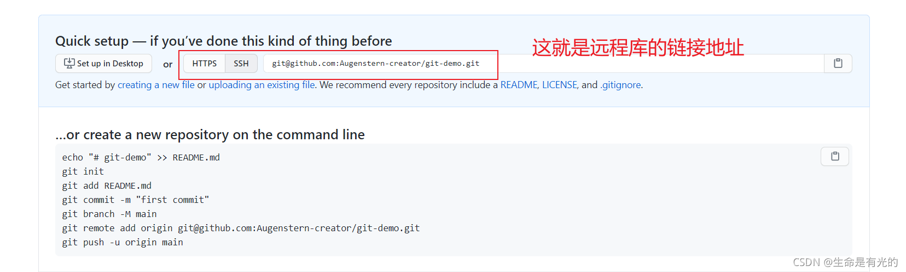

> 查看远程库信息：
>
> ```
> git remote -v
> ```
>
> 
>
>  
>
> 
>
> 修改远程库信息：
>
> 
>
> ```bash
> git remote set-url origin <new-url>
> #git remote set-url origin git@github.com:vincewm/xxxg.git
> ```
>
> 
>
> 

**7.推送本地分支到远程仓库**

查看当前分支

```
git branch -v
```


**7.5.拉取** 

多人协作开发时，先**拉取**（拉取pull=获取fetch+合并merge）再执行下一步

```bash
git pull origin master
```


> **如果有冲突：**
>
> 下面是远程库被其他人提交过，本地提前前需要处理冲突的场景：
>
> 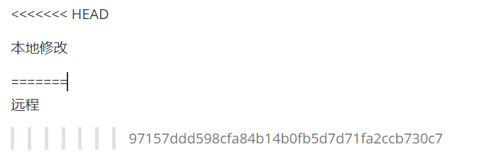
>
>  删掉<<和==、版本号符号，然后再添加暂存区、提交本地库（这里就是合并的版本）、推送远程库。

**8.推送本地分支**

```
git push 别名 分支如master
```


**9.登录浏览器**，完成。 

 

# **1、Git介绍**

## **1.1、概述**

- Git是一个免费的、开源的分布式版本控制系统 ，可以快速高效地处理从小型到大型的各种项目
- Git易于学习，占地面积小，性能 极快 。 它具有廉价的本地 库 ，方便的暂存区域和多个工作
   流分支等特性。 其性能优于 Subversion、 CVS、 Perforce和 ClearCase等 版本控制 工具。
- 官网地址：[Git](http://git-scm.com/)


## 1.2、版本控制

- 版本控制是一种**记录文件内容变化**，以便将来查阅特定版本修订情况的系统。
- 版本控制其实最重要的是可以记录文件修改历史记录，从而让用户能够查看**历史版本**，方便版本切换

**比较容易理解版本控制思想：**

写毕业论文时候，需要多个版本进行存储，以防止修改错误后找不到以前的版本：


注意：git控制版本不是上图这种，上图仅供理解版本控制思想，实际上git是通过指针控制版本的：

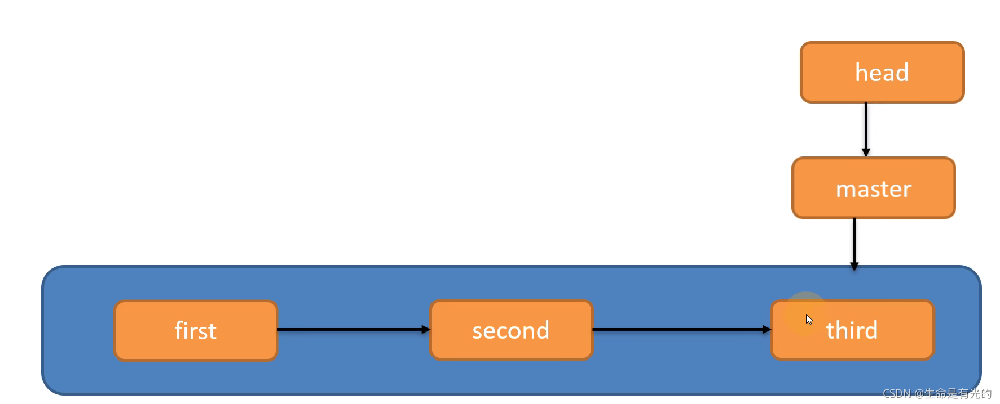
 first、second、second分别代表三个版本


## 1.3、版本控制工具

- 集中式版本控制工具
  - CVS、SVN、VSS
  - 集中化的版本控制系统诸如 CVS、SVN 等，都有一个单一的**集中管理的服务器**，保存所有文件的修订版本，而协同工作的人们都通过客户端连到这台服务器，取出最新的文件或者提交更新。多年以来，这已成为版本控制系统的标准做法。
  - 这种做法带来了许多**好处**，每个人都可以在一定程度上看到项目中的其他人正在做些什么。而管理员也可以**轻松掌控每个开发者的权限**，并且管理一个集中化的版本控制系统，要远比在各个客户端上维护本地数据库来得轻松**容易**。
  - 事分两面，有好有坏。这么做显而易见的**缺点**是中央服务器的**单点故障**。如果服务器宕机一小时，那么在这一小时内，**谁都无法提交更新**，也就无法协同工作。

 

- [分布式](https://so.csdn.net/so/search?q=分布式&spm=1001.2101.3001.7020)**版本控制工具**
  - Git、Mercurial、…
  - 像Git这种分布式版本控制工具 ，客户端提取的不是最新版本的文件快照，而是把代码仓库完整地镜像下来 (本地库) 。这 样 任何一处协同工作用的文件发生故障，事后都可以用其他客户端的本地仓库进行 恢复。因为每个客户端的每一次文件提取操作，实际上都是一次对整个文件仓库的完整备份 。
- 分布式的版本控制系统出现之后,解决了集中式版本控制系统的缺陷 :
  - 服务器**断网的情况下也可以进行开发**，因为版本控制是在本地进行的
  - **每个客户端**保存的也都是整个**完整的项目** ，包含历史记录 更加安全

 

## 1.4、Git简史


## 1.5、Git工作机制


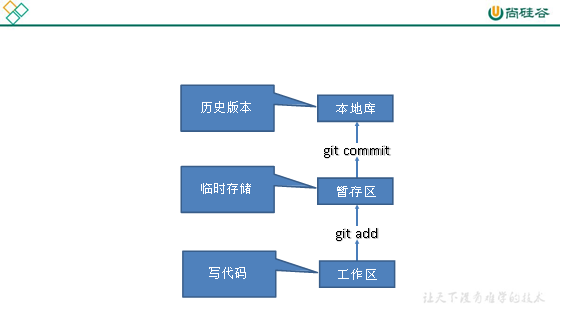

 代码提交到本地库，才是历史版本，就删不掉了。

## 1.6、Git和代码托管中心

代码托管中心是基于网络服务器的**远程代码仓库**，一般我们简单称为远程库。

➢  **局域网**

GitLab

➢  **互联网**

GitHub（外网）

Gitee 码云（国内网站）


# 2、Git安装

查看当前git版本：

```bash
git version
```


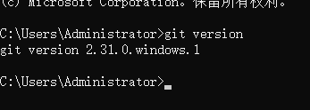

 

- 官网地址：[Git](http://git-scm.com/)

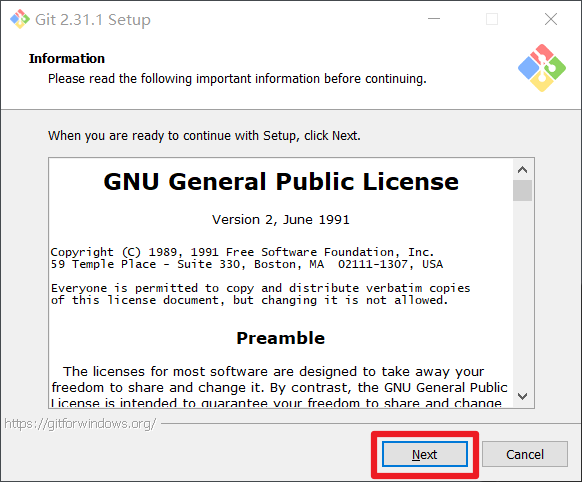


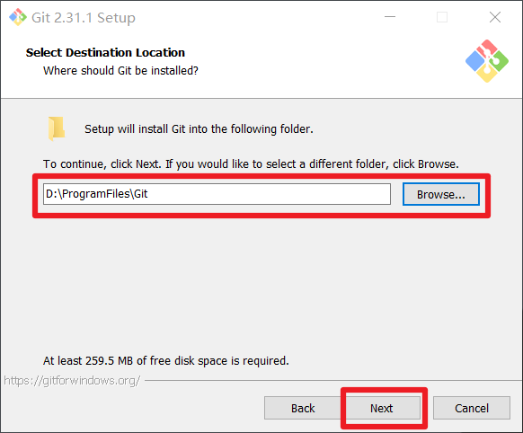


最好安装在自己电脑开发或者环境目录下


Git安装目录名，不用修改，直接点击下一步。


Git的默认编辑器，建议使用默认的 Vim编辑器，然后点击下一步。


默认分支名设置，选择让Git决定，分支名默认为 master，下一步。

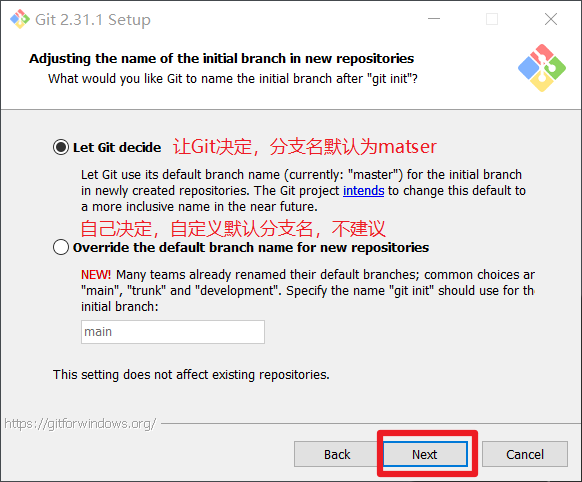


修改Git的环境变量，选第一个，不修改环境变量，只在 Git Bash里使用 Git。


选择后台客户端连接协议，选默认值OpenSSL，然后下一步。


配置Git文件的行末换行符， Windows使用 CRLF Linux使用 LF，选择第一个自动转换，然后继续下一步。


选择Git终端类型，选择默认的 Git Bash终端，然后继续下一步。

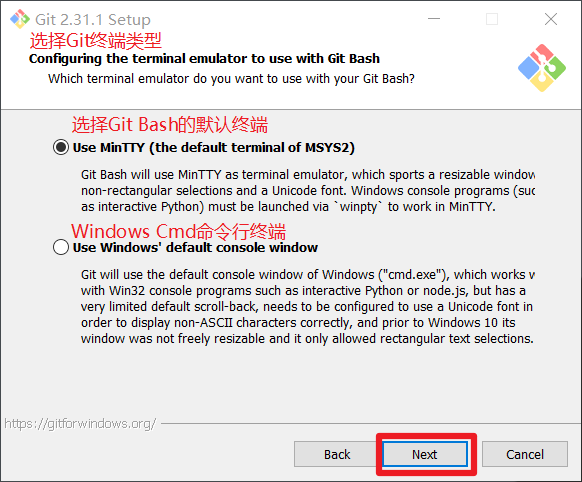


选择Git pull合并的模式，选择默认，然后下一步。


选择Git的凭据管理器，选择默认 的跨平台的凭据管理器 ，然后下一步 。

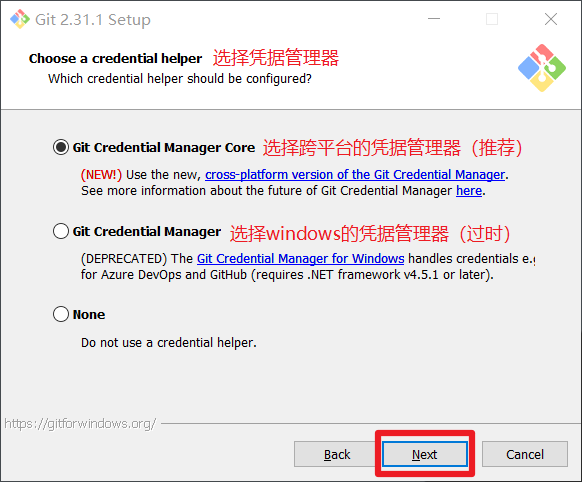


其他配置，选择默认设置，然后下一步。

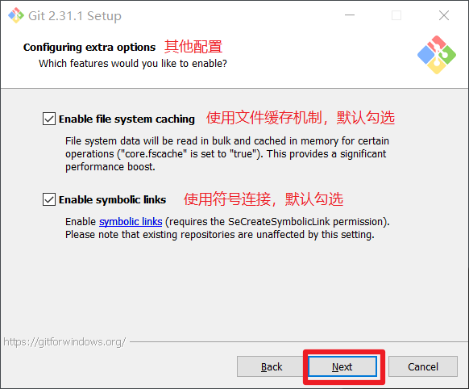


实验室功能，技术还不成熟， 有已知的 bug，不要勾选，然后点击右下角的 Install按钮，开始安装 Git


点击Finsh按钮， Git安装成功！

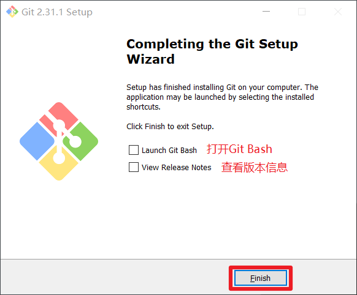


右键任意位置，在右键菜单里选择Git Bash Here即可打开 Git Bash命令行终端。在Git Bash终端里输入 `git --version`查看 git版本，如图所示，说明 Git安装成功。


# 3、Git常用命令


| 命令名称                             | 作用               |
| ------------------------------------ | ------------------ |
| git config --global user.name 用户名 | 设置用户签名       |
| git config --global user.email 邮箱  | 设置用户签名       |
| **git init**                         | **初始化本地库**   |
| **git status**                       | **查看本地库状态** |
| **git add 文件名**                   | **添加到暂存区**   |
| **git commit m " 日志信息 " 文件名** | **提交到本地库**   |
| **git reflog**                       | **查看历史记录**   |
| **git reset hard 版本号**            | **版本穿梭**       |

git可以tab键代码补全，例如输入con按tab补全成config。 

## 3.1、设置用户签名

基本语法

```bash
git config --global user.name 用户名
git config --global user.email 邮箱
```


 **检查设置好的签名：**

在自己 `C:\Users\xxx`（xxx是电脑账户名）下有个 `.gitconfig` 文件，打开里面就是我们设置的用户签名

 


**签名的作用：**

签名的作用是区分不同操作者身份。

用户的签名信息在每一个版本的提交信息中能够看到，以此确认本次提交是谁做的。Git首次安装必须设置一下用户签名，否则无法提交代码。

> **注意：**这里设置**用户签名**和将来登录 GitHub（或其他代码托管中心）的账号没有任何关系。

## 3.2、初始化本地库

**基本语法：**

```bash
git init
```


初始化生成的.git是隐藏目录，要先开启：


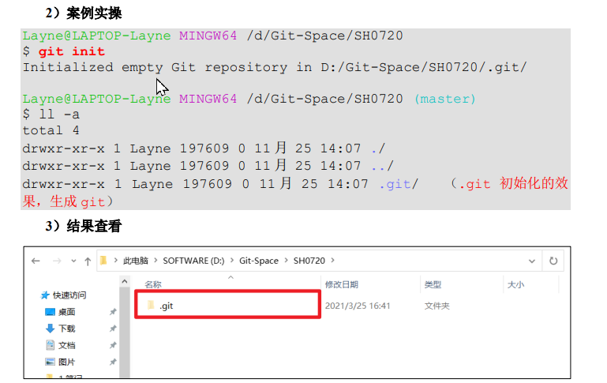

**初始化后生成的.git隐藏文件的内容：** 


## 3.3、查看本地库状态

### 3.3.1、概述

**基本语法：**

```bash
git status
```


- 首次查看时，工作区没有任何文件

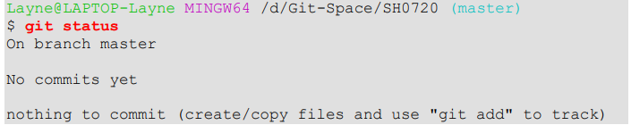


### 3.3.2、新增文件

使用vim文本编辑器新增文件，再次查看本地库状态，会发现文件名是红色，表明此文件只存在于工作区，git还没有追踪过此文件，要使用git add添加到暂存区（追踪文件）：


## 3.4、添加暂存区

**基本语法：**

```
git add 文件名
```


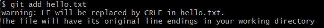

 **添加到暂存区后警告：**LF替换成CRLF，即换行替换成windows换行。

**CRLF** 是 carriage return line feed 的缩写，中文意思是回车换行。“\r\n”, **windows**系统环境下的换行方式
 **LF** 是 line feed 的缩写，中文意思也是换行。“\n”, **Linux**系统环境下的换行方式

再次**查看本地库状态**，会发现文件名变绿色，表面文件已保存到暂存区： 

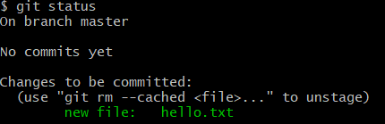

如果想**删除暂存区的文件：**


>  注意：该指令只是删除暂存区文件，工作区文件依然存在。
>
> 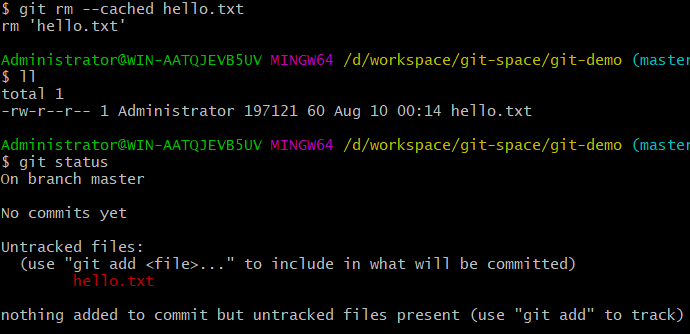


## 3.5、提交本地库

**将暂存区的文件提交到本地库**

```bash
git commit -m "日志信息"
```


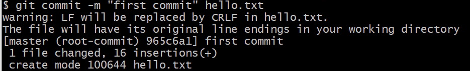

**此时本地库状态是干净的：**没有东西需要提交

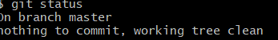

**对比之前暂存区状态**：还没有提交 


 **查看引用日志信息：**

```
git reflog
```


示例：

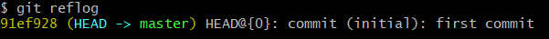

引用日志信息表明：前七位版本号，指针指向master信息，提交日志是first commit 。

**查看详细日志命令：**

```
git log
```


示例： 

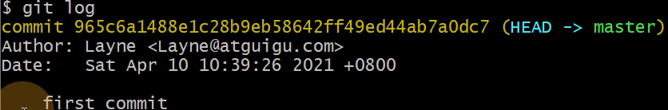

日志信息表明：完整版本号、作者、日期、提交日志信息。

## 3.6、修改文件并二次提交本地库（vim编辑器）

使用vim编辑器修改文件、再提交暂存区、提交本地库。 


 查看引用日志信息：

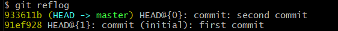

发现指针指向第二次提交版本。 


## 3.7、历史版本

### 3.7.1、查看历史版本

**基本语法：**

```
git reflog #查看版本变更信息，能看到所有回退前后的版本号
```


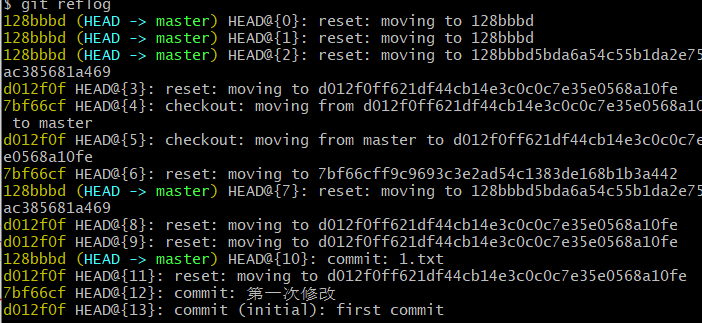

```
git log #查看版本详细信息，只能看到当前和以前的版本
```


 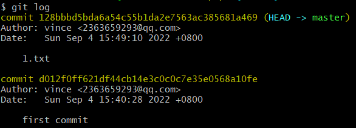


虽然版本很多，但是我们工作区的 hello.txt 始终只有一个文件存在


### 3.7.2、版本穿梭

语法：

```
git reset --hard 版本号    #这里版本号7位简短版和40位完整版都可以
```


版本穿梭后强制提交：

```
git push -f -u 别名 分支名
```


示例：


 此时文件内容展示的也是切换后版本内容：


## 3.8、切换版本原理

Git 切换版本，底层其实是移动的HEAD 指针，具体原理如下图所示

HEAD 指针指向 master 分支，master分支指向 first 版本，

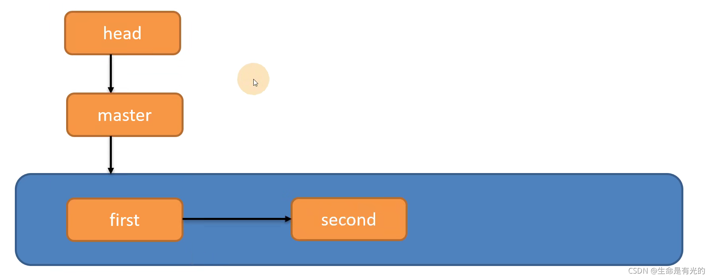

之后有了 second 版本，master 指针指向 second 版本


之后有了third 版本，master 指针指向 third 版本


如果我们想穿越回去，只需要让 master 指针指向 first 版本或者 second 版本

## 3.9、清除本地git缓存，解决push后子文件夹名带@+数字问题

**问题：** 

如果推送后出现子模块文件夹后面跟@+数字，那就是因为子**模块文件夹也有个.git。**

@后面的数字是[哈希](https://so.csdn.net/so/search?q=哈希&spm=1001.2101.3001.7020)值，用于确定唯一的提交状态。

文件push时会压缩，然后上传同时生成一串检验[字符串](https://so.csdn.net/so/search?q=字符串&spm=1001.2101.3001.7020)，@后面的数字就是检验字符串的前面部分。

**解决：**

在出问题子文件夹目录下删除.git文件，然后右键git bash，**清除本地git缓存：**

```bash
git rm -r --cached .
```


然后再add、commit、push就可以了。

# 4、Git分支

## 4.1、什么是分支

- 在版本控制过程中，同时推进多个任务，为每个任务，我们就可以创建每个任务的单独分支
- 使用分支意味着程序员可以把自己的工作从开发主线上分离开来，开发自己分支的时候，不会影响主线分支的运行
- 对于初学者而言，分支可以简单理解为副本，一个分支就是一个单独的副本

## 4.2、分支的好处

- **同时并行推进多个功能开发**，提高开发效率。
- 各个分支在开发过程中，如果某一个分支开发失败，不会对其他分支有任何影响。失败的分支删除重新开始即可。

## 4.3、分支的操作

| 命令名称            | 作用                         |
| ------------------- | ---------------------------- |
| git branch 分支名   | 创建分支                     |
| git branch -v       | 查看分支                     |
| git checkout 分支名 | 切换分支                     |
| git merge 分支名    | 把指定的分支合并到当前分支上 |

### 4.3.1、查看分支

基本语法：

```
git branch -v
```


### 4.3.2、创建分支

**基本语法：**

```
git branch 分支名
```


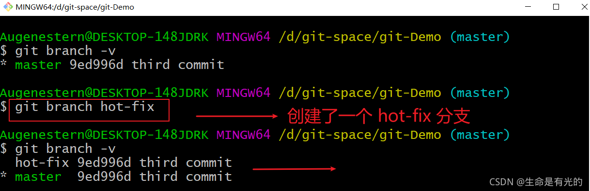

**创建并切换分支：**

```
git checkout -b <新分支名>
```


### 4.3.3、切换分支

基本语法:`git checkout 分支名`


### 4.3.4、修改分支

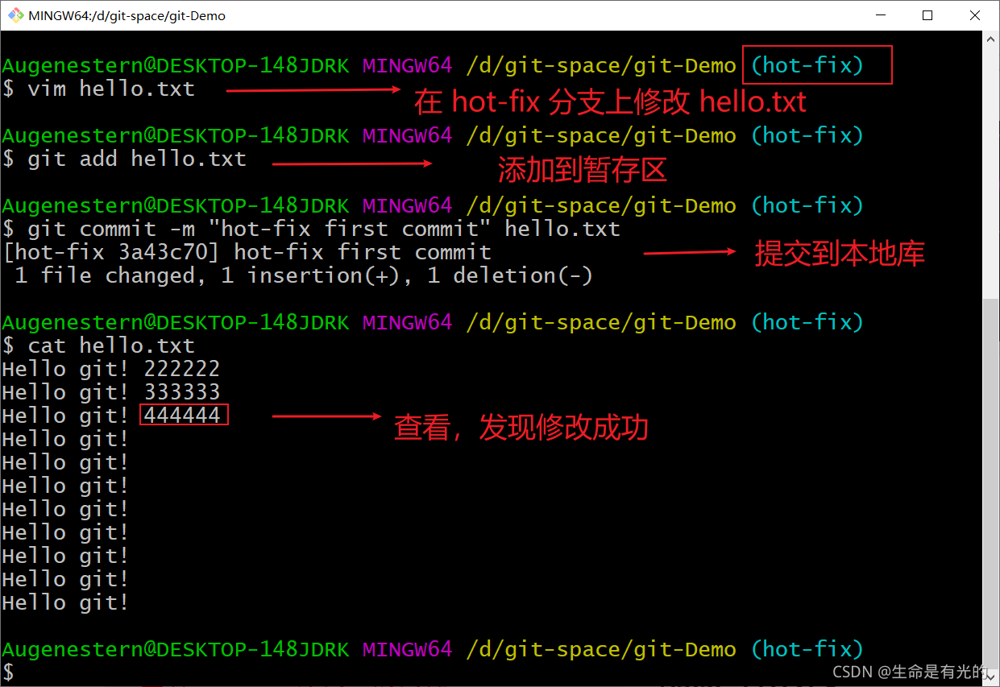

### 4.3.5、合并分支

**基本语法：**

```
git merge 分支名
```


> **注意：**
>
> - 合并次分支到主分支时，目前分支是主分支，git merge 次分支。 
> - 合并后主分支成为合并后的内容，而次分支不变。

①正常合并不冲突

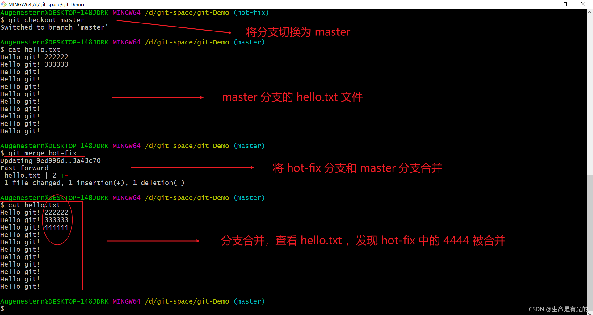

**②合并产生冲突**

冲突产生的原因：

- 合并分支时，两个分支在同一个文件的同一个位置有两套完全**不同的修改**。
- 有两套完全不同的修改。 Git无法替我们决定使用哪一个。必须 人为决定新代码内容。

例如，我们首先在 master 分支的倒数第二行进行修改，并将其添加到暂存区，再提交到本地库


接着，我们去 hot-fix 分支的倒数第一行进行修改，并将其添加到暂存区，再提交到本地库


之后我们在 master 分支上合并 hot-fix 分支，发现产生冲突


> **解决冲突**

1.**vim**编辑有冲突的文件，删除特殊符号，**决定要使用的内容**

特殊符号：`<<<<<< HEAD` 当前分支的代码 `=======` 合并过来的代码 `>>>>>>>hot-fix`

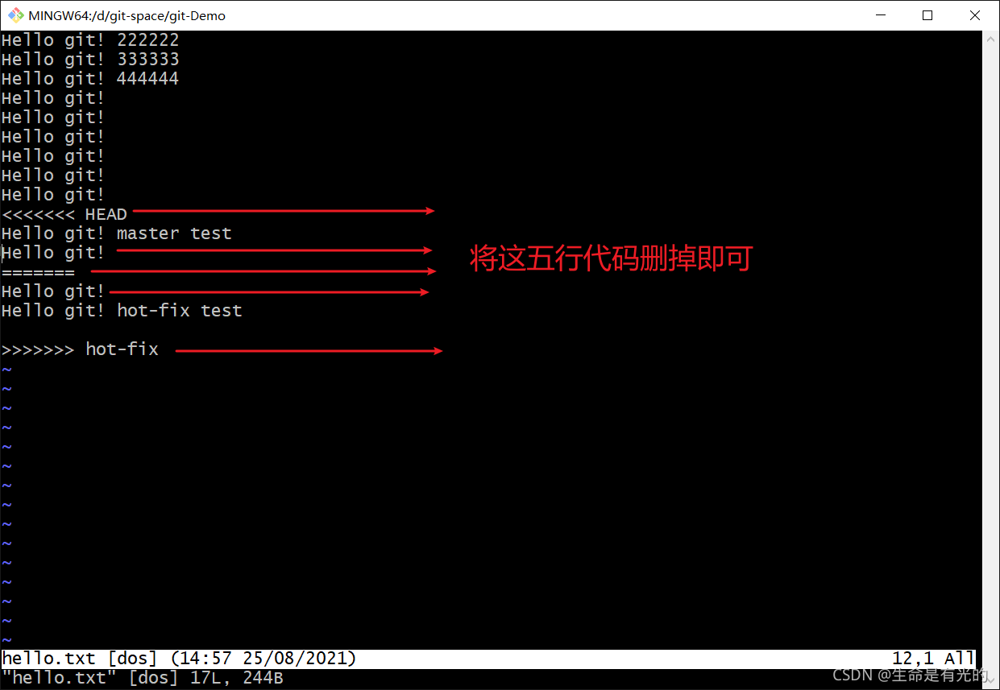


2.删除完成之后保存，再次添加到暂存区，并**再次提交到本地库**

(**注意：**此时使用 git commit 命令时候**不能带文件名**，否则会报错)


## 4.4、创建分支和切换分支原理

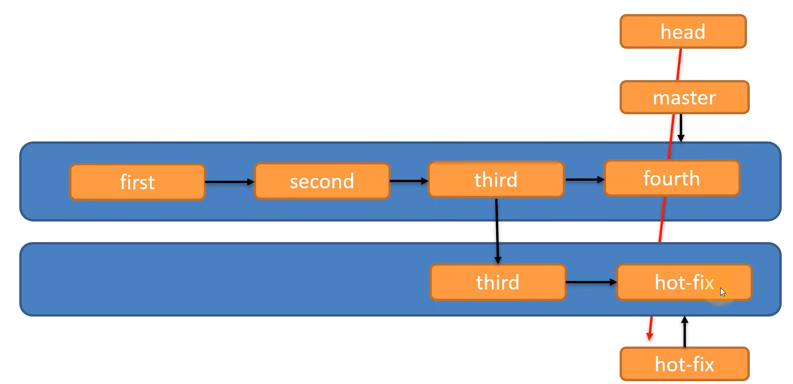

master、hot-fix 其实都是指向具体版本记录的指针。当前所在的分支，其实是由 HEAD 决定的。所以创建分支的本质就是多创建一个指针。

- HEAD 如果指向 master，那么我们现在就在 master 分支上。
- HEAD 如果执行 hotfix，那么我们现在就在 hotfix 分支上。 

所以切换分支的本质就是移动 HEAD 指针。

## 4.5 git clone(克隆)与 git pull（拉取) 

**git clone(克隆):**从远程获取代码并合并本地的版本。

是在本地没有版本库的时候,从远程服务器克隆整个版本库到本地,是一个本地从无到有的过程。**git pull** 其实就是 git fetch 和 git merge FETCH_HEAD 的简写。

```bash
git clone -b [分支名] [远程仓库地址]
```


**git pull（拉取) :**在本地有版本库的情况下,从远程库获取最新 commit数据(如果有的话),并 merge(合并)到本地。 建议在每次push前先pull更新代码。

```bash
#合并本分支的版本：
#git pull <远程主机名> <本地分支名>
#远程分支是与当前分支合并merge
git pull origin master


#合并分支
#git pull <远程主机名> <远程分支名>:<本地分支名>
#将远程主机 origin 的 master 分支拉取过来，与本地的 brantest 分支合并。
#git pull origin master:brantest
```


> **如果有冲突：**
>
> 下面是远程库被其他人提交过，本地提前前需要处理冲突的场景：
>
> 
>
>  删掉<<和==、版本号符号，然后再添加暂存区、提交本地库（这里就是合并的版本）、推送远程库。


# 5、Git团队协作机制

## 5.1、团队内协作


举个例子：岳不群首先用 git 初始化自己的本地库，写了一套华山剑法，利用
 push 命令将自己的本地库推送到代码托管中心(Github、Gitee)，大弟子令狐
 冲通过 clone 克隆命令完整的复制到自己的本地库，令狐冲修改两招之后将
 自己的本地库再次 push 到代码托管中心，这样岳不群就可以通过 pull 命令
 拉取令狐冲修改的代码 来更新自己的本地库。

## 5.2、跨团队协作

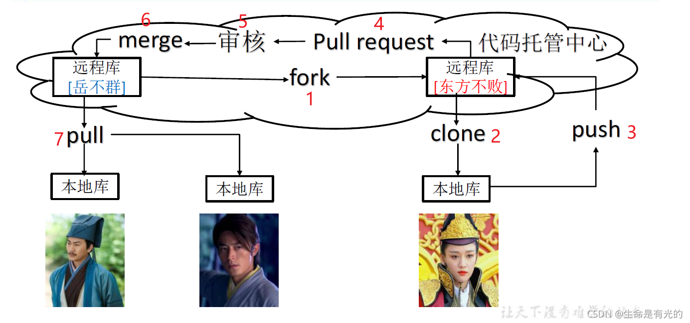

令狐冲请东方不败改代码，东方不败通过 fork 命令从岳不群的的远程库中拿取代码，再通过 clone 克隆命令到自己的本地库，修改完成后使用 push 推送到在自己的远程库，使用 Pull request 拉取请求给岳不群，岳不群审核完成后使用 merge 命令合并对方的代码到自己的远程库中，再通过 pull 命令到自己的本地库中，这样修改过后的华山剑法岳不群和令狐冲就都可以使用了。

# 6、Github和Gitee

## 6.1、创建远程仓库

### 6.1.1、Github远程仓库

repository译为仓库，资源库。


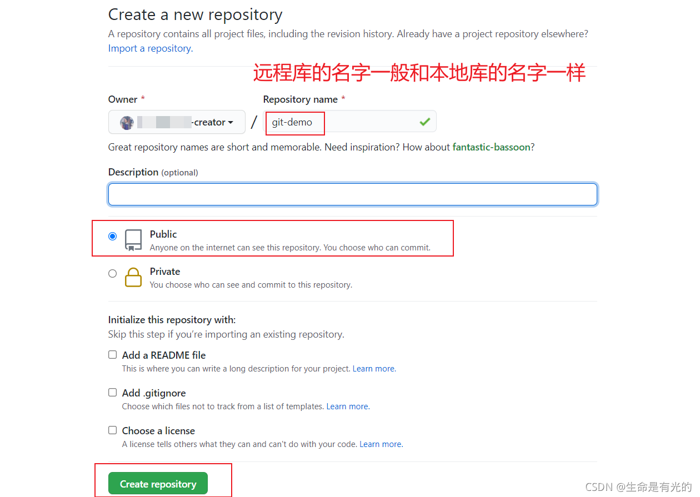

### 6.1.2、Gitee远程仓库

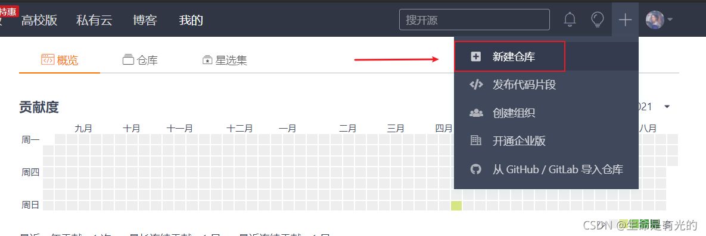


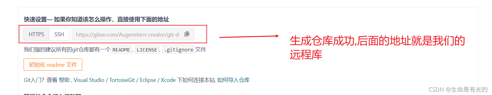

## 6.2、远程仓库操作

| 命令名称                               | 作用                                                         |
| -------------------------------------- | ------------------------------------------------------------ |
| git remote -v                          | 查看当前所有远程地址别名                                     |
| git remote add 别名 远程地址           | 起别名                                                       |
| **git push 别名 分支**                 | **推送本地分支上的内容克隆到本地**                           |
| **git clone 远程地址**                 | **将远程仓库的内容克隆到本地**                               |
| **git pull 远程库地址别名 远程分支名** | **将远程仓库对于分支最新内容拉下来后与当前本地分支直接合并** |

### 6.2.1、创建远程仓库别名

创建远程仓库是为了在push和pull时候，可以直接用别名拉取，不用输入很长的一段链接地址。

**建议别名和库名一致**。

**①、Gihub**

**基本语法：**

```
git remote -v                               查看当前所有远程地址别名
git remote add 别名 远程地址                 起别名
```


> 删除远程库别名：
>
> ```
> git remote remove 远程库别名
> ```
>
> 
>
> 修改远程库别名：
>
> ```
> git remote set-url origin https://github.com/username/reponame.git
> ```
>
> 

**示例：** 


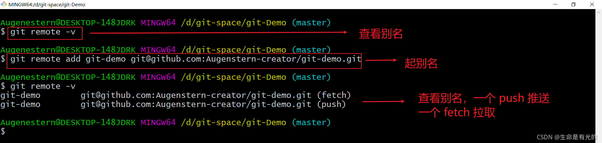

fetch译为拉取，拿来。代表pull和clone。

注意：起的别名最好和本地库的名称一致

**②、Gitee**

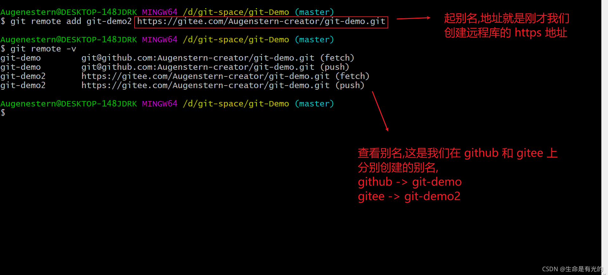

### 6.2.2、推送本地分支到远程仓库

**基本语法：**

```
git push 别名 分支
```


> **强制提交：**
>
> ```
> git push -f -u 远程名/别名 分支名
> ```
>
> 

**报错尝试：**由https换成ssh连接。

**解决方法：**

 


### 6.2.3、拉取远程库分支到本地库

**使用情况：** 

手动在GitHub修改了代码，或者由其他成员在GitHub更新了项目，此时需要拉取远程库到本地库。

**语法：**

```bash
git pull 别名 分支
```


我们在远程库进行 hello.txt 的文件修改

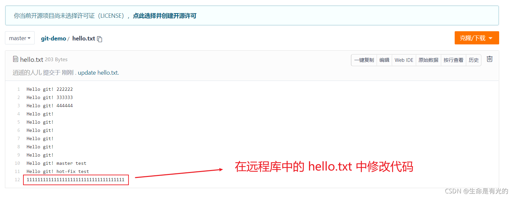

然后在本地库将远程库的代码 拉取


### 6.2.3、克隆远程仓库到本地

基本语法：

```
git clone 远程地址
```


我们另一台用户需要克隆我们的远程仓库到他的本地库，由于是使用一台电脑模拟，所以在克隆之前需要在 凭据管理器下删除我们之前的凭据


我们新建一个文件夹 git-clone，然后在此文件夹下右键 git bash here，之后进行克隆


 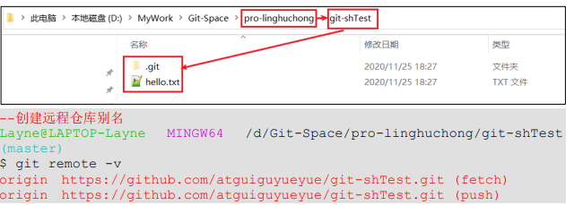

> 克隆会自动初始化本地仓库，并起别名为**origin**。 


## 6.3、邀请加入团队

### 6.3.1、Gitee

我们在 git-clone(假设这是大弟子令狐冲) 文件夹里面进行代码修改，修改完后添加到暂存区，再提交到本地库，之后 push 到我们的远程库

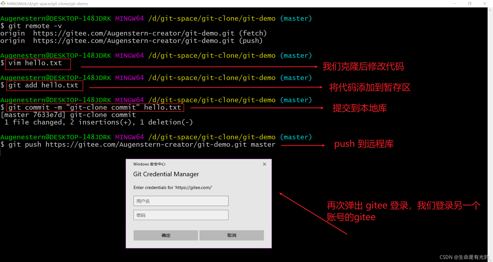


我们在 git-demo 仓库点击管理 -> 仓库成员管理 -> 添加仓库成员 -> 邀请用户


我们在第二哥 gitee 账号里面可以接收到如下图：

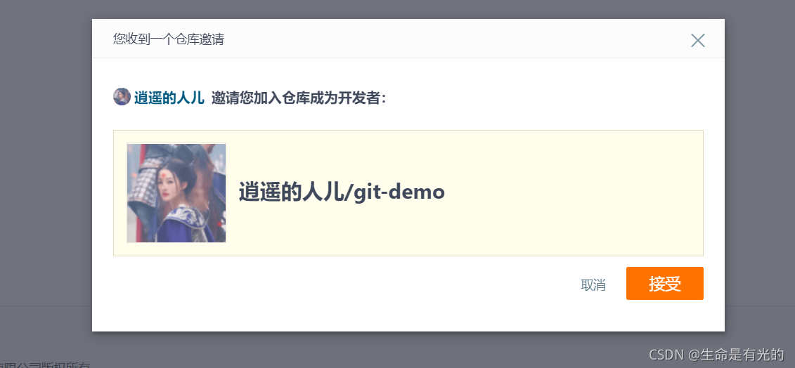

令狐成成为仓库开发者被拉入团队后，我们再次在令狐冲文件夹使用进行 push

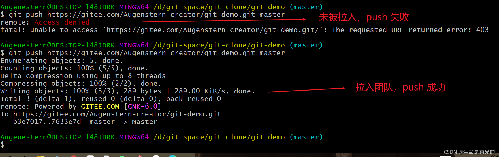

push 到远程库成功，我们在远程库查看

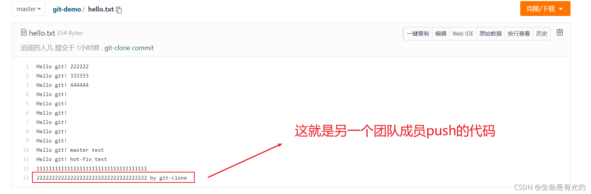

### 6.3.2、Github

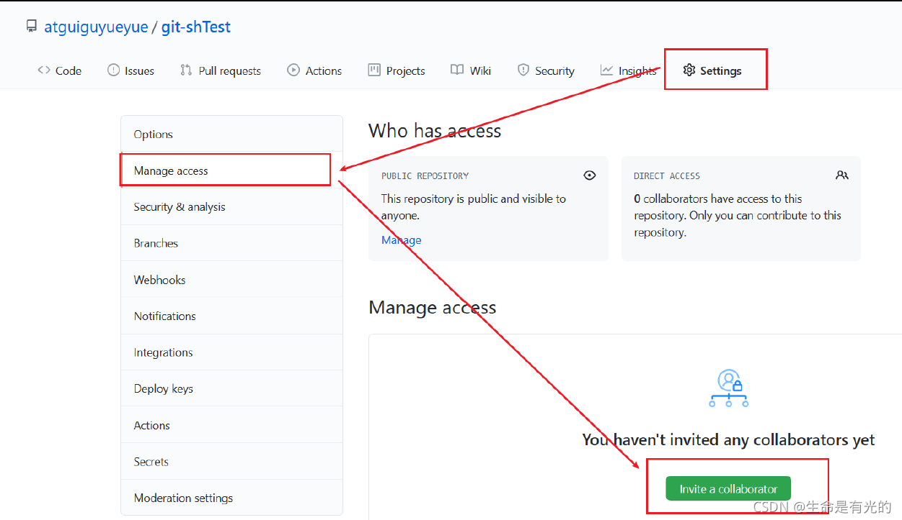

填入想要合作的人


复制邀请地址并发给该用户


在 atguigulinghuchong这个账号中的地址栏复制收到邀请的链接 ，点击接受邀请。

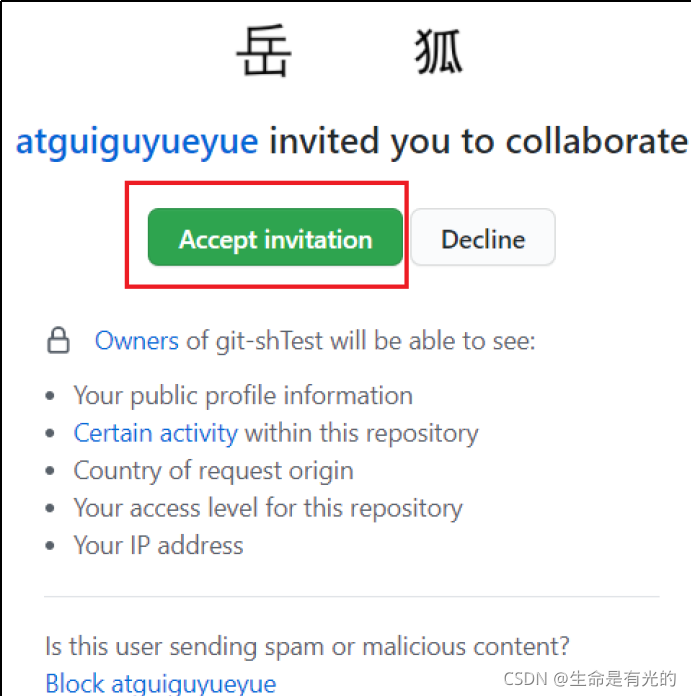


## 6.4、跨团队协作

### 6.4.1、Gitee

将远程仓库的地址复制发给邀请跨团队协作的人，比如东方不败。

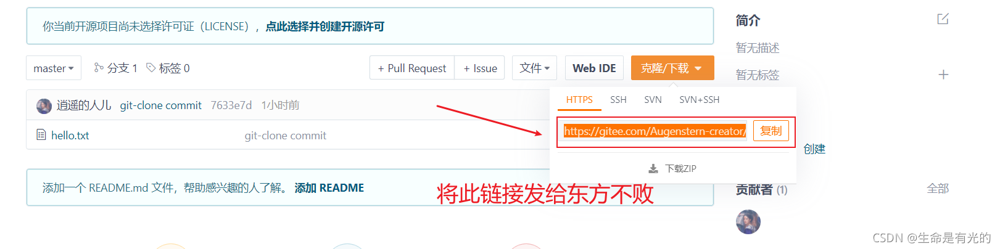

在东方不败的 Gitee账号里的地址栏复制收到的链接，然后点击 Fork将项目叉到自己的本地仓库


接下来点击上方的 Pull Requests 请求，并创建一个新的请求 。

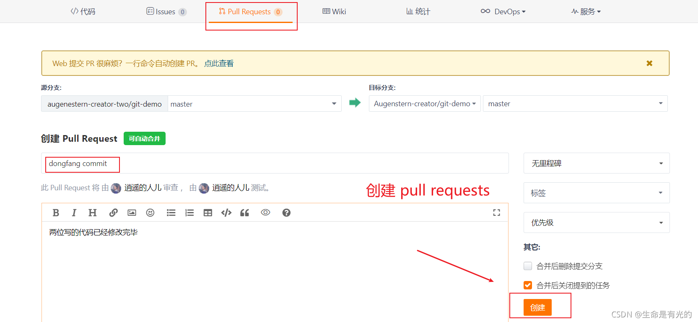

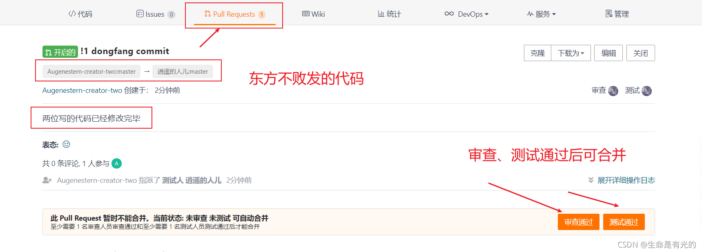

合并之后我们在岳不群的 git-demo 下就可以看到东方不败的代码


### 6.4.2、Github

将远程仓库的地址复制发给邀请跨团队协作的人，比如东方不败。


在东方不败的 GitHub账号里的地址栏复制收到的链接，然后点击 Fork将项目叉到自己的本地仓库

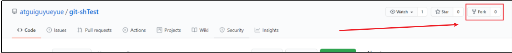

东方不败就可以在线编辑叉取过来的文件。编辑完毕后，填写描述信息并点击左下角绿色按钮提交。


## 6.5、SSH免密登录

### 6.5.0、基本介绍

**问题1：为什么要SSH登录？**

如果没有配置过SSH免密登录，clone、push时候依然可以用正常的HTTPS，只是每次需要账号密码登录一下。

使用免密登录后，你可以在本地直接使用ssh链接clone、push，而不需要再登录。

> **SSH协议：**
>
> （Secure Shell）是一种用于远程登录和其他网络服务的安全协议。它通过加密通信来确保数据传输的安全性和保密性。
>
> **主要作用：**
>
> - **远程命令执行**：用户可以通过SSH在远程服务器上执行命令，就像在本地机器上一样。例如我们有云服务器时，可以用finalshell进行远程连接，这就是SSH协议的应用内；
> - **认证**：SSH支持多种认证方式，包括密码、公共密钥和双因素认证，确保只有授权用户才能访问系统。在我们Git远程协作时，就是基于SSH协议，在本地生成一个公钥，配置到GitHub、Gitee、GitLab上，从而支持**免密登录**这几个网站。
> - **文件传输**：SSH协议支持安全的文件传输

**问题2：怎么判断自己有没有配置过SSH免密登录？**

**方法1：**如果克隆时提示“You don't have any public SSH keys in your GitHub account. You can add a new public key, or try cloning this repository via HTTPS.”，则没有免密登录过：

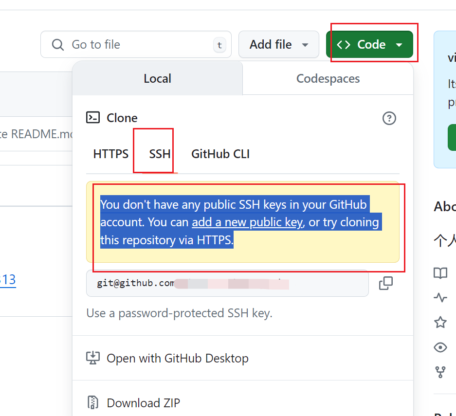

**方法2：**进入设置，如果没有密钥，则是没添加过：


如果SSH keys有密钥了，则是已经添加过了。

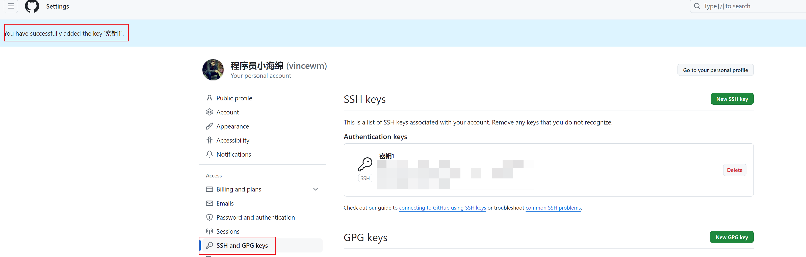


### 6.5.1、Gitee

在 C盘 User 自己的账户下右键 git bash here，`ssh-keygen -t rsa -C 自己的邮箱签名`


这样就会生成 .ssh 文件夹，里面有私钥和公钥


之后在 gitee 上添加公钥

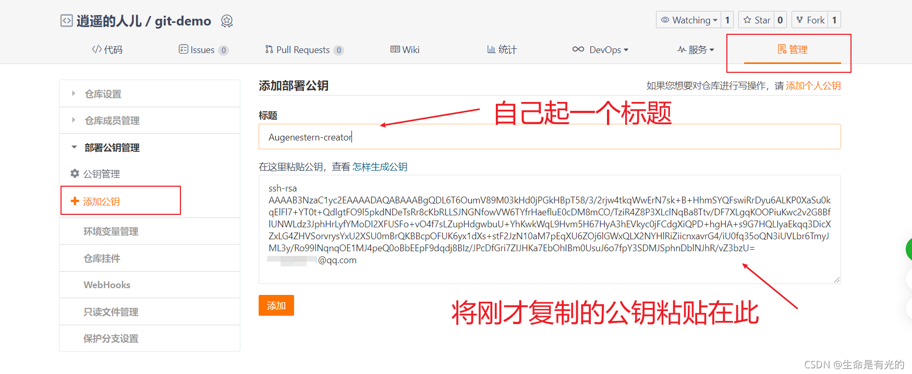

这样我们可以借助 ssh 链接来拉取和推送代码，并且不需要进行登录

### 6.5.2、Github

> **为什么要SSH登录？**
>
> 如果没有配置过SSH免密登录，clone、push时候依然可以用正常的HTTPS，只是每次需要账号密码登录一下。
>
> 使用免密登录后，你可以在本地直接使用ssh链接clone、push，而不需要再登录。
>
> **怎么判断自己有没有配置过SSH免密登录？**
>
> 方法1：如果克隆时提示“You don't have any public SSH keys in your GitHub account. You can add a new public key, or try cloning this repository via HTTPS.”，则没有免密登录过：
>
> 
>
> **方法2：**进入设置，如果没有密钥，则是没添加过：
>
> 
>
> 如果SSH keys有密钥了，则是已经添加过了。
>
> 

**1.本地生成密钥**

打开本地文件夹，在“C/Users/你电脑用户名”处git-bash，输入下面代码后三次回车

```
ssh-keygen -t rsa -C 自己的邮箱签名
```


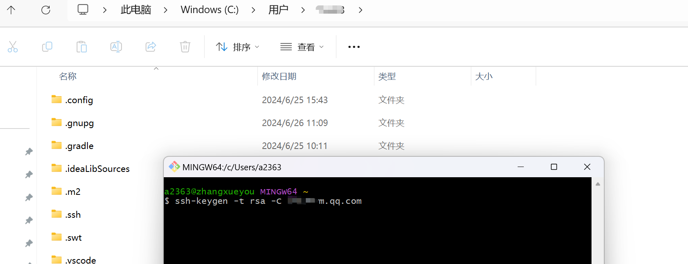

> 如果提示“Enter file in which to save the key” ，则代表你本地已经生成过了，直接关闭git窗口即可。

此时该路径已经生成了.ssh文件夹


**2.复制公钥**

打开id_rsa.pub，即公钥，然后复制：

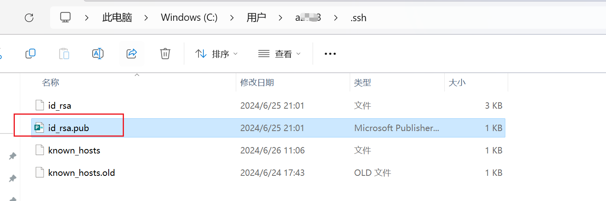

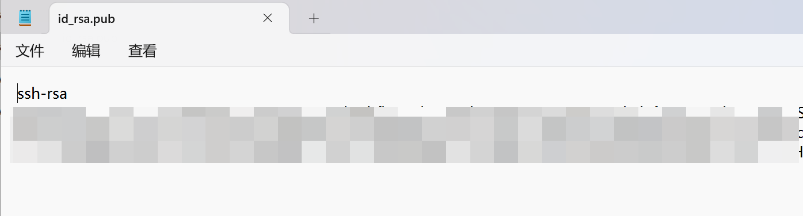

**3.粘贴到GitHub**


添加公钥成功状态：


> 4.修改已拉过项目的url
>
> 因为在配置ssh之前，我们都是通过HTTPS克隆的代码，所以需要把这些ur改一下。
>
> 进入项目目录的.git文件夹，修改config里url为ssh链接，相当于替换了起别名的链接，以后就可以通过别名＋ssh提交了：
>
> 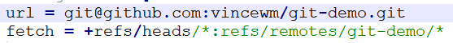
>
>  
>
> 5.其他电脑想再添加SSH免密登录，还是按上面操作做就行了，生成SSH、添加到GitHub。

# 7、【重要】IDEA集成Git

## 7.1、配置Git忽略文件

我们的[Eclipse](https://so.csdn.net/so/search?q=Eclipse&spm=1001.2101.3001.7020) 、IDEA都会生成一些无关文件需要忽略，如图

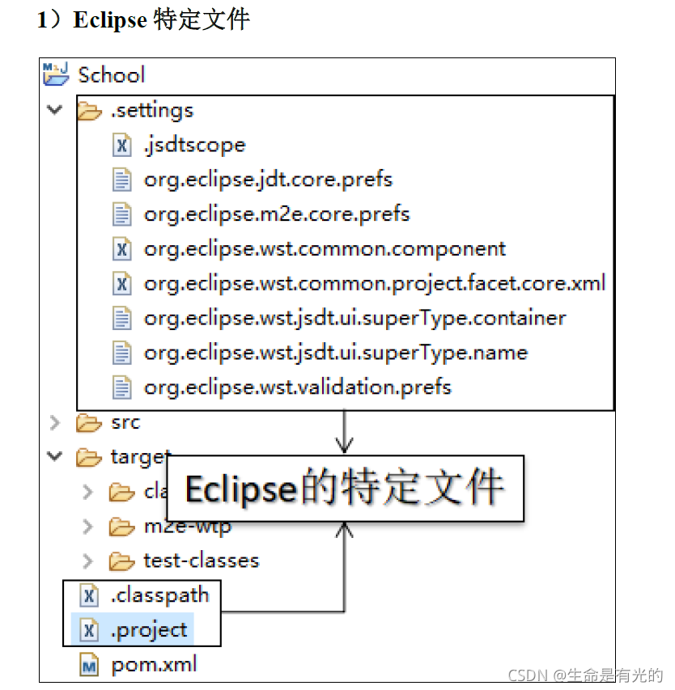

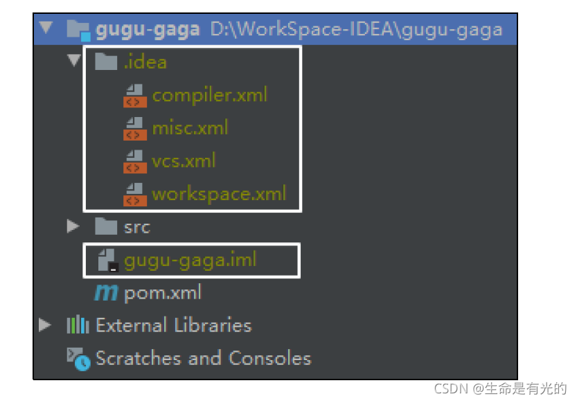

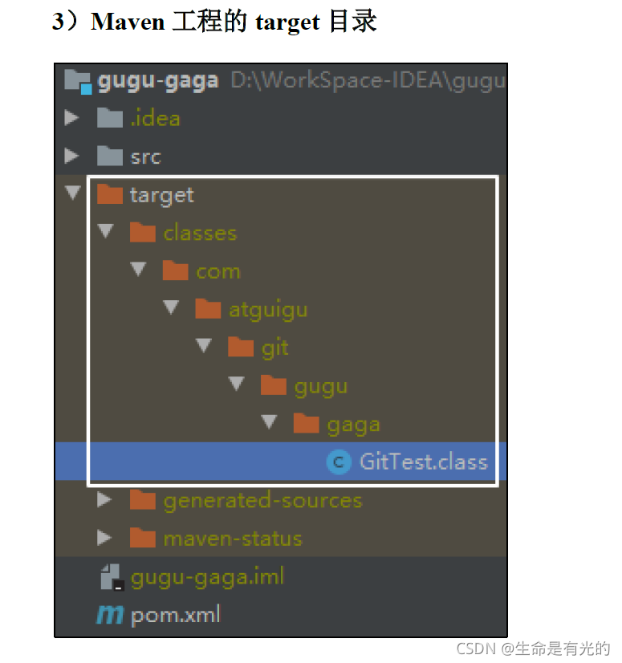

我们之所以要忽略他们，是因为他们**与项目的实际功能无关**，不参与服务器上部署运行。

**忽略无关文件方法：**

1.在用户家目录(C/User/用户名) 下创建 `git.ignore`

```bash
# Compiled class file
*.class

# Log file
*.log

# BlueJ files
*.ctxt

# Mobile Tools for Java (J2ME)
.mtj.tmp/# Package Files #
*.jar
*.war
*.nar
*.ear
*.zip
*.tar.gz
*.rar

hs_err_pid*

.classpath
.project
.settings
target
.idea
*.iml
```


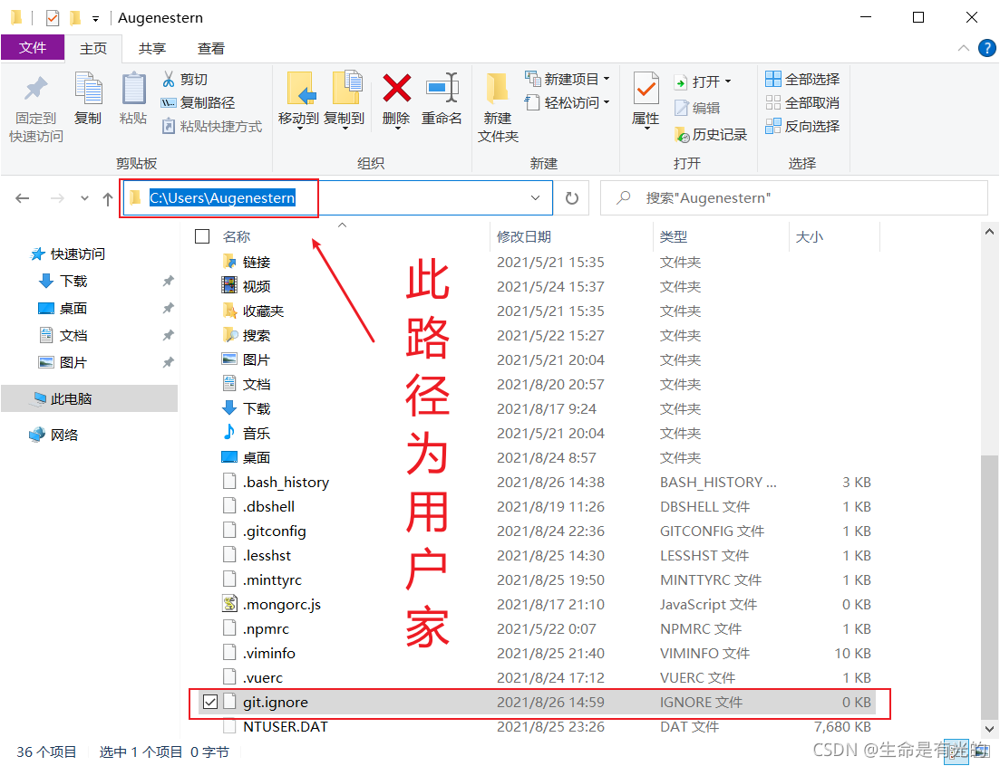

2.在 .gitconfig 文件中引用忽略配置文件(.gitconfig 在家目录中，在上面3.1设置用户签名时创建的)

**注意：【user】是自己的签名，用于区分上传者身份，跟github账号名无关。core修改成自己的电脑用户名，要用正斜杠。**

```
[user]
    name = Augenestern
    email = .....@qq.com
[core]
    excludesfile = C:/Users/Augenestern/git.ignore
```


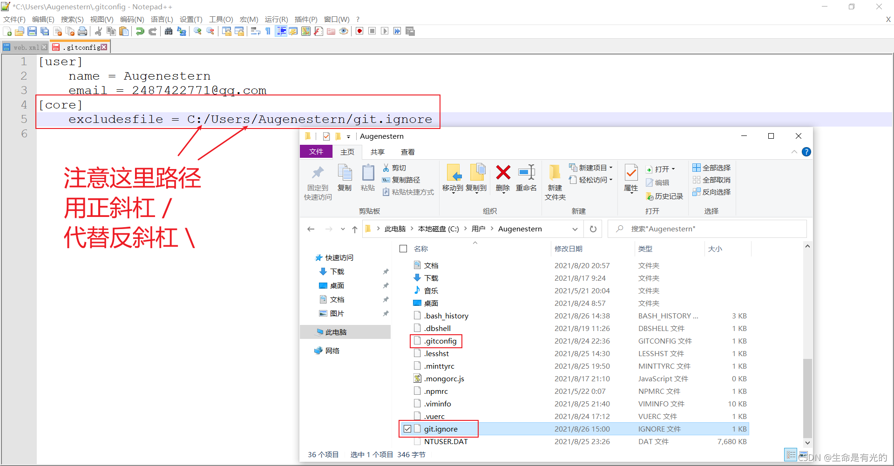

3.在 IDEA 里面定位

**注意先关闭项目再设置，否则是仅此项目内有效。**

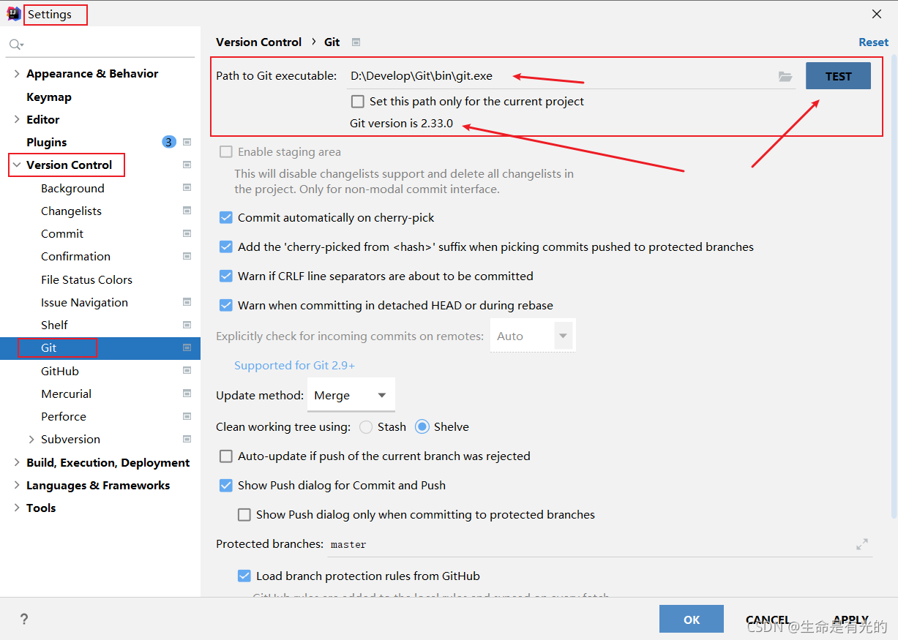

## 7.1.5 关闭代码检查

**如果有需要的话，在设置里取消检查**（如果需要全局设置请关闭项目再设置，然后再项目内设置）：

例如我提交项目时候发现前端页面有报错和todo，但我想忽略它们，可以这样设置。

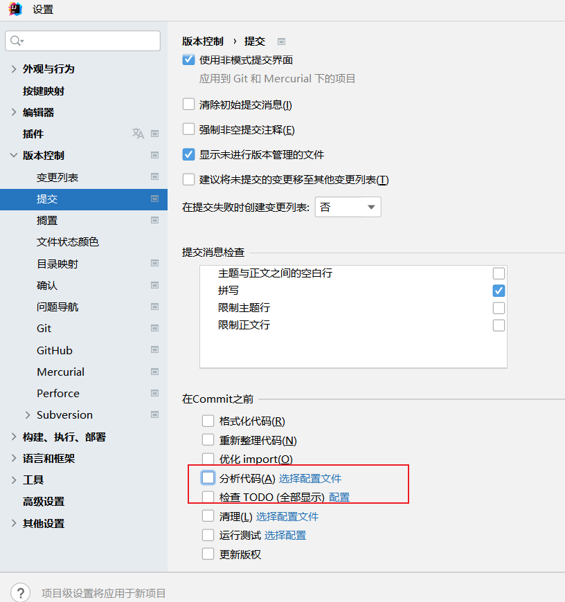


## 7.2、IDEA初始化本地库

1.创建git本地库。vcs就是版本控制工具的缩写。 

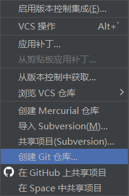

可以看到项目根目录下多了.git隐藏目录，idea很多文件变红（变红就是未被追踪，即只存在于工作区），说明git已接管了本目录：

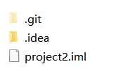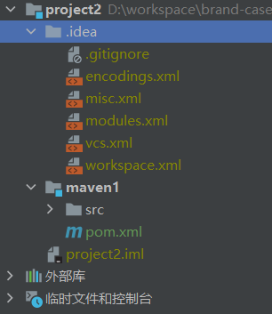

 **2.添加项目到暂存区**


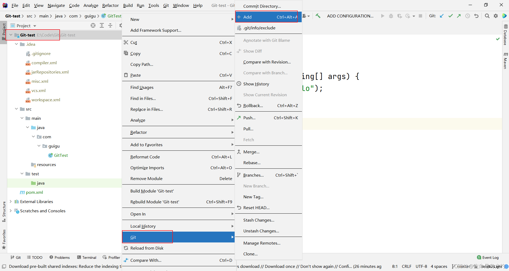

**3.提交到本地库**

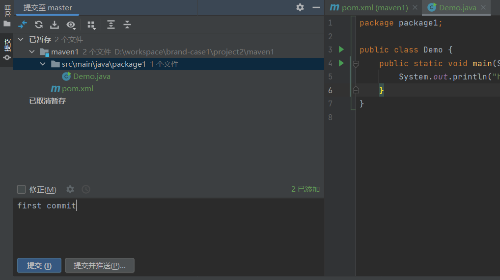

提交后类和pom.xml边黑色，代表此时本地库状态是干净的，不需要再提交了：


修改一下代码，就又变蓝了，说明文件被git追踪过（添加到过暂存区）、又被修改了：


## 7.3、切换版本

> 切换版本后正常push会失败，要**强制提交：**
>
> ```
> git push -f -u 远程名/别名 分支名
> ```
>
> 
>
> 只要不删除.git文件夹，不管怎么穿梭版本，版本都能git reflog看到。

**1.提交版本2到本地库**。我们修改 GitTest 中的代码，文件变蓝文件被git追踪过（添加到过暂存区），再次提交到本地库

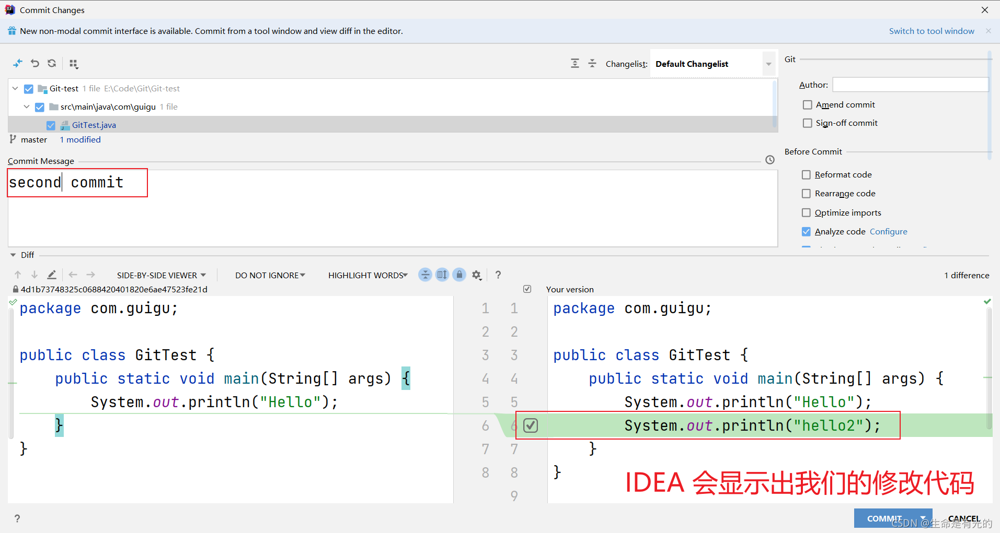

**2.查看当前版本。**点击左下角git。

 

如图，**黄色指针代表head指针（当前版本），绿色指针是当前分支指针（当前分支最新版本）**。

**3.切换版本**

**方式一：签出版本。此时黄色head指针移到目标版本，绿色分支指针留在原版本，不能push，不能强制push，实际文件还是原版本**。

在IDEA的左下角，点击 Git，然后点击 Log查看版本，右键选择要切换的版本，然后在菜单里点击 Checkout Revision，译作签出版本。**此时推送会提示游离的head。**


**方式二：重置版本。此时黄绿指针同时指向目标版本，可以强制push**

> 重置版本前如果黄绿指针不重合，则会只移动黄head指针，push会失败。只有黄绿重合时才能push。

 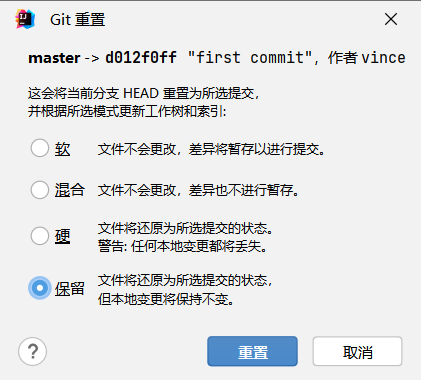

> 例如：1.0.0版本“1.txt”内容是“1.0.0”；1.0.1版本内容是“1.0.1”；修改1.0.1版本后未提交的内容是“1.0.2”。现在要回退到1.0.0版本：
>
> - **软：**文件不会更改，差异将暂存以进行提交。回退到1.0.0，并展示暂存未提交的“1.0.2”；
> - **混合（默认）：**文件不会更改，差异也不进行暂存。回退到1.0.0，并展示未暂存的“1.0.2”；
> - **硬：**文件将还原为所选提交的状态，任何本地变更都将丢失。回退到1.0.0，并展示1.0.0版本的“1.0.0”；
> - **保留：**文件将还原为所选提交的状态但本地变更将保持不变。回退到1.0.0，并展示未提交的“1.0.2”； 
>
> **注意：**如果黄（HEAD，指向当前版本）绿（指向分支最新版本）指针不在一起，回退版本将失败。
>
> 

**重置版本后找回：**

回退版本也可以选择重置，从版本2重置到版本1后，版本2就看不到了，但其实还是可以从命令行git reflog找到对应版本号，通过git reset --hard 版本号，回到版本2的。


## 7.4、创建分支


或者右下角


或者


**填写分支名称**（签出译作checkout，切换分支）：


然后再 IDEA的右下角看到 hot-fix，说明分支创建成功，并且当前已经切换成 hot-fix分
 支

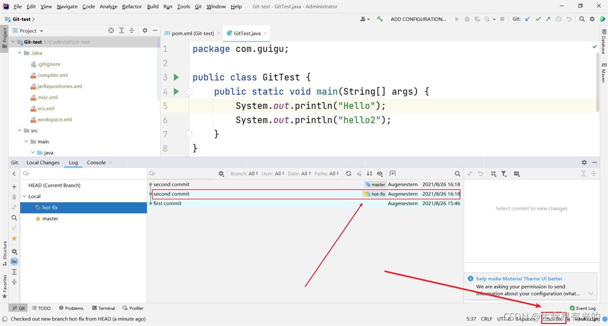

## 7.5、切换分支

### 7.5.1、概述

在IDEA窗口的右下角，切换到 master分支 。


### 7.5.2、切换分支导致代码丢失问题 

在修改文件、暂存未提交时，后切换分支会提示冲突，这时可以选择三种签出方案：

- Force Checkout（强制签出，直接覆盖掉你修改的代码）
- Smart Checkout（智能签出，会弹出框，让你合并代码）
- Don't Checkout（不签出，取消的意思）

建议要么取消暂存，要么提交，然后再切换分支。

如果选择了强制签出，这时再切换回来，会导致修改的文件恢复未修改时的样子，也就是丢失代码了，找回方法是项目右键，查看历史记录，在历史记录里找版本进行恢复。


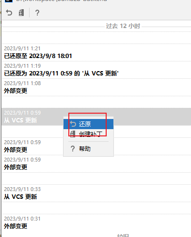

## 7.6、合并分支

**合并hot-fix到master。**先checkout签出到master分支，然后 在IDEA窗口的右下角，将 hot-fix分支合并到当前 master分支。


如果代码没有冲突，分支直接合并成功，分支合并成功以后，代码自动提交，无需手动提交本地库

## 7.7、合并分支冲突

**合并分支冲突出现情况：** 

如图所示，如果master分支和 hot-fix分支都修改了代码，在合并分支的时候就会发生冲突。

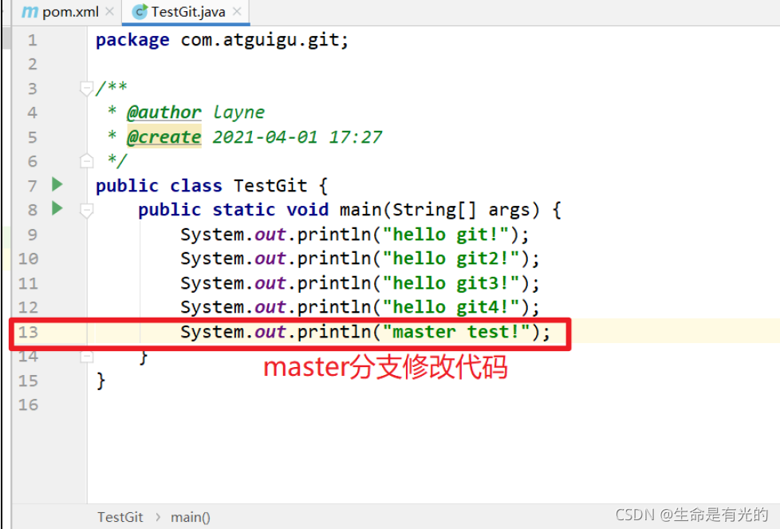


 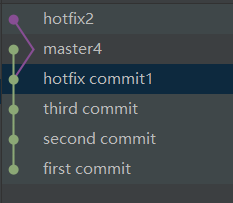


我们现在站在master分支上合并 hot-fix分支，就会发生代码冲突。


**合并代码冲突：**

可以分别选择接收master分支和hotfix分支的变更。这里我们点击 Conflicts框里的 Merge按钮，进行手动合并代码：

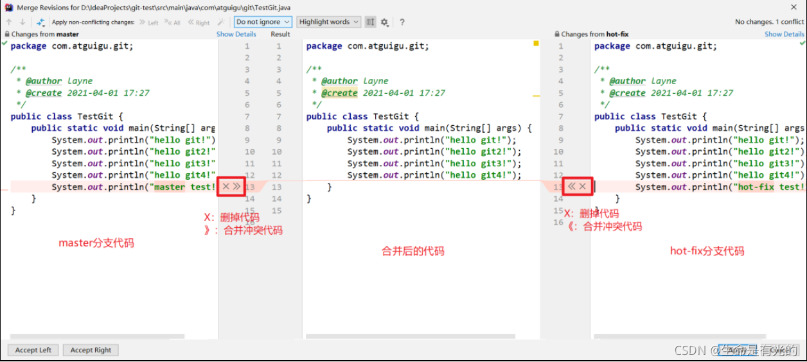

手动合并完代码以后，点击右下角的 Apply按钮。代码冲突解决，自动提交本地库，文件颜色变正常：


# 8、IDEA集成Github

**密码登录：** 

idea账号有登录的话，选择账号密码登录会跳转到浏览器，授权git登录输入密码即可登录成功。

**token（令牌）登录** 


**注意：一定要点击左下角，使用ssh克隆git仓库，否则上传GitHub时会报错：**


Token在哪呢？我们在 Github 点击 Settings -> Develop Settings，重新输入密码：

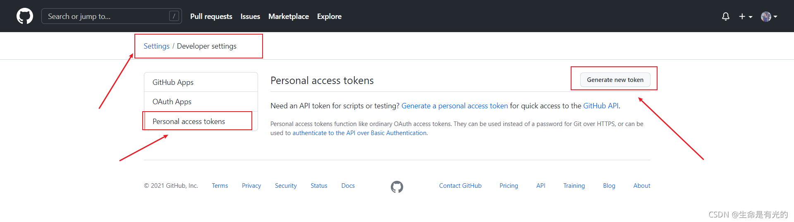

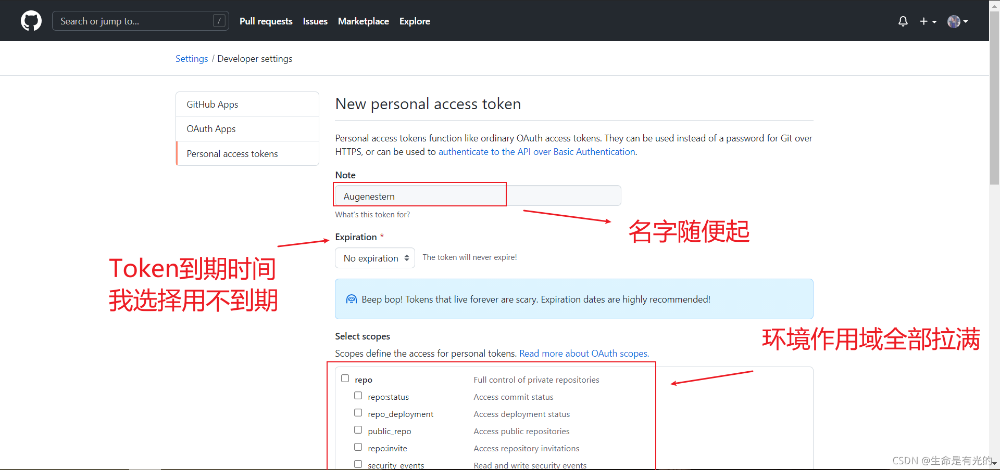

点击 Generate token，口令只显示一次，刷新就没了，最好将token复制到记事本：


## 8.1、分享项目到Github

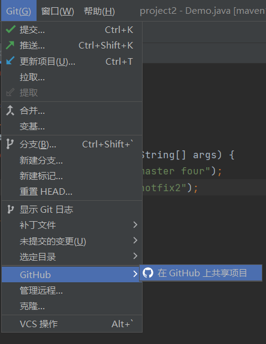


这其实就是创建远程库，remote远程即别名，是否私有，描述等


## 8.2、push推送本地库到远程库

**1.提交本地库。**首先修改项目，提交暂存区、提交本地库 

**2.push。**

方法一：点击导航栏git-推送push：


方法二：右键点击项目，可以将当前分支的内容 push 到 GitHub的远程仓库中 。

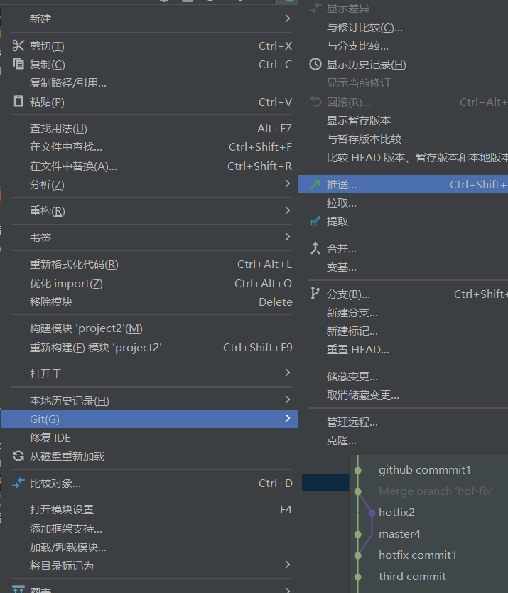

**3.自定义远程为ssh链接。**因为https链接没有ssh快。点击远程remote，点击自定义远程，远程就是别名，填入GitHub项目的ssh链接：

> 如果之前有勾选使用ssh克隆git仓库可不用这一步：
>
> 

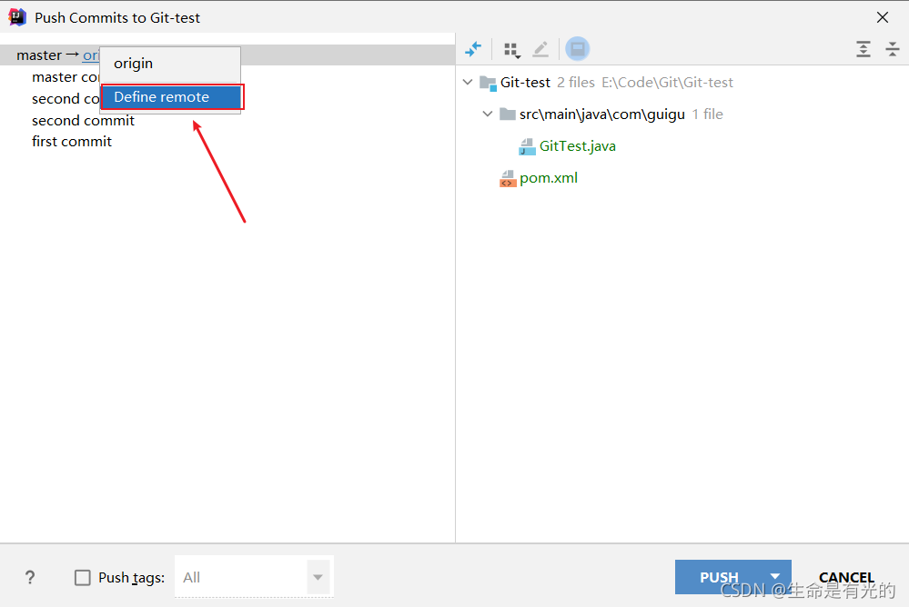

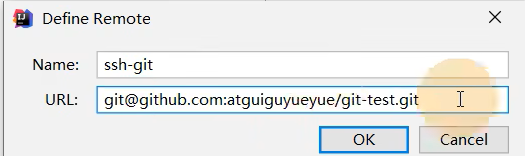

如果远程设置错误，可以管理远程，重定义：

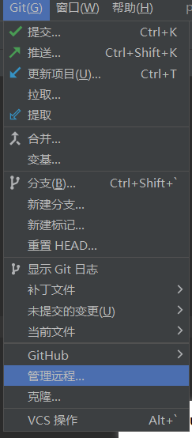


## 8.3、pull拉取远程库到本地库

### 8.3.1、拉取的实现步骤

> **注意：**
>
> push是将本地库代码推送到远程库，如果本地库代码跟远程库代码版本不一致，push的操作是会被拒绝的。也就是说， 要想 push成功，一定要保证本地库的版本要比远程库的版本高（可能其他成员已经提交了新版本，如果低于远程库就要检查加拉取）！
>
> 因此一个成熟的程序员在动手改本地代码之前，一定会**先检查下远程库跟本地代码的区别**！如果本地的代码版本已经落后，切记要先 pull拉取一下远程库的代码，将本地代码更新到最新以后，然后再修改，提交，推送！
>
> **好习惯：**
>
> 1.**在远程库版本高于本地库时候才需要拉取**
>
> 2.改本地代码前，先pull。push前，先pull，保证提交时没有冲突。
>
> 3.pull前，确保本地文件是正常色，没有修改。

- 先修改GitHub端项目里代码并在GitHub提交，使远程库版本高于本地库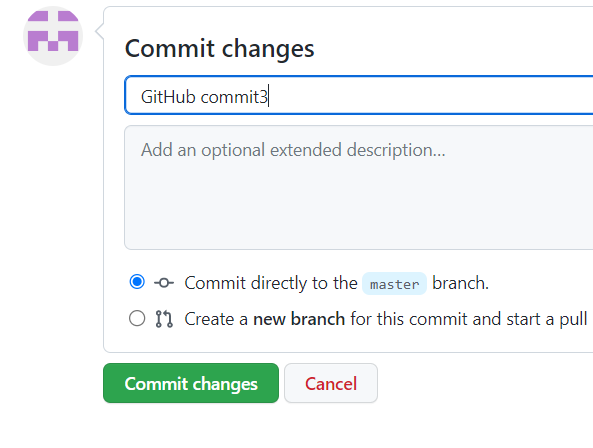
- 右键点击项目，可以将远程仓库的内容pull到本地仓库 。

 

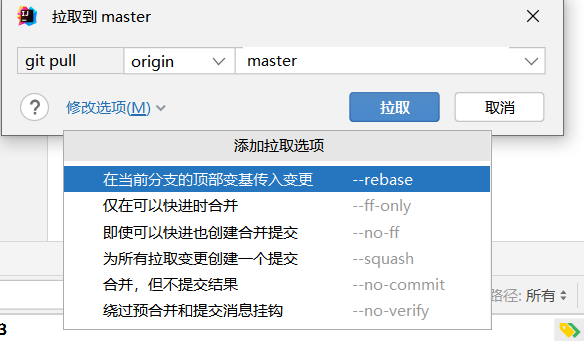


> **注意：**
>
> - pull是拉取远端仓库代码到本地，如果远程库代码和本地库代码不一致，会自动合并，如果自动合并失败，还会涉及到手动解决冲突的问题。

### 8.3.2、更新项目

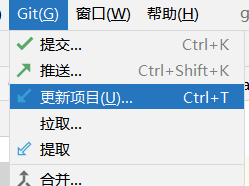

选择合并或变基： 

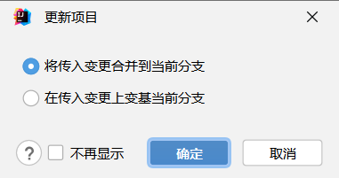

如果选择合并，则处理冲突：


选择性接收：

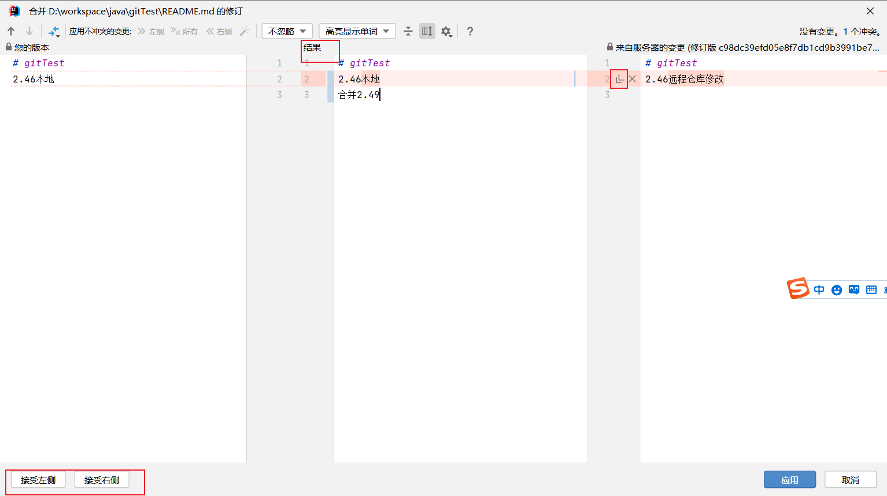


### 8.3.3、update和pull的区别

- git pul：git自带命令。相当于拉取+合并，即fetch+merge。
- git update：idea命令。相当于拉取+自己选择合并/变基，即fetch+merge/rebase

### 8.3.4、merge（推荐）和rebase的区别

**合并（推荐）：**将多个分支合并到一个新创建的提交中，该提交包含了两个分支的所有更改。

合并后分支图谱不好看，一堆线交错，但合并有冲突的话，只要解一次就行了

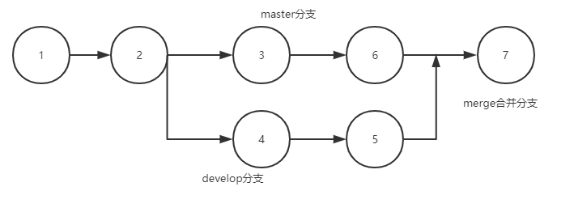


**变基：**将一系列的提交从一个分支应用到另一个分支上。

合并后分支图谱好看，一条线，但合并过程中出现冲突的话，比较麻烦（rebase过程中，一个commit出现冲突，下一个commit也极有可能出现冲突，一次rebase可能要解决多次冲突）；


### 8.3.5、拉取和克隆区别

**相同点：** 

git clone和git pull都是从远程服务器拉取代码到本地。

**不同点：** 

**git clone**是在**本地没有版本库**的情况下拉取，是一个本地从无到有的过程。

**git pull=git fetch + git merge**。每次从本地仓库push到远程仓库之前要先进行git pull操作，保证git push到远程仓库时没有版本冲突。

## 8.4、clone克隆远程库到本地库

1.先关闭当前项目，因为在没有项目的时候需要克隆。这里我直接把当前项目删除。

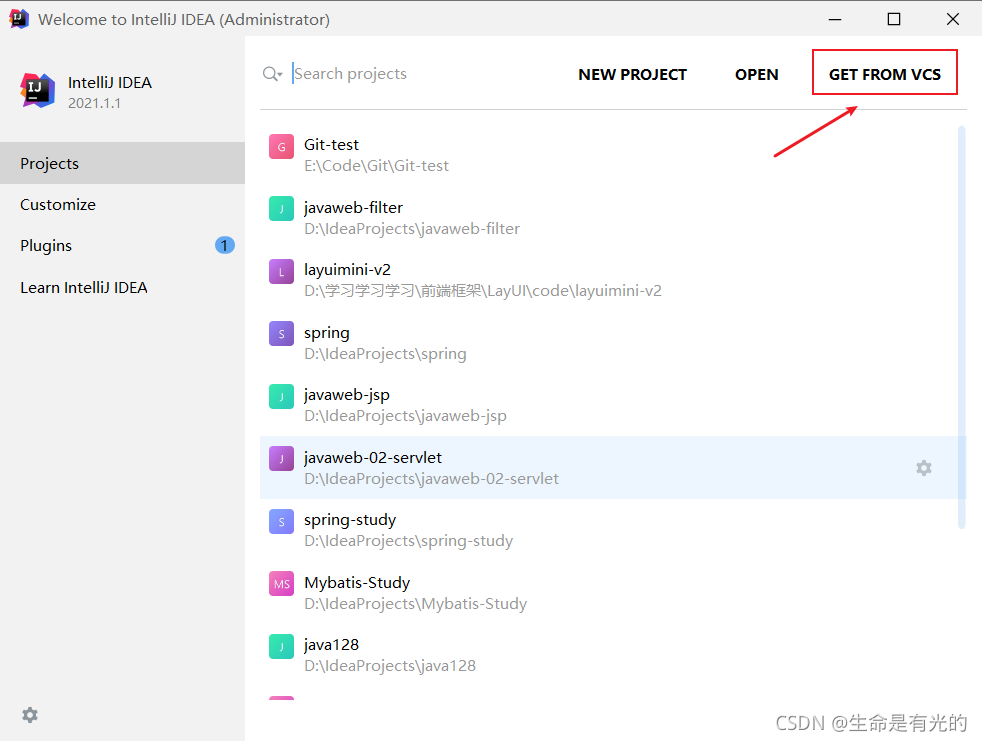

或者在另一个项目内点击git-clone

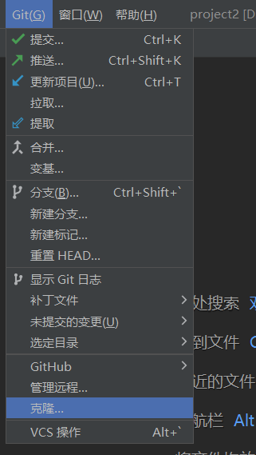


2.选择GitHub里项目登录，或者填写ssh链接，修改项目目录 

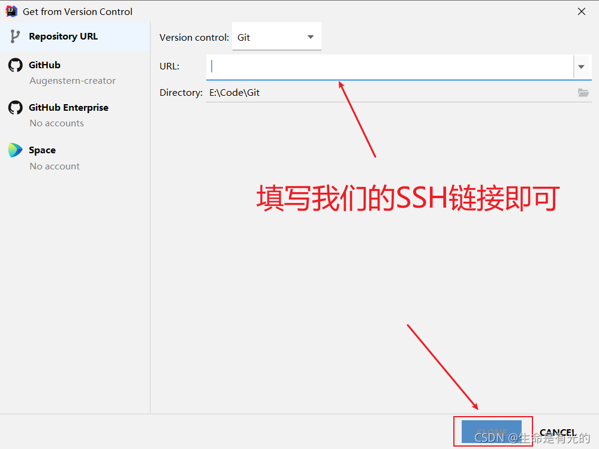


# 9、IDEA集成Gitee

码云和GitHub很多操作类似，根本的区别是码云在国内，建议HTTPS链接，而GitHub在国外用ssh

## 9.1、IDEA安装码云插件

Idea 默认不带码云插件，我们第一步要安装 Gitee插件。

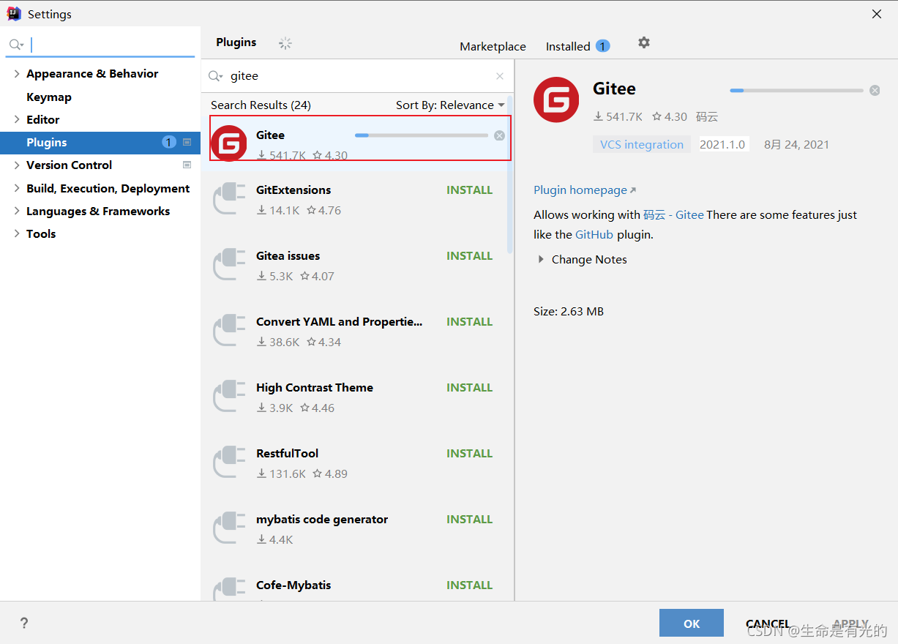

安装完成重启 IDEA 即可

Idea连接码云和连接 GitHub几乎一样，首先在 Idea里面创建一个工程，初始化 git工程，然后将代码添加到暂存区，提交到本地库。


## 9.2、分享项目到Gitee


## 9.2、push推送到码云远程库

当然我们也可以自己在码云Gitee上创建远程库，然后获取到远程库的 HTTPS/SSH 链接，将我们的代码 push 即可

自定义远程库链接： Define remote，给远程库链接定义个 name，然后再 URL里面填入码云远程库的 HTTPS链接即可，码云服务器在国内，用 HTTPS 链接即可，没必要用 SSH 免密链接


## 9.3、pull拉取远程库到本地库

我们在远程库修改代码，然后使用本地库 pull 拉取远程库的代码


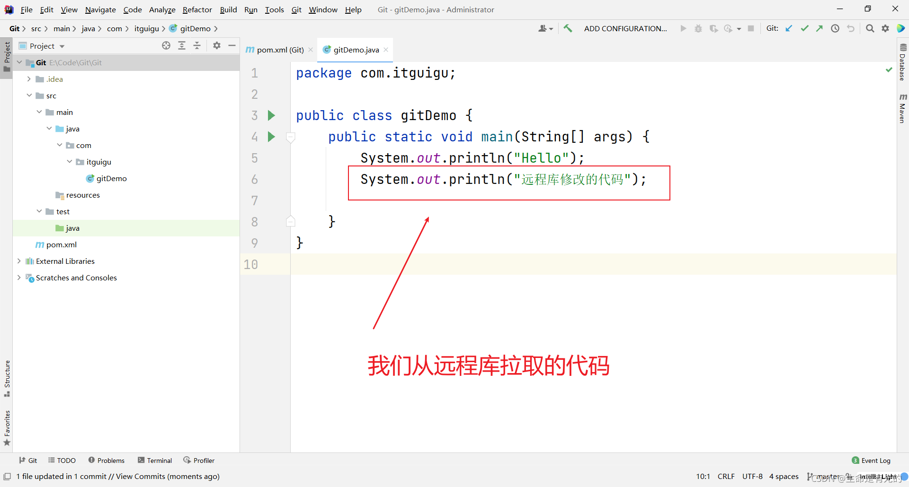

## 9.4、clone克隆远程库到本地库


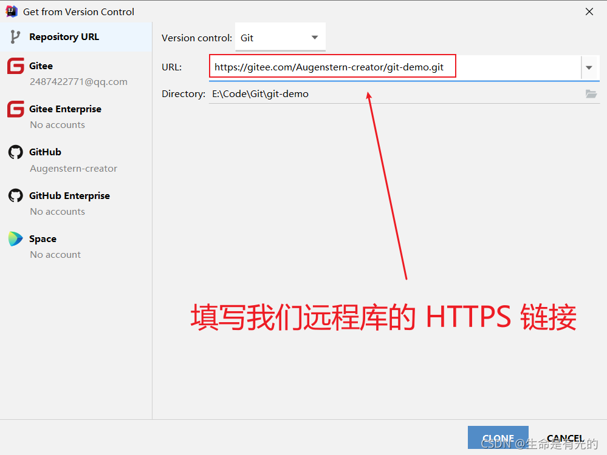

# 10、码云复制Github项目

码云提供了直接复制 GitHub 项目的功能，方便我们做项目的迁移和下载 。


将 GitHub的远程库 HTTPS链接复制过来，点击创建按钮即可。

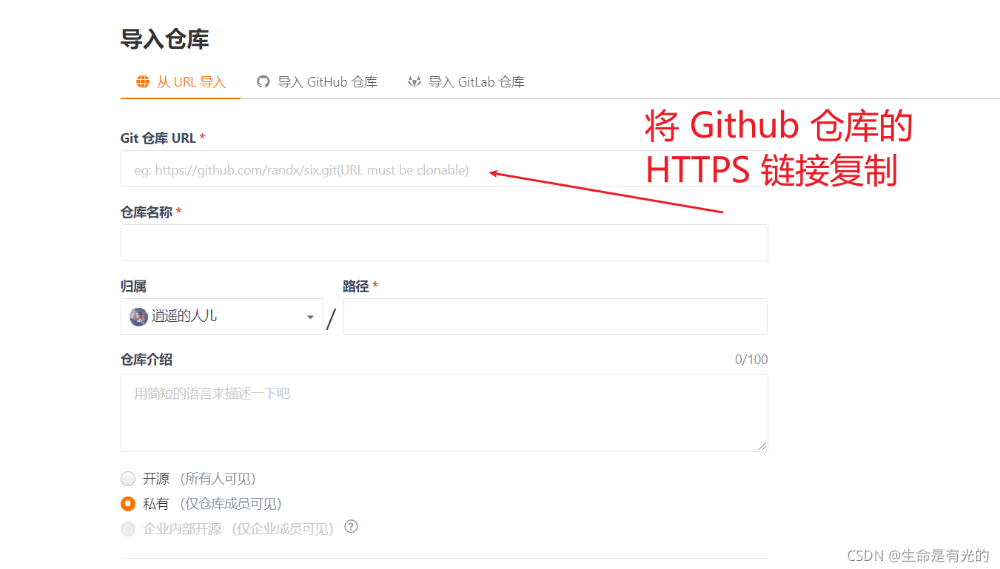

如果GitHub项目更新了以后，在码云项目端可以手动重新同步，进行更新！

# 11、**使用Gogs**

Gogs和GitHub、GitLab都是Git托管平台，Gogs相比它们两者更轻量。

Gogs的官网地址：[Gogs: A painless self-hosted Git service](https://gogs.io/)

## **11.1、搭建Gogs**

略。 

## **11.2、Gogs的基本使用方法**

进入Gogs：[http://192.168.101.65:10880](http://192.168.101.65:10880/gogs/xuecheng-plus) 

账号/密码：gogs/gogs

### 创建组织 

 1、首先创建一个组织


该组织通常以项目名命名，填写组织名称。


创建成功，进入管理面板修改组织信息


点击编辑，填写组织名称。

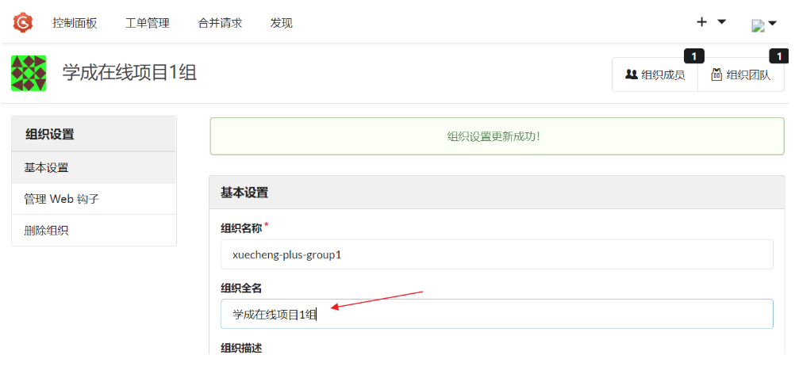


修改成功，进入首页点击组织名称

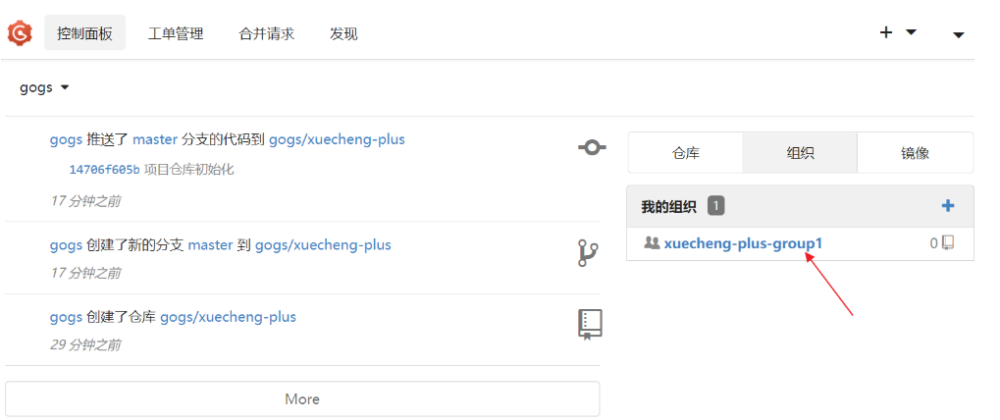

### 组织内团队

进入组织首页


下边开始创建团队

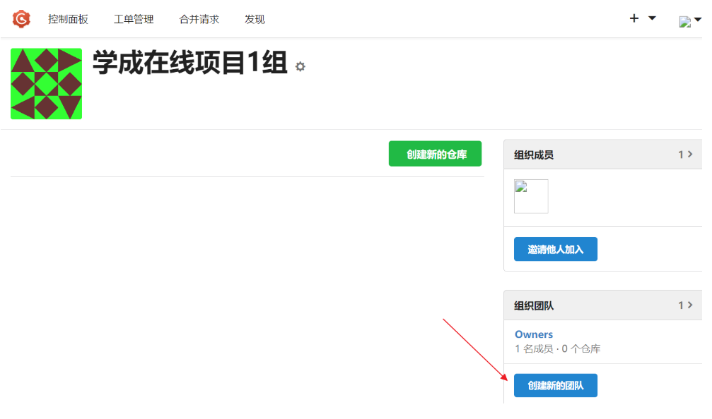


假如创建研发团队，填写团队名称


选择权限等级，注意：这里即使选择了权限等级也需要在仓库管理中去管理协作者的权限。

 团队创建成功

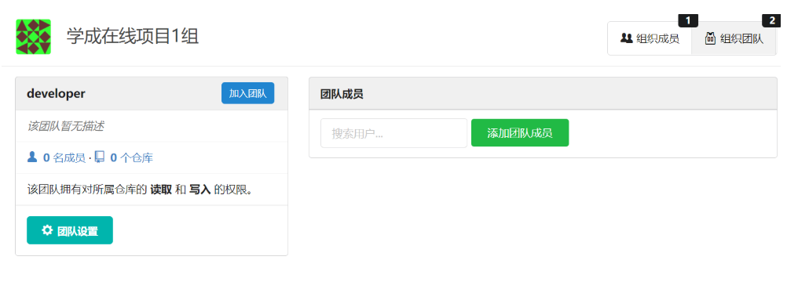

### 团队里创建成员账号 

团队创建成功下边开始创建成员账号 。

首先在用户管理中添加账号分配给成员。


然后在下边的界面 中向团队添加成员

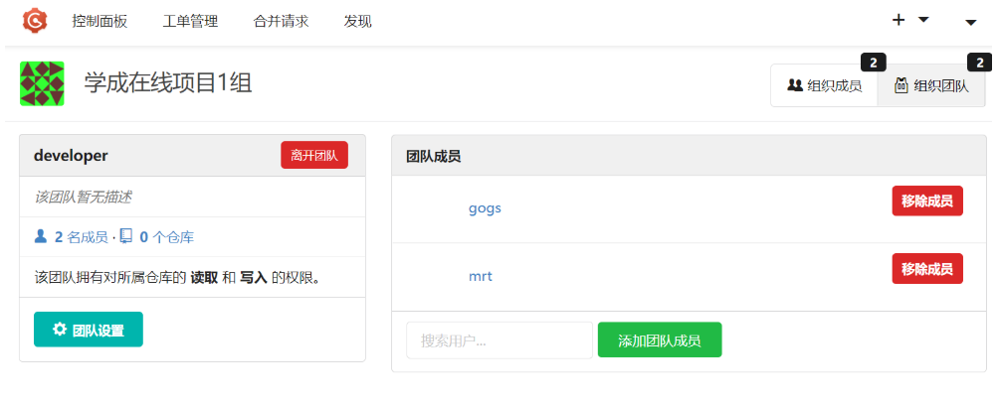

### 组织内创建仓库 

团队和组织创建完成，下边创建仓库，进入组织，创建仓库。


填写仓库信息


创建成功，仓库地址：http://192.168.101.65:10880/xuecheng-plus-group1/xuecheng-plus-group1.git，如下

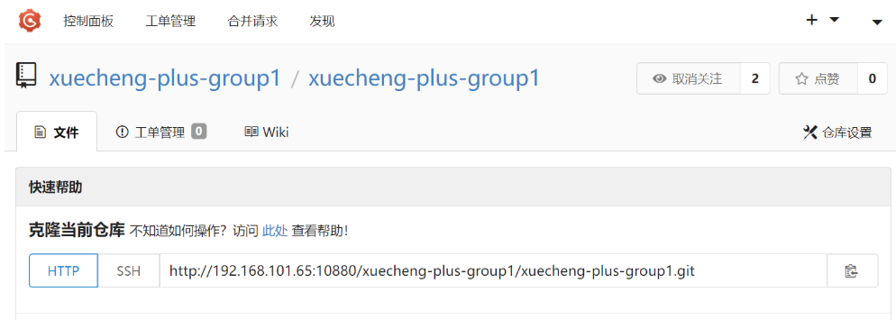

### 添加协作者（使用仓库的人员）

点击“仓库设置”，


添加协作者，将团队成员的账号添加为协作者。

添加完成注意分配权限，如下图，通常测试人员为读取权限，开发人员为读写权限。

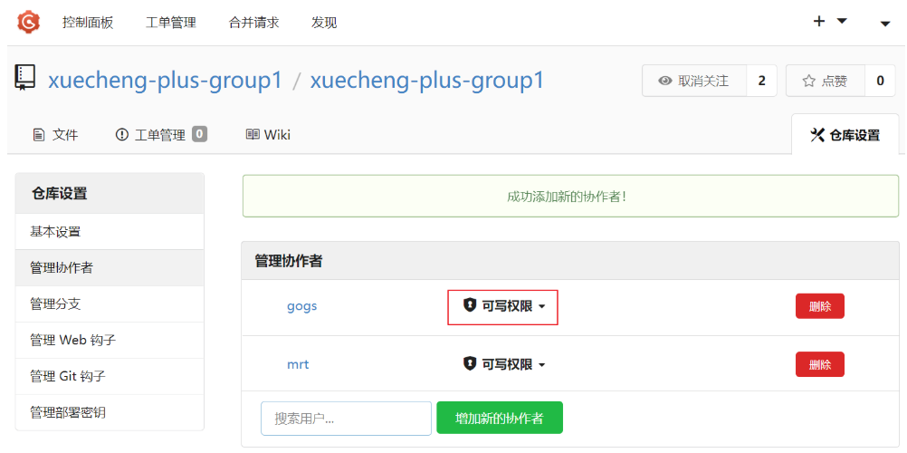

团队Leader需要将初始代码上传至Git仓库，团队成员通过Idea克隆一份项目代码，通过此仓库进行协作开发。