>  **导航：**
>
> [【Java笔记+踩坑汇总】Java基础+JavaWeb+SSM+SpringBoot+SpringCloud+瑞吉外卖/谷粒商城/学成在线+设计模式+面试题汇总+性能调优/架构设计+源码解析](https://blog.csdn.net/qq_40991313/article/details/126646289?csdn_share_tail={"type"%3A"blog"%2C"rType"%3A"article"%2C"rId"%3A"126646289"%2C"source"%3A"qq_40991313"})


[TOC]


# 1 Linux简介

## 1.0 linux用途

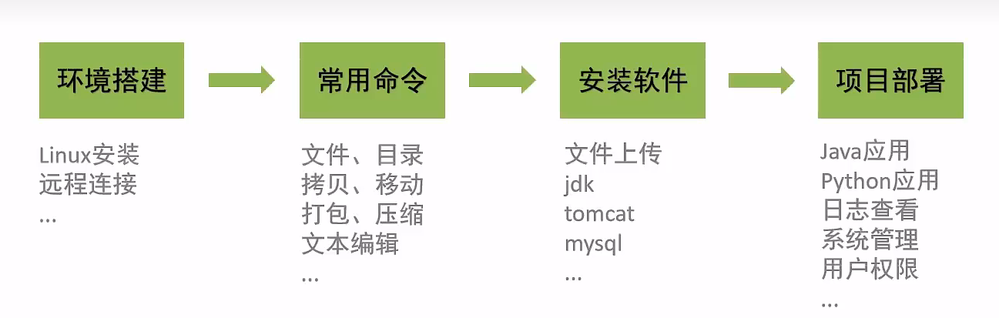


## 1.1 三种主流操作系统

**桌面操作系统**

- **Windows (用户数量最多)**
- MacOS (操作体验好，办公人士首选)
- Linux (用户数量少，多用于服务器系统，少用于桌面系统)

**服务器操作系统**

- UNIX (安全、稳定、付费)
- **Linux (安全、稳定、免费、占有率高)**
- Windows Server (付费、占有率低)

**移动设备操作系统**

- Android (**基于Linux**、开源，主要用于智能手机、平板电脑和智能电视)
- ios (苹果公司开发、不开源，用于苹果公司的产品，例如: iPhone、iPad)

**嵌入式操作系统**

- Linux (机顶盒、路由器、交换机)

## 1.2 Linux系统版本

Linux系统分为内核版和发行版

**1.2.1 内核版**

- 由Linus Torvalds及其团队开发、维护
- 免费、开源
- 负责控制硬件

**1.2.2 发行版（最常用centos）**

- 基于Linux内核版进行扩展
- 由各个Linux厂商开发、维护
- 有收费版本和免费 版本 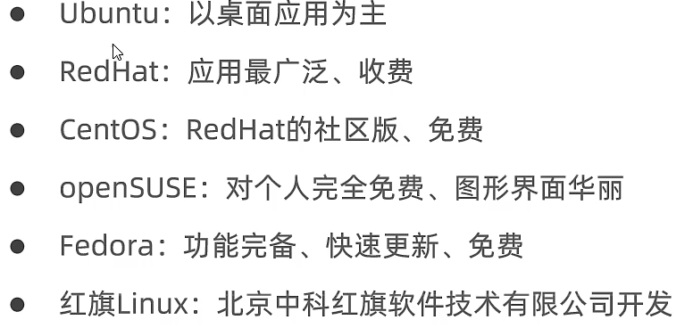


# 2 Linux安装-CentOS

## 2.1 虚拟机安装Linux

**3.1.1 物理机安装**

直接将操作系统安装到服务器硬件上

**3.1.2 虚拟机安装**

通过虚拟机**软件安装虚拟机**：指通过软件模拟具有完整硬件系统功能，运行在完全隔离环境中的完整计算机系统。 常用虚拟机软件

- **VMWare**
- VirtualBox
- VMLite WorkStation
- Qemu
- HopeddotVOS

## 2.2 安装Linux（**VMWare和centos**）

**2.2.1 先安装VMWare**

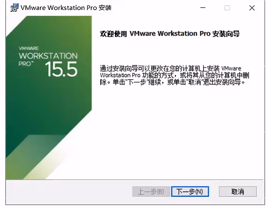

根据提示安装即可。


**2.2.2 安装CentOS镜像**


1. 打开虚拟机软件
2. 点击【创建新的虚拟机按钮】 
3. 选择典型，下一步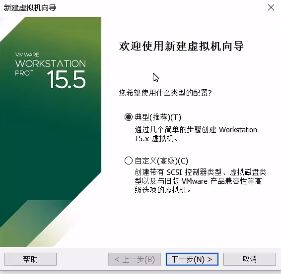
4. 选择稍后安装操作系统 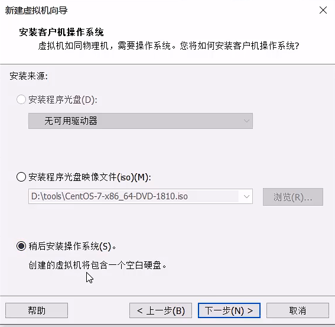
5. 勾选版本

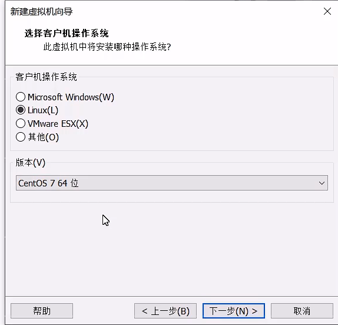

6.创建名称，选择物理文件的存储路径

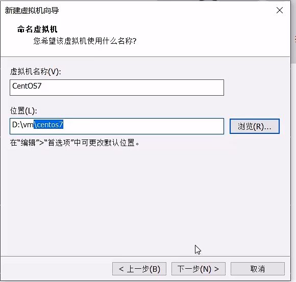


7.分配磁盘空间大小，20G即可

 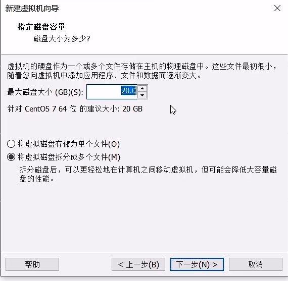


8.自定义硬件，内存2G，处理器2个，选择镜像的位置，点击完成

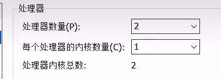

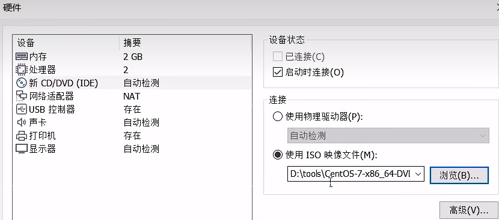


9.点击开启此虚拟机，点击进入虚拟机，ctr+alt 快捷键可以退出虚拟机 点击Install … 安装虚拟机

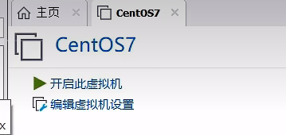

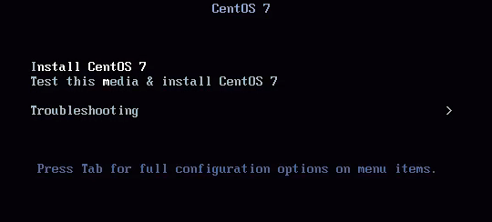


10.**一路回车即可，耐心等待**，然后选择语言为中文，安装位置：


键盘选择最小安装 


 开始安装


11. 设置root密码，别创建用户，用户很多操作没权限

 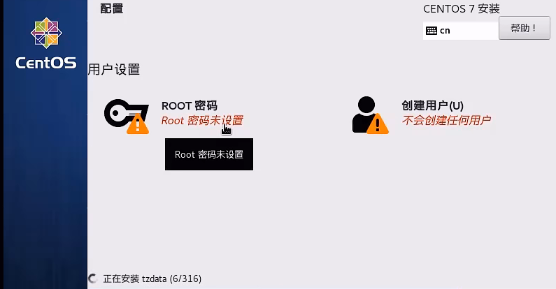

12 重启和登录：

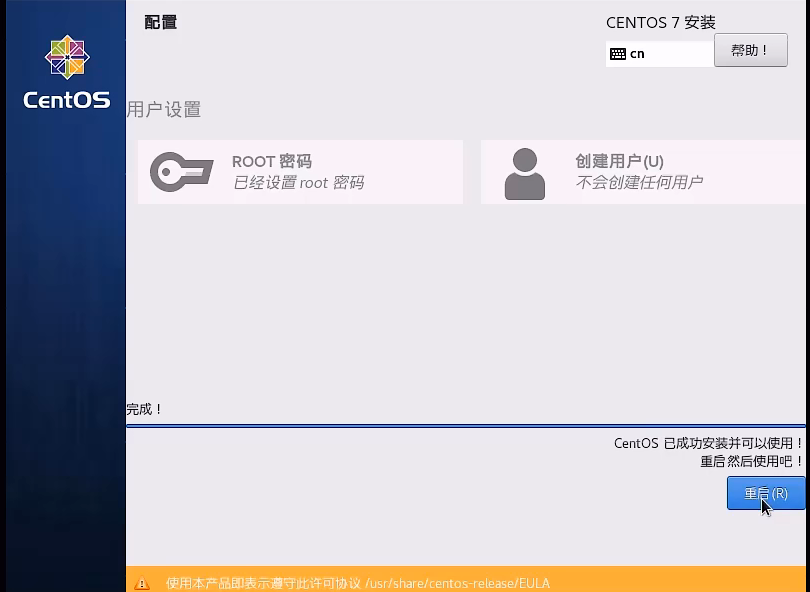 注意密码输入时候是看不到的


## 2.3 网卡设置

启动服务器时，没有加载网卡 查看IP地址

```
 ip addr
```


> 没有安装网卡的状态：
>
> 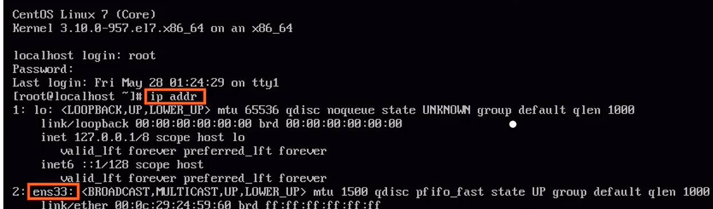 安装有网卡的状态：
>
> 


**修改网络初始化配置，设定网卡**

```bash
cd /etc/sysconfig/network-scripts    #进入network - scripts

vi ifcfg-ens33                         #编辑ifcfg-ens33文件
```


此时是在vim浏览状态，i进入编辑状态
 修改ONBOOT=yes
 然后<ESC>→输入:Wq→<ENTER>保存退出 

**重新启动：**

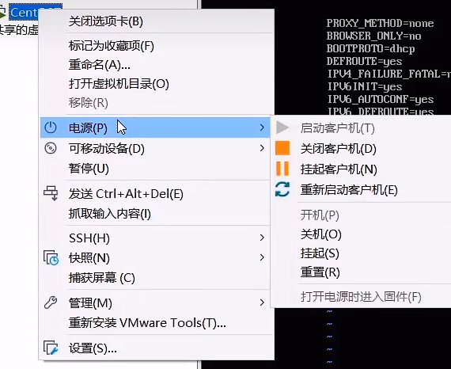

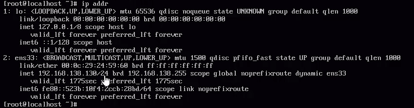


## 2.4 安装SSH链接工具finalshell


SSH（Secure Shell），建立在应用层基础上的安全协议 常用的SSH链接工具

- putty
- secureCRT
- **xshell（推荐）**
- **finalshell（推荐）**

通过SSH连接工具就可以实现从本地连接到远程的Linux服务器


**SSH使用**

下载地址：[FinalShell SSH工具,服务器管理,远程桌面加速软件,支持Windows,macOS,Linux,版本4.3.10,更新日期2023.12.31 - FinalShell官网](https://www.hostbuf.com/t/988.html) 

打开finalshell

点击如下图所示图标


点击最左侧按钮，选择SSH链接 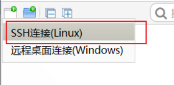


配置相关信息

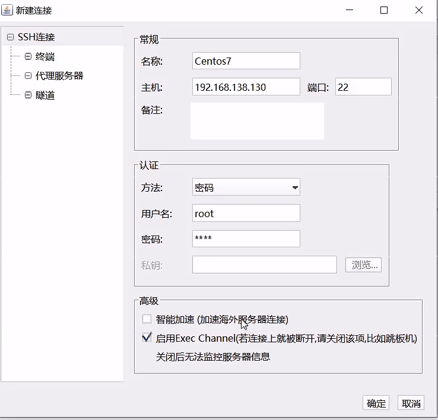


点击就可以连接

 

>  **注意：**
>
> 一般centos会**隔两天左右自动改一下ip值**，如果连接成功过几天后，发现VMware端可以登录成功，而ssh链接不到服务器，那大概率就是ip地址自动改了，在VMware查一下新的id地址即可：
>
> ```
> ip addr
> ```
>
> 

## 2.5 Linux与window目录结构对比

Linux系统中的目录

- **/是所有目录的顶点**
- **目录结构像一颗倒挂的树**


**Linux自带目录：** 

 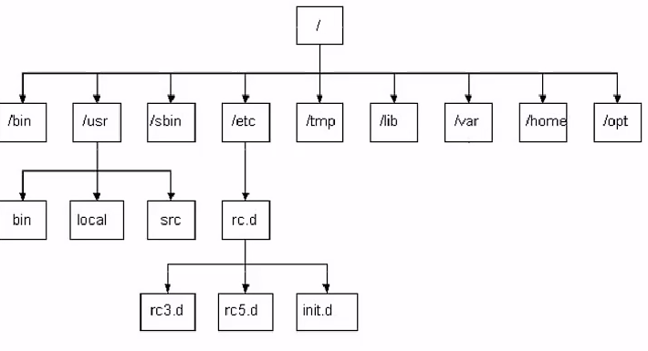


- bin存放二进制可执行文件
- boot存放系统引导时使用的各种文件
- dev存放设备文件
- **etc存放系统配置文件**
- home存放系统用户的文件
- lib存放程序运行所需的共享库和内核模块
- opt额外安装的可选应用程序包所放置的位置
- **root超级用户目录**
- sbin存放二进制可执行文件，只有root用户才能访问
- tmp存放临时文件
- **usr存放系统应用程序**
- var存放运行时需要改变数据的文件，例如日志文件

## 2.6 禁止centos自动修改ip

默认情况，linux会自动修改ip。

查看ip地址：

```
ip addr
```


 禁止ip自动修改

```
vi /etc/sysconfig/network-scripts/ifcfg-ens33
```


**找到**BOOTPROTO**修改：**

```
BOOTPROTO=none 
```


**BOOTPROTO值：**dhcp（默认值）表示动态获取IP地址，satic表示静态IP，none表示不指定，就是静态。

然后在文件最下面输入：

```bash
IPADDR=填写你想要的ip地址例如192.168.1.101
NETMASK=255.255.255.0
GATEWAY=192.168.1.1
DNS1=1.0.0.1
DNS2=1.1.1.1
DNS3=8.8.4.4
```


# 3 命令

## 3.1 常用命令

[Linux的20个常用命令_vincewm的博客-CSDN博客](https://blog.csdn.net/qq_40991313/article/details/126258465?spm=1001.2014.3001.5501)


# 4 软件安装

## 4.1.软件安装方式

**方式1：二进制发布包安装**

软件已经针对具体平台编译打包发布，直接从目标官网下载.tar.gz文件，上传解压,修改配置即可

**方式2：rpm安装**

软件已经按照redhat的包管理规范进行打包，使用rpm命令进行安装,不能自行解决库依赖问题

**方式3：yum安装（建议）**

一种在线软件安装方式， 本质上还是rpm安装，自动下载安装包并安装,**安装过程中自动解决库依赖问题**

搜索指定安装包：

```bash
yum list xxx
```


 安装指定安装包：

```bash
yum install xxx
```


> Yum (全称为**Yellow dog Updater, Modified)**是-个在Fedora和RedHat以及CentOS中的Shell前端软件包管理器。基于RPM包管理，能够从指定的服务器自动下载RPM包并且安装，可以自动处理依赖关系，并且一次安装所有依赖的软件包，无须繁琐地一次次下载、安装。

**方式4：源码编译安装**

软件以源码工程的形式发布,需要自己编译打包，**例如前面springboot项目打包成jar后**，然后直接运行jar包。

## 4.2 安装JDK11

> 建议安装在/usr/local

1. 使用FinalShell自带的上传工具将jdk的二进制发布包上传到Linux**【jdk-11.0.16.1_linux-x64_bin.tar.gz】**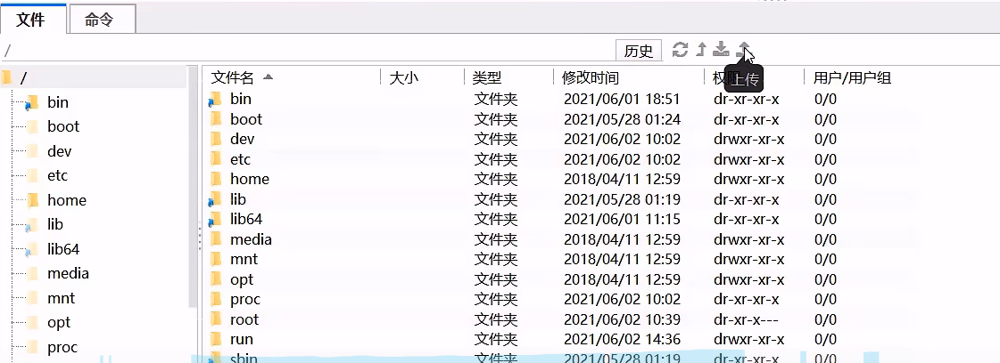

   

2. 解压安装包,命令为，程序一般安装在 /usr/local 目录下

   ```bash
   tar -zxvf jdk-11.0.16.1_linux-x64_bin.tar.gz -C /usr/local
   ```

   

3. 配置环境变量，使用vim命令修改/etc/profile文件，在文件末尾加入如下配置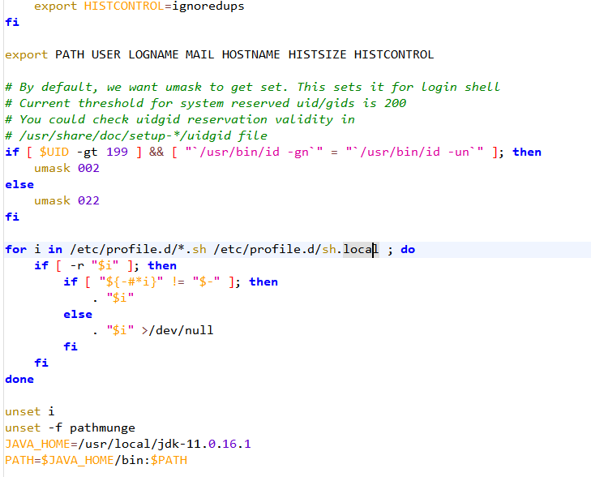

   

   ```bash
   vi /etc/profile
   ```

   

   ```bash
   JAVA_HOME=/usr/local/jdk-11.0.16.1
   PATH=$JAVA_HOME/bin:$PATH
   ```

   

4. 重新加载profile文件， 使更改的配置立即生效，命令为

   ```
   source /etc/profile
   ```

   

5. 检查安装是否成功，命令为

   ```
   java -version
   ```

   

   


## 4.3 安装Tomcat

### 4.3.1 安装步骤

[Apache Tomcat® - Welcome!](https://tomcat.apache.org/)

1. 使用FinalShell自 带的上传工具将Tomcat的二进制发布包上传到Linux【apache- tomcat-7.0.57.tar.gz】

2. 解压安装包，命令为

   ```bash
   tar -zxvf apache-tomcat-7.0.57.tar.gz -C /usr/local
   ```

   

3. 进入Tomcat的bin目录启动服务，命令为

   ```bash
   cd /usr/local/apache-tomcat-7.0.57.tar.gz/bin
   
   ./startup.sh
   #或者sh startup. sh
   ```

   

   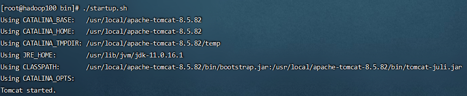

   

### 4.3.2 验证Tomcat启动

**方式0：访问页面：**

http://centos的ip地址:8080

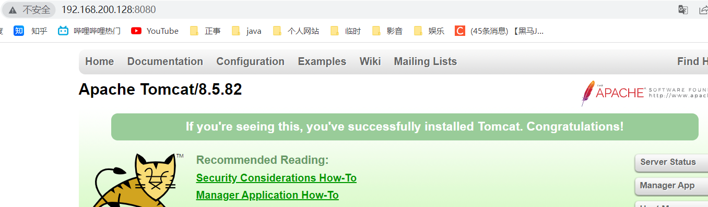

> 要确保防火墙关闭状态才能查看：
>
> **永久关闭防火墙：**
>
> ```bash
> systemctl disable firewalld
> ```
>
> 

**方式1：查看启动日志**

```
more /usr/local/ apache-tomcat- 7.0.57/logs/catalina.out
tail -50 /usr/local/ apache-tomcat-7.0.57/logs/catalina.out
```


启动成功显示

```
五月 21, 2022 7:14:08 下午 org.apache.coyote.AbstractProtocol start
信息: Starting ProtocolHandler ["http-bio-8080"]
五月 21, 2022 7:14:08 下午 org.apache.coyote.AbstractProtocol start
信息: Starting ProtocolHandler ["ajp-bio-8009"]
五月 21, 2022 7:14:08 下午 org.apache.catalina.startup.Catalina start
信息: Server startup in 599 ms
```


**方式2：查看进程**

```
ps -ef|grep tomcat
```


启动成功的话能看到进程

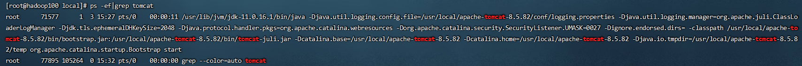


> **注意:**
>
> - `ps`命令是linux下非常强大的进程查看命令,通过`ps -ef`可以查看当前运行的所有进程的详细信息
> - `"|”`在Linux中 称为管道符，可以将前一个命令的结果输出给后一个命令作为输入
> - 使用`ps`命令查看进程时，经常配合管道符和查找命令`grep` 一起使用，来查看特定进程

### 4.3.3 防火墙操作

- **查看防火墙状态**

  ```bash
  firewall-cmd --state    #简洁
  #systemctl status firewalld    #详细
  ```

  

开启状态：

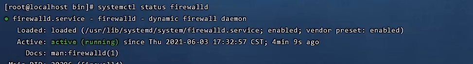


关闭状态：

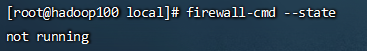


- 暂时关闭防火墙

  ```
  systemctl stop firewalld
  ```

  

- **永久关闭防火墙（不安全，怕被攻击，建议开放指定端口）**

  ```
  systemctl disable firewalld
  ```

  

- 开启防火墙

  ```
  systemctl start firewalld
  ```

  

- **开放指定端口**

  ```
  firewall-cmd --zone=public --add-port=8080/tcp --permanent
  ```

  

- 关闭指定端口

  ```
  firewall-cmd --zone=public --remove-port=8080/tcp --permanent
  ```

  

- **立即生效**

  ```
  firewall-cmd --reload
  ```

  

- **查看开放的端口**

  ```
  firewall-cmd --zone=public --list-ports
  ```

  

> **注意:**
>
> 1. `systemctl`是管理Linux中服务的命令，可以对服务进行启动、停止、重启、查看状态等操作
> 2. `firewall-cmd`是 Linux中专门用于控制防火墙的命令
> 3. 为了保证系统安全,服务器的**防火墙不建议关闭**

### 4.3.4 停止Tomcat服务

**方式1：运行Tomcat的bin目录中提供的停止服务的脚本文件shutdown.sh**

```bash
cd /usr/local/apache-tomcat-7.0.57.tar.gz/bin
./shutdown.sh
#或者sh shutdown.sh
```


**方式2：结束Tomcat进程（不建议）**

查看Tomcat进程，获得进程id

```
ps -ef | grep tomcat
```


执行命令结束进程

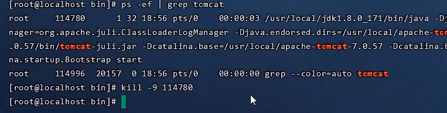


```
kill-9 26000(进程id)
```


注意: kill命令是Linux提供的用于结束进程的命令, `-9`表示强制结束

## 4.4 安装MySQL

> 安装失败的话可以参考：[linux安装mysql_vincewm的博客-CSDN博客](https://blog.csdn.net/qq_40991313/article/details/126514654?spm=1001.2014.3001.5501) 

### 4.4.1 安装步骤

1. 检测当前系统中是否安装MySQL数据库

   查询当前系统中安装的所有软件

   ```
   rpm -qa
   ```

   

   查询当前系统中安装的名称带mysql的软件

   ```
   rpm -qa | grep mysql
   ```

   

   查询当前系统中安装的名称带mariadb的软件

   ```bash
   rpm -qa | grep mariadb 
   ```

   

   

   RPM ( Red-Hat Package Manager) RPM软件包管理器，是红帽Linux用于管理和安装软件的工具

   注意事项：如果当前系统中已经安装有MySQL数据库，安装将失败。CentOS7 自带mariadb,与MySQL数据库冲突,

2. 卸载与MySQL数据库冲突的软件 mariadb

   ```
   rpm -e --nodeps 软件名称  #卸载软件
   rpm -e --nodeps mariadb-libs-5.5.60-1.el7_5.x86_64
   ```

   

3. 将MySQL安装包上传到Linux并解压

   ```bash
   mkdir /usr/local/mysql
   tar -zxvf mysql-5.7.25-1.el7.x86_64.rpm-bundle.tar.gz -C /usr/local/mysql
   ```

   

   说明:解压后得到6个rpm的安装包文件 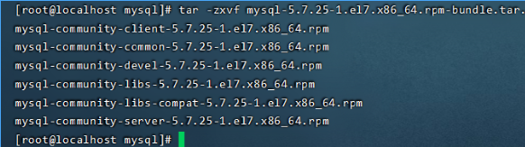

   

4. 按照顺序安装rpm软件包

   ```
   rpm -ivh mysql-community-common-5.7.25-1.el7.x86_64.rpm
   rpm -ivh mysql-community-libs-5.7.25- 1.el7.x86. 64.rpm
   rpm -ivh mysql-community-devel- 5.7.25-1.el7.x86 64.rpm
   rpm -ivh mysql-community-libs-compat-5.7.25-1.el7 .x86_ 64.rpm
   rpm -ivh mysql-communit-client-5.7.25-1.el7.x86.64.rpm
   yum install net-tools
   rpm -ivh mysql-community-server-5.7.25-1.eI7.x86 64.rpm 
   ```

   

   说明1:安装过程中提示缺少`net-tools`依赖，使用yum安装 说明2:可以通过指令升级现有软件及系统内核

   ```
   yum update
   ```

   

### 4.4.2 运行mysql

查看mysql服务状态

```
systemctl status mysqld
```


启动mysql服务

```
systemctl start mysqld
```


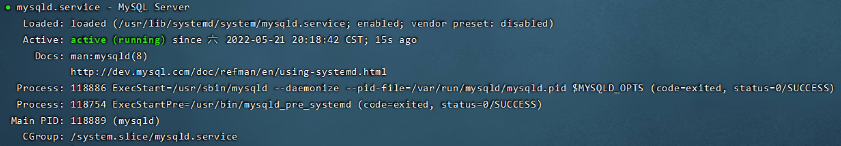


说明:可以设置开机时启动mysq|服务，避免每次开机启动mysql

**开机启动mysql服务**

```
systemctl enable mysqld
```


查看已经启动的服务

```
netstat -tunlp
netstat -tunlp | grep mysql
```


查看mysql进程

```
ps -ef | grep mysql
```


### 4.4.3 登录mysql

1. 查阅临时密码

   查看文件内容

   ```
   cat /var/log/mysqld.log
   ```

   

   查看文件内容中包含password的行信息

   ```
   cat /var/log/mysqld.log | grep password
   ```

   

   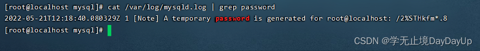

2. 登录mysql，修改密码，开放访问权限

   登录mysql (使用临时密码登录)

   ```
   mysql -uroot -p
   ```

   

   设置密码长度最低位数

   ```bash
   #修改密码
   set global validate_password_length=4;
   ```

   

   设置密码安全等级低，便于密码可以修改成root

   ```
   set global validate_password_policy=LOW;
   ```

   

   设置密码为root

   ```bash
   set password = password('root');
   ```

   

   ```bash
   #开启访问权限
   grant all on . to 'root'@'%' identified by '123456';
   flush privileges;
   ```

   

## 4.5 安装文件上传工具lrzsz

安装成功之后命令行下输入rz回车，都可以上传文件。当然如果**使用finalshell则没必要安装了**：

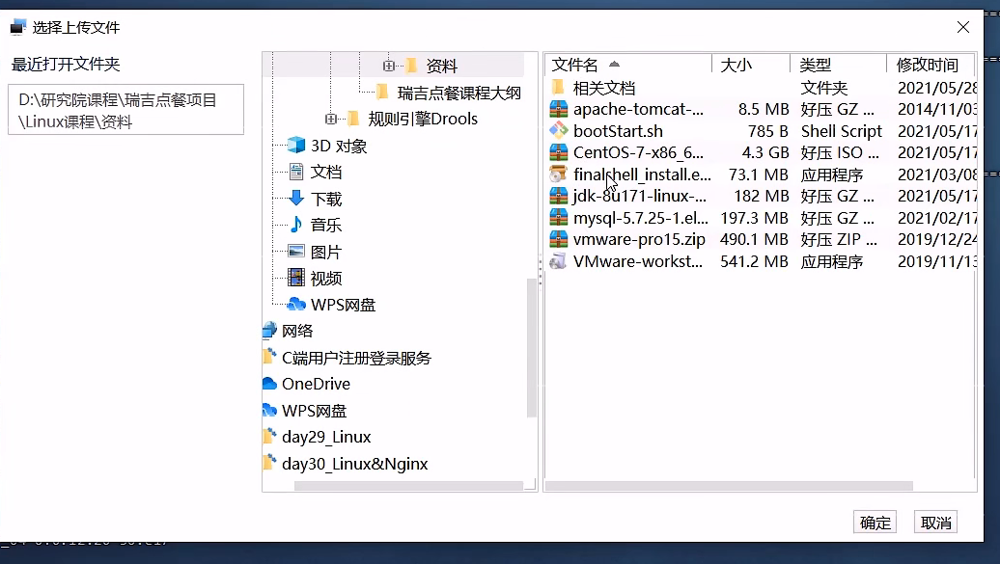


搜索lrzsz安装包,命令为

```bash
yum list lrzsz
```


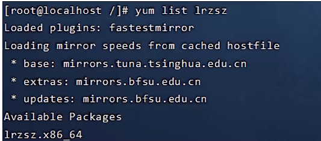


使用yum命令在线安装，命令为

```bash
yum install lrzsz.x86_64
```


## 4.6 Linux和Windows解决端口占用


### **4.6.1 Linux解决端口占用**

**方式一：lsof命令**

1、查看占用端口进程的PID：

```
lsof -i:{端口号}
```


 2、根据PID kill掉相关进程：

```
kill -9 {PID}
```


**方式二：netstat命令**

1、查看占用端口进程的PID：

```
netstat -tunlp|grep {port}
```


 2、kill方法如上。

```
kill -9 {PID}
```


**补充1：根据程序名查看对应的PID**

1、用[ps命令](https://so.csdn.net/so/search?q=ps命令&spm=1001.2101.3001.7020)（zb专用）：

```
ps -ef | grep {programName}
kill -9 {PID}

# 查看详细内存占用
ps aux -u root | grep {programName}
```


2、用pgrep命令：

pgrep命令的p表明了这个命令是专门用于进程查询的grep。

```
pgrep {programName}
kill -9 {PID}
```


**补充2：根据PID查看对应的进程**

```
ps -aux |grep -v grep|grep {$PID}
```


### **4.6.2 Windows解决端口占用**

先查看占用端口的进程号 

```bash
netstat -ano | findstr "8080"
```


然后杀死进程号，例如进程号是12724：

```bash
taskkill -PID 12724 -F
```


示例：


# 5 项目部署

## 5.1 手工部署

### 5.1.1 前台部署 

**自己打包、手动上传Linux系统、java -jar运行jar包。** 

准备一个springboot项目：

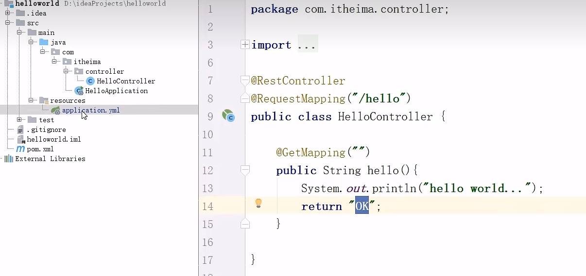 打包：

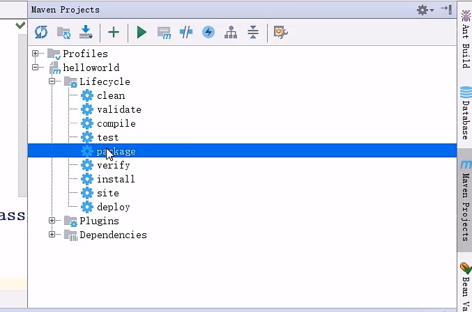

上传jar包到linux 


 运行jar包：

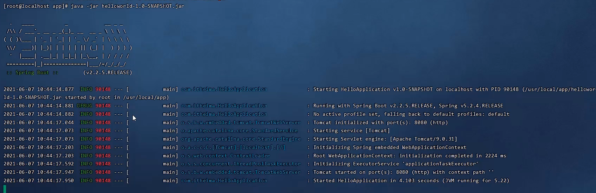

**此时关闭窗口，项目就终止了。** 

### 5.1.2 后台部署，nohup


```bash
cd /usr/local/app
nohup java -jar 项目名.jar &> hello.log &
```


此时关闭窗口依然可以访问http://localhost:8080

**杀死进程**，直接搜索java：

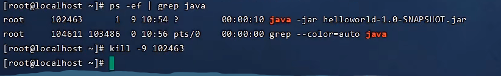 

## 5.2 通过shell脚本自动部署

这一节只写到一半，感觉比手动不熟麻烦很多，后面有时间再补

 

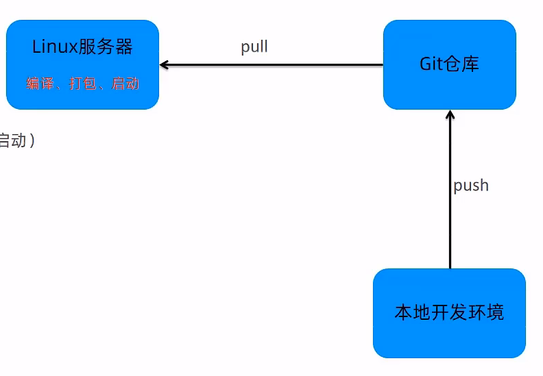

1.Linux安装git：

```bash
yum install git
```


2.使用git克隆仓库

```bash
cd /usr/local/
git clone https://gitee.com/vincewm/reggie_takeout.git
```


 需要输入账号密码的话输入即可。

3.Linux安装Maven

[Maven – Download Apache Maven](https://maven.apache.org/download.cgi)

国内网下载慢，建议开科技


```bash
tar -zxvf apache-maven-3.8.6-bin.tar.gz -C /usr/local
vim /etc/profile
```


vim修改： 

```bash
export MAVEN_HOME=/usr/local/apache-maven-3.8.6
export PATH最后面加上		:$MAVEN_HOME/bin
```


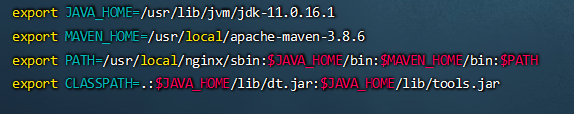


 重新加载、查看版本：

```bash
source /etc/profile
mvn -version
```


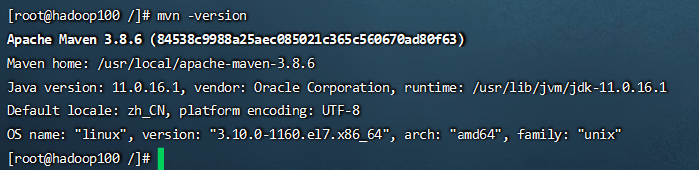

修改settings.xml

```bash
cd /usr/local
mkdir repo
vim /usr/local/apache-maven-3.8.6/conf/settings.xml
```


 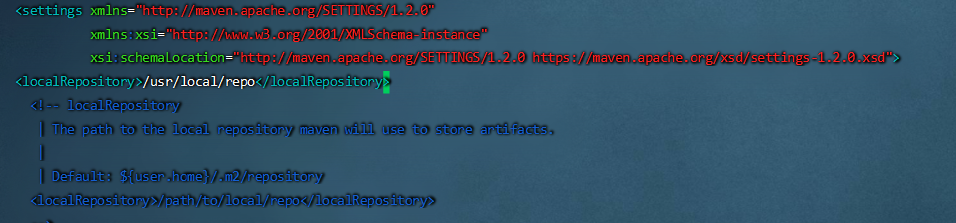