>  **导航：**
>
> [【Java笔记+踩坑汇总】Java基础+JavaWeb+SSM+SpringBoot+SpringCloud+瑞吉外卖/谷粒商城/学成在线+设计模式+面试题汇总+性能调优/架构设计+源码解析](https://blog.csdn.net/qq_40991313/article/details/126646289?csdn_share_tail={"type"%3A"blog"%2C"rType"%3A"article"%2C"rId"%3A"126646289"%2C"source"%3A"qq_40991313"})


[TOC]


# 0. tab键：代码补全

例如输入文件夹cd con，按tab键可以自动补全成该目录下config。

# 1. ls：列出文件列表list

**ls**命令是**列出目录内容**(List Directory Contents)的意思。

“**ls -l”**，简写成**ll**。命令以**详情模式**(long listing fashion)列出文件夹的内容。


**"ls -a"**命令会列出文件夹里的**所有内容**，包括以"."开头的隐藏文件。 

 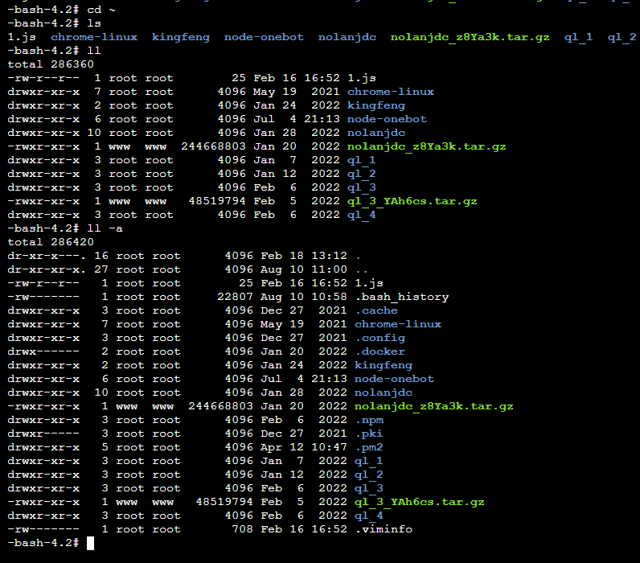

注意：在**Linux**中，文件以“**.**”开头的就是隐藏文件，并且每个文件，文件夹，设备或者命令都是以文件对待。 

# 2. cd：切换目录change directory

文件夹输到一半时候按“tab”键是可以自动补全的。

**cd..**    ：退回上一级目录。

**cd /**    :退回根目录。

**cd ～**   :会改变工作目录为root目录

**cd -**    ：返回上一**次**目录 

# 3. cp：复制粘贴文件copy

 **cp [拷贝前路径] 文件 路径[拷贝并重命文件名]**

示例： 

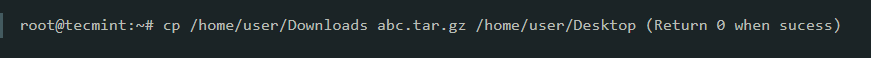

# 4. mv：移动move

# 5. rm：删除文件、目录remove

**rm a.txt**    ：回车后输入y确认删除，n取消删除


**rm -r xxx**     删除文件或递归删除目录

**rm -f xxx**    删除目录，**无提示，不建议用**

**rm -rf xxx**    不带提示删除文件，是由-f和-r合并的

**rm -rf /\***       **很危险，删库跑路**，无提示递归删除该路径下所有文件目录

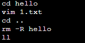


# 6. mkdir：创建目录make directory

**mkdir -p xxx/xxx**    ：创建多级目录

# 7. rmdir：删除空目录remove directory

**rmdir xxx    ：删除名为xxx的空目录**

只能删除空目录，非空目录会报错：


先删除目录下文件再删除目录：

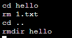


# 8. chown：更改所有者change owner

# 9. chmod：更改文件的权限模式change mode

# 10. find：查找文件

find / -name aaa.txt    ：递归查找文件 

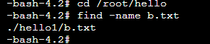

 其他命令，引号可以去除。

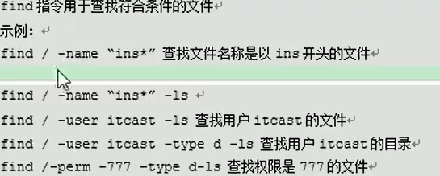

> **示例：**
>
> 查找MySQL配置文件：
>
> ```
> find / -name "my.cnf"
> ```
>
> 

# 11. |：管道

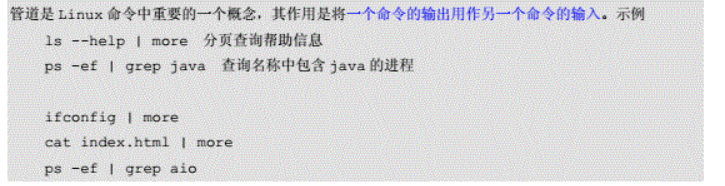

ls --help | more    左边是列表查看帮助信息，右边是分段回车查看文件。 

# 12. grep：查找文件内容，按行查找并匹配

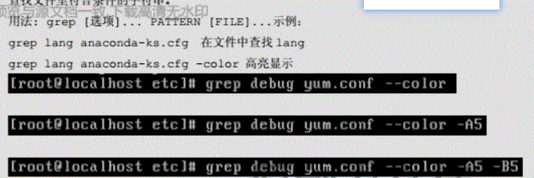


# 13. tar：打包，压缩，解压

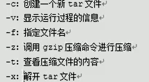

tar -cvf xxx.tar 目录/        打包 

**tar -zcvf xxx.tar.gz 待压缩目录/**     打包并压缩特定目录。

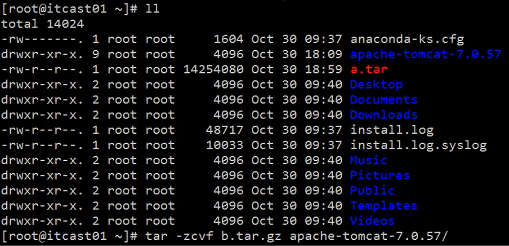


tar -zxvf xxx.tar.gz         解压

解压到特定目录：

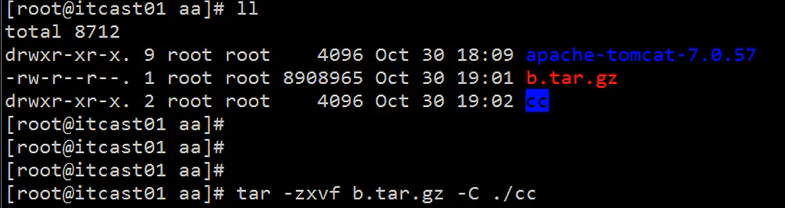


一般下载网站，linux下载方式文件后缀名都是tar.gz，意思是打包加压缩

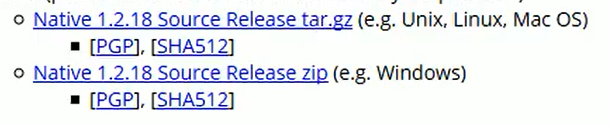

# 13.3 touch:创建空文件


# 13.6 vim编辑器:创建修改文件

**三种模式：**

命令行、插入、底层模式（命令行模式时按冒号）。

**进入vim编译器：**

```
vim hello.txt
```

**vim编辑模式：**

然后按 **i** 键进入 INSERT进行编辑。

**vim删除一行：**

先esc退出编辑模式，光标移到删除的行，输入**dd**


**vim删除给定范围的行**
 ① 删除从第3行到第5行
 按ESC，然后输入下面的命令，然后回车。

:3,5d


 ② 删除最后一行
 按ESC，然后输入下面的命令，然后回车。

:$d


 ③ 删除当前行之前的所有行
 按ESC，然后输入下面的命令，然后回车。

:1,.-1d


 ④ 删除当前行之后的所有行
 按ESC，然后输入下面的命令，然后回车。

:.+1,$d

**vim复制粘贴：**

先按 esc 键退出编辑模式，之后 **`yy`** 复制一行，**`p`** 粘贴一行

**vim保存：**

先esc退出insert模式，再输入:wq进行保存

# 13.9 clear:清空命令行

清空命令行。输入回车即可。或者ctrl+L

# 14. cat（more,less,tail）：查看文件，打印文件内容

如果文件较大，查看不完全要用more，分段回车查看

**cat xxx.xxx**       ：查看文件，打印文件内容 

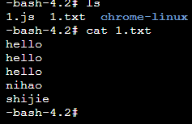

cat a.txt > b.txt    ：a的内容覆盖复制粘贴到b.txt

cat a.txt >> b.txt    ：a的内容追加复制粘贴到b.txt

**more xxx.txt**    ：大文件分段回车查看，按q或者Ctrl+c退出

**less xxx.txt**        ：大文件逐行查看，空格或回车或下方向键查看下一行，上方向键查看上一行，按q或者Ctrl+c退出。按G看最后一页，按g看第一页。

**tail -10 xxx.txt**        ：查看最后10行，数字可改，适用于看日志

**tail -n 10 xxx.txt**       ：查看最后10行，数字可改，适用于看日志

**tail -f xxx.txt**         ：动态查看日志

> **案例：**实时查看日志文件最后100行：
>
> ```bash
> tail -f -n 100 zcy_backend.log
> ```
>
> 

# 14.5 nohup：不挂起运行命令no hang up

**后台运行并指定日志：** 

```
nohup /root/runoob.sh > runoob.log 2>&1 &
```


**2>&1** 解释：

将标准错误 2 重定向到标准输出 &1 ，标准输出 &1 再被重定向输入到 runoob.log 文件中。

- 0 – stdin (standard input，标准输入)
- 1 – stdout (standard output，标准输出)
- 2 – stderr (standard error，标准错误输出)


# 15. ps：查看进程process select

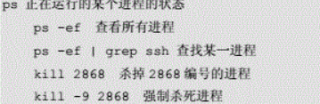

ps -ef | grep ssh    查找某一进程，中间竖杠是管道，左边输入作为右边输出。 

# 16. kill：杀死进程

kill 进程号：告诉进程，你需要被关闭，请自行停止运行并退出。

kill -9 进程号：强制退出进程，表示“无条件终止”；这个信号不能被捕获或忽略，同时接收这个信号的进程在收到这个信号时不能执行任何清理。

# 17. passwd：修改密码password

# 18. pwd：显示当前目录路径print work directory


# 19. tee：显示并保存

# 20. reboot：重启