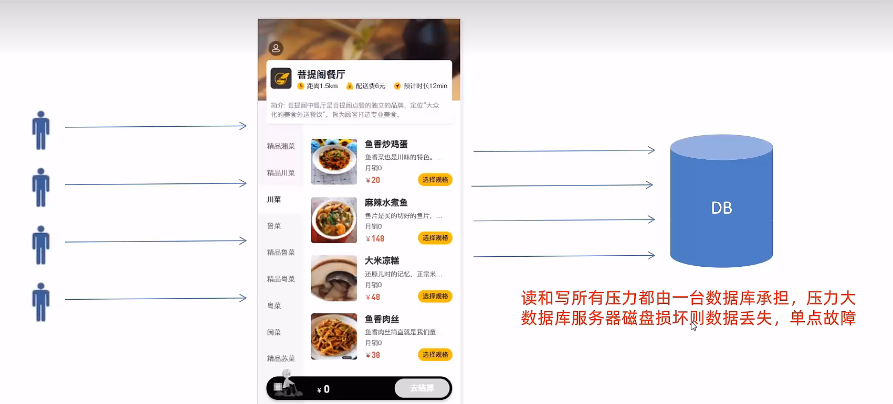
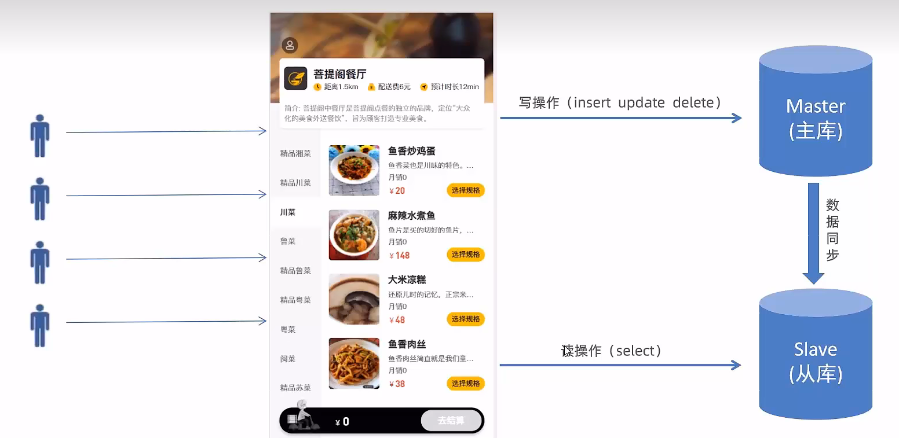
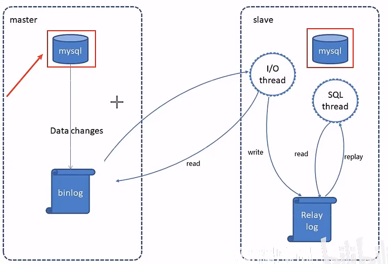
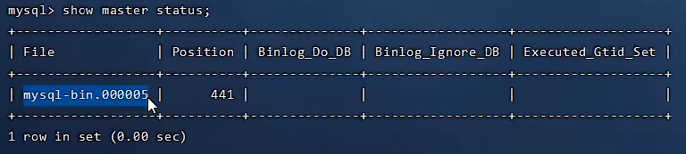
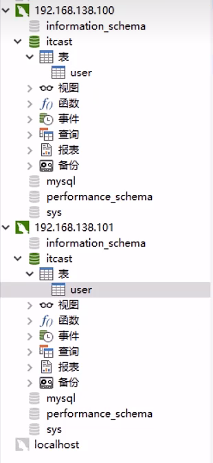
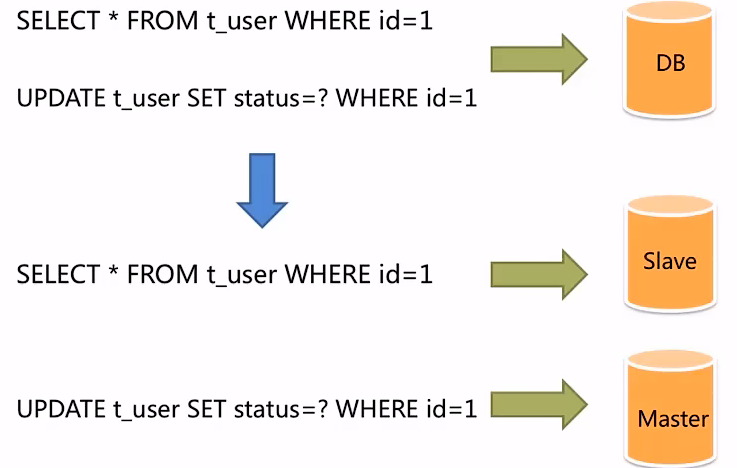
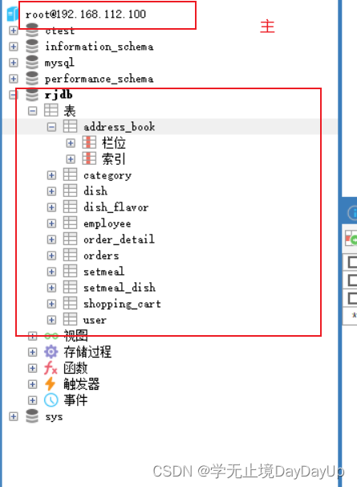

>   **导航：**
>
> [【Java笔记+踩坑汇总】Java基础+JavaWeb+SSM+SpringBoot+SpringCloud+瑞吉外卖/谷粒商城/学成在线+设计模式+面试题汇总+性能调优/架构设计+源码解析](https://blog.csdn.net/qq_40991313/article/details/126646289?csdn_share_tail={"type"%3A"blog"%2C"rType"%3A"article"%2C"rId"%3A"126646289"%2C"source"%3A"qq_40991313"})

[TOC]


# 读写分离

## 1.1 多台数据库

**单台数据库**

读和写都在单台数据库，访问压力过大，数据库服务器磁盘损坏则数据丢失，单点故障。 



**多台数据库减小服务器压力**

写操作在主库完成，主库数据同步到从库，读操作在从库完成。




## 1.2.MySQL主从复制（二进制日志）

### 1.2.1 介绍

**MySQL主从复制是一个异步的复制过程，底层是基于Mysql数据库自带的二进制日志功能。**

就是一台或多台MysQL数据库(slave，即**从库**)**从**另一台NySQL数据库（master，即**主库**）**进行日志的复制**然后再**解析日志并应用到自身**，最终实现**从库的数据和主库的数据保持一致**。MySQL主从复制是NySQL数据库**自带功能**，无需借助第三方工具。

**MySQL复制过程:**

1. master将“改变”记录到二进制日志（binary log)
2. slave将master的binary log拷贝到它的中继日志（relay log）
3. slave重做中继日志中的事件，将改变应用到自己的数据库中




> **主库1个，从库可以有多个**

### 1.2.2 配置主从数据库

**前置条件：**提前准备两台服务器（linux），使用finalshell连接后，分别安装mysql并启动服务成功。 

1.2.2**.1 配置主库maser（centos1）**

> **建议主从库都用centos，跟自己Windows环境的数据库区分开**

**第一步：修改MySQL数据库的配置文件**， /etc/my.cfg


```java
vim /ect/my.cnf
```


修改 

```bash
[mysqld]
log-bin=mysql-bin #[必须]启用二进制日志
server-id=100 #[必须] 服务器唯一id
```


**第二步：重启MySQL**

 如果是linux：

```
systemctl restart mysqld
```


**第三步：登录MySQL数据库，执行以下SQL**

```java
mysql -uroot -p密码
```


```java
GRANT REPLICATION SLAVE ON *.* to 'xiaoming'@'%' identified by 'Root@123456';
```


> **注意：**
>
> - 上面SQL的作用是创建一个用户xiaoming, 密码为Root@123456,并且给xiaoming用户授予REPLICATION SLAVE权限。密码和用户名可以自己设置。
> - REPLICATION SLAVE（replication译为主从复制，努力）权限常用于建立复制时所需要用到的用户权限，也就是slave必须被master授权具有该权限的用户，才能通过该用户复制。

**第四步：查看master状态，执行以下sql，记录结果中的FIle和Position的值**

```java
show master status;
```


执行完上面SQL语句，不要再执行任何操作


1.2.2**.2 配置从库Slave（centos数据库2）**

可以新建一个centos，安装数据库作为从库，也可以使用当前Windows，主要是主从库不能是同一台服务器。

**第一步，修改MySQL数据库的配置文件**， /etc/my.cnf

```java
vim /ect/my.cnf
```


 修改：


```bash
[mysqld]
#从数据库的唯一id
server-id=101
```


> 如果是Windows，修改mysql安装目录的my.ini


**第二步：重新启动mysql服务**

```java
systemctl restart mysqld
```


>  如果是Windows
>
> ```
> net stop mysql
> net start mysql
> ```
>
> 

**第三步：登录mysl，设置主库ip、用户名密码、日志文件名、密码**

```
mysql -uroot -p123456
```


**执行以下SQL语句**

先将下面信息修改成自己的主数据库信息： 

```
change master to
master_host= '192.168.112.100',master_user='xiaoming',master_password='Root@123456', master_log_file= 'mysql-bin.000002',master_log_pos=441;
start slave;
```


> **注意：**
>
> - 如果提示已经有slave运行就先停止：stop slave;然后再绑定主机
> - **日志名、位置一定要根据自己查主库状态：**
>
> ```java
> show master status;
> ```
>
> 
>
> 


**第四步：查询从数据库的状态**

```java
show slave status;
```


复制粘贴到记事本，更直观： 


### 1.2.3 测试

主库新增数据，从库也自动跟着新增数据。 




## 1.3 读写分离案例

### 1.3.1 背景

面对日益增加的系统访问量,数据库的吞吐量面临着巨大瓶颈。对于同一时刻有大量并发读操作和较少写操作类型的应用系统来说，将数据库拆分为主库和从库，

- **主库负责处理事务性的增删改操作**
- **从库负责处理查询操作**

能够有效的避免由数据更新导致的行锁，使得整个系统的查询性能得到极大的改善。




### 1.3.2 Sharding-JDBC实现读写分离

Sharding-JDBC定位为轻量级Java框架，在Java的JDBC层提供的额外服务。它**使用客户端直连数据库，以jar包形式提供服务，Maven中导入坐标即可使用**，可理解为增强版的JDBC驱动，**完全兼容JDBC和各种ORM框架**。 使用Sharding-JDBC可以在程序中轻松的实现数据库读写分离。

- 适用于任何基于JDBC的ORM框架，如: JPA, Hibernate, Mybatis, Spring JDBC Template或直接使用JDBC。
- 支持任何第三方的数据库连接池，如: DBCP, C3PO, BoneCP, Druid, HikariCP等。
- 支持任意实现JDBC规范的数据库。目前支持MySQL, Oracle, SQLServer, PostgreSQL以及 任何遵循SQL92标准的数据库。

### 1.3.3 入门案例

**1.3.3.1 导入Sharding-JDBC的maven坐标**

```XML
<dependency>
    <groupId>org.apache.shardingsphere</groupId>
    <artifactId> sharding-jdbc-spring-boot-starter</artifactId>
    <version>4.0. 0-RC1</version>
</dependency>
```


**1.3.3.2 在配置文件中配置读写分离规则**

```bash
server:
  port: 8080
mybatis-plus:
  configuration:
    #在映射实体或者属性时，将数据库中表名和字段名中的下划线去掉，按照驼峰命名法映射
    map-underscore-to-camel-case: true
    log-impl: org.apache.ibatis.logging.stdout.StdOutImpl
  global-config:
    db-config:
      id-type: ASSIGN_ID

spring:
  shardingsphere:
    datasource:
      names:
        master,slave
      ## 主数据源
      master:
        type: com.alibaba.druid.pool.DruidDataSource
        driver-class-name: com.mysql.cj.jdbc.Driver
        url: jdbc:mysql://192.168.112.100:3306/rw?characterEncoding=utf-8
        username: root
        password: 123456
      ## 从数据源
      slave:
        type: com.alibaba.druid.pool.DruidDataSource
        driver-class-name: com.mysql.cj.jdbc.Driver
        url: jdbc:mysql://192.168.138.101:3306/rw?characterEncoding=utf-8
        username: root
        password: 123456
    masterslave:
      ## 读写分离配置
      load-balance-algorithm-type: round_robin
      ## 最终的数据源名称
      name: dataSource
      ## 主库数据源名称
      master-data-source-name: master
      ## 从库数据源名称列表，多个逗号分隔
      slave-data-source-names: slave
    props:
      sql:
        show: true #开启SQL显示，默认false
  main:
    allow-bean-definition-overriding: true
```


**1.3.3.3 在配置文件中配置允许bean定义覆盖配置项**

```
  main:
    allow-bean-definition-overriding: true
```


## 1.4.项目实现读写分离

### 1.4.1 主从复制

利用前面配置好的主从关系，在主库中创建一个数据库，并导入提供的数据库表，更新主从数据库即可



### 1.4.2 代码实现

**1.4.2.1 导入maven依赖**

```XML
<dependency>
    <groupId>org.apache.shardingsphere</groupId>
    <artifactId> sharding-jdbc-spring-boot-starter</artifactId>
    <version>4.0.0-RC1</version>
</dependency>
```


**1.4.2.2 在配置文件中配置读写分离规则**

```bash
server:
  port: 8080
spring:
  application:
    name: reggie_take_out
  shardingsphere:
    datasource:
#自定义数据源名字，名字随便取，注意是下面masterslave配置主从数据源名字
      names:
        master,slave
      ## 主数据源
      master:
        type: com.alibaba.druid.pool.DruidDataSource
        driver-class-name: com.mysql.cj.jdbc.Driver
        url: jdbc:mysql://192.168.112.100:3306/rjdb?characterEncoding=utf-8
        username: root
        password: 123456
      ## 从数据源
      slave:
        type: com.alibaba.druid.pool.DruidDataSource
        driver-class-name: com.mysql.cj.jdbc.Driver
        url: jdbc:mysql://127.0.0.1:3306/rjdb?characterEncoding=utf-8
        username: root
        password: 123456
#配置主从信息
    masterslave:
      ## 从库的负载均衡算法类型，round_robin意思是几个从库轮流查询
      load-balance-algorithm-type: round_robin
      ## 最终的数据源名称
      name: dataSource
      ## 主库数据源名称
      master-data-source-name: master
      ## 从库数据源名称列表，多个逗号分隔
      slave-data-source-names: slave
    props:
      sql:
        show: true #开启SQL显示，默认false
#允许bean定义覆盖配置项
  main:
    allow-bean-definition-overriding: true

  redis:
    host: 192.168.112.100
    port: 6379
    password: 123456
    database: 0
  cache:
    redis:
      time-to-live: 1800000  #设置缓存数据的过期时间
mybatis-plus:
  configuration:
    #在映射实体或者属性时，将数据库中表名和字段名中的下划线去掉，按照驼峰命名法映射
    map-underscore-to-camel-case: true
    log-impl: org.apache.ibatis.logging.stdout.StdOutImpl
  global-config:
    db-config:
      id-type: ASSIGN_ID

## 文件上传后保存路径
rj:
  path: F:\JavaCode\RuiJiProject\src\main\java\com\jq\uploaddata\
```


**1.4.2.3 允许bean定义覆盖配置项**

**不配置时报错：**


配置：

```java
#允许bean定义覆盖配置项
spring:
  main:
    allow-bean-definition-overriding: true
```

