>   **导航：**
>
> [【Java笔记+踩坑汇总】Java基础+JavaWeb+SSM+SpringBoot+SpringCloud+瑞吉外卖/谷粒商城/学成在线+设计模式+面试题汇总+性能调优/架构设计+源码解析](https://blog.csdn.net/qq_40991313/article/details/126646289?csdn_share_tail={"type"%3A"blog"%2C"rType"%3A"article"%2C"rId"%3A"126646289"%2C"source"%3A"qq_40991313"})

[TOC]


# 1.Nginx概述

## 1.1Nginx介绍

### 1.1.1 Nginx介绍

**Nginx是一款轻量级的Web服务器/反向代理服务器及电子邮件(IMAP/POP3) 代理服务器。**

其特点是**占有内存少，并发能力强**。

**什么是 nginx 和可以做什么事情**
 Nginx 是高性能的 HTTP 和反向代理的web服务器，处理高并发能力是十分强大的，能经受高负载的考验,有报告表明能支持高达 50,000 个并发连接数。
 其特点是占有内存少，并发能力强，事实上nginx的并发能力确实在同类型的网页服务器中表现较好，中国大陆使用nginx网站用户有：百度、京东、新浪、网易、腾讯、淘宝等。

**Nginx 作为 web 服务器**
 Nginx 可以作为**静态页面的 web 服务器**，同时还支持 CGI 协议的动态语言，比如 perl、php 等。但是不支持 java。Java 程序只能通过与 tomcat 配合完成。Nginx 专为性能优化而开发， 性能是其最重要的考量,实现上非常注重效率 ，能经受高负载的考验,有报告表明能支持高 达 50,000 个并发连接数。
 [Nginx是什么？Nginx介绍及Nginx的优点 - LNMP一键安装包](https://lnmp.org/nginx.html)

**正向代理**
 **Nginx 不仅可以做反向代理，实现负载均衡。还能用作正向代理来进行上网等功能。** 

**正向代理：**如果把局域网外的 Internet 想象成一个巨大的资源库，则局域网中的客户端要访问 Internet，则需要通过代理服务器来访问，这种代理服务就称为正向代理。
 简单一点：**通过代理服务器来访问服务器的过程 就叫正向代理。**
 需要在客户端配置代理服务器进行指定网站访问

**反向代理**
 反向代理，其实客户端对代理是无感知的，因为客户端不需要任何配置就可以访问。
 我们只需要**将请求发送到反向代理服务器，由反向代理服务器去选择目标服务器获取数据后，再返回给客户端**，此时反向代理服务器和目标服务器对外就是一个服务器，暴露的是代理服务器地址，隐藏了真实服务器 IP 地址。

**负载均衡**
 增加服务器的数量，然后将请求分发到各个服务器上，**将原先请求集中到单个服务器上的情况改为将请求分发到多个服务器上**，将负载分发到不同的服务器，也就是我们所说的负载均衡。

> 客户端发送多个请求到服务器，服务器处理请求，有一些可能要与数据库进行交互，服务器处理完毕后，再将结果返回给客户端。
>  这种架构模式对于早期的系统相对单一，并发请求相对较少的情况下是比较适合的，成本也低。但是随着信息数量的不断增长，访问量和数据量的飞速增长，以及系统业务的复杂度增加，这种架构会造成服务器相应客户端的请求日益缓慢，并发量特别大的时候，还容易造成服务器直接崩溃。很明显这是由于服务器性能的瓶颈造成的问题，那么如何解决这种情况呢？
>  我们首先想到的可能是升级服务器的配置，比如提高CPU执行频率，加大内存等提高机器的物理性能来解决此问题，但是我们知道摩尔定律的日益失效，硬件的性能提升已经不能满足日益提升的需求了。最明显的一个例子，天猫双十一当天，某个热销商品的瞬时访问量是极其庞大的，那么类似上面的系统架构，将机器都增加到现有的顶级物理配置，都是不能够满足需求的。那么怎么办呢？上面的分析我们去掉了增加服务器物理配置来解决问题的办法，也就是说纵向解决问题的办法行不通了，那么横向增加服务器的数量呢？这时候集群的概念产生了，单个服务器解决不了，我们增加服务器的数量，然后将请求分发到各个服务器上，将原先请求集中到单个服务器上的情况改为将请求分发到多个服务器上，将负载分发到不同的服务器，也就是我们所说的负载均衡。

**动静分离**
 为了加快网站的解析速度，可以把动态页面和静态页面由不同的服务器来解析，加快解析速 度。降低原来单个服务器的压力。

官网：https://nginx.org/

### 1.1.2 nginx和tomcat区别 

**Tomcat是应用(Java)服务器**，它只是一个Servlet(JSP也翻译成Servlet)容器，可以认为是Apache的扩展，但是可以独立于Apache运行。**Nginx是一个高性能的HTTP和反向代理服务器**，同时也是一个IMAP/POP3/SMTP 代理服务器。Nginx 支持多语言通用服务器。

**1、Tomcat**

Tomcat 是Apache 软件基金会（Apache Software Foundation）的Jakarta 项目中的一个核心项目。Tomcat 服务器是一个免费的开放源代码的**Web 应用服务器**，属于**轻量级应用服务器**。

Tomcat是应用(Java)服务器，它只是一个Servlet(JSP也翻译成Servlet)容器，可以认为是Apache的扩展，但是可以独立于Apache运行。

**缺点：可以说Tomcat 只能用做java服务器**

**优点：**动态解析容器，处理动态请求，是编译JSP/Servlet的容器。

**2、Nginx**

Nginx是俄罗斯人编写的十分轻量级的HTTP服务器,Nginx，它的发音为“engine X”，是一个高性能的HTTP和反向代理服务器，同时也是一个IMAP/POP3/SMTP 代理服务器。其特点是占有内存少，并发能力强，易于开发，部署方便。Nginx 支持多语言通用服务器。

**缺点：Nginx 只适合静态和反向代理。**

**优点：**负载均衡、反向代理、处理静态文件优势。Nginx 处理静态请求的速度高于Apache。

Nginx有动态分离机制，静态请求直接就可以通过Nginx处理，动态请求才转发请求到后台交由Tomcat进行处理。


## 1.2Nginx下载安装

打开虚拟机centos，这里使用wget下载： 

1. 安装依赖包

   ```bash
   yum -y install gcc pcre-devel zlib-devel openssl openss1-devel
   ```

   

2. 下载Nginx安装包

   ```bash
   wget https://nginx.org/download/nginx-1.16.1.tar.gz
   ```

   

3. 解压，安装到指定目录

   ```
   tar -zxvf nginx-1.16.1.tar.gz
   ```

   

   ```bash
   cd nginx-1.16.1
   mkdir -p /usr/local/nginx
   ./configure --prefix=/usr/local/nginx
   make && make install
   ```

   

> 如果第二步wget提示找不到命令，就安装wget：
>
> ```
>  yum install wget
> ```
>
> 

## 1.3Nginx目录结构

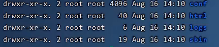

重点目录/文件:

- `conf/nginx. conf` nginx配置文件
- `html` 存放静态文件(html、 CSS、Js等)
- `logs` 日志目录，存放日志文件
- `sbin/nginx` 二进制脚本文件,用于启动、停止Nginx服务


想查看目录结构的话就安装tree：

```
yum install tree
```


# 2.Nginx命令

## 2.1查看版本

```
cd /usr/local/nginx/sbin
./nginx -v
```


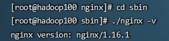


## 2.2检查配置文件正确性

```
./nginx -t
```


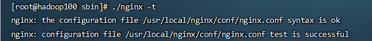


## 2.3启动、关闭防火墙、停止

**启动**

```
./nginx
```


或者： 

```
/usr/local/nginx/sbin/nginx 
```


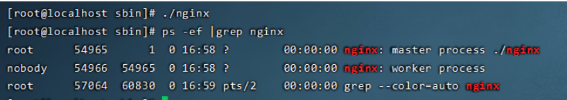

启动后查看进程：

```
ps -ef|grep nginx
```


 **关闭防火墙：**

```
systemctl stop firewalld
 
```


访问ip地址查看静态页面：

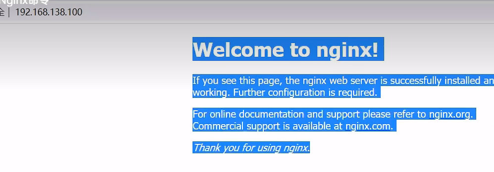


**停止**

```
./nginx -s stop
```


或者

```bash
/usr/local/nginx/sbin/nginx -s stop
```


## 2.4重新加载配置文件

当nginx配置文件修改后，需要重新加载才能生效

```
./nginx -s reload
```


或者 

```
/usr/local/nginx/sbin/nginx -s reload
```


## 2.5配置环境变量，无论在哪输入命令启动nginx都可以

```
vim /etc/profile
```


在PATH加入

```
/usr/local/nginx/sbin：
```


 重新加载文件：

```
source /etc/profile
```


然后就可以在任何目录下直接启动停止Nginx了：


## 2.7 Nginx启动和停止（Windows版）

1.进入[nginx](https://so.csdn.net/so/search?q=nginx&spm=1001.2101.3001.7020)目录，打开cmd

2.启动命令

```
start nginx
```


3.停止命令

```
nginx.exe -s stop
```


3若出现pid不存在无法关闭服务情况，这样才能彻底关闭

```bash
taskkill /f /t /im nginx.exe
```


4.修改配置后重新载入Nginx：


```bash
nginx.exe -s reload
```


# 3.Nginx配置文件结构

> 访问配置文件： 
>
> ```bash
> cd /mydata/nginx
> cd conf
> vi nginx.conf
> ```
>
> 


**Nginx配置文件**(conf/nginx.conf)整体分为三部分: .

- **全局块：**     和Nginx运行相关的全局配置
- **events块：**   和网络连接相关的配置
- **http块：**      代理、缓存、日志记录、虚拟主机配置

**http块包括：**

- **http全局块**
- **server块（server全局块、location块）** 

实际开发中，http块可以引入外部的server块。


**示例**:

"/mydata/nginx/conf/nginx.conf引入“/etc/nginx/conf.d/*.conf”路径下的配置文件：

```bash
#全局块，配置影响Nginx全局的指令
user  nginx;
worker_processes  1;
 
error_log  /var/log/nginx/error.log warn;
pid        /var/run/nginx.pid;
 

events {
# events块，配置网络连接
    worker_connections  1024;
}
 
 
http {
#http全局块，如upstream是上游服务器
    include       /etc/nginx/mime.types;    #支持的mime类型
    default_type  application/octet-stream;    #默认数据类型
 
    log_format  main  '$remote_addr - $remote_user [$time_local] "$request" '    #日志格式
                      '$status $body_bytes_sent "$http_referer" '
                      '"$http_user_agent" "$http_x_forwarded_for"';
 
    access_log  /var/log/nginx/access.log  main;    #日志地址
 
    sendfile        on;
    #tcp_nopush     on;
 
    keepalive_timeout  65;
 
    #gzip  on;    #开启压缩
#配置上游服务器为网关地址
    upstream gulimall{        #配置上游服务器,起名为gulimall
      server 192.168.56.1:88;    #配置上游服务器为网关地址
    }
#server块抽出，在这个路径下扫描，server块配置端口域名路由等信息
    include /etc/nginx/conf.d/*.conf;    #该路径下的配置文件会全部合并到这里
 
 
}
```


/etc/nginx/conf.d/gulimall.conf 

```bash
server {
    listen       80;    #监听此端口
    server_name  gulimall.com;    #监听此域名
 
    #charset koi8-r;
    #access_log  /var/log/nginx/log/host.access.log  main;
 
    location / {    #配置请求的路由
       proxy_set_header Host $host;    #坑点：Nginx代理给网关时会丢失请求的host等信息
       proxy_pass http://gulimall;    #因为主配置文件配置了上游服务器为网关地址，所以可以请求路由到http://192.168.xxx.xxx:10000/
    }
 
    #error_page  404              /404.html;
 
    # redirect server error pages to the static page /50x.html
    #
    error_page   500 502 503 504  /50x.html;
    location = /50x.html {
        root   /usr/share/nginx/html;
    }
 
    # proxy the PHP scripts to Apache listening on 127.0.0.1:80
    #
    #location ~ \.php$ {
    #    proxy_pass   http://127.0.0.1;
    #}
 
    # pass the PHP scripts to FastCGI server listening on 127.0.0.1:9000
    #
    #location ~ \.php$ {
    #    root           html;
    #    fastcgi_pass   127.0.0.1:9000;
    #    fastcgi_index  index.php;
    #    fastcgi_param  SCRIPT_FILENAME  /scripts$fastcgi_script_name;
    #    include        fastcgi_params;
    #}
 
    # deny access to .htaccess files, if Apache's document root
    # concurs with nginx's one
    #
    #location ~ /\.ht {
    #    deny  all;
    #}
}
```


> **注意: http块中可以配置多个Server块,每个Server块中可以配置多个location块。**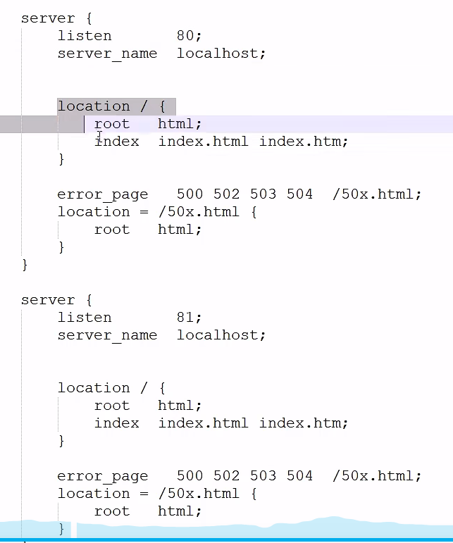

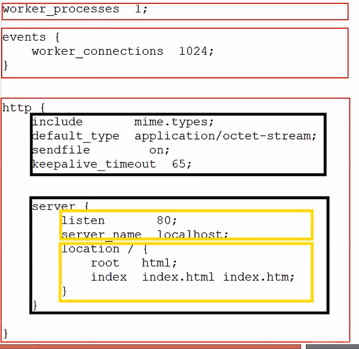

> - worker_connections是每个进程可以处理的连接数。
> - 以后主要配置http块的内容。 


# 4.Nginx具体应用

## 4.1部署静态资源

Nginx可以作为静态web服务器来部署静态资源。**静态资源指在服务端真实存在并且能够直接展示的一些文件**，比如常见的

- html页面、
- Css文件、
- js文件、
- 图片、
- 视频等资源。

**相对于Tomcat, Nginx处理静态资源的能力更加高效**，所以在**生产环境下，一般都会将静态资源部署到Nginx中。** 将静态资源部署到Nginx非常简单，只需要**将文件复制到Nginx安装目录下的html目录中**即可。


> - 这里服务器名称一般是域名。
>
> -  每次修改完配置文件一定要记得重新加载后才能生效： 
>
>   ```
>   ./nginx -s reload
>   ```
>
>   
>
>   

## 4.2反向代理

### 4.2.1正向代理

是一个**位于客户端和原始服务器(origin server)之间的服务器**，为了从原始服务器取得内容，客户端向代理发送一个请求并指定目标(原始服务器)，然后代理向原始服务器转交请求并将获得的内容返回给客户端。

正向代理的典型用途是为**在防火墙内的局域网客户端提供访问Internet的途径**。 正向代理一般是**在客户端设置代理服务器**，通过代理服务器转发请求，最终访问到目标服务器。


### 4.2.2反向代理

反向代理服务器位于用户与目标服务器之间,但是对于用户而言，反向代理服务器就相当于目标服务器，即**用户直接访问反向代理服务器就可以获得目标服务器的资源**，反向代理服务器负责将请求转发给目标服务器。 **用户不需要知道目标服务器的地址，也无须在用户端作任何设定。** 

一方面，反向代理服务器**统一了访问入口**，本来需要分别访问各目标服务器，现在可以只访问反向代理服务器，就可以访问到各目标服务器的资源。

另一方面，目标服务器一般是在公司内网中，客户端直接访问不到。而反向代理服务器既可以通过外网访问，又跟web服务器组成局域网，成为**外网和内网的桥梁**。

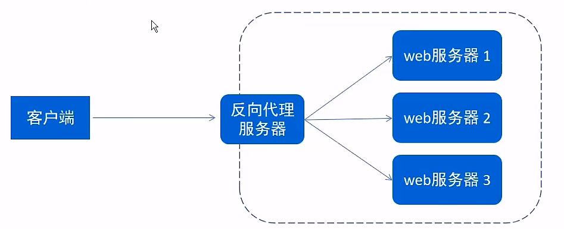


### 4.2.3反向代理配置


**反向代理实现：** 

修改反向代理服务器的 nginx/conf下的nginx.config文件

```bash
server{
    listen 82;
    server name localhost;
    location/ {
    proxy_pass http://192.168.138.101:8080; #反向代理配置，将请求转发到指定网址的服务器
    }
}
```


现在访问[http://192.168.138.100:82和http://192.168.138.101:8080的页面效果一模一样](http://192.168.138.100:82//192.168.138.101:8080的页面效果一模一样)


**反向代理多个服务器：**

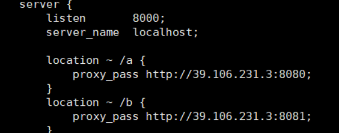


## 4.3负载均衡

### 4.3.0负载均衡介绍 

**负载均衡器是基于反向代理实现的。** 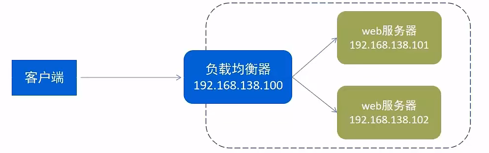

> 早期的网站流量和业务功能都比较简单,单台服务器就可以满足基本需求，但是随着互联网的发展,业务流量越来越大并且业务逻辑也越来越复杂，单台服务器的性能及单点故障问题就凸显出来了，因此**需要多台服务器组成应用集群,进行性能的水平扩展以及避免单点故障出现**。

- **应用集群**:**将同一应用部署到多台机器上**,组成应用集群，接收负载均衡器分发的请求,进行业务处理并返回响应数据
- **负载均衡器**:将用户**请求**根据对应的负载均衡算法**分发到**应用集群中的一台**服务器**进行处理


### 4.3.1配置负载均衡，修改负载均衡器（反向代理服务器的）nginx/conf下的nginx.config文件

```bash
upstream targetserver{    #upstream指令可以定义一组服务器。默认是轮询算法，即几个服务器轮流工作
            server 192.168.138.101:8080; #部署代码，服务器1
            server 192.168.138.101:8081;  #部署代码，服务器2
}
server {
    listen 8080;  //负载均衡器
    server_name localhost;
    location/ {
    proxy_pass http://targetserver;    #之后所有请求就会分发到上面upstream定义的targetserver的服务器集群中
 }
```


访问当前服务器的8080端口（server里定义的），不断刷新，会发现8080和8081轮流展示：

> 注意：192.168.138.101服务器运行了两个不同的springboot的jar包。
>
> 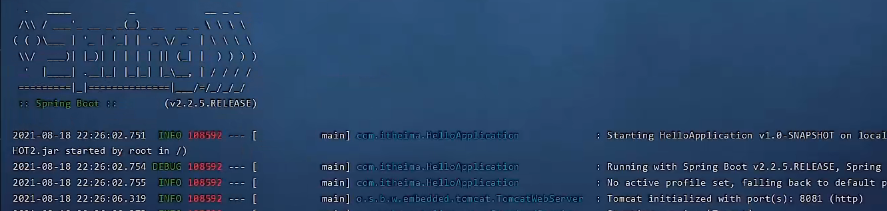


> **对比一下反向代理：**
>
> ```bash
> server{
>     listen 82;
>     server name localhost;
>     location/ {
>     proxy_pass http://192.168.138.101:8080; #反向代理配置，将请求转发到指定服务
>     }
> }
> ```
>
> 

### 4.3.2负载均衡策略


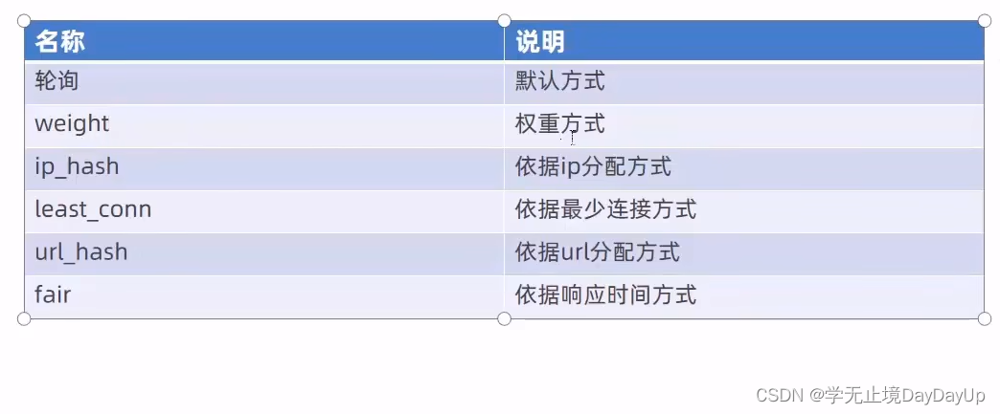

**ip_hash：**根据客户端ip地址算出一个哈希值，分发到某台服务器上。保证同一个ip分发到的服务器是固定的。

**least_conn：**优先把请求分发给客户端连接数最少的服务器。

**url_hash：**根据请求地址算出哈希值，分发到某台服务器上。保证同一个url地址分发到的服务器是固定的。

**fair：**优先把请求分发给响应时间短的服务器。

**权重方式，2:1的权重：** 

```bash
upstream targetserver{    #upstream指令可以定义一组服务器
            server 192.168.138.101:8080 weight=10; #部署代码，服务器1
            server 192.168.138.101:8081 weight=5;  #部署代码，服务器2
}
server {
    listen 8080;  //负载均衡器
    server_name localhost;
    location/ {
    proxy_pass http://targetserver;
 }
```


**测试**

不断刷新，可以发现8080和8081出现的比例大概是2:1


