>  **导航：**
>
> [【Java笔记+踩坑汇总】Java基础+JavaWeb+SSM+SpringBoot+SpringCloud+瑞吉外卖/谷粒商城/学成在线+设计模式+面试题汇总+性能调优/架构设计+源码解析](https://blog.csdn.net/qq_40991313/article/details/126646289?csdn_share_tail={"type"%3A"blog"%2C"rType"%3A"article"%2C"rId"%3A"126646289"%2C"source"%3A"qq_40991313"})

------

[TOC]


# 1 简介 

**Redis是一款c语言开发的、采用key-value数据存储格式的内存级NoSQL数据库**，重点关注数据存储格式，是key-value格式，也就是**键值对的存储形式**。与MySQL数据库不同，MySQL数据库有表、有字段、有记录，Redis没有这些东西，就是**一个名称对应一个值**，并且**数据以存储在内存中使用为主**。 

什么叫以存储在内存中为主？其实**Redis有它的数据持久化方案，分别是RDB和AOF**，但是**Redis自身并不是为了数据持久化而生的，主要是在内存中保存数据，加速数据访问的，所以说是一款内存级数据库。**

**Redis支持多种数据存储格式**，比如可以直接存字符串，也可以存一个map集合，list集合。 

**Redis优点：**

- 基于内存存储，性能高 
- 适用于存储热点数据（例如热点咨询、商品、秒杀）

**用途：**

- 数据库
- **缓存**
- 任务队列
- 消息队列
- 分布式锁

**nosql（not only SQL）：泛指非关系型数据库。**

## 1.1 环境准备

### 1.1.1 Redis下载和安装 

**下载**

**windows版安装包下载地址：**[Releases · tporadowski/redis · GitHub](https://github.com/tporadowski/redis/releases)

**linux版下载**地址:[Index of /releases/](http://download.redis.io/releases/)

**安装**

**linux版安装**

这里下的是4.4.0版本，直接上传到root路径下，分别输入下面命令：

```
tar -zxvf redis-4.0.0.tar.gz -C /usr/local
cd /usr/local/redis-4.0.0
yum install gcc-c++ #安装redis的依赖环境gcc
make
cd src
make install
```


命令对应步骤： 

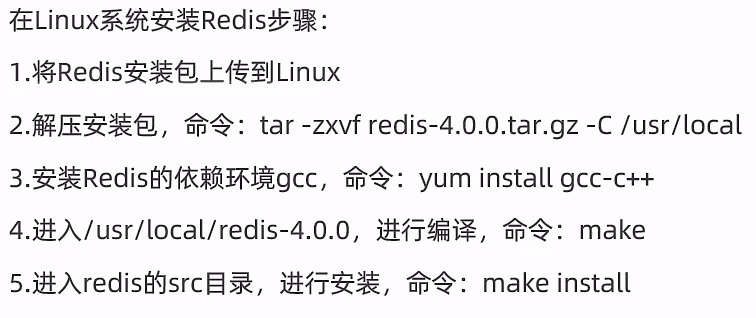


**windows版安装：** 

下载的安装包有两种形式，这里采用的是msi一键安装的msi文件进行安装的。这里下msi，5.0.14版本。

啥是msi，其实就是一个文件安装包，不仅安装软件，还帮你把安装软件时需要的功能关联在一起，打包操作。比如如安装序列、创建和设置安装路径、设置系统依赖项、默认设定安装选项和控制安装过程的属性。说简单点就是一站式服务，安装过程一条龙操作一气呵成，就是为小白用户提供的软件安装程序。

安装时除了路径，其他配置都可以，直接一路next。

安装完毕后会得到如下文件，其中有两个文件对应两个命令，是启动Redis的核心命令，需要再CMD命令行模式执行。


### 1.1.2 linux版启动redis

**启动服务器**

```
cd /usr/local/redis-4.0.0/src
./redis-server
```


> .命令：表示执行的意思，就是执行这个文件。
>
> ./命令：表示执行当前目录下的某个文件，就比如当前目录有一个脚本a.sh，那么./a.sh就表示执行它。

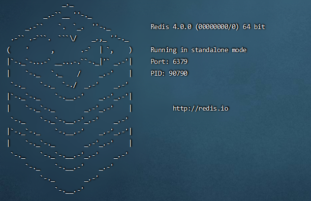 

**新建一个finalshell窗口，启动客户端：**

```
cd /usr/local/redis-4.0.0/src
./redis-cli
```


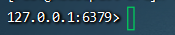 

**修改配置：** 

**修改为后台运行服务器：**

ctrl+c停止第一个窗口的服务器

```
cd /usr/local/redis-4.0.0
vim redis.conf
```


修改成后台运行（/dae回车查到后按i进入编辑模式）：

 

esc后:wq退出vim编辑器。


如果想**设置密码校验**， 就在redis.conf里取消注释：


登录客户端方式 

**设置允许远程连接** 

将这行注释掉：

**远程连接：** 

在Windows的redis安装目录下：

```
.\redis-cli.exe -h 虚拟机ip地址 -p 6379 -a 123456 
```


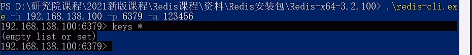 


**后台运行服务器：**

```
cd /usr/local/redis-4.0.0
src/redis-server ./redis.conf
```


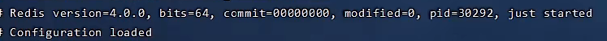 

杀掉后台运行的Redis服务器进程：

```
#查看进程号
ps -ef | grep redis	
kill -9 进程号
```


### **1.1.3 Windows版启动redis**

**启动服务器**


进入安装文件夹下cmd，命令行启动redis-server.exe并指定配置

```cmd
redis-server.exe redis.windows.conf
```


初学者无需调整服务器对外服务端口，**默认6379**。

> **报错：**
>
> 
>
>  **解决：**要先双击启动客户端redis-cli.exe，然后执行命令shutdown停止客户端、exit回车，再次启动服务器就可以了。
>
> 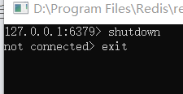
>
> 如果提示下图，则是Redis已经默认启动了：
>
> 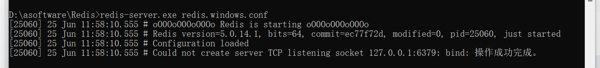
>
> ，可以直接尝试下文的启动客户端。


**启动客户端**

打开另一个cmd窗口： 

```cmd
redis-cli.exe
```


>  也可以直接双击redis-cli.exe这个文件：
>
> 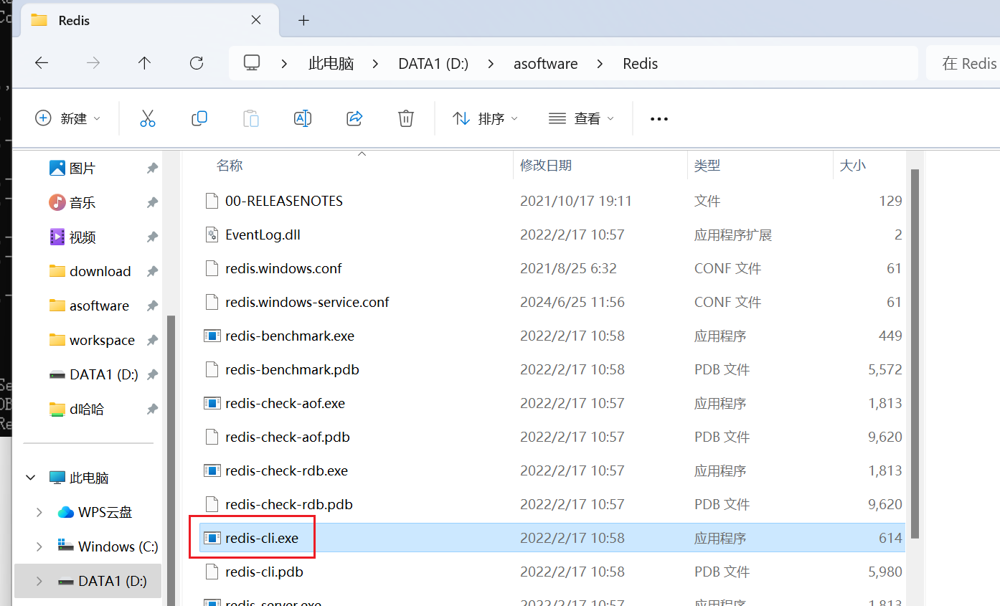

如果启动redis服务器失败，可以先启动客户端，然后执行shutdown停止客户端操作后退出，此时redis服务器就可以正常执行了。


服务器启动后，使用客户端就可以连接服务器，类似于启动完MySQL数据库，然后启动SQL命令行操作数据库。

## 1.2 Redis五种数据类型

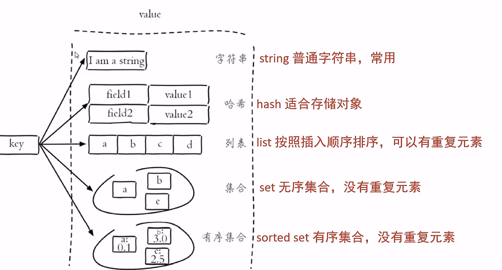


## **1.3 Redis常用命令**

### 通用命令

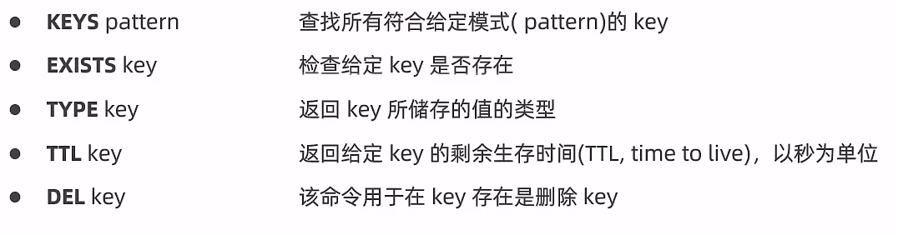

**查看所有**

```
keys * 
```


删除所有key：

```
FLUSHALL
```


### **1.3.1 字符串类型string**

**常用命令**

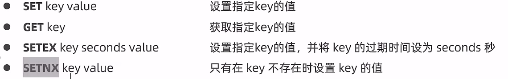 **更多命令请看官网。** 

**举例：** 

**放置一个字符串数据到redis中**，先为数据定义一个名称，比如name,age等，然后使用命令set设置数据到redis服务器中即可

```cmd
set name itheima
set age 12
```


 **从redis中取出已经放入的数据**，根据名称取，就可以得到对应数据。如果没有对应数据就会得到(nil)

```cmd
get name
get age
```


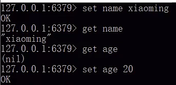 


### **1.3.2 哈希存储模型** **hash**

哈希模型适合存储对象。 

 string的数据存储是一个名称对应一个值，如果要维护的数据过多，可以使用**hash哈希存储模型**，**它一个名称下可以存储多个数据**，**每个数据也可以有自己的二级存储名称**。 

**常用命令：**

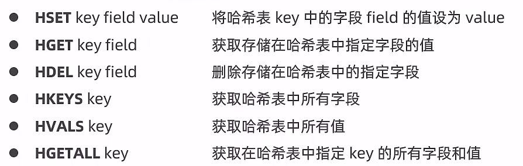 


**举例：**

```java
hset a a1 aa1		#对外key名称是a，在名称为哈希存储模型a中，a1这个key中保存了数据aa1
hset a a2 aa2
```


> 这里a可以理解成一个对象，它有a1、a2两个属性。

获取hash结构中的数据命令如下

```cmd
hget a a1			#得到aa1
hget a a2			#得到aa2
```


有关redis的基础操作就普及到这里，需要全面掌握redis技术，请参看相关教程学习。

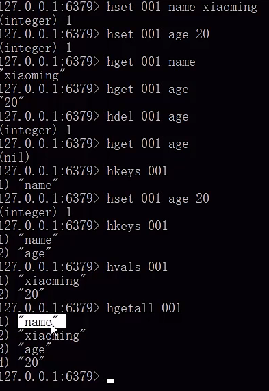

### 1.3.3 列表类型list

简单的字符串列表，按照插入 顺序排序。

**常用命令：**

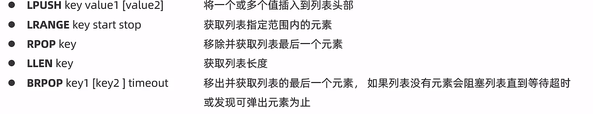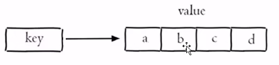 

**lpush意思是从左边头部插入 ，rpop意思是从右边尾部删除。**

> - **在头部插入和遍历，在尾部删除。****对比队列是在队头删除，队尾插入。**
> - **最后插入的元素在遍历时候排第一个。**

**举例：** 

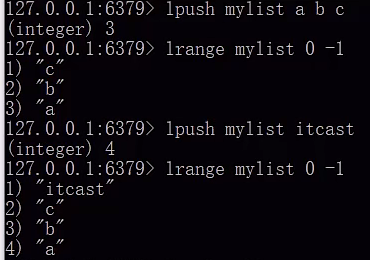 

### 1.3.4 无序集合set

**概念：**

 

**常用命令：**

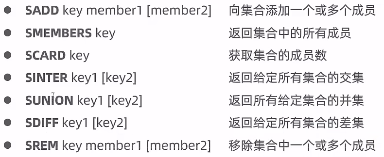

**举例：**

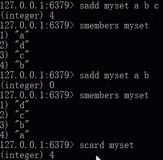 


### 1.3.4 有序集合sorted set

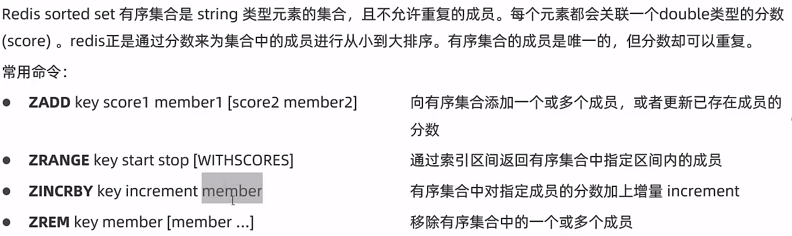 **举例：**

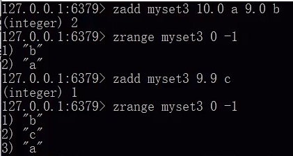 

**zset（有序集合） ：**元素有序不可重复，每个元素关联一个可重复的double类型的分数，Redis是通过这个分数对元素排序的。分数可重复，元素

**zset底层存储结构：**ziplist（压缩列表）或skiplist（跳跃表）。

元素数量小于128个，且每个元素长度小于64字节时使用压缩列表，其他情况使用跳跃表。

- **压缩列表：**本质是一个数组，数组首部存长度、偏移量、元素个数，尾部存结束标识。每个元素使用两个紧挨在一起的压缩列表节点来保存，第一个节点保存元素的成员，第二个节点保存元素的分值。
- **跳跃表：**单向链表按序保存元素及分值，使用哈希表dict来保存元素和分值的映射关系。链表增加了多级索引，先从最上层索引跳跃查，再渐渐往下层到链表地查询，实现了快速查找元素，时间复杂度O(logn)，这种查询算法类似于链表版二分查找，是基于有序的。

**zset底层不使用红黑树的原因：**

- **范围查找：**因为红黑树范围查找效率低，而跳跃表范围查找效率高，因为是链表结构。zset可以用zrange命令查指定范围内元素。
- **实现难度：**跳跃表实现比红黑树简单。

> 压缩列表：
>
> 
>
> 
>
> 跳跃表zrange： 
>
> ```bash
> #将a和b两个元素插入到名称为myzset的有序集合中，并为它们分别设置了分值为10和9
> zset myzset 10.0 a 9.0 b    
> #返回所有元素，并按照它们的分值从小到大排列。结果为b和a。0表示第一个元素，-1表示最后一个元素
> zrange myzset 0 -1  
> ```
>
> 
>
> 

# **2 springboot整合redis** 

## **2.1 lettucs客户端技术操作Redis，默认**

### **2.1.1 RedisTemplate对象**

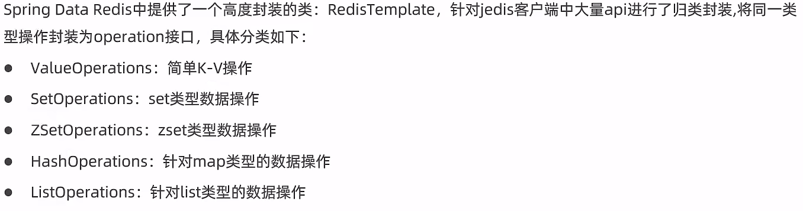


在进行整合之前先梳理一下整合的思想，**springboot整合任何技术其实就是在springboot中使用对应技术的API**。如果两个技术没有交集，就不存在整合的概念了。所谓**整合其实就是使用springboot技术去管理其他技术**，几个问题是躲不掉的。

**第一，需要先导入对应技术的坐标**，而整合之后，这些坐标都有了一些变化

**第二，任何技术通常都会有一些相关的设置信息**，整合之后，这些信息如何写，写在哪是一个问题

**第三**，没有整合之前操作如果是模式A的话，整合之后如果没有给开发者带来一些便捷操作，那整合将毫无意义，所以**整合后操作肯定要简化一些，那对应的操作方式自然也有所不同**

按照上面的三个问题去思考springboot整合所有技术是一种通用思想，在整合的过程中会逐步摸索出整合的套路，而且适用性非常强，经过若干种技术的整合后基本上可以总结出一套固定思维。

**springboot整合redis步骤：**

**步骤①**：**导入springboot整合redis的starter坐标**

```XML
<dependency>
    <groupId>org.springframework.boot</groupId>
    <artifactId>spring-boot-starter-data-redis</artifactId>
</dependency>
```


上述坐标可以在创建模块的时候通过勾选的形式进行选择，归属NoSQL分类中


> **tip:**第二行spring data reactive redis包含了第一行Redis的驱动和访问，现在阶段只用第一行就够了。

**步骤②**：**进行基础配置**

**默认配置：** 

```yaml
spring:
  data:
    redis:
      host: localhost
      port: 6379
```


**操作redis，最基本的信息就是操作哪一台redis服务器，所以服务器地址属于基础配置信息，不可缺少。**但是即便你不配置，目前也是可以用的。因为以上两组信息都是**默认配置值**，刚好就是上述配置值。

> **更丰富配置：**
>
> 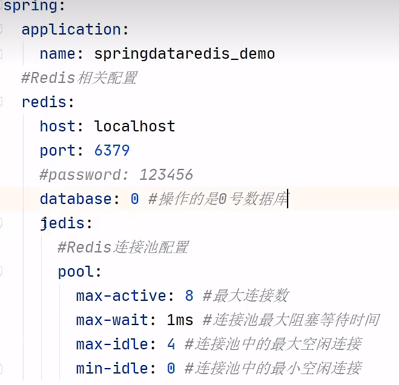
>
> 
>
> **小贴士:**
>
> - 这里database: 0的意思是使用0号数据库，在redis服务器启动后默认提供了16个数据库，不同数据库内容不互通，**默认使用0号数据库**。
> - **修改Redis提供数据库数量：**
>
> conf文件：
>
> 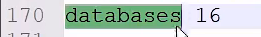
>
> 
>
> - **切换成数据库1：**
>
> 客户端命令行
>
> ```XML
> select 1
> ```
>
> 
>
> 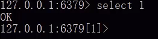

**步骤③：确保之前启动服务器后，自动注入Redis模板对象，获取值操作对象对数据增删改查。**

此处使用的是注入Redis模板对象RedisTemplate的opsForValue()方法获取值操作对象ValueOperations ，通过ValueOperations对象的get和set方法操作数据库。

```java
@SpringBootTest
class Springboot16RedisApplicationTests {
    //自动注入RedisTemplate对象
    @Autowired
    private RedisTemplate redisTemplate;
    //注意ValueOperations 添加是set，HashOperations 添加是put
    @Test
    void set() {
        //获取值简单k-v操作对象ValueOperations。如果想获取hash操作对象要用opsForHash()方法。
        ValueOperations ops = redisTemplate.opsForValue();
        ops.set("age",41);
    }
    @Test
    void get() {
        ValueOperations ops = redisTemplate.opsForValue();
        Object age = ops.get("name");
        System.out.println(age);
    }
    @Test
    void hset() {
        //获取hash类型操作对象HashOperations 
        HashOperations ops = redisTemplate.opsForHash();
        ops.put("info","b","bb");
    }
    @Test
    void hget() {
        HashOperations ops = redisTemplate.opsForHash();
        //hash操作对象的get返回值类型是Object，可以强转为String
        Object val = ops.get("info", "b");
        System.out.println(val);
        //获取keys
        System.out.println(ops.keys("*"));
        System.out.println(ops.keys("info"));
    }
```


**操作list类型数据：**

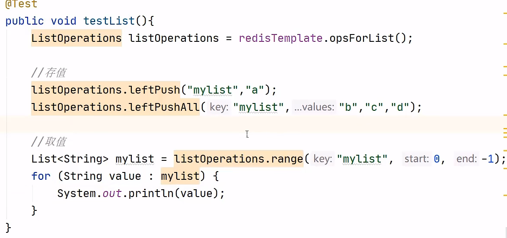 **操作set类型数据：**

 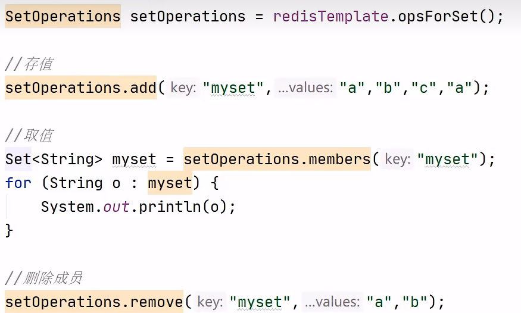

**操作zset类型数据：**

 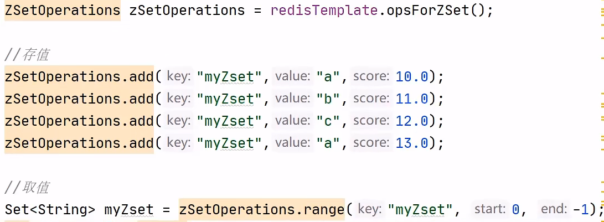

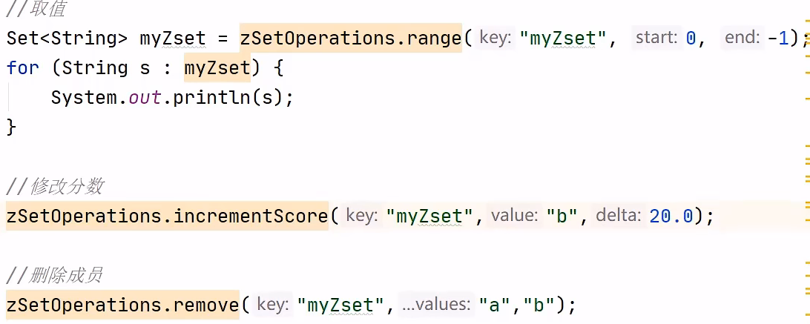

**通用命令：**

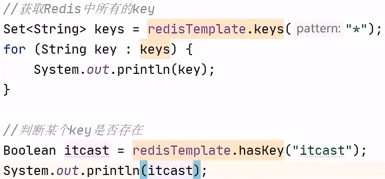 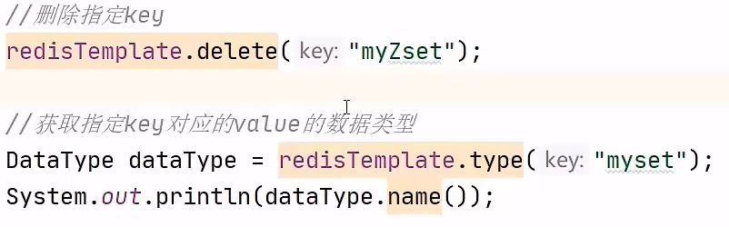


在操作redis时，需要先确认操作何种数据，根据数据种类得到操作接口。例如使用opsForValue()获取string类型的数据操作接口，使用opsForHash()获取hash类型的数据操作接口，剩下的就是调用对应api操作了。各种类型的数据操作接口如下：


### **2.1.2 序列化器问题**

**RedisTemplate是以对象为操作的基本单元，存到数据库的实际内容是序列化后的。**

通过命令行看到是乱码的：


**修改key的序列化器，由jdk序列化器修改为字符串序列化器：**

**方法一，配置类：**


```java
package com.jq.config;

import org.springframework.cache.annotation.CachingConfigurerSupport;
import org.springframework.context.annotation.Bean;
import org.springframework.context.annotation.Configuration;
import org.springframework.data.redis.connection.RedisConnectionFactory;
import org.springframework.data.redis.core.RedisTemplate;
import org.springframework.data.redis.serializer.StringRedisSerializer;
/**
 * Redis配置类
 */
@Configuration
public class RedisConfig extends CachingConfigurerSupport{
    
    @Bean
    public RedisTemplate<Object, Object> redisTemplate(RedisConnectionFactory connectionFactory) {

        RedisTemplate<Object, Object> redisTemplate = new RedisTemplate<>();

        //默认的Key序列化器为：JdkSerializationRedisSerializer
        redisTemplate.setKeySerializer(new StringRedisSerializer());
        redisTemplate.setHashKeySerializer(new StringRedisSerializer());

        redisTemplate.setConnectionFactory(connectionFactory);

        return redisTemplate;
    }

}
```


 测试后可以发现key已经成字符串序列化，而value依然还是jdk序列化，这里就不改了，不影响使用：


 **方法二：使用下一节的StringRedisTemplate**

> **总结**
>
> 1. springboot整合redis步骤
>    1. 导入springboot整合redis的starter坐标
>    2. 进行基础配置
>    3. 使用springboot整合redis的专用客户端接口RedisTemplate操作


### **2.1.3 StringRedisTemplate对象，命令行模式默认**

>  **RedisTemplate**是以对象为操作的基本单元，存到数据库的实际内容是序列化后的。**StringRedisTemplate**是以字符串为操作的基本单元。两个类创建的对象获取数据是不通用的，命令行客户端redis-cli.exe默认使用**StringRedisTemplate。**
>
> 

**由于redis内部不提供java对象的存储格式，因此当操作的数据以对象的形式存在时，会进行转码，转换成字符串格式后进行操作。**为了方便开发者使用**基于字符串为数据的操作**，springboot整合redis时提供了**专用的API接口StringRedisTemplate**，你可以理解为这是RedisTemplate的一种指定数据泛型的操作API。

```java
@SpringBootTest
public class StringRedisTemplateTest {
    @Autowired
    private StringRedisTemplate stringRedisTemplate;
    @Test
    void get(){
        ValueOperations<String, String> ops = stringRedisTemplate.opsForValue();
        String name = ops.get("name");
        System.out.println(name);
    }
}
```


## **2.2 切换jedis客户端技术**

### **2.2.1 RedisTemplate或者StringRedisTemplate** 

**springboot整合redis技术提供了多种客户端兼容模式，默认提供的是lettucs客户端技术**，也可以根据需要切换成指定客户端技术，例如jedis客户端技术。jedis是Redis传统的客户端技术。

**从默认客户端技术lettucs切换成jedis客户端技术：**
 **步骤①**：**导入jedis坐标。**不用加版本号，该坐标被springboot管理。

```xml
<dependency>
    <groupId>redis.clients</groupId>
    <artifactId>jedis</artifactId>
</dependency>
```


> 先确保导入了redis的starter坐标：
>
> ```XML
> <dependency>
>     <groupId>org.springframework.boot</groupId>
>     <artifactId>spring-boot-starter-data-redis</artifactId>
> </dependency>
> ```
>
> 

jedis坐标受springboot管理，无需提供版本号

**步骤②**：**配置客户端技术类型，设置为jedis**

```yaml
spring:
  redis:
    host: localhost
    port: 6379
    client-type: jedis
```


> **也可以根据需要设置对应的配置**
>
> ```yaml
> spring:
>   redis:
>     host: localhost
>     port: 6379
>     client-type: jedis
>     lettuce:
>       pool:
>         max-active: 16
>     jedis:
>       pool:
>         max-active: 16
> ```
>
> 

**步骤③： 整合方法和lettucs一样**

**使用RedisTemplate对象或者StringRedisTemplate对象。**

```java
@SpringBootTest
class Springboot16RedisApplicationTests {
    //自动注入RedisTemplate对象
    @Autowired
    private RedisTemplate redisTemplate;
    //注意ValueOperations 添加是set，HashOperations 添加是put
    @Test
    void set() {
        //获取值操作对象。如果想获取hash操作对象要用opsForHash()方法。
        ValueOperations ops = redisTemplate.opsForValue();
        ops.set("age",41);
    }
    @Test
    void get() {
        ValueOperations ops = redisTemplate.opsForValue();
        Object age = ops.get("name");
        System.out.println(age);
    }
    @Test
    void hset() {
        HashOperations ops = redisTemplate.opsForHash();
        ops.put("info","b","bb");
    }
    @Test
    void hget() {
        HashOperations ops = redisTemplate.opsForHash();
        Object val = ops.get("info", "b");
        System.out.println(val);
    }
}
 
```


> **非Maven项目使用jedis的方法：**
>
> jedis以字符串为操作的基本单元，代码里添加的数据，在命令行模式也能查到。
>
> 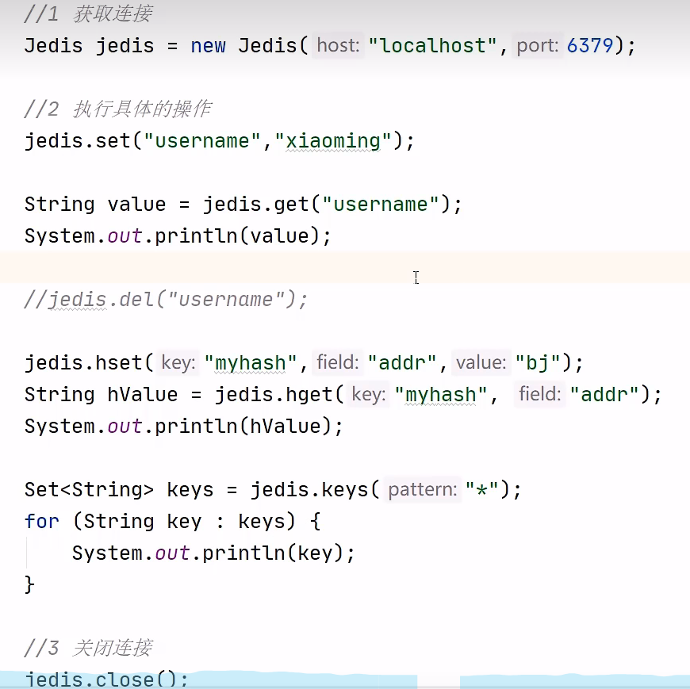

### **2.2.2 lettcus与jedis区别**

- **jedis连接Redis服务器是直连模式，当多线程模式下使用jedis会存在线程安全问题**，解决方案可以通过配置连接池使每个连接专用，这样整体性能就大受影响
- **lettcus基于Netty框架进行与Redis服务器连接**，底层设计中采用StatefulRedisConnection。 StatefulRedisConnection自身是**线程安全的，可以保障并发访问安全问题，所以一个连接可以被多线程复用。**当然lettcus也支持多连接实例一起工作

> **总结**
>
> 1. springboot整合redis提供了StringRedisTemplate对象，以字符串的数据格式操作redis
> 2. 如果需要切换redis客户端实现技术，可以通过配置的形式进行

# 3 Spring Cache

## 3.1 Spring Cache介绍

**Spring Cache是一个框架，实现了基于注解的缓存功能**，只需要简单地加一个注解，就能实现缓存功能。 

Spring Cache提供了一层抽象，底层可以**切换不同的cache实现**。具体就是**通过CacheManager接口来统一不同的缓存技术。** CacheManager是Spring提供的各种缓存技术抽象接口。

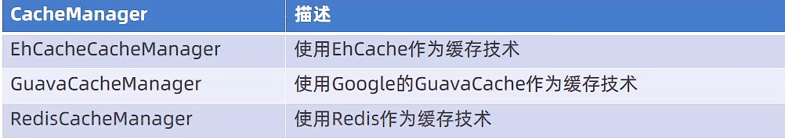

前面学springboot3开发篇时候有简单讲过整合各种缓存技术：

[【黑马Java笔记】SpringBoot基础3——开发_vincewm的博客-CSDN博客_site:csdn.net](https://blog.csdn.net/qq_40991313/article/details/126526529?spm=1001.2014.3001.5501)

## 3.2 Spring Cache常用注解

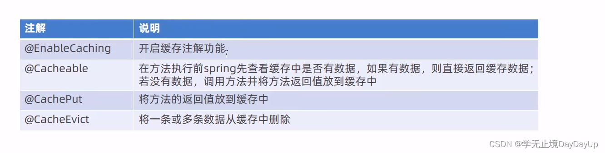

### 3.2.1 依赖、 yml配置、开启缓存

**环境准备**

**导入坐标：**

```XML
 <dependency>
     <groupId>org.springframework.boot</groupId>
     <artifactId>spring-boot-starter-data-redis</artifactId>
 </dependency>
 <dependency>
     <groupId>org.springframework.boot</groupId>
     <artifactId>spring-boot-starter-cache</artifactId>
 </dependency>
```


**yml配置端口：**

```bash
spring:
  redis:
    host: localhost
    port: 6379
  cache:
    type: redis
    redis:
#默认带缓存空间名前缀，例如"ssmCode::12345678"，不加前缀重复可能大，如"12345678"
      use-key-prefix: true
#指定前缀，默认是缓存空间名
      key-prefix: sms_
#是否缓存空值，防止缓存穿透。这个是全局的，也可以在@Cacheable的属性unless="#result==null"局部排除
      cache-null-values: false
#生存时间
      time-to-live: 10s
```


**主启动类开启缓存：**

```java
@SpringBootApplication
//开启过滤器。在SpringBootApplication上使用@ServletComponentScan注解后，Servlet、Filter、Listener可以直接通过@WebServlet、@WebFilter、@WebListener注解自动注册，无需其他代码。
@ServletComponentScan
@EnableTransactionManagement
//开启缓存
@EnableCaching
@Slf4j
public class ReggieApplication {

    public static void main(String[] args) {

        SpringApplication.run(ReggieApplication.class, args);
        log.info("引导类已经启动。。。。");
    }

}
```


> 在spring boot项目中，使用缓存技术只需在项目中**导入相关缓存技术的依赖包**，并在**启动类上使用`@EnableCaching`开启缓存**支持即可。 例如，使用Redis作为缓存技术，只需要导入Spring data Redis的maven坐标即可。

### 3.2.2 key的命名方式 

**示例** 

```java
    //value是缓存名称，一个value下有多个key
    //key是缓存的key，key="#tele"是将方法返回值存到key里。
    @CachePut(value = "smsCode", key = "#tele")
```


**固定key：**

```java
@Cacheable(value="users", key="'key'")    

   public User find(Integer id) {

      returnnull;

   }
```


**变量key：**

**1.直接使用“#参数名”或者“#p参数index”：**

```java
@Cacheable(value="users", key="#id")    //也可以是key="#p0"

   public User find(Integer id) {

      returnnull;

   }


   @Cacheable(value="users", key="#user.id")    //也可以是key="#p0.id"

   public User find(User user) {

      returnnull;

   }
```


**2.root对象可以用来生成key** 

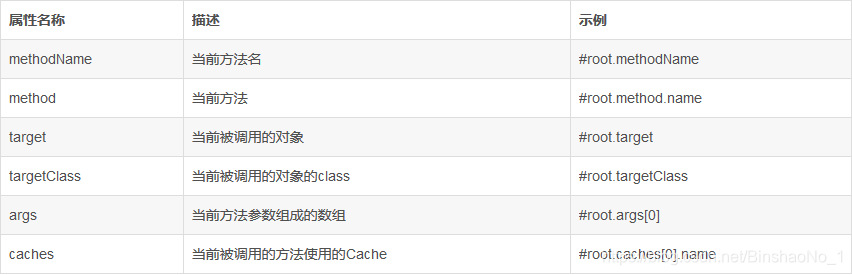

> 当我们要使用root对象的属性作为key时我们也可以**将“#root”省略**，因为Spring默认使用的就是root对象的属性。如：
>
> ```java
>    @Cacheable(value={"users", "xxx"}, key="caches[1].name")
> 
>    public User find(User user) {
> 
>       returnnull;
> 
>    }
> ```
>
> 

3.key="#result.tele"是将返回值存到key里，result.是默认可省略。 

### 3.2.3 注解实现缓存


```java
    @PostMapping
    //allEntries 属性是删除此命名空间下所有的key
    @CacheEvict(value = "setmealCache",allEntries = true)
    public R<String> save(@RequestBody SetmealDto setmealDto) {
        Setmeal setmeal = new Setmeal();
        if (setmealService.saveWithDish(setmealDto)) return R.success("保存成功");
        else return R.error("保存失败");
    }
```


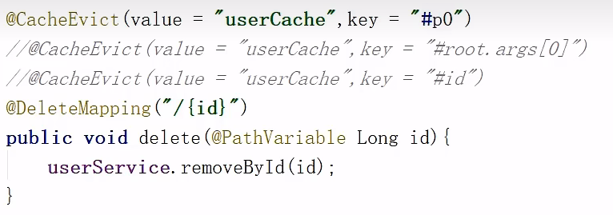


> **注意：**
>
> - **@Cacheable和@CachePut都是方法注解，缓存的是返回值**
> - **@CachePut只存不取**

## 3.3  Spring Cache使用各种缓存

在导入对应坐标后，**通过配置可以切换缓存方法。**

springboot提供了缓存的统一整合接口，方便缓存技术的开发和管理：


### 3.3.1 SpringBoot内置缓存Simple

springboot技术提供有内置的缓存解决方案，可以帮助开发者快速开启缓存技术，并使用缓存技术进行数据的快速操作，例如读取缓存数据和写入数据到缓存。

**步骤①**：**导入springboot提供的缓存技术对应的starter**


```XML
<dependency>
    <groupId>org.springframework.boot</groupId>
    <artifactId>spring-boot-starter-cache</artifactId>
</dependency>
```


**步骤②**：**开启缓存功能**，在**引导类**上方标注注解**@EnableCaching**配置springboot程序中可以使用缓存

```java
@SpringBootApplication
//开启缓存功能
@EnableCaching
public class Springboot19CacheApplication {
    public static void main(String[] args) {
        SpringApplication.run(Springboot19CacheApplication.class, args);
    }
}
```


**步骤③**：**设置操作的数据是否使用缓存**

```java
@Service
public class BookServiceImpl implements BookService {
    @Autowired
    private BookDao bookDao;
    //Cacheable译为可缓存的，可缓冲的。@Cacheable的value属性是存储空间名，key属性是此方法返回值在存储空间内的键名。
    //key属性名必须和形参名一样才能缓存，别忘了#号
    @Cacheable(value="cacheSpace",key="#id")
    public Book getById(Integer id) {
        return bookDao.selectById(id);
    }
}
```


> **注意：**
>
> - **一定一定别忘了#号**
> - **缓存的key属性名必须方法的形参名一样才能缓存。** **只要此key对应的缓存已存在，下次不管查询出什么数据，返回的结果都是直接从缓存的这个key里取。**
> - **被注解@Cacheable声明的方法不能被本类中其他方法调用，原因是spring容器管理问题。**

**在业务方法上面使用注解@Cacheable声明当前方法的返回值放入缓存中，其中要指定缓存的存储位置，以及缓存中保存当前方法返回值对应的名称。**上例中value属性描述缓存的存储位置，可以理解为是一个存储空间名，key属性描述了缓存中保存数据的名称，使用**#id**读取形参中的id值作为缓存名称。

使用@Cacheable注解后，执行当前操作，**如果发现对应名称在缓存中没有数据，就正常读取数据，然后放入缓存；如果对应名称在缓存中有数据，就终止当前业务方法执行，直接返回缓存中的数据。**

**测试缓存已经实现：**

使用postman根据id查询：


 查询多次同一个id，会发现控制台只会输出第一次数据库查询日志：


### 3.3.2 手机验证码模拟案例，@CachePut

为了便于下面演示各种各样的缓存技术，我们创建一个手机验证码的案例环境，模拟使用缓存保存手机验证码的过程。

> 手机验证码案例需求如下：
>
> - 输入手机号获取验证码，组织文档以短信形式发送给用户（页面模拟）
> - 输入手机号和验证码验证结果

为了描述上述操作，我们制作两个表现层接口，一个用来模拟发送短信的过程，其实就是根据用户提供的手机号生成一个验证码，然后放入缓存，另一个用来模拟验证码校验的过程，其实就是使用传入的手机号和验证码进行匹配，并返回最终匹配结果。下面直接制作本案例的模拟代码，先以上例中springboot提供的内置缓存技术来完成当前案例的制作。

**步骤①**：**导入springboot提供的缓存技术对应的starter**

```XML
<dependency>
    <groupId>org.springframework.boot</groupId>
    <artifactId>spring-boot-starter-cache</artifactId>
</dependency>
```


**步骤②**：**启用缓存，在引导类上方标注注解@EnableCaching配置springboot程序中可以使用缓存**

```java
@SpringBootApplication
//开启缓存功能
@EnableCaching
public class Springboot19CacheApplication {
    public static void main(String[] args) {
        SpringApplication.run(Springboot19CacheApplication.class, args);
    }
}
```


**步骤③**：**定义验证码对应的实体类，封装手机号与验证码两个属性**

```java
@Data
public class SMSCode {
    private String tele;
    private String code;
}
```


**步骤④**：**定义验证码功能的业务层接口与实现类**

这里是要新建另外一个工具类，把验证码的生成和获取写在工具类中，并加上缓存注解，然后通过service调用，从而实现缓存。**注意不能直接给service的获取和检查方法设置缓存注解**，因为检查时候它不能直接调用本类的获取方法，spring管理bean的问题。

```java
public interface SMSCodeService {
    public String sendCodeToSMS(String tele);
    public boolean checkCode(SMSCode smsCode);
}

@Service
public class SMSCodeServiceImpl implements SMSCodeService {
    @Autowired
    private CodeUtils codeUtils;
    

    public String sendCodeToSMS(String tele) {
        //使用工具类是为了使用后面的检查方法
        String code = codeUtils.generator(tele);
        return code;
    }
    //取出内存中的验证码与传递过来的验证码比对，如果相同，返回true。
    //参数是包括手机号和验证码的实体类
    public boolean checkCode(SMSCode smsCode) {
        //获取controller传来实体对象的验证码
        String code = smsCode.getCode();
        //获取缓存中的验证码，注意这里必须要使用工具类调用get方法，如果只设置service，直接调用本service里的get方法不是spring容器管理的。
        String cacheCode = codeUtils.get(smsCode.getTele());
        return code.equals(cacheCode);
    }
}
```


获取验证码后，当验证码失效时必须重新获取验证码，因此在获取验证码的功能上不能使用@Cacheable注解，**@Cacheable注解是缓存中没有值则放入值，缓存中有值则取值。**此处的功能仅仅是生成验证码并放入缓存，并不具有从缓存中取值的功能，因此不能使用@Cacheable注解，应该使用仅具有向缓存中保存数据的功能，使用@CachePut注解即可。

对于校验验证码的功能建议放入工具类中进行。

**步骤⑤**：**定义验证码的生成策略与根据手机号读取验证码的功能**

> **不能只用service就实现所检查验证码功能 ，因为被注解@Cacheable声明的方法不能被本类中其他方法调用，原因是spring容器管理问题。**

```java
@Component
public class CodeUtils {
    //补0，防止最终生成验证码转字符串后前几位是0
    private String [] patch = {"000000","00000","0000","000","00","0",""};
    //加密算法生成验证码
    //注解@CachePut是仅把返回值放到缓存里，而不自己取。如果还用@Cacheable多次发验证码，内存值都是第一次的缓存值。
    @CachePut(value = "smsCode", key = "#tele")
    public String generator(String tele){
        //获取手机号字符串的哈希码
        int hash = tele.hashCode();
        //定义加密码
        int encryption = 20206666;
        //哈希码加密码、时间戳分别异或，进行加密
        long result = hash ^ encryption;
        long nowTime = System.currentTimeMillis();
        result = result ^ nowTime;
        long code = result % 1000000;
        code = code < 0 ? -code : code;
        String codeStr = code + "";
        int len = codeStr.length();
        //防止验证码不到6位，补0
        return patch[len] + codeStr;
    }
    //获取缓存中的验证码。
    @Cacheable(value = "smsCode",key="#tele")
    //这里形参名必须和@Cacheable的key名一致。当缓存中对应key有值时，不管返回值是什么都会返回缓存中的值
    public String get(String tele){
        return null;
    }
}
```


**步骤⑥**：**定义验证码功能的web层接口，一个方法用于提供手机号获取验证码，一个方法用于提供手机号和验证码进行校验**

```java
@RestController
@RequestMapping("/sms")
public class SMSCodeController {
    @Autowired
    private SMSCodeService smsCodeService;
    
    @GetMapping
    public String getCode(String tele){
        String code = smsCodeService.sendCodeToSMS(tele);
        return code;
    }
    
    @PostMapping
    public boolean checkCode(SMSCode smsCode){
        return smsCodeService.checkCode(smsCode);
    }
}
```


### 3.3.3 Spring Cache使用Redis

**引入maven依赖**

使用Redis作为缓存技术，只需要导入Spring data Redis的maven

```XML
 <dependency>
     <groupId>org.springframework.boot</groupId>
     <artifactId>spring-boot-starter-cache</artifactId>
 </dependency>

 <dependency>
     <groupId>org.springframework.boot</groupId>
     <artifactId>spring-boot-starter-data-redis</artifactId>
 </dependency>
```


**配置：**

```bash
spring:
  redis:
    host: localhost
    port: 6379
  cache:
    type: redis
    redis:
#默认带缓存空间名前缀，例如"ssmCode::12345678"，不加前缀重复可能大，如"12345678"
      use-key-prefix: true
#指定前缀，默认是缓存空间名
      key-prefix: sms_
#是否缓存空值，防止缓存穿透。这个是全局的，也可以在@Cacheable的属性unless="#result==null"局部排除
      cache-null-values: false
#生存时间
      time-to-live: 10s
```


**Java代码**

```java
@RestController
@RequestMapping("/user")
@Slf4j
public class UserController {

    @Autowired
    private CacheManager cacheManager;

    @Autowired
    private UserService userService;

    /**
      CachePut：将方法返回值放入缓存
      value：缓存的名称，每个缓存名称下面可以有多个key
      key：缓存的key
     /
    @CachePut(value = "userCache",key = "#user.id")
    @PostMapping
    public User save(User user){
        userService.save(user);
        return user;
    }

    /**
      CacheEvict：清理指定缓存
      value：缓存的名称，每个缓存名称下面可以有多个key
      key：缓存的key
     /
    @CacheEvict(value = "userCache",key = "#p0")
    //@CacheEvict(value = "userCache",key = "#root.args[0]")
    //@CacheEvict(value = "userCache",key = "#id")
    @DeleteMapping("/{id}")
    public void delete(@PathVariable Long id){
        userService.removeById(id);
    }

    //@CacheEvict(value = "userCache",key = "#p0.id")
    //@CacheEvict(value = "userCache",key = "#user.id")
    //@CacheEvict(value = "userCache",key = "#root.args[0].id")
    @CacheEvict(value = "userCache",key = "#result.id")
    @PutMapping
    public User update(User user){
        userService.updateById(user);
        return user;
    }

    /**
      Cacheable：在方法执行前spring先查看缓存中是否有数据，如果有数据，则直接返回缓存数据；若没有数据，调用方法并将方法返回值放到缓存中
      value：缓存的名称，每个缓存名称下面可以有多个key
      key：缓存的key
      condition：条件，满足条件时才缓存数据
      unless：满足条件则不缓存
     */
    @Cacheable(value = "userCache",key = "#id",unless = "#result == null")
    @GetMapping("/{id}")
    public User getById(@PathVariable Long id){
        User user = userService.getById(id);
        return user;
    }

    @Cacheable(value = "userCache",key = "#user.id + '_' + #user.name")
    @GetMapping("/list")
    public List<User> list(User user){
        LambdaQueryWrapper<User> queryWrapper = new LambdaQueryWrapper<>();
        queryWrapper.eq(user.getId() != null,User::getId,user.getId());
        queryWrapper.eq(user.getName() != null,User::getName,user.getName());
        List<User> list = userService.list(queryWrapper);
        return list;
    }
}
```

