>  **导航：**
>
> [【Java笔记+踩坑汇总】Java基础+JavaWeb+SSM+SpringBoot+SpringCloud+瑞吉外卖/谷粒商城/学成在线+设计模式+面试题汇总+性能调优/架构设计+源码解析](https://blog.csdn.net/qq_40991313/article/details/126646289?csdn_share_tail={"type"%3A"blog"%2C"rType"%3A"article"%2C"rId"%3A"126646289"%2C"source"%3A"qq_40991313"})
>
> **源码/资料：**
>
> https://wwmg.lanzouk.com/iOufB135ydwj

[TOC]


# 1 项目介绍

## **1.1 技术选型**


**Spring Session：**

可以说是目前非常完美的 **session 共享解决方案**。 它提供一组 API 和实现， **用于管理用户的 session 信息**.它把 servlet 容器实现的 httpSession 替换为 spring-session， 专注于解决 session 管理问题， **Session 信息存储在 Redis 中**， 可简单快速且无缝的集成到我们的应用中。

**Swagger**

是一套规范，**用于生成、描述、调用和可视化 RESTful 风格的 Web 服务**。可用于：**1.接口的文档在线自动生成、2.功能测试、3.前后端分离。**

## 1.2 功能架构


## 1.3 项目预览 

后台管理端：


 

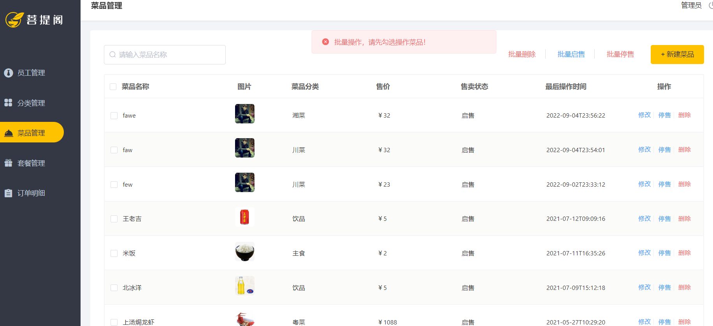


**用户移动端：**

 

 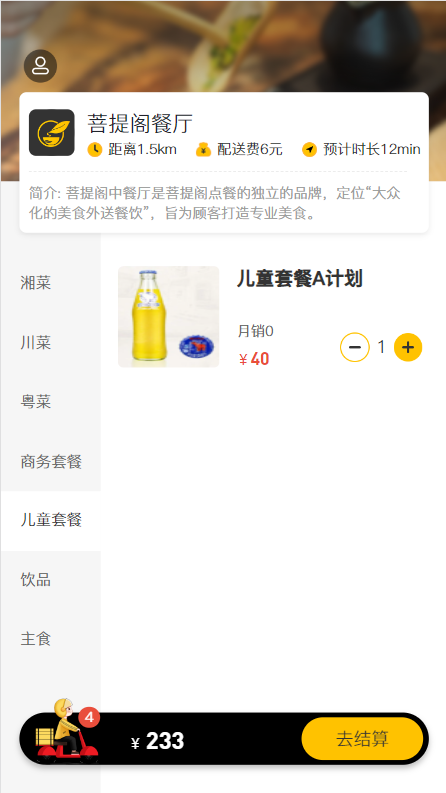


# 2 数据库建库建表

**创建一个名为reggie的数据库：**

```sql
CREATE DATABASE reggie CHARACTER SET utf8mb4;
```


> **编码utf8mb4：**
>
> MySQL在5.5.3之后增加了这个utf8mb4的编码，mb4就是most bytes 4的意思，专门用来兼容四字节的unicode。utf8mb4是utf8的超集，除了将编码改为utf8mb4外不需要做其他转换。
>
> **MySQL的“utf8”实际上不是真正的UTF-8。**
>
> “utf8”只支持每个字符最多三个字节，而真正的UTF-8是每个字符最多四个字节，所以**尽量在mysql中用utf8mb4**。

**导入表：**


**可以用Navicat导入sql文件，也可以命令行：**


```sql
/*
Navicat MySQL Data Transfer

Source Server         : localhost
Source Server Version : 50728
Source Host           : localhost:3306
Source Database       : reggie

Target Server Type    : MYSQL
Target Server Version : 50728
File Encoding         : 65001

Date: 2021-07-23 10:41:41
*/

SET FOREIGN_KEY_CHECKS=0;

-- ----------------------------
-- Table structure for address_book
-- ----------------------------
DROP TABLE IF EXISTS `address_book`;
CREATE TABLE `address_book` (
  `id` bigint(20) NOT NULL COMMENT '主键',
  `user_id` bigint(20) NOT NULL COMMENT '用户id',
  `consignee` varchar(50) COLLATE utf8_bin NOT NULL COMMENT '收货人',
  `sex` tinyint(4) NOT NULL COMMENT '性别 0 女 1 男',
  `phone` varchar(11) COLLATE utf8_bin NOT NULL COMMENT '手机号',
  `province_code` varchar(12) CHARACTER SET utf8mb4 DEFAULT NULL COMMENT '省级区划编号',
  `province_name` varchar(32) CHARACTER SET utf8mb4 DEFAULT NULL COMMENT '省级名称',
  `city_code` varchar(12) CHARACTER SET utf8mb4 DEFAULT NULL COMMENT '市级区划编号',
  `city_name` varchar(32) CHARACTER SET utf8mb4 DEFAULT NULL COMMENT '市级名称',
  `district_code` varchar(12) CHARACTER SET utf8mb4 DEFAULT NULL COMMENT '区级区划编号',
  `district_name` varchar(32) CHARACTER SET utf8mb4 DEFAULT NULL COMMENT '区级名称',
  `detail` varchar(200) CHARACTER SET utf8mb4 DEFAULT NULL COMMENT '详细地址',
  `label` varchar(100) CHARACTER SET utf8mb4 DEFAULT NULL COMMENT '标签',
  `is_default` tinyint(1) NOT NULL DEFAULT '0' COMMENT '默认 0 否 1是',
  `create_time` datetime NOT NULL COMMENT '创建时间',
  `update_time` datetime NOT NULL COMMENT '更新时间',
  `create_user` bigint(20) NOT NULL COMMENT '创建人',
  `update_user` bigint(20) NOT NULL COMMENT '修改人',
  `is_deleted` int(11) NOT NULL DEFAULT '0' COMMENT '是否删除',
  PRIMARY KEY (`id`) USING BTREE
) ENGINE=InnoDB DEFAULT CHARSET=utf8 COLLATE=utf8_bin COMMENT='地址管理';

-- ----------------------------
-- Records of address_book
-- ----------------------------
INSERT INTO `address_book` VALUES ('1417414526093082626', '1417012167126876162', '小明', '1', '13812345678', null, null, null, null, null, null, '昌平区金燕龙办公楼', '公司', '1', '2021-07-20 17:22:12', '2021-07-20 17:26:33', '1417012167126876162', '1417012167126876162', '0');
INSERT INTO `address_book` VALUES ('1417414926166769666', '1417012167126876162', '小李', '1', '13512345678', null, null, null, null, null, null, '测试', '家', '0', '2021-07-20 17:23:47', '2021-07-20 17:23:47', '1417012167126876162', '1417012167126876162', '0');

-- ----------------------------
-- Table structure for category
-- ----------------------------
DROP TABLE IF EXISTS `category`;
CREATE TABLE `category` (
  `id` bigint(20) NOT NULL COMMENT '主键',
  `type` int(11) DEFAULT NULL COMMENT '类型   1 菜品分类 2 套餐分类',
  `name` varchar(64) COLLATE utf8_bin NOT NULL COMMENT '分类名称',
  `sort` int(11) NOT NULL DEFAULT '0' COMMENT '顺序',
  `create_time` datetime NOT NULL COMMENT '创建时间',
  `update_time` datetime NOT NULL COMMENT '更新时间',
  `create_user` bigint(20) NOT NULL COMMENT '创建人',
  `update_user` bigint(20) NOT NULL COMMENT '修改人',
  PRIMARY KEY (`id`) USING BTREE,
  UNIQUE KEY `idx_category_name` (`name`)
) ENGINE=InnoDB DEFAULT CHARSET=utf8 COLLATE=utf8_bin COMMENT='菜品及套餐分类';

-- ----------------------------
-- Records of category
-- ----------------------------
INSERT INTO `category` VALUES ('1397844263642378242', '1', '湘菜', '1', '2021-05-27 09:16:58', '2021-07-15 20:25:23', '1', '1');
INSERT INTO `category` VALUES ('1397844303408574465', '1', '川菜', '2', '2021-05-27 09:17:07', '2021-06-02 14:27:22', '1', '1');
INSERT INTO `category` VALUES ('1397844391040167938', '1', '粤菜', '3', '2021-05-27 09:17:28', '2021-07-09 14:37:13', '1', '1');
INSERT INTO `category` VALUES ('1413341197421846529', '1', '饮品', '11', '2021-07-09 11:36:15', '2021-07-09 14:39:15', '1', '1');
INSERT INTO `category` VALUES ('1413342269393674242', '2', '商务套餐', '5', '2021-07-09 11:40:30', '2021-07-09 14:43:45', '1', '1');
INSERT INTO `category` VALUES ('1413384954989060097', '1', '主食', '12', '2021-07-09 14:30:07', '2021-07-09 14:39:19', '1', '1');
INSERT INTO `category` VALUES ('1413386191767674881', '2', '儿童套餐', '6', '2021-07-09 14:35:02', '2021-07-09 14:39:05', '1', '1');

-- ----------------------------
-- Table structure for dish
-- ----------------------------
DROP TABLE IF EXISTS `dish`;
CREATE TABLE `dish` (
  `id` bigint(20) NOT NULL COMMENT '主键',
  `name` varchar(64) COLLATE utf8_bin NOT NULL COMMENT '菜品名称',
  `category_id` bigint(20) NOT NULL COMMENT '菜品分类id',
  `price` decimal(10,2) DEFAULT NULL COMMENT '菜品价格',
  `code` varchar(64) COLLATE utf8_bin NOT NULL COMMENT '商品码',
  `image` varchar(200) COLLATE utf8_bin NOT NULL COMMENT '图片',
  `description` varchar(400) COLLATE utf8_bin DEFAULT NULL COMMENT '描述信息',
  `status` int(11) NOT NULL DEFAULT '1' COMMENT '0 停售 1 起售',
  `sort` int(11) NOT NULL DEFAULT '0' COMMENT '顺序',
  `create_time` datetime NOT NULL COMMENT '创建时间',
  `update_time` datetime NOT NULL COMMENT '更新时间',
  `create_user` bigint(20) NOT NULL COMMENT '创建人',
  `update_user` bigint(20) NOT NULL COMMENT '修改人',
  `is_deleted` int(11) NOT NULL DEFAULT '0' COMMENT '是否删除',
  PRIMARY KEY (`id`) USING BTREE,
  UNIQUE KEY `idx_dish_name` (`name`)
) ENGINE=InnoDB DEFAULT CHARSET=utf8 COLLATE=utf8_bin COMMENT='菜品管理';

-- ----------------------------
-- Records of dish
-- ----------------------------
INSERT INTO `dish` VALUES ('1397849739276890114', '辣子鸡', '1397844263642378242', '7800.00', '222222222', 'f966a38e-0780-40be-bb52-5699d13cb3d9.jpg', '来自鲜嫩美味的小鸡，值得一尝', '1', '0', '2021-05-27 09:38:43', '2021-05-27 09:38:43', '1', '1', '0');
INSERT INTO `dish` VALUES ('1397850140982161409', '毛氏红烧肉', '1397844263642378242', '6800.00', '123412341234', '0a3b3288-3446-4420-bbff-f263d0c02d8e.jpg', '毛氏红烧肉毛氏红烧肉，确定不来一份？', '1', '0', '2021-05-27 09:40:19', '2021-05-27 09:40:19', '1', '1', '0');
INSERT INTO `dish` VALUES ('1397850392090947585', '组庵鱼翅', '1397844263642378242', '4800.00', '123412341234', '740c79ce-af29-41b8-b78d-5f49c96e38c4.jpg', '组庵鱼翅，看图足以表明好吃程度', '1', '0', '2021-05-27 09:41:19', '2021-05-27 09:41:19', '1', '1', '0');
INSERT INTO `dish` VALUES ('1397850851245600769', '霸王别姬', '1397844263642378242', '12800.00', '123412341234', '057dd338-e487-4bbc-a74c-0384c44a9ca3.jpg', '还有什么比霸王别姬更美味的呢？', '1', '0', '2021-05-27 09:43:08', '2021-05-27 09:43:08', '1', '1', '0');
INSERT INTO `dish` VALUES ('1397851099502260226', '全家福', '1397844263642378242', '11800.00', '23412341234', 'a53a4e6a-3b83-4044-87f9-9d49b30a8fdc.jpg', '别光吃肉啦，来份全家福吧，让你长寿又美味', '1', '0', '2021-05-27 09:44:08', '2021-05-27 09:44:08', '1', '1', '0');
INSERT INTO `dish` VALUES ('1397851370462687234', '邵阳猪血丸子', '1397844263642378242', '13800.00', '1246812345678', '2a50628e-7758-4c51-9fbb-d37c61cdacad.jpg', '看，美味不？来嘛来嘛，这才是最爱吖', '1', '0', '2021-05-27 09:45:12', '2021-05-27 09:45:12', '1', '1', '0');
INSERT INTO `dish` VALUES ('1397851668262465537', '口味蛇', '1397844263642378242', '16800.00', '1234567812345678', '0f4bd884-dc9c-4cf9-b59e-7d5958fec3dd.jpg', '爬行界的扛把子，东兴-口味蛇，让你欲罢不能', '1', '0', '2021-05-27 09:46:23', '2021-05-27 09:46:23', '1', '1', '0');
INSERT INTO `dish` VALUES ('1397852391150759938', '辣子鸡丁', '1397844303408574465', '8800.00', '2346812468', 'ef2b73f2-75d1-4d3a-beea-22da0e1421bd.jpg', '辣子鸡丁，辣子鸡丁，永远的魂', '1', '0', '2021-05-27 09:49:16', '2021-05-27 09:49:16', '1', '1', '0');
INSERT INTO `dish` VALUES ('1397853183287013378', '麻辣兔头', '1397844303408574465', '19800.00', '123456787654321', '2a2e9d66-b41d-4645-87bd-95f2cfeed218.jpg', '麻辣兔头的详细制作，麻辣鲜香，色泽红润，回味悠长', '1', '0', '2021-05-27 09:52:24', '2021-05-27 09:52:24', '1', '1', '0');
INSERT INTO `dish` VALUES ('1397853709101740034', '蒜泥白肉', '1397844303408574465', '9800.00', '1234321234321', 'd2f61d70-ac85-4529-9b74-6d9a2255c6d7.jpg', '多么的有食欲啊', '1', '0', '2021-05-27 09:54:30', '2021-05-27 09:54:30', '1', '1', '0');
INSERT INTO `dish` VALUES ('1397853890262118402', '鱼香肉丝', '1397844303408574465', '3800.00', '1234212321234', '8dcfda14-5712-4d28-82f7-ae905b3c2308.jpg', '鱼香肉丝简直就是我们童年回忆的一道经典菜，上学的时候点个鱼香肉丝盖饭坐在宿舍床上看着肥皂剧，绝了！现在完美复刻一下上学的时候感觉', '1', '0', '2021-05-27 09:55:13', '2021-05-27 09:55:13', '1', '1', '0');
INSERT INTO `dish` VALUES ('1397854652581064706', '麻辣水煮鱼', '1397844303408574465', '14800.00', '2345312·345321', '1fdbfbf3-1d86-4b29-a3fc-46345852f2f8.jpg', '鱼片是买的切好的鱼片，放几个虾，增加味道', '1', '0', '2021-05-27 09:58:15', '2021-05-27 09:58:15', '1', '1', '0');
INSERT INTO `dish` VALUES ('1397854865672679425', '鱼香炒鸡蛋', '1397844303408574465', '2000.00', '23456431·23456', '0f252364-a561-4e8d-8065-9a6797a6b1d3.jpg', '鱼香菜也是川味的特色。里面没有鱼却鱼香味', '1', '0', '2021-05-27 09:59:06', '2021-05-27 09:59:06', '1', '1', '0');
INSERT INTO `dish` VALUES ('1397860242057375745', '脆皮烧鹅', '1397844391040167938', '12800.00', '123456786543213456', 'e476f679-5c15-436b-87fa-8c4e9644bf33.jpeg', '“广东烤鸭美而香，却胜烧鹅说古冈（今新会），燕瘦环肥各佳妙，君休偏重便宜坊”，可见烧鹅与烧鸭在粤菜之中已早负盛名。作为广州最普遍和最受欢迎的烧烤肉食，以它的“色泽金红，皮脆肉嫩，味香可口”的特色，在省城各大街小巷的烧卤店随处可见。', '1', '0', '2021-05-27 10:20:27', '2021-05-27 10:20:27', '1', '1', '0');
INSERT INTO `dish` VALUES ('1397860578738352129', '白切鸡', '1397844391040167938', '6600.00', '12345678654', '9ec6fc2d-50d2-422e-b954-de87dcd04198.jpeg', '白切鸡是一道色香味俱全的特色传统名肴，又叫白斩鸡，是粤菜系鸡肴中的一种，始于清代的民间。白切鸡通常选用细骨农家鸡与沙姜、蒜茸等食材，慢火煮浸白切鸡皮爽肉滑，清淡鲜美。著名的泮溪酒家白切鸡，曾获商业部优质产品金鼎奖。湛江白切鸡更是驰名粤港澳。粤菜厨坛中，鸡的菜式有200余款之多，而最为人常食不厌的正是白切鸡，深受食家青睐。', '1', '0', '2021-05-27 10:21:48', '2021-05-27 10:21:48', '1', '1', '0');
INSERT INTO `dish` VALUES ('1397860792492666881', '烤乳猪', '1397844391040167938', '38800.00', '213456432123456', '2e96a7e3-affb-438e-b7c3-e1430df425c9.jpeg', '广式烧乳猪主料是小乳猪，辅料是蒜，调料是五香粉、芝麻酱、八角粉等，本菜品主要通过将食材放入炭火中烧烤而成。烤乳猪是广州最著名的特色菜，并且是“满汉全席”中的主打菜肴之一。烤乳猪也是许多年来广东人祭祖的祭品之一，是家家都少不了的应节之物，用乳猪祭完先人后，亲戚们再聚餐食用。', '1', '0', '2021-05-27 10:22:39', '2021-05-27 10:22:39', '1', '1', '0');
INSERT INTO `dish` VALUES ('1397860963880316929', '脆皮乳鸽', '1397844391040167938', '10800.00', '1234563212345', '3fabb83a-1c09-4fd9-892b-4ef7457daafa.jpeg', '“脆皮乳鸽”是广东菜中的一道传统名菜，属于粤菜系，具有皮脆肉嫩、色泽红亮、鲜香味美的特点，常吃可使身体强健，清肺顺气。随着菜品制作工艺的不断发展，逐渐形成了熟炸法、生炸法和烤制法三种制作方法。无论那种制作方法，都是在鸽子经过一系列的加工，挂脆皮水后再加工而成，正宗的“脆皮乳鸽皮脆肉嫩、色泽红亮、鲜香味美、香气馥郁。这三种方法的制作过程都不算复杂，但想达到理想的效果并不容易。', '1', '0', '2021-05-27 10:23:19', '2021-05-27 10:23:19', '1', '1', '0');
INSERT INTO `dish` VALUES ('1397861683434139649', '清蒸河鲜海鲜', '1397844391040167938', '38800.00', '1234567876543213456', '1405081e-f545-42e1-86a2-f7559ae2e276.jpeg', '新鲜的海鲜，清蒸是最好的处理方式。鲜，体会为什么叫海鲜。清蒸是广州最经典的烹饪手法，过去岭南地区由于峻山大岭阻隔，交通不便，经济发展起步慢，自家打的鱼放在锅里煮了就吃，没有太多的讲究，但却发现这清淡的煮法能使鱼的鲜甜跃然舌尖。', '1', '0', '2021-05-27 10:26:11', '2021-05-27 10:26:11', '1', '1', '0');
INSERT INTO `dish` VALUES ('1397862198033297410', '老火靓汤', '1397844391040167938', '49800.00', '123456786532455', '583df4b7-a159-4cfc-9543-4f666120b25f.jpeg', '老火靓汤又称广府汤，是广府人传承数千年的食补养生秘方，慢火煲煮的中华老火靓汤，火候足，时间长，既取药补之效，又取入口之甘甜。 广府老火汤种类繁多，可以用各种汤料和烹调方法，烹制出各种不同口味、不同功效的汤来。', '1', '0', '2021-05-27 10:28:14', '2021-05-27 10:28:14', '1', '1', '0');
INSERT INTO `dish` VALUES ('1397862477831122945', '上汤焗龙虾', '1397844391040167938', '108800.00', '1234567865432', '5b8d2da3-3744-4bb3-acdc-329056b8259d.jpeg', '上汤焗龙虾是一道色香味俱全的传统名菜，属于粤菜系。此菜以龙虾为主料，配以高汤制成的一道海鲜美食。本品肉质洁白细嫩，味道鲜美，蛋白质含量高，脂肪含量低，营养丰富。是色香味俱全的传统名菜。', '1', '0', '2021-05-27 10:29:20', '2021-05-27 10:29:20', '1', '1', '0');
INSERT INTO `dish` VALUES ('1413342036832100354', '北冰洋', '1413341197421846529', '500.00', '', 'c99e0aab-3cb7-4eaa-80fd-f47d4ffea694.png', '', '1', '0', '2021-07-09 11:39:35', '2021-07-09 15:12:18', '1', '1', '0');
INSERT INTO `dish` VALUES ('1413384757047271425', '王老吉', '1413341197421846529', '500.00', '', '00874a5e-0df2-446b-8f69-a30eb7d88ee8.png', '', '1', '0', '2021-07-09 14:29:20', '2021-07-12 09:09:16', '1', '1', '0');
INSERT INTO `dish` VALUES ('1413385247889891330', '米饭', '1413384954989060097', '200.00', '', 'ee04a05a-1230-46b6-8ad5-1a95b140fff3.png', '', '1', '0', '2021-07-09 14:31:17', '2021-07-11 16:35:26', '1', '1', '0');

-- ----------------------------
-- Table structure for dish_flavor
-- ----------------------------
DROP TABLE IF EXISTS `dish_flavor`;
CREATE TABLE `dish_flavor` (
  `id` bigint(20) NOT NULL COMMENT '主键',
  `dish_id` bigint(20) NOT NULL COMMENT '菜品',
  `name` varchar(64) COLLATE utf8_bin NOT NULL COMMENT '口味名称',
  `value` varchar(500) COLLATE utf8_bin DEFAULT NULL COMMENT '口味数据list',
  `create_time` datetime NOT NULL COMMENT '创建时间',
  `update_time` datetime NOT NULL COMMENT '更新时间',
  `create_user` bigint(20) NOT NULL COMMENT '创建人',
  `update_user` bigint(20) NOT NULL COMMENT '修改人',
  `is_deleted` int(11) NOT NULL DEFAULT '0' COMMENT '是否删除',
  PRIMARY KEY (`id`) USING BTREE
) ENGINE=InnoDB DEFAULT CHARSET=utf8 COLLATE=utf8_bin COMMENT='菜品口味关系表';

-- ----------------------------
-- Records of dish_flavor
-- ----------------------------
INSERT INTO `dish_flavor` VALUES ('1397849417888346113', '1397849417854791681', '辣度', '[\"不辣\",\"微辣\",\"中辣\",\"重辣\"]', '2021-05-27 09:37:27', '2021-05-27 09:37:27', '1', '1', '0');
INSERT INTO `dish_flavor` VALUES ('1397849739297861633', '1397849739276890114', '忌口', '[\"不要葱\",\"不要蒜\",\"不要香菜\",\"不要辣\"]', '2021-05-27 09:38:43', '2021-05-27 09:38:43', '1', '1', '0');
INSERT INTO `dish_flavor` VALUES ('1397849739323027458', '1397849739276890114', '辣度', '[\"不辣\",\"微辣\",\"中辣\",\"重辣\"]', '2021-05-27 09:38:43', '2021-05-27 09:38:43', '1', '1', '0');
INSERT INTO `dish_flavor` VALUES ('1397849936421761025', '1397849936404983809', '忌口', '[\"不要葱\",\"不要蒜\",\"不要香菜\",\"不要辣\"]', '2021-05-27 09:39:30', '2021-05-27 09:39:30', '1', '1', '0');
INSERT INTO `dish_flavor` VALUES ('1397849936438538241', '1397849936404983809', '辣度', '[\"不辣\",\"微辣\",\"中辣\",\"重辣\"]', '2021-05-27 09:39:30', '2021-05-27 09:39:30', '1', '1', '0');
INSERT INTO `dish_flavor` VALUES ('1397850141015715841', '1397850140982161409', '忌口', '[\"不要葱\",\"不要蒜\",\"不要香菜\",\"不要辣\"]', '2021-05-27 09:40:19', '2021-05-27 09:40:19', '1', '1', '0');
INSERT INTO `dish_flavor` VALUES ('1397850141040881665', '1397850140982161409', '辣度', '[\"不辣\",\"微辣\",\"中辣\",\"重辣\"]', '2021-05-27 09:40:19', '2021-05-27 09:40:19', '1', '1', '0');
INSERT INTO `dish_flavor` VALUES ('1397850392120307713', '1397850392090947585', '辣度', '[\"不辣\",\"微辣\",\"中辣\",\"重辣\"]', '2021-05-27 09:41:19', '2021-05-27 09:41:19', '1', '1', '0');
INSERT INTO `dish_flavor` VALUES ('1397850392137084929', '1397850392090947585', '辣度', '[\"不辣\",\"微辣\",\"中辣\",\"重辣\"]', '2021-05-27 09:41:19', '2021-05-27 09:41:19', '1', '1', '0');
INSERT INTO `dish_flavor` VALUES ('1397850630734262274', '1397850630700707841', '忌口', '[\"不要葱\",\"不要蒜\",\"不要香菜\",\"不要辣\"]', '2021-05-27 09:42:16', '2021-05-27 09:42:16', '1', '1', '0');
INSERT INTO `dish_flavor` VALUES ('1397850630755233794', '1397850630700707841', '辣度', '[\"微辣\",\"中辣\",\"重辣\"]', '2021-05-27 09:42:16', '2021-05-27 09:42:16', '1', '1', '0');
INSERT INTO `dish_flavor` VALUES ('1397850851274960898', '1397850851245600769', '忌口', '[\"不要蒜\",\"不要香菜\",\"不要辣\"]', '2021-05-27 09:43:08', '2021-05-27 09:43:08', '1', '1', '0');
INSERT INTO `dish_flavor` VALUES ('1397850851283349505', '1397850851245600769', '辣度', '[\"不辣\",\"微辣\",\"中辣\",\"重辣\"]', '2021-05-27 09:43:08', '2021-05-27 09:43:08', '1', '1', '0');
INSERT INTO `dish_flavor` VALUES ('1397851099523231745', '1397851099502260226', '忌口', '[\"不要葱\",\"不要蒜\",\"不要香菜\",\"不要辣\"]', '2021-05-27 09:44:08', '2021-05-27 09:44:08', '1', '1', '0');
INSERT INTO `dish_flavor` VALUES ('1397851099527426050', '1397851099502260226', '辣度', '[\"不辣\",\"微辣\",\"中辣\"]', '2021-05-27 09:44:08', '2021-05-27 09:44:08', '1', '1', '0');
INSERT INTO `dish_flavor` VALUES ('1397851370483658754', '1397851370462687234', '温度', '[\"热饮\",\"常温\",\"去冰\",\"少冰\",\"多冰\"]', '2021-05-27 09:45:12', '2021-05-27 09:45:12', '1', '1', '0');
INSERT INTO `dish_flavor` VALUES ('1397851370483658755', '1397851370462687234', '忌口', '[\"不要葱\",\"不要蒜\",\"不要香菜\",\"不要辣\"]', '2021-05-27 09:45:12', '2021-05-27 09:45:12', '1', '1', '0');
INSERT INTO `dish_flavor` VALUES ('1397851370483658756', '1397851370462687234', '辣度', '[\"不辣\",\"微辣\",\"中辣\",\"重辣\"]', '2021-05-27 09:45:12', '2021-05-27 09:45:12', '1', '1', '0');
INSERT INTO `dish_flavor` VALUES ('1397851668283437058', '1397851668262465537', '温度', '[\"热饮\",\"常温\",\"去冰\",\"少冰\",\"多冰\"]', '2021-05-27 09:46:23', '2021-05-27 09:46:23', '1', '1', '0');
INSERT INTO `dish_flavor` VALUES ('1397852391180120065', '1397852391150759938', '忌口', '[\"不要葱\",\"不要香菜\",\"不要辣\"]', '2021-05-27 09:49:16', '2021-05-27 09:49:16', '1', '1', '0');
INSERT INTO `dish_flavor` VALUES ('1397852391196897281', '1397852391150759938', '辣度', '[\"不辣\",\"微辣\",\"重辣\"]', '2021-05-27 09:49:16', '2021-05-27 09:49:16', '1', '1', '0');
INSERT INTO `dish_flavor` VALUES ('1397853183307984898', '1397853183287013378', '辣度', '[\"不辣\",\"微辣\",\"中辣\",\"重辣\"]', '2021-05-27 09:52:24', '2021-05-27 09:52:24', '1', '1', '0');
INSERT INTO `dish_flavor` VALUES ('1397853423486414850', '1397853423461249026', '辣度', '[\"不辣\",\"微辣\",\"中辣\",\"重辣\"]', '2021-05-27 09:53:22', '2021-05-27 09:53:22', '1', '1', '0');
INSERT INTO `dish_flavor` VALUES ('1397853709126905857', '1397853709101740034', '忌口', '[\"不要葱\",\"不要蒜\",\"不要香菜\",\"不要辣\"]', '2021-05-27 09:54:30', '2021-05-27 09:54:30', '1', '1', '0');
INSERT INTO `dish_flavor` VALUES ('1397853890283089922', '1397853890262118402', '辣度', '[\"不辣\",\"微辣\",\"中辣\",\"重辣\"]', '2021-05-27 09:55:13', '2021-05-27 09:55:13', '1', '1', '0');
INSERT INTO `dish_flavor` VALUES ('1397854133632413697', '1397854133603053569', '温度', '[\"热饮\",\"常温\",\"去冰\",\"少冰\",\"多冰\"]', '2021-05-27 09:56:11', '2021-05-27 09:56:11', '1', '1', '0');
INSERT INTO `dish_flavor` VALUES ('1397854652623007745', '1397854652581064706', '忌口', '[\"不要葱\",\"不要蒜\",\"不要香菜\",\"不要辣\"]', '2021-05-27 09:58:15', '2021-05-27 09:58:15', '1', '1', '0');
INSERT INTO `dish_flavor` VALUES ('1397854652635590658', '1397854652581064706', '辣度', '[\"不辣\",\"微辣\",\"中辣\",\"重辣\"]', '2021-05-27 09:58:15', '2021-05-27 09:58:15', '1', '1', '0');
INSERT INTO `dish_flavor` VALUES ('1397854865735593986', '1397854865672679425', '辣度', '[\"不辣\",\"微辣\",\"中辣\",\"重辣\"]', '2021-05-27 09:59:06', '2021-05-27 09:59:06', '1', '1', '0');
INSERT INTO `dish_flavor` VALUES ('1397855742303186946', '1397855742273826817', '辣度', '[\"不辣\",\"微辣\",\"中辣\",\"重辣\"]', '2021-05-27 10:02:35', '2021-05-27 10:02:35', '1', '1', '0');
INSERT INTO `dish_flavor` VALUES ('1397855906497605633', '1397855906468245506', '忌口', '[\"不要葱\",\"不要蒜\",\"不要香菜\",\"不要辣\"]', '2021-05-27 10:03:14', '2021-05-27 10:03:14', '1', '1', '0');
INSERT INTO `dish_flavor` VALUES ('1397856190573621250', '1397856190540066818', '辣度', '[\"不辣\",\"微辣\",\"中辣\",\"重辣\"]', '2021-05-27 10:04:21', '2021-05-27 10:04:21', '1', '1', '0');
INSERT INTO `dish_flavor` VALUES ('1397859056709316609', '1397859056684150785', '辣度', '[\"不辣\",\"微辣\",\"中辣\",\"重辣\"]', '2021-05-27 10:15:45', '2021-05-27 10:15:45', '1', '1', '0');
INSERT INTO `dish_flavor` VALUES ('1397859277837217794', '1397859277812051969', '辣度', '[\"不辣\",\"微辣\",\"中辣\",\"重辣\"]', '2021-05-27 10:16:37', '2021-05-27 10:16:37', '1', '1', '0');
INSERT INTO `dish_flavor` VALUES ('1397859487502086146', '1397859487476920321', '辣度', '[\"不辣\",\"微辣\",\"中辣\",\"重辣\"]', '2021-05-27 10:17:27', '2021-05-27 10:17:27', '1', '1', '0');
INSERT INTO `dish_flavor` VALUES ('1397859757061615618', '1397859757036449794', '甜味', '[\"无糖\",\"少糖\",\"半躺\",\"多糖\",\"全糖\"]', '2021-05-27 10:18:32', '2021-05-27 10:18:32', '1', '1', '0');
INSERT INTO `dish_flavor` VALUES ('1397860242086735874', '1397860242057375745', '辣度', '[\"不辣\",\"微辣\",\"中辣\",\"重辣\"]', '2021-05-27 10:20:27', '2021-05-27 10:20:27', '1', '1', '0');
INSERT INTO `dish_flavor` VALUES ('1397860963918065665', '1397860963880316929', '辣度', '[\"不辣\",\"微辣\",\"中辣\",\"重辣\"]', '2021-05-27 10:23:19', '2021-05-27 10:23:19', '1', '1', '0');
INSERT INTO `dish_flavor` VALUES ('1397861135754506242', '1397861135733534722', '甜味', '[\"无糖\",\"少糖\",\"半躺\",\"多糖\",\"全糖\"]', '2021-05-27 10:24:00', '2021-05-27 10:24:00', '1', '1', '0');
INSERT INTO `dish_flavor` VALUES ('1397861370035744769', '1397861370010578945', '辣度', '[\"不辣\",\"微辣\",\"中辣\",\"重辣\"]', '2021-05-27 10:24:56', '2021-05-27 10:24:56', '1', '1', '0');
INSERT INTO `dish_flavor` VALUES ('1397861683459305474', '1397861683434139649', '忌口', '[\"不要葱\",\"不要蒜\",\"不要香菜\",\"不要辣\"]', '2021-05-27 10:26:11', '2021-05-27 10:26:11', '1', '1', '0');
INSERT INTO `dish_flavor` VALUES ('1397861898467717121', '1397861898438356993', '忌口', '[\"不要葱\",\"不要蒜\",\"不要香菜\",\"不要辣\"]', '2021-05-27 10:27:02', '2021-05-27 10:27:02', '1', '1', '0');
INSERT INTO `dish_flavor` VALUES ('1397862198054268929', '1397862198033297410', '忌口', '[\"不要葱\",\"不要蒜\",\"不要香菜\",\"不要辣\"]', '2021-05-27 10:28:14', '2021-05-27 10:28:14', '1', '1', '0');
INSERT INTO `dish_flavor` VALUES ('1397862477835317250', '1397862477831122945', '辣度', '[\"不辣\",\"微辣\",\"中辣\"]', '2021-05-27 10:29:20', '2021-05-27 10:29:20', '1', '1', '0');
INSERT INTO `dish_flavor` VALUES ('1398089545865015297', '1398089545676271617', '温度', '[\"热饮\",\"常温\",\"去冰\",\"少冰\",\"多冰\"]', '2021-05-28 01:31:38', '2021-05-28 01:31:38', '1', '1', '0');
INSERT INTO `dish_flavor` VALUES ('1398089782323097601', '1398089782285348866', '辣度', '[\"不辣\",\"微辣\",\"中辣\",\"重辣\"]', '2021-05-28 01:32:34', '2021-05-28 01:32:34', '1', '1', '0');
INSERT INTO `dish_flavor` VALUES ('1398090003262255106', '1398090003228700673', '忌口', '[\"不要葱\",\"不要蒜\",\"不要香菜\",\"不要辣\"]', '2021-05-28 01:33:27', '2021-05-28 01:33:27', '1', '1', '0');
INSERT INTO `dish_flavor` VALUES ('1398090264554811394', '1398090264517062657', '忌口', '[\"不要葱\",\"不要蒜\",\"不要香菜\",\"不要辣\"]', '2021-05-28 01:34:29', '2021-05-28 01:34:29', '1', '1', '0');
INSERT INTO `dish_flavor` VALUES ('1398090455399837698', '1398090455324340225', '辣度', '[\"不辣\",\"微辣\",\"中辣\",\"重辣\"]', '2021-05-28 01:35:14', '2021-05-28 01:35:14', '1', '1', '0');
INSERT INTO `dish_flavor` VALUES ('1398090685449023490', '1398090685419663362', '温度', '[\"热饮\",\"常温\",\"去冰\",\"少冰\",\"多冰\"]', '2021-05-28 01:36:09', '2021-05-28 01:36:09', '1', '1', '0');
INSERT INTO `dish_flavor` VALUES ('1398090825358422017', '1398090825329061889', '忌口', '[\"不要葱\",\"不要蒜\",\"不要香菜\",\"不要辣\"]', '2021-05-28 01:36:43', '2021-05-28 01:36:43', '1', '1', '0');
INSERT INTO `dish_flavor` VALUES ('1398091007051476993', '1398091007017922561', '辣度', '[\"不辣\",\"微辣\",\"中辣\",\"重辣\"]', '2021-05-28 01:37:26', '2021-05-28 01:37:26', '1', '1', '0');
INSERT INTO `dish_flavor` VALUES ('1398091296164851713', '1398091296131297281', '辣度', '[\"不辣\",\"微辣\",\"中辣\",\"重辣\"]', '2021-05-28 01:38:35', '2021-05-28 01:38:35', '1', '1', '0');
INSERT INTO `dish_flavor` VALUES ('1398091546531246081', '1398091546480914433', '忌口', '[\"不要葱\",\"不要蒜\",\"不要香菜\",\"不要辣\"]', '2021-05-28 01:39:35', '2021-05-28 01:39:35', '1', '1', '0');
INSERT INTO `dish_flavor` VALUES ('1398091729809747969', '1398091729788776450', '辣度', '[\"不辣\",\"微辣\",\"中辣\",\"重辣\"]', '2021-05-28 01:40:18', '2021-05-28 01:40:18', '1', '1', '0');
INSERT INTO `dish_flavor` VALUES ('1398091889499484161', '1398091889449152513', '辣度', '[\"不辣\",\"微辣\",\"中辣\",\"重辣\"]', '2021-05-28 01:40:56', '2021-05-28 01:40:56', '1', '1', '0');
INSERT INTO `dish_flavor` VALUES ('1398092095179763713', '1398092095142014978', '辣度', '[\"不辣\",\"微辣\",\"中辣\",\"重辣\"]', '2021-05-28 01:41:45', '2021-05-28 01:41:45', '1', '1', '0');
INSERT INTO `dish_flavor` VALUES ('1398092283877306370', '1398092283847946241', '辣度', '[\"不辣\",\"微辣\",\"中辣\",\"重辣\"]', '2021-05-28 01:42:30', '2021-05-28 01:42:30', '1', '1', '0');
INSERT INTO `dish_flavor` VALUES ('1398094018939236354', '1398094018893099009', '辣度', '[\"不辣\",\"微辣\",\"中辣\",\"重辣\"]', '2021-05-28 01:49:24', '2021-05-28 01:49:24', '1', '1', '0');
INSERT INTO `dish_flavor` VALUES ('1398094391494094850', '1398094391456346113', '辣度', '[\"不辣\",\"微辣\",\"中辣\",\"重辣\"]', '2021-05-28 01:50:53', '2021-05-28 01:50:53', '1', '1', '0');
INSERT INTO `dish_flavor` VALUES ('1399574026165727233', '1399305325713600514', '辣度', '[\"不辣\",\"微辣\",\"中辣\",\"重辣\"]', '2021-06-01 03:50:25', '2021-06-01 03:50:25', '1399309715396669441', '1399309715396669441', '0');
INSERT INTO `dish_flavor` VALUES ('1413389540592263169', '1413384757047271425', '温度', '[\"常温\",\"冷藏\"]', '2021-07-12 09:09:16', '2021-07-12 09:09:16', '1', '1', '0');
INSERT INTO `dish_flavor` VALUES ('1413389684020682754', '1413342036832100354', '温度', '[\"常温\",\"冷藏\"]', '2021-07-09 15:12:18', '2021-07-09 15:12:18', '1', '1', '0');

-- ----------------------------
-- Table structure for employee
-- ----------------------------
DROP TABLE IF EXISTS `employee`;
CREATE TABLE `employee` (
  `id` bigint(20) NOT NULL COMMENT '主键',
  `name` varchar(32) COLLATE utf8_bin NOT NULL COMMENT '姓名',
  `username` varchar(32) COLLATE utf8_bin NOT NULL COMMENT '用户名',
  `password` varchar(64) COLLATE utf8_bin NOT NULL COMMENT '密码',
  `phone` varchar(11) COLLATE utf8_bin NOT NULL COMMENT '手机号',
  `sex` varchar(2) COLLATE utf8_bin NOT NULL COMMENT '性别',
  `id_number` varchar(18) COLLATE utf8_bin NOT NULL COMMENT '身份证号',
  `status` int(11) NOT NULL DEFAULT '1' COMMENT '状态 0:禁用，1:正常',
  `create_time` datetime NOT NULL COMMENT '创建时间',
  `update_time` datetime NOT NULL COMMENT '更新时间',
  `create_user` bigint(20) NOT NULL COMMENT '创建人',
  `update_user` bigint(20) NOT NULL COMMENT '修改人',
  PRIMARY KEY (`id`) USING BTREE,
  UNIQUE KEY `idx_username` (`username`)
) ENGINE=InnoDB DEFAULT CHARSET=utf8 COLLATE=utf8_bin COMMENT='员工信息';

-- ----------------------------
-- Records of employee
-- ----------------------------
INSERT INTO `employee` VALUES ('1', '管理员', 'admin', 'e10adc3949ba59abbe56e057f20f883e', '13812312312', '1', '110101199001010047', '1', '2021-05-06 17:20:07', '2021-05-10 02:24:09', '1', '1');

-- ----------------------------
-- Table structure for orders
-- ----------------------------
DROP TABLE IF EXISTS `orders`;
CREATE TABLE `orders` (
  `id` bigint(20) NOT NULL COMMENT '主键',
  `number` varchar(50) COLLATE utf8_bin DEFAULT NULL COMMENT '订单号',
  `status` int(11) NOT NULL DEFAULT '1' COMMENT '订单状态 1待付款，2待派送，3已派送，4已完成，5已取消',
  `user_id` bigint(20) NOT NULL COMMENT '下单用户',
  `address_book_id` bigint(20) NOT NULL COMMENT '地址id',
  `order_time` datetime NOT NULL COMMENT '下单时间',
  `checkout_time` datetime NOT NULL COMMENT '结账时间',
  `pay_method` int(11) NOT NULL DEFAULT '1' COMMENT '支付方式 1微信,2支付宝',
  `amount` decimal(10,2) NOT NULL COMMENT '实收金额',
  `remark` varchar(100) COLLATE utf8_bin DEFAULT NULL COMMENT '备注',
  `phone` varchar(255) COLLATE utf8_bin DEFAULT NULL,
  `address` varchar(255) COLLATE utf8_bin DEFAULT NULL,
  `user_name` varchar(255) COLLATE utf8_bin DEFAULT NULL,
  `consignee` varchar(255) COLLATE utf8_bin DEFAULT NULL,
  PRIMARY KEY (`id`) USING BTREE
) ENGINE=InnoDB DEFAULT CHARSET=utf8 COLLATE=utf8_bin COMMENT='订单表';

-- ----------------------------
-- Records of orders
-- ----------------------------

-- ----------------------------
-- Table structure for order_detail
-- ----------------------------
DROP TABLE IF EXISTS `order_detail`;
CREATE TABLE `order_detail` (
  `id` bigint(20) NOT NULL COMMENT '主键',
  `name` varchar(50) COLLATE utf8_bin DEFAULT NULL COMMENT '名字',
  `image` varchar(100) COLLATE utf8_bin DEFAULT NULL COMMENT '图片',
  `order_id` bigint(20) NOT NULL COMMENT '订单id',
  `dish_id` bigint(20) DEFAULT NULL COMMENT '菜品id',
  `setmeal_id` bigint(20) DEFAULT NULL COMMENT '套餐id',
  `dish_flavor` varchar(50) COLLATE utf8_bin DEFAULT NULL COMMENT '口味',
  `number` int(11) NOT NULL DEFAULT '1' COMMENT '数量',
  `amount` decimal(10,2) NOT NULL COMMENT '金额',
  PRIMARY KEY (`id`) USING BTREE
) ENGINE=InnoDB DEFAULT CHARSET=utf8 COLLATE=utf8_bin COMMENT='订单明细表';

-- ----------------------------
-- Records of order_detail
-- ----------------------------

-- ----------------------------
-- Table structure for setmeal
-- ----------------------------
DROP TABLE IF EXISTS `setmeal`;
CREATE TABLE `setmeal` (
  `id` bigint(20) NOT NULL COMMENT '主键',
  `category_id` bigint(20) NOT NULL COMMENT '菜品分类id',
  `name` varchar(64) COLLATE utf8_bin NOT NULL COMMENT '套餐名称',
  `price` decimal(10,2) NOT NULL COMMENT '套餐价格',
  `status` int(11) DEFAULT NULL COMMENT '状态 0:停用 1:启用',
  `code` varchar(32) COLLATE utf8_bin DEFAULT NULL COMMENT '编码',
  `description` varchar(512) COLLATE utf8_bin DEFAULT NULL COMMENT '描述信息',
  `image` varchar(255) COLLATE utf8_bin DEFAULT NULL COMMENT '图片',
  `create_time` datetime NOT NULL COMMENT '创建时间',
  `update_time` datetime NOT NULL COMMENT '更新时间',
  `create_user` bigint(20) NOT NULL COMMENT '创建人',
  `update_user` bigint(20) NOT NULL COMMENT '修改人',
  `is_deleted` int(11) NOT NULL DEFAULT '0' COMMENT '是否删除',
  PRIMARY KEY (`id`) USING BTREE,
  UNIQUE KEY `idx_setmeal_name` (`name`)
) ENGINE=InnoDB DEFAULT CHARSET=utf8 COLLATE=utf8_bin COMMENT='套餐';

-- ----------------------------
-- Records of setmeal
-- ----------------------------
INSERT INTO `setmeal` VALUES ('1415580119015145474', '1413386191767674881', '儿童套餐A计划', '4000.00', '1', '', '', '61d20592-b37f-4d72-a864-07ad5bb8f3bb.jpg', '2021-07-15 15:52:55', '2021-07-15 15:52:55', '1415576781934608386', '1415576781934608386', '0');

-- ----------------------------
-- Table structure for setmeal_dish
-- ----------------------------
DROP TABLE IF EXISTS `setmeal_dish`;
CREATE TABLE `setmeal_dish` (
  `id` bigint(20) NOT NULL COMMENT '主键',
  `setmeal_id` varchar(32) COLLATE utf8_bin NOT NULL COMMENT '套餐id ',
  `dish_id` varchar(32) COLLATE utf8_bin NOT NULL COMMENT '菜品id',
  `name` varchar(32) COLLATE utf8_bin DEFAULT NULL COMMENT '菜品名称 （冗余字段）',
  `price` decimal(10,2) DEFAULT NULL COMMENT '菜品原价（冗余字段）',
  `copies` int(11) NOT NULL COMMENT '份数',
  `sort` int(11) NOT NULL DEFAULT '0' COMMENT '排序',
  `create_time` datetime NOT NULL COMMENT '创建时间',
  `update_time` datetime NOT NULL COMMENT '更新时间',
  `create_user` bigint(20) NOT NULL COMMENT '创建人',
  `update_user` bigint(20) NOT NULL COMMENT '修改人',
  `is_deleted` int(11) NOT NULL DEFAULT '0' COMMENT '是否删除',
  PRIMARY KEY (`id`) USING BTREE
) ENGINE=InnoDB DEFAULT CHARSET=utf8 COLLATE=utf8_bin COMMENT='套餐菜品关系';

-- ----------------------------
-- Records of setmeal_dish
-- ----------------------------
INSERT INTO `setmeal_dish` VALUES ('1415580119052894209', '1415580119015145474', '1397862198033297410', '老火靓汤', '49800.00', '1', '0', '2021-07-15 15:52:55', '2021-07-15 15:52:55', '1415576781934608386', '1415576781934608386', '0');
INSERT INTO `setmeal_dish` VALUES ('1415580119061282817', '1415580119015145474', '1413342036832100354', '北冰洋', '500.00', '1', '0', '2021-07-15 15:52:55', '2021-07-15 15:52:55', '1415576781934608386', '1415576781934608386', '0');
INSERT INTO `setmeal_dish` VALUES ('1415580119069671426', '1415580119015145474', '1413385247889891330', '米饭', '200.00', '1', '0', '2021-07-15 15:52:55', '2021-07-15 15:52:55', '1415576781934608386', '1415576781934608386', '0');

-- ----------------------------
-- Table structure for shopping_cart
-- ----------------------------
DROP TABLE IF EXISTS `shopping_cart`;
CREATE TABLE `shopping_cart` (
  `id` bigint(20) NOT NULL COMMENT '主键',
  `name` varchar(50) COLLATE utf8_bin DEFAULT NULL COMMENT '名称',
  `image` varchar(100) COLLATE utf8_bin DEFAULT NULL COMMENT '图片',
  `user_id` bigint(20) NOT NULL COMMENT '主键',
  `dish_id` bigint(20) DEFAULT NULL COMMENT '菜品id',
  `setmeal_id` bigint(20) DEFAULT NULL COMMENT '套餐id',
  `dish_flavor` varchar(50) COLLATE utf8_bin DEFAULT NULL COMMENT '口味',
  `number` int(11) NOT NULL DEFAULT '1' COMMENT '数量',
  `amount` decimal(10,2) NOT NULL COMMENT '金额',
  `create_time` datetime DEFAULT NULL COMMENT '创建时间',
  PRIMARY KEY (`id`) USING BTREE
) ENGINE=InnoDB DEFAULT CHARSET=utf8 COLLATE=utf8_bin COMMENT='购物车';

-- ----------------------------
-- Records of shopping_cart
-- ----------------------------

-- ----------------------------
-- Table structure for user
-- ----------------------------
DROP TABLE IF EXISTS `user`;
CREATE TABLE `user` (
  `id` bigint(20) NOT NULL COMMENT '主键',
  `name` varchar(50) COLLATE utf8_bin DEFAULT NULL COMMENT '姓名',
  `phone` varchar(100) COLLATE utf8_bin NOT NULL COMMENT '手机号',
  `sex` varchar(2) COLLATE utf8_bin DEFAULT NULL COMMENT '性别',
  `id_number` varchar(18) COLLATE utf8_bin DEFAULT NULL COMMENT '身份证号',
  `avatar` varchar(500) COLLATE utf8_bin DEFAULT NULL COMMENT '头像',
  `status` int(11) DEFAULT '0' COMMENT '状态 0:禁用，1:正常',
  PRIMARY KEY (`id`) USING BTREE
) ENGINE=InnoDB DEFAULT CHARSET=utf8 COLLATE=utf8_bin COMMENT='用户信息';
```


# 3 开发环境

## 3.1 Maven搭建

**先创建空项目或空文件夹：**


**创建springboot项目**

**pom导入依赖**

> spring-boot-devtools是热部署相关的依赖，commons-lang是工具类。

```XML
<?xml version="1.0" encoding="UTF-8"?>
<project xmlns="http://maven.apache.org/POM/4.0.0" xmlns:xsi="http://www.w3.org/2001/XMLSchema-instance"
         xsi:schemaLocation="http://maven.apache.org/POM/4.0.0 https://maven.apache.org/xsd/maven-4.0.0.xsd">
    <modelVersion>4.0.0</modelVersion>
    <parent>
        <groupId>org.springframework.boot</groupId>
        <artifactId>spring-boot-starter-parent</artifactId>
        <version>2.7.3</version>
        <relativePath/> <!-- lookup parent from repository -->
    </parent>
    <groupId>com.vince</groupId>
    <artifactId>reggie</artifactId>
    <version>0.0.1-SNAPSHOT</version>
    <name>reggie</name>
    <description>reggie</description>
    <properties>
        <java.version>11</java.version>
    </properties>
    <dependencies>
        <dependency>
            <groupId>org.springframework.boot</groupId>
            <artifactId>spring-boot-devtools</artifactId>
            <optional>true</optional>
        </dependency>
        <dependency>
            <groupId>org.springframework.boot</groupId>
            <artifactId>spring-boot-starter</artifactId>
        </dependency>

        <dependency>
            <groupId>org.springframework.boot</groupId>
            <artifactId>spring-boot-starter-test</artifactId>
            <scope>test</scope>
        </dependency>

        <dependency>
            <groupId>org.springframework.boot</groupId>
            <artifactId>spring-boot-starter-web</artifactId>
            <scope>compile</scope>
        </dependency>

        <dependency>
            <groupId>com.baomidou</groupId>
            <artifactId>mybatis-plus-boot-starter</artifactId>
            <version>3.5.2</version>
        </dependency>

        <dependency>
            <groupId>org.projectlombok</groupId>
            <artifactId>lombok</artifactId>
        </dependency>
        <dependency>
            <groupId>com.alibaba</groupId>
            <artifactId>fastjson</artifactId>
            <version>2.0.12</version>
        </dependency>

        <dependency>
            <groupId>commons-lang</groupId>
            <artifactId>commons-lang</artifactId>
            <version>2.6</version>
        </dependency>

        <dependency>
            <groupId>mysql</groupId>
            <artifactId>mysql-connector-java</artifactId>
            <scope>runtime</scope>
        </dependency>

        <dependency>
            <groupId>com.alibaba</groupId>
            <artifactId>druid-spring-boot-starter</artifactId>
            <version>1.2.11</version>
        </dependency>
        <dependency>
            <groupId>org.springframework.boot</groupId>
            <artifactId>spring-boot-starter-test</artifactId>
            <scope>test</scope>
        </dependency>
    </dependencies>

    <build>
        <plugins>
            <plugin>
                <groupId>org.springframework.boot</groupId>
                <artifactId>spring-boot-maven-plugin</artifactId>
            </plugin>
        </plugins>
    </build>

</project>
```


application.yml：

```bash
server:
  port: 80
spring:
  datasource:
    druid:
      driver-class-name: com.mysql.cj.jdbc.Driver
      url: jdbc:mysql://localhost:3306/reggie?serverTimezone=Asia/Shanghai&useUnicode=true&characterEncoding=utf-8&zeroDateTimeBehavior=convertToNull&useSSL=false&allowPublicKeyRetrieval=true
      username: root
      password: 1234
  main:
    banner-mode: off
    #应用名称，可选
  application:
    name: reggie_takeout

mybatis-plus:
  configuration:
    #在映射实体或者属性时，将数据库中表名和字段名中的下划线去掉，开启按照驼峰命名法映射。例如address_book映射成AddressBook
    map-underscore-to-camel-case: true
#    mysql的日志
    log-impl: org.apache.ibatis.logging.stdout.StdOutImpl
  global-config:
    db-config:
      #id生成策略是ASSIGN_ID
      id-type: ASSIGN_ID
    banner: false
#      如果表名有前缀，为了和实体类对应上，设置前缀。或者在实体类@TableName
#      table-prefix: tbl_
```


## 3.2 启动测试

**创建测试类并启动**

> 回顾：@Slf4j注解是lombok依赖中的注解，可以设置日志。


## 3.3 导入前端页面

**存到static目录：**

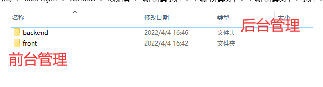

> **扩展：**
>
> **也可以导入到resources中，就需要放行静态页面，设置资源映射，在springmvc里讲过：**
>
> [SpringMVC基础_vincewm的博客-CSDN博客](https://blog.csdn.net/qq_40991313/article/details/126393653?spm=1001.2014.3001.5502)
>
> 在默认页面和前台页面的情况下，直接把这俩拖到resource目录下直接访问是访问不到的，因为被mvc框架拦截了 所以我们要编写一个映射类放行这些资源
>
> 创建配置映射类
>
> 

**访问成功** 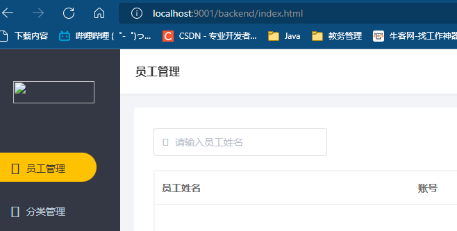


# 4 后台管理端-账户操作

## 4.1 登陆功能

### 4.1.1实体类和结果类

**前端页面**


约定 res.data.code为1时是登录成功。

**数据库的employee员工表：**

员工表存储员工的用户名、密码、身份证等信息，用来后台页面登录。

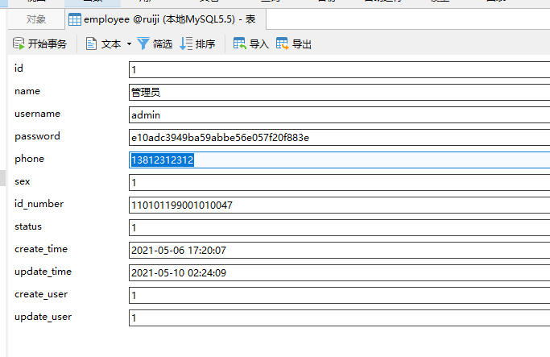

> 这里password是加密后的数据，真实数据是123456


**创建实体类Employee**

> 也可以用mybatis plus逆向工程生成实体类。 参考下面文章的5.1：[【Java笔记+踩坑】MyBatisPlus基础_id-type: assign_id_vincewm的博客-CSDN博客](https://blog.csdn.net/qq_40991313/article/details/126470047)

```java
@Data

//实体类实现Serializable接口，把对象转换为字节序列。序列化操作用于存储时，一般是对于NoSql数据库。
public class Employee implements Serializable {
//在反序列化的过程中，如果接收方为对象加载了一个类，如果该对象的serialVersionUID与对应持久化时的类不同，那么反序列化的过程中将会导致InvalidClassException异常。
    private static final long serialVersionUID = 1L;
    @JsonFormat(shape = JsonFormat.Shape.STRING)
    private Long id;

    private String username;

    private String name;

    private String password;

    private String phone;

    private String sex;

    private String idNumber;

    private Integer status;
    @TableField(fill=FieldFill.INSERT)
    private LocalDateTime createTime;
    @TableField(fill =FieldFill.INSERT_UPDATE)
    private LocalDateTime updateTime;
//阿里巴巴的开发规范中推荐每个表都带有一个createTime 和一个 updateTime， 但是每次自己手动添加太麻烦了，可以配置MP让其自动添加，使用@TableField的fill注解。
    @TableField(fill = FieldFill.INSERT)
    @JsonFormat(shape = JsonFormat.Shape.STRING)
    private Long createUser;

    @TableField(fill = FieldFill.INSERT_UPDATE)
    @JsonFormat(shape = JsonFormat.Shape.STRING)
    private Long updateUser;

}
```


> **@TableField的fill属性**
>
> 默认值是：FieldFill.DEFAULT
>
> | 值            | 描述                 |
> | ------------- | -------------------- |
> | DEFAULT       | 默认不处理           |
> | INSERT        | 插入时填充字段       |
> | UPDATE        | 更新时填充字段       |
> | INSERT_UPDATE | 插入和更新时填充字段 |

**R结果类：**

```java
//用泛型格式，如果controller返回的是页面数据，则return R.success(page);如果返回的是成功消息，则return R.success("success");如果返回错误消息，return R.error("错误原因");
@Data
public class R<T> {

    private Integer code; //编码：1成功，0和其它数字为失败

    private String msg; //错误信息

    private T data; //数据

    private Map map = new HashMap(); //动态数据
    //静态类，controller返回时直接return R.success(T);
    public static <T> R<T> success(T object) {
        R<T> r = new R<T>();
        r.data = object;
        r.code = 1;
        return r;
    }

    public static <T> R<T> error(String msg) {
        R r = new R();
        r.msg = msg;
        r.code = 0;
        return r;
    }
    //添加动态数据
    public R<T> add(String key, Object value) {
        this.map.put(key, value);
        return this;
    }
}
```


### 4.1.2 dao，service，controller

**dao层：**

```java
@Mapper
public interface EmployeeDao extends BaseMapper<Employee> {
}
```


**service层：**

```java
public interface EmployeeService extends IService<Employee> {
}


@Service
public class EmployeeServiceImpl extends ServiceImpl<EmployeeDao, Employee> implements EmployeeService {
}
```


> **这里业务接口继承了IService，业务实现类继承了ServiceImpl<M extends BaseMapper, T>，这样service就继承了Mybatis-plus的各方法、变量。**
>
> 
>
> **ServiceImpl<M extends BaseMapper, T>类各方法（未过期）的作用**
>
> getBaseMapper() getEntityClass() saveBatch() saveOrUpdate() saveOrUpdateBatch() updateBatchById() getOne() getMap() getObj() **ServiceImpl类各属性的作用**
>
> log：打印日志 baseMapper：实现了许多的SQL操作 entityClass：实体类 mapperClass：映射类

**controller层：**

**业务逻辑** 


```java
@Slf4j
@RestController
@RequestMapping("/employee")
public class EmployeeController {

    @Autowired
    private EmployeeService employeeService;

    /**
     * 员工登录
     * @param request
     * @param employee
     * @return
     */
    @PostMapping("/login")
    public R<Employee> login(HttpServletRequest request,@RequestBody Employee employee){

        //1、将页面提交的密码password进行md5加密处理。同一个数据多次md5加密的结果是一样的，所以md5不能解密，但可以通过碰撞解密。
        String password = employee.getPassword();
        password = DigestUtils.md5DigestAsHex(password.getBytes());

        //2、根据页面提交的用户名username查询数据库
        LambdaQueryWrapper<Employee> queryWrapper = new LambdaQueryWrapper<>();
        queryWrapper.eq(Employee::getUsername,employee.getUsername());
        Employee emp = employeeService.getOne(queryWrapper);

        //3、如果没有查询到则返回登录失败结果
        if(emp == null){
            return R.error("用户名或密码错误");
        }

        //4、密码比对，如果不一致则返回登录失败结果
        if(!emp.getPassword().equals(password)){
            return R.error("登录失败");
        }

        //5、查看员工状态，如果为已禁用状态，则返回员工已禁用结果
        if(emp.getStatus() == 0){
            return R.error("账号已被禁用");
        }

        //6、登录成功，将员工id存入Session并返回登录成功结果
        //被忘了存Session，默认有效期30分钟
        request.getSession().setAttribute("employee",emp.getId());
        return R.success(emp);
    }

    /**
     * 员工退出
     * @param request
     * @return
     */
    @PostMapping("/logout")
    public R<String> logout(HttpServletRequest request){
        //清理Session中保存的当前登录员工的id
        request.getSession().removeAttribute("employee");
        return R.success("退出成功");
    }
}
```


> **MD5信息摘要算法**（英语：MD5 Message-Digest Algorithm），一种被广泛使用的[密码散列函数](https://baike.baidu.com/item/密码散列函数/14937715)，可以产生出一个128位（16[字节](https://baike.baidu.com/item/字节/1096318)）的散列值（hash value），用于确保信息传输完整一致。
>
> md5是一种不可逆的加密，一定记住是不可逆的。即得到密文无法还原明文。
>
> **同一个数据多次md5加密的结果是一样的，所以md5不能解密，但可以通过碰撞解密。**
>
> 比如你得到一个md5加密串"E10ADC3949BA59ABBE56E057F20F883E",你有N个密码，通过md5加密加密N个密码，得到其中一个和"E10ADC3949BA59ABBE56E057F20F883E"一致，那么则密码一致。
>
> md5解密网站（实际是靠碰撞解密）：[md5在线解密破解,md5解密加密](https://www.cmd5.com/)

**登出功能：删除Session**

```java
    @RequestMapping("/logout")
    public R logout(HttpServletRequest request){
        //尝试删除
        try {
            request.getSession().removeAttribute("employee");
        }catch (Exception e){
            //删除失败
            return R.error("登出失败");
        }
        return R.success("登出成功");
    }
```


可以看到点击退出后就清除存储信息了。


### **4.1.3 拦截页面登陆（添加过滤器，未登录状态自动跳转登录页面）**

这里的话用户直接url+资源名可以随便访问，所以要加个拦截器或者过滤器，没有登陆时，不给访问，自动跳转到登陆页面。


> **过滤器和拦截器回顾：**
>
> **过滤器：**[JavaWeb基础9——Filter,Listener,Ajax,Axios,JSON_vincewm的博客-CSDN博客](https://blog.csdn.net/qq_40991313/article/details/126156944?ops_request_misc={"request_id"%3A"166187554316782391855874"%2C"scm"%3A"20140713.130102334.pc_blog."}&request_id=166187554316782391855874&biz_id=0&utm_medium=distribute.pc_search_result.none-task-blog-2~blog~first_rank_ecpm_v1~rank_v31_ecpm-1-126156944-null-null.nonecase&utm_term=@WebFilter&spm=1018.2226.3001.4450)
>
> **拦截器：**[SSM整合vincewm的博客-CSDN博客ssm](https://blog.csdn.net/qq_40991313/article/details/126430582?spm=1001.2014.3001.5502)
>
> **拦截器和过滤器之间的区别：**
>
> **归属不同：**Filter属于Servlet技术，依赖于Servlet容器；Interceptor属于SpringMVC技术，不依赖于servlet容器。 **拦截内容不同：**Filter对所有访问进行增强，几乎对所有请求起作用；Interceptor仅针对SpringMVC的访问进行增强，只能对action请求起作用。 **调用次数不同：**在action的生命周期中，过滤器只能在容器初始化时被调用一次，而拦截器可以多次被调用。 **获取bean的权限不同：**过滤器不能获取IOC容器中的各个bean；拦截器就可以，因为拦截器本身是个bean。这点很重要，在拦截器里注入一个service，可以调用业务逻辑。 底层机制不同：过滤器是基于函数回调，拦截器是基于java的反射机制的。


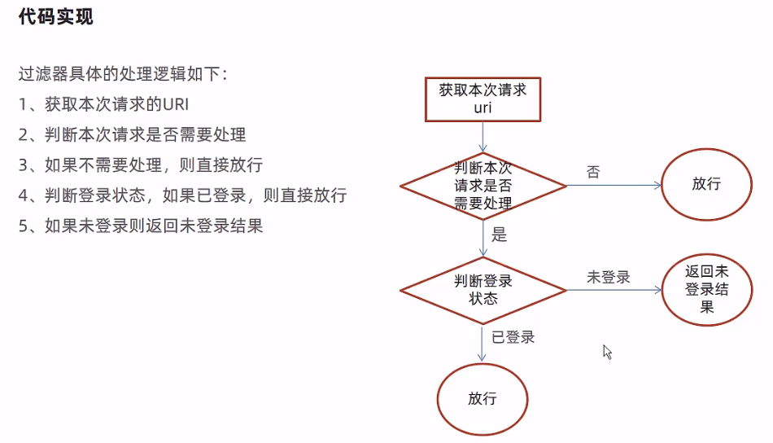

**代码实现：**

**1.在引导类注解\****@ServletComponentScan**

**2.在filter包下编写过滤器：**

```java
//坑点，路径是"/*"，别忘了*
@WebFilter(filterName = "loginCheckFilter",urlPatterns = "/*")
@Slf4j
public class LoginCheckFilter implements Filter{
    //路径匹配器，支持通配符，别忘了
    public static final AntPathMatcher PATH_MATCHER = new AntPathMatcher();

    @Override
    public void doFilter(ServletRequest servletRequest, ServletResponse servletResponse, FilterChain filterChain) throws IOException, ServletException {
        //0.要先把请求响应ServletXxx转成它的子接口HttpServletXxx，从而多了一些针对于Http协议的方法
        HttpServletRequest request = (HttpServletRequest) servletRequest;
        HttpServletResponse response = (HttpServletResponse) servletResponse;

        //1、获取本次请求的URI
        String requestURI = request.getRequestURI();// /backend/index.html

        log.info("拦截到请求：{}",requestURI);

        //定义不需要处理的请求路径，前端页面可以放行，只是除登录登出的后端拦截就行。
        String[] urls = new String[]{
                "/employee/login",
                "/employee/logout",
                "/backend/**",
                "/front/**"
        };


        //2、判断本次请求是否需要处理
        boolean check = check(urls, requestURI);

        //3、如果不需要处理，则直接放行
        if(check){
            log.info("本次请求{}不需要处理",requestURI);
            filterChain.doFilter(request,response);
            return;
        }

        //4、判断登录状态，如果已登录，则直接放行
        if(request.getSession().getAttribute("employee") != null){
            log.info("用户已登录，用户id为：{}",request.getSession().getAttribute("employee"));
            filterChain.doFilter(request,response);
            return;
        }

        log.info("用户未登录");
        //5、如果未登录则返回未登录结果，通过输出流方式向客户端页面响应数据
        //必须错误信息NOTLOGIN，因为前端根据msg==“NOTLOGIN”和code==0判断未登录
        response.getWriter().write(JSON.toJSONString(R.error("NOTLOGIN")));
        return;

    }

    /**
     * 路径匹配，检查本次请求是否需要放行
     * @param urls
     * @param requestURI
     * @return
     */
    public boolean check(String[] urls,String requestURI){
        for (String url : urls) {
            //这里是坑点，不能用equals
            boolean match = PATH_MATCHER.match(url, requestURI);
            if(match){
                return true;
            }
        }
        return false;
    }
}
```


> **坑点：**
>
> - **0.别忘了引导类注解@ServletComponentScan**
> - **1.通配符/\*，别忘了\*号**
> - **2.别忘了创建静态final对象AntPathMatcher ，用它的match()方法进行url匹配，不能用equals。**

**响应到前端的是否登录信息将在requeset.js中处理：**

其实所有前端页面都引用了js/request.js里的前端拦截器，前端拦截器完成跳转到登陆页面，不在后端做处理 

## 4.2 新增员工

**新增员工功能**，（前端对手机号和身份证号长度做了一个校验） 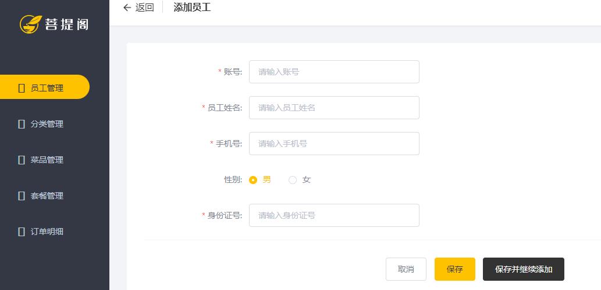

**分析数据库**，注意点是id为主键，所有字段非null， status默认值为1表示启用

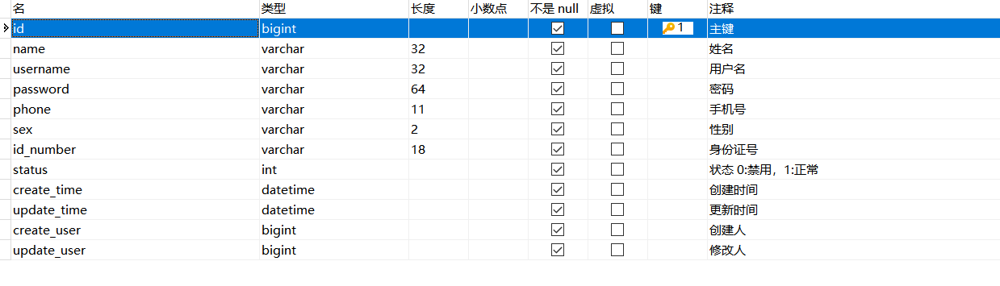

**前端页面：**


**请求 URL:** http://localhost:9001/employee （POST请求）

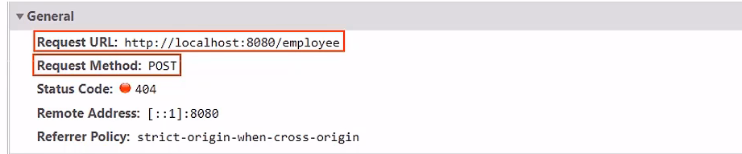


**代码执行过程：**


**id雪花自增算法**，改不改都行，Mybatis-plus默认自增就是ASSIGN_ID 

**代码实现：**

```java
    @PostMapping
    public R<String> save(HttpServletRequest request,@RequestBody Employee employee){
        log.info("新增员工，员工信息：{}",employee.toString());

        //前端没有设置密码框，这里设置初始密码123456，需要进行md5加密处理。正常可以把"12345"改成employee.getPassword()
        employee.setPassword(DigestUtils.md5DigestAsHex("123456".getBytes()));

        employee.setCreateTime(LocalDateTime.now());
        employee.setUpdateTime(LocalDateTime.now());

        //获得当前登录用户的id
        Long empId = (Long) request.getSession().getAttribute("employee");

        employee.setCreateUser(empId);
        employee.setUpdateUser(empId);

        employeeService.save(employee);
//登录失败情况由下一节异常拦截处理
        return R.success("新增员工成功");
    }
```


## 4.3 全局异常拦截处理

先看看这种代码的try catch 这种try catch来捕获异常固然好，**但是，代码量一大起来，超级多的try catch就会很乱** **全局异常处理代码实现**

在Common包下：

```java
//@RestControllerAdvice包括了下面两行
@ControllerAdvice(annotations = {RestController.class, Controller.class})
@ResponseBody
@Slf4j
public class GlobalExceptionHandler {

    /**
     * 异常处理方法
     * @return
     */
    //捕获完整性约束违反异常（其实就是数据库唯一约束异常）SQLIntegrityConstraintViolationException
    @ExceptionHandler(SQLIntegrityConstraintViolationException.class)
    public R<String> exceptionHandler(SQLIntegrityConstraintViolationException ex){
        log.error(ex.getMessage());

        if(ex.getMessage().contains("Duplicate entry")){
            return R.error("唯一约束异常:"+exception.getMessage().split(" ")[2]+"已存在");
        }

        return R.error("未知唯一约束错误");
    }
}
```


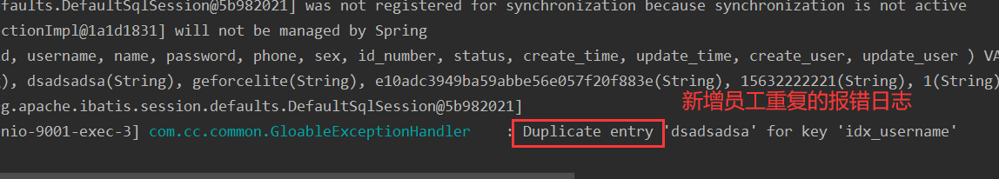 当报错信息出现Duplicate entry时，就意味着新增员工异常了 所以，我们对异常类的方法进行一些小改动，让这个异常反馈变得更人性化 这个时候再来客户端试试，就会提供人性化的报错，非常的快乐~


**这回再回到Controller，这时就不需要再来try catch这种形式了，不用管他，因为一旦出现错误就会被我们的AOP捕获。所以，不需要再用try catch来抓了** 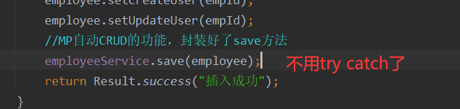 异常类位置：`com.cc.common.GloableExceptionHandler`

## 4.4 员工信息分页查询

### 4.4.1 接口分析

**需求** **分页请求接口**


**查询员工及显示接口** 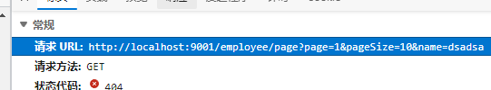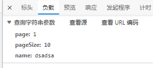

**逻辑流程** 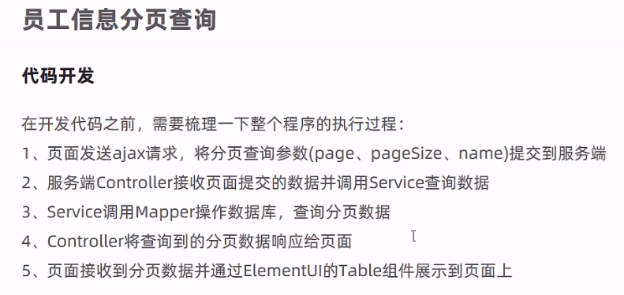

### 4.4.2 Mybatis-plus实现分页

**步骤1.mp分页拦截器**

在config包下：

```java
@Configuration
public class MybatisPlusConfig {

    @Bean
    public MybatisPlusInterceptor mybatisPlusInterceptor(){
        MybatisPlusInterceptor mybatisPlusInterceptor = new MybatisPlusInterceptor();
        mybatisPlusInterceptor.addInnerInterceptor(new PaginationInnerInterceptor());
        return mybatisPlusInterceptor;
    }
}
```


**步骤2.分页查询**

```java
    @GetMapping("/page")
    public R<Page> page(int page,int pageSize,String name){
        log.info("page = {},pageSize = {},name = {}" ,page,pageSize,name);

        //构造分页构造器
        Page pageInfo = new Page(page,pageSize);

        //构造条件构造器
        LambdaQueryWrapper<Employee> queryWrapper = new LambdaQueryWrapper();
        //添加过滤条件
        // StringUtils.isNotEmpty(name)判断为空的标准是name!=null&name.length>0
        queryWrapper.like(StringUtils.isNotEmpty(name),Employee::getName,name);
        //添加排序条件
        queryWrapper.orderByDesc(Employee::getUpdateTime);

        //执行查询
        employeeService.page(pageInfo,queryWrapper);

        return R.success(pageInfo);
    }
```


**步骤3.测试分页：**


将前端页面，展示每页行数的数组改成[1,2,3,4]，然后ctrl+f5强制刷新，不然有缓存


> **StringUtils.isNotEmpty(name)判断为空的标准是name!=null&name!=""**

### 4.5 启用禁用员工账号，js主键丢失精度问题

**只有管理员账号有禁用启用按钮：**


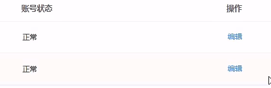

**前端如何判断当前用户是admin？缓存：**

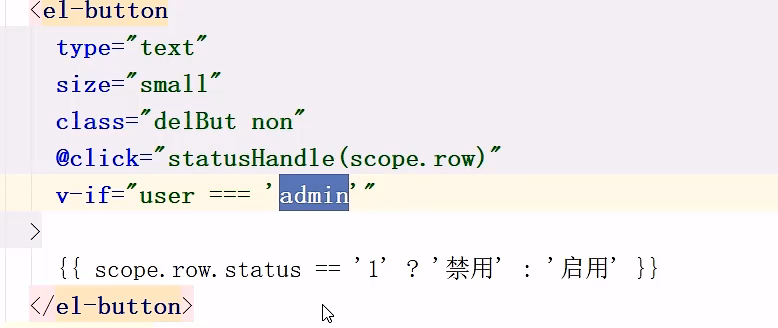

**点击禁用后发送请求：**


**js丢失long精度问题**

Long类型id是19位，而js只能处理17位数字，Long类型主键从前端传回后端丢失精度，导致传到后端的id和数据库id不一致：

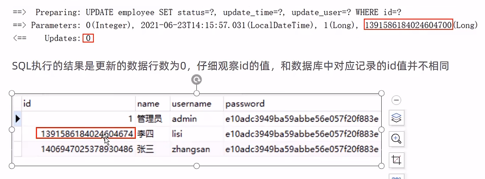

**解决方案：实体类注解@JsonFormat**

```
    @JsonFormat(shape = JsonFormat.Shape.STRING)
    private Long id;
```


## 4.6 修改员工窗口回显信息


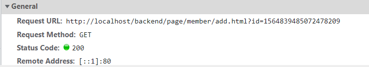


**代码实现：**

```java
    @GetMapping("/{id}")
    public R<Employee> getById(@PathVariable Long id){
        Employee employee = employeeService.getById(id);
        log.info("查询到员工：{}",employee);
        if(employee!=null)
        return R.success(employee);
        else return R.error("找不到这个员工");
    }
```


## 4.7 公共字段自动填充，@TableField的fill

**TheadLocal**

> 
>
> **客户端发送的每次http请求，在服务端都会分配新的线程。因此登录检查过滤器、controller、元数据对象处理器属于一个线程。**

**TheadLocal是线程的局部变量：**

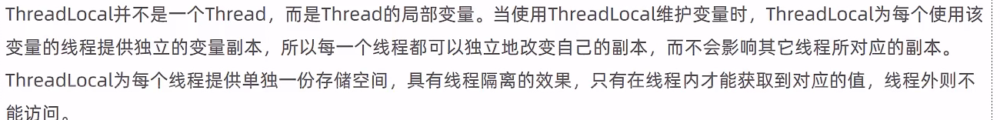**TheadLocal常用方法：**


**如何在元数据对象处理器中获取当前登录用户的id？**

因为**登录检查过滤器、controller、元数据对象处理器属于一个线程，**所以可以在filter中获取登录用户的id，set到ThreadLocal中，在元数据处理器中get到线程局部变量ThreadLocal的值。

**代码实现：**

**第一步，实体类注解：**

```java
    @TableField(fill = FieldFill.INSERT) //插入时填充字段
    private LocalDateTime createTime;

    @TableField(fill = FieldFill.INSERT_UPDATE) //插入和更新时填充字段
    private LocalDateTime updateTime;

    @TableField(fill = FieldFill.INSERT) //插入时填充字段
    private Long createUser;

    @TableField(fill = FieldFill.INSERT_UPDATE) //插入和更新时填充字段
    private Long updateUser;
```


**第二步，封装基于ThreadLocal的工具类**

在common包下：

```java
/**
 * 基于ThreadLocal封装工具类，用户保存和获取当前登录用户id
 */
public class BaseContext {
    private static ThreadLocal<Long> threadLocal = new ThreadLocal<>();

    /**
     * 设置值
     * @param id
     */
    public static void setCurrentId(Long id){
        threadLocal.set(id);
    }

    /**
     * 获取值
     * @return
     */
    public static Long getCurrentId(){
        return threadLocal.get();
    }
}
```


**第三步，登录检查过滤器把id加到ThreadLocal**

```java
        //4、判断登录状态，如果已登录，则直接放行
        if(request.getSession().getAttribute("employee") != null){
            log.info("用户已登录，用户id为：{}",request.getSession().getAttribute("employee"));
            //这里要强转，虽然request.getSession().getAttribute("employee")类型确实是Long
            Long empId = (Long) request.getSession().getAttribute("employee");
            BaseContext.setCurrentId(empId);

            filterChain.doFilter(request,response);
            return;
        }
```


**第四步，自定义元数据对象处理器，获取ThreadLocal的id**

在common包下：

```java
/**
 * 自定义元数据对象处理器
 */
@Component
@Slf4j
public class MyMetaObjectHandler implements MetaObjectHandler {
    /**
     * 插入操作，自动填充
     * @param metaObject
     */
    @Override
    public void insertFill(MetaObject metaObject) {
        log.info("公共字段自动填充[insert]...");
        log.info(metaObject.toString());
        //第一个参数属性名，第二个参数自动填充的值
        metaObject.setValue("createTime", LocalDateTime.now());
        metaObject.setValue("updateTime",LocalDateTime.now());
        metaObject.setValue("createUser",BaseContext.getCurrentId());
        metaObject.setValue("updateUser",BaseContext.getCurrentId());
    }

    /**
     * 更新操作，自动填充
     * @param metaObject
     */
    @Override
    public void updateFill(MetaObject metaObject) {
        log.info("公共字段自动填充[update]...");
        log.info(metaObject.toString());

        long id = Thread.currentThread().getId();
        log.info("线程id为：{}",id);

        metaObject.setValue("updateTime",LocalDateTime.now());
        metaObject.setValue("updateUser",BaseContext.getCurrentId());
    }
}
```


**第五步，删除之前写的创建、更新时间等相关代码，让其自动填充。**

# 5 分类操作

## 5.1 新增分类

### 5.1.1分析


**数据模型，category表：**


### 5.1.2 category实体类

> **注意：别忘了 @JsonFormat注解防止js获取主键时丢失精度，js只能读17位，而雪花算法Long类型是19位。**

```java
/**
 * 分类
 */
@Data
public class Category implements Serializable {

    private static final long serialVersionUID = 1L;
    @JsonFormat(shape = JsonFormat.Shape.STRING)
    private Long id;


    //类型 1 菜品分类 2 套餐分类
    private Integer type;


    //分类名称
    private String name;


    //顺序
    private Integer sort;


    //创建时间
    @TableField(fill = FieldFill.INSERT)
    private LocalDateTime createTime;


    //更新时间
    @TableField(fill = FieldFill.INSERT_UPDATE)
    private LocalDateTime updateTime;


    //创建人
    @TableField(fill = FieldFill.INSERT)
    @JsonFormat(shape = JsonFormat.Shape.STRING)
    private Long createUser;


    //修改人
    @TableField(fill = FieldFill.INSERT_UPDATE)
    @JsonFormat(shape = JsonFormat.Shape.STRING)
    private Long updateUser;

}
```


### 5.1.3 dao和service

```java
@Mapper
public interface CategoryMapper extends BaseMapper<Category> {
}

public interface CategoryService extends IService<Category> {

    public void remove(Long id);

}

@Service
public class CategoryServiceImpl extends ServiceImpl<CategoryMapper,Category> implements CategoryService{

    @Autowired
    private DishService dishService;

    @Autowired
    private SetmealService setmealService;

    /**
     * 根据id删除分类，删除之前需要进行判断
     * @param id
     */
    @Override
    public void remove(Long id) {
        LambdaQueryWrapper<Dish> dishLambdaQueryWrapper = new LambdaQueryWrapper<>();
        //添加查询条件，根据分类id进行查询
        dishLambdaQueryWrapper.eq(Dish::getCategoryId,id);
        int count1 = dishService.count(dishLambdaQueryWrapper);

        //查询当前分类是否关联了菜品，如果已经关联，抛出一个业务异常
        if(count1 > 0){
            //已经关联菜品，抛出一个业务异常
            throw new CustomException("当前分类下关联了菜品，不能删除");
        }

        //查询当前分类是否关联了套餐，如果已经关联，抛出一个业务异常
        LambdaQueryWrapper<Setmeal> setmealLambdaQueryWrapper = new LambdaQueryWrapper<>();
        //添加查询条件，根据分类id进行查询
        setmealLambdaQueryWrapper.eq(Setmeal::getCategoryId,id);
        int count2 = setmealService.count();
        if(count2 > 0){
            //已经关联套餐，抛出一个业务异常
            throw new CustomException("当前分类下关联了套餐，不能删除");
        }

        //正常删除分类
        super.removeById(id);
    }
}
```


### 5.1.4 分类信息

**请求：**


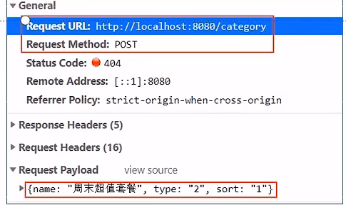

**代码：**

```java
@RestController
@RequestMapping("/category")
@Slf4j
public class CategoryController {
    @Autowired
    private CategoryService categoryService;

    /**
     * 新增分类
     * @param category
     * @return
     */
    @PostMapping
    public R<String> save(@RequestBody Category category){
        log.info("category:{}",category);
        categoryService.save(category);
        return R.success("新增分类成功");
    }
}
```


## 5.2 分类页面，分页查询

**请求：**

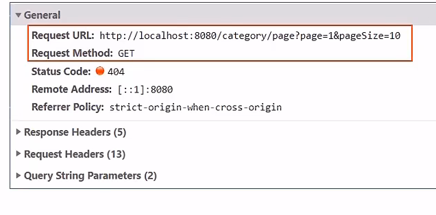

**代码 ：**

跟前面员工分页基本一样。

```java
    @GetMapping("/page")
    public R<Page> page(int page,int pageSize){
        //分页构造器
        Page<Category> pageInfo = new Page<>(page,pageSize);
        //条件构造器
        LambdaQueryWrapper<Category> queryWrapper = new LambdaQueryWrapper<>();
        //添加排序条件，根据sort进行排序
        queryWrapper.orderByAsc(Category::getSort);

        //分页查询
        categoryService.page(pageInfo,queryWrapper);
        return R.success(pageInfo);
    }
```


**测试：**

在/page/category/list.html因为数据少，修改前端每页展示量：


修改后刷新，记得idea改成切出idea刷新资源，如果展示不出则用ctrl+f5清除缓存刷新，**测试成功：**


# 5.3 删除分类

**删除分类需要注意的是当分类关联了菜品和套餐时，不允许删除。**

### 5.3.1 基础删除，不检查关联的菜品


**请求：**


> - 如果忘了加注解@JsonFormat注解，会发生js获取主键时丢失精度，js只能读17位，而雪花算法Long类型是19位。
>
> - ```
>   @JsonFormat(shape = JsonFormat.Shape.STRING)
>   ```
>
>   
>
>   
>
> 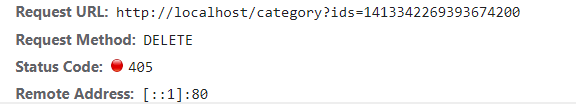

**代码：**

```java
    @DeleteMapping
    public R<String> page(Long ids){
        boolean success = categoryService.removeById(ids);
        if(success)return R.success("删除成功");
        else return R.error("删除失败");
    }
```


### 5.3.2 菜品和套餐的实体类，别忘了@JsonFormat

**套餐：**

```java
/**
 * 套餐
 */
@Data
public class Setmeal implements Serializable {

    private static final long serialVersionUID = 1L;
    @JsonFormat(shape = JsonFormat.Shape.STRING)
    private Long id;


    //分类id
    @JsonFormat(shape = JsonFormat.Shape.STRING)
    private Long categoryId;


    //套餐名称
    private String name;


    //套餐价格
    private BigDecimal price;


    //状态 0:停用 1:启用
    private Integer status;


    //编码
    private String code;


    //描述信息
    private String description;


    //图片
    private String image;


    @TableField(fill = FieldFill.INSERT)
    private LocalDateTime createTime;


    @TableField(fill = FieldFill.INSERT_UPDATE)
    private LocalDateTime updateTime;


    @TableField(fill = FieldFill.INSERT)
    @JsonFormat(shape = JsonFormat.Shape.STRING)
    private Long createUser;


    @TableField(fill = FieldFill.INSERT_UPDATE)
    @JsonFormat(shape = JsonFormat.Shape.STRING)
    private Long updateUser;

}
```


**菜品：**

```java
/**
 菜品
 */
@Data
public class Dish implements Serializable {

    private static final long serialVersionUID = 1L;
    @JsonFormat(shape = JsonFormat.Shape.STRING)
    private Long id;


    //菜品名称
    private String name;


    //菜品分类id
    @JsonFormat(shape = JsonFormat.Shape.STRING)
    private Long categoryId;


    //菜品价格
    private BigDecimal price;


    //商品码
    private String code;


    //图片
    private String image;


    //描述信息
    private String description;


    //0 停售 1 起售
    private Integer status;


    //顺序
    private Integer sort;


    @TableField(fill = FieldFill.INSERT)
    private LocalDateTime createTime;


    @TableField(fill = FieldFill.INSERT_UPDATE)
    private LocalDateTime updateTime;


    @TableField(fill = FieldFill.INSERT)
    @JsonFormat(shape = JsonFormat.Shape.STRING)
    private Long createUser;


    @TableField(fill = FieldFill.INSERT_UPDATE)
    @JsonFormat(shape = JsonFormat.Shape.STRING)
    private Long updateUser;

}
```


### 5.3.3 菜品和套餐的dao和service

建议自己写，很快，复制粘贴总会把实体类之类的写错。

```java
@Mapper
public interface DishMapper extends BaseMapper<Dish> {
}
@Mapper
public interface SetmealMapper extends BaseMapper<Setmeal> {
}
public interface DishService extends IService<Dish> {
}
public interface SetmealService extends IService<Setmeal> {
}
@Service
@Slf4j
public class DishServiceImpl extends ServiceImpl<DishMapper,Dish> implements DishService {
}

@Service
@Slf4j
public class SetmealServiceImpl extends ServiceImpl<SetmealMapper,Setmeal> implements SetmealService {
}
```


### 5.3.4 检查后删除，业务异常捕获

**目标：当分类关联了菜品和套餐时，不允许删除。**

**跟进到IService的remove方法**,通过比较器wrapper删除，参数改成Integer的话算重载，可以改：


**代码实现：**

> 我前面自己写的时候，**没有用异常捕获**，是在业务层根据不同情况返回不同数字，然后controller根据数字R.error("错误原因") 。用异常捕获也能实现，两种效果都一样，**用异常捕获更规范**。
>
> service：
>
> ```java
>     @Override
>     public Integer remove(Long id){
>         LambdaQueryWrapper<Setmeal> wrapper1=new LambdaQueryWrapper<>();
>         wrapper1.eq(Setmeal::getCategoryId,id);
>         LambdaQueryWrapper<Dish> wrapper2=new LambdaQueryWrapper<>();
>         wrapper2.eq(Dish::getCategoryId,id);
>         log.info("套餐查询：{}",setmealService.getMap(wrapper1));log.info("菜品查询：{}",dishService.getMap(wrapper2));
>         //查到有菜品或套餐使用这个分类
>         if(setmealService.count(wrapper1)>0) return -1;
>         if(dishService.count(wrapper2)>0) return -2;
>         return categoryDao.deleteById(id)>0?1:0;
>     }
> ```
>
> 
>
> 
>
> ```java
>     @DeleteMapping
>     public R<String> remove(Long ids){
>         log.info("要删除的id：{}",ids);
>         int success = -3;success=categoryService.remove(ids);
>         log.info("删除状态：{}",success);
>         if(success==1)return R.success("删除成功");
>         else if(success==0) return R.error("网络原因删除失败");
>         else if(success==-1) return R.error("有套餐正在使用此分类");
>         else if(success==-2)return R.error("有菜品正在使用此分类");
>         else return R.error("未知错误");
>     }
> ```
>
> 
>
> 

**异常捕获方案：**

service

```java
@Service
public class CategoryServiceImpl extends ServiceImpl<CategoryMapper,Category> implements CategoryService{

    @Autowired
    private DishService dishService;

    @Autowired
    private SetmealService setmealService;

    /**
     * 根据id删除分类，删除之前需要进行判断
     * @param id
     */
    @Override
    public void remove(Long id) {
        LambdaQueryWrapper<Dish> dishLambdaQueryWrapper = new LambdaQueryWrapper<>();
        //添加查询条件，根据分类id进行查询
        dishLambdaQueryWrapper.eq(Dish::getCategoryId,id);
        int count1 = dishService.count(dishLambdaQueryWrapper);

        //查询当前分类是否关联了菜品，如果已经关联，抛出一个业务异常
        if(count1 > 0){
            //已经关联菜品，抛出一个业务异常
            throw new CustomException("当前分类下关联了菜品，不能删除");
        }

        //查询当前分类是否关联了套餐，如果已经关联，抛出一个业务异常
        LambdaQueryWrapper<Setmeal> setmealLambdaQueryWrapper = new LambdaQueryWrapper<>();
        //添加查询条件，根据分类id进行查询
        setmealLambdaQueryWrapper.eq(Setmeal::getCategoryId,id);
        int count2 = setmealService.count();
        if(count2 > 0){
            //已经关联套餐，抛出一个业务异常
            throw new CustomException("当前分类下关联了套餐，不能删除");
        }

        //正常删除分类
        super.removeById(id);
    }
}
```


controller

```java
    @DeleteMapping
    public R<String> delete(Long id){
        log.info("删除分类，id为：{}",id);

        //categoryService.removeById(id);
        if(categoryService.remove(ids)) return R.success("删除成功");
        //这里也可以throw业务异常，但不建议，一般都是service抛出异常，controller返回R.error();
        else return R.error("删除失败");
    }
```


**业务异常类：**

```java
/**
 * 自定义业务异常类
 */
public class CustomException extends RuntimeException {
    //带参构造方法，重新设置异常信息
    public CustomException(String message){
        super(message);
    }
}
```


**全局异常处理：**

```java
@RestControllerAdvice
//@ControllerAdvice(annotations = {RestController.class, Controller.class})
//@ResponseBody
@Slf4j
public class GlobalExceptionHandler {

    /**
     * 异常处理方法
     * @return
     */
    @ExceptionHandler(SQLIntegrityConstraintViolationException.class)
    public R<String> exceptionHandler(SQLIntegrityConstraintViolationException ex){
        log.error(ex.getMessage());

        if(ex.getMessage().contains("Duplicate entry")){
            String[] split = ex.getMessage().split(" ");
            String msg = split[2] + "已存在";
            return R.error(msg);
        }

        return R.error("未知错误");
    }

    /**
     * 异常处理方法
     * @return
     */
    @ExceptionHandler(CustomException.class)
    public R<String> exceptionHandler(CustomException ex){
        log.error(ex.getMessage());

        return R.error(ex.getMessage());
    }

}
```


**测试后成功：**

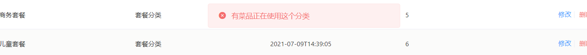

## 5.4 修改分类

**请求：**

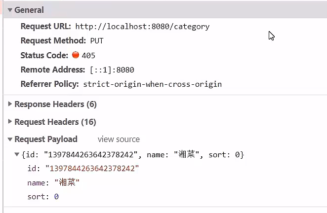

可以知道是通过json传数据，要用@RequestBody传实体类。

**代码实现：**

> 像修改时间和修改人都会自动填充，具体看上面4.7自动填充。

```java
    @PutMapping
    public R<String> update(@RequestBody Category category){
        if(categoryService.updateById(category)) return R.success("修改成功");
        else return R.error("修改失败");
    }
```


# 6 菜品操作


## 6.1 文件上传和下载

### 6.1.1 文件上传

**文件上传表单要求：**

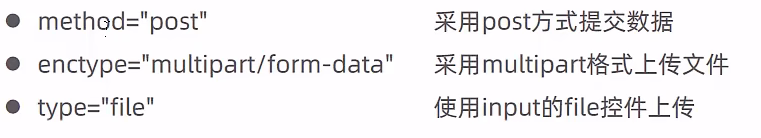

**前端组件库底层也是用这样表单：**

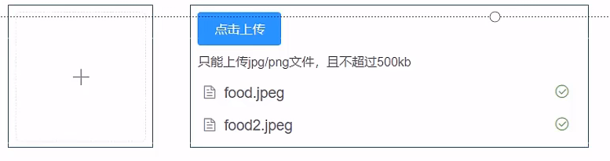

**服务端接收上传文件，底层通常用Apache两个组件：**

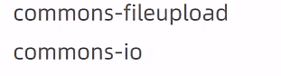

**spring-web对文件上传进行了封装**，只需在controller声明**MultipartFile** 类型**参数、参数名为Form data就可以接受文件**：


上传页面拷贝到page目录下：


```java
<!DOCTYPE html>
<html lang="en">
<head>
  <meta charset="UTF-8">
  <meta http-equiv="X-UA-Compatible" content="IE=edge">
  <meta name="viewport" content="width=device-width, initial-scale=1.0">
  <title>文件上传</title>
  <!-- 引入样式 -->
  <link rel="stylesheet" href="../../plugins/element-ui/index.css" />
  <link rel="stylesheet" href="../../styles/common.css" />
  <link rel="stylesheet" href="../../styles/page.css" />
</head>
<body>
   <div class="addBrand-container" id="food-add-app">
    <div class="container">
        <el-upload class="avatar-uploader"
                action="/common/upload"
                :show-file-list="false"
                :on-success="handleAvatarSuccess"
                :before-upload="beforeUpload"
                ref="upload">
            </img>
            <i v-else class="el-icon-plus avatar-uploader-icon"></i>
        </el-upload>
    </div>
  </div>
    <!-- 开发环境版本，包含了有帮助的命令行警告 -->
    <script src="../../plugins/vue/vue.js"></script>
    <!-- 引入组件库 -->
    <script src="../../plugins/element-ui/index.js"></script>
    <!-- 引入axios -->
    <script src="../../plugins/axios/axios.min.js"></script>
    <script src="../../js/index.js"></script>
    <script>
      new Vue({
        el: '#food-add-app',
        data() {
          return {
            imageUrl: ''
          }
        },
        methods: {
          handleAvatarSuccess (response, file, fileList) {
              this.imageUrl = `/common/download?name=${response.data}`
          },
          beforeUpload (file) {
            if(file){
              const suffix = file.name.split('.')[1]
              const size = file.size / 1024 / 1024 < 2
              if(['png','jpeg','jpg'].indexOf(suffix) < 0){
                this.$message.error('上传图片只支持 png、jpeg、jpg 格式！')
                this.$refs.upload.clearFiles()
                return false
              }
              if(!size){
                this.$message.error('上传文件大小不能超过 2MB!')
                return false
              }
              return file
            }
          }
        }
      })
    </script>
</body>
</html>
```


**上传请求：**


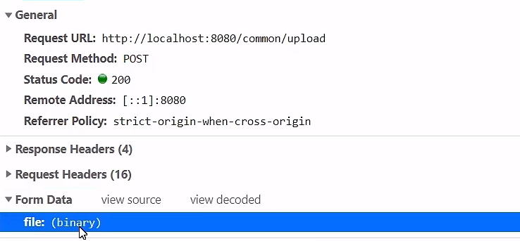

> **注意：待会传参MutlipartFile 对象名必须是file，也就是和form data的名字一致。**

**代码实现：**

yml设置路径

```
reggie:
#写成D:\img\或者D:/img/也能成功，写成双反斜杠点保险点，防止转义
  path: D:\\img\\
```


读取路径并接收上传的文件：

```java
@RestController
@RequestMapping("/common")
@Slf4j
public class CommonController {

    @Value("${reggie.path}")
    private String basePath;

    /**
     * 文件上传
     * @param file
     * @return
     */
    @PostMapping("/upload")
    //MultipartFile 译为多部分的文件
    public R<String> upload(MultipartFile file){
        //file是一个临时文件，默认存在C:\\User\\...目录下，需要转存到指定位置，否则本次请求完成后临时文件会删除
        log.info(file.toString());

        //原始文件名
        String originalFilename = file.getOriginalFilename();//abc.jpg
        //获取文件后缀名，这里不能split，因为split里不能根据“.”分割
        String suffix = originalFilename.substring(originalFilename.lastIndexOf("."));

        //使用UUID重新生成文件名，防止文件名称重复造成文件覆盖。UUID 是通用唯一识别码，具体解释看代码下面引用
        String fileName = UUID.randomUUID().toString() + suffix;//dfsdfdfd.jpg

        //创建一个目录对象
        File dir = new File(basePath);
        //判断当前目录是否存在
        if(!dir.exists()){
            //目录不存在，需要创建
            dir.mkdirs();
        }

        try {
            //将临时文件转存到指定位置
            file.transferTo(new File(basePath + fileName));
        } catch (IOException e) {
            e.printStackTrace();
        }
        return R.success(fileName);
    }


}
```


> **UUID：**
>
> UUID 是 通用唯一识别码，UUID 的目的，是让分布式系统中的所有元素，都能有唯一的辨识资讯，而不需要透过中央控制端来做辨识资讯的指定。
>
> **UUID.randomUUID().toString()是javaJDK提供的一个自动生成主键的方法。**UUID(Universally [Unique](https://so.csdn.net/so/search?q=Unique&spm=1001.2101.3001.7020) Identifier)全局唯一标识符,是指在一台机器上生成的数字，它保证对在**同一时空中的所有机器都是唯一的**，是由一个十六位的数字组成,表现出来的形式。由以下几部分的组合：当前日期和时间(UUID的第一个部分与时间有关，如果你在生成一个UUID之后，过几秒又生成一个UUID，则第一个部分不同，其余相同)，时钟序列，全局唯一的IEEE机器识别号（如果有网卡，从网卡获得，没有网卡以其他方式获得），**UUID的唯一缺陷在于生成的结果串会比较长。**
>
> 
>
> **回顾：**前面Mybatis-plus学习五种id生成策略时，有个策略是**ASSIGN_UUID:**
>
> - **ASSIGN_UUID:**可以在**分布式的情况下使用**，而且能够**保证唯一**，但是生成的主键是**32位的字符串，长度过长占用空间而且还不能排序，查询性能也慢**
>
> [MyBatisPlus基础_vincewm的博客-CSDN博客](https://blog.csdn.net/qq_40991313/article/details/126470047?spm=1001.2014.3001.5501)

测试上传成功：

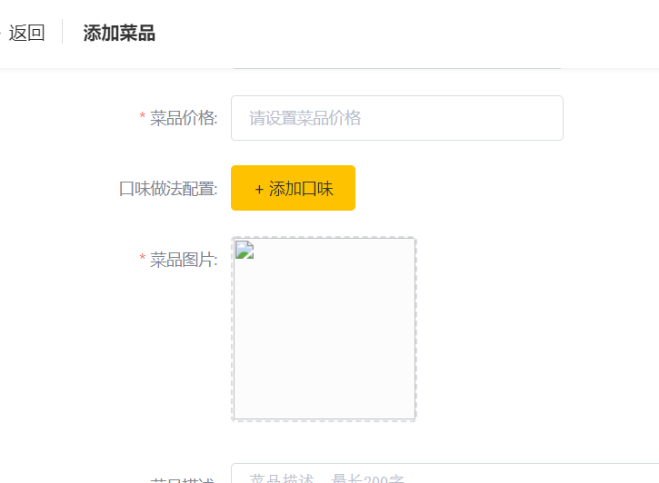


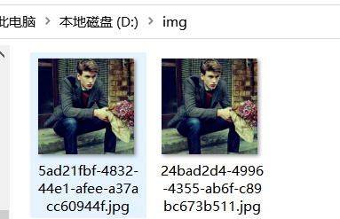


### 6.1.2 文件下载，回显上传的图片

将文件从服务端下载到本地计算机，可以用标签展示下载的图片：


两种文件下载方式：


**请求：**

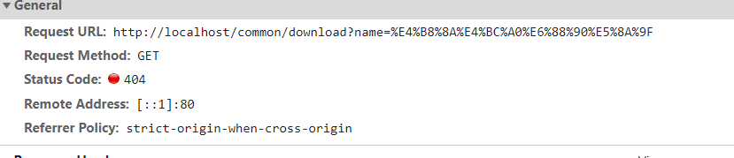

get方式传参，controller参数名为name就能直接传了，springmvc是可以自动转换格式的。 怕name冲突，可以@RequestParam起别名。

**代码实现：**

```java
    /**
     * 文件下载
     * @param name
     * @param response
     */
    @GetMapping("/download")
    public void download(String name, HttpServletResponse response){

        try {
            //输入流，通过输入流读取文件内容
            FileInputStream fileInputStream = new FileInputStream(new File(basePath + name));

            //输出流，通过输出流将文件写回浏览器
            ServletOutputStream outputStream = response.getOutputStream();

            response.setContentType("image/jpeg");

            int len = 0;
            //注意别写成大写
            byte[] bytes = new byte[1024];
            while ((len = fileInputStream.read(bytes)) != -1){
                outputStream.write(bytes,0,len);
                outputStream.flush();
            }

            //关闭资源
            outputStream.close();
            fileInputStream.close();
        } catch (Exception e) {
            e.printStackTrace();
        }

    }
```


> **坑点：**
>
> - byte[] bytes = new byte[1024];的byte别写成大写 。
>
> - File输入流读文件，从response获得的Servlet输出流写文件
>
> - 最后一定记得关闭输入输出流，输出流每次write刷新一次。如果忘了刷新和关闭将会写不成功。
>
> - | `void` | `write(byte[] b, int off, int len)` 将 `len`字节从位于偏移量 `off`的指定字节数组写入此文件输出流。 |
>   | ------ | ------------------------------------------------------------ |
>   |        |                                                              |

## 6.2 新增菜品

### 6.2.1 分析

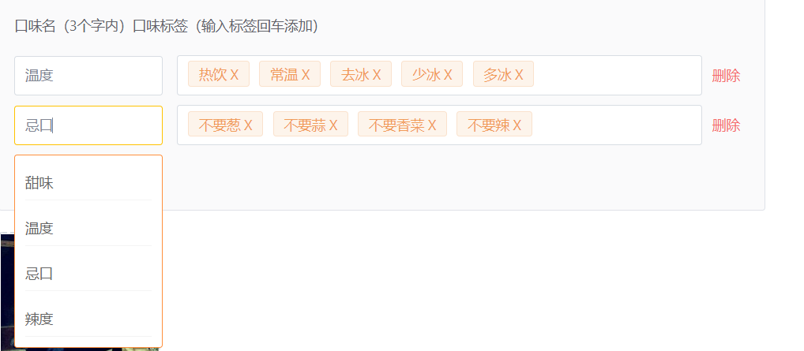


**表结构：**

菜品口味dish_favor表：

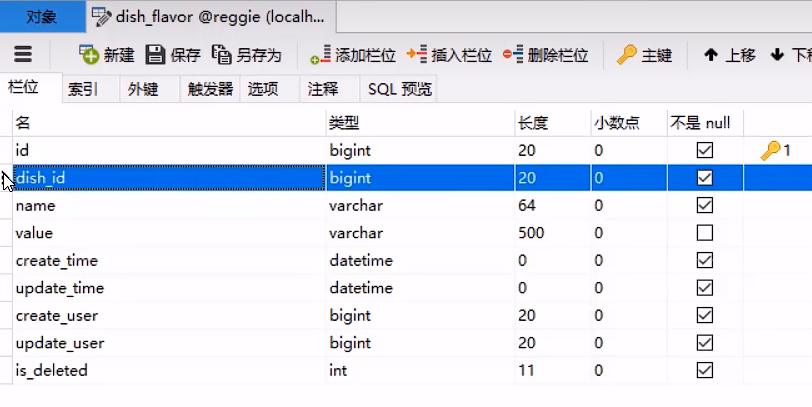

### 6.2.2 菜品味道实体类，dao和service

实体类：

```java
@Data
public class DishFlavor implements Serializable {

    private static final long serialVersionUID = 1L;
    @JsonFormat(shape = JsonFormat.Shape.STRING)
    private Long id;


    //菜品id
    @JsonFormat(shape = JsonFormat.Shape.STRING)
    private Long dishId;


    //口味名称
    private String name;


    //口味数据list
    private String value;


    @TableField(fill = FieldFill.INSERT)
    private LocalDateTime createTime;


    @TableField(fill = FieldFill.INSERT_UPDATE)
    private LocalDateTime updateTime;


    @TableField(fill = FieldFill.INSERT)
    @JsonFormat(shape = JsonFormat.Shape.STRING)
    private Long createUser;


    @TableField(fill = FieldFill.INSERT_UPDATE)
    @JsonFormat(shape = JsonFormat.Shape.STRING)
    private Long updateUser;


    //是否删除
    private Integer isDeleted;

}
```


```java
@Mapper
public interface DishFlavorMapper extends BaseMapper<DishFlavor> {
}

public interface DishFlavorService extends IService<DishFlavor> {
}
@Service
public class DishFlavorServiceImpl extends ServiceImpl<DishFlavorMapper,DishFlavor> implements DishFlavorService {
}
```


### 6.2.3 根据条件查询分类数据

跟前面不同的一点是分类信息要用CategoryController获取：


**请求：**

点击增加菜品按钮的请求：展示分类框


CategoryController

```java
    @GetMapping("/list")
    //其实参数传Integer的type也可以，只是要再创建分类对象赋值type，麻烦。这里封装成category。
    //参数不是json转实体类，所以不用加@RequestBody
    public R<List<Category>> list(Category category){
        //条件构造器
        LambdaQueryWrapper<Category> queryWrapper = new LambdaQueryWrapper<>();
        //添加条件
        queryWrapper.eq(category.getType() != null,Category::getType,category.getType());
        //添加排序条件
        queryWrapper.orderByAsc(Category::getSort).orderByDesc(Category::getUpdateTime);

        List<Category> list = categoryService.list(queryWrapper);
        return R.success(list);
    }
}
```


### 6.2.4 创建DTO类封装表单数据

因为表单既包括了菜品，也包括了菜品味道，所以要新创建一个DTO类封装所有表单信息，它是菜品实体类的子类。


在com.example.domain包下创建dto.DishDto类：

```java
@Data
public class DishDto extends Dish {

    private List<DishFlavor> flavors = new ArrayList<>();
    //下面两个成员变量暂时用不到，先放着，后面有其他表单需要封装

    //菜品所属分类名称
    private String categoryName;

    private Integer copies;
}
```


### 6.2.5 新增菜品，DishController

请求：

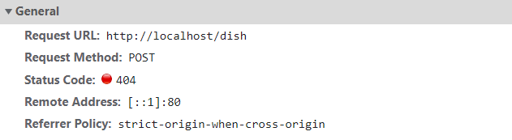

**DishServiceImpl**

```java
    @Transactional    //记得在引导类@EnableTransactionManagement
    public void saveWithFlavor(DishDto dishDto) {
        //保存菜品的基本信息到菜品表dish
        this.save(dishDto);

        Long dishId = dishDto.getId();//菜品id

        //菜品口味
        List<DishFlavor> flavors = dishDto.getFlavors();
//        stream流的filter是满足条件的留下，是对原数组的过滤；map则是对原list的加工，map里是Lambda表达式，形容对list加工。
//        通过stream流的map将list加工，把这个菜品的id加到每个list元素的dishId属性；
        flavors = flavors.stream().map((item) -> {    //给list每个元素map加工，返回值为加工后的结果
            item.setDishId(dishId);
            return item;
        }).collect(Collectors.toList());    //将加工后的结果遍历收集到原list

        //保存菜品口味数据到菜品口味表dish_flavor
        dishFlavorService.saveBatch(flavors);

    }
```


> **回顾stream流：**
>
> - stream流的filter是满足条件的留下，是对原数组的过滤；map则是对原list的加工，map里参数是Lambda表达式，Lambda表达式参数是集合的元素，返回值是对元素遍历加工后的元素。
> - collect(Collectors.toList())是将结果遍历收集到原List集合。

> 坑点：别忘了加@Transactional，引导类加 @EnableTransactionManagement，因为这个业务里有保存菜品和保存味道，他们要么都成功，要么都失败。

**DishController**

```java
    @PostMapping
    public R<String> save(@RequestBody DishDto dishDto){
        log.info(dishDto.toString());

        dishService.saveWithFlavor(dishDto);

        return R.success("新增菜品成功");
    }
```


## 6.3 菜品信息分页展示

**分析：**


**请求：**


**代码：**

> 首先把图片资料拷贝到D://img中，这是前面上传下载代码时候在yml配置的图片路径。

DishController，**需要注意的点是菜品的分类属性是category表的id，要返回包含categoryName的DishDto**。

```java
    @GetMapping("/page")
    public R<Page> page(int page,int pageSize,String name){

        //构造分页构造器对象
        Page<Dish> pageInfo = new Page<>(page,pageSize);
        Page<DishDto> dishDtoPage = new Page<>();

        //条件构造器
        LambdaQueryWrapper<Dish> queryWrapper = new LambdaQueryWrapper<>();
        //添加过滤条件
        queryWrapper.like(name != null,Dish::getName,name);
        //添加排序条件
        queryWrapper.orderByDesc(Dish::getUpdateTime);

        //执行分页查询，dishService查的是dish表，所以必须先Dish查询，再拷贝到DishDto
        dishService.page(pageInfo,queryWrapper);

        //注意这一步，将Dish的page拷贝到DishDto的page，第三个参数是忽略records属性
        BeanUtils.copyProperties(pageInfo,dishDtoPage,"records");
        
        List<Dish> records = pageInfo.getRecords();
        //steam流的map（Lambda表达式）对list进行加工，stream流返回值是可以换泛型的。等号左边是List<DishDto>，右边是List<Dish>
        List<DishDto> list = records.stream().map((item) -> {    
            DishDto dishDto = new DishDto();
            //对象拷贝的工具类BeanUtils，将list里每一个菜品Dish对象信息拷贝到DishDto对象
            BeanUtils.copyProperties(item,dishDto);
            //将菜品所属分类的id查询为name，存到DishDto对象的categoryName，再返回替换item，完成item的加工
            Long categoryId = item.getCategoryId();//分类id
            //根据id查询分类对象
            Category category = categoryService.getById(categoryId);

            if(category != null){
                String categoryName = category.getName();
                dishDto.setCategoryName(categoryName);
            }
            return dishDto;
        }).collect(Collectors.toList());

        dishDtoPage.setRecords(list);

        return R.success(dishDtoPage);
    }
```


> **图片展示**是查询到菜品image属性存储图片的id，前端代码根据id发送请求循环渲染下载图片：
>
> 

> **坑点：**
>
> **有些菜品查不到分类，所以在查Category时候要判断查到的值是否是null。**
>
> 我这里忘记刷新数据库，前面测试删除分类不小心删了几个分类，Navicat看数据库还是有信息存在的，对比之下卡了我很长时间。
>
> 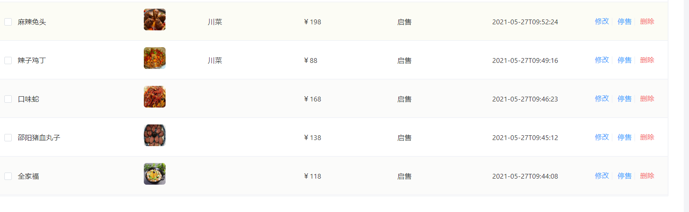

## 6.4 修改菜品

**分析：**修改和新增使用的是一个页面


### **6.4.1 修改数据回显**

**分析：**

有修改页面可以得知这里返回值必须是DishDto对象，包括菜品、味道、分类信息。 所以要在DishServiceImpl写getByIdWithFlavor方法。**这里分类名返回null即可，前端会发送请求从分类id查分类name。**

**请求：**


**代码**

DishSerivceImpl

> **这里分类名返回null即可，前端会发送请求从分类id查分类name。**

```java
    public DishDto getByIdWithFlavor(Long id) {
        //查询菜品基本信息，从dish表查询
        Dish dish = this.getById(id);

        DishDto dishDto = new DishDto();
        BeanUtils.copyProperties(dish,dishDto);

        //查询当前菜品对应的口味信息，从dish_flavor表查询
        LambdaQueryWrapper<DishFlavor> queryWrapper = new LambdaQueryWrapper<>();
        queryWrapper.eq(DishFlavor::getDishId,dish.getId());
        List<DishFlavor> flavors = dishFlavorService.list(queryWrapper);
        dishDto.setFlavors(flavors);

        return dishDto;
    }
```


DishController

```java
    @GetMapping("/{id}")
    public R<DishDto> get(@PathVariable Long id){

        DishDto dishDto = dishService.getByIdWithFlavor(id);

        return R.success(dishDto);
    }
```


> **坑点：**
>
> 如果分类那里显示的是数字，那就是因为你没有处理js对Long类型丢失精度问题，给实体类跟id相关的全部加
>
> ```
> @JsonFormat(shape = JsonFormat.Shape.STRING)
> ```
>
> 

### 6.4.2 修改菜品


主要的点是要把原来的味道信息删除，再把新的味道信息添加。

DishSerivceImpl

```java
    @Override
    @Transactional    //要保证引导类已经@EnableTransactionManagement
    public void updateWithFlavor(DishDto dishDto) {
        //更新dish表基本信息
        this.updateById(dishDto);

        //清理当前菜品对应口味数据---dish_flavor表的delete操作
        LambdaQueryWrapper<DishFlavor> queryWrapper = new LambdaQueryWrapper();
        queryWrapper.eq(DishFlavor::getDishId,dishDto.getId());

        dishFlavorService.remove(queryWrapper);

        //添加当前提交过来的口味数据---dish_flavor表的insert操作
        List<DishFlavor> flavors = dishDto.getFlavors();

        flavors = flavors.stream().map((item) -> {
            item.setDishId(dishDto.getId());
            return item;
        }).collect(Collectors.toList());

        dishFlavorService.saveBatch(flavors);
    }
```


DishController

```java
    @PutMapping
    public R<String> update(@RequestBody DishDto dishDto){
        log.info(dishDto.toString());

        dishService.updateWithFlavor(dishDto);

        return R.success("新增菜品成功");
    }
```


测试成功：

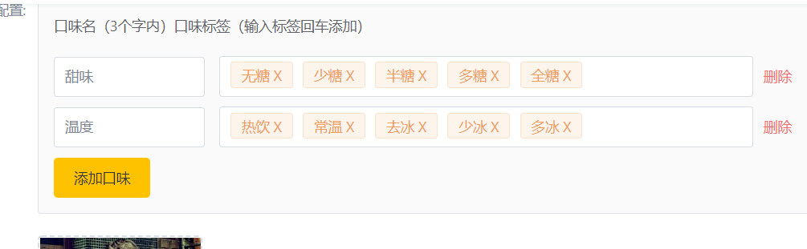

# 7 套餐操作

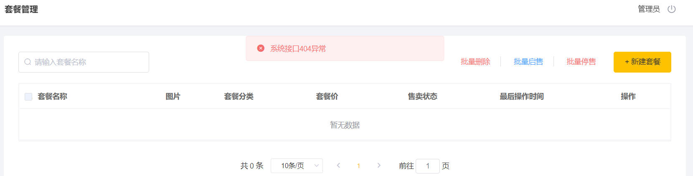


## 7.1 环境准备

### 7.1.1 数据模型

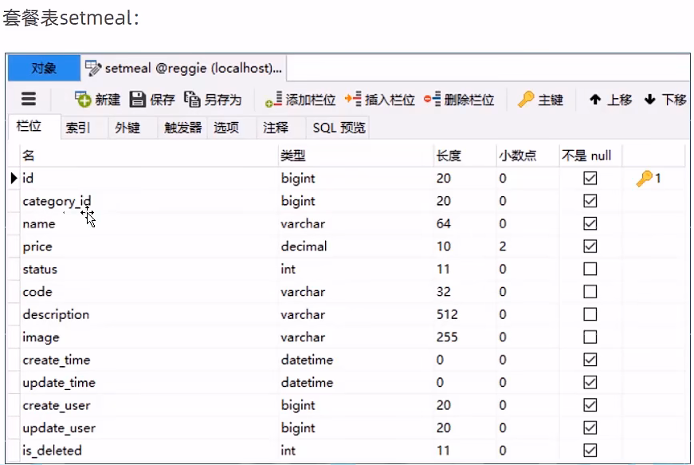 status状态0为停售1为起售，code是套餐编码

**name是菜品名称， copies 是套餐内的这个菜品数量，is_deleted用于逻辑删除。关系表存的菜品套餐id类型都是varchar**

### 7.1.2 Setmeal,SetmealDish实体类和数据传输对象SetmealDto

**Setmeal在前面分类那里写过了**

**SetmealDish**

```java
/**
 * 套餐菜品关系
 */
@Data
public class SetmealDish implements Serializable {

    private static final long serialVersionUID = 1L;

    private Long id;


    //套餐id
    private Long setmealId;


    //菜品id
    private Long dishId;


    //菜品名称 （冗余字段）
    private String name;

    //菜品原价
    private BigDecimal price;

    //份数
    private Integer copies;


    //排序
    private Integer sort;


    @TableField(fill = FieldFill.INSERT)
    private LocalDateTime createTime;


    @TableField(fill = FieldFill.INSERT_UPDATE)
    private LocalDateTime updateTime;


    @TableField(fill = FieldFill.INSERT)
    private Long createUser;


    @TableField(fill = FieldFill.INSERT_UPDATE)
    private Long updateUser;


    //是否删除
    private Integer isDeleted;
}
```


**SetmealDto**

```java
@Data
public class SetmealDto extends Setmeal {
    //套餐和菜品关系的list
    private List<SetmealDish> setmealDishes;
    //所属分类名
    private String categoryName;
}
```


### 7.1.3 套餐和套菜关系的dao和Service

Setmeal的dao和Service在前面分类那里写过了。

SetmealDishDao

```java
@Mapper
public interface SetmealDishMapper extends BaseMapper<SetmealDish> {
}
public interface SetmealDishService extends IService<SetmealDish> {
}
@Service
@Slf4j
public class SetmealDishServiceImpl extends ServiceImpl<SetmealDishMapper,SetmealDish> implements SetmealDishService {
}
```


## 7.2 新增套餐

### 7.2.1 根据分类id查询DishDto，DishController

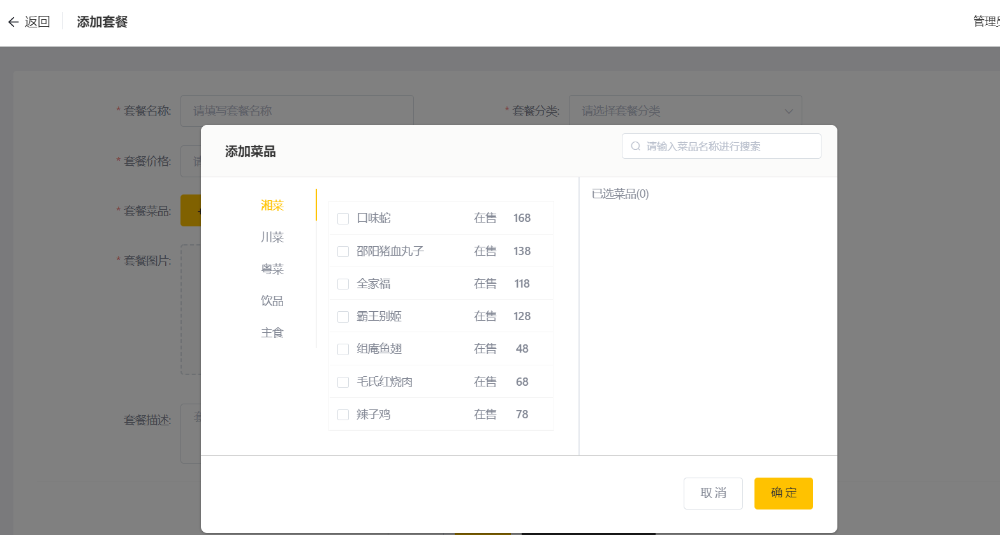


要查询每个类别菜品的全部信息

**请求：**

根据categoryId查询这个分类里所有菜品信息（包括味道）list

**代码实现：**

DishController

```java
    @GetMapping("/list")
    //根据条件查询多菜品。如果参数只有categoryId，那就只能查单一条件，通用性低
    public R<List<DishDto>> list(Dish dish) {
        log.info("dish:{}", dish);
        //条件构造器，条件name和categoryId和status（price那些条件始终没需求就不做条件），根据更新时间排序
        LambdaQueryWrapper<Dish> queryWrapper = new LambdaQueryWrapper<>();
        queryWrapper.like(StringUtils.isNotEmpty(dish.getName()), Dish::getName, dish.getName());
        queryWrapper.eq(null != dish.getCategoryId(), Dish::getCategoryId, dish.getCategoryId());
        //查询条件，状态为1（起售状态）的菜品
        queryWrapper.eq(Dish::getStatus,1);
        queryWrapper.orderByDesc(Dish::getUpdateTime);

        //条件查询到菜品列表
        List<Dish> dishs = dishService.list(queryWrapper);
        //对list每个元素加工，设置分类和味道信息，返回成dto，
        List<DishDto> dishDtos = dishs.stream().map(item -> {
            DishDto dishDto = new DishDto();
            BeanUtils.copyProperties(item, dishDto);
            Category category = categoryService.getById(item.getCategoryId());
            if (category != null) {
                dishDto.setCategoryName(category.getName());
            }
            LambdaQueryWrapper<DishFlavor> wrapper = new LambdaQueryWrapper<>();
            wrapper.eq(DishFlavor::getDishId, item.getId());

            dishDto.setFlavors(dishFlavorService.list(wrapper));
            return dishDto;
        }).collect(Collectors.toList());

        return R.success(dishDtos);
    }
```


### 7.2.2 保存数据，SetmealController

**请求：**

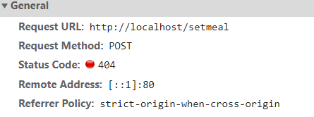


> **可以看出，setmealDishes不是setmeal表的字段，要用SetmealDto封装参数。**

**代码：**

```java
SetmealServiceImpl
    @Transactional    //引导类要开启业务
    public boolean saveWithDish(SetmealDto setmealDto) {
        //保存后setmealDao就生成了套餐id
        if(!this.save(setmealDto))return false;
        //获取套菜关系的list
        List<SetmealDish> setmealDishes = setmealDto.getSetmealDishes();
        //加工list，每个套餐关系设置前面生成的套餐id，其他参数都在表单传来了，或有默认值
        setmealDishes.stream().map(item->{
            item.setSetmealId(setmealDto.getId());
            return item;
        }).collect(Collectors.toList());
        if(!setmealDishService.saveBatch(setmealDishes)) return false;
        return true;
    }
```


```
SetmealController
@RestController
@RequestMapping("/setmeal")
@Slf4j
public class SetmealController {

    @Autowired
    private SetmealService setmealService;

    @Autowired
    private CategoryService categoryService;

    @Autowired
    private SetmealDishService setmealDishService;

    /**
     * 新增套餐
     * @param setmealDto
     * @return
     */
    @PostMapping
    public R<String> save(@RequestBody SetmealDto setmealDto){
        log.info("套餐信息：{}",setmealDto);

        setmealService.saveWithDish(setmealDto);

        return R.success("新增套餐成功");
    }
}
```


## 7.3 套餐信息分页展示

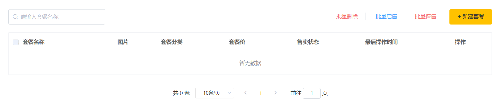

**请求：**


**分析：**

由预览效果可知还要传参name，因为有套餐分类名，所以返回的要是Page。

**代码：**

SetmealController

```java
    @GetMapping("/page")
    public R<Page> page(int page,int pageSize,String name){
        //分页构造器对象
        Page<Setmeal> pageInfo = new Page<>(page,pageSize);
        Page<SetmealDto> dtoPage = new Page<>();

        LambdaQueryWrapper<Setmeal> queryWrapper = new LambdaQueryWrapper<>();
        //添加查询条件，根据name进行like模糊查询
        queryWrapper.like(name != null,Setmeal::getName,name);
        //添加排序条件，根据更新时间降序排列
        queryWrapper.orderByDesc(Setmeal::getUpdateTime);

        setmealService.page(pageInfo,queryWrapper);

        //对象拷贝
        BeanUtils.copyProperties(pageInfo,dtoPage,"records");
        List<Setmeal> records = pageInfo.getRecords();

        List<SetmealDto> list = records.stream().map((item) -> {
            SetmealDto setmealDto = new SetmealDto();
            //对象拷贝
            BeanUtils.copyProperties(item,setmealDto);
            //分类id
            Long categoryId = item.getCategoryId();
            //根据分类id查询分类对象
            Category category = categoryService.getById(categoryId);
            if(category != null){
                //分类名称
                String categoryName = category.getName();
                setmealDto.setCategoryName(categoryName);
            }
            return setmealDto;
        }).collect(Collectors.toList());

        dtoPage.setRecords(list);
        return R.success(dtoPage);
    }
```


**发送请求测试，成功：**

http://localhost/setmeal/page?page=1&pageSize=1

> **坑点：**
>
> **创建Page对象，忘了传参数pageSize和page**

## 7.4 批量删除套餐

**请求：**

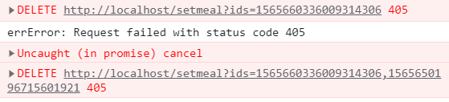

**代码：**

```java
    @DeleteMapping
    //接收集合类型要@RequestParam
    public R<String> delete(@RequestParam List<Long> ids){
        log.info("ids:{}",ids);

        setmealService.removeWithDish(ids);

        return R.success("套餐数据删除成功");
    }
```


## 7.5 回顾区别`@RequestBody`、`@RequestParam`、`@PathVariable`

**关于接收参数，我们学过三个注解@RequestBody、@RequestParam、@PathVariable,这三个注解之间的区别和应用分别是什么?**

**联系：**都是参数注解，都用于前端到controller的参数传递。 **区别** **@RequestParam**用于接收非JSON参数，集合类型必须注解。可以起别名。

```java
@RequestMapping("/commonParamDifferentName")
    @ResponseBody
    public String commonParamDifferentName(@RequestParam("name") String userName , int age){
        System.out.println("普通参数传递 userName ==> "+userName);
        System.out.println("普通参数传递 age ==> "+age);
        return "{'module':'common param different name'}";
    }
//集合参数：同名请求参数可以使用@RequestParam注解映射到对应名称的集合对象中作为数据
@RequestMapping("/listParam")
@ResponseBody
public String listParam(@RequestParam List<String> likes){
    System.out.println("集合参数传递 likes ==> "+ likes);
    return "{'module':'list param'}";
}
```


**@RequestBody**用于接收json数据（请求体参数），必须加上才能获取到前端传来的JSON数据。

```java
@RequestMapping("/pojoParamForJson")
@ResponseBody
public String pojoParamForJson(@RequestBody User user){
    System.out.println("pojo(json)参数传递 user ==> "+user);
    return "{'module':'pojo for json param'}";
}
```


**@PathVariable**用于接收路径参数，REST风格。使用{参数名称}描述路径参数

```java
@Controller
public class UserController {
    //设置当前请求方法为GET，表示REST风格中的查询操作
    @RequestMapping(value = "/users/{id}" ,method = RequestMethod.GET)
    @ResponseBody
    public String getById(@PathVariable Integer id){
        System.out.println("user getById..."+id);
        return "{'module':'user getById'}";
    }
}
```


**应用**

- 后期开发中，发送请求参数超过1个时，以json格式为主，@RequestBody应用较广
- 如果发送非json格式数据，选用@RequestParam接收请求参数
- 采用RESTful进行开发，当参数数量较少时，例如1个，可以采用@PathVariable接收请求路径变量，通常用于传递id值


# 8 验证码功能

## **8.1 腾讯云短信服务**

### **8.1.1 介绍**

> **因为我腾讯云有备案的域名，所以就用腾讯云，当然用阿里云也可以。**

**短信服务：**


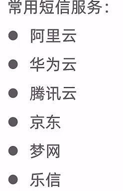

**三大应用场景：**

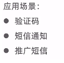


### 8.1.2 步骤

**0.进入网址：**

[短信文本短信通知短信营销短信验证码短信 - 腾讯云](https://cloud.tencent.com/product/sms)

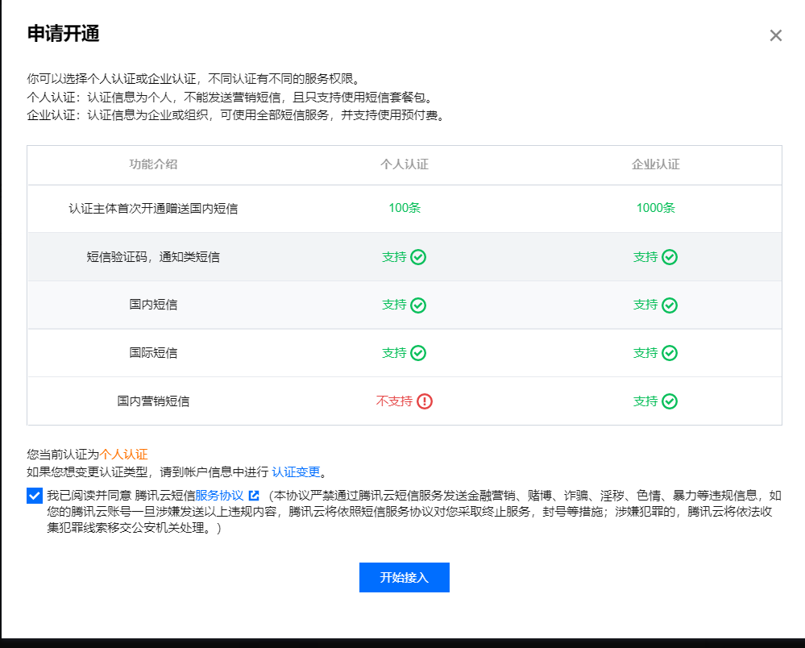


**1.短信签名：**


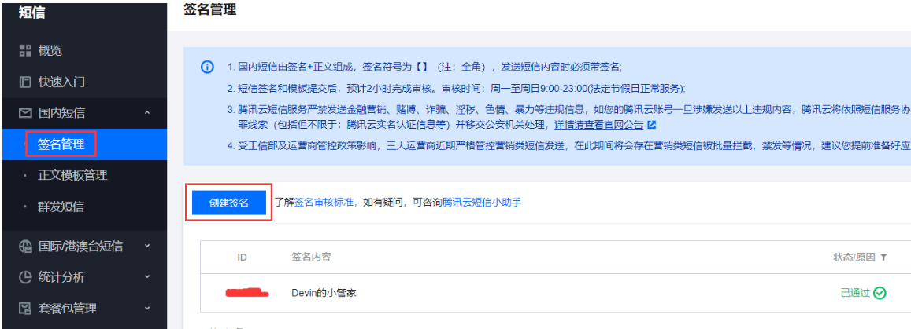


**2.创建正文模板**


4、创建应用，获取SDKAppID


5、获取secreteid和secretekey，身份唯一标识


6、腾讯云自动生成发送验证码的java代码

先进入短信服务，点击云产品–云api


选择发送短信（SMS）

[登录 - 腾讯云](https://console.cloud.tencent.com/api/explorer?Product=sms&Version=2021-01-11&Action=SendSms&SignVersion=)

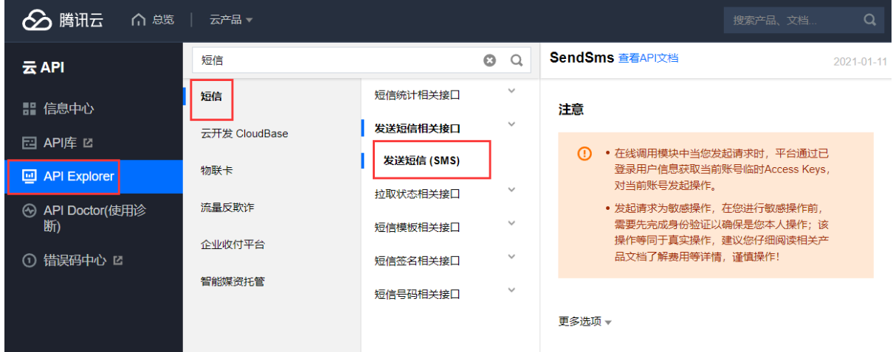 填入发送短信的相关参数


在maven工程中接入短信服务，pom.xml导入依赖


```XML
        <dependency>
            <groupId>com.tencentcloudapi</groupId>
            <artifactId>tencentcloud-sdk-java</artifactId>
            <version>4.0.11</version>
        </dependency>
```


测试类

```java
import com.tencentcloudapi.common.Credential;
import com.tencentcloudapi.common.profile.ClientProfile;
import com.tencentcloudapi.common.profile.HttpProfile;
import com.tencentcloudapi.common.exception.TencentCloudSDKException;
import com.tencentcloudapi.sms.v20210111.SmsClient;
import com.tencentcloudapi.sms.v20210111.models.*;

public class SendSms
{
    public static void main(String [] args) {
        try{
            // 实例化一个认证对象，入参需要传入腾讯云账户secretId，secretKey,此处还需注意密钥对的保密
            // 密钥可前往https://console.cloud.tencent.com/cam/capi网站进行获取
            Credential cred = new Credential("SecretId", "SecretKey");
            // 实例化一个http选项，可选的，没有特殊需求可以跳过
            HttpProfile httpProfile = new HttpProfile();
            httpProfile.setEndpoint("sms.tencentcloudapi.com");
            // 实例化一个client选项，可选的，没有特殊需求可以跳过
            ClientProfile clientProfile = new ClientProfile();
            clientProfile.setHttpProfile(httpProfile);
            // 实例化要请求产品的client对象,clientProfile是可选的
            SmsClient client = new SmsClient(cred, "", clientProfile);
            // 实例化一个请求对象,每个接口都会对应一个request对象
            SendSmsRequest req = new SendSmsRequest();
            
            // 返回的resp是一个SendSmsResponse的实例，与请求对象对应
            SendSmsResponse resp = client.SendSms(req);
            // 输出json格式的字符串回包
            System.out.println(SendSmsResponse.toJsonString(resp));
        } catch (TencentCloudSDKException e) {
            System.out.println(e.toString());
        }
    }
}
```


## 8.2 手机验证码登录

### **8.2.1 数据模型**

user用户表，没有用户名密码，因为是使用验证码登录

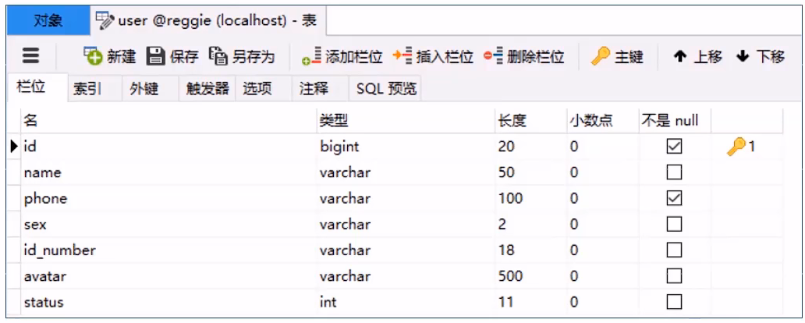

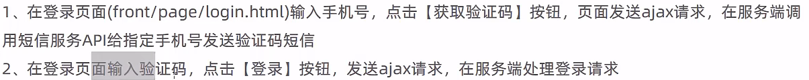

### 8.2.2 环境准备（user实体类、dao、Service、工具类）

```java
@Data
public class User implements Serializable {

    private static final long serialVersionUID = 1L;
    @JsonFormat(shape = JsonFormat.Shape.STRING)
    private Long id;


    //姓名
    private String name;


    //手机号
    private String phone;


    //性别 0 女 1 男
    private String sex;


    //身份证号
    private String idNumber;


    //头像
    private String avatar;


    //状态 0:禁用，1:正常
    private Integer status;
}
```


```java
@Mapper
public interface UserMapper extends BaseMapper<User>{
}
public interface UserService extends IService<User> {
}
@Service
public class UserServiceImpl extends ServiceImpl<UserMapper,User> implements UserService{
}
```


**工具类：**

```java
public class SMSUtils {

	/**
	 * 发送短信
	 * @param signName 签名
	 * @param templateCode 模板
	 * @param phoneNumbers 手机号
	 * @param param 参数
	 */
	public static void sendMessage(String signName, String templateCode,String phoneNumbers,String param){
		DefaultProfile profile = DefaultProfile.getProfile("cn-hangzhou", "", "");
		IAcsClient client = new DefaultAcsClient(profile);

		SendSmsRequest request = new SendSmsRequest();
		request.setSysRegionId("cn-hangzhou");
		request.setPhoneNumbers(phoneNumbers);
		request.setSignName(signName);
		request.setTemplateCode(templateCode);
		request.setTemplateParam("{\"code\":\""+param+"\"}");
		try {
			SendSmsResponse response = client.getAcsResponse(request);
			System.out.println("短信发送成功");
		}catch (ClientException e) {
			e.printStackTrace();
		}
	}

}
```


```java
public class ValidateCodeUtils {
    /**
     * 随机生成验证码
     * @param length 长度为4位或者6位
     * @return
     */
    public static Integer generateValidateCode(int length){
        Integer code =null;
        if(length == 4){
            code = new Random().nextInt(9999);//生成随机数，最大为9999
            if(code < 1000){
                code = code + 1000;//保证随机数为4位数字
            }
        }else if(length == 6){
            code = new Random().nextInt(999999);//生成随机数，最大为999999
            if(code < 100000){
                code = code + 100000;//保证随机数为6位数字
            }
        }else{
            throw new RuntimeException("只能生成4位或6位数字验证码");
        }
        return code;
    }

    /**
     * 随机生成指定长度字符串验证码
     * @param length 长度
     * @return
     */
    public static String generateValidateCode4String(int length){
        Random rdm = new Random();
        String hash1 = Integer.toHexString(rdm.nextInt());
        String capstr = hash1.substring(0, length);
        return capstr;
    }
}
```


### 8.2.3 修改登录拦截过滤器

主要放行登录和验证码请求路径，session中有user则放行：

```java
/**
 * 检查用户是否已经完成登录
 */
@WebFilter(filterName = "loginCheckFilter",urlPatterns = "/*")
@Slf4j
public class LoginCheckFilter implements Filter{
    //路径匹配器，支持通配符
    public static final AntPathMatcher PATH_MATCHER = new AntPathMatcher();

    @Override
    public void doFilter(ServletRequest servletRequest, ServletResponse servletResponse, FilterChain filterChain) throws IOException, ServletException {
        HttpServletRequest request = (HttpServletRequest) servletRequest;
        HttpServletResponse response = (HttpServletResponse) servletResponse;

        //1、获取本次请求的URI
        String requestURI = request.getRequestURI();// /backend/index.html

        log.info("拦截到请求：{}",requestURI);

        //定义不需要处理的请求路径
        String[] urls = new String[]{
                "/employee/login",
                "/employee/logout",
                "/backend/**",
                "/front/**",
                "/common/**",
                "/user/sendMsg",
                "/user/login"
        };

        //2、判断本次请求是否需要处理
        boolean check = check(urls, requestURI);

        //3、如果不需要处理，则直接放行
        if(check){
            log.info("本次请求{}不需要处理",requestURI);
            filterChain.doFilter(request,response);
            return;
        }

        //session里有employee则已登录，放行。针对于后端
        if(request.getSession().getAttribute("employee") != null){
            log.info("用户已登录，用户id为：{}",request.getSession().getAttribute("employee"));

            Long empId = (Long) request.getSession().getAttribute("employee");
            BaseContext.setCurrentId(empId);

            filterChain.doFilter(request,response);
            return;
        }

        //session里有user则已登录，放行。针对于前端
        if(request.getSession().getAttribute("user") != null){
            log.info("用户已登录，用户id为：{}",request.getSession().getAttribute("user"));

            Long userId = (Long) request.getSession().getAttribute("user");
            BaseContext.setCurrentId(userId);

            filterChain.doFilter(request,response);
            return;
        }

        log.info("用户未登录");
        //5、如果未登录则返回未登录结果，通过输出流方式向客户端页面响应数据
        response.getWriter().write(JSON.toJSONString(R.error("NOTLOGIN")));
        return;

    }

    /**
     * 路径匹配，检查本次请求是否需要放行
     * @param urls
     * @param requestURI
     * @return
     */
    public boolean check(String[] urls,String requestURI){
        for (String url : urls) {
            boolean match = PATH_MATCHER.match(url, requestURI);
            if(match){
                return true;
            }
        }
        return false;
    }
}
```


### 8.2.4 模拟发送验证码，UserController

>  **这里随机生成的验证码是保存在HttpSession中的，**后面会改造为将验证码缓存在Redis中，具体参考下面文章的10.2缓存本地验证码 ：
>
> [瑞吉外卖项目笔记+踩坑2——缓存、读写分离优化_瑞吉外卖 webpack打包_vincewm的博客-CSDN博客](https://blog.csdn.net/qq_40991313/article/details/126687859?spm=1001.2014.3001.5501)

请求：


代码：

```java
@RestController
@RequestMapping("/user")
@Slf4j
public class UserController {

    @Autowired
    private UserService userService;

    /**
     * 发送手机短信验证码
     * @param user
     * @return
     */
    @PostMapping("/sendMsg")
    public R<String> sendMsg(@RequestBody User user, HttpSession session){
        //获取手机号
        String phone = user.getPhone();

        if(StringUtils.isNotEmpty(phone)){
            //生成随机的4位验证码
            String code = ValidateCodeUtils.generateValidateCode(4).toString();
            log.info("code={}",code);

            //调用阿里云提供的短信服务API完成发送短信
            //SMSUtils.sendMessage("瑞吉外卖","",phone,code);

            //需要将生成的验证码保存到Session
            session.setAttribute(phone,code);

            return R.success("手机验证码短信发送成功");
        }

        return R.error("短信发送失败");
    }


}
```


### 8.2.5 前端登录

**请求：**

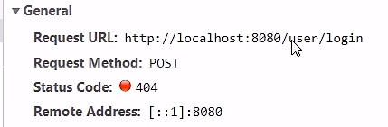

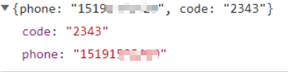


**代码：**

未登录用户自动注册

```java
    @PostMapping("/login")
    public R<User> login(@RequestBody Map map, HttpSession session){
        log.info(map.toString());

        //获取手机号
        String phone = map.get("phone").toString();

        //获取验证码
        String code = map.get("code").toString();

        //从Session中获取保存的验证码
        Object codeInSession = session.getAttribute(phone);

        //进行验证码的比对（页面提交的验证码和Session中保存的验证码比对）
        if(codeInSession != null && codeInSession.equals(code)){
            //如果能够比对成功，说明登录成功

            LambdaQueryWrapper<User> queryWrapper = new LambdaQueryWrapper<>();
            queryWrapper.eq(User::getPhone,phone);

            User user = userService.getOne(queryWrapper);
            if(user == null){
                //判断当前手机号对应的用户是否为新用户，如果是新用户就自动完成注册
                user = new User();
                user.setPhone(phone);
                user.setStatus(1);
                userService.save(user);
            }
            session.setAttribute("user",user.getId());
            return R.success(user);
        }
        return R.error("登录失败");
    }
```


> **坑点：要记得把code和手机号都用String类型，特别是存在Session中。**

**测试：**

点击获取验证码，将后台生成的验证码复制粘贴到前端验证码框，登陆成功。


# 9 移动端功能


## 9.1 用户地址簿增删改查

### 9.1.1 分析

**需求分析：**

**数据模型：**


label标签是能选择“家” 、“学校”等标签。is-default为1时是默认地址，默认0。

### 9.1.2 AddressBook 实体类、dao、Service

```java
/**
 * 地址簿
 */
@Data
public class AddressBook implements Serializable {

    private static final long serialVersionUID = 1L;
    @JsonFormat(shape = JsonFormat.Shape.STRING)
    private Long id;


    //用户id
    @JsonFormat(shape = JsonFormat.Shape.STRING)
    private Long userId;


    //收货人
    private String consignee;


    //手机号
    private String phone;


    //性别 0 女 1 男
    private String sex;


    //省级区划编号
    private String provinceCode;


    //省级名称
    private String provinceName;


    //市级区划编号
    private String cityCode;


    //市级名称
    private String cityName;


    //区级区划编号
    private String districtCode;


    //区级名称
    private String districtName;


    //详细地址
    private String detail;


    //标签
    private String label;

    //是否默认 0 否 1是
    private Integer isDefault;

    //创建时间
    @TableField(fill = FieldFill.INSERT)
    private LocalDateTime createTime;


    //更新时间
    @TableField(fill = FieldFill.INSERT_UPDATE)
    private LocalDateTime updateTime;


    //创建人
    @JsonFormat(shape = JsonFormat.Shape.STRING)
    @TableField(fill = FieldFill.INSERT)
    private Long createUser;


    //修改人
    @TableField(fill = FieldFill.INSERT_UPDATE)
    @JsonFormat(shape = JsonFormat.Shape.STRING)
    private Long updateUser;


    //是否删除
    private Integer isDeleted;
}
```


```java
@Mapper
public interface AddressBookMapper extends BaseMapper<AddressBook> {

}
public interface AddressBookService extends IService<AddressBook> {

}
@Service
public class AddressBookServiceImpl extends ServiceImpl<AddressBookMapper, AddressBook> implements AddressBookService {

}
```


### 9.1.3 controller

```java
/**
 * 地址簿管理
 */
@Slf4j
@RestController
@RequestMapping("/addressBook")
public class AddressBookController {

    @Autowired
    private AddressBookService addressBookService;

    /**
     * 新增
     */
    @PostMapping
    public R<AddressBook> save(@RequestBody AddressBook addressBook) {
        addressBook.setUserId(BaseContext.getCurrentId());
        log.info("addressBook:{}", addressBook);
        addressBookService.save(addressBook);
        return R.success(addressBook);
    }

    /**
     * 设置默认地址
     */
    @PutMapping("default")
    public R<AddressBook> setDefault(@RequestBody AddressBook addressBook) {
        //先把所有地址is_default改成0
        log.info("addressBook:{}", addressBook);
        LambdaUpdateWrapper<AddressBook> wrapper = new LambdaUpdateWrapper<>();
        wrapper.eq(AddressBook::getUserId, BaseContext.getCurrentId());
        wrapper.set(AddressBook::getIsDefault, 0);
        //SQL:update address_book set is_default = 0 where user_id = ?
        addressBookService.update(wrapper);

        //再把这个地址设为默认
        addressBook.setIsDefault(1);
        //SQL:update address_book set is_default = 1 where id = ?
        addressBookService.updateById(addressBook);
        return R.success(addressBook);
    }

    /**
     * 根据id查询地址
     */
    @GetMapping("/{id}")
    public R get(@PathVariable Long id) {
        AddressBook addressBook = addressBookService.getById(id);
        if (addressBook != null) {
            return R.success(addressBook);
        } else {
            return R.error("没有找到该对象");
        }
    }

    /**
     * 查询默认地址
     */
    @GetMapping("default")
    public R<AddressBook> getDefault() {
        LambdaQueryWrapper<AddressBook> queryWrapper = new LambdaQueryWrapper<>();
        queryWrapper.eq(AddressBook::getUserId, BaseContext.getCurrentId());
        queryWrapper.eq(AddressBook::getIsDefault, 1);

        //SQL:select * from address_book where user_id = ? and is_default = 1
        AddressBook addressBook = addressBookService.getOne(queryWrapper);

        if (null == addressBook) {
            return R.error("没有找到该对象");
        } else {
            return R.success(addressBook);
        }
    }

    /**
     * 查询指定用户的全部地址
     */
    @GetMapping("/list")
    public R<List<AddressBook>> list(AddressBook addressBook) {
        addressBook.setUserId(BaseContext.getCurrentId());
        log.info("addressBook:{}", addressBook);

        //条件构造器
        LambdaQueryWrapper<AddressBook> queryWrapper = new LambdaQueryWrapper<>();
        queryWrapper.eq(null != addressBook.getUserId(), AddressBook::getUserId, addressBook.getUserId());
        queryWrapper.orderByDesc(AddressBook::getUpdateTime);

        //SQL:select * from address_book where user_id = ? order by update_time desc
        return R.success(addressBookService.list(queryWrapper));
    }
}
```


## 9.2 菜品展示


### **9.2.1 前端购物车请求设为假数据**

**因为菜品展示页面会有购物车请求影响展示，先给购物车请求假数据：**

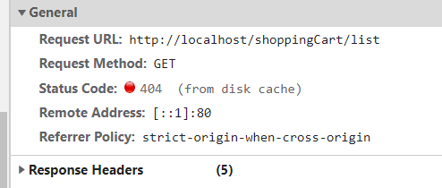

/front/api/main.api

```javascript
//获取购物车内商品的集合
function cartListApi(data) {
    return $axios({
        // 'url': '/shoppingCart/list',
        'url': '/front/cartData.json',
        'method': 'get',
        params:{...data}
    })
}
```


/front/cartData.json

```javascript
{
  "code": 1,
  "msg": null,
  "data": [],
  "map": {}
}
```


**这时候把菜品和套餐展示写了后，再访问首页\**\**\**\**\*http://localhost/front/index.html\*\**\**\**\**就有了数据**：

### 9.2.2 套餐和菜品按分类展示

现在用户端主页的菜品展示是没有味道显示的，因为之前controller条件查询（添加套餐时按分类查询菜品id）传参是Dish，现在要换成DishDto。

**DishController**


```javascript
    @GetMapping("/list")
    public R<List<DishDto>> list(Dish dish){
        //构造查询条件
        LambdaQueryWrapper<Dish> queryWrapper = new LambdaQueryWrapper<>();
        queryWrapper.eq(dish.getCategoryId() != null ,Dish::getCategoryId,dish.getCategoryId());
        //添加条件，查询状态为1（起售状态）的菜品
        queryWrapper.eq(Dish::getStatus,1);

        //添加排序条件
        queryWrapper.orderByAsc(Dish::getSort).orderByDesc(Dish::getUpdateTime);

        List<Dish> list = dishService.list(queryWrapper);

        List<DishDto> dishDtoList = list.stream().map((item) -> {
            DishDto dishDto = new DishDto();

            BeanUtils.copyProperties(item,dishDto);

            Long categoryId = item.getCategoryId();//分类id
            //根据id查询分类对象
            Category category = categoryService.getById(categoryId);

            if(category != null){
                String categoryName = category.getName();
                dishDto.setCategoryName(categoryName);
            }

            //当前菜品的id
            Long dishId = item.getId();
            LambdaQueryWrapper<DishFlavor> lambdaQueryWrapper = new LambdaQueryWrapper<>();
            lambdaQueryWrapper.eq(DishFlavor::getDishId,dishId);
            //SQL:select * from dish_flavor where dish_id = ?
            List<DishFlavor> dishFlavorList = dishFlavorService.list(lambdaQueryWrapper);
            dishDto.setFlavors(dishFlavorList);
            return dishDto;
        }).collect(Collectors.toList());

        return R.success(dishDtoList);
    }
```


**SetmealController**

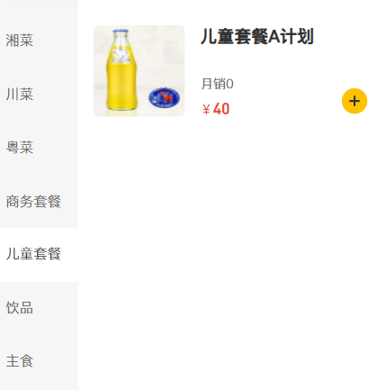

套餐不用选择味道之类信息，直接返回List即可。


```javascript
    @GetMapping("/list")
    public R<List<Setmeal>> list(Setmeal setmeal){
        LambdaQueryWrapper<Setmeal> queryWrapper = new LambdaQueryWrapper<>();
        queryWrapper.eq(setmeal.getCategoryId() != null,Setmeal::getCategoryId,setmeal.getCategoryId());
        queryWrapper.eq(setmeal.getStatus() != null,Setmeal::getStatus,setmeal.getStatus());
        queryWrapper.orderByDesc(Setmeal::getUpdateTime);

        List<Setmeal> list = setmealService.list(queryWrapper);

        return R.success(list);
    }
```


## 9.3 购物车

### 9.3.1 分析

**需求分析：**

**购物车是一个列表，每个数据是一个shopping_cart表的数据，里面只有一个菜品或套餐。**

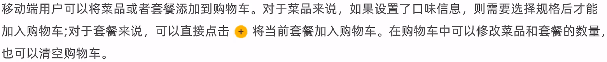

**数据模型：**

 user_id是当前购物车所属用户的id，


### 9.3.2 ShoppingCart实体类、dao和Service

```javascript
/**
 * 购物车
 */
@Data
public class ShoppingCart implements Serializable {

    private static final long serialVersionUID = 1L;
    @JsonFormat(shape = JsonFormat.Shape.STRING)
    private Long id;

    //名称
    private String name;

    //用户id
    @JsonFormat(shape = JsonFormat.Shape.STRING)
    private Long userId;

    //菜品id
    @JsonFormat(shape = JsonFormat.Shape.STRING)
    private Long dishId;

    //套餐id
    @JsonFormat(shape = JsonFormat.Shape.STRING)
    private Long setmealId;

    //口味
    private String dishFlavor;

    //数量
    private Integer number;

    //金额
    private BigDecimal amount;

    //图片
    private String image;

    private LocalDateTime createTime;
}
```


```javascript
@Mapper
public interface ShoppingCartMapper extends BaseMapper<ShoppingCart> {

}
public interface ShoppingCartService extends IService<ShoppingCart> {

}
@Service
public class ShoppingCartServiceImpl extends ServiceImpl<ShoppingCartMapper, ShoppingCart> implements ShoppingCartService {

}
```


### 9.3.2 添加购物车


**请求：**

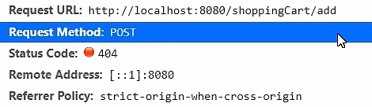

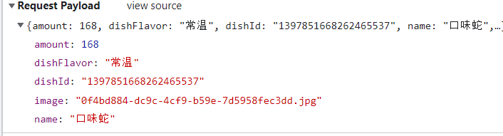

**代码：**

> **注意不能直接添加购物车，要先查询此东西是否已加入购物车，如果已加入amount加1， 未加入则加入。**

```javascript
@Slf4j
@RestController
@RequestMapping("/shoppingCart")
public class ShoppingCartController {

    @Autowired
    private ShoppingCartService shoppingCartService;

    /**
     * 添加购物车
     * @param shoppingCart
     * @return
     */
    @PostMapping("/add")
    public R<ShoppingCart> add(@RequestBody ShoppingCart shoppingCart){
        log.info("购物车数据:{}",shoppingCart);

        //设置用户id，指定当前是哪个用户的购物车数据
        Long currentId = BaseContext.getCurrentId();
        shoppingCart.setUserId(currentId);

        Long dishId = shoppingCart.getDishId();

        LambdaQueryWrapper<ShoppingCart> queryWrapper = new LambdaQueryWrapper<>();
        queryWrapper.eq(ShoppingCart::getUserId,currentId);

        if(dishId != null){
            //添加到购物车的是菜品
            queryWrapper.eq(ShoppingCart::getDishId,dishId);

        }else{
            //添加到购物车的是套餐
            queryWrapper.eq(ShoppingCart::getSetmealId,shoppingCart.getSetmealId());
        }

        //查询当前菜品或者套餐是否在购物车中
        //SQL:select * from shopping_cart where user_id = ? and dish_id/setmeal_id = ?
        ShoppingCart cartServiceOne = shoppingCartService.getOne(queryWrapper);

        if(cartServiceOne != null){
            //如果已经存在，就在原来数量基础上加一
            Integer number = cartServiceOne.getNumber();
            cartServiceOne.setNumber(number + 1);
            shoppingCartService.updateById(cartServiceOne);
        }else{
            //如果不存在，则添加到购物车，数量默认就是一
            shoppingCart.setNumber(1);
            shoppingCart.setCreateTime(LocalDateTime.now());
            shoppingCartService.save(shoppingCart);
            cartServiceOne = shoppingCart;
        }

        return R.success(cartServiceOne);
    }
}
```


### 9.3.3 查看购物车


**首先前端改回请求路径：**

```javascript
//获取购物车内商品的集合
function cartListApi(data) {
    return $axios({
        'url': '/shoppingCart/list',
        // 'url': '/front/cartData.json',
        'method': 'get',
        params:{...data}
    })
}
```


**代码：**

> **坑点：要查询当前用户的购物车**

```javascript
    /**
     * 查看购物车
     * @return
     */
    @GetMapping("/list")
    public R<List<ShoppingCart>> list(){
        log.info("查看购物车...");

        LambdaQueryWrapper<ShoppingCart> queryWrapper = new LambdaQueryWrapper<>();
        queryWrapper.eq(ShoppingCart::getUserId,BaseContext.getCurrentId());
        queryWrapper.orderByAsc(ShoppingCart::getCreateTime);

        List<ShoppingCart> list = shoppingCartService.list(queryWrapper);

        return R.success(list);
    }
```


### 9.3.4 购物车减少菜品数量

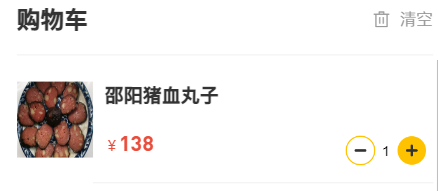

**请求：**

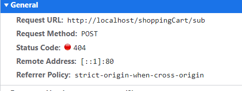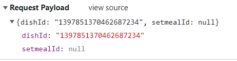


**代码：**

```javascript
    @PostMapping("/sub")
    public R<String> sub(@RequestBody ShoppingCart shoppingCart){
        //先查是菜品还是套餐，查当前用户的购物车
        Long dishId = shoppingCart.getDishId();
        Long setmealId = shoppingCart.getSetmealId();
        LambdaQueryWrapper<ShoppingCart> wrapper=new LambdaQueryWrapper<>();
        wrapper.eq(dishId!=null,ShoppingCart::getDishId,dishId);
        wrapper.eq(setmealId!=null,ShoppingCart::getSetmealId,setmealId);
        wrapper.eq(ShoppingCart::getUserId,BaseContext.getThreadId());
        ShoppingCart one = shoppingCartService.getOne(wrapper);
        if(one.getNumber()>1){
            //数量大于1，减1
            one.setNumber(one.getNumber()-1);
            shoppingCartService.updateById(one);
            return R.success("减少成功");
        }else{
            //数量为1,，在减少后为0，删除商品
            shoppingCartService.removeById(one);
            return R.success("这个商品没了");
        }
    }
```


### 9.3.5 清空购物车


**请求：**


**代码：**

```javascript
    /**
     * 清空购物车
     * @return
     */
    @DeleteMapping("/clean")
    public R<String> clean(){
        //SQL:delete from shopping_cart where user_id = ?

        LambdaQueryWrapper<ShoppingCart> queryWrapper = new LambdaQueryWrapper<>();
        queryWrapper.eq(ShoppingCart::getUserId,BaseContext.getCurrentId());

        shoppingCartService.remove(queryWrapper);

        return R.success("清空购物车成功");
    }
```


## 9.4 下单

### 9.4.1 分析


**需求：**个人用户无法开发支付功能，所以付款时候保存数据库即可。

**订单表order数据模型：**

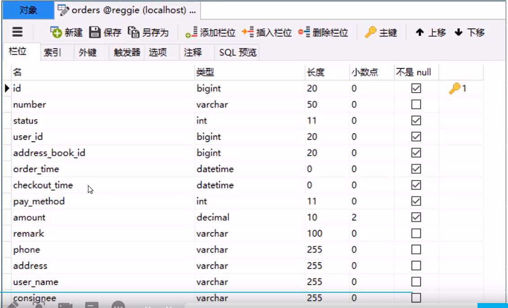

> - status是订单状态，默认为1，1待付款，2待派送，3已派送，4已完成，5已取消。
> - checkout_time是结账时间。
> - pay_method支付方式，1微信2支付宝
> - amount金额
> - remark备注
> - consignee收货人名

**明细表order_detail数据模型**


### 9.4.2 Order,OrderDetail实体类、dao、Service、controller

没什么新的东西，跟前面一样。注意点是@JsonFormat防止js丢失精度

```javascript
/**
 * 订单
 */
@Data
//一定要注意表名不能是order
public class Orders implements Serializable {
    
    private static final long serialVersionUID = 1L;
    @JsonFormat(shape = JsonFormat.Shape.STRING)
    private Long id;

    //订单号
    private String number;

    //订单状态 1待付款，2待派送，3已派送，4已完成，5已取消
    private Integer status;


    //下单用户id
    @JsonFormat(shape = JsonFormat.Shape.STRING)
    private Long userId;

    //地址id
    @JsonFormat(shape = JsonFormat.Shape.STRING)
    private Long addressBookId;


    //下单时间
    private LocalDateTime orderTime;


    //结账时间
    private LocalDateTime checkoutTime;


    //支付方式 1微信，2支付宝
    private Integer payMethod;


    //实收金额
    private BigDecimal amount;

    //备注
    private String remark;

    //用户名
    private String userName;

    //手机号
    private String phone;

    //地址
    private String address;

    //收货人
    private String consignee;
}
```


```javascript
/**
 * 订单明细
 */
@Data
public class OrderDetail implements Serializable {

    private static final long serialVersionUID = 1L;
    @JsonFormat(shape = JsonFormat.Shape.STRING)
    private Long id;

    //名称
    private String name;

    //订单id
    @JsonFormat(shape = JsonFormat.Shape.STRING)
    private Long orderId;


    //菜品id
    @JsonFormat(shape = JsonFormat.Shape.STRING)
    private Long dishId;


    //套餐id
    @JsonFormat(shape = JsonFormat.Shape.STRING)
    private Long setmealId;


    //口味
    private String dishFlavor;


    //数量
    private Integer number;

    //金额
    private BigDecimal amount;

    //图片
    private String image;
}
```


```javascript
@Mapper
public interface OrderMapper extends BaseMapper<Orders> {

}
@Mapper
public interface OrderDetailMapper extends BaseMapper<OrderDetail> {

}
public interface OrderService extends IService<Orders> {


}
public interface OrderDetailService extends IService<OrderDetail> {

}
@Service
@Slf4j
public class OrderServiceImpl extends ServiceImpl<OrderMapper, Orders> implements OrderService {
}
@Service
public class OrderDetailServiceImpl extends ServiceImpl<OrderDetailMapper, OrderDetail> implements OrderDetailService {

}
```


```javascript
@RestController
@RequestMapping("order")
@Slf4j
public class OrderController {
    @Autowired
    private OrderService orderService;
}
@RestController
@RequestMapping("/orderDetail")
@Slf4j
public class OrderDetailController {
    @Autowired
    private OrderDetailService orderDetailService;
}
```


### 9.4.3 提交订单


**请求：**


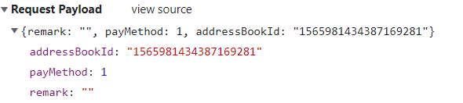

**步骤：**

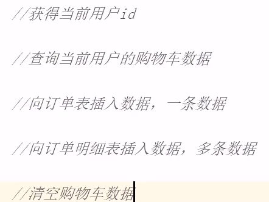


**代码：**

> **注意：**
>
> - 下单不需要传套菜信息，因为可以通过线程里用户id从购物车数据库查。外卖项目每次购买方法都是提交购物车，不需要像商城那样购物车存一堆不买的东西。
> - 下单的难点是既要保存订单信息，还要保存订单详情页，所以要新写个submit业务方法。
> - 使用mp的**IdWorker.getId()**生成雪花算法的订单id。
> - 查询当前用户购物车数据后要遍历计算总金额，**总金额类型AtomicInteger原子整型，可以保证线程安全。addAndGet是先加再获取，getAndAdd是先获取再加。**

**OrderServiceImpl**

```javascript
    @Transactional
    public void submit(Orders orders) {
        //获得当前用户id
        Long userId = BaseContext.getCurrentId();

        //查询当前用户的购物车数据
        LambdaQueryWrapper<ShoppingCart> wrapper = new LambdaQueryWrapper<>();
        wrapper.eq(ShoppingCart::getUserId,userId);
        List<ShoppingCart> shoppingCarts = shoppingCartService.list(wrapper);

        if(shoppingCarts == null || shoppingCarts.size() == 0){
            throw new CustomException("购物车为空，不能下单");
        }

        //查询用户数据
        User user = userService.getById(userId);

        //查询地址数据
        Long addressBookId = orders.getAddressBookId();
        AddressBook addressBook = addressBookService.getById(addressBookId);
        if(addressBook == null){
            throw new CustomException("用户地址信息有误，不能下单");
        }
        //用IdWorker设置订单号
        long orderId = IdWorker.getId();//订单号
        //AtomicInteger原子整型，可以保证线程安全。addAndGet是先加再获取，getAndAdd是先获取再加。
        AtomicInteger amount = new AtomicInteger(0);
        //购物车数据加工成订单细节
        List<OrderDetail> orderDetails = shoppingCarts.stream().map((item) -> {
            OrderDetail orderDetail = new OrderDetail();
            orderDetail.setOrderId(orderId);
            orderDetail.setNumber(item.getNumber());
            orderDetail.setDishFlavor(item.getDishFlavor());
            orderDetail.setDishId(item.getDishId());
            orderDetail.setSetmealId(item.getSetmealId());
            orderDetail.setName(item.getName());
            orderDetail.setImage(item.getImage());
            orderDetail.setAmount(item.getAmount());
            //叠加金额，对于不需要任何准确计算精度的数字可以直接使用float或double，但是如果需要精确计算的结果，则必须使用BigDecimal类，而且使用BigDecimal类也可以进行大数的操作。
            //BigDecimal的intValue()方法把BigDecimal类型转为int型。addAndGet相当于x=x+y
            amount.addAndGet(item.getAmount().multiply(new BigDecimal(item.getNumber())).intValue());
            return orderDetail;
        }).collect(Collectors.toList());


        orders.setId(orderId);
        orders.setOrderTime(LocalDateTime.now());
        orders.setCheckoutTime(LocalDateTime.now());
        orders.setStatus(2);
        orders.setAmount(new BigDecimal(amount.get()));//总金额
        orders.setUserId(userId);
        orders.setNumber(String.valueOf(orderId));
        orders.setUserName(user.getName());
        orders.setConsignee(addressBook.getConsignee());
        orders.setPhone(addressBook.getPhone());
        orders.setAddress((addressBook.getProvinceName() == null ? "" : addressBook.getProvinceName())
                + (addressBook.getCityName() == null ? "" : addressBook.getCityName())
                + (addressBook.getDistrictName() == null ? "" : addressBook.getDistrictName())
                + (addressBook.getDetail() == null ? "" : addressBook.getDetail()));
        //向订单表插入数据，一条数据
        this.save(orders);

        //向订单明细表插入数据，多条数据
        orderDetailService.saveBatch(orderDetails);

        //清空购物车数据
        shoppingCartService.remove(wrapper);
    }
```


> **BigDecimal和double区别：**和对于不需要任何准确计算精度的数字可以直接使用float或double，但是如果**需要精确计算的结果，则必须使用BigDecimal类**，而且使用BigDecimal类也可以进行大数的操作。 intValue()方法把BigDecimal类型转为int型

**OrderController**

```javascript
    /**
     * 用户下单
     * @param orders
     * @return
     */
    @PostMapping("/submit")
    public R<String> submit(@RequestBody Orders orders){
        log.info("订单数据：{}",orders);
        orderService.submit(orders);
        return R.success("下单成功");
    }
```


> **坑点：表名不能是order！表名不能是order！表名不能是order！**