>   **导航：**
>
> [【Java笔记+踩坑汇总】Java基础+JavaWeb+SSM+SpringBoot+SpringCloud+瑞吉外卖/谷粒商城/学成在线+设计模式+面试题汇总+性能调优/架构设计+源码解析](https://blog.csdn.net/qq_40991313/article/details/126646289?csdn_share_tail={"type"%3A"blog"%2C"rType"%3A"article"%2C"rId"%3A"126646289"%2C"source"%3A"qq_40991313"})

[TOC]


# 10 项目优化，优化缓存

## 10.0 推送并新建cache分支

### **10.0.1 push项目** 

把项目提交到GitHub或码云：步骤是添加暂存区、提交本地库**（记得关闭代码检查）**、推送到GitHub、输入远程名和项目名和描述即可创建仓库并push。

这里远程名就是别名。

具体推送方法参考： 

[【尚硅谷Java笔记】Git（分布式版本控制工具）_vincewm的博客-CSDN博客](https://blog.csdn.net/qq_40991313/article/details/126251168)

**这里说一下本项目用idea上传GitHub的方法**

> **第一次推送会有需要登录之类的配置，具体看上面这个git教程。**

**1.选择工具栏的VCS、点击创建仓库** 

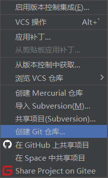


**2.选择瑞吉外卖项目根目录**

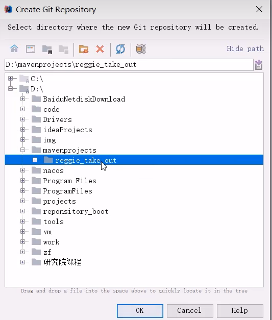

**3，添加暂存区：** 

项目根目录右键：

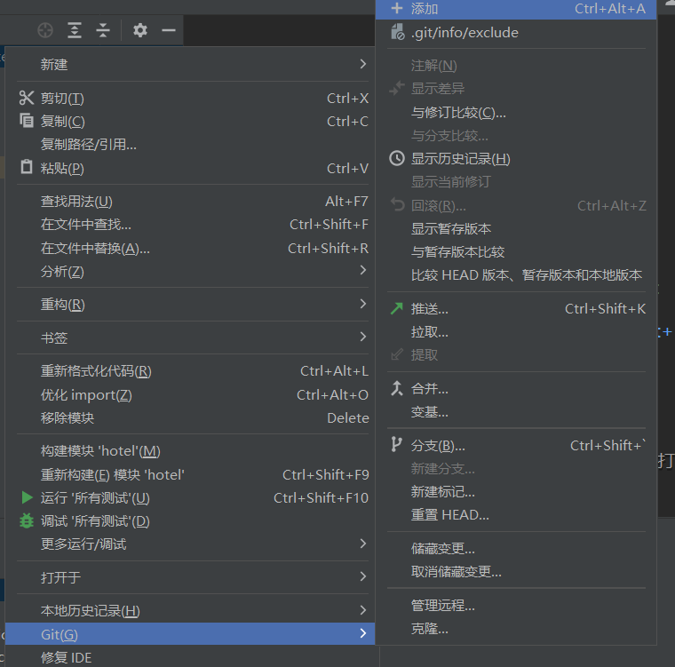

所有文件名由红变绿就是添加成功了。

**4.取消代码检查后提交本地库**

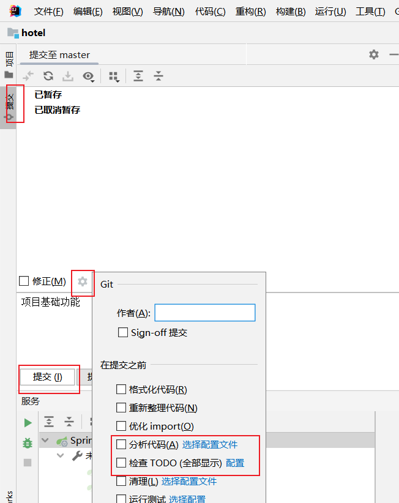


**5.创建仓库并推送到GitHub**

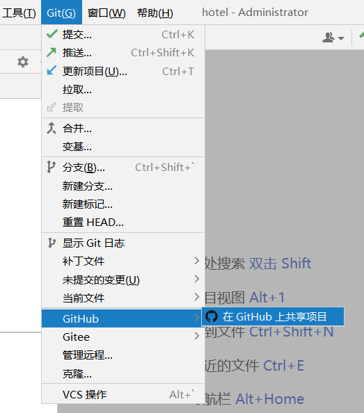

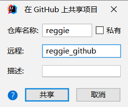


6.再分享项目到gitee，没有选项就下载gitee插件

 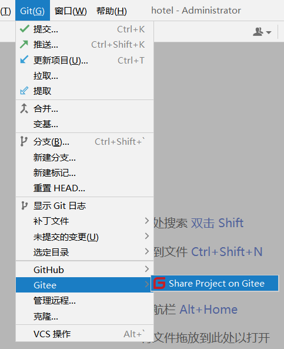

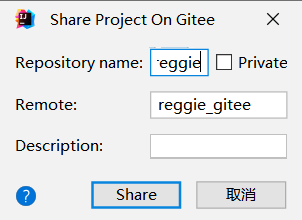


打开自己的GitHub、gitee发现已经上传成功。


### **10.0.2 创建新分支，优化缓存**

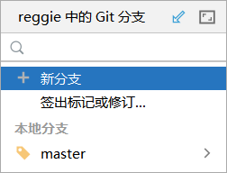

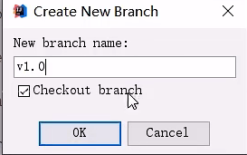


## 10.1 依赖、yml配置、Redis配置类

**导入redis坐标：**

```XML
        <dependency>
            <groupId>org.springframework.boot</groupId>
            <artifactId>spring-boot-starter-data-redis</artifactId>
        </dependency>
```


**默认配置：**

```XML
spring:
  redis:
    host: localhost
    port: 6379
```


**Redis配置类：设置字符串序列化器**

```java
package com.jq.config;

import org.springframework.cache.annotation.CachingConfigurerSupport;
import org.springframework.context.annotation.Bean;
import org.springframework.context.annotation.Configuration;
import org.springframework.data.redis.connection.RedisConnectionFactory;
import org.springframework.data.redis.core.RedisTemplate;
import org.springframework.data.redis.serializer.StringRedisSerializer;
/**
 * Redis配置类
 */
@Configuration
public class RedisConfig extends CachingConfigurerSupport{
    
    @Bean
    public RedisTemplate<Object, Object> redisTemplate(RedisConnectionFactory connectionFactory) {

        RedisTemplate<Object, Object> redisTemplate = new RedisTemplate<>();

        //默认的Key序列化器为：JdkSerializationRedisSerializer
        redisTemplate.setKeySerializer(new StringRedisSerializer());
        redisTemplate.setHashKeySerializer(new StringRedisSerializer());

        redisTemplate.setConnectionFactory(connectionFactory);

        return redisTemplate;
    }

}
```


## 10.2 缓存短信验证码

**实现思路：** 

前面已经实现了移动端手机验证码登录，**之前随机生成的验证码是保存在HttpSession中的**。
 现在需要改造为将验证码缓存在Redis中，具体的实现思路如下:

1. 在服务端UserController中**注入RedisTemplate对象**，用于操作Redis
2. 在服务端UserController的sendMsg方法中,将随机生成的**验证码缓存到Redis中**，并设置有效期为5分钟
3. 在服务端UserController的login方法中，**从Redis中 获取缓存的验证码**，如果**登录成功则删除Redis中的验证码**

**代码改造** 

UserController 

```java
@Slf4j
@RestController
@RequestMapping("/user")
public class UserController {
    @Autowired
    private UserService userService;
    @Autowired
    private RedisTemplate redisTemplate;
    @PostMapping("sendMsg")
    public R<String> sendMsg(@RequestBody User user){
        String code = ValidateCodeUtils.generateValidateCode(4).toString();
        log.info("手机号：{}，验证码：{}",user.getPhone(),code);
        redisTemplate.opsForValue().set(user.getPhone(),code,5, TimeUnit.MINUTES);
        return R.success("发送成功");
    }
    @PostMapping("/login")
    public R<String> login(@RequestBody Map<String,String> map, HttpSession session){
        String phone = map.get("phone");
        String code = map.get("code");
        Object sessionCode =redisTemplate.opsForValue().get(phone);
        log.info("提交的手机号：{}，验证码：{}，session中的验证码：{}",phone,code,sessionCode);
        if(sessionCode!=null&&sessionCode.equals(code)){
            redisTemplate.delete(phone);
            //验证成功，查询是否已经注册
            log.info("验证成功");
            LambdaQueryWrapper<User> wrapper=new LambdaQueryWrapper<>();
            wrapper.eq(User::getPhone,phone);
            User user = userService.getOne(wrapper);
            //没查到，未注册
            if(user==null){
                log.info("没查到，未注册");
                User addUser = new User();
                addUser.setPhone(phone);addUser.setStatus(1);
                if(!userService.save(addUser)) return R.error("验证成功，自动注册失败");
                session.setAttribute("user",addUser.getId());
                return R.success("验证成功，自动注册成功");
            }else {
                //已注册
                log.info("已经注册，正在登录");
                session.setAttribute("user",user.getId());
                return R.success("验证成功，登录成功");
            }
        }else {
            log.info("验证失败，此时的code：{}",code);
            return R.error("验证失败");
        }
    }
}
```


## 10.3 编程方式缓存菜品数据

**实现思路**
 前面已经实现了移动端菜品查看功能，对应的服务端方法为DishController的list方法，此方法会根据前端提交的查询条件进行数据库查询操作。
 **在高并发的情况下，频繁查询数据库会导致系统性能下降**,服务端响应时间增长。现在需要对此方法进行缓存优化，提高系统的性能。

**具体的实现思路如下:**

1. 改造DishController的list方法 ，**先从Redis中获取菜品数据，如果有则直接返回**，无需查询数据库;如果没有则查询数据库，并将查询到的菜品数据放入Redis，有效期1小时。
2. 改造DishController的**save和update**方法, 加入**清理缓存**的逻辑

> **注意事项**
>  在使用缓存过程中，要注意保证数据库中的数据和缓存中的数据一致,如果数据库中的数据发生变化，需要及时清理缓存数据。、

**代码：**

DishController

> **注意：删除是redisTemplate.delete("xxx") ;获取List<DishDto>类型的key要强转类型。**

```java
    @GetMapping("/list")
    public R<List<DishDto>> list(Dish dish){
        if(dish.getStatus()!=null) dish.setStatus(1);
        List<DishDto> dishDtos=(List<DishDto>) redisTemplate.opsForValue().get("dish_" + dish.getCategoryId() + "_" + dish.getStatus());
        log.info("dishDtos:{}",dishDtos);
        //缓存中查到了
        if(dishDtos.size()>0) return R.success(dishDtos);
        //缓存中没查到，查询数据，放进缓存
        LambdaQueryWrapper<Dish> wrapper=new LambdaQueryWrapper<>();
        wrapper.like(!StringUtils.isEmpty(dish.getName()),Dish::getName,dish.getName());
        wrapper.eq(dish.getCategoryId()!=null,Dish::getCategoryId,dish.getCategoryId());
        //只查起售的
        wrapper.eq(dish.getStatus()!=null,Dish::getStatus,dish.getStatus());
        wrapper.orderByDesc(Dish::getUpdateTime);
        //查到了条件下所有菜品的基本信息
        List<Dish> dishes = dishService.list(wrapper);
        //所有菜品基本信息加工成包括分类名和味道
        dishDtos=dishes.stream().map(item->{
            DishDto dishDto = new DishDto();
            BeanUtils.copyProperties(item,dishDto);
            //设置菜品所属分类名
            Category category = categoryService.getById(dish.getCategoryId());
            if(category!=null) dishDto.setCategoryName(category.getName());
            //设置这个菜品对应的所有味道
            LambdaQueryWrapper<DishFlavor> wrapper1=new LambdaQueryWrapper<>();
            wrapper1.eq(DishFlavor::getDishId,item.getId());
            List<DishFlavor> flavors = dishFlavorService.list(wrapper1);
            dishDto.setFlavors(flavors);
            return dishDto;
        }).collect(Collectors.toList());
        redisTemplate.opsForValue().set("dish_" + dish.getCategoryId() + "_" + dish.getStatus(),dishDtos,1, TimeUnit.HOURS);
        return R.success(dishDtos);
    }
    @PutMapping
    public R<String> update(@RequestBody DishDto dishDto){
        if(dishService.updateWithFlavor(dishDto)){
            redisTemplate.delete("dish_" + dishDto.getCategoryId() + "_" + dishDto.getStatus());
            return R.success("更新成功");
        }
        else return R.error("更新失败");
    }
    @PostMapping
    public R<String> save(@RequestBody DishDto dishDto){
        log.info("新增菜品传来的dish：{}",dishDto);
        if(dishService.saveWithFlavor(dishDto)) {
            redisTemplate.delete("dish_" + dishDto.getCategoryId() + "_" + dishDto.getStatus());
            return R.success("保存成功");
        }
        else return R.error("保存失败");
    }
```


**测试:**

第二次刷新首页、添加修改香菜类别后、发现没有调用数据库：

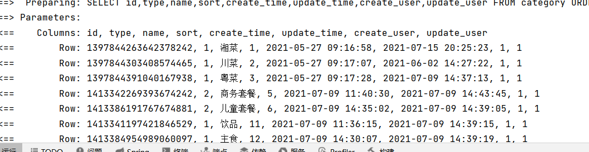


## 10.4 合并分支

添加暂存区、提交本地库（关闭检查） 、推送cache分支到GitHub或码云。

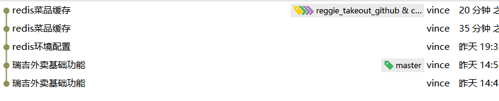

**合并分支：**

先切换到master分支，然后选择cache分支合并：

 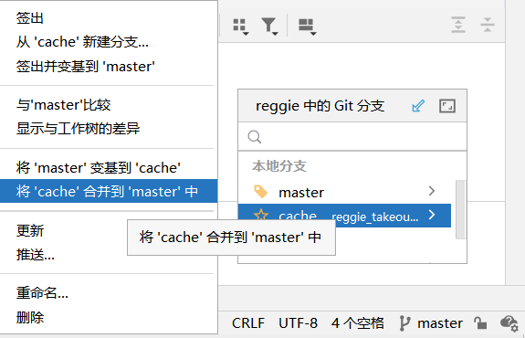

**合并后再切换回cache分支进行代码优化** 

## 10.5 注解方式缓存套餐数据

### **10.5.1 导入cache和redis坐标**

```XML
 <dependency>
     <groupId>org.springframework.boot</groupId>
     <artifactId>spring-boot-starter-data-redis</artifactId>
 </dependency>
 <dependency>
     <groupId>org.springframework.boot</groupId>
     <artifactId>spring-boot-starter-cache</artifactId>
 </dependency>
```


### **10.5.2 yml配置**

```XML
spring:
  redis:
    host: localhost
    port: 6379
  cache:
    type: redis
    redis:
      time-to-live: 1800s   #30分钟
```


### **10.5.3 开启缓存：**启动类上@EnableCaching

```java
@Slf4j
@ServletComponentScan
@SpringBootApplication
@EnableTransactionManagement
@EnableCaching //开启Spring Cache
public class RuiJiApplication {
    public static void main(String[] args) {
        log.info("正在启动服务...");
        SpringApplication.run(RuiJiApplication.class,args);
    }
}
```


### **10.5.4 结果类实现序列化接口**

> 要缓存的值是对象时，对应的类必须实现序列化接口。 

```java
@Data
public class R<T> implements Serializable {

    private static final long serialVersionUID = 1L;

    private Integer code; //编码：1成功，0和其它数字为失败

    private String msg; //错误信息

    private T data; //数据

    private Map map = new HashMap(); //动态数据

    public static <T> R<T> success(T object) {
        R<T> r = new R<T>();
        r.data = object;
        r.code = 1;
        return r;
    }

    public static <T> R<T> error(String msg) {
        R r = new R();
        r.msg = msg;
        r.code = 0;
        return r;
    }
    //添加动态数据
    public R<T> add(String key, Object value) {
        this.map.put(key, value);
        return this;
    }
}
```


### **10.5.5 注解实现缓存** 

在SetmealController的list**条件查询方法**上加入**@Cacheable注解**

```java
/**
 * 根据条件查询套餐数据
 * @param setmeal
 * @return
 */
@GetMapping("/list")
    //value是缓存名称，一个value下有多个key
    //key是缓存的key，key="#setmeal.categoryId"是将方法返回值存到key里。
@Cacheable(value = "setmealCache",key ="#setmeal.categoryId+'_'+#setmeal.status")
public R<List<Setmeal>>list(Setmeal setmeal){
    LambdaQueryWrapper<Setmeal>queryWrapper=new LambdaQueryWrapper<>();
    queryWrapper.eq(setmeal.getCategoryId()!=null,Setmeal::getCategoryId,setmeal.getCategoryId());
    queryWrapper.eq(setmeal.getStatus()!=null,Setmeal::getStatus,setmeal.getStatus());
    queryWrapper.orderByDesc(Setmeal::getUpdateTime);

    List<Setmeal> list = setmealService.list();
    return R.success(list);
}
```


在SetmealController的**增删改方法**上加入**CacheEvict注解**


```java
 /**
  * 新增套餐
  * @param setmealDto
  * @return
  * 涉及两张表操作
  */
 @PostMapping
 @CacheEvict(value ="setmealCache",allEntries = true)
 public R<String> save(@RequestBody SetmealDto setmealDto){
     log.info("套餐信息：{}",setmealDto);
     setmealService.saveWithDish(setmealDto);
     return R.success("新增套餐成功");
 }

/**
 * 删除套餐
 * @param ids
 * @return
 */
@DeleteMapping

@CacheEvict(value ="setmealCache",allEntries = true)
public R<String>delete(@RequestParam List<Long> ids){
    log.info("ids：{}",ids);
    setmealService.removeWithDish(ids);
    return R.success("套餐删除成功");
}
```


**测试：**

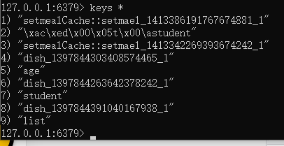

## 10.6 提交Git并合并主分支

先添加到暂存区，然后提交本地库并推送：

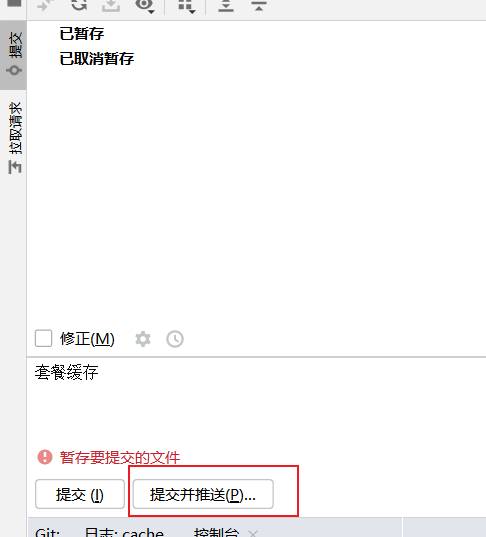

先切换到master，然后点击cache分支合并：

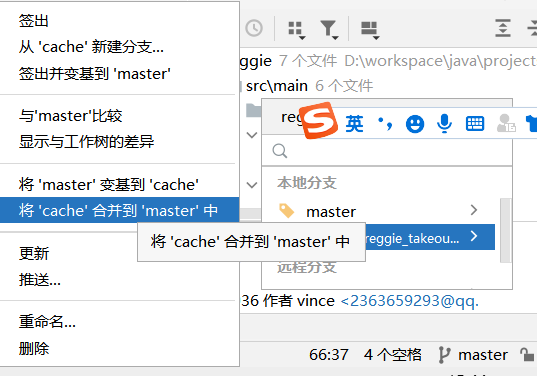


# 11 项目优化，读写分离

## 11.0 配置主从数据库

**前置条件：**提前准备两台服务器（linux），使用finalshell连接后，分别安装mysql并启动服务成功。 

### **11.0.1 配置主库maser（centos1）**

> **建议主从库都用centos，跟自己Windows环境的数据库区分开**

**第一步：修改MySQL数据库的配置文件**， /etc/my.cfg


```java
vim /ect/my.cnf
```


修改 

```bash
[mysqld]
log-bin=mysql-bin #[必须]启用二进制日志
server-id=100 #[必须] 服务器唯一id
```


**第二步：重启MySQL**

 如果是linux：

```
systemctl restart mysqld
```


**第三步：登录MySQL数据库，执行以下SQL**

```java
mysql -uroot -p密码
```


```java
GRANT REPLICATION SLAVE ON *.* to 'xiaoming'@'%' identified by 'Root@123456';
```


> **注意：**
>
> - 上面SQL的作用是创建一个用户xiaoming, 密码为Root@123456,并且给xiaoming用户授予REPLICATION SLAVE权限。密码和用户名可以自己设置。
> - REPLICATION SLAVE（replication译为主从复制，努力）权限常用于建立复制时所需要用到的用户权限，也就是slave必须被master授权具有该权限的用户，才能通过该用户复制。

**第四步：查看master状态，执行以下sql，记录结果中的FIle和Position的值**

```java
show master status;
```


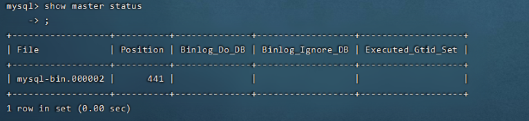


执行完上面SQL语句，不要再执行任何操作


### **11.0.2 配置从库Slave（centos数据库2）**

可以新建一个centos，安装数据库作为从库，也可以使用当前Windows，主要是主从库不能是同一台服务器。

**第一步，修改MySQL数据库的配置文件**， /etc/my.cnf

```java
vim /ect/my.cnf
```


 修改：


```java
[mysqld]
#从数据库的唯一id
server-id=101
```


> 如果是Windows，修改mysql安装目录的my.ini


**第二步：重新启动mysql服务**

```java
systemctl restart mysqld
```


>  如果是Windows
>
> ```
> net stop mysql
> net start mysql
> ```
>
> 

**第三步：登录mysl，设置主库ip、用户名密码、日志文件名、密码、binlog名和偏移量**

```
mysql -uroot -p123456
```


**执行以下SQL语句**

先将下面信息修改成自己的主数据库信息： 

```bash
change master to
master_host= '192.168.112.100',master_user='xiaoming',master_password='Root@123456', master_log_file= 'mysql-bin.000002',master_log_pos=441;
start slave;
```


> **注意：**
>
> - 如果提示已经有slave运行就先停止：stop slave;然后再绑定主机
> - **日志名、位置一定要根据自己查主库状态：**
>
> ```java
> show master status;
> ```
>
> 
>
> 


**第四步：查询从数据库的状态**

```java
show slave status;
```


复制粘贴到记事本，更直观： 

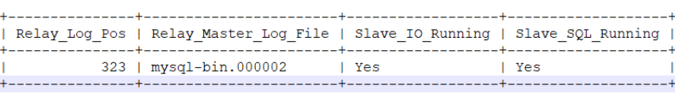


### **11.0**.3 测试

主库新增数据，从库也自动跟着新增数据。 


## 11.1 主从复制 

在主库中创建一个数据库，并导入提供的数据库表，更新主从数据库即可


## 11.2 代码实现

**11.2.1 导入maven依赖**

```XML
<dependency>
    <groupId>org.apache.shardingsphere</groupId>
    <artifactId> sharding-jdbc-spring-boot-starter</artifactId>
    <version>4.0.0-RC1</version>
</dependency>
```


**11.2.2 在配置文件中配置读写分离规则**

```bash
server:
  port: 8080
spring:
  application:
    name: reggie_take_out
  shardingsphere:
    datasource:
#自定义数据源名字，名字随便取，注意是下面masterslave配置主从数据源名字
      names:
        master,slave
      ## 主数据源
      master:
        type: com.alibaba.druid.pool.DruidDataSource
        driver-class-name: com.mysql.cj.jdbc.Driver
        url: jdbc:mysql://192.168.112.100:3306/rjdb?characterEncoding=utf-8
        username: root
        password: 123456
      ## 从数据源
      slave:
        type: com.alibaba.druid.pool.DruidDataSource
        driver-class-name: com.mysql.cj.jdbc.Driver
        url: jdbc:mysql://127.0.0.1:3306/rjdb?characterEncoding=utf-8
        username: root
        password: 123456
#配置主从信息
    masterslave:
      ## 从库的负载均衡算法类型，round_robin意思是几个从库轮流查询
      load-balance-algorithm-type: round_robin
      ## 最终的数据源名称
      name: dataSource
      ## 主库数据源名称
      master-data-source-name: master
      ## 从库数据源名称列表，多个逗号分隔
      slave-data-source-names: slave
    props:
      sql:
        show: true #开启SQL显示，默认false
#允许bean定义覆盖配置项
  main:
    allow-bean-definition-overriding: true

  redis:
    host: 192.168.112.100
    port: 6379
    password: 123456
    database: 0
  cache:
    redis:
      time-to-live: 1800000  #设置缓存数据的过期时间
mybatis-plus:
  configuration:
    #在映射实体或者属性时，将数据库中表名和字段名中的下划线去掉，按照驼峰命名法映射
    map-underscore-to-camel-case: true
    log-impl: org.apache.ibatis.logging.stdout.StdOutImpl
  global-config:
    db-config:
      id-type: ASSIGN_ID

## 文件上传后保存路径
rj:
  path: F:\JavaCode\RuiJiProject\src\main\java\com\jq\uploaddata\
```


**11.2.3 允许bean定义覆盖配置项**

**不配置时报错：**

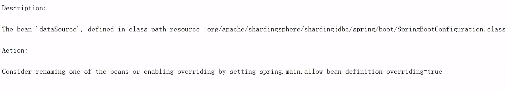

配置：

```bash
#允许bean定义覆盖配置项
spring:
  main:
    allow-bean-definition-overriding: true
```


# 12 项目优化，前后端分离（了解）


## 12.1.为什么进行前后端分离


- 开发人员同时负责前端和后端代码开发，分工不明确
- 开发效率低
- 前后端代码混合在一个工程中，不便于管理
- 对开发人员要求高，人员招聘困难

## 12.2.前后端分离开发

**介绍**

前后端分离开发，就是在项目开发过程中，对于前端代码的开发由专门的前端开发人员负责,后端代码则由后端开发人员负责,这样可以做到分工明确、各司其职，提高开发效率,前后端代码并行开发,可以加快项目开发进度。

目前，前后端分离开发方式已经被越来越多的公司所采用,成为当前项目开发的主流开发方式。 前后端分离开发后，从工程结构上也会发生变化,即**前后端代码不再混合在同一个maven工程中，而是分为前端工程（部署到Nginx）和后端工程（部署到Tomcat）。**

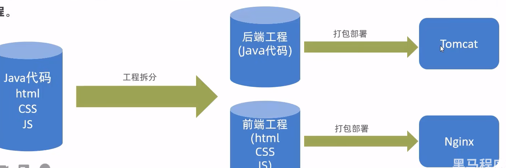


**开发流程**

前后端分离开发后，面临一一个问题，就是前端开发人员和后端开发人员如何进行配合来共同开发一一个项目? 可以按照如下流程进行:

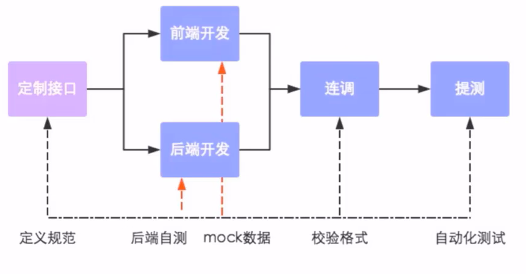


**接口(API接口)：一个http的请求，主要就是去定义:**

- **请求路径**
- **请求方式**
- **请求参数**
- **响应数据**

等内容。

**接口例子 ：**

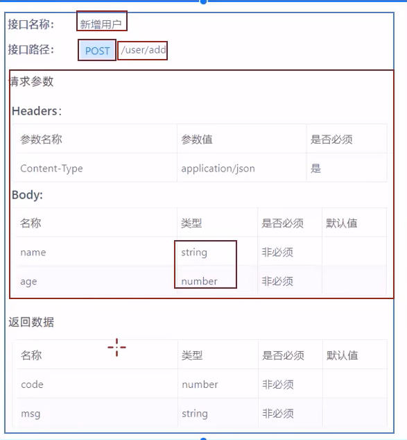


**前端技术栈**

开发工具

- Visual Studio Code
- hbuilder .

技术框架

- nodejs
- VUE
- ElementUI
- mock
- webpack 前端打包工具

## 12.3.Yapi，定义接口

**介绍**

YApi是高效、易用、功能强大的**api管理平台**，旨在为开发、产品、测试人员提供更优雅的**接口管理服务**。

可以帮助.开发者轻松**创建、发布、维护API,** YApi 还为用户提供了优秀的交互体验，开发人员只需利用平台提供的接口数据写入工具以及简单的点击操作就可以实现接口的管理。 YApi让接口开发更简单高效，让接口的管理更具可读性、可维护性，让团队协作更合理。

要使用YApi,需要自己进行部署。


**使用**

**添加项目**

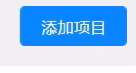

 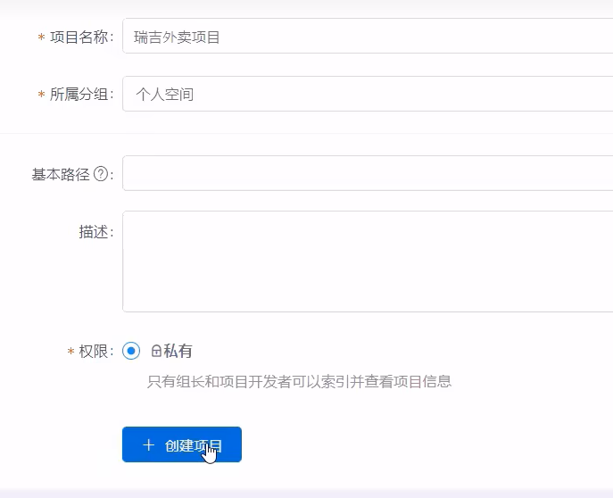


**添加分类、接口**

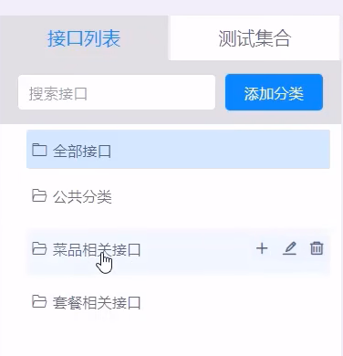

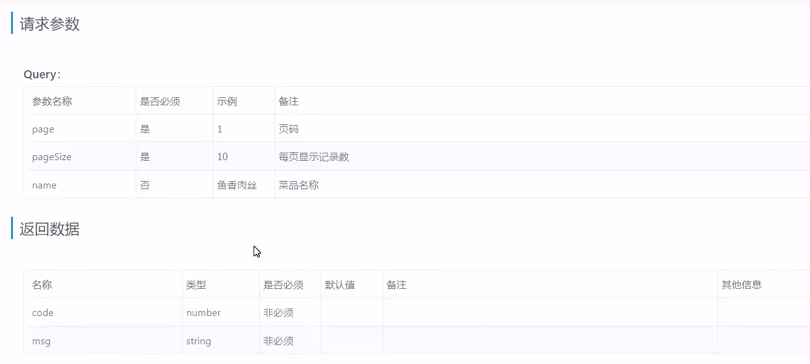

**导出定义的接口**

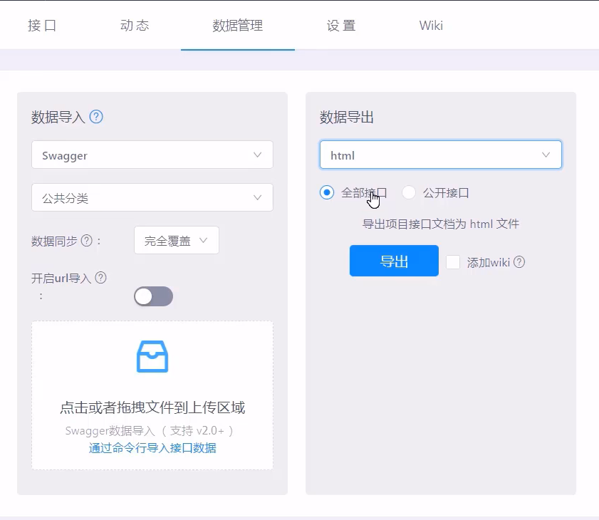

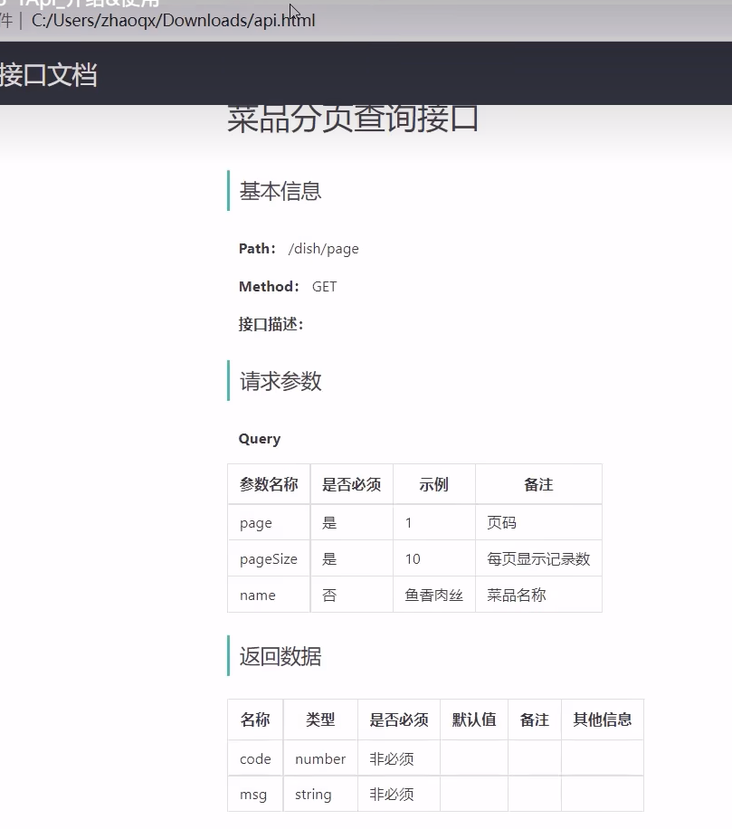


**导入接口**

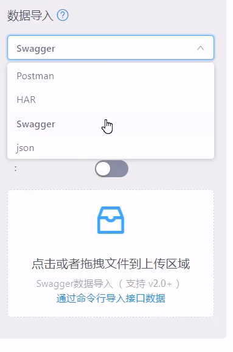


## 12.4.Swagger

**介绍**

**用来生成接口文档。**

使用Swagger你只需要按照它的规范去定义接口及接口相关的信息，再通过Swagger衍生出来的一系列项目和工具，就可以做到**生成各种格式的接口文档，以及在线接口调试页面**等等。

knife4j是为Java MVC框架集成Swagger生成Api文档的增强解决方案。

```XML
<dependency>
    <groupld>com.github.xiaoymin</ groupld>
    <artifactld>knife4j-spring-boot-starter</ artifactld>
    <version>3.0.2</version>
</dependency>
```


**使用方式**

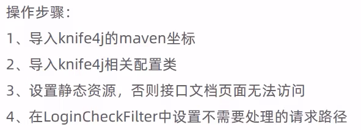


导入knife4j的maven坐标

```XML
<dependency>
    <groupld>com.github.xiaoymin</ groupld>
    <artifactld>knife4j-spring-boot-starter</ artifactld>
    <version>3.0.2</version>
</dependency>
```


导入knife4j相关配置类-WebMvcConfig

```java
package com.jq.config;

import com.github.xiaoymin.knife4j.spring.annotations.EnableKnife4j;
import com.jq.commom.JacksonObjectMapper;
import lombok.extern.slf4j.Slf4j;
import org.springframework.context.annotation.Bean;
import org.springframework.context.annotation.Configuration;
import org.springframework.http.converter.HttpMessageConverter;
import org.springframework.http.converter.cbor.MappingJackson2CborHttpMessageConverter;
import org.springframework.http.converter.json.MappingJackson2HttpMessageConverter;
import org.springframework.web.servlet.config.annotation.ResourceHandlerRegistry;
import org.springframework.web.servlet.config.annotation.WebMvcConfigurationSupport;
import springfox.documentation.builders.ApiInfoBuilder;
import springfox.documentation.builders.PathSelectors;
import springfox.documentation.builders.RequestHandlerSelectors;
import springfox.documentation.service.ApiInfo;
import springfox.documentation.spi.DocumentationType;
import springfox.documentation.spring.web.plugins.Docket;
import springfox.documentation.swagger2.annotations.EnableSwagger2;

import java.util.List;

/
  配置类，映射静态资源
 /
@Slf4j
@Configuration
@EnableSwagger2
@EnableKnife4j
public class WebMvcConfig extends WebMvcConfigurationSupport {
    /
      设置静态资源映射
      @param registry
     /
    @Override
    protected void addResourceHandlers(ResourceHandlerRegistry registry) {
        log.info("开始进行静态资源映射...");
        registry.addResourceHandler("doc.html").addResourceLocations("classpath:/META-INF/resources/");
        registry.addResourceHandler("/webjars/").addResourceLocations("classpath:/META-INF/resources/webjars/");
        registry.addResourceHandler("/backend/").addResourceLocations("classpath:/backend/");
        registry.addResourceHandler("/front/").addResourceLocations("classpath:/front/");
    }

    /
      扩展 Spring Mvc 的消息转换器
      @param converters
     /
    @Override
    protected void extendMessageConverters(List<HttpMessageConverter<?>> converters) {
        log.info("扩展消息转换器...");
        //创建消息转换器对象
        MappingJackson2HttpMessageConverter messageConverter = new MappingJackson2HttpMessageConverter();
        //设置对象转换器，底层使用Jackson将Java对象转换为JSON
        messageConverter.setObjectMapper(new JacksonObjectMapper());
        //将上面的消息转换器对象追加到spring MVC框架的转换器集合中
        converters.add(0,messageConverter);
    }
    @Bean
    public Docket createRestApi() {
        // 文档类型
        return new Docket(DocumentationType.SWAGGER_2)
                .apiInfo(apiInfo())
                .select()
                .apis(RequestHandlerSelectors.basePackage("com.jq.controller"))
                .paths(PathSelectors.any())
                .build();
    }

    private ApiInfo apiInfo() {
        return new ApiInfoBuilder()
                .title("瑞吉外卖")
                .version("1.0")
                .description("瑞吉外卖接口文档")
                .build();
    }
}
```


设置静态资源，否则接口文档页面无法访问-WebMvcConfig

```java
 /*
      设置静态资源映射
      @param registry
     */
    @Override
    protected void addResourceHandlers(ResourceHandlerRegistry registry) {
        log.info("开始进行静态资源映射...");
        registry.addResourceHandler("doc.html").addResourceLocations("classpath:/META-INF/resources/");
        registry.addResourceHandler("/webjars/").addResourceLocations("classpath:/META-INF/resources/webjars/");
        registry.addResourceHandler("/backend/").addResourceLocations("classpath:/backend/");
        registry.addResourceHandler("/front/").addResourceLocations("classpath:/front/");
    }
```


在LoginCheckFilter中设置不需要处理的请求路径

```java
package com.jq.filter;

import com.alibaba.fastjson.JSON;
import com.jq.commom.BaseContext;
import com.jq.commom.R;
import lombok.extern.slf4j.Slf4j;
import org.springframework.util.AntPathMatcher;

import javax.servlet.;
import javax.servlet.annotation.WebFilter;
import javax.servlet.http.HttpServlet;
import javax.servlet.http.HttpServletRequest;
import javax.servlet.http.HttpServletResponse;
import java.io.IOException;

/**
  自定义过滤器
  检查用户是否已经完成登录
 /
@WebFilter(filterName = "loginCheckFilter",urlPatterns = "/")
@Slf4j
public class LoginCheckFilter implements Filter {
    //路径匹配器，支持通配符
    public static final AntPathMatcher PATH_MATCHER=new AntPathMatcher();
    @Override
    public void doFilter(ServletRequest servletRequest, ServletResponse servletResponse, FilterChain filterChain) throws IOException, ServletException {

        HttpServletRequest request=(HttpServletRequest) servletRequest;
        HttpServletResponse response=(HttpServletResponse) servletResponse;
        /**
          1、获取本次请求的URI
          2、判断本次请求是否需要处理
          3、如果不需要处理，则直接放行
          4、判断登录状态，如果已登录，则直接放行
          5、如果未登录则返回未登录结果
         /
        //1、获取本次请求的URI
        String requestURI =request.getRequestURI();// /backend/index.html
        log.info("拦截到请求：{}",requestURI);
        //定义不需要处理的请求路径
        String []urls=new String[]{
                "/employee/login",
                "/employee/logout",
                "/backend/",
                "/front/",
                "/common/",
                "/user/sendMsg",
                "/user/login",
                "/doc.html",
                "/webjars/",
                "/swagger-resources",
                "/v2/api-docs"
        };

        //2、判断本次请求是否需要处理
        boolean check = check(urls, requestURI);
        //3、如果不需要处理，则直接放行
        if (check){
            log.info("本次请求{}不需要处理",requestURI);
            filterChain.doFilter(request,response);
            return;
        }
        //4-1、后台管理系统：判断登录状态，如果已登录，则直接放行
        if(request.getSession().getAttribute("employee")!=null){
            log.info("用户已登录，用户id为:{}",request.getSession().getAttribute("employee"));

            //获取用户id
            Long empId=(Long) request.getSession().getAttribute("employee");
            //调用BaseContext来设置当前用户登录的id
            BaseContext.setCurrentId(empId);

            filterChain.doFilter(request,response);
            return;
        }
        //4-2、前端移动端用户系统：判断登录状态，如果已登录，则直接放行
        if(request.getSession().getAttribute("user")!=null){
            log.info("用户已登录，用户id为:{}",request.getSession().getAttribute("user"));

            //获取用户id
            Long userId=(Long) request.getSession().getAttribute("user");
            //调用BaseContext来设置当前用户登录的id
            BaseContext.setCurrentId(userId);

            filterChain.doFilter(request,response);
            return;
        }
        log.info("用户未登录");
        //5、如果未登录则返回未登录结果,通过输出流的方式向客户端页面响应数据
        response.getWriter().write(JSON.toJSONString(R.error("NOTLOGIN")));

        return;


    }

    /**
      路径匹配，检查本次请求是否需要放行
      @param urls
      @param requestURI
      @return
     /
    public boolean check(String [] urls,String requestURI){
        for (String url : urls) {
            boolean match = PATH_MATCHER.match(url, requestURI);
            if (match){
                return true;
            }
        }
        return false;
    }
}
```


**常用注解**


加入注解后的swagger文档

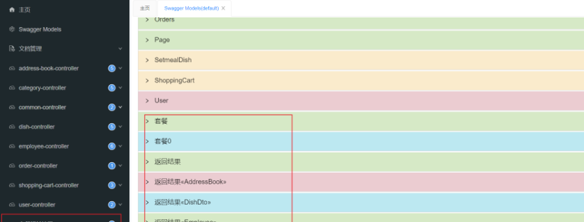


## 12.5.项目部署

### 12.5.1部署架构

这里最少需要三台服务器，一台Nginx前端，一台Tomcat后端，一台Redis。 

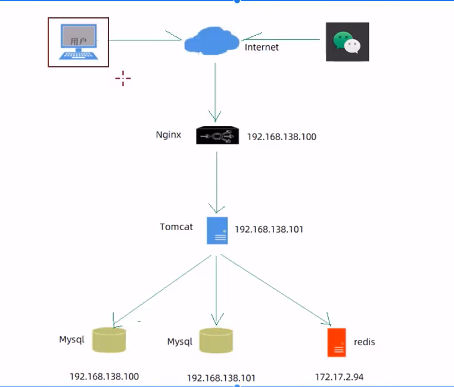


### 12.5.2部署环境

服务器:

**服务器A**- 192.168.138.100 [192.168.112.100（Linux）自己虚拟机端口]

- Nginx:部署前端项目、配置反向代理
- Mysql:主从复制结构中的主库

**服务器B**-192.168.138.101 [127.0.0.1（Windows） 自己ipv4地址]

- jdk:运行Java项目
- git:版本控制工具
- maven:项目构建工具
- jar: Spring Boot项目打成jar包基于内置Tomcat运行
- Mysql:主从复制结构中的从库

**服务器**C-172.17.2.94 [（Linux）]

- Redis:缓存中间件

> 中间件是介于应用系统和[系统软件](https://baike.baidu.com/item/系统软件/215962?fromModule=lemma_inlink)之间的一类软件，它使用系统软件所提供的基础服务（功能），衔接网络上应用系统的各个部分或不同的应用，能够达到资源共享、功能共享的目的。 

### 12.5.3部署前端项目

**第一步:在服务器A中安装Nginx,将dist目录上传到Nginx的html目录下，dist目录是前端打包后的目录**


进入nginx目录下的html目录

```
cd /usr/local/nginx/html/
```


上传dist目录

**修改Nginx配置文件nginx.conf**

**记得关闭防火墙**，要不然外部浏览器访问不到

```bash
#反向代理配置
location ^~ /api/ { 
    rewrite ^/api/(.*)$ /$1 break;  //url重写
    proxy_pass http://192.168.138.101:8080;
    }
```


自己的配置文件如下

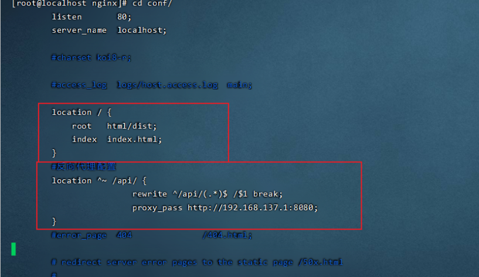

 


- 访问的 192.168.112.100
- 反向代理的结果 ：192.168.112.100/api/employee/login
- 反向代理URL重写 ：/api/employee/login —》/employee/login
- 后端正常访问是 192.168.137.1:8080/employee/login

### 12.5.4部署后端项目

12.5.4.1第一步:在服务器B中安装jdk、git、 maven、MySQL,使用git clone命令将git远程仓库的代码克隆下来

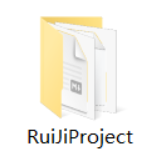


**运行 springboot项目**

- Windows ，直接运行 springboot项目即可

- Linux环境下，运行 springboot项目 第二步:将reggiesStart.sh文件.上传到服务器B，通过chmod命令设置执行权限.

  ```bash
  #!/bin/sh
  echo =================================
  echo  自动化部署脚本启动
  echo =================================
  
  echo 停止原来运行中的工程
  APP_NAME=reggie_take_out
  
  tpid=<span class="token function">ps</span> <span class="token operator">-</span>ef<span class="token punctuation">|</span>grep <span class="token variable">$APP_NAME</span><span class="token punctuation">|</span>grep <span class="token operator">-</span>v grep<span class="token punctuation">|</span>grep <span class="token operator">-</span>v <span class="token function">kill</span><span class="token punctuation">|</span>awk <span class="token string">'{print $2}'</span>
  if [ ${tpid} ]; then
      echo 'Stop Process...'
      kill -15 $tpid
  fi
  sleep 2
  tpid=<span class="token function">ps</span> <span class="token operator">-</span>ef<span class="token punctuation">|</span>grep <span class="token variable">$APP_NAME</span><span class="token punctuation">|</span>grep <span class="token operator">-</span>v grep<span class="token punctuation">|</span>grep <span class="token operator">-</span>v <span class="token function">kill</span><span class="token punctuation">|</span>awk <span class="token string">'{print $2}'</span>
  if [ ${tpid} ]; then
      echo 'Kill Process!'
      kill -9 $tpid
  else
      echo 'Stop Success!'
  fi
  
  echo 准备从Git仓库拉取最新代码
  cd /usr/local/javaapp/reggie_take_out
  
  echo 开始从Git仓库拉取最新代码
  git pull
  echo 代码拉取完成
  
  echo 开始打包
  output=mvn clean package <span class="token operator">-</span>Dmaven<span class="token punctuation">.</span>test<span class="token punctuation">.</span>skip=true
  
  cd target
  
  echo 启动项目
  nohup java -jar reggie_take_out-1.0-SNAPSHOT.jar &> reggie_take_out.log &
  echo 项目启动完成
  ```

  

  修改权限

  ```
  chmod 777 reggiesStart.sh
  ```

  

  在Linux运行springboot，修改图片的路径

- yml：

- ```
  rj:
    path: /usr/local/img/
  ```

  