>  **导航：**
>
> [【Java笔记+踩坑汇总】Java基础+JavaWeb+SSM+SpringBoot+SpringCloud+瑞吉外卖/谷粒商城/学成在线+设计模式+面试题汇总+性能调优/架构设计+源码解析](https://blog.csdn.net/qq_40991313/article/details/126646289?csdn_share_tail={"type"%3A"blog"%2C"rType"%3A"article"%2C"rId"%3A"126646289"%2C"source"%3A"qq_40991313"})
>
> **黑马旅游源码：** 
>
> https://wwmg.lanzouk.com/ikjTE135ybje


[TOC]


# 1.初识弹性搜索elasticsearch

## 1.1.了解ES

### 1.1.1.elasticsearch的作用

elasticsearch是一款非常强大的开源搜索引擎，具备非常多强大功能，可以帮助我们**从海量数据中快速找到需要的内容**

例如：

- 在GitHub搜索代码

  

- 在电商网站搜索商品

  

- 在百度搜索答案

  

- 在打车软件搜索附近的车

  

### 1.1.2.ELK弹性栈

**elasticsearch结合kibana、Logstash、Beats**，也就是elastic stack（ELK）。被广泛**应用在日志数据分析、实时监控等领域：**


而**elasticsearch是elastic stack的核心**，**负责存储、搜索、分析数据。**


### 1.1.3.elasticsearch和lucene

**elasticsearch底层是基于lucene**来实现的。

**Lucene是一个Java语言的搜索引擎类库**，是Apache公司的顶级项目，由DougCutting于1999年研发。官网地址：https://lucene.apache.org/ 。


**elasticsearch**的发展历史：

- 2004年Shay Banon基于Lucene开发了Compass
- 2010年Shay Banon 重写了Compass，取名为Elasticsearch。


### 1.1.4.搜索引擎技术排名

目前比较知名的搜索引擎技术排名：


虽然在早期，Apache Solr是最主要的搜索引擎技术，但随着发展elasticsearch已经渐渐超越了Solr，独占鳌头：


### 1.1.5.概念总结

**什么是elasticsearch？**

- 一个开源的**分布式搜索引擎**，可以用来实现搜索、日志统计、分析、系统监控等功能

**什么是elastic stack（ELK）？**

- 是**以elasticsearch为核心的技术栈**，包括beats、Logstash、kibana、elasticsearch

**什么是Lucene？**

- 是Apache的开源**搜索引擎类库**，提供了搜索引擎的核心API

## 1.2.倒排索引

倒排索引的概念是基于MySQL这样的正向索引而言的。

### 1.2.1.正向索引

**正向索引**是**根据文档里找词条的过程，遍历文档找目标词条**。 

那么什么是正向索引呢？例如给下表（tb_goods）中的id创建索引：


如果是根据id查询，那么直接走索引，查询速度非常快。

但如果是基于title做**模糊查询，只能是逐行扫描数据**，流程如下：

1）用户搜索数据，条件是title符合`"%手机%"`

2）逐行获取数据，比如id为1的数据

3）判断数据中的title是否符合用户搜索条件

4）如果符合则放入结果集，不符合则丢弃。回到步骤1

逐行扫描，也就是全表扫描，随着数据量增加，其**查询效率也会越来越低**。当数据量达到数百万时，就是一场灾难。

### 1.2.2.倒排索引

> **倒排索引流程：**
>
> 1. **分词：**将每一个文档的数据利用算法**分词**，得到一个个词条；
> 2. **映射关系表：**创建分词和文档id的映射关系表；
> 3. **词条-->id-->文档：**搜索词条时，根据映射关系表找到它对应的所有文档id，然后根据文档id正向索引查到文档。

倒排索引是**根据词条找文档的过程，从词条对应的文档id找文档**。 

倒排索引中有两个非常重要的概念：

- **文档（`Document`）：**用来搜索的数据，其中的**每一条数据就是一个文档**。例如一个网页、一个商品信息
- **词条（`Term`）：**文档**按照语义**分成的**词语**。对文档数据或用户搜索数据，利用某种算法分词，得到的具备含义的词语就是词条。例如：我是中国人，就可以分为：我、是、中国人、中国、国人这样的几个词条

**创建倒排索引**是对正向索引的一种特殊处理，**流程**如下：

- 将每一个文档的数据利用算法**分词**，得到一个个词条
- **创建表**，每行数据包括词条、词条所在文档id、位置等信息
- 因为词条唯一性，可以**给词条创建索引**，例如hash表结构索引

如图：


**倒排索引的搜索流程**如下（以搜索"华为手机"为例）：

1）用户输入条件`"华为手机"`进行搜索。

2）对用户输入内容**分词**，得到词条：`华为`、`手机`。

3）拿着词条**在倒排索引中查找**，可以得到包含词条的**文档id**：1、2、3。

4）拿着**文档id到正向索引**中查找具体文档。

如图：


虽然要先查询倒排索引，再查询倒排索引，但是无论是词条、还是文档id都建立了索引，查询速度非常快！无需全表扫描。

### 1.2.3.正向和倒排

那么为什么一个叫做正向索引，一个叫做倒排索引呢？

- **正向索引**是最传统的，根据id索引的方式。但根据词条查询时，必须先逐条获取每个文档，然后判断文档中是否包含所需要的词条，是**根据文档里找词条的过程，遍历文档找目标词条**。
- 而**倒排索引**则相反，是先找到用户要搜索的词条，根据词条得到保护词条的文档的id，然后根据id获取文档。是**根据词条找文档的过程，从词条对应的文档id找文档**。

是不是恰好反过来了？

那么两者方式的优缺点是什么呢？

**正向索引**：

- 优点： 
  - 可以给多个字段创建索引
  - 根据索引字段搜索、排序速度非常快
- 缺点： 
  - 根据非索引字段，或者索引字段中的部分词条查找时，只能全表扫描。

**倒排索引**：

- 优点： 
  - 根据词条搜索、模糊搜索时，速度非常快
- 缺点： 
  - 只能给词条创建索引，而不是字段
  - 无法根据字段做排序

## 1.3.es的概念

elasticsearch中有很多独有的概念，与mysql中略有差别，但也有相似之处。

### 1.3.1.文档和字段

**elasticsearch是面向文档（Document）存储的**，可以是数据库中的一条商品数据，一个订单信息。**文档数据会被序列化为json格式后存储在elasticsearch中**：


而Json文档中往往包含很多的**字段（Field）**，类似于数据库中的列。

**对于上面表格，每一行是一个文档，每一列是一个字段** 

### 1.3.2.索引和映射

**索引（Index）**，就是**相同类型的文档的集合，类似于mysql的表**。

例如：

- 所有用户文档，就可以组织在一起，称为用户的索引；
- 所有商品的文档，可以组织在一起，称为商品的索引；
- 所有订单的文档，可以组织在一起，称为订单的索引；


因此，我们可以把**索引当做是数据库中的表**。

数据库的表会有约束信息，用来定义表的结构、字段的名称、类型等信息。因此，索引库中就有**映射（mapping）**，是索引中文档的字段约束信息，类似表的结构约束。

### 1.3.3.mysql与elasticsearch对比

我们统一的把mysql与elasticsearch的概念做一下对比：

| **MySQL**  | **Elasticsearch** | **说明**                                                     |
| ---------- | ----------------- | ------------------------------------------------------------ |
| Table      | Index             | 索引(index)，就是文档的集合，类似数据库的表(table)           |
| Row        | Document          | 文档（Document），就是一条条的数据，类似数据库中的行（Row），文档都是JSON格式 |
| Column     | Field             | 字段（Field），就是JSON文档中的字段，类似数据库中的列（Column） |
| **Schema** | **Mapping**       | Mapping（映射）是索引中文档的**约束**，例如字段类型约束。类似数据库的表结构（Schema） |
| **SQL**    | **DSL**           | DSL是elasticsearch提供的JSON风格的请求**语句**，用来操作elasticsearch，实现CRUD |

是不是说，我们学习了elasticsearch就不再需要mysql了呢？

并不是如此，两者各自有自己的擅长支出：

- **Mysql：**擅长事务类型操作，可以确保**数据的安全和一致性**
- **Elasticsearch：**擅长**海量数据**的搜索、分析、计算

因此在企业中，往往是**两者结合使用：**

- 对安全性要求较高的写操作，使用mysql实现
- 对查询性能要求较高的搜索需求，使用elasticsearch实现
- 两者再基于某种方式，实现数据的同步，保证一致性


## 1.4.docker部署单点es

### 1.4.1.创建网络

因为我们还需要部署kibana容器，因此需要**让es和kibana容器互联**。这里先创建一个网络：

```
docker network create es-net
```


> **kibana提供一个elasticsearch的可视化界面，写DSL时候有提示。**

### 1.4.2.加载es和kibana镜像

这里我们采用elasticsearch的7.12.1版本的镜像，这个镜像体积非常大，接近1G。**不建议大家自己pull。**

```bash
#两个版本要一致
docker pull elasticsearch:7.12.1
docker pull kibana:7.12.1
```


课前资料提供了镜像的tar包：


将其上传到虚拟机中，然后运行命令加载即可：

```bash
## 导入镜像
docker load -i es.tar

docker load -i kibana.tar
```


### 1.4.3.运行容器

运行docker命令，部署**单点es：**

```bash
docker run -d \
	--name es \
    -e "ES_JAVA_OPTS=-Xms512m -Xmx512m" \
    -e "discovery.type=single-node" \
    -v es-data:/usr/share/elasticsearch/data \
    -v es-plugins:/usr/share/elasticsearch/plugins \
    --privileged \
    --network es-net \
    -p 9200:9200 \
    -p 9300:9300 \
elasticsearch:7.12.1
```


命令解释：

- `-e "cluster.name=es-docker-cluster"`：设置集群名称
- `-e "http.host=0.0.0.0"`：监听的地址，可以外网访问
- `-e "ES_JAVA_OPTS=-Xms512m -Xmx512m"`：内存大小
- `-e "discovery.type=single-node"`：非集群模式
- `-v es-data:/usr/share/elasticsearch/data`：挂载逻辑卷，绑定es的数据目录
- `-v es-logs:/usr/share/elasticsearch/logs`：挂载逻辑卷，绑定es的日志目录
- `-v es-plugins:/usr/share/elasticsearch/plugins`：挂载逻辑卷，绑定es的插件目录
- `--privileged`：授予逻辑卷访问权
- `--network es-net` ：加入一个名为es-net的网络中
- `-p 9200:9200`：端口映射配置，这里是9200是暴露的http协议端口，用于用户访问
- `-p 9300:9300`：es各个容器之间互联的端口，暂时用不到，不暴露也行，


在浏览器中输入：[http://自己ip地址:9200](http://192.168.150.101:9200) 即可看到elasticsearch的响应结果：

> 打不开的话，可能原因：
>
> - 防火墙、端口占用问题
> - 容器在启动中的状态
> - ip地址没改成自己linux的

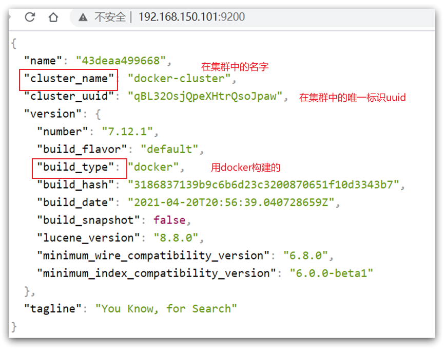


## 1.5.部署kibana

kibana可以给我们**提供一个elasticsearch的可视化界面**，便于我们学习。

### 1.5.1.部署

运行docker命令，部署kibana

```bash
docker run -d \
--name kibana \
-e ELASTICSEARCH_HOSTS=http://es:9200 \
--network=es-net \
-p 5601:5601  \
kibana:7.12.1
```


- `--network es-net` ：加入一个名为es-net的网络中，与elasticsearch在同一个网络中
- `-e ELASTICSEARCH_HOSTS=http://es:9200"`：设置elasticsearch的地址，因为kibana已经与elasticsearch在一个网络，因此可以用容器名直接访问elasticsearch
- `-p 5601:5601`：端口映射配置

**kibana启动一般比较慢，需要多等待一会**，可以通过命令：

```
docker logs -f kibana
```


查看运行日志，当查看到下面的日志，说明成功：


此时，在浏览器输入地址访问：[http://自己linux的ip地址:5601](http://192.168.150.101:5601)，即可看到结果

### 1.5.2.kibana的DevTools

kibana中提供了一个DevTools界面：


这个界面中可以编写DSL来操作elasticsearch。并且对DSL语句有自动补全功能。

### 1.5.3.设置开机启动es和kibana

```bash
# 设置开机启动elasticsearch
docker update elasticsearch --restart=always
# es可以被远程任何机器访问
echo "http.host: 0.0.0.0" >/mydata/elasticsearch/config/elasticsearch.yml

# 递归更改权限，777权限所有用户组都可以访问
chmod -R 777 /mydata/elasticsearch/

# 设置开机启动kibana
docker update kibana  --restart=always
```


## 1.6.安装IK分词器

### 1.6.0.默认分词器对中文不友好 

> 使用ik分词器的原因是，默认的分词器对中文不友好：
>
> 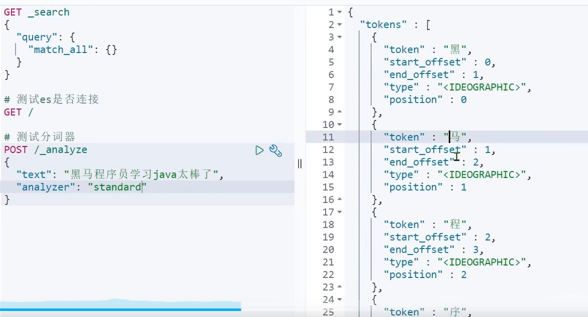

### 1.6.1.在线安装ik插件（较慢）

```bash
## 进入容器内部
docker exec -it elasticsearch /bin/bash

## 在线下载并安装
./bin/elasticsearch-plugin  install https://github.com/medcl/elasticsearch-analysis-ik/releases/download/v7.12.1/elasticsearch-analysis-ik-7.12.1.zip

#退出
exit
#重启容器
docker restart elasticsearch
```


### 1.6.2.离线安装ik插件（推荐）

**1）查看数据卷目录**


安装插件需要知道elasticsearch的plugins目录位置，而我们用了数据卷挂载，因此需要查看elasticsearch的数据卷目录，通过下面命令查看:

```bash
docker volume inspect es-plugins
```


显示结果：

```bash
[
    {
        "CreatedAt": "2022-05-06T10:06:34+08:00",
        "Driver": "local",
        "Labels": null,
        "Mountpoint": "/var/lib/docker/volumes/es-plugins/_data",
        "Name": "es-plugins",
        "Options": null,
        "Scope": "local"
    }
]
```


说明plugins目录被挂载到了：`/var/lib/docker/volumes/es-plugins/_data`这个目录中。


**2）解压缩分词器安装包**

下面我们需要把课前资料中的ik分词器解压缩，重命名为ik


**3）上传到es容器的插件数据卷中**

也就是`/var/lib/docker/volumes/es-plugins/_data`：


**4）重启容器**

```bash
## 4、重启容器，重启完耐心等一会，启动很慢
docker restart es
```


```bash
## 查看es日志
docker logs -f es
```


> 重启完耐心等一会，启动很慢 

**5）测试：**

**IK分词器包含两种模式：**

- **`ik_smart`：最少切分。例如你好世界**
- **`ik_max_word`：最细切分**


**演示最细切分：** 

```java
GET /_analyze
{
  "analyzer": "ik_max_word",
  "text": "今天天气好"
}
```


结果：

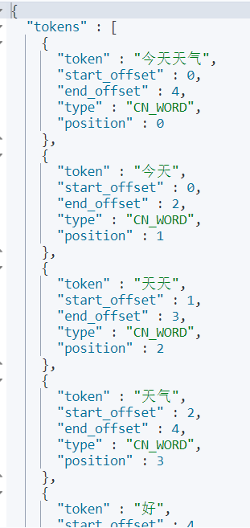


### 1.6.3 扩展词词典

随着互联网的发展，“造词运动”也越发的频繁。出现了很多新的词语，在原有的词汇列表中并不存在。比如：“奥力给”，“传智播客” 等。

所以我们的词汇也需要不断的更新，IK分词器提供了扩展词汇的功能。

1）打开IK分词器config目录：


2）在IKAnalyzer.cfg.xml配置文件内容添加：

```XML
<?xml version="1.0" encoding="UTF-8"?>
<!DOCTYPE properties SYSTEM "http://java.sun.com/dtd/properties.dtd">
<properties>
        <comment>IK Analyzer 扩展配置</comment>
        <!--用户可以在这里配置自己的扩展字典 *** 添加扩展词典-->
        <entry key="ext_dict">ext.dic</entry>
</properties>
```


3）新建一个 ext.dic，可以参考config目录下复制一个配置文件进行修改

```
传智播客
奥力给
```


4）重启elasticsearch

```bash
docker restart es

## 查看 日志
docker logs -f elasticsearch
```


日志中已经成功加载ext.dic配置文件

5）测试效果：

```bash
GET /_analyze
{
  "analyzer": "ik_max_word",
  "text": "传智播客Java就业超过90%,奥力给！"
}
```


> 注意当前文件的编码必须是 **UTF-8 格式**，**严禁使用Windows记事本编辑**

### 1.6.4 停用词词典

在互联网项目中，在网络间传输的速度很快，所以很多语言是不允许在网络上传递的，如：关于宗教、政治等敏感词语，那么我们在搜索时也应该忽略当前词汇。

IK分词器也提供了强大的停用词功能，让我们在索引时就直接忽略当前的停用词汇表中的内容。

1）IKAnalyzer.cfg.xml配置文件内容添加：

```XML
<?xml version="1.0" encoding="UTF-8"?>
<!DOCTYPE properties SYSTEM "http://java.sun.com/dtd/properties.dtd">
<properties>
        <comment>IK Analyzer 扩展配置</comment>
        <!--用户可以在这里配置自己的扩展字典-->
        <entry key="ext_dict">ext.dic</entry>
         <!--用户可以在这里配置自己的扩展停止词字典  *** 添加停用词词典-->
        <entry key="ext_stopwords">stopword.dic</entry>
</properties>
```


3）在 stopword.dic 添加停用词

```
只因你太美
```


4）重启elasticsearch

```bash
## 重启服务
docker restart elasticsearch
docker restart kibana

## 查看 日志
docker logs -f elasticsearch
```


日志中已经成功加载stopword.dic配置文件

5）测试效果：

```bash
GET /_analyze
{
  "analyzer": "ik_max_word",
  "text": "只因你太美都点赞,奥力给！"
}
```


> 注意当前文件的编码必须是 UTF-8 格式，严禁使用Windows记事本编辑


## 1.7.部署es集群

部署es集群可以直接使用docker-compose来完成，不过要求你的Linux虚拟机至少有**4G**的内存空间


首先编写一个docker-compose文件，内容如下：

```bash
version: '2.2'
services:
  es01:
    image: docker.elastic.co/elasticsearch/elasticsearch:7.12.1
    container_name: es01
    environment:
      - node.name=es01
      - cluster.name=es-docker-cluster
      - discovery.seed_hosts=es02,es03
      - cluster.initial_master_nodes=es01,es02,es03
      - bootstrap.memory_lock=true
      - "ES_JAVA_OPTS=-Xms512m -Xmx512m"
    ulimits:
      memlock:
        soft: -1
        hard: -1
    volumes:
      - data01:/usr/share/elasticsearch/data
    ports:
      - 9200:9200
    networks:
      - elastic
  es02:
    image: docker.elastic.co/elasticsearch/elasticsearch:7.12.1
    container_name: es02
    environment:
      - node.name=es02
      - cluster.name=es-docker-cluster
      - discovery.seed_hosts=es01,es03
      - cluster.initial_master_nodes=es01,es02,es03
      - bootstrap.memory_lock=true
      - "ES_JAVA_OPTS=-Xms512m -Xmx512m"
    ulimits:
      memlock:
        soft: -1
        hard: -1
    volumes:
      - data02:/usr/share/elasticsearch/data
    networks:
      - elastic
  es03:
    image: docker.elastic.co/elasticsearch/elasticsearch:7.12.1
    container_name: es03
    environment:
      - node.name=es03
      - cluster.name=es-docker-cluster
      - discovery.seed_hosts=es01,es02
      - cluster.initial_master_nodes=es01,es02,es03
      - bootstrap.memory_lock=true
      - "ES_JAVA_OPTS=-Xms512m -Xmx512m"
    ulimits:
      memlock:
        soft: -1
        hard: -1
    volumes:
      - data03:/usr/share/elasticsearch/data
    networks:
      - elastic

volumes:
  data01:
    driver: local
  data02:
    driver: local
  data03:
    driver: local

networks:
  elastic:
    driver: bridge
```


Run `docker-compose` to bring up the cluster:

```
docker-compose up
```


## 1.8.分词器总结

分词器的作用是什么？

- 创建倒排索引时对文档分词
- 用户搜索时，对输入的内容分词

IK分词器有几种模式？

- ik_smart：智能切分，粗粒度
- ik_max_word：最细切分，细粒度

IK分词器如何拓展词条？如何停用词条？

- 利用config目录的IkAnalyzer.cfg.xml文件添加拓展词典和停用词典
- 在词典中添加拓展词条或者停用词条

# 2.索引库操作

索引库就类似数据库表，mapping映射就类似表的结构。

我们要向es中存储数据，必须先创建“库”和“表”。

## 2.0."_cat"集群命令

```bash
GET /_cat/nodes	
#查看所有节点。集群中会用到

GET /_cat/health
#查看es健康状况

GET /_cat/master
#查看主节点

GET /_cat/indices
#查看所有索引 ，等价于mysql数据库的show databases;
```


**查看所有节点**

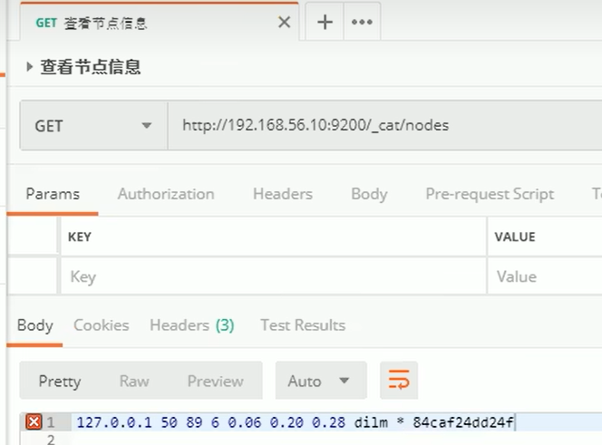

**查看es健康信息** 

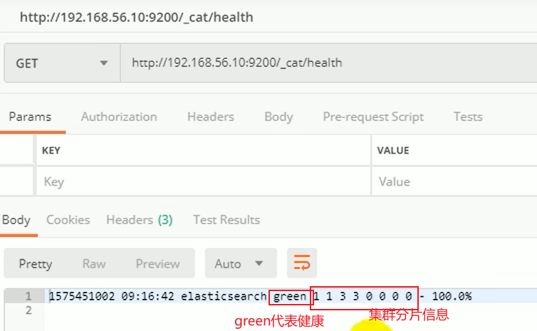

**查看主节点：**

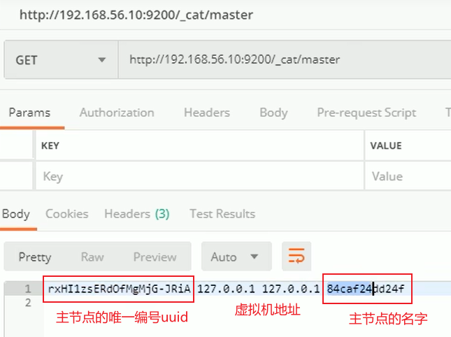

**查看所有索引：**

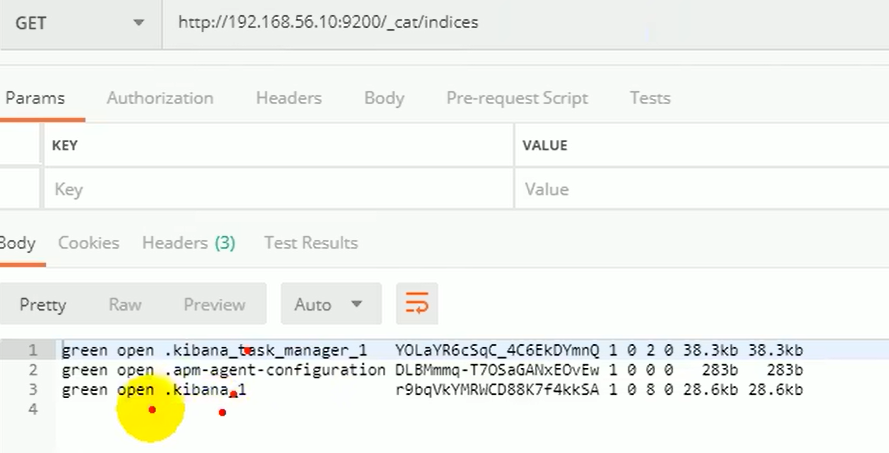


## 2.1.“mappings”里的各映射属性

### 2.1.1.概述

> ```bash
> #也可以用postman发put请求ip:9200/索引库名，带json数据实现
> PUT /索引库名称
> {
>   "mappings": {
>     "properties": {
>       "字段名":{
>         "type": "text",
>         "analyzer": "ik_smart"
>       },
>       "字段名2":{
>         "type": "keyword",
>         "index": "false"
>       },
>       "字段名3":{
>         "properties": {
>           "子字段": {
>             "type": "keyword"
>           }
>         }
>       }
>       #, ...略
>     }
>   }
> }
> ```
>
> 

mapping是对索引库中**文档的约束**，常见的mapping属性包括：

- type：

  字段数据类型，常见的简单类型有： 	

  - **字符串：**text（可分词的文本）、keyword（不可分词的精确值，例如：品牌、国家、ip地址）
  - **数值：**long、integer、short、byte、double、float、
  - **布尔：**boolean
  - **日期：**date
  - **对象：**object
  - **es的数组类型：**es数组类型不用特别定义，支持每个字段有多个值，效果就相当于数组。例如索引库里"score":{"tupe":"integer"}，文档可以"score":[1,2,3,4,5] 

- **index：**是否创建索引，默认为true

- **analyzer：**使用哪种分词器，**注意只有text类型可以设置分词器**，其他类型设置分词器会报错mapper_parsing_exception

- **properties：**该字段的子字段。


例如下面的json文档：

```bash
{
    "age": 21,
    "weight": 52.1,
    "isMarried": false,
    "info": "黑马程序员Java讲师",
    "email": "zy@itcast.cn",
    "score": [99.1, 99.5, 98.9],
    "name": {
        "firstName": "云",
        "lastName": "赵"
    }
}
```


**对应的每个字段映射（mapping）：**

- age：类型为 integer；参与搜索，因此需要index为true；无需分词器
- weight：类型为float；参与搜索，因此需要index为true；无需分词器
- isMarried：类型为boolean；参与搜索，因此需要index为true；无需分词器
- info：类型为字符串，需要分词，因此是text；参与搜索，因此需要index为true；分词器可以用ik_smart
- email：类型为字符串，但是不需要分词，因此是keyword；不参与搜索，因此需要index为false；无需分词器
- score：虽然是数组，但是我们只看元素的类型，类型为float；参与搜索，因此需要index为true；无需分词器
- name：类型为object，需要定义多个子属性 
  - name.firstName；类型为字符串，但是不需要分词，因此是keyword；参与搜索，因此需要index为true；无需分词器
  - name.lastName；类型为字符串，但是不需要分词，因此是keyword；参与搜索，因此需要index为true；无需分词器

### 2.1.2.nested类型解决数组的扁平化处理

**es数组的扁平化处理：es存储对象数组时，它会将数组扁平化，也就是说将对象数组的每个属性抽取出来，作为一个数组。因此会出现查询紊乱的问题。**

**示例：**下面user字段是对象数组类型，因为数组扁平化处理，下面结果跟期望查询结果不符：


**解决办法：使用nested子类类型：**

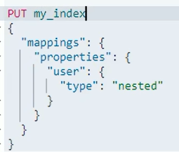


## 2.2.索引库的CRUD

这里我们统一使用Kibana编写DSL的方式来演示。

### 2.2.1.增删改查简洁版


- **创建索引库：**PUT /索引库名
- **查询索引库：**GET /索引库名
- **删除索引库：**DELETE /索引库名
- **修改，添加字段：**PUT /索引库名/_mapping


**增：**

```bash
#也可以用postman发put请求ip:9200/索引库名，带json数据实现
PUT /索引库名称
{
  "mappings": {
    "properties": {
      "字段名":{
        "type": "text",
        "analyzer": "ik_smart"
      },
      "字段名2":{
        "type": "keyword",
        "index": "false"
      }
      #, ...略
    }
  }
}
```


**删：**

```bash
DELETE /索引库名
```


**改：修改只能追加新字段，不能修改原索引**

```bash
PUT /索引库名/_mapping
{
  "properties": {
    "新字段名":{
      "type": "integer"
    }
  }
}
```


**查：**

```bash
GET /索引库名
```


### 2.2.1.创建索引库和映射，PUT

基本语法：

- **请求方式：PUT**
- 请求路径：/索引库名，可以自定义
- 请求参数：mapping映射

**格式：**

```bash
#也可以用postman发put请求ip:9200/索引库名，带json数据实现
PUT /索引库名称
{
  "mappings": {
    "properties": {
      "字段名":{
        "type": "text",
        "analyzer": "ik_smart"
      },
      "字段名2":{
        "type": "keyword",
        "index": "false"
      },
      "字段名3":{
        "properties": {
          "子字段": {
            "type": "keyword"
          }
        }
      }
      #, ...略
    }
  }
}
```


> mapping是对索引库中**文档的约束**，常见的mapping属性包括：
>
> - type：
>
>   字段数据类型，常见的简单类型有： 	
>
>   - **字符串：**text（可分词的文本）、keyword（不可分词的精确值，例如：品牌、国家、ip地址）
>   - **数值：**long、integer、short、byte、double、float、
>   - **布尔：**boolean
>   - **日期：**date
>   - **对象：**object
>   - **数组：**es数组类型不用特别定义，支持每个字段有多个值，效果就相当于数组。例如"score":[1,2,3,4,5]
>
> - **index：**是否创建索引，默认为true
>
> - **analyzer：**使用哪种分词器，**注意只有text类型可以设置分词器**，其他类型设置分词器会报错mapper_parsing_exception
>
> - **properties：**该字段的子字段。
>
> - doc_values：是否可以被聚合，默认为true。 
>
>   - **桶（Bucket）聚合：**用来对文档做分组
>   - **度量（Metric）聚合**：用以计算一些值，比如：最大值、最小值、平均值等
>   - **管道（pipeline）聚合：**其它聚合的结果为基础做聚合
>   - **aggs代表聚合**，与query同级，**此时query的作用是****限定聚合的的文档范围**
>   - [elasticsearch基础3——聚合、补全、集群_vincewm的博客-CSDN博客](https://blog.csdn.net/qq_40991313/article/details/126861326?spm=1001.2014.3001.5501)

示例：

```bash
PUT /test 
{
  "mappings": {
    "properties": {
      "name":{
        "type": "text",
        "analyzer": "ik_max_word"
        "copy_to": "all"            #把name分词后的分词拷贝到all里
      },
      "name2":{
        "type": "text",
        "copy_to": "all"
      },
      "all":{
        "type": "text",
        "analyzer": "ik_max_word"
      }
    }
  }
}
```


> **注意：copy_to是只把name,name1分词后的分词拷贝到all里**，查询文档时只需查询"all"就可以查到所有name和name2的各自分词器分词后内容。
>
> 例如：
>
> ```bash
> POST /test/_doc/1
> {
>   "name":"今天天气好",
>   "name2":"风雪夜归人"
> }
> 
> 这个查询查不到内容，因为name2是默认分词器
> GET /test/_search
> {
>   "query": {
>     "match": {
>       "all":"风雪"
>     }
>   }
> }
> 这个查询能查到内容，因为name是ik分词器
> GET /test/_search
> {
>   "query": {
>     "match": {
>       "all":"天气"
>     }
>   }
> }
> ```
>
> 


> 如果报错mapper_parsing_exception是因为integer类型不能用分词器：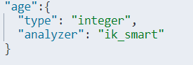
>
> 
>
> 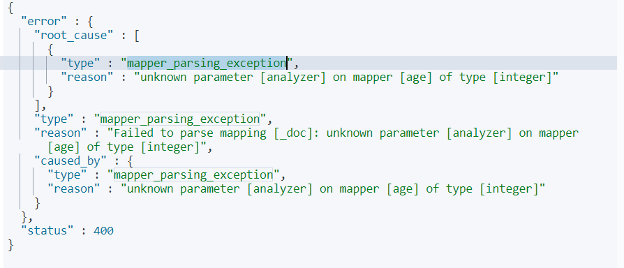

### 2.2.2.查询索引库

**基本语法**：

- **请求方式：GET**
- 请求路径：/索引库名
- 请求参数：无

**格式**：

```
GET /索引库名
```


**示例**：


### 2.2.3.修改索引库，PUT

倒排索引结构虽然不复杂，但是一旦数据结构改变（比如改变了分词器），就需要重新创建倒排索引，这简直是灾难。因此索引库**一旦创建，无法修改mapping**。

虽然无法修改mapping中已有的字段，但是却**允许添加新的字段到mapping中**，因为**不会对倒排索引产生影响。**

**语法说明**：

```bash
PUT /索引库名/_mapping
{
  "properties": {
    "新字段名":{
      "type": "integer"
    }
  }
}
```


> **注意：**
>
> - **修改只能追加新字段，不能修改原索引**
> - **注意区分修改和新增，两者都是put，但修改路径最后面有个/_mapping，json最外圈没有"mappings":{}**

**示例**：


### 2.2.4.删除索引库

**语法：**

- **请求方式：DELETE**
- 请求路径：/索引库名
- 请求参数：无

**格式：**

```
DELETE /索引库名
```


在kibana中测试：


# 3.文档操作

## 3.0.文档增删改查简洁版


- **创建文档：**POST /{索引库名}/_doc/文档id { json文档 }
- **查询文档：**GET /{索引库名}/_doc/文档id
- **删除文档：**DELETE /{索引库名}/_doc/文档id
- 修改文档：
  - 全量修改：PUT /{索引库名}/_doc/文档id { json文档 }
  - 增量修改：POST /{索引库名}/_update/文档id { “doc”: {字段}}

 增：

```bash
#也可以用postman发post请求ip:9200/索引库名/_doc/文档id，带json数据实现
POST /索引库名/_doc/文档id
{
    "字段1": "值1",
    "字段2": "值2",
    "字段3": {
        "子属性1": "值3",
        "子属性2": "值4"
    },
    # ...
}
```


查：

```bash
GET /{索引库名称}/_doc/{id}
GET /{索引库名称}/_search
```


删：

```bash
DELETE /{索引库名}/_doc/id值
```


改（全量）：


```bash
#POST也是全量修改
PUT /{索引库名}/_doc/文档id
{
    "字段1": "值1",
    "字段2": "值2",
    // ... 略
}
 
```


 改（增量）：

```bash
POST /{索引库名}/_update/文档id
{
    "doc": {
         "字段名": "新的值",
    }
}
```


## 3.1.新增文档，POST

**语法：**

```bash
#也可以用postman发post请求ip:9200/索引库名/_doc/文档id，带json数据实现
POST /索引库名/_doc/文档id
{
    "字段1": "值1",
    "字段2": "值2",
    "字段3": {
        "子属性1": "值3",
        "子属性2": "值4"
    },
    # ...
}
```


> **注意：**
>
> - **路径第二段_doc是固定值，不能省略** 
> - **回顾新增索引是PUT /索引库名**

**示例：**

```bash
POST /heima/_doc/1
{
    "info": "黑马程序员Java讲师",
    "email": "zy@itcast.cn",
    "name": {
        "firstName": "云",
        "lastName": "赵"
    }
}
```


**响应：**


## 3.2.查询文档

根据rest风格，新增是post，查询应该是get，不过查询一般都需要条件，这里我们把文档id带上。

**通过id查询文档：** 

```
GET /{索引库名称}/_doc/{id}
```


```
GET /heima/_doc/1
```


**查询所有文档：**

```java
GET /{索引库名称}/_search
```


**查看结果：**


_index：所在索引库名

_version:版本控制，每修改一次版本就会加1

_source：原始文档

## 3.3.删除文档

删除使用DELETE请求，同样，需要根据id进行删除：

**语法：**

```
DELETE /{索引库名}/_doc/id值
```


**示例：**

```bash
# 根据id删除数据
DELETE /heima/_doc/1
```


**结果：**


## 3.4.修改文档

修改有两种方式：

- 全量修改：直接覆盖原来的文档
- 增量修改：修改文档中的部分字段

### 3.4.1.全量修改（覆盖修改），POST/PUT

全量修改是覆盖原来的文档，其本质是：

- 根据指定的id删除文档
- 新增一个相同id的文档

**注意**：如果根据id删除时，id不存在，第二步的新增也会执行，也就从修改变成了新增操作了。

**语法：**

```bash
#POST也是全量修改
PUT /{索引库名}/_doc/文档id
{
    "字段1": "值1",
    "字段2": "值2",
    // ... 略
}
```


> **上面PUT改POST也是全量修改** 

**示例：**

```bash
PUT /heima/_doc/1
{
    "info": "黑马程序员高级Java讲师",
    "email": "zy@itcast.cn",
    "name": {
        "firstName": "云",
        "lastName": "赵"
    }
}
```


### 3.4.2.增量修改，PUT

增量修改是只修改指定id匹配的文档中的部分字段。

**语法：**

```bash
POST /{索引库名}/_update/文档id
{
    "doc": {
         "字段名": "新的值",
    }
}
```


> **注意增量修改是POST。**

**示例：**

```bash
POST /heima/_update/1
{
  "doc": {
    "email": "ZhaoYun@itcast.cn"
  }
}
```


# 4.RestAPI


 ES官方提供了各种不同语言的客户端，用来操作ES。**这些客户端的本质就是组装DSL语句，通过http请求发送给ES。**

官方文档地址：https://www.elastic.co/guide/en/elasticsearch/client/index.html

其中的Java Rest Client又包括两种：

Java Low Level Rest Client
 Java High Level Rest Client


 我们学习的是Java HighLevel Rest Client客户端API。

## 4.0.创建springboot项目

### 4.0.1.导入数据库数据

首先创建数据库heima：


导入表数据，数据结构如下：

```sql
CREATE TABLE `tb_hotel` (
  `id` bigint(20) NOT NULL COMMENT '酒店id',
  `name` varchar(255) NOT NULL COMMENT '酒店名称；例：7天酒店',
  `address` varchar(255) NOT NULL COMMENT '酒店地址；例：航头路',
  `price` int(10) NOT NULL COMMENT '酒店价格；例：329',
  `score` int(2) NOT NULL COMMENT '酒店评分；例：45，就是4.5分',
  `brand` varchar(32) NOT NULL COMMENT '酒店品牌；例：如家',
  `city` varchar(32) NOT NULL COMMENT '所在城市；例：上海',
  `star_name` varchar(16) DEFAULT NULL COMMENT '酒店星级，从低到高分别是：1星到5星，1钻到5钻',
  `business` varchar(255) DEFAULT NULL COMMENT '商圈；例：虹桥',
  `latitude` varchar(32) NOT NULL COMMENT '纬度；例：31.2497',
  `longitude` varchar(32) NOT NULL COMMENT '经度；例：120.3925',
  `pic` varchar(255) DEFAULT NULL COMMENT '酒店图片；例:/img/1.jpg',
  PRIMARY KEY (`id`)
) ENGINE=InnoDB DEFAULT CHARSET=utf8mb4;
```


### 4.0.2.依赖、实体类、yml

依赖：

```XML
    <dependencies>
        <dependency>
            <groupId>org.springframework.boot</groupId>
            <artifactId>spring-boot-starter-web</artifactId>
        </dependency>

        <dependency>
            <groupId>mysql</groupId>
            <artifactId>mysql-connector-java</artifactId>
            <scope>runtime</scope>
        </dependency>
        <dependency>
            <groupId>org.springframework.boot</groupId>
            <artifactId>spring-boot-starter-test</artifactId>
            <scope>test</scope>
        </dependency>
        <dependency>
            <groupId>org.projectlombok</groupId>
            <artifactId>lombok</artifactId>
        </dependency>
        <dependency>
            <groupId>com.baomidou</groupId>
            <artifactId>mybatis-plus-boot-starter</artifactId>
            <version>3.5.2</version>
        </dependency>
<!--        用于Java对象和JSON字符串互相转换，toJSONString，parseObject-->
        <dependency>
            <groupId>com.alibaba</groupId>
            <artifactId>fastjson</artifactId>
            <version>2.0.12</version>
        </dependency>
<!--        <dependency>-->
<!--            <groupId>org.apache.commons</groupId>-->
<!--            <artifactId>commons-lang3</artifactId>-->
<!--        </dependency>-->
        <dependency>
            <groupId>org.elasticsearch.client</groupId>
            <artifactId>elasticsearch-rest-high-level-client</artifactId>
        </dependency>
        <dependency>
            <groupId>com.alibaba</groupId>
            <artifactId>druid-spring-boot-starter</artifactId>
            <version>1.2.11</version>
        </dependency>
    </dependencies>
```


**实体类：**

> **需要HotelDoc的原因：**
>
> 这里需要另外创建HotelDoc，用来接收ES的查询结果。因为ES查地理位置是根据geo_point坐标类型的字段查距离的，例如 "location" : "31.292932, 121.519759"，而mysql数据库的经纬度是两个字段，所以要用Hotel处理mysql，HotelDoc处理es。

```java
@Data
@TableName("tb_hotel")
public class Hotel {
    @TableId(type = IdType.INPUT)
    private Long id;
    private String name;
    private String address;
    private Integer price;
    private Integer score;
    private String brand;
    private String city;
    private String starName;
    private String business;
    private String longitude;
    private String latitude;
    private String pic;
}
@Data
@NoArgsConstructor
public class HotelDoc {
    private Long id;
    private String name;
    private String address;
    private Integer price;
    private Integer score;
    private String brand;
    private String city;
    private String starName;
    private String business;
    private String location;
    private String pic;

    public HotelDoc(Hotel hotel) {
        this.id = hotel.getId();
        this.name = hotel.getName();
        this.address = hotel.getAddress();
        this.price = hotel.getPrice();
        this.score = hotel.getScore();
        this.brand = hotel.getBrand();
        this.city = hotel.getCity();
        this.starName = hotel.getStarName();
        this.business = hotel.getBusiness();
        this.location = hotel.getLatitude() + ", " + hotel.getLongitude();
        this.pic = hotel.getPic();
    }
}
```


mapper、service继承mybatisplus的接口。

yml：

```bash
server:
  port: 8089
spring:
  datasource:
    druid:
      driver-class-name: com.mysql.cj.jdbc.Driver
      url: jdbc:mysql://localhost:3306/heima?serverTimezone=Asia/Shanghai&useUnicode=true&characterEncoding=utf-8&zeroDateTimeBehavior=convertToNull&useSSL=false&allowPublicKeyRetrieval=true
      username: root
      password: 1234
#logging:
#  level:
#    cn.itcast: debug
#  pattern:
#    dateformat: MM-dd HH:mm:ss:SSS
mybatis-plus:
  configuration:
    map-underscore-to-camel-case: true
#  type-aliases-package: com.vince.hotel.pojo
```


### 4.0.3.mapping映射分析

创建索引库，最关键的是mapping映射，而mapping映射要考虑的信息包括：

- 字段名
- 字段数据类型
- 是否参与搜索
- 是否需要分词
- 如果分词，分词器是什么？

其中：

- 字段名、字段数据类型，可以参考数据表结构的名称和类型
- 是否参与搜索要分析业务来判断，例如图片地址，就无需参与搜索
- 是否分词呢要看内容，内容如果是一个整体就无需分词，反之则要分词
- 分词器，我们可以统一使用ik_max_word


来看下酒店数据的索引库结构:

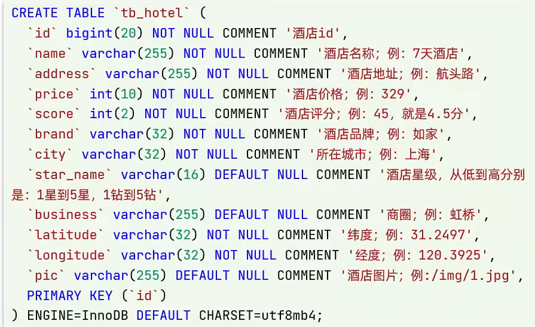


```bash
PUT /hotel
{
  "mappings": {
    "properties": {
      "id": {
        "type": "keyword"
      },
      "name":{
        "type": "text",
        "analyzer": "ik_max_word",
        "copy_to": "all"
      },
      "address":{
        "type": "keyword",
        "index": false
      },
      "price":{
        "type": "integer"
      },
      "score":{
        "type": "integer"
      },
      "brand":{
        "type": "keyword",
        "copy_to": "all"
      },
      "city":{
        "type": "keyword",
        "copy_to": "all"
      },
      "starName":{
        "type": "keyword"
      },
      "business":{
        "type": "keyword"
      },
      "location":{
        "type": "geo_point"
      },
      "pic":{
        "type": "keyword",
        "index": false
      },
      "all":{
        "type": "text",
        "analyzer": "ik_max_word"
      }
    }
  }
}
```


> **注意：es中id统一是keyword类型，不能是long类型。** 

> **特殊字段：**
>
> - location：地理坐标，里面包含精度、纬度，类型是geo_point
> - all：一个组合字段，其目的是将多字段的值 利用copy_to合并，提供给用户搜索
>
> 地理坐标说明：
>
> 
>
> copy_to说明：
>
> 

### 4.0.4.初始化RestClient

在elasticsearch提供的API中，**与elasticsearch一切交互都封装在**一个名为**RestHighLevelClient**的类中，必须**先完成这个对象的初始化，建立与elasticsearch的连接。**

分为三步：

**1）引入es的RestHighLevelClient依赖：**

```XML
<dependency>
    <groupId>org.elasticsearch.client</groupId>
    <artifactId>elasticsearch-rest-high-level-client</artifactId>
</dependency>
```


**2）**因为SpringBoot默认的ES版本是7.6.2，所以我们需要**覆盖springbooot默认的ES版本：**

```XML
<properties>
    <java.version>1.8</java.version>
    <elasticsearch.version>7.12.1</elasticsearch.version>
</properties>
```


**3）初始化RestHighLevelClient：**

初始化的代码如下：

```java
RestHighLevelClient client = new RestHighLevelClient(RestClient.builder(
        HttpHost.create("http://192.168.150.101:9200")
));
```


这里**为了单元测试方便**，我们创建一个测试类HotelIndexTest，然后将初始化的代码编写在@BeforeEach方法中：

```java
package cn.itcast.hotel;

import org.apache.http.HttpHost;
import org.elasticsearch.client.RestHighLevelClient;
import org.junit.jupiter.api.AfterEach;
import org.junit.jupiter.api.BeforeEach;
import org.junit.jupiter.api.Test;

import java.io.IOException;
@SpringBootTest
public class HotelIndexTest {
    private RestHighLevelClient client;

    @BeforeEach
    void setUp() {
        this.client = new RestHighLevelClient(RestClient.builder(
                HttpHost.create("http://192.168.150.101:9200")
        ));
    }

    @AfterEach
    void tearDown() throws IOException {
        this.client.close();
    }
}
```


> **@Before和@BeforeEach**
>
> junit4.x版本之前使用的是@Before注解
>
> junit5.x版本以后使用的是@BeforeEach注解
>
> 两个注解功能相同 表示在测试类中任何一个测试方法执行之前都先执行该注解标注的方法

## 4.1.创建索引库

### 4.1.1.代码解读

创建索引库的API如下：


代码分为三步：

- 1）创建Request对象。因为是创建索引库的操作，因此Request是CreateIndexRequest。
- 2）添加请求参数，其实就是DSL的JSON参数部分。因为json字符串很长，这里是定义了静态字符串常量MAPPING_TEMPLATE，让代码看起来更加优雅。
- 3）发送请求，client.indices()方法的返回值是IndicesClient类型，封装了所有与索引库操作有关的方法。

### 4.1.2.完整示例

在hotel-demo的cn.itcast.hotel.constants包下，创建一个类，定义mapping映射的JSON字符串常量：

```java
package cn.itcast.hotel.constants;

public class HotelConstants {
    public static final String MAPPING_TEMPLATE = "{\n" +
            "  \"mappings\": {\n" +
            "    \"properties\": {\n" +
            "      \"id\": {\n" +
            "        \"type\": \"keyword\"\n" +
            "      },\n" +
            "      \"name\":{\n" +
            "        \"type\": \"text\",\n" +
            "        \"analyzer\": \"ik_max_word\",\n" +
            "        \"copy_to\": \"all\"\n" +
            "      },\n" +
            "      \"address\":{\n" +
            "        \"type\": \"keyword\",\n" +
            "        \"index\": false\n" +
            "      },\n" +
            "      \"price\":{\n" +
            "        \"type\": \"integer\"\n" +
            "      },\n" +
            "      \"score\":{\n" +
            "        \"type\": \"integer\"\n" +
            "      },\n" +
            "      \"brand\":{\n" +
            "        \"type\": \"keyword\",\n" +
            "        \"copy_to\": \"all\"\n" +
            "      },\n" +
            "      \"city\":{\n" +
            "        \"type\": \"keyword\",\n" +
            "        \"copy_to\": \"all\"\n" +
            "      },\n" +
            "      \"starName\":{\n" +
            "        \"type\": \"keyword\"\n" +
            "      },\n" +
            "      \"business\":{\n" +
            "        \"type\": \"keyword\"\n" +
            "      },\n" +
            "      \"location\":{\n" +
            "        \"type\": \"geo_point\"\n" +
            "      },\n" +
            "      \"pic\":{\n" +
            "        \"type\": \"keyword\",\n" +
            "        \"index\": false\n" +
            "      },\n" +
            "      \"all\":{\n" +
            "        \"type\": \"text\",\n" +
            "        \"analyzer\": \"ik_max_word\"\n" +
            "      }\n" +
            "    }\n" +
            "  }\n" +
            "}";
}
```


在hotel-demo中的HotelIndexTest测试类中，编写单元测试，实现创建索引：

```java
@Test
void createHotelIndex() throws IOException {
    // 1.创建Request对象
    CreateIndexRequest request = new CreateIndexRequest("hotel");
    // 2.准备请求的参数：DSL语句
    request.source(MAPPING_TEMPLATE, XContentType.JSON);
    // 3.发送请求，如果索引库已存在会报错
    client.indices().create(request, RequestOptions.DEFAULT);
}
```


测试创建成功：

在kibana控制台查询索引库成功： 


## 4.2.删除索引库

删除索引库的DSL语句非常简单：

```
DELETE /hotel
```


与创建索引库相比：

- 请求方式从PUT变为DELTE
- 请求路径不变
- 无请求参数

所以代码的差异，注意体现在Request对象上。依然是三步走：

- 1）创建Request对象。这次是DeleteIndexRequest对象
- 2）准备参数。这里是无参
- 3）发送请求。改用delete方法

在hotel-demo中的HotelIndexTest测试类中，编写单元测试，实现删除索引：

```java
@Test
void testDeleteHotelIndex() throws IOException {
    // 1.创建Request对象
    DeleteIndexRequest request = new DeleteIndexRequest("hotel");
    // 2.发送请求
    client.indices().delete(request, RequestOptions.DEFAULT);
}
```


## 4.3.判断索引库是否存在

判断索引库是否存在，本质就是查询，对应的DSL是：

```
GET /hotel
```


因此与删除的Java代码流程是类似的。依然是三步走：

- 1）创建Request对象。这次是GetIndexRequest对象
- 2）准备参数。这里是无参
- 3）发送请求。改用exists方法

```java
@Test
void testExistsHotelIndex() throws IOException {
    // 1.创建Request对象
    GetIndexRequest request = new GetIndexRequest("hotel");
    // 2.发送请求
    boolean exists = client.indices().exists(request, RequestOptions.DEFAULT);
    // 3.输出
    System.err.println(exists ? "索引库已经存在！" : "索引库不存在！");
}
```


## 4.4.总结

JavaRestClient操作elasticsearch的流程基本类似。核心是client.indices()方法来获取索引库的操作对象。

索引库操作的基本步骤：

- 初始化RestHighLevelClient
- 创建XxxIndexRequest。XXX是Create、Get、Delete
- 准备DSL（ Create时需要，其它是无参）
- 发送请求。调用RestHighLevelClient#indices().xxx()方法，xxx是create、exists、delete

# 5.RestClient操作文档

## 5.-1.RestClient操作文档简洁版

文档操作的基本步骤：

1. **初始化RestHighLevelClient**
2. **创建XxxRequest。**XXX是Index、Get、Update、Delete、Bulk
3. **准备参数**（Index、Update、Bulk时需要）
4. **发送请求。**调用RestHighLevelClient#.xxx()方法，xxx是index、get、update、delete、bulk
5. **解析结果**（仅Get时需要response.getSourceAsString()）


## 5.0. 初始化RestHighLevelClient

为了与索引库操作分离，我们再次参加一个测试类，做两件事情：

- 初始化RestHighLevelClient
- 我们的酒店数据在数据库，需要利用IHotelService去查询，所以注入这个接口

```java
package cn.itcast.hotel;

import cn.itcast.hotel.pojo.Hotel;
import cn.itcast.hotel.service.IHotelService;
import org.junit.jupiter.api.AfterEach;
import org.junit.jupiter.api.BeforeEach;
import org.junit.jupiter.api.Test;
import org.springframework.beans.factory.annotation.Autowired;
import org.springframework.boot.test.context.SpringBootTest;

import java.io.IOException;
import java.util.List;

@SpringBootTest
public class HotelDocumentTest {
    @Autowired
    private IHotelService hotelService;

    private RestHighLevelClient client;

    @BeforeEach
    void setUp() {
        this.client = new RestHighLevelClient(RestClient.builder(
                HttpHost.create("http://192.168.150.101:9200")
        ));
    }

    @AfterEach
    void tearDown() throws IOException {
        this.client.close();
    }
}
```


## 5.1.新增文档

我们要将数据库的酒店数据查询出来，写入elasticsearch中。

### 5.1.1.索引库实体类

**hotel表和实体类位置信息都是经度和纬度，es索引的位置信息是location。**

数据库查询后的结果是一个Hotel类型的对象。结构如下：

```java
@Data
@TableName("tb_hotel")
public class Hotel {
    @TableId(type = IdType.INPUT)
    private Long id;
    private String name;
    private String address;
    private Integer price;
    private Integer score;
    private String brand;
    private String city;
    private String starName;
    private String business;
    private String longitude;
    private String latitude;
    private String pic;
}
```


与我们的索引库结构存在差异：

- longitude和latitude需要合并为location

因此，我们需要定义一个新的类型，与索引库结构吻合：

```java
package cn.itcast.hotel.pojo;

import lombok.Data;
import lombok.NoArgsConstructor;

@Data
@NoArgsConstructor
public class HotelDoc {
    private Long id;
    private String name;
    private String address;
    private Integer price;
    private Integer score;
    private String brand;
    private String city;
    private String starName;
    private String business;
    private String location;
    private String pic;

    public HotelDoc(Hotel hotel) {
        this.id = hotel.getId();
        this.name = hotel.getName();
        this.address = hotel.getAddress();
        this.price = hotel.getPrice();
        this.score = hotel.getScore();
        this.brand = hotel.getBrand();
        this.city = hotel.getCity();
        this.starName = hotel.getStarName();
        this.business = hotel.getBusiness();
        this.location = hotel.getLatitude() + ", " + hotel.getLongitude();
        this.pic = hotel.getPic();
    }
}
```


### 5.1.2.语法说明

新增文档的DSL语句如下：

```java
POST /{索引库名}/_doc/1
{
    "name": "Jack",
    "age": 21
}
```


对应的java代码如图：


可以看到与创建索引库类似，同样是三步走：

- 1）创建Request对象
- 2）准备请求参数，也就是DSL中的JSON文档
- 3）发送请求

变化的地方在于，这里直接使用client.xxx()的API，不再需要client.indices()了。

### 5.1.3.完整代码

我们导入酒店数据，基本流程一致，但是需要考虑几点变化：

- 酒店数据来自于数据库，我们需要先查询出来，得到hotel对象
- hotel对象需要转为HotelDoc对象
- HotelDoc需要序列化为json格式

因此，代码整体步骤如下：

- 1）根据id查询酒店数据Hotel
- 2）将Hotel封装为HotelDoc
- 3）将HotelDoc序列化为JSON
- 4）创建IndexRequest，指定索引库名和id
- 5）准备请求参数，也就是JSON文档
- 6）发送请求

在hotel-demo的HotelDocumentTest测试类中，编写单元测试：

```java
@Test
void testAddDocument() throws IOException {
    // 1.根据id查询酒店数据，注意long型id
    Hotel hotel = hotelService.getById(61083L);
    // 2.转换为文档类型，主要因为经纬度变location
    HotelDoc hotelDoc = new HotelDoc(hotel);
    // 3.将HotelDoc转json
    String json = JSON.toJSONString(hotelDoc);

    // 1.准备Request对象。注意是IndexRequest 不是CreateRequest
    IndexRequest request = new IndexRequest("hotel").id(hotelDoc.getId().toString());
    // 2.准备Json文档，别忘了第二个参数XContentType.JSON
    request.source(json, XContentType.JSON);
    // 3.发送请求，这里index意思就是创建倒排索引。注意是index()方法
    client.index(request, RequestOptions.DEFAULT);
}
```


## 5.2.根据id查询文档

### 5.2.1.语法说明

查询的DSL语句如下：

```
GET /hotel/_doc/{id}
```


非常简单，因此代码大概分两步：

- 准备Request对象
- 发送请求

不过查询的目的是得到结果，解析为HotelDoc，因此难点是结果的解析。完整代码如下：


可以看到，结果是一个JSON，其中文档放在一个`_source`属性中，因此解析就是拿到`_source`，反序列化为Java对象即可。

与之前类似，也是三步走：

- 1）准备Request对象。这次是查询，所以是GetRequest
- 2）发送请求，得到结果。因为是查询，这里调用client.get()方法
- 3）解析结果，就是对JSON做反序列化

### 5.2.2.完整代码

在hotel-demo的HotelDocumentTest测试类中，编写单元测试：

```java
@Test
void testGetDocumentById() throws IOException {
    // 1.准备Request
    GetRequest request = new GetRequest("hotel", "61082");
    // 2.发送请求，得到响应
    GetResponse response = client.get(request, RequestOptions.DEFAULT);
    // 3.解析响应结果。如果是getSource()方法则获得的是Map<String,Object>
    String json = response.getSourceAsString();

    HotelDoc hotelDoc = JSON.parseObject(json, HotelDoc.class);
    System.out.println(hotelDoc);
}
```


## 5.3.根据id删除文档

删除的DSL为是这样的：

```
DELETE /hotel/_doc/{id}
```


与查询相比，仅仅是请求方式从DELETE变成GET，可以想象Java代码应该依然是三步走：

- 1）准备Request对象，因为是删除，这次是DeleteRequest对象。要指定索引库名和id
- 2）准备参数，无参
- 3）发送请求。因为是删除，所以是client.delete()方法

在hotel-demo的HotelDocumentTest测试类中，编写单元测试：

```java
@Test
void testDeleteDocument() throws IOException {
    // 1.准备Request
    DeleteRequest request = new DeleteRequest("hotel", "61083");
    // 2.发送请求
    client.delete(request, RequestOptions.DEFAULT);
}
```


## 5.4.根据id修改文档

### 5.4.1.语法说明

修改我们讲过两种方式：

- 全量修改：本质是先根据id删除，再新增
- 增量修改：修改文档中的指定字段值

在RestClient的API中，全量修改与新增的API完全一致，判断依据是ID：

- 如果新增时，ID已经存在，则修改
- 如果新增时，ID不存在，则新增

这里不再赘述，我们主要关注增量修改。

代码示例如图：


与之前类似，也是三步走：

- 1）准备Request对象。这次是修改，所以是UpdateRequest
- 2）准备参数。也就是JSON文档，里面包含要修改的字段
- 3）更新文档。这里调用client.update()方法

### 5.4.2.完整代码

在hotel-demo的HotelDocumentTest测试类中，编写单元测试：

```java
@Test
void testUpdateDocument() throws IOException {
    // 1.准备Request
    UpdateRequest request = new UpdateRequest("hotel", "61083");
    // 2.准备请求参数
    request.doc(
        "price", "952",
        "starName", "四钻"
    );
    // 3.发送请求
    client.update(request, RequestOptions.DEFAULT);
}
```


## 5.5.批量将MySQL数据导入ES索引库

案例需求：利用BulkRequest批量将数据库数据导入到索引库中。

步骤如下：

- 利用mybatis-plus查询酒店数据
- 将查询到的酒店数据（Hotel）转换为文档类型数据（HotelDoc）
- 利用JavaRestClient中的BulkRequest批处理，实现批量新增文档

### 5.5.1.语法说明

批量处理BulkRequest，其本质就是将多个普通的CRUD请求组合在一起发送。

其中提供了一个add方法，用来添加其他请求：


可以看到，能添加的请求包括：

- IndexRequest，也就是新增
- UpdateRequest，也就是修改
- DeleteRequest，也就是删除

因此Bulk中添加了多个IndexRequest，就是批量新增功能了。示例：


其实还是三步走：

- 1）创建Request对象。这里是BulkRequest
- 2）准备参数。批处理的参数，就是其它Request对象，这里就是多个IndexRequest
- 3）发起请求。这里是批处理，调用的方法为client.bulk()方法

我们在导入酒店数据时，将上述代码改造成for循环处理即可。

### 5.5.2.完整代码，BulkRequest

在hotel-demo的HotelDocumentTest测试类中，编写单元测试：

```java
@Test
void testBulkRequest() throws IOException {
    // 批量查询酒店数据
    List<Hotel> hotels = hotelService.list();

    // 1.创建Request
    BulkRequest request = new BulkRequest();
    // 2.准备参数，添加多个新增的Request
    for (Hotel hotel : hotels) {
        // 2.1.转换为文档类型HotelDoc
        HotelDoc hotelDoc = new HotelDoc(hotel);
        // 2.2.创建新增文档的Request对象
        request.add(new IndexRequest("hotel")
                    .id(hotelDoc.getId().toString())
                    .source(JSON.toJSONString(hotelDoc), XContentType.JSON));
    }
    // 3.发送请求
    client.bulk(request, RequestOptions.DEFAULT);
}
```


> 也可以循环client.add()，但速度不及client.bulk().
>
> ```java
>     @Test
>     public void bulk() throws IOException {
>         List<Hotel> hotels = hotelService.list();
>         for(Hotel hotel:hotels){
>             HotelDoc hotelDoc = new HotelDoc(hotel);
>             client.index(new IndexRequest("hotel").id(hotel.getId().toString()).source(JSON.toJSONString(hotelDoc),XContentType.JSON),RequestOptions.DEFAULT);
>         }
> 
>     }
> ```
>
> 