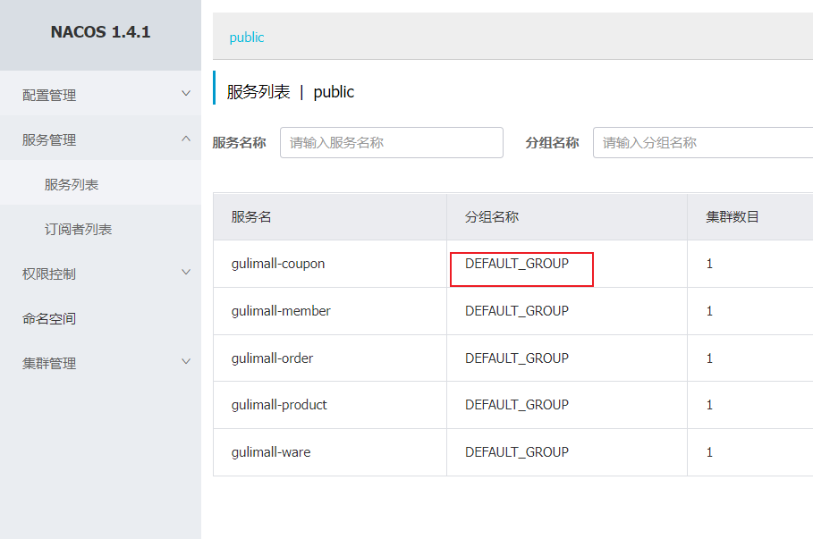
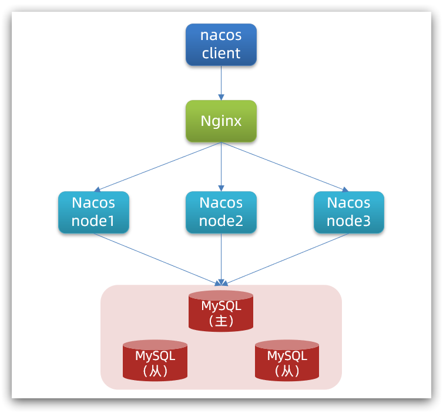
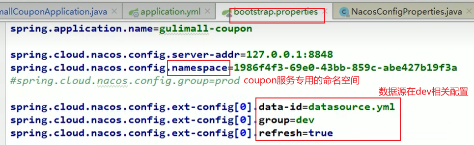
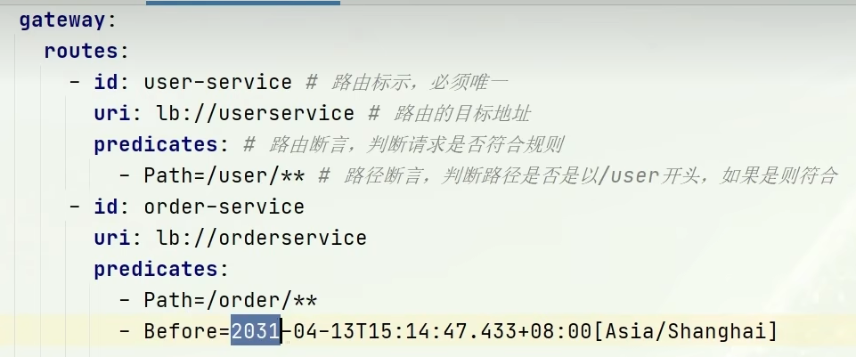
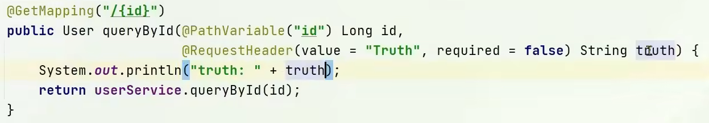

>  **导航：**
>
> [【Java笔记+踩坑汇总】Java基础+JavaWeb+SSM+SpringBoot+SpringCloud+瑞吉外卖/谷粒商城/学成在线+设计模式+面试题汇总+性能调优/架构设计+源码解析](https://blog.csdn.net/qq_40991313/article/details/126646289?csdn_share_tail={"type"%3A"blog"%2C"rType"%3A"article"%2C"rId"%3A"126646289"%2C"source"%3A"qq_40991313"})

[TOC]


# 1.Nacos配置管理

Nacos除了可以做注册中心，同样可以做配置管理来使用。

## 1.1.统一配置管理

当微服务部署的实例越来越多，达到数十、数百时，逐个修改微服务配置就会让人抓狂，而且很容易出错。我们需要一种统一配置管理方案，可以集中管理所有实例的配置。


**Nacos**一方面可以**将配置集中管理**，另一方面可以在**配置变更时**，及时**通知微服务**，实现**配置的热更新。**


### 1.1.1.在Nacos中添加配置文件

如何在nacos中管理配置呢？


然后在弹出的表单中，填写配置信息：


> 这里分组名称默认DEFAULT_GROUP，我们看服务列表也可以看到所有服务默认都在这个分组：
>
> 

> **注意：**
>
> - 项目的核心配置，需要**热更新的配置才有放到nacos管理的必要**。基本**不会变更的**一些**配置**还是**保存在微服务本地**比较好。
> - 配置写yaml，而不是yml。


### 1.1.2.从微服务拉取配置，@Value("${xxx}")

微服务要拉取nacos中管理的配置，并且与本地的application.yml配置合并，才能完成项目启动。

**问题：nacos配置要先于yml，但如果尚未读取yml，又如何得知nacos地址并获取nacos配置呢？**

**答案：**因此spring引入了一种新的配置文件：**bootstrap.yaml文件**，优先级高于application.yml，**会在application.yml之前被读取**。流程如下：

> bootstrap译为引导


**1）引入nacos-config依赖**

首先，在user-service服务中，引入nacos-config的客户端依赖：

```XML
<!--nacos配置管理依赖-->
<dependency>
    <groupId>com.alibaba.cloud</groupId>
    <artifactId>spring-cloud-starter-alibaba-nacos-config</artifactId>
</dependency>
<!--        在SpringBoot 2.4.x的版本之后，对于bootstrap.properties/bootstrap.yaml配置文件(我们合起来成为Bootstrap配置文件)的支持，需要导入如下的依赖-->
        <dependency>
            <groupId>org.springframework.cloud</groupId>
            <artifactId>spring-cloud-starter-bootstrap</artifactId>
            <version>3.1.4</version>
        </dependency>
```


**2）添加bootstrap.yaml**

然后，在user-service中添加一个bootstrap.yaml文件，需要**配置服务名、开发环境、nacos地址、后缀名**，对应nacos添加的配置文件名。内容如下：

```bash
spring:
  application:
    name: userservice # 服务名称
  profiles:
    active: dev #开发环境，这里是dev 
  cloud:
    nacos:
      server-addr: localhost:8848 # Nacos地址
      config:
        file-extension: yaml # 文件后缀名
```


这里会根据spring.cloud.nacos.server-addr获取nacos地址，再根据

`${spring.application.name}-${spring.profiles.active}.${spring.cloud.nacos.config.file-extension}`作为文件id，来读取配置。

本例中，就是去读取`userservice-dev.yaml`：


**2.5）删除application.yml中的重复配置**，包括服务名称、nacos地址、开发环境

**3）读取nacos配置，@Value**

在user-service中的UserController中添加业务逻辑，读取pattern.dateformat配置：


**完整代码：**

```java
@Slf4j
@RestController
@RequestMapping("/user")
public class UserController {

    @Autowired
    private UserService userService;

    @Value("${pattern.dateformat}")
    private String dateformat;
    
    @GetMapping("now")
    public String now(){
        return LocalDateTime.now().format(DateTimeFormatter.ofPattern(dateformat));
    }
    // ...略
}
```


在页面访问，可以看到效果：


## 1.2.配置热更新

我们最终的目的，是修改nacos中的配置后，微服务中无需重启即可让配置生效，也就是**配置热更新**。


要实现配置热更新，可以使用两种方式：

### 1.2.1.方式一（推荐），类注解@RefreshScope

在@Value注入的变量所在类上添加注解@RefreshScope：


### 1.2.2.方式二，@ConfigurationProperties，@Component

在user-service服务中，添加一个类，读取patterrn.dateformat属性：

```java
@Component
@Data
@ConfigurationProperties(prefix = "pattern")
public class PatternProperties {
    private String dateformat;
}
```


在UserController中使用这个类代替@Value：


完整代码：

```java
@Slf4j
@RestController
@RequestMapping("/user")
public class UserController {

    @Autowired
    private UserService userService;

    @Autowired
    private PatternProperties patternProperties;

    @GetMapping("now")
    public String now(){
        return LocalDateTime.now().format(DateTimeFormatter.ofPattern(patternProperties.getDateformat()));
    }

    // 略
}
```


## 1.3.配置共享

### 1.3.1.创建共享配置和读取

其实微服务启动时，会去nacos读取多个配置文件，例如：

- `[spring.application.name]-[spring.profiles.active].yaml`，例如：userservice-dev.yaml
- **`[spring.application.name].yaml`，例如：userservice.yaml**

而`[spring.application.name].yaml`不包含环境，因此可以被多个环境共享。


下面我们通过案例来测试配置共享


**1）添加一个环境共享配置**

我们在nacos中添加一个userservice.yaml文件：


**2）在user-service中读取共享配置**

在user-service服务中，修改PatternProperties类，读取新添加的属性：


在user-service服务中，修改UserController，添加一个方法：


**3）测试。运行两个UserApplication，使用不同的profile**

修改UserApplication2这个启动项，改变其profile值：


这样，**UserApplication(8081)使用的profile是dev，UserApplication2(8082)使用的profile是test**。

启动UserApplication和UserApplication2

访问**dev环境的**http://localhost:8081/user/prop，结果：**共享配置和dev环境的配置都可以读到**


访问**test环境**的http://localhost:8082/user/prop，结果：读不到dev环境配置，能读到共享配置


可以看出来，不管是dev，还是test环境，**都读取到了envSharedValue这个属性的值**。


### 1.3.2.配置共享的优先级

当nacos、服务本地同时出现相同属性时，优先级有高低之分：

**nacos的环境>nacos的共享>本地**


## 1.4.搭建Nacos集群

Nacos生产环境下一定要部署为集群状态



**搭建集群的基本步骤：**

- **搭建数据库，初始化数据库表结构**
- **下载nacos安装包**
- **配置nacos**

进入nacos的conf目录，修改配置文件cluster.conf.example，重命名为cluster.conf：

```
127.0.0.1:8845
127.0.0.1.8846
127.0.0.1.8847
```


修改application.properties文件

```
spring.datasource.platform=mysql

db.num=1

db.url.0=jdbc:mysql://127.0.0.1:3306/nacos?characterEncoding=utf8&connectTimeout=1000&socketTimeout=3000&autoReconnect=true&useUnicode=true&useSSL=false&serverTimezone=UTC
db.user.0=root
db.password.0=123
```


- **启动nacos集群**

将nacos文件夹复制三份，分别命名为：nacos1、nacos2、nacos3


然后分别修改三个文件夹中的application.properties，

nacos1:

```
server.port=8845
```


nacos2:

```
server.port=8846
```


nacos3:

```
server.port=8847
```


然后分别启动三个nacos节点：

```
startup.cmd
```


- **nginx反向代理**


修改conf/nginx.conf文件，配置如下：

```java
upstream nacos-cluster {
    server 127.0.0.1:8845;
	server 127.0.0.1:8846;
	server 127.0.0.1:8847;
}

server {
    listen       80;
    server_name  localhost;

    location /nacos {
        proxy_pass http://nacos-cluster;
    }
}
```


而后在浏览器访问：http://localhost/nacos即可。


代码中application.yml文件配置如下：

```bash
spring:
  cloud:
    nacos:
      server-addr: localhost:80 # Nacos地址
```


## 1.5.其他

### 1.5.1.命名空间


命名空间用于将开发测试生产三种**环境**、**或者**各**微服务**之间**配置隔离**。默认命名空间是public：


**不同命名空间设置不同配置：** 


**指定命名空间：** 

 

### 1.5.2.根据服务创建命名空间，各命名空间根据环境分组


### 1.5.3.按类型抽取配置，加载多配置集 


> 开发时为了方便可以将配置文件写在项目中，等发布后再抽取到nacos中。 

**将datasource相关配置抽取成一个配置**，在coupon命名空间下，分组名为dev（根据环境分组） ：


使用：



**或者bootstrap.yml** 

```bash
spring:
  application:
    name: gulimall-coupon
  cloud:
    nacos:
      config:
        server-addr: 127.0.0.1:8848
        file-extension: yaml
        namespace: xxxx
        extension-configs:
          - data-id: datasource.yml
            group: dev
            refresh: true
```


# 2.Feign远程调用

## 2.0.RestTemplate存在问题

先来看我们以前利用**RestTemplate**发起远程调用的代码：


**存在问题：**

•代码可读性差，编程体验不统一

**•参数复杂URL难以维护**


**Feign是一个声明式的http客户端**，官方地址：https://github.com/OpenFeign/feign

其作用就是帮助我们**优雅的实现http请求的发送**，解决上面提到的问题。


## 2.1.Feign替代RestTemplate

Fegin的使用步骤如下：

### 2.1.1.引入依赖

我们在**order-service**服务的pom文件中引入feign的依赖：

```XML
<dependency>
    <groupId>org.springframework.cloud</groupId>
    <artifactId>spring-cloud-starter-openfeign</artifactId>
</dependency>
```


### 2.1.2.开启feign，添加注解@EnableFeignClients

在**order-service**的启动类添加注解开启Feign的功能：

```java
@MapperScan("cn.itcast.order.mapper")
@SpringBootApplication
@EnableFeignClients
public class OrderApplication {

    public static void main(String[] args) {
        SpringApplication.run(OrderApplication.class, args);
    }
//    @Bean
//    @LoadBalanced
//    public RestTemplate restTemplate(){
//        return new RestTemplate();
//    }

}
```


### 2.1.3.编写Feign的客户端，@FeignClient

在**order-service**中新建一个接口，内容如下：

```java
package cn.itcast.order.clients;

@FeignClient("userservice")
public interface UserClient {
    @GetMapping("/user/{id}")
    User findById(@PathVariable("id") Long id);
}
```


> **声明远程调用的需要的信息**，比如：
>
> - **服务名称：userservice**
> - **请求方式：GET**
> - **请求路径：/user/{id}**
> - **请求参数：Long id**
> - **返回值类型：User**
>
>  

这样，Feign就可以帮助我们发送http请求，无需自己使用RestTemplate来发送了。


### 2.1.4.远程调用

修改order-service中的**OrderService**类中的queryOrderById方法，使用Feign客户端代替RestTemplate：


是不是看起来优雅多了。


> **总结**
>
> **使用Feign的步骤：**
>
> ① 引入依赖
>
> ② 添加@EnableFeignClients注解
>
> ③ 编写FeignClient接口
>
> ④ 使用FeignClient中定义的方法代替RestTemplate


## 2.2.自定义配置

Feign可以支持很多的自定义配置，如下表所示：

| 类型                   | 作用             | 说明                                                   |
| ---------------------- | ---------------- | ------------------------------------------------------ |
| **feign.Logger.Level** | 修改日志级别     | 包含四种不同的级别：NONE、BASIC、HEADERS、FULL         |
| feign.codec.Decoder    | 响应结果的解析器 | http远程调用的结果做解析，例如解析json字符串为java对象 |
| feign.codec.Encoder    | 请求参数编码     | 将请求参数编码，便于通过http请求发送                   |
| feign. Contract        | 支持的注解格式   | 默认是SpringMVC的注解                                  |
| feign. Retryer         | 失败重试机制     | 请求失败的重试机制，默认是没有，不过会使用Ribbon的重试 |

一般情况下，**默认值就能满足我们使用，一般只需要配置日志级别为basic。**如果要自定义时，只需要创建自定义的@Bean覆盖默认Bean即可。


下面以日志为例来演示如何自定义配置。

### 2.2.1.配置文件方式自定义配置

基于配置文件修改feign的日志级别可以针对单个服务：

```bash
feign:  
  client:
    config: 
      userservice: # 针对某个微服务的配置
        loggerLevel: FULL #  日志级别 
```


也可以针对所有服务：

```bash
feign:  
  client:
    config: 
      default: # 这里用default就是全局配置，如果是写服务名称，则是针对某个微服务的配置
        loggerLevel: FULL #  日志级别 
```


> 日志的级别分为四种：
>
> - **NONE（默认）：**不记录任何日志信息，这是**默认值**。
> - **BASIC：**仅记录请求的方法，URL以及响应状态码和执行时间
> - **HEADERS：**在BASIC的基础上，额外记录了请求和响应的头信息
> - **FULL：**记录所有请求和响应的明细，包括头信息、请求体、元数据。


### 2.2.2.Java代码方式自定义配置

也可以基于Java代码来修改日志级别，先声明一个类，然后声明一个Logger.Level的对象：

```java
public class DefaultFeignConfiguration  {
    @Bean
    public Logger.Level feignLogLevel(){
        return Logger.Level.BASIC; // 日志级别为BASIC
    }
}
```


如果要**全局生效**，将其放到启动类的@EnableFeignClients这个注解中：

```java
@EnableFeignClients(defaultConfiguration = DefaultFeignConfiguration .class) 
```


如果是**局部生效**，则把它放到对应的@FeignClient这个注解中：

```java
@FeignClient(value = "userservice", configuration = DefaultFeignConfiguration .class) 
```


## 2.3.Feign性能优化，HttpClient

Feign底层发起http请求，依赖于其它的框架。

> **Feign底层客户端实现包括：**
>
> **•URLConnection（默认，不推荐）：默认实现，不支持连接池，三次握手伤害性能**
>
> **•Apache HttpClient ：支持连接池**
>
> **•OKHttp：支持连接池**


因此提高Feign的性能主要手段就是使用**连接池**代替默认的URLConnection。


这里我们用Apache的HttpClient来演示。

**1）引入依赖**

在order-service的pom文件中引入Apache的HttpClient依赖：

```XML
<!--httpClient的依赖 -->
<dependency>
    <groupId>io.github.openfeign</groupId>
    <artifactId>feign-httpclient</artifactId>
</dependency>
```


**2）配置连接池**

在order-service的application.yml中添加配置：

```bash
feign:
  client:
    config:
      default: # default全局的配置
        loggerLevel: BASIC # 日志级别，BASIC就是基本的请求和响应信息
  httpclient:
    enabled: true # 开启feign对HttpClient的支持
    max-connections: 200 # 最大的连接数
    max-connections-per-route: 50 # 每个路径的最大连接数
```


> 实际应用中，需要不断调试测出最合适的连接数。

接下来，在FeignClientFactoryBean中的loadBalance方法中打断点：


Debug方式启动order-service服务，可以看到这里的client，底层就是Apache HttpClient：


> **总结，Feign的优化：**
>
> - **1.日志级别尽量用basic**
> - **2.使用HttpClient或OKHttp**代替URLConnection
>
> ① 引入feign-httpClient依赖
>
> ② 配置文件开启httpClient功能，设置连接池参数


## 2.4.最佳实践

所谓最近实践，就是使用过程中总结的经验，最好的一种使用方式。

> 观察可以发现，**Feign的客户端与服务提供者的controller代码非常相似**：
>
> feign客户端：
>
> 
>
> 
>
> UserController：
>
> 
>
> 
>
> 
>
> 有没有一种办法**简化这种重复的代码编**写呢？


### 2.4.1.继承方式（高耦合不推荐）

一样的代码可以通过**继承来共享：**

1）定义一个API接口，利用定义方法，并基于SpringMVC注解做声明。

2）Feign客户端和Controller都集成改接口


**优点：**

- 简单
- 实现了代码共享

**缺点：**

- 服务提供方、服务消费方**紧耦合**
- 参数列表中的注解映射并不会继承，因此Controller中必须再次声明方法、参数列表、注解


### 2.4.2.抽取方式（推荐）

**将Feign的Client抽取为独立模块**，并且**把接口有关的POJO**、**默认的Feign配置**都**放到这个模块**中，提供给所有消费者使用。

**例如**，将order-service模块的UserClient、User实体类、Feign的默认配置都**抽取到一个feign-api包中**，所有微服务引用该依赖包，即可直接使用。


**抽取方式代码实现，包扫描问题**

**1）抽取**

首先创建一个module，命名为feign-api：


项目结构：cn.itcast.feign


在feign-api中然后**引入feign的starter依赖**

```XML
<dependency>
    <groupId>org.springframework.cloud</groupId>
    <artifactId>spring-cloud-starter-openfeign</artifactId>
</dependency>
```


然后，order-service中编写的**UserClient、User、yml的DefaultFeignConfiguration**都复制到feign-api项目中


**2）在order-service中使用feign-api**

首先，**删除order-service中的UserClient、User、DefaultFeignConfiguration等类或接口**。


在order-service的pom文件中中**引入feign-api的依赖：**

```XML
<dependency>
    <groupId>cn.itcast.demo</groupId>
    <artifactId>feign-api</artifactId>
    <version>1.0</version>
</dependency>
```


修改order-service中的所有与上述三个组件有关的导包部分，改成导入feign-api中的包


**3）bean扫描问题导致测试报错**

重启后，发现服务报错了：


这是**因为UserClient现在在cn.itcast.feign.clients包下**，

而order-service的**@EnableFeignClients注解是在cn.itcast.order包下**，**不在同一个包，无法扫描到UserClient。**


**4）解决扫描包问题**

**方式一：扫描整个包**

**指定Feign应该扫描的包：**

```java
@EnableFeignClients(basePackages = "cn.itcast.feign.clients")
```


**方式二（推荐）：扫描指定clients**

**指定需要加载的Client接口：**

```java
@EnableFeignClients(clients = {UserClient.class})
```


# 3.Gateway服务网关

Spring Cloud Gateway 是 Spring Cloud 的一个全新项目，该项目是基于 Spring 5.0，Spring Boot 2.0 和 Project Reactor 等响应式编程和事件流技术开发的网关，它**旨在为微服务架构提供一种简单有效的统一的 API 路由管理方式。**


## 3.1.网关概述

Gateway网关是我们**服务的守门神**，**所有微服务的统一入口**。

> gateway译为网关，门口，通道 

网关的**核心功能特性**：

- **请求路由**
- **权限控制**
- **限流**

架构图：


**权限控制**：网关作为微服务入口，需要校验用户是是否有请求资格，如果没有则进行拦截。

**路由和负载均衡**：一切请求都必须先经过gateway，但网关不处理业务，而是根据某种规则，把请求转发到某个微服务，这个过程叫做路由。当然路由的目标服务有多个时，还需要做负载均衡。

**限流**：当请求流量过高时，在网关中按照下流的微服务能够接受的速度来放行请求，避免服务压力过大。


在**SpringCloud中网关的实现包括两种：**

- **zuul（阻塞式编程）**
- **gateway（推荐，响应式编程）**

Zuul是基于Servlet的实现，属于阻塞式编程。而SpringCloudGateway则是基于Spring5中提供的WebFlux，属于响应式编程的实现，具备更好的性能。


> **扩展：阻塞式编程和响应式编程**
>
> 阻塞式编程和响应式编程是两种不同的编程范式，它们在处理异步操作时有着不同的理念和实现方式。
>
> **阻塞式编程：**
>
> 1. **同步阻塞模型：** 在阻塞式编程中，程序执行会被阻塞（暂停）直到某个操作完成。这意味着当一个线程执行一个可能耗时的操作时，整个程序会被阻塞，直到该操作完成。
> 2. **等待模型：** 阻塞式编程通常采用等待模型，即程序等待外部资源（例如文件、网络请求、数据库查询等）返回结果。在等待期间，线程处于阻塞状态，不能执行其他任务。
>
> **响应式编程：**
>
> 1. **异步非阻塞模型：** 响应式编程采用异步非阻塞的模型。异步意味着操作不会阻塞程序的执行，而是在**后台执行**。非阻塞意味着在等待结果的同时，程序可以继续执行其他任务。
> 2. **事件驱动：** 响应式编程通常是事件驱动的。程序通过订阅事件或观察者模式来响应数据变化或操作完成的通知，而不是通过主动轮询或等待。
>
> **多线程和异步的区别**
>
> - 多线程涉及在一个进程中创建多个线程，而异步编程涉及以非阻塞方式执行任务。因此，异步可以是单线程异步（例如洗盘子，虽然我同时只能洗一个盘子，但我一个个洗完后把所有废水统一倒掉，因此在单个任务中完成了多个子任务，时间得到了优化。），也可以是多线程异步。
> - 多线程需要显式地管理线程同步和通信，而异步编程可以使用回调或承诺(callbacks/promises)等编程结构来处理异步操作。）
>
> **对比：**
>
> - 并发性：
>   - 阻塞式编程通常需要使用多线程来处理并发，而响应式编程通过异步处理来支持高并发。
> - 资源利用率：
>   - 阻塞式编程可能会导致线程资源浪费，因为每个线程在等待时都不能执行其他任务。响应式编程通过异步非阻塞模型更有效地利用系统资源。
> - 复杂性：
>   - 阻塞式编程可能导致代码复杂性增加，因为需要处理线程同步和阻塞的问题。响应式编程通常可以更简洁地处理异步操作。
> - 适用场景：
>   - 阻塞式编程适用于简单的同步操作，而响应式编程更适用于处理大量异步事件，例如网络请求、实时数据流等。

## 3.2.gateway快速入门

> **网关的基本路由功能，基本步骤如下：**
>
> 1. 创建SpringBoot工程gateway，引入网关依赖
> 2. 编写启动类
> 3. 编写基础配置和路由规则
> 4. 启动网关服务进行测试


### 3.2.1.创建gateway服务，引入依赖

创建服务：


**引入依赖：**

```XML
<!--网关-->
<dependency>
    <groupId>org.springframework.cloud</groupId>
    <artifactId>spring-cloud-starter-gateway</artifactId>
</dependency>
<!--nacos服务发现依赖-->
<dependency>
    <groupId>com.alibaba.cloud</groupId>
    <artifactId>spring-cloud-starter-alibaba-nacos-discovery</artifactId>
</dependency>
```


> 父工程管理依赖<dependencyManagement>有：
>
> ```XML
> <dependency>
>     <groupId>com.alibaba.cloud</groupId>
>     <artifactId>spring-cloud-alibaba-dependencies</artifactId>
>     <version>2.2.6.RELEASE</version>
>     <type>pom</type>
>     <scope>import</scope>
> </dependency>
> ```
>
> 
>
> 所以子模块getway引入spring-cloud-starter-alibaba-nacos-discovery不需要指定版本

### 3.2.2.编写启动类

cn.itcast.gateway包下 

```java
@SpringBootApplication
public class GatewayApplication {

	public static void main(String[] args) {
		SpringApplication.run(GatewayApplication.class, args);
	}
}
```


### 3.2.3.编写基础配置和路由规则

创建application.yml文件，内容如下：

```bash
server:
  port: 10010 # 网关端口
spring:
  application:
    name: gateway # 服务名称
  cloud:
    #网关需要被nacos注册中心管理
    nacos:
      server-addr: localhost:8848 # nacos地址
    gateway:
      routes: # 网关路由配置
        #第一组网关路由配置，针对于服务user-service
        - id: userservice # 路由id，自定义，只要唯一即可
          uri: lb://userservice # 路由的目标地址。lb就是负载均衡，后面跟服务名称。
          predicates: # 路由断言。也就是判断请求是否符合路由规则的条件。predicates译为谓语、断言
            - Path=/user/** # 路径断言。这个是按照路径匹配，只要以/user/开头就符合要求
#之后访问http://localhost:10010/user/1就路由（转发）到lb://userservice/1，注册拉取并负载均衡后为http://localhost:8081
        #第二组网关路由配置，针对于服务order-service
        - id: order-service
          uri: lb://order-service
          predicates:
            - Path=/order/**
```


我们将符合`Path` 规则的一切请求，都代理到 `uri`参数指定的地址。

本例中，我们将 `/user/**`开头的请求，代理到`lb://userservice`，lb是负载均衡，根据服务名拉取服务列表，实现负载均衡。


### 3.2.4.重启测试

启动gateway和userservice，访问http://localhost:10010/user/1时，符合`/user/**`规则，请求转发到uri：http://userservice/user/1，得到了结果：


### 5）网关路由的流程图

整个访问的流程如下：


> **总结：**
>
> **网关搭建步骤：**
>
> 1. 创建项目，引入nacos服务发现和gateway依赖
> 2. 配置application.yml，包括服务基本信息、nacos地址、路由
>
> **路由配置包括：**
>
> 1. 路由id：路由的唯一标示
> 2. 路由目标（uri）：路由的目标地址，http代表固定地址，lb代表根据服务名负载均衡
> 3. 路由断言（predicates）：判断路由的规则，
> 4. 路由过滤器（filters）：对请求或响应做处理


接下来，就重点来学习路由断言和路由过滤器的详细知识


## 3.3.断言工厂


> **我们只需要掌握Path这种路由工程就可以了。**
>
> predicates译为断言、谓语。
>
> **断言**是程序中的一阶逻辑，目的为了表示与验证软件开发者预期的结果——当程序执行到断言的位置时，对应的断言应该为真。若断言不为真时，程序会中止执行，并给出错误信息。
>
> **路由断言。**也就是判断请求是否符合路由规则的条件。

**断言工厂Predicate Factory的作用：**

**读取并处理yml配置的断言规则**，**将断言规则解析为路由判断的条件**

例如Path=/user/**是按照路径匹配，这个规则是由

`org.springframework.cloud.gateway.handler.predicate.**PathRoutePredicateFactory**`类来

处理的，像这样的断言工厂在SpringCloudGateway还有十几个:

**断言工厂包括：** 

| **名称**   | **说明**                       | **示例**                                                     |
| ---------- | ------------------------------ | ------------------------------------------------------------ |
| After      | 是某个时间点后的请求           | - After=2037-01-20T17:42:47.789-07:00[America/Denver]        |
| Before     | 是某个时间点之前的请求         | - Before=2031-04-13T15:14:47.433+08:00[Asia/Shanghai]        |
| Between    | 是某两个时间点之前的请求       | - Between=2037-01-20T17:42:47.789-07:00[America/Denver], 2037-01-21T17:42:47.789-07:00[America/Denver] |
| Cookie     | 请求必须包含某些cookie         | - Cookie=chocolate, ch.p                                     |
| Header     | 请求必须包含某些header         | - Header=X-Request-Id, \d+                                   |
| Host       | 请求必须是访问某个host（域名） | - Host=**.somehost.org,**.anotherhost.org                    |
| Method     | 请求方式必须是指定方式         | - Method=GET,POST                                            |
| **Path**   | **请求路径**必须符合指定规则   | **- Path=**/red/{segment},/blue/**                           |
| Query      | 请求参数必须包含指定参数       | - Query=name, Jack或者- Query=name                           |
| RemoteAddr | 请求者的ip必须是指定范围       | - RemoteAddr=192.168.1.1/24                                  |
| Weight     | 权重处理                       |                                                              |

示例：




> **我们只需要掌握Path这种路由工程就可以了。**


## 3.4.网关过滤器工厂

**网关过滤器GatewayFilter**是网关中提供的一种过滤器，**可以对进入网关的请求和微服务返回的响应做处理：**


### 3.4.1.路由过滤器的种类

Spring提供了31种不同的路由过滤器工厂。例如：

| **名称**             | **说明**                     |
| -------------------- | ---------------------------- |
| AddRequestHeader     | 给当前请求添加一个请求头     |
| RemoveRequestHeader  | 移除请求中的一个请求头       |
| AddResponseHeader    | 给响应结果中添加一个响应头   |
| RemoveResponseHeader | 从响应结果中移除有一个响应头 |
| RequestRateLimiter   | 限制请求的流量               |


### 3.4.2.请求头过滤器，AddRequestHeader

下面我们以AddRequestHeader 为例来讲解。

> **需求**：给所有进入userservice的请求添加一个请求头：Truth=itcast is freaking awesome!

**添加请求头过滤器（局部）：**

只需要修改gateway服务的application.yml文件，**给user-service添加路由过滤**即可：

```bash
spring:
  cloud:
    gateway:
      routes:
      - id: user-service 
        uri: lb://userservice 
        predicates: 
        - Path=/user/** 
        filters: # 过滤器
        - AddRequestHeader=Truth, Itcast is freaking awesome! # 添加请求头
```


当前过滤器写在userservice路由下，因此仅仅对访问userservice的请求有效。

参数注解**@RequestHeader**能**获取请求头内容**： 




### 3.4.3.默认过滤器，default-filters

如果要对所有的路由都生效，则可以将过滤器工厂写到default下。格式如下：

```bash
spring:
  cloud:
    gateway:
      routes:
      - id: user-service 
        uri: lb://userservice 
        predicates: 
        - Path=/user/**
      default-filters: # 默认过滤项
      - AddRequestHeader=Truth, Itcast is freaking awesome! 
```


### 3.4.4.总结

**过滤器的作用是什么？**

- ① **对路由的请求或响应做加工处理**，比如添加请求头
- ② 配置在路由下的过滤器只对当前路由的请求生效

**defaultFilters的作用是什么？**

- ① 对所有路由都生效的过滤器


## 3.5.全局过滤器，GlobalFilter

上一节学习的过滤器，网关提供了31种，但每一种过滤器的作用都是固定的。如果我们希望**拦截请求，做自己的业务逻辑**则没办法实现。

### 3.5.1.全局过滤器作用

全局过滤器的作用也是**处理一切进入网关的请求和响应**，**与GatewayFilter的作用一样**。

**区别在于GatewayFilter通过配置定义，处理逻辑是固定的；而GlobalFilter的逻辑需要自己写代码实现。**

定义方式是**实现GlobalFilter接口**。

```java
public interface GlobalFilter {
    /**
     *  处理当前请求，有必要的话通过{@link GatewayFilterChain}将请求交给下一个过滤器处理
     *
     * @param exchange 请求上下文，里面可以获取Request、Response等信息
     * @param chain 用来把请求委托给下一个过滤器 
     * @return {@code Mono<Void>} 返回标示当前过滤器业务结束
     */
    Mono<Void> filter(ServerWebExchange exchange, GatewayFilterChain chain);
}
```


**在filter中编写自定义逻辑，可以实现下列功能：**

- **登录状态判断**
- **权限校验**
- **请求限流等**


### 3.5.2.自定义全局过滤器，过滤未登录

> **需求：**定义全局过滤器，拦截请求，判断请求的参数是否满足下面条件：
>
> - **参数中是否有授权authorization**，
> - authorization参数**值是否为admin**
>
> 如果同时满足则放行，否则拦截
>
> 实际开发中一般是从session或缓存等方式中获取登录信息，这里仅做学习全局过滤器。


**实现：**

在gateway中定义一个过滤器：

```java
package cn.itcast.gateway.filters;
//注解@Order设置过滤优先级，越小优先级越高。也可以实现Ordered接口的getOrder()方法
@Order(-1)
@Component
public class AuthorizeFilter implements GlobalFilter {
    @Override
    public Mono<Void> filter(ServerWebExchange exchange, GatewayFilterChain chain) {
        // 1.获取请求参数。 MultiValueMap的add方法是一个key对应多个值，set方法是一个key对应一个值
        MultiValueMap<String, String> params = exchange.getRequest().getQueryParams();
        // 2.获取authorization参数
        String auth = params.getFirst("authorization");
        // 3.校验
        if ("admin".equals(auth)) {
            // 放行
            return chain.filter(exchange);
        }
        // 4.拦截
        // 4.1.禁止访问，设置状态码，401未登录unauthorized，
        //exchange.getResponse().setRawStatusCode(401);
        exchange.getResponse().setStatusCode(HttpStatus.UNAUTHORIZED);
        // 4.2.结束处理
        return exchange.getResponse().setComplete();
    }
}
```


> **回顾过滤器Filter：**
>
> ```java
> @WebFilter(filterName = "loginCheckFilter",urlPatterns = "/*")
> @Slf4j
> public class LoginCheckFilter implements Filter {
>     public static final AntPathMatcher PATH_MATCHER = new AntPathMatcher();
>     @Override
>     public void doFilter(ServletRequest servletRequest, ServletResponse servletResponse, FilterChain filterChain) throws IOException, ServletException {
>         HttpServletRequest request = (HttpServletRequest) servletRequest;
>         HttpServletResponse response = (HttpServletResponse) servletResponse;
>         String[] notFilter = new String[]{
>                 "/employee/login",
>                 "/employee/logout",
>                 "/backend/**",
>                 "/front/**",
>                 "/common/**",
>                 "/user/sendMsg",
>                 "/user/login"
>         };
>         String nowUri = request.getRequestURI();
> //        放行不需要拦截的uri
>         for(String url:notFilter){
>             if(PATH_MATCHER.match(url, nowUri)){
>                 filterChain.doFilter(request,response);
>                 return;
>             }
>         }
> //        session里有employee则已登录，放行。针对于后端
>         if(request.getSession().getAttribute("employee")!=null){
>             BaseContext.setThreadId((Long) request.getSession().getAttribute("employee"));
>             filterChain.doFilter(request,response);
> 
>             return;
>         }
>         //session里有user则已登录，放行。针对于前端
>         if(request.getSession().getAttribute("user")!=null){
>             BaseContext.setThreadId((Long) request.getSession().getAttribute("user"));
>             filterChain.doFilter(request,response);
>             return;
>         }
> //        未登录返回错误信息，前端设置跳转
>         response.getWriter().write(JSON.toJSONString(R.error("NOTLOGIN")));
>     }
> }
> ```
>
> 


### 3.5.3.过滤器执行顺序

请求进入网关会碰到三类过滤器：**当前路由的过滤器、DefaultFilter、GlobalFilter**

请求路由后，会将当前路由过滤器和DefaultFilter、GlobalFilter，合并到一个过滤器链（集合）中，排序后依次执行每个过滤器：


**排序的规则**是什么呢？

- 每一个过滤器都必须指定一个int类型的order值，**order值越小，优先级越高，执行顺序越靠前**。**order值一样时，defaultFilter > 路由过滤器 > GlobalFilte**r。
- **GlobalFilter**通过实现Ordered接口，或者添加**@Order**注解来指定order值，由我们自己指定
- **路由过滤器和defaultFilter**的order由Spring指定，默认是**按照声明顺序从1递增**。
- 当过滤器的**order值一样时**，会按照 **defaultFilter > 路由过滤器 > GlobalFilte**r的顺序执行。


详细内容，可以查看源码：

`org.springframework.cloud.gateway.route.RouteDefinitionRouteLocator#getFilters()`方法是先加载defaultFilters，然后再加载某个route的filters，然后合并。


`org.springframework.cloud.gateway.handler.FilteringWebHandler#handle()`方法会加载全局过滤器，与前面的过滤器合并后根据order排序，组织过滤器链


## 3.6.跨域问题


### 3.6.1.什么是跨域问题

**跨域：**域名不一致就是跨域，主要包括：

- **域名不同**： [www.taobao.com](http://www.taobao.com) 和 [www.taobao.org](http://www.taobao.org) 和 [www.jd.com](http://www.jd.com) 和 miaosha.jd.com
- 域名相同，**端口不同**：localhost:8080和localhost8081

**跨域问题：浏览器禁止请求的发起者与服务端发生跨域ajax请求，请求被浏览器拦截的问题**


**解决方案：CORS**，[跨域资源共享 CORS 详解 - 阮一峰的网络日志](https://www.ruanyifeng.com/blog/2016/04/cors.html)

CORS，全称Cross-Origin Resource Sharing，即**跨域资源共享** ，是一种**允许当前域（domain）的资源（比如html/js/web service）被其他域（domain）的脚本请求访问的机**制，通常由于同域安全策略（the same-origin security policy）浏览器会禁止这种跨域请求。

### 3.6.2.模拟跨域问题

页面文件：

```html
<!DOCTYPE html>
<html lang="en">
<head>
    <meta charset="UTF-8">
    <meta name="viewport" content="width=device-width, initial-scale=1.0">
    <meta http-equiv="X-UA-Compatible" content="ie=edge">
    <title>Document</title>
</head>
<body>
<pre>
spring:
  cloud:
    gateway:
      globalcors: # 全局的跨域处理
        add-to-simple-url-handler-mapping: true # 解决options请求被拦截问题
        corsConfigurations:
          '[/**]':
            allowedOrigins: # 允许哪些网站的跨域请求
              - "http://localhost:8090"
              - "http://www.leyou.com"
            allowedMethods: # 允许的跨域ajax的请求方式
              - "GET"
              - "POST"
              - "DELETE"
              - "PUT"
              - "OPTIONS"
            allowedHeaders: "*" # 允许在请求中携带的头信息
            allowCredentials: true # 是否允许携带cookie
            maxAge: 360000 # 这次跨域检测的有效期
</pre>
</body>
<script src="https://unpkg.com/axios/dist/axios.min.js"></script>
<script>
  axios.get("http://localhost:10010/user/1?authorization=admin")
  .then(resp => console.log(resp.data))
  .catch(err => console.log(err))
</script>
</html>
```


放入gateway的tomcat或者nginx这样的web服务器中，启动并访问。

可以在浏览器控制台看到下面的错误：


从localhost:8090访问localhost:10010，端口不同，显然是跨域的请求。


### 3.6.3.解决跨域问题，CORS

在gateway服务的application.yml文件中，添加下面的配置：

```bash
spring:
  cloud:
    gateway:
      # 。。。
      globalcors: # 全局的跨域处理
        add-to-simple-url-handler-mapping: true # 解决options请求被拦截问题
        corsConfigurations:
          '[/**]':
            allowedOrigins: # 允许哪些网站的跨域请求 
              - "http://localhost:8090"
            allowedMethods: # 允许的跨域ajax的请求方式
              - "GET"
              - "POST"
              - "DELETE"
              - "PUT"
              - "OPTIONS"
            allowedHeaders: "*" # 允许在请求中携带的头信息
            allowCredentials: true # 是否允许携带cookie
            maxAge: 360000 # 这次跨域检测的有效期
```

