>  **导航：**
>
> [【Java笔记+踩坑汇总】Java基础+JavaWeb+SSM+SpringBoot+SpringCloud+瑞吉外卖/谷粒商城/学成在线+设计模式+面试题汇总+性能调优/架构设计+源码解析](https://blog.csdn.net/qq_40991313/article/details/126646289?csdn_share_tail={"type"%3A"blog"%2C"rType"%3A"article"%2C"rId"%3A"126646289"%2C"source"%3A"qq_40991313"})

[TOC]


# 1.初识MQ

## 1.1.同步和异步通讯

微服务间通讯有同步和异步两种方式：

同步通讯：就像打电话，需要实时响应。

异步通讯：就像发邮件，不需要马上回复。


两种方式各有优劣，打电话可以立即得到响应，但是你却不能跟多个人同时通话。发送邮件可以同时与多个人收发邮件，但是往往响应会有延迟。

### 1.1.1.同步通讯

我们之前学习的Feign调用就属于同步方式，虽然调用可以实时得到结果，但存在下面的问题：


总结：

**同步调用的优点：**

- **时效性较强**，可以立即得到结果

**同步调用的问题：**

- **耦合度高**
- 性能和吞吐能力下降
- 有额外的**资源消耗**
- 有**级联失败**问题

### 1.1.2.异步通讯

异步调用则可以避免上述问题：

我们以购买商品为例，用户支付后需要调用订单服务完成订单状态修改，调用物流服务，从仓库分配响应的库存并准备发货。

在事件模式中，支付服务是**事件发布者（publisher）**，在支付完成后只需要发布一个支付成功的**事件（event）**，事件中带上订单id。

订单服务和物流服务是**事件订阅者（Consumer）**，订阅支付成功的事件，监听到事件后完成自己业务即可。

为了**解除事件发布者与订阅者之间的耦合**，两者并不是直接通信，而是有一个**中间人（Broker译为中间人）**。**发布者发布事件到Broker，不关心谁来订阅事件。订阅者从Broker订阅事件，不关心谁发来的消息。**


**Broker 是一个像数据总线一样的东西，所有的服务要接收数据和发送数据都发到这个总线上，这个总线就像协议一样，让服务间的通讯变得标准和可控。**

**好处：**

- **吞吐量提升：**无需等待订阅者处理完成，响应更快速
- **故障隔离：**服务没有直接调用，**不存在级联失败**问题
- 调用间**没有阻塞**，不会造成无效的资源占用
- **耦合度极低**，每个服务都可以灵活插拔，可替换
- **流量削峰：**不管发布事件的流量波动多大，都由Broker接收，订阅者可以按照自己的速度去处理事件。**将高并发降为低并发**

> *吞吐量*是指对网络、设备、端口、虚电路或其他设施，单位时间内成功地传送数据的数量（以比特、字节、分组等测量）。

**缺点：**

- 架构复杂了，业务没有明显的流程线，不好管理
- 需要**依赖于Broker**的可靠、安全、性能

好在现在开源软件或云平台上 Broker 的软件是非常成熟的，比较常见的一种就是我们今天要学习的MQ技术。

## 1.2.为什么要用消息中间件？

**消息中间件作用：异步化提升性能、降低耦合度、流量削峰。**

### **1.2.1.异步化提升性能**

先来说说异步化提升性能，上边我们介绍中间件的时候已经解释了引入中间件后，是如何实现异步化的，但没有解释具体性能是怎么提升的，我们来看一下下边的图。

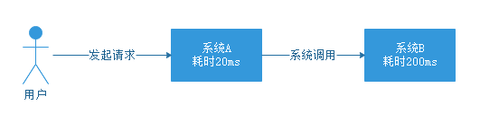


 没有引入中间件的时候，用户发起请求到系统A，系统A耗时20ms，接下来系统A调用系统B，系统B耗时200ms，带给用户的体验就是，一个操作全部结束一共耗时220ms。

如果引入中间件之后呢？看下边的图。

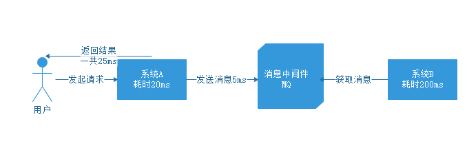


 用户发起请求到系统A，系统A耗时20ms，发送消息到MQ耗时5ms，返回结果一共用了25ms，用户体验一个操作只用了25ms，而不用管系统B什么时候去获取消息执行对应操作，这样比较下来，性能自然大大提高


### **1.2.2.降低耦合度**

再来聊聊解耦的场景，看下图。

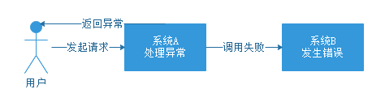


如果没有引入中间件，那么系统A调用系统B的时候，系统B出现故障，导致调用失败，那么系统A就会接到异常信息，接到异常信息后肯定要再处理一下，返回给用户失败请稍后再试，这时候就得等待系统B的工程师解决问题，一切都解决好后再告知用户可以了，再重新操作一次吧。

这样的架构，两个系统耦合再一起，用户体验极差。

那么我们引入中间件后是什么样的场景呢，看下面的流程：

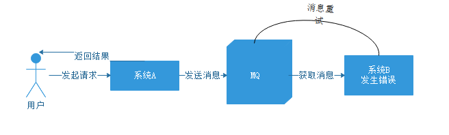


 对于系统A，发送消息后直接返回结果，不再管系统B后边怎么操作。而系统B故障恢复后重新到MQ中拉取消息，重新执行未完成的操作，这样一个流程，系统之间没有影响，也就实现了解耦。


### **1.2.3.流量削峰**

下面我们再聊聊最后一个场景，流量削峰

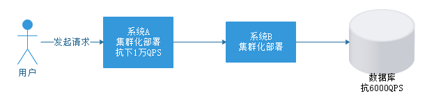


假如我们的系统A是一个集群，不连接数据库，这个集群本身可以抗下1万QPS

系统B操作的是数据库，这个数据库只能抗下6000QPS，这就导致无论系统B如何扩容集群，都只能抗下6000QPS，它的瓶颈在于数据库。

假如突然系统QPS达到1万，就会直接导致数据库崩溃，那么引入MQ后是怎么解决的呢，见下图：

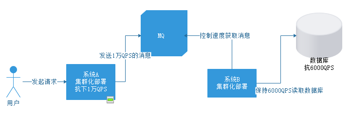


 引入MQ后，对于系统A没有什么影响，给MQ发送消息可以直接发送1万QPS。

此时对于系统B，可以自己控制获取消息的速度，保持在6000QPS一下，以一个数据库能够承受的速度执行操作。这样就可以保证数据库不会被压垮。

当然，这种情况MQ中可能会积压大量消息。但对于MQ来说，是允许消息积压的，等到系统A峰值过去，恢复成1000QPS时，系统B还是在以6000QPS的速度去拉取消息，自然MQ中的消息就慢慢被释放掉了。

这就是流量削峰的过程。在电商秒杀、抢票等等具有流量峰值的场景下可以使用这么一套架构。

## 1.3.主流MQ技术对比

MQ，中文是消息队列（MessageQueue），字面来看就是存放消息的队列。也就是事件驱动架构中的Broker。

比较常见的MQ实现：

- ActiveMQ
- RabbitMQ
- RocketMQ
- Kafka

**几种常见MQ的对比：**

|                  | **RabbitMQ**                       | ActiveMQ（不建议）                                           | RocketMQ                                                     | **Kafka**                                  |
| ---------------- | ---------------------------------- | ------------------------------------------------------------ | ------------------------------------------------------------ | ------------------------------------------ |
| 公司/社区        | Rabbit                             | Apache                                                       | 阿里                                                         | Apache                                     |
| 开发语言         | Erlang                             | Java                                                         | Java                                                         | Scala&Java                                 |
| 协议支持         | AMQP，XMPP，SMTP，STOMP            | OpenWire, 			STOMP, 			REST, 			XMPP,AMQP | 自定义协议                                                   | 自定义协议                                 |
| 可用性           | 高                                 | 一般                                                         | 高                                                           | 高                                         |
| 单机吞吐量       | **一般**                           | 差                                                           | 高                                                           | **非常高**                                 |
| 消息延迟         | **微秒级**                         | 毫秒级                                                       | 毫秒级                                                       | **毫秒以内**                               |
| 消息可靠性       | 高                                 | 一般                                                         | 高                                                           | 一般                                       |
| 使用场景         | 数据量小的中小公司                 |                                                              | 在阿里集团被广泛应用在订单、交易、流计算、充值、消息推送、日志流式处理、binlog分发等场景。 | 适用于埋点上报、日志采集、大数据流计算     |
| Broker端消息过滤 | 不支持                             |                                                              | 支持tag标签过滤和SQL表达式过滤                               | 不支持                                     |
| 消息查询         | 根据消息id查询                     |                                                              | 支持message id或key查询                                      | 不支持                                     |
| 消息回溯         | 不支持                             |                                                              | 支持按照时间回溯消息，精度毫秒，例如从一天前某时分秒开始重新消费消息 | 理论上支持时间或offset回溯，但是得修改代码 |
| **路有逻辑**     | 基于**交换机**，可配置复杂路有逻辑 |                                                              | 根据topic，可以配置过滤消费                                  | 根据topic                                  |


**RabbitMQ：**

优点

- 项目开源，**社区活跃**，管理界面丰富，适用于**中小型公司**。
- erlang开发，队列基于内存，并发高，延时低。基于AMQP协议支持多语言接入。
- **特有的交换机模式**，支持很多复杂场景的消息路由。

缺点 :

- 基于erlang也影响java人员的探索和改造
- 队列只能支持主备，不可分布式扩展，单点问题是硬伤。投递消息如果不在某台虚拟机上，还需要虚拟机转发请求。
- **队列基于内存：**导致的无法大量堆积消息。
- **不支持顺序消息：**消息消费失败后会重回队列，打乱顺序

**RocketMQ：**

优点:

- 阿里双十一经受了许多考验，使用广泛。基于JAVA语言适合大公司自己改造。
- 对比kafka，额外支持消息查询，消息回溯，消息重试，延迟消息，适合复杂业务场景
- 吞吐量相比RabbitMQ高
- 可用性:非常高，分布式架构;

缺点 :

- 社区不够活跃，github上讨论不多，有可能黄
- 支持的语言不多。

**Kafka：**

优点

- 吞吐量高。
- 可用性非常高，分布式架构；

缺点

- Kafka单机超过64个队列/分区，Load会发生明显的飙高现象，队列越多，load越高，发送消息响应时间
- 功能比较简单，主要聚焦于日志场景和流计算。对业务型的场景支持不够 

**追求可用性：**Kafka、 RocketMQ 、RabbitMQ

**追求可靠性：**RabbitMQ、RocketMQ

**追求吞吐能力：**RocketMQ、Kafka

**追求消息低延迟：**RabbitMQ、Kafka

# 2.RabbitMQ快速入门

## 2.0 RabbitMQ介绍

### **2.0.1 MQ的基本结构** 

RabbitMQ的优势是**消息延迟低（微秒级），可靠性高。** 

 **MQ的基本结构：**


生产者把消息发送到交换机，交换机把消息路由到多个队列，队列暂存消息，消费者从队列获取并处理消息。各虚拟主机之间互相隔离。

RabbitMQ中的一些角色：

- publisher：生产者
- consumer：消费者
- exchange个：交换机，负责消息路由
- queue：队列，存储消息
- virtualHost：虚拟主机，隔离不同租户的exchange、queue、消息的隔离

**2.0.2 各名词解释**

**2.0.1 Message**

消息，消息是不具名的，它由消息头和消息体组成。消息体是不透明的，而消息头则由一系列的可选属性组成， 这些属性包括**routing-key**（路由键）、priority（相对于其他消息的优先权）、delivery-mode（指出该消息可 能需要持久性存储）等。

**2.0.2 Publisher**

消息的生产者，也是一个向交换器发布消息的客户端应用程序。

**2.0.3 Exchange**

交换器，用来接收生产者发送的消息并将这些消息路由给服务器中的队列。

Exchange有4种类型：direct(默认)，fanout, topic, 和headers，不同类型的Exchange转发消息的策略有所区别

**2.0.4 Queue**

消息队列，用来保存消息直到发送给消费者。它是消息的容器，也是消息的终点。一个消息可投入一个或多个队列。消息一直 在队列里面，等待消费者连接到这个队列将其取走。

**2.0.5 Binding**

绑定，用于消息队列和交换器之间的关联。一个绑定就是基于路由键将交换器和消息队列连接起来的路由规则，所以可以将交 换器理解成一个由绑定构成的路由表。

Exchange 和Queue的绑定可以是多对多的关系。

**2.0.6 Connection**

网络连接，比如一个TCP连接。

**2.0.7 Channel**

信道，多路复用连接中的一条独立的双向数据流通道。信道是建立在真实的TCP连接内的虚拟连接，AMQP 命令都是通过信道 发出去的，不管是发布消息、订阅队列还是接收消息，这些动作都是通过信道完成。因为对于操作系统来说建立和销毁 TCP 都 是非常昂贵的开销，所以引入了信道的概念，以复用一条 TCP 连接。

**2.0.8 Consumer**

消息的消费者，表示一个从消息队列中取得消息的客户端应用程序。

**2.0.9 VirtualHost**

虚拟主机，表示一批交换器、消息队列和相关对象。虚拟主机是共享相同的身份认证和加 密环境的独立服务器域。每个 vhost 本质上就是一个 mini 版的 RabbitMQ 服务器，拥 有自己的队列、交换器、绑定和权限机制。vhost 是 AMQP 概念的基础，必须在连接时 指定，RabbitMQ 默认的 vhost 是 / 。

**2.0.10 Broker**

表示消息队列服务器实体

**2.0.11 关系图**

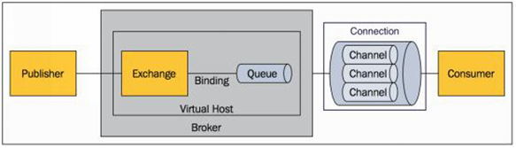


## 2.1.docker安装RabbitMQ


### 2.1.1.单机部署

我们在Centos7虚拟机中使用Docker来安装。

**2.1.1.1.下载镜像**

方式一：在线拉取

```
docker pull rabbitmq:3-management
```


方式二：从本地加载

如果已经提供了镜像包：


上传到虚拟机中后，使用命令加载镜像即可：

```
docker load -i mq.tar
```


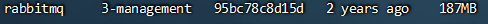


**2.1.1.2.安装MQ**

执行下面的命令来运行MQ容器：

```bash
docker run \
 -e RABBITMQ_DEFAULT_USER=itcast \
 -e RABBITMQ_DEFAULT_PASS=123321 \
 --name mq \
 --hostname mq1 \
 -p 15672:15672 \
 -p 5672:5672 \
 -d \
 rabbitmq:3-management
```


15672是管理平台的端口，5672是消息通信的端口。

访问：http://ip地址:15672

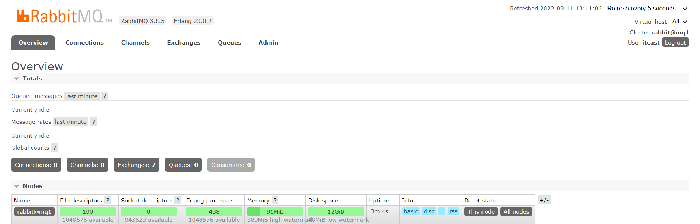

overview总览，显示节点信息

channels通道，建立连接后要创建通道，生产者和消费者基于通道完成消息的发送和接收。

exchanges交换机，是消息的路由器

queues队列，实现消息存储

### 2.1.2.集群部署

接下来，我们看看如何安装RabbitMQ的集群。

**2.1.2.1.集群分类**

在RabbitMQ的官方文档中，讲述了两种集群的配置方式：

- 普通模式：普通模式集群不进行数据同步，每个MQ都有自己的队列、数据信息（其它元数据信息如交换机等会同步）。例如我们有2个MQ：mq1，和mq2，如果你的消息在mq1，而你连接到了mq2，那么mq2会去mq1拉取消息，然后返回给你。如果mq1宕机，消息就会丢失。
- 镜像模式：与普通模式不同，队列会在各个mq的镜像节点之间同步，因此你连接到任何一个镜像节点，均可获取到消息。而且如果一个节点宕机，并不会导致数据丢失。不过，这种方式增加了数据同步的带宽消耗。


我们先来看普通模式集群。

**2.1.2.2.设置网络**

首先，我们需要让3台MQ互相知道对方的存在。

分别在3台机器中，设置 /etc/hosts文件，添加如下内容：

```bash
192.168.150.101 mq1
192.168.150.102 mq2
192.168.150.103 mq3
```


并在每台机器上测试，是否可以ping通对方：


## 2.2.RabbitMQ五种消息模型

RabbitMQ官方提供了5个不同的Demo示例，对应了五种的消息模型：

**基本消息模型、工作消息模型、订阅模型-广播Fanout、订阅模型-定向Direct、订阅模型-话题Topic**


**基本消息模型：**生产者将消息发送到队列，消费者从队列中获取消息，队列是存储消息的缓冲区。 

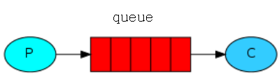


**工作消息模型：**让多个消费者绑定到一个队列，共同消费队列中的消息。队列中的消息一旦消费，就会消失，因此任务是不会被重复执行的。


**发送/订阅模型：**发送订阅模式和之前模式的区别是**允许通过交换机把同一个消息发给多个消费者。Exchange（交换机）只负责转发消息，不具备存储消息的能力。**


**订阅模型-广播Fanout：**

在广播模式下，消息发送流程是这样的：

- 1） 可以有多个队列
- 2） 每个队列都要绑定到Exchange（交换机）
- 3） 生产者发送的消息，只能发送到交换机，交换机来决定要发给哪个队列，生产者无法决定
- 4） 交换机把消息发送给绑定过的所有队列
- 5） 订阅队列的消费者都能拿到消息


**订阅模型-定向Direct：**可以根据`RoutingKey`把消息路由到不同的队列。不同的消息被不同的队列消费，**把一条消息交给绑定交换机的符合指定routing key 的队列**。


**订阅模型-话题Topic：**与`Direct`相比，都是可以根据`RoutingKey`把消息路由到不同的队列。只不过**`Topic`类型`Exchange`可以让队列在绑定`Routing key` 的时候使用通配符！**

**通配符规则：**

**`#`    匹配一个或多个词**

**`\*`    匹配不多不少恰好1个词**


## 2.3.导入Demo工程

课前资料提供了一个Demo工程，mq-demo，主要是消息发送者和接收者的测试类。


导入后可以看到结构如下：


包括三部分：

- mq-demo：父工程，管理项目依赖
- publisher：消息的发送者
- consumer：消息的消费者

## 2.4.入门案例（了解，多用SpringAMQP）

> **了解即可**，主要用springamqp高级消息队列协议 

简单队列模式的模型图：


官方的HelloWorld是基于最基础的消息队列模型来实现的，只包括三个角色：

- publisher：消息发布者，将消息发送到队列queue
- queue：消息队列，负责接受并缓存消息
- consumer：订阅队列，处理队列中的消息

### 2.4.1.publisher实现

思路：

- 建立连接
- 创建Channel
- 声明队列
- 发送消息
- 关闭连接和channel

代码实现：

```java
package cn.itcast.mq.helloworld;

import com.rabbitmq.client.Channel;
import com.rabbitmq.client.Connection;
import com.rabbitmq.client.ConnectionFactory;
import org.junit.Test;

import java.io.IOException;
import java.util.concurrent.TimeoutException;

public class PublisherTest {
    @Test
    public void testSendMessage() throws IOException, TimeoutException {
        // 1.建立连接
        ConnectionFactory factory = new ConnectionFactory();
        // 1.1.设置连接参数，分别是：主机名、端口号、vhost、用户名、密码
        factory.setHost("改成自己安装了RabbitMQ的主机名");
        factory.setPort(5672);
        factory.setVirtualHost("/");
        factory.setUsername("itcast");
        factory.setPassword("123321");
        // 1.2.建立连接
        Connection connection = factory.newConnection();

        // 2.创建通道Channel
        Channel channel = connection.createChannel();

        // 3.创建队列
        String queueName = "simple.queue";
        channel.queueDeclare(queueName, false, false, false, null);

        // 4.发送消息
        String message = "hello, rabbitmq!";
        channel.basicPublish("", queueName, null, message.getBytes());
        System.out.println("发送消息成功：【" + message + "】");

        // 5.关闭通道和连接
        channel.close();
        connection.close();

    }
}
```


建立的连接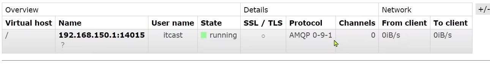 

建立的通道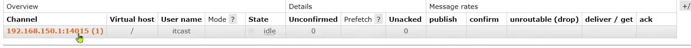 

创建的队列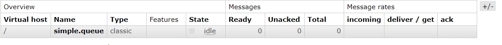 


### 2.4.2.consumer实现

代码思路：

- 建立连接
- 创建Channel
- 声明队列
- 订阅消息

代码实现：

```java
package cn.itcast.mq.helloworld;

import com.rabbitmq.client.*;

import java.io.IOException;
import java.util.concurrent.TimeoutException;

public class ConsumerTest {

    public static void main(String[] args) throws IOException, TimeoutException {
        // 1.建立连接
        ConnectionFactory factory = new ConnectionFactory();
        // 1.1.设置连接参数，分别是：主机名、端口号、vhost、用户名、密码
        factory.setHost("改成自己ip地址例如192.168.150.101");
        factory.setPort(5672);
        factory.setVirtualHost("/");
        factory.setUsername("itcast");
        factory.setPassword("123321");
        // 1.2.建立连接
        Connection connection = factory.newConnection();

        // 2.创建通道Channel
        Channel channel = connection.createChannel();

        // 3.创建队列
        String queueName = "simple.queue";
        channel.queueDeclare(queueName, false, false, false, null);

        // 4.订阅消息
        channel.basicConsume(queueName, true, new DefaultConsumer(channel){
            @Override
            public void handleDelivery(String consumerTag, Envelope envelope,
                                       AMQP.BasicProperties properties, byte[] body) throws IOException {
                // 5.处理消息
                String message = new String(body);
                System.out.println("接收到消息：【" + message + "】");
            }
        });
        System.out.println("等待接收消息。。。。");
    }
}
```


## 2.5.总结基本消息队列的流程

基本消息队列的消息发送流程：

1. 建立connection
2. 创建channel
3. 利用channel声明队列
4. 利用channel向队列发送消息

基本消息队列的消息接收流程：

1. 建立connection
2. 创建channel
3. 利用channel声明队列
4. 定义consumer的消费行为handleDelivery()
5. 利用channel将消费者与队列绑定


# 3.SpringAMQP，Spring高级消息队列协议

AMQP(Advanced Message Queuing Protocol) 是**高级消息队列协议**。

SpringAMQP是**基于RabbitMQ封装的一套模板**，并且还**利用SpringBoot对其实现了自动装配**，使用起来非常方便。


SpringAmqp的官方地址：https://spring.io/projects/spring-amqp


SpringAMQP提供了三个功能：

- 自动声明队列、交换机及其绑定关系
- 基于注解的监听器模式，异步接收消息
- 封装了RabbitTemplate工具，用于发送消息

## 3.1.Basic Queue 简单队列模型

 **基本消息模型：**生产者将消息发送到队列，消费者从队列中获取消息，队列是存储消息的缓冲区。 


 


在**父工程**mq-demo中**引入依赖**

```XML
<!--AMQP依赖，包含RabbitMQ-->
<dependency>
    <groupId>org.springframework.boot</groupId>
    <artifactId>spring-boot-starter-amqp</artifactId>
</dependency>
```


### 3.1.1.消息发送


首先配置MQ地址，在publisher服务的application.yml中添加配置：

```bash
spring:
  rabbitmq:
    host: 192.168.150.101 # 主机名
    port: 5672 # 端口
    virtual-host: / # 虚拟主机
    username: itcast # 用户名
    password: 123321 # 密码
```


然后在publisher服务中编写**测试类SpringAmqpTest**，并利用RabbitTemplate实现消息发送：

```java
package cn.itcast.mq.spring;

@RunWith(SpringRunner.class)
@SpringBootTest
public class SpringAmqpTest {

    @Autowired
    private RabbitTemplate rabbitTemplate;

    @Test
    public void testSimpleQueue() {
        // 队列名称
        String queueName = "simple.queue";
        // 消息
        String message = "hello, spring amqp!";
        // 发送消息。发送消息需要先将消息的类型转换成字节，然后再发送，所以是convertAndSend
        rabbitTemplate.convertAndSend(queueName, message);
    }
}
```


### 3.1.2.消息接收

首先配置MQ地址，在consumer服务的application.yml中添加配置：

```bash
spring:
  rabbitmq:
    host: 192.168.150.101 # 主机名
    port: 5672 # 端口
    virtual-host: / # 虚拟主机
    username: itcast # 用户名
    password: 123321 # 密码
```


然后在consumer服务的**`cn.itcast.mq.listener`包中新建一个类SpringRabbitListener**，代码如下：

```java
package cn.itcast.mq.listener;
@Component
public class SpringRabbitListener {
    //注解监听队列后，方法实参就是该队列的消息
    @RabbitListener(queues = "simple.queue")
    public void listenSimpleQueueMessage(String msg) throws InterruptedException {
        System.out.println("spring 消费者接收到消息：【" + msg + "】");
    }
}
```


### 3.1.3.测试

启动consumer服务，然后在publisher服务中运行测试代码，发送MQ消息

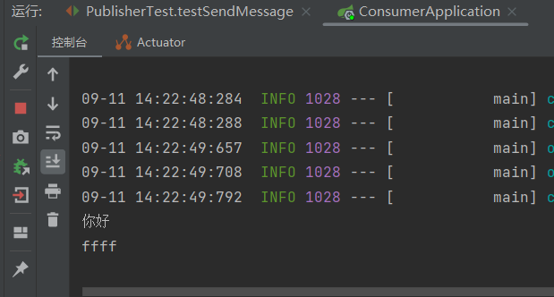


## 3.2.WorkQueue工作队列模型

Work queues，也被称为（Task queues），**任务模型**。简单来说就是**让多个消费者绑定到一个队列，共同消费队列中的消息**。队列中的消息一旦消费，就会消失，因此任务是不会被重复执行的。


当**消息处理比较耗时**的时候，可能生产消息的速度会远远大于消息的消费速度。长此以往，消息就会**堆积**越来越多，无法及时处理。

此时就可以使用work 模型**，多个消费者共同处理消息处理**，速度就能大大提高了。

### 3.2.1.消息发送到队列

这次我们循环发送，模拟大量消息堆积现象。

在publisher服务中的SpringAmqpTest类中添加一个测试方法：

```java
/**
     * workQueue
     * 向队列中不停发送消息，模拟消息堆积。
     */
@Test
public void testWorkQueue() throws InterruptedException {
    // 队列名称
    String queueName = "simple.queue";
    // 消息
    String message = "hello, message_";
    for (int i = 0; i < 50; i++) {
        // 发送消息
        rabbitTemplate.convertAndSend(queueName, message + i);
        Thread.sleep(20);
    }
}
```


### 3.2.2.消息接收

要模拟多个消费者绑定同一个队列，我们在consumer服务的SpringRabbitListener中添加2个新的方法：

```java
@RabbitListener(queues = "simple.queue")
public void listenWorkQueue1(String msg) throws InterruptedException {
    System.out.println("消费者1接收到消息：【" + msg + "】" + LocalTime.now());
    Thread.sleep(20);
}

@RabbitListener(queues = "simple.queue")
public void listenWorkQueue2(String msg) throws InterruptedException {
    System.err.println("消费者2........接收到消息：【" + msg + "】" + LocalTime.now());
    Thread.sleep(200);
}
```


注意到这个消费者sleep了1000秒，模拟任务耗时。

### 3.2.3.测试，平均分配消息堆积问题

启动ConsumerApplication后，在执行publisher服务中刚刚编写的发送测试方法testWorkQueue。


可以看到生产者轮询给两个消费者发送消息；消费者1很快完成了自己的25条消息。消费者2却在缓慢的处理自己的25条消息。

也就是说消息是平均分配给每个消费者，并没有考虑到消费者的处理能力。这样显然是有问题的。

### 3.2.4.能者多劳，prefetch预取

通过设置prefetch来**控制消费者预取的消息数量 。**

在spring中有一个简单的配置，可以解决这个问题。我们修改consumer服务的application.yml文件，添加配置：

```bash
spring:
  rabbitmq:
    listener:
      simple:
        prefetch: 1 # 每次只能预取一条消息，处理完成才能获取下一个消息
```


### 3.2.5.总结

Work模型的使用：

- 多个消费者绑定到一个队列，同一条消息只会被一个消费者处理
- 通过设置prefetch来控制消费者预取的消息数量

## 3.3.发布/订阅模型，交换机

发送订阅模式和之前模式的区别是**允许通过交换机把同一个消息发给多个消费者。**

发布订阅的模型如图：


可以看到，在订阅模型中，多了一个exchange角色，而且过程略有变化：

- Publisher：生产者，也就是要发送消息的程序，但是不再发送到队列中，而是发给X（交换机）

- Exchange：

  交换机，图中的X。一方面，

  接收生产者发送的消息

  。另一方面，知道如何处理消息，例如递交给某个特别队列、递交给所有队列、或是将消息丢弃。到底如何操作，取决于Exchange的类型。

  Exchange有以下3种类型

  ： 

  - **Fanout：**广播，将消息交给交换机绑定的**所有**队列。Fanout译为扇出。
  - **Direct：**定向，把消息交给交换机绑定的**指定**routing key 的队列
  - **Topic：**通配符，把消息交给交换机绑定的符合routing pattern（路由模式） 的队列

- Consumer：消费者，与以前一样，订阅队列，没有变化

- Queue：消息队列也与以前一样，接收消息、缓存消息。

**Exchange（交换机）只负责转发消息，不具备存储消息的能力**，因此如果没有任何队列与Exchange绑定，或者没有符合路由规则的队列，那么消息会丢失！

## 3.4.发布/订阅模型-Fanout广播模式

Fanout，英文翻译是**扇出**，在MQ中叫**广播**更合适。


在广播模式下，消息发送流程是这样的：

- 1） 可以有多个队列
- 2） 每个队列都要绑定到Exchange（交换机）
- 3） 生产者发送的消息，只能发送到交换机，交换机来决定要发给哪个队列，生产者无法决定
- 4） 交换机把消息发送给绑定过的所有队列
- 5） 订阅队列的消费者都能拿到消息

我们的计划是这样的：

- 创建一个交换机 itcast.fanout，类型是Fanout
- 创建两个队列fanout.queue1和fanout.queue2，绑定到交换机itcast.fanout


### 3.4.1.声明队列和交换机

Spring提供了一个接口Exchange，来表示所有不同类型的交换机：


**方法一：配置类形式。**在**消费者模块的config包**下创建一个类，声明队列和交换机：

```java
package cn.itcast.mq.config;

import org.springframework.amqp.core.Binding;
import org.springframework.amqp.core.BindingBuilder;
import org.springframework.amqp.core.FanoutExchange;
import org.springframework.amqp.core.Queue;
import org.springframework.context.annotation.Bean;
import org.springframework.context.annotation.Configuration;
//定义为配置类
@Configuration
public class FanoutConfig {
    /**
     * 声明交换机
     * @return Fanout类型交换机
     */
    @Bean
    public FanoutExchange fanoutExchange(){
        return new FanoutExchange("itcast.fanout");
    }

    /**
     * 第1个队列
     */
    @Bean
    public Queue fanoutQueue1(){
        //之后消费者@RabbitListener接收消息时候队列名就是fanout.queue1
        return new Queue("fanout.queue1");
    }

    /**
     * 绑定队列和交换机，方法一
     */
    @Bean
    public Binding bindingQueue1(Queue fanoutQueue1, FanoutExchange fanoutExchange){
        return BindingBuilder.bind(fanoutQueue1).to(fanoutExchange);
    }
//    绑定队列和交换机，方法二
//    @Bean
//    public Binding bindingQueue1(){
//        return BindingBuilder.bind(fanoutQueue1()).to(fanoutExchange());
//    }

    /**
     * 第2个队列
     */
    @Bean
    public Queue fanoutQueue2(){
        return new Queue("fanout.queue2");
    }

    /**
     * 绑定队列和交换机
     */
    @Bean
    public Binding bindingQueue2(Queue fanoutQueue2, FanoutExchange fanoutExchange){
        return BindingBuilder.bind(fanoutQueue2).to(fanoutExchange);
    }
}
```


> 注意导入Binding别导错了：
>
> 

**方法二：注解形式：**监听消息时绑定交换机和队列关系

在消费者接收消息的方法上注解@RabbitListener的bindings属性：

```java
@Component
public class RabbitMQListener {
    @RabbitListener(bindings = @QueueBinding(value = @Queue(name="fanout.queue1"),exchange = @Exchange(name = "fanout.exchange",type = ExchangeTypes.FANOUT)))
    public void listener(String msg){
        System.out.println(msg);
    }
}
```


### 3.4.2.消息发送到交换机

在publisher服务的SpringAmqpTest类中添加测试方法：

```java
@Test
public void testFanoutExchange() {
    // 队列名称
    String exchangeName = "itcast.fanout";
    // 消息
    String message = "hello, everyone!";
    //这里fanout模型的第一个参数是交换机名，第二个参数是路径关键词routingKey，第三个参数是消息。对比简单队列模型的第一个参数是队列名，第二个参数是消息
    //因为交换机是FanoutExchange扇出交换机，所以routingKey无论是什么，交换机绑定的所有队列都可以接收到消息
    rabbitTemplate.convertAndSend(exchangeName, "", message);
}
```


### 3.4.3.消息接收

在consumer服务的SpringRabbitListener中添加两个方法，作为消费者：

```java
//@RabbitListener(bindings = @QueueBinding(value = @Queue(name="fanout.queue1"),exchange = @Exchange(name = "fanout.exchange",type = ExchangeTypes.FANOUT)))
@RabbitListener(queues = "fanout.queue1")
public void listenFanoutQueue1(String msg) {
    System.out.println("消费者1接收到Fanout消息：【" + msg + "】");
}

@RabbitListener(queues = "fanout.queue2")
public void listenFanoutQueue2(String msg) {
    System.out.println("消费者2接收到Fanout消息：【" + msg + "】");
}
```


> 因为是fanout广播模式，所以**交换机绑定的两个队列都接收到了消息：**
>
> ```java
> 消费者1接收到Fanout消息：【hello, everyone!】
> 消费者2接收到Fanout消息：【hello, everyone!】
> ```
>
> 

### 3.4.4.总结，交换机作用

**交换机的作用是什么？**

- 接收publisher发送的消息
- 将**消息按照规则路由**到与之绑定的队列
- **不能缓存消息**，路由失败，消息丢失
- FanoutExchange的会将消息路由到每个绑定的队列

**声明队列、交换机、绑定关系的Bean**是什么？

- Queue
- FanoutExchange
- Binding

## 3.5.发布/订阅模型-Direct定向模式

在Fanout模式中，一条消息，会被绑定交换机所有订阅的队列都消费。但是，在某些场景下，我们希望不同的消息被不同的队列消费，**把一条消息交给绑定交换机的符合指定routing key 的队列**。这时就要用到Direct类型的Exchange。


在Direct模型下：

- 队列与交换机的绑定，不能是任意绑定了，而是要指定一个`RoutingKey`（路由key）
- 消息的发送方在 向 Exchange发送消息时，也必须指定消息的 `RoutingKey`。
- Exchange不再把消息交给每一个绑定的队列，而是根据消息的`Routing Key`进行判断，只有队列的`Routingkey`与消息的 `Routing key`完全一致，才会接收到消息

**案例需求如下**：

1. 利用@RabbitListener声明Exchange、Queue、RoutingKey
2. 在consumer服务中，编写两个消费者方法，分别监听direct.queue1和direct.queue2
3. 在publisher中编写测试方法，向itcast. direct发送消息


### 3.5.1.消息接收，并基于注解声明队列和交换机

基于@Bean的方式声明队列和交换机比较麻烦，Spring还提供了基于注解方式来声明。

在consumer的SpringRabbitListener中添加两个消费者，同时基于注解来声明队列和交换机：

```java
@RabbitListener(bindings = @QueueBinding(
    value = @Queue(name = "direct.queue1"),
    exchange = @Exchange(name = "itcast.direct", type = ExchangeTypes.DIRECT),
    key = {"red", "blue"}
))
public void listenDirectQueue1(String msg){
    System.out.println("消费者接收到direct.queue1的消息：【" + msg + "】");
}

@RabbitListener(bindings = @QueueBinding(
    value = @Queue(name = "direct.queue2"),
    exchange = @Exchange(name = "itcast.direct", type = ExchangeTypes.DIRECT),
    key = {"red", "yellow"}
))
public void listenDirectQueue2(String msg){
    System.out.println("消费者接收到direct.queue2的消息：【" + msg + "】");
}
```


> 当然也可以用**配置类形式：**
>
> 
>
> ```java
> //注解为配置类
> @Configuration
> public class RabbitConfigDirect {
>     //第一个队列，起名direct_queue，后面监听器里的监听注解queues属性配置队列名获取消息
>     @Bean
>     public Queue directQueue(){
>         return new Queue("direct.queue1");
>     }
>     //第二个队列
>     @Bean
>     public Queue directQueue2(){
>         return new Queue("direct.queue2");
>     }
>     //直连交换机，起名directExchange
>     @Bean
>     public DirectExchange directExchange(){
>         return new DirectExchange("directExchange");
>     }
>     //绑定直连，绑定直连队列到直连交换机，with里是routingKey路径关键词的起名
>     @Bean
>     public Binding bindingDirect(){
>         return BindingBuilder.bind(directQueue()).to(directExchange()).with("red");
>     }
>     //绑定队列2到交换机，路径关键词设为"yellow"
>     @Bean
>     public Binding bindingDirect2(){
>         return BindingBuilder.bind(directQueue2()).to(directExchange()).with("yellow");
>     }
> }
> ```
>
> 

### 3.5.2.消息发送到交换机，指定routingKey

在publisher服务的SpringAmqpTest类中添加测试方法：

```java
@Test
public void testSendDirectExchange() {
    // 交换机名称
    String exchangeName = "itcast.direct";
    // 消息
    String message = "红色警报！日本乱排核废水，导致海洋生物变异，惊现哥斯拉！";
    // 发送消息，只给交换机绑定blue路径关键字的队列发
    rabbitTemplate.convertAndSend(exchangeName, "red", message);
}
```


```

```

### 3.5.3.总结

**描述下Direct交换机与Fanout交换机的差异？**

- Fanout交换机将消息路由给每一个与之绑定的队列
- **Direct交换机根据RoutingKey判断路由给哪个队列**
- 如果多个队列具有相同的RoutingKey，则与Fanout功能类似

基于@RabbitListener注解声明队列和交换机有哪些常见注解？

- @Queue
- @Exchange


## 3.6.发布/订阅模型-Topic话题模式，通配符

### 3.6.1.说明

`Topic`类型的`Exchange`与`Direct`相比，都是可以根据`RoutingKey`把消息路由到不同的队列。只不过**`Topic`类型`Exchange`可以让队列在绑定`Routing key` 的时候使用通配符！**

```
Routingkey` 一般都是有一个或多个单词组成，多个单词之间以”.”分割，例如： `item.insert
```

**通配符规则：**

**`#`    匹配一个或多个词**

**`\*`    匹配不多不少恰好1个词**

> **举例：**
>
> ```
> item.#`：能够匹配`item.tmp.tmp2`或者 `item.tmp
> item.*`：只能匹配`item.tmp
> ```


图示：


**解释：**

- Queue1：绑定的是`china.#` ，因此凡是以 `china.`开头的`routing key` 都会被匹配到。包括china.news和china.weather
- Queue2：绑定的是`#.news` ，因此凡是以 `.news`结尾的 `routing key` 都会被匹配。包括china.news和japan.news

> **案例需求：**使用topic模式发送接收消息
>
> 实现思路如下：
>
> 1. 利用**@RabbitListener**声明Exchange、Queue、RoutingKey
> 2. 在consumer服务中，编写两个消费者方法，分别**监听topic.queue1和topic.queue2**
> 3. 在publisher中编写测试方法，向itcast. topic发送消息


### 3.6.2.消息发送

在publisher服务的SpringAmqpTest类中添加测试方法：

```java
/**
     * topicExchange
     */
@Test
public void testSendTopicExchange() {
    // 交换机名称
    String exchangeName = "itcast.topic";
    // 消息
    String message = "喜报！孙悟空大战哥斯拉，胜!";
    // 发送消息
    rabbitTemplate.convertAndSend(exchangeName, "china.news", message);
}
```


### 3.6.3.消息接收

在consumer服务的SpringRabbitListener中添加方法：

```java
@RabbitListener(bindings = @QueueBinding(
    value = @Queue(name = "topic.queue1"),
    exchange = @Exchange(name = "itcast.topic", type = ExchangeTypes.TOPIC),
    key = "china.#"
))
public void listenTopicQueue1(String msg){
    System.out.println("消费者接收到topic.queue1的消息：【" + msg + "】");
}

@RabbitListener(bindings = @QueueBinding(
    value = @Queue(name = "topic.queue2"),
    exchange = @Exchange(name = "itcast.topic", type = ExchangeTypes.TOPIC),
    key = "#.news"
))
public void listenTopicQueue2(String msg){
    System.out.println("消费者接收到topic.queue2的消息：【" + msg + "】");
}
```


> **如果报错：**Channel shutdown: channel error; protocol method
>
> 八成是因为从direct改topic时候没有改交换机和队列名。 

### 3.6.4.总结，Direct交换机与Topic交换机的差异

描述下Direct交换机与Topic交换机的差异？

- **Topic**交换机接收的消息**RoutingKey必须是多个单词**，以 `**.**` 分割
- Topic交换机与队列绑定时的bindingKey可以指定通配符
- `#`：代表0个或多个词
- `*`：代表1个词


## 3.7.消息转换器

之前说过，Spring会把你发送的**消息序列化为字节发送给消息队列MQ**，接收消息的时候，还会把字节反序列化为Java对象。


只不过，**默认**情况下Spring采用的序列化方式是**JDK序列化，不如JSON序列化**。众所周知，JDK序列化存在下列问题：

- 数据体积过大
- 有安全漏洞
- 可读性差

我们来测试一下。

### 3.7.1.测试默认转换器，发送对象消息

我们修改消息发送的代码，发送一个Map对象：

```java
@Test
public void testSendMap() throws InterruptedException {
    // 准备消息
    Map<String,Object> msg = new HashMap<>();
    msg.put("name", "Jack");
    msg.put("age", 21);
    // 发送消息
    rabbitTemplate.convertAndSend("simple.queue","", msg);
}
```


停止consumer服务

发送消息后查看控制台：内容乱码，类型是Java序列化


### 3.7.2.配置JSON转换器

显然，JDK序列化方式并不合适。我们希望消息体的体积更小、可读性更高，因此可以使用JSON方式来做序列化和反序列化。

在publisher和consumer两个服务中都**引入依赖**（或者仅在父工程中引入依赖）：

```XML
<dependency>
    <groupId>com.fasterxml.jackson.dataformat</groupId>
    <artifactId>jackson-dataformat-xml</artifactId>
    <version>2.9.10</version>
</dependency>
```


> **也可以引入核心依赖**，里面包括了上面依赖;
>
> 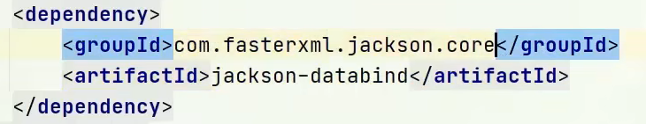

配置消息转换器。

在发送接收模块**启动类中添加一个Bean**即可：

```java
@Bean
public MessageConverter jsonMessageConverter(){
    return new Jackson2JsonMessageConverter();
}
```


>  发送接收消息和以前没什么区别，只是消息类型变成JSON格式：
>
> 
>
> 
>
> 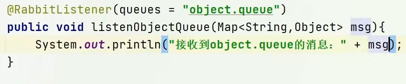
>
> 
>
> 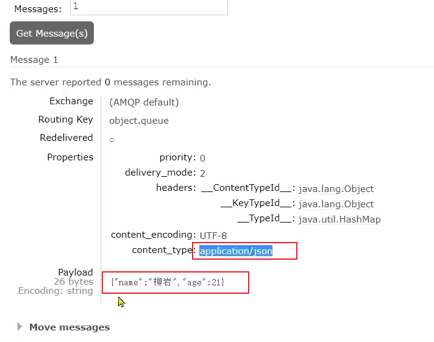


## 3.8 消息可靠抵达


### 3.8.1 消息确认机制

保证消息不因为宕机等原因丢失，**可靠抵达**。

可以使用事务消息，但事务消息会令性能下降**250倍**，为此引入**消息确认机制保证消息可靠到达。**

**消息确认机制：** 

- **生产者确认模式：**确认消息是否发送到broker，失败原因是什么。配置类@PostConstruct方法里，调用setConfirmCallback()方法，参数是Lambda表达式
- **生产者退回模式：**确认消息是否发送到队列。配置类@PostConstruct方法里，调用setReturnCallback()方法，参数是Lambda表达式
- **消费者ack机制：**消费者方法的Channel参数、Message参数、消息实体类参数。一定要手动ack，消费成功才移除消息。


### 3.8.2 ConfirmCallback (生产者确认模式)

**作用：**判断消息是否到达Broker消息代理 

**配置文件：** 

```bash
spring.rabbitmq.publisher-confirms=true
```


在创建 connectionFactory 的时候设置 PublisherConfirms(true) 选项，**开启confirmcallback** 。
 CorrelationData：用来表示当前消息唯一性。

消息只要被 broker 接收到就会**执行 confirmCallback**，如果是 cluster 模式，需要**所有broker 接收到**才会调用 confirmCallback。

被 broker 接收到**只能表示 message 已经到达服务器**，并不能保证消息一定会被投递到目标 queue 里。所以需要用到接下来的 returnCallback 。

> 开启配置

```bash
  rabbitmq:
    host: 192.168.157.128
    port: 5672
    virtual-host: /
    #开启发送端确认
    publisher-confirms: true
```


> 配置类设置确认回调，判断消息是否发送到broker、如果失败失败的原因：

```java
@Configuration
public class MyRabbitConfig {

    @Autowired
    RabbitTemplate rabbitTemplate;
    @Bean
    public MessageConverter messageConverter(){
        return new Jackson2JsonMessageConverter();
    }

    /**
     * 定制RabbitTemplate
     * 1、服务收到消息就会回调
     *      1、spring.rabbitmq.publisher-confirms: true
     *      2、设置确认回调
     * 2、消息正确抵达队列就会进行回调
     *      1、spring.rabbitmq.publisher-returns: true
     *         spring.rabbitmq.template.mandatory: true
     *      2、设置确认回调ReturnCallback
     *
     * 3、消费端确认(保证每个消息都被正确消费，此时才可以broker删除这个消息)
     *
     */
    @PostConstruct  //MyRabbitConfig对象创建完成以后，执行这个方法
    public void initRabbitTemplate() {

        /**
         * 1、只要消息抵达Broker就ack=true
         * correlationData：当前消息的唯一关联数据(这个是消息的唯一id)
         * ack：消息是否成功收到
         * cause：失败的原因
         */
        //设置确认回调，Lambda实际是重写confirm方法
        rabbitTemplate.setConfirmCallback((correlationData,ack,cause) -> {
            System.out.println("confirm...correlationData["+correlationData+"]==>ack:["+ack+"]==>cause:["+cause+"]");
        });
}
```


发消息，测试： 

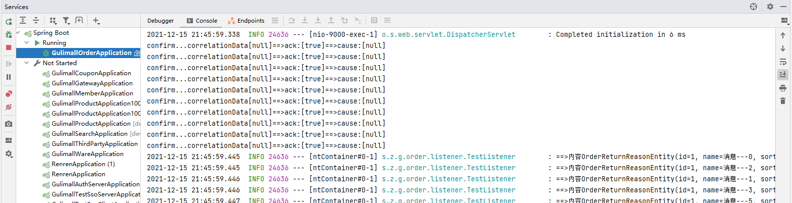

### 3.8.3 returnCallback(生产者回退模式)

**作用：**确认消息是否到达队列。 

```bash
#开启生产者回退模式
spring.rabbitmq.publisher-returns=true
#当消息无法路由到指定的Exchange时，强制返回给生产者一个Basic.Return命令
spring.rabbitmq.template.mandatory=true
```


> confrim 模式只能保证消息到达 broker，不能保证消息准确投递到目标 queue 里。在有些业务场景下，我们需要**保证消息一定要投递到目标 queue 里**，此时就需要用到return 退回模式。

这样如果未能投递到目标 queue 里将调用 returnCallback ，可以记录下详细到投递数据，定期的巡检或者自动纠错都需要这些数据。

> 开启配置

```bash
spring:
  rabbitmq:
    host: 192.168.157.128
    port: 5672
    virtual-host: /
    #开启发送端确认
    publisher-confirms: true
# 开启发送端消息抵达Queue确认
    publisher-returns: true
    # 只要消息抵达Queue，就会异步发送优先回调returnfirm
    template:
      mandatory: true
```


> 自定义RabbitTemplate,开启回退模式

```java
@Configuration
public class MyRabbitConfig {

    @Autowired
    RabbitTemplate rabbitTemplate;
    @Bean
    public MessageConverter messageConverter(){
        return new Jackson2JsonMessageConverter();
    }

    /**
     * 定制RabbitTemplate
     * 1、服务收到消息就会回调
     *      1、spring.rabbitmq.publisher-confirms: true
     *      2、设置确认回调
     * 2、消息正确抵达队列就会进行回调
     *      1、spring.rabbitmq.publisher-returns: true
     *         spring.rabbitmq.template.mandatory: true
     *      2、设置确认回调ReturnCallback
     *
     * 3、消费端确认(保证每个消息都被正确消费，此时才可以broker删除这个消息)
     *
     */
    @PostConstruct  //MyRabbitConfig对象创建完成以后，执行这个方法
    public void initRabbitTemplate() {

        /**
         * 1、只要消息抵达Broker就ack=true
         * correlationData：当前消息的唯一关联数据(这个是消息的唯一id)
         * ack：消息是否成功收到
         * cause：失败的原因
         */
        //设置确认回调
        rabbitTemplate.setConfirmCallback((correlationData,ack,cause) -> {
            System.out.println("confirm...correlationData["+correlationData+"]==>ack:["+ack+"]==>cause:["+cause+"]");
        });


        /**
         * 只要消息没有投递给指定的队列，就触发这个失败回调
         * message：投递失败的消息详细信息
         * replyCode：回复的状态码
         * replyText：回复的文本内容
         * exchange：当时这个消息发给哪个交换机
         * routingKey：当时这个消息用哪个路邮键
         */
        rabbitTemplate.setReturnCallback((message,replyCode,replyText,exchange,routingKey) -> {
            System.out.println("Fail Message["+message+"]==>replyCode["+replyCode+"]" +
                    "==>replyText["+replyText+"]==>exchange["+exchange+"]==>routingKey["+routingKey+"]");
        });
    }
}
```


> 因为该模式需要消息代理投递给指定队列失败才会触发,所以此处我们故意将路由键写错,此次测试后将错误改回来
>
> 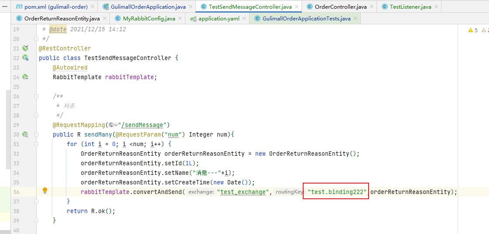

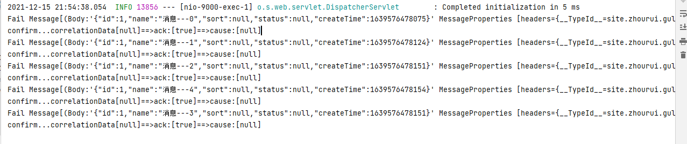


### 3.8.4 消息唯一id

> 在消息发送的时候CorrelationData参数就是消息的唯一id

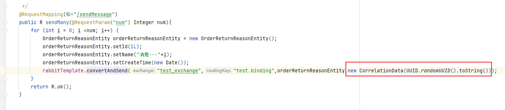

> 这个id在发送端确认时是可以拿到的,排查那些消息未成功抵达是可以用来排查(与接收到的存放在数据库的消息唯一id进行对比)


### 3.8.4 ack机制(消费端确认)

- 消费者获取到消息，成功处理，可以回复Ack给Broker 
  - **channel.basicAck(deliveryTag, multiple)：**肯定；broker将移除此消息。参数deliveryTag号是消息的唯一标识，multiple参数为true时代表批量，即批量确认此deliveryTag编号之前的所有消息
  - **channel.basicNack(deliveryTag, multiple, requeue)：**否认；deliveryTag号是消息的唯一标识，multiple是否批量，requeue指定消息入队还是丢弃。
  - **channel.basicReject(deliveryTag, requeue)：**拒绝；deliveryTag号是消息的唯一标识，equeue指定消息入队还是丢弃。**不能批量。**

> **示例：**
>
> **channel.basicAck(deliveryTag, multiple);**
>  consumer处理成功后，通知broker删除队列中的消息，如果设置multiple=true，表示支持批量确认机制以减少网络流量。
>  例如：有值为5,6,7,8 deliveryTag的投递
>  如果此时channel.basicAck(8, true);则表示前面未确认的5,6,7投递也一起确认处理完毕。
>  如果此时channel.basicAck(8, false);则仅表示deliveryTag=8的消息已经成功处理。
>
> **channel.basicNack(deliveryTag, multiple, requeue);**
>  consumer处理失败后，例如：有值为5,6,7,8 deliveryTag的投递。
>  如果channel.basicNack(8, true, true);表示deliveryTag=8之前未确认的消息都处理失败且将这些消息重新放回队列中。
>  如果channel.basicNack(8, true, false);表示deliveryTag=8之前未确认的消息都处理失败且将这些消息直接丢弃。
>  如果channel.basicNack(8, false, true);表示deliveryTag=8的消息处理失败且将该消息重新放回队列。
>  如果channel.basicNack(8, false, false);表示deliveryTag=8的消息处理失败且将该消息直接丢弃。
>
> **channel.basicReject(deliveryTag, requeue);**
>  相比channel.basicNack，除了没有multiple批量确认机制之外，其他语义完全一样。
>  如果channel.basicReject(8, true);表示deliveryTag=8的消息处理失败且将该消息重新放回队列。
>  如果channel.basicReject(8, false);表示deliveryTag=8的消息处理失败且将该消息直接丢弃。


**默认自动确认**，**消息被消费者收到，就会从队列中移除**

queue无消费者，消息依然会被存储，直到消费者消费

**自动ack：**没异常就ack，有异常就nack。默认自动ack。**无法确定此消息是否被处理完成**，有丢失消息风险。例如在受到消息后没来得及处理就宕机，消息就丢失了。所以一定要手动ack，消费成功才移除消息，失败就noAck重新入队。

> 测试消息丢失：发10个消息，在接收到一个消息后关闭服务器，剩余的消息将会在队列里丢失。

我们可以**开启手动ack模式，只要没ack，消息就一直处在unacked状态，即使消费者宕机，消息也不会丢失。**

- 消息处理成功，ack()，接受下一个消息，此消息broker就会移除
- 消息处理失败，nack()/reject()，重新发送给其他人进行处理，或者容错处理后ack

消息一直没有调用ack/nack方法，broker认为此消息正在被处理，不会投递给别人，此时客户端断开，消息不会被broker移除，会投递给别人

**开启手动ack机制**

```bash
rabbitmq:
 host: 192.168.157.128
 port: 5672
 virtual-host: /
 #开启发送端确认
 publisher-confirms: true
# 开启发送端消息抵达Queue确认
 publisher-returns: true
 # 只要消息抵达Queue，就会异步发送优先回调returnfirm
 template:
   mandatory: true
 #    使用手动ack确认模式，关闭自动确认【消息丢失】
#auto自动ack（没异常就ack，有异常就nack），manual手动ack，none关闭ack
 listener:
   simple:
     acknowledge-mode: manual
```


**示例：**消费者释放订单

```java
package com.atguigu.gulimall.order.listener;
 
@RabbitListener(queues = "order.release.order.queue")
@Service
public class OrderClassListener {
 
    @Autowired
    OrderService orderService;
 
    @RabbitHandler
    public void listener(OrderEntity entity, Channel channel, Message message) throws IOException {
        System.out.println("收到过期的订单信息：准备关闭订单！" + entity.getOrderSn());
        try {
            orderService.closeOrder(entity);
//肯定，让broker将移除此消息，以后不用重试。
//参数deliveryTag号是消息的唯一标识，参数false代表不批量确认此deliveryTag编号之前的所有消息
            channel.basicAck(message.getMessageProperties().getDeliveryTag(), false);
        } catch (Exception e){
//拒绝；参数deliveryTag号是消息的唯一标识；参数true代表重新回队列，如果false则代表丢弃
            channel.basicReject(message.getMessageProperties().getDeliveryTag(), true);
        }
    }
}
```


确认：

```java
    @RabbitHandler
    void receiveMessage3(Message msg,
                         OrderReturnReasonEntity orderReturnReasonEntity,
                         Channel channel) {
        log.info("==>处理完成消息"+orderReturnReasonEntity.getName());
//第一个参数是当前消息派发的标签，这个数字在通道内按顺序自增的，第二个参数为是否批量确认    
        channel.basicAck(msg.getMessageProperties().getDeliveryTag(),false);   //手动ack确认接收消息。
    }
```


拒绝：

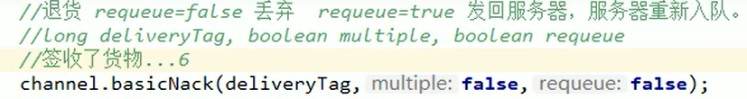


```java
@Service
@Slf4j
@RabbitListener(queues = "test_queue")
public class TestListener {
//    @RabbitListener(queues = "test_queue")
//    void receiveMessage(Object msg) {
//        log.info("收到消息内容:"+msg+"==>类型:"+msg.getClass());
//    }

//    @RabbitListener(queues = "test_queue")
//    void receiveMessage2(Message msg,OrderReturnReasonEntity orderReturnReasonEntity) {
//        byte[] body = msg.getBody();
//        MessageProperties messageProperties = msg.getMessageProperties();
//        log.info("收到消息内容:"+msg+"==>内容"+orderReturnReasonEntity);
//    }

//    @RabbitListener(queues = "test_queue")
    @RabbitHandler
    void receiveMessage3(Message msg,
                         OrderReturnReasonEntity orderReturnReasonEntity,
                         Channel channel) {
        System.out.println("接收到消息:---"+orderReturnReasonEntity);
        byte[] body = msg.getBody();
        MessageProperties messageProperties = msg.getMessageProperties();
        log.info("==>处理完成消息"+orderReturnReasonEntity.getName());

        long deliveryTag = messageProperties.getDeliveryTag();
//        public void basicNack(long deliveryTag,  //channel内按顺序自增
//        boolean multiple)                       //是否批量确认

        try {
            //debug模式无法模拟真实情况下的宕机,关闭了也会继续执行下去,这里模拟突然宕机部分消息未接到
            if(deliveryTag%2==0){
            channel.basicAck(deliveryTag,false);   //手动ack确认接收消息
            System.out.println("签收了货物---"+deliveryTag);
            }
        } catch (IOException e) {
            e.printStackTrace();
        }
    }

//    @RabbitHandler
//    void receiveMessage4(Message msg,
//                         OrderEntity orderEntity,
//                         Channel channel) {
        log.info("信道:"+channel);
        byte[] body = msg.getBody();
        MessageProperties messageProperties = msg.getMessageProperties();
//        log.info("==>内容"+orderEntity);
//    }
}
```


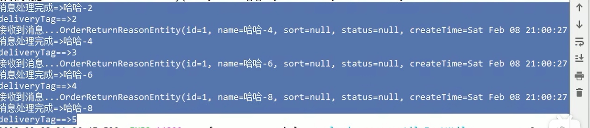


### 3.8.5.消息重试

spring-rabbitmq自带的retry，配置重试。

> **注意：**
>
> - 手动ack异常捕获会导致retry失效，想使用retry重试，必须是自动ack或者不是异常捕获的手动ack。
> - 重试也可以通过Redis或MySQL实现，例如Redis存消息的重试次数。

```bash
spring.rabbitmq.listener.simple.retry.enabled=true #是否开启消费者重试（为false时重试不生效）
spring.rabbitmq.listener.simple.retry.max-attempts=3  #最大重试次数（包含本身消费的1次）
spring.rabbitmq.listener.simple.retry.initial-interval=5000 #重试间隔时间（单位毫秒）
#重试次数超过上面的设置之后是否丢弃（false不丢弃时需要写相应代码将该消息加入死信队列）
spring.rabbitmq.listener.simple.default-requeue-rejected=false 
```


## 3.9.其他消息问题

### 3.9.1.消息丢失问题，使用手动ack解决

------

- 消息发送出去，由于网络问题没有抵达服务器
  - **做好容错方法（try-catch）**，发送消息可能会网络失败，失败后要有重试机制，可记录到数据库，采用定期扫描重发的方式；
  - 做好日志记录，每个消息状态是否都被服务器收到都应该记录；
  - 做好定期重发，如果消息没有发生成，定期去数据库扫描未成功的消息进行重发；
- 消息抵达Broker，Broker要将消息写入磁盘（持久化）才算成功。此时Broker尚未持久化完成，宕机
  - Publisher 也必须加入确认回调机制，确认成功的消息，修改数据库消息状态
- 自动ACK的状态下。消费者收到消息，但没来得及消费然后宕机
  - 一定开启手动ACK，消费成功才移除，失败或者没来得处理就noAck并重新入队

**解决办法：** 

1、做好消息确认机制（pulisher、consumer[**手动ACK]**）
 2、每一个发送的消息都在数据库做好记录。定期将失败的消息再次发送一遍 

### 3.9.2.消息重复问题，使用幂等性解决

------


 **消息重复**
 消息消费成功，事务已经提交，**ack时，机器宕机**，中间人以为消息没发成功，就重新发消息，导致消息重复问题。

导致没有ack成功Broker的消息重新由unack变为ready，并发送给其他消费者消息消费失败，由于**重试机制**，自动又将消息发送出去成功消费，ack时宕机，消息由unack变为ready，Broker又重新发送。

**解决办法：接口设计为幂等性的。**

消费者的业务消费接口应该设计为幂等性的。比如扣库存有工作单的状态标志使用防重表(redis/mysql)，**发送消息每一个都有业务的唯一标识存到redis里**，处理过就不用处
 rabbitMQ的每一个消息都有redelivered字段，可以获取是否是被重新投递过来的，而不是第一次投递过来的

### 3.9.3.消息积压问题，使用增加消费者、解决

------

常见消息积压问题： 

- 消费者宕机积压
- 消费者消费能力不足积压
- 发送者发送流量太大

**解决办法：**

上线**更多的消费者**，进行正常消费。
 上线专门的**队列消费服务**，将消息先批量取出来，记录数据库，离线慢慢处理


# 4. RabbitMQ管理界面操作介绍

## 4.1 OverView概述


## 4.2 Connection连接信息

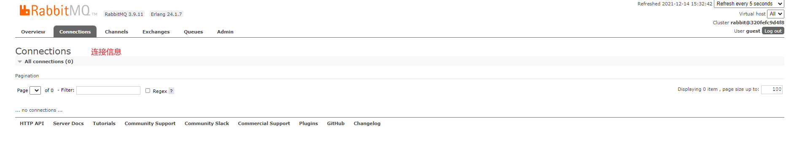

## 4.3 Admin用户信息

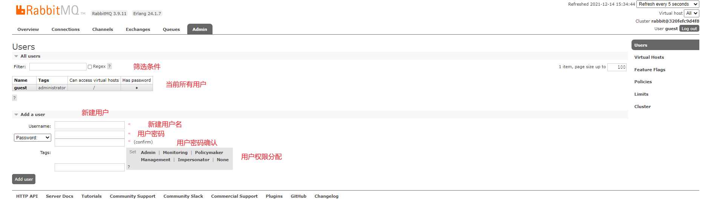

## 4.4 Queues队列信息

切换到“Queues”标签，可以查看队列信息，点击队列名称，可查看队列所有状态的消息数量和大小等统计信息

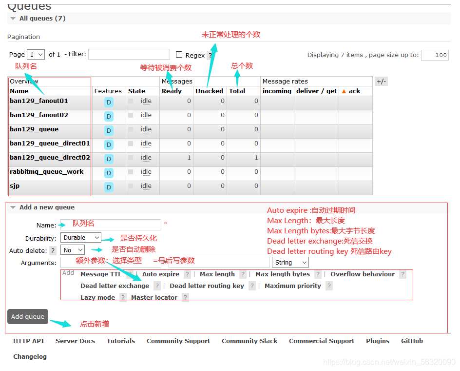

### 4.4.1 队列绑定交换机/发送消息

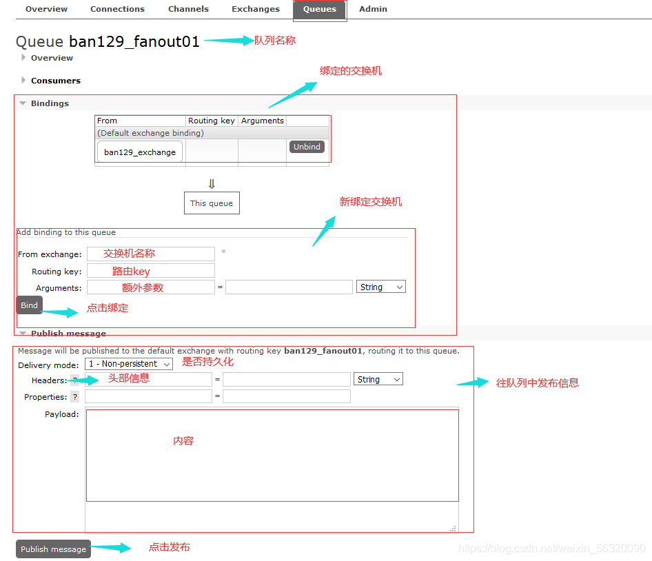

### 4.4.2 队列获取消息/删除队列/清空队列消息

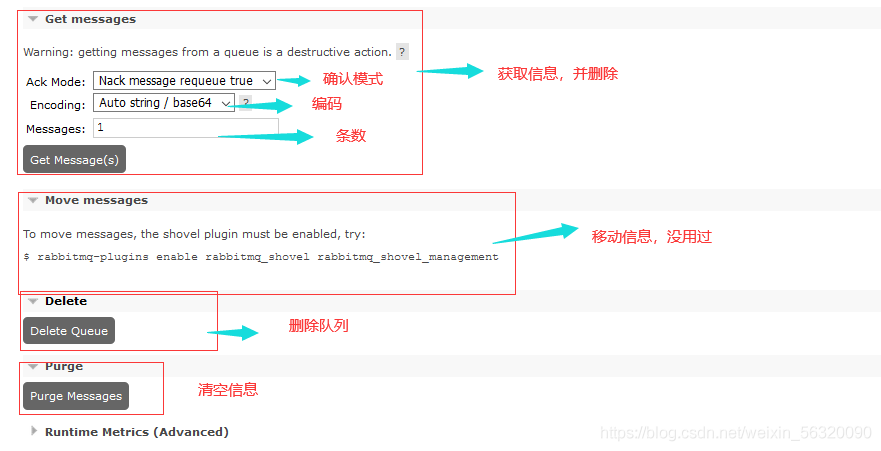

## 4.5 Exchanges交换机信息

切换到“Exchanges”标签，**可查看和管理交换器**，单击交换器名称，可查看到更多详细信息，比如**交换器绑定**，还可以**添加新的绑定**

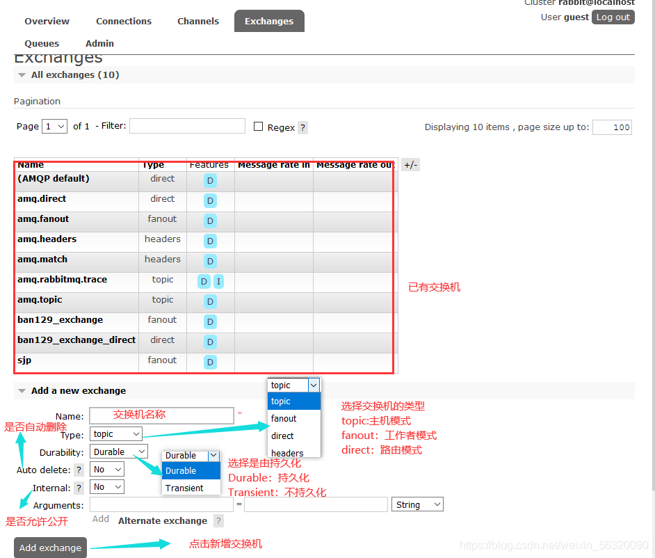

### 4.5.1 交换机绑定路由/删除交换机/发送消息

 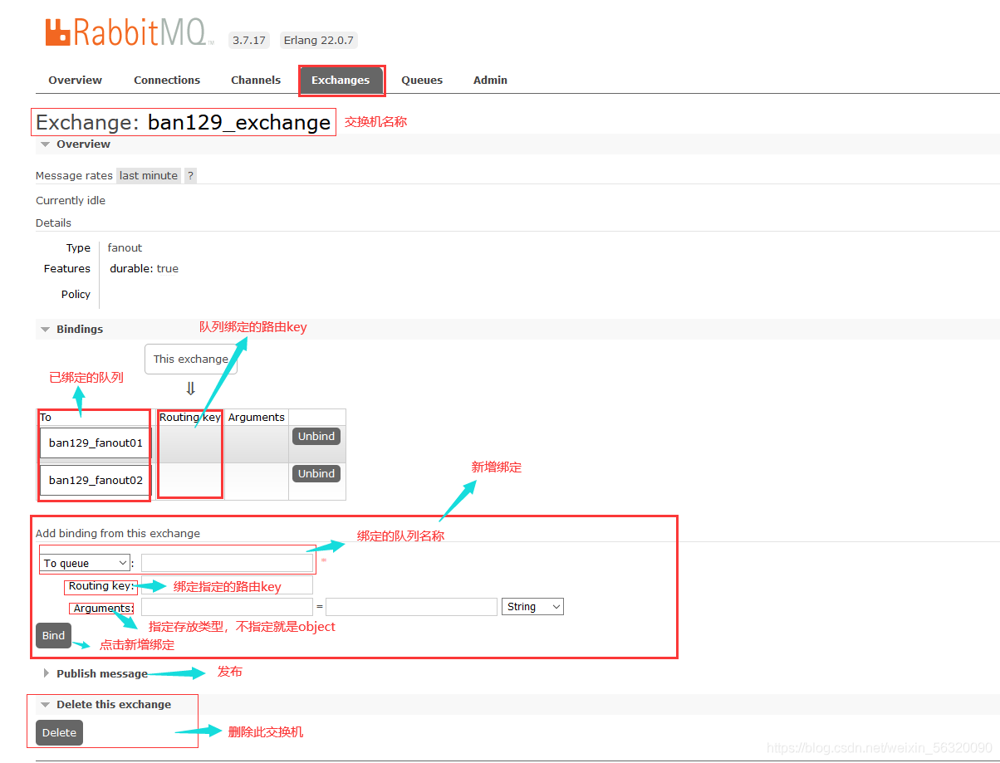


# 5. RabbitMQ延时队列(实现定时任务)

## 5.1 为什么不使用定时任务

**定时任务时效性问题：只能定期扫描，不能给任务直接添加存活时间。**

> **问题演示：**
>
> 预期订单超过30分钟自动关闭。
>
> 使用定时任务，每30分钟执行一次关闭订单任务， 任务刚执行完一分钟订单超时了，最后真正执行关闭订单任务时，这个订单其实存活了59分钟，与预期时间不符合。
>
> 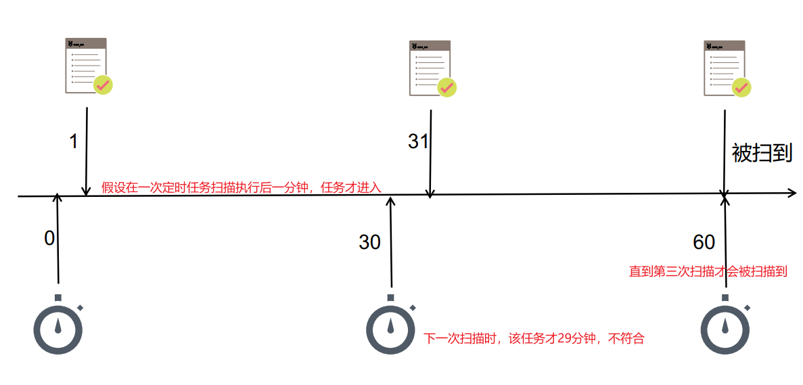


**场景：**比如未付款订单，超过一定时间后，系统自动取消订单并释放占有物品。

**常用解决方案**：spring的 schedule 定时任务轮询数据库 

**缺点**：消耗系统内存、增加了数据库的压力、存在较大的时间误差

**解决**：**rabbitmq的消息TTL和死信Exchange结合**


> ```java
> @SpringBootApplication
> //开启定时任务功能
> @EnableScheduling
> public class Springboot22TaskApplication {
>     public static void main(String[] args) {
>         SpringApplication.run(Springboot22TaskApplication.class, args);
>     }
> }
> ```
>
> 
>
> 
>
> ```java
> @Component
> public class MyBean {
>     @Scheduled(cron = "0/1 * * * * ?")
>     public void print(){
>         System.out.println(Thread.currentThread().getName()+" :spring task run...");
>     }
> }
> ```
>
> 
>
> ```bash
> spring:
>   task:
>    	scheduling:
>       pool:
>        	size: 1							 #任务调度线程池大小 默认 1
>       thread-name-prefix: ssm_      	 #调度线程名称前缀 默认 scheduling-      
>         shutdown:
>           await-termination: false		 #线程池关闭时等待所有任务完成
>           await-termination-period: 10s	 #调度线程关闭前最大等待时间，确保最后一定关闭
> ```
>
> 


## 5.2 消息的存活时间(TTL)

消息的TTL(**Time To Live)**就是消息的存活时间。

RabbitMQ可以对**队列和消息**分别**设置TTL。**

对队列设置存活时间，就是**队列没有消费者连着的保留时间**。

对每一个单独的消息单独的设置存活时间。超过了这个时间，我们认为这个**消息就死了**，称之为**死信**。

如果队列设置了TTL，消息也设置了，那么会取小的。所以一个消息如果被路由到不同的队列中，这个消息死亡的时间有可能不一样（不同的队列设置）。这里单讲单个消息的TTL，因为它才是实现延迟任务的关键。可以通过设置消息的expiration字段或者xmessage-ttl属性来设置时间，两者是一样的效果。

## 5.3 死信路由、死信交换机、延时队列

**死信路由** 

一个消息在成为死信后，会进**死信路由。**

> 记住这里是路由而不是队列，一**个路由可以对应很多队列**。（什么是死信）

**普通消息成为死信的条件：**死信将被路由到死信交换机、再路由到普通队列，普通队列发送消息给消费者。

- **被拒收的消息：**一个消息被Consumer拒收了，并且reject方法的参数里requeue是false。也就是说不会被再次放在队列里，被其他消费者使用。（basic.reject/ basic.nack）requeue=false
- **TTL到期的消息：**消息的TTL到了，消息过期了。
- **被队列丢弃的消息：**队列的长度限制满了。排在前面的消息会被丢弃或者扔到死信路由上


**死信交换机** 

**死信交换机**Dead Letter Exchange其实就是一种普通的exchange，和创建其他exchange没有两样。只是在某一个设置Dead Letter Exchange的队列中有**消息过期了**，会**自动触发消息的转发**，发送到**Dead Letter Exchange**中去。

**延时队列** 

先设置消息在TTL后变成死信，再设置队列里死信统一被路由到一个指定的交换机，那个指定的交换机专门处理死信，达成延时队列的效果。

手动ack&异常消息统一放在一个队列处理建议的两种方式

catch异常后，**手动发送到指定队列**，然后使用channel给rabbitmq确认消息已消费

给Queue绑定死信队列，使用nack（requque为false）确认消息消费失败

## 5.4 延时队列实现方法

### 5.4.1 队列设置过期时间

P生产者，X交换机，C消费者。

**流程：**

1. **配置类：**延时队列和交换机A绑定routing-key为“key1” ，普通队列和交换机A绑定routing-key为“key2”。延时队列设置了消息ttl为5min，设置死信交换机为“交换机B”，设置死信routing-key为“key2”。
2. 生产者发送消息给“交换机A”
3. “交换机A”根据“key1”路由到延时队列
4. 延时队列会根据配置类设置的ttl、key2和死信交换机B，把死信路由到死信交换机B、再路由到普通队列
5. 普通队列发送消息给消费者。

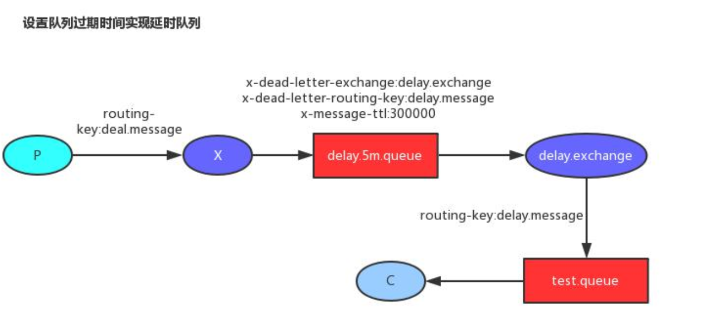

P是生产者，X是普通交换机， C是消费者。

### 5.4.2 消息设置过期时间


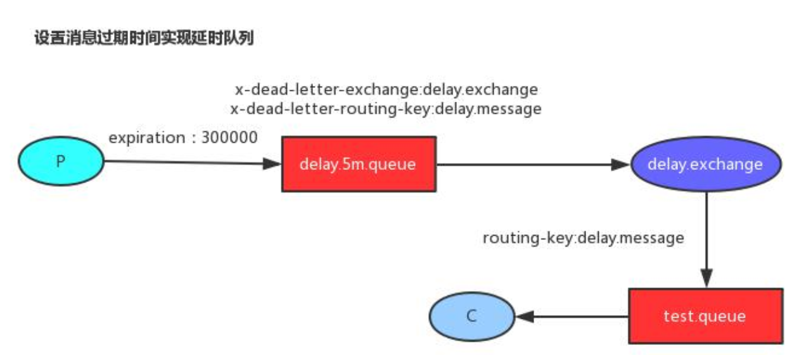

## 5.5 案例，延时队列定时关闭订单

### 5.5.1 思路，队列设置过期时间，实现延时队列

**基础版**

交换机与队列一对一,一台路由器路由一个队列

1. 配置类：延时队列和交换机A绑定routing-key为“key1” ，普通队列和交换机A绑定routing-key为“key2”。**延时队列**通过参数HashMap设置了消息ttl为5min、设置死信交换机为“交换机B”、设置死信路由routing-key为“key2”。
2. 生产者发送消息给“交换机A”
3. “交换机A”根据“key1”路由到延时队列
4. 延时队列会根据配置类设置的ttl、key2和死信交换机B，把TTL到期的死信，通过key2路由到死信交换机B、再路由到普通队列
5. 普通队列发送消息给消费者。


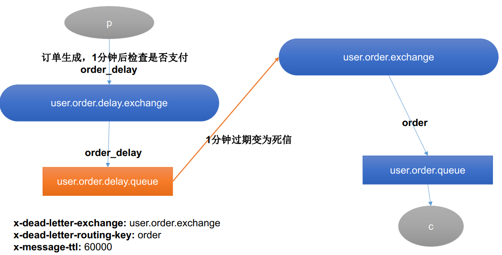

**升级版**

只需要一台交换机绑定多个队列。普通交换机和死信交换机合二为一。

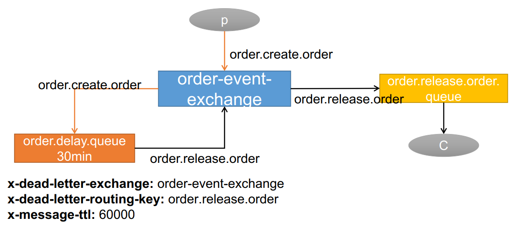

### 5.5.2 **创建队列,交换机,绑定**

容器中的Queue、Exchange、Binding 会自动创建（在RabbitMQ）不存在的情况下

- 1、第一次使用队列【监听】的时候才会创建
- 2、Broker没有队列、交换机才会创建


```java
/**
 * 创建队列，交换机，延迟队列，绑定关系 的configuration
 * 不会重复创建覆盖
 * 1、第一次使用队列【监听】的时候才会创建
 * 2、Broker没有队列、交换机才会创建
 */
@Configuration
public class MyRabbitMQConfig {

//    @RabbitHandler
//    public void listen(Message message){
//        System.out.println("收到消息:------>"+message);
//    }
    /**
     * 延时队列
     * @return
     */

    @Bean
    public Queue orderDelayQueue(){
        HashMap<String, Object> arguments = new HashMap<>();
        /**
         * x-dead-letter-exchange ：order-event-exchange 设置死信路由
         * x-dead-letter-routing-key : order.release.order 设置死信路由键
         * x-message-ttl ：60000
         */
        arguments.put("x-dead-letter-exchange","order-event-exchange");
        arguments.put("x-dead-letter-routing-key","order.release.order");
        arguments.put("x-message-ttl",30000);
 
        Queue queue = new Queue("order.delay.queue", true, false, false,arguments);
        return queue;
    }

    /**
     * 死信队列
     * @return
     */
    @Bean
    public Queue orderReleaseQueue(){
        Queue queue = new Queue("order.release.order.queue",true,false,false);
        return queue;
    }

    /**
     * 死信路由[普通路由]
     * @return
     */
    @Bean
    public Exchange orderEventExchange(){
        /*
         *   String name,
         *   boolean durable,
         *   boolean autoDelete,
         *   Map<String, Object> arguments
         * */
        TopicExchange topicExchange = new TopicExchange("order-event-exchange",true,false);

        return topicExchange;
    }

    /**
     * 交换机与延时队列的绑定
     * @return
     */
    @Bean
    public Binding orderCreateOrderBinding(){
        /*
         * String destination, 目的地（队列名或者交换机名字）
         * DestinationType destinationType, 目的地类型（Queue、Exhcange）
         * String exchange,
         * String routingKey,
         * Map<String, Object> arguments
         * */
        Binding binding = new Binding("order.delay.queue",
                Binding.DestinationType.QUEUE,
                "order-event-exchange",
                "order.create.order",
                null);
        return binding;
    }

    /**
     * 死信路由与普通死信队列的绑定
     * @return
     */
    @Bean
    public Binding orderReleaseOrderBinding(){
        Binding binding = new Binding("order.release.order.queue",
                Binding.DestinationType.QUEUE,
                "order-event-exchange",
                "order.release.order",
                null);
        return binding;
    }


}
```


### 5.5.3 发送和接收消息

> 发送消息
>
> gulimall-order/src/main/java/site/zhourui/gulimall/order/web/HelloController.java

```java
    @Autowired
    private RabbitTemplate rabbitTemplate;
    @ResponseBody
    @GetMapping(value = "/test/createOrder")
    public String createOrderTest() {

        //订单下单成功
        OrderEntity orderEntity = new OrderEntity();
        orderEntity.setOrderSn(UUID.randomUUID().toString());
        orderEntity.setModifyTime(new Date());

        //给MQ发送消息
        rabbitTemplate.convertAndSend("order-event-exchange","order.create.order",orderEntity);

        return "ok";
    }
```


> 接收消息
>
> gulimall-order/src/main/java/site/zhourui/gulimall/order/config/MyRabbitMQConfig.java

```java
    @RabbitListener(queues = "order.release.order.queue")
    public void listen(OrderEntity orderEntity, Channel channel, Message message) throws IOException {
        System.out.println("收到过期订单消息,准备关闭订单:------>"+orderEntity.getOrderSn());
        channel.basicNack(message.getMessageProperties().getDeliveryTag(),false,false);
    }
```


### 5.5.4 启动测试


> 队列

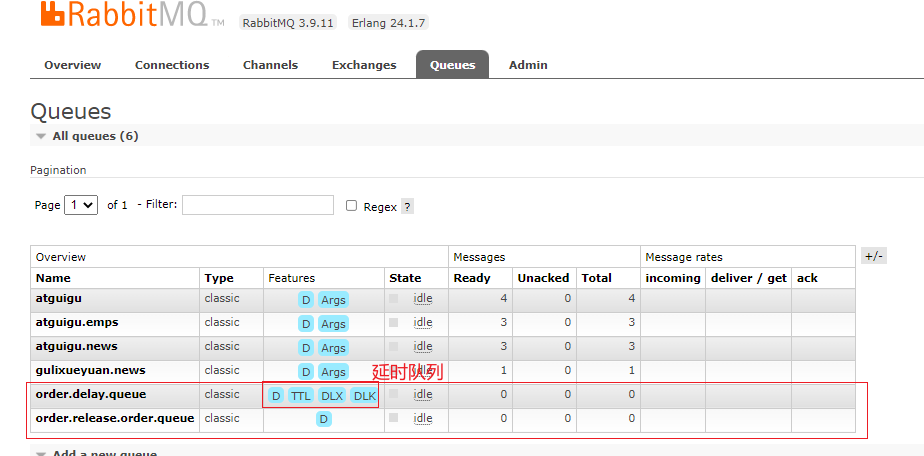

> 交换机

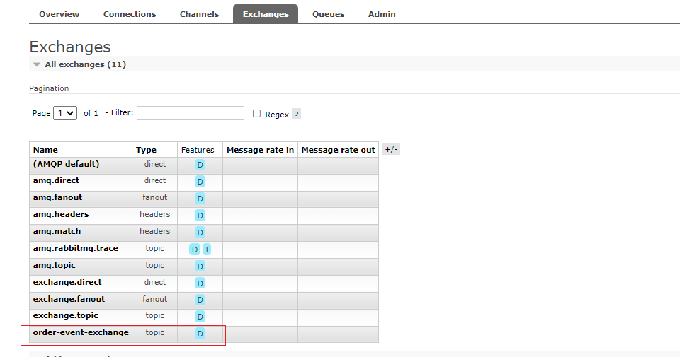

> 绑定关系

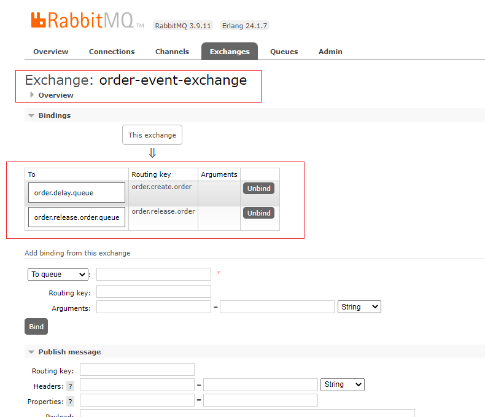

**测试**

> 向延时队列发送一条消息

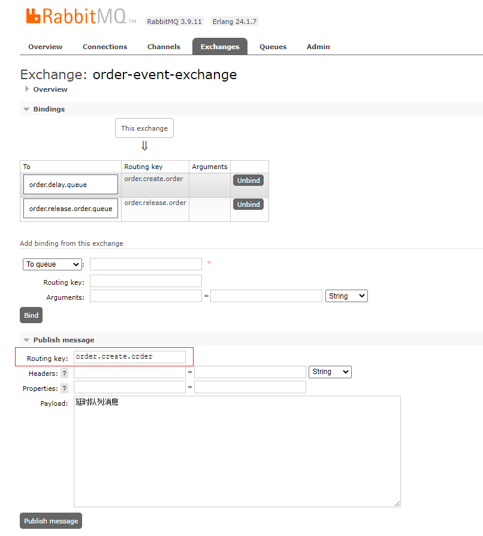

> 延时队列收到一条消息

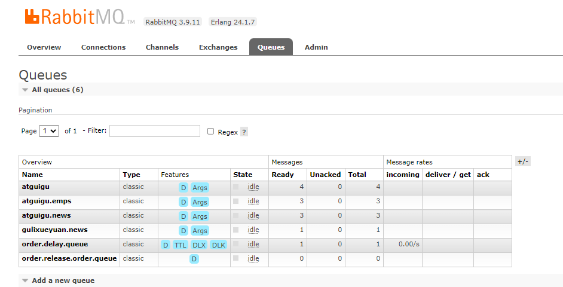

> 一分钟后该消息变为死信,再将该消息转发给死信队列

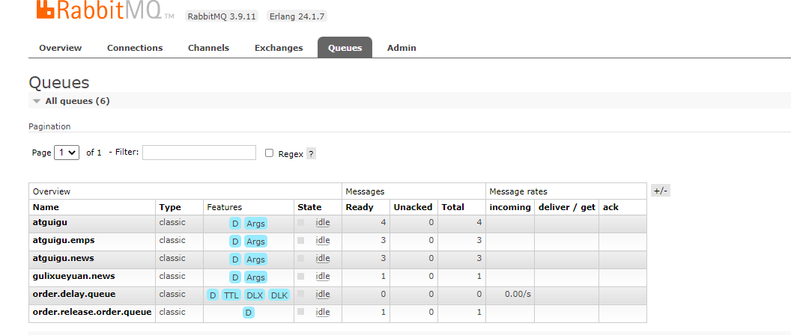

> 死信队列收到消息

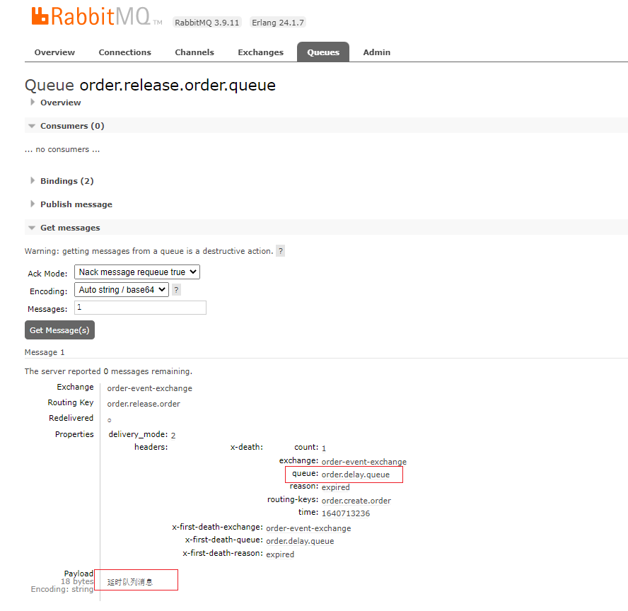