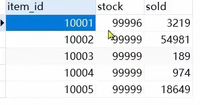
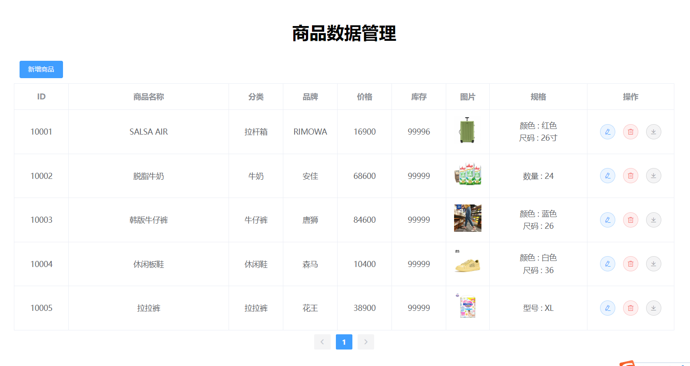
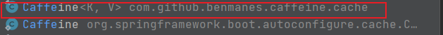
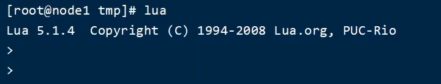
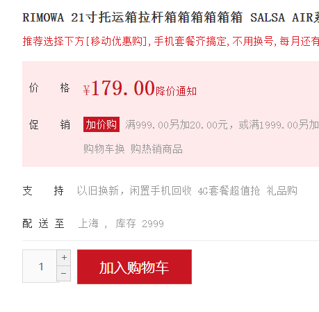
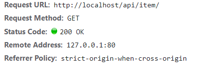
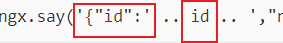

 

>  **导航：**
>
> [【Java笔记+踩坑汇总】Java基础+JavaWeb+SSM+SpringBoot+SpringCloud+瑞吉外卖/谷粒商城/学成在线+设计模式+面试题汇总+性能调优/架构设计+源码解析](https://blog.csdn.net/qq_40991313/article/details/126646289?csdn_share_tail={"type"%3A"blog"%2C"rType"%3A"article"%2C"rId"%3A"126646289"%2C"source"%3A"qq_40991313"})

[TOC]


# 多级缓存流程

**传统的缓存策略**一般是请求到达Tomcat后，先查询Redis，如果未命中则查询数据库，如图：


**存在下面的问题：**

**•请求要经过Tomcat处理，Tomcat的性能成为整个系统的瓶颈**

**•Redis缓存失效时，会对数据库产生冲击**

**多级缓存**就是充分利用请求处理的每个环节，**分别添加缓存，减轻Tomcat压力**，提升服务性能：

- 浏览器访问静态资源时，优先读取**浏览器本地缓存**
- 访问非静态资源（ajax查询数据）时，访问服务端
- 请求到达Nginx后，优先读取**Nginx本地缓存**
- 如果Nginx本地缓存未命中，则去直接**查询Redis（不经过Tomcat）**
- 如果Redis查询未命中，则**查询Tomcat**
- 请求进入Tomcat后，优先查询**JVM本地进程缓存（如Caffeine）**
- 如果JVM进程缓存未命中，则**查询数据库**


在多级缓存架构中，**Nginx内部需要编写本地缓存查询、Redis查询、Tomcat查询的业务逻辑**，因此这样的**nginx**服务不再是一个反向代理服务器，而是一个**编写业务的Web服务器**了。

因此这样的**业务Nginx服务**也需要**搭建集群**来提高并发，再有**专门的nginx服务来做反向代理**，如图：


另外，我们的Tomcat服务将来也会部署为集群模式：


可见，**多级缓存的关键有两个：**

- 一个是在**nginx中编写业务**，实现nginx本地缓存、Redis、Tomcat的查询
- 另一个就是在**Tomcat中实现JVM进程缓存**

其中Nginx编程则会用到OpenResty框架结合Lua这样的语言。

这也是今天课程的难点和重点。

# 2.JVM进程缓存

为了演示多级缓存的案例，我们先准备一个商品查询的业务。


为了演示多级缓存，我们**先导入一个商品管理的案例，其中包含商品的CRUD功能**。我们将来会给查询商品添加多级缓存。

## 2.1.docker安装MySQL

后期做数据同步需要用到MySQL的主从功能，所以需要大家在虚拟机中，利用Docker来运行一个MySQL容器。

### 2.1.1.准备目录

为了方便后期配置MySQL，我们先准备两个目录，用于挂载容器的数据和配置文件目录：

```bash
## 2.进入/tmp目录
cd /tmp
## 2.创建文件夹
mkdir mysql
## 2.进入mysql目录
cd mysql
```


### 2.1.2.创建mysql容器

进入mysql目录后，执行下面的Docker命令，**注意改端口和数据库账号密码**： 

```bash
docker run \
 -p 3306:3306 \
 --name mysql \
 -v $PWD/conf:/etc/mysql/conf.d \
 -v $PWD/logs:/logs \
 -v $PWD/data:/var/lib/mysql \
 -e MYSQL_ROOT_PASSWORD=123 \
 --privileged \
 -d \
 mysql:5.7.25
```


### 2.1.3.修改配置

在/tmp/mysql/conf目录添加一个my.cnf文件，作为mysql的配置文件：

```sql
## 2.创建文件
vi /tmp/mysql/conf/my.cnf
```


文件的内容如下：

```bash
[mysqld]
#跳过域名解析
skip-name-resolve    
character_set_server=utf8
#跟容器指定的数据目录名保持一致
datadir=/var/lib/mysql
#服务id
server-id=1000
```


### 2.1.4.重启

配置修改后，必须重启容器：

```
docker restart mysql
```


## 2.2.导入SQL

先创建heima数据库，导入sql： 

```sql
/*
 Navicat Premium Data Transfer

 Source Server         : 192.168.150.101
 Source Server Type    : MySQL
 Source Server Version : 50725
 Source Host           : 192.168.150.101:3306
 Source Schema         : heima

 Target Server Type    : MySQL
 Target Server Version : 50725
 File Encoding         : 65001

 Date: 16/08/2021 14:45:07
*/

SET NAMES utf8mb4;
SET FOREIGN_KEY_CHECKS = 0;

-- ----------------------------
-- Table structure for tb_item
-- ----------------------------
DROP TABLE IF EXISTS `tb_item`;
CREATE TABLE `tb_item`  (
  `id` bigint(20) NOT NULL AUTO_INCREMENT COMMENT '商品id',
  `title` varchar(264) CHARACTER SET utf8 COLLATE utf8_general_ci NOT NULL COMMENT '商品标题',
  `name` varchar(128) CHARACTER SET utf8 COLLATE utf8_general_ci NOT NULL DEFAULT '' COMMENT '商品名称',
  `price` bigint(20) NOT NULL COMMENT '价格（分）',
  `image` varchar(200) CHARACTER SET utf8 COLLATE utf8_general_ci NULL DEFAULT NULL COMMENT '商品图片',
  `category` varchar(200) CHARACTER SET utf8 COLLATE utf8_general_ci NULL DEFAULT NULL COMMENT '类目名称',
  `brand` varchar(100) CHARACTER SET utf8 COLLATE utf8_general_ci NULL DEFAULT NULL COMMENT '品牌名称',
  `spec` varchar(200) CHARACTER SET utf8 COLLATE utf8_general_ci NULL DEFAULT NULL COMMENT '规格',
  `status` int(1) NULL DEFAULT 1 COMMENT '商品状态 1-正常，2-下架，3-删除',
  `create_time` datetime NULL DEFAULT NULL COMMENT '创建时间',
  `update_time` datetime NULL DEFAULT NULL COMMENT '更新时间',
  PRIMARY KEY (`id`) USING BTREE,
  INDEX `status`(`status`) USING BTREE,
  INDEX `updated`(`update_time`) USING BTREE
) ENGINE = InnoDB AUTO_INCREMENT = 50002 CHARACTER SET = utf8 COLLATE = utf8_general_ci COMMENT = '商品表' ROW_FORMAT = COMPACT;

-- ----------------------------
-- Records of tb_item
-- ----------------------------
INSERT INTO `tb_item` VALUES (10001, 'RIMOWA 21寸托运箱拉杆箱 SALSA AIR系列果绿色 820.70.36.4', 'SALSA AIR', 16900, 'https://m.360buyimg.com/mobilecms/s720x720_jfs/t6934/364/1195375010/84676/e9f2c55f/597ece38N0ddcbc77.jpg!q70.jpg.webp', '拉杆箱', 'RIMOWA', '{\"颜色\": \"红色\", \"尺码\": \"26寸\"}', 1, '2019-05-01 00:00:00', '2019-05-01 00:00:00');
INSERT INTO `tb_item` VALUES (10002, '安佳脱脂牛奶 新西兰进口轻欣脱脂250ml*24整箱装*2', '脱脂牛奶', 68600, 'https://m.360buyimg.com/mobilecms/s720x720_jfs/t25552/261/1180671662/383855/33da8faa/5b8cf792Neda8550c.jpg!q70.jpg.webp', '牛奶', '安佳', '{\"数量\": 24}', 1, '2019-05-01 00:00:00', '2019-05-01 00:00:00');
INSERT INTO `tb_item` VALUES (10003, '唐狮新品牛仔裤女学生韩版宽松裤子 A款/中牛仔蓝（无绒款） 26', '韩版牛仔裤', 84600, 'https://m.360buyimg.com/mobilecms/s720x720_jfs/t26989/116/124520860/644643/173643ea/5b860864N6bfd95db.jpg!q70.jpg.webp', '牛仔裤', '唐狮', '{\"颜色\": \"蓝色\", \"尺码\": \"26\"}', 1, '2019-05-01 00:00:00', '2019-05-01 00:00:00');
INSERT INTO `tb_item` VALUES (10004, '森马(senma)休闲鞋女2019春季新款韩版系带板鞋学生百搭平底女鞋 黄色 36', '休闲板鞋', 10400, 'https://m.360buyimg.com/mobilecms/s720x720_jfs/t1/29976/8/2947/65074/5c22dad6Ef54f0505/0b5fe8c5d9bf6c47.jpg!q70.jpg.webp', '休闲鞋', '森马', '{\"颜色\": \"白色\", \"尺码\": \"36\"}', 1, '2019-05-01 00:00:00', '2019-05-01 00:00:00');
INSERT INTO `tb_item` VALUES (10005, '花王（Merries）拉拉裤 M58片 中号尿不湿（6-11kg）（日本原装进口）', '拉拉裤', 38900, 'https://m.360buyimg.com/mobilecms/s720x720_jfs/t24370/119/1282321183/267273/b4be9a80/5b595759N7d92f931.jpg!q70.jpg.webp', '拉拉裤', '花王', '{\"型号\": \"XL\"}', 1, '2019-05-01 00:00:00', '2019-05-01 00:00:00');

-- ----------------------------
-- Table structure for tb_item_stock
-- ----------------------------
DROP TABLE IF EXISTS `tb_item_stock`;
CREATE TABLE `tb_item_stock`  (
  `item_id` bigint(20) NOT NULL COMMENT '商品id，关联tb_item表',
  `stock` int(10) NOT NULL DEFAULT 9999 COMMENT '商品库存',
  `sold` int(10) NOT NULL DEFAULT 0 COMMENT '商品销量',
  PRIMARY KEY (`item_id`) USING BTREE
) ENGINE = InnoDB CHARACTER SET = utf8mb4 COLLATE = utf8mb4_general_ci ROW_FORMAT = COMPACT;

-- ----------------------------
-- Records of tb_item_stock
-- ----------------------------
INSERT INTO `tb_item_stock` VALUES (10001, 99996, 3219);
INSERT INTO `tb_item_stock` VALUES (10002, 99999, 54981);
INSERT INTO `tb_item_stock` VALUES (10003, 99999, 189);
INSERT INTO `tb_item_stock` VALUES (10004, 99999, 974);
INSERT INTO `tb_item_stock` VALUES (10005, 99999, 18649);

SET FOREIGN_KEY_CHECKS = 1;
```


其中包含两张表： 

- **tb_item：商品表**，包含商品的基本信息


- **tb_item_stock：商品库存表**，包含商品的库存信息




之所以**将库存分离出来**，是因为**库存是更新比较频繁**的信息，**写操作较多**。而**其他信息修改的频率非常低。频繁更新数据清除缓存就没有缓存意义了。**

## 2.3.导入Demo工程

下面导入课前资料提供的工程：


项目结构如图所示：


其中的业务包括：

- 分页查询商品
- 新增商品
- 修改商品
- 修改库存
- 删除商品
- 根据id查询商品
- 根据id查询库存

业务全部使用mybatis-plus来实现，如有需要请自行修改业务逻辑。

### 2.3.0.pom和yml

```XML
        <dependency>
            <groupId>org.springframework.boot</groupId>
            <artifactId>spring-boot-starter-web</artifactId>
        </dependency>
        <dependency>
            <groupId>mysql</groupId>
            <artifactId>mysql-connector-java</artifactId>
            <version>5.1.47</version>
        </dependency>
        <!--mybatis-->
        <dependency>
            <groupId>com.baomidou</groupId>
            <artifactId>mybatis-plus-boot-starter</artifactId>
            <version>3.4.2</version>
        </dependency>
        <dependency>
            <groupId>org.projectlombok</groupId>
            <artifactId>lombok</artifactId>
        </dependency>
        <dependency>
            <groupId>com.github.ben-manes.caffeine</groupId>
            <artifactId>caffeine</artifactId>
        </dependency>
        <dependency>
            <groupId>org.springframework.boot</groupId>
            <artifactId>spring-boot-starter-test</artifactId>
        </dependency>
```


```bash
server:
  port: 8081
spring:
  application:
    name: itemservice
  datasource:
    url: jdbc:mysql://自己的ip地址:3306/heima?useSSL=false
    username: root
    password: 自己的密码
    driver-class-name: com.mysql.jdbc.Driver
mybatis-plus:
  type-aliases-package: com.heima.item.pojo
  configuration:
    map-underscore-to-camel-case: true
  global-config:
    db-config:
#更新策略只更新非null，默认值
      update-strategy: not_null
#id策略自增
      id-type: auto
logging:
  level:
    com.heima: debug
  pattern:
    dateformat: HH:mm:ss:SSS
```


### 2.3.1.分页查询商品

在`com.heima.item.web`包的`ItemController`中可以看到接口定义：


### 2.3.2.新增商品

在`com.heima.item.web`包的`ItemController`中可以看到接口定义：


### 2.3.3.修改商品

在`com.heima.item.web`包的`ItemController`中可以看到接口定义：


### 2.3.4.修改库存

在`com.heima.item.web`包的`ItemController`中可以看到接口定义：


### 2.3.5.删除商品

在`com.heima.item.web`包的`ItemController`中可以看到接口定义：


这里是采用了逻辑删除，将商品状态修改为3

### 2.3.6.根据id查询商品

在`com.heima.item.web`包的`ItemController`中可以看到接口定义：


这里只返回了商品信息，不包含库存

### 2.3.7.根据id查询库存

在`com.heima.item.web`包的`ItemController`中可以看到接口定义：


### 2.3.8.启动

注意修改application.yml文件中配置的mysql地址信息：


需要修改为自己的虚拟机地址信息、还有账号和密码。

修改后，启动服务，访问：**http://localhost:8081/item/10001**即可查询数据

## 2.4.导入商品查询页面

商品查询是购物页面，与商品管理的页面是分离的。

部署方式如图：


我们需要准备一个反向代理的nginx服务器，如上图红框所示，将静态的商品页面放到nginx目录中。

页面需要的数据通过ajax向服务端（nginx业务集群）查询。

### 2.4.1.运行nginx服务

这里我已经给大家准备好了nginx反向代理服务器和静态资源。

我们找到课前资料的nginx目录：


将其拷贝到一个**非中文或空格目录下**，运行这个nginx服务。

运行命令：

```
start nginx.exe
```


然后访问 **http://localhost/item.html?id=10001**即可：


**管理端页面：**http://localhost:8081/ 




### 2.4.2.反向代理

**现在，页面是假数据展示的。**我们需要向服务器**发送ajax请求**，查询商品数据。

打开控制台，可以看到页面有发起ajax查询数据：


而这个**请求地址**同样是**80端口**，**而后台端口是8081端口**，所以**请求被当前的nginx反向代理了**。

查看nginx的conf目录下的nginx.conf文件的**反向代理配置：**


其中的关键配置如下：


其中的192.168.150.101是我的虚拟机IP，也就是我的Nginx业务集群要部署的地方：


完整内容如下：

```bash
#user  nobody;
worker_processes  1;

events {
    worker_connections  1024;
}

http {
    include       mime.types;
    default_type  application/octet-stream;

    sendfile        on;
    #tcp_nopush     on;
    keepalive_timeout  65;

#upstream指令可以定义一组服务器。默认是轮询算法，即几个服务器轮流工作
    upstream nginx-cluster{
#这个地址是虚拟机OpenResty的地址端口、OpenResty会在下面第四小节配置
        server 192.168.150.101:8081;
    }
    server {
        listen       80;
        server_name  localhost;

#反向代理并负载均衡配置，将请求转发到指定网址的服务器，这里写了upstream 定义的nginx-cluster集群，将在集群里的服务器之间轮询负载均衡
	location /api {
            proxy_pass http://nginx-cluster;
        }

        location / {
            root   html;
            index  index.html index.htm;
        }

        error_page   500 502 503 504  /50x.html;
        location = /50x.html {
            root   html;
        }
    }
}
```


## 2.5.Caffeine简介，本地缓存

缓存在日常开发中启动至关重要的作用，由于是存储在内存中，数据的读取速度是非常快的，能大量减少对数据库的访问，减少数据库的压力。我们把缓存分为两类：

- 分布式缓存

  ，例如Redis： 	

  - **优点：**存储容量更大、可靠性更好、可以在集群间共享
  - **缺点：**访问缓存有**网络开销**
  - **场景：缓存数据量较大、可靠性要求较高、需要在集群间共享**

- 进程本地缓存

  ，例如HashMap、GuavaCache： 

  - 优点：读取本地内存，没有网络开销，**速度更快**
  - 缺点：存储容量有限、可靠性较低、无法共享
  - **场景：性能要求较高，缓存数据量较小**

我们今天会利用Caffeine框架来实现JVM进程缓存。

**Caffeine**是一个基于Java8开发的，提供了近乎**最佳命中率**的高性能的**本地缓存库。**目前Spring内部的缓存使用的就是Caffeine。GitHub地址：https://github.com/ben-manes/caffeine

Caffeine的性能非常好，下图是官方给出的性能对比：


可以看到Caffeine的性能遥遥领先！

缓存使用的基本API：

```java
@Test
void testBasicOps() {
    // 构建cache对象
    Cache<String, String> cache = Caffeine.newBuilder().build();

    // 存数据
    cache.put("gf", "迪丽热巴");

    // 取数据
    String gf = cache.getIfPresent("gf");
    System.out.println("gf = " + gf);

    // 取数据，包含两个参数：
    // 参数一：缓存的key
    // 参数二：Lambda表达式，表达式参数就是缓存的key，方法体是查询数据库的逻辑
    // 优先根据key查询JVM缓存，如果未命中，则执行参数二的Lambda表达式
    String defaultGF = cache.get("defaultGF", key -> {    //这里key就是"defaultGF"，只是起别名
        // 根据key去数据库查询数据，这里省略数据库查询操作，直接返回
        return "柳岩";
    });
    System.out.println("defaultGF = " + defaultGF);
}
```


> **注意导包**，不是spring的包，是GitHub的包：
>
> 

Caffeine既然是缓存的一种，肯定需要有缓存的清除策略，不然的话内存总会有耗尽的时候。

Caffeine提供了**三种缓存驱逐策略：**

- **基于容量**：设置缓存的**数量上限**

  ```java
  // 创建缓存对象
  Cache<String, String> cache = Caffeine.newBuilder()
      .maximumSize(1) // 设置缓存数量上限为 1，只能存一个key，存第二个后，caffeine会找空闲时间或一次读写后清理
      .build();
  ```

  

- **基于时间**：设置缓存的有效时间

  ```
  // 创建缓存对象
  Cache<String, String> cache = Caffeine.newBuilder()
      // 设置缓存有效期为 10 秒，从最后一次写入开始计时 
      .expireAfterWrite(Duration.ofSeconds(10)) 
      .build();
  ```

  

- **基于引用**：设置缓存为软引用或弱引用，利用GC来回收缓存数据。性能较差，不建议使用。

> **注意**：在默认情况下，当**一个缓存元素过期的时候**，**Caffeine不会自动立即将其清理**和驱逐。而是**在一次读或写操作后**，或者**在空闲时间完**成对失效数据的驱逐。

## 2.6.实现**Caffeine的**JVM进程缓存

### 2.6.1.需求

利用Caffeine实现下列需求：

- 给根据id查询商品的业务添加缓存，缓存未命中时查询数据库
- 给根据id查询商品库存的业务添加缓存，缓存未命中时查询数据库
- **缓存初始大小为100**
- 缓存**上限为10000个**

### 2.6.2.实现

首先，我们需要定义两个Caffeine的缓存对象，**分别保存商品、库存的缓存数据**。

在item-service的`com.heima.item.**config**`**包**下定义`CaffeineConfig`类：

```java
package com.heima.item.config;

import com.github.benmanes.caffeine.cache.Cache;
import com.github.benmanes.caffeine.cache.Caffeine;
import com.heima.item.pojo.Item;
import com.heima.item.pojo.ItemStock;
import org.springframework.context.annotation.Bean;
import org.springframework.context.annotation.Configuration;

@Configuration
public class CaffeineConfig {

    @Bean
    public Cache<Long, Item> itemCache(){
        return Caffeine.newBuilder()
                .initialCapacity(100)    //初始的缓存空间大小
                .maximumSize(10_000)
                .build();
    }

    @Bean
    public Cache<Long, ItemStock> stockCache(){
        return Caffeine.newBuilder()
                .initialCapacity(100)
                .maximumSize(10_000)
                .build();
    }
}
```


然后，修改item-service中的`com.heima.item.web`包下的ItemController类，添加缓存逻辑：

```java
@RestController
@RequestMapping("item")
public class ItemController {

    @Autowired
    private IItemService itemService;
    @Autowired
    private IItemStockService stockService;

    @Autowired
    private Cache<Long, Item> itemCache;
    @Autowired
    private Cache<Long, ItemStock> stockCache;
    
    // ...其它略
    
    @GetMapping("/{id}")
    public Item findById(@PathVariable("id") Long id) {
        return itemCache.get(id, key -> itemService.query()
                .ne("status", 3).eq("id", key)
                .one()
        );
    }

    @GetMapping("/stock/{id}")
    public ItemStock findStockById(@PathVariable("id") Long id) {
        return stockCache.get(id, key -> stockService.getById(key));
    }
}
```


# 3.Lua语法入门

Nginx编程需要用到Lua语言，因此我们必须先入门Lua的基本语法。

## 3.1.初识Lua

Lua 是一种轻量小巧的**脚本语言**，用标准C语言编写并以源代码形式开放， 其**设计目的是为了嵌入应用程序中**，从而为应用程序提供灵活的扩展和定制功能。官网：https://www.lua.org/


Lua经常嵌入到C语言开发的程序中，例如游戏开发、游戏插件等。

Nginx本身也是C语言开发，因此也允许基于Lua做拓展。

## 3.1.HelloWorld

**CentOS7默认已经安装了Lua语言环境**，所以可以直接运行Lua代码。

1）在Linux虚拟机的任意目录下，新建一个hello.lua文件


2）添加下面的内容

```
print("Hello World!")  
```


3）运行


另外，还可以直接输入lua，**命令行模式：**




## 3.2.变量和循环

学习任何语言必然离不开变量，而变量的声明必须先知道数据的类型。

### 3.2.1.Lua的数据类型

Lua中支持的常见数据类型包括：


另外，Lua提供了**type()**函数来**判断一个变量的数据类型：**


### 3.2.2.声明变量

**字符串单引号双引号都可以，每个语句结束回车或空格即可，不用加“；”**

Lua声明变量的时候**无需指定数据类型**，而是用**local来声明**变量为**局部变量：**

```bash
-- 声明字符串，可以用单引号或双引号，
local str = 'hello'
-- 字符串拼接可以使用 ..
local str2 = 'hello' .. 'world'
-- 声明数字
local num = 21
-- 声明布尔类型
local flag = true
```


Lua中的**table类型既可以作为数组**，**又可以**作为Java中的**map**来使用。数组就是特殊的table，key是数组角标而已：

```bash
-- 声明数组 ，key为角标的 table
local arr = {'java', 'python', 'lua'}
-- 声明table，类似java的map
local map =  {name='Jack', age=21}
```


Lua中的**数组角标是从1开始**，访问的时候与Java中类似：

```
-- 访问数组，lua数组的角标从1开始
print(arr[1])
```


Lua中的table可以用**key来访问：**

```bash
-- 访问table
print(map['name'])
print(map.name)
```


### 3.2.3.循环

对于table，我们可以利用for循环来遍历。不过数组和普通table遍历略有差异。

**遍历数组：**

```bash
-- 声明数组 key为索引的 table
local arr = {'java', 'python', 'lua'}
-- 遍历数组
for index,value in ipairs(arr) do
    print(index, value) 
end
```


> **注意ipairs** 

**遍历普通table（map）**

```bash
-- 声明map，也就是table
local map = {name='Jack', age=21}
-- 遍历table
for key,value in pairs(map) do
   print(key, value) 
end
```


> **注意pairs** 

## 3.3.条件控制、函数

Lua中的条件控制和函数声明与Java类似。

### 3.3.1.函数

定义函数的语法：

```
function 函数名( argument1, argument2..., argumentn)
    -- 函数体
    return 返回值
end
```


例如，定义一个函数，用来打印数组：

```bash
function printArr(arr)
    for index, value in ipairs(arr) do
        print(value)
    end
end
```


### 3.3.2.条件控制

类似Java的条件控制，例如if、else语法：

```bash
if(布尔表达式)
then
   --[ 布尔表达式为 true 时执行该语句块 --]
else
   --[ 布尔表达式为 false 时执行该语句块 --]
end
```


与java不同，布尔表达式中的逻辑运算是基于英文单词：


### 3.3.3.案例，自定义函数判断数组参数是否为nil

需求：自定义一个函数，可以打印table，当参数为nil时，打印错误信息

```bash
function printArr(arr)
    if not arr then
        print('数组不能为空！')
    end
    for index, value in ipairs(arr) do
        print(value)
    end
end
```


# 4.实现多级缓存

多级缓存的实现离不开Nginx编程，而**Nginx编程又离不开OpenResty。**

## 4.1.安装OpenResty

### 4.1.0.OpenResty简介，基于Linux集成Lua库

OpenResty® 是一个基于 Nginx的**高性能 Web 平台**，用于方便地搭建能够处理超高并发、扩展性极高的动态 Web 应用、Web 服务和动态网关。具备下列特点：

- **基于Linux**，具备Nginx的完整功能
- **基于Lua语言进行扩展**，集成了大量精良的 **Lua 库**、第三方模块
- 允许**使用Lua自定义业务逻辑**、**自定义库**

官方网站：

```java
https://openresty.org/cn/
```


### 4.1.1.安装

首先你的Linux虚拟机必须联网

**1）安装依赖开发库**

首先要安装OpenResty的依赖开发库，执行命令：

```
yum install -y pcre-devel openssl-devel gcc --skip-broken
```


**2）安装OpenResty仓库**

你可以在你的 CentOS 系统中添加 `openresty` 仓库，这样就可以便于未来安装或更新我们的软件包（通过 `yum check-update` 命令）。运行下面的命令就可以添加我们的仓库：

```
yum-config-manager --add-repo https://openresty.org/package/centos/openresty.repo
```


如果提示说命令不存在，则运行：

```
yum install -y yum-utils 
```


然后再重复上面的命令

**3）安装OpenResty**

然后就可以像下面这样安装软件包，比如 `openresty`：

```
yum install -y openresty
```


**4）安装opm工具**

opm是OpenResty的一个管理工具，可以帮助我们安装一个第三方的Lua模块。

如果你想安装命令行工具 `opm`，那么可以像下面这样安装 `openresty-opm` 包：

```
yum install -y openresty-opm
```


**5）目录结构**

**默认**情况下，**OpenResty安装的目录是：/usr/local/openresty**


看到里面的nginx目录了吗，OpenResty就是在Nginx基础上集成了一些Lua模块。

**6）配置nginx的环境变量**

打开配置文件：

```
vi /etc/profile
```


在最下面加入两行：

```
export NGINX_HOME=/usr/local/openresty/nginx
export PATH=${NGINX_HOME}/sbin:$PATH
```


NGINX_HOME：后面是OpenResty安装目录下的nginx的目录

然后让配置生效：

```
source /etc/profile
```


### 4.1.2.启动和运行

OpenResty底层是基于Nginx的，查看OpenResty目录的nginx目录，结构与windows中安装的nginx基本一致：


所以运行方式与nginx基本一致：

```bash
### 启动nginx
nginx
### 重新加载配置
nginx -s reload
### 停止
nginx -s stop
```


nginx的默认配置文件注释太多，影响后续我们的编辑，这里将nginx.conf中的注释部分删除，保留有效部分。

修改`/usr/local/openresty/nginx/conf/**nginx.conf**`**文件**，**主要监听端口号从80改成8081**：

```bash
#user  nobody;
worker_processes  1;
error_log  logs/error.log;

events {
    worker_connections  1024;
}

http {
    include       mime.types;
    default_type  application/octet-stream;
    sendfile        on;
    keepalive_timeout  65;

    server {
        listen       8081;
        server_name  localhost;
        location / {
            root   html;
            index  index.html index.htm;
        }
        error_page   500 502 503 504  /50x.html;
        location = /50x.html {
            root   html;
        }
    }
}
```


在Linux的控制台输入命令以启动nginx：

```
nginx
```


然后访问页面：http://虚拟机ip地址:8081，注意ip地址替换为你自己的虚拟机IP：

### 4.1.3.备注

加载OpenResty的lua模块：

```bash
#lua 模块
lua_package_path "/usr/local/openresty/lualib/?.lua;;";
#c模块     
lua_package_cpath "/usr/local/openresty/lualib/?.so;;";  
```


common.lua

```bash
-- 封装函数，发送http请求，并解析响应
local function read_http(path, params)
    local resp = ngx.location.capture(path,{
        method = ngx.HTTP_GET,
        args = params,
    })
    if not resp then
        -- 记录错误信息，返回404
        ngx.log(ngx.ERR, "http not found, path: ", path , ", args: ", args)
        ngx.exit(404)
    end
    return resp.body
end
-- 将方法导出
local _M = {  
    read_http = read_http
}  
return _M
```


释放Redis连接API：

```bash
-- 关闭redis连接的工具方法，其实是放入连接池
local function close_redis(red)
    local pool_max_idle_time = 10000 -- 连接的空闲时间，单位是毫秒
    local pool_size = 100 --连接池大小
    local ok, err = red:set_keepalive(pool_max_idle_time, pool_size)
    if not ok then
        ngx.log(ngx.ERR, "放入redis连接池失败: ", err)
    end
end
```


读取Redis数据的API：

```bash
-- 查询redis的方法 ip和port是redis地址，key是查询的key
local function read_redis(ip, port, key)
    -- 获取一个连接
    local ok, err = red:connect(ip, port)
    if not ok then
        ngx.log(ngx.ERR, "连接redis失败 : ", err)
        return nil
    end
    -- 查询redis
    local resp, err = red:get(key)
    -- 查询失败处理
    if not resp then
        ngx.log(ngx.ERR, "查询Redis失败: ", err, ", key = " , key)
    end
    --得到的数据为空处理
    if resp == ngx.null then
        resp = nil
        ngx.log(ngx.ERR, "查询Redis数据为空, key = ", key)
    end
    close_redis(red)
    return resp
end
```


开启共享词典：

```bash
### 共享字典，也就是本地缓存，名称叫做：item_cache，大小150m
lua_shared_dict item_cache 150m; 
```


## 4.2.OpenResty快速入门

我们希望达到的多级缓存架构如图：


其中：

- windows上的nginx用来做反向代理服务，将前端的查询商品的ajax请求代理到OpenResty集群
- OpenResty集群用来编写多级缓存业务

### 4.2.1.反向代理流程

现在，商品详情页使用的是假的商品数据。不过在浏览器中，可以看到页面有发起ajax请求查询真实商品数据。

这个请求如下：


**请求**地址是localhost，端口是80，就被windows上安装的Nginx服务给接收到了。然后**代理给了虚拟机的OpenResty集群：**


我们需要在OpenResty中编写业务，查询商品数据并返回到浏览器。

但是这次，我们先在OpenResty接收请求，返回假的商品数据。

### 4.2.2.OpenResty监听请求、响应lua文件的JSON

OpenResty的很多功能都依赖于其目录下的Lua库，需要在nginx.conf中指定依赖库的目录，并导入依赖：

**1）添加对OpenResty的Lua模块的加载**

这些模块要加载进来才能用lua。 

修改虚拟机`/usr/local/openresty/nginx/conf/**nginx.conf**`文件，在其中的http下面，添加下面代码：

```bash
#lua 模块
lua_package_path "/usr/local/openresty/lualib/?.lua;;";
#c模块     
lua_package_cpath "/usr/local/openresty/lualib/?.so;;";  
```


**2）监听/api/item路径**

修改`/usr/local/openresty/nginx/conf/nginx.conf`文件，在nginx.conf的server下面，添加对/api/item这个路径的监听：

```bash
location  /api/item {
    # 默认的响应类型
    default_type application/json;
    # 响应结果由lua/item.lua文件来决定
    content_by_lua_file lua/item.lua;
}
```


这个监听，就类似于SpringMVC中的`@GetMapping("/api/item")`做路径映射。

而`content_by_lua_file lua/item.lua`则相当于调用item.lua这个文件，执行其中的业务，把结果返回给用户。相当于java中调用service。

**最终的nginx.conf文件：**

```bash
#user  nobody;
worker_processes  1;
error_log  logs/error.log;
 
events {
    worker_connections  1024;
}
 
http {
    include       mime.types;
    default_type  application/octet-stream;
    sendfile        on;
    keepalive_timeout  65;
	 #lua 模块
	lua_package_path "/usr/local/openresty/lualib/?.lua;;";
	#c模块     
	lua_package_cpath "/usr/local/openresty/lualib/?.so;;";  
    server {
        listen       8081;
        server_name  localhost;
        location / {
            root   html;
            index  index.html index.htm;
        }
        location  /api/item {
   		 # 默认的响应类型
	    default_type application/json;
	    # 响应结果由lua/item.lua文件来决定
	    content_by_lua_file lua/item.lua;
		}
        error_page   500 502 503 504  /50x.html;
        location = /50x.html {
            root   html;
        }
    }
}
```


### 4.2.3.**`openresty`**响应item.lua假数据

**1）在`/usr/local/openresty/nginx`目录创建文件夹：lua**

```bash
cd /usr/local/openresty/nginx
mkdir lua
```


**2）在`/usr/loca/openresty/nginx/lua`文件夹下，新建文件：item.lua**


```bash
cd lua
touch item.lua
```


> item.lua的路径和4.2.2里设置的响应lua文件路径一致。

 **3）编写item.lua，返回假数据**

item.lua中，利用**ngx.say()函数**返回数据到**Response**中

```bash
ngx.say('{"id":10001,"name":"SALSA AIR","title":"RIMOWA 21寸托运箱拉杆箱箱箱箱箱箱 SALSA AIR系列果绿色 820.70.36.4","price":17900,"image":"https://m.360buyimg.com/mobilecms/s720x720_jfs/t6934/364/1195375010/84676/e9f2c55f/597ece38N0ddcbc77.jpg!q70.jpg.webp","category":"拉杆箱","brand":"RIMOWA","spec":"","status":1,"createTime":"2019-04-30T16:00:00.000+00:00","updateTime":"2019-04-30T16:00:00.000+00:00","stock":2999,"sold":31290}')
```


> lua的 **ngx.say()函数**就相当于java中response.getWriter().writer(xxx);

**4）重新加载配置**

```
nginx -s reload
```


刷新商品页面：http://localhost/item.html?id=10001，即可看到效果：






## 4.3.OpenResty请求参数处理

上一节中，我们在OpenResty接收前端请求，但是返回的是假数据。

要返回真实数据，必须根据前端传递来的商品id，查询商品信息才可以。

那么如何获取前端传递的商品参数呢？

### 4.3.1.获取参数的API

OpenResty中提供了一些API用来获取不同类型的前端请求参数：


> **location后有个“~”符号，表示正则表达式匹配。**
>
> 除了JSON参数，其他请求参数类型都是数组或table类型，因为参数不止一个。 

### 4.3.2.lua获取参数中id并响应

在前端发起的ajax请求如图：


可以看到商品id是以路径占位符方式传递的，因此可以利用正则表达式匹配的方式来获取ID

**1）获取商品id**

修改`/usr/loca/openresty/nginx/**nginx.conf**`文件中监听/api/item的代码，利用正则表达式获取ID：

```
location ~ /api/item/(\d+) {
    # 默认的响应类型
    default_type application/json;
    # 响应结果由lua/item.lua文件来决定
    content_by_lua_file lua/item.lua;
}
```


> **注意：**
>
> - **location后有个“~”符号，表示正则表达式匹配。**
> -  虚拟机openresty的Nginx监听的是localhost的8081端口，正是项目的端口

**2）拼接ID并返回**

修改`/usr/loca/openresty/nginx/lua/item.lua`文件，获取id并拼接到结果中返回：

```
-- 获取商品id
local id = ngx.var[1]
-- 拼接并返回
ngx.say('{"id":' .. id .. ',"name":"SALSA AIR","title":"RIMOWA 21寸托运箱拉杆箱 SALSA AIR系列果绿色 820.70.36.4","price":17900,"image":"https://m.360buyimg.com/mobilecms/s720x720_jfs/t6934/364/1195375010/84676/e9f2c55f/597ece38N0ddcbc77.jpg!q70.jpg.webp","category":"拉杆箱","brand":"RIMOWA","spec":"","status":1,"createTime":"2019-04-30T16:00:00.000+00:00","updateTime":"2019-04-30T16:00:00.000+00:00","stock":2999,"sold":31290}')
```


>  **此时响应的结果仅id是真数据**
>
> 

**3）重新加载并测试**

运行命令以重新加载OpenResty配置：

```
nginx -s reload
```


刷新页面可以看到结果中已经带上了ID：


## 4.4.查询Tomcat

拿到商品ID后，本应去缓存中查询商品信息，不过目前我们还未建立nginx、redis缓存。因此，这里我们先根据商品id去tomcat查询商品信息。我们实现如图部分：


需要注意的是，我们的OpenResty是在虚拟机，Tomcat是在Windows电脑上。两者IP一定不要搞错了。


### 4.4.1.lua发送http请求的API

nginx提供了内部API用以**发送http请求：**

```
local resp = ngx.location.capture("/path",{
    method = ngx.HTTP_GET,   -- 请求方式
    args = {a=1,b=2},  -- get方式传参数
})
```


**返回的响应内容包括：**

- resp.status：响应状态码
- resp.header：响应头，是一个table
- resp.body：响应体，就是响应数据

**注意：**这里的path是路径，并不包含IP和端口。这个**/path请求会被nginx内部的server监听并处理。**

但是我们希望这个请求发送到Tomcat服务器，所以还需要在虚拟机nginx.conf编写一个server来**对这个路径做反向代理：**

```bash
 location /path {
     # 这里是windows电脑的ip和Java服务端口，需要确保windows防火墙处于关闭状态
     proxy_pass http://192.168.150.1:8081; 
 }
```


原理如图：


### 4.4.2.封装http工具

下面，我们封装一个发送Http请求的工具，基于ngx.location.capture来实现查询tomcat。

**1）添加反向代理，到windows的Java服务**

因为item-service中的接口都是/item开头，所以我们监听/item路径，代理到windows上的tomcat服务。

修改 `/usr/local/openresty/nginx/conf/nginx.conf`文件，添加一个location：

```
location /item {
    proxy_pass http://192.168.150.1:8081;
}
```


以后，只要我们调用`ngx.location.capture("/item")`，就一定能发送请求到windows的tomcat服务。

**2）封装工具类**

之前我们说过，OpenResty启动时会加载以下两个目录中的工具文件：


所以，自定义的http工具也需要放到这个目录下。

在`/usr/local/openresty/lualib`目录下，新建一个common.lua文件：

```
vi /usr/local/openresty/lualib/common.lua
```


内容如下:

```bash
-- 封装函数，发送http请求，并解析响应
local function read_http(path, params)
    local resp = ngx.location.capture(path,{
        method = ngx.HTTP_GET,
        args = params,
    })
    if not resp then
        -- 记录错误信息，返回404
        ngx.log(ngx.ERR, "http请求查询失败, path: ", path , ", args: ", args)
        ngx.exit(404)
    end
    return resp.body
end
-- 将方法导出
local _M = {  
    read_http = read_http
}  
return _M
```


这个工具将read_http函数封装到_M这个table类型的变量中，并且返回，这类似于导出。

使用的时候，可以利用`require('common')`来导入该函数库，这里的common是函数库的文件名。

**3）实现商品查询**

最后，我们修改`/usr/local/openresty/lua/item.lua`文件，利用刚刚封装的函数库实现对tomcat的查询：

```bash
-- 引入自定义common工具模块，返回值是common中返回的 _M
local common = require("common")
-- 从 common中获取read_http这个函数
local read_http = common.read_http
-- 获取路径参数
local id = ngx.var[1]
-- 根据id查询商品。第一个参数是路径，第二个参数是请求参数
local itemJSON = read_http("/item/".. id, nil)
-- 根据id查询商品库存
local itemStockJSON = read_http("/item/stock/".. id, nil)
```


这里查询到的结果是json字符串，并且包含商品、库存两个json字符串，页面最终需要的是把两个json拼接为一个json：


这就需要我们先把JSON变为lua的table，完成数据整合后，再转为JSON。

### 4.4.3.CJSON工具类

OpenResty提供了一个cjson的模块用来**处理JSON的序列化和反序列化。**

官方地址： https://github.com/openresty/lua-cjson/

**1）引入cjson模块：**

```
local cjson = require "cjson"
```


**2）序列化：**

```bash
local obj = {
    name = 'jack',
    age = 21
}
-- 把 table 序列化为 json
local json = cjson.encode(obj)
```


**3）反序列化：**

```bash
local json = '{"name": "jack", "age": 21}'
-- 反序列化 json为 table
local obj = cjson.decode(json);
print(obj.name)
```


### 4.4.4.实现Tomcat查询

下面，我们修改之前的item.lua中的业务，添加json处理功能：

```bash
-- 导入common函数库
local common = require('common')
local read_http = common.read_http
-- 导入cjson库
local cjson = require('cjson')

-- 获取路径参数
local id = ngx.var[1]
-- 根据id查询商品
local itemJSON = read_http("/item/".. id, nil)
-- 根据id查询商品库存
local itemStockJSON = read_http("/item/stock/".. id, nil)

-- JSON转化为lua的table
local item = cjson.decode(itemJSON)
local stock = cjson.decode(stockJSON)

-- 组合数据
item.stock = stock.stock
item.sold = stock.sold

-- 把item序列化为json 返回结果
ngx.say(cjson.encode(item))
```


### 4.4.5.基于ID负载均衡

刚才的代码中，我们的tomcat是单机部署。而实际开发中，tomcat一定是集群模式：


因此，OpenResty需要对tomcat集群做负载均衡。

而默认的负载均衡规则是轮询模式，当我们查询/item/10001时：

- 第一次会访问8081端口的tomcat服务，在该服务内部就形成了JVM进程缓存
- 第二次会访问8082端口的tomcat服务，该服务内部没有JVM缓存（因为JVM缓存无法共享），会查询数据库
- …

你看，因为轮询的原因，第一次查询8081形成的JVM缓存并未生效，直到下一次再次访问到8081时才可以生效，缓存命中率太低了。

怎么办？

如果能让同一个商品，每次查询时都访问同一个tomcat服务，那么JVM缓存就一定能生效了。

也就是说，我们需要根据商品id做负载均衡，而不是轮询。

**1）原理**

nginx提供了基于请求路径做负载均衡的算法：

nginx根据请求路径做hash运算，把得到的数值对tomcat服务的数量取余，余数是几，就访问第几个服务，实现负载均衡。

**例如：**

- 我们的请求路径是 /item/10001
- **tomcat总数为2台**（8081、8082）
- 对请求路径/item/1001做hash运算求余的结果为1
- 则访问第一个tomcat服务，也就是8081

只要id不变，每次hash运算结果也不会变，那就可以保证同一个商品，一直访问同一个tomcat服务，确保JVM缓存生效。

**2）实现**

修改`**/usr**/local/openresty/nginx/conf/**nginx.conf**`**文件**，实现基于ID做负载均衡。

首先，**定义tomcat集群**，并设置基于路径做负载均衡：

```bash
upstream tomcat-cluster {
    hash $request_uri;
    server 192.168.150.1:8081;
    server 192.168.150.1:8082;
}
```


然后，修改**对tomcat服务的反向代理**，目标指向**tomcat集群：**

```
location /item {
    proxy_pass http://tomcat-cluster;
}
```


重新加载OpenResty

```
nginx -s reload
```


**3）测试**

启动两台tomcat服务：


同时启动：


清空日志后，再次访问页面，可以看到不同id的商品，访问到了不同的tomcat服务：


## 4.5.Redis缓存预热

Redis缓存会面临冷启动问题：

**冷启动**：服务刚刚启动时，Redis中并没有缓存，如果所有商品数据都在第一次查询时添加缓存，可能会给数据库带来较大压力。

**缓存预热**：在实际开发中，我们可以利用大数据统计用户访问的热点数据，在项目启动时将这些热点数据提前查询并保存到Redis中。

我们数据量较少，并且没有数据统计相关功能，目前可以在启动时将所有数据都放入缓存中。

1）利用Docker安装Redis

```
docker run --name redis -p 6379:6379 -d redis redis-server --appendonly yes
```


2）在item-service服务中引入Redis依赖

```XML
<dependency>
    <groupId>org.springframework.boot</groupId>
    <artifactId>spring-boot-starter-data-redis</artifactId>
</dependency>
```


3）配置Redis地址

```
spring:
  redis:
    host: 192.168.150.101
```


4）编写初始化类

缓存预热需要在项目启动时完成，并且必须是拿到RedisTemplate之后。

这里我们利用InitializingBean接口来实现，因为InitializingBean可以在对象被Spring创建并且成员变量全部注入后执行。

```java
package com.heima.item.config;

import com.fasterxml.jackson.core.JsonProcessingException;
import com.fasterxml.jackson.databind.ObjectMapper;
import com.heima.item.pojo.Item;
import com.heima.item.pojo.ItemStock;
import com.heima.item.service.IItemService;
import com.heima.item.service.IItemStockService;
import org.springframework.beans.factory.InitializingBean;
import org.springframework.beans.factory.annotation.Autowired;
import org.springframework.data.redis.core.StringRedisTemplate;
import org.springframework.stereotype.Component;

import java.util.List;

@Component
public class RedisHandler implements InitializingBean {

    @Autowired
    private StringRedisTemplate redisTemplate;

    @Autowired
    private IItemService itemService;
    @Autowired
    private IItemStockService stockService;

    private static final ObjectMapper MAPPER = new ObjectMapper();

    @Override
    public void afterPropertiesSet() throws Exception {
        // 初始化缓存
        // 1.查询商品信息
        List<Item> itemList = itemService.list();
        // 2.放入缓存
        for (Item item : itemList) {
            // 2.1.item序列化为JSON
            String json = MAPPER.writeValueAsString(item);
            // 2.2.存入redis
            redisTemplate.opsForValue().set("item:id:" + item.getId(), json);
        }

        // 3.查询商品库存信息
        List<ItemStock> stockList = stockService.list();
        // 4.放入缓存
        for (ItemStock stock : stockList) {
            // 2.1.item序列化为JSON
            String json = MAPPER.writeValueAsString(stock);
            // 2.2.存入redis
            redisTemplate.opsForValue().set("item:stock:id:" + stock.getId(), json);
        }
    }
}
```


## 4.6.查询Redis缓存

现在，Redis缓存已经准备就绪，我们可以再OpenResty中实现查询Redis的逻辑了。如下图红框所示：


当请求进入OpenResty之后：

- 优先查询Redis缓存
- 如果Redis缓存未命中，再查询Tomcat

### 4.6.1.封装Redis工具

OpenResty提供了操作Redis的模块，我们只要引入该模块就能直接使用。但是为了方便，我们将Redis操作封装到之前的common.lua工具库中。

修改`/usr/local/openresty/lualib/common.lua`文件：

1）引入Redis模块，并初始化Redis对象

```bash
-- 导入redis
local redis = require('resty.redis')
-- 初始化redis
local red = redis:new()
red:set_timeouts(1000, 1000, 1000)
```


2）封装函数，用来释放Redis连接，其实是放入连接池

```bash
-- 关闭redis连接的工具方法，其实是放入连接池
local function close_redis(red)
    local pool_max_idle_time = 10000 -- 连接的空闲时间，单位是毫秒
    local pool_size = 100 --连接池大小
    local ok, err = red:set_keepalive(pool_max_idle_time, pool_size)
    if not ok then
        ngx.log(ngx.ERR, "放入redis连接池失败: ", err)
    end
end
```


3）封装函数，根据key查询Redis数据

```bash
-- 查询redis的方法 ip和port是redis地址，key是查询的key
local function read_redis(ip, port, key)
    -- 获取一个连接
    local ok, err = red:connect(ip, port)
    if not ok then
        ngx.log(ngx.ERR, "连接redis失败 : ", err)
        return nil
    end
    -- 查询redis
    local resp, err = red:get(key)
    -- 查询失败处理
    if not resp then
        ngx.log(ngx.ERR, "查询Redis失败: ", err, ", key = " , key)
    end
    --得到的数据为空处理
    if resp == ngx.null then
        resp = nil
        ngx.log(ngx.ERR, "查询Redis数据为空, key = ", key)
    end
    close_redis(red)
    return resp
end
```


4）导出

```bash
-- 将方法导出
local _M = {  
    read_http = read_http,
    read_redis = read_redis
}  
return _M
```


完整的common.lua：

```bash
-- 导入redis
local redis = require('resty.redis')
-- 初始化redis
local red = redis:new()
red:set_timeouts(1000, 1000, 1000)

-- 关闭redis连接的工具方法，其实是放入连接池
local function close_redis(red)
    local pool_max_idle_time = 10000 -- 连接的空闲时间，单位是毫秒
    local pool_size = 100 --连接池大小
    local ok, err = red:set_keepalive(pool_max_idle_time, pool_size)
    if not ok then
        ngx.log(ngx.ERR, "放入redis连接池失败: ", err)
    end
end

-- 查询redis的方法 ip和port是redis地址，key是查询的key
local function read_redis(ip, port, key)
    -- 获取一个连接
    local ok, err = red:connect(ip, port)
    if not ok then
        ngx.log(ngx.ERR, "连接redis失败 : ", err)
        return nil
    end
    -- 查询redis
    local resp, err = red:get(key)
    -- 查询失败处理
    if not resp then
        ngx.log(ngx.ERR, "查询Redis失败: ", err, ", key = " , key)
    end
    --得到的数据为空处理
    if resp == ngx.null then
        resp = nil
        ngx.log(ngx.ERR, "查询Redis数据为空, key = ", key)
    end
    close_redis(red)
    return resp
end

-- 封装函数，发送http请求，并解析响应
local function read_http(path, params)
    local resp = ngx.location.capture(path,{
        method = ngx.HTTP_GET,
        args = params,
    })
    if not resp then
        -- 记录错误信息，返回404
        ngx.log(ngx.ERR, "http查询失败, path: ", path , ", args: ", args)
        ngx.exit(404)
    end
    return resp.body
end
-- 将方法导出
local _M = {  
    read_http = read_http,
    read_redis = read_redis
}  
return _M
```


### 4.6.2.实现Redis查询

接下来，我们就可以去修改item.lua文件，实现对Redis的查询了。

查询逻辑是：

- 根据id查询Redis
- 如果查询失败则继续查询Tomcat
- 将查询结果返回

1）修改`/usr/local/openresty/lua/item.lua`文件，添加一个查询函数：

```bash
-- 导入common函数库
local common = require('common')
local read_http = common.read_http
local read_redis = common.read_redis
-- 封装查询函数
function read_data(key, path, params)
    -- 查询本地缓存
    local val = read_redis("127.0.0.1", 6379, key)
    -- 判断查询结果
    if not val then
        ngx.log(ngx.ERR, "redis查询失败，尝试查询http， key: ", key)
        -- redis查询失败，去查询http
        val = read_http(path, params)
    end
    -- 返回数据
    return val
end
```


2）而后修改商品查询、库存查询的业务：


3）完整的item.lua代码：

```bash
-- 导入common函数库
local common = require('common')
local read_http = common.read_http
local read_redis = common.read_redis
-- 导入cjson库
local cjson = require('cjson')

-- 封装查询函数
function read_data(key, path, params)
    -- 查询本地缓存
    local val = read_redis("127.0.0.1", 6379, key)
    -- 判断查询结果
    if not val then
        ngx.log(ngx.ERR, "redis查询失败，尝试查询http， key: ", key)
        -- redis查询失败，去查询http
        val = read_http(path, params)
    end
    -- 返回数据
    return val
end

-- 获取路径参数
local id = ngx.var[1]

-- 查询商品信息
local itemJSON = read_data("item:id:" .. id,  "/item/" .. id, nil)
-- 查询库存信息
local stockJSON = read_data("item:stock:id:" .. id, "/item/stock/" .. id, nil)

-- JSON转化为lua的table
local item = cjson.decode(itemJSON)
local stock = cjson.decode(stockJSON)
-- 组合数据
item.stock = stock.stock
item.sold = stock.sold

-- 把item序列化为json 返回结果
ngx.say(cjson.encode(item))
```


## 4.7.Nginx本地缓存

现在，整个多级缓存中只差最后一环，也就是nginx的本地缓存了。如图：


### 4.7.1.本地缓存API

OpenResty为Nginx提供了**shard dict**的功能，可以在nginx的多个worker之间共享数据，实现缓存功能。

1）开启共享字典，在nginx.conf的http下添加配置：

```bash
 # 共享字典，也就是本地缓存，名称叫做：item_cache，大小150m
 lua_shared_dict item_cache 150m; 
```


2）操作共享字典：

```bash
-- 获取本地缓存对象
local item_cache = ngx.shared.item_cache
-- 存储, 指定key、value、过期时间，单位s，默认为0代表永不过期
item_cache:set('key', 'value', 1000)
-- 读取
local val = item_cache:get('key')
```


### 4.7.2.实现本地缓存查询

1）修改`/usr/local/openresty/lua/item.lua`文件，修改read_data查询函数，添加本地缓存逻辑：

```bash
-- 导入共享词典，本地缓存
local item_cache = ngx.shared.item_cache

-- 封装查询函数
function read_data(key, expire, path, params)
    -- 查询本地缓存
    local val = item_cache:get(key)
    if not val then
        ngx.log(ngx.ERR, "本地缓存查询失败，尝试查询Redis， key: ", key)
        -- 查询redis
        val = read_redis("127.0.0.1", 6379, key)
        -- 判断查询结果
        if not val then
            ngx.log(ngx.ERR, "redis查询失败，尝试查询http， key: ", key)
            -- redis查询失败，去查询http
            val = read_http(path, params)
        end
    end
    -- 查询成功，把数据写入本地缓存
    item_cache:set(key, val, expire)
    -- 返回数据
    return val
end
```


2）修改item.lua中查询商品和库存的业务，实现最新的read_data函数：


其实就是多了缓存时间参数，过期后nginx缓存会自动删除，下次访问即可更新缓存。

这里给商品基本信息设置超时时间为30分钟，库存为1分钟。

因为库存更新频率较高，如果缓存时间过长，可能与数据库差异较大。

3）完整的item.lua文件：

```bash
-- 导入common函数库
local common = require('common')
local read_http = common.read_http
local read_redis = common.read_redis
-- 导入cjson库
local cjson = require('cjson')
-- 导入共享词典，本地缓存
local item_cache = ngx.shared.item_cache

-- 封装查询函数
function read_data(key, expire, path, params)
    -- 查询本地缓存
    local val = item_cache:get(key)
    if not val then
        ngx.log(ngx.ERR, "本地缓存查询失败，尝试查询Redis， key: ", key)
        -- 查询redis
        val = read_redis("127.0.0.1", 6379, key)
        -- 判断查询结果
        if not val then
            ngx.log(ngx.ERR, "redis查询失败，尝试查询http， key: ", key)
            -- redis查询失败，去查询http
            val = read_http(path, params)
        end
    end
    -- 查询成功，把数据写入本地缓存
    item_cache:set(key, val, expire)
    -- 返回数据
    return val
end

-- 获取路径参数
local id = ngx.var[1]

-- 查询商品信息
local itemJSON = read_data("item:id:" .. id, 1800,  "/item/" .. id, nil)
-- 查询库存信息
local stockJSON = read_data("item:stock:id:" .. id, 60, "/item/stock/" .. id, nil)

-- JSON转化为lua的table
local item = cjson.decode(itemJSON)
local stock = cjson.decode(stockJSON)
-- 组合数据
item.stock = stock.stock
item.sold = stock.sold

-- 把item序列化为json 返回结果
ngx.say(cjson.encode(item))
```


# 5.缓存同步

大多数情况下，浏览器查询到的都是缓存数据，如果缓存数据与数据库数据存在较大差异，可能会产生比较严重的后果。

所以我们必须保证数据库数据、缓存数据的一致性，这就是缓存与数据库的同步。

## 5.1.数据同步策略

缓存数据同步的常见方式有三种：

**设置有效期**：给缓存设置有效期，到期后自动删除。再次查询时更新

- 优势：简单、方便
- 缺点：时效性差，缓存过期之前可能不一致
- 场景：更新频率较低，时效性要求低的业务

**同步双写**：在修改数据库的同时，直接修改缓存

- 优势：时效性强，缓存与数据库强一致
- 缺点：有代码侵入，耦合度高；
- 场景：对一致性、时效性要求较高的缓存数据

**异步通知：**修改数据库时发送事件通知，相关服务监听到通知后修改缓存数据

- 优势：低耦合，可以同时通知多个缓存服务
- 缺点：时效性一般，可能存在中间不一致状态
- 场景：时效性要求一般，有多个服务需要同步

而异步实现又可以基于MQ或者Canal来实现：

1）基于MQ的异步通知：


解读：

- 商品服务完成对数据的修改后，只需要发送一条消息到MQ中。
- 缓存服务监听MQ消息，然后完成对缓存的更新

依然有少量的代码侵入。

2）基于Canal的通知


解读：

- 商品服务完成商品修改后，业务直接结束，没有任何代码侵入
- Canal监听MySQL变化，当发现变化后，立即通知缓存服务
- 缓存服务接收到canal通知，更新缓存

代码零侵入

## 5.2.安装Canal

### 5.2.1.认识Canal

**Canal [kə’næl]**，译意为水道/管道/沟渠，canal是阿里巴巴旗下的一款开源项目，基于Java开发。基于数据库增量日志解析，提供增量数据订阅&消费。GitHub的地址：https://github.com/alibaba/canal

Canal是基于mysql的主从同步来实现的，MySQL主从同步的原理如下：


- 1）MySQL master 将数据变更写入二进制日志( binary log），其中记录的数据叫做binary log events
- 2）MySQL slave 将 master 的 binary log events拷贝到它的中继日志(relay log)
- 3）MySQL slave 重放 relay log 中事件，将数据变更反映它自己的数据

而Canal就是把自己伪装成MySQL的一个slave节点，从而监听master的binary log变化。再把得到的变化信息通知给Canal的客户端，进而完成对其它数据库的同步。


### 5.2.2.安装Canal

安装和配置Canal参考课前资料文档：


## 5.3.监听Canal

Canal提供了各种语言的客户端，当Canal监听到binlog变化时，会通知Canal的客户端。


我们可以利用Canal提供的Java客户端，监听Canal通知消息。当收到变化的消息时，完成对缓存的更新。

不过这里我们会使用GitHub上的第三方开源的canal-starter客户端。地址：https://github.com/NormanGyllenhaal/canal-client

与SpringBoot完美整合，自动装配，比官方客户端要简单好用很多。

### 5.3.1.引入依赖：

```XML
<dependency>
    <groupId>top.javatool</groupId>
    <artifactId>canal-spring-boot-starter</artifactId>
    <version>1.2.1-RELEASE</version>
</dependency>
```


### 5.3.2.编写配置：

```bash
canal:
  destination: heima # canal的集群名字，要与安装canal时设置的名称一致
  server: 192.168.150.101:11111 # canal服务地址
```


### 5.3.3.修改Item实体类

通过@Id、@Column、等注解完成Item与数据库表字段的映射：

```java
package com.heima.item.pojo;

import com.baomidou.mybatisplus.annotation.IdType;
import com.baomidou.mybatisplus.annotation.TableField;
import com.baomidou.mybatisplus.annotation.TableId;
import com.baomidou.mybatisplus.annotation.TableName;
import lombok.Data;
import org.springframework.data.annotation.Id;
import org.springframework.data.annotation.Transient;

import javax.persistence.Column;
import java.util.Date;

@Data
@TableName("tb_item")
public class Item {
    @TableId(type = IdType.AUTO)
    @Id
    private Long id;//商品id
    @Column(name = "name")
    private String name;//商品名称
    private String title;//商品标题
    private Long price;//价格（分）
    private String image;//商品图片
    private String category;//分类名称
    private String brand;//品牌名称
    private String spec;//规格
    private Integer status;//商品状态 1-正常，2-下架
    private Date createTime;//创建时间
    private Date updateTime;//更新时间
    @TableField(exist = false)
    @Transient
    private Integer stock;
    @TableField(exist = false)
    @Transient
    private Integer sold;
}
```


### 5.3.4.编写监听器

通过实现`EntryHandler<T>`接口编写监听器，监听Canal消息。注意两点：

- 实现类通过`@CanalTable("tb_item")`指定监听的表信息
- EntryHandler的泛型是与表对应的实体类

```java
package com.heima.item.canal;

import com.github.benmanes.caffeine.cache.Cache;
import com.heima.item.config.RedisHandler;
import com.heima.item.pojo.Item;
import org.springframework.beans.factory.annotation.Autowired;
import org.springframework.stereotype.Component;
import top.javatool.canal.client.annotation.CanalTable;
import top.javatool.canal.client.handler.EntryHandler;

@CanalTable("tb_item")
@Component
public class ItemHandler implements EntryHandler<Item> {

    @Autowired
    private RedisHandler redisHandler;
    @Autowired
    private Cache<Long, Item> itemCache;

    @Override
    public void insert(Item item) {
        // 写数据到JVM进程缓存
        itemCache.put(item.getId(), item);
        // 写数据到redis
        redisHandler.saveItem(item);
    }

    @Override
    public void update(Item before, Item after) {
        // 写数据到JVM进程缓存
        itemCache.put(after.getId(), after);
        // 写数据到redis
        redisHandler.saveItem(after);
    }

    @Override
    public void delete(Item item) {
        // 删除数据到JVM进程缓存
        itemCache.invalidate(item.getId());
        // 删除数据到redis
        redisHandler.deleteItemById(item.getId());
    }
}
```


在这里对Redis的操作都封装到了RedisHandler这个对象中，是我们之前做缓存预热时编写的一个类，内容如下：

```java
package com.heima.item.config;

import com.fasterxml.jackson.core.JsonProcessingException;
import com.fasterxml.jackson.databind.ObjectMapper;
import com.heima.item.pojo.Item;
import com.heima.item.pojo.ItemStock;
import com.heima.item.service.IItemService;
import com.heima.item.service.IItemStockService;
import org.springframework.beans.factory.InitializingBean;
import org.springframework.beans.factory.annotation.Autowired;
import org.springframework.data.redis.core.StringRedisTemplate;
import org.springframework.stereotype.Component;

import java.util.List;

@Component
public class RedisHandler implements InitializingBean {

    @Autowired
    private StringRedisTemplate redisTemplate;

    @Autowired
    private IItemService itemService;
    @Autowired
    private IItemStockService stockService;

    private static final ObjectMapper MAPPER = new ObjectMapper();

    @Override
    public void afterPropertiesSet() throws Exception {
        // 初始化缓存
        // 1.查询商品信息
        List<Item> itemList = itemService.list();
        // 2.放入缓存
        for (Item item : itemList) {
            // 2.1.item序列化为JSON
            String json = MAPPER.writeValueAsString(item);
            // 2.2.存入redis
            redisTemplate.opsForValue().set("item:id:" + item.getId(), json);
        }

        // 3.查询商品库存信息
        List<ItemStock> stockList = stockService.list();
        // 4.放入缓存
        for (ItemStock stock : stockList) {
            // 2.1.item序列化为JSON
            String json = MAPPER.writeValueAsString(stock);
            // 2.2.存入redis
            redisTemplate.opsForValue().set("item:stock:id:" + stock.getId(), json);
        }
    }

    public void saveItem(Item item) {
        try {
            String json = MAPPER.writeValueAsString(item);
            redisTemplate.opsForValue().set("item:id:" + item.getId(), json);
        } catch (JsonProcessingException e) {
            throw new RuntimeException(e);
        }
    }

    public void deleteItemById(Long id) {
        redisTemplate.delete("item:id:" + id);
    }
}
```

