>  **导航：**
>
> [谷粒商城笔记+踩坑汇总篇](https://blog.csdn.net/qq_40991313/article/details/127099139?spm=1001.2014.3001.5501)
>
>  **Java笔记汇总：**
>
> [【Java笔记+踩坑汇总】Java基础+JavaWeb+SSM+SpringBoot+SpringCloud+瑞吉外卖/谷粒商城/学成在线+设计模式+面试题汇总+性能调优/架构设计+源码解析-CSDN博客](https://blog.csdn.net/qq_40991313/article/details/126646289)

[TOC]


# 1、商城系统简介

> 我们的商城系统本应该也是[前后端分离](https://so.csdn.net/so/search?q=前后端分离&spm=1001.2101.3001.7020)的，就像后台管理系统那样，然而出于教学考虑，前后端分离的话就会屏蔽掉很多细节，所以我们进行**服务端的页面渲染式开发**（有点儿类似[freemarker](https://so.csdn.net/so/search?q=freemarker&spm=1001.2101.3001.7020)）

**动静分离：**nginx在后面部署的时候，我们可以将微服务中的页面的**静态资源部署到nginx中。**分担微服务的压力。

**静指的是：**图片、js、css等静态资源（以实际文件存在的方式）

**每一个微服务只来管理自己的页面**，最终做到**每一个微服务都可以独立部署、运行、升级**。

**每个微服务都是独立自治的**，每一个微服务的数据库、技术都是自治的。不一定商品服务用java开发，用php、js都可以，无论是从技术层面、架构层面还是业务都是独立自治的。


用户先访问Nginx，Nginx反向代理将请求转发到网关，网关路由到各个服务。网关可以请求路由、鉴权认证、限流等。
 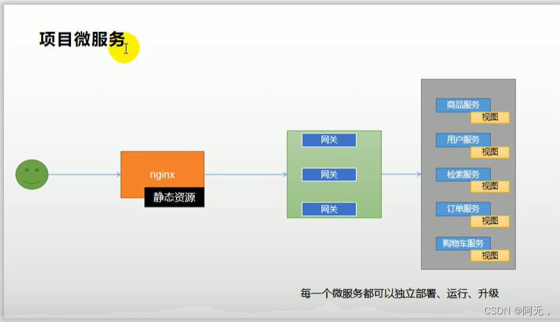​编辑

# 2、模板技术

## 2.1、介绍 

**模板技术：**把页面中的静态数据替换成从后台数据库中的数据。

这种操作用jsp就可以实现。但是Spring boot 的架构不推荐使用Jsp，而且支持也不好，所以如果你是用springboot的话，一般使用[Freemarker](https://so.csdn.net/so/search?q=Freemarker&spm=1001.2101.3001.7020)或者Thymeleaf 。

Thymeleaf模板引擎是自然化语言，编写的页面前端可以直接使用。 

## 2.2、模板技术与前端框架的区别 

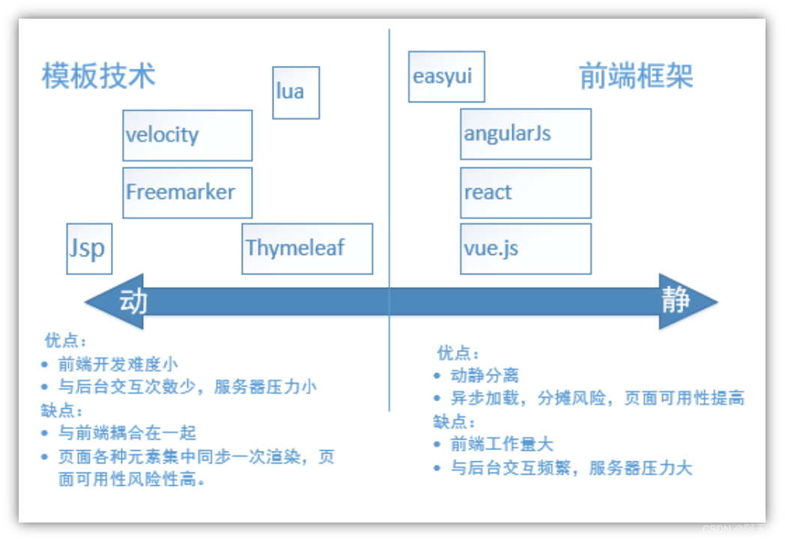


# 3、整合thymeleaf渲染商城首页

## 3.1、环境准备 

### 3.1.1、【商品模块】导入thymeleaf和热部署依赖

```XML
<!--        页面渲染我们使用thymeleaf，这应该和freemarker是差不多的，都是模板引擎-->
<!--        优点：它是一个自然化语言，编写的语言前端可以直接使用，方便前后人员的分工合作-->
<!--        缺点：性能比其他模板引擎要低一点，但是我们在生产环境开启了它的缓存功能，性能也是很高的-->
        <dependency>
            <groupId>org.springframework.boot</groupId>
            <artifactId>spring-boot-starter-thymeleaf</artifactId>
        </dependency>
<!--热部署-->
        <dependency>
            <groupId>org.springframework.boot</groupId>
            <artifactId>spring-boot-devtools</artifactId>
            <optional>true</optional>
        </dependency>
```


### 3.1.2、静态资源添加到商品模块

将静态资源复制到static下，index.html要复制到templates下。

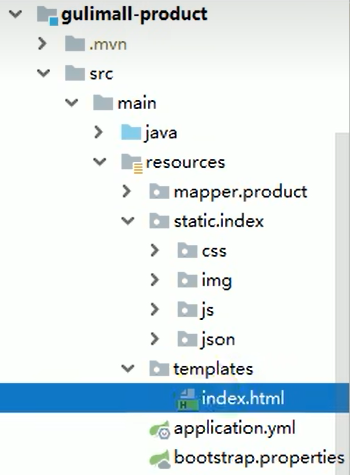

### 3.1.3、controller包改名为app、新增web包 

将controller包改名为app，新增web包。以后所有rest接口从app包提供，所有controller从web包提供。

web包下的controller是返回给thymeleaf的，它默认的前缀和后缀分别是`classpath:/templates/`和`.html`，springboot访问项目的时候自动会找index.html

### 3.1.4、yml关闭thymeleaf缓存 

```bash
# 关闭thymeleaf缓存，以便于修改代码后刷新页面能看出修改
spring:
  thymeleaf:
    cache: false
```


### 3.1.5、启动测试

启动商品模块，可以发现所有静态资源都是可以访问的。springboot默认访问index.html。

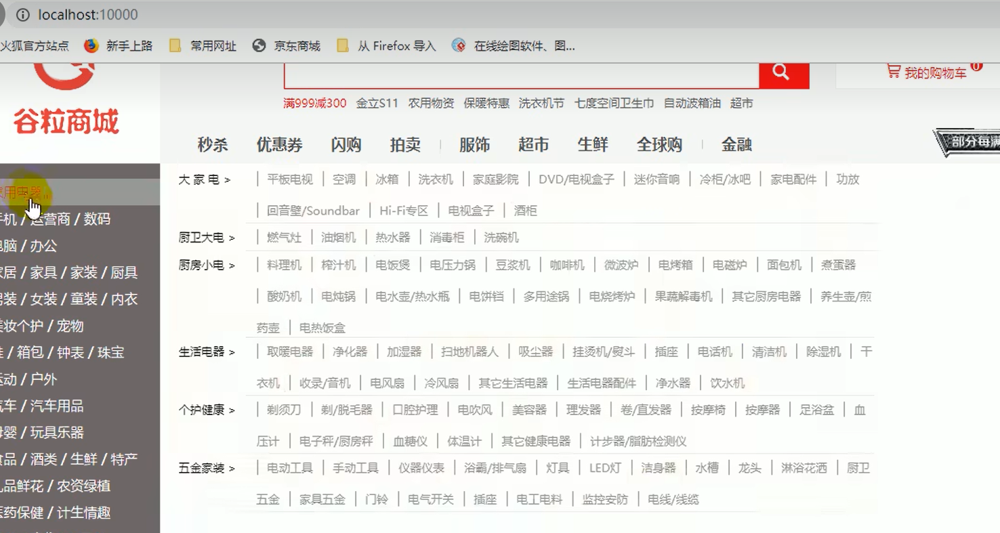

## 3.2、controller开发首页跳转功能，拦截首页请求处理后跳转到首页


商品模块新增gulimall/product/web/IndexController.java

```java
package xx.xx.gulimall.product.web;

@Controller
public class IndexController {
    @Autowired
    CategoryService categoryService;

    @GetMapping({"/","index.html"})
//参数是springMvc提供的接口，Model类，给这个类的对象里放的数据就会存到页面请求域中
    public String indexPage(Model model){    //传参Model类
        // TODO 1、查出所有1级分类
        List<CategoryEntity> categoryEntitys = categoryService.getLevel1Categorys();
        model.addAttribute("categories",categoryEntities);
//视图解析器进行拼串，前缀classpath:/templates/返回值.html
        return "index";    //相当于return "classpath:/templates/index.html"; 拦截GetMapping路径后转到首页
    }
}
```


## 3.3、service，查询一级目录列表

> gulimall-product/src/main/java/site/zhourui/gulimall/product/service/CategoryService.java
>
> 新增接口

```java
    List<CategoryEntity> getLevel1Categorys();
```


> gulimall-product/src/main/java/site/zhourui/gulimall/product/service/impl/CategoryServiceImpl.java
>
> 实现新增接口

```java
  /**
     * 查询一级分类。
     * 父ID是0， 或者  层级是1
     */
    @Override
    public List<CategoryEntity> getLevel1Categorys() {
        System.out.println("调用了 getLevel1Categorys  查询了数据库........【一级分类】");
        return baseMapper.selectList(new QueryWrapper<CategoryEntity>().eq("parent_cid", 0));
    }
```


## 3.4、thymeleaf基础语法，渲染商城首页一级分类


> 首先，html标签上加上thymeleaf命名空间**xmlns:th="http://www.thymeleaf.org"**，加上命名空间后就能用thymeleaf的语法：

```html
<html lang="en" xmlns:th="http://www.thymeleaf.org">
```


> 遍历IndexController 传过来的categorys

```html
       <div class="header_main_left">
          <ul>
            <li th:each=" category : ${categorys}">
              <a href="http://search.gulimall.com/" class="header_main_left_a" th:attr="ctg-data=${category.catId}">
<b th:text="${category.name}">家用电器</b></a>
            </li>
          </ul>

        </div>
```


> | 表达式名字 | 语法     | 用途                               |
> | ---------- | -------- | ---------------------------------- |
> | 变量取值   | `${...}` | 获取请求域、session 域、对象等值   |
> | 选择变量   | `*{...}` | 获取上下文对象值                   |
> | 消息       | `#{...}` | 获取国际化等值                     |
> | 链接       | `@{...}` | 生成链接                           |
> | 片段表达式 | `~{...}` | jsp:include 作用，引入公共页面片段 |
>
> 
>
> **th 属性**
>  html 有的属性，Thymeleaf 基本都有，而常用的属性大概有七八个，其中 th 属性执行的优先级从 1~8，数字越低优先级越高
>
> - **th:text ：**设置当前元素的文本内容，相同功能的还有 th:utext，两者的区别在于前者不会转义 html 标签，后者会。优先级不高：order=7
> - th:value：设置当前元素的 value 值，类似修改指定属性的还有 th:src，th:href。优先级不高：order=6
> - **th:each：**遍历循环元素，和 th:text 或 th:value 一起使用。注意该属性修饰的标签位置，详细往后看。优先级很高：order=2
> - th:if：条件判断，类似的还有 th:unless，th:switch，th:case。优先级较高：order=3
> - th:insert：代码块引入，类似的还有 th:replace，th:include，三者的区别较大，若使用不恰当会破坏 html 结构，常用于公共代码块提取的场景。优先级最高：order=1
> - th:fragment：定义代码块，方便被 th:insert 引用。优先级最低：order=8
> - th:object：声明变量，一般和*{}一起配合使用，达到偷懒的效果。优先级一般：order=4
> - **th:attr：**修改任意属性，实际开发中用的较少，因为有丰富的其他 th 属性帮忙，类似的还有 th:attrappend，th:attrprepend。优先级一般：order=5

> 重启商品服务
>
> 一级目录变为数据库查询出的目录

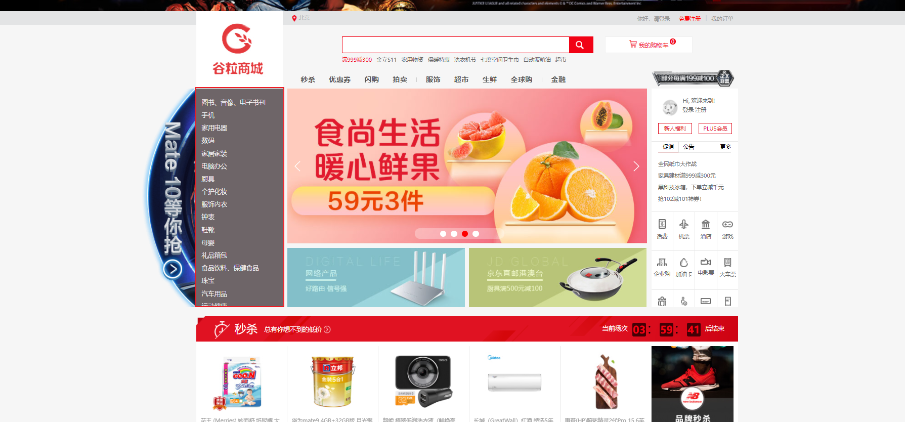


## 3.5、商品二、三级分类分类的预期响应JSON

商品二级三级分类的数据在gulimall-product/src/main/resources/static/index/json/catalog.json

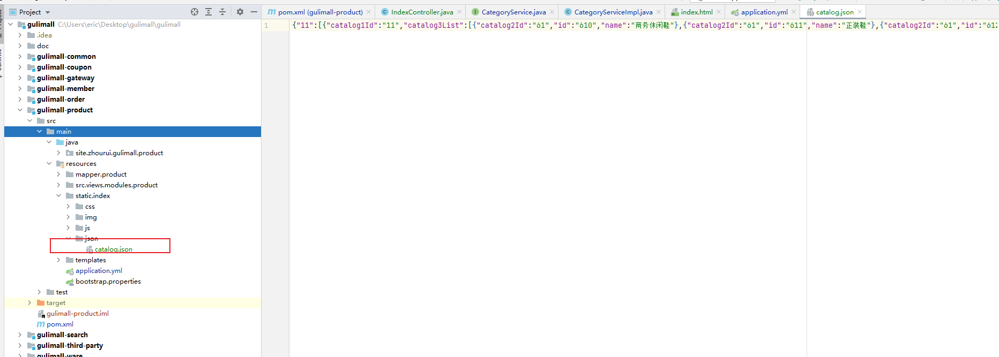

> 我们需要封装与catalog.json结构相同的数据

> 将catalog.json格式化
>
> 发现是一个map类型的结构 key为一级类目id的值,value为一级类目下的所有二级目录的数组


> 打开二级目录数组
>
> 发现一个对象数组,每一个对象代表一个二级分类,catalog3List就是该二级分类的三级分类的集合

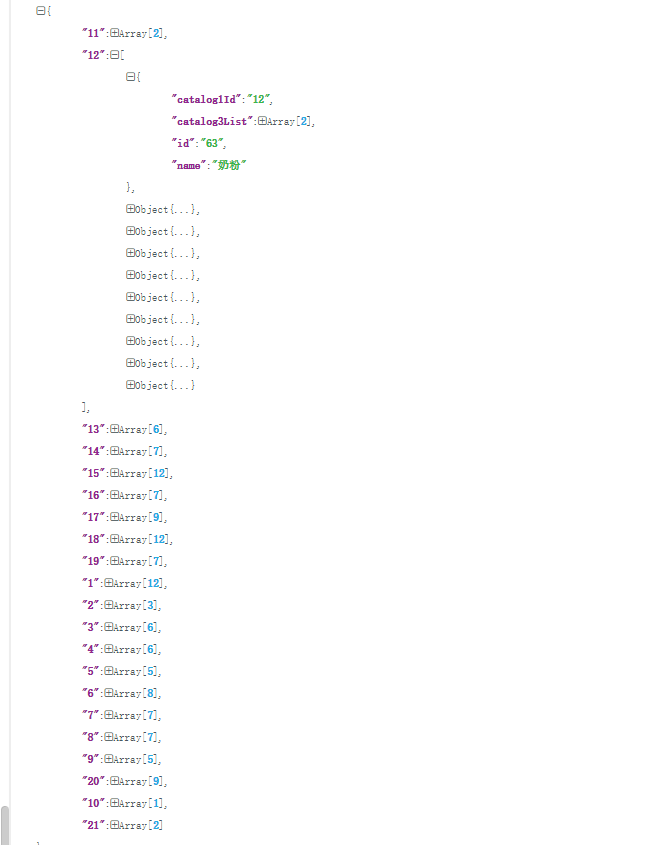

> 打开catalog3List
>
> 是一个一个的三级分类

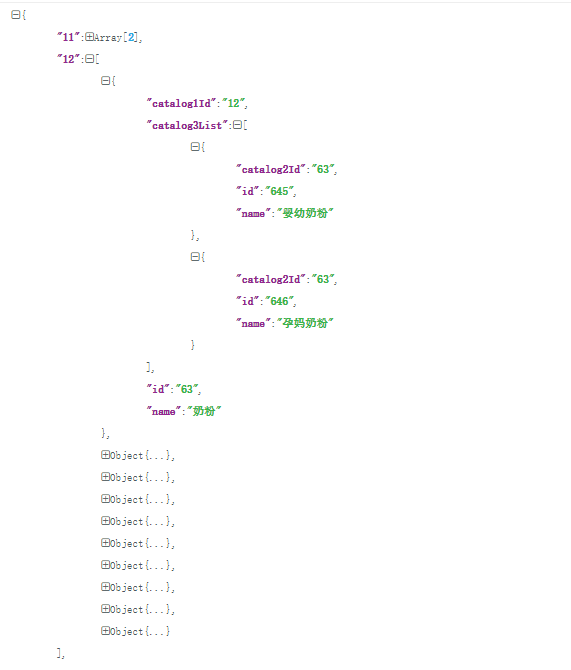


## 3.6、根据一级分类id查询二级三级分类

> 发现gulimall-product/src/main/resources/static/index/js/catalogLoader.js处调用了catalog.json

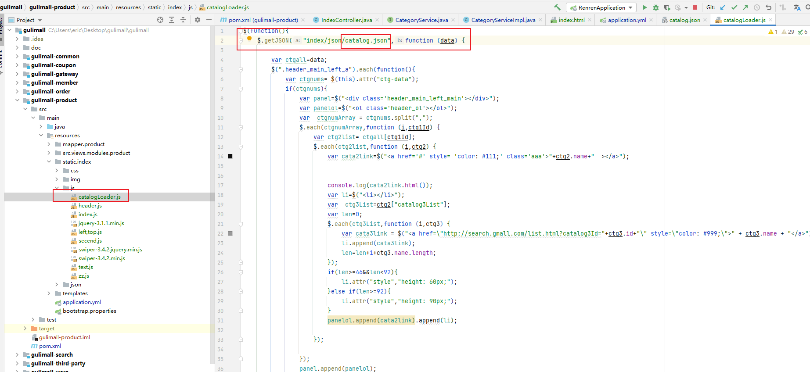

### 3.6.1、新增Catalog2Vo实体类

> 按照章节8分析的结构创建

```java
package xx.xx.gulimall.product.vo;
@NoArgsConstructor
@AllArgsConstructor
@Data
public class Catalog2Vo {

    private String catalog1Id;  // 1级父分类ID
    private List<Catalog3Vo> catalog3List;// 3级子分类集合
    private String id;  // 2级分类ID
    private String name;  // 2级分类name

    /**
     * 三级分类Vo
     */
    @NoArgsConstructor
    @AllArgsConstructor
    @Data
    public static class Catalog3Vo {
        private String catalog2Id;  // 2级父分类ID
        private String id;  // 3级分类ID
        private String name;  // 3级分类name
    }
}
```


### 3.6.2、新增接口

```java
/**
 * 查出三级分类
 * 1级分类作为key，2级引用List
 */
@ResponseBody
@GetMapping("/index/catalog.json")
public Map<String, List<Catalog2Vo>> getCatalogJson() {
    Map<String, List<Catalog2Vo>> map = categoryService.getCatalogJson();
    return map;
}
```


> gulimall-product/src/main/java/com/atguigu/gulimall/product/service/CategoryService.java

```java
    Map<String, List<Catalog2Vo>> getCatalogJson();
```


> gulimall-product/src/main/java/com/atguigu/gulimall/product/service/impl/CategoryServiceImpl.java

```java
@Override
    public Map<String, List<Catalog2Vo>> getCatalogJson() {
        // 一次性获取所有 数据
        List<CategoryEntity> selectList = baseMapper.selectList(null);
        System.out.println("调用了 getCatalogJson  查询了数据库........【三级分类】");
        // 1）、所有1级分类
        List<CategoryEntity> level1Categorys = getParent_cid(selectList, 0L);

        // 2）、封装数据
        Map<String, List<Catalog2Vo>> collect = level1Categorys.stream().collect(Collectors.toMap(k -> k.getCatId().toString(), level1 -> {
            // 查到当前1级分类的2级分类
            List<CategoryEntity> category2level = getParent_cid(selectList, level1.getCatId());
            List<Catalog2Vo> catalog2Vos = null;
            if (category2level != null) {
                catalog2Vos = category2level.stream().map(level12 -> {
                    // 查询当前2级分类的3级分类
                    List<CategoryEntity> category3level = getParent_cid(selectList, level12.getCatId());
                    List<Catalog2Vo.Catalog3Vo> catalog3Vos = null;
                    if (category3level != null) {
                        catalog3Vos = category3level.stream().map(level13 -> {
                            return new Catalog2Vo.Catalog3Vo(level12.getCatId().toString(), level13.getCatId().toString(), level13.getName());
                        }).collect(Collectors.toList());
                    }
                    return new Catalog2Vo(level1.getCatId().toString(), catalog3Vos, level12.getCatId().toString(), level12.getName());
                }).collect(Collectors.toList());
            }
            return catalog2Vos;
        }));
        return collect;
    }
```


### 3.6.3、新增查询出父ID为 parent_cid的List集合

> gulimall-product/src/main/java/com/atguigu/gulimall/product/service/impl/CategoryServiceImpl.java

```java
/**
     * 查询出父ID为 parent_cid的List集合
     */
    private List<CategoryEntity> getParent_cid(List<CategoryEntity> selectList, Long parent_cid) {
        return selectList.stream().filter(item -> item.getParentCid() == parent_cid).collect(Collectors.toList());
        //return baseMapper.selectList(new QueryWrapper<CategoryEntity>().eq("parent_cid", level.getCatId()));
    }
```


### 3.6.4、修改请求

> gulimall-product/src/main/resources/static/index/js/catalogLoader.js
>
> 修改请求路径为章节9新增的接口路径index/catalog.json

### 3.6.5、重启服务并测试

> 数据库修改三级分类名

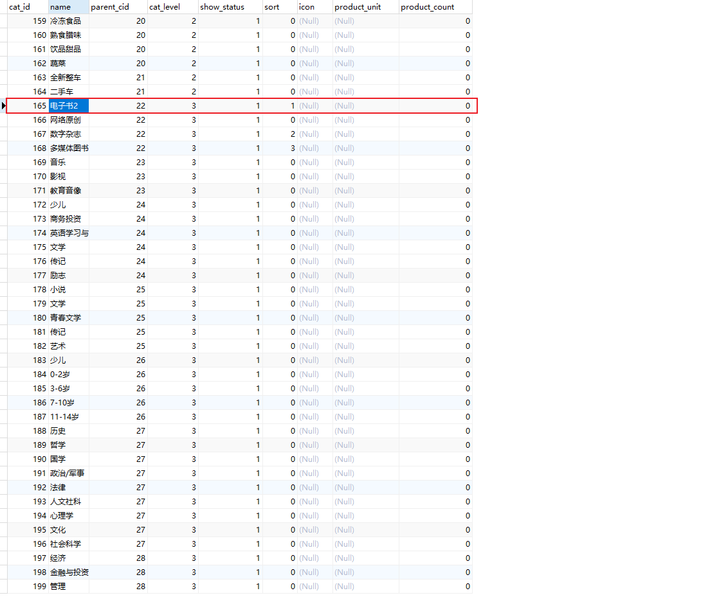

> 页面刷新后也相应改变,说明使用的是后台来的数据

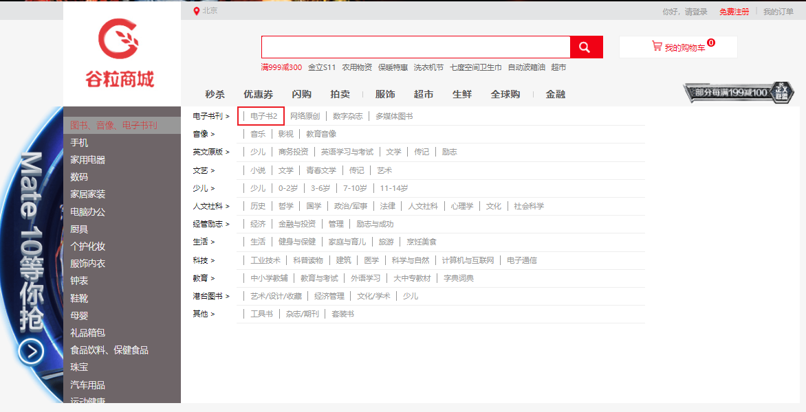


## 3.7、总结springboot页面跳转

静态页面就是不需要任何后台数据的获取，单纯获取这个页面，动态页面则反之。

在springboot项目template下的html用一个点击事件从后台controller跳转页面也不行。

在src/main/resources下面有两个文件夹，static和templates，springboot默认static中放静态页面和静态资源文件，而templates中放动态页面，动态页面访问的话需要Thymeleaf的依赖，**动态页面需要从后台Controller跳转**，静态页面直接类似于：http://127.0.0.1:8080/index.html 访问就可以了；如果static下的无法访问，首先你要保证了你这几个文件访问，不会被拦截器干掉

SpringBoot项目中static目录和templates目录，默认static中放静态资源文件，例如：img、js、css、font等等，如果静态html页面放在static下，一是可以直接当做静态资源访问；另外如果有一种情况，如果页面是放在static下面的，同时也需要从controller来跳转，那么可以采用重定向的方式，因为spring boot 默认的模板存放在 /resource/templates下，不会到 static 目录下去寻找。redirect其实就是重定向到外部资源；其实动态页面放在templates下，大家也都知道，需要从Controller来跳转访问，这些都是SpringBoot约定成俗的一些配置；

### 3.7.1、静态页面

静态页面是可以直接访问的，在static目录下新建一个hello.html就可以在浏览器直接访问http://localhost:8080/hello.html，也可以通过controller层跳转访问。

```java
@Controller
public class HelloController {
    @RequestMapping("/hello")
    public String hello() { return "hello.html"; }
}
```


> 这里返回值是页面，如果方法加注解@ResponseBody，返回值则是字符串。 

### 3.7.2、动态页面

动态页面的访问需要先请求服务器，访问后台的应用程序，然后再转向访问页面。
 spring boot默认使用thymeleaf做动态页面，建议不要使用jsp，下面是spring boot整合thymeleaf的写法

```XML
<dependency>
	<groupId>org.springframework.boot</groupId>
	<artifactId>spring-boot-starter-thymeleaf</artifactId>
</dependency>
```


- 在tempates目录下新建hello.html文件，此时若直接访问http://localhost:8080/hello.html访问的是静态文件夹（static目录）下的hello.html，再通过controller层跳转访问static会报500错误，这是因为
  - 静态页面的return默认是跳转到static目录下的
  - 当引入thymeleaf之后，动态跳转会覆盖默认的静态跳转
  - 动态跳转默认跳转到templates目录下
  - 两者return代码区别：动态跳转有无.html后缀都可

使用thymeleaf之后的controller层

```java
@Controller
public class HelloController {
    @RequestMapping("/hello")
    public String hello() { return "hello"; }
}
```


若在使用动态页面时还想跳转到/static/index.html，使用**重定向return “redirect:/index.html”**

# 4、nginx搭建域名访问环境

## 4.1、需求

访问“gulimall.com”，Nginx反向代理到网关地址“http://localhost:88/#”，展示商品页面。

> 网关端口是88。


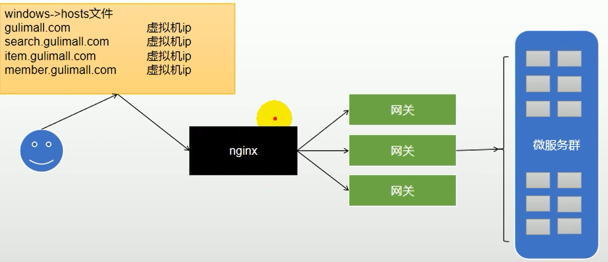


## 4.2、回顾反向代理

**正向代理：**客户端向代理服务器发请求并指定目标服务器，代理向目标服务器**转交请求**并将获得的内容返回给客户端。

**反向代理：**用户**直接访问**反向代理服务器就可以**获得**目标服务器的资源。反向代理服务器统一了访问入口。

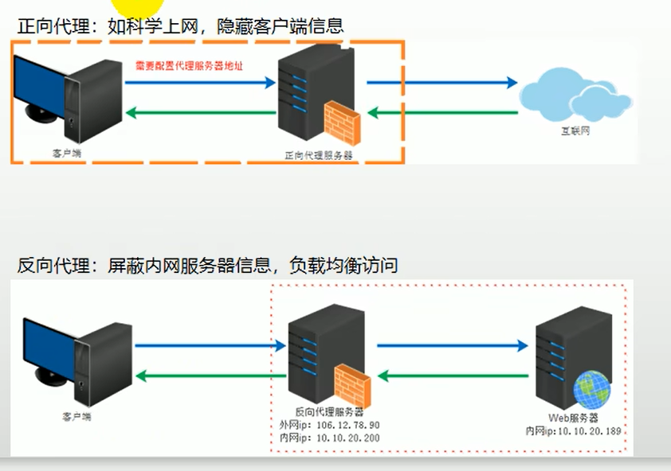


## 4.3、配置反向代理

### 4.3.1、hosts文件配置域名和ip映射

**方法一：直接修改** 

windows域名解析会先找C:\Windows\System32\drivers\etc下的hosts文件，然后才找dns服务器

当我们在浏览器输入gulimall.com的时候，就会去找我们的虚拟机，此时虚拟机中的nginx是运行的话，就可以访问到nginx，因为nginx监听的是80端口

```
192.168.56.10	gulimall.com
```


**方法二：**管理员身份打开软件SwitchHosts，添加新方案：

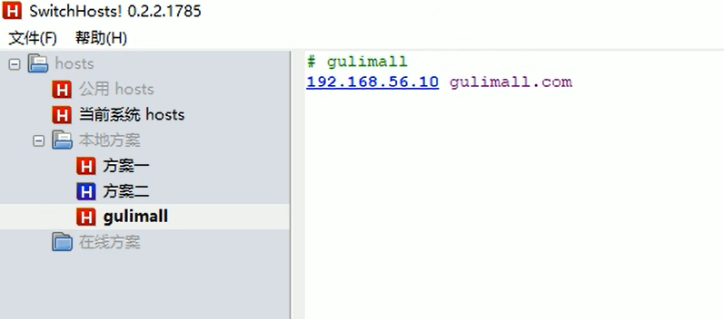

**测试成功：** 

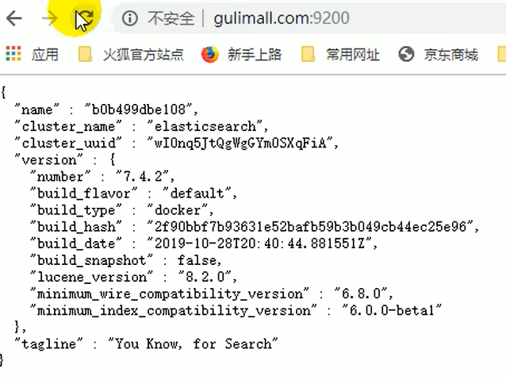


### 4.3.2、配置nginx.conf

> 首先docker安装Nginx，配置自启动。 

```bash
cd /mydata/nginx
cd conf
vi nginx.conf
```


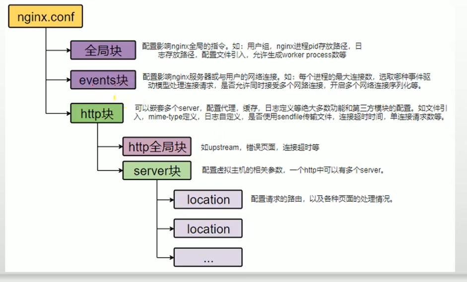


```bash
user  nginx;
worker_processes  1;

error_log  /var/log/nginx/error.log warn;
pid        /var/run/nginx.pid;


events {
    worker_connections  1024;
}


http {
    include       /etc/nginx/mime.types;    #支持的mime类型
    default_type  application/octet-stream;    #默认数据类型

    log_format  main  '$remote_addr - $remote_user [$time_local] "$request" '    #日志格式
                      '$status $body_bytes_sent "$http_referer" '
                      '"$http_user_agent" "$http_x_forwarded_for"';

    access_log  /var/log/nginx/access.log  main;    #日志地址

    sendfile        on;
    #tcp_nopush     on;

    keepalive_timeout  65;

    #gzip  on;    #开启压缩
    
    upstream gulimall{        #配置上游服务器,起名为gulimall
      server 192.168.56.1:88;    #配置上游服务器为网关地址
    }

    include /etc/nginx/conf.d/*.conf;    #该路径下的配置文件会全部合并到这里


}
```


### 4.3.3、配置/etc/nginx/conf.d/gulimall.conf 

> 此配置文件被Nginx的http全局块配置了包含。

```bash
server {
    listen       80;    #监听此端口
    server_name  gulimall.com;    #监听此域名

    #charset koi8-r;
    #access_log  /var/log/nginx/log/host.access.log  main;

    location / {    #配置请求的路由
       proxy_set_header Host $host;    #坑点：Nginx代理给网关时会丢失请求的host等信息
       proxy_pass http://gulimall;    #因为主配置文件配置了上游服务器为网关地址，所以可以请求路由到http://192.168.xxx.xxx:10000/
    }

    #error_page  404              /404.html;

    # redirect server error pages to the static page /50x.html
    #
    error_page   500 502 503 504  /50x.html;
    location = /50x.html {
        root   /usr/share/nginx/html;
    }

    # proxy the PHP scripts to Apache listening on 127.0.0.1:80
    #
    #location ~ \.php$ {
    #    proxy_pass   http://127.0.0.1;
    #}

    # pass the PHP scripts to FastCGI server listening on 127.0.0.1:9000
    #
    #location ~ \.php$ {
    #    root           html;
    #    fastcgi_pass   127.0.0.1:9000;
    #    fastcgi_index  index.php;
    #    fastcgi_param  SCRIPT_FILENAME  /scripts$fastcgi_script_name;
    #    include        fastcgi_params;
    #}

    # deny access to .htaccess files, if Apache's document root
    # concurs with nginx's one
    #
    #location ~ /\.ht {
    #    deny  all;
    #}
}
```


配置完成后重启Nginx容器。

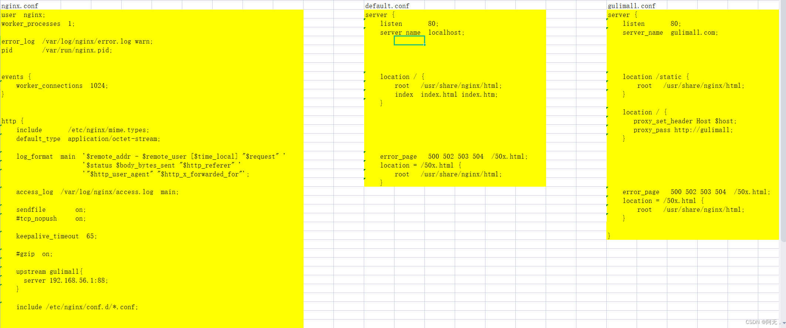

### 4.3.4、网关配置“gulimall.com”的路由规则

> **注意：**域名映射只能放在最后面，否则会覆盖上面的“/api/xxx”路径 

```bash
spring:
  cloud:
    gateway:
      routes:
#        - id: test_route
#          uri: https://www.baidu.com
#          predicates:
#            #              根据参数来匹配
#            - Query=url,baidu

        # 和admin_route顺序不能乱，否则页面访问报404，因为被它拦截了
        # 我们一般把精确的路由放在上面，优先级高
        # 匹配了这个路由之后，不会匹配下面的路由
        - id: product_route
          uri: lb://gulimall-product
          predicates:
            - Path=/api/product/**
          # 前端的请求是 http://localhost:88/api/product/category/list/tree
          # 后端实际需要的请求是，http://localhost:12000/product/category/list/tree
          filters:
            - RewritePath=/api/(?<segment>.*),/$\{segment}

            #  http://localhost:88/api/thirdparty/oss/policy
        - id: third_party_route
          #  lb 负载均衡
          uri: lb://gulimall-third-party
           # 匹配所有以api开头的请求
          predicates:
            - Path=/api/thirdparty/**
          filters:
            #  路径重写
            # (?<segment>.*)  $\{segment} 相当于片段
            - RewritePath=/api/thirdparty/(?<segment>.*),/$\{segment}

        - id: member_route
          #  lb 负载均衡
          uri: lb://gulimall-member
          # 匹配所有以api开头的请求
          predicates:
            - Path=/api/member/**
          filters:
            #  路径重写
            # (?<segment>.*)  $\{segment} 相当于片段
            - RewritePath=/api/(?<segment>.*),/$\{segment}

        - id: ware_route
          uri: lb://gulimall-ware
          predicates:
            - Path=/api/ware/**
          filters:
            - RewritePath=/api/(?<segment>.*),/$\{segment}

        #  前端项目发送请求都以 /api 开头
        - id: admin_route
          #  lb 负载均衡  到renren-fast服务
          uri: lb://renren-fast
          # 匹配所有以api开头的请求
          predicates:
            - Path=/api/**
          filters:
            #  路径重写
            # http://localhost:88/api/captcha.jpg 在网关匹配到相应的规则后
            #  就变成了 http://localhost:8080/api/captcha.jpg
            # 但实际上我们需要真正访问的是 http://localhost:8080/renren-fast/captcha.jpg
            # (?<segment>.*)  $\{segment} 相当于片段
            - RewritePath=/api/(?<segment>.*),/renren-fast/$\{segment}

        # 域名映射只能放在最后面，否则会覆盖上面的api路径
        # 例如我们访问product的api路径，优先匹配到这个的话就会去直接找product
        # 不会再路径重写了
        - id: gulimall_host_route
          uri: lb://gulimall-product
          predicates:
            - Host=**.gulimall.com
```


### 4.3.5、坑点：Nginx代理给网关时会丢失请求的host等信息

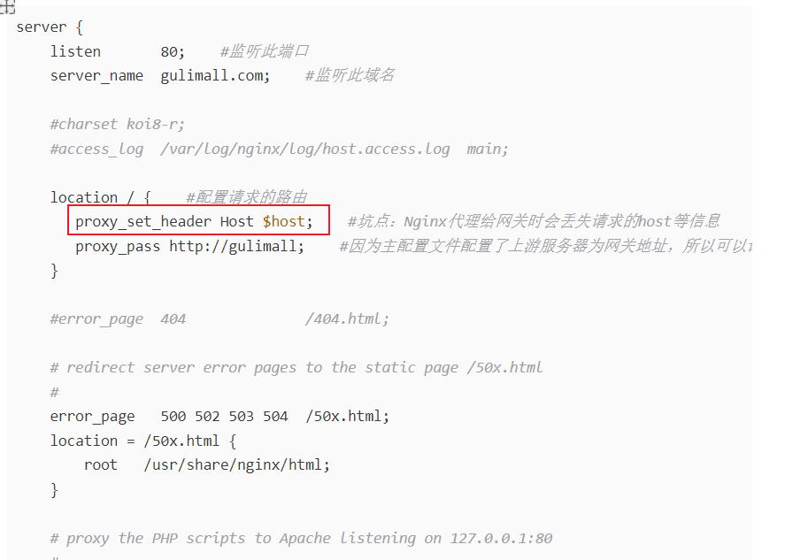

### 4.3.6、测试通过

重启Nginx容器，访问“gulimall.com” ：


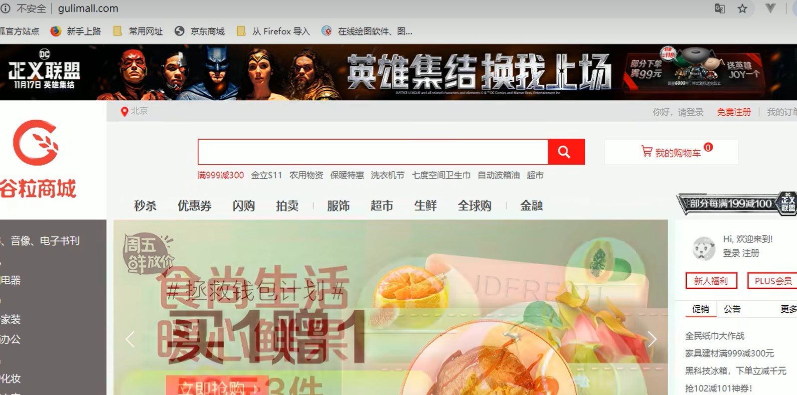

**访问接口：**

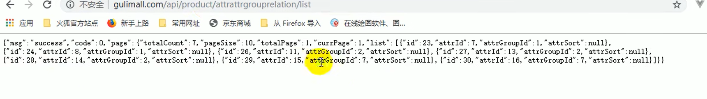


### 4.3.7、小结，反向代理流程

1. 客户端访问windows浏览器端`gulimall.com`，浏览器会访问我们配置好的虚拟机
2. 虚拟机中的nginx监听80端口（server_name也配置了gulimall.com），nginx.conf中`include /etc/nginx/conf.d/*.conf;`配置代表包含conf.d下的所有.conf文件，用来配置server
3. gulimall.conf配置 `proxy_pass http://gulimall;`，代表访问这个地址会转交到nginx.conf的`upstream gulimall`下，这里配置的是网关的地址
4. 在上述nginx将请求移交给网关的时候，nginx会丢失好些数据，例如host、cookie等等，而我们网关配置的断言又是根据host，`proxy_set_header Host $host;`这个配置代表保留host信息
5. gateway根据域名断言将请求转发给对应的服务

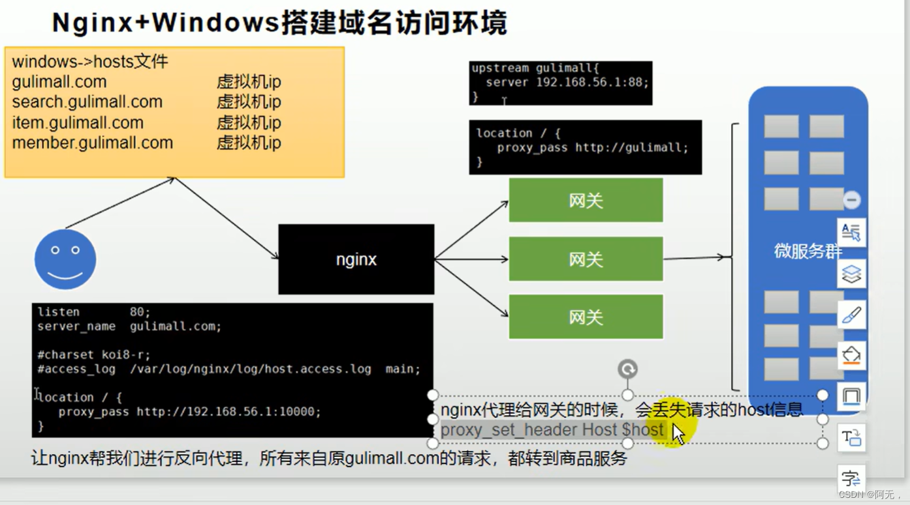

nginx代理给网关的时候，会丢失请求的Host信息，需要配置。