>  **导航：**
>
> [谷粒商城笔记+踩坑汇总篇](https://blog.csdn.net/qq_40991313/article/details/127099139?spm=1001.2014.3001.5501)
>
>  **Java笔记汇总：**
>
> [【Java笔记+踩坑汇总】Java基础+JavaWeb+SSM+SpringBoot+SpringCloud+瑞吉外卖/谷粒商城/学成在线+设计模式+面试题汇总+性能调优/架构设计+源码解析-CSDN博客](https://blog.csdn.net/qq_40991313/article/details/126646289)

[TOC]


# 1.JMeter压力测试

压力测试考察当前软硬件环境下系统所能承受的最大负荷并帮助找出系统瓶颈所在。 压测都是为了系统在线上的处理能力和稳定性维持在一个标准范围内， 做到心中有数。

使用压力测试， 我们有希望找到很多种用其他测试方法更难发现的错误。 有两种错误类型是:**内存泄漏**， **并发与同步问题**。

**内存泄漏：**内存泄漏（Memory Leak）是指程序中已动态分配的堆内存由于某种原因程序未释放或无法释放，造成系统内存的浪费，导致程序运行速度减慢甚至系统崩溃等严重后果。

**并发与同步：**

有效的压力测试系统将应用以下这些关键条件:**重复**， **并发**， **量级**， **随机变化**。

## 1.1 压力测试的性能指标

- **响应时间（Response Time:RT）**
   响应时间指用户从客户端发起一个请求开始，到客户端接收到从服务器端返回的响应结束，整个过程所耗费的时间。响应时间越少越好。
- **HPS（Hits Per Second）:每秒点击次数，单位是次/秒。**【不是特别重要】
- **TPS(Transaction per Second）:系统每秒处理交易数，单位是笔/秒。**
- **Qps(Query per Second）:系统每秒处理查询次数，单位是次/秒。**
   对于互联网业务中，如果某些业务有且仅有一个请求连接，那么TPS=QPS=HPS，一般情况下用 TPS来衡量整个业务流程，用QPS来衡量接口查询次数，用HPS来表示对服务器单击请求。
- **无论TPS、QPS、HPS,此指标是衡量系统处理能力非常重要的指标，越大越好，根据经**
   **验，一般情况下:**
   金融行业:1000TPS~5000OTPS，不包括互联网化的活动
   保险行业:100TPS~10000OTPS，不包括互联网化的活动
   制造行业:10TPS~5000TPS
   互联网电子商务:1000OTPS~1000000TPS
   互联网中型网站:1000TPS~50000TPS
   互联网小型网站:50OTPS~10000TPS
- **最大响应时间**（MaxResponse Time）指用户发出请求或者指令到系统做出反应(响应)的最大时间。
- **最少响应时间**(Mininum ResponseTime）指用户发出请求或者指令到系统做出反应(响应）的最少时间。
- **90%响应时间**（90%Response Time）是指所有用户的响应时间进行排序，第90%的响应时间。
- **从外部看，性能测试主要关注如下三个指标**
   **吞吐量**:每秒钟系统能够处理的请求数、任务数。
   **响应时间**:服务处理一个请求或一个任务的耗时。
   **错误率**。一批请求中结果出错的请求所占比例。

## 1.2 JMeter 安装

[JMeter下载地址](https://jmeter.apache.org/download_jmeter.cgi)

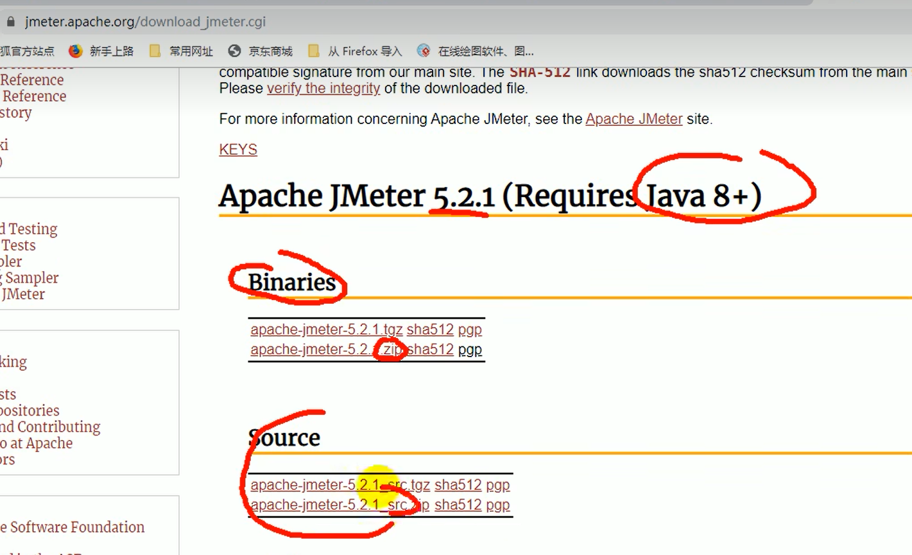


运行批处理文件jmeter.bat

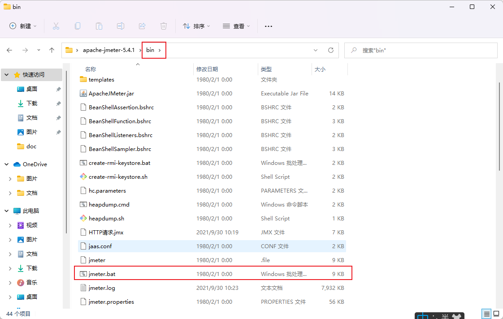

## 1.3 JMeter 中文配置

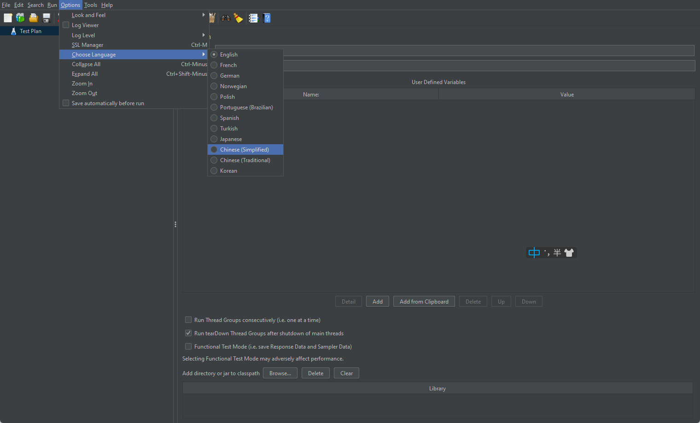

## 1.4 JMeter 压测示例

### 1.4.1 添加线程组

右键“test plan” 添加：


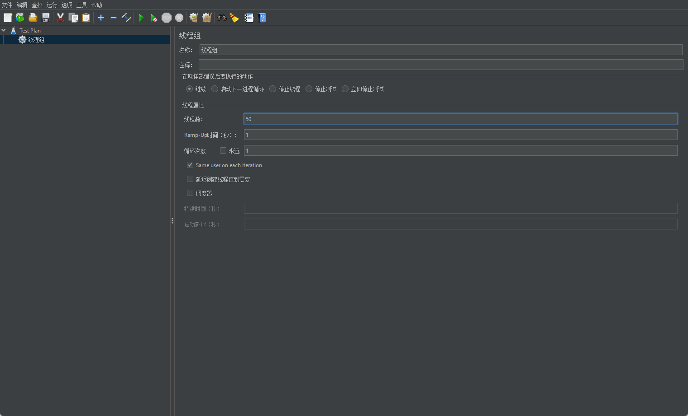

线程组参数详解：

- **线程数：** 虚拟用户数。 一个虚拟用户占用一个进程或线程。 设置多少虚拟用户数在这里也就是设置多少个线程数。
- **Ramp-Up时间： 200个线程需要多少秒内全部启动完成**。 如果线程数为 10， 准备时长为 2， 那么需要 2 秒钟启动 10 个线程， 也就是每秒钟启动 5 个线程。
- **循环次数：** 每个线程发送请求的次数。勾选“永远”会一直压力测试下去。 如果线程数为 10， 循环次数为 100， 那么每个线程发送 100 次请求。 总请求数为 10*100=1000 。 如果勾选了“永远”， 那么所有线程会一直发送请求， 一到选择停止运行脚本。
- Delay Thread creation until needed： 直到需要时延迟线程的创建。
- 调度器： 设置线程组启动的开始时间和结束时间(配置调度器时， 需要勾选循环次数为永远)
- 持续时间（秒） ： 测试持续时间， 会覆盖结束时间
- 启动延迟（秒） ： 测试延迟启动时间， 会覆盖启动时间
- 启动时间： 测试启动时间， 启动延迟会覆盖它。 当启动时间已过， 手动只需测试时当前时间也会覆盖它。
- 结束时间： 测试结束时间， 持续时间会覆盖它。

### 1.4.2 添加 HTTP 请求

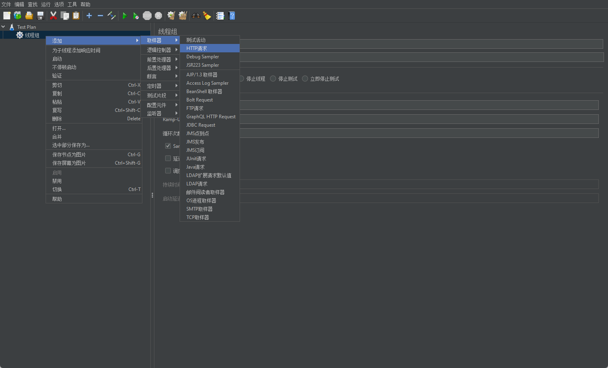

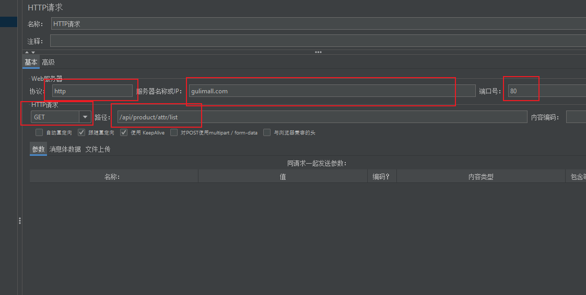

### 1.4.3 添加监听器

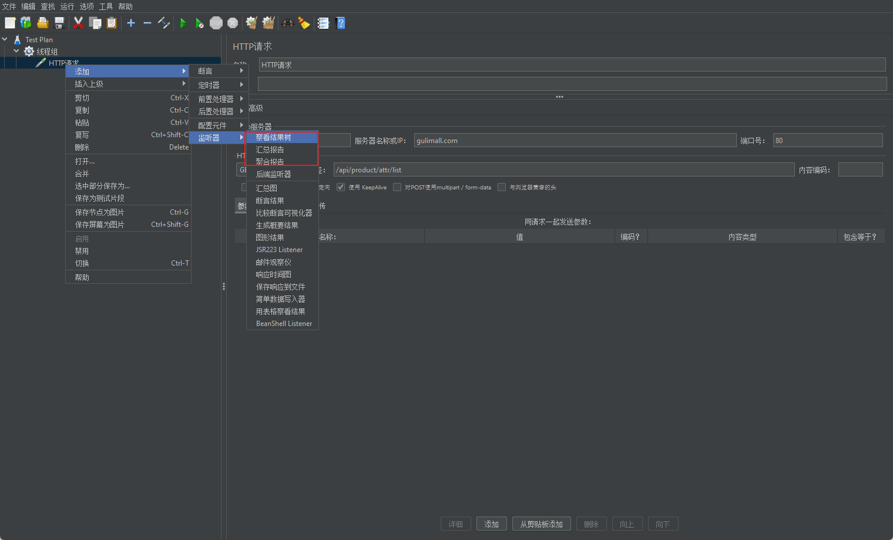

**查看结果树：**

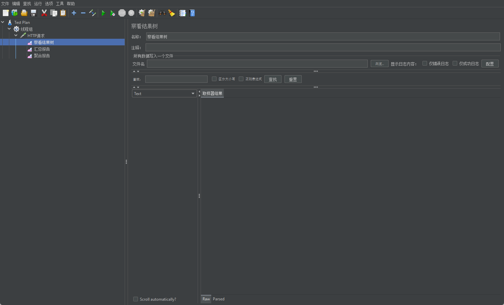

> 结果树可以查看到每次请求成功和失败情况，响应情况。 

- **汇总报告**

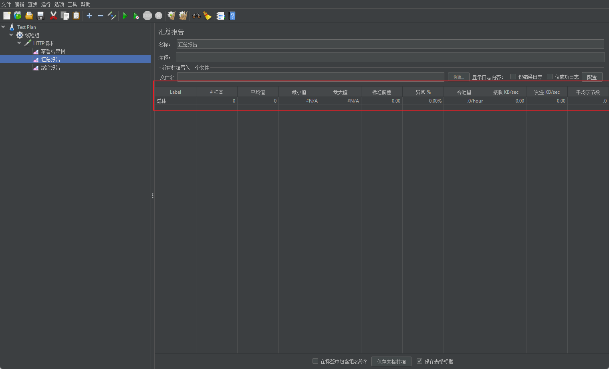

>  **样本：**发送请求数。 样本数=线程数*循环次数
>
> 平均值：平均响应时间。
>
> 中位数：所有样本响应时间的中位数。

**3.聚合报告**


### 1.4.4 启动压测

启动：

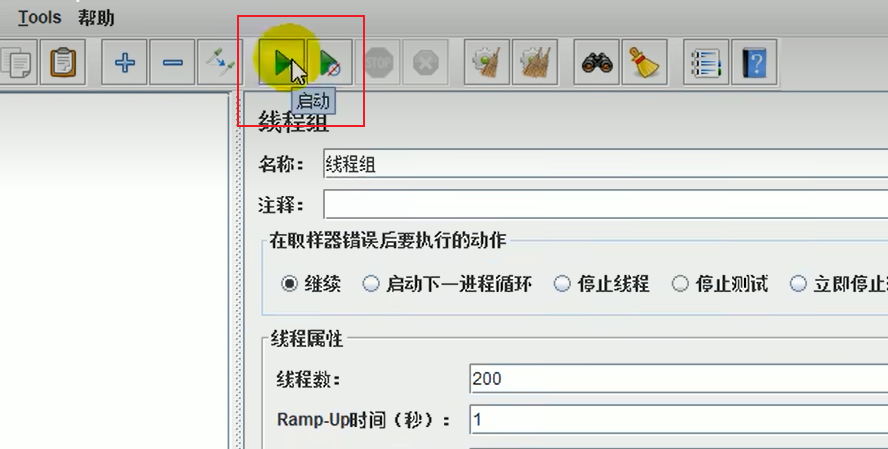

是否保存这个测试计划：

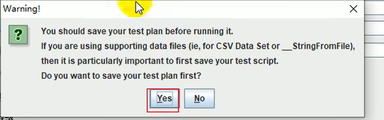

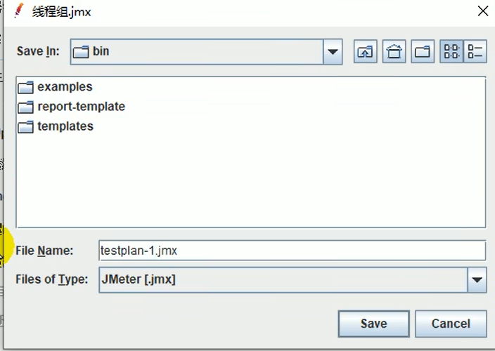

### 1.4.5 查看分析结果 

**结果树：** 查看每个请求路径、方式、响应结果

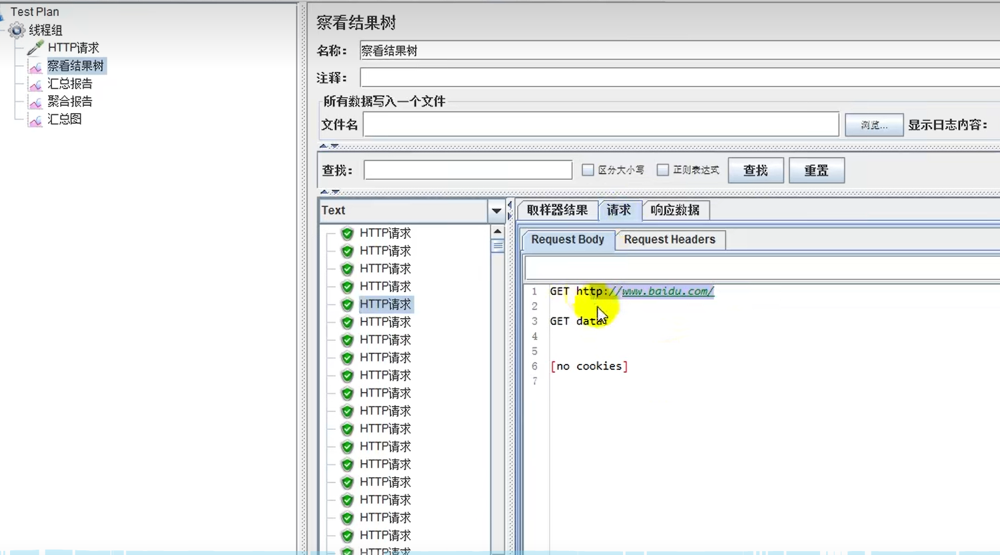


**汇总报告：** 20000个请求（样本），平均69ms内完成，最快请求67ms，最慢请求2027ms，标准偏差越大说明越不稳定，异常0%也就是没发生异常，吞吐量（单位时间传输的数据量）是每秒1986.7KB，每秒能接收5622KB数据、发送228KB数据

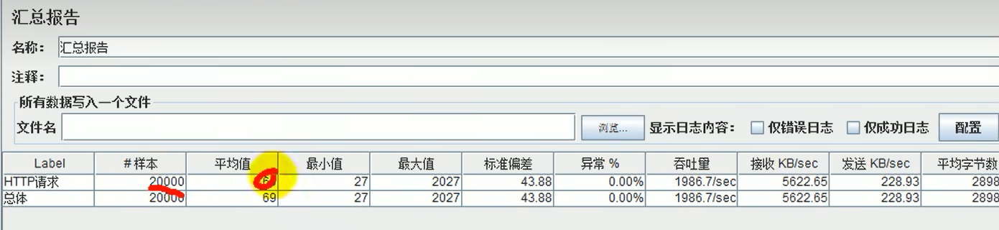

**聚合报告：**20000个样本，平均69ms内完成，中位数是52ms内完成，TP90（90%请求在多少ms内完成）是105ms

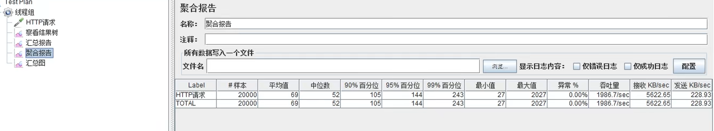


**汇总图：**先勾选显示的数据，然后点击“图形”显示图标查看汇总图

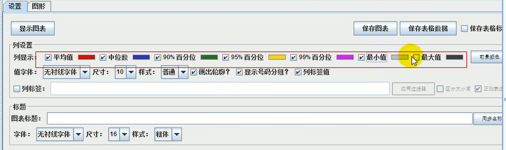

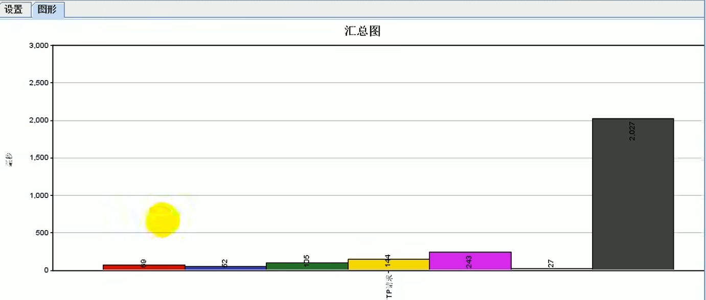**清空全部报告：**


**结果分析 :**

- 有错误率同开发确认， 确定是否允许错误的发生或者错误率允许在多大的范围内；
- Throughput 吞吐量每秒请求的数大于并发数， 则可以慢慢的往上面增加； 若在压测的机器性能很好的情况下， 出现吞吐量小于并发数， 说明并发数不能再增加了， 可以慢慢的往下减， 找到最佳的并发数；
- 压测结束， 登陆相应的 web 服务器查看 CPU 等性能指标， 进行数据的分析;
- **最大的 tps：**不断的增加并发数， 加到 tps 达到一定值开始出现下降， 那么那个值就是
   最大的 tps。
- **最大的并发数：** 最大的并发数和最大的 tps 是不同的概率， 一般不断增加并发数， 达到一个值后， 服务器出现请求超时， 则可认为该值为最大的并发数。
- 压测过程出现性能瓶颈， 若压力机任务管理器查看到的 cpu、 网络和 cpu 都正常， 未达 到 90%以上， 则可以说明服务器有问题， 压力机没有问题。
- **影响性能考虑点包括**：数据库、 应用程序、 中间件（tomact、 Nginx） 、 网络和操作系统等方面
- 首先考虑自己的应用属于 **CPU 密集型（以空间换时间）**还是 **IO 密集型（以时间换空间）**

## 1.5 错误解决JMeter Address Already in use ，Windows端口访问机制

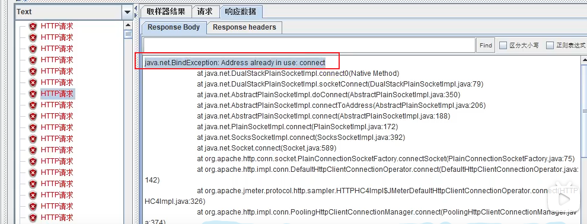

> **出现原因**
>
> windows 本身提供的**端口访问机制**的问题。
>  Windows 提供给 TCP/IP 链接的端口为 1024-5000， 并且要**四分钟来循环回收**他们。 就导致我们在**短时间内跑大量的请求时将端口占满了**。

> **解决思路**
>
> 扩大提供给 TCP/IP 链接的端口
>
> 缩短循环回收时间

计算机\HKEY_LOCAL_MACHINE\SYSTEM\CurrentControlSet\Services\Tcpip\Parameters

- 右击 parameters， 添加一个新的 DWORD， 名字为 MaxUserPort

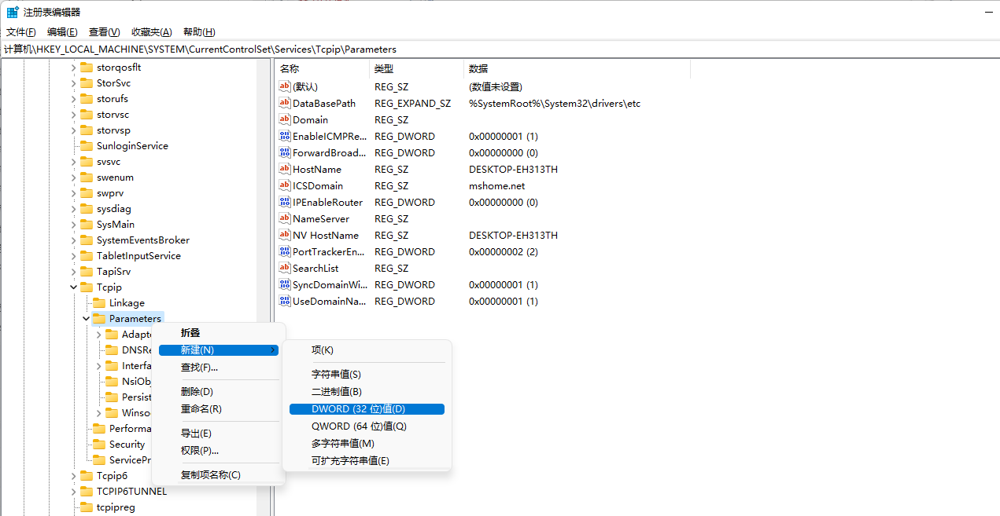

- 然后双击 MaxUserPort， 输入数值数据为 65534， 基数选择十进制（如果是分布式运行的话， 控制机器和负载机器都需要这样操作哦）

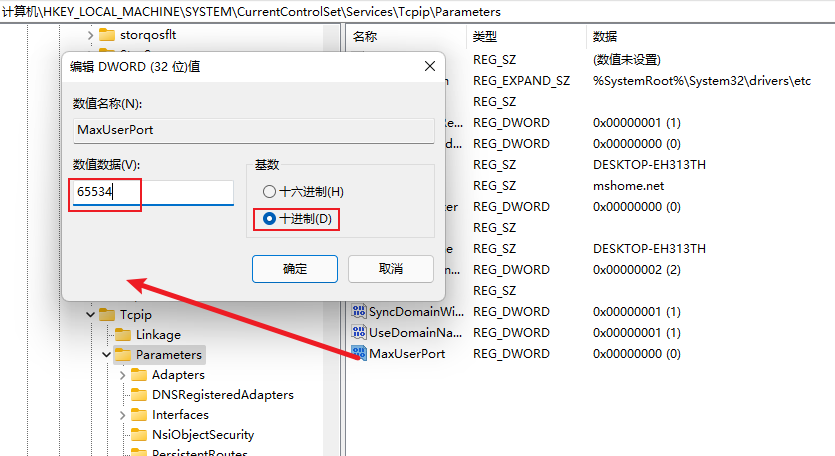

- 右击 parameters， 添加一个新的 DWORD， 名字为 TCPTimedWaitDelay

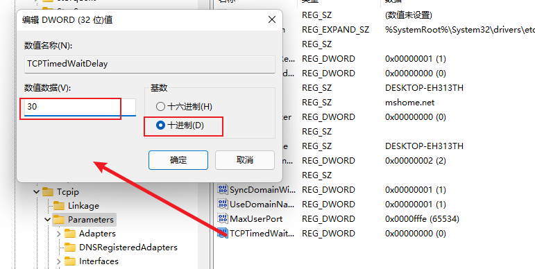

- 重启系统并测试


# 2. 性能监控

- **影响性能考虑点包括**：数据库、 应用程序、 中间件（tomact、 Nginx） 、 网络和操作系统等方面
- 首先考虑自己的应用属于 **CPU 密集型（以空间换时间）**还是 **IO 密集型（以时间换空间）**


## 2.1 回顾jvm内存模型


Java源文件编译成.class字节码文件 ，.class字节码文件被JVM的类装载器装载到JVM里，所有数据都在“运行时数据区”。**性能优化主要是优化“运行时数据区”中的“堆”**。

当数据都在“运行时数据区”后，JVM的执行引擎负责执行，在虚拟机栈里进行方法的调用，入栈、出栈等操作。本地方法栈调用本地库，程序计数器记录程序走到哪一行。

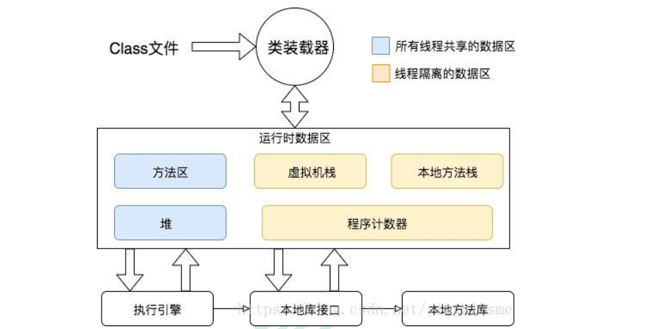

- 程序计数器 Program Counter Register： 
  - 记录的是正在执行的虚拟机字节码指令的地址，
  - 此内存区域是唯一一个在JAVA虚拟机规范中没有规定任何OutOfMemoryError的区域
- 虚拟机： VM Stack 
  - 描述的是 JAVA 方法执行的内存模型， 每个方法在执行的时候都会创建一个栈帧，用于存储局部变量表， 操作数栈， 动态链接， 方法接口等信息
  -  局部变量表存储了编译期可知的各种基本数据类型、 对象引用
  -  线程请求的栈深度不够会报 StackOverflowError 异常
  -  栈动态扩展的容量不够会报 OutOfMemoryError 异常
  -  虚拟机栈是线程隔离的， 即每个线程都有自己独立的虚拟机栈
- 本地方法： Native Stack 
  - 本地方法栈类似于虚拟机栈， 只不过本地方法栈使用的是本地方法
- 堆： Heap 
  - 几乎所有的对象实例都在堆上分配内存

> 详细模型

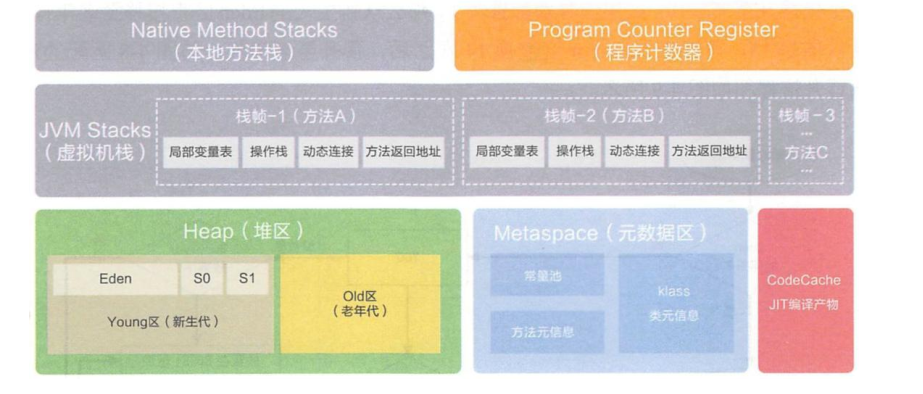

## 2.2 回顾堆

### 2.2.0概念 

所有的**对象实例以及数组都在堆上分配**。 **堆是垃圾收集器管理的主要区域**， 也被称为“GC堆” ； 也是我们优化最多考虑的地方。


 **堆可以细分为：**

- **新生代**
  - Eden 空间
  - From Survivor 空间
  - To Survivor 空间
- **老年代**
  - 永久代/元空间
  - Java8 以前永久代， 受 jvm 管理， java8 以后元空间， 直接使用物理内存。 因此，默认情况下， 元空间的大小仅受本地内存限制。

### 2.2.1垃圾回收流程


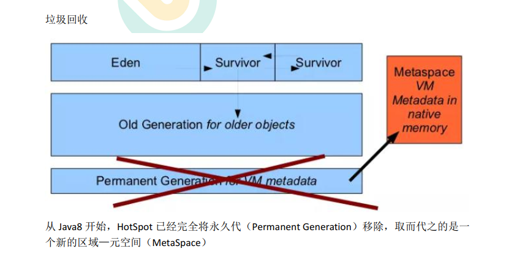

**创建对象放到堆内存的流程：**
 

1.首先，任何新对象都分配到 eden 空间。两个幸存者空间开始时都是空的。

2.当 eden 空间填满时，将触发一个**Minor GC**(年轻代的垃圾回收)，删除所有未引用的对象，大对象（需要大量连续内存空间的Java对象，如那种很长的字符串）直接进入老年代。

3.所有被引用的对象作为存活对象，将移动到第一个幸存者空间S0，并标记年龄为1，即经历过一次Minor GC。之后每经过一次Minor GC，年龄+1。

4.当 eden 空间再次被填满时，会执行第二次Minor GC，将Eden和S0区中所有垃圾对象清除，并将存活对象复制到S1并年龄加1，此时S0变为空。

5.如此反复在S0和S1之间切换几次之后，还存活的**年龄等于15的对象**在下一次Minor GC时将放到老年代中。

6.当老年代满了时会触发**FullGC**（全GC），Full GC 清理整个堆 – 包括年轻代和老年代。

7.Major GC是老年代的垃圾回收，经常会伴随至少一次Minor GC，比Minor GC慢10倍以上。


 

> **Minor GC：**清理年轻代空间（包括 Eden 和 Survivor 区域），释放在Eden中所有不活跃的对象，释放后若Eden空间仍然不足以放入新对象，则试图将部分Eden中活跃对象放入Survivor区。
>
> **Survivor区：**Survivor区被用来作为Eden及老年代的中间交换区域，当老年代空间足够时，Survivor区的对象会被移到老年代，否则会被保留在Survivor区。
>
> **Major GC：**清理老年代空间，当老年代空间不够时，JVM会在老年代进行major gc。
>
> **Full GC：**清理整个堆空间，包括年轻代和老年代空间。**Full GC比Minor GC慢十倍，应该尽量避免。**

**旧对象：**
 1、放到幸存者区survivor，如果放得下放在to区【然后from 和 to转变身份】【超过阈值15放到老年代】
 2、如果survivor放不下判断老年代是否放得下，放不下执行FullGC
 3、如果老年代放不下OOM异常


> 详细流程

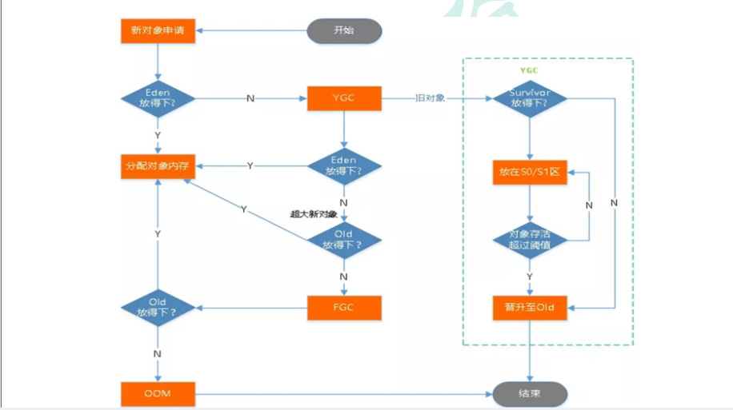

> 

## 2.3 使用jconsole**监控本地和远程应用**

Jdk 的两个小工具 jconsole、 jvisualvm（升级版的 jconsole） ;通过命令行启动， 可**监控本地和远程应用**。 远程应用需要配置

**直接cmd输入jconsole**

进入jconsole页面选择gulimall商品模块：

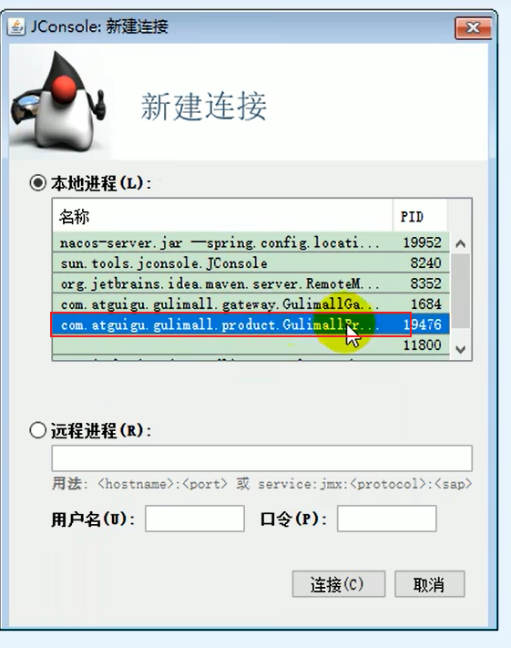


**首页情况**


**内存情况**

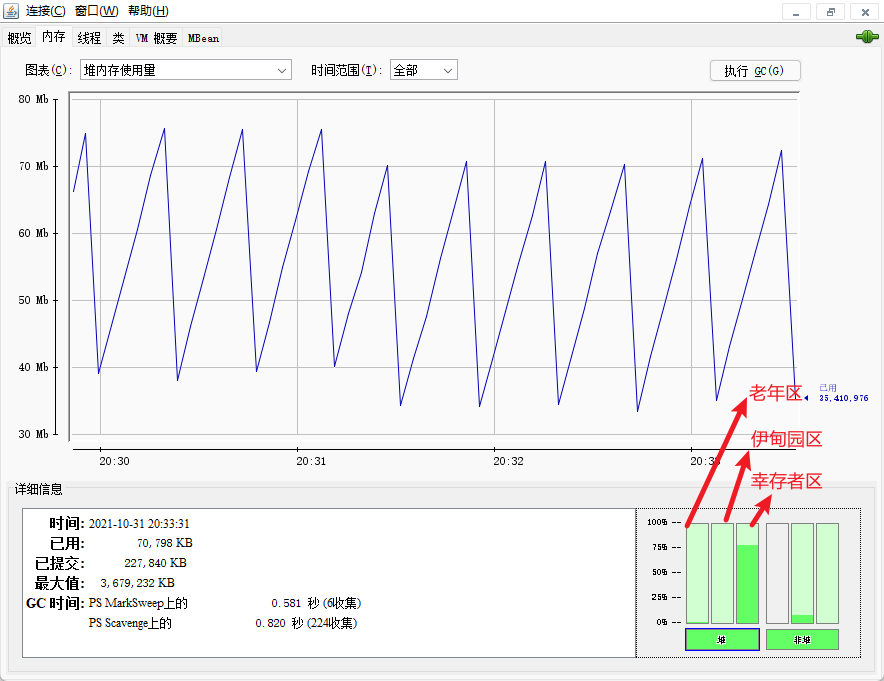

## 2.4 jvisualvm（比jconsole强大）

### 2.4.0 启动jvisualvm


连接进程：

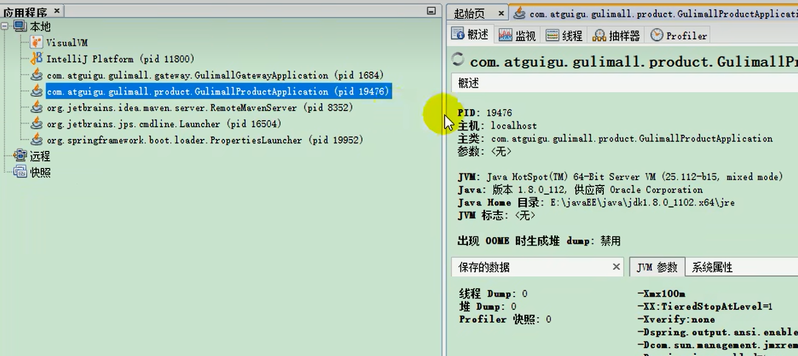


### 2.4.1 jvisualvm 能干什么

监控内存泄露， 跟踪垃圾回收， 执行时内存、 cpu 分析， 线程分析…


**线程状态：** 

- 运行： 正在运行的
- 休眠： sleep
- 等待： wait
- 驻留： 线程池里面的空闲线程
- 监视： 阻塞的线程， 正在等待锁

### 2.4.2 安装Visual GC插件

1. cmd 启动jvisualvm，点击“工具”-“插件”，点击“检查最新版本”看是否报错
2. 不保存就安装 Visual GC
3. 安装后重启jvisualvm

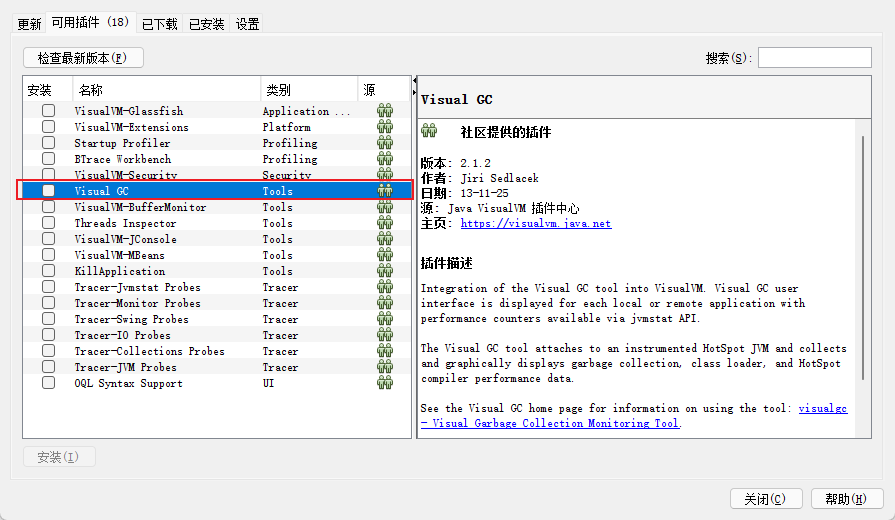

> **503报错，插件安装失败问题：**
>
> 
>
> 原因：
>
> 1. 可能是因为更新链接配置的版本不对
> 2. **自己有代理的话一定要关闭**
>
> 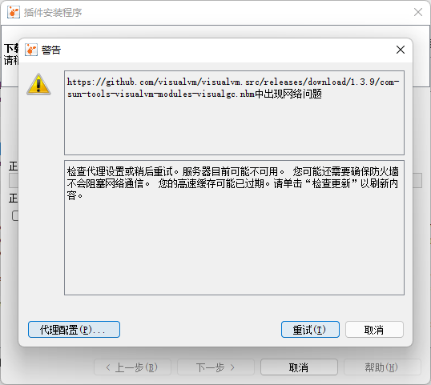
>
> - 查看自己jdk版本
>
> 我的版本是281xxx
>
> 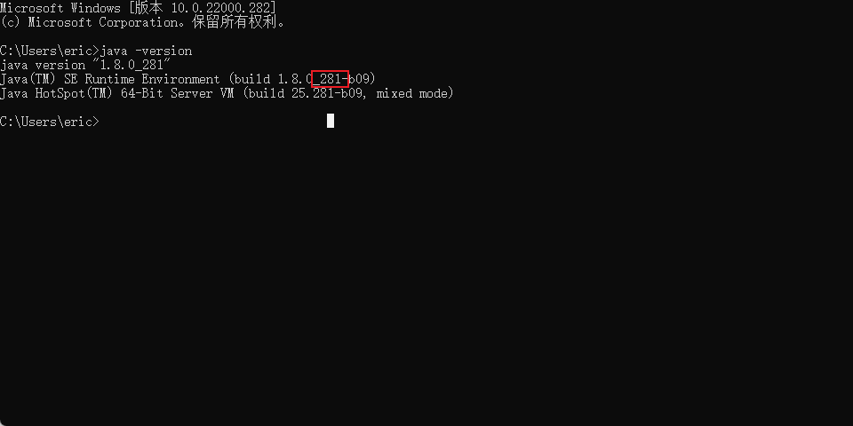
>
> - 打开网址 https://visualvm.github.io/pluginscenters.html
>
> 找到对应的版本复制链接
>
> 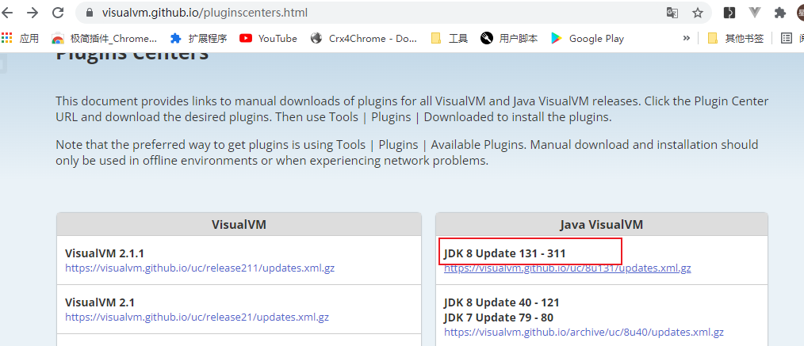
>
> - 修改配置的链接
>
> 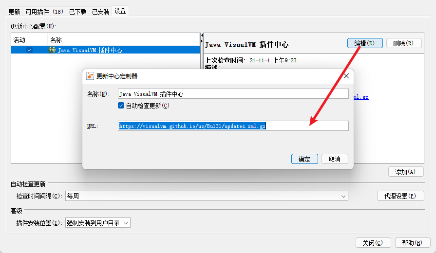

**安装插件后重启jvisualvm效果如下：**

可以看见实时的整个GC过程。

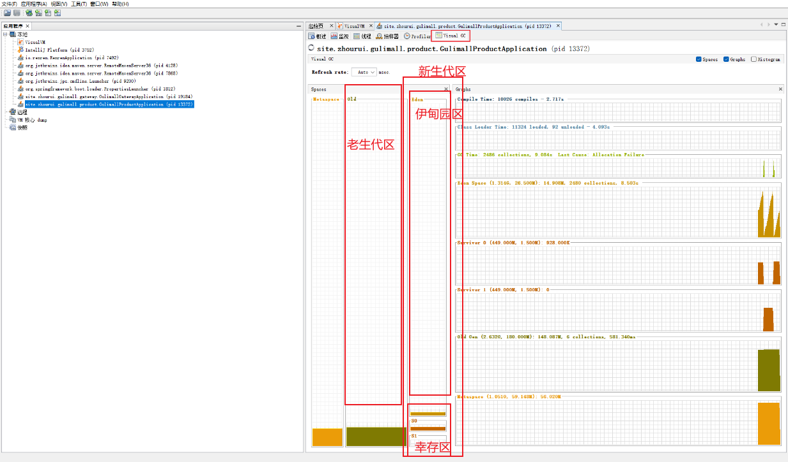


## 2.5 监控指标

### 2.5.1 中间件监控指标

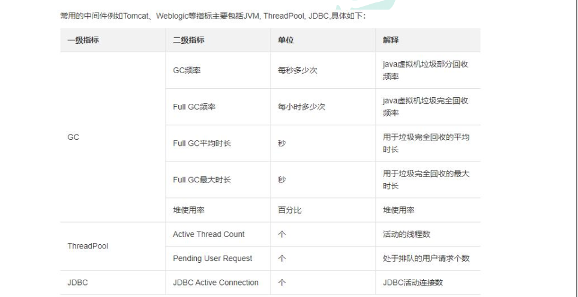

- 当前正在运行的线程数不能超过设定的最大值。 一般情况下系统性能较好的情况下， 线程数最小值设置 50 和最大值设置 200 比较合适。
- 当前运行的 JDBC 连接数不能超过设定的最大值。 一般情况下系统性能较好的情况下，JDBC 最小值设置 50 和最大值设置 200 比较合适。
- Ｇ Ｃ 频率不能频繁， 特别是 FULL GC 更不能频繁， 一般情况下系统性能较好的情况下，JVM 最小堆大小和最大堆大小分别设置 1024M 比较合适。

### 2.5.2 数据库监控指标

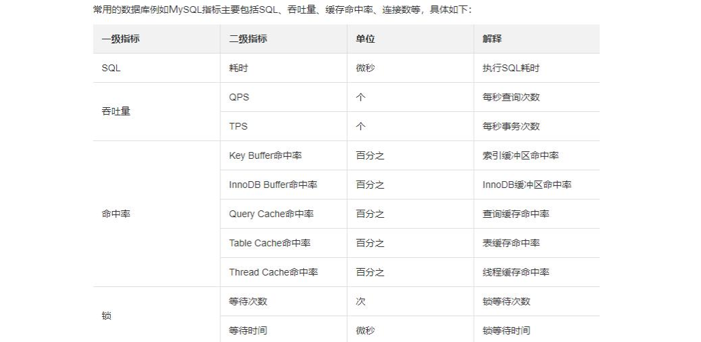

- SQL 耗时越小越好， 一般情况下微秒级别。
- 命中率越高越好， 一般情况下不能低于 95%。
- 锁等待次数越低越好， 等待时间越短越好。


# 3. 压力测试和优化

## 3.1 压测 

### 3.1.1 压测nginx

**动态查看doker各个容器的状态** 

```
#动态查看doker各个容器的状态
docker stats
```


**Nginx未压测状态：**

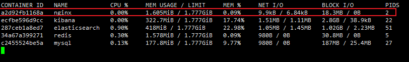

> mem usage是内存使用量
>
> net i/o网络数据传输


**JMeter 压力测试：**

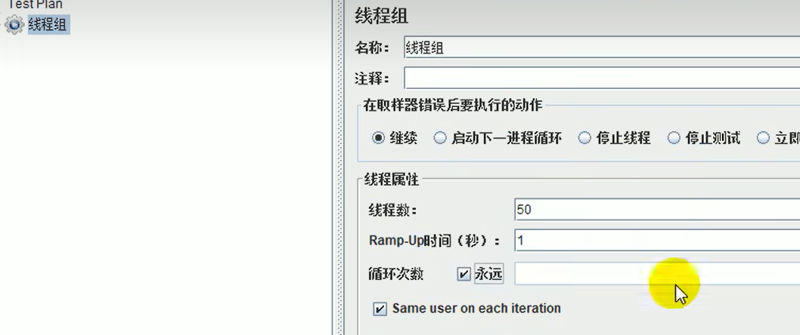 添加取样器：访问首页


50个线程压测后状态，**可以看见Nginx主要浪费CPU：**

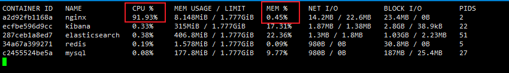

**得出结论nginx是CPU 密集型**

| 压测内容 | 压测线程数 | 吞吐量/s | 90%响应时间 | 99%响应时间 |
| -------- | ---------- | -------- | ----------- | ----------- |
| Nginx    | 50         | 2335     | 11          | 944         |

### 3.1.2 压测网关

**JMeter****添加请求后运行：** 

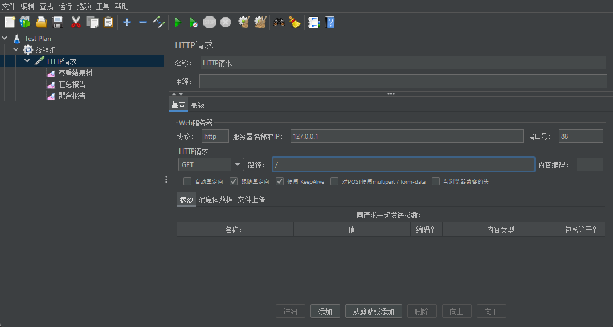

**jvisualvm监测网关**

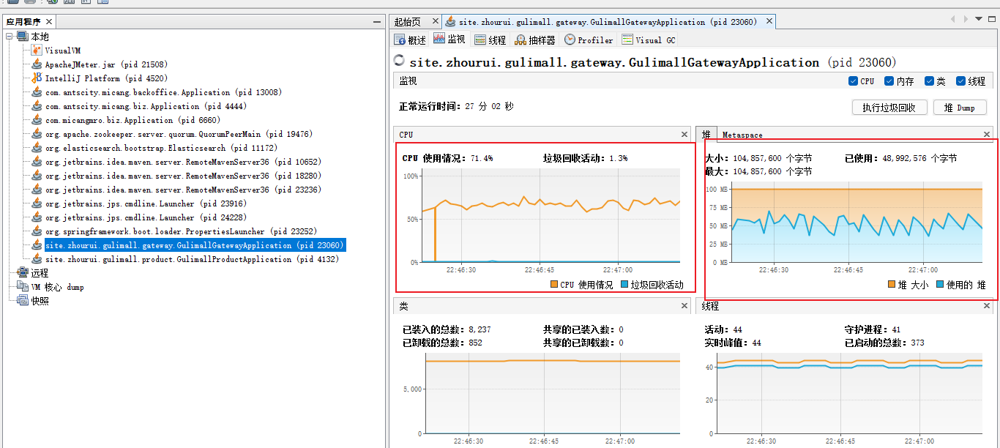

| 压测内容 | 压测线程数 | 吞吐量/s | 90%响应时间 | 99%响应时间 |
| -------- | ---------- | -------- | ----------- | ----------- |
| Nginx    | 50         | 2335     | 11          | 944         |
| Gateway  | 50         | 10367    | 8           | 31          |

> 对cpu与内存进行监控
>
> **得出结论网关也是cup密集型**


> 对gc进行监控
>
> 发现网关的不断在进行轻gc,偶尔执行重gc
>
> 虽然轻gc的次数远远大于重gc的次数,但是所用时间并没有多多少
>
> 得出结论:
>
> 可以适当调大内存区的大小,避免gc次数太多而造成性能的下降

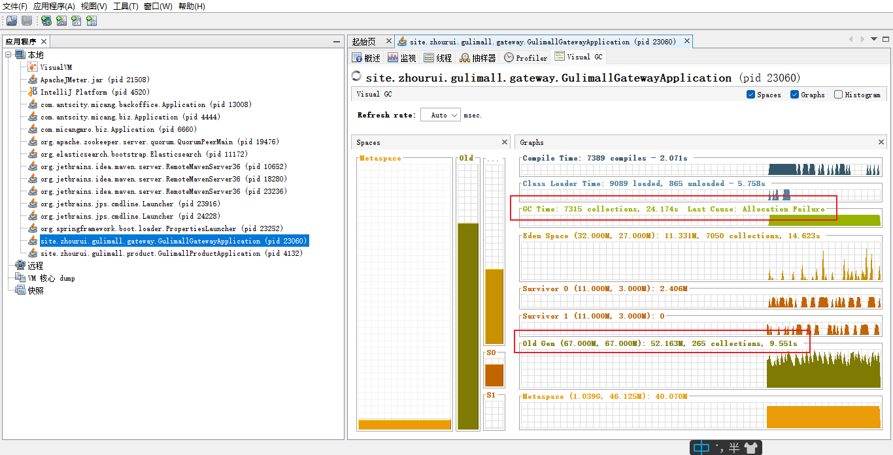

### 3.1.3 压测无业务服务

**添加无业务服务：** 

> gulimall-product/src/main/java/site/zhourui/gulimall/product/web/IndexController.java

```
//压测简单服务(无任何业务逻辑)：
	@ResponseBody
    @GetMapping("/hello")
    public String hello() {
        return "hello";
    }
```


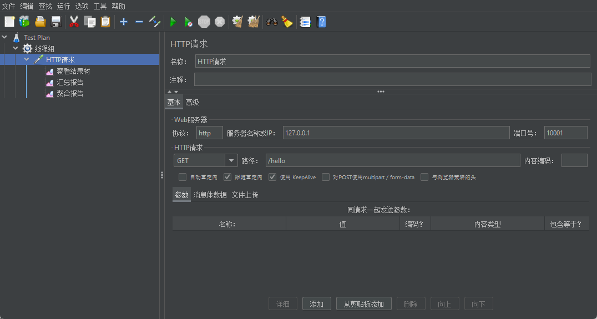

| 压测内容 | 压测线程数 | 吞吐量/s | 90%响应时间 | 99%响应时间 |
| -------- | ---------- | -------- | ----------- | ----------- |
| Nginx    | 50         | 2335     | 11          | 944         |
| Gateway  | 50         | 10367    | 8           | 31          |
| 简单服务 | 50         | 11341    | 8           | 17          |

### 3.1.4 压测首页一级菜单渲染（thymeleaf 关闭缓存） 

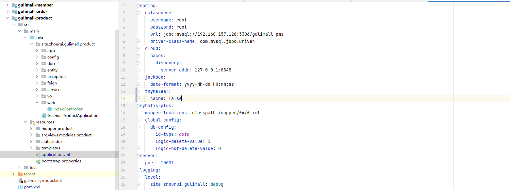

结论： 

| 压测内容         | 压测线程数 | 吞吐量/s          | 90%响应时间 | 99%响应时间 |
| ---------------- | ---------- | ----------------- | ----------- | ----------- |
| Nginx            | 50         | 2335              | 11          | 944         |
| Gateway          | 50         | 10367             | 8           | 31          |
| 简单服务         | 50         | 11341             | 8           | 17          |
| 首页一级菜单渲染 | 50         | 270(db,thymeleaf) | 267         | 365         |


### 3.1.5 压测首页一级菜单渲染（thymeleaf 开启缓存）

thymeleaf开启缓存后吞吐量有一定的提升

| 压测内容           | 压测线程数 | 吞吐量/s          | 90%响应时间 | 99%响应时间 |
| ------------------ | ---------- | ----------------- | ----------- | ----------- |
| Nginx              | 50         | 2335              | 11          | 944         |
| Gateway            | 50         | 10367             | 8           | 31          |
| 简单服务           | 50         | 11341             | 8           | 17          |
| 首页一级菜单渲染   | 50         | 270(db,thymeleaf) | 267         | 365         |
| 首页渲染（开缓存） | 50         | 290               | 251         | 365         |

### 3.1.6 压测首页一级菜单渲染(开缓存,数据库加索引,关日志)

- 开启缓存

  ```
    thymeleaf:
      cache: true
  ```

  

- 对pms_category表的`parent_cid`加上索引

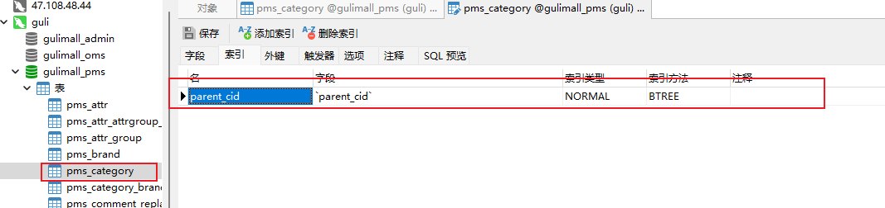

- 关日志

```
logging:
  level:
    site.zhourui.gulimall: error
```


数据库的优化(加索引)对性能的提升还是挺大的

| 压测内容                                  | 压测线程数 | 吞吐量/s          | 90%响应时间 | 99%响应时间 |
| ----------------------------------------- | ---------- | ----------------- | ----------- | ----------- |
| Nginx                                     | 50         | 2335              | 11          | 944         |
| Gateway                                   | 50         | 10367             | 8           | 31          |
| 简单服务                                  | 50         | 11341             | 8           | 17          |
| 首页一级菜单渲染                          | 50         | 270(db,thymeleaf) | 267         | 365         |
| 首页渲染（开缓存）                        | 50         | 290               | 251         | 365         |
| 首页渲染（开缓存、 优化数据库、 关日 志） | 50         | 700               | 105         | 183         |

### 3.1.7 压测三级分类数据获取

主要是数据库导致的吞吐量降低,太慢了

[localhost:10001/index/catalog.json](http://localhost:10001/index/catalog.json)

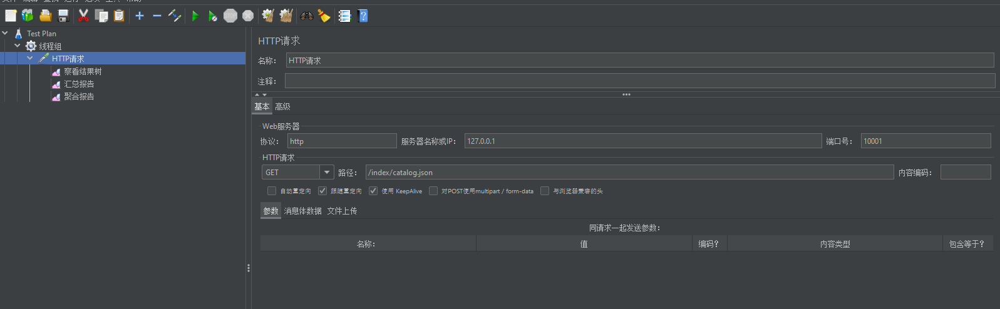

| 压测内容                                  | 压测线程数 | 吞吐量/s          | 90%响应时间 | 99%响应时间 |
| ----------------------------------------- | ---------- | ----------------- | ----------- | ----------- |
| Nginx                                     | 50         | 2335              | 11          | 944         |
| Gateway                                   | 50         | 10367             | 8           | 31          |
| 简单服务                                  | 50         | 11341             | 8           | 17          |
| 首页一级菜单渲染                          | 50         | 270(db,thymeleaf) | 267         | 365         |
| 首页渲染（开缓存）                        | 50         | 290               | 251         | 365         |
| 首页渲染（开缓存、 优化数据库、 关日 志） | 50         | 700               | 105         | 183         |
| 三级分类数据获取                          | 50         | 2(db)             | …           | …           |

### 3.1.8 压测三级分类数据获取(加索引)

对pms_category表的`parent_cid`加上索引


吞吐量有一定的提升

| 压测内容                                  | 压测线程数 | 吞吐量/s          | 90%响应时间 | 99%响应时间 |
| ----------------------------------------- | ---------- | ----------------- | ----------- | ----------- |
| Nginx                                     | 50         | 2335              | 11          | 944         |
| Gateway                                   | 50         | 10367             | 8           | 31          |
| 简单服务                                  | 50         | 11341             | 8           | 17          |
| 首页一级菜单渲染                          | 50         | 270(db,thymeleaf) | 267         | 365         |
| 首页渲染（开缓存）                        | 50         | 290               | 251         | 365         |
| 首页渲染（开缓存、 优化数据库、 关日 志） | 50         | 700               | 105         | 183         |
| 三级分类数据获取                          | 50         | 2(db)             | …           | …           |
| 三级分类数据获取(加索引)                  | 50         | 8                 |             |             |

### 3.1.9 压测三级分类数据获取(优化业务)

1）、优化业务逻辑：
 1、一次性查询出来
 2、将下面查库抽取为方法，不是真的查库baseMapper.selectList(new QueryWrapper().eq(“parent_cid”, level1.getCatId()));抽取为一个方法

**将第一次查询的数据存起来,封装一个方法查询这个数据,就不会重复查询数据库**

**idea抽取方法**

选中右键：refacto=》extract=》Method

优化业务后吞吐量有了质的飞越,说明业务对性能的影响也挺大的

| 压测内容                                  | 压测线程数 | 吞吐量/s          | 90%响应时间 | 99%响应时间 |
| ----------------------------------------- | ---------- | ----------------- | ----------- | ----------- |
| Nginx                                     | 50         | 2335              | 11          | 944         |
| Gateway                                   | 50         | 10367             | 8           | 31          |
| 简单服务                                  | 50         | 11341             | 8           | 17          |
| 首页一级菜单渲染                          | 50         | 270(db,thymeleaf) | 267         | 365         |
| 首页渲染（开缓存）                        | 50         | 290               | 251         | 365         |
| 首页渲染（开缓存、 优化数据库、 关日 志） | 50         | 700               | 105         | 183         |
| 三级分类数据获取                          | 50         | 2(db)             | …           | …           |
| 三级分类数据获取(加索引)                  | 50         | 8                 |             |             |
| 三级分类（ 优化业 务）                    | 50         | 111               | 571         | 896         |

### 3.1.10 三级分类数据获取(使用redis作为缓存)

吞吐量也有比较明显的提升

| 压测内容                                  | 压测线程数 | 吞吐量/s          | 90%响应时间 | 99%响应时间 |
| ----------------------------------------- | ---------- | ----------------- | ----------- | ----------- |
| Nginx                                     | 50         | 2335              | 11          | 944         |
| Gateway                                   | 50         | 10367             | 8           | 31          |
| 简单服务                                  | 50         | 11341             | 8           | 17          |
| 首页一级菜单渲染                          | 50         | 270(db,thymeleaf) | 267         | 365         |
| 首页渲染（开缓存）                        | 50         | 290               | 251         | 365         |
| 首页渲染（开缓存、 优化数据库、 关日 志） | 50         | 700               | 105         | 183         |
| 三级分类数据获取                          | 50         | 2(db)             | …           | …           |
| 三级分类数据获取(加索引)                  | 50         | 8                 |             |             |
| 三级分类（ 优化业 务）                    | 50         | 111               | 571         | 896         |
| 三 级 分 类 （ 使 用 redis 作为缓存）     | 50         | 411               | 153         | 217         |

### 3.1.11 首页全量数据获取(包括静态资源)

之前的压测都没有导入静态资源

| 压测内容                                  | 压测线程数 | 吞吐量/s          | 90%响应时间 | 99%响应时间 |
| ----------------------------------------- | ---------- | ----------------- | ----------- | ----------- |
| Nginx                                     | 50         | 2335              | 11          | 944         |
| Gateway                                   | 50         | 10367             | 8           | 31          |
| 简单服务                                  | 50         | 11341             | 8           | 17          |
| 首页一级菜单渲染                          | 50         | 270(db,thymeleaf) | 267         | 365         |
| 首页渲染（开缓存）                        | 50         | 290               | 251         | 365         |
| 首页渲染（开缓存、 优化数据库、 关日 志） | 50         | 700               | 105         | 183         |
| 三级分类数据获取                          | 50         | 2(db)             | …           | …           |
| 三级分类数据获取(加索引)                  | 50         | 8                 |             |             |
| 三级分类（ 优化业 务）                    | 50         | 111               | 571         | 896         |
| 三 级 分 类 （ 使 用 redis 作为缓存）     | 50         | 411               | 153         | 217         |
| 首页全量数据获取                          | 50         | 7(静态资源)       |             |             |

### 3.1.12 Nginx+Gateway

。。 

### 3.1.13 Gateway+简单服务

**网关yml暂时添加hello路径便与测试：**

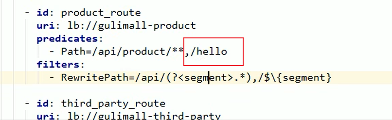

> 此时访问http://localhost:88/hello就是**跳过Nginx，访问网关和商品服务。** 

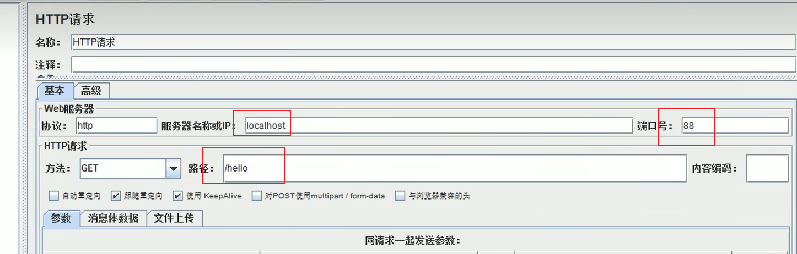

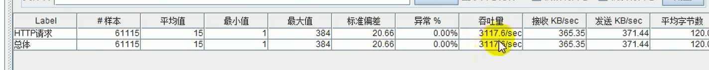


| 压测内容                                  | 压测线程数 | 吞吐量/s          | 90%响应时间 | 99%响应时间 |
| ----------------------------------------- | ---------- | ----------------- | ----------- | ----------- |
| Nginx                                     | 50         | 2335              | 11          | 944         |
| Gateway                                   | 50         | 10367             | 8           | 31          |
| 简单服务                                  | 50         | 11341             | 8           | 17          |
| 首页一级菜单渲染                          | 50         | 270(db,thymeleaf) | 267         | 365         |
| 首页渲染（开缓存）                        | 50         | 290               | 251         | 365         |
| 首页渲染（开缓存、 优化数据库、 关日 志） | 50         | 700               | 105         | 183         |
| 三级分类数据获取                          | 50         | 2(db)             | …           | …           |
| 三级分类数据获取(加索引)                  | 50         | 8                 |             |             |
| 三级分类（ 优化业 务）                    | 50         | 111               | 571         | 896         |
| 三 级 分 类 （ 使 用 redis 作为缓存）     | 50         | 411               | 153         | 217         |
| 首页全量数据获取                          | 50         | 7(静态资源)       |             |             |
| Nginx+Gateway                             | 50         |                   |             |             |
| Gateway+简单服务                          | 50         | 3124              | 30          | 125         |

### 3.1.14 结论，中间件对性能的影响

- SQL 耗时越小越好， 一般情况下微秒级别。
- 命中率越高越好， 一般情况下不能低于 95%。
- 锁等待次数越低越好， 等待时间越短越好。

| 压测内容                                  | 压测线程数 | 吞吐量/s          | 90%响应时间 | 99%响应时间 |
| ----------------------------------------- | ---------- | ----------------- | ----------- | ----------- |
| Nginx                                     | 50         | 2335              | 11          | 944         |
| Gateway                                   | 50         | 10367             | 8           | 31          |
| 简单服务                                  | 50         | 11341             | 8           | 17          |
| 首页一级菜单渲染                          | 50         | 270(db,thymeleaf) | 267         | 365         |
| 首页渲染（开缓存）                        | 50         | 290               | 251         | 365         |
| 首页渲染（开缓存、 优化数据库、 关日 志） | 50         | 700               | 105         | 183         |
| 三级分类数据获取                          | 50         | 2(db)             | …           | …           |
| 三级分类数据获取(加索引)                  | 50         | 8                 |             |             |
| 三级分类（ 优化业 务）                    | 50         | 111               | 571         | 896         |
| 三 级 分 类 （ 使 用 redis 作为缓存）     | 50         | 411               | 153         | 217         |
| 首页全量数据获取                          | 50         | 7(静态资源)       |             |             |
| Nginx+Gateway                             | 50         |                   |             |             |
| Gateway+简单服务                          | 50         | 3124              | 30          | 125         |
| 全链路简单服务                            | 50         | 800               | 88          | 310         |

- **中间件越多， 性能损失越大， 大多都损失在网络交互了；**
- 业务期间需要考虑的问题：
  - 数据库（MySQL 优化）
  - 模板的渲染速度（开发时关闭缓存，上线后一定要缓存）
  - 静态资源

## 3.2 优化，动静分离

### 3.2.1 什么要动静分离

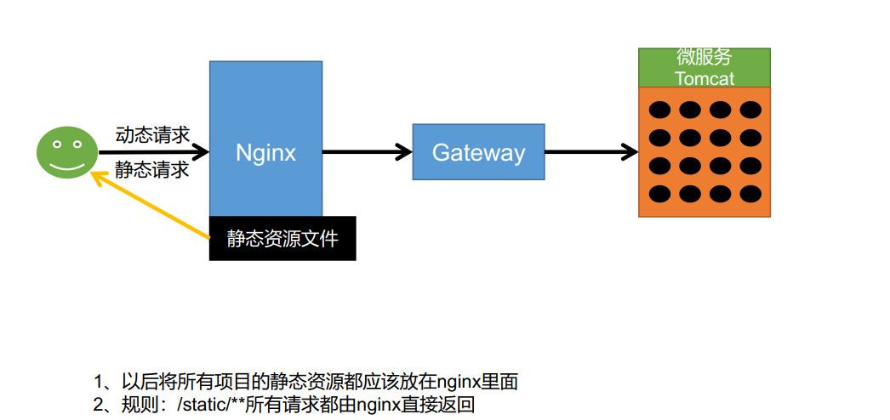

**为什么要进行动静分离?**

未分离的项目静态资源放在后端,无论是**动态请求还是静态请求都会来到后台**,这极大的损耗了后台Tomcat性能(大部分性能都用来处理静态请求)

动静分离后,后台只会处理动态请求,而静态资源直接由nginx返回。

### 3.2.2 静态资源存到Nginx里

1.在nginx的html目录下新建一个static目录用来存放静态资源

```
mkdir /mydata/nginx/html/static
cd /mydata/nginx/html/static
```


2.将gulimall-product的静态资源复制到该目录,并将本地静态资源删除

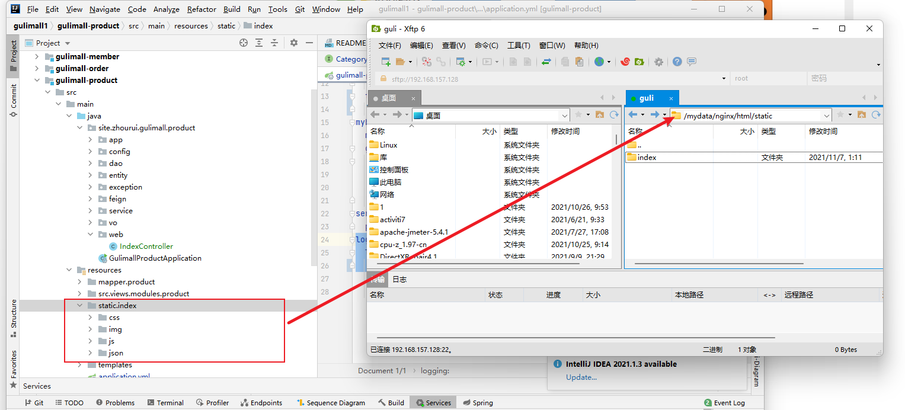

### 3.2.3 templates里文件静态资源路径前“static”

> **开发期间关掉thymeleaf缓存：**
>
> 商品模块的yml里
>
> 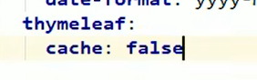

> gulimall-product/src/main/resources/templates/index.html

将原来的index/xxx路径修改为/static/index/xxx

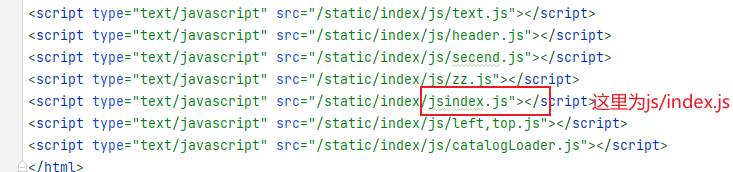

### 3.2.4 在nginx配置静态资源的路径映射

```
vim /mydata/nginx/conf/conf.d/gulimall.conf 
```


配置如下内容

```bash
#监听gulimall.com:80/static
location /static {
    root  /usr/share/nginx/html;       #资源在这个文件夹下匹配
}
```


> **注意：**静态路径要配置在“/” 路径上面，防止覆盖。
>
> 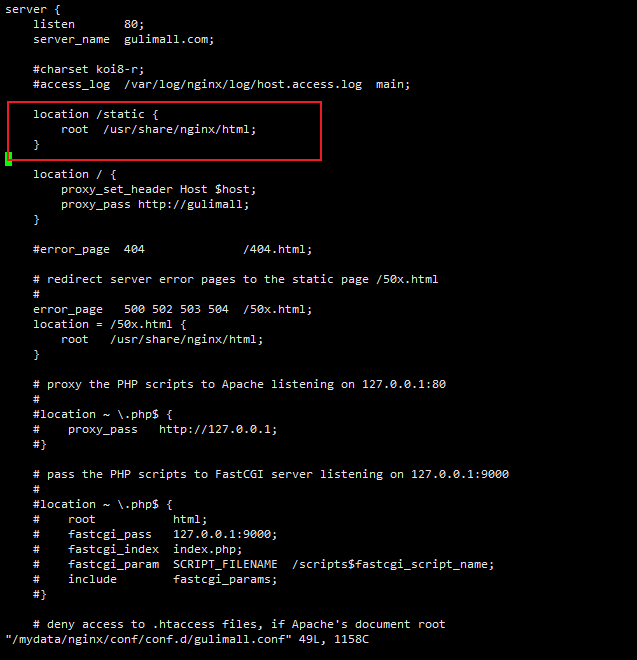

### 3.2.5 测试

刷新后静态资源加载成功

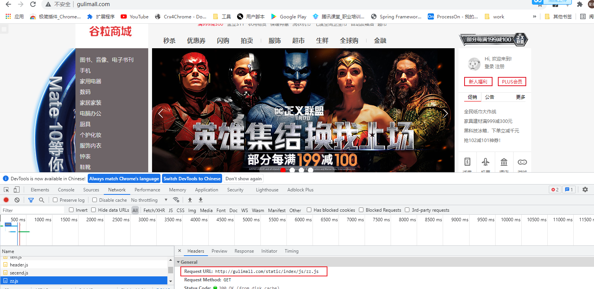

## 3.3 优化，模拟内存崩溃宕机问题

JMeter每秒200个线程：

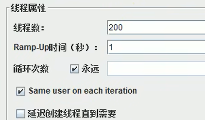

让老生代内存饱满：

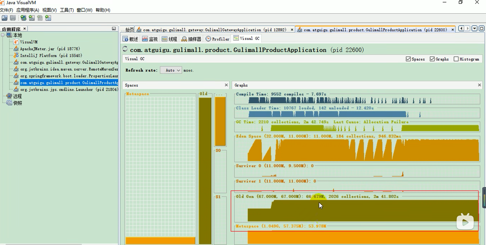

发现线上服务崩溃：

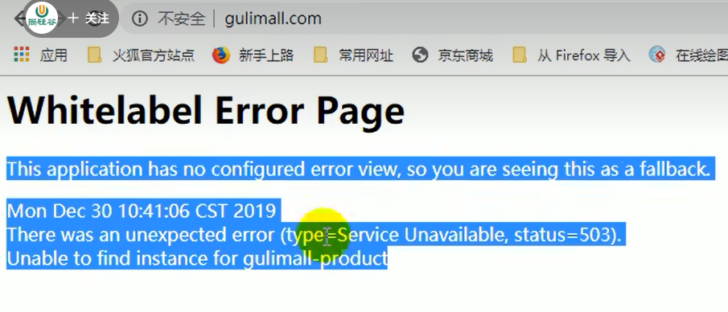


堆内存溢出，线上应用内存崩溃宕机

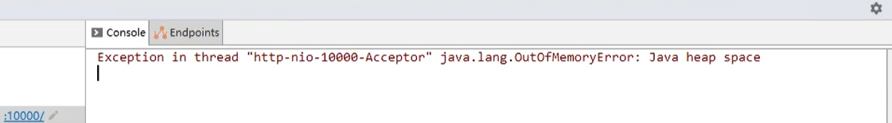

> **原因:**
>
> 服务分配的内存太小,导致新生代,老年代空间都满了,gc 后也没有空间

**解决方案:**

调大堆内存

-Xmx1024m -Xms1024m -Xmn512m

- **-Xms** :初始堆大小
- **-Xmx** :最大堆大小
- **-Xmn** :堆中新生代初始及最大大小

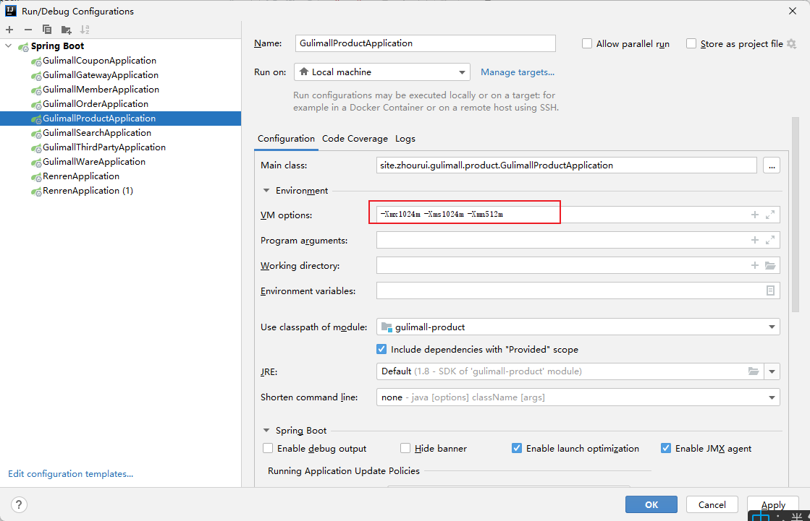

## 3.4 优化三级分类数据获取

### 3.4.1 当前问题

每次遍历一级分类列表里的元素，都要查一次数据库。


### 3.4.2 将数据库的多次查询变为一次

**抽取方法：**

```
CategoryServiceImpl
```


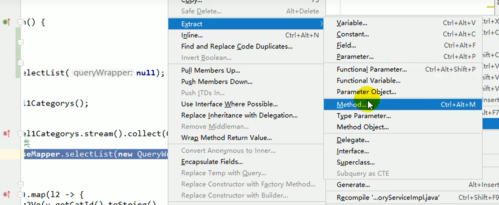


 抽取后：

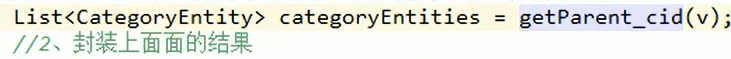

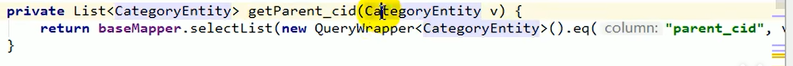 **修改抽取的方法，不用再查询数据库：**

```java
    private List<CategoryEntity> getParent_cid(List<CategoryEntity> selectList,Long parentCid) {
        List<CategoryEntity> categoryEntities = selectList.stream().filter(item -> item.getParentCid().equals(parentCid)).collect(Collectors.toList());
        return categoryEntities;
    }
```


 测试：

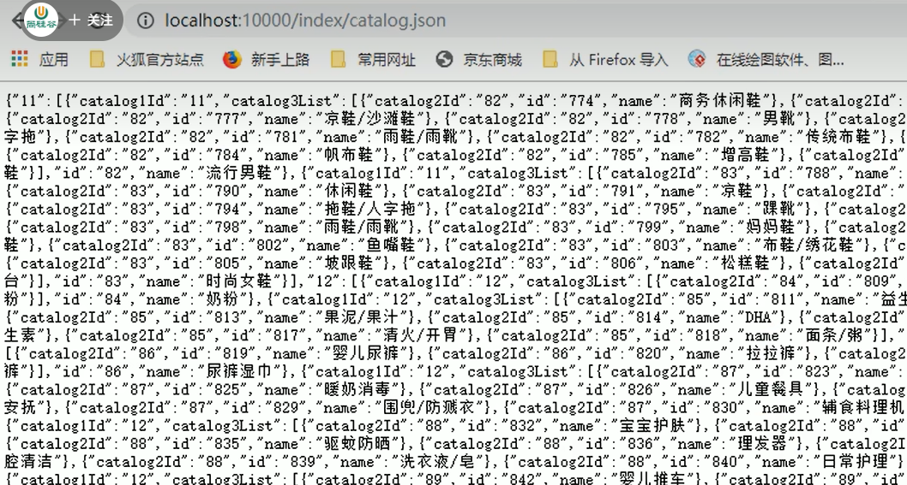

**JMeter 压力测试发现性能优化很多。**