>  **导航：**
>
> [谷粒商城笔记+踩坑汇总篇](https://blog.csdn.net/qq_40991313/article/details/127099139?spm=1001.2014.3001.5501)
>
>  **Java笔记汇总：**
>
> [【Java笔记+踩坑汇总】Java基础+JavaWeb+SSM+SpringBoot+SpringCloud+瑞吉外卖/谷粒商城/学成在线+设计模式+面试题汇总+性能调优/架构设计+源码解析-CSDN博客](https://blog.csdn.net/qq_40991313/article/details/126646289)

[TOC]


# 1 缓存与分布式锁

## 1.1 缓存

为了系统性能的提升， 我们一般都会将部分数据放入缓存中， 加速访问。 而 db 承担数据落盘工作。

### 1.1.1 哪些数据适合放入缓存

- 即时性、 数据一致性要求不高的
- 访问量大且更新频率不高的数据（读多， 写少）

举例： 电商类应用， 商品分类， 商品列表等适合缓存并加一个失效时间(根据数据更新频率来定)， 后台如果发布一个商品， 买家需要 5 分钟 才能看到新的商品一般还是可以接受的。

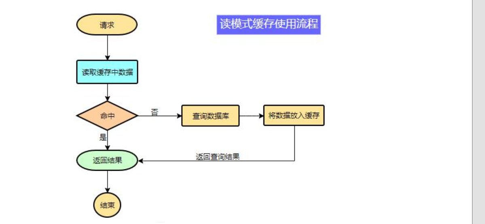

> **注意:**在开发中， 凡是放入缓存中的数据我们都应该指定过期时间， 使其可以在系统即使没有主动更新数据也能自动触发数据加载进缓存的流程。 避免业务崩溃导致的数据永久不一致问题

### 1.1.2 本地缓存

本地缓存可以用map实现,将需要缓存的数据存入map,查询时先判断是否为空,不为空就直接从map中取值,不用查询数据库,不为空就需要查询数据,并将数据存入map中,下次查询就不用查询数据库

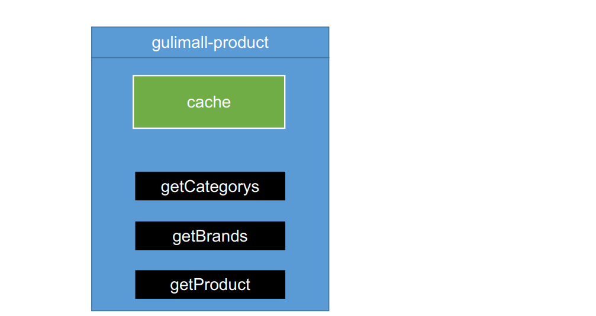

> 本地缓存在分布式下的问题
>
> 1. **集群下的本地缓存不共享**，存在于jvm中【并且负载均衡到新的机器后会重新查询】
> 2. **数据一致性：**如果一台机器修改了数据库+缓存，但是集群下其他机器的缓存未修改所以分布式情况下不使用本地缓存

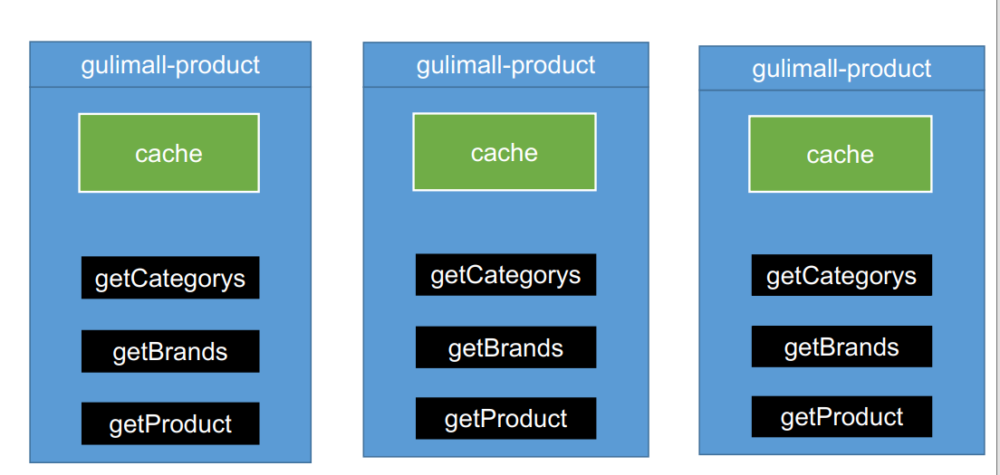

### 1.1.3 分布式缓存(Redis作为缓存中间件)

使用redis作为缓存中间件

**redis内存不足时可以进行集群+分片操作**

如:redis：
 集群+分片【110000,1000120000】

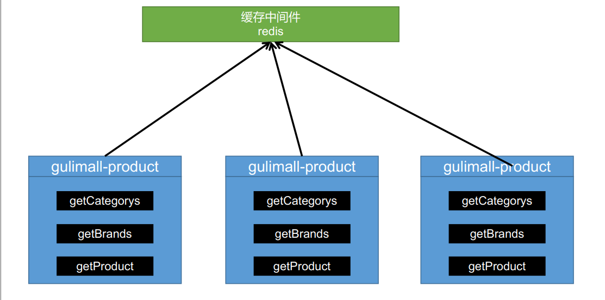

### 1.1.4 springboot整合redis实现缓存

- 引入依赖

> gulimall-product/pom.xml

```XML
		<!--redis-->
        <dependency>
            <groupId>org.springframework.boot</groupId>
            <artifactId>spring-boot-starter-data-redis</artifactId>
        </dependency>
```


1. 配置redis属性，host，port

   ```bash
   spring:
     redis:
       host: 192.168.157.128
       port: 6379
   ```

   

2. 测试

> gulimall-product/src/test/java/site/zhourui/gulimall/product/GulimallProductApplicationTests.java

```java
 @Autowired
    StringRedisTemplate redisTemplate;
    @Test
    public void testRedis() {
        ValueOperations<String, String> ops = redisTemplate.opsForValue();
        // 保存
        ops.set("hello", "world_" + UUID.randomUUID().toString());
        // 查询
        String hello = ops.get("hello");
        System.out.println(hello);

    }
```


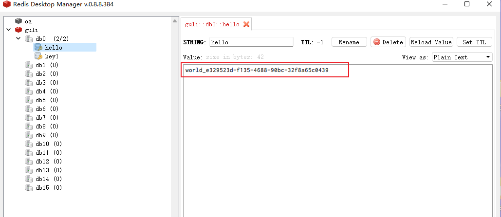

### 1.1.5 三级分类业务实现缓存

```
商品模块CategoryServiceImpl
	Autowired
    StringRedisTemplate redisTemplate;

 	@Override
    public Map<String, List<Catalog2Vo>> getCatalogJson() {
        //1.加入缓存逻辑
        String catelogJSON = redisTemplate.opsForValue().get("catelogJSON");
        if (StringUtils.isEmpty(catelogJSON)){
            //2.缓存中没有,查询数据库
            Map<String, List<Catalog2Vo>> catalogJsonFromDb = getCatalogJsonFromDb();
            //3.查到的数据再放入缓存,将对象转为json放在缓存中
            String s = JSON.toJSONString(catalogJsonFromDb);
            redisTemplate.opsForValue().set("catelogJSON",s);
        }
        Map<String, List<Catalog2Vo>> result = JSON.parseObject(catelogJSON, new TypeReference<Map<String, List<Catalog2Vo>>>() {
        });
        return result;
    }

    //从数据库查询并封装分类的数据
    public Map<String, List<Catalog2Vo>> getCatalogJsonFromDb() {
        // 一次性获取所有 数据
        List<CategoryEntity> selectList = baseMapper.selectList(null);
        System.out.println("调用了 getCatalogJson  查询了数据库........【三级分类】");
        // 1）、所有1级分类
        List<CategoryEntity> level1Categorys = getParent_cid(selectList, 0L);

        // 2）、封装数据
        Map<String, List<Catalog2Vo>> collect = level1Categorys.stream().collect(Collectors.toMap(k -> k.getCatId().toString(), level1 -> {
            // 查到当前1级分类的2级分类
            List<CategoryEntity> category2level = getParent_cid(selectList, level1.getCatId());
            List<Catalog2Vo> catalog2Vos = null;
            if (category2level != null) {
                catalog2Vos = category2level.stream().map(level12 -> {
                    // 查询当前2级分类的3级分类
                    List<CategoryEntity> category3level = getParent_cid(selectList, level12.getCatId());
                    List<Catalog2Vo.Catalog3Vo> catalog3Vos = null;
                    if (category3level != null) {
                        catalog3Vos = category3level.stream().map(level13 -> {
                            return new Catalog2Vo.Catalog3Vo(level12.getCatId().toString(), level13.getCatId().toString(), level13.getName());
                        }).collect(Collectors.toList());
                    }
                    return new Catalog2Vo(level1.getCatId().toString(), catalog3Vos, level12.getCatId().toString(), level12.getName());
                }).collect(Collectors.toList());
            }
            return catalog2Vos;
        }));
        return collect;
    }
```


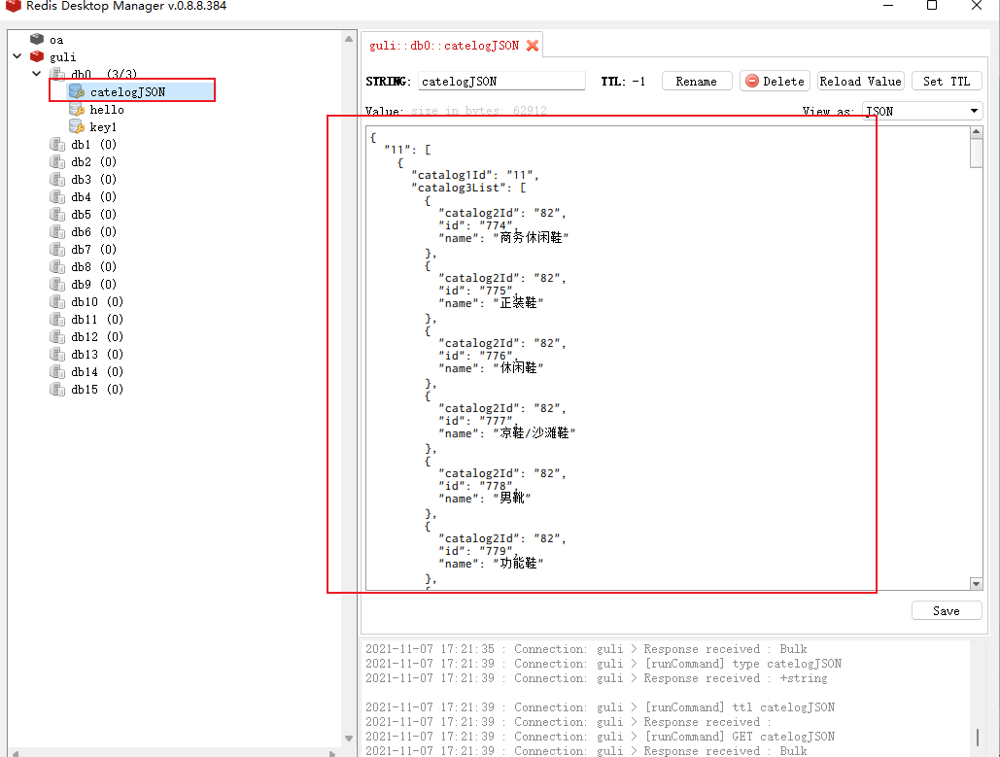

### 1.1.6 压测内存泄露及解决

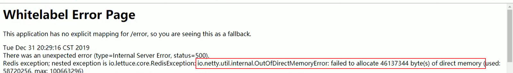

> **原因**
>
> 1. springboot2.0以后**默认使用lettuce作为操作redis的客户端**。他使用netty进行网络通信
> 2. lettuce的bug导致netty堆外内存溢出 -Xmx300m；netty如果没有指定堆外内存，默认使用-Xmx300m，跟jvm设置的一样【迟早会出异常】

不能使用-Dio.netty.maxDirectMemory调大堆外内存，迟早会出问题。 

**解决方案**

1. **升级lettuce客户端（推荐）**；【2.3.2已解决】【lettuce使用netty吞吐量很大】
2. 切换使用jedis客户端

> **使用jedis（仅学习，推荐升级lettuce客户端）**
>
> ```XML
>  		<!--redis-->
>         <dependency>
>             <groupId>org.springframework.boot</groupId>
>             <artifactId>spring-boot-starter-data-redis</artifactId>
>             <exclusions>
>                 <exclusion>
>                     <groupId>io.lettuce</groupId>
>                     <artifactId>lettuce-core</artifactId>
>                 </exclusion>
>             </exclusions>
>         </dependency>
>         <!--jedis，redis客户端-->
>         <dependency>
>             <groupId>redis.clients</groupId>
>             <artifactId>jedis</artifactId>
>         </dependency>
> ```
>
> 
>
> ```bash
> spring:
>   redis:
>     host: localhost
>     port: 6379
>     client-type: jedis
> ```
>
> 

### 1.1.7 RedisTemplate底层原理

Lettuce和Jedis是**redis的客户端**，RedisTemplate是对Lettuce和Jedis的再一层封装

- 1、RedisAutoConfiguration自动配置类，会导入Lettuce和Jedis的配置类
- 2、JedisConfiguration.java类会给容器放一个@Bean：：JedisConnectionFactory

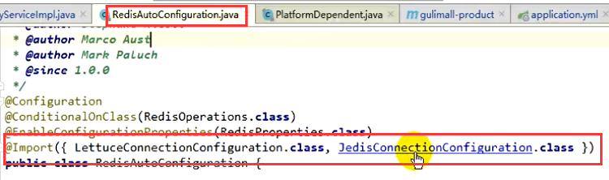


## 1.2 高并发下缓存失效问题

### 1.2.1 缓存穿透

**缓存穿透**：指**查询一个数据库和缓存库都不存在的数据**，每次查询都要查缓存库和数据库，一秒钟查一万次就要访问一万次数据库，这将导致数据库压力过大。如果我们在第一次查的时候就将查到的null加入缓存库并设置过期时间，这时一秒钟查一万次都不会再查数据库了，因为缓存库查到值了。


**风险**：利用不存在的数据进行攻击，数据库瞬时压力增大，最终导致崩溃缓存

**解决**：

1. **采用：**数据库查的**空值放入缓存**，并加入短暂**过期时间**
2. 布隆过滤器（请求先查布隆过滤器、再查缓存库、数据库）

> 例如**字符串"null"**放进Redis。
>
> Redis存的值是fastjson转换后的对象字符串，null转字符串后是字符串“null”，存到Redis里是能查到的。

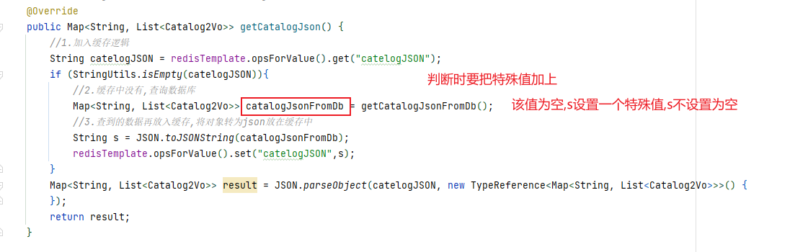


### 1.2.2 缓存雪崩

**缓存雪崩**：缓存雪崩是指在我们设置缓存时key采用了**相同的过期时间**，导致**缓存在某一时刻同时失效**，请求全部转发到DB，**DB瞬时压力过重雪崩**。

**解决**：

1. 原有的**失效时间基础上增加一个随机值**，比如1-5分钟随机，这样每一个缓存的过期时间的重复率就会降低，就很难引发集体失效的事件。
2. 降级和熔断
3. 采用哨兵或集群模式，从而构建高可用的Redis服务

**如果已经发生缓存血崩：**熔断、降级


### 1.2.3 缓存击穿 【分布式锁】

一条数据过期了，还没来得及存null值解决缓存穿透，**高并发情况下导致所有请求到达DB**
 **解决：**加分布式锁,获取到锁，先查缓存，其他人就有数据，不用去DB

**缓存击穿**：

- 对于一些设置了过期时间的key，如果这些key可能会在某些时间点被超高并发地访问，是一种非常“热点”的数据。
- 如果这个key在大量请求同时进来前正好失效，那么所有对这个key的数据查询都落到db，我们称为缓存击穿

**解决**：

1. **采用：加互斥锁。**大量并发只让一个去查，其他人等待，查到以后释放锁，其他人获取到锁，先查缓存，就会有数据，不用去db
2. 热点数据不设置过期时间


## 1.3 本地锁

### 1.3.1 本地锁 synchronized，给查询三级分类方法加锁 

> **为什么要加锁？**
>
> 给整个缓存方法加锁，防止缓存击穿，即短时间内，还没来得及存null值解决缓存穿透，高并发情况下导致所有请求到达DB。 
>
> 大量并发只让一个去查，其他人等待，查到以后释放锁，其他人获取到锁，先查缓存，就会有数据，不用去db

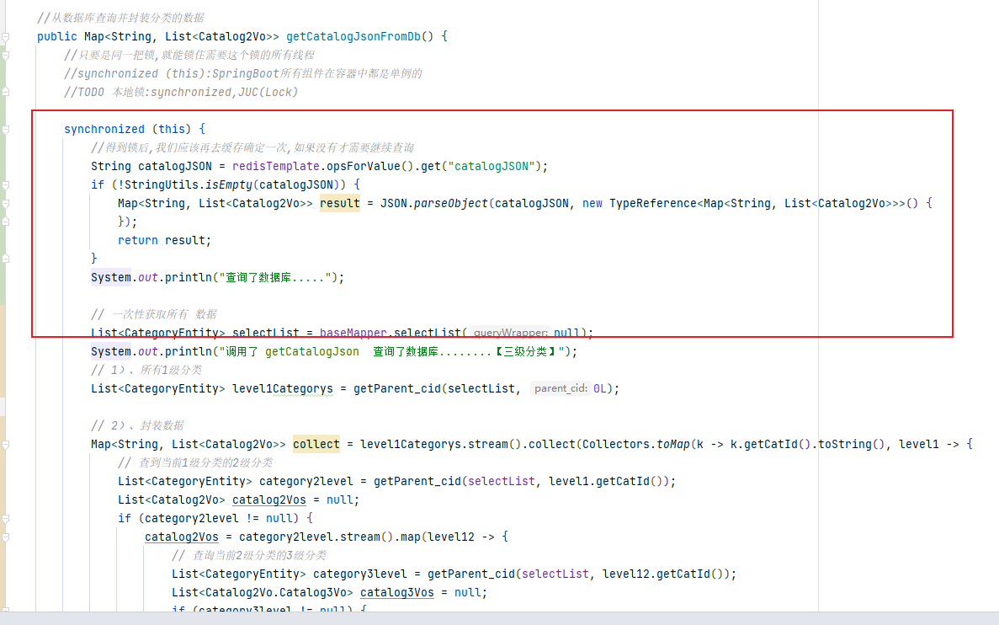

```java
//从数据库查询并封装分类的数据
    public Map<String, List<Catalog2Vo>> getCatalogJsonFromDb() {
        //只要是同一把锁,就能锁住需要这个锁的所有线程
        //synchronized (this):SpringBoot所有组件在容器中都是单例的
        //TODO 本地锁:synchronized,JUC(Lock)

    //this代表当前实例对象，这里是锁当前对象。
        synchronized (this) {
            //得到锁后,我们应该再去缓存确定一次,如果没有才需要继续查询
            String catalogJSON = redisTemplate.opsForValue().get("catalogJSON");
            if (!StringUtils.isEmpty(catalogJSON)) {
                Map<String, List<Catalog2Vo>> result = JSON.parseObject(catalogJSON, new TypeReference<Map<String, List<Catalog2Vo>>>() {
                });
                return result;
            }
            System.out.println("查询了数据库.....");

            // 一次性获取所有 数据
            List<CategoryEntity> selectList = baseMapper.selectList(null);
            System.out.println("调用了 getCatalogJson  查询了数据库........【三级分类】");
            // 1）、所有1级分类
            List<CategoryEntity> level1Categorys = getParent_cid(selectList, 0L);

            // 2）、封装数据
            Map<String, List<Catalog2Vo>> collect = level1Categorys.stream().collect(Collectors.toMap(k -> k.getCatId().toString(), level1 -> {
                // 查到当前1级分类的2级分类
                List<CategoryEntity> category2level = getParent_cid(selectList, level1.getCatId());
                List<Catalog2Vo> catalog2Vos = null;
                if (category2level != null) {
                    catalog2Vos = category2level.stream().map(level12 -> {
                        // 查询当前2级分类的3级分类
                        List<CategoryEntity> category3level = getParent_cid(selectList, level12.getCatId());
                        List<Catalog2Vo.Catalog3Vo> catalog3Vos = null;
                        if (category3level != null) {
                            catalog3Vos = category3level.stream().map(level13 -> {
                                return new Catalog2Vo.Catalog3Vo(level12.getCatId().toString(), level13.getCatId().toString(), level13.getName());
                            }).collect(Collectors.toList());
                        }
                        return new Catalog2Vo(level1.getCatId().toString(), catalog3Vos, level12.getCatId().toString(), level12.getName());
                    }).collect(Collectors.toList());
                }
                return catalog2Vos;
            }));

            return collect;
        }
    }
```


> **本地锁缺点：**
>
> **本地锁只能锁住当前进程**，高并发下，集群下有一百台机器，就会放一百个请求进锁查数据库。 
>
> 分布式情况下，要用**分布式锁**。

### 1.3.2 本地锁时序问题 

**模拟情况：**仅确认缓存和查数据库放在锁里，放null进缓存在锁外面。 

**原因:**压测时，第一个线程刚释放锁，还没来得及将结果放入Redis缓存，第二个线程就拿到锁。

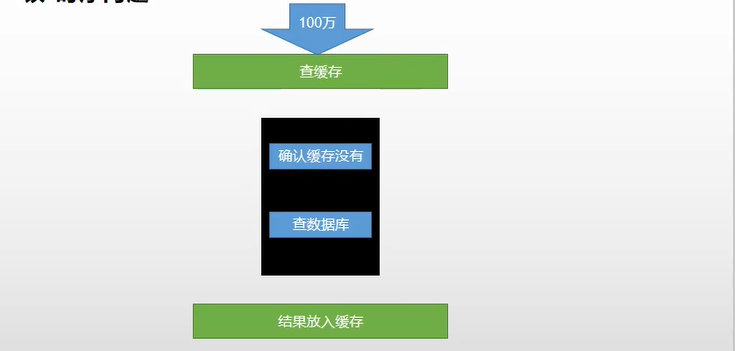

**因此会查了两次数据库：**


**解决办法:**

把存入缓存的操作放在锁中

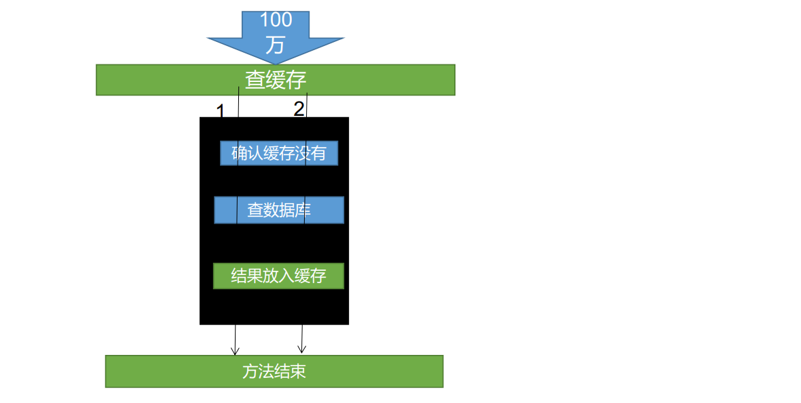

**优化代码:**

```java
// TODO 产生堆外内存溢出：OutOfDirectMemoryError
    // 1）springboot2.0以后默认使用lettuce作为操作redis的客户端。他使用netty进行网络通信
    // 2）lettuce的bug导致netty堆外内存溢出 -Xmx1024m；netty如果没有指定堆外内存，默认使用-Xmx1024m，跟jvm设置的一样【迟早会出异常】
    //  可以通过-Dio.netty.maxDirectMemory进行设置【仍然会异常】
    //  解决方案：不能使用-Dio.netty.maxDirectMemory
    //  1）升级lettuce客户端；【2.3.2已解决】【lettuce使用netty吞吐量很大】
    //  2）切换使用jedis客户端【这里学习一下如何使用jedis，但是最后不选用】
    @Override
    public Map<String, List<Catalog2Vo>> getCatalogJson() {
        //1.加入缓存逻辑
        String catelogJSON = redisTemplate.opsForValue().get("catelogJSON");
        if (StringUtils.isEmpty(catelogJSON)){
            //2.缓存中没有,查询数据库
            System.out.println("缓存未命中.....查询数据库");
            Map<String, List<Catalog2Vo>> catalogJsonFromDb = getCatalogJsonFromDb();
            //3.查到的数据再放入缓存,将对象转为json放在缓存中


        }
        System.out.println("缓存命中.....直接返回");
        Map<String, List<Catalog2Vo>> result = JSON.parseObject(catelogJSON, new TypeReference<Map<String, List<Catalog2Vo>>>() {
        });
        return result;
    }

    //从数据库查询并封装分类的数据
    public Map<String, List<Catalog2Vo>> getCatalogJsonFromDb() {
        //只要是同一把锁,就能锁住需要这个锁的所有线程
        //synchronized (this):SpringBoot所有组件在容器中都是单例的
        //TODO 本地锁:synchronized,JUC(Lock)

        synchronized (this) {
            //得到锁后,我们应该再去缓存确定一次,如果没有才需要继续查询
            String catalogJSON = redisTemplate.opsForValue().get("catalogJSON");
            if (!StringUtils.isEmpty(catalogJSON)) {
                Map<String, List<Catalog2Vo>> result = JSON.parseObject(catalogJSON, new TypeReference<Map<String, List<Catalog2Vo>>>() {
                });
                return result;
            }
            System.out.println("查询了数据库.....");

            // 一次性获取所有 数据
            List<CategoryEntity> selectList = baseMapper.selectList(null);
            System.out.println("调用了 getCatalogJson  查询了数据库........【三级分类】");
            // 1）、所有1级分类
            List<CategoryEntity> level1Categorys = getParent_cid(selectList, 0L);

            // 2）、封装数据
            Map<String, List<Catalog2Vo>> collect = level1Categorys.stream().collect(Collectors.toMap(k -> k.getCatId().toString(), level1 -> {
                // 查到当前1级分类的2级分类
                List<CategoryEntity> category2level = getParent_cid(selectList, level1.getCatId());
                List<Catalog2Vo> catalog2Vos = null;
                if (category2level != null) {
                    catalog2Vos = category2level.stream().map(level12 -> {
                        // 查询当前2级分类的3级分类
                        List<CategoryEntity> category3level = getParent_cid(selectList, level12.getCatId());
                        List<Catalog2Vo.Catalog3Vo> catalog3Vos = null;
                        if (category3level != null) {
                            catalog3Vos = category3level.stream().map(level13 -> {
                                return new Catalog2Vo.Catalog3Vo(level12.getCatId().toString(), level13.getCatId().toString(), level13.getName());
                            }).collect(Collectors.toList());
                        }
                        return new Catalog2Vo(level1.getCatId().toString(), catalog3Vos, level12.getCatId().toString(), level12.getName());
                    }).collect(Collectors.toList());
                }
                return catalog2Vos;
            }));
//            redisTemplate.opsForValue().set("catelogJSON",s);
            String s = JSON.toJSONString(collect);
            redisTemplate.opsForValue().set("catelogJSON",s,1, TimeUnit.DAYS);
            return collect;
        }
    }
```


再次测试:

只有一次了

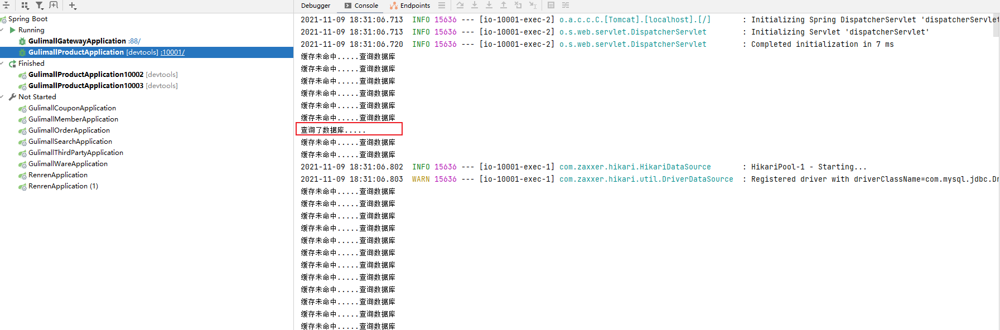

### 1.3.3 本地锁在分布式场景的缺陷

**本地锁只能锁住当前进程**

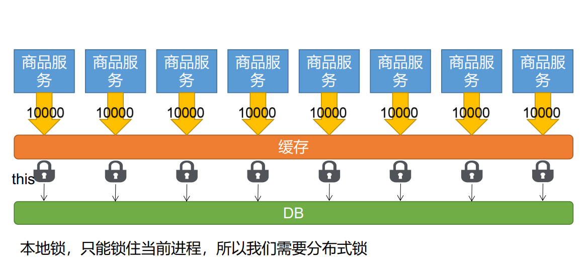

测试:新增几个容器


**压测**

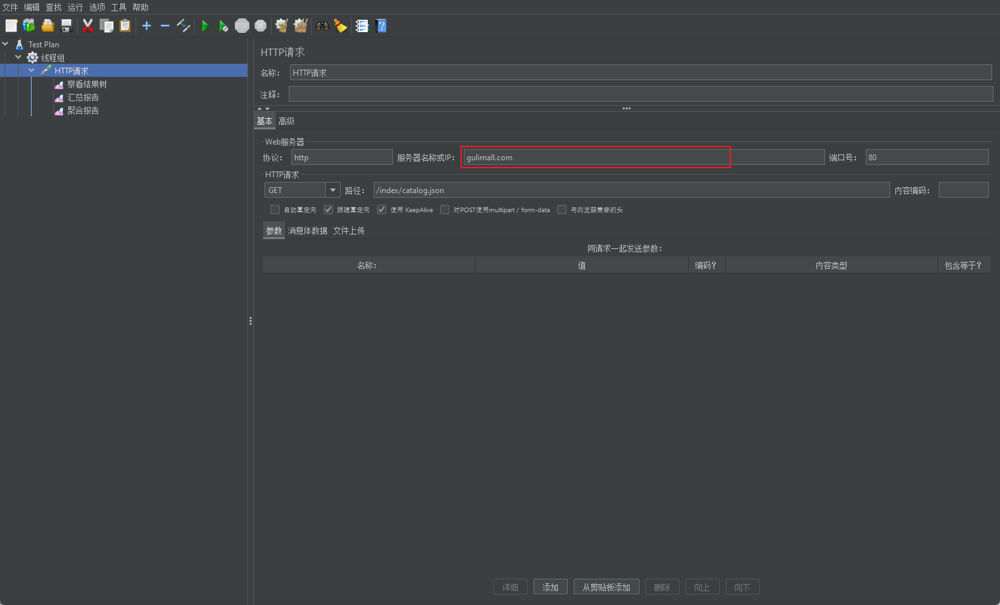

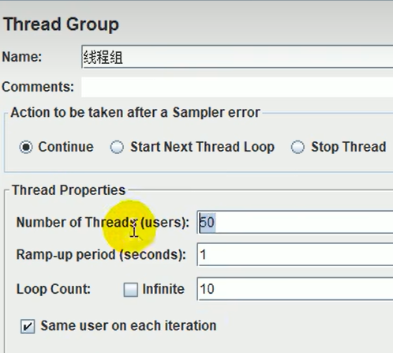

**测试发现：** 每个服务都对数据库进行了一次查询操作,得出结论**本地锁只能锁本地服务**

10001商品服务

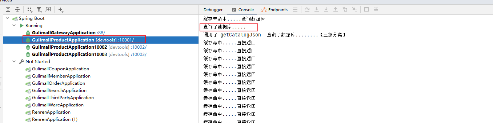

10002商品服务

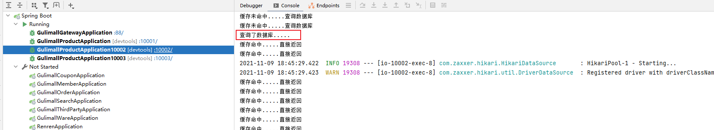

10003商品服务

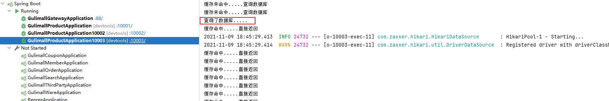


## 1.4 分布式锁

### 1.4.1 分布式锁原理

**分布式锁最重要的是要保证占锁与删锁的原子性。**

 所有的锁都到一个地方“占坑”：

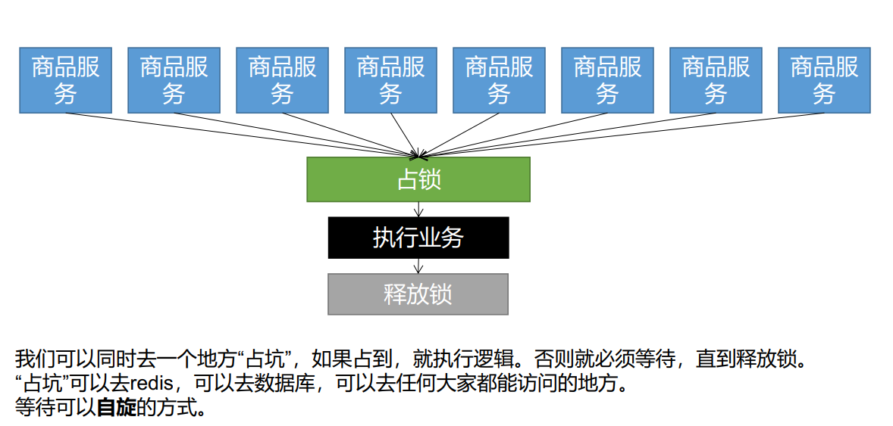


### 1.4.2 Redis的set命令完整版

[set 命令 -- Redis中国用户组（CRUG）](http://www.redis.cn/commands/set.html)

```java
SET key value [EX seconds] [PX milliseconds] [NX|XX]
```


**`EX` \*seconds\* –** 设置键key的过期时间，单位时秒。原子性实现加锁和设置锁过期时间，防止死锁。

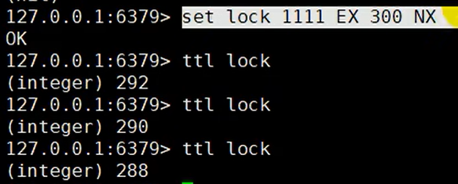


**`PX` \*milliseconds\* –** 设置键key的过期时间，单位时毫秒

**`NX` –** 只有键key不存在的时候才会设置key的值。实现分布式锁

**`XX` –** 只有键key存在的时候才会设置key的值

```java
        Boolean lock = redisTemplate.opsForValue()
.setIfAbsent("lock", UUID.randomUUID().toString(), 300, TimeUnit.SECONDS);
```


**解锁脚本（原子性判断锁和删除锁）：**

```java
if redis.call("get",KEYS[1]) == ARGV[1]
then
    return redis.call("del",KEYS[1])
else
    return 0
end
```


### 1.4.3 **使用redis `set nx`命令实现分布式锁**


- `set key value NX` – 只有键key不存在的时候才会设置key的值

1.用xshell新增几个虚拟机会话

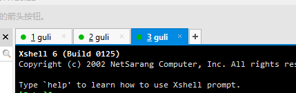

2.打开撰写栏

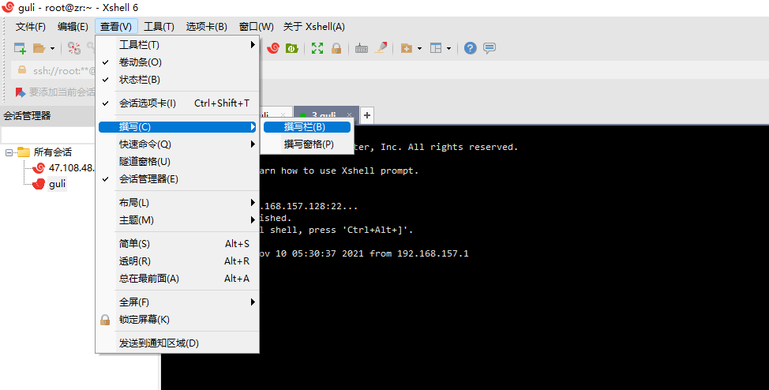

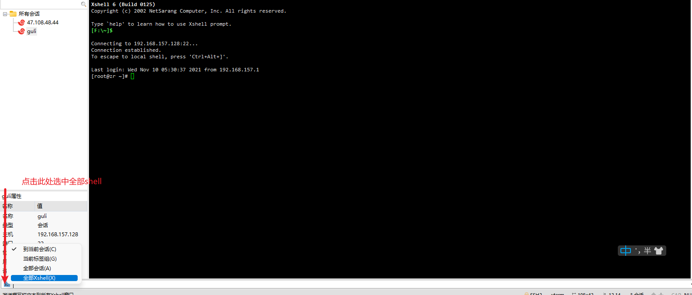

3.进入redis-cli docker容器

发送给全部会话： 

```
docker exec -it redis redis-cli
```


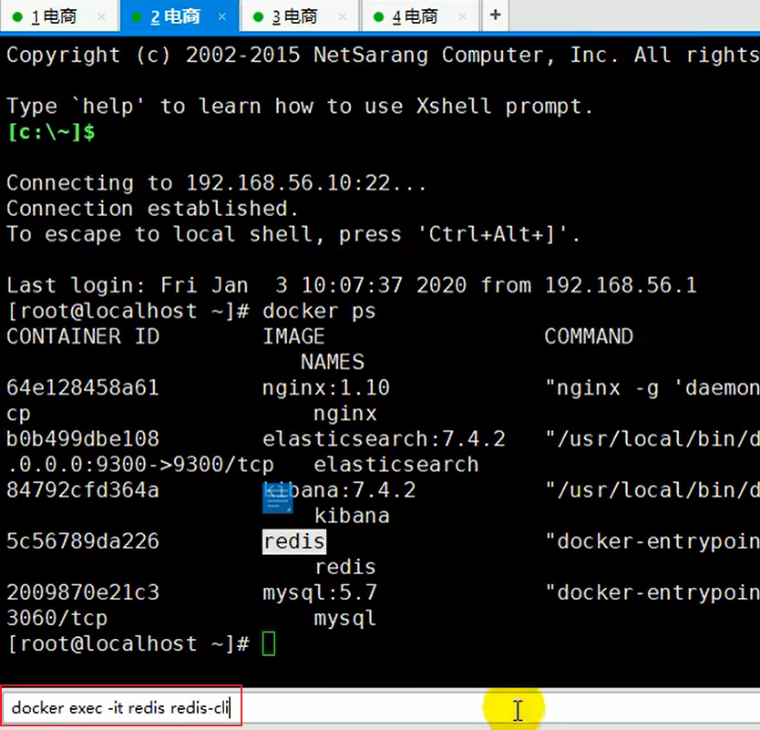


4.测试set nx命令，**只有键“lock”不存在的时候才会设置值“test”**

> 值是多少无所谓，不要是nil就行，只作为标志有值。 

```
set lock test NX
```


发送给全部会话：

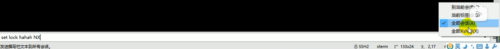


**测试结果只有一个会话返回ok。所以set xx xx nx命令实现了原子加锁：**

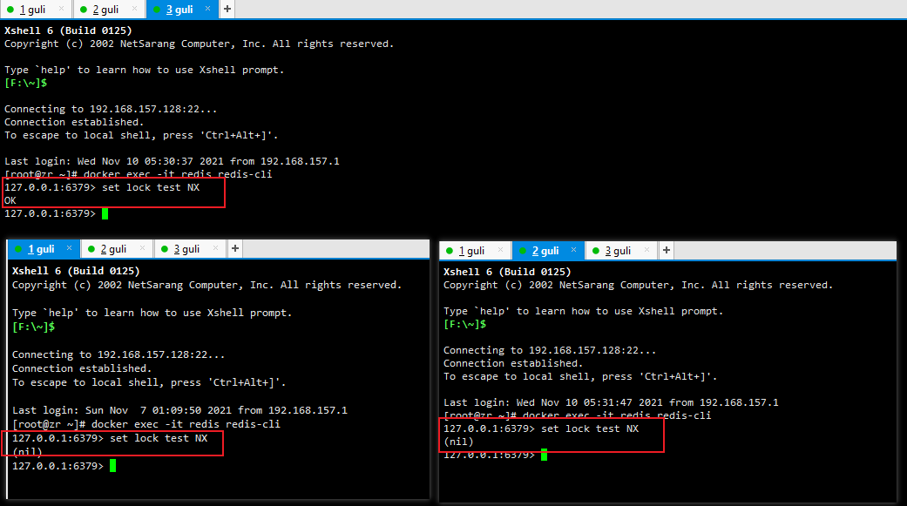


### 1.4.4 **业务流程**，三级分类通过“setIfAbsent()”实现分布式缓存

> `set key value NX` – 只有键key不存在的时候才会设置key的值 

**业务流程：**

1. 加锁，只有键key不存在的时候才会设置key的值，加锁时将value设为UUID并**构造方法**设置锁的300秒自动过期。
2. 如果加锁成功...执行业务后，**使用lua脚本**判断当前锁的value是不是当前线程的UUID，是的话删除锁。
3. 如果加锁失败，休眠100ms重试。

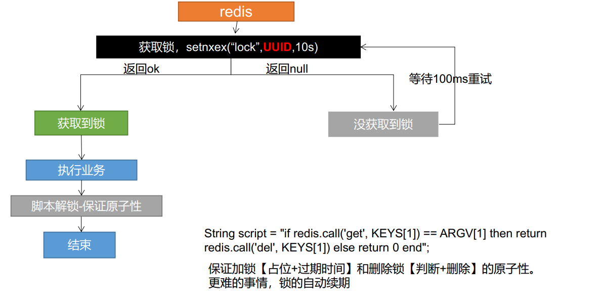


> **注意：**
>
> - 加锁保障原子性，删锁保证原子性。
> - 为了避免死锁，加锁和设置锁的自动过期必须是**原子操作，**使用**构造方法**设置过期时间，过期时间要久一点，作为删锁失败的保险操作，这里设置成300秒。
> - 为了防止删成上个线程的锁，将锁的value设成当前线程的UUID；
> - 判断锁的值是不是当前线程的UUID，以及删除锁，这两个操作必须是**原子操作，**使用**lua脚本**判断锁和删除锁。
>
> ```java
>         Boolean lock = redisTemplate.opsForValue()
> .setIfAbsent("lock", UUID.randomUUID().toString(), 300, TimeUnit.SECONDS);
> ```
>
> 

> **死锁问题:**
>
> set xx xx nx占好了位，业务代码异常或者程序在页面过程中宕机。第一个线程**获取到锁后没来得及删锁，导致锁状态一直存在**，这就造成了**死锁**
>
> **解决:**设置锁的自动过期，即使没有删除，会自动删除。
>
> 
>
> **死锁：**就是两个或两个以上线程在执行过程中,由于竞争资源或者由于彼此通信而造成的一种阻塞的现象,若无外力作用,它们都将无法推进下去。

> **解锁脚本（原子性判断锁和删除锁）：**
>
> 
>
> ```java
> if redis.call("get",KEYS[1]) == ARGV[1]
> then
>     return redis.call("del",KEYS[1])
> else
>     return 0
> end
> ```
>
> 
>
> 如果redis获取到“lock”的值等于传进来的值，返回删除key的命令。

### 1.4.5 代码实现，三级分类通过“setIfAbsent()”实现分布式缓存 

 **抽取getDataFromDb** 

```java
	//分布式锁
    public Map<String, List<Catalog2Vo>> getCatalogJsonFromDbWithRedisLock() {
        // 1、分布式锁。去redis占坑，同时设置过期时间

        //每个线程设置随机的UUID，也可以成为token
        String uuid = UUID.randomUUID().toString();

        //只有键key不存在的时候才会设置key的值。保证分布式情况下一个锁能进线程
        Boolean lock = redisTemplate.opsForValue().setIfAbsent("lock", uuid, 300, TimeUnit.SECONDS);
//setIfAbsent()如果返回true代表此线程拿到锁；
如果返回false代表没拿到锁，就sleep一会递归重试，一直到某一层获取到锁并层层返回redis或数据库结果。
        if (lock) {
            // 加锁成功....执行业务【内部会判断一次redis是否有值】
            System.out.println("获取分布式锁成功....");
            Map<String, List<Catalog2Vo>> dataFromDB = null;
            try {
                dataFromDB = getDataFromDb();
            } finally {
                // 2、查询UUID是否是自己，是自己的lock就删除
                // 查询+删除 必须是原子操作：lua脚本解锁
                String luaScript = "if redis.call('get',KEYS[1]) == ARGV[1]\n" +
                        "then\n" +
                        "    return redis.call('del',KEYS[1])\n" +
                        "else\n" +
                        "    return 0\n" +
                        "end";
                // 删除锁
                Long lock1 = redisTemplate.execute(
                        new DefaultRedisScript<Long>(luaScript, Long.class),
                        Arrays.asList("lock"), uuid);    //把key和value传给lua脚本
            }
            return dataFromDB;
        } else {
            System.out.println("获取分布式锁失败....等待重试...");
            // 加锁失败....重试
            // 休眠100ms重试
            try {
                Thread.sleep(200);
            } catch (InterruptedException e) {
                e.printStackTrace();
            }
            return getCatalogJsonFromDbWithRedisLock();// 自旋的方式
        }
    }
```


### 1.4.6 压力测试

删掉缓存数据，启动运行： 


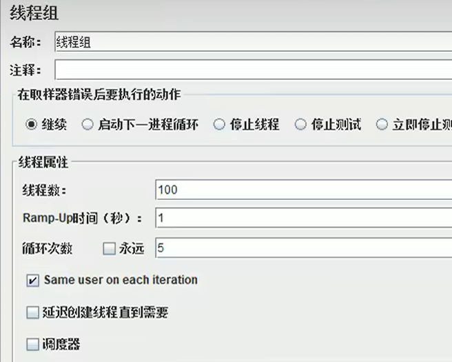

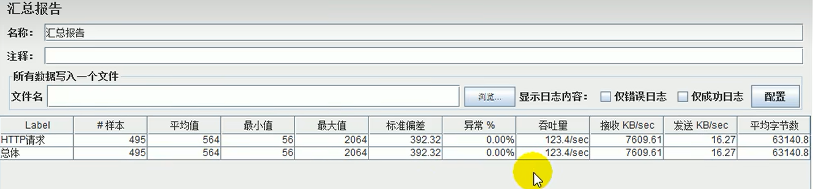

**只有10002一个线程查了数据库：**

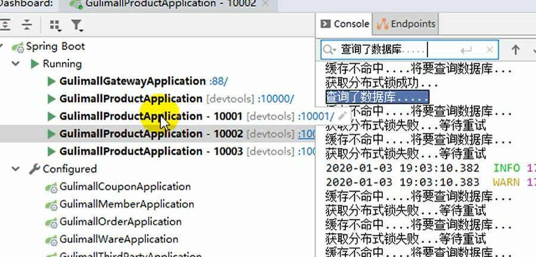


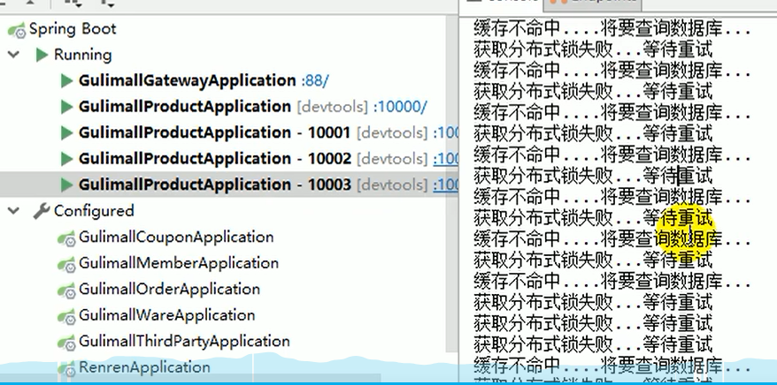


## 1.5 Redisson分布式锁

### 1.5.1 概念 

> 在分布式情况下，之前学过的锁“syncronized” 、“lock”和JUC包下的类都用不成了。需要用Redission分布式锁。

Redisson是一个在**Redis的基础上实现的Java驻内存数据网格**（In-Memory Data Grid）。它不仅提供了一系列的分布式的Java常用对象，还提供了许多分布式服务。其中包括(`BitSet`, **`Set`,** `Multimap`, `SortedSet`, **`Map`**, **`List`**, `Queue`, `BlockingQueue`, `Deque`, `BlockingDeque`, `Semaphore`, `Lock`, `AtomicLong`, `CountDownLatch`, `Publish / Subscribe`, `Bloom filter`, `Remote service`, `Spring cache`, `Executor service`, `Live Object service`, `Scheduler service`)

Redisson**提供了使用Redis的最简单和最便捷的方法**。Redisson的宗旨是促进使用者对Redis的关注分离（Separation of Concern），从而让使用者能够将精力更集中地放在处理业务逻辑上。

本文我们仅关注分布式锁的实现，更多请参考[Redisson官方文档](https://github.com/redisson/redisson/wiki/1.-概述)

### 1.5.1 springboot整合Redisson快速入门

- 导入依 赖

```XML
<dependency>
    <groupId>org.redisson</groupId>
    <artifactId>redisson</artifactId>
    <version>3.13.4</version>
</dependency>
```


- **配置类(单节点配置),**多节点配置请参考官网文档

```java
@Configuration
public class RedissonConfig {
    @Bean
    public RedissonClient redissonClient(){
        Config config = new Config();
        //设置单节点模式，设置redis地址。ssl安全连接redission://192.168.56.102:6379
        config.useSingleServer().setAddress("redis://192.168.56.102:6379");
        RedissonClient redisson = Redisson.create(config);
        return redisson;
    }
}
```


- **测试类注入使用** 

```java
@Autowired
    RedissonClient redissonClient;

    @Test
    public void name() {
        System.out.println(redissonClient);
    }
```


> 成功拿到redissonClient对象

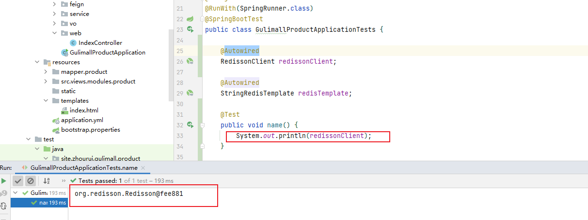

### 1.5.2 可重入锁（Reentrant Lock），看门狗自动续期

**可重入锁：**

当**a业务包含b业务**时,并且a业务与b业务都需要抢占统一资源,当a业务执行到b业务时,b业务发现该资源已上锁,如果是**可重入锁b业务就可拿到锁**,执行业务;反之如果此时b业务拿不到资源,就是不可重入锁,这样程序就会死锁.

如果负责储存这个分布式锁的Redisson节点宕机以后，而且这个锁正好处于锁住的状态时，这个锁会出现锁死的状态。为了避免这种情况的发生，所以就设置了**过期时间**，但是如果业务执行时间过长，业务还未执行完锁就已经过期，那么就会出现解锁时解了其他线程的锁的情况。

**看门狗：** 

所以**Redisson**内部提供了一个**监控锁的看门狗**，它的作用是在**Redisson实例被关闭前，不断的延长锁的有效期。**默认情况下，看门狗的检查锁的超时时间是30秒钟，也可以通过修改[Config.lockWatchdogTimeout](https://github.com/redisson/redisson/wiki/2.-配置方法#lockwatchdogtimeout监控锁的看门狗超时单位毫秒)来另行指定。

**代码实现：** 

在本次测试中`CatalogJson-Lock`的初始过期时间TTL为30s，但是每到20s(经过**三分之一看门狗时间**后)就会自动**续借成30s**

商品模块IndexController 

```java
@ResponseBody
    @GetMapping("/hello")
    public String hello() {
        //1.获取一把锁,只要锁的名字一样,就是同一把锁，"my-lock"是锁名，也是Redis的哈希模型的对外key
        RLock lock = redissonClient.getLock("my-lock");
        //加锁
        lock.lock();//阻塞式等待,默认加的锁等待时间为30s。每到20s(经过三分之一看门狗时间后)就会自动续借成30s
        //1.锁的自动续期,如果在业务执行期间业务没有执行完成,redisson会为该锁自动续期
        //2.加锁的业务只要运行完成,就不会自动续期,即使不手动解锁,锁在默认的30s后会自动删除
        try {
            System.out.println("加锁成功,执行业务......"+Thread.currentThread().getId());
            Thread.sleep(30000);
        }catch (Exception e){

        }finally {
            //解锁,假设代码没有运行,redisson不会出现死锁
            System.out.println("锁释放..."+Thread.currentThread().getId());
            lock.unlock();
        }
        return "hello";
    }
```


**测试成功，**加锁成功，可以看见第一次发请求成功，30秒后发第二次请求才能成功：

loclahost:10000/hello

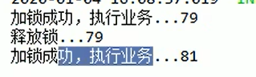


**测试看门狗，redisson分布式锁的自动续期**

查看Redis数据库：

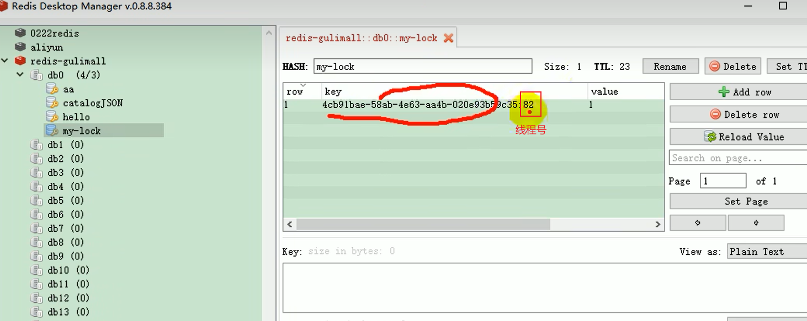


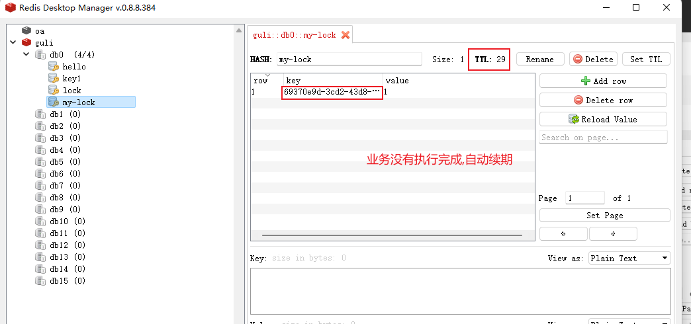

### 1.5.3 lock关闭看门狗自动续期

不指定锁的过期时间，默认30s，每到20s看门狗会**自动续期**成30s，有死锁风险： 

```java
lock.lock();
```


**（推荐）指定锁的过期时间**，看门狗**不会自动续期：** 

```java
//在自定义锁的存在时间时不会自动解锁
lock.lock(30, TimeUnit.SECONDS);
```


> **注意：**
>
> 设置的自动解锁时间一定要稳稳地大于业务时间

lock()方法的两大特点：

1、会有一个看门狗机制，在我们业务运行期间，将我们的锁自动续期

2、为了防止死锁，加的锁**设置成30秒的过期时间**，不让看门狗自动续期，如果业务宕机，没有手动调用解锁代码，**30s后redis也会对他自动解锁。**

### 1.5.4 公平锁

[8. 分布式锁和同步器 · redisson/redisson Wiki · GitHub](https://github.com/redisson/redisson/wiki/8.-分布式锁和同步器)

> 基于Redis的Redisson分布式可重入公平锁也是实现了`java.util.concurrent.locks.Lock`接口的一种`RLock`对象。同时还提供了[异步（Async）](http://static.javadoc.io/org.redisson/redisson/3.10.0/org/redisson/api/RLockAsync.html)、[反射式（Reactive）](http://static.javadoc.io/org.redisson/redisson/3.10.0/org/redisson/api/RLockReactive.html)和[RxJava2标准](http://static.javadoc.io/org.redisson/redisson/3.10.0/org/redisson/api/RLockRx.html)的接口。

它保证了当多个Redisson客户端线程同时请求加锁时，**优先分配给先发出请求的线程**。所有请求线程会在一个**队列中排队**，当某个线程出现宕机时，Redisson会等待5秒后继续下一个线程，也就是说如果前面有5个线程都处于等待状态，那么后面的线程会等待至少25秒。 

```java
RLock fairLock = redisson.getFairLock("anyLock");
// 最常见的使用方法
fairLock.lock();
```


### 1.5.5 读写锁（ReadWriteLock）可重入读写锁


> 基于Redis的Redisson分布式可重入读写锁[RReadWriteLock](http://static.javadoc.io/org.redisson/redisson/3.4.3/org/redisson/api/RReadWriteLock.html) Java对象实现了`java.util.concurrent.locks.ReadWriteLock`接口。其中读锁和写锁都继承了[RLock](https://github.com/redisson/redisson/wiki/8.-分布式锁和同步器#81-可重入锁reentrant-lock)接口。

分布式可重入读写锁，允许同时有**多个读锁和一个写锁**处于加锁状态。

Redisson的读写锁实现了JUC.locks.ReadWriteLock接口，读读不互斥，读写互斥，写写互斥。

写锁会阻塞读锁，读锁会阻塞写锁，但是**读锁和读锁不会互相阻塞**

 使用方法：

```java
RReadWriteLock rwlock = redisson.getReadWriteLock("anyRWLock");
// 最常见的使用方法
rwlock.readLock().lock();
// 或
rwlock.writeLock().lock();
```


当然也可以通过参数来指定加锁的时间，关闭看门狗自动续期。超过这个时间后锁便自动解开了。

```java
// 10秒钟以后自动解锁
// 无需调用unlock方法手动解锁
rwlock.readLock().lock(10, TimeUnit.SECONDS);
// 或
rwlock.writeLock().lock(10, TimeUnit.SECONDS);

// 尝试加锁，最多等待100秒，上锁以后10秒自动解锁
boolean res = rwlock.readLock().tryLock(100, 10, TimeUnit.SECONDS);
// 或
boolean res = rwlock.writeLock().tryLock(100, 10, TimeUnit.SECONDS);
...
lock.unlock();
```


测试： 

```java
    @GetMapping("/read")
    @ResponseBody
    public String read() {
        RReadWriteLock lock = redissonClient.getReadWriteLock("ReadWrite-Lock");
        RLock rLock = lock.readLock();
        String s = "";
        try {
            rLock.lock();
            System.out.println("读锁加锁"+Thread.currentThread().getId());
            Thread.sleep(5000);
            s= redisTemplate.opsForValue().get("lock-value");
        }finally {
            rLock.unlock();
            return "读取完成:"+s;
        }
    }

    @GetMapping("/write")
    @ResponseBody
    public String write() {
        RReadWriteLock lock = redissonClient.getReadWriteLock("ReadWrite-Lock");
        RLock wLock = lock.writeLock();
        String s = UUID.randomUUID().toString();
        try {
            wLock.lock();
            System.out.println("写锁加锁"+Thread.currentThread().getId());
            Thread.sleep(10000);
            redisTemplate.opsForValue().set("lock-value",s);
        } catch (InterruptedException e) {
            e.printStackTrace();
        }finally {
            wLock.unlock();
            return "写入完成:"+s;
        }
    }
```


写锁会阻塞读锁，读锁会阻塞写锁，但是读锁和读锁不会互相阻塞

总之含有写的过程都会被阻塞，只有读读不会被阻塞

上锁时在redis的状态

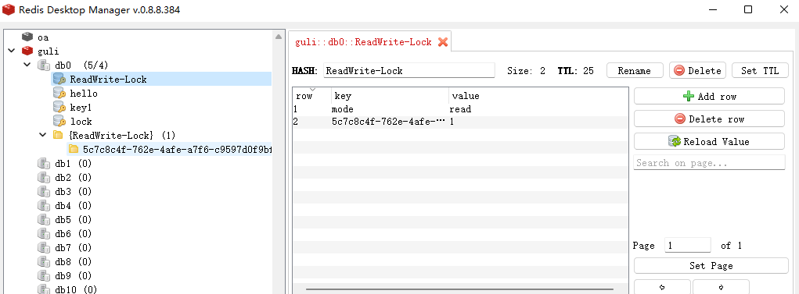

### 1.5.6 信号量（Semaphore）

信号量为**存储在redis中的一个数字**，当这个数字大于0时，即可以调用`acquire()`方法增加数量，也可以调用`release()`方法减少数量，但是当调用`release()`之后**小于0的话方法就会阻塞**，直到数字大于0。

同时还提供了[异步（Async）](http://static.javadoc.io/org.redisson/redisson/3.10.0/org/redisson/api/RSemaphoreAsync.html)、[反射式（Reactive）](http://static.javadoc.io/org.redisson/redisson/3.10.0/org/redisson/api/RSemaphoreReactive.html)和[RxJava2标准](http://static.javadoc.io/org.redisson/redisson/3.10.0/org/redisson/api/RSemaphoreRx.html)的接口。

```java
RSemaphore semaphore = redisson.getSemaphore("semaphore");
semaphore.acquire();
//或
semaphore.acquireAsync();
semaphore.acquire(23);
//返回boolean，信号量小于等于0时返回false，不阻塞。
semaphore.tryAcquire();
//或
semaphore.tryAcquireAsync();
semaphore.tryAcquire(23, TimeUnit.SECONDS);
//或
semaphore.tryAcquireAsync(23, TimeUnit.SECONDS);
semaphore.release(10);
semaphore.release();
//或
semaphore.releaseAsync();
```


测试：想要停车必须要有车位：

```java
@GetMapping("/park")
    @ResponseBody
    public String park() {
        RSemaphore park = redissonClient.getSemaphore("park");
        try {
            park.acquire(1);
        } catch (InterruptedException e) {
            e.printStackTrace();
        }
        return "停车，占一个车位1";
    }

    @GetMapping("/go")
    @ResponseBody
    public String go() {
        RSemaphore park = redissonClient.getSemaphore("park");
        park.release(1);
        return "开走，放出一个车位1";
    }
```


初始手动添加三个车位，： 

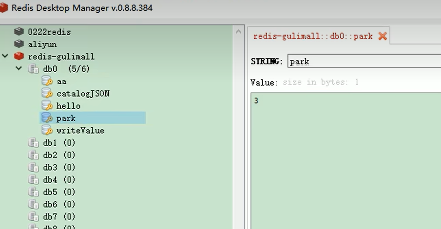

访问三次停车url，车位减为零： 

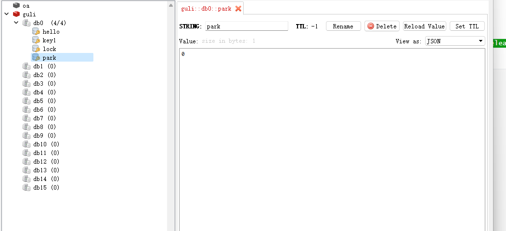

### 1.5.7 闭锁（CountDownLatch）

可以理解为门栓，使用若干个门栓将当前方法阻塞，只有当全部门栓都被放开时，当前方法才能继续执行。

以下代码只有`offLatch()`被调用5次后 `setLatch()`才能继续执行

```java
@GetMapping("/setLatch")
    @ResponseBody
    public String setLatch() {
        RCountDownLatch latch = redissonClient.getCountDownLatch("CountDownLatch");
        try {
            latch.trySetCount(5);
            latch.await();
        } catch (InterruptedException e) {
            e.printStackTrace();
        }
        return "门栓被放开";
    }

    @GetMapping("/offLatch")
    @ResponseBody
    public String offLatch() {
        RCountDownLatch latch = redissonClient.getCountDownLatch("CountDownLatch");
        latch.countDown();
        return "门栓被放开1";
    }
```


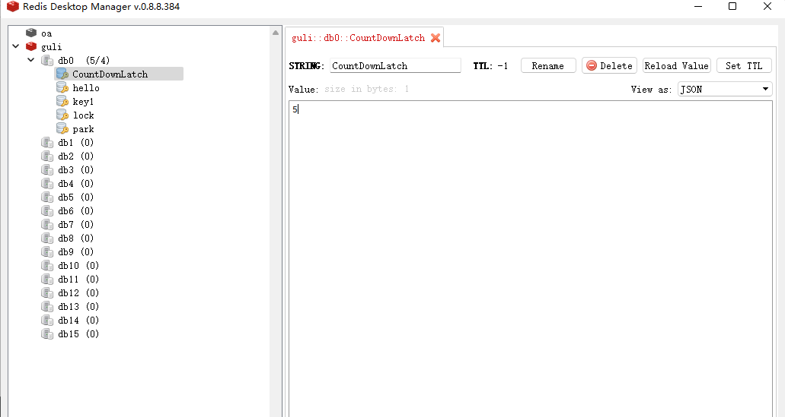


**信号量与闭锁的区别**

> 他们都是标志位为0时解锁
>
> 但是信号量的标志位可以加,但是闭锁不能,闭锁是能减,直到标志位为0解锁


## 1.6 缓存数据一致性问题

缓存一致性：缓存里的数据和数据库里的数据保持一致。 

### 1.6.1 双写模式

**双写模式**:在数据库进行写操作的**同时对缓存也进行写操作**,确保缓存数据与数据库数据的一致性

**脏数据问题：**在A修改数据库后，更新缓存时延迟高， 在延迟期间，B已经有修改数据并更新缓存，过了一会A才更新缓存完毕。此时数据库里是B修改的内容，**缓存库里是A修改的内容**。 

> 两个线程同时进行写操作时由于缓存是存储在redis,写缓存时需要发送网络请求,导致虽然线程一先发送写缓存的网络请求但是比线程二发送的写缓存的网络请求后到达redis,造成数据被覆盖

**是否满足最终一致性**:满足,原因 缓存过期以后，又能得到最新的正确数据读到的最新数据有延迟：最终一致性

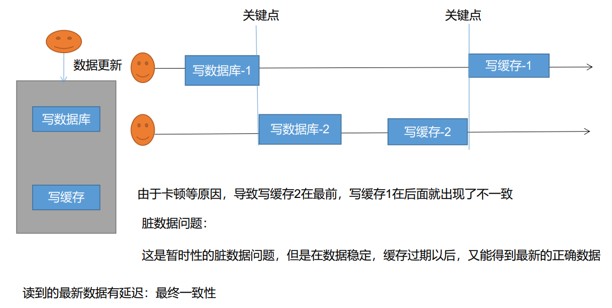

### 1.6.2 失效模式

**失效模式**:在数据库进行更新操作时,**删除原来的缓存**,再次查询数据库就可以更新最新数据

**存在问题**

**脏数据问题：**当两个请求同时修改数据库，A已经更新成功并删除缓存时又有读数据的请求进来，这时候发现缓存中无数据就去数据库中查询并放入缓存，在放入缓存前第二个更新数据库的请求B成功，这时候留在**缓存中的数据依然是A更新的数据**


**解决方法**

1、缓存的所有数据都有**过期时间**，数据过期下一次查询触发**主动更新**
 2、读写数据的时候(并且写的不频繁)，加上**分布式的读写锁**。

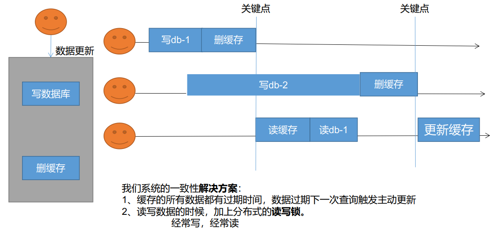

### 1.6.3 缓存一致性解决方案，读写锁和过期时间

- 无论是

  双写模式还是失效模式

  ，

  都会导致缓存的不一致问题。

  即多个实例同时更新会出事。怎么办？ 	

  - 1、如果是**用户纬度数据**（订单数据、用户数据），这种**并发几率非常小**，不用考虑这个问题，**缓存数据加上过期时间**，每隔一段时间触发读的主动更新即可
  - 2、如果是菜单，商品介绍等**基础数据**，也可以去使用**canal订阅binlog**的方式。
  - 3、缓存数据+过期时间也足够解决大部分业务对于缓存的要求。
  - 4、通过加锁保证并发读写，写写的时候按顺序排好队。只有读读不会被阻塞。所以适合使用**读写锁**。（业务不关心脏数据，允许临时脏数据可忽略）；

- **总结：**
   • 我们能放入缓存的数据本就不应该是实时性、一致性要求超高的。所以缓存数据的时候加上**过期时间**，保证每天拿到当前最新数据即可。
   • 我们不应该过度设计，增加系统的复杂性
   • 遇到**实时性、一致性要求高的数据，就应该查数据库**，即使慢点。

### 1.6.4 缓存中间件Canal

Canal是阿里的缓存中间件，Canal将自己伪装成数据库的从服务器，MySQL一有变化，它就会同步更新到redis。 

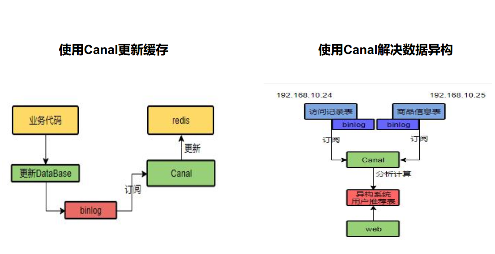

### 1.6.5 最终代码，Redisson读写锁缓存三级分类

锁的粒度，越细越快，这里锁分类数据，锁名就叫"catalogJson-lock"。

例如具体缓存的是某个数据，11号商品，锁名就设product-11-lock，不锁其他商品 

```java
    public Map<String, List<Catelog2Vo>> getCatalogJsonFromDbWithRedissonLock() {

        //1、占分布式锁。去redis占坑
        //（锁的粒度，越细越快）例如具体缓存的是某个数据，11号商品，锁名就设product-11-lock，不锁其他商品
        //RLock catalogJsonLock = redissonClient.getLock("catalogJson-lock");
        //创建读锁
        RReadWriteLock readWriteLock = redissonClient.getReadWriteLock("catalogJson-lock");

        RLock rLock = readWriteLock.readLock();

        Map<String, List<Catelog2Vo>> dataFromDb = null;
        try {
            rLock.lock();
            //加锁成功...执行业务
            dataFromDb = getDataFromDb();
        } finally {
            rLock.unlock();
        }
        //先去redis查询下保证当前的锁是自己的
        //获取值对比，对比成功删除=原子性 lua脚本解锁
        // String lockValue = stringRedisTemplate.opsForValue().get("lock");
        // if (uuid.equals(lockValue)) {
        //     //删除我自己的锁
        //     stringRedisTemplate.delete("lock");
        // }

        return dataFromDb;

    }
```


```java
    private Map<String, List<Catelog2Vo>> getDataFromDb() {
        //得到锁以后，我们应该再去缓存中确定一次，如果没有才需要继续查询
        String catalogJson = stringRedisTemplate.opsForValue().get("catalogJson");
        if (!StringUtils.isEmpty(catalogJson)) {
            //缓存不为空直接返回
            Map<String, List<Catelog2Vo>> result = JSON.parseObject(catalogJson, new TypeReference<Map<String, List<Catelog2Vo>>>() {
            });

            return result;
        }

        System.out.println("查询了数据库");

        /**
         * 将数据库的多次查询变为一次
         */
        List<CategoryEntity> selectList = this.baseMapper.selectList(null);

        //1、查出所有分类
        //1、1）查出所有一级分类
        List<CategoryEntity> level1Categorys = getParent_cid(selectList, 0L);

        //封装数据
        Map<String, List<Catelog2Vo>> parentCid = level1Categorys.stream().collect(Collectors.toMap(k -> k.getCatId().toString(), v -> {
            //1、每一个的一级分类,查到这个一级分类的二级分类
            List<CategoryEntity> categoryEntities = getParent_cid(selectList, v.getCatId());

            //2、封装上面的结果
            List<Catelog2Vo> catelog2Vos = null;
            if (categoryEntities != null) {
                catelog2Vos = categoryEntities.stream().map(l2 -> {
                    Catelog2Vo catelog2Vo = new Catelog2Vo(v.getCatId().toString(), null, l2.getCatId().toString(), l2.getName().toString());

                    //1、找当前二级分类的三级分类封装成vo
                    List<CategoryEntity> level3Catelog = getParent_cid(selectList, l2.getCatId());

                    if (level3Catelog != null) {
                        List<Catelog2Vo.Category3Vo> category3Vos = level3Catelog.stream().map(l3 -> {
                            //2、封装成指定格式
                            Catelog2Vo.Category3Vo category3Vo = new Catelog2Vo.Category3Vo(l2.getCatId().toString(), l3.getCatId().toString(), l3.getName());

                            return category3Vo;
                        }).collect(Collectors.toList());
                        catelog2Vo.setCatalog3List(category3Vos);
                    }

                    return catelog2Vo;
                }).collect(Collectors.toList());
            }

            return catelog2Vos;
        }));

        //3、将查到的数据放入缓存,将对象转为json
        String valueJson = JSON.toJSONString(parentCid);
        stringRedisTemplate.opsForValue().set("catalogJson", valueJson, 1, TimeUnit.DAYS);

        return parentCid;
    }
```


## 1.7 SpringCache


[SpringCache官方文档](https://docs.spring.io/spring-framework/docs/current/reference/html/integration.html#cache)

- Spring 从 3.1 开始定义了 org.springframework.cache.Cache和 org.springframework.cache.CacheManager 接口来统一不同的缓存技术；并支持使用 JCache（JSR-107） 注解简化我们开发；
- Cache 接口为缓存的组件规范定义， 包含缓存的各种操作集合；Cache 接 口 下 Spring 提 供 了 各 种 xxxCache 的 实 现 ； 如 RedisCache ， EhCacheCache ,ConcurrentMapCache 等；
- 每次调用需要缓存功能的方法时， Spring 会检查检查指定参数的指定的目标方法是否已经被调用过； 如果有就直接从缓存中获取方法调用后的结果， 如果没有就调用方法并缓存结果后返回给用户。 下次调用直接从缓存中获取。
- 使用 Spring 缓存抽象时我们需要关注以下两点； 
  - 1、 确定方法需要被缓存以及他们的缓存策略
  - 2、 从缓存中读取之前缓存存储的数据

### 1.7.1 基础概念

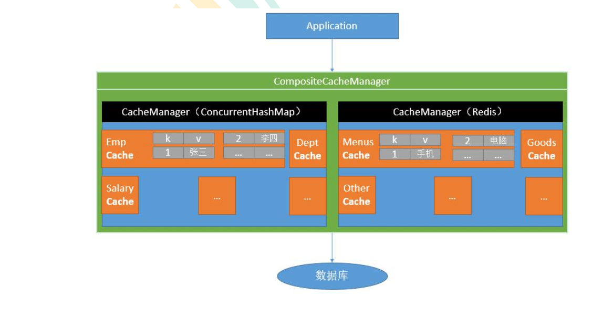


### 1.7.2 注解

|                |                                                              |
| -------------- | ------------------------------------------------------------ |
| Cache          | 缓存接口,定义缓存操作.实现有:RedisCache,RhCacheCache,ConcurrentMapCache等 |
| CacheManager   | 缓存管理器,管理各种缓存组件                                  |
| @Cacheable     | 主要针对方法配置,能够根据方法的请求参数对其结果进行缓存      |
| @CacheEvict    | 清空缓存                                                     |
| @CachePut      | 保证方法被调用,又希望结果被缓存                              |
| @Caching       | 组合上面三个注解多个操作                                     |
| @EnableCaching | 开启基于注解的缓存                                           |
| @CacheConfig   | 在类级别分享缓存的相同配置                                   |
| keyGenerator   | 缓存数据是key生成策略                                        |
| serialize      | 缓存数据是value序列化策略                                    |

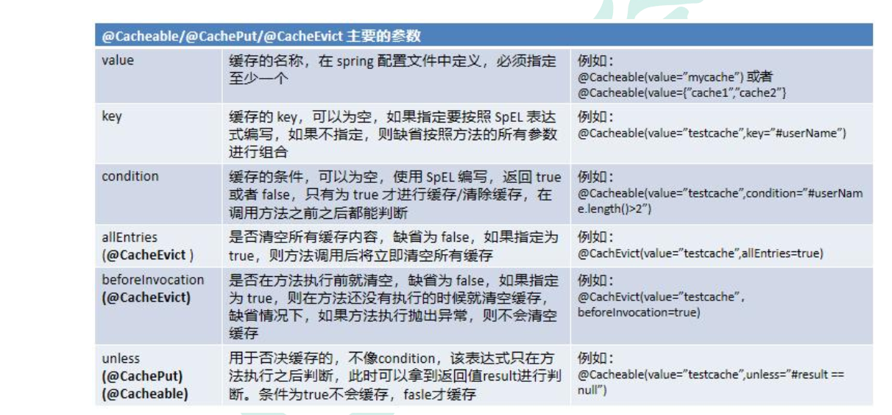

### 1.7.3 SpEL表达式语法

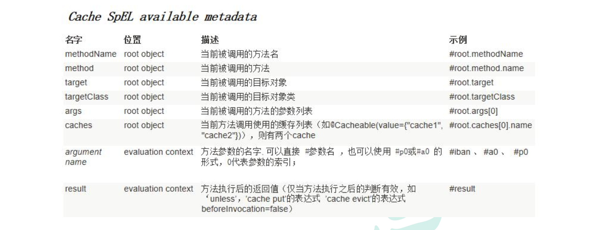

## 1.8 整合SpringCache简化缓存开发

### 1.8.1 原理

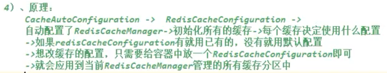

### 1.8.2 基础整合

- 导入依 赖

```XML
	<!--Spring Cache-->
        <dependency>
            <groupId>org.springframework.boot</groupId>
            <artifactId>spring-boot-starter-cache</artifactId>
        </dependency>
	<!--redis-->
    <dependency>
    	<groupId>org.springframework.boot</groupId>
    	<artifactId>spring-boot-starter-data-redis</artifactId>
    </dependency>
```


1. 配置使用redis作为缓存

```bash
spring:
  cache:
    type: redis
```


1. 开启缓存功能 `@EnableCaching`
2. 使用缓存注解

| 注解           | 作用                                                    |
| -------------- | ------------------------------------------------------- |
| @Cacheable     | 主要针对方法配置,能够根据方法的请求参数对其结果进行缓存 |
| @CacheEvict    | 清空缓存                                                |
| @CachePut      | 保证方法被调用,又希望结果被缓存                         |
| @Caching       | 组合上面三个注解多个操作                                |
| @EnableCaching | 开启基于注解的缓存                                      |
| @CacheConfig   | 在类级别分享缓存的相同配置                              |

 @Cacheable：标注方法上：当前方法的结果存入缓存，如果缓存中有，方法不调用
 ​ @CacheEvict：触发将数据从缓存删除的操作
 ​ @CachePut：不影响方法执行更新缓存
 ​ @Caching：组合以上多个操作
 ​ @CacheConfig：在类级别共享缓存的相同配置

- 测试 

> getLevel1Categorys方法加上@Cacheable(“category”)注解

```java
/**
     * 查询一级分类。
     * 父ID是0， 或者  层级是1
     */
    @Cacheable("category")
    @Override
    public List<CategoryEntity> getLevel1Categorys() {
        System.out.println("调用了 getLevel1Categorys  查询了数据库........【一级分类】");
        return baseMapper.selectList(new QueryWrapper<CategoryEntity>().eq("parent_cid", 0));
    }
```


> 测试结果
>
> 指定一个名字，放入哪个分区@Cacheable({“category”})
>  1）当前方法的结果需要缓存，如果缓存中有，方法不被调用
>  2）默认缓存数据的key： category::SimpleKey []
>  3）默认使用jdk序列化机制，将序列化后的数据存到redis
>  4）默认过期时间-1，永不过期

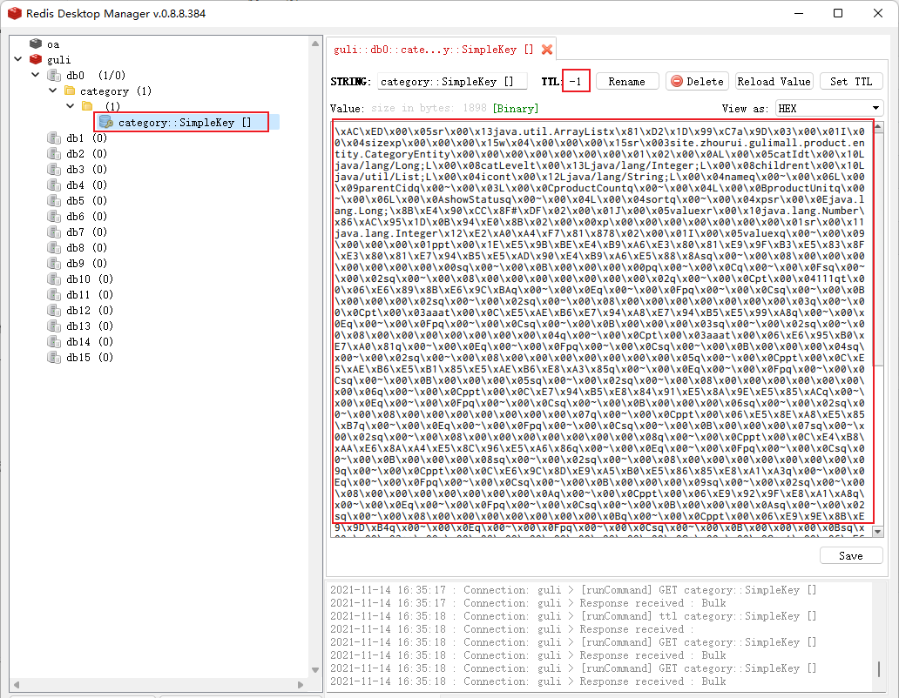

### 1.8.3 @Cacheable细节设置

- 指 定key

```java
/**
     * 查询一级分类。
     * 父ID是0， 或者  层级是1
     */
    @Cacheable(value = "category",key = "#root.method.name")
    @Override
    public List<CategoryEntity> getLevel1Categorys() {
        System.out.println("调用了 getLevel1Categorys  查询了数据库........【一级分类】");
        return baseMapper.selectList(new QueryWrapper<CategoryEntity>().eq("parent_cid", 0));
    }
```


- 指定过期时间 

```bash
spring:
  cache:
    type: redis
    redis:
      time-to-live: 3600000
```


> 重启测试
>
> ttl设置为我们自定义值
>
> 缓存的key值指定为方法名

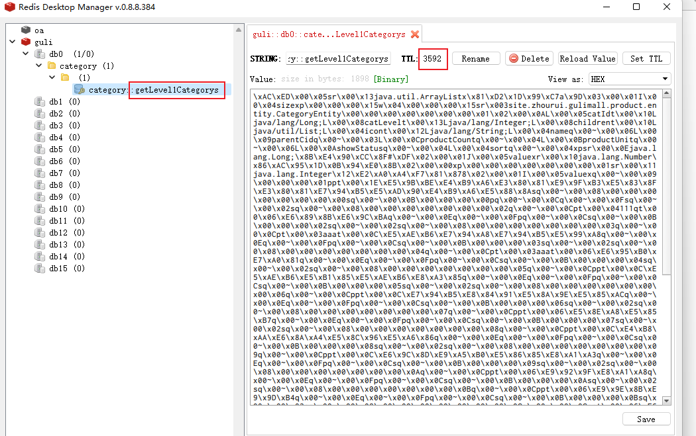

### 1.8.4 自定义缓存设置

> 1）指定key，可接收SpEL表达式 @Cacheable(value = {“category”}, key = “‘level1Categorys’”)
>  SpEL表达式可以参照官网 Avaliable Caching SpEL Evaluation Context
>  使用方法名用key：key = “#root.method.name”
>  2）指定时间 cache.redis.time-to-live=3600s
>  3）将数据保存为json格式：
>  4）前缀CACHE_，如果未指定，则使用缓存名字作为前缀：category

- 新增缓存配 置类MyCacheConfig

```java
package site.zhourui.gulimall.product.config;

import org.springframework.boot.autoconfigure.cache.CacheProperties;
import org.springframework.boot.context.properties.EnableConfigurationProperties;
import org.springframework.cache.annotation.EnableCaching;
import org.springframework.context.annotation.Bean;
import org.springframework.context.annotation.Configuration;
import org.springframework.data.redis.cache.RedisCacheConfiguration;
import org.springframework.data.redis.serializer.GenericJackson2JsonRedisSerializer;
import org.springframework.data.redis.serializer.RedisSerializationContext;
import org.springframework.data.redis.serializer.StringRedisSerializer;

/**
 * @author zr
 * @date 2021/11/14 16:57
 */
@EnableConfigurationProperties(CacheProperties.class)
@EnableCaching
@Configuration
public class MyCacheConfig {

//    @Autowired
//    CacheProperties cacheProperties;

    /**
     * 需要将配置文件中的配置设置上
     * 1、使配置类生效
     * 1）开启配置类与属性绑定功能EnableConfigurationProperties
     *
     * @ConfigurationProperties(prefix = "spring.cache")  public class CacheProperties
     * 2）注入就可以使用了
     * @Autowired CacheProperties cacheProperties;
     * 3）直接在方法参数上加入属性参数redisCacheConfiguration(CacheProperties redisProperties)
     * 自动从IOC容器中找
     * <p>
     * 2、给config设置上
     */
    @Bean
    RedisCacheConfiguration redisCacheConfiguration(CacheProperties cacheProperties) {
        RedisCacheConfiguration config = RedisCacheConfiguration.defaultCacheConfig();
        config = config.serializeKeysWith(RedisSerializationContext.SerializationPair.fromSerializer(new StringRedisSerializer()));
        //指定缓存序列化方式为json
        config = config.serializeValuesWith(RedisSerializationContext.SerializationPair.fromSerializer(new GenericJackson2JsonRedisSerializer()));
        // 配置文件生效：RedisCacheConfiguration
        CacheProperties.Redis redisProperties = cacheProperties.getRedis();
        //设置配置文件中的各项配置，如过期时间,如果此处以下的代码没有配置,配置文件中的配置不会生效
        if (redisProperties.getTimeToLive() != null) {
            config = config.entryTtl(redisProperties.getTimeToLive());
        }
        if (redisProperties.getKeyPrefix() != null) {
            config = config.prefixKeysWith(redisProperties.getKeyPrefix());
        }
        if (!redisProperties.isCacheNullValues()) {
            config = config.disableCachingNullValues();
        }
        if (!redisProperties.isUseKeyPrefix()) {
            config = config.disableKeyPrefix();
        }
        return config;
    }
}
```


- 自定 义配置

```bash
spring:
  cache:
    type: redis
    redis:
      time-to-live: 3600000
      #设置key的前缀,一般情况下不要自定统一前缀,方便分区处理
#      key-prefix: _CACHE
      #key是否使用前缀
      use-key-prefix: true
      #是否允许空值 # 防止缓存穿透，可缓存null值
      cache-null-values: true
```


- 测试 

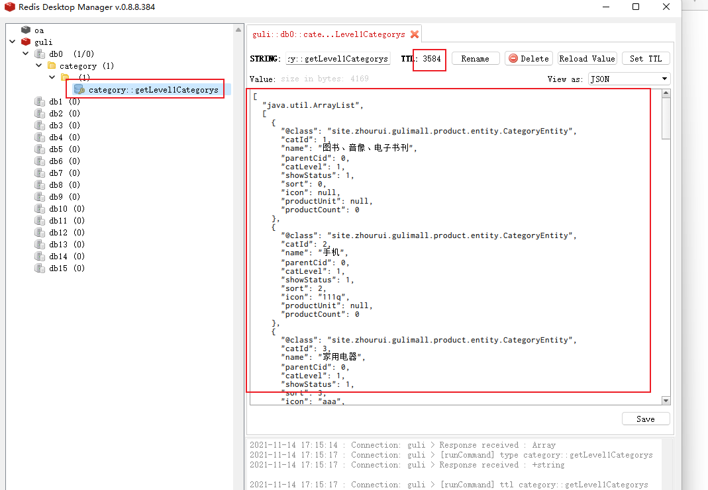

### 1.8.5 自定义序列化原理

[外链图片转存失败,源站可能有防盗链机制,建议将图片保存下来直接上传(img-7kpaohud-1636947687908)(http://zr.zhourui.site/img/Snipaste_2020-09-10_19-40-20 (2)].png)

### 1.8.6 @CacheEvict使用

```java
/**
     * 级联更新所有关联的数据
     * @param category
     */
    @Transactional
    @CacheEvict(value = {"category"},key ="'getLevel1Categorys'")//删除指定key值的缓存
    @Override
    public void updateCascade(CategoryEntity category) {
        this.updateById(category);
        categoryBrandRelationService.updateCategory(category.getCatId(),category.getName());
    }
```


**升级用法**:

> 删除带category前缀的所有缓存`allEntries = true`

```java
/**
     * 级联更新所有关联的数据
     * @param category
     */
    @Transactional
    @CacheEvict(value = {"category"},allEntries = true)   //调用该方法(updateCascade)会删除缓存category下的所有cache
    @Override
    public void updateCascade(CategoryEntity category) {
        this.updateById(category);
        categoryBrandRelationService.updateCategory(category.getCatId(),category.getName());
    }
```


> 测试
>
> 随意修改一个类目名,修改成功后发现缓存也被删除了

### 1.8.7 @Caching 的使用

> 作用:在数据修改时需要对多个缓存进行操作时使用

```java
    @Transactional
//    @CacheEvict(value = {"category"},key ="'getLevel1Categorys'")//删除指定key值的缓存
    @Caching(evict = {
            @CacheEvict(value = {"category"},key ="'getLevel1Categorys'"),
            @CacheEvict(value = {"category"},key ="'getCatalogJson'")
    })
    @Override
    public void updateCascade(CategoryEntity category) {
        this.updateById(category);
        categoryBrandRelationService.updateCategory(category.getCatId(),category.getName());
    }
```


### 1.8.7 失效模式or双写模式

@Cacheable：标注方法上：当前方法的结果存入缓存，如果缓存中有，方法不调用
 @CacheEvict：触发将数据从缓存删除的操作【删除缓存】【可实现失效模式】
 @CachePut：不影响方法执行更新缓存【更新缓存】【可实现双写模式】
 @Caching：组合以上多个操作【实现双写+失效模式】
 @CacheConfig：在类级别共享缓存的相同配置

### 1.8.8 SpringCache的不足

1、读模式:
 缓存穿透:查询一个DB不存在的数据。解决:缓存空数据;ache-null-values=true【布隆过滤器】
 缓存击穿:大量并发进来同时查询一个正好过期的数据。解决:加锁; 默认未加锁【sync = true】本地锁

```java
 @Cacheable(value = "category",key = "#root.method.name",sync = true)
```


 缓存雪崩:大量的key同时过期。解决:加上过期时间。: spring.cache.redis.time-to-live= 360000s
 2、写模式:（缓存与数据库一致)（没有解决）
 ​ 1)、读写加锁。
 ​ 2)、引入canal，感知mysql的更新去更新缓存
 ​ 3)、读多写多，直接去查询数据库就行
 ​
 **总结:**
 ​ 常规数据（读多写少，即时性，一致性要求不高的数据）﹔完全可以使用Spring-Cache，写模式(只要缓存的数据有过期时间就可以）
 ​ 特殊数据:特殊设计