>  **导航：**
>
> [谷粒商城笔记+踩坑汇总篇](https://blog.csdn.net/qq_40991313/article/details/127099139?spm=1001.2014.3001.5501)
>
>  **Java笔记汇总：**
>
> [【Java笔记+踩坑汇总】Java基础+JavaWeb+SSM+SpringBoot+SpringCloud+瑞吉外卖/谷粒商城/学成在线+设计模式+面试题汇总+性能调优/架构设计+源码解析-CSDN博客](https://blog.csdn.net/qq_40991313/article/details/126646289)

[TOC]


# 1. 初始化线程的4种方式

## 1.1 继承 Thread类，重写run()方法

```java
package site.xxx.gilimall.search.thread;
public class ThreadTest {
    public static void main(String[] args) {
        System.out.println("main......start...");
        Thread01 thread01 = new Thread01();
        thread01.start();
        System.out.println("main......end...");
    }
//继承 Thread类，重写run()方法
    public static class Thread01 extends Thread{
        @Override
        public void run() {
            System.out.println("当前线程:"+Thread.currentThread().getName());
            Integer i=10/2;
            System.out.println("运行结果:"+i);
        }
    }
}
```


> 运行结果

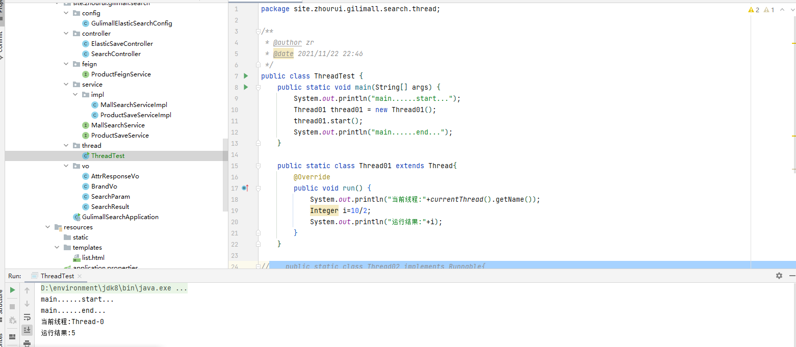

## 1.2 实现 Runnable 接口，重写run()方法

```java
package site.xxx.gilimall.search.thread;
public class ThreadTest {
    public static void main(String[] args) {

        Thread02 thread02 = new Thread02();
        new Thread(thread02).start();
        System.out.println("main......end...");
    }
//实现 Runnable 接口，重写run()方法
    public static class Thread02 implements Runnable{
        @Override
        public void run() {
            System.out.println("当前线程:"+Thread.currentThread().getName());
            Integer i=12/2;
            System.out.println("运行结果:"+i);
        }
    }
}
```


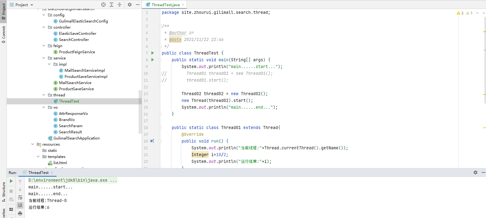

## 1.3 实现 Callable 接口 ， FutureTask （可以拿到返回结果， 可以处理异常）

```java
package site.xxx.gilimall.search.thread;

public class ThreadTest {
    public static void main(String[] args) throws ExecutionException, InterruptedException {
        System.out.println("main......start...");
        //可以拿到返回结果， 可以处理异常
        FutureTask futureTask = new FutureTask<>(new Thread03());
        new Thread(futureTask).start();
        Integer i = (Integer) futureTask.get();
        System.out.println("main......end..."+i);
    }
//实现 Callable 接口
    public static class Thread03 implements Callable {

        @Override
        public Object call() throws Exception {
            System.out.println("当前线程:"+Thread.currentThread().getName());
            Integer i=14/2;
            System.out.println("运行结果:"+i);
            return i;
        }
    }
}
```


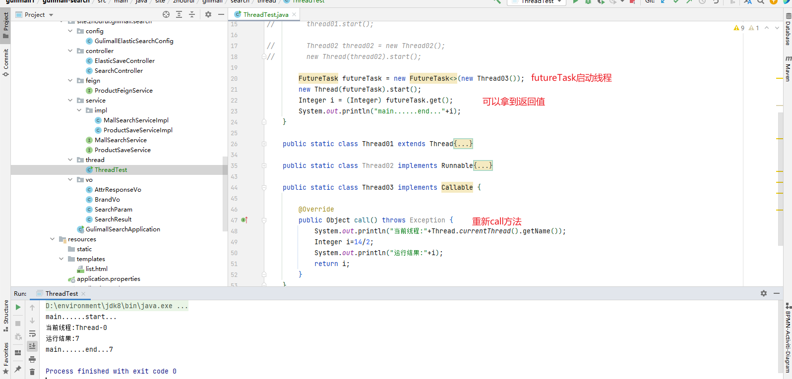

> **注意**
>
> 实现callable的方法可以拿到返回值
>
> **FutureTask继承了Runnable**
>
> 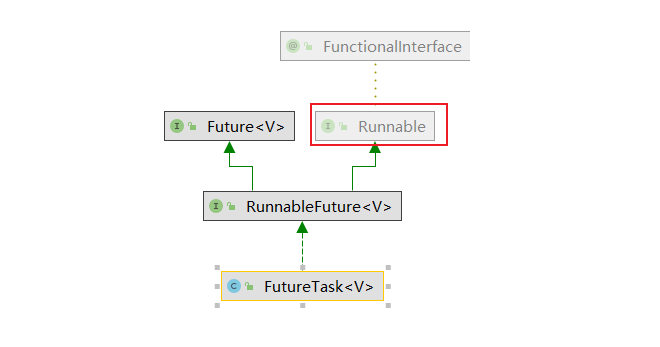

## 1.4 创建线程池直接提交任务（推荐），

我们以后再业务代码里面，前三种启动线程的方式都不用。将所有的多线程异步任务都交给线程池执行。

**创建一个固定类型的线程池**

```java
        ExecutorService executorService = Executors.newFixedThreadPool(10);
        executorService.execute(new Runnable() {
            @Override
            public void run() {
                System.out.println("当前线程"+Thread.currentThread());
            }
        });
```


## **1.5 四种创建线程方法的区别**

**区别：**

- 1、2不能得到返回值。3可以获取返回值
- 1、2、3都不能控制资源
- **4可以控制资源**，性能稳定，不会一下子所有线程一起运行

**总结：** 

1、实际开发中，只用线程池【高并发状态开启了n个线程，会耗尽资源】
 2、当前系统中线程池只有一两个，每个异步任务提交给线程池让他自己去执行

# 2. 线程池详解

## 2.1 创建线程池方法1：**执行器工具类创建线程池**

### **2.1.1 执行器工具类** **Executors创建线程池**

>  **Executors**译为执行器、线程池。

```java
        ExecutorService executorService = Executors.newFixedThreadPool(10);
        executorService.execute(new Runnable() {
            @Override
            public void run() {
                System.out.println("当前线程"+Thread.currentThread());
            }
        });
```


### **2.1.2** 线程池execute和submit区别(向线程池提交任务)

execute：参数只能是Runnable，没有返回值
 submit：参数可以是Runnable、Callable，返回值是FutureTask

**注意:声明的线程池必须是全局的不然起不到效果**


### **2.1.3 执行器工具类**的4种线程池

**1、newCachedThreadPool：缓存线程池。**核心线程数是0，如果空闲会回收所有线程

创建一个可缓存线程池， 如果线程池长度超过处理需要， 可灵活回收空闲线程， 若无可回收， 则新建线程。

**2、newFixedThreadPool：固定大小的线程池。**核心线程数 = 最大线程数，【不回收】

 创建一个定长线程池， 可控制线程最大并发数， 超出的线程会在队列中等待。

**3、newScheduledThreadPool：定时任务线程池。**多久之后执行【可提交核心线程数，最大线程数是Integer.Max】

 创建一个定长线程池， 支持定时及周期性任务执行。

**4、newSingleThreadPool：单线程化的线程池。**核心与最大都只有一个【不回收】,后台从队列中获取任务

 创建一个单线程化的线程池， 它只会用唯一的工作线程来执行任务， 保证所有任务按照指定顺序(FIFO, LIFO, 优先级)执行。


## 2.2 创建线程池方法2（推荐）：创建自定义线程池

### 2.2.1 线程池执行器ThreadPoolExecutor创建自定义线程池

```java
ThreadPoolExecutor executor = new ThreadPoolExecutor( 
    			 5,    //核心线程数
                 200,    //最大线程数量，控制资源并发
                 10,    //存活时间
                TimeUnit.SECONDS,    //时间单位
                new LinkedBlockingDeque<>(  100000),    //任务队列，大小100000个
        Executors.defaultThreadFactory(),    //线程的创建工厂
        new ThreadPoolExecutor.AbortPolicy());    //拒绝策略
        // 任务1
        executor.execute(() -> {
            try {
                Thread.sleep(3 * 1000);
                System.out.println("--helloWorld_001--" + Thread.currentThread().getName());
            } catch (InterruptedException e) {
                e.printStackTrace();
            }
        });
```


### 2.2.2 **构造方法的七个参数**

```java
new ThreadPoolExecutor(corePoolSize, maximumPoolSize, keepAliveTime, TimeUnit unit,workQueue, threadFactory, handler);
```


- **corePoolSize：核心线程数**。创建以后，会一直存活到线程池销毁，空闲时也不销毁。

- **maximumPoolSize：最大线程数量**。阻塞队列满了

- **keepAliveTime： 存活时间**。释放空闲时间超过“存活时间”的线程，仅留核心线程数量的线程。

- **TimeUnitunit：时间单位**

- workQueue： 任务队列。

  如果线程数超过核心数量，就把剩余的任务放到队列里。只要有线程空闲，就会去队列取出新的任务执行。new LinkedBlockingDeque()队列大小默认是Integer的最大值，内存不够，所以建议指定队列大小。 

  - SynchronousQueue是一个同步队列，它不会缓存任务，而是直接将任务传递给线程处理。当队列中已经有一个元素时，再有其他元素插入到队列中就会被阻塞，直到其他线程接收任务为止。
  - **LinkedBlockingQueue**是一个无界队列，可以缓存无限多的任务。由于其无界特性，因此需要合理地处理好任务的生产速率和线程池中线程的数量，以避免内存溢出等异常问题。
  - **ArrayBlockingQueue**是一个有界（容量固定）队列，只能缓存固定数量的任务。通过固定队列容量，可以避免任务过多导致线程阻塞，保证线程池资源的可控性和稳定性。
  - PriorityBlockingQueue是一个优先级队列，能够对任务按照优先级进行排序，当任务数量超过队列容量时，会根据元素的Comparable或Comparator排序规则进行丢弃或抛异常。

- **threadFactory：线程的创建工厂**【可以自定义】。默认的线程工厂Executors.defaultThreadFactory(),

- RejectedExecutionHandler handler：拒绝策略。

  如果任务队列和最大线程数量满了，按照指定的拒绝策略执行任务。 

  - Rejected：丢弃最老的
  - Caller：调用者同步调用，直接调用run方法，不创建线程了
  - **Abort （默认）：直接丢弃新任务**
  - Discard：丢弃新任务，并且抛出异常

### 2.2.3 **线程池执行任务流程（线程池原理）**

**任务加入时判断的顺序：**核心线程数 、阻塞队列、最大线程数、拒绝策略。

**线程池执原理：** 

1. 新加入任务，判断corePoolSize是否到最大值；如果没到最大值就创建核心线程执行新任务，如果到最大值就判断是否有空闲的核心线程；
2. 如果有空闲的核心线程，则空闲核心线程执行新任务，如果没空闲的核心线程，则尝试加入FIFO阻塞队列；
3. 若加入成功，则等待空闲核心线程将队头任务取出并执行，若加入失败（例如队列满了），则判断maximumPoolSize是否到最大值；
4. 如果没到最大值就创建非核心线程执行新任务，如果到了最大值就执行丢弃策略，默认丢弃新任务；
5. 线程数大于corePoolSize时，空闲线程将在keepAliveTime后回收，直到线程数等于核心线程数。这些核心线程也不会被回收。

实际上线程本身没有核心和非核心的概念，都是靠比较corePoolSize和当前线程数判断一个线程是不是能看作核心线程。

可能某个线程之前被看作是核心线程，等它空闲了，线程池又有corePoolSize个线程在执行任务，这个线程到keepAliveTime后还是会被回收。

> **练习：**
>  一个线程池 core 7； max 20 ， queue： 50， 100 并发进来怎么分配的；
>  先有 7 个能直接得到执行， 接下来 50 个进入队列排队， 在多开 13 个继续执行。 现在 70 个任务已经被安排上了，剩下 30 个默认拒绝策略。 

**拒绝策略**
 1、丢弃最老的 Rejected
 2、调用者同步调用，直接调用run方法，不创建线程了 Caller
 3、直接丢弃新任务 Abort 【默认使用这个】
 4、丢弃新任务，并且抛出异常 Discard

 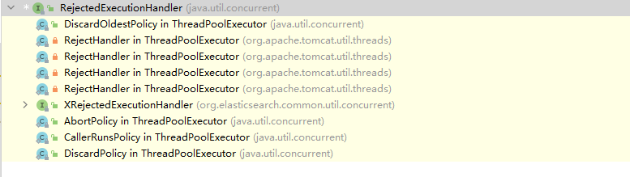


## **2.3** **使用线程池的好处**

**1、降低资源的消耗【减少创建销毁线程的开销】**
 通过重复利用已经创建好的线程降低线程的创建和销毁带来的损耗

**2、提高响应速度【控制线程个数】**
 因为线程池中的线程数没有超过线程池的最大上限时,有的线程处于等待分配任务的状态，当任务来时无需创建新的线程就能执行

**3、提高线程的可管理性**【例如系统中可以创建两个线程池，核心线程池、非核心线程池【短信等】，**关闭非核心线程池释放内存资源**】
 线程池会根据当前系统特点对池内的线程进行优化处理，减少创建和销毁线程带来的系统开销。无限的创建和销毁线程不仅消耗系统资源，还降低系统的稳定性，使用线程池进行统一分配


# 3. 异步编排 CompletableFuture

## 3.1 简介 

> Completable译为“可完备化的” 。

CompletableFuture提供了非常强大的**Future接口的扩展功能**， **可以简化异步编程**。

提供了函数式编程的能力， 可以通过回调的方式处理计算结果， 并且提供了转换和组合 CompletableFuture 的方法。CompletableFuture 类实现了 Future 接口， 所以你还是可以像以前一样通过`get`方法阻塞或者轮询的方式获得结果， 但是这种方式不推荐使用。

CompletableFuture 和 FutureTask （ 构造参数为Callable实现类）同属于 **Future 接口的实现类**， 都可以**获取线程的执行结果。**


**示例，使用异步可以缩短响应时间:**


 查询商品详情页的逻辑比较复杂，有些数据还需要远程调用，必然需要花费更多的时间。


```java
// 1.获取sku的基本信息0.5s
// 2.获取sku的图片信息0.5s


// 3.获取sku的促销信息1s
// 4.获取spu的所有销售属性 1s
// 5.获取规格参数组及组下的规格参数1.5s
// 6.spu详情1s
```


 假如商品详情页的每个查询，需要如下标注的时间才能完成那么，用户需要 **6.5s** 后才能看到商品详情页的内容。很显然是不能接受的。如果有**多个线程同时完成**这 6步操作，**只需要 1.5s** 即可完成响应。

## 3.2 创建异步对象，runAsync|supplyAsync

### 3.2.1 创建异步对象的方法

CompletableFuture 提供了四个静态方法来创建一个异步操作：

```java
public static CompletableFuture<Void> runAsync(Runnable runnable)
//无线程返回值，指定线程池
public static CompletableFuture<Void> runAsync(Runnable runnable，Executor executor)
public static <U> CompletableFuture<U> supplyAsync(Supplier<U> supplier)
//有线程返回值，指定线程池
public static <U> CompletableFuture<U> supplyAsync(Supplier<U> supplier，Executor executor)
```


1、 runAsync 都是没有线程返回结果的， supplyAsync 都是可以获取线程返回结果的

2、 可以传入自定义的线程池， 否则就用默认的线程池；

3、Async代表异步方法

### 3.2.2 runAsync，不带线程返回值

```java
public class ThreadTest {
    //        ExecutorService executorService = Executors.newFixedThreadPool(10);
    public static ThreadPoolExecutor executor = new ThreadPoolExecutor(  5,
            200,
            10,
            TimeUnit.SECONDS,
            new LinkedBlockingDeque<>(  100000),
            Executors.defaultThreadFactory(),
            new ThreadPoolExecutor.AbortPolicy());


    public static void main(String[] args) {
        CompletableFuture<Void> voidCompletableFuture = CompletableFuture.runAsync(() -> {
            System.out.println("当前线程:"+Thread.currentThread().getName());
            int i = 10 / 2;
            System.out.println("运行结果...."+i);
        }, executor);
    }
}
```


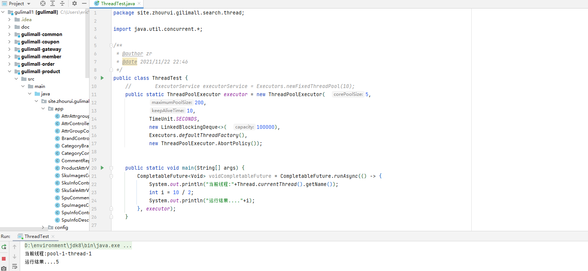

### 3.2.3 supplyAsync 带线程返回值

```java
public class ThreadTest {
    //        ExecutorService executorService = Executors.newFixedThreadPool(10);
    public static ThreadPoolExecutor executor = new ThreadPoolExecutor(  5,
            200,
            10,
            TimeUnit.SECONDS,
            new LinkedBlockingDeque<>(  100000),
            Executors.defaultThreadFactory(),
            new ThreadPoolExecutor.AbortPolicy());


    public static void main(String[] args) throws ExecutionException, InterruptedException {

        CompletableFuture<Integer> supplyAsync = CompletableFuture.supplyAsync(() -> {
            System.out.println("当前线程:" + Thread.currentThread().getName());
            int i = 12 / 2;
            System.out.println("运行结果...." + i);
            return i;    //有返回值
        }, executor);

        Integer integer = supplyAsync.get();
        System.out.println("返回数据:"+integer);
    }
}
```


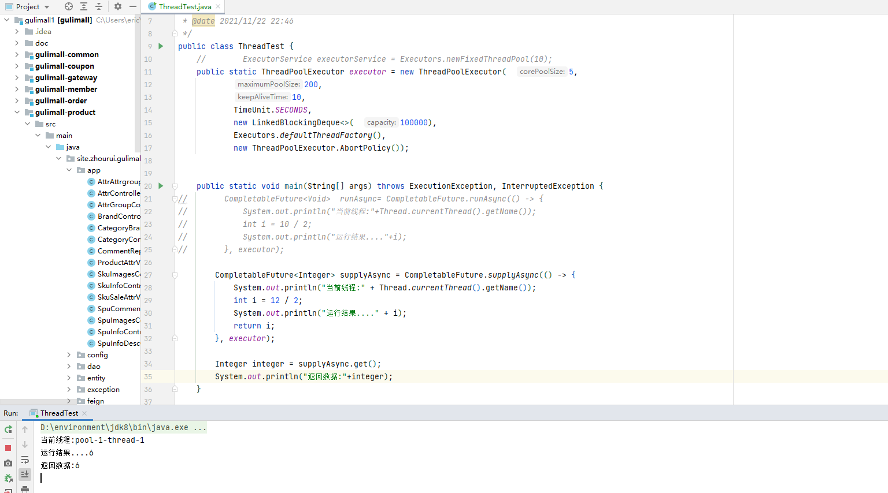

## 3.3 线程结果感知和处理，使用whenCompleteAsync与exceptionally

### 3.3.1 简介 

```java
public CompletableFuture whencomplete(BiConsumer<? super T,? super Throwable> action);
public CompletableFuture whenCompleteAsync(BiConsumer <? super T,? super Throwable> action);
public CompletableFuture whenCompleteAsync(BiConsumer<? super T,? super Throwable> action，Executor executor);
public CompletableFuture exceptionally(Function<Throwable,? extends T> fn);
```


- whenComplete可以处理正常和异常的计算结果，exceptionally处理异常情况。

**whenComplete 和 whenCompleteAsync 的区别：**
 **whenComplete：** 是执行当前任务的线程执行继续执行 whenComplete 的任务。
 **whenCompleteAsync：** 是执行把 whenCompleteAsync 这个任务继续提交给线程池
 来进行执行。

- 方法不以 Async 结尾， 意味着 Action 使用相同的线程执行， 而 Async 可能会使用其他线程执行（如果是使用相同的线程池， 也可能会被同一个线程选中执行）

### 3.3.2 感知结果和异常但不处理，whenCompleteAsync


```java
public class ThreadTest {
    //        ExecutorService executorService = Executors.newFixedThreadPool(10);
    public static ThreadPoolExecutor executor = new ThreadPoolExecutor(  5,
            200,
            10,
            TimeUnit.SECONDS,
            new LinkedBlockingDeque<>(  100000),
            Executors.defaultThreadFactory(),
            new ThreadPoolExecutor.AbortPolicy());


    public static void main(String[] args) throws ExecutionException, InterruptedException {
        CompletableFuture<Integer> supplyAsync = CompletableFuture.supplyAsync(() -> {
            System.out.println("当前线程:" + Thread.currentThread().getName());
            int i = 12 / 2;
            System.out.println("运行结果...." + i);
            return i;
        }, executor).whenCompleteAsync((res, exception) -> {    //第一个参数是结果，第二个参数是异常
            System.out.println("异步任务完成....感知到返回值为:"+res+"异常:"+exception);
        },executor);

        Integer integer = supplyAsync.get();
        System.out.println("返回数据:"+integer);
    }
}
```


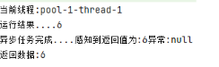


> 模拟异常情况，将线程里计算改成“12/0”
>
> ```java
> public class ThreadTest {
>     //        ExecutorService executorService = Executors.newFixedThreadPool(10);
>     public static ThreadPoolExecutor executor = new ThreadPoolExecutor(  5,
>             200,
>             10,
>             TimeUnit.SECONDS,
>             new LinkedBlockingDeque<>(  100000),
>             Executors.defaultThreadFactory(),
>             new ThreadPoolExecutor.AbortPolicy());
> 
> 
>     public static void main(String[] args) throws ExecutionException, InterruptedException {
>         CompletableFuture<Integer> supplyAsync = CompletableFuture.supplyAsync(() -> {
>             System.out.println("当前线程:" + Thread.currentThread().getName());
>             int i = 12 / 0;
>             System.out.println("运行结果...." + i);
>             return i;
>         }, executor).whenCompleteAsync((res, exception) -> {
>             System.out.println("异步任务完成....感知到返回值为:"+res+"异常:"+exception);
>         },executor);
> 
>         Integer integer = supplyAsync.get();
>         System.out.println("返回数据:"+integer);
>     }
> }
> ```
>
> 
>
> 
>
> 此处虽然得到了异常信息但是没有办法修改返回数据,使用`exceptionally`自定义异常时的返回值

### 3.3.3 感知结果和异常并处理异常，whenCompleteAsync和exceptionally

异常情况处理

```java
public class ThreadTest {
    //        ExecutorService executorService = Executors.newFixedThreadPool(10);
    public static ThreadPoolExecutor executor = new ThreadPoolExecutor(  5,
            200,
            10,
            TimeUnit.SECONDS,
            new LinkedBlockingDeque<>(  100000),
            Executors.defaultThreadFactory(),
            new ThreadPoolExecutor.AbortPolicy());


    public static void main(String[] args) throws ExecutionException, InterruptedException {
        CompletableFuture<Integer> supplyAsync = CompletableFuture.supplyAsync(() -> {
            System.out.println("当前线程:" + Thread.currentThread().getName());
            int i = 12 / 0;
            System.out.println("运行结果...." + i);
            return i;
//虽然能得到异常信息，但无法修改返回结果
        }, executor).whenCompleteAsync((res, exception) -> {
            System.out.println("异步任务完成....感知到返回值为:"+res+"异常:"+exception);
//可以感知异常，并返回自定义默认值
        },executor).exceptionally(throwable -> {
            return 0;
        });

        Integer integer = supplyAsync.get();
        System.out.println("返回数据:"+integer);
    }
}
```


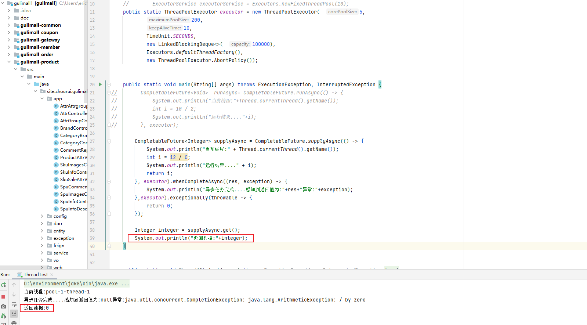

> 无异常情况，正常返回不会进exceptionally，也就不会处理异常：
>
> ```java
> public class ThreadTest {
>     //        ExecutorService executorService = Executors.newFixedThreadPool(10);
>     public static ThreadPoolExecutor executor = new ThreadPoolExecutor(  5,
>             200,
>             10,
>             TimeUnit.SECONDS,
>             new LinkedBlockingDeque<>(  100000),
>             Executors.defaultThreadFactory(),
>             new ThreadPoolExecutor.AbortPolicy());
> 
> 
>     public static void main(String[] args) throws ExecutionException, InterruptedException {
>         CompletableFuture<Integer> supplyAsync = CompletableFuture.supplyAsync(() -> {
>             System.out.println("当前线程:" + Thread.currentThread().getName());
>             int i = 12 / 2;
>             System.out.println("运行结果...." + i);
>             return i;
>         }, executor).whenCompleteAsync((res, exception) -> {
>             System.out.println("异步任务完成....感知到返回值为:"+res+"异常:"+exception);
>         },executor).exceptionally(throwable -> {
>             return 0;
>         });
> 
>         Integer integer = supplyAsync.get();
>         System.out.println("返回数据:"+integer);
>     }
> }
> ```
>
> 
>
> 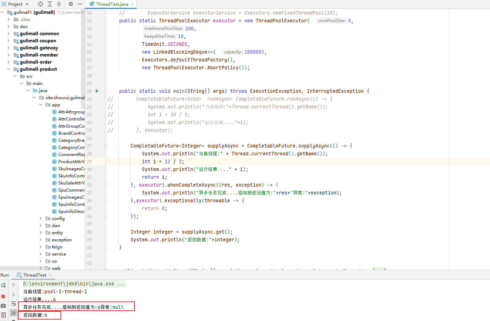

## 3.4 线程结果感知和处理（推荐）， handle 方法

和 complete 一样， 可对结果做最后的处理（可处理异常），可改变返回值。

**总结：使用R apply(T t, U u); 可以感知异常，和修改返回值的功能。**

> 有异常情况

```java
	public static void main(String[] args) throws ExecutionException, InterruptedException {

        CompletableFuture<Integer> supplyAsync = CompletableFuture.supplyAsync(() -> {
            System.out.println("当前线程:" + Thread.currentThread().getName());
            int i = 12 / 0;
            System.out.println("运行结果...." + i);
            return i;
        //处理方法执行结果
        }, executor).handleAsync((res, throwable) -> {
            if (res!=null){
                return res*2;
            }
            if (throwable!=null){
                System.out.println("出现异常"+throwable.getMessage());
                return -1;
            }
            return 0;
        },executor);

        Integer integer = supplyAsync.get();
        System.out.println("返回数据:"+integer);
    }
```


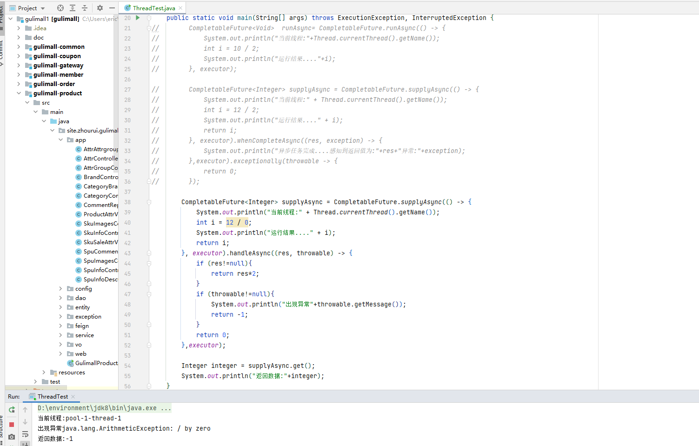

> 无异常情况

```java
	public static void main(String[] args) throws ExecutionException, InterruptedException {

        CompletableFuture<Integer> supplyAsync = CompletableFuture.supplyAsync(() -> {
            System.out.println("当前线程:" + Thread.currentThread().getName());
            int i = 12 / 6;
            System.out.println("运行结果...." + i);
            return i;
        }, executor).handleAsync((res, throwable) -> {
            if (res!=null){
                return res*2;
            }
            if (throwable!=null){
                System.out.println("出现异常"+throwable.getMessage());
                return -1;
            }
            return 0;
        },executor);

        Integer integer = supplyAsync.get();
        System.out.println("返回数据:"+integer);
    }
```


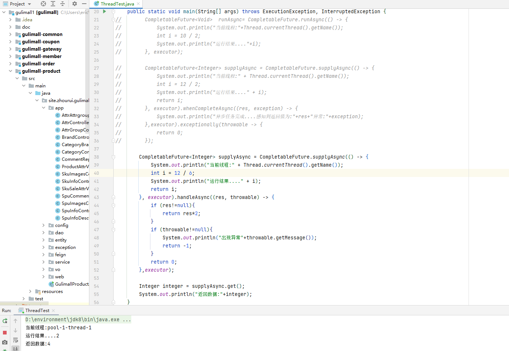


**总结:**

一般用handle，因为whencomplete如果异常不能给定默认返回结果，需要再调用exceptionally，而handle可以

该方法作用：获得前一任务的返回值【自己也可以是异步执行的】，也可以处理上一任务的异常，调用exceptionally修改前一任务的返回值【例如异常情况时给一个默认返回值】而handle方法可以简化操作

## 3.5 线程串行化方法

### 3.5.0 简介 

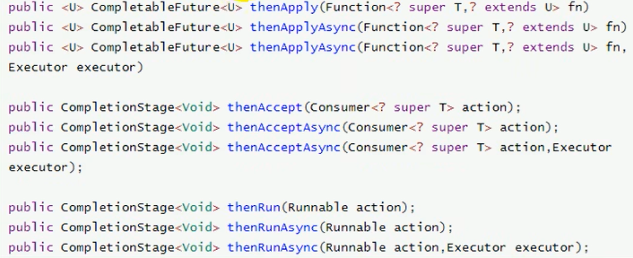


- thenRun：继续执行，**不接受**上一个任务的返回结果,自己执行完**没有**返回结果
- thenAccept：继续执行，**接受**上一个任务的返回结果,自己执行完**没有**返回结果
- thenApply：继续执行，**接受**上一任务的返回结果，并且**自己的返回结果**也被下一个任务所感知
- 以上都要前置任务成功完成。
   Function<? super T,? extends U>
   T： 上一个任务返回结果的类型
   U： 当前任务的返回值类型

### 3.5.1 thenRunAsync

```java
    public static void main(String[] args) throws ExecutionException, InterruptedException {
        CompletableFuture<Void>  runAsync= CompletableFuture.runAsync(() -> {
            System.out.println("当前线程:"+Thread.currentThread().getName());
            int i = 10 / 2;
            System.out.println("运行结果...."+i);
        }, executor).thenRunAsync(() -> {
            System.out.println("任务二启动了...");
        },executor);

        System.out.println("返回数据:");
    }
```


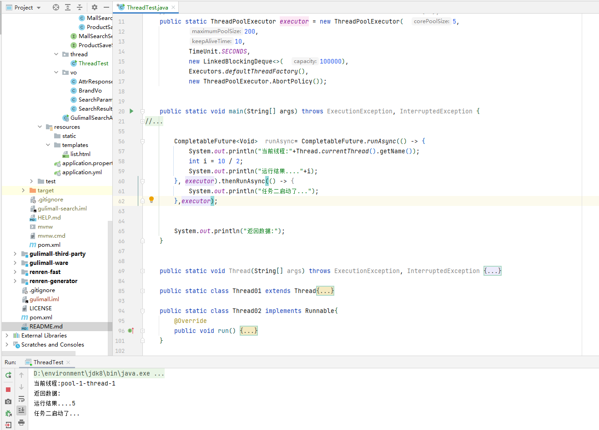

### 3.5.2 thenAcceptAsync

```java
    public static void main(String[] args) throws ExecutionException, InterruptedException {
        CompletableFuture<Void>  supplyAsync= CompletableFuture.supplyAsync(() -> {
            System.out.println("当前线程:"+Thread.currentThread().getName());
            int i = 10 / 2;
            System.out.println("运行结果...."+i);
            return i;
        }, executor).thenAcceptAsync(res -> {
            System.out.println("任务二启动了..."+"拿到了上一步的结果:"+res);
        },executor);
        System.out.println("返回数据:");
    }
```


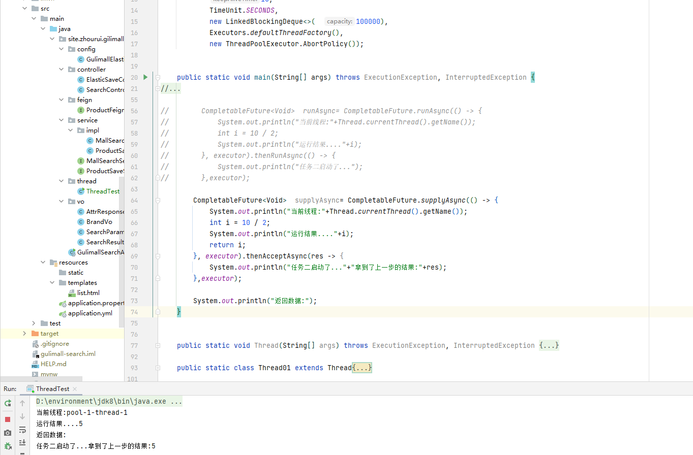

### 3.5.3 thenApplyAsync

```java
 public static void main(String[] args) throws ExecutionException, InterruptedException {
        CompletableFuture<Integer> future = CompletableFuture.supplyAsync(() -> {
            System.out.println("当前线程:" + Thread.currentThread().getName());
            int i = 10 / 2;
            System.out.println("运行结果...." + i);
            return i;
        }, executor).thenApplyAsync(res -> {
            System.out.println("任务二启动了..." + "拿到了上一步的结果:" + res);
            return res*2;
        }, executor);
        Integer integer = future.get();
        System.out.println("返回数据:"+integer);
    }
```


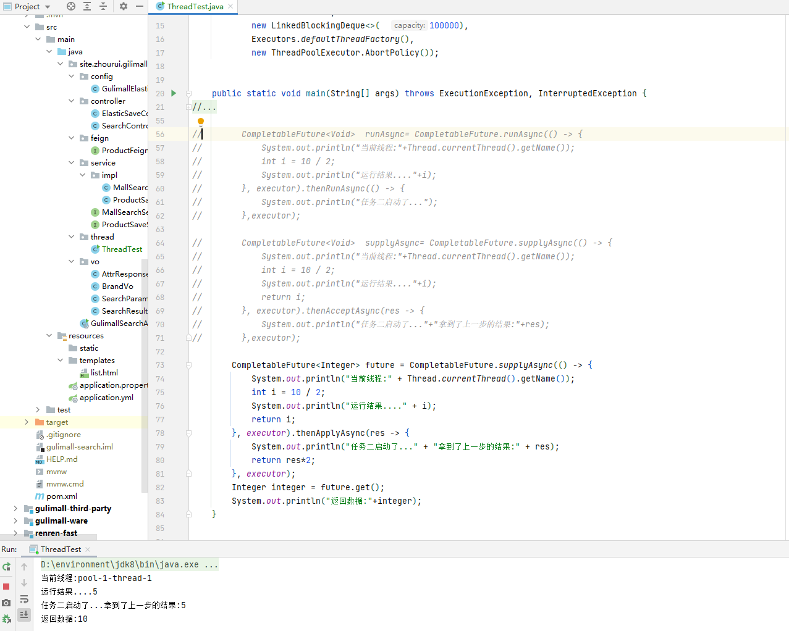

## 3.6 两任务组合 - 都要完成

### 3.6.0 概述 


**runAfterBoth:**组合两个future，不需要获取之前任务future的结果，只需两个future处理完任务后，处理该任务。

**thenAcceptBoth:**组合两个future，获取前两个future任务的返回结果，然后处理任务，没有返回值。

**thenCombine:**组合两个future，获取前两个future的返回结果，并返回当前任务的返回值

> ```java
> public <U,V> CompletableFuture thenCombine(CompletionStage<? extends U> other, BiFunction<? super T,? super U,? extends V> fn);
> 
> public <U,V> CompletableFuture thenCombineAsync(CompletionStage<? extends U> other, BiFunction<? super T,? super U,? extends V> fn);
> 
> public <U,V> CompletableFuture thenCombineAsync(CompletionStage<? extends U> other, BiFunction<? super T,? super U,? extends V> fn, Executor executor);
> 
> public CompletableFuture thenAcceptBoth(CompletionStage<? extends U> other, BiConsumer<? super T, ? super U> action);
> 
> public CompletableFuture thenAcceptBothAsync(CompletionStage<? extends U> other, BiConsumer<? super T, ? super U> action);
> 
> public CompletableFuture thenAcceptBothAsync(CompletionStage<? extends U> other, BiConsumer<? super T, ? super U> action, Executor executor);
> 
> public CompletableFuture runAfterBoth(CompletionStage<?> other, Runnable action);
> 
> public CompletableFuture runAfterBothAsync(CompletionStage<?> other, Runnable action);
> 
> public CompletableFuture runAfterBothAsync(CompletionStage<?> other, Runnable action, Executor executor);
> ```
>
> 

### 3.6.1 runAfterBothAsync，不获取结果并处理新任务

```java
 public static void main(String[] args) throws ExecutionException, InterruptedException {
        CompletableFuture<Integer> future01 = CompletableFuture.supplyAsync(() -> {
            System.out.println("任务一线程开始:" + Thread.currentThread().getName());
            int i = 12 / 2;
            System.out.println("任务一运行结束...." + i);
            return i;
        }, executor);

        CompletableFuture<Object> future02 = CompletableFuture.supplyAsync(() -> {
            System.out.println("任务二线程开始:" + Thread.currentThread().getName());
            System.out.println("任务二运行结束....");
            return "hello";
        }, executor);

        future01.runAfterBothAsync(future02,() -> {
            System.out.println("任务三开始...");
        });

        System.out.println("返回数据:");
    }
```


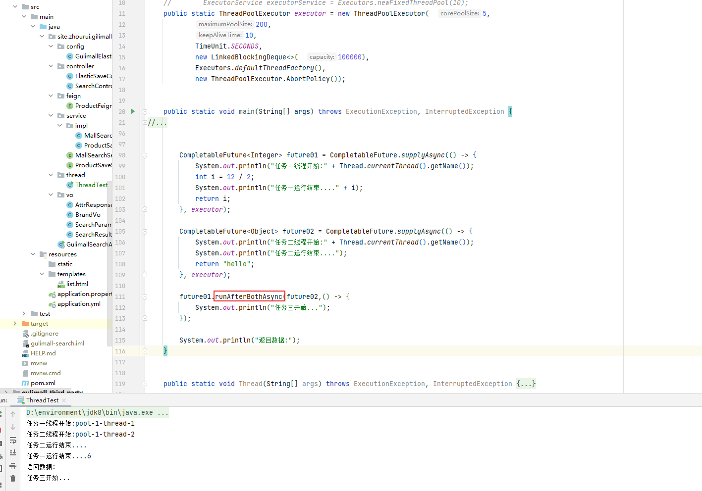

### 3.6.2 thenAcceptBothAsync，获取结果并处理新任务

```java
 public static void main(String[] args) throws ExecutionException, InterruptedException {
        CompletableFuture<Integer> future01 = CompletableFuture.supplyAsync(() -> {
            System.out.println("任务一线程开始:" + Thread.currentThread().getName());
            int i = 12 / 2;
            System.out.println("任务一运行结束...." + i);
            return i;
        }, executor);

        CompletableFuture<Object> future02 = CompletableFuture.supplyAsync(() -> {
            System.out.println("任务二线程开始:" + Thread.currentThread().getName());
            System.out.println("任务二运行结束....");
            return "hello";
        }, executor);

        future01.thenAcceptBothAsync(future02,(res1, res2) -> {
            System.out.println("任务一返回值:"+res1+"任务二返回值:"+res2);
        });

        System.out.println("返回数据:");
    }
```


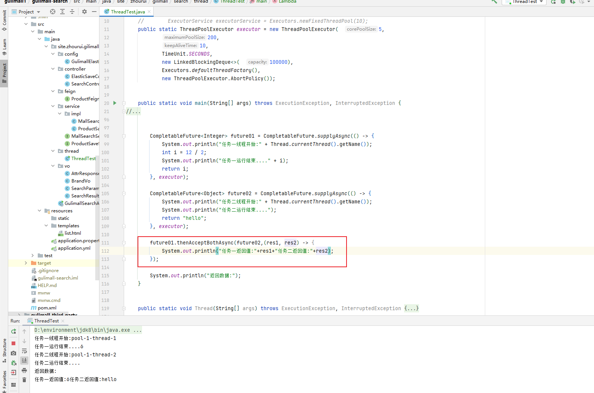

### 3.6.3 thenCombineAsync，，获取结果并获得新任务结果

```java
public static void main(String[] args) throws ExecutionException, InterruptedException {

        CompletableFuture<Integer> future01 = CompletableFuture.supplyAsync(() -> {
            System.out.println("任务一线程开始:" + Thread.currentThread().getName());
            int i = 12 / 2;
            System.out.println("任务一运行结束...." + i);
            return i;
        }, executor);

        CompletableFuture<Object> future02 = CompletableFuture.supplyAsync(() -> {
            System.out.println("任务二线程开始:" + Thread.currentThread().getName());
            System.out.println("任务二运行结束....");
            return "hello";
        }, executor);

        CompletableFuture<String> future = future01.thenCombineAsync(future02, (res1, res2) -> {
            System.out.println("任务一返回值:" + res1 + "任务二返回值:" + res2);

            return res1 + (String) res2;
        }, executor);

        System.out.println("返回数据:"+future.get());
    }
```


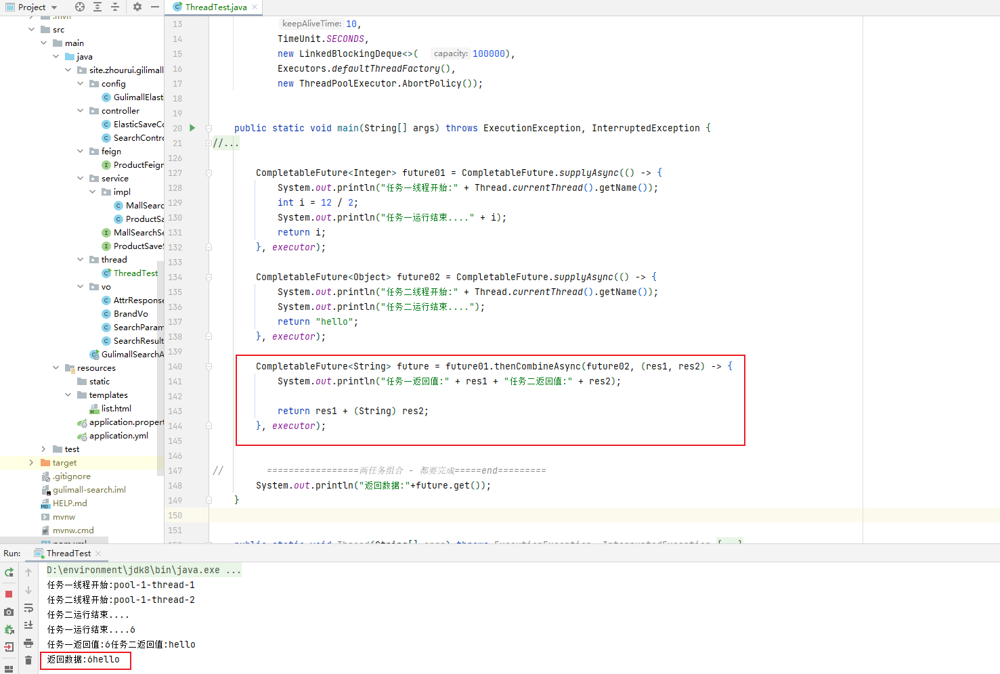

## 3.7 两个任务 - 一个完成

### 3.7.0 概述 

**runAfterEither：** 两个任务有一个执行完成， 不需要获取 future 的结果， 处理任务， 也没有返回值。

**acceptEither：** 两个任务有一个执行完成， 获取它的返回值， 处理任务， 没有新的返回值。

**applyToEither：** 两个任务有一个执行完成， 获取它的返回值， 处理任务并有新的返回值。

> ```java
> public <U> CompletableFuture<U> applyToEither(
>     CompletionStage<? extends T> other, Function<? super T, U> fn) {
>     return orApplyStage(null, other, fn);
> }
> 
> public <U> CompletableFuture<U> applyToEitherAsync(
>     CompletionStage<? extends T> other, Function<? super T, U> fn) {
>     return orApplyStage(asyncPool, other, fn);
> }
> 
> public <U> CompletableFuture<U> applyToEitherAsync(
>     CompletionStage<? extends T> other, Function<? super T, U> fn,
>     Executor executor) {
>     return orApplyStage(screenExecutor(executor), other, fn);
> }
> 
> public CompletableFuture<Void> acceptEither(
>     CompletionStage<? extends T> other, Consumer<? super T> action) {
>     return orAcceptStage(null, other, action);
> }
> 
> public CompletableFuture<Void> acceptEitherAsync(
>     CompletionStage<? extends T> other, Consumer<? super T> action) {
>     return orAcceptStage(asyncPool, other, action);
> }
> 
> public CompletableFuture<Void> acceptEitherAsync(
>     CompletionStage<? extends T> other, Consumer<? super T> action,
>     Executor executor) {
>     return orAcceptStage(screenExecutor(executor), other, action);
> }
> 
> public CompletableFuture<Void> runAfterEither(CompletionStage<?> other,
>                                               Runnable action) {
>     return orRunStage(null, other, action);
> }
> 
> public CompletableFuture<Void> runAfterEitherAsync(CompletionStage<?> other,
>                                                    Runnable action) {
>     return orRunStage(asyncPool, other, action);
> }
> 
> public CompletableFuture<Void> runAfterEitherAsync(CompletionStage<?> other,
>                                                    Runnable action,
>                                                    Executor executor) {
>     return orRunStage(screenExecutor(executor), other, action);
> }
> ```
>
> 

### 3.7.1 runAfterEitherAsync，不获取结果， 新任务无返回值。

```java
    public static void main(String[] args) throws ExecutionException, InterruptedException {

        CompletableFuture<Integer> future01 = CompletableFuture.supplyAsync(() -> {
            System.out.println("任务一线程开始:" + Thread.currentThread().getName());
            int i = 12 / 2;
            System.out.println("任务一运行结束...." + i);
            return i;
        }, executor);

        CompletableFuture<Object> future02 = CompletableFuture.supplyAsync(() -> {
            System.out.println("任务二线程开始:" + Thread.currentThread().getName());

            try {
                Thread.sleep(3000);
            } catch (InterruptedException e) {
                e.printStackTrace();
            }
            System.out.println("任务二运行结束....");
            return "hello";
        }, executor);

        future01.runAfterEitherAsync(future02,() -> {
            System.out.println("任务三线程开始:" + Thread.currentThread().getName());
        },executor);
        System.out.println("返回数据:");
    }
```


测试发现，线程二睡了3秒钟,但是线程一完成了,达成runAfterEitherAsync执行条件，线程二就不继续执行了

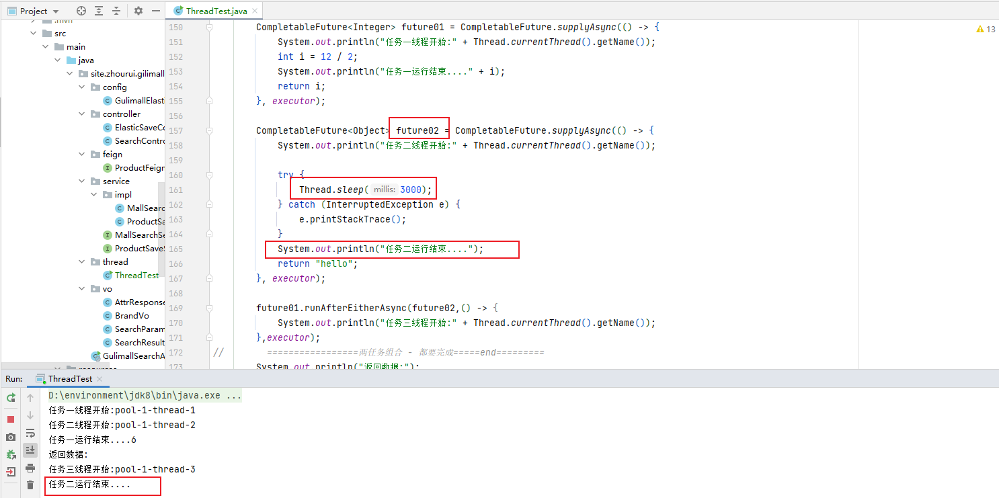

### 3.7.2 acceptEitherAsync，获取结果， 新任务无返回值。

```java
    public static void main(String[] args) throws ExecutionException, InterruptedException {

        CompletableFuture<Integer> future01 = CompletableFuture.supplyAsync(() -> {
            System.out.println("任务一线程开始:" + Thread.currentThread().getName());
            int i = 12 / 2;
            System.out.println("任务一运行结束...." + i);
            return i;
        }, executor);

        CompletableFuture<Object> future02 = CompletableFuture.supplyAsync(() -> {
            System.out.println("任务二线程开始:" + Thread.currentThread().getName());

            try {
                Thread.sleep(3000);
            } catch (InterruptedException e) {
                e.printStackTrace();
            }
            System.out.println("任务二运行结束....");
            return "hello";
        }, executor);

         future02.acceptEitherAsync(future01,res ->{
            System.out.println("任务三线程开始:" + Thread.currentThread().getName()+"拿到上次任务的结果:"+res);
        },executor);
        System.out.println("返回数据:");
    }
```


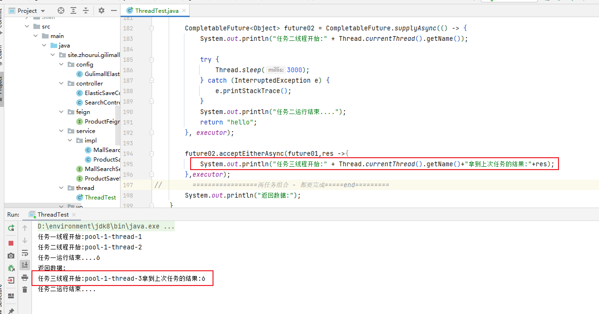

### 3.7.3 applyToEitherAsync，获取结果， 新任务有返回值。

```java
public static void main(String[] args) throws ExecutionException, InterruptedException {
        CompletableFuture<Integer> future01 = CompletableFuture.supplyAsync(() -> {
            System.out.println("任务一线程开始:" + Thread.currentThread().getName());
            int i = 12 / 2;
            System.out.println("任务一运行结束...." + i);
            return i;
        }, executor);

        CompletableFuture<Object> future02 = CompletableFuture.supplyAsync(() -> {
            System.out.println("任务二线程开始:" + Thread.currentThread().getName());

            try {
                Thread.sleep(3000);
            } catch (InterruptedException e) {
                e.printStackTrace();
            }
            System.out.println("任务二运行结束....");
            return "hello";
        }, executor);

        CompletableFuture<String> future = future02.applyToEitherAsync(future01, res -> {
            System.out.println("任务三线程开始:" + Thread.currentThread().getName() + "拿到上次任务的结果:" + res);
            return res + "t3";
        }, executor);

        System.out.println("返回数据:"+future.get());
    }
```


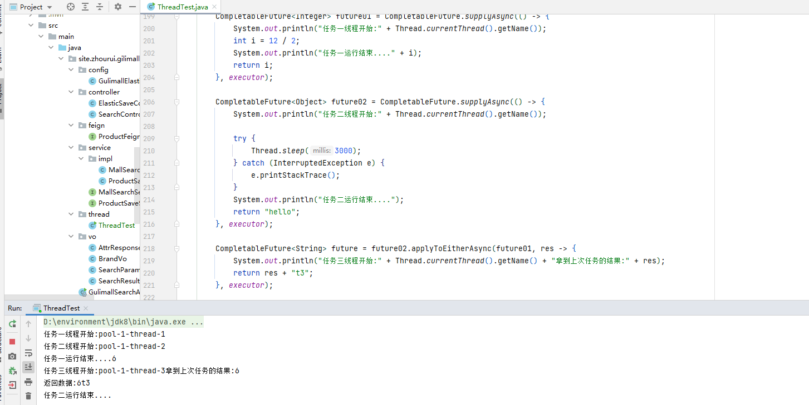

## 3.8 多任务组合

### 3.8.0 概述 

```java
//allOf： 等待所有任务完成
public static CompletableFuture<Void> allOf(CompletableFuture<?>... cfs) {
    return andTree(cfs, 0, cfs.length - 1);
}

//anyOf： 只要有一个任务完成
public static CompletableFuture<Object> anyOf(CompletableFuture<?>... cfs) {
    return orTree(cfs, 0, cfs.length - 1);
}
```


### 3.8.1 allOf,等待所有任务完成

```java
public static void main(String[] args) throws ExecutionException, InterruptedException {
        CompletableFuture<Integer> future01 = CompletableFuture.supplyAsync(() -> {
            System.out.println("任务一线程开始:" + Thread.currentThread().getName());
            int i = 12 / 2;
            System.out.println("任务一运行结束...." + i);
            return i;
        }, executor);

        CompletableFuture<Object> future02 = CompletableFuture.supplyAsync(() -> {
            System.out.println("任务二线程开始:" + Thread.currentThread().getName());

            try {
                Thread.sleep(3000);
            } catch (InterruptedException e) {
                e.printStackTrace();
            }
            System.out.println("任务二运行结束....");
            return "hello";
        }, executor);
        CompletableFuture<Object> future03 = CompletableFuture.supplyAsync(() -> {
            System.out.println("任务三线程开始:" + Thread.currentThread().getName());

            try {
                Thread.sleep(2000);
            } catch (InterruptedException e) {
                e.printStackTrace();
            }
            System.out.println("任务三运行结束....");
            return "hello2";
        }, executor);

        CompletableFuture<Void> allOf = CompletableFuture.allOf(future01, future02, future03);
        allOf.get();//等待所有任务完成
        System.out.println("返回数据:");
    }
```


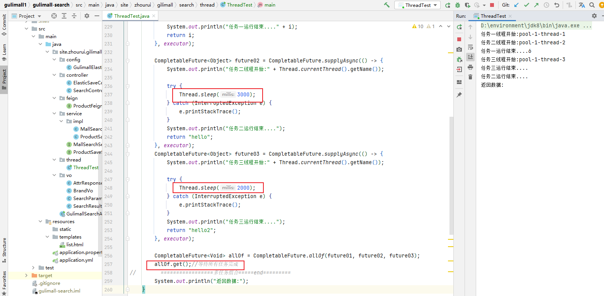

### 3.8.2 anyOf，只要有一个任务完成

```java
public static void main(String[] args) throws ExecutionException, InterruptedException {
        CompletableFuture<Integer> future01 = CompletableFuture.supplyAsync(() -> {
            System.out.println("任务一线程开始:" + Thread.currentThread().getName());
            int i = 12 / 2;
            System.out.println("任务一运行结束...." + i);
            return i;
        }, executor);

        CompletableFuture<Object> future02 = CompletableFuture.supplyAsync(() -> {
            System.out.println("任务二线程开始:" + Thread.currentThread().getName());

            try {
                Thread.sleep(3000);
            } catch (InterruptedException e) {
                e.printStackTrace();
            }
            System.out.println("任务二运行结束....");
            return "hello";
        }, executor);
        CompletableFuture<Object> future03 = CompletableFuture.supplyAsync(() -> {
            System.out.println("任务三线程开始:" + Thread.currentThread().getName());

            try {
                Thread.sleep(2000);
            } catch (InterruptedException e) {
                e.printStackTrace();
            }
            System.out.println("任务三运行结束....");
            return "hello2";
        }, executor);

         CompletableFuture<Object> anyOf = CompletableFuture.anyOf(future01, future02, future03);
        anyOf.get();//等待其中之一任务完成
        System.out.println("返回数据:");
    }
```


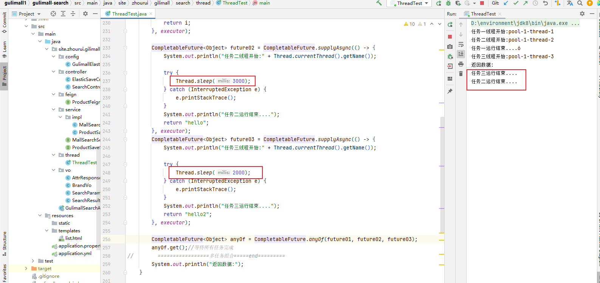