>  **导航：**
>
> [谷粒商城笔记+踩坑汇总篇](https://blog.csdn.net/qq_40991313/article/details/127099139?csdn_share_tail={"type"%3A"blog"%2C"rType"%3A"article"%2C"rId"%3A"127099139"%2C"source"%3A"qq_40991313"})
>
> [【Java笔记+踩坑汇总】Java基础+JavaWeb+SSM+SpringBoot+SpringCloud+瑞吉外卖/谷粒商城/学成在线+设计模式+面试题汇总+性能调优/架构设计+源码解析](https://blog.csdn.net/qq_40991313/article/details/126646289)


[TOC]


# 1、搭建页面环境

## 1.1、配置 Nginx 和 网关

> 配置 Nginx 和 网关

**修改本地的 hosts文件 `vim /etc/hosts`**

```bash
# Gulimall Host Start
127.0.0.1 gulimall.cn
127.0.0.1 search.gulimall.cn
127.0.0.1 item.gulimall.cn
# Gulimall Host End
```


**配置Nginx（将search下的请求转给网关）**
 商城业务-检索服务的时候已经配置过了，这里不需要修改

>  不确定可以再查看一下：
>
> ```
> vim /mydata/nginx/conf/conf.d/gulimall.conf
> ```
>
> 
>
> ```
> server_name gulimall.com *.gulimall.com
> ```
>
> 

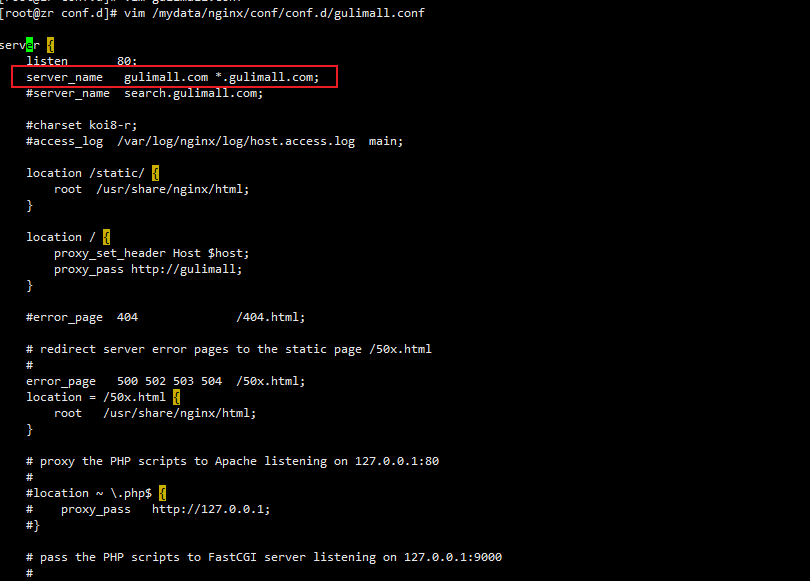

**配置网关**
 修改**gulimall-gateway**服务 `/src/main/resources`路径下的 application.yml

```bash
- id: gulimall_host
  uri: lb://gulimall-product
  predicates:
    - Host=gulimall.com,item.gulimall.com    #设置也可以通过“item.gulimall.com”路由到商品模块
```


## 1.2、动静资源配置

 **动态资源：**

复制shangpinxiangqing.html到gulimall-product/src/main/resources/templates/目录下,并改名为item.index。

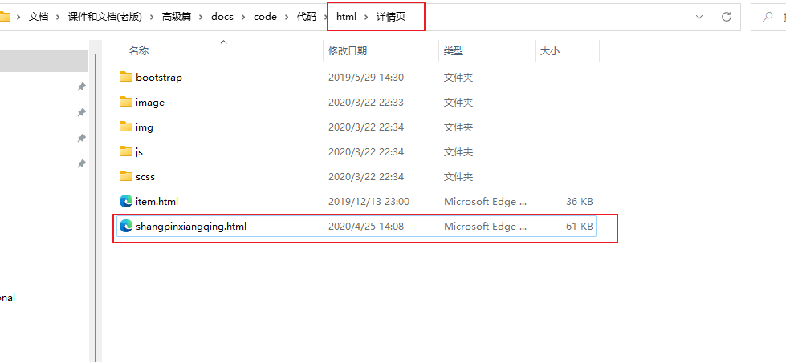

修改“item.index”文件里的`src`和`herf`的静态资源地址，**前缀加“/static/item”**


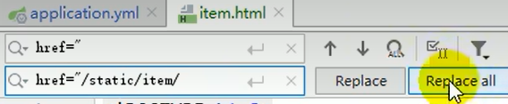


**静态资源：**

将静态资源上传至nginx

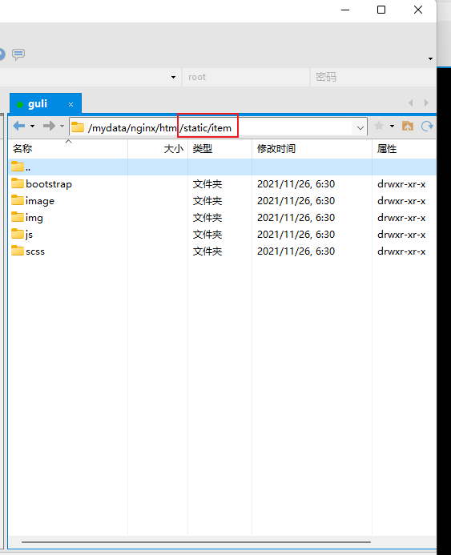


## 1.3、搜索页到详情页跳转

1. 修改**gulimall-search**服务中 `list.html` 文件

   ```html
   <p class="da">
     <a th:href="|http://item.gulimall.cn/${product.skuId}.html|" >
       
     </a>
   </p>
   ```

   

2. 编写 Controller 实现页面跳转

3. 添加“com.atguigu.gulimall.product.web.ItemController”类，代码如下：

   ```java
   @Controller
   public class ItemController {
   
       /**
        * 展示当前sku的详情
        * @param skuId
        * @return
        */
       @GetMapping("/{skuId}.html")
       public String skuItem(@PathVariable("skuId") Long skuId) {
   
           System.out.println("准备查询:" + skuId + "的详情");
   
           return "item.html";    //返回到item.html
       }
   }
   ```

   

4. 访问测试：
     

    搜索后点击商品进入详情页：

   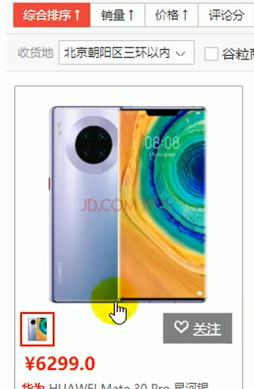

   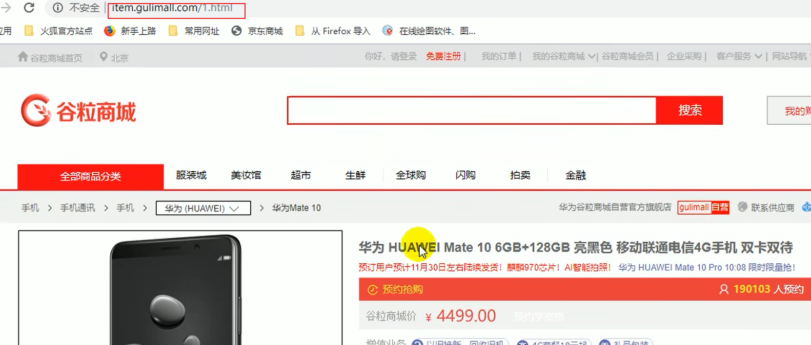

   

   
     

# 2、模型类抽取和controller

## 2.1、分析首页需要展示的信息

根据首页预期展示信息抽取：

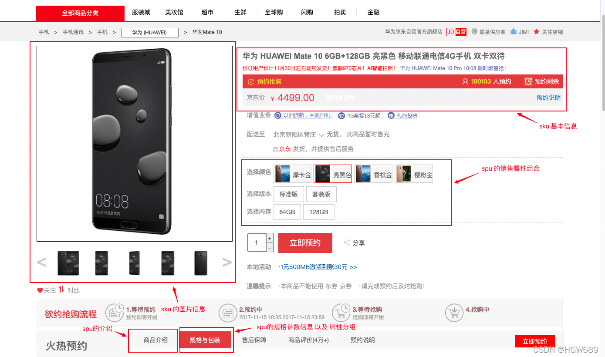

> **注意：**要分清哪些信息是spu的，哪些信息是sku的。 

## **2.2、首页模型类vo**

```java
package com.xx.gulimall.product.vo;

@ToString
@Data
public class SkuItemVo {

    //1、sku基本信息的获取  pms_sku_info
    private SkuInfoEntity info;

    private boolean hasStock = true;

    //2、sku的图片信息    pms_sku_images
    private List<SkuImagesEntity> images;

    //3、获取spu的销售属性组合
    private List<SkuItemSaleAttrVo> saleAttr;

    //4、获取spu的介绍
    private SpuInfoDescEntity desc;

    //5、获取spu的规格参数信息
    private List<SpuItemAttrGroupVo> groupAttrs;

    //6、秒杀商品的优惠信息
    private SeckillSkuVo seckillSkuVo;

}
```


## **2.3、销售属性组合**

```java
@Data
public class SkuItemSaleAttrsVo {
    private Long attrId;
    private String attrName;
    private String attrValues;
}
```


## **2.4、规格参数** 

```java
@ToString
@Data
public class SpuItemAttrGroupVo {
    private String groupName;
    private List<Attr> attrs;
}
```


```java
@Data
public class Attr {

    private Long attrId;
    private String attrName;
    private String attrValue;

}
```


## 2.5、创建ItemController，展示当前sku的详情

```java
package com.xxx.gulimall.product.web;
@Controller
public class ItemController {

    @Resource
    private SkuInfoService skuInfoService;

    /**
     * 展示当前sku的详情
     */
    @GetMapping("/{skuId}.html")
    public String skuItem(@PathVariable("skuId") Long skuId, Model model) throws ExecutionException, InterruptedException {

        System.out.println("准备查询" + skuId + "详情");

        SkuItemVo vos = skuInfoService.item(skuId);
        
        model.addAttribute("item",vos);

        return "item";
    }
}
```


# **3、业务实现（不使用异步）**

## 3.0、业务流程，根据sku_id获取首页信息

- 1、sku基本信息的获取  pms_sku_info
- 2、sku的图片信息   pms_sku_images
- 3、获取spu的销售属性组合
- 4、获取spu的介绍   pms_spu_info_desc
- 5、获取spu的规格参数信息

## 3.1、sku 基本信息获取

> 查询 pms_sku_info

```
com.xxx.gulimall.product.service.impl.SkuInfoServiceImpl
    @Override
    public SkuItemVo item(Long skuId) throws ExecutionException, InterruptedException{
        // 1、sku基本信息    pms_sku_info
        SkuInfoEntity info = getById(skuId);
        Long spuId=info.getSpuId();
        skuItemVo.setInfo(info);

    }
```


## 3.2、获取sku的图片信息

> 表pms_sku_images 

com.xxx.gulimall.product.service.impl.**SkuInfoServiceImpl** 

```java
// 2、sku的图片信息   pms_sku_images
List<SkuImagesEntity> images = skuImagesService.getImagesBySkuId(skuId);
skuItemVo.setImages(images);
```


注入 SkuImagesService，调用该实现类的 `getImagesBySkuId(skuId)` 方法获取spu的图片信息

`com.atguigu.gulimall.product.service.impl` 路径下的 SkuImagesServiceImpl 实现类编写：

```java
@Override
public List<SkuImagesEntity> getImagesBySkuId(Long skuId) {
    SkuImagesDao imagesDao = this.baseMapper;

    List<SkuImagesEntity> imagesEntities = imagesDao.selectList(new QueryWrapper<SkuImagesEntity>().eq("sku_id", skuId));
    return imagesEntities;
}
```


## 3.3、获取spu的销售属性组合

### 3.3.1、**SkuInfoServiceImpl** 

com.xxx.gulimall.product.service.impl.**SkuInfoServiceImpl**

```java
// 3、获取 spu 的销售属性组合
List<SkuItemSaleAttrsVo> saleAttrVos = skuSaleAttrValueService.getSaleAttrsBySpuId(spuId);
skuItemVo.setSaleAttr(saleAttrVos);
```


### 3.3.2、SkuSaleAttrValueServiceImpl

```java
@Override
public List<SkuItemSaleAttrsVo> getSaleAttrsBySpuId(Long spuId) {
    SkuSaleAttrValueDao dao = this.baseMapper;
    List<SkuItemSaleAttrsVo> saleAttrVos = dao.getSaleAttrsBySpuId(spuId);
    return saleAttrVos;
}
```


### 3.3.3、**dao**

使用SkuSaleAttrValueDao 层 getSaleAttrsBySpuId 方法：

```java
package com.atguigu.gulimall.product.dao;

@Mapper
public interface SkuSaleAttrValueDao extends BaseMapper<SkuSaleAttrValueEntity> {

    List<SkuItemSaleAttrsVo> getSaleAttrsBySpuId(@Param("spuId") Long spuId);

}
```


### 3.3.4、**sql，查询指定spu_id下的所有销售属性id,name,value**

> sku表pms_sku_info：
>
> 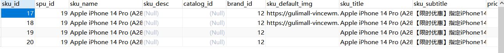
>
> 
>
> sku销售属性表pms_sku_sale_attr_value：
>
> 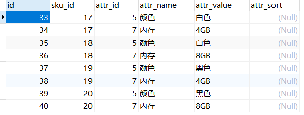

左外连接查询：

```bash
SELECT    #查销售属性的id,name,值
	ssav.attr_id attr_id,
	ssav.attr_name attr_name,
	GROUP_CONCAT( DISTINCT ssav.attr_value ) attr_values 
FROM    #sku表左外连接sku销售属性表
	pms_sku_info info
	LEFT JOIN pms_sku_sale_attr_value ssav ON ssav.sku_id = info.sku_id 
WHERE
	spu_id = #{spuId}
	
GROUP BY
	ssav.attr_id,
	ssav.attr_name;
```


> **查询结果：**
>
> 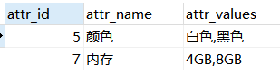

### 3.3.5、mapper 

`gulimall-product/src/main/resources/mapper/product/`SkuSaleAttrValueDao.xml

```XML
<select id="getSaleAttrsBySpuId" resultType="com.atguigu.gulimall.product.vo.SkuItemSaleAttrsVo">
    SELECT
        ssav.attr_id attr_id,
        ssav.attr_name attr_name,
        GROUP_CONCAT(DISTINCT ssav.attr_value) attr_values
    FROM pms_sku_info info
             LEFT JOIN pms_sku_sale_attr_value ssav ON ssav.sku_id = info.sku_id
    WHERE spu_id = #{spuId}
    GROUP BY ssav.attr_id,ssav.attr_name;
</select>
```


分析当前spu有多少了sku，所有sku涉及到的属性组合

1. 通过**spu_id** 查询 `pms_sku_info` 表，获得当前spu对应的 **sku_id**
2. 通过**sku_id** 查询 `pms_sku_sale_attr_value`表，获取 当前spu 对应的所有的sku的销售属性
3. 通过汇总函数封装成我们想要的样子

## 3.4、获取 spu 的介绍

> 查询 pms_spu_info_desc

```java
@Autowired
SpuInfoDescService spuInfoDescService;

// 4、获取 spu 的介绍 pms_spu_info_desc
Long spuId = info.getSpuId();
SpuInfoDescEntity spuInfoDescEntity = spuInfoDescService.getById(spuId);
skuItemVo.setDesp(spuInfoDescEntity);
```


## 3.5、获取 spu 的规格参数信息

> 查询 pms_spu_info_desc

```java
@Autowired
AttrGroupService attrGroupService;

Long spuId = info.getSpuId();
Long catalogId = info.getCatalogId();
// 5、获取 spu 的规格参数信息 pms_spu_info_desc
List<SpuItemAttrGroupVo> attrGroupVos = attrGroupService.getAttrGroupWithAttrsBySpuId(spuId,catalogId);
skuItemVo.setGroupAttrs(attrGroupVos);
```


注入 AttrGroupService，调用该实现类的 `getAttrGroupWithAttrsBySpuId(spuId，catalogId)` 方法

```java
/**
 * 查处当前spuId对应的所有属性分组信息 以及 当前分组下的所有属性对应的值
 * @param spuId
 * @param catalogId
 * @return
 */
@Override
public List<SpuItemAttrGroupVo> getAttrGroupWithAttrsBySpuId(Long spuId, Long catalogId) {
    AttrGroupDao baseMapper = this.getBaseMapper();
    List<SpuItemAttrGroupVo> vos = baseMapper.getAttrGroupWithAttrsBySpuId(spuId,catalogId);
    return vos;
}
```


使用AttrGroupDao 层 getAttrGroupWithAttrsBySpuId 方法：

```java
package com.atguigu.gulimall.product.dao;
@Mapper
public interface AttrGroupDao extends BaseMapper<AttrGroupEntity> {

    List<SpuItemAttrGroupVo> getAttrGroupWithAttrsBySpuId(@Param("spuId") Long spuId, @Param("catalogId") Long catalogId);
}
```


gulimall-product/src/main/resources/mapper/product/AttrGroupDao.xml ：

```XML
<!--resultType 返回集合里面元素的类型，只要有嵌套属性就要自定义结果集-->
<resultMap id="spuItemAttrGroupVo" type="com.atguigu.gulimall.product.vo.SpuItemAttrGroupVo">
    <result property="groupName" column="attr_group_name"></result>
    <collection property="attrs" ofType="com.atguigu.gulimall.product.vo.Attr">
        <result property="attrName" column="attr_name"></result>
        <result property="attrValue" column="attr_value"></result>
    </collection>
</resultMap>
<select id="getAttrGroupWithAttrsBySpuId" resultMap="spuItemAttrGroupVo">
    SELECT
        pav.spu_id,
        ag.attr_group_name,
        ag.attr_group_id,
        aar.attr_id,
        attr.attr_name,
        pav.attr_value
    FROM pms_attr_group ag LEFT JOIN pms_attr_attrgroup_relation aar ON ag.attr_group_id = aar.attr_group_id
                           LEFT JOIN pms_attr attr ON attr.attr_id = aar.attr_id
                           LEFT JOIN pms_product_attr_value pav on pav.attr_id = attr.attr_id
    WHERE ag.catelog_id=#{catalogId} AND pav.spu_id = #{spuId};
</select>
```


这里使用了联表查询：

1. 通过 `catelog_id` 查询 pms_attr_group 表中对应的 属性分组的信息 `attr_group_id`、`attr_group_name`
2. 通过 `attr_group_id` 联表查询 pms_attr_attrgroup_relation 表中的属性id `attr_id`
3. 通过 `attr_id` 联表查询 pms_attr 表中对应的 `attr_name`、`attr_id`
4. 通过 `attr_id` 联表查询 pms_product_attr_value 表中对应的 属性值 `attr_value`


 

# 4、前端，详情页渲染


1、添加thymeleaf的名称空间

```XML
<!DOCTYPE html>
<html lang="en" xmlns:th="http://www.thymeleaf.org">
```


2、标题名设置

```XML
<div class="box-name" th:text="${item.info.skuTitle}">
   华为 HUAWEI Mate 10 6GB+128GB 亮黑色 移动联通电信4G手机 双卡双待
</div>
<div class="box-hide" th:text="${item.info.skuSubtitle}">预订用户预计11月30日左右陆续发货！麒麟970芯片！AI智能拍照！
   <a href="/static/item/"><u></u></a>
</div>
```


3、大图显示

```XML
<div class="imgbox">
   <div class="probox">
      
      <div class="hoverbox"></div>
   </div>
   <div class="showbox">
      
   </div>
</div>
```


4、价格设置

```XML
<div class="box-summary clear">
  <ul>
    <li>京东价</li>
    <li>
      <span>￥</span>
      <span th:text="${#numbers.formatDecimal(item.info.price,0,2)}">4499.00</span>
    </li>
    <li>
      预约享资格
    </li>
    <li>
      <a href="/static/item/">
        预约说明
      </a>
    </li>
  </ul>
</div>
```


5、是否有货

```XML
<li th:text="${item.hasStock?'有货':'无货'}">
   <span>无货</span>， 此商品暂时售完
</li>
```


6、小图显示

```XML
<div class="box-lh-one">
   <ul>
      <li th:each="img:${item.images}" th:if="${!#strings.isEmpty(img.imgUrl)}"></li>
   </ul>
</div>
```


7、销售属性

```XML
<div class="box-attr-3">
   <div class="box-attr-2 clear" th:each="attr:${item.saleAttr}">
      <dl>
         <dt>选择[[${attr.attrName}]]</dt>
         <dd th:each="val:${#strings.listSplit(attr.attrValues,',')}">
            [[${val}]]
         </dd>
      </dl>
   </div>
</div>
```


8、商品介绍

```XML

```


9、规格包装

```XML
<li class="baozhuang actives" id="li2">
   <div class="guiGebox" >
      <div class="guiGe" th:each="group:${item.groupAttrs}">
         <h3 th:text="${group.groupName}">主体</h3>
         <dl>
            <div th:each="attr:${group.attrs}">
               <dt th:text="${attr.attrName}">品牌</dt>
               <dd th:text="${attr.attrValue}">华为(HUAWEI)</dd>
            </div>
         </dl>
      </div>
      <div class="package-list">
         <h3>包装清单</h3>
         <p>手机（含内置电池） X 1、5A大电流华为SuperCharge充电器X 1、5A USB数据线 X 1、半入耳式线控耳机 X 1、快速指南X 1、三包凭证 X 1、取卡针 X 1、保护壳 X 1</p>
      </div>
   </div>
</li>
```


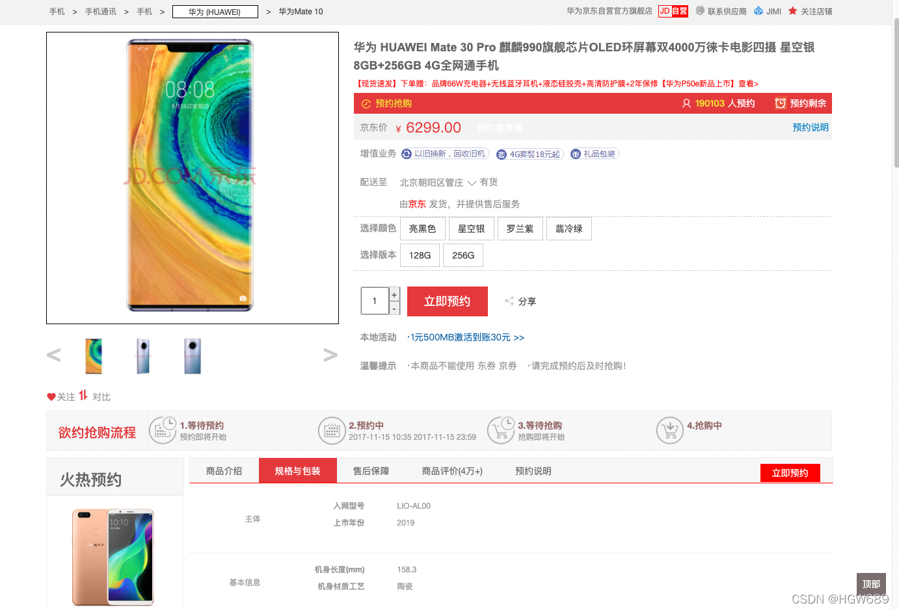


 

# 5、sku组合切换，点击**销售属性**跳转sku商品

> **需求：**通过不同的**销售属性**渲染sku商品

通过选择**销售属性**获取该销售属性对应的sku，通过算法选中该sku


## **5.1、封装Vo类**

1. 在 `com.atguigu.gulimall.product.vo` 路径下创建 AttrValueWithSkuIdVo 类

   ```java
   @Data
   public class AttrValueWithSkuIdVo {
       private String attrValue;
       private String skuIds;
   }
   ```

   

2. 修改 SkuItemSaleAttrsVo 类

   ```java
   @Data
   public class SkuItemSaleAttrsVo {
       private Long attrId;
       private String attrName;
       private List<AttrValueWithSkuIdVo> attrValues;
   }
   ```

   

## **5.2、mapper，通过sku_id获取销售属性**

修改`gulimall-product/src/main/resources/mapper/product/SkuSaleAttrValueDao.xml`

```XML
<resultMap id="skuItemSaleAttrsVo" type="com.atguigu.gulimall.product.vo.SkuItemSaleAttrsVo">
  <result property="attrId" column="attr_id"/>
  <result property="attrName" column="attr_name"/>
  <collection property="attrValues" ofType="com.atguigu.gulimall.product.vo.AttrValueWithSkuIdVo">
    <result property="attrValue" column="attr_value"/>
    <result property="skuIds" column="sku_ids"/>
  </collection>
</resultMap>
<select id="getSaleAttrsBySpuId" resultMap="skuItemSaleAttrsVo">
  SELECT
  ssav.attr_id attr_id,
  ssav.attr_name attr_name,
  ssav.attr_value attr_value,
  GROUP_CONCAT(DISTINCT info.sku_id) sku_ids
  FROM pms_sku_info info
  LEFT JOIN pms_sku_sale_attr_value ssav ON ssav.sku_id = info.sku_id
  WHERE info.spu_id = #{spuId}
  GROUP BY ssav.attr_id,ssav.attr_name,ssav.attr_value;
</select>
```


## **5.3、 前端，修改item.html文件，重新渲染销售属性**

```XML
<div class="box-attr-3">
   <div class="box-attr-2 clear" th:each="attr:${item.saleAttr}">
      <dl>
         <dt>选择[[${attr.attrName}]]</dt>
         <dd th:each="vals:${attr.attrValues}">
            <a
               th:attr="
               class=${#lists.contains(#strings.listSplit(vals.skuIds,','),item.info.skuId.toString())}?'sku_attr_value checked':'sku_attr_value',
               skus=${vals.skuIds}">
               [[${vals.attrValue}]]
            </a>
         </dd>
      </dl>
   </div>
</div>
```


```XML
<script>
   $(".sku_attr_value").click(function () {
      // 1、点击的元素添加自定义的属性。为了识别我们是刚才被点击
      var skus = new Array();
      $(this).addClass("ckicked");
      // 寻找本列属性中class属性中有 ckicked
      var curr = $(this).attr("skus").split(",");
      // 将当前被点击的所有sku组合数组放进去
      skus.push(curr);
      // 去掉同一行中所有的 checked
      $(this).parent().parent().find(".sku_attr_value").removeClass("checked");
      // 寻找其他属性中class属性有 checked
      $("a[class='sku_attr_value checked']").each(function () {
         skus.push($(this).attr("skus").split(","));
      });
      console.log(skus);

      // 2、取出他们的交集，得到skuId
      var filterEle = skus[0];
      for (var i = 1; i<skus.length; i++) {
         filterEle = $(filterEle).filter(skus[i]);
      }
      console.log(filterEle[0]);

      // 3、跳转
      location.href = "http://item.gulimall.cn/"+ filterEle[0] +".html";
   });
   $(function () {
      $(".sku_attr_value").parent().css({"border":"solid 1px #CCC"});
      $("a[class='sku_attr_value checked']").parent().css({"border":"solid 1px red"});
   })
</script>
```


 

# 6、异步编排优化

## 6.1、环境准备 

### 6.1.1、添加线程池属性类 

添加线程池属性配置类，并注入到容器中

```java
package com.atguigu.gulimall.product.config;
//跟gulimall.thread相关的配置文件绑定
//这个注解设置yml配置文件前缀，这样配置后yml数据就会自动注入到 Bean 中，不用再@Value
@ConfigurationProperties(prefix = "gulimall.thread")   
@Component
@Data
public class ThreadPoolConfigProperties {
    private Integer coreSize;
    private Integer maxSize;
    private Integer keepAliveTime;
}
```


### 6.1.2、导入依赖，spring元数据处理器

> 作用是给yml配置加提示，不导入也行。

```XML
<dependency>
    <groupId>org.springframework.boot</groupId>
    <artifactId>spring-boot-configuration-processor</artifactId>
    <optional>true</optional>
</dependency>
```


### 6.1.3、yml配置线程池

在gulimall-product服务中加入以下配置：

```bash
# 配置线程池
gulimall:
  thread:
    core-size: 20
    max-size: 200
    keep-alive-time: 10
```


> 这是上面自定义的配置，因为导入了spring-boot-configuration-processor依赖，所以编写时有提示：
>
> 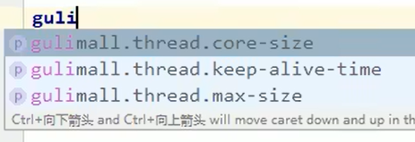


### 6.1.4、自定义线程池配置类

获取线程池的属性值这里直接调用与配置文件相对应的属性配置类

```java
package com.atguigu.gulimall.product.config;

@Configuration
public class MyThreadConfig {

    @Bean
    public ThreadPoolExecutor threadPoolExecutor(ThreadPoolConfigProperties pool) {
        return new ThreadPoolExecutor(pool.getCoreSize(),
                pool.getMaxSize(),
                pool.getKeepAliveTime(),
                TimeUnit.SECONDS,
                new LinkedBlockingDeque<>(100000),
                Executors.defaultThreadFactory(),
                new ThreadPoolExecutor.AbortPolicy());
    }
}
```


## 6.2、异步编排优化详情页查询业务

**注入线程池：** 

```java
@Autowired
ThreadPoolExecutor executor;
```


- infoFuture
  - saleAttrFuture
  - descFuture
  - baseAttrFuture （这三个异步任务需要 infoFuture 执行完得到其结果才能执行）
- imageFuture

> 用**supplyAsync**而不是runAsync ，以便于**获取线程返回结果**。

```
com.xxx.gulimall.product.service.impl.SkuInfoServiceImpl
```


```java
@Override
public SkuItemVo item(Long skuId) {
    SkuItemVo skuItemVo = new SkuItemVo();

    // 1、sku基本信息    pms_sku_info
//创建异步对象用supplyAsync而不是runAsync ，以便于获取线程返回结果。
    CompletableFuture<SkuInfoEntity> infoFuture = CompletableFuture.supplyAsync(() -> {
        SkuInfoEntity info = getById(skuId);
        skuItemVo.setInfo(info);
        return info;
    }, executor);

    // 2、获取 spu 的销售属性组合
//线程串行化用thenAcceptAsync接收第一步的结果即sku实体类，自己执行完没有返回结果
    CompletableFuture<Void> saleAttrFuture = infoFuture.thenAcceptAsync(res -> {
        List<SkuItemSaleAttrsVo> saleAttrVos = saleAttrValueService.getSaleAttrsBySpuId(res.getSpuId());
        skuItemVo.setSaleAttr(saleAttrVos);
    }, executor);

    // 3、获取 spu 的介绍 pms_spu_info_desc
//这里也需要第一步的sku实体类，所以还是第一步future的thenAcceptAsync
    CompletableFuture<Void> descFuture = infoFuture.thenAcceptAsync(res -> {
        SpuInfoDescEntity spuInfoDescEntity = spuInfoDescService.getById(res.getSpuId());
        skuItemVo.setDesp(spuInfoDescEntity);
    }, executor);

    // 4、获取 spu 的规格参数信息 pms_spu_info_desc
    CompletableFuture<Void> baseAttrFuture = infoFuture.thenAcceptAsync(res -> {
        List<SpuItemAttrGroupVo> attrGroupVos = attrGroupService.getAttrGroupWithAttrsBySpuId(res.getSpuId(), res.getCatalogId());
        skuItemVo.setGroupAttrs(attrGroupVos);
    }, executor);

    // 5、sku的图片信息   pms_sku_images
//这个任务跟前面几个任务都没关系
//这里创建异步对象用runAsync 而不是supplyAsync，因为不需要获取线程结果
    CompletableFuture<Void> imageFuture = CompletableFuture.runAsync(() -> {
        List<SkuImagesEntity> images = imagesService.getImagesBySkuId(skuId);
        skuItemVo.setImages(images);
    }, executor);


    // 等待所有任务都完成
//多任务组合,allOf等待所有任务完成。这里就不需要加infoFuture，因为依赖于它结果的saleAttrFuture等都完成了，它肯定也完成了。
    CompletableFuture.allOf(saleAttrFuture,descFuture,baseAttrFuture,imageFuture).get();

    return skuItemVo;
}
```

