>  **导航：**
>
> [谷粒商城笔记+踩坑汇总篇](https://blog.csdn.net/qq_40991313/article/details/127099139?spm=1001.2014.3001.5501)
>
>  **Java笔记汇总：**
>
> [【Java笔记+踩坑汇总】Java基础+JavaWeb+SSM+SpringBoot+SpringCloud+瑞吉外卖/谷粒商城/学成在线+设计模式+面试题汇总+性能调优/架构设计+源码解析-CSDN博客](https://blog.csdn.net/qq_40991313/article/details/126646289)

[TOC]


# 5. 用户名密码登录


## 5.1【认证模块】登录业务

### 5.1.1 模型类，接收用户名密码

```java
package site.xx.gulimall.auth.vo;
@Data
public class UserLoginVo {
    private String loginacct;    //登录账号名
    private String password;
}
```


### 5.1.2 feign客户端新增登录功能


auth/feign/MemberFeignService.java

```java
@FeignClient("gulimall-member")
public interface MemberFeignService {

    @PostMapping(value = "/member/member/register")
    R register(@RequestBody UserRegisterVo vo);


    @PostMapping(value = "/member/member/login")
    R login(@RequestBody UserLoginVo vo);

}
```


### 5.1.3 LoginController处理登录请求

auth/controller/LoginController.java

```java
    /**
     *
     * @param RedirectAttributes  放错误消息
     * @param session 将登录用户信息写入session并重定向到主页，右上角显示你好，Xxx。
     *  整合了SpringSession，扩大了session作用域到"gulimall.com"，解决了session共享问题，
     * @return 路由到的页面，不加@ResponseBody，防止返回值是字符串
     */
    @PostMapping(value = "/login")
    public String login(UserLoginVo vo, RedirectAttributes attributes, HttpSession session) {
        //远程登录
        R login = memberFeignService.login(vo);

        if (login.getCode() == 0) {
//登陆成功，将登录者信息放到session中，重定向到首页。
            MemberResponseVo data = login.getData("data", new TypeReference<MemberResponseVo>() {});
            session.setAttribute(AuthServerConstant.LOGIN_USER, data);
            return "redirect:http://gulimall.com";
        } else {
//登陆失败，将错误消息添加到attributes，重定向到登录页。
            Map<String,String> errors = new HashMap<>();
            errors.put("msg",login.getData("msg",new TypeReference<String>(){}));
            attributes.addFlashAttribute("errors",errors);
            return "redirect:http://auth.gulimall.com/login.html";
        }
    }
```


> 检测是否已登录：
>
> ```java
>     @GetMapping(value = "/login.html")
>     public String loginPage(HttpSession session) {
> 
>         //从session先取出来用户的信息，判断用户是否已经登录过了
>         Object attribute = session.getAttribute(LOGIN_USER);
>         //如果用户没登录那就跳转到登录页面
>         if (attribute == null) {
>             return "login";
>         } else {
>             return "redirect:http://gulimall.com";
>         }
> 
>     }
> ```
>
> 

**5.2【用户模块】 登录业务**


**5.2.1 模型类**

```java
package site.xx.gulimall.member.vo;
@Data
public class MemberUserLoginVo {
    private String loginacct;
    private String password;
}
```


**5.2.2** controller 

member/controller/MemberController.java

```java
    /**
     * 登录接口
     */
    @PostMapping(value = "/login")
    public R login(@RequestBody MemberUserLoginVo vo) {

        MemberEntity memberEntity = memberService.login(vo);

        if (memberEntity != null) {
            return R.ok().setData(memberEntity);
        } else {
            return R.error(BizCodeEnume.LOGINACCT_PASSWORD_EXCEPTION.getCode(),BizCodeEnume.LOGINACCT_PASSWORD_EXCEPTION.getMsg());
        }
    }
```


**5.2.3** service

MemberServiceImpl

```java
    /**
     * 本地登录
     */
    @Override
    public MemberEntity login(MemberUserLoginVo vo) {

        String loginacct = vo.getLoginacct();
        String password = vo.getPassword();

        //1、去数据库查询 SELECT * FROM ums_member WHERE username = ? OR mobile = ?
        MemberEntity memberEntity = baseMapper.selectOne(new QueryWrapper<MemberEntity>()
                .eq("username", loginacct).or().eq("mobile", loginacct));

        if (memberEntity == null) {
            //登录失败
            return null;
        } else {
            //获取到数据库里的password
            String password1 = memberEntity.getPassword();
            BCryptPasswordEncoder passwordEncoder = new BCryptPasswordEncoder();
            //进行密码匹配
            boolean matches = passwordEncoder.matches(password, password1);
            if (matches) {
                //登录成功
                return memberEntity;
            }
        }
        return null;
    }
```


# 6. 微博社交登录 (OAuth2.0)

## 6.1 OAuth2.0授权协议介绍

> OAuth1.0： OAuth（开放授权） 是一个开放标准， 允许用户授权第三方网站访问他们存储在另外的服务提供者上的信息， 而不需要将用户名和密码提供给第三方网站或分享他们数据的所有内容。

**OAuth2.0：** 对于用户相关的 开放OpenAPI（例如获取用户信息， 昵称、头像、动态同步， 照片， 日志， 分享等） ， 为了保护用户数据的安全和隐私， 第三方网站访问用户数据前都需要**显式的向用户征求授权**。

**流程**


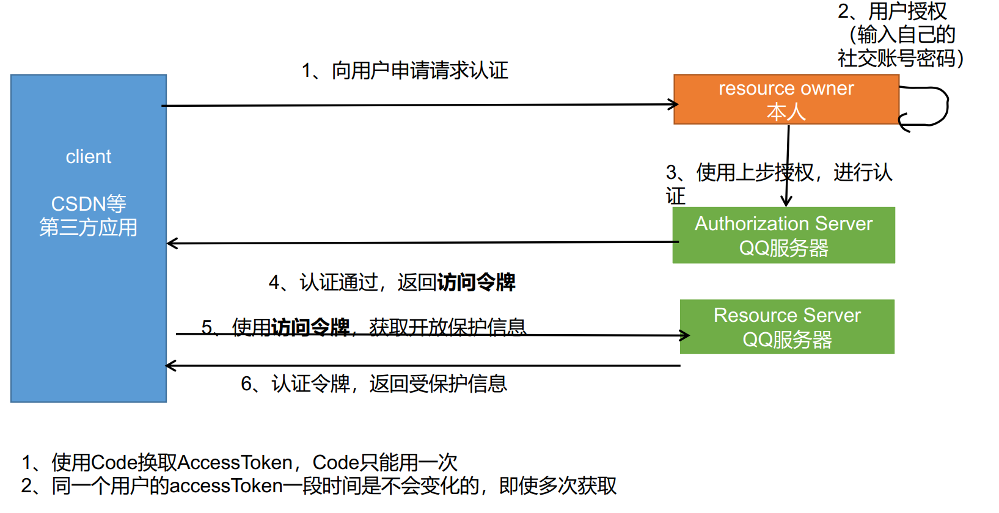


（ A） 用户打开客户端以后， 客户端要求用户给予授权。
 （ B） 用户同意给予客户端授权。
 （ C） 客户端使用上一步获得的授权， 向认证服务器申请令牌。
 （ D） 认证服务器对客户端进行认证以后， 确认无误， 同意发放令牌。
 （ E） 客户端使用令牌， 向资源服务器申请获取资源。
 （ F） 资源服务器确认令牌无误， 同意向客户端开放资源。

> **注意点:**
>
> 1. 使用Code换取AccessToken，Code只能用一次
> 2. 同一个用户的accessToken一段时间是不会变化的，即使多次获取

 
 **qq授权登录步骤：**
 1） 、 用户点击 QQ 按钮
 2） 、 引导跳转到 QQ 授权页
 3） 、 用户主动点击授权， 跳回之前网页。

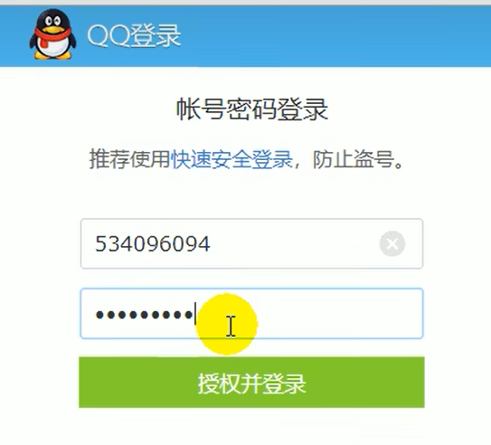


## 6.2 微博社交登录标准流程

1.访问 https://open.weibo.com

2.微连接-网站接入-立即接入

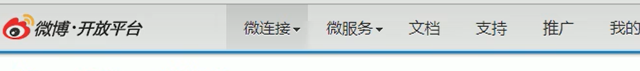

3.创建新应用

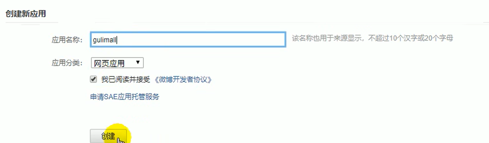

4.填写应用信息

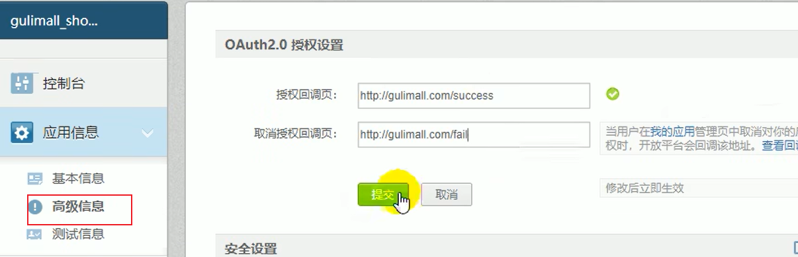

> ​     授权回调页：http://auth.gulimall.com/oauth2.0/weibo/success
> ​     取消授权回调页：http://gulimall.com/fall 


 5.查看文档：https://open.weibo.com/wiki/授权机制说明

6.前端修改a标签跳转地址，使其跳转到微博授权页面。如果用户同意授权，页面跳转至 YOUR_REGISTERED_REDIRECT_URI/?code=CODE，**CODE码在路径尾部。**

```bash
https://api.weibo.com/oauth2/authorize?client_id=YOUR_CLIENT_ID&response_type=code&redirect_uri=YOUR_REGISTERED_REDIRECT_URI
```


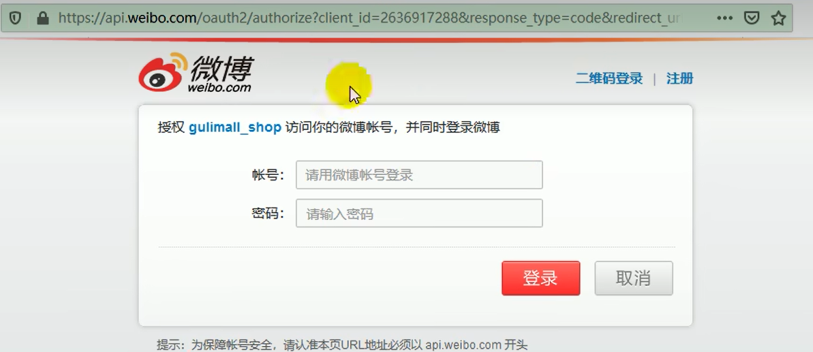

7.通过CODE等信息发请求**换取Access Token**

```bash
https://api.weibo.com/oauth2/access_token?client_id=YOUR_CLIENT_ID&client_secret=YOUR_CLIENT_SECRET&grant_type=authorization_code&redirect_uri=YOUR_REGISTERED_REDIRECT_URI&code=CODE
```


其中client_id=YOUR_CLIENT_ID&client_secret=YOUR_CLIENT_SECRET可以使用basic方式加入header中，返回值

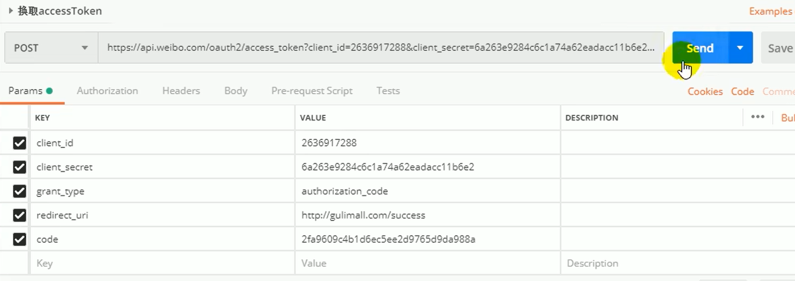

**8.Access Token和uid在响应里，代表登陆成功：** 

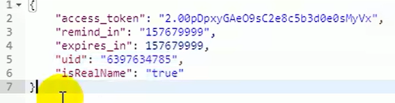

9.微博开放的权限： 


获取用户信息： 

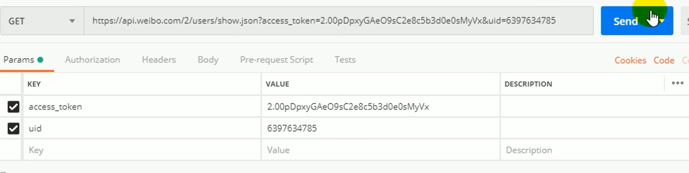

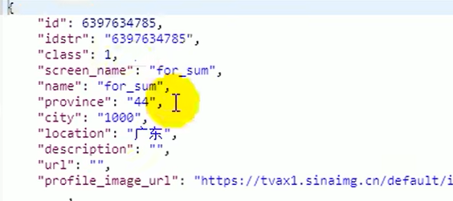


## 6.3 业务实现 

**逻辑:**

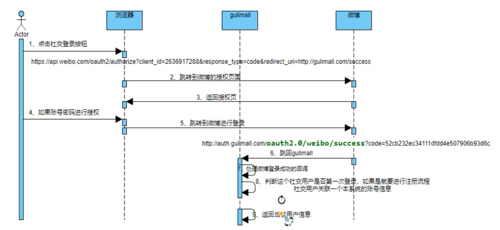

## 6.4 修改授权回调页

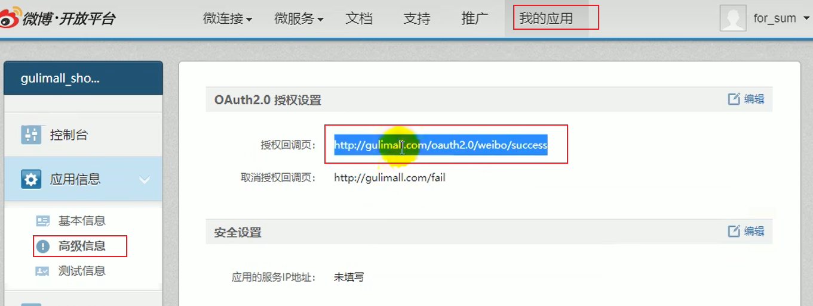

修改前端跳转授权页的url

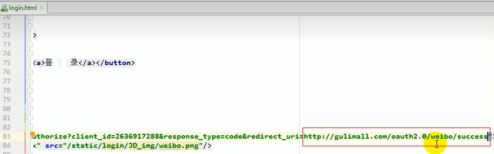

## 6.5 抽取社交用户信息模型类

```java
package com.xunqi.gulimall.auth.vo;
/**
 * @Description: 社交用户信息
 **/

@Data
public class SocialUser {

    private String access_token;

    private String remind_in;

    private long expires_in;

    private String uid;

    private String isRealName;

}
```


## 6.6【会员模块】通过社交实体类登录业务

### 6.6.1 **数据库表“ums_member”添加字段**

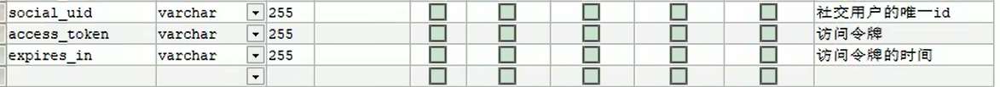

> expires_in是token过期时间 

### 6.6.2 **MemberEntity添加字段**

```java
	/**
	 * 社交登录UID
	 */
	private String socialUid;

	/**
	 * 社交登录TOKEN
	 */
	private String accessToken;

	/**
	 * 社交登录过期时间
	 */
	private long expiresIn;
```


### 6.6.3 **controller**

```
package com.xx.gulimall.member.controller;
```


```java
    @PostMapping(value = "/oauth2/login")
    public R oauthLogin(@RequestBody SocialUser socialUser) throws Exception {

        MemberEntity memberEntity = memberService.login(socialUser);

        if (memberEntity != null) {
            return R.ok().setData(memberEntity);
        } else {
            return R.error(BizCodeEnum.LOGINACCT_PASSWORD_EXCEPTION.getCode(),BizCodeEnum.LOGINACCT_PASSWORD_EXCEPTION.getMessage());
        }
    }
```


### 6.6.4 **service，传入社交用户uid、token等信息，返回会员实体类**

> 1. 如果注册过，就更新令牌、令牌过期时间
> 2. 如果第一次登录，就通过社交账号的昵称、头像等信息新创建用户存入member数据库。

```java
    @Override
    public MemberEntity login(SocialUser socialUser) throws Exception {

        //具有登录和注册逻辑
        String uid = socialUser.getUid();

        //1、判断当前社交用户是否已经登录过系统
        MemberEntity memberEntity = this.baseMapper.selectOne(new QueryWrapper<MemberEntity>().eq("social_uid", uid));

        if (memberEntity != null) {
            //这个用户已经注册过
            //更新用户的访问令牌的时间和access_token
            MemberEntity update = new MemberEntity();
            update.setId(memberEntity.getId());
            update.setAccessToken(socialUser.getAccess_token());
            update.setExpiresIn(socialUser.getExpires_in());
            this.baseMapper.updateById(update);

            memberEntity.setAccessToken(socialUser.getAccess_token());
            memberEntity.setExpiresIn(socialUser.getExpires_in());
            return memberEntity;
        } else {
            //2、没有查到当前社交用户对应的记录我们就需要注册一个
            MemberEntity register = new MemberEntity();
            //3、查询当前社交用户的社交账号信息（昵称、性别等）
            Map<String,String> query = new HashMap<>();
            query.put("access_token",socialUser.getAccess_token());
            query.put("uid",socialUser.getUid());
            HttpResponse response = HttpUtils.doGet("https://api.weibo.com", "/2/users/show.json", "get", new HashMap<String, String>(), query);

            if (response.getStatusLine().getStatusCode() == 200) {
                //查询成功
                String json = EntityUtils.toString(response.getEntity());
                JSONObject jsonObject = JSON.parseObject(json);
                String name = jsonObject.getString("name");
                String gender = jsonObject.getString("gender");
                String profileImageUrl = jsonObject.getString("profile_image_url");

                register.setNickname(name);
                register.setGender("m".equals(gender)?1:0);
                register.setHeader(profileImageUrl);
                register.setCreateTime(new Date());
                register.setSocialUid(socialUser.getUid());
                register.setAccessToken(socialUser.getAccess_token());
                register.setExpiresIn(socialUser.getExpires_in());

                //把用户信息插入到数据库中
                this.baseMapper.insert(register);

            }
            return register;
        }

    }
```


## 6.7【认证模块】远程调用会员模块社交登录

认证模块

```java
package com.xx.gulimall.auth.feign;
@FeignClient("gulimall-member")
public interface MemberFeignService {

    @PostMapping(value = "/member/member/register")
    R register(@RequestBody UserRegisterVo vo);


    @PostMapping(value = "/member/member/login")
    R login(@RequestBody UserLoginVo vo);

    @PostMapping(value = "/member/member/oauth2/login")
    R oauthLogin(@RequestBody SocialUser socialUser) throws Exception;

    @PostMapping(value = "/member/member/weixin/login")
    R weixinLogin(@RequestParam("accessTokenInfo") String accessTokenInfo);
}
```


## 6.8【认证模块】社交登录实现，处理社交登录授权后的请求

认证模块

```java
@Slf4j
@Controller
public class OAuth2Controller {

    @Autowired
    private MemberFeignService memberFeignService;

    /**
     *
     * @param code    授权页授权后获取的code码
     * @param session 将登录用户信息写入session并重定向到主页，右上角显示你好，Xxx。
     *  整合了SpringSession，扩大了session作用域到"gulimall.com"，解决了session共享问题，
     * @return
     * @throws Exception
     */
    @GetMapping(value = "/oauth2.0/weibo/success")
    public String weibo(@RequestParam("code") String code, HttpSession session) throws Exception {

        //原作者信息：2077705774、40af02bd1c7e435ba6a6e9cd3bf799fd,同时修改login.html中的client_id。
        Map<String, String> map = new HashMap<>();
        map.put("client_id","588997645");
        map.put("client_secret","5d7746d10c4d926ed38692c8d17b7e31");
        map.put("grant_type","authorization_code");
        map.put("redirect_uri","http://auth.gulimall.com/oauth2.0/weibo/success");
        map.put("code",code);

        //1、根据用户授权返回的code换取access_token
        HttpResponse response = HttpUtils.doPost("https://api.weibo.com", "/oauth2/access_token", "post", new HashMap<>(), map, new HashMap<>());

        //2、处理
        if (response.getStatusLine().getStatusCode() == 200) {
            //获取到了access_token,转为通用社交登录对象
            String json = EntityUtils.toString(response.getEntity());
            //String json = JSON.toJSONString(response.getEntity());
            SocialUser socialUser = JSON.parseObject(json, SocialUser.class);

            //知道了哪个社交用户
            //1）、memberFeignService.oauthLogin当前用户如果是第一次进网站，自动注册进来（为当前社交用户生成一个会员信息，以后这个社交账号就对应指定的会员）
            //登录或者注册这个社交用户
            System.out.println(socialUser.getAccess_token());
            //调用远程服务
            R oauthLogin = memberFeignService.oauthLogin(socialUser);
            if (oauthLogin.getCode() == 0) {
                MemberResponseVo data = oauthLogin.getData("data", new TypeReference<MemberResponseVo>() {});
                log.info("登录成功：用户信息：{}",data.toString());

                //1、第一次使用session，命令浏览器保存卡号，JSESSIONID这个cookie
                //以后浏览器访问哪个网站就会带上这个网站的cookie
                //TODO 1、默认发的令牌。当前域（解决子域session共享问题）
                //TODO 2、使用JSON的序列化方式来序列化对象到Redis中
                session.setAttribute(LOGIN_USER,data);
                
                //2、登录成功跳回首页
                return "redirect:http://gulimall.com";
            } else {
                
                return "redirect:http://auth.gulimall.com/login.html";
            }

        } else {
            return "redirect:http://auth.gulimall.com/login.html";
        }

    }

}
```


> HttpUtils之前已经导入过：
>
> ```java
>             /**
>              * 重要提示如下:
>              * HttpUtils请从
>              * https://github.com/aliyun/api-gateway-demo-sign-java/blob/master/src/main/java/com/aliyun/api/gateway/demo/util/HttpUtils.java
>              * 或者直接下载：
>              * http://code.fegine.com/HttpUtils.zip
>              * 下载
>              *
>              * 相应的依赖请参照
>              * https://github.com/aliyun/api-gateway-demo-sign-java/blob/master/pom.xml
>              * 相关jar包（非pom）直接下载：
>              * http://code.fegine.com/aliyun-jar.zip
>              */
> ```
>
> 


# 7.Session共享问题

## 7.1 session原理

session也是一种记录浏览器状态的机制，但与cookie不同的是，**session是保存在服务器中**。

由于http是无状态协议，当**服务器存储了多个用户的session数据时**，如何确认http请求对应服务器上哪一条session，相当关键。这也是session原理的核心内容。

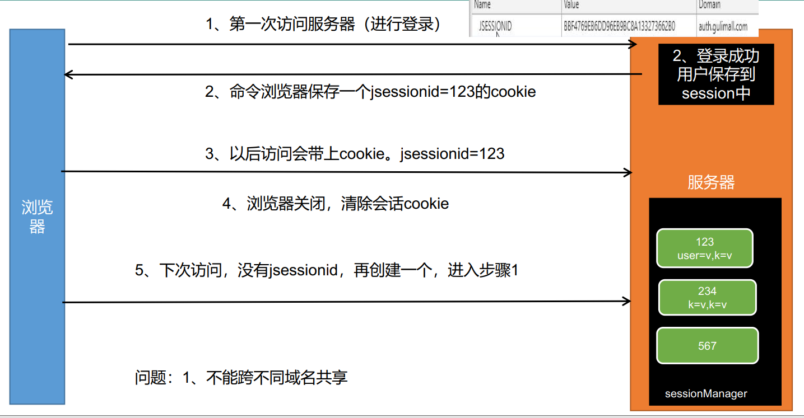

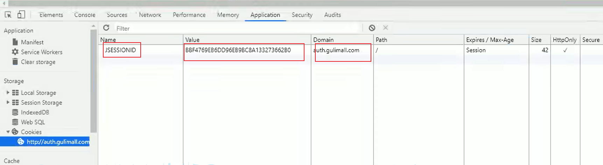


## 7.2 分布式下session共享问题

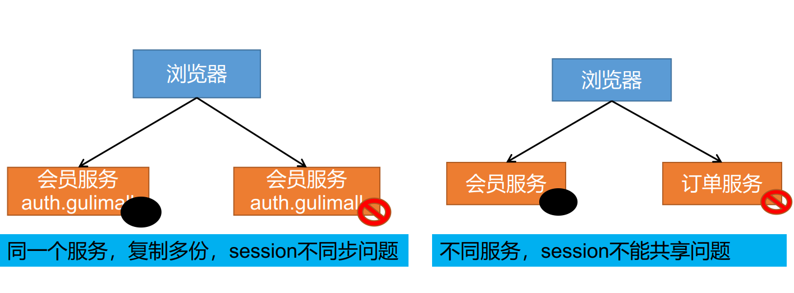

**分布式场景下相同服务不同机器，session共享问题**

根据session原理可知,session信息是保存在**服务器内存**的,虽然是相同服务但是在**不同服务器**,也不能做到session共享

**分布式场景下不同服务session共享问题**

因为获取session对象，是根据cookie中JSESSIONID来作为key获取session的，**不同会话session ID不同**，获取的**session对象就会不同**


## 7.3 Session共享问题的几种解决方案 

### 7.3.1 Session复制（同步），不推荐 


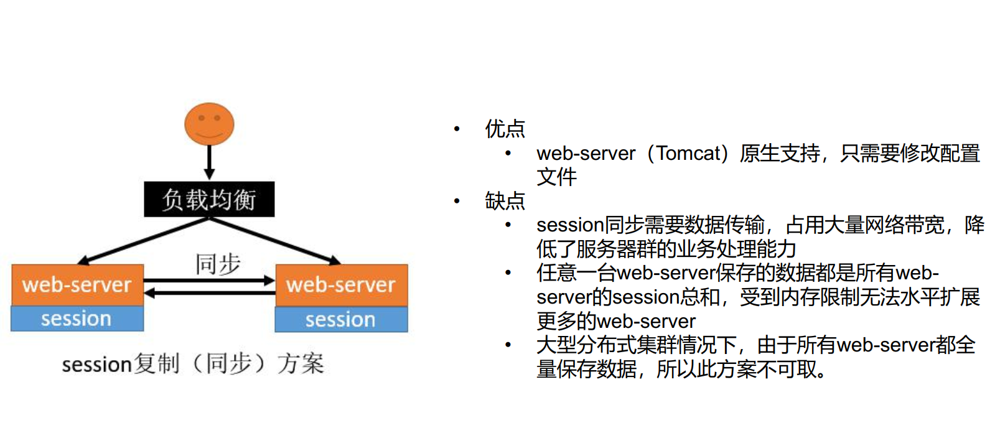

**优点**

- web-server（Tomcat）原生支持，只需要**修改配置文件**

**缺点**

- session同步需要数据传输，**占用大量网络带宽**，降低了服务器群的业务处理能力
- 任意一台web-server保存的数据都是所有webserver的session总和，受到**内存限制**无法水平扩展更多的web-server
- 大型分布式集群情况下，由于**所有web-server都全量保存数据**，所以此方案不可取。
- 个人总结:使用方便,但是每台服务器都需要保存全量session数据,占用网络带宽(适合**小型分布式)**


### 7.3.2 客户端存储，不推荐 

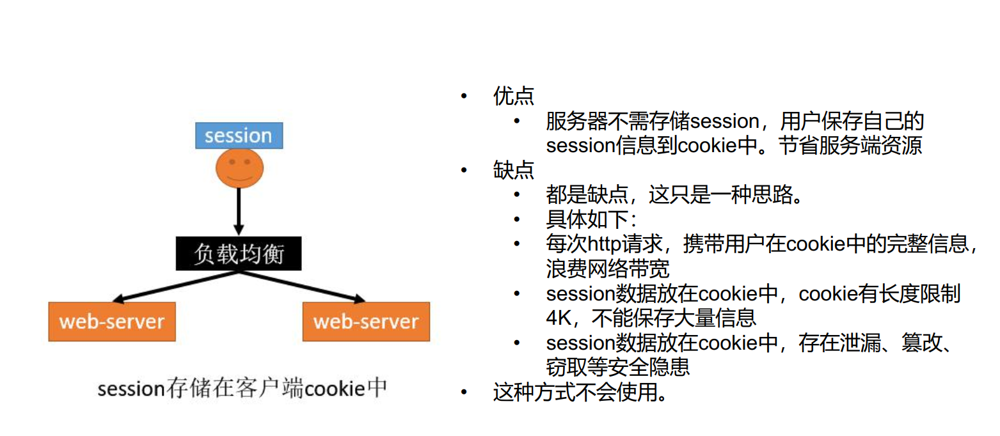

优点

- 服务器不需存储session，用户**保存自己的session信息到cookie中**。节省服务端资源

缺点

- **都是缺点，这只是一种思路**。

  具体如下：

  - 每次http请求，携带用户在cookie中的完整信息，**浪费网络带宽**
  - session数据放在cookie中，cookie有长度限制4K，**不能保存大量信息**
  - session数据放在cookie中，存在泄漏、篡改、窃取等**安全隐患**

这种方式不会使用


### 7.3.3 hash一致性（某一用户永远都访问的是同一台服务器） 

> 方式一:利用**用户ip地址**来做负载均衡,使某一用户永远都访问的是同一台服务器
>
> 方式二:利用**用户id**来做负载均衡,使某一用户永远都访问的是同一台服务器

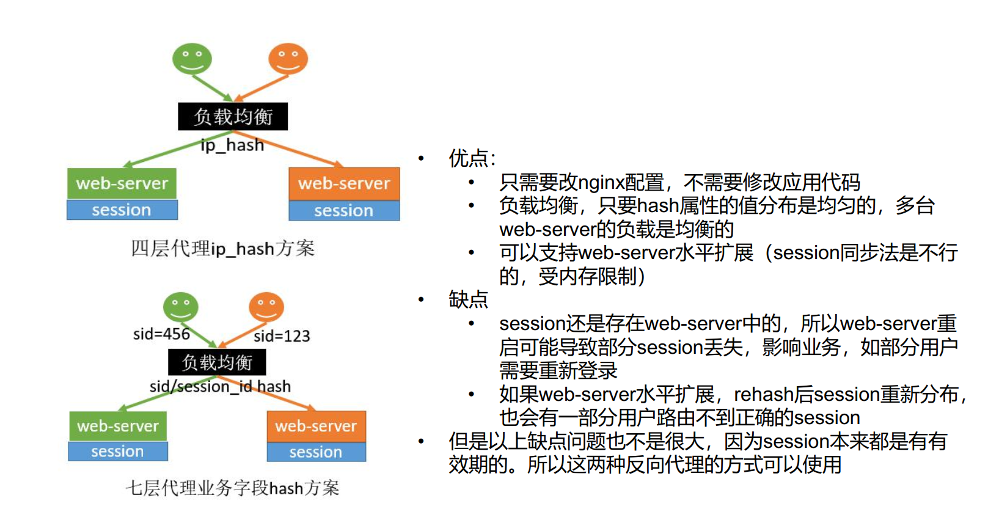

- 优点：
  - 只需要**改nginx配置**，不需要修改应用代码
  - 负载均衡，只要**hash属性的值分布是均匀的**，多台web-server的负载是均衡的
  - 可以支持web-server水平扩展（session同步法是不行的，受内存限制）
- 缺点
  - session还是存在web-server中的，所以**web-server重启可能导致部分session丢失**，影响业务，如部分用户需要重新登录
  - 如果web-server水平扩展，**rehash后session重新分布**，也会有一部分用户路由不到正确的session
- 但是以上缺点问题也不是很大，因为session本来都是有有效期的。所以这两种反向代理的方式可以使用


### 7.3.4 **redis**统一存储 

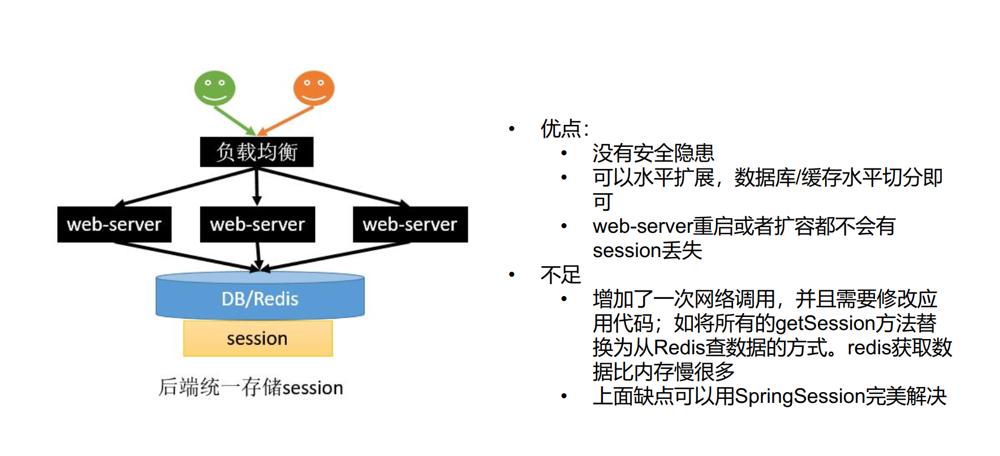

- 优点：
  - **没有安全隐患**
  - 可以水平扩展，数据库/缓存水平切分即可
  - web-server重启或者扩容都**不会有session丢失**
- 不足
  - 增加了一次网络调用，并且需要修改应用代码；如将所有的getSession方法替换为从Redis查数据的方式。**redis获取数据比内存慢很多**
  - **上面缺点可以用SpringSession完美解决**


### 7.3.5 **提升作用域到父域名**，子域session共享（推荐，使用） 

在存入session时jsessionid的**作用域提升至最大**.比如auth.gulimall.com->.gulimall.com,那么gulimall.com及其下面的所有子域名都可以拿到这个jsessionid,然后再去redis中查询对应的session信息,可以实现**不同服务之间的session共享**

相同服务之间的session共享使用,session存入redis即可解决问题,相同服务的域名是相同的jsessionid也是相同的

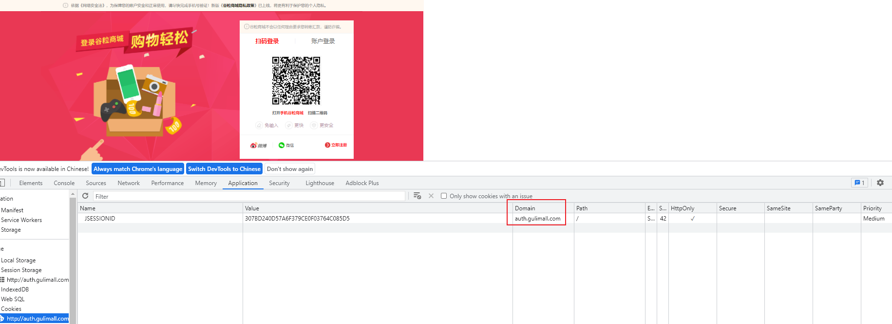

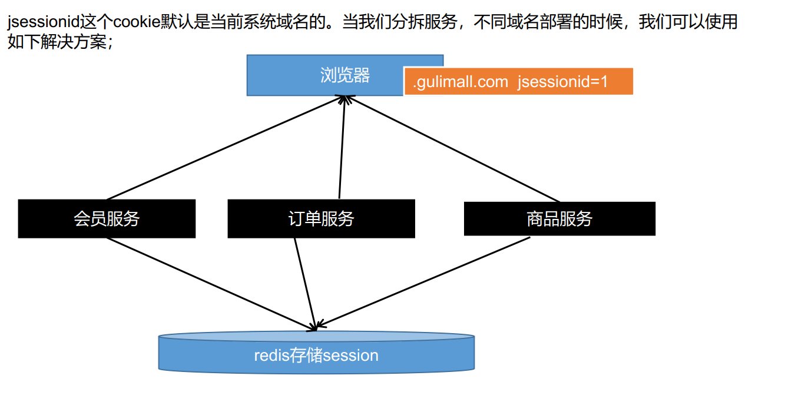


## 7.4 SpringSession解决session共享问题 

文档：

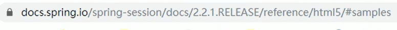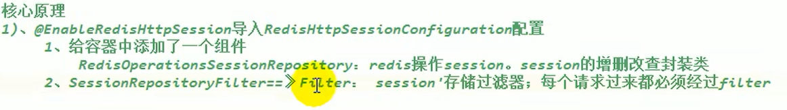 

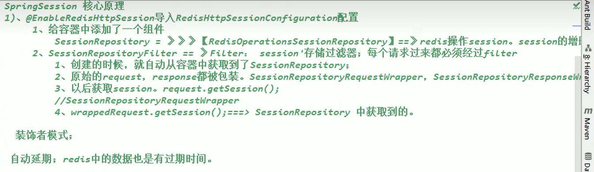


### 7.4.1 导入所需依赖 

```XML
		<dependency>
			<groupId>org.springframework.session</groupId>
			<artifactId>spring-session-data-redis</artifactId>
		</dependency>

		<dependency>
			<groupId>org.springframework.boot</groupId>
			<artifactId>spring-boot-starter-data-redis</artifactId>
		</dependency>
```


### 7.4.2 yml配置session存储方式和过期时间 

```bash
spring:
  redis:
    host: 192.168.157.128
    port: 6379
    #使用redis存储session
  session:
    store-type: redis
    
server:
  port: 20000
  servlet:
  #配置session过期时间
    session:
      timeout: 30m
```


### 7.4.3 启动类注解开启springsession 

将该注解配置在认证模块主启动类GulimallAuthServerApplication 上或者配置类上

```java
@EnableRedisHttpSession  //整合Redis作为session存储
```


>  **序列化异常报错**
>
> 启动后，执行登录操作进行测试发现序列化异常：
>
> 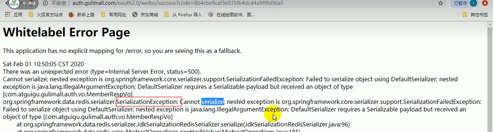
>
> **解决：给响应模型类实现序列化接口，并把它移到common模块，以便于商品模块也能获取到：**
>
> 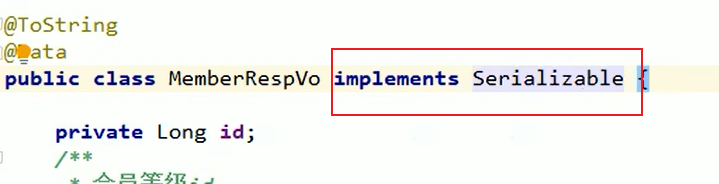
>
> 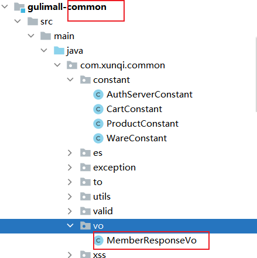


### 7.4.4 配置类设置session使用json序列化,并放大作用域(自定义) 

> **session默认使用jdk进行序列化**,不方便阅读,建议**修改为json**
>
> 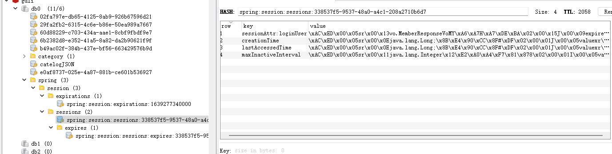

```java
package site.xx.gulimall.auth.config;
@Configuration
public class GulimallSessionConfig {
    @Bean
    public CookieSerializer cookieSerializer() {
        DefaultCookieSerializer cookieSerializer = new DefaultCookieSerializer();
        //放大作用域到父域名
        cookieSerializer.setDomainName("gulimall.com");
        cookieSerializer.setCookieName("GULISESSION");
        cookieSerializer.setCookieMaxAge(60*60*24*7);
        return cookieSerializer;
    }

    @Bean
    public RedisSerializer<Object> springSessionDefaultRedisSerializer() {
        return new GenericJackson2JsonRedisSerializer();
    }
}
```


### 7.4.5 启动测试 

修改前端，获取session内的值

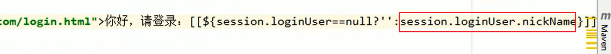


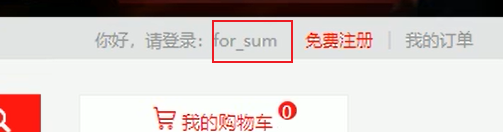


**清空Redis和session后重新启动测试、执行登录操作：** 

首页可以拿到jsession，名称为配置类配置的名称：

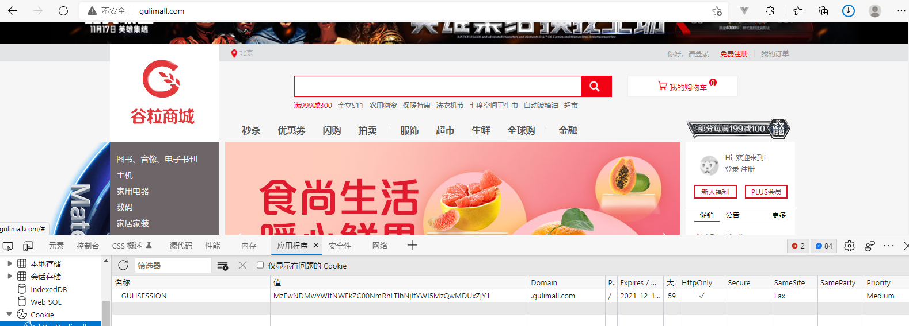

Redis里session序列化方式现在是json，可读性强

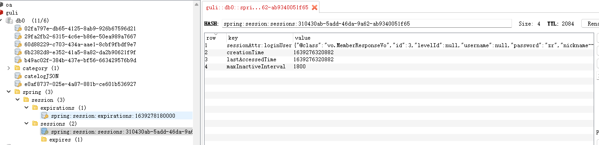


### 7.4.6 用户名密码登录成功时也存储session 

> 此时我们手动输入http://auth.gulimall.com/login.html仍然可以进入到登录页面再次进行登录,就需要在进入登录页面时进行判断,用户是否登录,如果已经用户登录直接重定向到首页,用户未登录才允许用户登录

**用户的登录页面之前设置了视图映射这个必须要注释起来,视图映射是没有任何逻辑的,只要是这个请求就会跳到指定的视图(html),但是我们现在的登录页面是有逻辑判断的,需要在controller中新增**


auth/controller/LoginController.java

```java
    /**
     * 判断session是否有loginUser，没有就跳转登录页面，有就跳转首页
     */
    @GetMapping(value = "/login.html")
    public String loginPage(HttpSession session) {
        //从session先取出来用户的信息，判断用户是否已经登录过了
        Object attribute = session.getAttribute(AuthServerConstant.LOGIN_USER);
        //如果用户没登录那就跳转到登录页面
        if (attribute == null) {
            return "login";
        } else {
            return "redirect:http://gulimall.com";
        }
    }
```


> 在登录成功后手动输入http://auth.gulimall.com/login.html,自动回重定向至首页,清除session后,进入登录页面


### 7.4.7 检索模块获取session，跟上面步骤基本一样 

哪个模块需要共享session就在哪个模块整合spring session。

导入依赖：

```XML
        <dependency>
            <groupId>org.springframework.boot</groupId>
            <artifactId>spring-boot-starter-data-redis</artifactId>
        </dependency>

        <!-- 整合springsession -->
        <dependency>
            <groupId>org.springframework.session</groupId>
            <artifactId>spring-session-data-redis</artifactId>
        </dependency>
```


yml配置redis地址、session存储方式和过期时间

```bash
spring:
  redis:
    host: 192.168.157.128
    port: 6379
    #使用redis存储session
  session:
    store-type: redis
    
server:
  port: 20000
  servlet:
  #配置session过期时间
    session:
      timeout: 30m
```


启动类注解开启springsession

```java
@EnableRedisHttpSession  //整合Redis作为session存储
```


前端获取session：


测试成功 

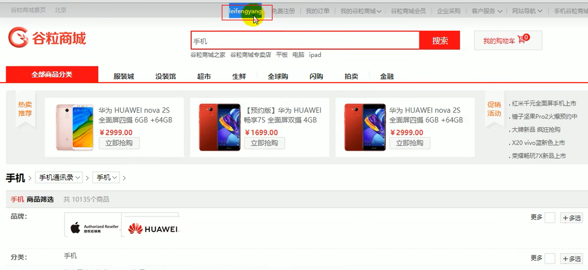


# 8. xxl-sso分布式单点登录框架 

## 8.1 介绍

### 8.1.1 多系统-单点登录SSO

> **上文**社交登录、SpringSession+扩大子域 只是**单系统分布式集群**的登录
>
> 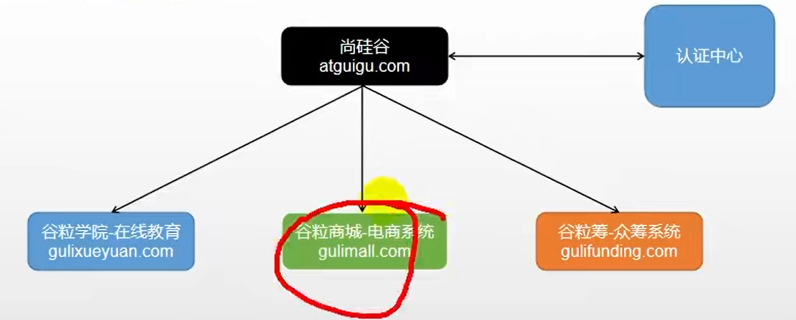

单点登录(SingleSignOn，SSO)，就是通过用户的一次性鉴别登录。当用户在[身份认证服务器](https://baike.baidu.com/item/身份认证服务器/10881881?fromModule=lemma_inlink)上登录一次以后，即可获得访问单点登录系统中其他关联系统和应用软件的权限，同时这种实现是不需要管理员对用户的登录状态或其他信息进行修改的，这意味着在多个应用系统中，用户只需一次登录就可以访问所有相互信任的应用系统。这种方式减少了由登录产生的时间消耗，辅助了用户管理，是比较流行的。 

**多系统-单点登录**

 1、**一处登录处处登录**

 2、一处退出处处退出

>  例如登录微博，访问新浪视频、新浪体育页面，发现也已经登陆成功了。而两者域名是不同的：
>
> 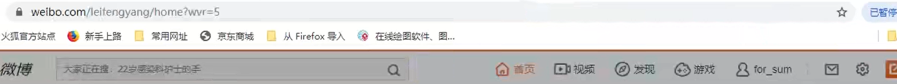
>
> 
>
> 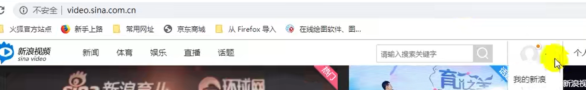

### 8.1.2 xxl-sso分布式单点登录框架介绍

框架效果演示地址：https://gitee.com/xuxueli0323/xxl-sso

最重要的：中央认证服务器
 **核心:三个系统即使域名不一样，想办法给三个系统同步同一个用户的票据;**
 1)、中央认证服务器;ssoserver.com
 2）、其他系统，想要登录去ssoserver.com登录，登录成功跳转回来
 3）、只要有一个登录，其他都不用登录
 4)、全系统统——个sso-sessionid;


## 8.2 流程图


## 8.3 单点登录服务端gulimall-test-sso-server

### 8.3.1 创建步骤

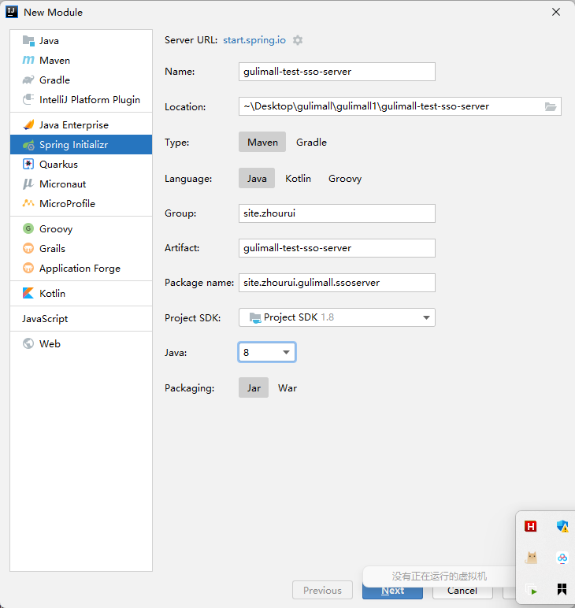

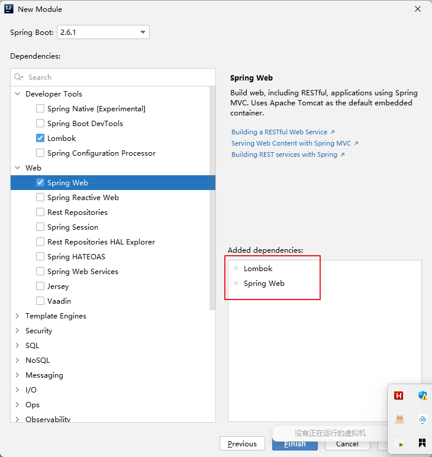

### 8.3.2 pom文件(包含thymeleaf,redis)

```XML
<?xml version="1.0" encoding="UTF-8"?>
<project xmlns="http://maven.apache.org/POM/4.0.0" xmlns:xsi="http://www.w3.org/2001/XMLSchema-instance"
         xsi:schemaLocation="http://maven.apache.org/POM/4.0.0 https://maven.apache.org/xsd/maven-4.0.0.xsd">
    <modelVersion>4.0.0</modelVersion>
    <parent>
        <groupId>org.springframework.boot</groupId>
        <artifactId>spring-boot-starter-parent</artifactId>
        <version>2.3.2.RELEASE</version>
        <relativePath/> <!-- lookup parent from repository -->
    </parent>
    <groupId>site.zhourui</groupId>
    <artifactId>gulimall-test-sso-server</artifactId>
    <version>0.0.1-SNAPSHOT</version>
    <name>gulimall-test-sso-server</name>
    <description>单点登录的中央认证服务器</description>
    <properties>
        <java.version>1.8</java.version>
    </properties>
    <dependencies>
        <dependency>
            <groupId>org.springframework.boot</groupId>
            <artifactId>spring-boot-starter-web</artifactId>
        </dependency>

        <dependency>
            <groupId>org.projectlombok</groupId>
            <artifactId>lombok</artifactId>
            <optional>true</optional>
        </dependency>
        <dependency>
            <groupId>org.springframework.boot</groupId>
            <artifactId>spring-boot-starter-test</artifactId>
            <scope>test</scope>
        </dependency>

        <dependency>
            <groupId>org.springframework.boot</groupId>
            <artifactId>spring-boot-starter-thymeleaf</artifactId>
        </dependency>

        <dependency>
            <groupId>org.springframework.boot</groupId>
            <artifactId>spring-boot-starter-data-redis</artifactId>
        </dependency>
    </dependencies>

    <build>
        <plugins>
            <plugin>
                <groupId>org.springframework.boot</groupId>
                <artifactId>spring-boot-maven-plugin</artifactId>
                <configuration>
                    <excludes>
                        <exclude>
                            <groupId>org.projectlombok</groupId>
                            <artifactId>lombok</artifactId>
                        </exclude>
                    </excludes>
                </configuration>
            </plugin>
        </plugins>
    </build>

</project>
```


### 8.3.3 配置application

```
server.port=8080
#虚拟机地址,默认端口6379,不用配置
spring.redis.host=192.168.157.128
```


### 8.3.4 新增LoginController

> gulimall-test-sso-server/src/main/java/site/zhourui/gulimall/ssoserver/controller/LoginController.java

```java
package site.xx.gulimall.ssoserver.controller;
@Controller
public class LoginController {

    @Autowired
    StringRedisTemplate redisTemplate;

    @ResponseBody
    @GetMapping("/userinfo")
    public String userinfo(@RequestParam(value = "token") String token) {
        String s = redisTemplate.opsForValue().get(token);

        return s;

    }


    @GetMapping("/login.html")
    public String loginPage(@RequestParam(value = "redirect_url",required = false) String url, Model model, @CookieValue(value = "sso_token", required = false) String sso_token) {
        if (!StringUtils.isEmpty(sso_token)) {
            return "redirect:" + url + "?token=" + sso_token;
        }
        model.addAttribute("url", url);

        return "login";
    }

    @PostMapping(value = "/doLogin")
    public String doLogin(@RequestParam("username") String username,
                          @RequestParam("password") String password,
                          @RequestParam("redirect_url") String url,
                          HttpServletResponse response) {

        //登录成功跳转，跳回到登录页
        if (!StringUtils.isEmpty(username) && !StringUtils.isEmpty(password)) {

            String uuid = UUID.randomUUID().toString().replace("_", "");
            redisTemplate.opsForValue().set(uuid, username);
            Cookie sso_token = new Cookie("sso_token", uuid);

            response.addCookie(sso_token);
            return "redirect:" + url + "?token=" + uuid;
        }
        return "login";
    }

}
```


### 8.3.5 新增模板login.html

> gulimall-test-sso-server/src/main/resources/templates/login.html

```html
<!DOCTYPE html>
<html lang="en">
<head>
    <meta charset="UTF-8">
    <title>登录页</title>
</head>
<body>
<form action="/doLogin" method="post">
    用户名：<input type="text" name="username" /><br />
    密码：<input type="password" name="password" /><br />
    <input type="hidden" name="redirect_url" th:value="${url}" />
    <input type="submit" value="登录">
</form>
</body>
</html>
```


## 8.4 单点登录客户端(clien1)

### 8.4.1 创建步骤


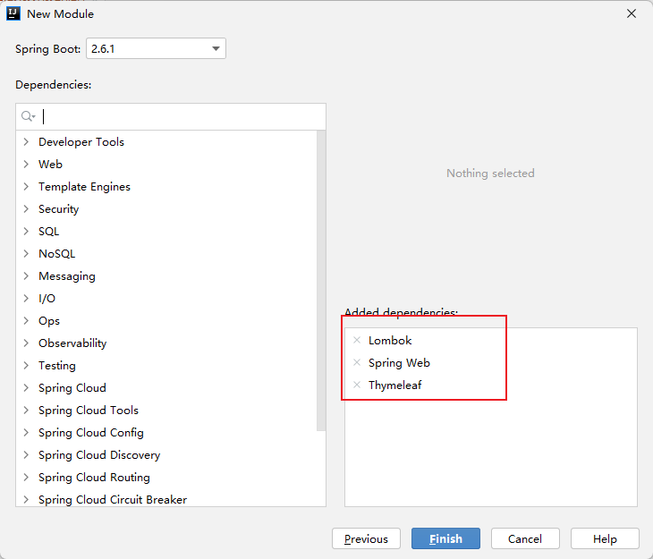

### 8.4.2 pom文件

> client1pom文件

```XML
<?xml version="1.0" encoding="UTF-8"?>
<project xmlns="http://maven.apache.org/POM/4.0.0" xmlns:xsi="http://www.w3.org/2001/XMLSchema-instance"
         xsi:schemaLocation="http://maven.apache.org/POM/4.0.0 https://maven.apache.org/xsd/maven-4.0.0.xsd">
    <modelVersion>4.0.0</modelVersion>
    <parent>
        <groupId>org.springframework.boot</groupId>
        <artifactId>spring-boot-starter-parent</artifactId>
        <version>2.3.2.RELEASE</version>
        <relativePath/> <!-- lookup parent from repository -->
    </parent>
    <groupId>site.zhourui</groupId>
    <artifactId>gulimall-test-sso-client</artifactId>
    <version>0.0.1-SNAPSHOT</version>
    <name>gulimall-test-sso-client</name>
    <description>客户端-测试sso</description>
    <properties>
        <java.version>1.8</java.version>
    </properties>
    <dependencies>
        <dependency>
            <groupId>org.springframework.boot</groupId>
            <artifactId>spring-boot-starter-thymeleaf</artifactId>
        </dependency>
        <dependency>
            <groupId>org.springframework.boot</groupId>
            <artifactId>spring-boot-starter-web</artifactId>
        </dependency>

        <dependency>
            <groupId>org.projectlombok</groupId>
            <artifactId>lombok</artifactId>
            <optional>true</optional>
        </dependency>
        <dependency>
            <groupId>org.springframework.boot</groupId>
            <artifactId>spring-boot-starter-test</artifactId>
            <scope>test</scope>
        </dependency>
    </dependencies>

    <build>
        <plugins>
            <plugin>
                <groupId>org.springframework.boot</groupId>
                <artifactId>spring-boot-maven-plugin</artifactId>
                <configuration>
                    <excludes>
                        <exclude>
                            <groupId>org.projectlombok</groupId>
                            <artifactId>lombok</artifactId>
                        </exclude>
                    </excludes>
                </configuration>
            </plugin>
        </plugins>
    </build>

</project>
```


### 8.4.3 新增application配置

```bash
server.port=8081

spring.redis.host=192.168.157.128
```


### 8.4.4 新增HelloController


```java
package site.xx.gulimall.ssoclient.controller;
/**
 * 测试单点登录
 */
@Controller
public class HelloController {


    /**
     * 无需登录就可访问
     *
     * @return
     */
    @ResponseBody
    @GetMapping(value = "/hello")
    public String hello() {
        return "hello";
    }


    @GetMapping(value = "/employees")
    public String employees(Model model, HttpSession session, @RequestParam(value = "token", required = false) String token) {

        if (!StringUtils.isEmpty(token)) {
            RestTemplate restTemplate=new RestTemplate();
            ResponseEntity<String> forEntity = restTemplate.getForEntity("http://ssoserver.com:8080/userinfo?token=" + token, String.class);
            String body = forEntity.getBody();

            session.setAttribute("loginUser", body);
        }
        Object loginUser = session.getAttribute("loginUser");

        if (loginUser == null) {

            return "redirect:" + "http://ssoserver.com:8080/login.html"+"?redirect_url=http://client1.com:8081/employees";
        } else {


            List<String> emps = new ArrayList<>();

            emps.add("张三");
            emps.add("李四");

            model.addAttribute("emps", emps);
            return "employees";
        }
    }

}
```


### 8.4.5 新增模板employees.html

> gulimall-test-sso-client/src/main/resources/templates/employees.html

```html
<!DOCTYPE html>
<html lang="en" xmlns:th="http://www.thymeleaf.org">
<head>
    <meta charset="UTF-8">
    <title>员工列表</title>
</head>
<body>
<h1>欢迎：[[${session.loginUser}]]</h1>
<ul>
    <li th:each="emp:${emps}">姓名：[[${emp}]]</li>
</ul>
</body>
</html>
```


> gulimall-test-sso-client2/src/main/resources/templates/employees.html

```html
<!DOCTYPE html>
<html lang="en" xmlns:th="http://www.thymeleaf.org">
<head>
    <meta charset="UTF-8">
    <title>员工列表</title>
</head>
<body>
<h1>欢迎：[[${session.loginUser}]]</h1>
<ul>
    <li th:each="emp:${emps}">姓名：[[${emp}]]</li>
</ul>
</body>
</html>
```


## 8.5 配置host


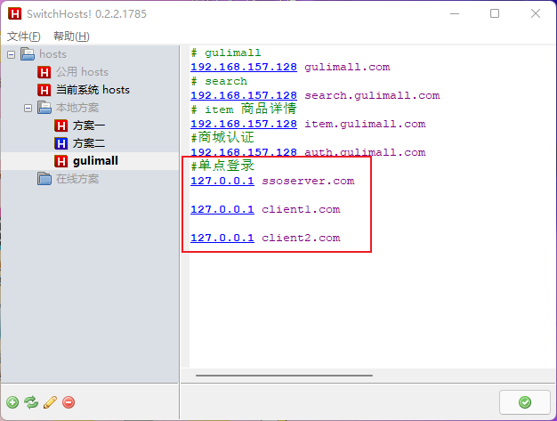

```bash
#单点登录
127.0.0.1 ssoserver.com

127.0.0.1 client1.com

127.0.0.1 client2.com
```


## 8.6 测试

将三个服务启动

> 访问client1的/employees路径,未登录直接跳转带ssoserver.con的登录页面
>
> http://client1.com:8081/employees

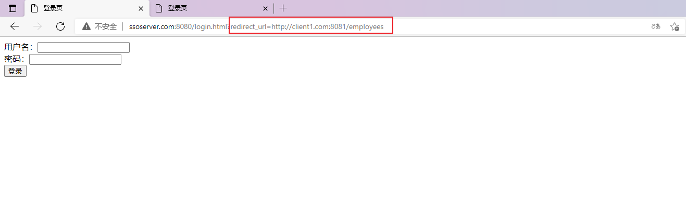

> 访问client2的/boss路径,未登录直接跳转带ssoserver.con的登录页面
>
> http://client2.com:8082/boss


> 在http://ssoserver.com:8080/login.html?redirect_url=http://client1.com:8081/employees下登录

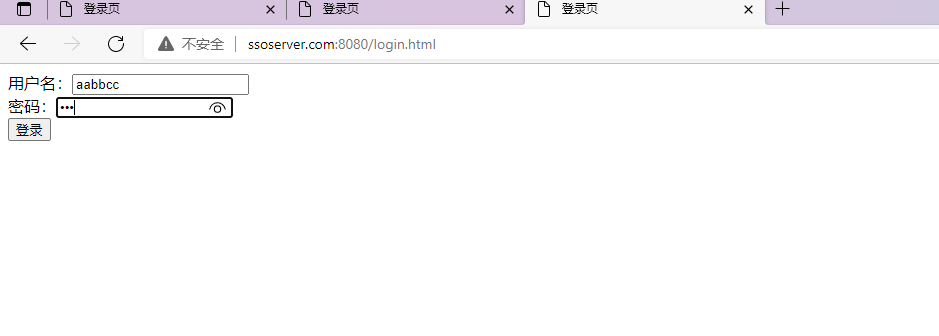

登录成功

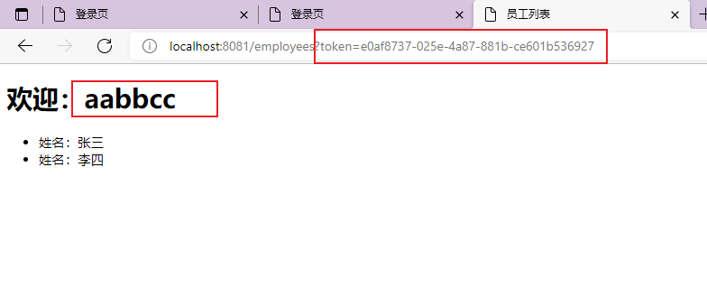

> 刷新http://ssoserver.com:8080/login.html?redirect_url=http://client2.com:8082/boss
>
> 或者访问[员工列表 http://client2.com:8082/boss

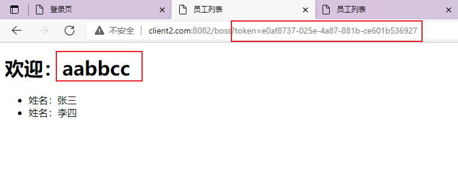

## 8.7 总结


### 8.7.1实现一：在中央服务器登录并返回token机制

1、创建中央服务器
 2、创建客户端
 3、访问http://client1.com:8081/employees => 跳转 http://ssoserver.com:8080/login.html
 4、带上了参数
 http://ssoserver.com:8080/login.html?redirect_url=http://client1.com:8081/employess
 5、登录页面隐藏域放上url的值，doLogin登录完之后跳转
 1）先将用户信息存储起来 redis
 2）在将令牌传回给客户端redirect:http://client1.com:8081/employess?token=uuid
 6、判断是否返回token，如果登录成功，则获得令牌了
 1）判断是否有令牌【是否登录】
 2）根据令牌去中央服务器请求用户信息

### 8.7.2 实现二：只要一个客户端在中央服务器登录，其他服务器也是登录状态


实现：使用cookie，浏览器缓存中央服务器的cookie，所以每次跳转中央服务器会给浏览器记录sso_token【用于多系统间sso】，然后当客户端请求跳转到中央服务器会查看cookie然后实现了免登陆，并且将cookie值返回给客户端作为token【客户端获得了token就可以免登陆了】

### 8.7.3 实现三：该接口由认证中心提供，远程调用传token查询数据【数据存储在redis中，跟Spring Session一样】

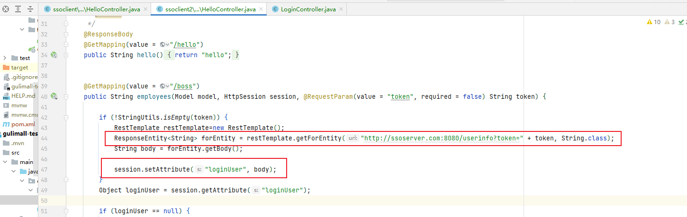

然后将数据保存到自己的session中。【其实spring session也可以在redis查完数据后往session放一份0.0】
 不同点：增加了认证服务，解决了Cookie不可跨域的问题，都是用同一个域名的cookie