 

> **导航：**
>
> [谷粒商城笔记+踩坑汇总篇](https://blog.csdn.net/qq_40991313/article/details/127099139?spm=1001.2014.3001.5501)
>
>  **Java笔记汇总：**
>
> [【Java笔记+踩坑汇总】Java基础+JavaWeb+SSM+SpringBoot+SpringCloud+瑞吉外卖/谷粒商城/学成在线+设计模式+面试题汇总+性能调优/架构设计+源码解析-CSDN博客](https://blog.csdn.net/qq_40991313/article/details/126646289)


[TOC]


# 一、环境搭建

## 1.1、购物车模块初始化


> 第一步、创建gulimall-[cart](https://so.csdn.net/so/search?q=cart&spm=1001.2101.3001.7020)服务，并进行降版本处理

```XML
<parent>
    <groupId>org.springframework.boot</groupId>
    <artifactId>spring-boot-starter-parent</artifactId>
    <version>2.1.8.RELEASE</version>
    <relativePath/> <!-- lookup parent from repository -->
</parent>
<groupId>com.atguigu</groupId>
<artifactId>gulimall-cart</artifactId>
<version>0.0.1-SNAPSHOT</version>
<name>gulimall-cart</name>
<description>购物车</description>
<properties>
    <java.version>1.8</java.version>
    <spring-cloud.version>Greenwich.SR3</spring-cloud.version>
</properties>
```


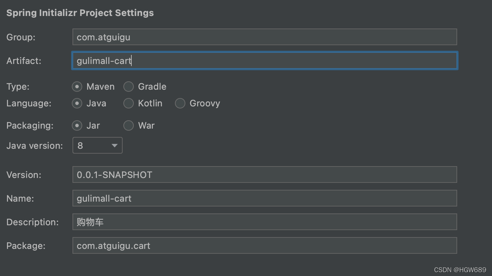
 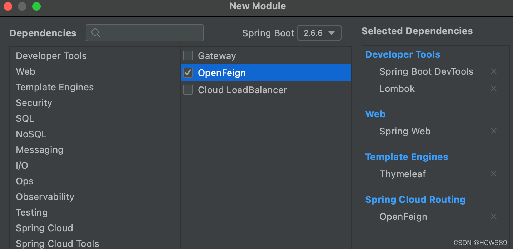​编辑

> 第二步、hosts添加域名映射

```bash
# Gulimall Host Start
127.0.0.1 gulimall.cn
127.0.0.1 search.gulimall.cn
127.0.0.1 item.gulimall.cn
127.0.0.1 auth.gulimall.cn
127.0.0.1 cart.gulimall.cn
# Gulimall Host End
```


> 第三步、导入公共模块依赖

```XML
<dependency>
    <groupId>com.atguigu.gulimall</groupId>
    <artifactId>gulimall-common</artifactId>
    <version>0.0.1-SNAPSHOT</version>
</dependency>
```


因为目前不用数据库，故排除掉

```java
@SpringBootApplication(exclude = DataSourceAutoConfiguration.class)
public class GulimallCartApplication {

    public static void main(String[] args) {
        SpringApplication.run(GulimallCartApplication.class, args);
    }

}
```


> 第四步、bootstrap.yml添加nacos配置

```bash
server.port=40000

spring.application.name=gulimall-cart
spring.cloud.nacos.discovery.server-addr=127.0.0.1:8848
```


> 第五步、为启动类添加注解，开启服务注册和发现

```java
@EnableFeignClients
@EnableDiscoveryClient
@SpringBootApplication(exclude = DataSourceAutoConfiguration.class)
public class GulimallCartApplication {

    public static void main(String[] args) {
        SpringApplication.run(GulimallCartApplication.class, args);
    }

}
```


> 第六步、修改网关，给购物车配置路由

```bash
- id: gulimall_cart_route
  uri: lb://gulimall-cart
  predicates:
  	- Host=cart.gulimall.cn
```


## 1.2、动静资源处理

------

1. 静：将资料中购物车文件夹下的所有的静态资源复制到服务器的：`mydata/nginx/html/static/cart` 目录下
2. 动：将资料中购物车文件夹下的 两个页面复制到 gulimall-cart服务的 `templates` 目录下
3. 替换掉网页中的所有资源申请路径


## 1.3、页面跳转配置

------

> 需求：实现页面的跳转
>
> 1. 当我们在商品详情页`item.html`点击加入购物车之后，跳转到加入成功页`success.html`
> 2. 在成功页`success.html` 点击 购物车 进入购物车列表页 `cartList.html`
> 3. 在成功页`success.html` 点击 查看商品详情 跳转到该商品的详情页
> 4. 在 首页 `index.html` 中点击我的购物车也跳转到 购物车列表页 `cartList.html`

gulimall-product 服务中的 Item.html

```html
<div class="box-btns-two">
   <a href="http://cart.gulimall.cn/addToCart">
      加入购物车
   </a>
</div>

//......

<div class="nav_top_three"><a href="http://cart.gulimall.cn/cart.html">我的购物车</a><span class="glyphicon glyphicon-shopping-cart"></span>
  <div class="nav_top_three_1">
    购物车还没有商品，赶紧选购吧！
  </div>
</div>
```


Gulimall-cart 服务中 success.html 页面

```html
<div class="bg_shop">
  <a class="btn-tobback" href="http://item.gulimall.cn/3.html">查看商品详情</a>
  <a class="btn-addtocart" href="http://cart.gulimall.cn/cart.html"
     id="GotoShoppingCart"><b></b>去购物车结算</a>
</div>
```


Gulimall-cart 服务中 success.html 页面

```html
<div class="one_top_left">
  <a href="http://gulimall.cn" class="one_left_logo"></a>
  <a href="/static/cart#" class="one_left_link">购物车</a>
</div>

//.....

<li>
    <a href="http://gulimall.cn">首页</a>
</li>
```


Gulimall-cart 服务中的 CartController类中添加映射

```java
@Controller
public class CartController {

    @GetMapping("/cart.html")
    public String cartListPage(){

        return "cartList";
    }

    /**
     * 添加商品到购物车
     * @return
     */
    @GetMapping("/addToCart")
    public String addToCart() {
        return "success";
    }
}
```


 

# 二、数据模型分析

## 2.1、购物车需求

------

### 2.1.1、**离线购物车和在线购物车需求、数据库选择redis**

> 需求描述

**离线购物车：**

- 用户可在 未登录状态 下将商品添加到购物车 [ 用户离线临时购物车 ]。**浏览器即使关闭**，下次进入，**临时购物车数据都在**。

**在线购物车：** 

- 用户可以在 **登录状态** 下将商品添加到购物车 **[ 用户在线购物车 ]**。登录之后，会将**离线购物车**的数据全部合并过来，并清空**离线购物车**；


------

- 购物功能 
  - 用户可以使用购物车一起结算下单
  - **添加商品到**购物车
  - 用户可以**查询自己的购物车**
  - 用户可以在购物车中**修改购买商品的数量**
  - 用户可以在购物车中**删除商品**
  - 在购物车中展示商品优惠信息
  - 提示购物车商品价格变化

------

**数据存储：**

购物车是一个读多写多的场景，因此放入数据库并不合适，但购物车又需要持久化，因此这里我们选用**Redis的持久化机制**存储购物车数据。

> redis默认是内存数据库，所有数据存在内存，

### 2.1.2、购物车数据结构

------


**购物车Redis的Hash进行存储，key是用户标识码例如**gulimall:cart:1**，值是一个个CartItem**

**Redis**中 每个用户的购物车 都是由各个购物项组成，根据分析这里使用 **Hash进行存储**比较合适：

- Map

  <String k1,

  Map

  <String k2,CartltemInfo>> 	

  - K1：用户标识
  - Map<String k2,CartltemInfo> 	
    - K2 ：商品Id
    - CartltemInfo ：购物项详情

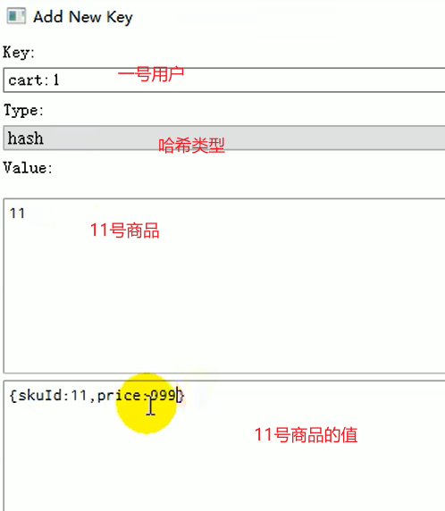


## 2.2、模型类抽取，Cart和CartItem

------


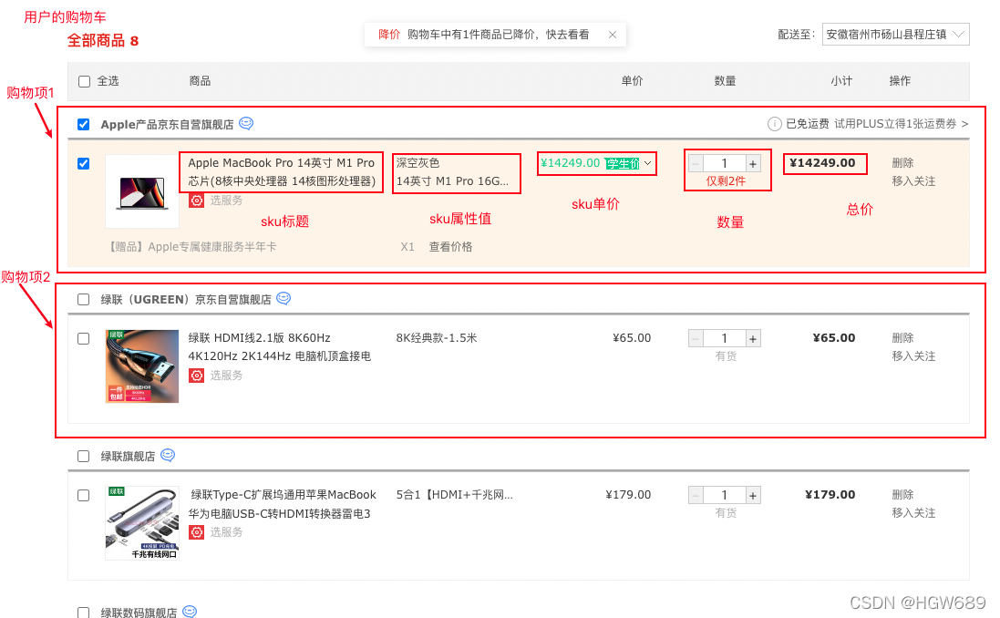

- Cart

  ​	需要计算的属性，必须重写它的get方法，保证每次获取属性都会进行计算 

  - 计算商品的总数量
  - 计算商品类型数量
  - 计算商品的总价

> **注意：**
>
> - 这里不用@Data，自己生成getter和setter方法，主要为了数量、金额等属性自定义计算方法。例如Cart里的商品数量通过CartItem列表计算总数量。
> - 金额相关数据必须用BigDecimal类型，进行精确的运算

```java
package com.atguigu.cart.vo;
/**
 * Description: 整体购物车
 *  这里不用@Data，自己生成getter和setter方法，主要为了数量、金额等属性自定义计算方法。
 *  例如Cart里的商品数量通过CartItem列表计算总数量。
 */
public class Cart {

    /**
     * 购物车子项信息
     */
    List<CartItem> items;
    /**
     * 商品的总数量
     */
    private Integer countNum;
    /**
     * 商品类型数量
     */
    private Integer countType;
    /**
     * 商品总价
     */
    private BigDecimal totalAmount;
    /**
     * 减免价格
     */
    private BigDecimal reduce = new BigDecimal("0");

//需要计算的属性，必须重写它的get方法，保证每次获取属性都会进行计算
    public List<CartItem> getItems() {
        return items;
    }

    public void setItems(List<CartItem> items) {
        this.items = items;
    }

    public Integer getCountNum() {
        int count = 0;
        if (items!=null && items.size()>0) {
            for (CartItem item : items) {
                countNum += item.getCount();
            }
        }
        return count;
    }


    public Integer getCountType() {
        int count = 0;
        if (items!=null && items.size()>0) {
            for (CartItem item : items) {
                countNum += 1;
            }
        }
        return count;
    }


    public BigDecimal getTotalAmount() {
        BigDecimal amount = new BigDecimal("0");
        // 1、计算购物项总价
        if (items!=null && items.size()>0) {
            for (CartItem item : items) {
                BigDecimal totalPrice = item.getTotalPrice();
                amount = amount.add(totalPrice);
            }
        }
        // 2、减去优惠总价
        BigDecimal subtract = amount.subtract(getReduce());
        return subtract;
    }


    public BigDecimal getReduce() {
        return reduce;
    }

    public void setReduce(BigDecimal reduce) {
        this.reduce = reduce;
    }
}
```


- CartItem 
  - 计算小计价格

```java
package com.atguigu.cart.vo;
/**
 * Description: 购物项内容。
 *  这里不用@Data，自己生成getter和setter方法，主要为了数量、金额等属性自定义计算方法。
 *  例如Cart里的商品数量通过CartItem列表计算总数量。
 */
public class CartItem {
    /**
     * 商品Id
     */
    private Long skuId;
    /**
     * 商品是否被选中(默认被选中)
     */
    private Boolean check = true;
    /**
     * 商品标题
     */
    private String title;
    /**
     * 商品图片
     */
    private String image;
    /**
     * 商品套餐信息
     */
    private List<String> skuAttr;
    /**
     * 商品价格
     */
    private BigDecimal price;
    /**
     * 数量
     */
    private Integer count;
    /**
     * 小计价格
     */
    private BigDecimal totalPrice;

    public Long getSkuId() {
        return skuId;
    }

    public void setSkuId(Long skuId) {
        this.skuId = skuId;
    }

    public Boolean getCheck() {
        return check;
    }

    public void setCheck(Boolean check) {
        this.check = check;
    }

    public String getTitle() {
        return title;
    }

    public void setTitle(String title) {
        this.title = title;
    }

    public String getImage() {
        return image;
    }

    public void setImage(String image) {
        this.image = image;
    }

    public List<String> getSkuAttr() {
        return skuAttr;
    }

    public void setSkuAttr(List<String> skuAttr) {
        this.skuAttr = skuAttr;
    }

    public BigDecimal getPrice() {
        return price;
    }

    public void setPrice(BigDecimal price) {
        this.price = price;
    }

    public Integer getCount() {
        return count;
    }

    public void setCount(Integer count) {
        this.count = count;
    }

    /**
     * 动态计算当前的总价
     * @return
     */
    public BigDecimal getTotalPrice() {
        return this.price.multiply(new BigDecimal("" + this.count));
    }

    public void setTotalPrice(BigDecimal totalPrice) {
        this.totalPrice = totalPrice;
    }
}
```


## 2.3、Redis依赖和配置、SpringSession配置类

------

1、导入redis和[SpringSession](https://so.csdn.net/so/search?q=SpringSession&spm=1001.2101.3001.7020)的依赖

```XML
<dependency>
  <groupId>org.springframework.session</groupId>
  <artifactId>spring-session-data-redis</artifactId>
</dependency>
<dependency>
  <groupId>org.springframework.boot</groupId>
  <artifactId>spring-boot-starter-data-redis</artifactId>
</dependency>
```


2、编写配置

```bash
# 配置redis
spring.redis.host=124.222.223.222
spring.redis.port=6379
```


3、添加SpringSession配置类(自定义Session配置类)

**作用：**配置类设置session使用**json序列化,并放大作用域**(自定义)。

将 gulimall-auth-server 服务中 `/com/atguigu/gulimall/auth/config`路径下的GulimallSessionConfig.[java配置](https://so.csdn.net/so/search?q=java配置&spm=1001.2101.3001.7020)类复制到 gulimall-cart服务的config包下：

```java
package com.atguigu.cart.config;

@Configuration
public class GulimallSessionConfig {

    @Bean
    public CookieSerializer cookieSerializer() {
        DefaultCookieSerializer cookieSerializer = new DefaultCookieSerializer();
        cookieSerializer.setDomainName("gulimall.cn");
        cookieSerializer.setCookieName("GULISESSION");

        return cookieSerializer;
    }

    @Bean
    public RedisSerializer<Object> springSessionDefaultRedisSerializer() {
        return new GenericJackson2JsonRedisSerializer();
    }
}
```


 

# 三、ThreadLocal 用户身份鉴别

## 3.1、需求分析 

> **需求：**
>
> - **用户登录**，访问Session中的用户信息
> - 用户未登录
>   - Cookie中有 user-key，则表示有临时用户
>   - Cookie中没有 user-key，则表示没有临时用户 	
>     - 创建一个封装 并返回 user-key

**ThreadLocal：同一个线程共享数据**

- 核心原理是：Map<Thread,Object> threadLocal
- 在每个线程中都创建了一个 ThreadLocalMap 对象，**每个线程**可以**访问自己**内部 **ThreadLocalMap 对象**内的 value。**线程之间互不干扰**

已知：

- 一次请求进来： 拦截器 ==>> Controller ==>> Service ==>> dao 用的都是同一个线程

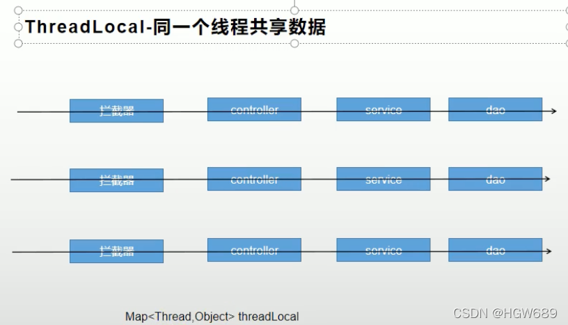

------

**（1）用户身份鉴别方式**

- 当用户登录之后点击购物车，则进行用户登录
- 用户未登录的时候点击购物车，会为临时用户生成一个name为user-key的cookie临时标识，过期时间为一个月，以后每次浏览器进行访问购物车的时候都会携带user-key。user-key 是用来标识和存储临时购物车数据的

（**2）使用ThreadLocal 进行用户身份鉴别信息传递**

- 在调用购物车的接口前，先通过

  session信息判断是否登录

  ，并分别进行用户身份信息的封装 	

  - session有用户信息则进行用户登录 userInfoTo.setUserId(member.getId());
  - session中没有用户信息 	
    - cookie中携带 user-key，则表示有临时用户，把user-key进行用户身份信息的封装: userInfoTo.setUserKey(cookie.getValue());
       		userInfoTo.setTempUser(true); 并标识携带user-key
    - **cookie中未携带 user-key，则表示没有临时用户**，进行分配

- 将信息封装好放进ThreadLocal

- 在调用购物车的接口后，若cookie中未携带 user-key，则分配临时用户，让浏览器保存

> **user-key**在cookie里，标识用户身份，第一次使用购物车，都会给一个临时用户信息，浏览器保存cookie后，每次访问都会从cookie中取到user-key。

## 3.2、传输对象封装临时用户id,userKey,是否有临时用户

> 传输对象，起名to。 

```java
package com.atguigu.cart.vo;

@ToString
@Data
public class UserInfoTo {
    private Long userId;
    private String userKey; 

    private boolean tempUser = false;   // 判断是否有临时用户
}
```


## 3.3、创建购物车常量类

```java
package com.atguigu.common.constant;

public class CartConstant {
    public static final String TEMP_USER_COOKIE_NAME = "user-key";
    public static final int TEMP_USER_COOKIE_TIMEOUT = 60*60*24*30;
}
```


## 3.4、自定义拦截器，临时用户信息放到ThreadLocal<>

业务流程： 

1. 在执行目标方法之前，检测cookie里的userKey，如果没有则新建用户传输对象，userKey设为随机uuid
2. 将用户传输对象封装进ThreadLocal。
3. 在执行目标方法之后，创建cookie并，设置作用域和过期时间，让浏览器保存

购物车模块 

```java
package com.xx.gulimall.cart.interceptor;

/**
 * @Description: 在执行目标方法之前，判断用户的登录状态.并封装传递给controller目标请求
 **/

public class CartInterceptor implements HandlerInterceptor {

//创建ThreadLocal<>对象，同一个线程共享数据
    public static ThreadLocal<UserInfoTo> toThreadLocal = new ThreadLocal<>();

    /***
     * 目标方法执行之前
     */
    @Override
    public boolean preHandle(HttpServletRequest request, HttpServletResponse response, Object handler) throws Exception {

        UserInfoTo userInfoTo = new UserInfoTo();

        HttpSession session = request.getSession();
        //1.从session获得当前登录用户的信息
        MemberResponseVo memberResponseVo = (MemberResponseVo) session.getAttribute(LOGIN_USER);

        if (memberResponseVo != null) {
            //2.1 如果用户登录了，给用户传输对象添加id
            userInfoTo.setUserId(memberResponseVo.getId());
        }
//        3.获取cookie
        Cookie[] cookies = request.getCookies();
//        如果cookie不为空，找到和"user-key"同名的cookie，设置userKey，标记临时用户
        if (cookies != null && cookies.length > 0) {
            for (Cookie cookie : cookies) {
                //user-key
                String name = cookie.getName();
                if (name.equals(TEMP_USER_COOKIE_NAME)) {
                    userInfoTo.setUserKey(cookie.getValue());
                    //标记为已是临时用户
                    userInfoTo.setTempUser(true);
                }
            }
        }

        //如果没有临时用户一定分配一个临时用户，userKey是临时id。
        if (StringUtils.isEmpty(userInfoTo.getUserKey())) {
            String uuid = UUID.randomUUID().toString();
            userInfoTo.setUserKey(uuid);
        }

        //目标方法执行之前，将用户传输信息放到ThreadLocal里，同一个线程共享数据。
        toThreadLocal.set(userInfoTo);
        return true;
    }


    /**
     * 业务执行之后，分配临时用户来浏览器保存
     */
    @Override
    public void postHandle(HttpServletRequest request, HttpServletResponse response, Object handler, ModelAndView modelAndView) throws Exception {

        //获取当前用户的值
        UserInfoTo userInfoTo = toThreadLocal.get();

        //如果没有临时用户则保存一个临时用户，并延长cookie过期时间，扩大cookie域，实现子域名共享cookie。
        if (!userInfoTo.getTempUser()) {
            //创建一个cookie
            Cookie cookie = new Cookie(TEMP_USER_COOKIE_NAME, userInfoTo.getUserKey());
            //扩大作用域
            cookie.setDomain("gulimall.com");
            //设置过期时间
            cookie.setMaxAge(TEMP_USER_COOKIE_TIMEOUT);
            response.addCookie(cookie);
        }

    }

    @Override
    public void afterCompletion(HttpServletRequest request, HttpServletResponse response, Object handler, Exception ex) throws Exception {

    }
}
```


## 3.5、把拦截器添加到WebMvcConfigurer配置类

添加拦截器的配置，不能只把拦截器加入容器中，不然拦截器不生效的

```java
package com.atguigu.cart.config;

@Configuration
public class GulimallWebConfig implements WebMvcConfigurer {

    @Override
    public void addInterceptors(InterceptorRegistry registry) {
        registry.addInterceptor(new CartInterceptor()).addPathPatterns("/**");
    }
}
```


## 3.6、Controller处理购物车请求

```java
package com.atguigu.cart.controller;

@Controller
public class CartController {

    /**
     * 去往用户购物车页面
     *  浏览器有一个cookie：user-key 用来标识用户身份，一个月后过期
     *  如果第一次使用京东的购物车功能，都会给一个临时用户身份；浏览器以后保存，每次访问都会带上这个cookie；
     * 登录：Session有
     * 没登录：按照cookie里面的user-key来做。
     *  第一次：如果没有临时用户，帮忙创建一个临时用户。
     * @return
     */
    @GetMapping(value = "/cart.html")
    public String cartListPage(Model model) throws ExecutionException, InterruptedException {
        //快速得到用户信息：id,user-key
        // UserInfoTo userInfoTo = CartInterceptor.toThreadLocal.get();

        CartVo cartVo = cartService.getCart();
        model.addAttribute("cart",cartVo);
        return "cartList";
    }
}
```


 

# 四、添加商品到购物车

在gulimall-product模块，修改添加购物车按钮

## 4.1、前端页面修改

> 第一步、修改item页面

点击 加入购物车 按钮时，发送请求：

```
http://cart.gulimall.cn/addToCart?skuId=?&num=?
```

- skuId：当前商品的skuId
- num: 当前商品加入购物车的数量

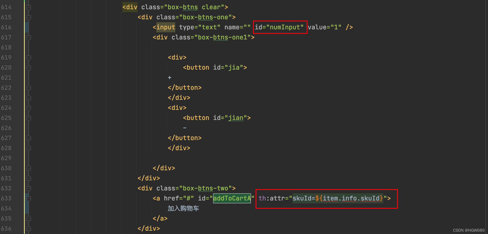
 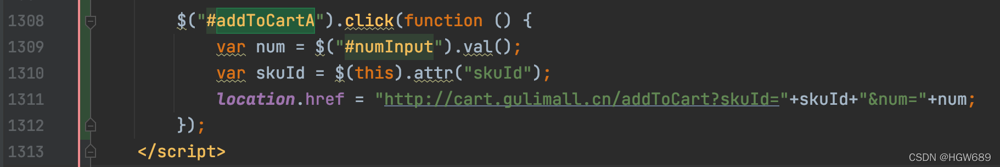​编辑

```java
$("#addToCartA").click(function () {
   var num = $("#numInput").val();
   var skuId = $(this).attr("skuId");
   location.href = "http://cart.gulimall.cn/addToCart?skuId="+skuId+"&num="+num;
});
```


> 第二步、修改 success页面

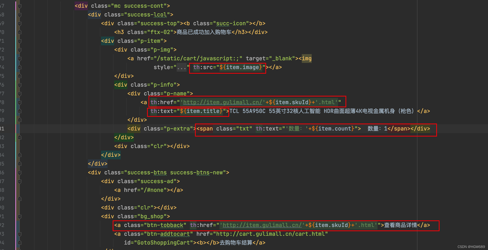


业务逻辑：

1. 保存在Redis中的key 
   - 如果用户已经登录，则存储在Redis中的key，则是用户的Id
   - 如果用户没有登录，则存在在Redis中的key，是临时用户对应的 `user-key`
2. 购物车保存 
   - 若当前商品已经存在购物车，只需增添数量
   - 否则需要查询商品购物项所需信息，并添加新商品至购物车

## 4.2、Controller


1、Controller层接口 CartController类 编写添加商品到购物车方法

```java
/**
 * 添加商品到购物车
 * @param skuId 商品的skuid
 * @param num   添加的商品数量
 * @return
 */
@GetMapping("/addToCart")
public String addToCart(@RequestParam("skuId") Long skuId,
                        @RequestParam("num") Integer num,
                        Model model) throws ExecutionException, InterruptedException {

    CartItem cartItem = cartService.addToCart(skuId,num);
    model.addAttribute("item",cartItem);
    return "success";
}
```


## 4.3、service 

### 4.3.1、远程查询sku的组合信息

------

在gulimall-cart 服务中编写远程调用feign接口

```java
package com.atguigu.cart.feign;

@FeignClient("gulimall-product")
public interface ProductFeignService {
    @GetMapping("/product/skusaleattrvalue/stringlist/{skuId}")
    List<String> getSkuSaleAttrValues(@PathVariable("skuId") Long skuId);
}
```


### 4.3.2、远程查询sku的组合信息


Gulimall-product 服务中

1. Controller层编写查询sku的组合信息

```java
@RestController
@RequestMapping("product/skusaleattrvalue")
public class SkuSaleAttrValueController {
    @Autowired
    private SkuSaleAttrValueService skuSaleAttrValueService;

    @GetMapping("/stringlist/{skuId}")
    public List<String> getSkuSaleAttrValues(@PathVariable("skuId") Long skuId){
        return  skuSaleAttrValueService.getSkuSaleAttrValuesAsStringList(skuId);
    }
  
  //....
}
```


Service层实现类 SkuSaleAttrValueServiceImpl 中编写方法

```java
@Override
public List<String> getSkuSaleAttrValuesAsStringList(Long skuId) {
    SkuSaleAttrValueDao dao = this.baseMapper;
    return dao.getSkuSaleAttrValuesAsStringList(skuId);
}
```


Dao层xml的SQL语句 SkuSaleAttrValueDao.xml

```XML
<select id="getSkuSaleAttrValuesAsStringList" resultType="java.lang.String">
    SELECT CONCAT(attr_name,":",attr_value) FROM pms_sku_sale_attr_value WHERE sku_id=#{skuId};
</select>
```


在gulimall-cart 服务中编写远程调用feign接口

```java
package com.atguigu.cart.feign;

@FeignClient("gulimall-product")
public interface ProductFeignService {

    @RequestMapping("/product/skuinfo/info/{skuId}")
    R getSkuInfo(@PathVariable("skuId") Long skuId);

    @GetMapping("/product/skusaleattrvalue/stringlist/{skuId}")
    List<String> getSkuSaleAttrValues(@PathVariable("skuId") Long skuId);
}
```


### 4.3.3、异步编排，自定义线程池配置类


> 假设 远程查询sku的组合信息 查询需要1秒，远程查询sku的组合信息有需要1.5秒，那总耗时就需要2.5秒。
>  若使用异步编排的话，只需要1.5秒。

1、 将gulimall-product中 `com/atguigu/gulimall/product/config` 路径下的 MyThreadConfig、ThreadPoolConfigProperties类复制到 gulimall-cart 服务下的 config 路径下：

```java
package com.atguigu.cart.config;

@Configuration
public class MyThreadConfig {

    @Bean
    public ThreadPoolExecutor threadPoolExecutor(ThreadPoolConfigProperties pool) {
        return new ThreadPoolExecutor(pool.getCoreSize(),
                pool.getMaxSize(),
                pool.getKeepAliveTime(),
                TimeUnit.SECONDS,
                new LinkedBlockingDeque<>(100000),
                Executors.defaultThreadFactory(),
                new ThreadPoolExecutor.AbortPolicy());
    }
}
```


```java
package com.atguigu.cart.config;

@ConfigurationProperties(prefix = "gulimall.thread")    /自动注入
@Component
@Data
public class ThreadPoolConfigProperties {
    private Integer coreSize;
    private Integer maxSize;
    private Integer keepAliveTime;
}
```


2、配置 线程池

```bash
# 配置线程池
gulimall.thread.core-size: 20
gulimall.thread.max-size: 200
gulimall.thread.keep-alive-time: 10
```


### 4.3.4、添加购物车业务实现

CartServiceImpl 

```java
@Slf4j
@Service
public class CartServiceImpl implements CartService {

    @Autowired
    StringRedisTemplate redisTemplate;

    @Autowired
    ProductFeignService productFeignService;

    @Autowired
    ThreadPoolExecutor executor;

    // 用户标识前缀
    private final String CART_PREFIX = "gulimall:cart:";


@Slf4j
@Service("cartService")
public class CartServiceImpl implements CartService {

    @Autowired
    private StringRedisTemplate redisTemplate;

    @Autowired
    private ProductFeignService productFeignService;

    @Autowired
    private ThreadPoolExecutor executor;

    @Override
    public CartItemVo addToCart(Long skuId, Integer num) throws ExecutionException, InterruptedException {

        //1.拿到要操作的购物车redis操作器信息
        BoundHashOperations<String, Object, Object> cartOps = getCartOps();

        //2.判断Redis是否有该商品的信息
        String productRedisValue = (String) cartOps.get(skuId.toString());

        if (StringUtils.isEmpty(productRedisValue)) {
//2.1如果没有就添加数据
            //添加新的商品到购物车(redis)
            CartItemVo cartItemVo = new CartItemVo();
            //开启第一个异步任务，存商品基本信息
            CompletableFuture<Void> getSkuInfoFuture = CompletableFuture.runAsync(() -> {
                //远程调用商品模块查询当前要添加商品的sku信息
                R productSkuInfo = productFeignService.getInfo(skuId);
                SkuInfoVo skuInfo = productSkuInfo.getData("skuInfo", new TypeReference<SkuInfoVo>() {});
                //sku信息数据赋值给单个CartItem
                cartItemVo.setSkuId(skuInfo.getSkuId());
                cartItemVo.setTitle(skuInfo.getSkuTitle());
                cartItemVo.setImage(skuInfo.getSkuDefaultImg());
                cartItemVo.setPrice(skuInfo.getPrice());
                cartItemVo.setCount(num);
            }, executor);

            //开启第二个异步任务，存商品属性信息
            CompletableFuture<Void> getSkuAttrValuesFuture = CompletableFuture.runAsync(() -> {
                //2、远程查询skuAttrValues组合信息
                List<String> skuSaleAttrValues = productFeignService.getSkuSaleAttrValues(skuId);
                cartItemVo.setSkuAttrValues(skuSaleAttrValues);
            }, executor);

            //等待所有的异步任务全部完成
            CompletableFuture.allOf(getSkuInfoFuture, getSkuAttrValuesFuture).get();

            String cartItemJson = JSON.toJSONString(cartItemVo);
            cartOps.put(skuId.toString(), cartItemJson);

            return cartItemVo;
        } else {
//2.2 购物车有此商品，修改数量即可
            CartItemVo cartItemVo = JSON.parseObject(productRedisValue, CartItemVo.class);
            cartItemVo.setCount(cartItemVo.getCount() + num);
            //修改redis的数据
            String cartItemJson = JSON.toJSONString(cartItemVo);
            cartOps.put(skuId.toString(),cartItemJson);

            return cartItemVo;
        }
    }

    /**
     * 获取到要操作的购物车
     * @return
     */
    private  BoundHashOperations<String, Object, Object> getCartOps() {
        UserInfoTo userInfoTo = CartInterceptor.threadLocal.get();
        // 1、判断用户有没有登录
        String cartKey = "";   
        if (userInfoTo.getUserId() != null){
            // 用户已登录，则存储在Redis中的key 是 用户的Id
            cartKey = CART_PREFIX+userInfoTo.getUserId();
        } else {
            // 用户没有登录，则存在在Redis中的key 是 临时用户对应的 `user-key`
            cartKey = CART_PREFIX+userInfoTo.getUserKey();
        }
        // 绑定hash
        BoundHashOperations<String, Object, Object> operations = redisTemplate.boundHashOps(cartKey);
        return operations;
    }
}
```


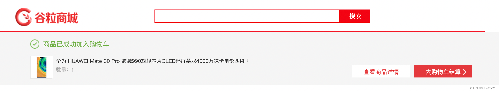


 

## 4.4、刷新页面不断发请求问题，RedirectAttribute

### 4.4.0、分析

> 目前问题：
>
> 不断刷新“添加成功” 页面，会不断发请求，数量会不断增长：
>
> 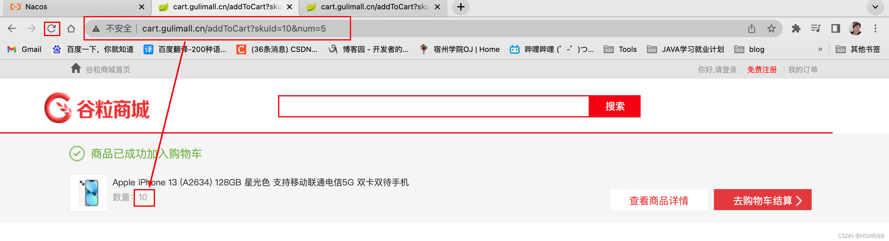

解决办法，这里修改逻辑：

- 在controller的addToCart方法里添加商品
- 商品添加完跳转到成功页面我们改为改成重定向另一个方法，专门查询数据跳转到成功页面

### 4.4.1、改成重定向到添加成功页面并查询购物车数据

```java
/**
 * 添加商品到购物车
 * @param skuId 商品的skuid
 * @param num   添加的商品数量
 * @return
 * RedirectAttributes
 *  ra.addFlashAttribute(, ) ：将数据放在session里面可以在页面里取出，但是只能取一次
 *  ra.addAttribute(,); 将数据放在url后面
 */
@GetMapping("/addToCart")
public String addToCart(@RequestParam("skuId") Long skuId,
                        @RequestParam("num") Integer num,
                        RedirectAttributes ra) throws ExecutionException, InterruptedException {
    cartService.addToCart(skuId,num);
    ra.addAttribute("skuId", skuId);
    return "redirect:http://cart.gulimall.cn/addToCartSuccess.html";
}

/**
 * 跳转到成功页
 * @param skuId
 * @param model
 * @return
 */
@GetMapping("/addToCartSuccess.html")
public String addToCartSuccessPage(@RequestParam("skuId") Long skuId,Model model) {
    // 重定向到成功页面，再次查询购物车数据
    CartItem cartItem = cartService.getCartItem(skuId);
    model.addAttribute("item",cartItem);
    return "success";
}
```


### 4.4.2、Service层 CartServiceImpl 实现类编写 获取购物车某个购物项方法

```java
@Override
public CartItem getCartItem(Long skuId) {
    BoundHashOperations<String, Object, Object> cartOps = getCartOps();
    String str = (String) cartOps.get(skuId.toString());
    CartItem cartItem = JSON.parseObject(str, CartItem.class);
    return cartItem;
}
```


### 4.4.3、success页面修改

```XML
<div class="success-wrap">
    <div class="w" id="result">
        <div class="m succeed-box">
            <div th:if="${item!=null}" class="mc success-cont">
                <div class="success-lcol">
                    <div class="success-top"><b class="succ-icon"></b>
                        <h3 class="ftx-02">商品已成功加入购物车</h3></div>
                    <div class="p-item">
                        <div class="p-img">
                            <a href="/static/cart/javascript:;" target="_blank"></a>
                        </div>
                        <div class="p-info">
                            <div class="p-name">
                                <a th:href="'http://item.gulimall.cn/'+${item.skuId}+'.html'"
                                   th:text="${item.title}">TCL 55A950C 55英寸32核人工智能 HDR曲面超薄4K电视金属机身（枪色）</a>
                            </div>
                            <div class="p-extra"><span class="txt" th:text="'数量：'+${item.count}">  数量：1</span></div>
                        </div>
                        <div class="clr"></div>
                    </div>
                </div>
                <div class="success-btns success-btns-new">
                    <div class="success-ad">
                        <a href="/#none"></a>
                    </div>
                    <div class="clr"></div>
                    <div class="bg_shop">
                        <a class="btn-tobback" th:href="'http://item.gulimall.cn/'+${item.skuId}+'.html'">查看商品详情</a>
                        <a class="btn-addtocart" href="http://cart.gulimall.cn/cart.html"
                           id="GotoShoppingCart"><b></b>去购物车结算</a>
                    </div>
                </div>
            </div>
            <div th:if="${item==null}" class="mc success-cont">
                <h2>购物车中无商品</h2>
                <a href="http://gulimall.cn">去购物</a>
            </div>
        </div>
    </div>
</div>
```


 

# 五、获取购物车

- 若用户未登录，则使用user-key获取Redis中购物车数据

- 若用户登录，则使用userId获取Redis中购物车数据，并将

  - **user-key 对应的临时购物车数据** 与
  - **用户购物车数据**

  合并 并删除临时购物车。


> 第一步、Controller层 CartController 类编写方法

```java
@Controller
public class CartController {

    @Autowired
    CartService cartService;

    @GetMapping("/cart.html")
    public String cartListPage(Model model) throws ExecutionException, InterruptedException {
        Cart cart = cartService.getCart();
        model.addAttribute("cart",cart);
        return "cartList";
    }
```


> 第二步、编写Service层 方法

```java
package com.atguigu.cart.service;

public interface CartService {
		//....

    /**
     * 获取购物车某个购物项
     * @param skuId
     * @return
     */
    CartItem getCartItem(Long skuId);

    /**
     * 获取整个购物车
     * @return
     */
    Cart getCart() throws ExecutionException, InterruptedException;

    /**
     * 清空购物车数据
     * @param cartKey
     */
    void clearCart(String cartKey);
}
```


实现类 **CartServiceImpl** 方法：

```java
@Override
public CartItem getCartItem(Long skuId) {
    BoundHashOperations<String, Object, Object> cartOps = getCartOps();
    String str = (String) cartOps.get(skuId.toString());
    CartItem cartItem = JSON.parseObject(str, CartItem.class);
    return cartItem;
}
    /**
     * 获取购物车里面的数据
     * @param cartKey
     * @return
     */
    private List<CartItemVo> getCartItems(String cartKey) {
        //获取购物车里面的所有商品
        BoundHashOperations<String, Object, Object> operations = redisTemplate.boundHashOps(cartKey);
        List<Object> values = operations.values();
        if (values != null && values.size() > 0) {
            List<CartItemVo> cartItemVoStream = values.stream().map((obj) -> {
                String str = (String) obj;
                CartItemVo cartItem = JSON.parseObject(str, CartItemVo.class);
                return cartItem;
            }).collect(Collectors.toList());
            return cartItemVoStream;
        }
        return null;

    }
@Override
public Cart getCart() throws ExecutionException, InterruptedException {

    Cart cart = new Cart();
    UserInfoTo userInfoTo = CartInterceptor.threadLocal.get();
    if (userInfoTo.getUserId()!=null){
        // 1、登录状态
        String cartKey = CART_PREFIX + userInfoTo.getUserId();
        // 2、如果临时购物车的数据还没有合并，则合并购物车
        String tempCartKey = CART_PREFIX + userInfoTo.getUserKey();
        List<CartItem> tempCartItems = getCartItems(tempCartKey);
        if (tempCartItems!=null) {
            // 临时购物车有数据，需要合并
            for (CartItem item : tempCartItems) {
                addToCart(item.getSkuId(),item.getCount());
            }
            // 清除临时购物车的数据
            clearCart(tempCartKey);
        }
        // 3、删除临时购物车
        // 4、获取登录后的购物车数据
        List<CartItem> cartItems = getCartItems(cartKey);
        cart.setItems(cartItems);

    } else {
        // 2、没登录状态
        String cartKey = CART_PREFIX + userInfoTo.getUserKey();
        // 获取临时购物车的所有项
        List<CartItem> cartItems = getCartItems(cartKey);
        cart.setItems(cartItems);
    }
    return cart;
}

@Override
public void clearCart(String cartKey) {
    // 直接删除该键
    redisTemplate.delete(cartKey);
}
```


> 第三步、修改购物车前端页面 cartList.html

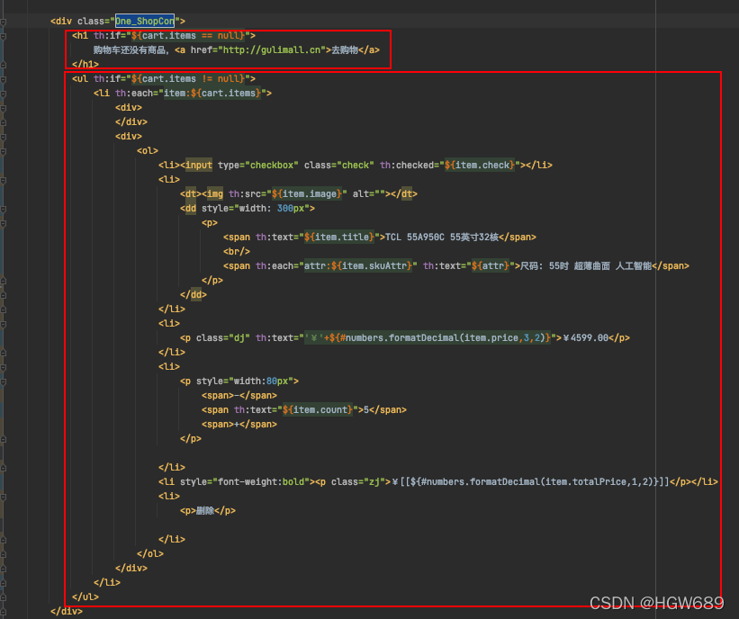

测试结果：


 

# 六、选中购物项[是否选中]

> **第一步、**Controller层方法编写

**gulimall-cart** 服务`com/atguigu/cart/controller/` 路径下 CartController.java类中添加映射方法

```java
@GetMapping("/checkItem")
public String checkItem(@RequestParam("skuId") Long skuId,
                        @RequestParam("check") Integer check) {
    cartService.checkItem(skuId,check);
    return "redirect:http://cart.gulimall.cn/cart.html";
}
```


> **第二步、**Service层实现类方法中编写是否选中购物项方法

```java
/**
 * 勾选购物项
 * @param skuId
 * @param check
 */
void checkItem(Long skuId, Integer check);
```


**gulimall-cart** 服务中 `com/atguigu/cart/service/impl/` 路径下 CartServiceImpl.java 实现类：

```java
@Override
public void checkItem(Long skuId, Integer check) {
    BoundHashOperations<String, Object, Object> cartOps = getCartOps();
    CartItem cartItem = getCartItem(skuId);
    cartItem.setCheck(check==1?true:false);
    String s = JSON.toJSONString(cartItem);
    cartOps.put(skuId.toString(),s);
}
```


> 第三步、页面修改

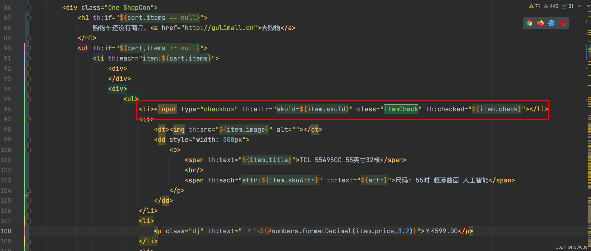

```java
$(".itemCheck").click(function () {
    var skuId = $(this).attr("skuId");
    var check = $(this).prop("checked");
    location.href = "http://cart.gulimall.cn/checkItem?skuId="+skuId+"&check="+(check?1:0);
});
```


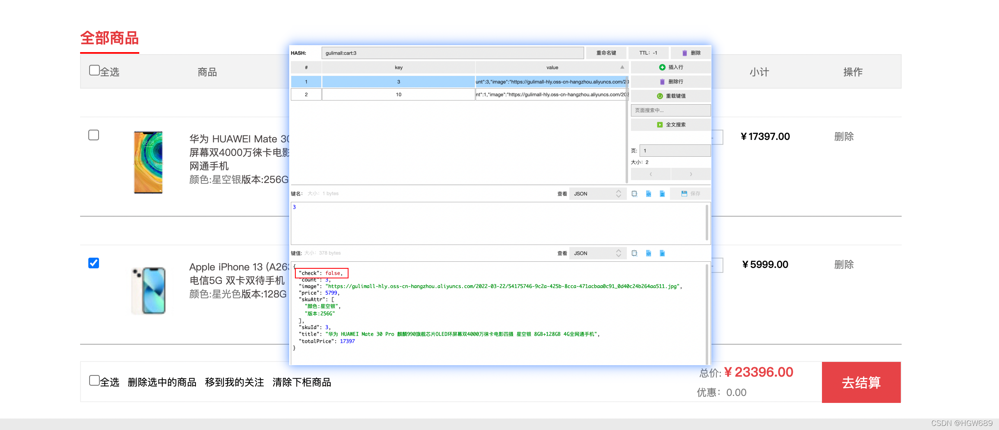


 

# 七、修改购物项数量

## 7.1、前端 cartList.html 页面修改

> 前端 cartList.html 页面修改

```XML
<li>
    <p style="width:80px" th:attr="skuId=${item.skuId}">
        <span class="countOpsBtn">-</span>
        <span class="countOpsNum" th:text="${item.count}">5</span>
        <span class="countOpsBtn">+</span>
    </p>
</li>
```


```javascript
$(".countOpsBtn").click(function () {
    var skuId = $(this).parent().attr("skuId");
    var num = $(this).parent().find(".countOpsNum").text();
    location.href = "http://cart.gulimall.cn/countItem?skuId="+skuId+"&num="+num; 
});
```


## 7.2、后端 接口编写

> 后端 接口编写

1. Controller 层 接口编写

修改“com.atguigu.gulimall.cart.controller.CartController”类，代码如下：

```java
@GetMapping("/countItem")
public String countItem(@RequestParam("skuId") Long skuId,
                        @RequestParam("num") Integer num) {
    cartService.countItem(skuId,num);
    return "redirect:http://cart.gulimall.cn/cart.html";
}
```


Service 层编写

```java
/**
 * 修改购物项数量
 * @param skuId
 * @param num
 */
void countItem(Long skuId, Integer num);
```


修改“com.atguigu.gulimall.cart.service.impl.CartServiceImpl”类，代码如下：

```java
@Override
public void countItem(Long skuId, Integer num) {
    BoundHashOperations<String, Object, Object> cartOps = getCartOps();
    CartItem cartItem = getCartItem(skuId);
    cartItem.setCount(num);
    cartOps.put(skuId.toString(),JSON.toJSONString(cartItem));
}
```


 

# 八、删除购物项

## 8.1、前端修改

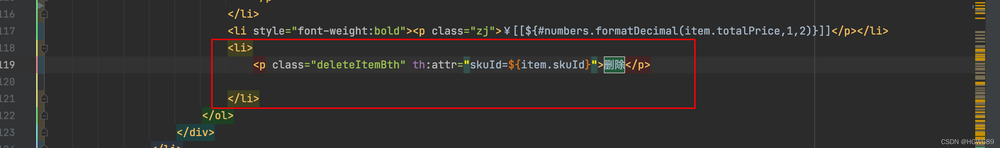
 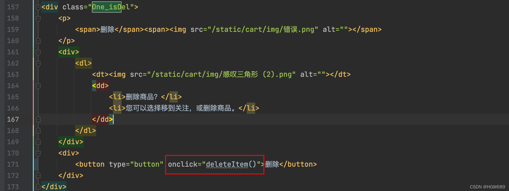​编辑

## 8.2、后端接口

CartController

```java
@GetMapping("/deleteItem")
public String deleteItem(@RequestParam("skuId") Long skuId) {
    cartService.deleteItem(skuId);
    return "redirect:http://cart.gulimall.cn/cart.html";
}
```


CartServiceImpl.java

```java
/**
 * 删除购物项
 * @param skuId
 */
@Override
public void deleteItem(Long skuId) {
    BoundHashOperations<String, Object, Object> cartOps = getCartOps();
    cartOps.delete(skuId.toString());
}
```

