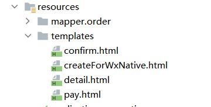
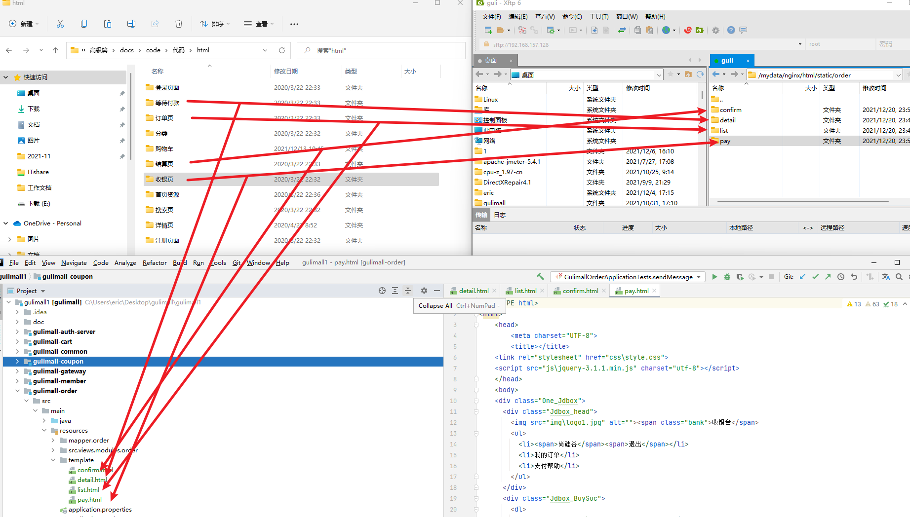
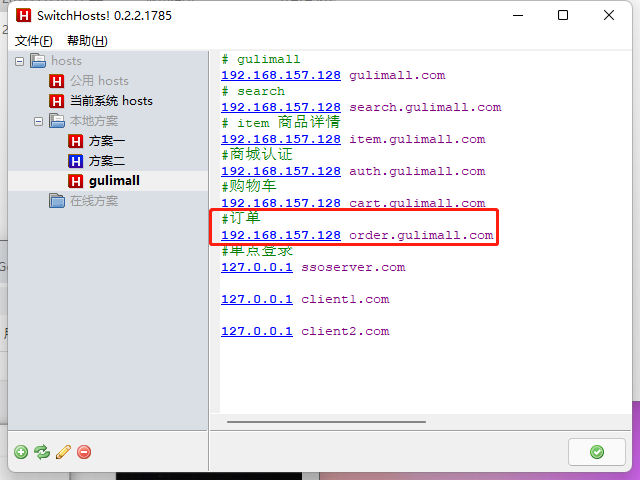
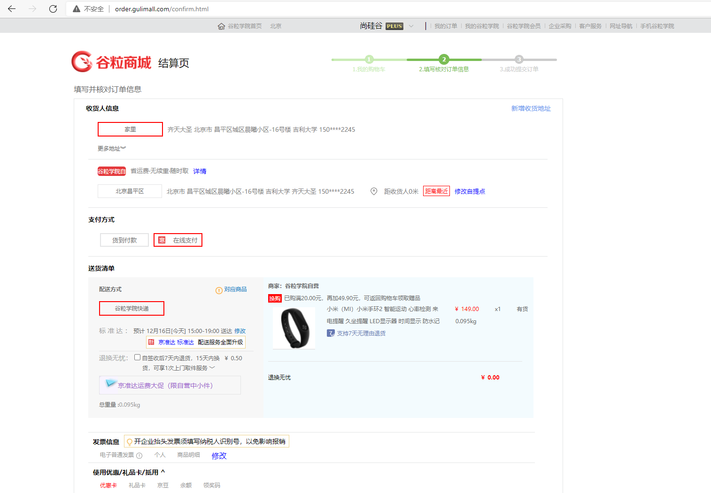
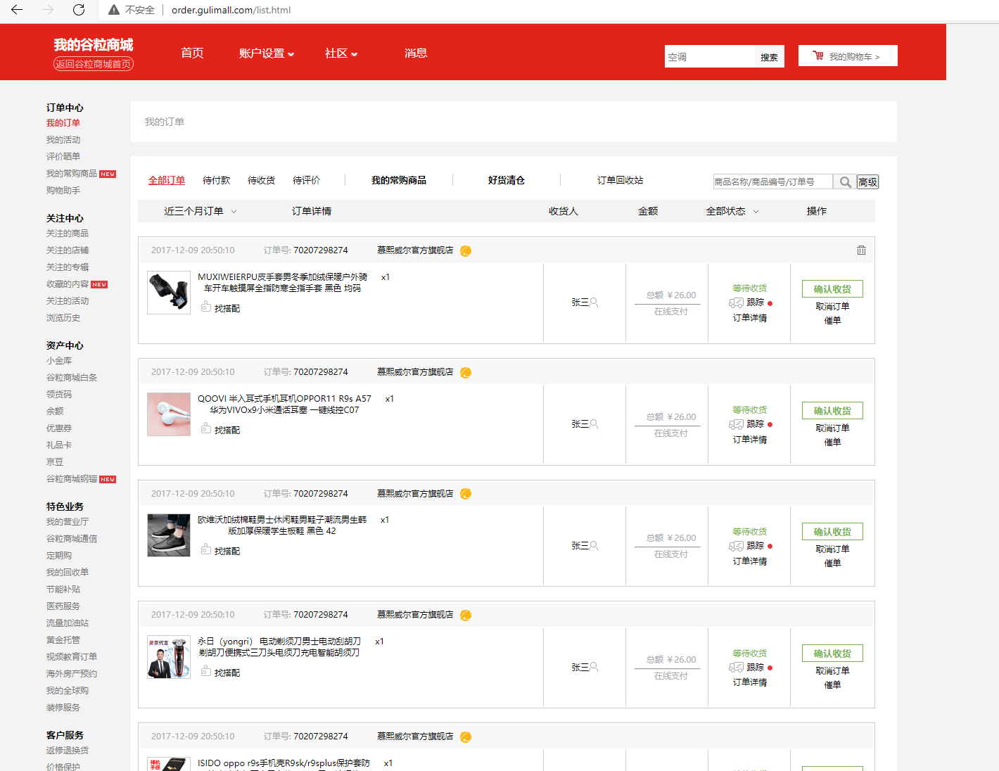
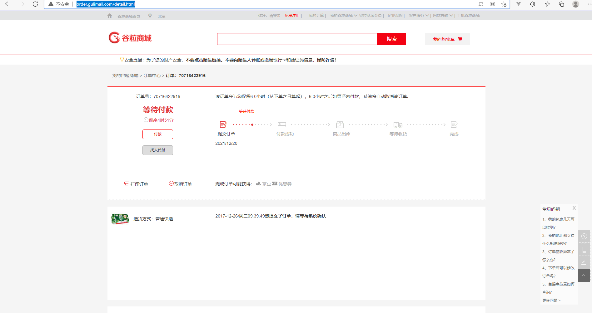
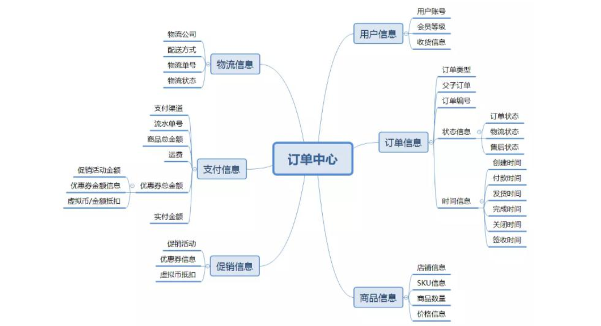
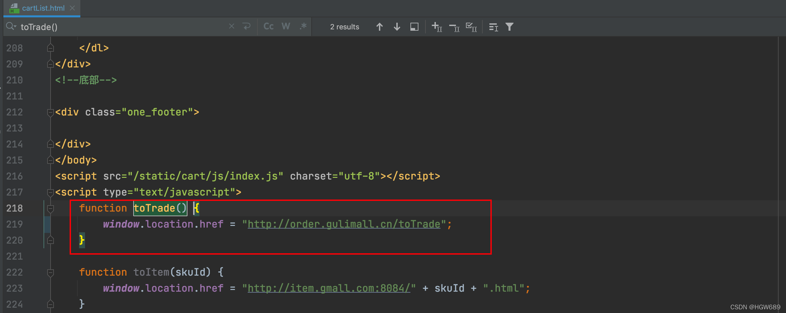

 **谷粒商城笔记+踩坑（19）——订单模块构建、登录拦截器导航：**

[谷粒商城笔记+踩坑汇总篇](https://blog.csdn.net/qq_40991313/article/details/127099139?spm=1001.2014.3001.5501)

 **Java笔记汇总：**

[【Java笔记+踩坑汇总】Java基础+JavaWeb+SSM+SpringBoot+SpringCloud+瑞吉外卖/谷粒商城/学成在线+设计模式+面试题汇总+性能调优/架构设计+源码解析-CSDN博客](https://blog.csdn.net/qq_40991313/article/details/126646289)

[TOC]


# 1.页面环境搭建

## 1.1 动静分离

**静态：** 

在服务器的`mydata/nginx/html/static` 路径下创建一个 **order** 文件夹，在order路径下分别创建以下几个文件夹，用来存放对应的静态资源： 

等待付款 --------->detail

订单页 --------->list

结算页 --------->confirm

收银页 ---------> pay


**动态：**





## 1.2 hosts添加域名映射



```bash
# gulimall
192.168.157.128 gulimall.com
# search
192.168.157.128 search.gulimall.com
# item 商品详情
192.168.157.128 item.gulimall.com
#商城认证
192.168.157.128 auth.gulimall.com
#购物车
192.168.157.128 cart.gulimall.com
#订单
192.168.157.128 order.gulimall.com
#单点登录
127.0.0.1 ssoserver.com

127.0.0.1 client1.com

127.0.0.1 client2.com
```


## 1.3 配置网关和nacos

> gulimall-gateway/src/main/resources/application.yml

```bash
        #订单
        - id: gulimall_order_route
          uri: lb://gulimall-order
          predicates:
            - Host=order.gulimall.com
```


bootstrap.yml

```bash
spring:
  cloud:
    nacos:
      discovery:
        server-addr: 127.0.0.1:8848
  application:
    name: gulimall-order
```


## 1.4 引导类开启注册发现和feign客户端

```java
@EnableFeignClients
@EnableDiscoveryClient
```


## 1.5 thymeleaf依赖、关缓存

```XML
        <dependency>
            <groupId>org.springframework.boot</groupId>
            <artifactId>spring-boot-starter-thymeleaf</artifactId>
        </dependency>
```


```bash
spring:
  thymeleaf:
    cache: false
```


## 1.6 修改各个页面的静态资源路径

src=" ===>src="/static/order/xxx/

herf=" ===>herf="/static/order/xxx/

## 1.7 测试前端页面


**订单确认页** 



**订单列表页**




**订单详情页**





# 2. 整合Spring Session

## 2.1 导入Spring Session、Redis、jedis依赖

```XML
        <dependency>
            <groupId>org.springframework.session</groupId>
            <artifactId>spring-session-data-redis</artifactId>
        </dependency>

        <!--redis-->
        <dependency>
            <groupId>org.springframework.boot</groupId>
            <artifactId>spring-boot-starter-data-redis</artifactId>
            <exclusions>
                <exclusion>
                    <groupId>io.lettuce</groupId>
                    <artifactId>lettuce-core</artifactId>
                </exclusion>
            </exclusions>
        </dependency>
        <!--jedis，redis客户端-->
        <dependency>
            <groupId>redis.clients</groupId>
            <artifactId>jedis</artifactId>
        </dependency>
```


## 2.2 引导类开启Spring Session

```java
@EnableRedisHttpSession  //整合Redis作为session存储
```


## 2.3 配置Spring Session存储方式

```bash
  redis:
    host: 192.168.157.128
  session:
    store-type: redis
```


## 2.4 配置类放大ck作用域和存活时间

```java
package site.xx.gulimall.order.config;
@Configuration
public class GulimallSessionConfig {
    @Bean
    public CookieSerializer cookieSerializer() {
        DefaultCookieSerializer cookieSerializer = new DefaultCookieSerializer();
        //放大作用域
        cookieSerializer.setDomainName("gulimall.com");
        cookieSerializer.setCookieName("GULISESSION");
        cookieSerializer.setCookieMaxAge(60*60*24*7);
        return cookieSerializer;
    }
	//session存储对象方式json,默认jdk
    @Bean
    public RedisSerializer<Object> springSessionDefaultRedisSerializer() {
        return new GenericJackson2JsonRedisSerializer();
    }
}
```


## 2.5 Spring Session在项目中用法

登陆成功后会把用户信息放到session里，放大作用域后可以让各模块都能获取到session里登录信息。

**登录拦截器：**访问订单模块时，会先进行登录拦截，若已登录会将session里的登录信息放到ThreadLocal<>对象里，实际订单操作时从这个登录拦截器的ThreadLocal里判断登录状态。


# 3. 整合线程池

## 3.1 配置类自定义线程池


```java
package site.xx.gulimall.order.config;


@Configuration
public class MyThreadConfig {
    @Bean
    public ThreadPoolExecutor threadPoolExecutor(ThreadPoolConfigProperties pool) {
        return new ThreadPoolExecutor(
                pool.getCoreSize(),
                pool.getMaxSize(),
                pool.getKeepAliveTime(),
                TimeUnit.SECONDS,
                new LinkedBlockingDeque<>(100000),
                Executors.defaultThreadFactory(),
                new ThreadPoolExecutor.AbortPolicy()
        );
    }
}
```


```java
package site.xx.gulimall.order.config;
@ConfigurationProperties(prefix = "gulimall.thread")    //扫描yml里自定义属性，自动注入本类属性
@Component
@Data
public class ThreadPoolConfigProperties {
    private Integer coreSize;
    private Integer maxSize;
    private Integer keepAliveTime;
}
```


## 3.2 yml自定义线程池属性

```bash
gulimall:
  thread:
    core-size: 20
    max-size: 200
    keep-alive-time: 10
```


# 4. 订单模块分析

电商系统涉及到 3 流， 分别时信息流， 资金流， 物流， 而订单系统作为中枢将三者有机的集合起来。订单模块是电商系统的枢纽， 在订单这个环节上需求获取多个模块的数据和信息， 同时对这些信息进行加工处理后流向下个环节， 这一系列就构成了订单的信息流通。

## 4.1 订单的构成



### 4.1.1 用户信息

用户信息包括用户账号、 用户等级、 用户的收货地址、 收货人、 收货人电话等组成， 用户账户需要绑定手机号码， 但是用户绑定的手机号码不一定是收货信息上的电话。 用户可以添加多个收货信息， 用户等级信息可以用来和促销系统进行匹配， 获取商品折扣， 同时用户等级还可以获取积分的奖励等

### 4.1.2 订单基础信息

订单基础信息是订单流转的核心， 其包括订单类型、 父/子订单、 订单编号、 订单状态、 订单流转的时间等。

（1） 订单类型包括实体商品订单和虚拟订单商品等， 这个根据商城商品和服务类型进行区分。
 （2） 同时订单都需要做父子订单处理， 之前在初创公司一直只有一个订单， 没有做父子订单处理后期需要进行拆单的时候就比较麻烦， 尤其是多商户商场， 和不同仓库商品的时候，父子订单就是为后期做拆单准备的。
 （3） 订单编号不多说了， 需要强调的一点是父子订单都需要有订单编号， 需要完善的时候可以对订单编号的每个字段进行统一定义和诠释。
 （4） 订单状态记录订单每次流转过程， 后面会对订单状态进行单独的说明。
 （5） 订单流转时间需要记录下单时间， 支付时间， 发货时间， 结束时间/关闭时间等等

### 4.1.3 商品信息

商品信息从商品库中获取商品的 [SKU](https://so.csdn.net/so/search?q=SKU&spm=1001.2101.3001.7020) 信息、 图片、 名称、 属性规格、 商品单价、 商户信息等， 从用户下单行为记录的用户下单数量， 商品合计价格等。

### 4.1.4 优惠信息

优惠信息记录用户参与的优惠活动， 包括优惠促销活动， 比如满减、 满赠、 [秒杀](https://so.csdn.net/so/search?q=秒杀&spm=1001.2101.3001.7020)等， 用户使用的优惠券信息， 优惠券满足条件的优惠券需要默认展示出来， 具体方式已在之前的优惠券篇章做过详细介绍， 另外还虚拟币抵扣信息等进行记录。

为什么把优惠信息单独拿出来而不放在支付信息里面呢？

因为优惠信息只是记录用户使用的条目， 而支付信息需要加入数据进行计算， 所以做为区分。

### 4.1.5 支付信息

（ 1） 支付流水单号， 这个流水单号是在唤起网关支付后支付通道返回给电商业务平台的支付流水号， 财务通过订单号和流水单号与支付通道进行对账使用。
 （ 2） 支付方式用户使用的支付方式， 比如微信支付、 支付宝支付、 钱包支付、 快捷支付等。支付方式有时候可能有两个——余额支付+第三方支付。
 （ 3） 商品总金额， 每个商品加总后的金额； 运费， 物流产生的费用； 优惠总金额， 包括促销活动的优惠金额， 优惠券优惠金额， 虚拟积分或者虚拟币抵扣的金额， 会员折扣的金额等之和； 实付金额， 用户实际需要付款的金额。用户实付金额=商品总金额+运费-优惠总金额

### 4.1.6 物流信息

物流信息包括配送方式， 物流公司， 物流单号， 物流状态， 物流状态可以通过第三方接口来获取和向用户展示物流每个状态节点。

## 4.2 订单状态

1. 待付款
    用户提交订单后， 订单进行预下单， 目前主流电商网站都会唤起支付， 便于用户快速完成支付， 需要注意的是待付款状态下可以对库存进行锁定， 锁定库存需要配置支付超时时间， 超时后将自动取消订单， 订单变更关闭状态。
2. 已付款/待发货
    用户完成订单支付， 订单系统需要记录支付时间， 支付流水单号便于对账， 订单下放到 WMS系统， 仓库进行调拨， 配货， 分拣， 出库等操作。
3. 待收货/已发货
    仓储将商品出库后， 订单进入物流环节， 订单系统需要同步物流信息， 便于用户实时知悉物品物流状态
4. 已完成
    用户确认收货后， 订单交易完成。 后续支付侧进行结算， 如果订单存在问题进入售后状态
5. 已取消
    付款之前取消订单。 包括超时未付款或用户商户取消订单都会产生这种订单状态。
6. 售后中
    用户在付款后申请退款， 或商家发货后用户申请退换货。售后也同样存在各种状态， 当发起售后申请后生成售后订单， 售后订单状态为待审核， 等待商家审核， 商家审核通过后订单状态变更为待退货， 等待用户将商品寄回， 商家收货后订单状态更新为待退款状态， 退款到用户原账户后订单状态更新为售后成功。

## 4.3 订单流程

订单流程是指从订单产生到完成整个流转的过程， 从而行程了一套标准流程规则。 而不同的产品类型或业务类型在系统中的流程会千差万别， 比如上面提到的线上实物订单和虚拟订单的流程， 线上实物订单与 O2O 订单等， 所以需要根据不同的类型进行构建订单流程。不管类型如何订单都包括正向流程和逆向流程， 对应的场景就是购买商品和退换货流程， 正向流程就是一个正常的网购步骤： 订单生成–>支付订单–>卖家发货–>确认收货–>交易成功。而每个步骤的背后， 订单是如何在多系统之间交互流转的， 可概括如下图


### 4.3.1 订单创建与支付 (重点)

1. 订单创建前需要预览订单， 选择收货信息等
2. 订单创建需要锁定库存， 库存有才可创建， 否则不能创建
3. 订单创建后超时未支付需要解锁库存
4. 支付成功后， 需要进行拆单， 根据商品打包方式， 所在仓库， 物流等进行拆单
5. 支付的每笔流水都需要记录， 以待查账
6. 订单创建， 支付成功等状态都需要给 MQ 发送消息， 方便其他系统感知订阅

### 4.3.2 逆向流程

1. 修改订单， 用户没有提交订单， 可以对订单一些信息进行修改， 比如配送信息，优惠信息， 及其他一些订单可修改范围的内容， 此时只需对数据进行变更即可。
2. 订单取消， 用户主动取消订单和用户超时未支付， 两种情况下订单都会取消订单， 而超时情况是系统自动关闭订单， 所以在订单支付的响应机制上面要做支付的限时处理， 尤其是在前面说的下单减库存的情形下面， 可以保证快速的释放库存。另外需要需要处理的是促销优惠中使用的优惠券， 权益等视平台规则， 进行相应补回给用户。
3. 退款， 在待发货订单状态下取消订单时， 分为缺货退款和用户申请退款。 如果是全部退款则订单更新为关闭状态， 若只是做部分退款则订单仍需进行进行， 同时生成一条退款的售后订单， 走退款流程。 退款金额需原路返回用户的账户。
4. 发货后的退款， 发生在仓储货物配送， 在配送过程中商品遗失， 用户拒收， 用户收货后对商品不满意， 这样情况下用户发起退款的售后诉求后， 需要商户进行退款的审核， 双方达成一致后， 系统更新退款状态， 对订单进行退款操作， 金额原路返回用户的账户， 同时关闭原订单数据。 仅退款情况下暂不考虑仓库系统变化。 如果发生双方协调不一致情况下， 可以申请平台客服介入。 在退款订单商户不处理的情况下， 系统需要做限期判断， 比如 5 天商户不处理， 退款单自动变更同意退款。

# 5.订单登录拦截

------

> 需求：去结算、查看订单必须是登录用户之后的，这里编写一个拦截器。
>
> - 用户登录 放行
> - 用户未登录：跳转到登录页面

## 5.1.controller处理请求路径和跳转 

1）、设置前端跳转



2）、编写Controller 层

Gulimall-order服务中`com.atguigu.gulimall.order.web` 路径下

```java
package com.atguigu.gulimall.order.web;
@Controller
public class OrderWebController {

    @GetMapping("/toTrade")
    public String toTrade(){
        return "confirm";
    }
}
```


## 5.2.登录拦截器,HandlerInterceptor 


```java
package com.atguigu.gulimall.order.interceptoe;

@Component
public class LoginUserInterceptor implements HandlerInterceptor {
//登录的ThreadLocal，从session中获得的登录信息会放到这里面
//以后都通过这个ThreadLocal获取登录信息
    public static ThreadLocal<MemberRespVo> loginUser = new ThreadLocal<>();

    /**
     * 用户登录拦截器
     * @param request
     * @param response
     * @param handler
     * @return 
     *      用户登录：放行
     *      用户未登录：跳转到登录页面
     * @throws Exception
     */
    @Override
    public boolean preHandle(HttpServletRequest request, HttpServletResponse response, Object handler) throws Exception {
//直接放行的页面
        String uri = request.getRequestURI();
        AntPathMatcher antPathMatcher = new AntPathMatcher();
        boolean match = antPathMatcher.match("/order/order/status/**", uri);
        boolean match1 = antPathMatcher.match("/payed/notify", uri);
        if (match || match1) {
            return true;
        }
//不直接放行的页面，检测登录状态
        //获取登录的用户信息
        MemberResponseVo attribute = (MemberResponseVo) request.getSession().getAttribute(LOGIN_USER);

        if (attribute != null) {
            //把登录后用户的信息放在ThreadLocal里面进行保存
            loginUser.set(attribute);

            return true;
        } else {
            //未登录，返回登录页面
            response.setContentType("text/html;charset=UTF-8");
            PrintWriter out = response.getWriter();
            out.println("<script>alert('请先进行登录，再进行后续操作！');location.href='http://auth.gulimall.com/login.html'</script>");
            // session.setAttribute("msg", "请先进行登录");
            // response.sendRedirect("http://auth.gulimall.com/login.html");
            return false;
        }
    }
```


## 5.3.WebMvcConfigurer 配置类添加拦截器

```java
package com.atguigu.gulimall.order.config;


/**
 * Data time:2022/4/11 22:21
 * StudentID:2019112118
 * Author:hgw
 * Description:
 */
@Configuration
public class OrderWebConfiguration implements WebMvcConfigurer {

    @Autowired
    LoginUserInterceptor interceptor;

    @Override
    public void addInterceptors(InterceptorRegistry registry) {
        registry.addInterceptor(interceptor).addPathPatterns("/**");
    }
}
```

