>  **导航：**
>
> [谷粒商城笔记+踩坑汇总篇_谷粒商城笔记踩坑6_vincewm的博客-CSDN博客](https://blog.csdn.net/qq_40991313/article/details/127099139?spm=1001.2014.3001.5501)
>
> **Java笔记汇总：**
>
> [【Java笔记+踩坑汇总】Java基础+JavaWeb+SSM+SpringBoot+SpringCloud+瑞吉外卖/谷粒商城/学成在线+设计模式+面试题汇总+性能调优/架构设计+源码解析-CSDN博客](https://blog.csdn.net/qq_40991313/article/details/126646289)

[TOC]


# 1、项目介绍

## 1.1 微服务架构图


## 1.2. 微服务划分图

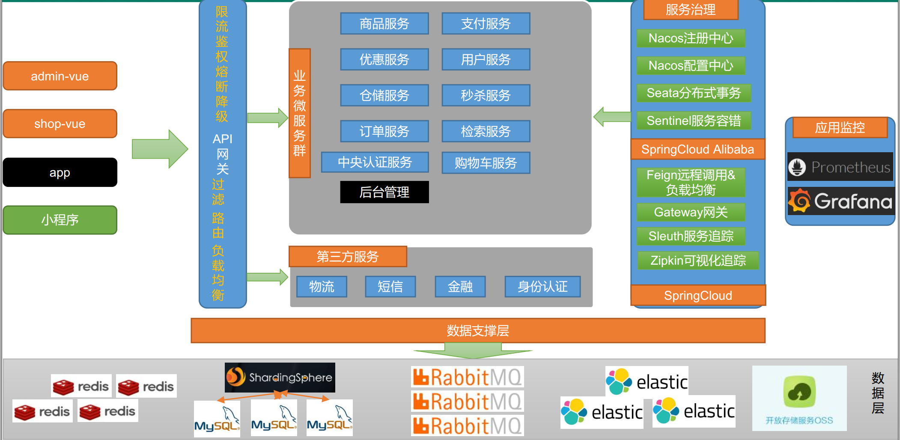

# 2、项目环境搭建

## 2.1. 虚拟机搭建环境

虚拟机VMware、centos7.

## 2.2. Linux安装docker、配置镜像加速

查看是否安装docker：

```
docker
```


```bash
# 1. 卸载之前的docker
 sudo yum remove docker \
                  docker-client \
                  docker-client-latest \
                  docker-common \
                  docker-latest \
                  docker-latest-logrotate \
                  docker-logrotate \
                  docker-engine
                  
# 2.需要的安装包
yum install -y yum-utils

# 3.设置镜像的仓库
yum-config-manager \
    --add-repo \
    https://download.docker.com/linux/centos/docker-ce.repo
# 默认是从国外的，不推荐
# 推荐使用国内的
yum-config-manager \
    --add-repo \
    https://mirrors.aliyun.com/docker-ce/linux/centos/docker-ce.repo
# 更新yum软件包索引
yum makecache 

# 4.安装docker相关的 docker-ce 社区版 而ee是企业版
yum install docker-ce docker-ce-cli containerd.io
# 5、启动docker
docker systemctl start docker
# 6. 使用docker version查看是否按照成功
docker version
```


> docker详解：[SpringCloud基础3——Docker_vincewm的博客-CSDN博客](https://blog.csdn.net/qq_40991313/article/details/126795212?spm=1001.2014.3001.5501)

**配置阿里云镜像加速**

因为docker hub是国外网站，需要配置国内镜像进行加速。

1、登录阿里云找到容器服务

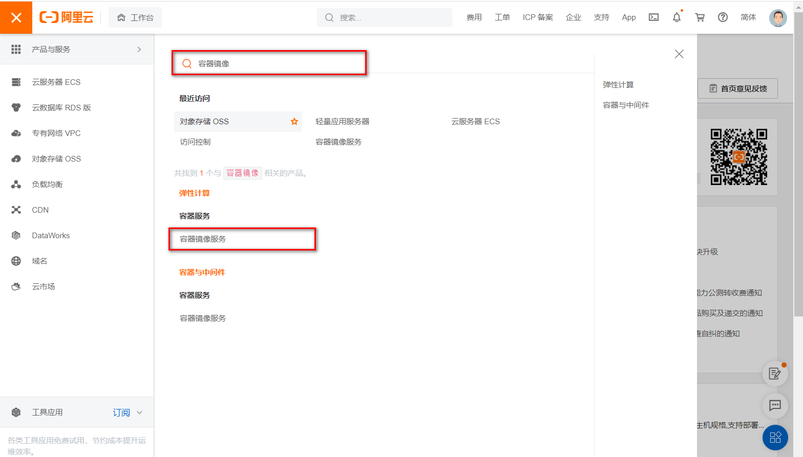

2、找到镜像加速器

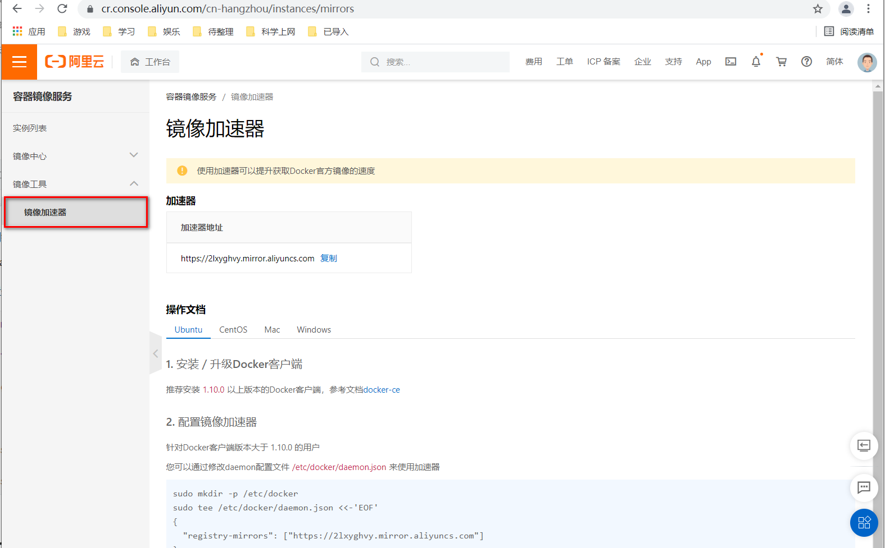

3、配置使用，输入到ssh回车

```bash
sudo mkdir -p /etc/docker

sudo tee /etc/docker/daemon.json <<-'EOF'
{
  "registry-mirrors": ["https://2lxyghvy.mirror.aliyuncs.com"]
}
EOF

sudo systemctl daemon-reload

sudo systemctl restart docker
```


## 2.3. docker配置mysql、设置自启动

### 2.3.**1、安装mysql5.7**

```bash
docker pull mysql:5.7.25

# 运行容器
sudo docker run -p 3306:3306 --name mysql01 \
-v /mydata/mysql/log:/var/log/mysql \
-v /mydata/mysql/data:/var/lib/mysql \
-v /mydata/mysql/conf:/etc/mysql \
-e MYSQL_ROOT_PASSWORD=1234 \
-d mysql:5.7.25
# 参数说明 -p 3312:3306 将容器的3306端口映射到主机的3312端口
# -v 宿主机文件目录:容器内目录  将容器内文件挂载到宿主机上
# -e MYSQL_ROOT_PASSWORD=root 设置mysql密码为root
# -d 后台启动
# --name 给启动容器起名字

# 使用docker ps 查看启动的容器
```


### 2.3.**2、修改mysql配置文件**

```bash
# 进入配置文件挂载的目录下
cd /mydata/mysql/conf

# 配置文件my.cnf
vim my.cnf
```


主要修改编码为utf8

```bash
# 新增配置文件内容
[client]
default-character-set=utf8
[mysql]
default-character-set=utf8
[mysqld]
init_connect='SET collation_connection = utf8_unicode_ci'
init_connect='SET NAMES utf8'
character-set-server=utf8
collation-server=utf8_unicode_ci
skip-character-set-client-handshake
skip-name-resolve
```


```bash
# 修改配置文件之后，重启容器
docker restart mysql01
```


**设置自启动：** 

```bash
docker update mysql01 --restart=always
```


## 2.4. docker配置redis并设置持久化

如果直接挂载的话docker会以为挂载的是一个目录，所以我们先创建一个文件然后再挂载，在虚拟机中。

```bash
# 1、创建配置文件
mkdir -p /mydata/redis/conf
touch /mydata/redis/conf/redis.conf
```


```bash
# 2、下载镜像
docker pull redis
```


```bash
# 3、启动容器
docker run -p 6379:6379 --name redis \
-v /mydata/redis/data:/data  \
-v /mydata/redis/conf/redis.conf:/etc/redis/redis.conf \
-d redis redis-server /etc/redis/redis.conf
```


```bash
# 4、进入redis客户端
docker exec -it redis redis-cli
```


修改redis配置文件

```bash
vi /mydata/redis/conf/redis.conf
```


**aof持久化方式、或设置密码，如果配置后无法打开redis，尝试删除注释**

```bash
appendonly yes
#requirepass xxxxxx # 配置redis密码
```


```bash
# 保存
docker restart redis

# 进入redis客户端
docker exec -it redis redis-cli
#auth xxxxxx #如果有设置密码
```


> **回顾aof和rdb持久化方式：**
>
> [SpringCloud基础7——Redis分布式缓存_vincewm的博客-CSDN博客](https://blog.csdn.net/qq_40991313/article/details/126912298?spm=1001.2014.3001.5501)

设置redis容器在docker启动的时候启动

```bash
docker update redis --restart=always
```


**安装redis-desktop-manager-0.8.8.384并连接**

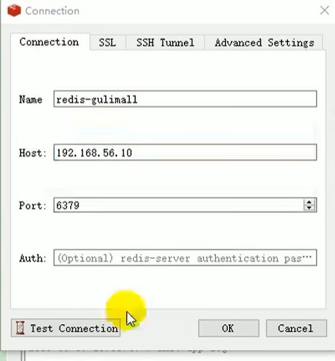

## 2.5. jdk、maven镜像、idea插件

首先安装jdk11、maven

```
java -version
mvn -version
```


maven3.6.1下载：

```
https://maven.apache.org/download.cgi
```


在/usr/local/ 下上传：

```
cd /usr/local/ 
```


解压：

```
tar -zxvf apache-maven-3.6.1-bin.tar.gz
```


配置maven的阿里云镜像、jdk11

```bash
cd apache-maven-3.6.1   #进入apache-maven-3.6.1目录
mkdir ck    #创建ck目录
cd conf            # 进入conf目录
vi settings.xm # settings.xm文件
```


修改对应标签：

```XML
  <mirrors> 
	<mirror>
	<id>nexus-aliyun</id>
	<mirrorOf>central</mirrorOf>
	<name>Nexus aliyun</name>
	<url>http://maven.aliyun.com/nexus/content/groups/public</url>
	</mirror>
  </mirrors>


 <profiles>
    <id>jdk-11</id>
    <activation>
        <activeByDefault>true</activeByDefault>
        <jdk>11</jdk>
    </activation>
    <properties>
        <project.build.sourceEncoding>UTF-8</project.build.sourceEncoding>
        <maven.compiler.source>11</maven.compiler.source>
        <maven.compiler.target>11</maven.compiler.target>
        <maven.compiler.compilerVersion>11</maven.compiler.compilerVersion>
    </properties>
  </profiles>
```


**IDEA安装插件mybatisX。**

## 2.6. vscode的安装、插件、配置

### 2.6.1、安装vscode和插件 

下载地址[Download Visual Studio Code - Mac, Linux, Windows](https://code.visualstudio.com/Download)

vscode用于**前端管理系统**，在vsCode里**安装以下插件**

- Auto Close Tag
- Auto Rename Tag
- Chinese
- ESlint
- HTML CSS Support
- HTML Snippets
- JavaScript ES6
- Live Server
- open in brower
- Vetur

2.6.2、**关闭Eslink强检查**

打开vue项目/build/webpack.base.conf.js，注释：

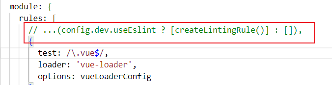

这样就能少去很多没必要的报错，例如.vue注释空格报错

### 2.6.3、 禁止运行项目后自动打开浏览器

vue项目运行命令npm run dev导致自动打开浏览器

**解决办法：** 

1、在config文件夹找到index.js文件夹
 2、把autoOpenBrowser: true
 3、改为autoOpenBrowser: false 

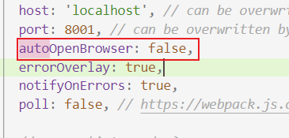

## 2.7. 初始化项目架构、创建仓库并提交GitHub

> 我项目初始化的时候，没有按照雷神用Spring Boot Initilizr。而是按照周阳在springcloud课程里面手动依赖管理的方式初始化的项目。

### 2.7.**1、码云创建Maven仓库，git克隆父工程**

**码云创建Maven仓库**

设置Maven开发模板；分支类型为“生产、开发模型” ，使开发分支时用dev分支，发布后使用master分支：

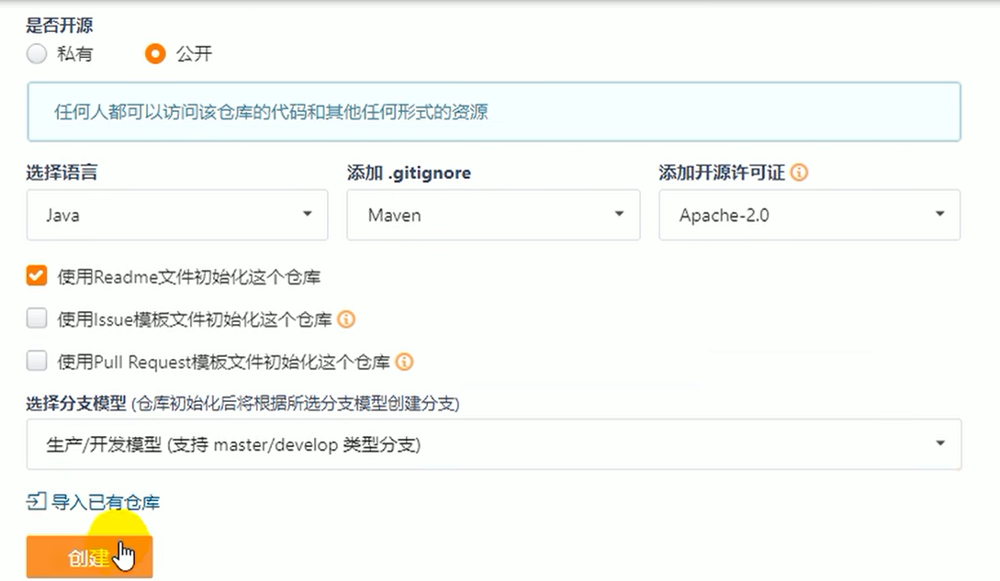

**通过仓库地址克隆项目到本地：**

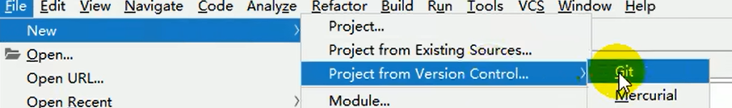

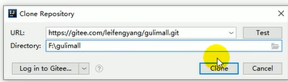


### 2.7.**2、新建子模块、**

- **gulimall-xxx(product/order/ware/coupon/member)**
- 每一个子模块的包名为com.xmh.gulimall.xxx(product/order/ware/coupon/member)
- 并在每个子模块下引入web、openfegin

新建maven模块 gulimall-xxx，导入依赖pom.xml

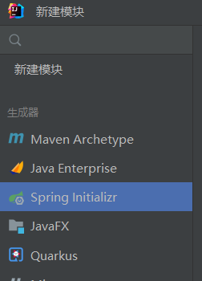


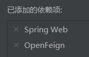

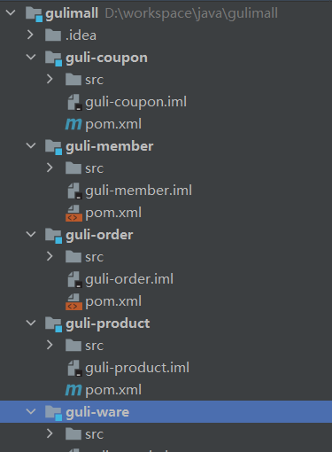

导入依赖

```XML
    <dependencies>
        <!--openfeign-->
        <dependency>
            <groupId>org.springframework.cloud</groupId>
            <artifactId>spring-cloud-starter-openfeign</artifactId>
        </dependency>
        <!--web-->
        <dependency>
            <groupId>org.springframework.boot</groupId>
            <artifactId>spring-boot-starter-web</artifactId>
        </dependency>
        <dependency>
            <groupId>org.springframework.boot</groupId>
            <artifactId>spring-boot-starter-actuator</artifactId>
        </dependency>
    </dependencies>
```


**父工程的pom.xml，并把父工程添加到maven**

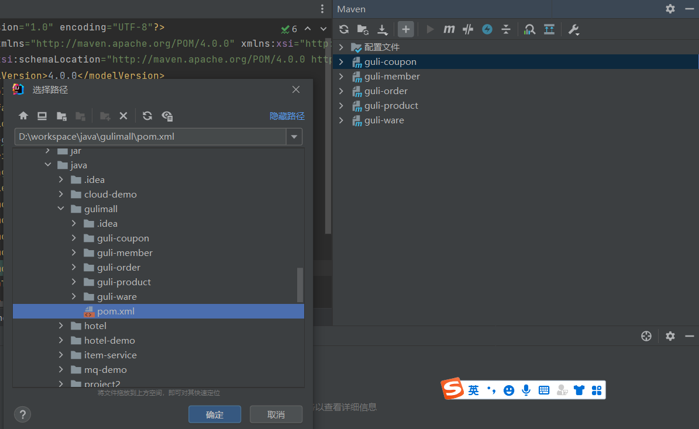

### 2.7.**3、过滤上传git的垃圾文件**

- 点开父工程的.gitignore文件，添加如下内容

```
**/mvnw
**/mvnw.cmd

**/.mvn
**/target/

.idea

**/.gitignore
```


> 也可以直接把这些文件删除，这些文件是用不到的 

### 2.7.**4、右键项目提交**

先右键项目-git-add，然后提交本地库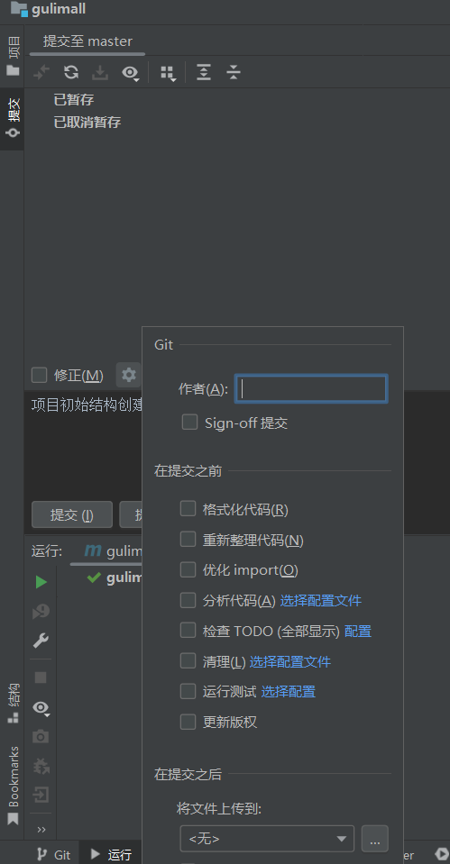

填写提交信息、点击commit

### 2.7.**5、创建仓库并推送GitHub**

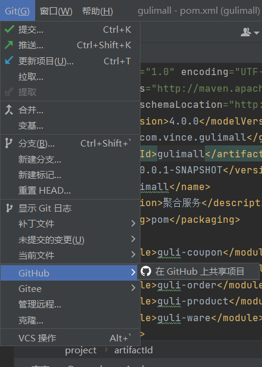

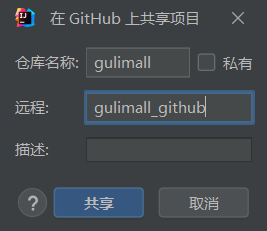

## 2.8. 导入MySQL数据库表

> **注意：**所有数据库表是**没有外键的**，商城项目外键复杂影响性能。


**0.使用powerDesigner设计表：**

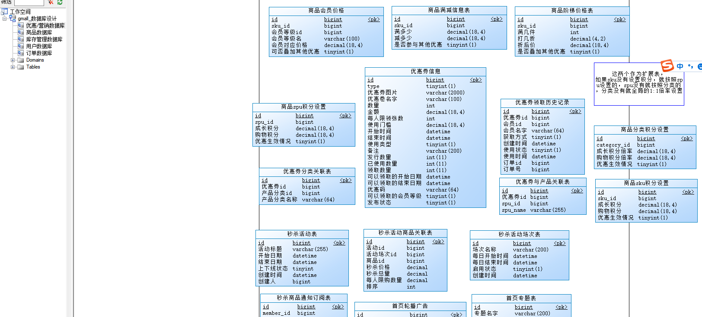

**1.创建数据库**gulimall_oms,gulimall_pms,gulimall_sms,gulimall_ums,gulimall_wms，基字符集选择utf8mb4

2.使用Navicat或SQLyog分别创建五个数据库，编码utf8mb4。

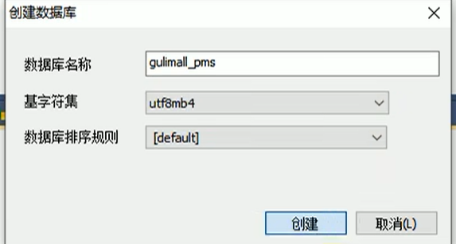

 3.双击打开数据库，新建查询，将sql语句复制粘贴运行：

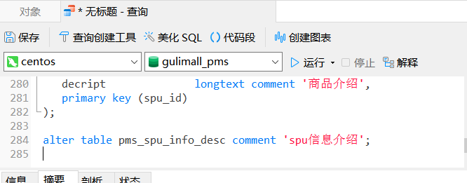


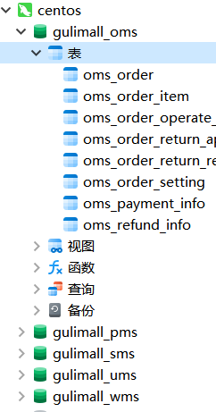

随便点开一个表，发现没有中文乱码：

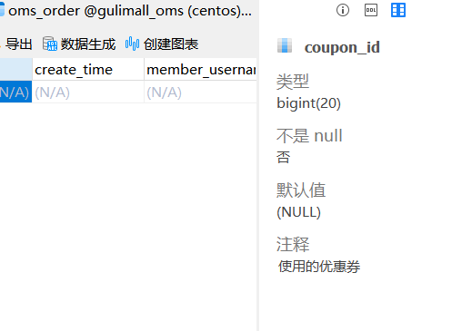


> **注意：**不能将对应sql文件拉进点开的数据库自动运行sql语句，因为sql文件编码是gbk，直接拖进去会导致中文乱码

# 3、快速开发

## 3.1. “人人开源”，快速构建后台管理系统

### 3.1.**1、克隆人人开源fast项目**

**码云上搜索人人开源，找到renren-fast(后台管理系统的后端)，renren-fast-vue(后台管理系统的前端), 克隆到本地。**

[人人开源](https://gitee.com/renrenio)

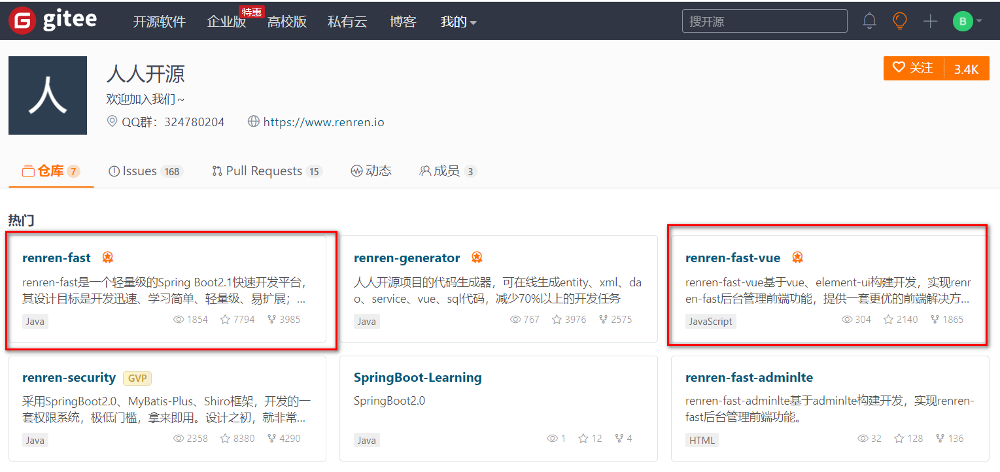

> - **renren-fast**是一个轻量级的，前后端分离的Java快速开发平台，能快速开发项目并交付
> - **renren-fast-vue**基于vue、element-ui构建开发，实现[renren-fast](https://gitee.com/renrenio/renren-fast)后台管理**前端功能**，提供一套更优的前端解决方案
> - renren-security是一个轻量级的，前后端分离的Java快速开发平台，能快速开发项目并交付
> - **renren-generator**是人人开源项目的代码生成器，可在线**生成基础增删改查相关的entity、xml、dao、service、html、js、sql代码**，减少70%以上的开发任务，

**克隆：**

桌面右键git bash克隆两个项目：

```bash
git clone https://gitee.com/renrenio/renren-fast.git
git clone https://gitee.com/renrenio/renren-fast-vue.git
```


### 3.1.**2、删掉两个文件夹里的.git文件夹**

### 3.1.**3、把renren-fast复制到子模块，并加入父工程**

**把后端renren-fast文件夹复制到谷粒商城项目中并加入父工程：**


```XML
<?xml version="1.0" encoding="UTF-8"?>
<project xmlns="http://maven.apache.org/POM/4.0.0" xmlns:xsi="http://www.w3.org/2001/XMLSchema-instance"
         xsi:schemaLocation="http://maven.apache.org/POM/4.0.0 https://maven.apache.org/xsd/maven-4.0.0.xsd">
    <modelVersion>4.0.0</modelVersion>
    <groupId>com.vince.gulimall</groupId>
    <artifactId>gulimall</artifactId>
    <version>0.0.1-SNAPSHOT</version>
    <name>gulimall</name>
    <description>聚合服务</description>
    <packaging>pom</packaging>
    <modules>
        <module>guli-coupon</module>
        <module>guli-member</module>
        <module>guli-order</module>
        <module>guli-product</module>
        <module>guli-ware</module>
        <module>renren-fast</module>
    </modules>
</project>
```


然后在idea项目结构里设置项目jdk为11，把renren_fast的pom里jdk改为11：


### 3.1.**4、renren-fast的pom修改**


- **pom.xml报错**

```
'parent.relativePath' of POM io.renren:renren-fast:3.0.0
```


报错原因：子模块的parent写的并不是子模块的上一级，而是继承了springboot

解决方法：**将其他模块pom的parent复制粘贴到renren-fast的pom**

```XML
	<parent>
		<groupId>org.springframework.boot</groupId>
		<artifactId>spring-boot-starter-parent</artifactId>
		<version>2.7.3</version>
		<relativePath/> <!-- lookup parent from repository -->
	</parent>
```


- **如果pom.xml之中的plugin地方报错，引入相关依赖**

```XML
<!-- https://mvnrepository.com/artifact/com.spotify/docker-maven-plugin -->
<dependency>
   <groupId>com.spotify</groupId>
   <artifactId>docker-maven-plugin</artifactId>
   <version>0.4.14</version>
</dependency>

<dependency>
	<groupId>org.codehaus.mojo</groupId>
	<artifactId>wagon-maven-plugin</artifactId>
	<version>1.0</version>
</dependency>
```


### 3.1.**5、创建后台管理系统的数据库gulimall_admin**

sql文件在renren-fast/db/ 目录下，找到其中的mysql.sql 复制，运行。

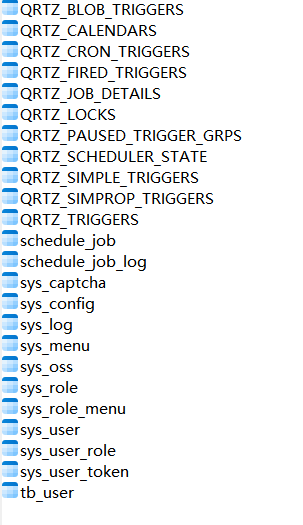


### 3.1.**6、修改renren-fast的配置文件，设置数据库**

查看application.yml，发现当前环境为dev

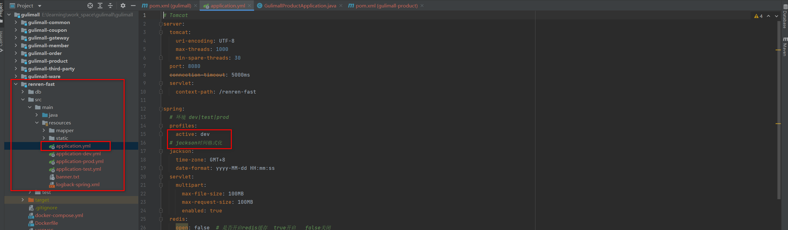

**修改application-dev.yml**, 配置成自己的linux的数据库信息，别忘了数据库名为gulimall_admin：

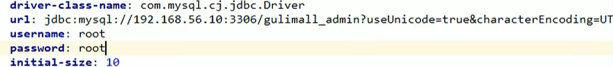

>  如果报错ssl错误，在url后面加&useSSL=false


### 3.1.**7、启动和访问**

```XML
http://localhost:8080/renren-fast/
```


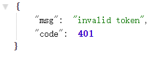


测试成功

### 3.1.**8、node.js运行前端项目**

**安装node.js** 

下载地址https://nodejs.org/dist/v10.16.3/，下载之后直接安装即可。安装后检查node.js

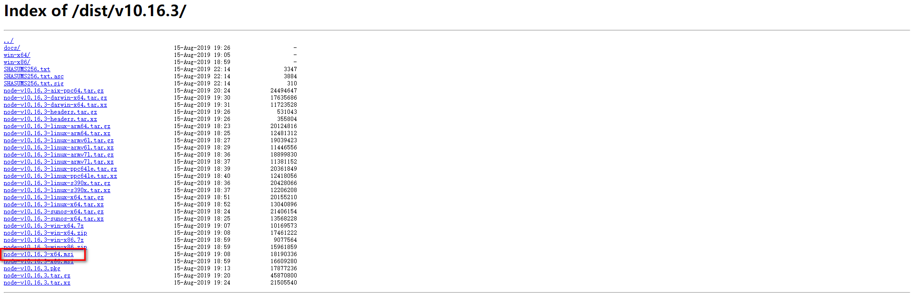

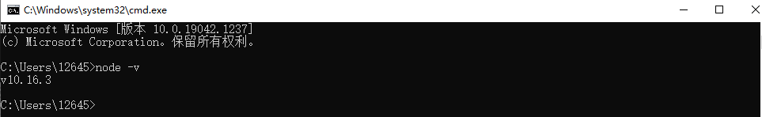

配置淘宝镜像

```
npm config set registry http://registry.npm.taobao.org/
```


设置node-sass版本：

```
npm install  node-sass@4.14
```


> **注意：一定要保证nodejs版本和node-sass匹配，不想浪费时间就下载我前面指定的版本。**
>
> 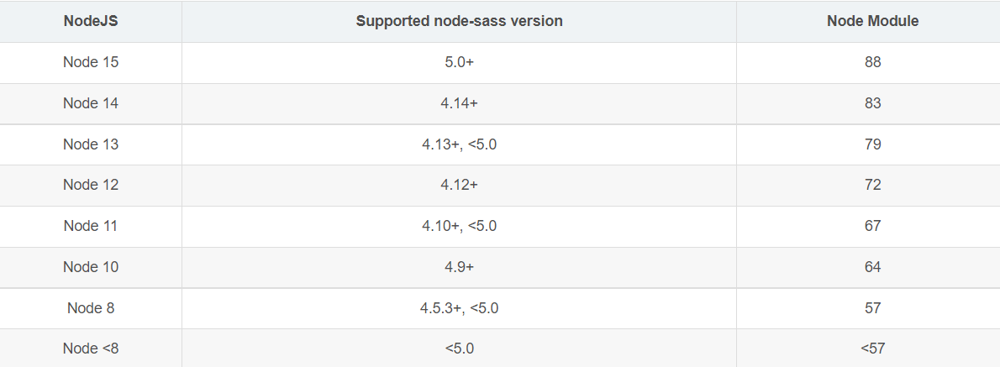

**加载项目依赖并运行项目：**

运行vue项目之前，运行npm install命令，加载项目依赖

点击左下角打开控制台、点击终端 ：

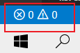


**安装npm依赖**

```XML
npm install
```


**运行项目** 

```XML
npm run dev
```


> **报错解决：**
>
> 如果npm install卡着不动，重启windows、管理员cmd窗口试试。
>
> 版本很重要，建议下载我前面的版本。
>
> **为什么运行命令是npm run dev?**
>
> 在项目目录下，我们可以看到一个名为package.json的文件，该文件是对项目、模块包的描述，在package.json文件中，有一个scripts的字段:
>
> ```javascript
>   "scripts": {
>     "dev": "webpack-dev-server --inline --progress --config build/webpack.dev.conf.js",
>     "start": "npm run dev",
>     "build": "node build/build.js"
>   },
> ```
>
> 
>
> 修改后运行命令就是npm run serve：
>
> ```javascript
> // 运行npm run serve的scripts字段
>   "scripts": {
>     "serve": "vue-cli-service serve",
>     "build": "vue-cli-service build",
>     "lint": "vue-cli-service lint"
>   },
> ```
>
> 

运行成功:

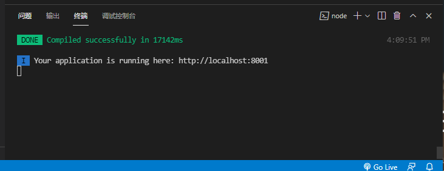

访问http://localhost:8001，测试成功，账号密码是admin、admin。

> **报错解决：**
>
> 如果不显示验证码是因为后台没有运行成功、检查idea是否数据库报错、检查虚拟机docker ps数据库是否运行。
>
> 另外centos默认会隔一两天自动改ip地址，想关闭参考下面文章的2.6：
>
> [Linux基础_vincewm的博客-CSDN博客_finalshell 进程查看](https://blog.csdn.net/qq_40991313/article/details/126722369?spm=1001.2014.3001.5501)


## 3.2. product模块的逆向工程搭建，人人开源代码生成器

### 3.2.**1、克隆renren-generator**

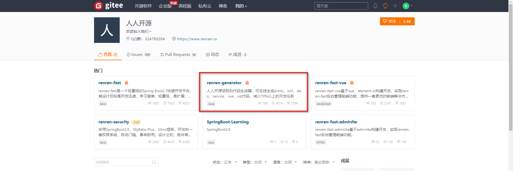

```XML
git clone https://gitee.com/renrenio/renren-generator.git
```


### 3.2.2、删除.git文件并导入到父工程中

**删除其中的.git文件，复制到父工程中，父工程pom.xml中添加代码生成器为子模块** 

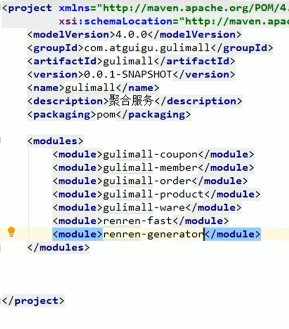

### 3.2.**3、修改生成器模块的pom** 

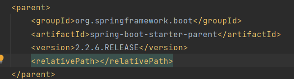

### 3.2.4、修改生成器模块配置文件的数据库信息

**修改renren-generator的配置文件application.yml，配置自己的数据源,注意修改数据库名gulimall_pms（生成商品系统）**

先生成gulimall-pms商品系统，就数据库名为商品系统的数据库表

```bash
spring:
  datasource:
    type: com.alibaba.druid.pool.DruidDataSource
    #MySQL配置
    driverClassName: com.mysql.cj.jdbc.Driver
    url: jdbc:mysql://192.168.xxx.xxx:3306/gulimall_pms?useUnicode=true&characterEncoding=UTF-8&serverTimezone=Asia/Shanghai&useSSL=false
    username: root
    password: 1234
```


> **踩坑：**ssl报错就在url后面加&useSSL=false、数据库连接出错检查虚拟机开机情况、数据库信息填写错误

### 3.2.**5、修改生成信息generator.properties**

这里先配置商品的相关信息：

> 注意只修改下面内容，**其他内容不用变。**

```bash
#代码生成器，配置信息

mainPath=com.vince
#包名
package=com.vince.gulimall
moduleName=product
#作者
author=vince
#Email
email=xxxxx@qq.com
#表前缀(类名不会包含表前缀)
tablePrefix=pms_
```


如果引入spring-boot-starter-parent 2.2.6.RELEASE爆红，参考问题2

### 3.2.6、controller模板中去掉@RequiresPermissions注解

**修改src/main/resources/template/Controller.java.vm**

删除导入@RequiresPermissions注解的语句

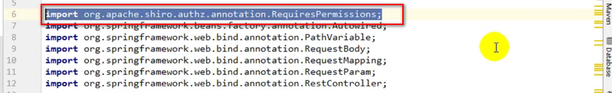

注释掉该位置，此处的注释是shiro提供的，我们以后要用spring security

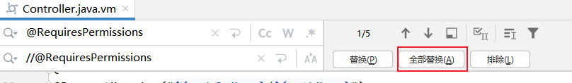

> **注意：这里注释要用//**，ctrl+/的注释是#。 

### 3.2.7、**运行项目并生成代码**

访问localhost:80，选中所有表，生成代码

选择每页显示30条后，再全选生成 

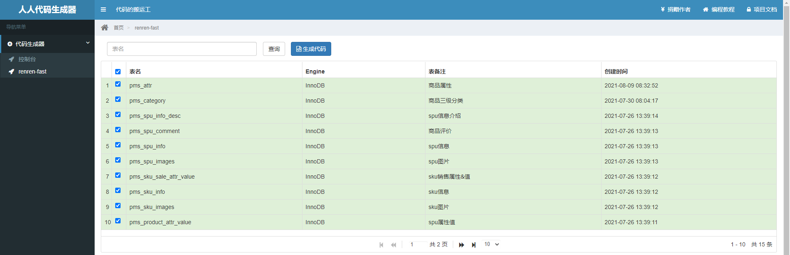

> **注意：**如果表备注里中文乱码，重写运行sql文件里的语句， 复制粘贴运行，因为sql文件编码是gbk

### 3.2.8、解压生成代码并复制到guli-product

**解压生成的代码，把mian文件夹复制到guli-product/src下**

删除前端代码：\resources\src\（前端文件，用不到）

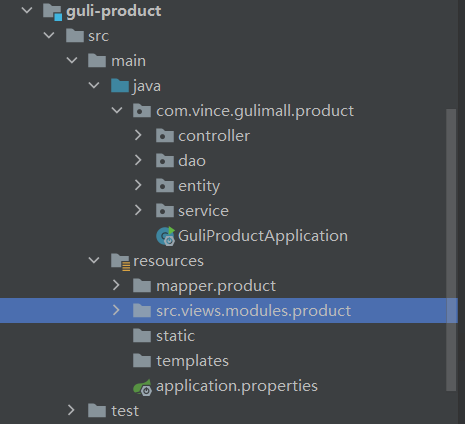


> 如果之前没有创建application.yml和启动类，手动创建

### 3.2.**9、新建common模块，解决生成代码报错问题**

**新建gulimall-common**的Maven模块，用来引入每一个微服务公共的依赖、bean、工具类等

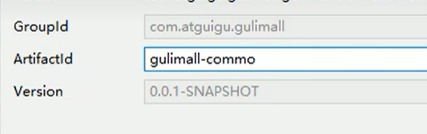

**让所有gulimall-xxx的pom引用guli-common的依赖：**
 

```XML
        <dependency>
            <groupId>com.vince.gulimall</groupId>
            <artifactId>gulimall-ware</artifactId>
            <version>0.0.1-SNAPSHOT</version>
        </dependency>
```


**在gulimall-common引入公共依赖**


```XML
<?xml version="1.0" encoding="UTF-8"?>
<project xmlns="http://maven.apache.org/POM/4.0.0"
         xmlns:xsi="http://www.w3.org/2001/XMLSchema-instance"
         xsi:schemaLocation="http://maven.apache.org/POM/4.0.0 http://maven.apache.org/xsd/maven-4.0.0.xsd">
    <parent>
        <artifactId>gulimall</artifactId>
        <groupId>com.vince.gulimall</groupId>
        <version>0.0.1-SNAPSHOT</version>
    </parent>
    <modelVersion>4.0.0</modelVersion>

    <groupId>com.vince.gulimall</groupId>
    <artifactId>gulimall-common</artifactId>
    <version>0.0.1-SNAPSHOT</version>

    <!-- 统一管理jar包版本 -->
    <properties>
        <maven.compiler.source>11</maven.compiler.source>
        <maven.compiler.target>11</maven.compiler.target>
        <mybatis-plus.version>3.4.1</mybatis-plus.version>
        <lombok.version>1.18.8</lombok.version>
        <httpcore.version>4.4.14</httpcore.version>
        <commons.lang.version>2.6</commons.lang.version>
        <jakarta.validation.api>2.0.2</jakarta.validation.api>
    </properties>

    <dependencies>
        <dependency>
            <groupId>com.baomidou</groupId>
            <artifactId>mybatis-plus-boot-starter</artifactId>
            <version>${mybatis-plus.version}</version>
        </dependency>
        <dependency>
            <groupId>org.projectlombok</groupId>
            <artifactId>lombok</artifactId>
            <version>${lombok.version}</version>
        </dependency>
        <dependency>
            <groupId>org.apache.httpcomponents</groupId>
            <artifactId>httpcore</artifactId>
            <version>${httpcore.version}</version>
        </dependency>
        <dependency>
            <groupId>commons-lang</groupId>
            <artifactId>commons-lang</artifactId>
            <version>${commons.lang.version}</version>
        </dependency>
        <dependency>
            <groupId>jakarta.validation</groupId>
            <artifactId>jakarta.validation-api</artifactId>
            <version>${jakarta.validation.api}</version>
            <scope>compile</scope>
        </dependency>

        <dependency>
            <groupId>javax.servlet</groupId>
            <artifactId>servlet-api</artifactId>
            <version>2.5</version>
            <scope>provided</scope>
        </dependency>
        <dependency>
            <groupId>mysql</groupId>
            <artifactId>mysql-connector-java</artifactId>
            <version>8.0.28</version>
        </dependency>
        <dependency>
            <groupId>com.alibaba.cloud</groupId>
            <artifactId>spring-cloud-starter-alibaba-nacos-discovery</artifactId>
        </dependency>
        <dependency>
            <groupId>com.alibaba.cloud</groupId>
            <artifactId>spring-cloud-starter-alibaba-nacos-config</artifactId>
        </dependency>
    </dependencies>
    <dependencyManagement>
        <dependencies>
            <dependency>
                <groupId>com.alibaba.cloud</groupId>
                <artifactId>spring-cloud-alibaba-dependencies</artifactId>
                <version>2021.0.1.0</version>
                <type>pom</type>
                <scope>import</scope>
            </dependency>
        </dependencies>
    </dependencyManagement>
</project>
```


> **注意SpringCloud和springboot和版本兼容问题**，不匹配就是给后面埋雷，建议用老师的版本或我的版本。我这里版本都是最新的，springboot版本2.7.4，SpringCloud版本2021.0.4，SpringCloudAlibaba版本2021.0.1.0

> | Release Train                                                | Boot Version                          |
> | ------------------------------------------------------------ | ------------------------------------- |
> | [2021.0.x](https://github.com/spring-cloud/spring-cloud-release/wiki/Spring-Cloud-2021.0-Release-Notes) aka Jubilee | 2.6.x, 2.7.x (Starting with 2021.0.3) |
> | [2020.0.x](https://github.com/spring-cloud/spring-cloud-release/wiki/Spring-Cloud-2020.0-Release-Notes) aka Ilford | 2.4.x, 2.5.x (Starting with 2020.0.3) |
> | [Hoxton](https://github.com/spring-cloud/spring-cloud-release/wiki/Spring-Cloud-Hoxton-Release-Notes) | 2.2.x, 2.3.x (Starting with SR5)      |
> | [Greenwich](https://github.com/spring-projects/spring-cloud/wiki/Spring-Cloud-Greenwich-Release-Notes) | 2.1.x                                 |
> | [Finchley](https://github.com/spring-projects/spring-cloud/wiki/Spring-Cloud-Finchley-Release-Notes) | 2.0.x                                 |
> | [Edgware](https://github.com/spring-projects/spring-cloud/wiki/Spring-Cloud-Edgware-Release-Notes) | 1.5.x                                 |
> | [Dalston](https://github.com/spring-projects/spring-cloud/wiki/Spring-Cloud-Dalston-Release-Notes) | 1.5.x                                 |
>
> | Spring Cloud Alibaba Version | Spring Cloud Version  | Spring Boot Version |
> | ---------------------------- | --------------------- | ------------------- |
> | 2021.0.4.0*                  | Spring Cloud 2021.0.4 | 2.6.11              |
> | 2021.0.1.0                   | Spring Cloud 2021.0.1 | 2.6.3               |
> | 2021.1                       | Spring Cloud 2020.0.1 | 2.4.2               |

**从renren-fast模块的common包下，复制粘贴这些包和类：**


 **然后把引入上面这些类的报错文件中**，重新导入，例如：


```java
import io.renren.common.xss.SQLFilter;
```


改成 

```java
import com.vince.common.xss.SQLFilter;
```


> **如果第六步没有删除在controller模板中删除@RequiresPermissions注解：**
>
> ctrl+x删除gulimall-product里所有controller中的@RequiresPermissions注解
>
> ```java
> import org.apache.shiro.authz.annotation.RequiresPermissions;
> @RequiresPermissions("product:attr:list")
> ```
>
> 
>
> 现在所有报错都已经清理完毕。 
>
> 如果之前注释了controller模板（在renren-generator的resources-template-Controller.java.vm里）里的@RequiresPermissions注解，这里就不用删除了。

### 3.2.10、结果类R使用方式

上面解决报错问题后，common模块的utils包下有个结果类R：

```java
public class R extends HashMap<String, Object> {
	private static final long serialVersionUID = 1L;
	
	public R() {
		put("code", 0);
		put("msg", "success");
	}
	
	public static R error() {
		return error(HttpStatus.SC_INTERNAL_SERVER_ERROR, "未知异常，请联系管理员");
	}
	
	public static R error(String msg) {
		return error(HttpStatus.SC_INTERNAL_SERVER_ERROR, msg);
	}
	
	public static R error(int code, String msg) {
		R r = new R();
		r.put("code", code);
		r.put("msg", msg);
		return r;
	}

	public static R ok(String msg) {
		R r = new R();
		r.put("msg", msg);
		return r;
	}
	
	public static R ok(Map<String, Object> map) {
		R r = new R();
		r.putAll(map);
		return r;
	}
	
	public static R ok() {
		return new R();
	}

	public R put(String key, Object value) {
		super.put(key, value);
		return this;
	}
}
```


**controller使用方法：**

返回成功数据：

```
return R.ok().put("data", (Object)"响应的数据");
```


返回错误数据：

```
return R.error(500,"错误消息，在msg里").put("data",(Object)"错误数据，在data里，常为List<String>，存多个错误原因");
```


### 3.2.11、配置yml和添加mysql依赖，测试CRUD

**common模块的pom.xml加入依赖：**

```XML
        <dependency>
            <groupId>mysql</groupId>
            <artifactId>mysql-connector-java</artifactId>
            <version>8.0.28</version>
        </dependency>
```


**product模块的****application.yml**

```bash
server:
  port: 10000
spring:
  datasource:
    username: root
    password: 1234
    url: jdbc:mysql://xxxx:3306/gulimall_pms?userUnicode=true&characterEncoding=UTF-8&useSSL=false&serverTimezone=Asia/Shanghai
    driver-class-name: com.mysql.jdbc.Driver

mybatis-plus:
  configuration:
    #数据库下划线和实体类驼峰统一
    map-underscore-to-camel-case: true
    log-impl: org.apache.ibatis.logging.stdout.StdOutImpl
  global-config:
    db-config:
      id-type: auto
    banner: false
  #告诉mp，sql映射文件的位置，默认值classpath*:/mapper/**/*.xml。
#  classpath表示只引用现在模块的类路径。lasspath*表示不止引用现在模块的类路径，还包括依赖jar包的类路径
  mapper-locations: classpath:/mapper/**/*.xml
```


**3、测试**

- 新建测试类

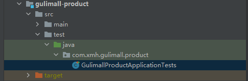

- 测试

  ```java
  @SpringBootTest
  class GulimallProductApplicationTests {
  
      @Autowired
      BrandService brandService;
  
      @Test
      public void testBrand(){
          BrandEntity brandEntity = new BrandEntity();
          brandEntity.setName("华为");
          brandService.save(brandEntity);
          System.out.println("保存成功");
          List<BrandEntity> list = brandService.list(new LambdaQueryWrapper<BrandEntity>().eq(BrandEntity::getName, "华为"));
          System.out.println(list);
      }
  
  }
  ```

  

  

  

- 运行项目，访问[http://localhost:10000/product/brand/list](http://localhost:8080/product/brand/list)

  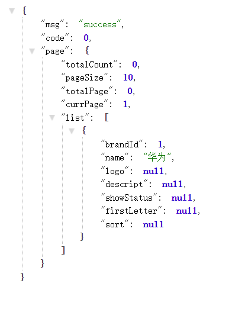

  同方法测试删改。

## 3.3 其他模块的逆向工程搭建，人人开源

### 3.3.6、各模块创建yml，设置端口号

按照字母序从上往下配置，coupon是7000，member是8000，order是9000，product是10000，ware是11000。 


### **3.3.1、修改生成器properties和yml，生成coupon模块代码**

**修改生成器配置，模块名和表前缀：** 

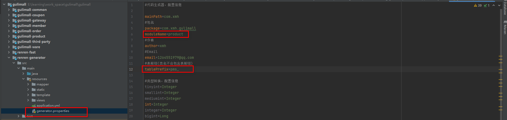


```bash
#代码生成器，配置信息

mainPath=com.vince
#包名
package=com.vince.gulimall
moduleName=coupon
#作者
author=vince
#Email
email=xxx@qq.com
#表前缀(类名不会包含表前缀)
tablePrefix=sms_
```


**修改yml的数据库名** 

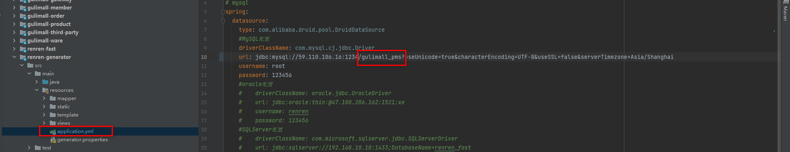

运行生成器模块，访问http://localhost/

每页显示100条、全选生成：

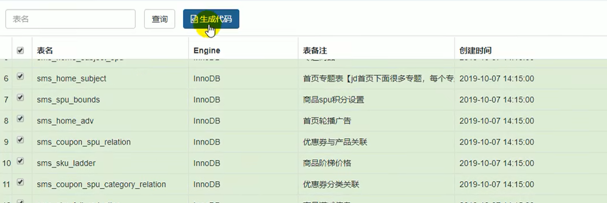


### **3.3.2、复制粘贴生成代码，引入common模块依赖**

**生成coupon的代码，main文件夹复制到工程中，并在gulimall-coupon工程中引入gulimall-common依赖**

```XML
        <dependency>
            <groupId>com.vince.gulimall</groupId>
            <artifactId>gulimall-common</artifactId>
            <version>0.0.1-SNAPSHOT</version>
        </dependency>
```


### **3.3.3、创建yml，删除resources的src文件夹**

从product复制过去，只需要修改数据库名字。

```bash
server:
  port: 7000
spring:
  datasource:
    username: root
    password: 1234
    url: jdbc:mysql://xxxx.134:3306/gulimall_sms?userUnicode=true&characterEncoding=UTF-8&useSSL=false&serverTimezone=Asia/Shanghai
    driver-class-name: com.mysql.jdbc.Driver

mybatis-plus:
  configuration:
    #数据库下划线和实体类驼峰统一
    map-underscore-to-camel-case: true
    log-impl: org.apache.ibatis.logging.stdout.StdOutImpl
  global-config:
    db-config:
      id-type: auto
    banner: false
  #告诉mp，sql映射文件的位置，默认值classpath*:/mapper/**/*.xml。
  #  classpath表示只引用现在模块的类路径。lasspath*表示不止引用现在模块的类路径，还包括依赖jar包的类路径
  mapper-locations: classpath:/mapper/**/*.xml
```


**删除resources下的src**

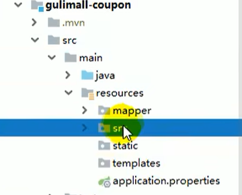


### **3.3.4、运行测试**

**访问**[http://localhost:7000/coupon/coupon/list](http://localhost:8080/coupon/coupon/list)**测试**

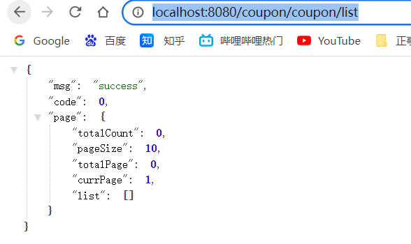


测试成功！

### **3.3.5、同方法生成gulimall-member/gulimall-order/gulimall-ware的代码**

**生成：**

修改generator.**properties**的模块名和表前缀（ums_,oms_,wms_）、**yml**数据库名、**运行**生成器模块，访问http://localhost/

每页显示100条、全选生成。

**配置生成后的模块：**

复制粘贴生成代码，**pom**引入common模块依赖、**yml**修改数据库名、**删除**resources下的src

> ware模块多一条，删除这三个实体类和对应的dao、service、controller、resources.mapper.ware
>
>  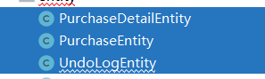

**测试：** 

测试member、ums：http://localhost:8000/member/growthchangehistory/list

测试order、oms：http://localhost:9000/order/order/list

测试ware、wms： http://localhost:11000/ware/wareinfo/list