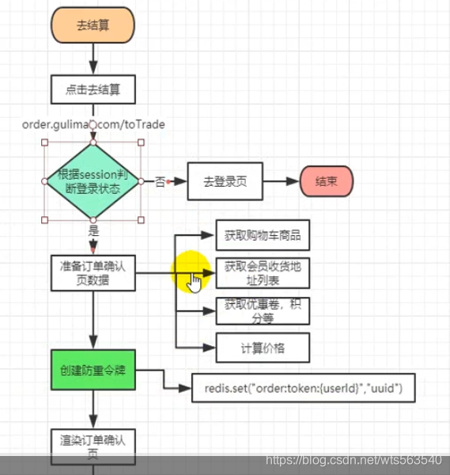
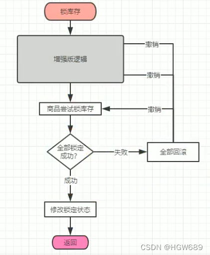
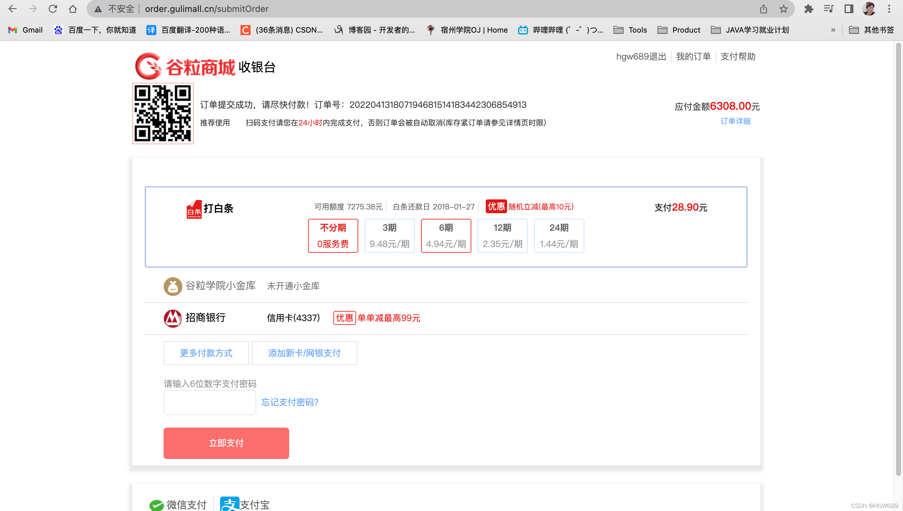
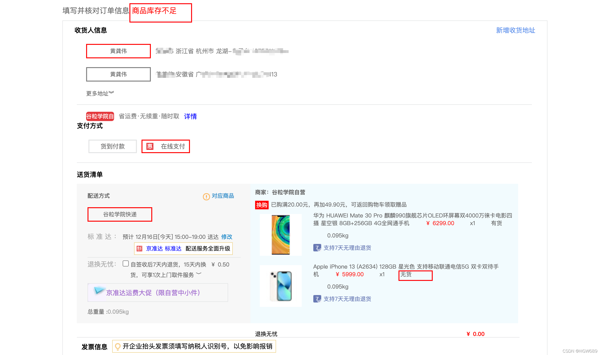
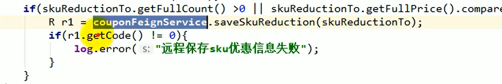
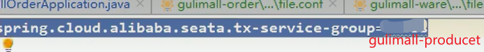

>  **导航：**
>
> [谷粒商城笔记+踩坑汇总篇](https://blog.csdn.net/qq_40991313/article/details/127099139?spm=1001.2014.3001.5501)
>
>  **Java笔记汇总：**
>
> [【Java笔记+踩坑汇总】Java基础+JavaWeb+SSM+SpringBoot+SpringCloud+瑞吉外卖/谷粒商城/学成在线+设计模式+面试题汇总+性能调优/架构设计+源码解析-CSDN博客](https://blog.csdn.net/qq_40991313/article/details/126646289)

[TOC]


# 1、环境准备

## 1.1、业务流程



## 1.2、Controller 层编写下单功能接口

订单服务 `com.atguigu.gulimall.order.web` 路径下的 OrderWebController 类，代码如下

```java
/**
 * 下单功能
 * @param vo
 * @return
 */
@PostMapping("/submitOrder")
public String submitOrder(OrderSubmitVo vo, Model model, RedirectAttributes redirectAttributes){
    // 1、创建订单、验令牌、验价格、验库存
    try {
        SubmitOrderResponseVo responseVo = orderService.submitOrder(vo);
        if (responseVo.getCode() == 0) {
            // 下单成功来到支付选择页
            model.addAttribute("submitOrderResp",responseVo);
            return "pay";
        } else {
            // 下单失败回到订单确认页重新确认订单信息
            String msg = "下单失败: ";
            switch ( responseVo.getCode()){
                case 1: msg+="订单信息过期，请刷新再次提交";break;
                case 2: msg+="订单商品价格发生变化，请确认后再次提交";break;
                case 3: msg+="商品库存不足";break;
            }
            redirectAttributes.addAttribute("msg",msg);
            return "redirect:http://order.gulimall.cn/toTrade";
        }
    } catch (Exception e){
        if (e instanceof NoStockException) {
            String message = e.getMessage();
            redirectAttributes.addFlashAttribute("msg", message);
        }
        return "redirect:http://order.gulimall.cn/toTrade";
    }

}
```


## 1.3、订单提交的模型类

------

页面提交数据 添加“com.atguigu.gulimall.order.vo.OrderSubmitVo”类，代码如下：

```java
@Data
@ToString
public class OrderSubmitVo {
    /**
     * 收货地址Id
     */
    private Long addrId;
    /**
     * 支付方式
     */
    private Integer payType;
    // 无需提交需要购买的商品，去购物车再获取一遍
    // 优惠发票
    /**
     * 防重令牌
     */
    private String orderToken;
    /**
     * 应付价格，验价
     */
    private BigDecimal payPrice;
    /**
     * 订单备注
     */
    private String note;

    /**
     * 用户相关信息，直接去Session取出登录的用户
     */
}
```


## 1.4、前端页面 confirm.html 提供数据

```html
<form action="http://order.gulimall.cn/submitOrder" method="post">
   <input id="addrIdInput" type="hidden" name="addrId">
   <input id="payPriceInput" type="hidden" name="payPrice">
   <input type="hidden" name="orderToken" th:value="${orderConfirmData.orderToken}">
   <button class="tijiao" type="submit">提交订单</button>
</form>
```


```java
function getFare(addrId) {
   // 给表单回填的地址
   $("#addrIdInput").val(addrId);
   $.get("http://gulimall.cn/api/ware/wareinfo/fare?addrId="+addrId,function (resp) {
      console.log(resp);
      $("#fareEle").text(resp.data.fare);
      var total = [[${orderConfirmData.total}]]
      // 设置运费信息
      var pryPrice = total*1 + resp.data.fare*1;
      $("#payPriceEle").text(pryPrice);
      $("#payPriceInput").val(pryPrice);
      // 设置收货人信息
      $("#reciveAddressEle").text(resp.data.address.province+" " + resp.data.address.region+ "" + resp.data.address.detailAddress);
      $("#reveiverEle").text(resp.data.address.name);
   })
}
```


# 2、提交订单业务完整代码

```java
   /**
     * 提交订单
     * @param vo
     * @return
     */
    // @Transactional(isolation = Isolation.READ_COMMITTED) 设置事务的隔离级别
    // @Transactional(propagation = Propagation.REQUIRED)   设置事务的传播级别
    @Transactional(rollbackFor = Exception.class)
    // @GlobalTransactional(rollbackFor = Exception.class)
    @Override
    public SubmitOrderResponseVo submitOrder(OrderSubmitVo vo) {

        confirmVoThreadLocal.set(vo);

        SubmitOrderResponseVo responseVo = new SubmitOrderResponseVo();
        //去创建、下订单、验令牌、验价格、锁定库存...

        //1.从拦截器中获取当前用户登录的信息
        MemberResponseVo memberResponseVo = LoginUserInterceptor.loginUser.get();
        responseVo.setCode(0);

        //2、验证令牌是否合法【令牌的对比和删除必须保证原子性】
        String script = "if redis.call('get', KEYS[1]) == ARGV[1] then return redis.call('del', KEYS[1]) else return 0 end";
        String orderToken = vo.getOrderToken();

        //通过lure脚本原子验证令牌和删除令牌
        Long result = redisTemplate.execute(new DefaultRedisScript<Long>(script, Long.class),
                Arrays.asList(USER_ORDER_TOKEN_PREFIX + memberResponseVo.getId()),
                orderToken);

        if (result == 0L) {
            //令牌验证失败
            responseVo.setCode(1);
            return responseVo;
        } else {
            //令牌验证成功
            //1、创建订单、订单项等信息
            OrderCreateTo order = createOrder();

            //2、验证价格
            BigDecimal payAmount = order.getOrder().getPayAmount();
            BigDecimal payPrice = vo.getPayPrice();

            if (Math.abs(payAmount.subtract(payPrice).doubleValue()) < 0.01) {
                //金额对比
                //TODO 3、保存订单
                saveOrder(order);

                //4、库存锁定,只要有异常，回滚订单数据
                //订单号、所有订单项信息(skuId,skuNum,skuName)
                WareSkuLockVo lockVo = new WareSkuLockVo();
                lockVo.setOrderSn(order.getOrder().getOrderSn());

                //获取出要锁定的商品数据信息
                List<OrderItemVo> orderItemVos = order.getOrderItems().stream().map((item) -> {
                    OrderItemVo orderItemVo = new OrderItemVo();
                    orderItemVo.setSkuId(item.getSkuId());
                    orderItemVo.setCount(item.getSkuQuantity());
                    orderItemVo.setTitle(item.getSkuName());
                    return orderItemVo;
                }).collect(Collectors.toList());
                lockVo.setLocks(orderItemVos);

                //TODO 调用远程锁定库存的方法
                //出现的问题：扣减库存成功了，但是由于网络原因超时，出现异常，导致订单事务回滚，库存事务不回滚(解决方案：seata)
                //为了保证高并发，不推荐使用seata，因为是加锁，并行化，提升不了效率,可以发消息给库存服务
                R r = wmsFeignService.orderLockStock(lockVo);
                if (r.getCode() == 0) {
                    //锁定成功
                    responseVo.setOrder(order.getOrder());
                    // int i = 10/0;

                    //TODO 订单创建成功，发送消息给MQ
                    rabbitTemplate.convertAndSend("order-event-exchange","order.create.order",order.getOrder());

                    //删除购物车里的数据
                    redisTemplate.delete(CART_PREFIX+memberResponseVo.getId());
                    return responseVo;
                } else {
                    //锁定失败
                    String msg = (String) r.get("msg");
                    throw new NoStockException(msg);
                    // responseVo.setCode(3);
                    // return responseVo;
                }

            } else {
                responseVo.setCode(2);
                return responseVo;
            }
        }
    }
```


# 3、原子性验令牌：令牌的对比和删除保证原子性

------

问题：存在网路延时，同时提交从Redis拿到的令牌一直，导致重复提交

解决：令牌的对比和删除必须保证原子性

1)、封装提交订单数据

```java
package com.atguigu.gulimall.order.vo;

@Data
public class SubmitOrderResponseVo {
    private OrderEntity order;
    private Integer code;   //0成功,错误状态码
}
```


2)、修改 SubmitOrderResponseVo 类编写验证令牌操作

```java
/**
 * 下单操作：验令牌、创建订单、验价格、验库存
 * @param vo
 * @return
 */
@Override
public SubmitOrderResponseVo submitOrder(OrderSubmitVo vo) {
    SubmitOrderResponseVo response = new SubmitOrderResponseVo();

    // 从拦截器中拿到当前的用户
    MemberRespVo memberRespVo = LoginUserInterceptor.loginUser.get();
    // 1、验证令牌【令牌的对比和删除必须保证原子性】,通过使用脚本来完成(0：令牌校验失败; 1: 删除成功)
    String script = "if redis.call('get', KEYS[1]) == ARGV[1] then return redis.call('del', KEYS[1]) else return 0 end";
    String orderToken = vo.getOrderToken();
    // 原子验证令牌和删除令牌
    Long result = redisTemplate.execute(new DefaultRedisScript<Long>(script, Long.class), Arrays.asList(),
            OrderConstant.USER_ORDER_TOKEN_PREFIX + memberRespVo.getId(), orderToken);
    if (result == 0L) {
        // 令牌验证失败
        response.setCode(1);
        return response;
    } else {
        // 令牌验证成功
        return response;
    }
}
```


# 4、初始化新订单，包含订单、订单项等信息

## 4.1、抽取订单创建传输类

```java
@Data
public class OrderCreateTo {

    private OrderEntity order;

    private List<OrderItemEntity> orderItems;

    /** 订单计算的应付价格 **/
    private BigDecimal payPrice;

    /** 运费 **/
    private BigDecimal fare;

}
```


## 4.2、service

gulimall-order服务中 `com.atguigu.gulimall.order.service.impl` 路径下的 OrderServiceImpl 类

```java
/**
 * 创建订单、订单项等信息
 * @return
 */
private OrderCreateTo createOrder(){
    OrderCreateTo createTo = new OrderCreateTo();
    // 1、生成一个订单号。IdWorker.getTimeId()是Mybatis提供的生成订单号方法，ID=Time+Id
    String orderSn = IdWorker.getTimeId();
    // 2、构建一个订单
    OrderEntity orderEntity = buildOrder(orderSn);
    // 3、获取到所有的订单项
    List<OrderItemEntity> itemEntities = buildOrderItems(orderSn);
    // 4、计算价格、积分等相关信息
    computePrice(orderEntity,itemEntities);

    createTo.setOrder(orderEntity);
    createTo.setOrderItems(itemEntities);
    return createTo;
}
```


## 4.3、创建订单

### 4.3.1、远程调用仓库服务，计算运费和详细地址的接口

```java
package com.atguigu.gulimall.order.feign;

@FeignClient("gulimall-ware")
public interface WareFeignService {

    @PostMapping("/ware/waresku/hasstock")
    R getSkusHasStock(@RequestBody List<Long> skuIds);

    /**
     * 计算运费和详细地址
     * @param addrId
     * @return
     */
    @GetMapping("/ware/wareinfo/fare")
    R getFare(@RequestParam("addrId") Long addrId);
}
```


### 4.3.2、封装运费模型类

```java
package com.atguigu.gulimall.order.vo;

@Data
public class FareVo {
    private MemberAddressVo address;
    private BigDecimal fare;
}
```


### 4.3.3、创建订单service

```java
/**
 * 构建订单
 * @param orderSn
 * @return
 */
private OrderEntity buildOrder(String orderSn) {
    MemberRespVo respVp = LoginUserInterceptor.loginUser.get();
    OrderEntity entity = new OrderEntity();
    entity.setOrderSn(orderSn);
    entity.setMemberId(respVp.getId());

    OrderSubmitVo orderSubmitVo = confirmVoThreadLocal.get();
    // 1、获取运费 和 收货信息
    R fare = wareFeignService.getFare(orderSubmitVo.getAddrId());
    FareVo fareResp = fare.getData(new TypeReference<FareVo>() {
    });
    // 2、设置运费
    entity.setFreightAmount(fareResp.getFare());
    // 3、设置收货人信息
    entity.setReceiverPostCode(fareResp.getAddress().getPostCode());
    entity.setReceiverProvince(fareResp.getAddress().getProvince());
    entity.setReceiverRegion(fareResp.getAddress().getRegion());
    entity.setReceiverCity(fareResp.getAddress().getCity());
    entity.setReceiverDetailAddress(fareResp.getAddress().getDetailAddress());
    entity.setReceiverName(fareResp.getAddress().getName());
    entity.setReceiverPhone(fareResp.getAddress().getPhone());
    // 4、设置订单的相关状态信息
    entity.setStatus(OrderStatusEnum.CREATE_NEW.getCode());
    // 5、默认取消信息
    entity.setAutoConfirmDay(7);
    return entity;
}
```


## 4.4、构造订单项数据

### 4.4.1、构建订单项数据service

OrderServiceImpl 类

```java
/**
 * 构建所有订单项数据
 * @return
 */
private  List<OrderItemEntity> buildOrderItems(String orderSn) {
    // 最后确定每个购物项的价格
    List<OrderItemVo> currentUserCartItems = cartFeignService.getCurrentUserCartItems();
    if (currentUserCartItems != null && currentUserCartItems.size()>0){
        List<OrderItemEntity> itemEntities = currentUserCartItems.stream().map(cartItem -> {
            OrderItemEntity itemEntity = buildOrderItem(cartItem);
            itemEntity.setOrderSn(orderSn);
            return itemEntity;
        }).collect(Collectors.toList());
        return itemEntities;
    }
    return null;
}

/**
 * 构建某一个订单项
 * @param cartItem
 * @return
 */
private OrderItemEntity buildOrderItem(OrderItemVo cartItem) {
    OrderItemEntity itemEntity = new OrderItemEntity();
    // 1、订单信息：订单号 v
    // 2、商品的spu信息
    Long skuId = cartItem.getSkuId();
    R r = productFeignService.getSpuInfoBySkuId(skuId);
    SpuInfoVo data = r.getData(new TypeReference<SpuInfoVo>() {
    });
    itemEntity.setSpuId(data.getId());
    itemEntity.setSpuBrand(data.getBrandId().toString());
    itemEntity.setSpuName(data.getSpuName());
    itemEntity.setCategoryId(data.getCatalogId());
    // 3、商品的sku信息  v
    itemEntity.setSkuId(cartItem.getSkuId());
    itemEntity.setSkuName(cartItem.getTitle());
    itemEntity.setSkuPic(cartItem.getImage());
    itemEntity.setSkuPrice(cartItem.getPrice());
    itemEntity.setSkuQuantity(cartItem.getCount());
    itemEntity.setSkuAttrsVals(StringUtils.collectionToDelimitedString(cartItem.getSkuAttr(),";"));
    // 4、优惠信息【不做】
    // 5、积分信息
    itemEntity.setGiftGrowth(cartItem.getPrice().multiply(new BigDecimal(cartItem.getCount().toString())).intValue());
    itemEntity.setGiftIntegration(cartItem.getPrice().multiply(new BigDecimal(cartItem.getCount().toString())).intValue());
    // 6、订单项的价格信息
    itemEntity.setPromotionAmount(new BigDecimal("0"));
    itemEntity.setCouponAmount(new BigDecimal("0"));
    itemEntity.setIntegrationAmount(new BigDecimal("0"));
    // 当前订单项的实际金额 总额-各种优惠
    BigDecimal orign = itemEntity.getSkuPrice().multiply(new BigDecimal(itemEntity.getSkuQuantity().toString()));
    BigDecimal subtract = orign.subtract(itemEntity.getCouponAmount()).
            subtract(itemEntity.getCouponAmount()).
            subtract(itemEntity.getIntegrationAmount());
    itemEntity.setRealAmount(subtract);
    return itemEntity;
}
```


### 4.4.2、【商品模块】通过skuId查询spu信息

```java
package com.atguigu.gulimall.product.app;

@RestController
@RequestMapping("product/spuinfo")
public class SpuInfoController {
    @Autowired
    private SpuInfoService spuInfoService;


    /**
     * 查询指定sku的spu信息
     * @param skuId
     * @return
     */
    @GetMapping("/skuId/{id}")
    public R getSpuInfoBySkuId(@PathVariable("id") Long skuId) {
        SpuInfoEntity entity = spuInfoService.getSpuInfoBySkuId(skuId);
        return R.ok().setData(entity);
    }
```


```java
package com.atguigu.gulimall.product.service.impl;

@Override
public SpuInfoEntity getSpuInfoBySkuId(Long skuId) {
    SkuInfoEntity byId = skuInfoService.getById(skuId);
    Long spuId = byId.getSpuId();
    SpuInfoEntity spuInfoEntity = getById(spuId);
    return spuInfoEntity;
}
```


### 4.4.3、订单服务远程调用商品服务

```java
package com.atguigu.gulimall.order.feign;
@FeignClient("gulimall-product")
public interface ProductFeignService {

    @GetMapping("/product/spuinfo/skuId/{id}")
    R getSpuInfoBySkuId(@PathVariable("id") Long skuId);
}
```


### 4.4.4、抽取商品信息vo

```java
package com.atguigu.gulimall.order.vo;

@Data
public class SpuInfoVo {
    /**
     * 商品id
     */
    @TableId
    private Long id;
    /**
     * 商品名称
     */
    private String spuName;
    /**
     * 商品描述
     */
    private String spuDescription;
    /**
     * 所属分类id
     */
    private Long catalogId;
    /**
     * 品牌id
     */
    private Long brandId;
    /**
     *
     */
    private BigDecimal weight;
    /**
     * 上架状态[0 - 新建，1 - 上架，2-下架]
     */
    private Integer publishStatus;
    /**
     *
     */
    private Date createTime;
    /**
     *
     */
    private Date updateTime;
}
```


## 4.5、计算价格

```java
/**
 * 计算价格
 * @param orderEntity
 * @param itemEntities
 */
private void computePrice(OrderEntity orderEntity, List<OrderItemEntity> itemEntities) {
    BigDecimal total = new BigDecimal("0.0");
    BigDecimal coupon = new BigDecimal("0.0");
    BigDecimal integration = new BigDecimal("0.0");
    BigDecimal promotion = new BigDecimal("0.0");
    BigDecimal gift = new BigDecimal("0.0");
    BigDecimal growth = new BigDecimal("0.0");
    // 1、订单的总额，叠加每一个订单项的总额信息
    for (OrderItemEntity entity : itemEntities) {
        total = total.add(entity.getRealAmount());
        coupon = coupon.add(entity.getCouponAmount());
        integration = integration.add(entity.getIntegrationAmount());
        promotion = promotion.add(entity.getPromotionAmount());
        gift = gift.add(new BigDecimal(entity.getGiftIntegration()));
        growth = growth.add(new BigDecimal(entity.getGiftGrowth()));
    }
    // 订单总额
    orderEntity.setTotalAmount(total);
    // 应付总额
    orderEntity.setPayAmount(total.add(orderEntity.getFreightAmount()));
    orderEntity.setCouponAmount(coupon);
    orderEntity.setIntegrationAmount(integration);
    orderEntity.setPromotionAmount(promotion);
    // 设置积分等信息
    orderEntity.setIntegration(gift.intValue());
    orderEntity.setGrowth(growth.intValue());
    orderEntity.setDeleteStatus(0);//0 未删除
}
```


# 5、锁定库存



## 5.1、保存订单数据并锁定库存

### 5.1.1、service保存订单数据并锁定库存

```java
/**
 * 下单操作：验令牌、创建订单、验价格、验库存
 * @param vo
 * @return
 */
@Transactional
@Override
public SubmitOrderResponseVo submitOrder(OrderSubmitVo vo) {
    // 在当前线程共享 OrderSubmitVo
    confirmVoThreadLocal.set(vo);
    SubmitOrderResponseVo response = new SubmitOrderResponseVo();
    // 从拦截器中拿到当前的用户
    MemberRespVo memberRespVo = LoginUserInterceptor.loginUser.get();
    response.setCode(0);

    // 1、验证令牌【令牌的对比和删除必须保证原子性】,通过使用脚本来完成(0：令牌校验失败; 1: 删除成功)
    String script = "if redis.call('get', KEYS[1]) == ARGV[1] then return redis.call('del', KEYS[1]) else return 0 end";
    String orderToken = vo.getOrderToken();
    // 原子验证令牌和删除令牌
    Long result = redisTemplate.execute(new DefaultRedisScript<>(script, Long.class),
            Arrays.asList(OrderConstant.USER_ORDER_TOKEN_PREFIX + memberRespVo.getId()), orderToken);
    if (result == 0L) {
        // 令牌验证失败
        response.setCode(1);
        return response;
    } else {
        // 令牌验证成功
        // 2、创建订单、订单项等信息
        OrderCreateTo order = createOrder();
        // 3、验价
        BigDecimal payAmount = order.getOrder().getPayAmount();
        BigDecimal payPrice = vo.getPayPrice();
        if (Math.abs(payAmount.subtract(payPrice).doubleValue())<0.01){
            // 金额对比成功
            // 4、保存订单;
            saveOrder(order);
            // 5、库存锁定，只要有异常回滚订单数据
            // 订单号，所有订单项(skuId,skuName,num)
            WareSkuLockVo lockVo = new WareSkuLockVo();
            lockVo.setOrderSn(order.getOrder().getOrderSn());
            List<OrderItemVo> locks = order.getOrderItems().stream().map(item -> {
                OrderItemVo itemVo = new OrderItemVo();
                itemVo.setSkuId(item.getSkuId());
                itemVo.setCount(item.getSkuQuantity());
                itemVo.setTitle(item.getSkuName());
                return itemVo;
            }).collect(Collectors.toList());
            lockVo.setLocks(locks);
            // TODO 远程锁库存
            R r = wareFeignService.orderLockStock(lockVo);
            if (r.getCode() == 0) {
                // 锁成功了
                response.setOrder(order.getOrder());
                return response;
            }else {
                // 锁定失败
                throw new NoStockException((String) r.get("msg"));
            }

        } else {
            // 金额对比失败
            response.setCode(2);
            return response;
        }
    }
}
```


### 5.1.2、【公共模块】无库存异常类

```java
package com.atguigu.common.exception;

public class NoStockException extends RuntimeException{
    private Long skuId;

    public NoStockException(Long skuId){
        super("商品id:"+skuId+"；没有足够的库存了！");
    }

    public NoStockException(String message) {
        super(message);
    }

    @Override
    public String getMessage() {
        return super.getMessage();
    }

    public Long getSkuId() {
        return skuId;
    }

    public void setSkuId(Long skuId) {
        this.skuId = skuId;
    }

}
```


## 5.2、【仓库模块】锁定库存

### 5.2.1、订单服务远程调用仓库服务

```java
package com.atguigu.gulimall.order.feign;

@FeignClient("gulimall-ware")
public interface WareFeignService {
        //....

    /**
     * 锁定指定订单的库存
     * @param vo
     * @return
     */
    @PostMapping("/ware/waresku/lock/order")
    R orderLockStock(@RequestBody WareSkuLockVo vo);
}
```


### 5.2.2、锁定库存controller

```java
package com.atguigu.gulimall.ware.controller;

@RestController
@RequestMapping("ware/waresku")
public class WareSkuController {
    @Autowired
    private WareSkuService wareSkuService;

    /**
     * 锁定订单项库存
     * @param vo
     * @return
     */
    @PostMapping("/lock/order")
    public R orderLockStock(@RequestBody WareSkuLockVo vo){
        try {
            Boolean stock = wareSkuService.orderLockStock(vo);
            return R.ok();
        } catch (NoStockException e){
            return R.error(BizCodeEnume.NO_STOCK_EXCEPTION.getCode(),BizCodeEnume.NO_STOCK_EXCEPTION.getMsg());
        }
    }
  //....
}
```


### 5.2.3、锁定库存的vo类

```java
/**
 * @Description: 锁定库存的vo
 **/

@Data
public class WareSkuLockVo {

    private String orderSn;

    /** 需要锁住的所有库存信息 **/
    private List<OrderItemVo> locks;


}
```


### 5.2.4、锁定指定订单的库存service

```java
package com.atguigu.gulimall.ware.service.impl;

@Service("wareSkuService")
public class WareSkuServiceImpl extends ServiceImpl<WareSkuDao, WareSkuEntity> implements WareSkuService {

    @Autowired
    WareSkuDao wareSkuDao;

    @Autowired
    ProductFeignService productFeignService;
        //......

    /**
     * 锁定指定订单的库存
     * @param vo
     * @return
     * (rollbackFor = NoStockException.class)
     * 默认只要是运行时异常都会回滚
     */
    @Transactional
    @Override
    public Boolean orderLockStock(WareSkuLockVo vo) {
        // 1、每个商品在哪个库存里有库存
        List<OrderItemVo> locks = vo.getLocks();
        List<SkuWareHashStock> collect = locks.stream().map(item -> {
            SkuWareHashStock stock = new SkuWareHashStock();
            Long skuId = item.getSkuId();
            stock.setSkuId(skuId);
            stock.setNum(item.getCount());
            // 查询这个商品在哪里有库存
            List<Long> wareIds = wareSkuDao.listWareIdHashSkuStock(skuId);
            stock.setWareId(wareIds);
            return stock;
        }).collect(Collectors.toList());

        // 2、锁定库存
        for (SkuWareHashStock hashStock : collect) {
            Boolean skuStocked = false;
            Long skuId = hashStock.getSkuId();
            List<Long> wareIds = hashStock.getWareId();
            if (wareIds == null || wareIds.size()==0){
                // 没有任何仓库有这个商品的库存
                throw new NoStockException(skuId);
            }
            for (Long wareId : wareIds) {
                // 成功就返回1，否则就返回0
                Long count = wareSkuDao.lockSkuStock(skuId,wareId,hashStock.getNum());
                if (count == 1){
                    skuStocked = true;
                    break;
                } else {
                    // 当前仓库锁失败，重试下一个仓库

                }
            }
            if (skuStocked == false){
                // 当前商品所有仓库都没有锁住，其他商品也不需要锁了，直接返回没有库存了
                throw new NoStockException(skuId);
            }
        }

        // 3、运行到这，全部都是锁定成功的
        return true;
    }
    @Data
    class SkuWareHashStock{
        private Long skuId;     // skuid
        private Integer num;    // 锁定件数
        private List<Long> wareId;  // 锁定仓库id
    }

}
```


### 5.2.5、dao，根据sku_id查询在有库存的仓库

gulimall-ware服务中`com.atguigu.gulimall.ware.dao`路径下的 WareSkuDao 类：

```java
package com.atguigu.gulimall.ware.dao;

@Mapper
public interface WareSkuDao extends BaseMapper<WareSkuEntity> {

    /**
     * 通过skuId查询在哪个仓库有库存
     * @param skuId
     * @return  仓库的编号
     */
    List<Long> listWareIdHashSkuStock(@Param("skuId") Long skuId);

    /**
     * 锁库存
     * @param skuId
     * @param wareId
     * @param num
     * @return
     */
    Long lockSkuStock(@Param("skuId") Long skuId, @Param("wareId") Long wareId, @Param("num") Integer num);

}
```


gulimall-ware服务中`gulimall-ware/src/main/resources/mapper/ware`路径下的 WareSkuDao.xml：

```html
<update id="addStock">
    UPDATE `wms_ware_sku` SET stock=stock+#{skuNum} WHERE sku_id=#{skuId} AND ware_id=#{wareId}
</update>

<select id="listWareIdHashSkuStock" resultType="java.lang.Long">
    SELECT ware_id FROM wms_ware_sku WHERE sku_id=#{skuId} and stock-stock_locked>0;
</select>
```


### 5.2.6、【公共模块】错误码枚举类添加库存相关错误码

在 错误码和错误信息定义类 BizCodeEnume枚举类中新增 库存 错误码和信息

gulimall-common服务中`com.atguigu.common.exception`路径下的 BizCodeEnume：

以21开头的错误码： 库存

```java
package com.atguigu.common.exception;

public enum BizCodeEnume {
    UNKNOW_EXCEPTION(10000,"系统未知异常"),
    VAILD_EXCEPTION(10001,"参数格式校验失败"),
    SMS_CODE_EXCEPTION(10002,"验证码获取频率太高，稍后再试"),
    PRODUCT_UP_EXCEPTION(11000,"商品上架异常"),
    USER_EXIST_EXCEPTION(15001,"用户名已存在"),
    PHONE_EXIST_EXCEPTION(15002,"手机号已被注册"),
    NO_STOCK_EXCEPTION(21000,"商品库存不足"),
    LOGINACCT_PASSWORD_INVAILD_EXCEPTION(15003,"账号或密码错误");

    private int code;
    private String msg;
    BizCodeEnume(int code,String msg){
        this.code = code;
        this.msg = msg;
    }

    public int getCode() {
        return code;
    }

    public String getMsg() {
        return msg;
    }
}
```


# 6、前端页面的修改

------

订单提交成功，跳转到支付页面 pay.html

```html
<div class="Jdbox_BuySuc">
  <dl>
    <dt></dt>
    <dd>
      <span>订单提交成功，请尽快付款！订单号：[[${submitOrderResp.order.orderSn}]]</span>
      <span>应付金额<font>[[${#numbers.formatDecimal(submitOrderResp.order.payAmount,1,2)}]]</font>元</span>
    </dd>
    <dd>
      <span>推荐使用</span>
      <span>扫码支付请您在<font>24小时</font>内完成支付，否则订单会被自动取消(库存紧订单请参见详情页时限)</span>
      <span>订单详细</span>
    </dd>
  </dl>
</div>
```




订单提交失败，重定项到confirm.html 并回显 失败原因

------

```html
<p class="p1">填写并核对订单信息 <span style="color: red" th:value="${msg!=null}" th:text="${msg}"></span></p>
```




# 7、提交订单的完整代码

## 7.1、Controller层接口编写

```java
/**
 * 下单功能
 * @param vo
 * @return
 */
@PostMapping("/submitOrder")
public String submitOrder(OrderSubmitVo vo, Model model, RedirectAttributes redirectAttributes){
    // 1、创建订单、验令牌、验价格、验库存
    try {
        SubmitOrderResponseVo responseVo = orderService.submitOrder(vo);
        if (responseVo.getCode() == 0) {
            // 下单成功来到支付选择页
            model.addAttribute("submitOrderResp",responseVo);
            return "pay";
        } else {
            // 下单失败回到订单确认页重新确认订单信息
            String msg = "下单失败: ";
            switch ( responseVo.getCode()){
                case 1: msg+="订单信息过期，请刷新再次提交";break;
                case 2: msg+="订单商品价格发生变化，请确认后再次提交";break;
                case 3: msg+="商品库存不足";break;
            }
            redirectAttributes.addAttribute("msg",msg);
            return "redirect:http://order.gulimall.cn/toTrade";
        }
    } catch (Exception e){
        if (e instanceof NoStockException) {
            String message = e.getMessage();
            redirectAttributes.addFlashAttribute("msg", message);
        }
        return "redirect:http://order.gulimall.cn/toTrade";
    }

}
```


## 7.2、Service层代码

### 7.2.1、提交订单业务

```java
   /**
     * 提交订单
     * @param vo
     * @return
     */
    // @Transactional(isolation = Isolation.READ_COMMITTED) 设置事务的隔离级别
    // @Transactional(propagation = Propagation.REQUIRED)   设置事务的传播级别
    @Transactional(rollbackFor = Exception.class)
    // @GlobalTransactional(rollbackFor = Exception.class)
    @Override
    public SubmitOrderResponseVo submitOrder(OrderSubmitVo vo) {

        confirmVoThreadLocal.set(vo);

        SubmitOrderResponseVo responseVo = new SubmitOrderResponseVo();
        //去创建、下订单、验令牌、验价格、锁定库存...

        //1.从拦截器中获取当前用户登录的信息
        MemberResponseVo memberResponseVo = LoginUserInterceptor.loginUser.get();
        responseVo.setCode(0);

        //2、验证令牌是否合法【令牌的对比和删除必须保证原子性】
        String script = "if redis.call('get', KEYS[1]) == ARGV[1] then return redis.call('del', KEYS[1]) else return 0 end";
        String orderToken = vo.getOrderToken();

        //通过lure脚本原子验证令牌和删除令牌
        Long result = redisTemplate.execute(new DefaultRedisScript<Long>(script, Long.class),
                Arrays.asList(USER_ORDER_TOKEN_PREFIX + memberResponseVo.getId()),
                orderToken);

        if (result == 0L) {
            //令牌验证失败
            responseVo.setCode(1);
            return responseVo;
        } else {
            //令牌验证成功
            //1、创建订单、订单项等信息
            OrderCreateTo order = createOrder();

            //2、验证价格
            BigDecimal payAmount = order.getOrder().getPayAmount();
            BigDecimal payPrice = vo.getPayPrice();

            if (Math.abs(payAmount.subtract(payPrice).doubleValue()) < 0.01) {
                //金额对比
                //TODO 3、保存订单
                saveOrder(order);

                //4、库存锁定,只要有异常，回滚订单数据
                //订单号、所有订单项信息(skuId,skuNum,skuName)
                WareSkuLockVo lockVo = new WareSkuLockVo();
                lockVo.setOrderSn(order.getOrder().getOrderSn());

                //获取出要锁定的商品数据信息
                List<OrderItemVo> orderItemVos = order.getOrderItems().stream().map((item) -> {
                    OrderItemVo orderItemVo = new OrderItemVo();
                    orderItemVo.setSkuId(item.getSkuId());
                    orderItemVo.setCount(item.getSkuQuantity());
                    orderItemVo.setTitle(item.getSkuName());
                    return orderItemVo;
                }).collect(Collectors.toList());
                lockVo.setLocks(orderItemVos);

                //TODO 调用远程锁定库存的方法
                //出现的问题：扣减库存成功了，但是由于网络原因超时，出现异常，导致订单事务回滚，库存事务不回滚(解决方案：seata)
                //为了保证高并发，不推荐使用seata，因为是加锁，并行化，提升不了效率,可以发消息给库存服务
                R r = wmsFeignService.orderLockStock(lockVo);
                if (r.getCode() == 0) {
                    //锁定成功
                    responseVo.setOrder(order.getOrder());
                    // int i = 10/0;

                    //TODO 订单创建成功，发送消息给MQ
                    rabbitTemplate.convertAndSend("order-event-exchange","order.create.order",order.getOrder());

                    //删除购物车里的数据
                    redisTemplate.delete(CART_PREFIX+memberResponseVo.getId());
                    return responseVo;
                } else {
                    //锁定失败
                    String msg = (String) r.get("msg");
                    throw new NoStockException(msg);
                    // responseVo.setCode(3);
                    // return responseVo;
                }

            } else {
                responseVo.setCode(2);
                return responseVo;
            }
        }
    }
```


### 7.2.2、创建订单、构建订单、计算价格等调用的方法

```java
    /**
     * 创建订单、订单项等信息
     * @return
     */
    private OrderCreateTo createOrder(){
        OrderCreateTo createTo = new OrderCreateTo();
        // 1、生成一个订单号
        String orderSn = IdWorker.getTimeId();
        // 2、构建一个订单
        OrderEntity orderEntity = buildOrder(orderSn);
        // 3、获取到所有的订单项
        List<OrderItemEntity> itemEntities = buildOrderItems(orderSn);
        // 4、计算价格、积分等相关信息
        computePrice(orderEntity,itemEntities);

        createTo.setOrder(orderEntity);
        createTo.setOrderItems(itemEntities);
        return createTo;
    }


    /**
     * 构建订单
     * @param orderSn
     * @return
     */
    private OrderEntity buildOrder(String orderSn) {
        MemberRespVo respVp = LoginUserInterceptor.loginUser.get();
        OrderEntity entity = new OrderEntity();
        entity.setOrderSn(orderSn);
        entity.setMemberId(respVp.getId());

        OrderSubmitVo orderSubmitVo = confirmVoThreadLocal.get();
        // 1、获取运费 和 收货信息
        R fare = wareFeignService.getFare(orderSubmitVo.getAddrId());
        FareVo fareResp = fare.getData(new TypeReference<FareVo>() {
        });
        // 2、设置运费
        entity.setFreightAmount(fareResp.getFare());
        // 3、设置收货人信息
        entity.setReceiverPostCode(fareResp.getAddress().getPostCode());
        entity.setReceiverProvince(fareResp.getAddress().getProvince());
        entity.setReceiverRegion(fareResp.getAddress().getRegion());
        entity.setReceiverCity(fareResp.getAddress().getCity());
        entity.setReceiverDetailAddress(fareResp.getAddress().getDetailAddress());
        entity.setReceiverName(fareResp.getAddress().getName());
        entity.setReceiverPhone(fareResp.getAddress().getPhone());
        // 4、设置订单的相关状态信息
        entity.setStatus(OrderStatusEnum.CREATE_NEW.getCode());
        // 5、默认取消信息
        entity.setAutoConfirmDay(7);
        return entity;
    }

    /**
     * 构建所有订单项数据
     * @return
     */
    private  List<OrderItemEntity> buildOrderItems(String orderSn) {
        // 最后确定每个购物项的价格
        List<OrderItemVo> currentUserCartItems = cartFeignService.getCurrentUserCartItems();
        if (currentUserCartItems != null && currentUserCartItems.size()>0){
            List<OrderItemEntity> itemEntities = currentUserCartItems.stream().map(cartItem -> {
                OrderItemEntity itemEntity = buildOrderItem(cartItem);
                itemEntity.setOrderSn(orderSn);
                return itemEntity;
            }).collect(Collectors.toList());
            return itemEntities;
        }
        return null;
    }

    /**
     * 构建某一个订单项
     * @param cartItem
     * @return
     */
    private OrderItemEntity buildOrderItem(OrderItemVo cartItem) {
        OrderItemEntity itemEntity = new OrderItemEntity();
        // 1、订单信息：订单号 v
        // 2、商品的spu信息
        Long skuId = cartItem.getSkuId();
        R r = productFeignService.getSpuInfoBySkuId(skuId);
        SpuInfoVo data = r.getData(new TypeReference<SpuInfoVo>() {
        });
        itemEntity.setSpuId(data.getId());
        itemEntity.setSpuBrand(data.getBrandId().toString());
        itemEntity.setSpuName(data.getSpuName());
        itemEntity.setCategoryId(data.getCatalogId());
        // 3、商品的sku信息  v
        itemEntity.setSkuId(cartItem.getSkuId());
        itemEntity.setSkuName(cartItem.getTitle());
        itemEntity.setSkuPic(cartItem.getImage());
        itemEntity.setSkuPrice(cartItem.getPrice());
        itemEntity.setSkuQuantity(cartItem.getCount());
        itemEntity.setSkuAttrsVals(StringUtils.collectionToDelimitedString(cartItem.getSkuAttr(),";"));
        // 4、优惠信息【不做】
        // 5、积分信息
        itemEntity.setGiftGrowth(cartItem.getPrice().multiply(new BigDecimal(cartItem.getCount().toString())).intValue());
        itemEntity.setGiftIntegration(cartItem.getPrice().multiply(new BigDecimal(cartItem.getCount().toString())).intValue());
        // 6、订单项的价格信息
        itemEntity.setPromotionAmount(new BigDecimal("0"));
        itemEntity.setCouponAmount(new BigDecimal("0"));
        itemEntity.setIntegrationAmount(new BigDecimal("0"));
        // 当前订单项的实际金额 总额-各种优惠
        BigDecimal orign = itemEntity.getSkuPrice().multiply(new BigDecimal(itemEntity.getSkuQuantity().toString()));
        BigDecimal subtract = orign.subtract(itemEntity.getCouponAmount()).
                subtract(itemEntity.getCouponAmount()).
                subtract(itemEntity.getIntegrationAmount());
        itemEntity.setRealAmount(subtract);
        return itemEntity;
    }

    /**
     * 计算价格
     * @param orderEntity
     * @param itemEntities
     */
    private void computePrice(OrderEntity orderEntity, List<OrderItemEntity> itemEntities) {
        BigDecimal total = new BigDecimal("0.0");
        BigDecimal coupon = new BigDecimal("0.0");
        BigDecimal integration = new BigDecimal("0.0");
        BigDecimal promotion = new BigDecimal("0.0");
        BigDecimal gift = new BigDecimal("0.0");
        BigDecimal growth = new BigDecimal("0.0");
        // 1、订单的总额，叠加每一个订单项的总额信息
        for (OrderItemEntity entity : itemEntities) {
            total = total.add(entity.getRealAmount());
            coupon = coupon.add(entity.getCouponAmount());
            integration = integration.add(entity.getIntegrationAmount());
            promotion = promotion.add(entity.getPromotionAmount());
            gift = gift.add(new BigDecimal(entity.getGiftIntegration()));
            growth = growth.add(new BigDecimal(entity.getGiftGrowth()));
        }
        // 订单总额
        orderEntity.setTotalAmount(total);
        // 应付总额
        orderEntity.setPayAmount(total.add(orderEntity.getFreightAmount()));
        orderEntity.setCouponAmount(coupon);
        orderEntity.setIntegrationAmount(integration);
        orderEntity.setPromotionAmount(promotion);
        }
```


# 8、分布式事务优化

# 8.1、解决低并发场景的分布式事务

### 8.1.1 Seata的AT模式


> 回顾Seata：
>
> [SpringCloud基础6——分布式事务，Seata](https://blog.csdn.net/qq_40991313/article/details/126898388?spm=1001.2014.3001.5501)

AT模式： 

**阶段一RM的工作：**

- 注册分支事务
- 记录undo-log（数据快照）
- 执行业务sql并提交
- 报告事务状态

**阶段二提交时RM的工作：**

- **删除undo-log即可**

**阶段二回滚时RM的工作：**

- **根据undo-log恢复数据到更新前**

 


### 8.1.2【商品模块】保存spu信息业务设为分布式事务 

需求：AT模式实现低并发场景的分布式事务。

**下面以保存商品业务为例：**

> 保存商品业务是低并发，包装最终一致性即可，使用seata的AT模式。
>
>  
>
> 因为这个业务里涉及到了远程调用，使用本地事务已经无法实现失败回滚，需要使用Seata分布式事务。


1.导入依赖

```XML
<!--seata-->
<dependency>
    <groupId>com.alibaba.cloud</groupId>
    <artifactId>spring-cloud-starter-alibaba-seata</artifactId>
</dependency>
```


 2.对应数据库导入undo_log表

```sql
-- 注意此处0.7.0+ 增加字段 context
CREATE TABLE `undo_log` (
  `id` bigint(20) NOT NULL AUTO_INCREMENT,
  `branch_id` bigint(20) NOT NULL,
  `xid` varchar(100) NOT NULL,
  `context` varchar(128) NOT NULL,
  `rollback_info` longblob NOT NULL,
  `log_status` int(11) NOT NULL,
  `log_created` datetime NOT NULL,
  `log_modified` datetime NOT NULL,
  PRIMARY KEY (`id`),
  UNIQUE KEY `ux_undo_log` (`xid`,`branch_id`)
) ENGINE=InnoDB AUTO_INCREMENT=1 DEFAULT CHARSET=utf8;
```


 3.修改application.yml文件，将事务模式修改为AT模式即可：

```bash
seata:
  data-source-proxy-mode: AT # 默认就是AT
```


4.给发起全局事务的入口方法添加@GlobalTransactional注解:

```java
@GlobalTransactional
@Transactional  // 本地事务，在分布式系统，只能控制住自己的回滚，控制不了其他服务的回滚。
@Override
public void saveSpuInfo(SpuSaveVo vo) {
  //.....
}
```


5.配置类注入seata代理数据源

```java
@Configuration
public class DataSourceProxyConfig {
 
    @Bean
    @ConfigurationProperties(prefix = "spring.datasource")
    public DruidDataSource druidDataSource() {
        return new DruidDataSource();
    }
 
    @Primary
    @Bean
    public DataSourceProxy dataSource(DruidDataSource druidDataSource) {
        return new DataSourceProxy(druidDataSource);
    }
 
}
```


6.将file.conf和registry.conf两个配置文件移动到项目resources下：

[seata-samples/springcloud-jpa-seata/account-service/src/main/resources at master · seata/seata-samples · GitHub](https://github.com/seata/seata-samples/tree/master/springcloud-jpa-seata/account-service/src/main/resources)

设置file.conf 的 service.vgroup_mapping 配置必须和spring.application.name一致
 yml配置service.vgroup_mapping 的服务名：




## 8.2、解决低并发场景的分布式事务

### 8.2.1、可靠消息+最终一致性方案

业务处理服务在业务事务提交之前，向实时消息服务请求发送消息，实时消息服务只记录消息数据，而不是真正的发送。

业务处理服务在业务事务提交之后，向实时消息服务确认发送。只有在得到确认发送指令后，实时消息服务才会真正发送。

**案例：**

在商品下单业务的最后要锁定库存，我们设置在锁定库存后发RabbitMQ延迟队列消息，通知锁定库存成功，两分钟后消费消息，根据库存信息查询检查订单是否存在，若不存在代表下订单失败，此时要回滚，也就是解锁库存。

### 8.2.2、若订单失败，自动解锁库存

具体参考下一篇文章：[谷粒商城笔记+踩坑（22）——库存自动解锁。RabbitMQ延迟队列_vincewm的博客-CSDN博客](https://blog.csdn.net/qq_40991313/article/details/129933246)