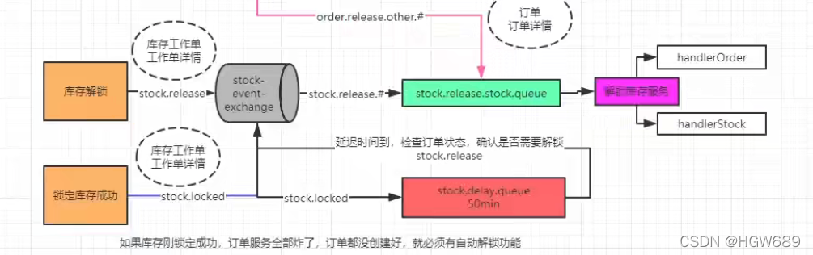
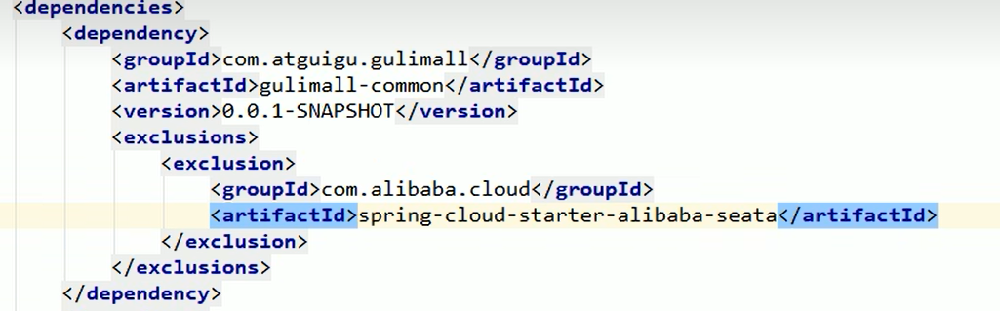
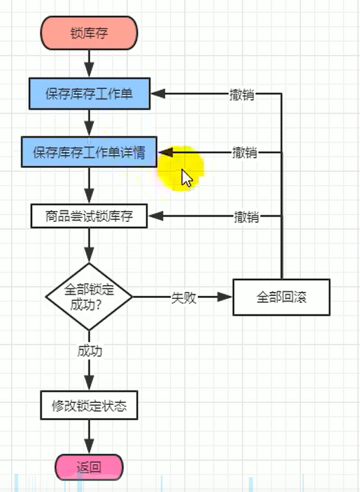
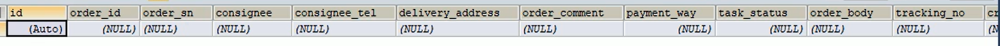
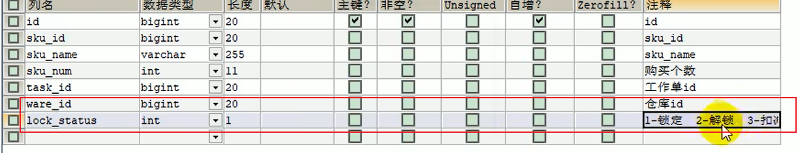

>  **导航：**
>
> [谷粒商城笔记+踩坑汇总篇](https://blog.csdn.net/qq_40991313/article/details/127099139?spm=1001.2014.3001.5501)
>
>  **Java笔记汇总：**
>
> [【Java笔记+踩坑汇总】Java基础+JavaWeb+SSM+SpringBoot+SpringCloud+瑞吉外卖/谷粒商城/学成在线+设计模式+面试题汇总+性能调优/架构设计+源码解析-CSDN博客](https://blog.csdn.net/qq_40991313/article/details/126646289)


[TOC]


> 延迟队列：
>
> [SpringCloud基础4——RabbitMQ和SpringAMQP_springcloud rabbitmq_vincewm的博客-CSDN博客](https://blog.csdn.net/qq_40991313/article/details/126801025?spm=1001.2014.3001.5501)


# 1 业务流程，订单失败后自动回滚解锁库存

> ### 可靠消息+最终一致性方案
>
> 业务处理服务在业务事务提交之前，向实时消息服务请求发送消息，实时消息服务只记录消息数据，而不是真正的发送。
>
> 业务处理服务在业务事务提交之后，向实时消息服务确认发送。只有在得到确认发送指令后，实时消息服务才会真正发送。

在商品下单业务的最后要锁定库存，我们设置在锁定库存后发RabbitMQ延迟队列消息，通知锁定库存成功，两分钟后消费消息，根据库存信息查询检查订单是否存在，若不存在代表下订单失败，此时要回滚，也就是解锁库存。



# 2【仓库服务】RabbitMQ环境准备

## 2.1 导入依赖

```XML
<dependency>
    <groupId>org.springframework.boot</groupId>
    <artifactId>spring-boot-starter-amqp</artifactId>
</dependency>
```


## 2.2 yml配置RabbitMQ信息

```bash
spring:
  rabbitmq:
    host: 124.222.223.222
    virtual-host: /
    username: guest
    password: guest
    listener:
      simple:
        acknowledge-mode: manual
```


## 2.3 主启动类添加注解@EnableRabbit

```java
@EnableRabbit
@EnableFeignClients
@EnableDiscoveryClient
@SpringBootApplication
public class GulimallWareApplication {

    public static void main(String[] args) {
        SpringApplication.run(GulimallWareApplication.class, args);
    }

}
```


## 2.4 配置类，JSON消息转换、创建交换机、队列和绑定

**过程：** 

库存锁定成功后，生产者先发消息交换机，再根据routingKey到延迟队列，延迟队列设置消息存活时间TTL，到时间后把死信路由到普通队列，普通队列发送消息到消费者。

```java
package com.atguigu.gulimall.ware.config;
@Configuration
public class MyRabbitMQConfig {

    /**
     * 使用JSON序列化机制，进行消息转换
     * @return
     */
    @Bean
    public MessageConverter messageConverter() {
        return new Jackson2JsonMessageConverter();
    }

    // @RabbitListener(queues = "stock.release.stock.queue")
    // public void handle(Message message) {
    //
    // }

    /**
     * 库存服务默认的交换机
     * @return
     */
    @Bean
    public Exchange stockEventExchange() {
        //String name, boolean durable, boolean autoDelete, Map<String, Object> arguments
        TopicExchange topicExchange = new TopicExchange("stock-event-exchange", true, false);
        return topicExchange;
    }

    /**
     * 库存释放的普通队列
     * @return
     */
    @Bean
    public Queue stockReleaseStockQueue() {
        //String name, boolean durable, boolean exclusive, boolean autoDelete, Map<String, Object> arguments
        Queue queue = new Queue("stock.release.stock.queue", true, false, false);
        return queue;
    }


    /**
     * 延迟队列
     * @return
     */
    @Bean
    public Queue stockDelay() {

        HashMap<String, Object> arguments = new HashMap<>();
        arguments.put("x-dead-letter-exchange", "stock-event-exchange");
//路由到"stock.release"这个routingKey，下面交换机和普通队列绑定的routingKey也是这个
        arguments.put("x-dead-letter-routing-key", "stock.release");
        // 消息过期时间 2分钟
        arguments.put("x-message-ttl", 120000);

        Queue queue = new Queue("stock.delay.queue", true, false, false,arguments);
        return queue;
    }


    /**
     * 交换机与普通队列绑定
     * @return
     */
    @Bean
    public Binding stockLocked() {
        //String destination, DestinationType destinationType, String exchange, String routingKey,
        // 			Map<String, Object> arguments
        Binding binding = new Binding("stock.release.stock.queue",
                Binding.DestinationType.QUEUE,
                "stock-event-exchange",
                "stock.release.#",
                null);

        return binding;
    }


    /**
     * 交换机与延迟队列绑定
     * @return
     */
    @Bean
    public Binding stockLockedBinding() {
        return new Binding("stock.delay.queue",
                Binding.DestinationType.QUEUE,
                "stock-event-exchange",
                "stock.locked",
                null);
    }


}
```


## 2.5 导入seata依赖

common模块引入seata依赖，因为所有模块引用了公共模块的依赖，所以这里要排除不使用分布式事务模块的seata依赖

认证、用户、优惠券、第三方等模块：




# 3 监听库存解锁

------

## 3.0 分析

**库存解锁的场景**

订单取消和订单回滚。

1. 下订单成功，**订单**过期没有支付被系统自动**取消**、被用户手动取消。都要解锁库存
2. 下订单成功，库存锁定成功，接下来的业务调用失败，导致订单回滚;之前锁定的库存就要自动解锁

业务流程




## 3.1 “仓库工作单” 数据库表、实体类、mapper添加字段“锁定状态”

> wms_ware_order_task仓库工作单表，表示等待被锁库存的订单们。
>
> 

wms_ware_order_task_detail仓库工作单详情表，表示订单哪个sku锁了哪些库存，这里添加两个字段：

 

这里“扣减” 状态是真实扣减了库存，也就是说订单交易成功了。

**对应实体类添加字段：**

```java
package com.atguigu.gulimall.ware.entity;

@Data
@TableName("wms_ware_order_task_detail")
public class WareOrderTaskDetailEntity implements Serializable {
   private static final long serialVersionUID = 1L;

   /**
    * id
    */
   @TableId
   private Long id;
   /**
    * sku_id
    */
   private Long skuId;
   /**
    * sku_name
    */
   private String skuName;
   /**
    * 购买个数
    */
   private Integer skuNum;
   /**
    * 工作单id
    */
   private Long taskId;
   /**
    * 仓库id
    */
   private Long wareId;
   /**
    * 锁定状态，1-已锁定  2-已解锁  3-扣减
    */
   private Integer lockStatus;

}
```


**修改 Mapper文件**

修改`resources/mapper/ware/WareOrderTaskDetailDao.xml`

```XML
<?xml version="1.0" encoding="UTF-8"?>
<!DOCTYPE mapper PUBLIC "-//mybatis.org//DTD Mapper 3.0//EN" "http://mybatis.org/dtd/mybatis-3-mapper.dtd">

<mapper namespace="com.atguigu.gulimall.ware.dao.WareOrderTaskDetailDao">

   <!-- 可根据自己的需求，是否要使用 -->
    <resultMap type="com.atguigu.gulimall.ware.entity.WareOrderTaskDetailEntity" id="wareOrderTaskDetailMap">
        <result property="id" column="id"/>
        <result property="skuId" column="sku_id"/>
        <result property="skuName" column="sku_name"/>
        <result property="skuNum" column="sku_num"/>
        <result property="taskId" column="task_id"/>
        <result property="wareId" column="ware_id"/>
        <result property="lockStatus" column="lock_status"/>
    </resultMap>


</mapper>
```


## 3.2 发消息MQ库存锁定成功

### 3.2.1 封装库存锁定单传输类

库存锁定单 

```java
package com.atguigu.common.to.mq;

@Data
public class StockLockedTo {
    /**
     * 库存工作单的id
     */
    private Long id;
    /**
     * 工作单详情类
     */
    private StockDetailTo detailTo;
}
```


库存锁定详情单 

```java
package com.atguigu.common.to.mq;

/**
 * Data time:2022/4/14 20:21
 * StudentID:2019112118
 * Author:hgw
 * Description: 详情单
 */
@Data
public class StockDetailTo {
    private Long id;
    /**
     * sku_id
     */
    private Long skuId;
    /**
     * sku_name
     */
    private String skuName;
    /**
     * 购买个数
     */
    private Integer skuNum;
    /**
     * 工作单id
     */
    private Long taskId;
    /**
     * 仓库id
     */
    private Long wareId;
    /**
     * 锁定状态，1-已锁定  2-已解锁  3-扣减
     */
    private Integer lockStatus;
}
```


### 3.2.2 service，锁库存成功发延迟消息，内容是库存单

> **业务流程**
>
> 1. 保存库存工作单
> 2. 保存库存工作单详情
> 3. 给MQ发送锁定库存以及详情消息


> **参数：**
>
> ```java
> //锁定库存的vo
> @Data
> public class WareSkuLockVo {
> //订单号
>     private String orderSn;
> 
>     /** 需要锁住库存的订单列表 **/
>     private List<OrderItemVo> locks;
> 
> 
> 
> }
> ```
>
> 

gulimall-ware 服务 `com.atguigu.gulimall.ware.service.imp` 路径下的 WareSkuServiceImpl 

```java
    @Transactional(rollbackFor = Exception.class)
    @Override
//参数WareSkuLockVo 锁定库存的vo，包括订单号和需要锁住库存的订单列表
    public boolean orderLockStock(WareSkuLockVo vo) { 

        /**
         * 保存库存工作单详情信息
         * 追溯
         */
        WareOrderTaskEntity wareOrderTaskEntity = new WareOrderTaskEntity();
//设置订单号
        wareOrderTaskEntity.setOrderSn(vo.getOrderSn());
        wareOrderTaskEntity.setCreateTime(new Date());
        wareOrderTaskService.save(wareOrderTaskEntity);


        //1、按照下单的收货地址，找到一个就近仓库，锁定库存
        //2、找到每个商品在哪个仓库都有库存
        List<OrderItemVo> locks = vo.getLocks();

        List<SkuWareHasStock> collect = locks.stream().map((item) -> {
            SkuWareHasStock stock = new SkuWareHasStock();
            Long skuId = item.getSkuId();
            stock.setSkuId(skuId);
            stock.setNum(item.getCount());
            //查询这个商品在哪个仓库有库存
            List<Long> wareIdList = wareSkuDao.listWareIdHasSkuStock(skuId);
            stock.setWareId(wareIdList);

            return stock;
        }).collect(Collectors.toList());

        //2、锁定库存
        for (SkuWareHasStock hasStock : collect) {
            boolean skuStocked = false;
            Long skuId = hasStock.getSkuId();
            List<Long> wareIds = hasStock.getWareId();

            if (org.springframework.util.StringUtils.isEmpty(wareIds)) {
                //没有任何仓库有这个商品的库存
                throw new NoStockException(skuId);
            }

            //1、如果每一个商品都锁定成功,将当前商品锁定了几件的工作单记录发给MQ
            //2、锁定失败。前面保存的工作单信息都回滚了。发送出去的消息，即使要解锁库存，由于在数据库查不到指定的id，所有就不用解锁
            for (Long wareId : wareIds) {
                //锁定成功就返回1，失败就返回0
                Long count = wareSkuDao.lockSkuStock(skuId,wareId,hasStock.getNum());
                if (count == 1) {
                    skuStocked = true;
                    WareOrderTaskDetailEntity taskDetailEntity = WareOrderTaskDetailEntity.builder()
                            .skuId(skuId)
                            .skuName("")
                            .skuNum(hasStock.getNum())
                            .taskId(wareOrderTaskEntity.getId())
                            .wareId(wareId)
                            .lockStatus(1)
                            .build();
                    wareOrderTaskDetailService.save(taskDetailEntity);

                    //TODO 告诉MQ库存锁定成功
                    StockLockedTo lockedTo = new StockLockedTo();
                    lockedTo.setId(wareOrderTaskEntity.getId());
                    StockDetailTo detailTo = new StockDetailTo();
                    BeanUtils.copyProperties(taskDetailEntity,detailTo);
                    lockedTo.setDetailTo(detailTo);
//告诉MQ库存锁定成功，生产者-交换机-死信队列-交换机-普通队列-消费者
//消息内容为库存锁定单传输对象，里面包括库存单id和库存详情单对象
                    rabbitTemplate.convertAndSend("stock-event-exchange","stock.locked",lockedTo);
                    break;
                } else {
                    //当前仓库锁失败，重试下一个仓库
                }
            }

            if (skuStocked == false) {
                //当前商品所有仓库都没有锁住
                throw new NoStockException(skuId);
            }
        }

        //3、肯定全部都是锁定成功的
        return true;
    }
```


```java
@Data
class SkuWareHashStock{
    private Long skuId;     // skuid
    private Integer num;    // 锁定件数
    private List<Long> wareId;  // 锁定仓库id
}
```


## 3.3 监听消息，判断是否解锁库存

------

### 3.3.1 业务流程 

**业务流程：**接收到库存锁订单传输类，根据消息里的订单号查询商品订单，判断是否解锁库存

是否接收到消息：

- 接收到了消息

  ，证明库存锁定成功了，根据消息内锁定单对象查用户下的订单： 	

  - 1、没有这个订单。必须解锁
  - 2、有这个订单： 	
    - 订单状态：已取消：解锁库存
    - 订单状态：没取消：不能解锁

- **没有接收到消息**，库存锁定失败了，库存回滚了。这种情况无需解锁

### 3.3.2 监听类监听消息

gulimall-ware 服务中 `com.atguigu.gulimall.ware.listener` 路径下 StockReleaseListener

```java
@Slf4j
@Service
@RabbitListener(queues = "stock.release.stock.queue")
public class StockReleaseListener {

    @Autowired
    WareSkuService wareSkuService;

    @RabbitHandler
//消息内容为库存锁定单传输对象，里面包括库存锁定单id和库存锁定详情单对象
    public void handleStockLockedRelease(StockLockedTo to, Message message, Channel channel) throws IOException {

        System.out.println("收到锁库存成功的消息，准备解锁库存");
        try {
            wareSkuService.unlockStock(to);
//消费者确认消息接收成功
            channel.basicAck(message.getMessageProperties().getDeliveryTag(),false);
        } catch (Exception e){
            channel.basicReject(message.getMessageProperties().getDeliveryTag(),true);
        }
    }
}
```


### 3.3.3 service，判断是否解锁库存

```java
/**
 * 1、库存自动解锁
 *      下订单成功，库存锁定成功，接下来的业务调用失败，导致订单回滚。之前锁定的库存就要自动解锁
 * 2、订单失败
 *      锁库存失败，则库存回滚了，这种情况无需解锁
 *      如何判断库存是否锁定失败呢？查询数据库关于这个订单的锁库存消息即可
 *  自动ACK机制：只要解决库存的消息失败，一定要告诉服务器解锁是失败的。启动手动ACK机制
 * @param to
 *
 */
@Override
public void unlockStock(StockLockedTo to) {
    StockDetailTo detail = to.getDetailTo();
    Long detailId = detail.getId();

    /**
     * 1、查询数据库关于这个订单的锁库存消息
     *    有，证明库存锁定成功了。
     *      1、没有这个订单。必须解锁
     *      2、有这个订单。不是解锁库存。
     *          订单状态：已取消：解锁库存
     *          订单状态：没取消：不能解锁
     *    没有，库存锁定失败了，库存回滚了。这种情况无需解锁
     */

    WareOrderTaskDetailEntity byId = orderTaskDetailService.getById(detailId);
    if (byId != null) {
        Long id = to.getId();   // 库存工作单的Id，拿到订单号
        WareOrderTaskEntity taskEntity = orderTaskService.getById(id);
        String orderSn = taskEntity.getOrderSn();   // 根据订单号查询订单的状态
        R r = orderFeignService.getOrderStatus(orderSn);
        if (r.getCode() == 0) {
            // 订单数据返回成功
            OrderVo data = r.getData(new TypeReference<OrderVo>() {
            });
            if (data == null || data.getStatus() == 4) {
                // 订单不存在、订单已经被取消了，才能解锁库存
                if (byId.getLockStatus() == 1){
                    // 当前库存工作单详情，状态1 已锁定但是未解锁才可以解锁
                    unLockStock(detail.getSkuId(), detail.getWareId(), detail.getSkuNum(), detailId);
                }
            } else {
                // 消息拒绝以后重新放到队列里面，让别人继续消费解锁
                throw new RuntimeException("远程服务失败");
            }
        }
    } else {
        // 无需解锁
    }
}

/**
 * 解库存锁
 *
 * @param skuId        商品id
 * @param wareId       仓库id
 * @param num          解锁数量
 * @param taskDetailId 库存工作单ID
 */
private void unLockStock(Long skuId, Long wareId, Integer num, Long taskDetailId) {
    // 库存解锁
    wareSkuDao.unlockStock(skuId, wareId, num);
    // 更新库存工作单的状态
    WareOrderTaskDetailEntity entity = new WareOrderTaskDetailEntity();
    entity.setId(taskDetailId);
    entity.setLockStatus(2);// 变为已解锁
    orderTaskDetailService.updateById(entity);
}
```


### 3.3.4 仓库模块远程调用订单模块

1、编写远程调用 gulimall-order 服务feign接口

gulimall-ware服务中 ` com.atguigu.gulimall.ware.feign` 路径下的 OrderFeignService类，代码如下：

```java
package com.atguigu.gulimall.ware.feign;

@FeignClient("gulimall-order")
public interface OrderFeignService {

    @GetMapping("/order/order/status/{orderSn}")
    R getOrderStatus(@PathVariable("orderSn") String orderSn);

}
```


### 3.3.5【订单模块】controller，通过订单号获取订单的详细信息

gulimall-order服务中 `com.atguigu.gulimall.order.controller` 路径下的 OrderController类，代码如下：

```java
@RestController
@RequestMapping("order/order")
public class OrderController {
    @Autowired
    private OrderService orderService;

    /**
     * 通过订单号获取订单的详细信息
     * @param orderSn
     * @return
     */
    @GetMapping("/status/{orderSn}")
    public R getOrderStatus(@PathVariable("orderSn") String orderSn){
        OrderEntity orderEntity = orderService.getOrderByOrderSn(orderSn);
        return R.ok().setData(orderEntity);
    }
```


### 3.3.6【订单模块】service，通过订单号获取订单的详细信息

gulimall-order服务中 `com.atguigu.gulimall.order.service.impl` 路径下的 OrderServiceImpl类，代码如下：

```java
@Override
public OrderEntity getOrderByOrderSn(String orderSn) {
    OrderEntity order_sn = this.getOne(new QueryWrapper<OrderEntity>().eq("order_sn", orderSn));
    return order_sn;
}
```


### 3.3.7 接收信息的VO类


```java
package com.atguigu.gulimall.ware.vo;


@Data
public class OrderVo {
    private Long id;
    /**
     * member_id
     */
    private Long memberId;
    /**
     * 订单号
     */
    private String orderSn;
    /**
     * 使用的优惠券
     */
    private Long couponId;
    /**
     * create_time
     */
    private Date createTime;
    /**
     * 用户名
     */
    private String memberUsername;
    /**
     * 订单总额
     */
    private BigDecimal totalAmount;
    /**
     * 应付总额
     */
    private BigDecimal payAmount;
    /**
     * 运费金额
     */
    private BigDecimal freightAmount;
    /**
     * 促销优化金额（促销价、满减、阶梯价）
     */
    private BigDecimal promotionAmount;
    /**
     * 积分抵扣金额
     */
    private BigDecimal integrationAmount;
    /**
     * 优惠券抵扣金额
     */
    private BigDecimal couponAmount;
    /**
     * 后台调整订单使用的折扣金额
     */
    private BigDecimal discountAmount;
    /**
     * 支付方式【1->支付宝；2->微信；3->银联； 4->货到付款；】
     */
    private Integer payType;
    /**
     * 订单来源[0->PC订单；1->app订单]
     */
    private Integer sourceType;
    /**
     * 订单状态【0->待付款；1->待发货；2->已发货；3->已完成；4->已关闭；5->无效订单】
     */
    private Integer status;
    /**
     * 物流公司(配送方式)
     */
    private String deliveryCompany;
    /**
     * 物流单号
     */
    private String deliverySn;
    /**
     * 自动确认时间（天）
     */
    private Integer autoConfirmDay;
    /**
     * 可以获得的积分
     */
    private Integer integration;
    /**
     * 可以获得的成长值
     */
    private Integer growth;
    /**
     * 发票类型[0->不开发票；1->电子发票；2->纸质发票]
     */
    private Integer billType;
    /**
     * 发票抬头
     */
    private String billHeader;
    /**
     * 发票内容
     */
    private String billContent;
    /**
     * 收票人电话
     */
    private String billReceiverPhone;
    /**
     * 收票人邮箱
     */
    private String billReceiverEmail;
    /**
     * 收货人姓名
     */
    private String receiverName;
    /**
     * 收货人电话
     */
    private String receiverPhone;
    /**
     * 收货人邮编
     */
    private String receiverPostCode;
    /**
     * 省份/直辖市
     */
    private String receiverProvince;
    /**
     * 城市
     */
    private String receiverCity;
    /**
     * 区
     */
    private String receiverRegion;
    /**
     * 详细地址
     */
    private String receiverDetailAddress;
    /**
     * 订单备注
     */
    private String note;
    /**
     * 确认收货状态[0->未确认；1->已确认]
     */
    private Integer confirmStatus;
    /**
     * 删除状态【0->未删除；1->已删除】
     */
    private Integer deleteStatus;
    /**
     * 下单时使用的积分
     */
    private Integer useIntegration;
    /**
     * 支付时间
     */
    private Date paymentTime;
    /**
     * 发货时间
     */
    private Date deliveryTime;
    /**
     * 确认收货时间
     */
    private Date receiveTime;
    /**
     * 评价时间
     */
    private Date commentTime;
    /**
     * 修改时间
     */
    private Date modifyTime;
}
```


### 3.3.8 解锁库存详情方法

gulimall-ware服务中的 `/com/atguigu/gulimall/ware/service/impl/WareSkuServiceImpl.java` 路径下 WareSkuServiceImpl.java类的方法

> 注意：上面解锁库存方法是“unlocakStock” ，这里是“unLockStock”

```java
/**
 * 解库存锁
 * @param skuId  商品id
 * @param wareId 仓库id
 * @param num    解锁数量
 * @param taskDetailId  库存工作单ID
 */
private void unLockStock(Long skuId, Long wareId, Integer num, Long taskDetailId) {
    wareSkuDao.unlockStock(skuId,wareId,num);
}
```


```java
void unlockStock(@Param("skuId") Long skuId, @Param("wareId") Long wareId, @Param("num") Integer num);
```


gulimall-ware服务中的 `resources/mapper/ware/WareSkuDao.xml` 文件

```XML
<update id="unlockStock">
    UPDATE wms_ware_sku SET stock_locked=stock_locked-#{num} WHERE sku_id=#{skuId} AND ware_id=#{wareId}
</update>
```


### 3.3.9【订单模块】 修改拦截器

> 由于gulimall-order添加了拦截器，只要使用该服务必须登录才行。因为这边需要远程调用订单，但不需要登录，所以给这个路径放行

修改gulimall-order 服务的 `com.atguigu.gulimall.order.interceptoe` 路径下 LoginUserInterceptor类

```java
package com.atguigu.gulimall.order.interceptoe;

@Component
public class LoginUserInterceptor implements HandlerInterceptor {

    public static ThreadLocal<MemberRespVo> loginUser = new ThreadLocal<>();

    /**
     * 用户登录拦截器
     * @param request
     * @param response
     * @param handler
     * @return
     *      用户登录：放行
     *      用户未登录：跳转到登录页面
     * @throws Exception
     */
    @Override
    public boolean preHandle(HttpServletRequest request, HttpServletResponse response, Object handler) throws Exception {

        // /order/order/status/222222222
        String uri = request.getRequestURI();
        boolean match = new AntPathMatcher().match("/order/order/status/**", uri);
        if (match){
            return true;
        }

        MemberRespVo attribute = (MemberRespVo) request.getSession().getAttribute(AuthServerConstant.LOGIN_USER);
        if (attribute!=null){
            loginUser.set(attribute);
            return true;
        } else {
            // 没登录就去登录
            request.getSession().setAttribute("msg", "请先进行登录");
            response.sendRedirect("http://auth.gulimall.cn/login.html");
            return false;
        }
    }
}
```


# 4 监听消息完整代码

------

1)、创建一个类监听 `stock.release.stock.queue` 队列

gulimall-ware服务的 `com.atguigu.gulimall.ware.listener` 路径 StockReleaseListener 类，接收到消息之后调用 Service层 WareSkuServiceImpl.java 实现类的 unlockStock 方法实现解锁库存：

1. 没有异常捕捉，则成功解锁消息。手动ACK
2. 捕捉到异常，则 消息拒绝以后重新放到队列里面，让别人继续消费解锁

```java
package com.atguigu.gulimall.ware.listener;

@Slf4j
@Service
@RabbitListener(queues = "stock.release.stock.queue")
public class StockReleaseListener {

    @Autowired
    WareSkuService wareSkuService;

    @RabbitHandler
    public void handleStockLockedRelease(StockLockedTo to, Message message, Channel channel) throws IOException {

        System.out.println("收到解锁库存的消息");
        try {
            wareSkuService.unlockStock(to);
            channel.basicAck(message.getMessageProperties().getDeliveryTag(),false);
        } catch (Exception e){
            channel.basicReject(message.getMessageProperties().getDeliveryTag(),true);
        }
    }
}
```


2)、service层业务方法

gulimall-ware服务的 `com.atguigu.gulimall.ware.service.impl` 路径 WareSkuServiceImpl 类

```java
/**
 * 1、库存自动解锁
 *      下订单成功，库存锁定成功，接下来的业务调用失败，导致订单回滚。之前锁定的库存就要自动解锁
 * 2、订单失败
 *      锁库存失败，则库存回滚了，这种情况无需解锁
 *      如何判断库存是否锁定失败呢？查询数据库关于这个订单的锁库存消息即可
 *  自动ACK机制：只要解决库存的消息失败，一定要告诉服务器解锁是失败的。启动手动ACK机制
 * @param to
 *
 */
@Override
public void unlockStock(StockLockedTo to) {
    StockDetailTo detail = to.getDetailTo();
    Long detailId = detail.getId();

    /**
     * 1、查询数据库关于这个订单的锁库存消息
     *    有，证明库存锁定成功了。
     *      1、没有这个订单。必须解锁
     *      2、有这个订单。不是解锁库存。
     *          订单状态：已取消：解锁库存
     *          订单状态：没取消：不能解锁
     *    没有，库存锁定失败了，库存回滚了。这种情况无需解锁
     */

    WareOrderTaskDetailEntity byId = orderTaskDetailService.getById(detailId);
    if (byId != null) {
        Long id = to.getId();   // 库存工作单的Id，拿到订单号
        WareOrderTaskEntity taskEntity = orderTaskService.getById(id);
        String orderSn = taskEntity.getOrderSn();   // 根据订单号查询订单的状态
        R r = orderFeignService.getOrderStatus(orderSn);
        if (r.getCode() == 0) {
            // 订单数据返回成功
            OrderVo data = r.getData(new TypeReference<OrderVo>() {
            });
            if (data == null || data.getStatus() == 4) {
                // 订单不存在、订单已经被取消了，才能解锁库存
                if (byId.getLockStatus() == 1){
                    // 当前库存工作单详情，状态1 已锁定但是未解锁才可以解锁
                    unLockStock(detail.getSkuId(), detail.getWareId(), detail.getSkuNum(), detailId);
                }
            } else {
                // 消息拒绝以后重新放到队列里面，让别人继续消费解锁
                throw new RuntimeException("远程服务失败");
            }
        }
    } else {
        // 无需解锁
    }
}

/**
 * 解库存锁
 *
 * @param skuId        商品id
 * @param wareId       仓库id
 * @param num          解锁数量
 * @param taskDetailId 库存工作单ID
 */
private void unLockStock(Long skuId, Long wareId, Integer num, Long taskDetailId) {
    // 库存解锁
    wareSkuDao.unlockStock(skuId, wareId, num);
    // 更新库存工作单的状态
    WareOrderTaskDetailEntity entity = new WareOrderTaskDetailEntity();
    entity.setId(taskDetailId);
    entity.setLockStatus(2);// 变为已解锁
    orderTaskDetailService.updateById(entity);
}
```

