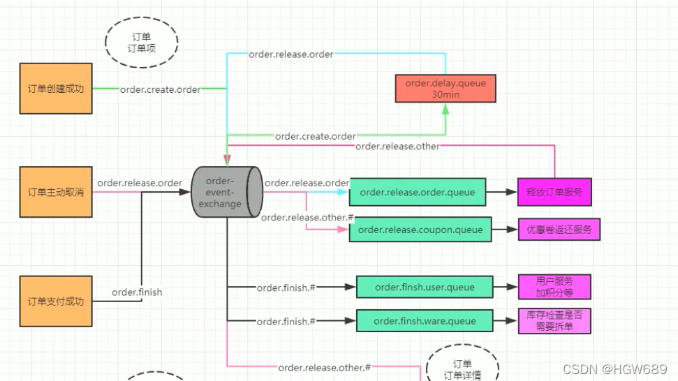
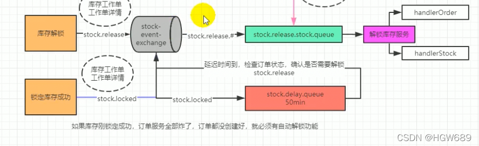
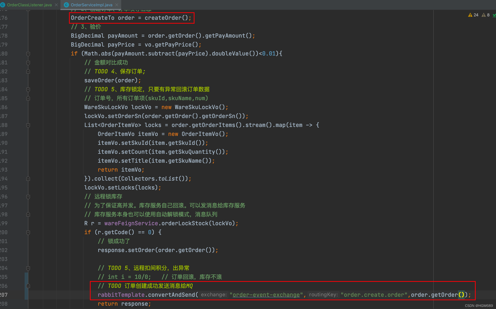

>  **导航：**
>
> [谷粒商城笔记+踩坑汇总篇](https://blog.csdn.net/qq_40991313/article/details/127099139?spm=1001.2014.3001.5501)
>
>  **Java笔记汇总：**
>
> [【Java笔记+踩坑汇总】Java基础+JavaWeb+SSM+SpringBoot+SpringCloud+瑞吉外卖/谷粒商城/学成在线+设计模式+面试题汇总+性能调优/架构设计+源码解析-CSDN博客](https://blog.csdn.net/qq_40991313/article/details/126646289)


[TOC]


# 1、定时关单

## 1.0、业务流程

在**订单创建成功时**向MQ中 **延时队列发送消息**，携带路由键：`order.create.order`

- 30分钟后未支付，则释放订单

  服务向MQ中发送消息，携带路由键：

  ```
  order.release.order
  ```

  - 路由消息到正常队列`order.release.order.queue` ，进行释放订单服务

此时存在一种情况，存在订单创建成功之后出现延时卡顿，消息延迟，导致订单解锁在库存解锁之后完成

- 则每次库存解锁之后向MQ中发送消息，携带路由键：

  ```
  order.release.other
  ```

  - 监听 

    ```
    stock.release.stock.queue
    ```

     ，编写一个重载方法，进行判断 		

    - 查一下最新库存的状态，防止重复解锁库存 		
      - 按照工作单找到所有 没有解锁的库存，进行解锁



## 1.1、创建交换机、队列以及之间的绑定

```java
package com.atguigu.gulimall.order.config;

@Configuration
public class MyMQConfig {


    /**
     * Spring中注入Bean之后，容器中的Binding、Queue、Exchange 都会自动创建（前提是RabbitMQ中没有）
     * RabbitMQ 只要有，@Bean属性发生变化也不会覆盖
     * @return
     * Queue(String name, boolean durable, boolean exclusive, boolean autoDelete, Map<String, Object> arguments)
     */
    @Bean
    public Queue orderDelayQueue(){
        HashMap<String, Object> arguments = new HashMap<>();
        /**
         * x-dead-letter-exchange ：order-event-exchange 设置死信路由
         * x-dead-letter-routing-key : order.release.order 设置死信路由键
         * x-message-ttl ：60000
         */
        arguments.put("x-dead-letter-exchange","order-event-exchange");
        arguments.put("x-dead-letter-routing-key","order.release.order");
        arguments.put("x-message-ttl",30000);

        Queue queue = new Queue("order.delay.queue", true, false, false,arguments);
        return queue;
    }

    @Bean
    public Queue orderReleaseOrderQueue(){
        return new Queue("order.release.order.queue", true, false, false);
    }

    @Bean
    public Exchange orderEventExchange(){
        // TopicExchange(String name, boolean durable, boolean autoDelete, Map<String, Object> arguments)
        return new TopicExchange("order-event-exchange",true,false);
    }

    @Bean
    public Binding orderCreateOrder(){
        // Binding(String destination, Binding.DestinationType destinationType, String exchange, String routingKey, Map<String, Object> arguments)
        return new Binding("order.delay.queue",
                Binding.DestinationType.QUEUE,
                "order-event-exchange",
                "order.create.order",
                null);
    }

    @Bean
    public Binding orderReleaseOrder(){
        // Binding(String destination, Binding.DestinationType destinationType, String exchange, String routingKey, Map<String, Object> arguments)
        return new Binding("order.release.order.queue",
                Binding.DestinationType.QUEUE,
                "order-event-exchange",
                "order.release.order",
                null);
    }

    /**
     * 订单释放直接和库存释放进行绑定
     * @return
     */
    @Bean
    public Binding orderReleaseOtherBingding(){
        // Binding(String destination, Binding.DestinationType destinationType, String exchange, String routingKey, Map<String, Object> arguments)
        return new Binding("stock.release.stock.queue",
                Binding.DestinationType.QUEUE,
                "order-event-exchange",
                "order.release.other.#",
                null);
    }

}
```


## 1.2、在订单创建成功时向MQ中 延时队列发送消息



## 1.3、在订单的关闭之后时向MQ发送消息

为了防止因为其他原因，订单的关闭延期了

```java
/**
 * 订单的关闭
 * @param entity
 */
@Override
public void closeOrder(OrderEntity entity) {
    // 1、查询当前这个订单的最新状态
    OrderEntity orderEntity = this.getById(entity.getId());
    if (orderEntity.getStatus() == OrderStatusEnum.CREATE_NEW.getCode()) {
        // 2、关单
        OrderEntity update = new OrderEntity();
        update.setId(entity.getId());
        update.setStatus(OrderStatusEnum.CANCLED.getCode());
        this.updateById(update);
        OrderTo orderTo = new OrderTo();
        BeanUtils.copyProperties(orderEntity, orderTo);
        // 3、发给MQ一个
        rabbitTemplate.convertAndSend("order-event-exchange","order.release.other",orderTo);
    }
}
```


## 1.4、监听 `order.release.order.queue` 队列，释放订单服务

gulimall-order 服务的 `com.atguigu.gulimall.order.listener` 路径下的 OrderClassListener类。

> 可靠消息参考下文3.8：
>
> [SpringCloud基础4——RabbitMQ和SpringAMQP_springcloud rabbitmq_vincewm的博客-CSDN博客](https://blog.csdn.net/qq_40991313/article/details/126801025?spm=1001.2014.3001.5501)

```java
package com.atguigu.gulimall.order.listener;
 
@RabbitListener(queues = "order.release.order.queue")
@Service
public class OrderClassListener {
 
    @Autowired
    OrderService orderService;
 
    @RabbitHandler
    public void listener(OrderEntity entity, Channel channel, Message message) throws IOException {
        System.out.println("收到过期的订单信息：准备关闭订单！" + entity.getOrderSn());
        try {
            orderService.closeOrder(entity);
//肯定，让broker将移除此消息，以后不用重试。
//参数deliveryTag号是消息的唯一标识，参数false代表不批量确认此deliveryTag编号之前的所有消息
            channel.basicAck(message.getMessageProperties().getDeliveryTag(), false);
        } catch (Exception e){
//拒绝；参数deliveryTag号是消息的唯一标识；参数true代表重新回队列，如果false则代表丢弃
            channel.basicReject(message.getMessageProperties().getDeliveryTag(), true);
        }
    }
}
```


Service层中 OrderServiceImpl.java 实现类进行订单的关闭

```java
/**
 * 订单的关闭
 * @param entity
 */
@Override
public void closeOrder(OrderEntity entity) {
    // 1、查询当前这个订单的最新状态
    OrderEntity orderEntity = this.getById(entity.getId());
    if (orderEntity.getStatus() == OrderStatusEnum.CREATE_NEW.getCode()) {
        // 2、关单
        OrderEntity update = new OrderEntity();
        update.setId(entity.getId());
        update.setStatus(OrderStatusEnum.CANCLED.getCode());
        this.updateById(update);
        OrderTo orderTo = new OrderTo();
        BeanUtils.copyProperties(orderEntity, orderTo);
        // 3、发给MQ一个
        rabbitTemplate.convertAndSend("order-event-exchange","order.release.other",orderEntity);
    }
}
```


## 1.5、监听 `stock.release.stock.queue` 队列，解锁库存

在 gulimall-ware 服务中，进行监听处理

> 1)、编写 StockReleaseListener 进行监听队列

```java
package com.atguigu.gulimall.ware.listener;
/**
 * Data time:2022/4/14 21:47
 * StudentID:2019112118
 * Author:hgw
 * Description:
 */
@Slf4j
@Service
@RabbitListener(queues = "stock.release.stock.queue")
public class StockReleaseListener {

    @Autowired
    WareSkuService wareSkuService;

    /**
     * 库存自己过期处理
     * @param to
     * @param message
     * @param channel
     * @throws IOException
     */
    @RabbitHandler
    public void handleStockLockedRelease(StockLockedTo to, Message message, Channel channel) throws IOException {

        System.out.println("收到解锁库存的消息");
        try {
            wareSkuService.unlockStock(to);
            channel.basicAck(message.getMessageProperties().getDeliveryTag(),false);
        } catch (Exception e){
            channel.basicReject(message.getMessageProperties().getDeliveryTag(),true);
        }
    }

    /**
     * 订单关闭处理
     * @param orderTo
     * @param message
     * @param channel
     * @throws IOException
     */
    @RabbitHandler
    public void handleOrderCloseRelease(OrderTo orderTo, Message message, Channel channel) throws IOException {

        System.out.println("订单关闭准备解锁库存");
        try {
            wareSkuService.unlockStock(orderTo);
            channel.basicAck(message.getMessageProperties().getDeliveryTag(),false);
        } catch (Exception e){
            channel.basicReject(message.getMessageProperties().getDeliveryTag(),true);
        }
    }
}
```


> 2、Service层 WareSkuServiceImpl 实现类中，进行方法处理

```java
/**
 * 防止订单服务卡顿，导致订单状态一直修改不了，库存消息优先到期。查订单状态肯定是新建状态，什么都不做就走了
 * 导致卡顿的订单，永远不能解锁库存
 * @param orderTo
 */
@Transactional
@Override
public void unlockStock(OrderTo orderTo) {
    String orderSn = orderTo.getOrderSn();
    // 查一下最新库存的状态，防止重复解锁库存
    WareOrderTaskEntity task = orderTaskService.getOrderTeskByOrderSn(orderSn);
    Long taskId = task.getId();
    // 按照工作单找到所有 没有解锁的库存，进行解锁
    List<WareOrderTaskDetailEntity> entities = orderTaskDetailService.list(new QueryWrapper<WareOrderTaskDetailEntity>()
            .eq("task_id", taskId)
            .eq("lock_status", 1));
    // 进行解锁
    for (WareOrderTaskDetailEntity entity : entities) {
        unLockStock(entity.getSkuId(),entity.getWareId(),entity.getSkuNum(),entity.getId());
    }
```


> 3、编写查询最新库存的状态，防止重复解锁库存

```java
package com.atguigu.gulimall.ware.service.impl;

@Service("wareOrderTaskService")
public class WareOrderTaskServiceImpl extends ServiceImpl<WareOrderTaskDao, WareOrderTaskEntity> implements WareOrderTaskService {

//.....
    @Override
    public WareOrderTaskEntity getOrderTeskByOrderSn(String orderSn) {

        WareOrderTaskEntity one = this.getOne(new QueryWrapper<WareOrderTaskEntity>().eq("order_sn", orderSn));
        return one;
    }

}
```


> 4、消息共享封装To

```java
package com.atguigu.common.to.mq;

@Data
public class OrderTo {
    /**
     * id
     */
    private Long id;
    /**
     * member_id
     */
    private Long memberId;
    /**
     * 订单号
     */
    private String orderSn;
    /**
     * 使用的优惠券
     */
    private Long couponId;
    /**
     * create_time
     */
    private Date createTime;
    /**
     * 用户名
     */
    private String memberUsername;
    /**
     * 订单总额
     */
    private BigDecimal totalAmount;
    /**
     * 应付总额
     */
    private BigDecimal payAmount;
    /**
     * 运费金额
     */
    private BigDecimal freightAmount;
    /**
     * 促销优化金额（促销价、满减、阶梯价）
     */
    private BigDecimal promotionAmount;
    /**
     * 积分抵扣金额
     */
    private BigDecimal integrationAmount;
    /**
     * 优惠券抵扣金额
     */
    private BigDecimal couponAmount;
    /**
     * 后台调整订单使用的折扣金额
     */
    private BigDecimal discountAmount;
    /**
     * 支付方式【1->支付宝；2->微信；3->银联； 4->货到付款；】
     */
    private Integer payType;
    /**
     * 订单来源[0->PC订单；1->app订单]
     */
    private Integer sourceType;
    /**
     * 订单状态【0->待付款；1->待发货；2->已发货；3->已完成；4->已关闭；5->无效订单】
     */
    private Integer status;
    /**
     * 物流公司(配送方式)
     */
    private String deliveryCompany;
    /**
     * 物流单号
     */
    private String deliverySn;
    /**
     * 自动确认时间（天）
     */
    private Integer autoConfirmDay;
    /**
     * 可以获得的积分
     */
    private Integer integration;
    /**
     * 可以获得的成长值
     */
    private Integer growth;
    /**
     * 发票类型[0->不开发票；1->电子发票；2->纸质发票]
     */
    private Integer billType;
    /**
     * 发票抬头
     */
    private String billHeader;
    /**
     * 发票内容
     */
    private String billContent;
    /**
     * 收票人电话
     */
    private String billReceiverPhone;
    /**
     * 收票人邮箱
     */
    private String billReceiverEmail;
    /**
     * 收货人姓名
     */
    private String receiverName;
    /**
     * 收货人电话
     */
    private String receiverPhone;
    /**
     * 收货人邮编
     */
    private String receiverPostCode;
    /**
     * 省份/直辖市
     */
    private String receiverProvince;
    /**
     * 城市
     */
    private String receiverCity;
    /**
     * 区
     */
    private String receiverRegion;
    /**
     * 详细地址
     */
    private String receiverDetailAddress;
    /**
     * 订单备注
     */
    private String note;
    /**
     * 确认收货状态[0->未确认；1->已确认]
     */
    private Integer confirmStatus;
    /**
     * 删除状态【0->未删除；1->已删除】
     */
    private Integer deleteStatus;
    /**
     * 下单时使用的积分
     */
    private Integer useIntegration;
    /**
     * 支付时间
     */
    private Date paymentTime;
    /**
     * 发货时间
     */
    private Date deliveryTime;
    /**
     * 确认收货时间
     */
    private Date receiveTime;
    /**
     * 评价时间
     */
    private Date commentTime;
    /**
     * 修改时间
     */
    private Date modifyTime;

}
```


 

# 2、如何保证消息可靠性

柔性事务-**可靠消息**+最终一致性方案（异步确保型）

- 防止消息丢失
  1. 做好消息确认机制（pulisher、consumer[手动ACK]）
  2. 每一个发送的消息都在数据库做好记录。定期将失败的消息再次发送一遍

> 参考下文3.8可靠消息：
>
> [SpringCloud基础4——RabbitMQ和SpringAMQP_springcloud rabbitmq_vincewm的博客-CSDN博客](https://blog.csdn.net/qq_40991313/article/details/126801025?spm=1001.2014.3001.5501)


## 2.1、消息丢失问题，使用手动ack解决

------

- 消息发送出去，由于网络问题没有抵达服务器
  - **做好容错方法（try-catch）**，发送消息可能会网络失败，失败后要有重试机制，可记录到数据库，采用定期扫描重发的方式；
  - 做好日志记录，每个消息状态是否都被服务器收到都应该记录；
  - 做好定期重发，如果消息没有发生成，定期去数据库扫描未成功的消息进行重发；
- 消息抵达Broker，Broker要将消息写入磁盘（持久化）才算成功。此时Broker尚未持久化完成，宕机
  - Publisher 也必须加入确认回调机制，确认成功的消息，修改数据库消息状态
- 自动ACK的状态下。消费者收到消息，但没来得及消费然后宕机
  - 一定开启手动ACK，消费成功才移除，失败或者没来得处理就noAck并重新入队

**解决办法：** 

1、做好消息确认机制（pulisher、consumer[**手动ACK]**）
 2、每一个发送的消息都在数据库做好记录。定期将失败的消息再次发送一遍 

## 2.2、消息重复问题，使用幂等性解决

------


 **消息重复**
 消息消费成功，事务已经提交，**ack时，机器宕机**，中间人以为消息没发成功，就重新发消息，导致消息重复问题。

导致没有ack成功Broker的消息重新由unack变为ready，并发送给其他消费者消息消费失败，由于**重试机制**，自动又将消息发送出去成功消费，ack时宕机，消息由unack变为ready，Broker又重新发送。

**解决办法：接口设计为幂等性的。**

消费者的业务消费接口应该设计为幂等性的。比如扣库存有工作单的状态标志使用防重表(redis/mysql)，**发送消息每一个都有业务的唯一标识存到redis里**，处理过就不用处
 rabbitMQ的每一个消息都有redelivered字段，可以获取是否是被重新投递过来的，而不是第一次投递过来的

## 2.3、消息积压问题，使用增加消费者、解决

------

常见消息积压问题： 

- 消费者宕机积压
- 消费者消费能力不足积压
- 发送者发送流量太大

**解决办法：**

上线**更多的消费者**，进行正常消费。
 上线专门的**队列消费服务**，将消息先批量取出来，记录数据库，离线慢慢处理