>  **导航：**
>
> [谷粒商城笔记+踩坑汇总篇](https://blog.csdn.net/qq_40991313/article/details/127099139?spm=1001.2014.3001.5501)
>
>  **Java笔记汇总：**
>
> [【Java笔记+踩坑汇总】Java基础+JavaWeb+SSM+SpringBoot+SpringCloud+瑞吉外卖/谷粒商城/学成在线+设计模式+面试题汇总+性能调优/架构设计+源码解析-CSDN博客](https://blog.csdn.net/qq_40991313/article/details/126646289)
>
> [SpringCloud基础5——微服务保护、Sentinel](https://blog.csdn.net/qq_40991313/article/details/126882045?spm=1001.2014.3001.5501)

------

[TOC]


# 一、Sentinel概述

## 1.1、服务流控、熔断和降级

------

- **熔断**
  - 当扇出链路的某个微服务不可用或者响应时间太长时，会进行服务的降级，**进而熔断该节点微服务的调用，快速返回错误的响应信息。**检测到该节点微服务调用响应正常后恢复调用链路。
  - A服务调用 B服务的某个功能，由于网络不稳定问题，或者 B服务卡机，导致功能时间超长。如果这样的次数很多。我们就可以直接将 B服务段路了（A不再请求 B接口），凡是调用 B得直接返回降级数据，不必等待 B的超长执行。这样B的故障问题，就不会级联影响到 A服务。
- **降级**
  - 服务降级是指当服务器压力剧增的情况下，根据实际业务情况及流量，对一些服务和页面有策略的不处理，或换种简单的方式处理，从而释放服务器资源以保证核心业务正常运作或高效运作。说白了，就是**尽可能的把系统资源让给优先级高的服务**。
  - 整个网站处于流量高峰期，服务器压力剧增，根据当前业务情况及流量，对一些服务和页面进行由策略的降级[停止服务，所有的调用直接返回降级数据]。以此缓解服务器资源的压力，以保证核心业务的正常运行，同时也保持了客户和大部分客户得到正确的对应。
- **限流**
  - 对打入服务的请求流量进行控制，使服务能够承担不超过自己能力的流量压力

**熔断和降级异同：**

- **相同点：**
  1. 为了保证集群大部分服务的可用性和可靠性，防止崩溃，牺牲小我
  2. 用户最终都是体验到某个功能不可用
- **不同点：**
  1. 熔断时被调用方故障，触发的系统主动规则
  2. 降级是基于全局的考虑，通知一些正常服务，释放资源

## 1.2、Sentinel 简介

------

> **参考：**
>
> [SpringCloud基础5——微服务保护、Sentinel_sentinel 实时监控_vincewm的博客-CSDN博客](https://blog.csdn.net/qq_40991313/article/details/126882045?spm=1001.2014.3001.5501)

**简介**

 随着微服务的流行，服务和服务之间的稳定性变得越来越重要。Sentinel 是面向分布式服务架构的流量控制组件，主要以流量为切入点，从限流、流量整形、熔断降级、系统负载保护、热点防护等多个维度来帮助开发者保障微服务的稳定性。

Sentinel 分为两个部分:

- 核心库（Java 客户端）不依赖任何框架/库，能够运行于所有 Java 运行时环境，同时对 Dubbo / Spring Cloud 等框架也有较好的支持。
- 控制台（Dashboard）基于 Spring Boot 开发，打包后可以直接运行，不需要额外的 Tomcat 等应用容器。


| 功能           | Sentinel                                  | Hystrix               |
| -------------- | ----------------------------------------- | --------------------- |
| 隔离策略       | 信号量隔离/并发线程数限流                 | 线程池隔离/信号量隔离 |
| 熔断降级策略   | 基于响应时间、异常比率、异常数            | 基于异常比率          |
| 实时统计实现   | 滑动窗口(LeapArray)                       | 滑动窗口(基于RxJava)  |
| 动态规则配置   | 支持多种数据源                            | 支持多种数据源        |
| 扩展性         | 多个扩展点                                | 插件形式              |
| 注解支持       | 支持                                      | 支持                  |
| 限流           | 支持基于QPS的限流，支持基于调用关系的限流 | 有限的支持            |
| 流量整形       | 支持预热模式、匀速器模式、预热排队模式    | 不支持                |
| 系统自适应保护 | 支持                                      | 不支持                |
| 控制台         | 可配置规则、查看秒级监控、机器发现等      | 简单的监控查看        |

# 二、SpringBoot整合Sentinel

- 整合Sentinel
  1. 导入sentinel依赖
  2. 下载sentinel的控制台
  3. 配置Sentinel
  4. 在控制台调整所有的参数[默认所有的流控设置保存在内存中，重启失效]

> 第一步、在gulimall-common 服务中 导入依赖

```XML
<!--Sentinel 服务熔断、降级、限流-->
<dependency>
    <groupId>com.alibaba.cloud</groupId>
    <artifactId>spring-cloud-starter-alibaba-sentinel</artifactId>
</dependency>
<!--统计审核信息-->
<dependency>
    <groupId>org.springframework.boot</groupId>
    <artifactId>spring-boot-starter-actuator</artifactId>
</dependency>
```


> 第二步、去官网下载项目里sentinel对应的版本的控制台[官网下载](https://github.com/alibaba/Sentinel)

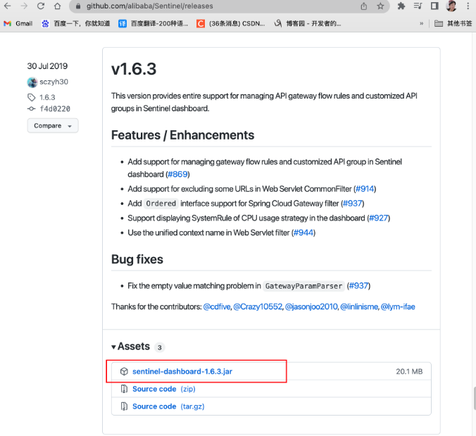

1、在路径下执行

```bash
hgw@HGWdeAir SpringCloudSentinel# java -jar sentinel-dashboard-1.6.3.jar --server.port=8333
```


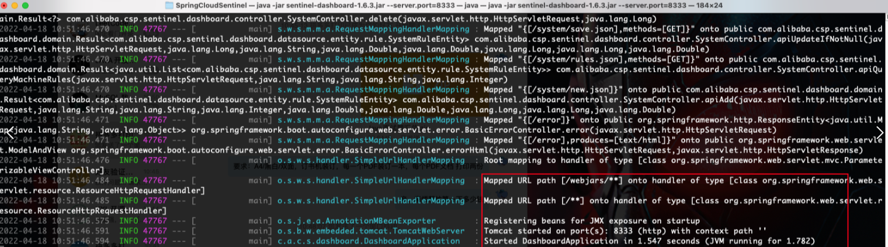

2、访问http://localhost:8333/

- 用户名：sentinel

  密码：sentinel

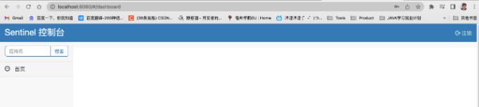

> 第三步、配置Sentinel

在gulimall-seckill 服务的配置文件中：

```bash
#sentinel控制台地址
spring.cloud.sentinel.transport.dashboard=127.0.0.1:8333
#sentinel传输端口
spring.cloud.sentinel.transport.port=8713
#Spring Boot声明哪些端点是可公开的，即暴露给外部访问的。
#默认情况下会将所有端点都暴露出去，包括health、info等常用端点，这在生产环境中可能会存在一定的安全隐患。
#一般暴露health,info就行了
management.endpoints.web.exposure.include=*
```


# 三、流量控制

## 3.0、簇点链路配置流控规则

**簇点链路：**当请求进入微服务时，首先会访问DispatcherServlet，然后进入Controller、Service、Mapper，这样的一个调用链就叫做**簇点链路**。簇点链路中**被监控的每一个接口**就是一个**资源**。

**针对来源：**default默认是不针对任何来源 

**阈值类型：**只流量控制QPS

**单机阈值：**这里先设置成1以供测试，就是说每秒只能有1个请求。

**流控模式：**

- **直接（默认）：**统计**当前资源**的请求，触发阈值时对当前资源直接限流，也是默认的模式
- **关联：**统计与当前资源相关的**另一个资源**，触发阈值时，对当前资源限流
- **链路：**统计从**指定链路**访问到本资源的请求，触发阈值时，对指定链路限流。例如a、b访问资源c，只对指定的a到c的请求链路限流，b到c没指定就不管。

**流控效果：**

- **快速失败（默认）：**达到阈值后，新的请求会被立即拒绝并抛出FlowException异常，状态码429。是默认的处理方式。
- **warm up预热模式：**对超出阈值的请求同样是拒绝并抛出异常。但这种模式阈值会动态变化，从一个较小值逐渐增加到最大阈值，阈值初始值是“最大阈值/冷启动因子”，默认冷启动因子coldFactor是3，也就是阈值默认会从1/3最大阈值到最大阈值。
- **排队等待：**让所有的请求按照先后次序排队执行，两个请求的间隔不能小于指定时长

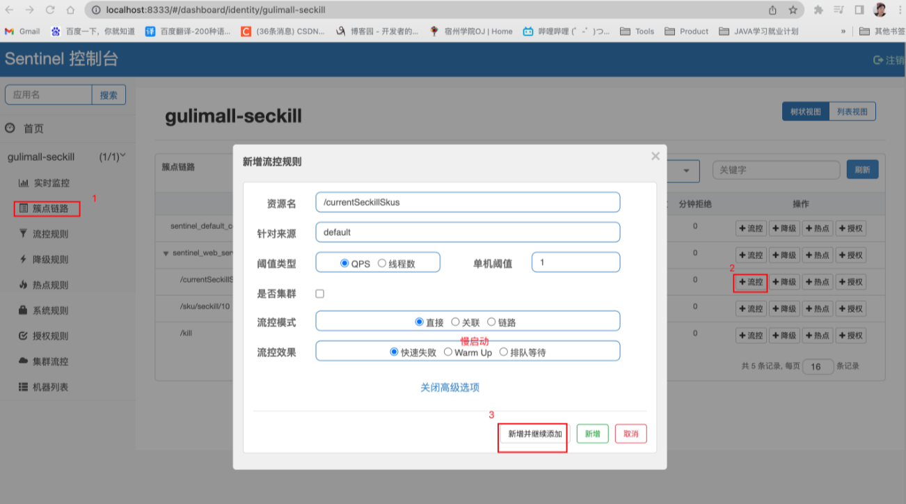

### 3.1、Sentinel-自定义流控响应

```java
package com.atguigu.gulimall.seckill.config;
/**
 * Description: Sentinel-自定义流控响应
 */
@Configuration
public class SeckillSentinelConfig {
    public SeckillSentinelConfig() {
        WebCallbackManager.setUrlBlockHandler(new UrlBlockHandler() {
            @Override
            public void blocked(HttpServletRequest httpServletRequest, HttpServletResponse httpServletResponse, BlockException e) throws IOException {
                R error = R.error(BizCodeEnume.TO_MANY_REQUEST.getCode(), BizCodeEnume.TO_MANY_REQUEST.getMsg());
                httpServletResponse.setCharacterEncoding("UTF-8");
                httpServletResponse.setContentType("application/json");
                httpServletResponse.getWriter().write(JSON.toJSONString(error));
            }
        });
    }
}
```


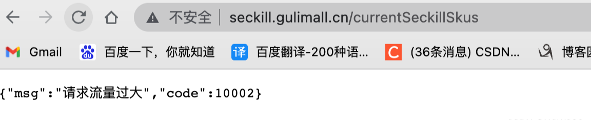

### 3.2、Sentinel全服务引入

1、为每个服务引入 actuator依赖

```XML
<!--统计审核信息-->
<dependency>
    <groupId>org.springframework.boot</groupId>
    <artifactId>spring-boot-starter-actuator</artifactId>
</dependency>
```


2、配置 sentinel

```bash
#sentinel控制台地址
spring.cloud.sentinel.transport.dashboard=127.0.0.1:8333
management.endpoints.web.exposure.include=*
```


# 四、熔断降级

> 1）、调用方的熔断保护开启 feign.sentinel.enabled=true
>
> 2）、调用方手动指定远程服务的降级策略。远程服务被降级处理，触发我们的熔断回调方法
>
> 3）、超大浏览的时候，必须牺牲一些远程服务。在服务的提供方（远程服务）指定降级策略; 提供方是在运行。但是不运行自己的业务逻辑。返回的是默认的降级数据（限流的数据）

默认情况下，sentinel是不会对feign进行监控的，需要开启配置

在gulimall-product类配置文件添加配置

```bash
#sentinel是不会对feign进行监控的，需要开启配置
feign.sentinel.enabled=true
```


## 4.1、调用方编写熔断回调（降级方法）

------

**熔断：**调用方加入断路器，统计对服务提供者的调用，如果调用的失败比例过高，则熔断该调用，不允许访问该服务的提供者了。

1、在gulimall-product类配置文件添加配置

```bash
#sentinel是不会对feign进行监控的，需要开启配置
feign.sentinel.enabled=true
```


2、编写熔断回调类和方法

商品模块feign.fallback包下创建秒杀feign客户端的熔断回调方法，也就是说商品服务远程调用秒杀服务熔断后

```java
package com.atguigu.gulimall.product.feign.fallback;

@Slf4j
@Component
public class SeckillFeignServiceFallBack implements SeckillFeignService {
    @Override
    public R getSkuSeckillInfo(Long skuId) {
        log.error("熔断方法调用...getSkuSeckillInfo");
        return R.error(BizCodeEnume.TO_MANY_REQUEST.getCode(),BizCodeEnume.TO_MANY_REQUEST.getMsg());
    }
}
```


3、秒杀feign客户端@FeignClient注解指定“熔断回调方法”的class对象

```java
package com.atguigu.gulimall.product.feign;

@FeignClient(value = "gulimall-seckill", fallback = SeckillFeignServiceFallBack.class)
public interface SeckillFeignService {
    @GetMapping("/sku/seckill/{skuId}")
    R getSkuSeckillInfo(@PathVariable("skuId") Long skuId);
}
```


## 4.2、被调用方配置降级规则

------

sentinel控制台设置服务提供方的降级规则：

**降级策略：**对于要降级的服务提供者方法，选择而降级策略为RT（平均响应时间），如果平均响应时间超过指定阈值后，那么在接下来的时间窗口内这个被调用方触发熔断。

这里RT设为1ms，时间窗口设为10s，也就是此被调用方平均响应时间超过1ms就触发熔断，接下来10s内都不可以被调用。实际中RT肯定设置久一点，这里只是便于测试。

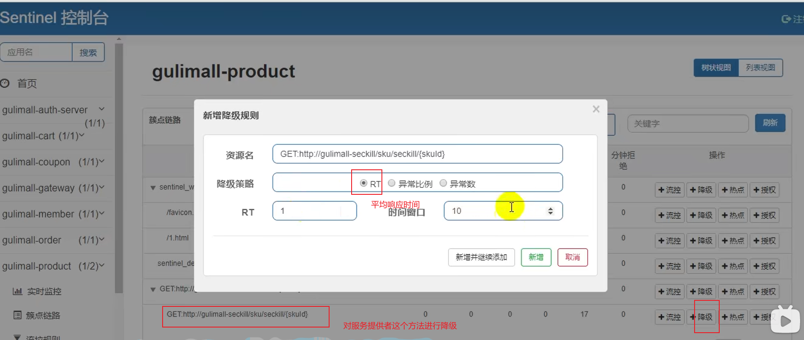


## 4.3、Sentinel自定义保护资源

------

自定义受保护资源：除了熔断降级外，我们想自定义保护一段代码，有两种方式：基于代码、基于注解。

 1、基于代码保护代码块

```java
     try(Entry entity = SphU.entry("自定义受保护资源名")) {
      // 业务逻辑
      } catch (BlockException e) {
         //一定要配置被限流以后的默认返回
      }
```


 2、基于注解保护方法

```java
      @SentinelResource(value = "getCurrentSeckillSkusResource",blockHandler = "blockHandler")
```


 无论是1、2方式一定要配置被限流以后的默认返回。

url请求可以设置统一返回：WebCallbackManager
 

### 4.3.1、基于代码保护“获取秒杀方法”

```java
try(Entry entity = SphU.entry("自定义受保护资源名")) {
	  // 业务逻辑
} catch (BlockException e) {
  	//一定要配置被限流以后的默认返回
}
```


1、编写自定义受保护资源

修改“com.atguigu.gulimall.seckill.service.impl.SeckillServiceImpl”类 代码如下：

```java
/**
 * 获取当前参与秒杀的商品
 *
 * @return
 */
@Override
public List<SecKillSkuRedisTo> getCurrentSeckillSkus() {
    try(Entry entity = SphU.entry("seckillSkus")) {
        // 1、确定当前时间属于哪个秒杀场次
        long time = new Date().getTime();
        Set<String> keys = redisTemplate.keys(SESSION_CACHE_PREFIX + "*");
        for (String key : keys) {
            // seckill:sessions:1650153600000_1650160800000
            String replace = key.replace(SESSION_CACHE_PREFIX, "");
            String[] s = replace.split("_");
            long start = Long.parseLong(s[0]);
            long end = Long.parseLong(s[1]);
            if (time >= start && time <= end) {
                // 2、获取指定秒杀场次需要的所有商品信息
                List<String> range = redisTemplate.opsForList().range(key, -100, 100);
                BoundHashOperations<String, String, String> hashOps = redisTemplate.boundHashOps(SKUKILL_CACHE_PREFIX);
                List<String> list = hashOps.multiGet(range);
                if (list != null) {
                    List<SecKillSkuRedisTo> collect = list.stream().map(item -> {
                        SecKillSkuRedisTo redis = JSON.parseObject((String) item, SecKillSkuRedisTo.class);
                        redis.setRandomCode(null);  // 当前秒杀开始了需要随机码
                        return redis;
                    }).collect(Collectors.toList());
                    return collect;
                }
                break;
            }
        }
    } catch (BlockException e) {
        log.error("资源被限流{}"+e.getMessage());
    }
    return null;
}
```


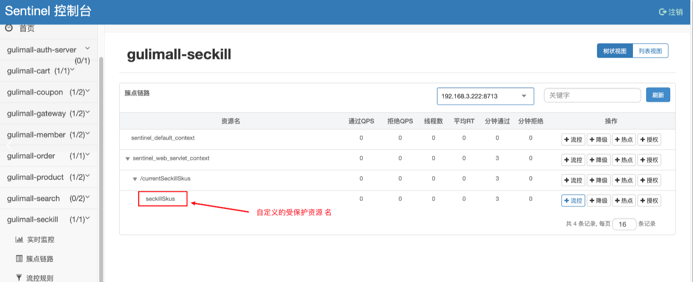

可以为自定义的受保护资源 加上流控、降级。

### 4.3.2、基于注解保护“获取秒杀方法”

```java
 @SentinelResource(value = "getCurrentSeckillSkusResource",blockHandler = "blockHandler",fallback = "fallback")
```


- blockHandler 函数会在原方法被限流/降级/系统保护的时候调用
- fallback 会针对所有类型的异常

```java
/**
 * getCurrentSeckillSkus()方法被限流/降级/系统保护的时候调用
 * @return
 */
public List<SecKillSkuRedisTo> blockHandler(BlockException e){
    log.error("getCurrentSeckillSkus()方法被限流/降级/系统保护");
    return null;
}
/**
 * 获取当前参与秒杀的商品
 * blockHandler 函数会在原方法被限流/降级/系统保护的时候调用
 * fallback 会针对所有类型的异常
 * @return
 */
@SentinelResource(value = "getCurrentSeckillSkusResource",blockHandler = "blockHandler")
@Override
public List<SecKillSkuRedisTo> getCurrentSeckillSkus() {
    try(Entry entity = SphU.entry("seckillSkus")) {
        // 1、确定当前时间属于哪个秒杀场次
        long time = new Date().getTime();
        Set<String> keys = redisTemplate.keys(SESSION_CACHE_PREFIX + "*");
        for (String key : keys) {
            // seckill:sessions:1650153600000_1650160800000
            String replace = key.replace(SESSION_CACHE_PREFIX, "");
            String[] s = replace.split("_");
            long start = Long.parseLong(s[0]);
            long end = Long.parseLong(s[1]);
            if (time >= start && time <= end) {
                // 2、获取指定秒杀场次需要的所有商品信息
                List<String> range = redisTemplate.opsForList().range(key, -100, 100);
                BoundHashOperations<String, String, String> hashOps = redisTemplate.boundHashOps(SKUKILL_CACHE_PREFIX);
                List<String> list = hashOps.multiGet(range);
                if (list != null) {
                    List<SecKillSkuRedisTo> collect = list.stream().map(item -> {
                        SecKillSkuRedisTo redis = JSON.parseObject((String) item, SecKillSkuRedisTo.class);
                        redis.setRandomCode(null);  // 当前秒杀开始了需要随机码
                        return redis;
                    }).collect(Collectors.toList());
                    return collect;
                }
                break;
            }
        }
    } catch (BlockException e) {
        log.error("资源被限流{}"+e.getMessage());
    }
    return null;
}
```


# 五、sentinel控制网关流量

**Sentinel 1.6.3** 引入了网关流控控制台的支持，用户可以直接在 Sentinel 控制台上查看 API Gateway 实时的 route 和自走义 API 分组监控，管理网关规则和 API 分组配置。 

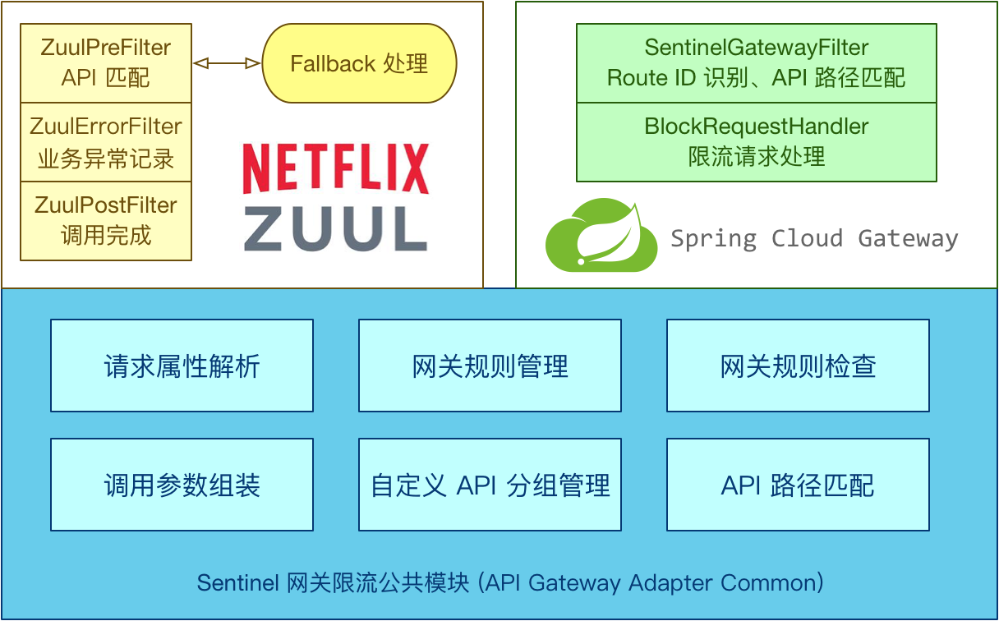

如果能在网关层就进行流控，可以避免请求流入业务，减小服务压力

**1、网关模块引入sentinel-gateway依赖**

```XML
<!-- 引入sentinel网关限流 -->
<dependency>
    <groupId>com.alibaba.cloud</groupId>
    <artifactId>spring-cloud-alibaba-sentinel-gateway</artifactId>
    <version>2.1.0.RELEASE</version>
</dependency>
```


> **注意：**sentinel-gateway依赖版本要和公共模块的sentinel依赖一致

**2、配置流控**

下载启动sentinel 1.7.1版本的控制台，1.7.1增加了网关服务的“api管理”功能。

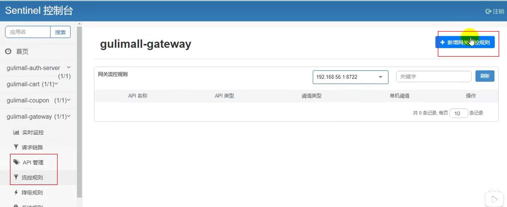

API 名称就是: 网关中配置路由名

比如说指定请求头被限流：

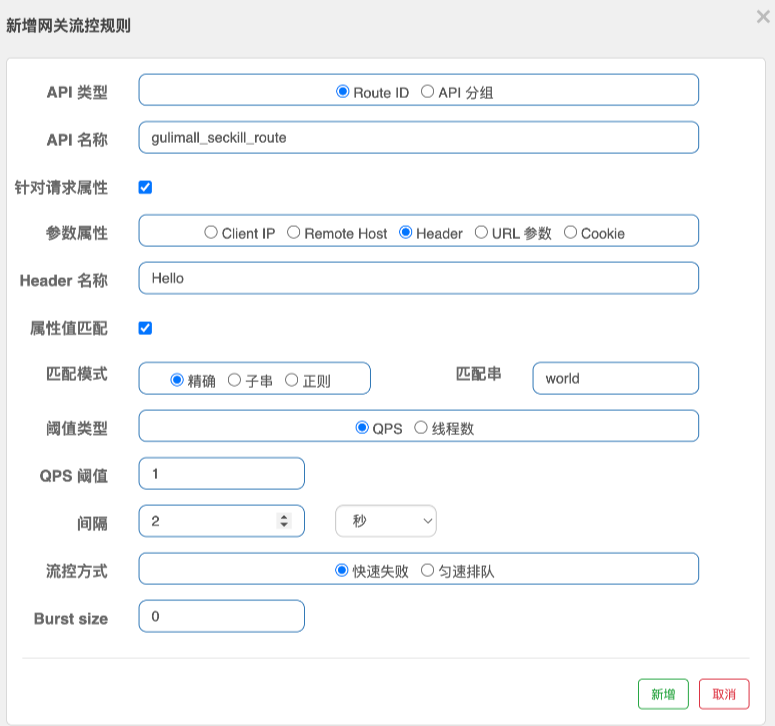

**3、网关流控后返回**

网关模块新建sentinel配置类

```java
package com.atguigu.gulimall.gateway.config;
@Configuration
public class SentinelGatewayConfig {
    public SentinelGatewayConfig() {
        GatewayCallbackManager.setBlockHandler(new BlockRequestHandler() {
           // 网关限制了请求，就会调用此回调 Mono Flux
            @Override
            public Mono<ServerResponse> handleRequest(ServerWebExchange serverWebExchange, Throwable throwable) {
                R error = R.error(BizCodeEnume.TO_MANY_REQUEST.getCode(), BizCodeEnume.TO_MANY_REQUEST.getMsg());
                String errJson = JSON.toJSONString(error);

                Mono<ServerResponse> body = ServerResponse.ok().body(Mono.just(errJson), String.class);
                return body;
            }
        });
    }
}
```


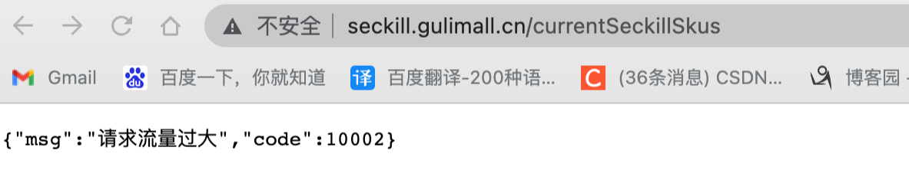