>  **导航：**
>
> [谷粒商城笔记+踩坑汇总篇](https://blog.csdn.net/qq_40991313/article/details/127099139?spm=1001.2014.3001.5501)
>
>  **Java笔记汇总：**
>
> [【Java笔记+踩坑汇总】Java基础+JavaWeb+SSM+SpringBoot+SpringCloud+瑞吉外卖/谷粒商城/学成在线+设计模式+面试题汇总+性能调优/架构设计+源码解析-CSDN博客](https://blog.csdn.net/qq_40991313/article/details/126646289)

[TOC]


# 7、商品服务-品牌管理

## 7.1、添加“品牌管理”到人人**后台管理系统**

### **7.1.1、在人人后台管理系统中新增“品牌管理”菜单**

菜单管理->新增菜单

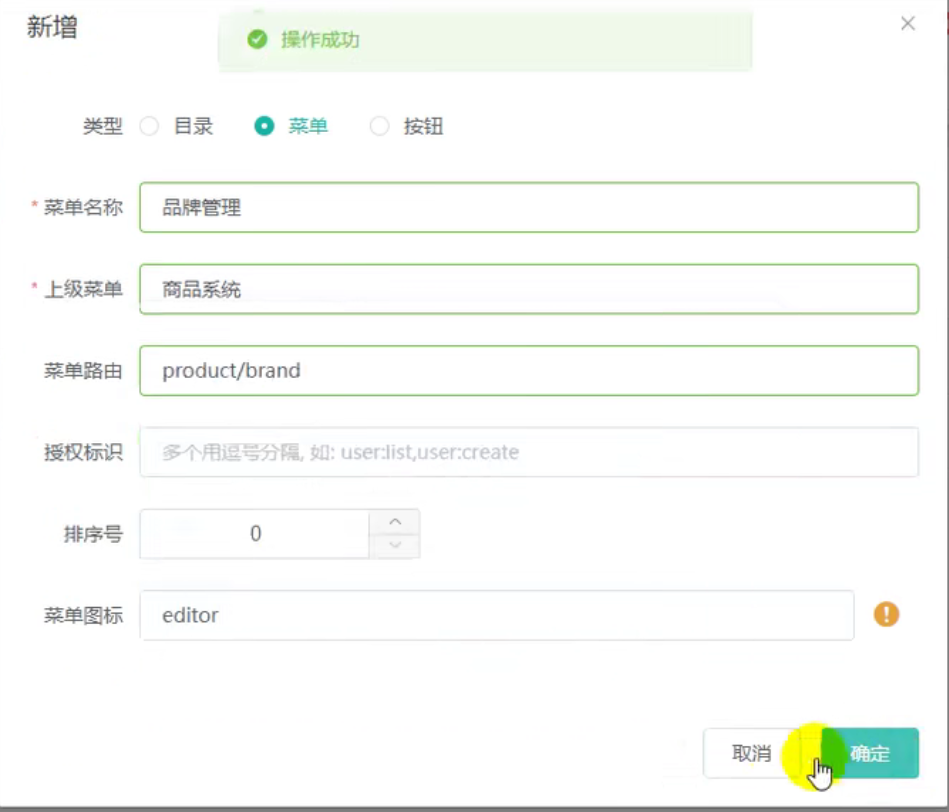

### **7.1.2、人人生成的前端vue文件复制到前端工程**

前端代码路径`\product\main\resources\src\views\modules\product`

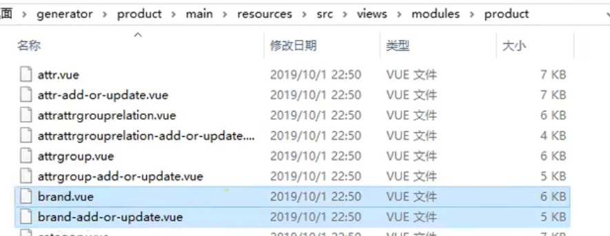

### **7.1.3、修改权限**

没有新增删除按钮： 修改权限，Ctrl+Shift+F查找`isAuth后，`

在src/utils/index.js修改`isAuth`，注释并全部返回为true

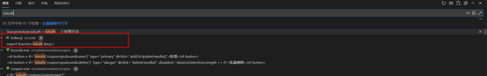

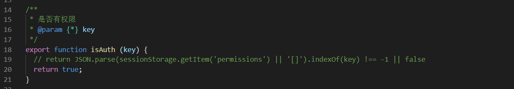

### **7.1.4、测试增删改查基础功能**

运行项目， 可以发现增删改查都是成功的. 

> **注意：**现在没有添加表单校验，新增时表单有非法输入会失败，例如状态设为汉字。 

http://localhost:8001/#/product-brand

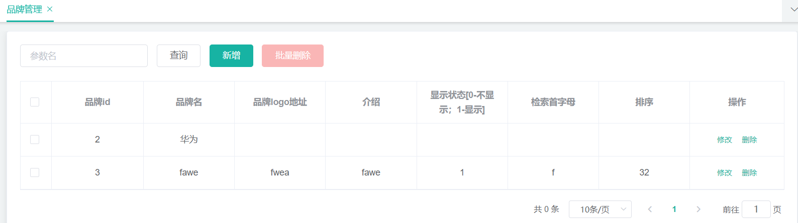

## 7.2、新增时显示状态开关（仅前端）

1、在列表中添加自定义列：中间加`<template></template>`标签。可以通过 `Scoped slot` 可以获取到 row, column, $index 和 store（table 内部的状态管理）的数据

2、修改开关状态，发送修改请求

3、数据库中showStatus是01，开关默认值是true/false。 所以在开关中设置`:active-value="1" 、:inactive-value="0"`属性，与数据库同步

代码+注释：

```XML
<!--brand.vue中显示状态那一列-->
      <el-table-column
        prop="showStatus"
        header-align="center"
        align="center"
        label="显示状态"
      >
        <template slot-scope="scope">
          <el-switch
            v-model="scope.row.showStatus"
            active-color="#13ce66"
            inactive-color="#ff4949"
            :active-value="1" 
            :inactive-value="0"
            @change="updateBrandStatus(scope.row)" 
          >
          </el-switch>
        </template>
      </el-table-column>

<!--brand-add-or-update.vue中显示状态那一列-->
      <el-form-item label="显示状态" prop="showStatus">
        <el-switch
          v-model="dataForm.showStatus"
          active-color="#13ce66"
          inactive-color="#ff4949"
          :active-value="1"
          :inactive-value="0"
        >
        </el-switch>
      </el-form-item>
```


```javascript
//brand.vue中新增方法，用来修改状态
updateBrandStatus(data) {
      let { brandId, showStatus } = data;
      this.$http({
        url: this.$http.adornUrl("/product/brand/update"),
        method: "post",
        data: this.$http.adornData({ brandId, showStatus }, false),
      }).then(({ data }) => {
        this.$message({
          message: "状态修改成功",
          type: "success",
        });
      });
    },
```


## 7.3、文件上传功能，阿里云云存储

### 7.3.1、分布式系统上传文件

**单体应用上传：**上传文件到服务器，想获取文件时再向服务器发请求获取文件。

**分布式系统上传：** 因为有多台服务器，为防止负载均衡导致获取文件时没找到对应的服务器，所以**使用专门的存读文件服务器，或者云存储**。

和传统的单体应用不同，这里我们选择**将数据上传到分布式文件服务器上**。

这里我们选择**将图片放置到阿里云上，使用对象存储**。

**帮助文档：**

- https://github.com/alibaba/aliyun-spring-boot/blob/master/aliyun-spring-boot-samples/aliyun-oss-spring-boot-sample/README-zh.md
- https://help.aliyun.com/document_detail/32009.html?spm=a2c4g.11186623.6.768.549d59aaWuZMGJ

**上传策略：服务端签名后直传**

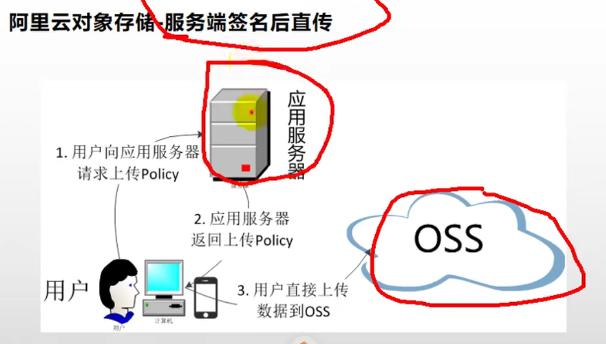

### 7.3.2、开通阿里云OSS对象存储服务，创建新的Bucket

> **尽管开通即可，oss是按量计费，开发阶段不会超过一块钱。** 

注册、登录、实名认证、开通oss对象存储:

[对象存储OSS_云存储服务_企业数据管理_存储-阿里云](https://www.aliyun.com/product/oss?spm=5176.21213303.5694434980.1.15cb53c97UXx4S&scm=20140722.S_card@@产品@@218843.S_card0.ID_card@@产品@@218843-RL_OSS-OR_ser-V_2-P0_0)

点击立即开通 


点击“管理控制台” ：

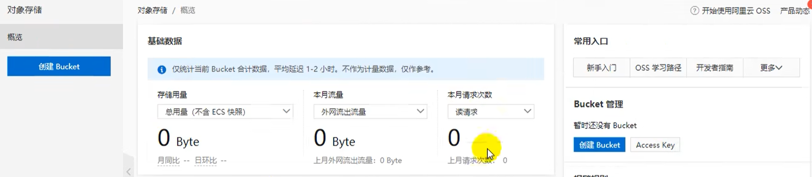

> oss基本概念：[基本概念-Object-对象-存储-对象存储 OSS-阿里云](https://help.aliyun.com/document_detail/31827.htm?spm=a2c4g.11186623.0.0.13f52fcbtzlZmX#concept-izx-fmt-tdb)
>
> **存储空间（Bucket）**
>
> 存储空间是用户用于**存储对象**（Object）的容器，**所有的对象都必须隶属于某个存储空间。**存储空间具有各种配置属性，包括地域、访问权限、存储类型等。用户可以根据实际需求，创建不同类型的存储空间来存储不同的数据。
>
> **建议一个项目创建一个存储空间。** 
>
> 
>
> **对象（Object）**
>
> **对象是OSS存储数据的基本单元**，也被称为OSS的文件。和传统的文件系统不同，对象没有文件目录层级结构的关系。**对象由元信息（Object Meta），用户数据（Data）和文件名（Key）组成**，并且由存储空间内部唯一的Key来标识。对象**元信息是一组键值对**，表示了对象的一些属性，比如最后修改时间、大小等信息，同时用户也可以在元信息中存储一些自定义的信息。

**创建bucket：** 

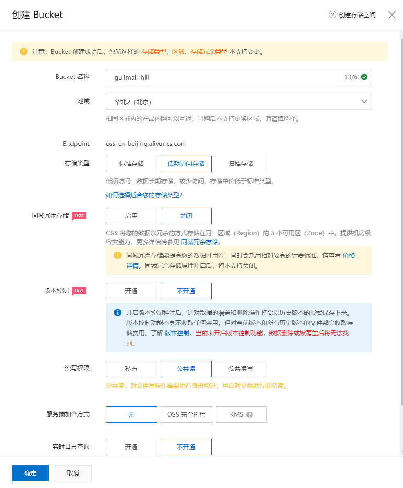

**手动上传任意文件测试：**

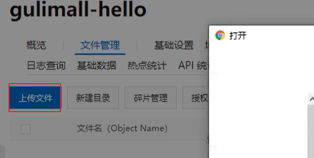

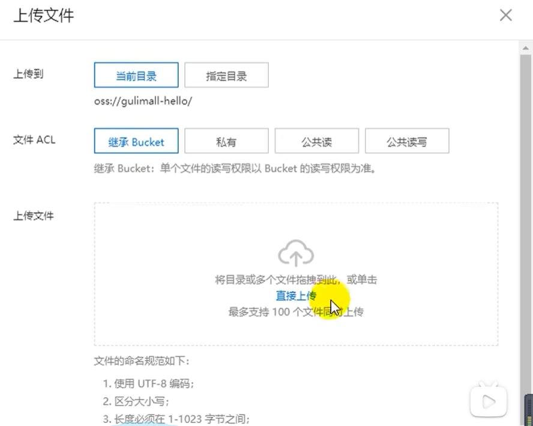

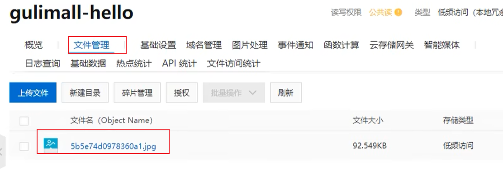

点击文件详情、 复制url就能直接下载文件：


### 7.3.3、子账户创建和授权，获取`Endpoint`、`AccessKey ID`、`AccessKey Secret`


**创建子账户**

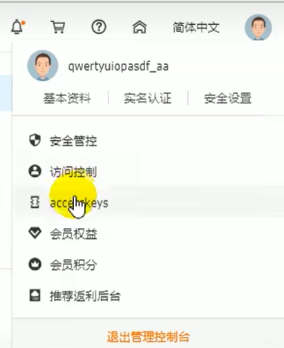

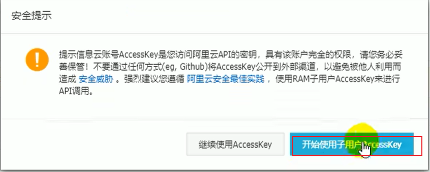


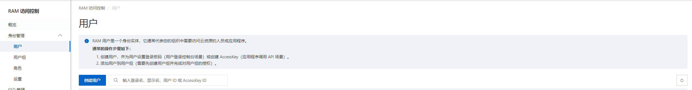

点击创建用户

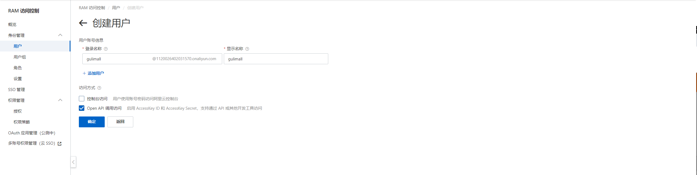

**新建成功后得到`AccessKey ID`、`AccessKey Secret`**


对**子账户分配权限**，管理OSS对象存储服务

给oss完全权限： 

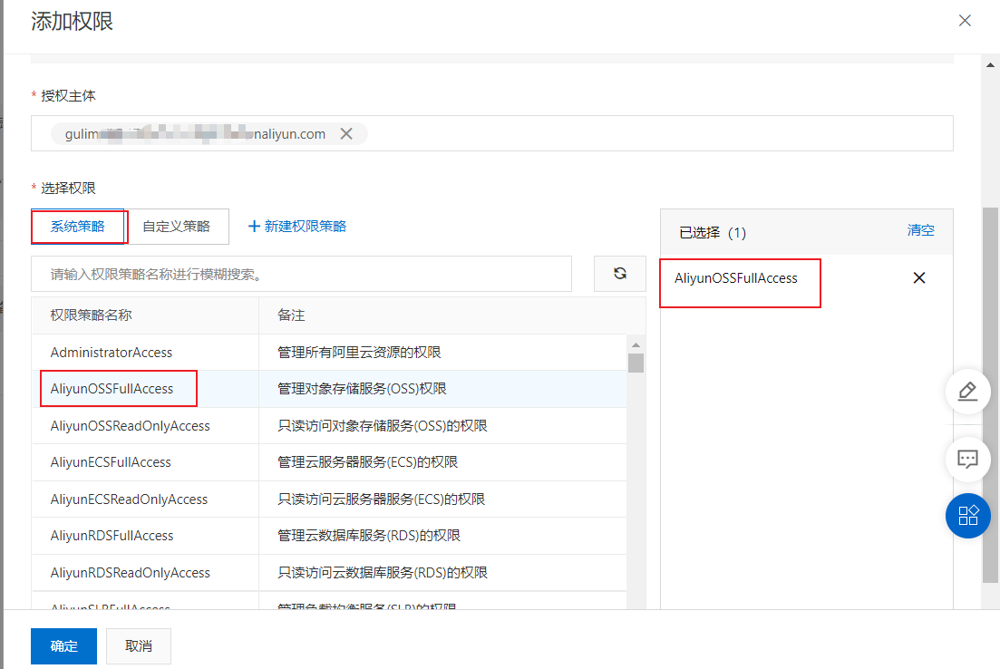

Endpoint。 （gulimall-xmh -> 概览 -> Endpoint（地域节点）)

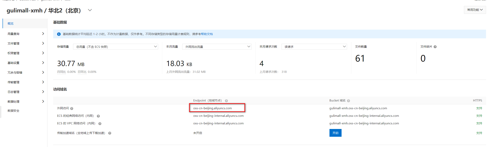

### 7.3.4、测试普通上传方式（不建议）

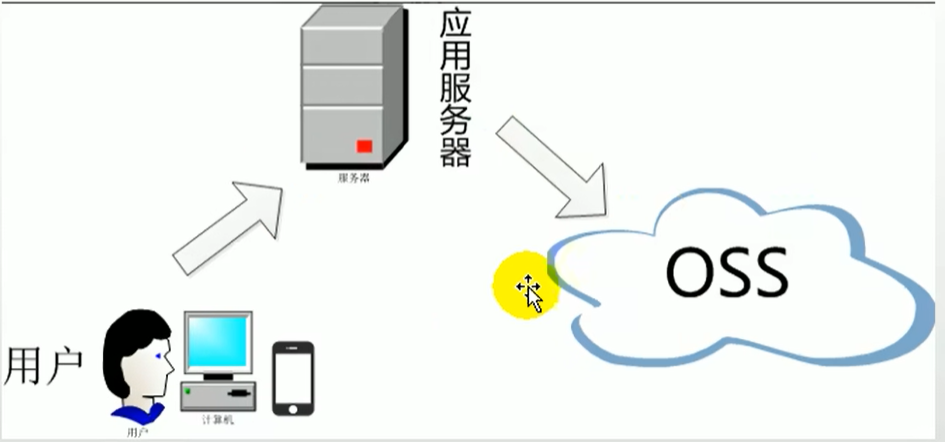

经过服务器不建议 

[安装-gt-lt-Java-对象存储 OSS-阿里云](https://help.aliyun.com/document_detail/32009.html)

product模块导入依赖

```XML
<dependency>
    <groupId>com.aliyun.oss</groupId>
    <artifactId>aliyun-sdk-oss</artifactId>
    <version>3.15.0</version>
</dependency>
```


**上传文件流**，将下面代码中String都`改成自己的信息：`

```java
    @Test
    public void testOss(){
        String endpoint = "https://oss-cn-hangzhou.aliyuncs.com";
        // 阿里云账号AccessKey拥有所有API的访问权限，风险很高。强烈建议您创建并使用RAM用户进行API访问或日常运维，请登录RAM控制台创建RAM用户。
        String accessKeyId = "yourAccessKeyId";
        String accessKeySecret = "yourAccessKeySecret";
        // 填写Bucket存储空间名称，例如gulimall-hello。
        String bucketName = "examplebucket";
        // 填写存储对象Object完整路径，完整路径中不能包含Bucket名称，例如exampledir/exampleobject.txt。
        String objectName = "exampledir/exampleobject.txt";
        // 填写本地文件的完整路径，例如D:\\localpath\\examplefile.txt。
        // 如果未指定本地路径，则默认从示例程序所属项目对应本地路径中上传文件流。
        String filePath= "D:\\localpath\\examplefile.txt";

        // 创建OSSClient实例。
        OSS ossClient = new OSSClientBuilder().build(endpoint, accessKeyId, accessKeySecret);

        try {
            InputStream inputStream = new FileInputStream(filePath);
            // 创建PutObject请求。
            ossClient.putObject(bucketName, objectName, inputStream);
        } catch (OSSException oe) {
            System.out.println("Caught an OSSException, which means your request made it to OSS, "
                    + "but was rejected with an error response for some reason.");
            System.out.println("Error Message:" + oe.getErrorMessage());
            System.out.println("Error Code:" + oe.getErrorCode());
            System.out.println("Request ID:" + oe.getRequestId());
            System.out.println("Host ID:" + oe.getHostId());
        } catch (ClientException ce) {
            System.out.println("Caught an ClientException, which means the client encountered "
                    + "a serious internal problem while trying to communicate with OSS, "
                    + "such as not being able to access the network.");
            System.out.println("Error Message:" + ce.getMessage());
        } finally {
            if (ossClient != null) {
                ossClient.shutdown();
            }
        }
    }
```


运行，上传成功：

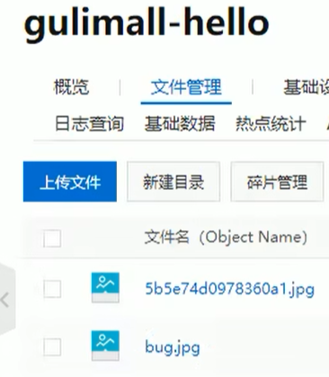

复制文件url在浏览器也是可以打开的。 

### 7.3.5、建立第三方服务模块，实现服务端签名后直传

> **删除前面测试时引入的依赖和测试类，以后导入starter依赖。** 

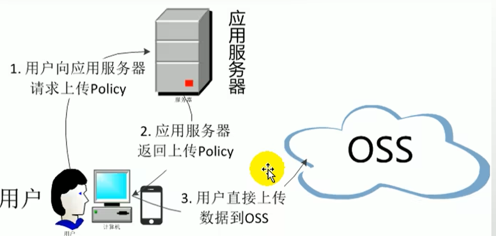


> 官方演示示例 ：
>
> [aliyun-spring-boot/aliyun-spring-boot-samples/aliyun-oss-spring-boot-sample at master · alibaba/aliyun-spring-boot · GitHub](https://github.com/alibaba/aliyun-spring-boot/tree/master/aliyun-spring-boot-samples/aliyun-oss-spring-boot-sample)


- 新建springboot模块,`gulimall-third-party`

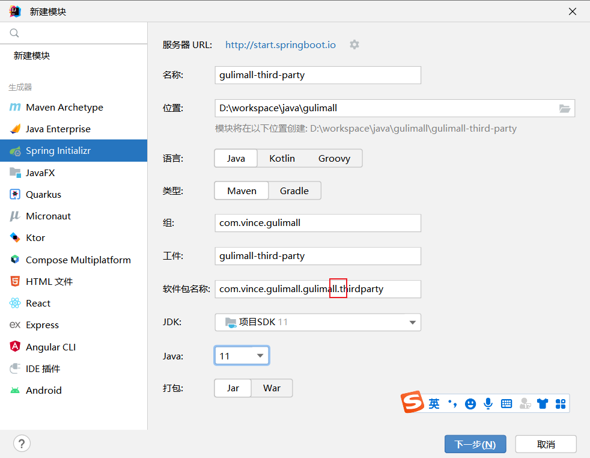


- 第三方模块引入common、oss依赖和alibaba管理依赖

```XML
    <properties>
        <java.version>11</java.version>
        <spring-cloud.version>2021.0.4</spring-cloud.version>
    </properties>
    <dependencies>
        <dependency>
            <groupId>org.springframework.boot</groupId>
            <artifactId>spring-boot-starter-web</artifactId>
        </dependency>
        <dependency>
            <groupId>org.springframework.cloud</groupId>
            <artifactId>spring-cloud-starter-openfeign</artifactId>
        </dependency>

        <dependency>
            <groupId>org.springframework.boot</groupId>
            <artifactId>spring-boot-starter-test</artifactId>
            <scope>test</scope>
        </dependency>
		<dependency>
			<groupId>com.vince.gulimall</groupId>
			<artifactId>gulimall-common</artifactId>
			<version>0.0.1-SNAPSHOT</version>
		</dependency>
        <dependency>
            <groupId>com.alibaba.cloud</groupId>
            <artifactId>spring-cloud-starter-alicloud-oss</artifactId>
            <version>2.2.0.RELEASE</version>
        </dependency>

    </dependencies>
    <dependencyManagement>
        <dependencies>
            <dependency>
                <groupId>org.springframework.cloud</groupId>
                <artifactId>spring-cloud-dependencies</artifactId>
                <version>${spring-cloud.version}</version>
                <type>pom</type>
                <scope>import</scope>
            </dependency>
            <dependency>
                <groupId>com.alibaba.cloud</groupId>
                <artifactId>spring-cloud-alibaba-dependencies</artifactId>
                <version>2021.0.1.0</version>
                <type>pom</type>
                <scope>import</scope>
            </dependency>
        </dependencies>
    </dependencyManagement>
```


- nacos新建命名空间`third-party`

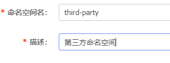

- 命名空间中新建配置文件`oss.yml`

 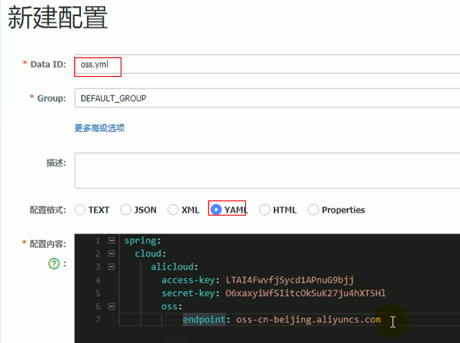


```bash
spring:
  cloud:
    alicloud:
      oss:
        endpoint: xxx
        bucket: xxx
      access-key: xxx
      secret-key: xxx
```


- 项目新建**`bootstrap.yml`**

```bash
spring:
  application:
    name: gulimall-third-party
  cloud:
    nacos:
      config:
        server-addr: 127.0.0.1:8848
        file-extension: yaml
        namespace: de0e12ff-8fc4-45a0-bdee-5b5618f4054f
        extension-configs:
          - data-id: oss.yml
            group: DEFAULT_GROUP
            refresh: true
```


> **坑点：报错没有配置endpoint：**
>
> 在`SpringBoot 2.4.x`的版本之后，对于**`bootstrap.properties`/`bootstrap.yaml`**配置文件(我们合起来成为`Bootstrap`配置文件)的支持，需要导入如下的依赖
>
> 这里在common中导入：
>
> ```XML
>         <dependency>
>             <groupId>org.springframework.cloud</groupId>
>             <artifactId>spring-cloud-starter-bootstrap</artifactId>
>             <version>3.1.4</version>
>         </dependency>
> ```
>
> 

- 项目新建**`application.yml`**

```bash
spring:
  cloud:
    nacos:
      discovery:
        server-addr: 127.0.0.1:8848
  application:
    name: gulimall-third-party
server:
  port: 30000
```


- **主启动类注解@EnableDiscoveryClient开启nacos注册**

```java
@SpringBootApplication
@EnableDiscoveryClient
public class GulimallThirdPartyApplication {
    public static void main(String[] args) {
        SpringApplication.run(GulimallThirdPartyApplication.class, args);
    }
}
```


### 7.3.6、测试上传文件功能

在第三方模块的pom里排除mybatisplus依赖：

```XML
		<dependency>
			<groupId>com.vince.gulimall</groupId>
			<artifactId>gulimall-common</artifactId>
			<version>0.0.1-SNAPSHOT</version>
            <exclusions>
                <exclusion>
                    <groupId>com.baomidou</groupId>
                    <artifactId>mybatis-plus-boot-starter</artifactId>
                </exclusion>
            </exclusions>
		</dependency>
```


**编写测试类：**

> 注意修改bucket 

```java
@SpringBootTest
class GulimallThirdPartyApplicationTest {

    @Autowired
    OSSClient ossClient;

    @Test
    public void testUpload() throws FileNotFoundException {

        //上传文件流。
        InputStream inputStream = new FileInputStream("E:\\SystemDefault\\桌面\\1.jpg");
        ossClient.putObject("改成自己bucketName例如gulimall-xmh", "hahaha1.jpg", inputStream);

        // 关闭OSSClient。
        ossClient.shutdown();
        System.out.println("上传成功.");
    }

}
```


### 7.3.7、实现服务端签名后直传文件，新建OssController 

在第三方模块controller.OssController 

> **代码来源：**[简单上传-上传-文件-OSS-对象存储 OSS-阿里云](https://help.aliyun.com/document_detail/84781.html) 
>
> 这里主要是从yml里注入oss需要的关键属性，删去了跨域相关的代码，因为跨域我们之前在网关模块的配置类里已经统一配置了跨域规则。

```java
@RestController
public class OssController {

    @Autowired
    OSS ossClient;  //注意不是OssClient

    //从nacos配置的yml里注入阿里云云存储的关键属性
    @Value("${spring.cloud.alicloud.oss.endpoint}")
    String endpoint;

    @Value("${spring.cloud.alicloud.oss.bucket}")
    String bucket;

    @Value("${spring.cloud.alicloud.access-key}")
    String accessId;
    @Value("${spring.cloud.alicloud.secret-key}")
    String accessKey;

    @RequestMapping("/oss/policy")
    public R policy(){

        String host = "https://" + bucket + "." + endpoint; // host的格式为 bucketname.endpoint

        // 用户上传文件时指定的前缀
        String dir = new SimpleDateFormat("yyyy-MM-dd").format(new Date());

        Map<String, String> respMap=null;
        try {
            long expireTime = 30;
            long expireEndTime = System.currentTimeMillis() + expireTime * 1000;
            Date expiration = new Date(expireEndTime);
            PolicyConditions policyConds = new PolicyConditions();
            policyConds.addConditionItem(PolicyConditions.COND_CONTENT_LENGTH_RANGE, 0, 1048576000);
            policyConds.addConditionItem(MatchMode.StartWith, PolicyConditions.COND_KEY, dir);

            String postPolicy = ossClient.generatePostPolicy(expiration, policyConds);
            byte[] binaryData = postPolicy.getBytes("utf-8");
            String encodedPolicy = BinaryUtil.toBase64String(binaryData);
            String postSignature = ossClient.calculatePostSignature(postPolicy);

            respMap= new LinkedHashMap<String, String>();
            respMap.put("accessid", accessId);
            respMap.put("policy", encodedPolicy);
            respMap.put("signature", postSignature);
            respMap.put("dir", dir);
            respMap.put("host", host);
            respMap.put("expire", String.valueOf(expireEndTime / 1000));

        } catch (Exception e) {
            // Assert.fail(e.getMessage());
            System.out.println(e.getMessage());
        } finally {
            ossClient.shutdown();
        }
        return R.ok().put("data",respMap);
    }

}
```


> **文件真正访问地址：**https://bucket名.endpoint名/文件名
>
> 例如：
>
> 

启动访问获取签名：


### 7.3.8、配置网关路由

```bash
#        oss等第三方模块路由
        - id: third_party_route
          uri: lb://gulimall-third-party
          predicates:
            - Path=/api/thirdparty/**
          filters:
#            http://localhost:88/api/thirdparty/oss/policy--->http://localhost:30000/oss/policy
            - RewritePath=/api/thirdparty/(?<segment>.*),/$\{segment}
```


> **注意：位置要放到/api的上面**
>
>  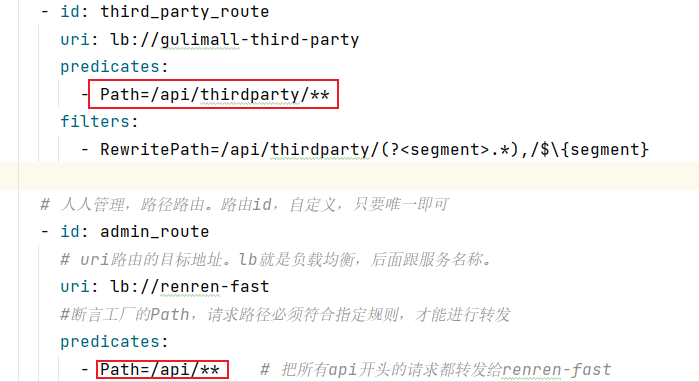

### 7.3.9、启动网关、测试获取oss签名请求

访问http://localhost:88/api/thirdparty/oss/policy测试

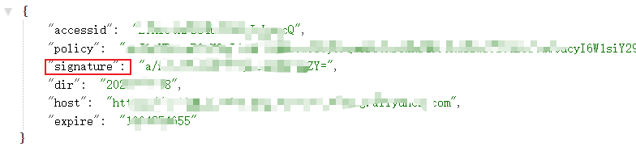


### 7.3.10、前端联调，实现文件上传功能

- 将资料里的upload文件夹cv在/renren-fast-vue/src/components中
- 修改multiUpload`.vue和singeUplad.vue`组件中**`el-upload`中的`action`属性**，替换成自己的**Bucket域名**

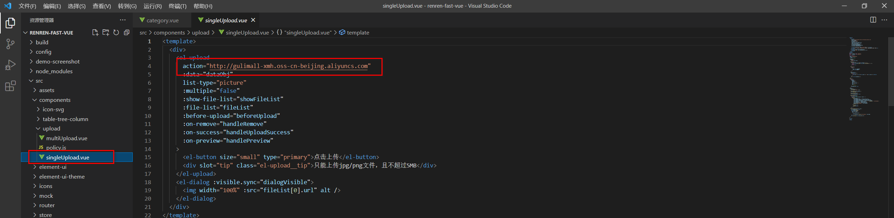

- `修改\src\views\modules\productbrand-add-or-update.vue，`把单个文件上传组件应用到`brand-add-or-update.vue`

```javascript
//在<script>标签中导入组件
import singleUpload from "@/components/upload/singleUpload"

//在export default中声明要用到的组件
  components:{
    singleUpload
  },
```


```XML
      <!--用新的组件替换原来的输入框-->
	  <el-form-item label="品牌logo地址" prop="logo">
        <singleUpload v-model="dataForm.logo"></singleUpload>
      </el-form-item>
```


### 7.3.11、在阿里云配置跨域规则

因为是直接从前端8001端口转到阿里云的**bucket域名**，所以会有**跨域问题：** 

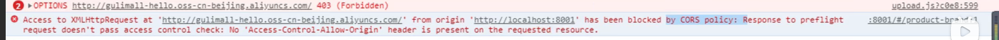

> **跨域都是目标地址需要配置规则，所以在阿里云网页配置规则。**


进入oss：[阿里云登录 - 欢迎登录阿里云，安全稳定的云计算服务平台](https://oss.console.aliyun.com/bucket/oss-cn-beijing/gulimall-vincewm/overview) 

点击概述，下拉基础设置，配置跨域访问：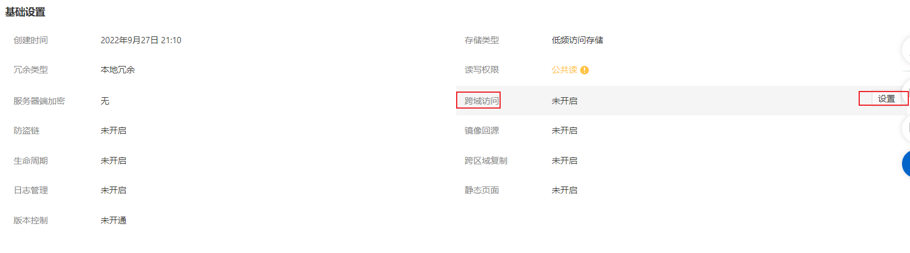


创建新规则

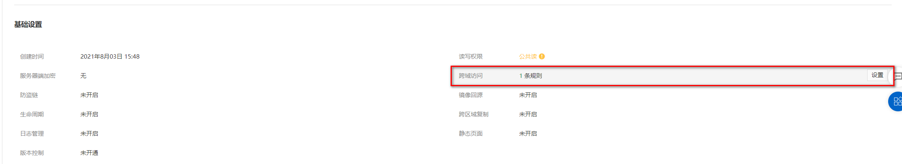

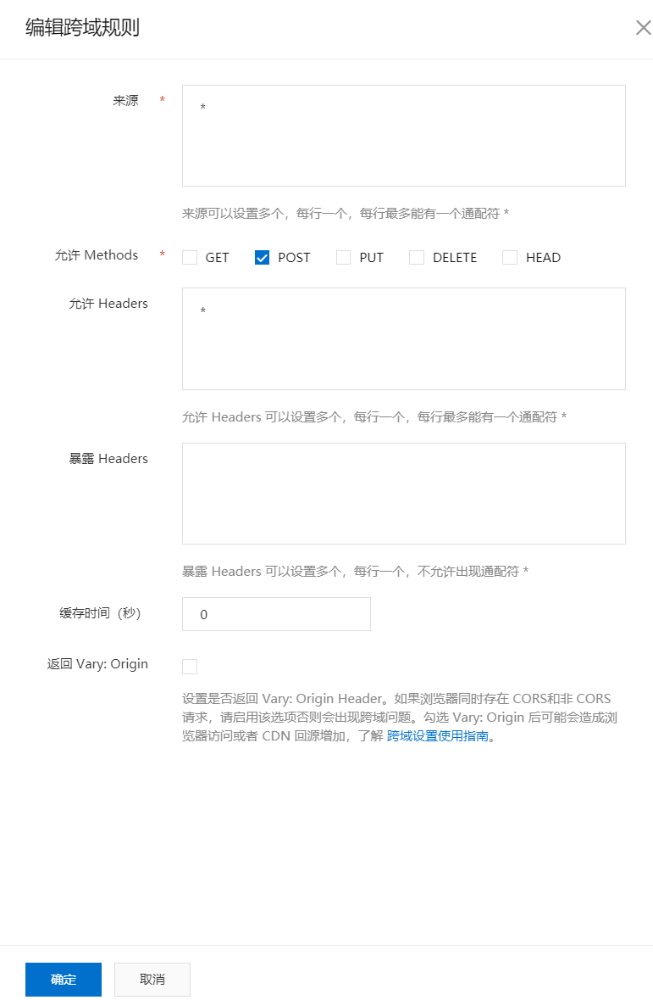

### 7.3.12、启动测试 

启动人人后台管理模块、网关、product、第三方模块 

http://localhost:8001/#/product-brand

点击添加品牌-图片上传，进行测试。

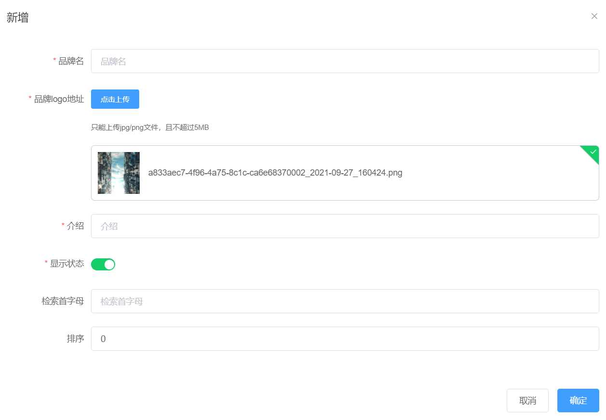

测试成功！

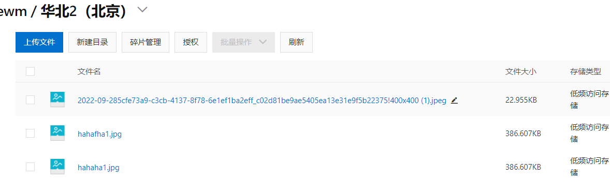

原图片名c02d81be9ae5405ea13e31e9f5b22375!400x400 (1) .jpeg

## 7.4、效果优化-显示图片（仅前端）

> 原效果：
>
> 新增品牌后，发现在品牌logo下面显示的是地址。应该显示图片。
>
> 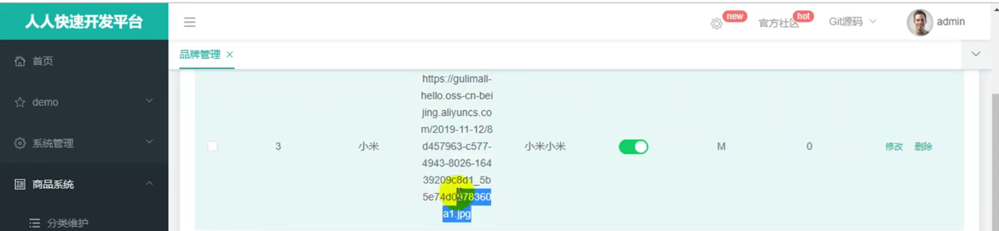
>
>  目标效果：

**需要组件：**elementUI里的table-自定义模板（自定义显示某一列，用于获取url）和others-Image。

在品牌logo下添加图片标签

```html
      <el-table-column
        prop="logo"
        header-align="center"
        align="center"
        label="品牌logo"
      >
        <template slot-scope="scope">
          
        </template>
      </el-table-column>
```


## 7.5、前端表单校验

- 首字母只能为a-z或者A-Z的一个字母
- 排序必须是大于等于0的一个整数

el-form中`rules`表示校验规则

```html
<!--排序加上.number表示要接受一个数字        -->
<el-input v-model.number="dataForm.sort" placeholder="排序"></el-input>
```


```javascript
	    //首字母校验规则
		firstLetter: [
          {
            validator: (rule, value, callback) => {
              if (value == '') {
                callback(new Error("首字母必须填写"));
              } else if (!/^[a-zA-Z]$/.test(value)) {
                callback(new Error("首字母必须在a-z或者A-Z之间"));
              } else {
                callback();
              }
            },
            trigger: "blur",
          },
        ],
        //排序字段校验规则
        sort: [
          {
            validator: (rule, value, callback) => {
              if (value == '') {
                callback(new Error("排序字段必须填写"));
              } else if (!Number.isInteger(value) || value < 0) {
                callback(new Error("排序字段必须是一个大于等于0的整数"));
              } else {
                callback();
              }
            },
            trigger: "blur",
          },
        ],
```


## 7.6、JSR303数字校验

**JSR303： Java数据校验规范提案。**

*jsr*，是Java Specification Requests的缩写，意思是Java规范提案，是指向JCP(Java Community Process)提出新增一个标准化技术规范的正式请求。

303号规定了数据校验的标准。 

### 7.6.1、**基本校验实现，@Valid**

- springboot2.3.0以上需要手动**引入依赖**,引入到common模块中

```XML
        <!-- https://mvnrepository.com/artifact/org.springframework.boot/spring-boot-starter-validation -->
        <dependency>
            <groupId>org.springframework.boot</groupId>
            <artifactId>spring-boot-starter-validation</artifactId>
            <version>2.3.2.RELEASE</version>
        </dependency>
```


- **给实体类添加校验注解，并自定义提示message**

product模块 

```java
@Data
@TableName("pms_brand")
public class BrandEntity implements Serializable {
	private static final long serialVersionUID = 1L;

	/**
	 * 品牌id
	 */
	@TableId
//	@NotNull(message = "修改必须有id",groups = {UpdateGroup.class})	//分组校验
//	@Null(message = "新增id必须为null",groups = {AddGroup.class})
	private Long brandId;
	/**
	 * 品牌名
	 */
	@NotBlank(message = "品牌名必须提交")    //不能是null和""和"  "
	private String name;
	/**
	 * 品牌logo地址。非空并且是url
	 */
	@NotEmpty    //不能是null和""
	@URL(message = "logo必须是一个合法的url地址")
	private String logo;
	/**
	 * 介绍
	 */
	private String descript;
	/**
	 * 显示状态[0-不显示；1-显示]
	 */
	private Integer showStatus;
	/**
	 * 检索首字母
	 */
	@NotEmpty
	@Pattern(regexp = "/^[a-zA-Z]$/", message = "检索首字母必须是一个字母")
	private String firstLetter;
	/**
	 * 排序
	 */
	@NotNull
	@Min(value = 0, message = "排序必须大于等于0")
	private Integer sort;

}
```


> **@NotEmpty和@NotBlank区别：**
>
> @NotEmpty非空，不能是null和""
>
> @NotBlank 非空白，不能是null和""和" "

- 在**需要校验的controller参数添加`@Valid`注解**，并返回提示信息

```java
    /**
     * 保存
     */
    @RequestMapping("/save")
    public R save(@RequestBody @Valid BrandEntity brand){
		brandService.save(brand);

        return R.ok();
    }
```


- **规范校验错误时返回结果，BindingResult 参数**

> **了解即可**，后面用异常类抛出异常，返回R.error()

```java
    @RequestMapping("/save")
    //@RequiresPermissions("product:brand:save")
    public R save(@Valid @RequestBody BrandEntity brand, BindingResult result){
        if (result.hasErrors()){
            Map<String, String> map = new HashMap<>();
            //1、获取校验的结果
            result.getFieldErrors().forEach((item)->{
                //获取到错误提示
                String message = item.getDefaultMessage();
                //获取到错误属性的名字
                String field = item.getField();
                map.put(field, message);
            });
            return R.error().put("data", map);
        }else{
            brandService.save(brand);
        }
        return R.ok();
    }
```


**启动product和网关，测试：**

```
POST http://localhost:88/api/product/brand/save
Content-Type: application/json

{"name": "aa", "logo": "avc"}
```


测试结果：

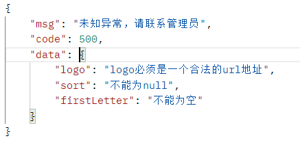


### 7.6.**2、统一封装错误状态码**

- 正规开发过程中，错误状态码有着严格的定义规则

**错误码和错误信息定义类：**

1. 错误码定义规则为**五位数字**
2. **前两位表示业务场景，最后三位表示错误码。**例如：100001。10:通用 001:系统未知异常
3. 维护错误码后需要维护错误描述，将他们定义为**枚举形式**


 **错误码列表（前两位业务场景）：**
 10: 通用
    如10001：参数格式校验失败
 11: 商品
 12: 订单
 13: 购物车
 14: 物流

为了定义这些错误状态码，我们可以单独定义一个常量类，用来存储这些错误状态码。

**在common模块的exception包中新建`BizCodeEnum枚举`用来存储状态码**

```java
//错误码和错误信息定义类：
//        1. 错误码定义规则为五位数字
//        2. 前两位表示业务场景，最后三位表示错误码。例如：100001。10:通用 001:系统未知异常
//        3. 维护错误码后需要维护错误描述，将他们定义为枚举形式
//
//
//        错误码列表（前两位业务场景）：
//         10: 通用
//             如10001：参数格式校验失败
//         11: 商品
//         12: 订单
//         13: 购物车
//         14: 物流
public enum BizCodeEnum {

    UNKNOW_EXEPTION(10000,"系统未知异常"),

    VALID_EXCEPTION( 10001,"参数格式校验失败");

    private int code;
    private String msg;
    BizCodeEnum(int code, String msg) {
        this.code = code;
        this.msg = msg;
    }

    public int getCode() {
        return code;
    }

    public String getMsg() {
        return msg;
    }
}
```


### 7.6.3、商品模块统一封装异常处理类，品牌参数校验异常

- 在**product**模块exception包下新建类**`GulimallExceptionControllerAdvice`**，用来**集中处理此模块所有异常**

> **为什么不放进common模块？**
>
> 因为**品牌参数校验异常具有个性化**，例如状态字段只能是1和0，所以只处理product模块异常，而不是放进common模块检测全局异常。

```java
@RestControllerAdvice(basePackages = "com.xmh.gulimall.product.controller")
public class GulimallExceptionControllerAdvice {

    // 处理数据校验异常
    @ExceptionHandler(value = MethodArgumentNotValidException.class)
    public R handleVaildException(MethodArgumentNotValidException e){
        BindingResult bindingResult = e.getBindingResult();
        Map<String, String> errorMap = new HashMap<>();
        bindingResult.getFieldErrors().forEach((fieldError)->{
            errorMap.put(fieldError.getField(), fieldError.getDefaultMessage());
        });

        return R.error(BizCodeEnume.VALID_EXCEPTION.getCode(),BizCodeEnume.VALID_EXCEPTION.getMsg()).put("data", errorMap);
    }

    //处理全局异常
    @ExceptionHandler(value = Throwable.class)    //Exception和Error继承自Throwable
    public R handleException(Throwable throwable){
        return R.error(BizCodeEnume.UNKNOW_EXEPTION.getCode(), BizCodeEnume.UNKNOW_EXEPTION.getMsg());
    }

}
```


**BrandController改回来，以后都用捕获异常**

```java
    /**
     * 保存
     */
    @RequestMapping("/save")
    public R save(@Valid @RequestBody BrandEntity brand, BindingResult result) {
        brandService.save(brand);
        return R.ok();
    }
```


- 测试

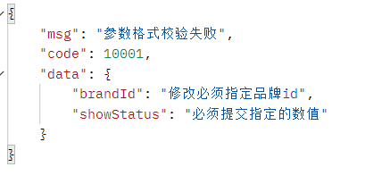


### **7.6.4、分组校验，增改校验分开，@Validated**

> **场景：新增时id必须为空，修改时id必须非空**，这样实体类注解就凌乱了，这时就必须用到分组校验。
>
> **注意：**
>
> - 实体类变量注解分组，代表此变量支持这些分组的校验。
> - controller参数对象注解分组，代表这个对象只校验有配置这个分组的成员变量。

- 在common模块中valid包里**新建空接口`AddGroup`,`UpdateGroup`**用来分组

- **实体类的id进行分组校验**

  Brand实体类：

  ```java
  @Data
  @TableName("pms_brand")
  public class BrandEntity implements Serializable {
  	private static final long serialVersionUID = 1L;
  
  	/**
  	 * 品牌id
  	 */
  	@NotNull(message = "修改必须指定品牌id",groups = {UpdateGroup.class})
  	@Null(message = "新增不能指定id",groups = {AddGroup.class})
  	@TableId
  	private Long brandId;
  	/**
  	 * 品牌名
  	 */
  	@NotBlank(message = "品牌名必须提交",groups = {AddGroup.class,UpdateGroup.class})
  	private String name;
  	/**
  	 * 品牌logo地址
  	 */
  	@NotBlank(groups = {AddGroup.class})
  	@URL(message = "logo必须是一个合法的url地址",groups={AddGroup.class,UpdateGroup.class})
  	private String logo;
  	/**
  	 * 介绍
  	 */
  	private String descript;
  	/**
  	 * 显示状态[0-不显示；1-显示]。自定义校验
  	 */
  //	@Pattern()
  	@NotNull(groups = {AddGroup.class, UpdateStatusGroup.class})
    	@ListValue(vals={0,1},groups = {AddGroup.class, UpdateStatusGroup.class})
  	private Integer showStatus;
  	/**
  	 * 检索首字母
  	 */
  	@NotEmpty(groups={AddGroup.class})
  	@Pattern(regexp="^[a-zA-Z]$",message = "检索首字母必须是一个字母",groups={AddGroup.class,UpdateGroup.class})
  	private String firstLetter;
  	/**
  	 * 排序
  	 */
  	@NotNull(groups={AddGroup.class})
  	@Min(value = 0,message = "排序必须大于等于0",groups={AddGroup.class,UpdateGroup.class})
  	private Integer sort;
  
  }
  ```

  

  在这种情况下，没有指定分组的校验注解，默认是不起作用的。想要起作用就必须要加groups。

> **注意：没有指定分组的校验，**默认是不起作用的，所以要给所有属性都指定分组。

- **@Valid改为@Validated注解，值为group接口数组，标记当前校验是哪个组**

  ```java
      /**
       * 保存
       */
      @RequestMapping("/save")
      public R save(@Validated({AddGroup.class}) @RequestBody BrandEntity brand) {  // BindingResult result
          brandService.save(brand);
          return R.ok();
      }
  
  
      /**
       * 修改
       */
      @RequestMapping("/update")
      public R update(@RequestBody @Validated({UpdateGroup.class}) BrandEntity brand) {
          brandService.updateById(brand);
  
          return R.ok();
      }
  ```

  

- 测试：

http://localhost:88/api/product/brand/save

post请求，{"name": "aaa", "logo": "m","brandId":32}


### **7.6.5、编写自定义校验，必须提交指定数值**

> 此步骤其实是画蛇添足的，因为前端状态字段是状态栏，值只能是0和1 

> **步骤：**
>
> - 编写一个**自定义校验注解`ListValue`**
> - 新建**配置文件**`ValidationMessages.properties`保存**注解信息**
> - 编写一个**自定义校验器`ListValueConstraintValidator`**
> - **关联**自定义的校验器和自定义的校验注解`（可以指定多个不同的校验器，适配不同类型的校验）`

common模块引入依赖（已完成） ：

```XML
        <dependency>
            <groupId>jakarta.validation</groupId>
            <artifactId>jakarta.validation-api</artifactId>
            <version>2.0.2</version>
        </dependency>
```


**自定义校验注解@ListValue：**

> 这里可以ctrl+b参考其他@NotNull等注解编写。

common模块的valid包下：

```java
@Documented
//约束。同一个注解可以指定多个不同的校验器，适配不同类型的校验。这里ListValueConstraintValidator.class是数值校验器
@Constraint(validatedBy = {ListValueConstraintValidator.class})
//可以标注在哪些位置。方法、字段等。
@Target({ElementType.METHOD, ElementType.FIELD, ElementType.ANNOTATION_TYPE, ElementType.CONSTRUCTOR, ElementType.PARAMETER, ElementType.TYPE_USE})
//注解的时机。这里是可以在运行时获取校验
@Retention(RetentionPolicy.RUNTIME)
public @interface ListValue {
//    校验出错后，错误信息去哪取。前缀一般是当前全类名，在ValidationMessages.properties配置文件里设置com.atguigu.common.valid.ListValue.message=必须提交指定的值
    String message() default "{com.vince.common.valid.ListValue.message}";
//    支持分组校验的功能
    Class<?>[] groups() default {};
//    自定义负载信息
    Class<? extends Payload>[] payload() default {};
//    自定义注解里的属性
    int[] vals() default {};
}
```


**配置校验注解提示信息：** 

common模块创建配置文件ValidationMessages.properties：

```java
com.atguigu.common.valid.ListValue.message=必须提交指定的值
```


**编写自定义校验器，** **数值必须包含在vals范围内**

校验器实现ConstraintValidator接口。common模块的valid包下： 

```java
//第一个泛型是校验注解，第二个泛型是校验数据类型
public class ListValueConstraintValidator implements ConstraintValidator<ListValue,Integer> {
    private Set<Integer> set=new HashSet<>();
//    初始化方法,ListValue是自定义的注解.
    @Override
    public void initialize(ListValue constraintAnnotation) {
        int[] value = constraintAnnotation.vals();
        for (int i : value) {
            set.add(i);
        }

    }

    /**
     * 判断是否校验成功
     * @param value 需要校验的值
     * @param context
     * @return
     */
    @Override
    public boolean isValid(Integer value, ConstraintValidatorContext context) {
        return  set.contains(value);
    }
}
```


 **关联校验器和校验注解：**

在校验注解的@Constraint的validateBy属性中加入校验器

```java
@Constraint(validatedBy = {ListValueConstraintValidator.class})
```


### **7.6.6、使用自定义校验，showStatus只能是0或1**

 common模块的valid包下：


```java
public interface UpdateStatus {
}
```


实体类：

```java
	@NotNull(groups = {AddGroup.class, UpdateStatusGroup.class})
	@ListValue(vals={0,1},groups = {AddGroup.class, UpdateStatusGroup.class})
	private Integer showStatus;
```


BrandController 

```java
    /**
     * 修改状态
     * @param brand
     * @return
     */
    @RequestMapping("/update/status")
    public R updateStatus(@RequestBody @Validated({UpdateGroup.class}) BrandEntity brand) {
        brandService.updateById(brand);

        return R.ok();
    }
```


修改前端路径：

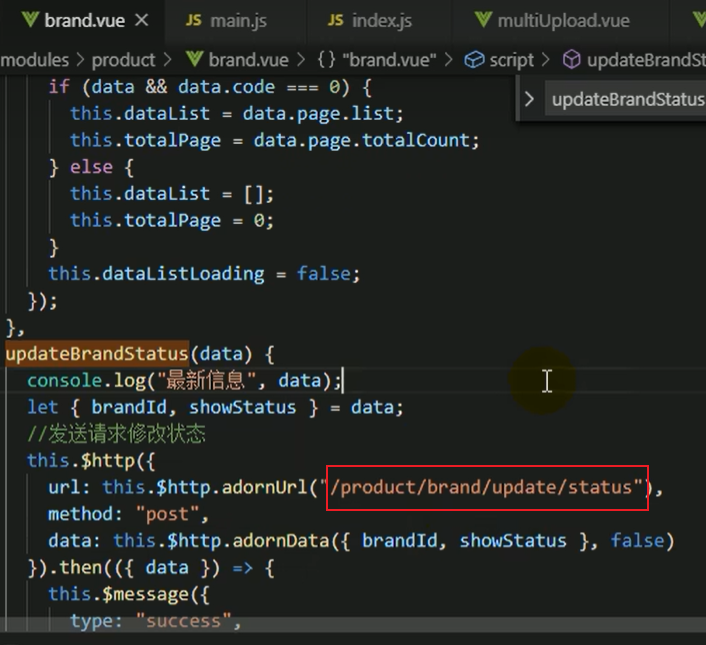

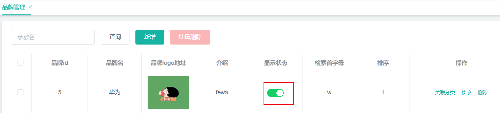


### 7.6.8、最终校验的实体类和controller代码

实体类：

```java
@Data
@TableName("pms_brand")
public class BrandEntity implements Serializable {
	private static final long serialVersionUID = 1L;

	/**
	 * 品牌id
	 */
	@NotNull(message = "修改必须指定品牌id",groups = {UpdateGroup.class,UpdateStatusGroup.class})
	@Null(message = "新增不能指定id",groups = {AddGroup.class})
	@TableId
	private Long brandId;
	/**
	 * 品牌名
	 */
	@NotBlank(message = "品牌名必须提交",groups = {AddGroup.class,UpdateGroup.class})
	private String name;
	/**
	 * 品牌logo地址
	 */
	@NotBlank(groups = {AddGroup.class,UpdateGroup.class})
	@URL(message = "logo必须是一个合法的url地址",groups={AddGroup.class,UpdateGroup.class})
	private String logo;
	/**
	 * 介绍
	 */
	private String descript;
	/**
	 * 显示状态[0-不显示；1-显示]
	 */

	@NotNull(groups = {AddGroup.class,UpdateGroup.class, UpdateStatusGroup.class})
	@ListValue(vals={0,1},groups = {AddGroup.class, UpdateStatusGroup.class})
	private Integer showStatus;
	/**
	 * 检索首字母
	 */
	@NotEmpty(groups={AddGroup.class,UpdateGroup.class})
	@Pattern(regexp="^[a-zA-Z]$",message = "检索首字母必须是一个字母",groups={AddGroup.class,UpdateGroup.class})
	private String firstLetter;
	/**
	 * 排序
	 */
	@NotNull(groups={AddGroup.class,UpdateGroup.class})
	@Min(value = 0,message = "排序必须大于等于0",groups={AddGroup.class,UpdateGroup.class})
	private Integer sort;

}
```


controller：

```java
    /**
     * 保存
     */
    @RequestMapping("/save")
    //校验有注解AddGroup的字段，基本每个字段都有，主要是必须id为null
    public R save(@Validated({AddGroup.class}) @RequestBody BrandEntity brand) {  // BindingResult result
        brandService.save(brand);
        return R.ok();
    }


    /**
     * 修改
     */
    @RequestMapping("/update")
    //校验有注解UpdateGroup的字段，基本每个字段都有，主要是必须id不为null
    public R update(@RequestBody @Validated({UpdateGroup.class}) BrandEntity brand) {
        brandService.updateById(brand);

        return R.ok();
    }

    /**
     * 仅修改状态
     * @param brand
     * @return
     */
    @RequestMapping("/update/status")
    //校验传来对象的status属性，只能是0或者1。
    public R updateStatus(@RequestBody @Validated({UpdateStatusGroup.class}) BrandEntity brand) {   //只校验状态
        brandService.updateById(brand);

        return R.ok();
    }
```


### 7.6.9、postman测试校验

**增：** 

http://localhost:88/api/product/brand/save

post 

{"name": "aaa", "logo": "m","brandId":32}

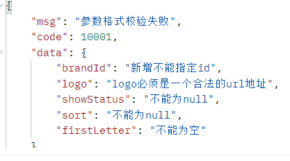

**改：**

http://localhost:88/api/product/brand/update

post

{"name": "aaa", "logo": "m"} 

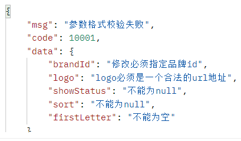

**只改状态 ：**

http://localhost:88/api/product/brand/update/status

 post

{"brandId":1,"showStatus":2}

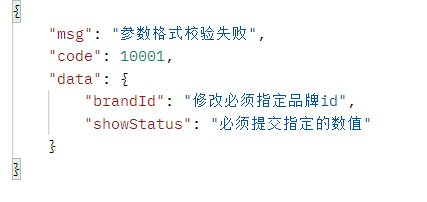