>  **导航：**
>
> [谷粒商城笔记+踩坑汇总篇](https://blog.csdn.net/qq_40991313/article/details/127099139?spm=1001.2014.3001.5501)
>
>  **Java笔记汇总：**
>
> [【Java笔记+踩坑汇总】Java基础+JavaWeb+SSM+SpringBoot+SpringCloud+瑞吉外卖/谷粒商城/学成在线+设计模式+面试题汇总+性能调优/架构设计+源码解析-CSDN博客](https://blog.csdn.net/qq_40991313/article/details/126646289)

[TOC]


# 8、商品服务-属性分组

## 8.0、 SPU和SKU

### 8.0.1、概念 

***SPU\*(Standard Product Unit)：**标准化产品单元。是商品信息聚合的最小单位，是一组可复用、易检索的标准化信息的**集合**，该集合描述了一个产品的特性。通俗点讲，**属性值、特性相同的商品集合就可以称为一个\*SPU\*。**

***SKU（\*Stock Keeping Unit*****）：**SKU*一般指**最小存货单位**、最小售卖单元。 最小存货单位（*SKU*），即库存进出计量的基本单元，可以是**以件，盒，托盘等为单位。** 

**SKU：**最小存货单位是对于大型连锁超市DC配送中心物流管理的一个必要的方法。现在已经被**引申为`产品统一编号`的简称**，**每种产品对应有唯一的SKU号**。如iphone13ProMax 1T 蓝色 是SKU，包子店中肉包子是SKU，素包子是SKU，水煎包是SKU… 

### 8.0.2、**举例**

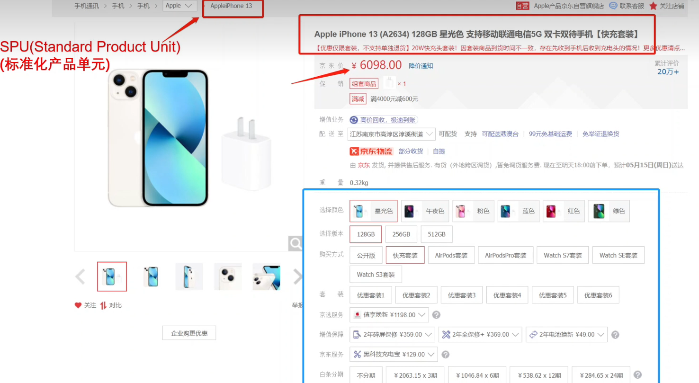

**spu：**这个苹果13是一个spu，标准化产品单位，它包括128g、256g、红色、绿色等。

**sku：**苹果13-绿色-128g-快充套餐-是一个sku。这些sku属于同一个spu，分辨率、发布日期等公用规格参数都是一样的。

**一个spu包括了多个sku，sku决定最终价格：**

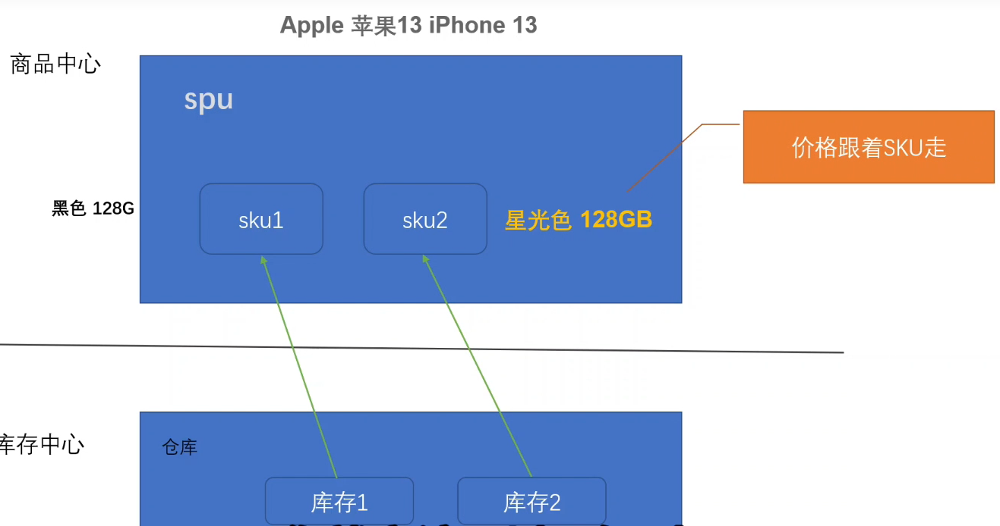


### 8.0.3、销售属性、基本属性（规格参数）、属性分组、平台属性


**销售属性：**购物时下面这些可选择的框就是销售属性，会影响最终价格。

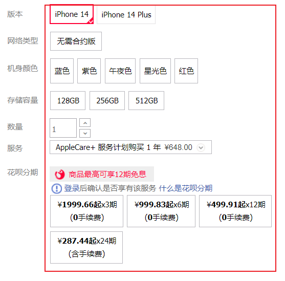


颜色、内存是手机的销售属性：

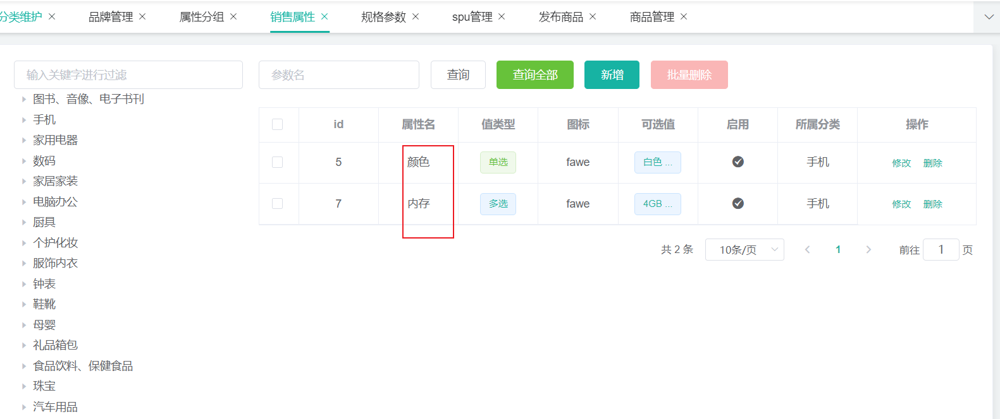


**规格参数：**商品详情页展示商品信息的属性为规格参数，同个spu里各sku规格参数相同。


例如“入网型号” 和“上市年份”是苹果14的规格参数。

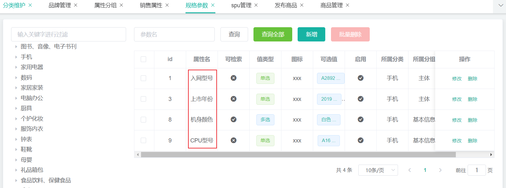


**属性分组和规格参数：**


> **“平台属性”后台最终效果：**
>
> 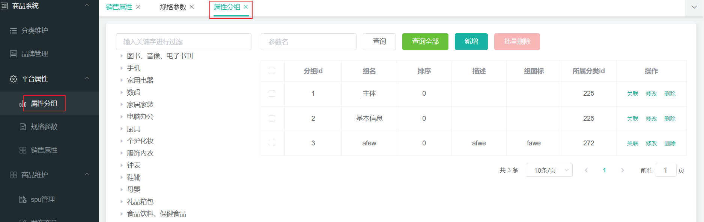
>
> 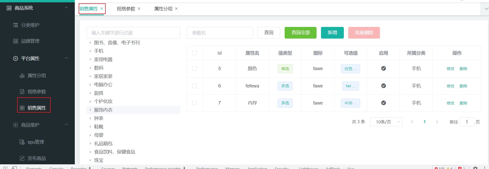
>
> 

### 8.0.3、分类表、属性表、属性分组表表关系详解

**（1）属性关系-规格参数-销售属性-三级分类 关联关系**

**每个三级分类下有各自的属性分组表**通过`id和catelogid关联`，能查出每个**分类下的属性分组**

属性分组表和属性表通过一个`属性&属性关联表`进行关联，能查出每个**属性分组下的属性**

最终这样的关系我们可以查出每个分类的`属性分组`和每个`属性分组对应的属性`

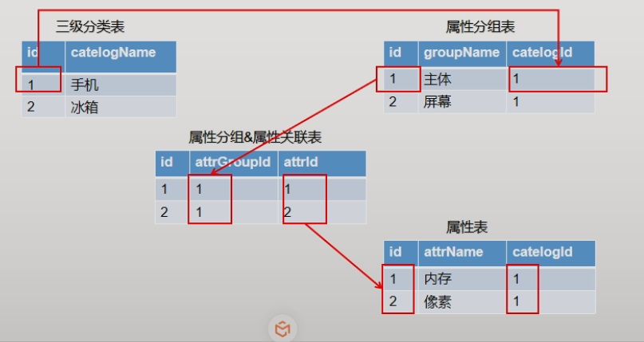

**（2）通过思维导图来理解**

> **手机是一级分类**，它下面又有**属性组**，每个属性组又有各自的**属性**

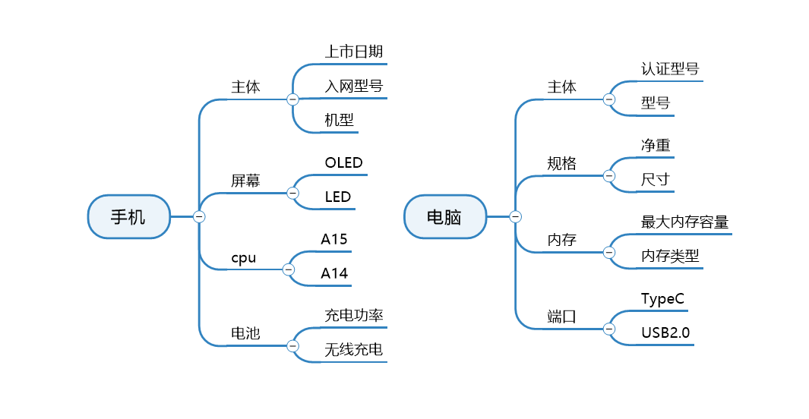

**（3）SPU-SKU-属性表**

商品属性表和属性表通过`attrid`和`id`进行关联，能查出每个**spu的属性**

sku销售属性表是为了表示`spu下不同sku`，比如**1号spu在此表有两个sku**，这两个**sku有不同的销售属性**，是通过`和属性表关联获取`的

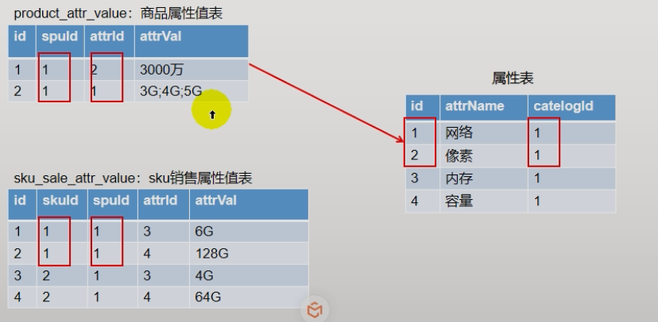

**（4）通过思维导图来理解**

> 像网络、像素一般是固定不可选的所以是SPU属性
>
> 而内存、容量、颜色等可选的就为SKU销售属性

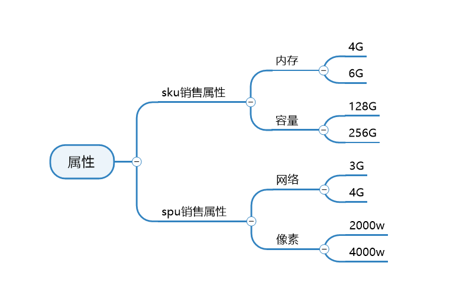


## 8.1、环境准备

### 8.1.1、后台页面导入全部菜单

**运行`sys_menus.sql`创建全部菜单，建议复制粘贴到Navicat运行，直接拖进去可能会乱码。**也可以在后台页面‘“系统管理-菜单管理”一个个创建。

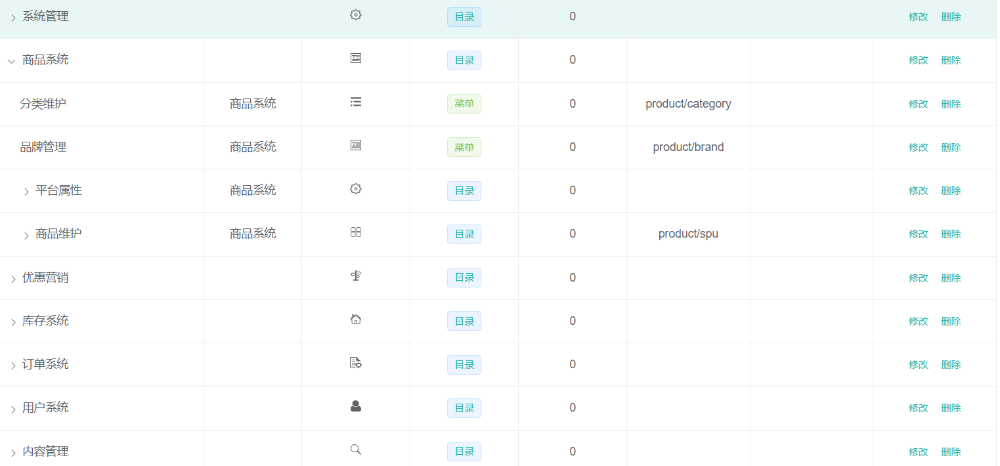


### 8.1.2、接口文档地址 

以后**前端代码**不自己编写了，复制/代码/前端/modules/文件夹里面的内容复制到vs中

**接口文档地址：**https://easydoc.xyz/s/78237135

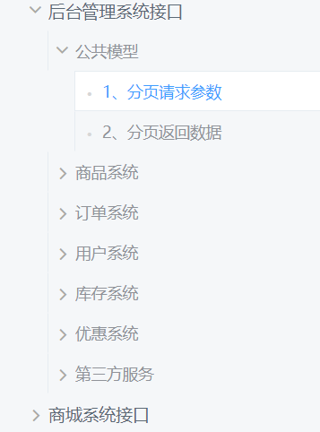


## 8.2、导入前端代码

### 8.2.1、属性分组功能的前端组件


> **需求：**在属性分组菜单中展示分类树，实现点击菜单的左边的分类树，能够实现在右边展示数据并且修改。

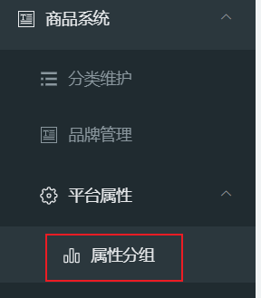


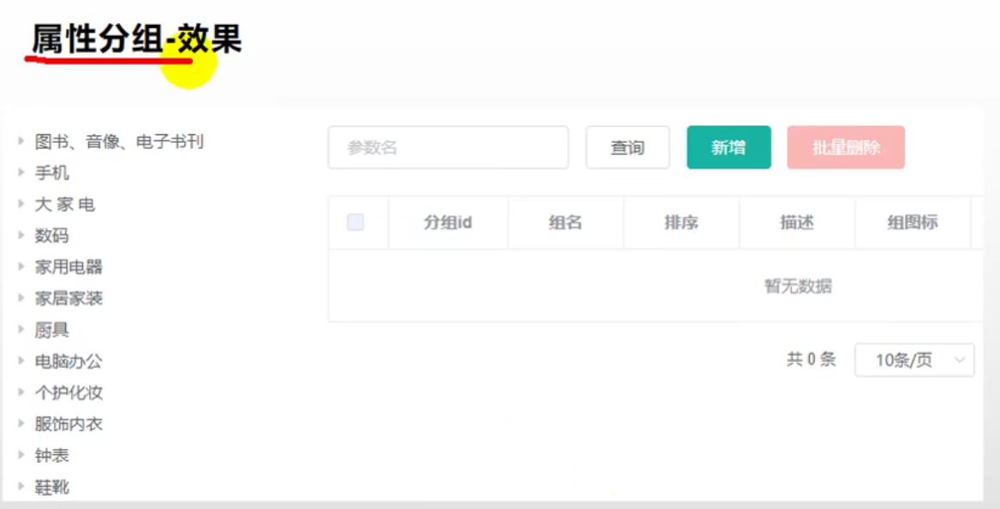

**具体实现**

- 在前端src-views-modeules下**新建`common/categroy.vue`，公共组件**。抽出去左侧菜单

  ```html
  <!--  -->
  <template>
    <el-tree :data="menus" :props="defaultProps" node-key="catId" ref="menuTree">
    </el-tree>
  </template>
  
  <script>
  //这里可以导入其他文件（比如：组件，工具js，第三方插件js，json文件，图片文件等等）
  //例如：import 《组件名称》 from '《组件路径》';
  
  export default {
    //import引入的组件需要注入到对象中才能使用
    components: {},
    data() {
      //这里存放数据
      return {
        menus: [],
        expandedKey: [],
        defaultProps: {
          children: "children", //子节点
          label: "name", //name属性作为标签的值，展示出来
        },
      };
    },
    //监听属性 类似于data概念
    computed: {},
    //监控data中的数据变化
    watch: {},
    //方法集合
    methods: {
      getMenus() {
        this.$http({
          url: this.$http.adornUrl("/product/category/list/tree"),
          method: "get",
        }).then(({ data }) => {
          console.log("成功了获取到菜单数据....", data.data);
          this.menus = data.data;
        });
      },
    },
    //生命周期 - 创建完成（可以访问当前this实例）
    created() {
        this.getMenus();
    },
    //生命周期 - 挂载完成（可以访问DOM元素）
    mounted() {},
    beforeCreate() {}, //生命周期 - 创建之前
    beforeMount() {}, //生命周期 - 挂载之前
    beforeUpdate() {}, //生命周期 - 更新之前
    updated() {}, //生命周期 - 更新之后
    beforeDestroy() {}, //生命周期 - 销毁之前
    destroyed() {}, //生命周期 - 销毁完成
    activated() {}, //如果页面有keep-alive缓存功能，这个函数会触发
  };
  </script>
  <style scoped>
  </style>
  ```

  

- 把前端生成的`attrgroup-add-or-update.vue`复制到modules/product下

- 在modules/product/下创建`attrgroup.vue`

  - 布局：左侧6用来显示菜单，右侧18用来显示表格
  - 引入公共组件`Category, AddOrUpdate`
  - 剩下的复制生成的`attrgroup.vue`

  ```html
  <!--  -->
  <template>
    <el-row :gutter="20">
      <el-col :span="6"><category></category></el-col>
      <el-col :span="18"
        ><div class="mod-config">
          <el-form
            :inline="true"
            :model="dataForm"
            @keyup.enter.native="getDataList()"
          >
            <el-form-item>
              <el-input
                v-model="dataForm.key"
                placeholder="参数名"
                clearable
              ></el-input>
            </el-form-item>
            <el-form-item>
              <el-button @click="getDataList()">查询</el-button>
              <el-button
                v-if="isAuth('product:attrgroup:save')"
                type="primary"
                @click="addOrUpdateHandle()"
                >新增</el-button
              >
              <el-button
                v-if="isAuth('product:attrgroup:delete')"
                type="danger"
                @click="deleteHandle()"
                :disabled="dataListSelections.length <= 0"
                >批量删除</el-button
              >
            </el-form-item>
          </el-form>
          <el-table
            :data="dataList"
            border
            v-loading="dataListLoading"
            @selection-change="selectionChangeHandle"
            style="width: 100%"
          >
            <el-table-column
              type="selection"
              header-align="center"
              align="center"
              width="50"
            >
            </el-table-column>
            <el-table-column
              prop="attrGroupId"
              header-align="center"
              align="center"
              label="分组id"
            >
            </el-table-column>
            <el-table-column
              prop="attrGroupName"
              header-align="center"
              align="center"
              label="组名"
            >
            </el-table-column>
            <el-table-column
              prop="sort"
              header-align="center"
              align="center"
              label="排序"
            >
            </el-table-column>
            <el-table-column
              prop="descript"
              header-align="center"
              align="center"
              label="描述"
            >
            </el-table-column>
            <el-table-column
              prop="icon"
              header-align="center"
              align="center"
              label="组图标"
            >
            </el-table-column>
            <el-table-column
              prop="catelogId"
              header-align="center"
              align="center"
              label="所属分类id"
            >
            </el-table-column>
            <el-table-column
              fixed="right"
              header-align="center"
              align="center"
              width="150"
              label="操作"
            >
              <template slot-scope="scope">
                <el-button
                  type="text"
                  size="small"
                  @click="addOrUpdateHandle(scope.row.attrGroupId)"
                  >修改</el-button
                >
                <el-button
                  type="text"
                  size="small"
                  @click="deleteHandle(scope.row.attrGroupId)"
                  >删除</el-button
                >
              </template>
            </el-table-column>
          </el-table>
          <el-pagination
            @size-change="sizeChangeHandle"
            @current-change="currentChangeHandle"
            :current-page="pageIndex"
            :page-sizes="[10, 20, 50, 100]"
            :page-size="pageSize"
            :total="totalPage"
            layout="total, sizes, prev, pager, next, jumper"
          >
          </el-pagination>
          <!-- 弹窗, 新增 / 修改 -->
          <add-or-update
            v-if="addOrUpdateVisible"
            ref="addOrUpdate"
            @refreshDataList="getDataList"
          ></add-or-update></div
      ></el-col>
    </el-row>
  </template>
  
  <script>
  //这里可以导入其他文件（比如：组件，工具js，第三方插件js，json文件，图片文件等等）
  //例如：import 《组件名称》 from '《组件路径》';
  import Category from "../common/category.vue";
  import AddOrUpdate from "./attrgroup-add-or-update.vue";
  
  export default {
    //import引入的组件需要注入到对象中才能使用
    components: { Category, AddOrUpdate},
    data() {
      return {
        dataForm: {
          key: "",
        },
        dataList: [],
        pageIndex: 1,
        pageSize: 10,
        totalPage: 0,
        dataListLoading: false,
        dataListSelections: [],
        addOrUpdateVisible: false,
      };
    },
    activated() {
      this.getDataList();
    },
    methods: {
      // 获取数据列表
      getDataList() {
        this.dataListLoading = true;
        this.$http({
          url: this.$http.adornUrl("/product/attrgroup/list"),
          method: "get",
          params: this.$http.adornParams({
            page: this.pageIndex,
            limit: this.pageSize,
            key: this.dataForm.key,
          }),
        }).then(({ data }) => {
          if (data && data.code === 0) {
            this.dataList = data.page.list;
            this.totalPage = data.page.totalCount;
          } else {
            this.dataList = [];
            this.totalPage = 0;
          }
          this.dataListLoading = false;
        });
      },
      // 每页数
      sizeChangeHandle(val) {
        this.pageSize = val;
        this.pageIndex = 1;
        this.getDataList();
      },
      // 当前页
      currentChangeHandle(val) {
        this.pageIndex = val;
        this.getDataList();
      },
      // 多选
      selectionChangeHandle(val) {
        this.dataListSelections = val;
      },
      // 新增 / 修改
      addOrUpdateHandle(id) {
        this.addOrUpdateVisible = true;
        this.$nextTick(() => {
          this.$refs.addOrUpdate.init(id);
        });
      },
      // 删除
      deleteHandle(id) {
        var ids = id
          ? [id]
          : this.dataListSelections.map((item) => {
              return item.attrGroupId;
            });
        this.$confirm(
          `确定对[id=${ids.join(",")}]进行[${id ? "删除" : "批量删除"}]操作?`,
          "提示",
          {
            confirmButtonText: "确定",
            cancelButtonText: "取消",
            type: "warning",
          }
        ).then(() => {
          this.$http({
            url: this.$http.adornUrl("/product/attrgroup/delete"),
            method: "post",
            data: this.$http.adornData(ids, false),
          }).then(({ data }) => {
            if (data && data.code === 0) {
              this.$message({
                message: "操作成功",
                type: "success",
                duration: 1500,
                onClose: () => {
                  this.getDataList();
                },
              });
            } else {
              this.$message.error(data.msg);
            }
          });
        });
      },
    },
  };
  </script>
  <style scoped>
  </style>
  ```

  

### 8.2.2、父子组件传递数据

要实现功能：点击左侧，右侧表格对应内容显示。

父子组件传递数据：`category.vue`点击时，引用它的`attgroup.vue`能感知到， 然后通知到add-or-update

1、子组件发送事件

- 在`category.vue`中的树形控件绑定点击事件`@node-click="nodeclick"`
- node-click方法中有三个参数(data, node, component),data表示当前数据，node为elementui封装的数据
- 点击之后向父组件发送事件：`this.$emit("tree-node-click",...)` …为参数

```javascript
//组件绑定事件
<el-tree :data="menus" :props="defaultProps" node-key="catId" ref="menuTree" @node-click="nodeclick">

    
//methods中新增方法
	nodeclick(data, node, component){
      console.log("子组件categroy的节点被点击:", data,node,component);
      this.$emit("tree-node-click", data,node,component); //向父组件发送tree-node-click事件
    }
```


2、父组件接收事件

```javascript
//引用的组件，可能会发散tree-node-click事件，当接收到时，触发父组件的treenodeclick方法
<category @tree-node-click="treenodeclick"></category>


//methods中新增treenodeclick方法，验证父组件是否接收到
      treenodeclick(data, node, component){
          console.log("attrgroup感知到category的节点被点击：",data, node, component);
          console.log("刚才被点击的菜单名字", data.name);
      },
```


3、启动测试

## 8.3、查询“属性分组”列表，按参数

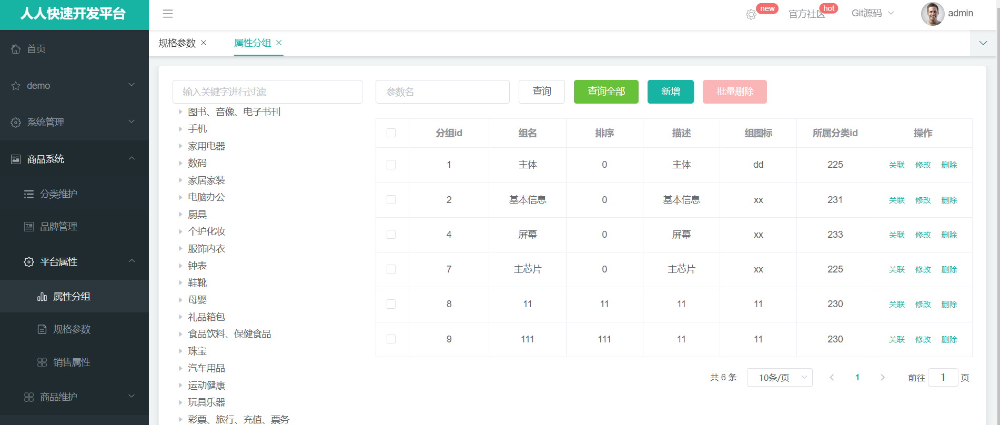

**0、需求：**分页查询指定分类id下的“属性分组”列表

**1、接口url：**


```
/product/attrgroup/list/{catelogId}
```


> attr是attribute缩写，译为属性。 


**2、修改controller的list方法**

> **请求参数和响应数据：**
>
> 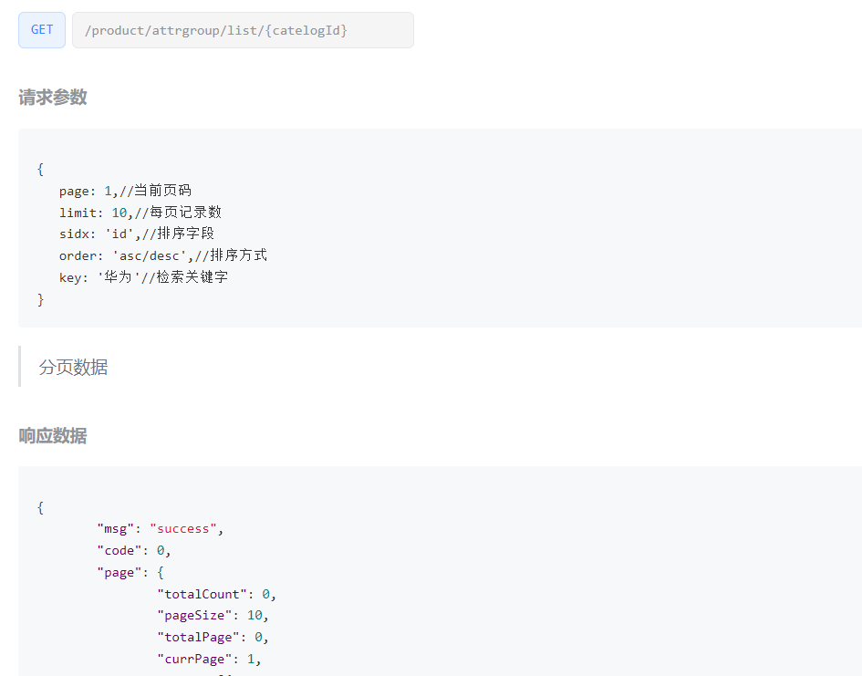

```java
    @RequestMapping("/list/{catelogId}")
    public R list(@RequestParam Map<String, Object> params, @PathVariable Long catelogId){
        //PageUtils page = attrGroupService.queryPage(params);
        PageUtils page = attrGroupService.queryPage(params, catelogId);
        return R.ok().put("page", page);
    }
```


**3、service编写查询方法**

```java
    @Override
    public PageUtils queryPage(Map<String, Object> params, Long categoryId) {
        String key = (String) params.get("key");
        LambdaQueryWrapper<AttrGroupEntity> wrapper = new LambdaQueryWrapper<>();
        //先根据检索查
        if(StringUtils.isNotEmpty(key)){
//wrapper.eq(AttrGroupEntity::getAttrGroupId,key).or().like(AttrGroupEntity::getAttrGroupName,key);//也可以，因为多条件查询默认是and，or要用.or()。
            wrapper.and(
                    obj->obj.eq(AttrGroupEntity::getAttrGroupId,key).or().like(AttrGroupEntity::getAttrGroupName,key)
            );
        }
        if(categoryId!=0) {
            wrapper.eq(AttrGroupEntity::getCatelogId,categoryId);
        }
        IPage<AttrGroupEntity> page = this.page(
                new Query<AttrGroupEntity>().getPage(params),
                wrapper
        );

        return new PageUtils(page);

    }
```


**4、测试后端**

```bash
GET http://localhost:88/api/product/attrgroup/list/1?page=1&key=aa
Content-Type: application/json


###
```


测试结果：

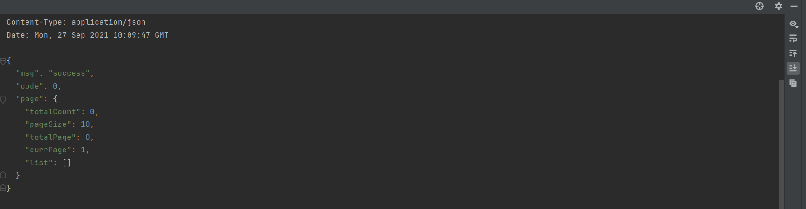

**5、修改前端代码**

- 修改getDataList()中的请求路径
- data中新增`catId`
- methods中修改点击方法

 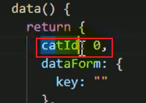


```javascript
    treenodeclick(data, node, component) {
      //必须是三级分类，才显示属性
      if (data.catLevel == 3){
          this.catId = data.catId;
          this.getDataList();
      }
    },
```


**6、新增假数据，测试页面：**

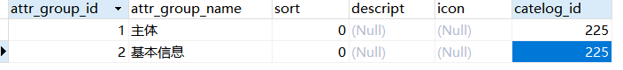

225分类id对应手机

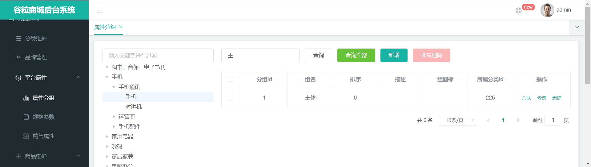


## 8.4、新增属性分组

新增时，**父id改换成选择框** 

### **8.4.1、** **新增选择框，**elementUI级联选择器el-cascader

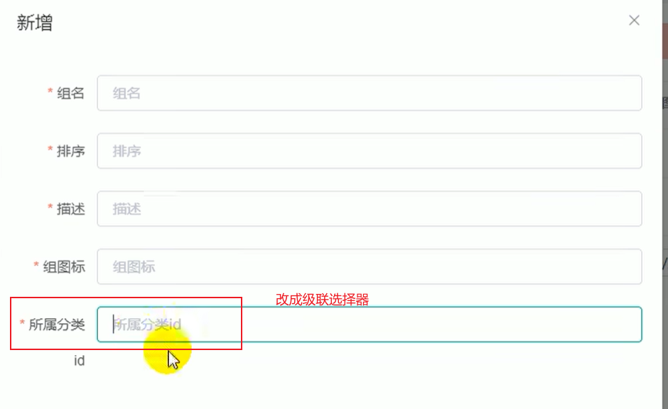


- 发现可以选择但是并不显示名称，原因是显示的属性是`label`，通过`props`属性进行绑定

elementUI级联选择器 

```html
      <!--v-model 绑定要提交的数据，options绑定选择菜单, props绑定选择框的参数-->
      <el-form-item label="所属分类id" prop="catelogId">
        <el-cascader v-model="dataForm.catelogIds" :options="categroys" :props="props"></el-cascader>
      </el-form-item>
```


```javascript
//data中新增属性，props用来绑定选择框的参数，categorys用来保存菜单
	  props:{
        value:"catId",
        label:"name",
        children:"children"
      },
      categroys:[],
          
//方法中新增getCategorys(),用来获取选择菜单的值
getCategorys() {
      this.$http({
        url: this.$http.adornUrl("/product/category/list/tree"),
        method: "get",
      }).then(({ data }) => {
        console.log("成功了获取到菜单数据....", data.data);
        this.categroys = data.data;
      });
    },
        
        
//组件创建的时候就要获取菜单的值
  created(){
    this.getCategorys();
  }        
```


### **8.4.**2、children字段注解@JsonInclude

> **当前问题：** 
>
> 发现返回的数据，**无子分类**下面也有**children（为空）**解决方法：设置后端，当children为空时，不返回children字段：
>
> 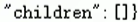
>
> 
>
> 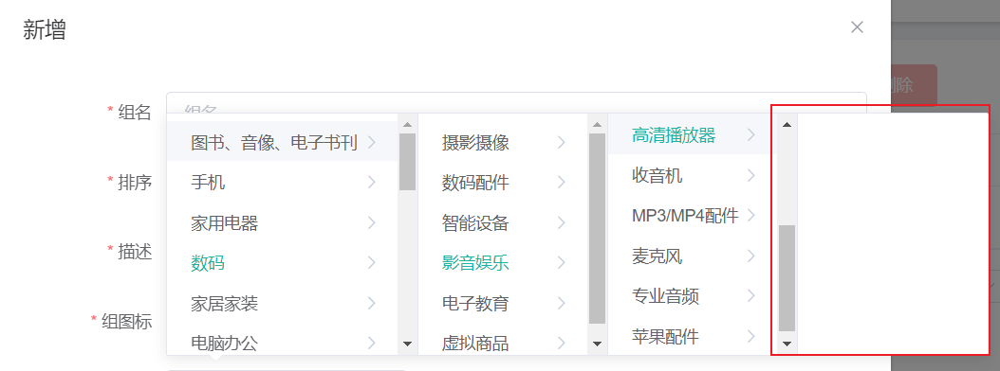

**解决：** 

在分类实体类的children字段上添加注解：**当值为空时，不返回当前字段**

```java
	@TableField(exist = false) //表示数据库表中不存在
	@JsonInclude(JsonInclude.Include.NON_EMPTY)
	private List<CategoryEntity> children;
```


**此时无子分类的children字段就为空：**

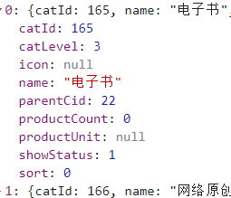


### **8.4.**3、前端报错解决，修改前端`catelogId`

**选择“所属分类”之后报错：**

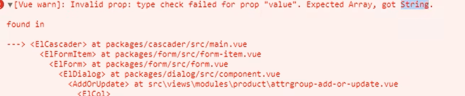


原因是：el-cascader绑定的`dataForm.catelogId`是一个数组，其中包含选择框的父节点id和自己的id。而**我们要提交的只需要三级分类的id，不需要父分类的id。**

```javascript
//修改data中的dataFrom
      dataForm: {
        attrGroupId: 0,
        attrGroupName: "",
        sort: "",
        descript: "",
        icon: "",
        catelogIds: [], //保存父节点和子节点的id
        catelogId: 0 //保存要提交的子节点的id
      },
          
//修改表单提交方法，要传送的数据，只传最后一个子id
catelogId: this.dataForm.catelogIds[this.dataForm.catelogIds.length - 1],
```


## 8.5、修改回显“所属分类”功能

8.5.0、分类路径无法回显问题

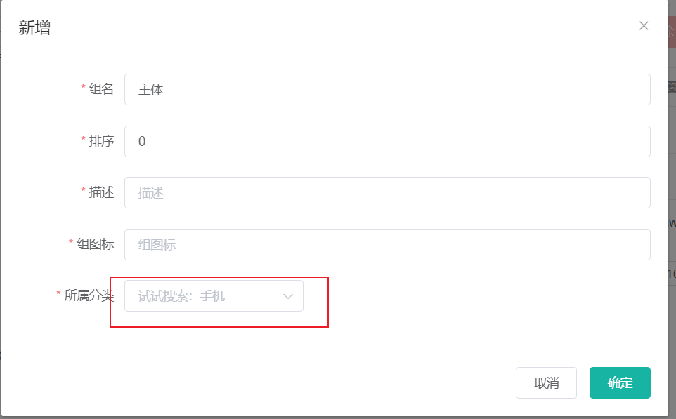

**只能查到当前属性所属分类的id** 

### 8.5.1、前端回显时，查询分类路径请求


```javascript
init(id) {
      this.dataForm.attrGroupId = id || 0;
      this.visible = true;
      this.$nextTick(() => {
        this.$refs["dataForm"].resetFields();
        if (this.dataForm.attrGroupId) {
          this.$http({
            url: this.$http.adornUrl(
              `/product/attrgroup/info/${this.dataForm.attrGroupId}`
            ),
            method: "get",
            params: this.$http.adornParams(),
          }).then(({ data }) => {
            if (data && data.code === 0) {
              this.dataForm.attrGroupName = data.attrGroup.attrGroupName;
              this.dataForm.sort = data.attrGroup.sort;
              this.dataForm.descript = data.attrGroup.descript;
              this.dataForm.icon = data.attrGroup.icon;
              this.dataForm.catelogId = data.attrGroup.catelogId;
              //查出catelogId的完整路径
              this.dataForm.catelogPath = data.attrGroup.catelogPath;
            }
          });
        }
      });
    },
```


### 8.5.2、`AttrGroupEntity`新增分类路径的成员变量

```java
	@TableField(exist = false)
	private Long[] catelogPath;
```


### 8.5.3、属性分组controller的info方法查询赋值分类路径

```
AttrGroupController
    @Autowired
    private CategoryService categoryService;    

	@RequestMapping("/info/{attrGroupId}")
    public R info(@PathVariable("attrGroupId") Long attrGroupId){
		AttrGroupEntity attrGroup = attrGroupService.getById(attrGroupId);

		Long catelogId = attrGroup.getCatelogId();
		//根据id查询完整路径。      查询结果要添加分类路径字段，样式[2,34,225]
		Long[] path = categoryService.findCatelogPath(catelogId);

		attrGroup.setCatelogPath(path);
        return R.ok().put("attrGroup", attrGroup);
    }
```


### 8.5.4、分类的service编写方法，查找分类路径

```java
//categoryService接口

    /*
     *找到catelogId的完整路径
     */
    Long[] findCatelogPath(Long catelogId);


//categoryServiceImpl实现方法
	//查找完整路径方法
	@Override
    public Long[] findCatelogPath(Long catelogId) {
        List<Long> paths = new ArrayList<>();
        List<Long> parentPath = findParentPath(catelogId, paths);
        return parentPath.toArray(new Long[parentPath.size()]);
    }

	//递归查找父节点id
    public List<Long> findParentPath(Long catelogId,List<Long> paths){
        //1、收集当前节点id
        CategoryEntity byId = this.getById(catelogId);
        if (byId.getParentCid() != 0){
            findParentPath(byId.getParentCid(), paths);
        }
        paths.add(catelogId);
        return paths;
    }
```


### 8.5.5、测试查询分类路径业务

```java
    @Autowired
    CategoryService categoryService;
    @Test
    public void testPathCatelog(){
        System.out.println(categoryService.findCatelogPath(225L));
    }
```


前端也正常回显：

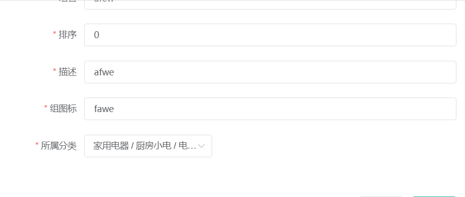


### 8.5.6、前端，对话框关闭时清空数据，防止不合理回显

```html
  <el-dialog
    :title="!dataForm.attrGroupId ? '新增' : '修改'"
    :close-on-click-modal="false"
    :visible.sync="visible"
    @closed="dialogClose" //关闭时，绑定方法dialogClose
  >
        
  //新增方法
    dialogClose(){
      this.dataForm.catelogPath = [];
    },
```


### 8.5.6、前端“所属分类”可搜索，显示提示信息

选择框加上搜索功能：`filterable`， 显示提示信息`placeholder="试试搜索：手机"`

```html
        <el-cascader
          placeholder="试试搜索：手机"
          filterable
          v-model="dataForm.catelogPath"
          :options="categroys"
          :props="props"
        ></el-cascader>
```


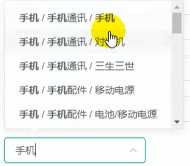


## 8.6、分页-mybatisplus分页拦截器

发现自动生成的分页条不好使，原因是没有**引入mybatis-plus的分页插件**。

product模块新建config包，新建配置类，引入如下配置

```java
@Configuration
public class MybatisPlusConfig {
    @Bean
    public MybatisPlusInterceptor mybatisPlusInterceptor(){
        MybatisPlusInterceptor interceptor = new MybatisPlusInterceptor();
        PaginationInnerInterceptor paginationInnerInterceptor = new PaginationInnerInterceptor();
//        溢出总页数后是否进行处理(默认不处理)
        paginationInnerInterceptor.setOverflow(true);
//        单页分页条数限制(默认无限制)
        paginationInnerInterceptor.setMaxLimit(1000L);
        interceptor.addInnerInterceptor(paginationInnerInterceptor);
        return interceptor;
    }
}
```


重启后分页展示正常。


# 9、优化品牌管理 

## 9.1、按搜索文字，分页查询

修改BrandServiceImpl的queryPage方法：

**这里仅检索id和name：**

```java
@Service("brandService")
public class BrandServiceImpl extends ServiceImpl<BrandDao, BrandEntity> implements BrandService {

    @Override
    public PageUtils queryPage(Map<String, Object> params) {
        String key = (String) params.get("key");
        LambdaQueryWrapper<BrandEntity> wrapper = new LambdaQueryWrapper<>();
        if(StringUtils.isNotEmpty(key)){
            wrapper.eq(BrandEntity::getBrandId,key).or().like(BrandEntity::getName,key);
        }
        IPage<BrandEntity> page = this.page(
                new Query<BrandEntity>().getPage(params),
                wrapper
        );

        return new PageUtils(page);
    }

}
```


**测试成功：**

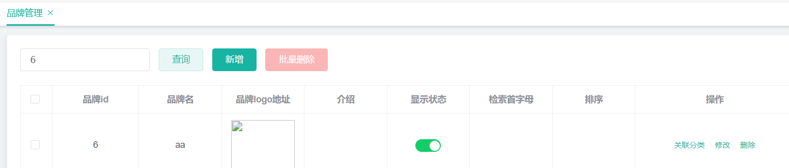


## 9.2、获取当前品牌关联的所有分类

### 8.2.1、**前端** 

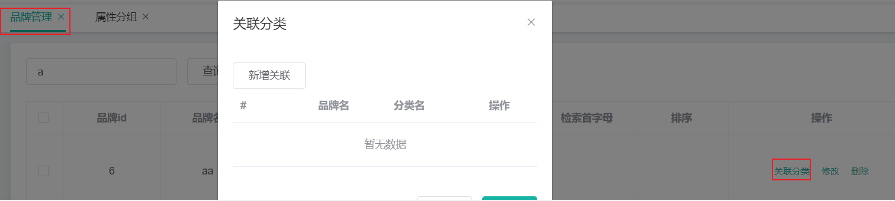


复制粘贴前端代码。把课件modues下的common和product文件复制到对应目录

小米品牌下面可能包括手机、电器等分类，同样手机分类可能包括小米、华为等多个品牌。所以品牌与分类是多对多的关系。表`pms_category_brand_relation`保存品牌与分类的多对多关系


查看文档，`获取品牌关联的分类: `[15、获取品牌关联的分类 - 谷粒商城](https://easydoc.net/s/78237135/ZUqEdvA4/SxysgcEF)

### 9.2.2、controller编写方法，获取当前品牌关联的所有分类

> **请求：**get 
>
> ```
> /product/categorybrandrelation/catelog/list
> ```
>
> 
>
> 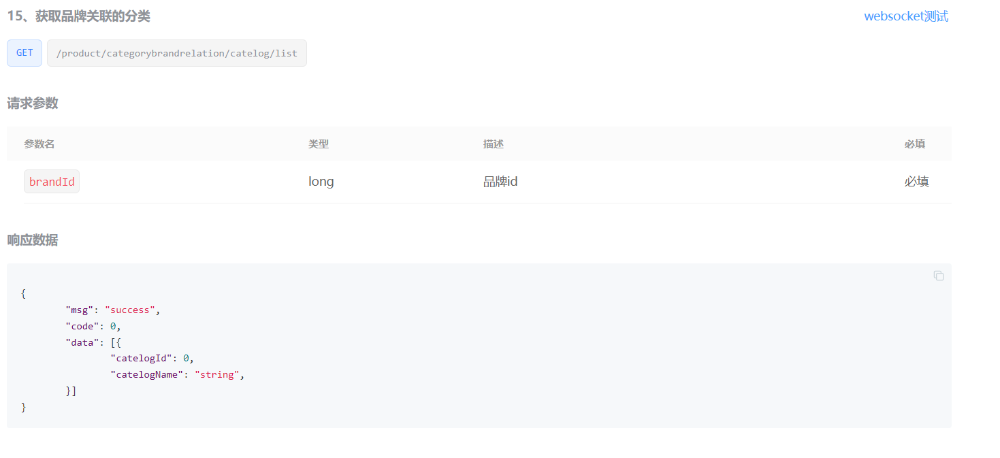
>
> **数据库：**brandName和categoryName其实是冗余字段，目的**减少数据库压力**，仅在新增时根据id查name赋值，之后查关系时就不用再根据id查name。
>
> 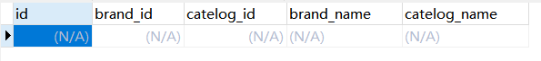

修改CategoryBrandRelationServiceImpl

根据传过来的brandId，查找当前品牌关联所有的分类信息

```java
    /**
     * 获取当前品牌关联的所有分类列表
     */
    @GetMapping("/catelog/list")
    public R catelogList(@RequestParam("brandId") Long brandId){
        List<CategoryBrandRelationEntity> data = categoryBrandRelationService.list(
                new QueryWrapper<CategoryBrandRelationEntity>().eq("brand_id", brandId)
        );

        return R.ok().put("data", data);
    }
```


### 9.2.3、新增关联的controller、service

> 新增品牌与分类关联关系，主要需要改动是在保存时，查询并赋值冗余字段brandName和categoryName
>
> **请求：**post
>
> ```java
> product/categorybrandrelation/save
> ```
>
> 
>
> 
>
> 
>
> 保存的时候，前端传过来brandid和categoryid，存储的时候还要存brandName和categoryName，所以在保存之前进行查找


修改controller


```java
    /**
     * 保存
     */
    @RequestMapping("/save")
    //@RequiresPermissions("product:categorybrandrelation:save")
    public R save(@RequestBody CategoryBrandRelationEntity categoryBrandRelation){
		categoryBrandRelationService.saveDetail(categoryBrandRelation);

        return R.ok();
    }
```


service


```java
    @Autowired
    CategoryDao categoryDao;

    @Autowired
    BrandDao brandDao;

	@Override
    public void saveDetail(CategoryBrandRelationEntity categoryBrandRelation) {
        Long brandId = categoryBrandRelation.getBrandId();
        Long catelogId = categoryBrandRelation.getCatelogId();
        //查询详细名字和分类名字
        BrandEntity brandEntity = brandDao.selectById(brandId);
        CategoryEntity categoryEntity = categoryDao.selectById(catelogId);
        categoryBrandRelation.setBrandName(brandEntity.getName());
        categoryBrandRelation.setCatelogName(categoryEntity.getName());
        this.save(categoryBrandRelation);

    }
```


### 9.2.4、测试新增和查询“关联关系”

新增华为和手机的关联分类：

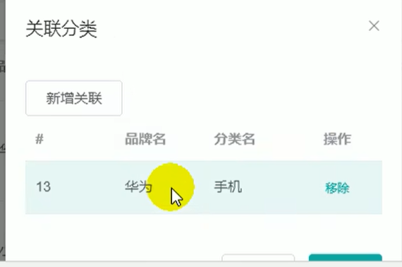


### 9.2.5、修改品牌名时，同步修改关联表的品牌名

要对品牌（分类）名字进行修改时，品牌分类关系表之中的名字也要进行修改

- 品牌名字修改同时修改表数据

  BrandController

```java
    @RequestMapping("/update")
    //@RequiresPermissions("product:brand:update")
    public R update(@Validated(value = {UpdateGroup.class})@RequestBody BrandEntity brand){
		brandService.updateByIdDetail(brand);

        return R.ok();
    }
```


brandServiceImpl

```java
	@Autowired
    CategoryBrandRelationService categoryBrandRelationService;

    @Transactional
    @Override
    public void updateByIdDetail(BrandEntity brand) {
        //保证冗余字段的数据一致
        this.updateById(brand);
        if (!StringUtils.isEmpty(brand.getName())){
            //如果修改了名字，则品牌分类关系表之中的名字也要修改
            categoryBrandRelationService.updateBrand(brand.getBrandId(), brand.getName());
            //TODO 更新其他关联
        }
    }
```


CategoryBrandRelationServiceImpl

```java
    @Override
    public void updateBrand(Long brandId, String name) {
        CategoryBrandRelationEntity categoryBrandRelationEntity = new CategoryBrandRelationEntity();
        categoryBrandRelationEntity.setBrandName(name);
        categoryBrandRelationEntity.setBrandId(brandId);
        this.update(categoryBrandRelationEntity, new QueryWrapper<CategoryBrandRelationEntity>().eq("brand_id", brandId));
    }
```


**测试，修改品牌名时，关联表里的品牌名也改了：**

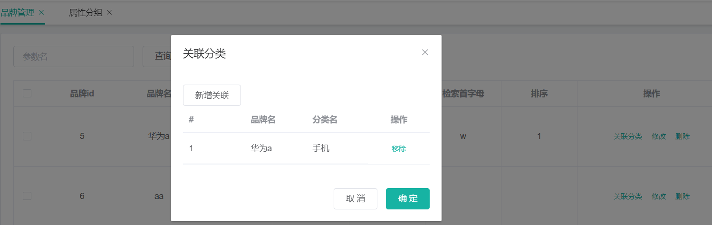


### 9.2.6、修改分类名时，同步修改关联表的分类名。映射配置文件xml方法

CategoryController

```java
    /**
     * 修改
     */
    @RequestMapping("/update")
    //@RequiresPermissions("product:category:update")
    public R update(@RequestBody CategoryEntity category){
		categoryService.updateCascade(category);

        return R.ok();
    }
```


CategroyServiceImpl

```java
    //别忘了加业务注解，引导类开启了业务@EnableTransactionManagement
	@Transactional
    @Override
    public void updateCascade(CategoryEntity category) {
        this.updateById(category);
        categoryBrandRelationService.updateCategory(category.getCatId(), category.getName());
    }
```


CategoryBrandRelationServiceImpl

> 用上一节品牌修改的方法也行。**这次使用映射配置文件xml方法**

```java
    @Override
    public void updateCategory(Long catId, String name) {
        this.baseMapper.updateCategroy(catId, name);
    }
```


CategoryBrandRelationDao

```java
void updateCategroy(@Param("catId") Long catId,@Param("name") String name);
```


CateBrandRelationDao.xml

```html
    <update id="updateCategroy">
        UPDATE `pms_category_brand_relation` SET catelog_name=#{name} WHERE catelog_id=#{catId}
    </update>
```


**测试：**

修改分类中手机为“手机1”，发现关联表中分类名也改了：

