> **导航：**
>
> [谷粒商城笔记+踩坑汇总篇](https://blog.csdn.net/qq_40991313/article/details/127099139?spm=1001.2014.3001.5501)
>
>  **Java笔记汇总：**
>
> [【Java笔记+踩坑汇总】Java基础+JavaWeb+SSM+SpringBoot+SpringCloud+瑞吉外卖/谷粒商城/学成在线+设计模式+面试题汇总+性能调优/架构设计+源码解析-CSDN博客](https://blog.csdn.net/qq_40991313/article/details/126646289)

[TOC]


# 10、商品服务-属性（规格参数和销售属性）

## 10.1、新增属性时，新增属性和属性分组的关联关系

### 10.1.1、规格参数表单介绍 

**规格参数最终效果：**

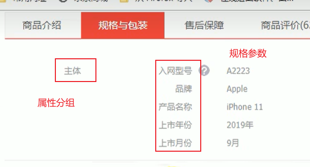


**新增表单**

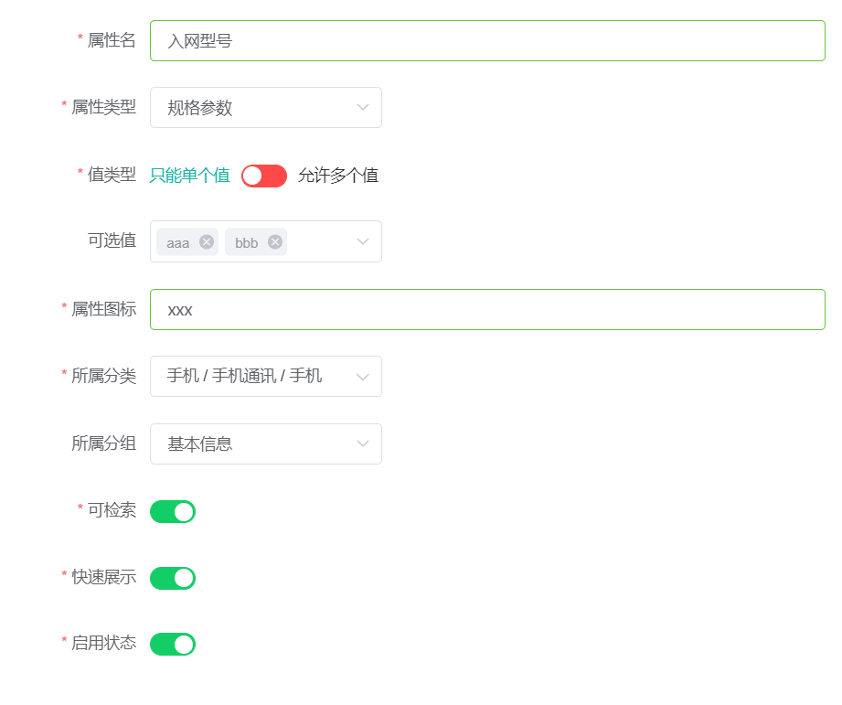


**“快速展示”**是在介绍页面快速展示此规格： 

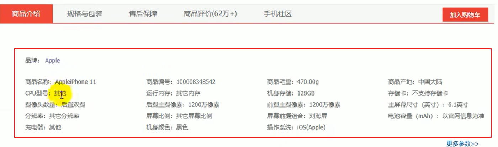

### 10.1.2、Object划分（po、vo、dto等）

1.PO(persistant object) 持久对象
 PO 就是对应数据库中某个表中的一条记录， 多个记录可以用 PO 的集合。 PO 中应该不包
 含任何对数据库的操作。


 2.DO（Domain Object） 领域对象
 就是从现实世界中抽象出来的有形或无形的业务实体。


 3.TO(Transfer Object) ， 数据传输对象
 不同的应用程序之间传输的对象


 4.DTO（Data Transfer Object） 数据传输对象
 这个概念来源于 J2EE 的设计模式， 原来的目的是为了 EJB 的分布式应用提供粗粒度的数据实体， 以减少分布式调用的次数， 从而提高分布式调用的性能和降低网络负载， 但在这里， 泛指用于展示层与服务层之间的数据传输对象。


 **5.VO(value object) 值对象**
 **通常用于业务层之间的数据传递**， 和 PO 一样也是仅仅包含数据而已。 但应是抽象出的业务对象 , 可以和表对应 , 也可以不 , 这根据业务的需要 。 用 new 关键字创建， 由GC 回收的。

**View object： 视图对象；接受页面传递来的数据**， 封装对象将业务处理完成的对象， 封装成页面要用的数据


 6.BO(business object) 业务对象
 从业务模型的角度看 , 见 UML 元件领域模型中的领域对象。 封装业务逻辑的 java 对
 象 , 通过调用 DAO 方法 , 结合 PO,VO 进行业务操作。 business object: 业务对象 主要作
 用是把业务逻辑封装为一个对象。 这个对象可以包括一个或多个其它的对象。 比如一个简
 历， 有教育经历、 工作经历、 社会关系等等。 我们可以把教育经历对应一个 PO ， 工作经
 历对应一个 PO ， 社会关系对应一个 PO 。 建立一个对应简历的 BO 对象处理简历， 每
 个 BO 包含这些 PO 。 这样处理业务逻辑时， 我们就可以针对 BO 去处理。


 7.POJO(plain ordinary java object) 简单无规则 java 对象
 传统意义的 java 对象。 就是说在一些 Object/Relation Mapping 工具中， 能够做到维护数据库表记录的 persisent object 完全是一个符合 Java Bean 规范的纯 Java 对象， 没有增加别的属性和方法。 我的理解就是最基本的 java Bean ， 只有属性字段及 setter 和 getter方法！POJO 是 DO/DTO/BO/VO 的统称。


 8.DAO(data access object) 数据访问对象
 是一个 sun 的一个标准 j2ee 设计模式， 这个模式中有个接口就是 DAO ， 它负持久层的操作。 为业务层提供接口。 此对象用于访问数据库。 通常和 PO 结合使用， DAO 中包含了各种数据库的操作方法。 通过它的方法 , 结合 PO 对数据库进行相关的操作。 夹在业务逻辑与数据库资源中间。 配合 VO, 提供数据库的 CRUD 操作.

### 10.1.3、代码实现，使用vo对象

> - **请求：**Request URL:`/product/attr/save`
>
> - 请求参数： 
>
>   ```javascript
>   {
>     "attrGroupId": 0, //属性分组id
>     "attrName": "string",//属性名
>     "attrType": 0, //属性类型
>     "catelogId": 0, //分类id
>     "enable": 0, //是否可用 
>     "icon": "string", //图标
>     "searchType": 0, //是否检索
>     "showDesc": 0, //快速展示
>     "valueSelect": "string", //可选值列表
>     "valueType": 0 //可选值模式
>   }
>   ```
>
>   
>
>   
>
> - **vo：**当有新增字段时，我们往往会在entity实体类中新建一个字段，并标注数据库中不存在该字段，然而这种方式并不规范。比较规范的做法是，新建一个vo文件夹，将每种不同的对象，按照它的功能进行了划分。

**1）创建Vo**

> **使用vo的原因是：**接收表单的attrGroupId，即属性分组id，进行关联。

在product模块的product.vo包下：

```java
@Data
public class AttrVo extends AttrEntity {
    private Long attrGroupId;
}
```


**2）AttrController修改保存方法**

```java
    @RequestMapping("/save")
    public R save(@RequestBody AttrVo attr){
		attrService.saveAttr(attr);

        return R.ok();
    }
```


**3）AttrServiceImpl**

> pms_attr_attrgroup_relation表：记录属性和属性分组的关联关系
>
> 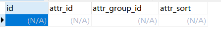

```java
    @Override
    public void saveAttr(AttrVo attr) {
        //AttrEntity attrEntity = new AttrEntity();
        //保存attrEntity
        //利用attr的属性给attrEntity的属性赋值，前提是他们俩的属性名一致
        //BeanUtils.copyProperties(attr, attrEntity);

        //1、保存基本数据
        this.save(attr);
        //2、保存关联关系
        AttrAttrgroupRelationEntity relationEntity = new AttrAttrgroupRelationEntity();
        relationEntity.setAttrGroupId(attr.getAttrGroupId());
        relationEntity.setAttrId(attr.getAttrId());
        attrAttrgroupRelationDao.insert(relationEntity);
    }
```


### 10.1.4、测试


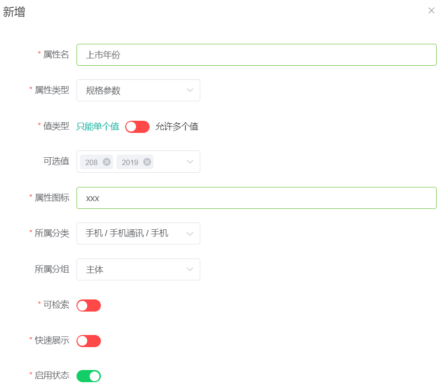

可以发现pms_attr_attrgroup_relation（属性和属性组关联表）已经更新：


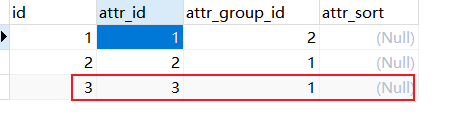


## 10.2、分页查询属性（规格参数），AttrRespVo封装响应数据

### 10.2.0、需求分析 

**请求：**`/product/attr/base/list/{catelogId}` 

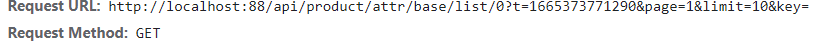


**分析：**修改请求路径后直接查询，我们可以发现，响应参数**“所属分类”和“所属分组”**是空白，所以还要一个**新的vo类**，加入这两个属性。

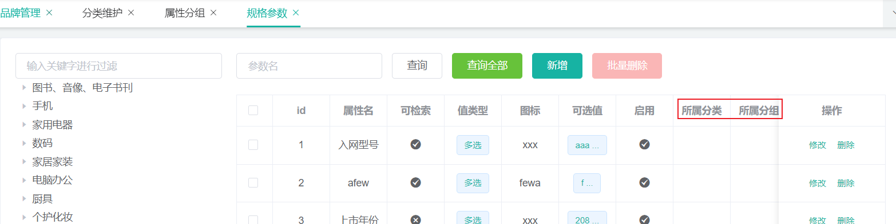


> ```
> catelogId为0时是查询所有。
> ```
>
> **注意：**响应参数比AttrVo多了“所属分类”和“所属分组”，所以还要一个新的vo类

### 10.2.1、修改前端单多选bug

这是一个坑点，课程视频里和源码里都没有解决。

**解决：**将baseattr.vue和attr-add-or-update.vue里的全部valueType改成searchType，此时值类型正常显示：

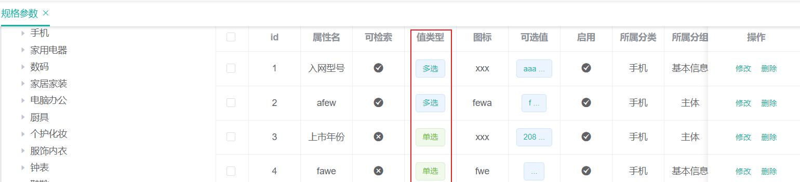


### 10.2.2、代码实现

**1、请求：**`/product/attr/base/list/{catelogId}` 

2、新建AttrRespVo

```java
@Data
public class AttrRespVo extends AttrVo {
    private String catelogName;
    private String groupName;
}
```


3、AttrController

```java
    @RequestMapping("/base/list/{catelogId}")
    public R baseList(@RequestParam Map<String, Object> params, @PathVariable("catelogId") Long catelogId){
        PageUtils page = attrService.queryBaseAttrPage(params, catelogId);
        return R.ok().put("page", page);
    }
```


4、AttrServiceImpl

```java
 	@Autowired
    private CategoryDao categoryDao;

    @Autowired
    private AttrGroupDao attrGroupDao;


	@Override
    public PageUtils queryBaseAttrPage(Map<String, Object> params, Long catelogId) {
        QueryWrapper<AttrEntity> queryWrapper = new QueryWrapper<>();
        //模糊查询，catelogId 查询
        if (catelogId != 0){
            queryWrapper.eq("catelog_id", catelogId);
        }
        String key = (String) params.get("key");
        if (!StringUtils.isEmpty(key)){
            //attr_id  attr_name
            queryWrapper.and((wrapper) -> {
                wrapper.eq("attr_id", key).or().like("attr_name", key);
            });
        }
        IPage<AttrEntity> page = this.page(
                new Query<AttrEntity>().getPage(params),
                queryWrapper
        );
    	//封装分页数据
        PageUtils pageUtils = new PageUtils(page);

        //分页数据中加入当前属性的“所属分类”和“所属分组”
        List<AttrEntity> records = page.getRecords();
        List<AttrRespVo> respVos = records.stream().map((attrEntity) -> {
            AttrRespVo attrRespVo = new AttrRespVo();
            BeanUtils.copyProperties(attrEntity, attrRespVo);
            CategoryEntity categoryEntity = categoryDao.selectOne(new QueryWrapper<CategoryEntity>().eq("cat_id", attrEntity.getCatelogId()));

            //没查到的对象就不能getName了，必须防止空指针异常，习惯习惯
            if (categoryEntity != null) {
                attrRespVo.setCatelogName(categoryEntity.getName());
            }
            //查属性分组要从属性与属性分组关联表查
            AttrAttrgroupRelationEntity attrgroupRelationEntity = attrAttrgroupRelationDao.selectOne(new QueryWrapper<AttrAttrgroupRelationEntity>().eq("attr_id", attrEntity.getAttrId()));
            if (attrgroupRelationEntity != null) {
                AttrGroupEntity attrGroupEntity = attrGroupDao.selectOne(new QueryWrapper<AttrGroupEntity>().eq("attr_group_id", attrgroupRelationEntity.getAttrGroupId()));
                if(attrGroupEntity!=null)attrRespVo.setGroupName(attrGroupEntity.getAttrGroupName());
            }

            return attrRespVo;
        }).collect(Collectors.toList());
        // 把新的数据传送过去
        pageUtils.setList(respVos);
        return pageUtils;
    }
```


### 10.2.3、测试

各信息正常显示，点击分类、查询参数名都有效：

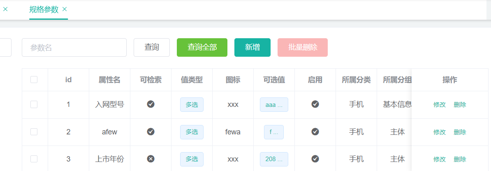


## 10.3、查询属性详情（修改时回显所属分类路径和分组id）


1、url地址：`/product/attr/info/{attrId}`

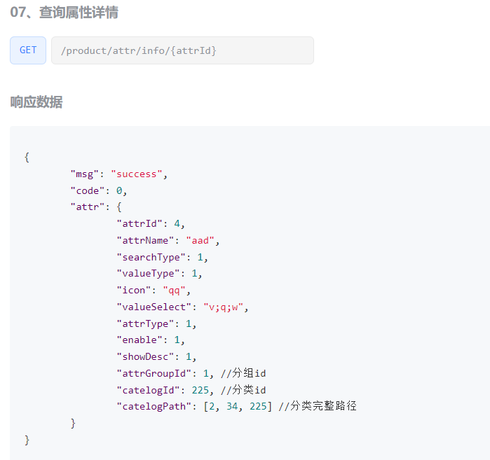


2、修改AttrRespVo

```java
@Data
public class AttrRespVo extends AttrVo {
    private String catelogName;
    private String groupName;
    private Long[] catelogPath;
}
```


3、AttrController

```java
    @RequestMapping("/info/{attrId}")
    public R info(@PathVariable("attrId") Long attrId){
		AttrRespVo attrRespVo = attrService.getAttrInfo(attrId);

        return R.ok().put("attr", attrRespVo);
    }
```


4、AttrServiceImpl

```java
    @Autowired
    private CategoryService categoryService;

	@Override
    public AttrRespVo getAttrInfo(Long attrId) {
        AttrRespVo attrRespVo = new AttrRespVo();
        AttrEntity attrEntity = this.getById(attrId);
        BeanUtils.copyProperties(attrEntity, attrRespVo);

        //设置所属分组
        AttrAttrgroupRelationEntity attrAttrgroupRelation = attrAttrgroupRelationDao.selectOne(new QueryWrapper<AttrAttrgroupRelationEntity>().eq("attr_id", attrId));
        if (attrAttrgroupRelation != null){
            attrRespVo.setAttrGroupId(attrAttrgroupRelation.getAttrGroupId());
        }
        //设置所属分类路径
        Long[] catelogPath = categoryService.findCatelogPath(attrEntity.getCatelogId());
        attrRespVo.setCatelogPath(catelogPath);

        return attrRespVo;
    }
```


## 10.4、修改属性名时，同步修改属性和属性分组的关联关系

1、url:`/product/attr/update`

2、AttrController

> 使用AttrVo，需要attrId（已有）和attrGroupId修改关联关系

```java
    @RequestMapping("/update")
    public R update(@RequestBody AttrVo attr){
		attrService.updateAttr(attr);

        return R.ok();
    }
```


3、AttrServiceImpl

> **坑点：**
>
> **1.一些属性在新增时没有设置所属分组。**
>
> 因此，同步修改属性和属性分组的关联关系时，要判断此属性是否已关联，**未关联时新增关联表数据，已关联时修改关联表数据。**
>
> **2.修改时如果用QueryWrapper要加条件，防止全部修改。**

```java
	//保存时，要修改两张表，要加业务注解，引导类也开启了业务
	@Transactional
    @Override
    public void updateAttr(AttrVo attr) {
        AttrEntity attrEntity = new AttrEntity();
        BeanUtils.copyProperties(attr, attrEntity);
        this.updateById(attrEntity);

        AttrAttrgroupRelationEntity relationEntity = new AttrAttrgroupRelationEntity();
        relationEntity.setAttrGroupId(attr.getAttrGroupId());
        relationEntity.setAttrId(attr.getAttrId());

        //判断是新增还是删除。属性分组和属性是一对多，也可以用selectOne查
        Integer count = attrAttrgroupRelationDao.selectCount(new QueryWrapper<AttrAttrgroupRelationEntity>().eq("attr_id", attr.getAttrId()));
        if (count > 0){
            attrAttrgroupRelationDao.update(relationEntity, new QueryWrapper<AttrAttrgroupRelationEntity>().eq("attr_id", attr.getAttrId()));
        }else{
            attrAttrgroupRelationDao.insert(relationEntity);
        }

    }
```


测试后成功。 

## 10.5、用路径参数区分销售属性和规格参数

### 10.5.0、“销售属性、规格参数、属性分组”效果展示


**销售属性：**


**开启快速展示的规格参数：**


**属性分组和规格参数：**

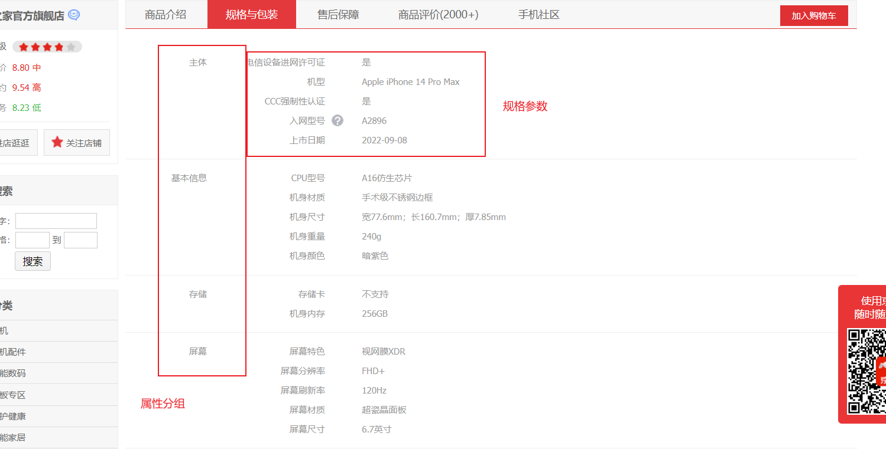

> **“平台属性”后台最终效果：**
>
> 
>
> 
>
> 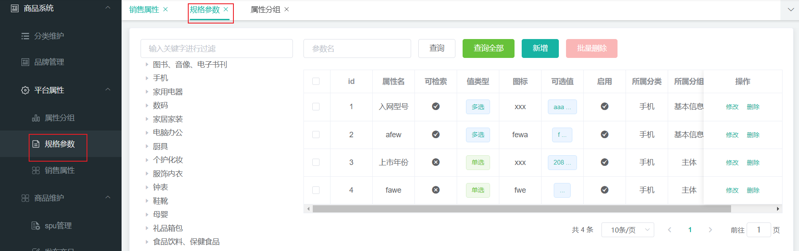


### 10.5.1、修改分页查询属性的controller和service 

**1、请求：**`/product/attr/sale/list/{catelogId}`

**2、实现：**

> **思路：**
>
> 可以通过添加**路径变量`{attrType}`**同时用一个方法查询销售属性和规格参数。并且attr表的**attr_type字段**是属性类型**[0-销售属性，1-基本属性]，新增时只能选择0和1**。

修改AttrController

```java
@RequestMapping("/{attrType}/list/{catelogId}")
    //路径参数和形参名同名时，@PathVariable的值可以省略。
    public R baseList(@RequestParam Map<String, Object> params, @PathVariable("catelogId") Long catelogId,
                      @PathVariable("attrType") String attrType){
        PageUtils page = attrService.queryBaseAttrPage(params, catelogId, attrType);
        return R.ok().put("page", page);
    }
```


AttrServiceImpl

> **注意：** 仅查询规格参数时设置分组名，销售属性无分组。在设置分组id时，要判断查到分组是不是null，防止空指针异常。

```java
    @Override
    public PageUtils queryPage(Map<String, Object> params,Long catelogId,String attrType) {
        //模糊查询

        String key = (String) params.get("key");
        LambdaQueryWrapper<AttrEntity> wrapper = new LambdaQueryWrapper<>();
        //值添加这一行。判断是规格参数还是销售属性,[0-销售属性，1-基本属性，2-既是销售属性又是基本属性]
        wrapper.eq(AttrEntity::getAttrType,"base".equalsIgnoreCase(attrType)?1:0);
        if(StringUtils.isNotEmpty(key)){
            wrapper.and(obj->obj.eq(AttrEntity::getAttrId,key).or().like(AttrEntity::getAttrName,key));
        }
        //catelogId查询
        if(catelogId!=0) wrapper.eq(AttrEntity::getCatelogId,catelogId);
            //查询
        IPage<AttrEntity> page = this.page(
                new Query<AttrEntity>().getPage(params),
                wrapper
        );
        PageUtils pageUtils = new PageUtils(page);
        //分页数据中加入当前属性的“所属分类”和“所属分组”
        List<AttrEntity> attrEntities = page.getRecords();
        List<AttrRespVo> attrRespVos = attrEntities.stream().map(item->{
            AttrRespVo attrRespVo = new AttrRespVo();
            BeanUtils.copyProperties(item,attrRespVo);
            //查询“所属分类”和“所属分组”的name
            Long catelogId2 = attrRespVo.getCatelogId();
            Long attrGroupId=null;
            AttrAttrgroupRelationEntity attrAttrgroupRelationEntity = attrAttrgroupRelationDao.selectOne(
                    new LambdaQueryWrapper<AttrAttrgroupRelationEntity>().eq(AttrAttrgroupRelationEntity::getAttrId,attrRespVo.getAttrId())
            );
            if(attrAttrgroupRelationEntity!=null) attrGroupId = attrAttrgroupRelationEntity.getAttrGroupId();
            CategoryEntity categoryEntity = categoryDao.selectById(catelogId2);
            //没查到的对象就不能getName了，必须防止空指针异常，习惯习惯，坑点
            if(categoryEntity!=null) attrRespVo.setCatelogName(categoryEntity.getName());
            AttrGroupEntity attrGroupEntity = attrGroupDao.selectById(attrGroupId);
            if(attrGroupEntity!=null) attrRespVo.setGroupName(attrGroupEntity.getAttrGroupName());
            return attrRespVo;
        }).collect(Collectors.toList());
        pageUtils.setList(attrRespVos);
        //返回分页工具对象
        return pageUtils;
    }
```


### 10.5.2、 新增测试

新增销售属性，销售属性不设置属性分组 

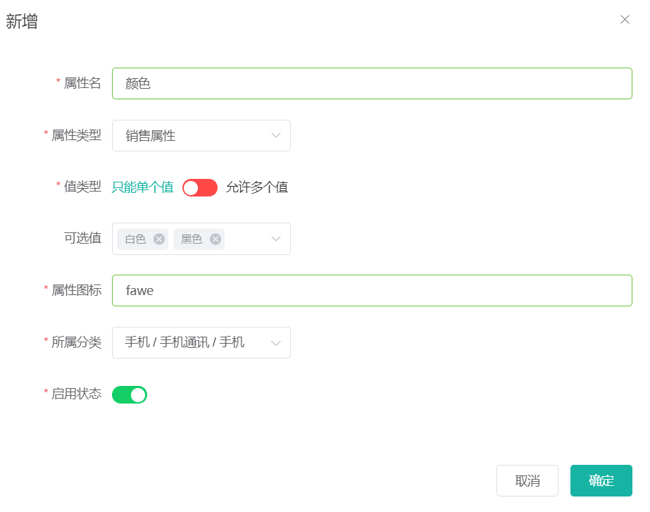

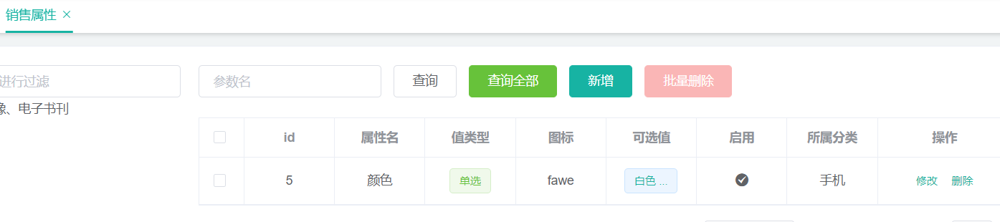


### 10.5.3、创建商品常量类

**1. 新建商品服务常量类**

在Common模块中**新建商品服务常量类**common.constant.ProductConstant

```java
public class ProductConstant {
    public enum AttrEnum{
        ATTR_TYPE_BASE(1,"基本属性"), ATTR_TYPE_SALE(0,"销售属性");

        private int code;
        private String msg;

        AttrEnum(int code, String msg){
            this.code = code;
            this.msg = msg;
        }

        public int getCode() {
            return code;
        }

        public String getMsg() {
            return msg;
        }
    }
}
```


**2.修改数字成枚举** 

把前面对attr_type字段的判断，由0和1改成枚举。

```java
wrapper.eq(AttrEntity::getAttrType,"base".equalsIgnoreCase(attrType)? ProductConstant.AttrEnum.ATTR_TYPE_BASE :ProductConstant.AttrEnum.ATTR_TYPE_SALE);
```


### 10.5.4、更改新增修改属性的业务，仅操作规格属性时添加关联关系

> **问题分析：**
>
> 因为新增修改时没有判断销售属性，关联表中多了销售属性的没用数据：
>
>  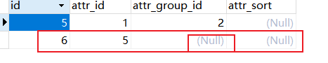

当新增/修改规格参数时，会在attrAttrGroupRelation表之中新增数据，但是销售属性没有分组信息。所以在新增/修改时，进行判断

在`saveAttr,getAttrInfo,updateAttr`中，设计分组信息之前做判断

```
if (attrEntity.getAttrType() == ProductConstant.AttrEnum.ATTR_TYPE_BASE.getCode())//如果是规格参数，再操作分组信息
```


> 整体代码：
>
> ```java
>     /**
>      * 保存基本规格参数和关联关系
>      * @param attrVo
>      */
>     @Override
>     @Transactional
>     public void saveAttr(AttrVo attrVo) {
>         this.save(attrVo);
>         //仅在规格属性的分组有值时，保存属性和属性分组关联关系
>         if(attrVo.getAttrType()==ProductConstant.AttrEnum.ATTR_TYPE_BASE.getCode()&&attrVo.getAttrGroupId()!=null){
>             AttrAttrgroupRelationEntity attrAttrgroupRelationEntity = new AttrAttrgroupRelationEntity();
>             attrAttrgroupRelationEntity.setAttrId(attrVo.getAttrId());
>             attrAttrgroupRelationEntity.setAttrGroupId(attrVo.getAttrGroupId());
>             attrAttrgroupRelationDao.insert(attrAttrgroupRelationEntity);
>         }
> 
> 
>     }
> 
>    /**
>      * 修改属性时，同步修改与属性分组关联关系
>      * @param attrVo
>      */
>     @Override
>     @Transactional
>     public void updateAttr(AttrVo attrVo) {
>         //先修改属性
>         this.updateById(attrVo);
>         Long attrGroupId = attrVo.getAttrGroupId();
>         Long attrId = attrVo.getAttrId();
>         //再判断修改关联关系。如果是销售属性或者分组id是空时，不用修改
>         if(attrVo.getAttrType()==ProductConstant.AttrEnum.ATTR_TYPE_SALE.getCode()||attrGroupId==null){
>             //todo。待优化，如果是将规格属性改为销售属性，查询删除原关联关系
>             return;
>         }
>         //查询关联表中是否已有此属性
>         AttrAttrgroupRelationEntity attrAttrgroupRelationEntity = attrAttrgroupRelationDao.selectOne(
>                 new LambdaQueryWrapper<AttrAttrgroupRelationEntity>().eq(AttrAttrgroupRelationEntity::getAttrId, attrId)
>         );
>         if(attrAttrgroupRelationEntity!=null){
> //            已存在，修改
>             attrAttrgroupRelationEntity.setAttrGroupId(attrGroupId);
>             attrAttrgroupRelationDao.updateById(attrAttrgroupRelationEntity);
>         }else {
>             //不存在，新增关联关系
>             attrAttrgroupRelationEntity=new AttrAttrgroupRelationEntity();
>             attrAttrgroupRelationEntity.setAttrGroupId(attrGroupId);
>             attrAttrgroupRelationEntity.setAttrId(attrId);
>             attrAttrgroupRelationDao.insert(attrAttrgroupRelationEntity);
>         }
>     }
> ```
>
> 

### 10.5.5、测试

新增修改销售属性后，关联表不会变化；新增未设置分组的属性时， 关联表也不会新增。

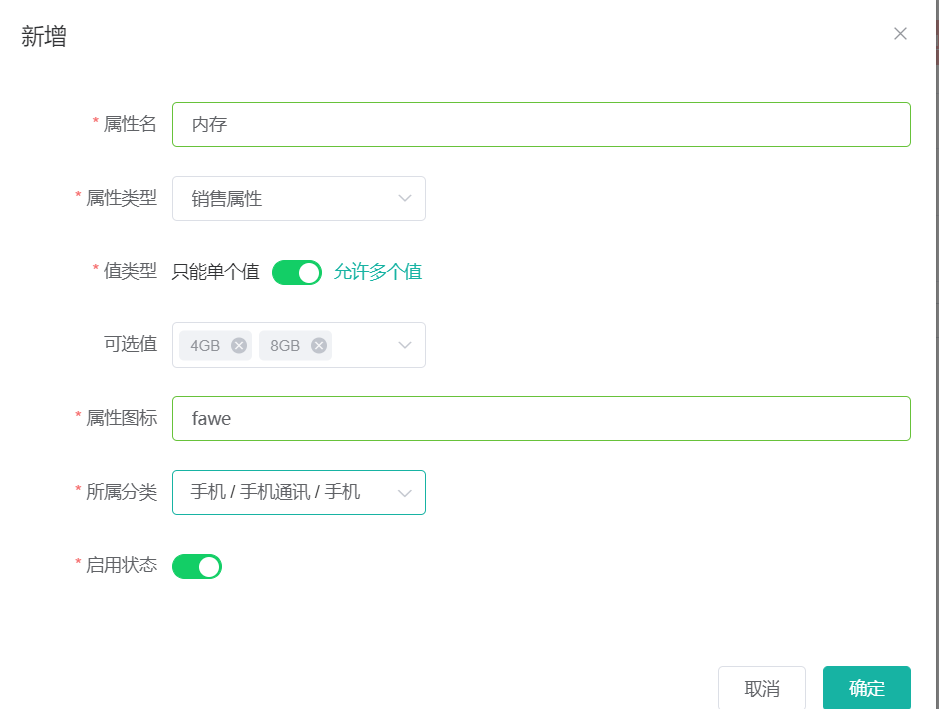


## 10.6、注意空指针异常

一定要养成习惯，一个null值是不能用set和get方法的。

查询单条数据时，不能直接用查到实体类对象的get方法，要先判断此实体类对象是否为空。

空指针异常报错是：null。


# 11、商品服务-属性分组的关联功能


## 11.1、最终效果展示

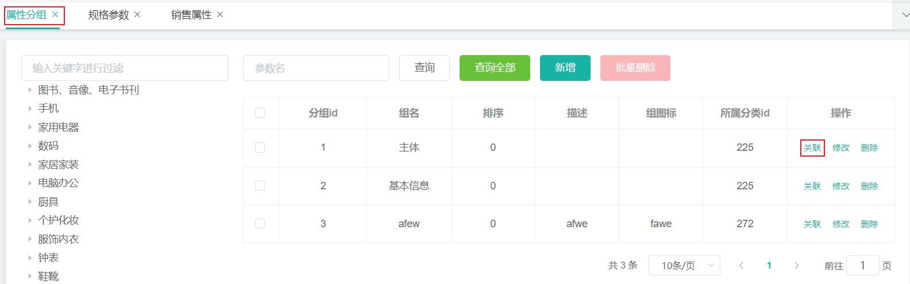

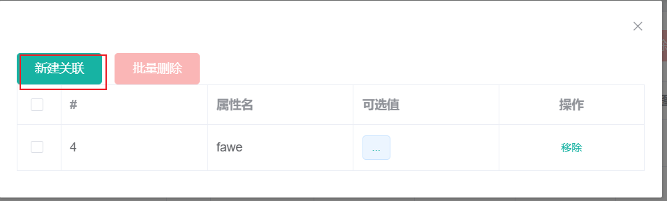

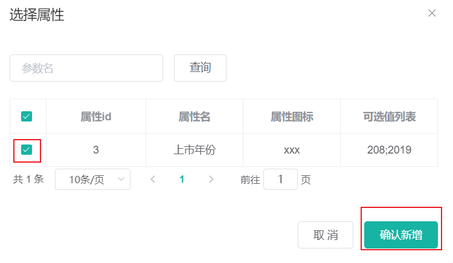


## 11.2、查询属性分组关联的所有属性

1、URL：`/product/attrgroup/{attrgroupId}/attr/relation`

attrgroupController

```java
    @GetMapping("/{attrgroupId}/attr/relation")
    public R attrRelation(@PathVariable("attrgroupId") Long attrgroupId){
        List<AttrEntity> data = attrService.getRelationAttr(attrgroupId);
        return R.ok().put("data", data);
    }
```


attrServiceImpl

```java
    @Override
    public List<AttrEntity> getRelationAttr(Long attrgroupId) {
        List<AttrAttrgroupRelationEntity> relationEntities = attrAttrgroupRelationDao.selectList(new QueryWrapper<AttrAttrgroupRelationEntity>().eq("attr_group_id", attrgroupId));
        List<Long> attrIds = relationEntities.stream().map((entity) -> {
            return entity.getAttrId();
        }).collect(Collectors.toList());

        List<AttrEntity> attrEntities = this.baseMapper.selectBatchIds(attrIds);

        return attrEntities;
    }
```


测试：

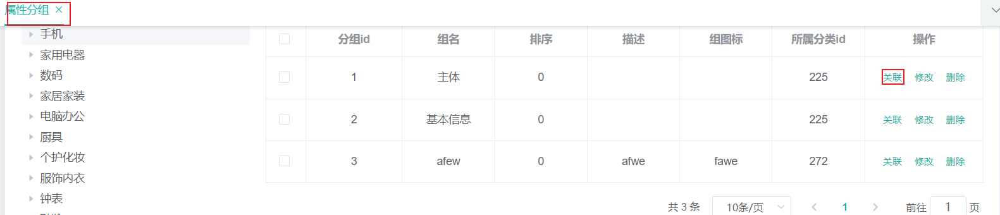

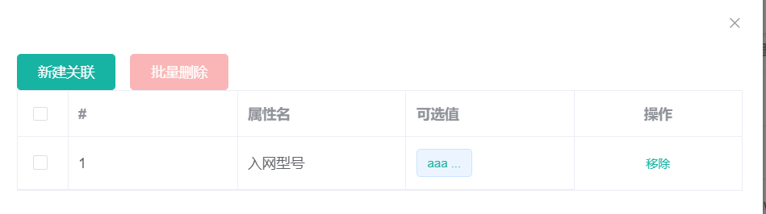


## 11.3、批量删除属性与分组的关联关系

**1、请求：**`/product/attrgroup/attr/relation/delete`

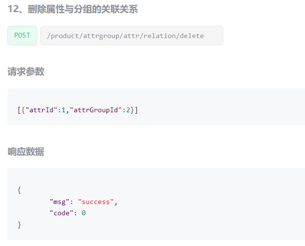

> **注意**
>
> - 请求方式是post，不是delete

2、在product.vo包下新建AttrGroupRelationVo，接收请求参数

> 也可以不用vo，用AttrAttrgroupRelationEntites接收参数：
>
> 
>
> ```java
>     @PostMapping("/attr/relation/delete")
>     public R attrRelationDelete(@RequestBody List<AttrAttrgroupRelationEntity> vos){
>         attrService.deleteRelation(vos);
>         return R.ok();
>     }
> ```
>
> 

```java
@Data
public class AttrGroupRelationVo {

    private Long attrId;
    private Long attrGroupId;
}
```


3、AttrGroupController

```java
    @PostMapping("/attr/relation/delete")
    public R attrRelationDelete(@RequestBody AttrGroupRelationVo[] vos){
        attrService.deleteRelation(vos);
        return R.ok();
    }
```


4、AttrServiceImpl


```java
    @Override
    public void deleteRelation(AttrGroupRelationVo[] vos) {
        List<AttrGroupRelationVo> relationVos = Arrays.asList(vos);
        List<AttrAttrgroupRelationEntity> entities = relationVos.stream().map((relationVo) -> {
            AttrAttrgroupRelationEntity relationEntity = new AttrAttrgroupRelationEntity();
            BeanUtils.copyProperties(relationVo, relationEntity);
            return relationEntity;
        }).collect(Collectors.toList());
		//根据attrId，attrGroupId批量删除关联关系
        attrAttrgroupRelationDao.deleteBatchRelation(entities);
    }
```


5、AttrAttrgroupRelationDao.xml

```XML
    <delete id="deleteBatchRelation">
        DELETE FROM `pms_attr_attrgroup_relation` WHERE
        <foreach collection="entities" item="item" separator=" OR ">
            (attr_id=#{item.attrId} AND attr_group_id=#{item.attrGroupId})
        </foreach>
    </delete>
```


> 也可以不用xml，用wrapper删除，但时间复杂度和编写复杂度会比动态sql低一些：
>
> ```java
>     @Override
>     public void deleteRelation(List<AttrAttrgroupRelationEntity> attrAttrgroupRelationEntities) {
>         //遍历查删
>         attrAttrgroupRelationEntities.stream().forEach(item->{
>             AttrAttrgroupRelationEntity attrAttrgroupRelationEntity = attrAttrgroupRelationDao.selectOne(
>                     new LambdaQueryWrapper<AttrAttrgroupRelationEntity>().eq(AttrAttrgroupRelationEntity::getAttrId, item.getAttrId()).eq(AttrAttrgroupRelationEntity::getAttrGroupId, item.getAttrGroupId())
>             );
>             if(attrAttrgroupRelationEntity!=null) attrAttrgroupRelationDao.deleteById(attrAttrgroupRelationEntity.getId());
>         });
>     }
> ```
>
> 

> **回顾：**
>
> 记不清动态sql和foreach，请参考下文的动态sql和批量删除：
>
> [【黑马Java笔记+踩坑】JavaWeb基础3——Maven&MyBatis_vincewm的博客-CSDN博客](https://blog.csdn.net/qq_40991313/article/details/125818307)
>
> **foreach 标签**
>
> 用来迭代任何可迭代的对象（如数组，集合）。
>
> **collection 属性：**指定遍历的数组
>
> mybatis会将数组参数，封装为一个Map集合。
>
> 默认：array = 数组，key是array而不是数组名，如collection="array"和void deleteByIds(int[] ids);
>
> 可以使用@Param注解改变map集合的默认key的名称为数组名，如collection="ids"和void deleteByIds(@Param("ids") int[] ids);
>
> **item 属性：**本次迭代获取到的元素，如item="id"。
>
> **separator 属性：**集合项迭代之间的分隔符。foreach 标签不会错误地添加多余的分隔符。也就是最后一次迭代不会加分隔符。如separator=","
>
> open 属性：该属性值是在拼接SQL语句之前拼接的语句，只会拼接一次。如open="("
>
> close 属性：该属性值是在拼接SQL语句拼接后拼接的语句，只会拼接一次。如close=")"

测试成功。 

## 11.4、新建关联时，查询当前属性分组未关联的属性

获取属性分组里面还没有关联的**本分类里**面的其他基本属性，方便添加新的关联。 

**1、url13：**`/product/attrgroup/{attrgroupId}/noattr/relation`


AttrGroupController

```java
    @GetMapping("/{attrgroupId}/noattr/relation")
    public R attrNoRelation(@PathVariable("attrgroupId") Long attrgroupId, @RequestParam Map<String, Object> params){
        PageUtils page = attrService.getNoRelationAttr(params, attrgroupId);
        return R.ok().put("page", page);
    }
```


AttrServiceImpl

> **当前分组展示的未关联属性要求：**
>
> 
>
> - **1.查询当前分组所在分类。**当前分组只能关联自己所属分类里面的所有属性**。**例如“基本属性”分组里展示未关联的“入网型号”等手机分类里的属性。
>
> - 2.查询此分类下的
>
>   。当前分组只能关联同分类下，别的分组没有引用的属性。
>
>   - 2.1.查询当前分类下的其他属性分组ids
>   - 2.2.查询这些分组中已关联的属性ids
>   - 2.3.从当前分类的所有属性中排除查询这些分组中已关联的属性list
>
> **每个属性和分组都属于某个分类。**

```java
    /*
    *获取当前分组没有关联的所有属性
    *@param:[params, attrgroupId]
    *@return:com.xmh.common.utils.PageUtils
    *@date: 2021/8/9 20:35
    */
    @Override
    public PageUtils getNoRelationAttr(Map<String, Object> params, Long attrgroupId) {
        //1、当前分组只能关联自己所属分类里面的所有属性
        //先查询出当前分组所属的分类
        AttrGroupEntity attrGroupEntity = attrGroupDao.selectById(attrgroupId);
        Long catelogId = attrGroupEntity.getCatelogId();
        //2、当前分组只能关联别的分组没有引用的属性
        //2.1当前分类下的所有分组
        List<AttrGroupEntity> attrGroupEntities = attrGroupDao.selectList(new QueryWrapper<AttrGroupEntity>().eq("catelog_id", catelogId));
        List<Long> attrGroupIds = attrGroupEntities.stream().map(attrGroupEntity1 -> {
            return attrGroupEntity1.getAttrGroupId();
        }).collect(Collectors.toList());
        //2.2这些分组关联的属性
        List<AttrAttrgroupRelationEntity> relationEntities = attrAttrgroupRelationDao.selectList(new QueryWrapper<AttrAttrgroupRelationEntity>().in("attr_group_id", attrGroupIds));
        List<Long> attrIds = relationEntities.stream().map((relationEntity) -> {
            return relationEntity.getAttrId();
        }).collect(Collectors.toList());
        // 2.3从当前分类的所有属性中移除这些属性
        QueryWrapper<AttrEntity> wrapper = new QueryWrapper<AttrEntity>().eq("catelog_id", catelogId).eq("attr_type", ProductConstant.AttrEnum.ATTR_TYPE_BASE.getCode());
        if (attrIds != null && attrIds.size() > 0){
            wrapper.notIn("attr_id", attrIds);
        }
        //模糊查询
        String key = (String) params.get("key");
        if (!StringUtils.isEmpty(key)){
            wrapper.and((w)->{
                w.eq("attr_id", key).or().like("attr_name", key);
            });
        }
        IPage<AttrEntity> page = this.page(new Query<AttrEntity>().getPage(params), wrapper);

        return new PageUtils(page);
    }
```


> **坑点：**
>
> 2.3从当前分类的所有属性中移除这些属性时，wrapper的notIn里的list不能是空，要判断一下，防止空指针异常。

**测试：**

点击“属性分组”菜单 -“关联”-“新建关联”：

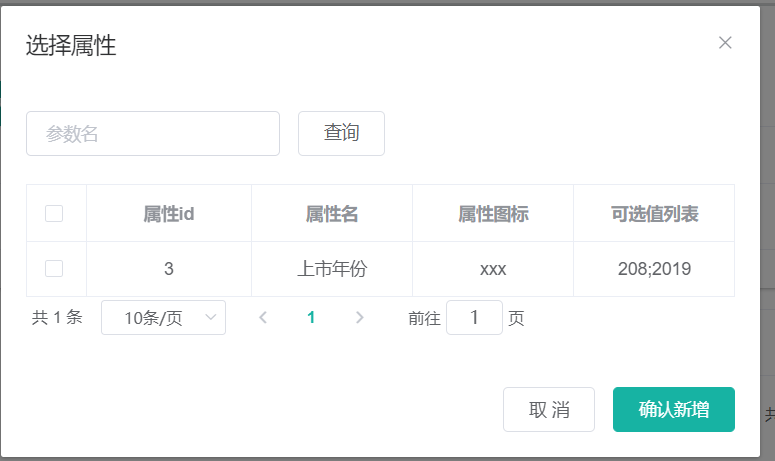


## 11.5、保存新增的关联

1、url11：`/product/attrgroup/attr/relation`

AttrGroupController

```java
    @PostMapping("/attr/relation")
    public R attrRelation(@RequestBody List<AttrGroupRelationVo> vos){
        relationService.saveBatch(vos);
        return R.ok();
    }
```


AttrAttrgroupRelationServiceImpl

```java
    @Override
    public void saveBatch(List<AttrGroupRelationVo> vos) {
        List<AttrAttrgroupRelationEntity> entities = vos.stream().map((vo) -> {
            AttrAttrgroupRelationEntity relationEntity = new AttrAttrgroupRelationEntity();
            BeanUtils.copyProperties(vo, relationEntity);
            return relationEntity;
        }).collect(Collectors.toList());
        this.saveBatch(entities);
    }
```


> **或者用我的方法**，用List<AttrAttrgroupRelationEntity>接收参数，不用vo和重写service方法：
>
> 
>
> ```java
>     @PostMapping("/attr/relation")
>     public R attrRelation(@RequestBody List<AttrAttrgroupRelationEntity> attrAttrgroupRelationEntities){
>         attrAttrgroupRelationService.saveBatch(attrAttrgroupRelationEntities);
>         return R.ok();
>     }
> ```
>
> 

测试成功。 