>  **导航：**
>
> [谷粒商城笔记+踩坑汇总篇](https://blog.csdn.net/qq_40991313/article/details/127099139?spm=1001.2014.3001.5501)
>
>  **Java笔记汇总：**
>
> [【Java笔记+踩坑汇总】Java基础+JavaWeb+SSM+SpringBoot+SpringCloud+瑞吉外卖/谷粒商城/学成在线+设计模式+面试题汇总+性能调优/架构设计+源码解析-CSDN博客](https://blog.csdn.net/qq_40991313/article/details/126646289)

[TOC]


# 1. 【搜索模块】搭建页面环境

## **1.1 搜索页动静分离**

将搜索页中的静态资源上传至/static/search文件夹下，将index.html搜索首页存放在gulimall-search服务的templates下

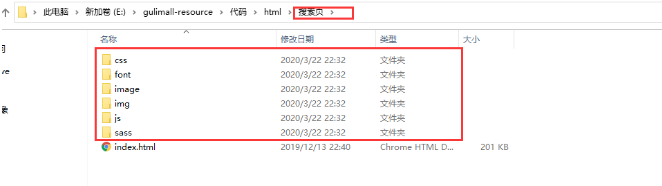


```
cd /mydata/nginx/html/static
mkdir search
```


 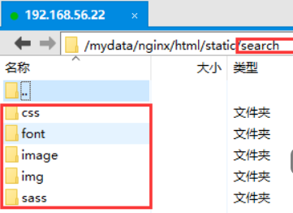


 


## **1.2 使用thymeleaf模板引擎**

### **1.2.1 导入thymeleaf的依赖**

```XML
<!--导入thymeleaf依赖-->
<dependency>
<groupId>org.springframework.boot</groupId>
<artifactId>spring-boot-starter-thymeleaf</artifactId>
</dependency>
```


### **1.2.2 index.html导入thymeleaf的命名空间**

```XML
xmlns:th="http://www.thymeleaf.org"
```


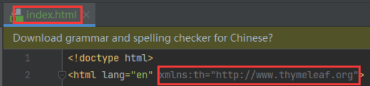


### **1.2.3 首页静态路径前缀加“/static/search”** 

**index.html修改静态资源的请求路径，使用CTRL+R进行全部替换**


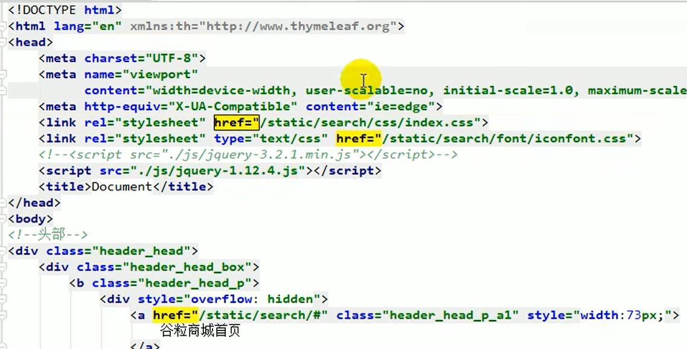


## 1.3 配置Nginx和网关

**所有动态请求search.gulimall.com的请求由Nginx转发给网关。**

### **1.3.1 hosts文件配置域名映射地址**

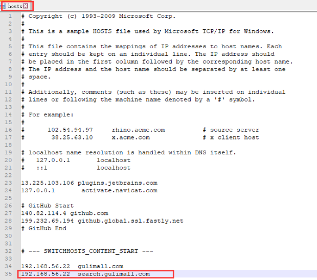


### **1.3.2 配置Nginx配置文件**

> 主配置文件nginx.conf的http块配置过： 
>
> ```
> include /etc/nginx/conf.d/*.conf;    #该路径下的配置文件会全部合并到这里
> ```
>
> 

```
cd /mydata/nginx/conf.d
vi gulimall.conf
```


监听的域名server_name由“gulimall.com”改为“*.gulimall.com”

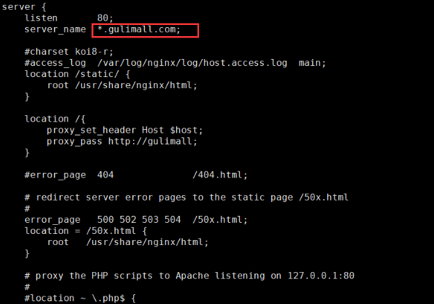


**重启nginx服务** 

```
docker restart  nginx
```


### **1.3.3 配置网关**


```bash
        - id: gulimall_host_route
          uri: lb://gulimall-product  # lb：负载均衡
          predicates:
            - Host=gulimall.com   # **.xxx  子域名
 
        - id: gulimall_search_route
          uri: lb://gulimall-search  # lb：负载均衡
          predicates:
            - Host=search.gulimall.com   # **.xxx  子域名
```


测试通过： 

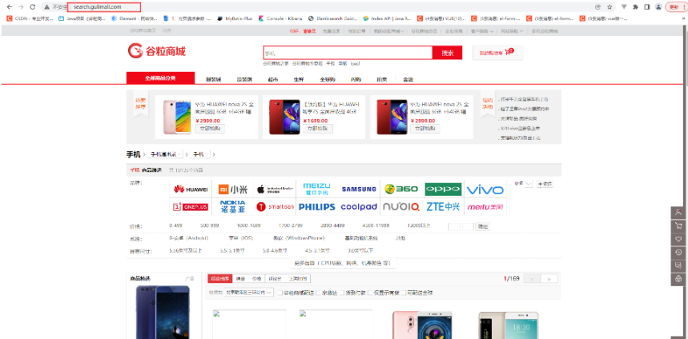


# 2. 搜索后页面跳转

**①导入热部署依赖**

```XML
<!--导入热部署依赖-->
<dependency>
  <groupId>org.springframework.boot</groupId>
  <artifactId>spring-boot-devtools</artifactId>
  <optional>true</optional>
</dependency>
```


**② 开发期间yml记得默认关闭缓存**

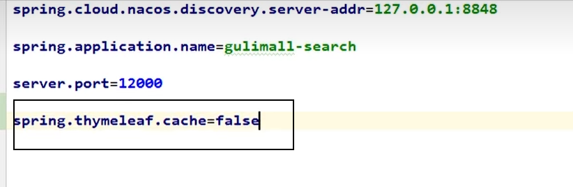

 **点击这几处要跳转到检索首页**


 **鼠标右击，点击检查**

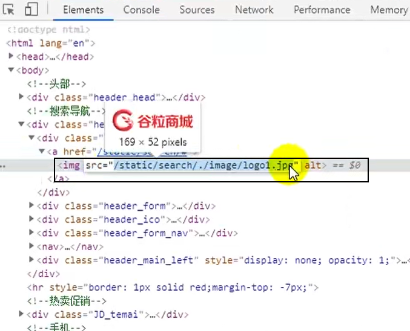

 **修改请求路径**

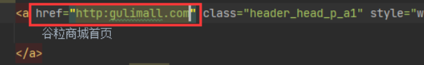

 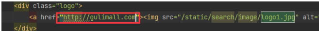

 **CTRL+F9重新编译** 

**出现错误：访问到80端口**

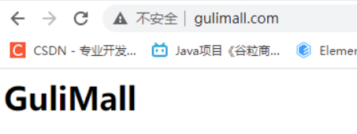

**出现问题的原因：nginx配置出错不能正确路由跳转** 

**解决方案：修改nginx配置文件**

```bash
cd /mydata/nginx/conf/conf.d
vi gulimall.conf
```


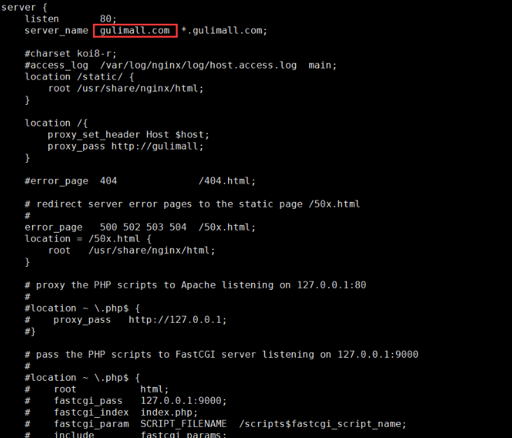

 **重启nginx** 

```bash
docker restart nginx
```


**关闭Product服务thymeleaf的缓存，重启服务**

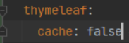 

 **首页，点击搜索按钮要来到搜索页**


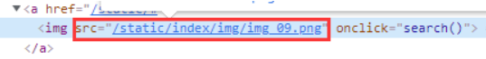


 **点击手机1111111要来到搜索页**

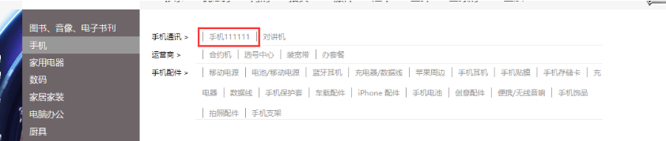 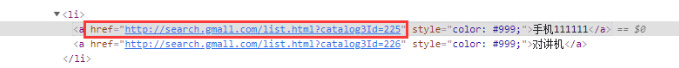


 **请求路径为**http://search.gmall.com/list.html?catalog3Id=225**，这是一个错误请求路径，缺少了gulimall而不是gumall**

**①将index.html修改为list.html**

**②编写控制类**

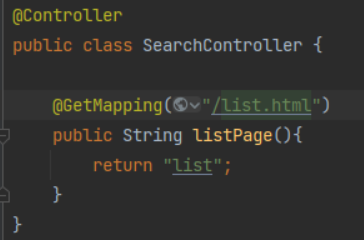

 **③首页搜索栏修改为**


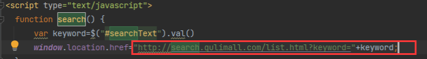

 **④ 修改js并上传nginx，重启nginx**

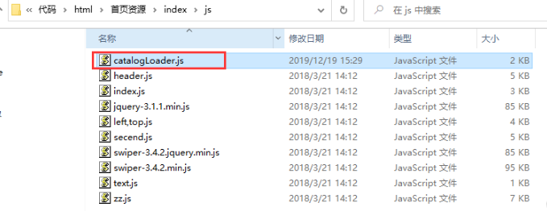


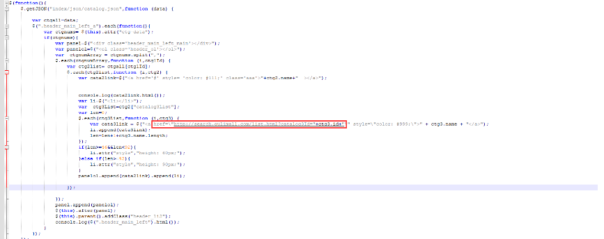


 **结果：**

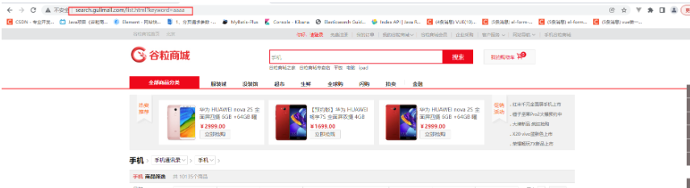


# 3. 抽取检索模型vo类

> **DTO（Data Transfer Object）数据传输对象，**通常指的前后端之间的传输。
>
> **VO（Value Object）值对象，**我们把它看作视图对象，用于展示层，它的作用是把某个指定页面所有数据封装起来。


## 3.1 请求模型类，SearchParam 

**①通过首页搜索栏进行检索，传递keyword**


 **②通过分类进行检索。传递catalog3Id**

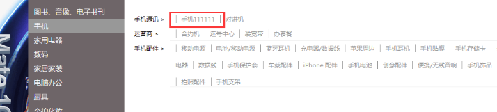


 **③复杂查询**

**排序：**①综合排序②销量③价格 ，例如:通过销量降序排序或者升序排序，sort=saleCount_desc/saleCount_asc

**过滤：**①库存，例如：有库存->hasStock=1，无库存 -> hasStock=0 ②价格区间 ，例如： 价格位于 400 -900 -> skuPrice=400_900,价格低于900 -> skuPrice= _900,价格高于900 -> skuPrice=900_ ③品牌: 可以按照多个品牌进行筛选

**聚合：**属性：多个属性以:分割，1号属性网络可以是4G也可以是5G -> attrs=1_4G:5G 

**分页：**页码

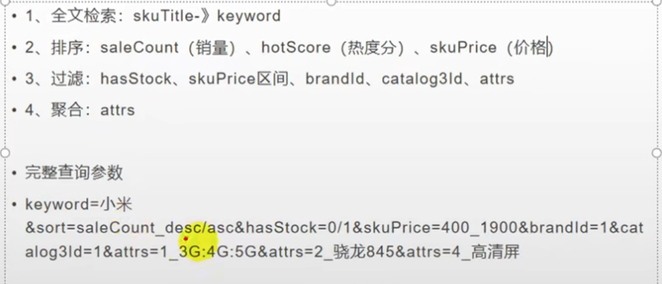


**创建Vo，用于封装查询条件**

```java
@Data
public class SearchParam {

    /**
     * 页面传递过来的全文匹配关键字
     */
    private String keyword;

    /**
     * 品牌id,可以多选
     */
    private List<Long> brandId;

    /**
     * 三级分类id
     */
    private Long catalog3Id;

    /**
     * 排序条件：sort=price/salecount/hotscore_desc/asc
     */
    private String sort;

    /**
     * 是否显示有货
     */
    private Integer hasStock;

    /**
     * 价格区间查询
     */
    private String skuPrice;

    /**
     * 按照属性进行筛选
     */
    private List<String> attrs;

    /**
     * 页码
     */
    private Integer pageNum = 1;

    /**
     * 原生的所有查询条件
     */
    private String _queryString;


}
```


## 3.2 响应模型类，SearchResult 

以京东为例，搜索小米

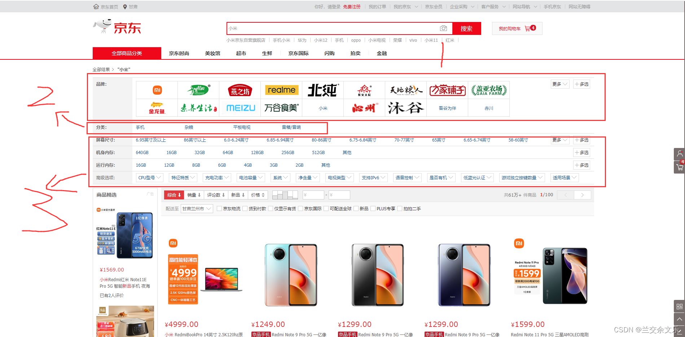

**默认：查询所有商品信息** 

1.小米所属的品牌 2.小米所属的分类 3.小米所属的属性

编写返回结果的Vo

```java
@Data
public class SearchResult {

    /**
     * 查询到的所有商品信息
     */
    private List<SkuEsModel> product;


    /**
     * 当前页码
     */
    private Integer pageNum;

    /**
     * 总记录数
     */
    private Long total;

    /**
     * 总页码
     */
    private Integer totalPages;

    private List<Integer> pageNavs;

    /**
     * 当前查询到的结果，所有涉及到的品牌
     */
    private List<BrandVo> brands;

    /**
     * 当前查询到的结果，所有涉及到的所有属性
     */
    private List<AttrVo> attrs;

    /**
     * 当前查询到的结果，所有涉及到的所有分类
     */
    private List<CatalogVo> catalogs;


    //===========================以上是返回给页面的所有信息============================//


    /* 面包屑导航数据 */
    private List<NavVo> navs;

    @Data
    public static class NavVo {
        private String navName;
        private String navValue;
        private String link;
    }


    @Data
    public static class BrandVo {

        private Long brandId;

        private String brandName;

        private String brandImg;
    }


    @Data
    public static class AttrVo {

        private Long attrId;

        private String attrName;

        private List<String> attrValue;
    }


    @Data
    public static class CatalogVo {

        private Long catalogId;

        private String catalogName;
    }
}
```


# 4. 检索DSL语句 


elasticsearch的查询是基于JSON风格的DSL来实现的。

**领域特定语言**（英语：*domain*-*specific* *language*、**DSL**）指的是专注于某个应用程序领域的计算机语言。

## 4.1 回顾索引库

```bash
PUT product
{
    "mappings":{
        "properties": {
            "skuId":{ "type": "long" },    #商品sku
            "spuId":{ "type": "keyword" },  #当前sku所属的spu。
            "skuTitle": {
                "type": "text",
                "analyzer": "ik_smart"      #只有sku的标题需要被分词
            },
            "skuPrice": { "type": "keyword" },  
            "skuImg"  : { "type": "keyword" },  
            "saleCount":{ "type":"long" },
            "hasStock": { "type": "boolean" },    #是否有库存。在库存模块添加此商品库存后，此字段更为true
            "hotScore": { "type": "long"  },
            "brandId":  { "type": "long" },
            "catalogId": { "type": "long"  },
            "brandName": {"type": "keyword"}, 
            "brandImg":{
                "type": "keyword",
                "index": false,  
                "doc_values": false 
            },
            "catalogName": {"type": "keyword" }, 
            "attrs": {
                "type": "nested",    #对象数组防止扁平化，不能用object类型
                "properties": {
                    "attrId": {"type": "long"  },
                    "attrName": {
                        "type": "keyword",
                        "index": false,
                        "doc_values": false
                    },
                    "attrValue": {"type": "keyword" }
                }
            }
        }
    }
}
 
```


## 4.2 查询部分

### 4.2.1 分析

首先，这是一个bool查询，将**需要评分的检索条件写在must**中，**不评分的检索条件写在filter中**。 

> **回顾布尔查询**
>
> 布尔查询是一个或多个查询子句的组合，每一个子句就是一个子查询。子查询的组合方式有：
>
> - **must：**必须匹配每个子查询，类似“与”。一般搭配match匹配，查text类型。
> - **should：**选择性匹配子查询，类似“或”
> - **must_not：**必须不匹配，不参与算分，类似“非”
> - **filter：**必须匹配，不参与算分。一般搭配term、range匹配，查数值、关键字、地理等。
>
> 参与**打分的字段越多，查询的性能也越差，建议多用must_not和filter**。
>
> 因此**多条件查询时，建议这样做：**
>
> - **搜索框的关键字搜索，是全文检索查询，使用must查询，参与算分**
> - **其它过滤条件，采用filter查询。不参与算分**


### 4.2.2 **商品标题的检索**

算分用must，例如：keyword=iphone

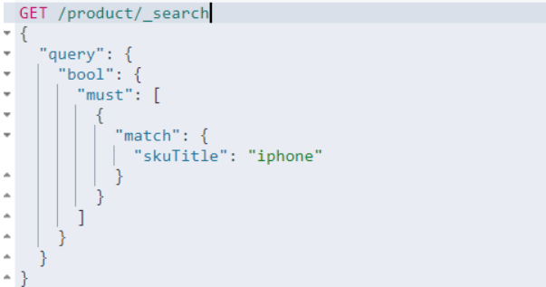


### 4.2.3 **手机分类的检索**

例如: catalogId=225 ,非文本字段检索用term

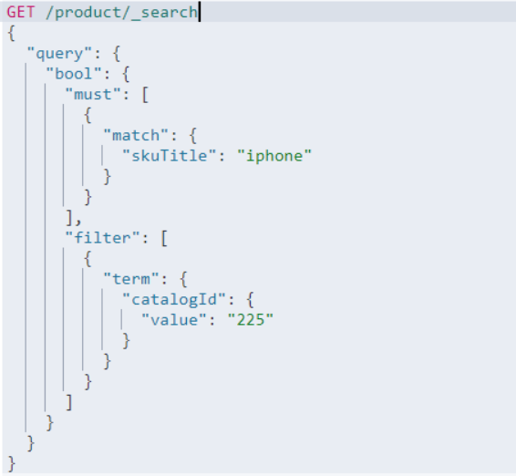


### 4.2.4 **品牌检索**

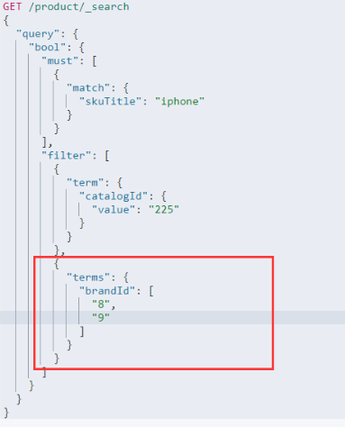


### 4.2.5 **根据属性检索。**bool-filter

属性为了防止扁平化处理声明为nested，因此，需要使用nested查询

> nested query文档地址：[Nested query | Elasticsearch Guide [8.2\] | Elastic](https://www.elastic.co/guide/en/elasticsearch/reference/8.2/query-dsl-nested-query.html)
>
> 嵌入式查询示例：
>
> 创建索引库
>
> ```bash
> PUT /my-index-000001
> {
>   "mappings": {
>     "properties": {
>       "obj1": {
>         "type": "nested"
>       }
>     }
>   }
> }
> ```
>
> 
>
> 查询：
>
> ```bash
> GET /my-index-000001/_search
> {
>   "query": {
>     "nested": {
>       "path": "obj1",
>       "query": {
>         "bool": {
>           "must": [
>             { "match": { "obj1.name": "blue" } },
>             { "range": { "obj1.count": { "gt": 5 } } }
>           ]
>         }
>       },
>       "score_mode": "avg"
>     }
>   }
> }
> ```
>
> 
>
> **es数组的扁平化处理：**es存储**对象数组**时，它会将数组扁平化，也就是说**将对象数组的每个属性抽取出来**，作为一个数组。因此会出现查询紊乱的问题。
>
> 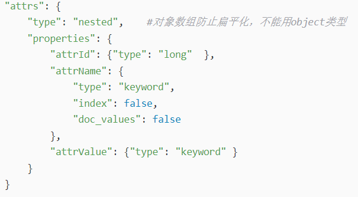

 

### 4.2.6 **是否有库存**

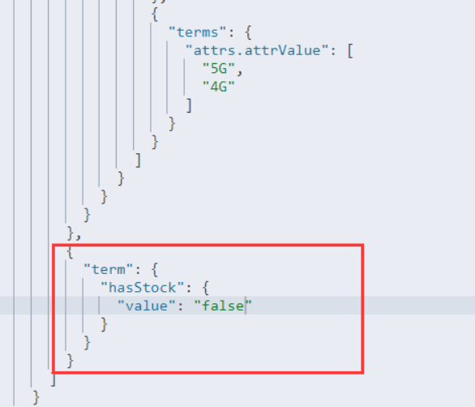


### 4.2.7 **价格区间检索**

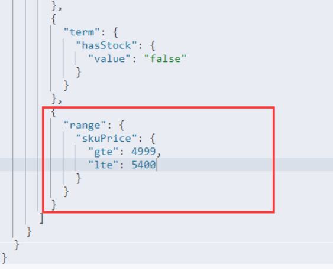


### 4.2.8 **排序**

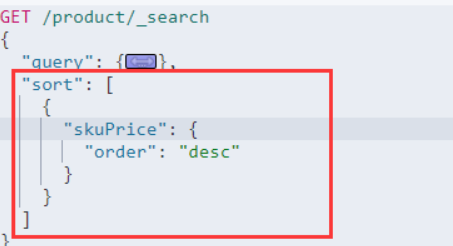


### 4.2.9 **页码**

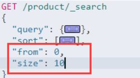


### 4.2.10 **高亮**

标题内容含有搜索内容则标题中含有的搜索内容标红

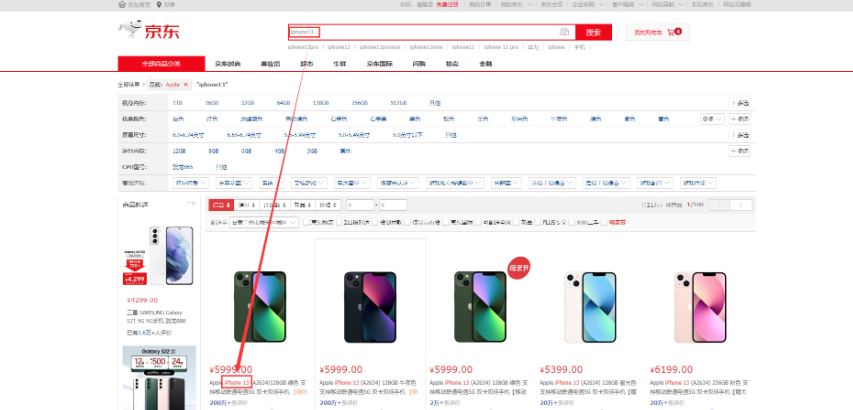


 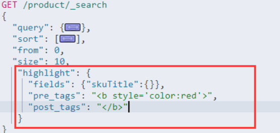

 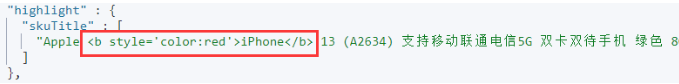


### 4.2.11 **最终DSL语句**

```bash
GET /product/_search
{
  "query": {
    "bool": {
      "must": [
        {
          "match": {
            "skuTitle": "iphone"
          }
        }
      ],
      "filter": [
        {
          "term": {
            "catalogId": {
              "value": "225"
            }
          }
        },
        {
          "terms": {
            "brandId": [
              "8",
              "9"
            ]
          }
        },
        {
          "nested": {
            "path": "attrs",
            "query": {
              "bool": {
                "must": [
                  {
                    "term": {
                      "attrs.attrId": {
                        "value": "1"
                      }
                    }
                  },
                  {
                    "terms": {
                      "attrs.attrValue": [
                        "5G",
                        "4G"
                      ]
                    }
                  }
                ]
              }
            }
          }
        },
        {
          "term": {
            "hasStock": {
              "value": "false"
            }
          }
        },
        {
          "range": {
            "skuPrice": {
              "gte": 4999,
              "lte": 5400
            }
          }
        }
      ]
    }
  },
  "sort": [
    {
      "skuPrice": {
        "order": "desc"
      }
    }
  ],
  "from": 0,
  "size": 10,
   "highlight": {
     "fields": {"skuTitle":{}},
     "pre_tags": "<b style='color:red'>",
     "post_tags": "</b>"
   }
}
```


## 4.3 聚合部分

### 4.3.1 分析

聚合目的：**动态展示属性：**

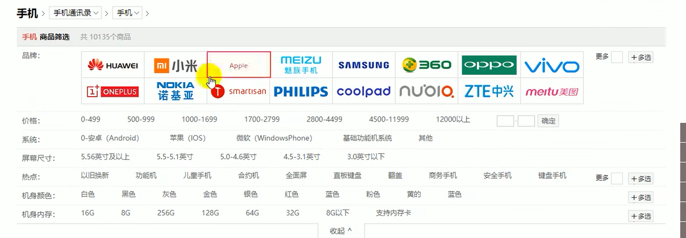


> 聚合常见的有三类：
>
> - 桶（Bucket）聚合：
>
>   用来对文档做分组 	
>
>   - **TermAggregation：**按照文档字段值分组，例如按照品牌值分组、按照国家分组
>   - Date Histogram：按照日期阶梯分组，例如一周为一组，或者一月为一组
>
> - 度量（Metric）聚合：
>
>   用以计算一些值，比如：最大值、最小值、平均值等 
>
>   - Avg：求平均值
>   - Max：求最大值
>   - Min：求最小值
>   - Stats：同时求max、min、avg、sum等
>
> - **管道（pipeline）聚合：**其它聚合的结果为基础做聚合

**测试聚合**

根据品牌id聚合 

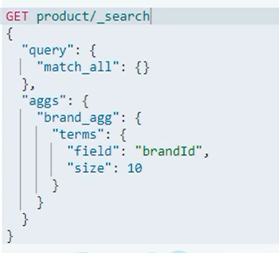

可以看见查到两个桶，id为12的品牌的商品有12个，18号品牌的商品有9个：

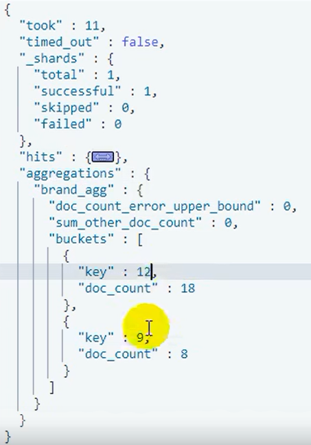


### 4.3.2 **创建允许索引的索引库**

①product一些不允许索引，因此，需要**创建新的映射，允许索引**

> 主要修改了原索引库里的“skuImg” 、“attrName”、“attrValue”，让它们可以被索引和聚合

```bash
PUT /gulimall_product
{
  "mappings": {
    "properties": {
      "skuId":{
        "type": "long"
      },
      "spuId":{
        "type": "keyword"
      },
      "skuTitle":{
        "type": "text",
        "analyzer": "ik_smart"
      },
      "skuPrice":{
        "type": "keyword"
      },
      "skuImg":{
        "type": "keyword"
      },
      "saleCount":{
        "type": "long"
      },
      "hasStock":{
        "type": "boolean"
      },
      "hotScore":{
        "type": "long"
      },
      "brandId":{
        "type": "long"
      },
      "catelogId":{
        "type": "long"
      },
      "brandName":{
        "type": "keyword"
      },
      "brandImg":{
        "type": "keyword"
      },
      "catelogName":{
        "type": "keyword"
      },
      "attrs":{
        "type": "nested",
        "properties": {
          "attrId":{
            "type":"long"
          },
          "attrName":{
            "type": "keyword"
          },
          "attrValue":{
            "type":"keyword"
          }
        }
      }
    }
  }
}
```


> 对比商品表：
>
> ```bash
> PUT product
> {
>     "mappings":{
>         "properties": {
>             "skuId":{ "type": "long" },    #商品sku
>             "spuId":{ "type": "keyword" },  #当前sku所属的spu。
>             "skuTitle": {
>                 "type": "text",
>                 "analyzer": "ik_smart"      #只有sku的标题需要被分词
>             },
>             "skuPrice": { "type": "keyword" },  
>             "skuImg"  : { "type": "keyword" },  
>             "saleCount":{ "type":"long" },
>             "hasStock": { "type": "boolean" },    #是否有库存。在库存模块添加此商品库存后，此字段更为true
>             "hotScore": { "type": "long"  },
>             "brandId":  { "type": "long" },
>             "catalogId": { "type": "long"  },
>             "brandName": {"type": "keyword"}, 
>             "brandImg":{
>                 "type": "keyword",
>                 "index": false,  
>                 "doc_values": false     #禁止被聚合
>             },
>             "catalogName": {"type": "keyword" }, 
>             "attrs": {
>                 "type": "nested",    #对象数组防止扁平化，不能用object类型
>                 "properties": {
>                     "attrId": {"type": "long"  },
>                     "attrName": {
>                         "type": "keyword",
>                         "index": false,
>                         "doc_values": false
>                     },
>                     "attrValue": {"type": "keyword" }
>                 }
>             }
>         }
>     }
> }
>  
> ```
>
> 

### 4.3.3 索引库数据迁移

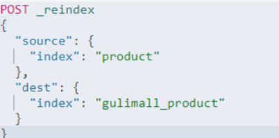


### 4.3.4 修改常量类里的“索引库名”为新索引库

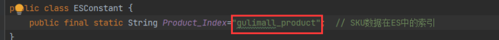


### 4.3.5 品牌聚合，子聚合

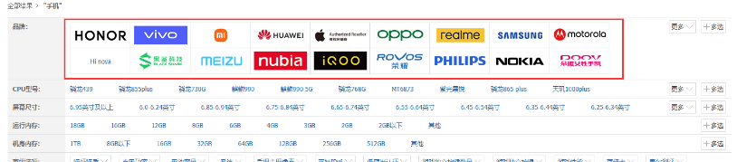


先聚合品牌id，再对聚合结果子聚合品牌名和图片。

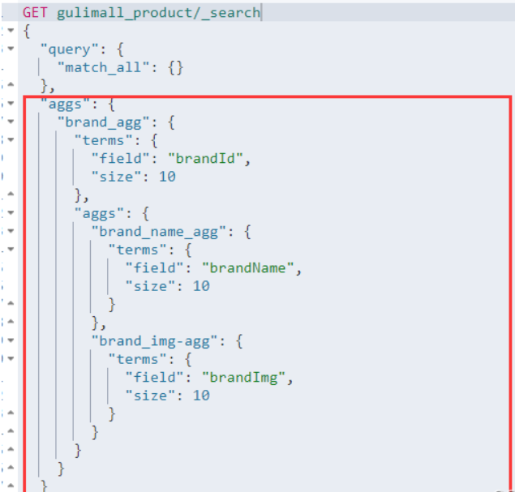

 **查询结果**

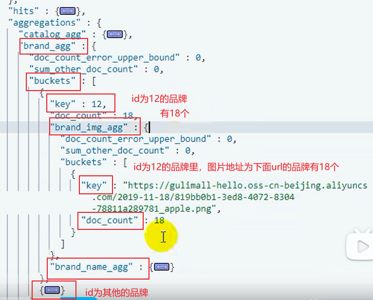


### 4.3.6 分类聚合

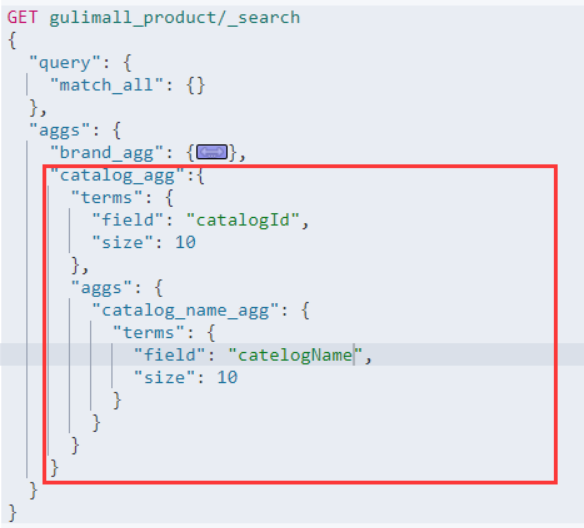


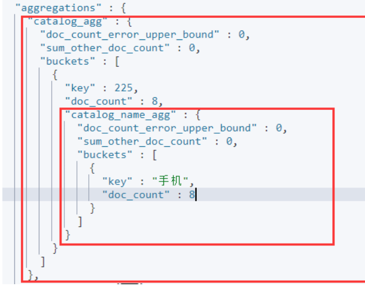


### 4.3.7 属性聚合,nested聚合

nested aggregations文档地址：[Nested Aggregations | Elasticsearch: The Definitive Guide [2.x\] | Elastic](https://www.elastic.co/guide/en/elasticsearch/guide/2.x/nested-aggregation.html#nested-aggregation)

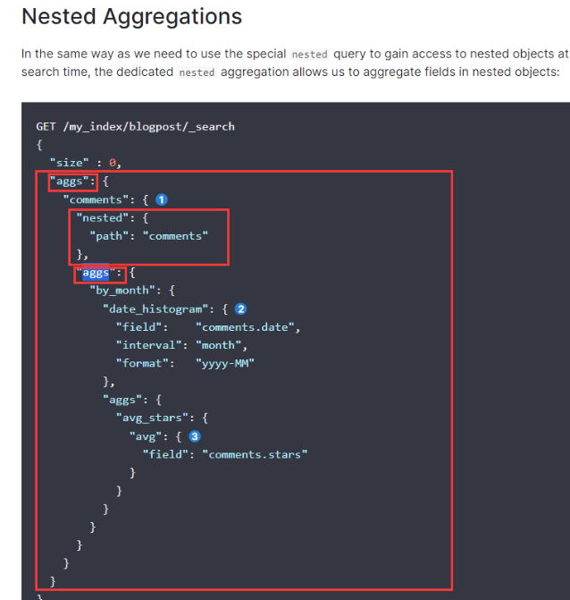

 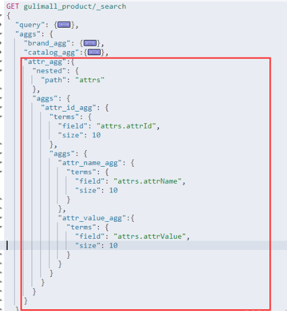


### 4.3.8 完整DSL

```bash
GET /gulimall_product/_search
{
  "query": {
    "bool": {
      "must": [
        {
          "match": {
            "skuTitle": "iphone"
          }
        }
      ],
      "filter": [
        {
          "term": {
            "catalogId": {
              "value": "225"
            }
          }
        },
        {
          "terms": {
            "brandId": [
              "8",
              "9"
            ]
          }
        },
        {
          "nested": {
            "path": "attrs",
            "query": {
              "bool": {
                "must": [
                  {
                    "term": {
                      "attrs.attrId": {
                        "value": "1"
                      }
                    }
                  },
                  {
                    "terms": {
                      "attrs.attrValue": [
                        "5G",
                        "4G"
                      ]
                    }
                  }
                ]
              }
            }
          }
        },
        {
          "term": {
            "hasStock": {
              "value": "false"
            }
          }
        },
        {
          "range": {
            "skuPrice": {
              "gte": 4999,
              "lte": 5400
            }
          }
        }
      ]
    }
  },
  "sort": [
    {
      "skuPrice": {
        "order": "desc"
      }
    }
  ],
  "from": 0,
  "size": 10,
   "highlight": {
     "fields": {"skuTitle":{}},
     "pre_tags": "<b style='color:red'>",
     "post_tags": "</b>"
   },
   "aggs": {
    "brand_agg": {
      "terms": {
        "field": "brandId",
        "size": 10
      },
      "aggs": {
        "brand_name_agg": {
          "terms": {
            "field": "brandName",
            "size": 10
          }
        },
        "brand_img-agg": {
          "terms": {
            "field": "brandImg",
            "size": 10
          }
        }
      }
    },
    "catalog_agg":{
      "terms": {
        "field": "catalogId",
        "size": 10
      },
      "aggs": {
        "catalog_name_agg": {
          "terms": {
            "field": "catelogName",
            "size": 10
          }
        }
      }
    },
    "attr_agg":{
      "nested": {
        "path": "attrs"
      },
      "aggs": {
        "attr_id_agg": {
          "terms": {
            "field": "attrs.attrId",
            "size": 10
          },
          "aggs": {
            "attr_name_agg": {
              "terms": {
                "field": "attrs.attrName",
                "size": 10
              }
            },
            "attr_value_agg":{
              "terms": {
                "field": "attrs.attrValue",
                "size": 10
              }
            }
          }
        }
      }
    }
  }
}
```


### 4.3.9 将gulimall_product映射和DSL进行保存

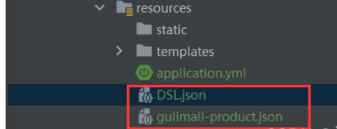


# 5. SearchRequest构建

## 5.1 环境准备

### 5.1.1 controller

查询模块

```java
package com.xunqi.gulimall.search.controller;
@Controller
public class SearchController {

    @Autowired
    private MallSearchService mallSearchService;

    /**
     * 自动将页面提交过来的所有请求参数封装成我们指定的对象
     * @param param
     * @return
     */
    @GetMapping(value = "/list.html")
    public String listPage(SearchParam param, Model model, HttpServletRequest request) {

        param.set_queryString(request.getQueryString());

        //1、根据传递来的页面的查询参数，去es中检索商品
        SearchResult result = mallSearchService.search(param);

        model.addAttribute("result",result);

        return "list";
    }

}
```


### 5.1.2 service导入ES客户端对象

```java
    @Autowired
    private RestHighLevelClient restHighLevelClient;
```


### 5.1.3 **整体业务流程、抽取方法**

1.处理查询请求DSL。抽取方法

2.查询

3.解析查询响应。抽取方法

**具体抽取查询和构建查询结果的方法：** 

```java
    @Override
    public SearchResult search(SearchParam param) {

        //1、动态构建出查询需要的DSL语句
        SearchResult result = null;

        //1、准备检索请求
        SearchRequest searchRequest = buildSearchRequest(param);

        try {
            //2、执行检索请求
            SearchResponse response = restHighLevelClient.search(searchRequest, GulimallElasticSearchConfig.COMMON_OPTIONS);

            //3、分析响应数据，封装成我们需要的格式
            result = buildSearchResult(response,param);
        } catch (IOException e) {
            e.printStackTrace();
        }

        return result;
    }

    private SearchRequest buildSearchRequest(SearchParam param)
    {return null;}
    private SearchResult buildSearchResult(SearchResponse response,SearchParam param)
    {return null;}
```


## 5.2 实现查询业务


### 5.2.1 查询

```java
    @Override
    public SearchResult search(SearchParam param) {

        //1、动态构建出查询需要的DSL语句
        SearchResult result = null;

        //1、准备检索请求
        SearchRequest searchRequest = buildSearchRequest(param);

        try {
            //2、执行检索请求
            SearchResponse response = restHighLevelClient.search(searchRequest, GulimallElasticSearchConfig.COMMON_OPTIONS);

            //3、分析响应数据，封装成我们需要的格式
            result = buildSearchResult(response,param);
        } catch (IOException e) {
            e.printStackTrace();
        }

        return result;
    }
```


### 5.2.2 处理查询请求DSL

```java
    private SearchRequest buildSearchRequest(SearchParam param) {

        SearchSourceBuilder searchSourceBuilder = new SearchSourceBuilder();

        /**
         * 模糊匹配，过滤（按照属性，分类，品牌，价格区间，库存）
         */
        //1. 构建bool-query
        BoolQueryBuilder boolQueryBuilder=new BoolQueryBuilder();

        //1.1 bool-must
        if(!StringUtils.isEmpty(param.getKeyword())){
            boolQueryBuilder.must(QueryBuilders.matchQuery("skuTitle",param.getKeyword()));
        }

        //1.2 bool-fiter
        //1.2.1 catelogId
        if(null != param.getCatalog3Id()){
            boolQueryBuilder.filter(QueryBuilders.termQuery("catalogId",param.getCatalog3Id()));
        }

        //1.2.2 brandId
        if(null != param.getBrandId() && param.getBrandId().size() >0){
            boolQueryBuilder.filter(QueryBuilders.termsQuery("brandId",param.getBrandId()));
        }

        //1.2.3 attrs
        if(param.getAttrs() != null && param.getAttrs().size() > 0){

            param.getAttrs().forEach(item -> {
                //attrs=1_5寸:8寸&2_16G:8G
                BoolQueryBuilder boolQuery = QueryBuilders.boolQuery();


                //attrs=1_5寸:8寸
                String[] s = item.split("_");
                String attrId=s[0];
                String[] attrValues = s[1].split(":");//这个属性检索用的值
                boolQuery.must(QueryBuilders.termQuery("attrs.attrId",attrId));
                boolQuery.must(QueryBuilders.termsQuery("attrs.attrValue",attrValues));

                NestedQueryBuilder nestedQueryBuilder = QueryBuilders.nestedQuery("attrs",boolQuery, ScoreMode.None);
                boolQueryBuilder.filter(nestedQueryBuilder);
            });

        }

        //1.2.4 hasStock
        if(null != param.getHasStock()){
            boolQueryBuilder.filter(QueryBuilders.termQuery("hasStock",param.getHasStock() == 1));
        }


        //1.2.5 skuPrice
        if(!StringUtils.isEmpty(param.getSkuPrice())){
            //skuPrice形式为：1_500或_500或500_
            RangeQueryBuilder rangeQueryBuilder = QueryBuilders.rangeQuery("skuPrice");
            String[] price = param.getSkuPrice().split("_");
            if(price.length==2){
                rangeQueryBuilder.gte(price[0]).lte(price[1]);
            }else if(price.length == 1){
                if(param.getSkuPrice().startsWith("_")){
                    rangeQueryBuilder.lte(price[1]);
                }
                if(param.getSkuPrice().endsWith("_")){
                    rangeQueryBuilder.gte(price[0]);
                }
            }
            boolQueryBuilder.filter(rangeQueryBuilder);
        }

        //封装所有的查询条件
        searchSourceBuilder.query(boolQueryBuilder);


        /**
         * 排序，分页，高亮
         */

        //排序
        //形式为sort=hotScore_asc/desc
        if(!StringUtils.isEmpty(param.getSort())){
            String sort = param.getSort();
            String[] sortFileds = sort.split("_");

            SortOrder sortOrder="asc".equalsIgnoreCase(sortFileds[1])?SortOrder.ASC:SortOrder.DESC;

            searchSourceBuilder.sort(sortFileds[0],sortOrder);
        }

        //分页
        searchSourceBuilder.from((param.getPageNum()-1)*EsConstant.PRODUCT_PAGESIZE);
        searchSourceBuilder.size(EsConstant.PRODUCT_PAGESIZE);

        //高亮
        if(!StringUtils.isEmpty(param.getKeyword())){

            HighlightBuilder highlightBuilder = new HighlightBuilder();
            highlightBuilder.field("skuTitle");
            highlightBuilder.preTags("<b style='color:red'>");
            highlightBuilder.postTags("</b>");

            searchSourceBuilder.highlighter(highlightBuilder);
        }


        /**
         * 聚合分析
         */
        //1. 按照品牌进行聚合
        TermsAggregationBuilder brand_agg = AggregationBuilders.terms("brand_agg");
        brand_agg.field("brandId").size(50);


        //1.1 品牌的子聚合-品牌名聚合
        brand_agg.subAggregation(AggregationBuilders.terms("brand_name_agg")
                .field("brandName").size(1));
        //1.2 品牌的子聚合-品牌图片聚合
        brand_agg.subAggregation(AggregationBuilders.terms("brand_img_agg")
                .field("brandImg").size(1));

        searchSourceBuilder.aggregation(brand_agg);

        //2. 按照分类信息进行聚合
        TermsAggregationBuilder catalog_agg = AggregationBuilders.terms("catalog_agg");
        catalog_agg.field("catalogId").size(20);

        catalog_agg.subAggregation(AggregationBuilders.terms("catalog_name_agg").field("catalogName").size(1));

        searchSourceBuilder.aggregation(catalog_agg);

        //2. 按照属性信息进行聚合
        NestedAggregationBuilder attr_agg = AggregationBuilders.nested("attr_agg", "attrs");
        //2.1 按照属性ID进行聚合
        TermsAggregationBuilder attr_id_agg = AggregationBuilders.terms("attr_id_agg").field("attrs.attrId");
        attr_agg.subAggregation(attr_id_agg);
        //2.1.1 在每个属性ID下，按照属性名进行聚合
        attr_id_agg.subAggregation(AggregationBuilders.terms("attr_name_agg").field("attrs.attrName").size(1));
        //2.1.1 在每个属性ID下，按照属性值进行聚合
        attr_id_agg.subAggregation(AggregationBuilders.terms("attr_value_agg").field("attrs.attrValue").size(50));
        searchSourceBuilder.aggregation(attr_agg);

        log.debug("构建的DSL语句 {}",searchSourceBuilder.toString());

        SearchRequest searchRequest = new SearchRequest(new String[]{EsConstant.PRODUCT_INDEX},searchSourceBuilder);

        return searchRequest;
    }
```


### 5.2.3 解析响应结果

```java
    private SearchResult buildSearchResult(SearchResponse response,SearchParam param) {

        SearchResult result = new SearchResult();

        //1、返回的所有查询到的商品
        SearchHits hits = response.getHits();

        List<SkuEsModel> esModels = new ArrayList<>();
        //遍历所有商品信息
        if (hits.getHits() != null && hits.getHits().length > 0) {
            for (SearchHit hit : hits.getHits()) {
                String sourceAsString = hit.getSourceAsString();
                SkuEsModel esModel = JSON.parseObject(sourceAsString, SkuEsModel.class);

                //判断是否按关键字检索，若是就显示高亮，否则不显示
                if (!StringUtils.isEmpty(param.getKeyword())) {
                    //拿到高亮信息显示标题
                    HighlightField skuTitle = hit.getHighlightFields().get("skuTitle");
                    String skuTitleValue = skuTitle.getFragments()[0].string();
                    esModel.setSkuTitle(skuTitleValue);
                }
                esModels.add(esModel);
            }
        }
        result.setProduct(esModels);

        //2、当前商品涉及到的所有属性信息
        List<SearchResult.AttrVo> attrVos = new ArrayList<>();
        //获取属性信息的聚合
        ParsedNested attrsAgg = response.getAggregations().get("attr_agg");
        ParsedLongTerms attrIdAgg = attrsAgg.getAggregations().get("attr_id_agg");
        for (Terms.Bucket bucket : attrIdAgg.getBuckets()) {
            SearchResult.AttrVo attrVo = new SearchResult.AttrVo();
            //1、得到属性的id
            long attrId = bucket.getKeyAsNumber().longValue();
            attrVo.setAttrId(attrId);

            //2、得到属性的名字
            ParsedStringTerms attrNameAgg = bucket.getAggregations().get("attr_name_agg");
            String attrName = attrNameAgg.getBuckets().get(0).getKeyAsString();
            attrVo.setAttrName(attrName);

            //3、得到属性的所有值
            ParsedStringTerms attrValueAgg = bucket.getAggregations().get("attr_value_agg");
            List<String> attrValues = attrValueAgg.getBuckets().stream().map(item -> item.getKeyAsString()).collect(Collectors.toList());
            attrVo.setAttrValue(attrValues);

            attrVos.add(attrVo);
        }

        result.setAttrs(attrVos);

        //3、当前商品涉及到的所有品牌信息
        List<SearchResult.BrandVo> brandVos = new ArrayList<>();
        //获取到品牌的聚合
        ParsedLongTerms brandAgg = response.getAggregations().get("brand_agg");
        for (Terms.Bucket bucket : brandAgg.getBuckets()) {
            SearchResult.BrandVo brandVo = new SearchResult.BrandVo();

            //1、得到品牌的id
            long brandId = bucket.getKeyAsNumber().longValue();
            brandVo.setBrandId(brandId);

            //2、得到品牌的名字
            ParsedStringTerms brandNameAgg = bucket.getAggregations().get("brand_name_agg");
            String brandName = brandNameAgg.getBuckets().get(0).getKeyAsString();
            brandVo.setBrandName(brandName);

            //3、得到品牌的图片
            ParsedStringTerms brandImgAgg = bucket.getAggregations().get("brand_img_agg");
            String brandImg = brandImgAgg.getBuckets().get(0).getKeyAsString();
            brandVo.setBrandImg(brandImg);

            brandVos.add(brandVo);
        }
        result.setBrands(brandVos);

        //4、当前商品涉及到的所有分类信息
        //获取到分类的聚合
        List<SearchResult.CatalogVo> catalogVos = new ArrayList<>();
        ParsedLongTerms catalogAgg = response.getAggregations().get("catalog_agg");
        for (Terms.Bucket bucket : catalogAgg.getBuckets()) {
            SearchResult.CatalogVo catalogVo = new SearchResult.CatalogVo();
            //得到分类id
            String keyAsString = bucket.getKeyAsString();
            catalogVo.setCatalogId(Long.parseLong(keyAsString));

            //得到分类名
            ParsedStringTerms catalogNameAgg = bucket.getAggregations().get("catalog_name_agg");
            String catalogName = catalogNameAgg.getBuckets().get(0).getKeyAsString();
            catalogVo.setCatalogName(catalogName);
            catalogVos.add(catalogVo);
        }

        result.setCatalogs(catalogVos);
        //===============以上可以从聚合信息中获取====================//
        //5、分页信息-页码
        result.setPageNum(param.getPageNum());
        //5、1分页信息、总记录数
        long total = hits.getTotalHits().value;
        result.setTotal(total);

        //5、2分页信息-总页码-计算
        int totalPages = (int)total % EsConstant.PRODUCT_PAGESIZE == 0 ?
                (int)total / EsConstant.PRODUCT_PAGESIZE : ((int)total / EsConstant.PRODUCT_PAGESIZE + 1);
        result.setTotalPages(totalPages);

        List<Integer> pageNavs = new ArrayList<>();
        for (int i = 1; i <= totalPages; i++) {
            pageNavs.add(i);
        }
        result.setPageNavs(pageNavs);


        //6、构建面包屑导航
        if (param.getAttrs() != null && param.getAttrs().size() > 0) {
            List<SearchResult.NavVo> collect = param.getAttrs().stream().map(attr -> {
                //1、分析每一个attrs传过来的参数值
                SearchResult.NavVo navVo = new SearchResult.NavVo();
                String[] s = attr.split("_");
                navVo.setNavValue(s[1]);
                R r = productFeignService.attrInfo(Long.parseLong(s[0]));
                if (r.getCode() == 0) {
                    AttrResponseVo data = r.getData("attr", new TypeReference<AttrResponseVo>() {
                    });
                    navVo.setNavName(data.getAttrName());
                } else {
                    navVo.setNavName(s[0]);
                }

                //2、取消了这个面包屑以后，我们要跳转到哪个地方，将请求的地址url里面的当前置空
                //拿到所有的查询条件，去掉当前
                String encode = null;
                try {
                    encode = URLEncoder.encode(attr,"UTF-8");
                    encode.replace("+","%20");  //浏览器对空格的编码和Java不一样，差异化处理
                } catch (UnsupportedEncodingException e) {
                    e.printStackTrace();
                }
                String replace = param.get_queryString().replace("&attrs=" + attr, "");
                navVo.setLink("http://search.gulimall.com/list.html?" + replace);

                return navVo;
            }).collect(Collectors.toList());

            result.setNavs(collect);
        }


        return result;
    }
```


# 6. 页面渲染 

## 6.1 页面数基本数据渲染

由于有库存的商品非常少，因此，不设置库存的默认值，前端传进来的参数不为空时再拼装上查询条件

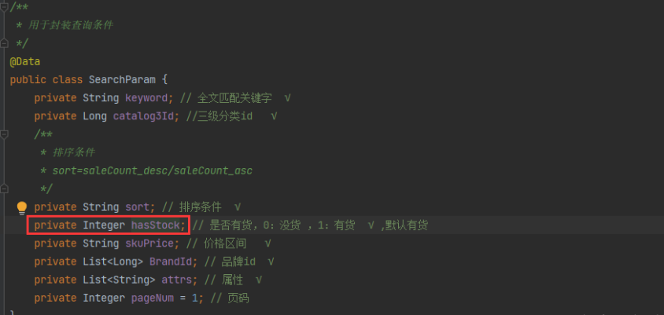


将分页大小设置为16 


动态获取页面显示数据 

①商品显示


 注意细节：th:text 会进行转义 ，th:utext不会进行转义


如果使用th:text，带keyword高亮之后，则会出现下面的结果：


 ②品牌显示


③分类显示 


④ 属性显示


## 6.2 商城业务-检索服务-页面筛选条件渲染

1.按品牌条件筛选,&quot="


2.按分类条件筛选


3.按属性条件筛选


4. url拼接函数编写


## 6.3 页面分页数据渲染

1.搜索栏功能完成


 为input创建id，方便后续拿到input中的输入；编写跳转方法

 


 搜索框回显搜索内容，th:value 为属性设置值 ；param是指请求参数，param.keyword是指

 请求参数中的keyword值


2.分页功能的完善


① 当前页码＞第一页才能显示上一页，当前页码＜总页码才能显示下一页


② 自定义属性用于保存当前页码，作用：用于替换请求参数中的pageNum值


③遍历显示页码


 


④ 当前页码显示特定的样式


⑤ 请求参数的替换

将a标签中href全部删除，添加a标签的class，为其绑定事件，并编写回调函数


$(this)指当前被点击的元素，return false作用：禁用默认行为，a标签可能会跳转


替换方法 

```javascript
function replaceParamVal(url,paramName,replaceVal){
        var oUrl = url.toString();
        var re = eval('/('+paramName+'=)([^&]*)/gi');
        var nUrl = oUrl.replace(re,paramName+'='+replaceVal);
        return nUrl;
    }
```


## 6.4 页面排序功能


为a标签定义class 


为a标签绑定点击事件 


为选中的元素设置样式


 为选中的元素设置样式之前需要将所有元素的样式恢复成最初样式


 


使用toggleClass()为class加上desc，默认为降序排序 


添加升降符号 

$(this).text()获取当前点击元素的文本内容


添加升降符号之前需要清空元素的升降符号


将被选中元素的样式改变抽取成一个方法 


```javascript
function changeStyle(ele){
        $(".sort_a").css({"color":"#333","border-color":"#CCC","background":"#FFF"})
        $(ele).css({"color":"#FFF","border-color":"#e4393c","background":"#e4393c"})
        $(ele).toggleClass("desc");
        $(".sort_a").each(function (){
            var text = $(this).text().replace("↓","").replace("↑","");
            $(this).text(text);
        });
        if ($(ele).hasClass("desc")){
            var text = $(ele).text().replace("↓","").replace("↑","");
            text = text+"↓";
            $(ele).text(text);
        }else {
            var text = $(ele).text().replace("↓","").replace("↑","");
            text = text+"↑";
            $(ele).text(text);
        }
    }
```


自定义属性赋值为某种排序


改写替换方法


```javascript
    function replaceOrAddParamVal(url,paramName,replaceVal){
        var oUrl = url.toString();
        if (oUrl.indexOf(paramName)!=-1){
            var re = eval('/('+paramName+'=)([^&]*)/gi');
            var nUrl = oUrl.replace(re,paramName+'='+replaceVal);
            return nUrl;
        }else {
            if (oUrl.indexOf("?")!=-1){
                var nUrl = oUrl+"&"+paramName+"="+replaceVal;
                return nUrl;
            }else {
                var nUrl = oUrl+"?"+paramName+"="+replaceVal;
                return nUrl;
            }
        }
    }
```


跳转指定路径


出现问题： 通过toggleClass()为class添加desc，刷新或者跳转之后会丢失

## 6.5 页面排序字段回显

页面跳转之后样式回显，th:with 用于声明变量，#strings即调用字符串工具类


根据URL动态添加class 


动态的添加升降符号 


## 6.6 页面价格区间搜索

编写价格区间搜索栏


为button按钮绑定单击事件 


价格回显 

①获取skuPirce的值


②价格区间回显 

\#strings.substringAfter(name,prefix)：获取prifix之后的字符串

\#strings.substringBefore(name,suffix)：获取suffix之前的字符串


拼接是否有货查询条件


为单选框绑定改变事件 


通过调用prop('check')获取是否被选中，选中为true否则false 


回显选中状态 


# ****7. 面包屑导航


 ①编写面包屑导航栏Vo


② 封装面包屑导航栏数据


属性名的获取要通过远程服务调用product服务进行查询 

①导入cloud的版本

```XML
<spring-cloud.version>Hoxton.SR9</spring-cloud.version>
```


② 导入cloud依赖管理

```XML
  <dependencyManagement>
        <dependencies>
            <dependency>
                <groupId>org.springframework.cloud</groupId>
                <artifactId>spring-cloud-dependencies</artifactId>
                <version>${spring-cloud.version}</version>
                <type>pom</type>
                <scope>import</scope>
            </dependency>
        </dependencies>
    </dependencyManagement>
```


③ 导入openfeign的依赖

```XML
        <dependency>
            <groupId>org.springframework.cloud</groupId>
            <artifactId>spring-cloud-starter-openfeign</artifactId>
        </dependency>
```


④ 开启远程服务调用功能


⑤编写接口，配置调用的服务名 


⑥编写调用服务的接口，注意：全路径


⑦编写自己传key和返回值类型获取自己想要的数据类型方法，之前的只能获取data的数据


⑧编写返回类型的Vo，Vo和AttrRespVo属性一致

 


⑨封装属性名 


# 8. 条件删除与URL编码问题

①封装原生的查询条件


HttpServletRequest的getQueryString()方法可以获取url的请求参数


②封装链接 


出现问题：路径替换失败

出现问题的原因：浏览器会将中文进行一个编码，而查询出来的属性值是中文


解决方案：将中文进行编码


注意：有些符号，浏览器的编码与java编码不一致

例如：'(':浏览器不进行编码，java会编码成%28;')'：浏览器不进行编码，java会编码成%29;空格浏览器会编码成%20，java会编码成'+'


```javascript
  // 8.封装面包屑导航栏的数据
        if (param.getAttrs()!=null && param.getAttrs().size()>0){
            List<SearchResVo.NavVo> navVoList = param.getAttrs().stream().map(item -> {
                SearchResVo.NavVo navVo = new SearchResVo.NavVo();
                String[] s = item.split("_");
                // 封装属性值
                navVo.setAttrValue(s[1]);
 
                //封装属性名
                R r = productFeignService.info(Long.parseLong(s[0]));
                if (r.getCode() == 0){
                    AttrResponseVo responseVo = r.getData("attr", new TypeReference<AttrResponseVo>() {});
                    navVo.setAttrName(responseVo.getAttrName());
                }else {
                    // 出现异常则封装id
                    navVo.setAttrName(s[0]);
                }
 
                //封装链接即去掉当前属性的查询的url封装
                String encode=null;
                try {
                    encode = URLEncoder.encode(item,"UTF-8");
                    encode=encode.replace("%28","(").replace("%29",")").replace("+","%20");
                } catch (UnsupportedEncodingException e) {
                    e.printStackTrace();
                }
                String replace = param.get_queryString().replace("&attrs=" + encode, "");
                navVo.setLink("http://search.gulimall.com/list.html?"+replace);
                return navVo;
            }).collect(Collectors.toList());
            searchResVo.setNavs(navVoList);
        }
```


导航栏回显编写

①右击检测，找到元素


 


改写 replaceOrAddParamVal默认是对属性进行一个替换,forceAdd是否强制添加的标识


# 9. 添加筛选联动

完善品牌面包屑导航栏功能，分类面包屑导航栏也类似，不同之处是不用剔除，设置url

①为面包屑vo设置一个默认值


② 远程调用product服务查询品牌名称


 


远程服务调用，查询很费时，可以将查询的结果保存进缓存中 ，例如：

value：分区名，key：用于标识第几号属性


③将封装替换url的方法抽取出来 


 


④编写面包屑导航栏功能


品牌面包屑导航栏，品牌筛选剔除


⑤创建一个list用于封装已经筛选的属性id


 